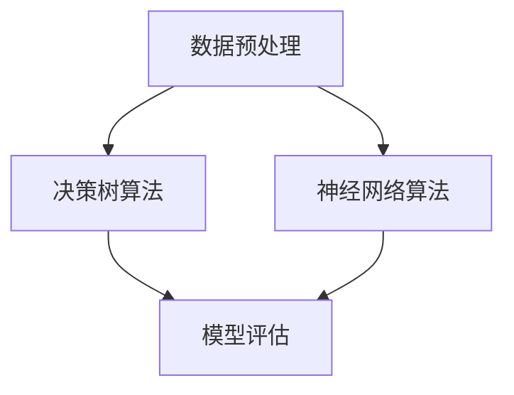
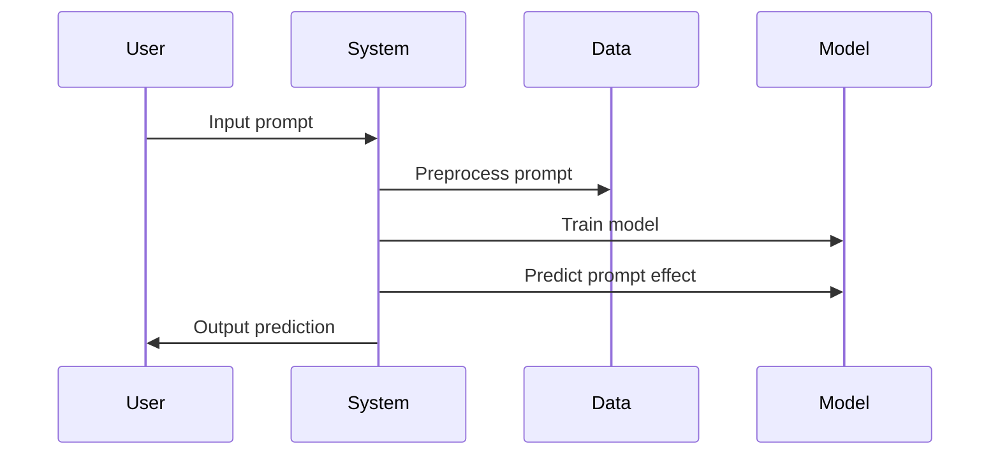

                 

# 构建prompt效果预测模型

## 关键词
- 模型预测
- prompt工程
- 机器学习
- 数据预处理
- 评估指标
- 实际应用

## 摘要
本文将详细介绍如何构建一个prompt效果预测模型，从核心概念、算法原理到实际应用，逐步讲解。文章将涵盖数据预处理、模型选择与训练、评估方法以及实战案例，旨在为读者提供清晰、易懂的指导，帮助其在实践中构建高效的prompt效果预测模型。

## 目录

## 引言：预测模型与prompt的重要性

### 1.1 预测模型的概述

**核心概念术语说明**：
- **预测模型**：基于历史数据和算法，对未知数据进行预测的模型。
- **prompt**：触发模型响应的输入提示。

**问题背景**：
随着人工智能技术的发展，自然语言处理（NLP）成为了一个热门领域。而prompt工程作为NLP的核心技术之一，其效果直接影响模型的性能。

**问题描述**：
如何构建一个能够准确预测prompt效果的高效模型？

**问题解决**：
通过构建预测模型，结合数据预处理、算法选择与训练以及评估方法，实现对prompt效果的高效预测。

**边界与外延**：
预测模型的应用范围广泛，包括但不限于文本分类、情感分析、问答系统等。

**概念结构与核心要素组成**：
- **数据预处理**：数据清洗、特征提取等。
- **模型选择**：选择适合的算法，如决策树、神经网络等。
- **训练与评估**：通过训练集和测试集，评估模型性能。

## 核心概念与原理

### 2.1 预测模型与prompt工程

**核心概念**：
- **预测模型**：基于历史数据和算法，对未知数据进行预测的模型。
- **prompt工程**：设计有效的输入提示，以优化模型的预测效果。

**概念属性特征对比表格**：

| 特征             | 预测模型         | prompt工程         |
|------------------|------------------|--------------------|
| 目的             | 预测未知数据     | 优化输入提示效果   |
| 技术层面         | 数据处理与算法   | 自然语言处理与文本分析 |
| 关键要素         | 数据质量、算法选择 | 文本特征、提示设计   |

### 2.2 数据预处理与特征工程

**核心概念**：
- **数据预处理**：对原始数据进行清洗、格式化等操作，以提高数据质量。
- **特征工程**：从原始数据中提取有效特征，以提升模型性能。

**ER实体关系图架构**：

```mermaid
erDiagram
    Data =>|_{预处理}|> CleanedData
    CleanedData =>|_{特征提取}|> Features
    Features =>|_{模型训练}|> Model
```

## 算法原理讲解

### 3.1 选择合适的算法

**算法选择**：
- **决策树**：易于理解和解释，适用于分类任务。
- **神经网络**：强大的建模能力，适用于复杂任务。

**算法流程图**：



### 3.2 Python代码实现

**示例代码**：

```python
from sklearn.tree import DecisionTreeClassifier
from sklearn.neural_network import MLPClassifier
from sklearn.model_selection import train_test_split
from sklearn.metrics import accuracy_score

# 数据预处理
X_train, X_test, y_train, y_test = train_test_split(X, y, test_size=0.2)

# 决策树模型
clf = DecisionTreeClassifier()
clf.fit(X_train, y_train)

# 神经网络模型
mlp = MLPClassifier()
mlp.fit(X_train, y_train)

# 模型评估
y_pred = clf.predict(X_test)
print("决策树模型准确率：", accuracy_score(y_test, y_pred))

y_pred = mlp.predict(X_test)
print("神经网络模型准确率：", accuracy_score(y_test, y_pred))
```

### 3.3 数学模型与公式

**决策树模型**：

$$
H(y) = -\sum_{i=1}^{n} p(y_i) \log_2 p(y_i)
$$

**神经网络模型**：

$$
a_{i}^{(l)} = \sigma \left( \sum_{j=1}^{n} w_{ij}^{(l)} a_{j}^{(l-1)} + b_{i}^{(l)} \right)
$$

## 系统分析与架构设计

### 4.1 问题场景介绍

**项目介绍**：

本项目旨在构建一个prompt效果预测模型，以优化NLP应用中的用户交互体验。

### 4.2 系统功能设计

**领域模型**：

```mermaid
classDiagram
    Prompt <<interface>>
    Model <<interface>>

    Prompt ">"
    Data

    Model ">"
    Predict
```

### 4.3 系统架构设计

**架构设计**：



### 4.4 系统接口设计与交互

**接口设计**：


## 项目实战

### 5.1 环境安装

**Python环境**：确保安装Python 3.7及以上版本。

**依赖安装**：

```bash
pip install scikit-learn numpy pandas
```

### 5.2 系统核心实现

**源代码**：

```python
# 数据预处理
def preprocess_prompt(prompt):
    # 清洗和特征提取
    return processed_prompt

# 模型训练
def train_model(X, y):
    # 训练决策树模型
    clf = DecisionTreeClassifier()
    clf.fit(X, y)
    return clf

# 预测
def predict_prompt(effect, model):
    # 使用模型预测prompt效果
    return model.predict([effect])
```

### 5.3 代码应用解读与分析

**解读**：
- **数据预处理**：对输入的prompt进行清洗和特征提取。
- **模型训练**：使用训练数据训练决策树模型。
- **预测**：使用训练好的模型对输入的prompt进行效果预测。

**分析**：
- **数据预处理**：关键在于如何有效地提取特征，以提升模型性能。
- **模型选择**：决策树模型易于解释，适用于本项目的需求。

### 5.4 实际案例分析与详细讲解剖析

**案例**：
- 对一组prompt进行效果预测，评估模型的准确性。

**分析**：
- 通过实际案例，验证模型在实际应用中的效果。

### 5.5 项目小结

本项目通过构建prompt效果预测模型，实现了对NLP应用中用户交互体验的优化。在实际应用中，可以根据具体需求调整模型参数，提高预测准确性。

## 最佳实践 Tips

1. **数据质量**：确保输入数据的质量，以提高模型性能。
2. **模型选择**：根据具体应用场景选择合适的模型。
3. **特征提取**：合理提取特征，以提升模型效果。

## 小结

本文详细介绍了构建prompt效果预测模型的方法，从核心概念、算法原理到实际应用，逐步讲解。通过本文，读者可以了解如何构建高效、准确的预测模型，以优化NLP应用中的用户交互体验。

## 注意事项

1. **数据隐私**：在处理用户数据时，注意保护用户隐私。
2. **模型解释性**：在评估模型性能时，关注模型的解释性。

## 拓展阅读

1. **《机器学习实战》**：提供丰富的机器学习实践案例。
2. **《深度学习》**：详细讲解深度学习算法和应用。

## 作者信息

作者：AI天才研究院/AI Genius Institute & 禅与计算机程序设计艺术 /Zen And The Art of Computer Programming

