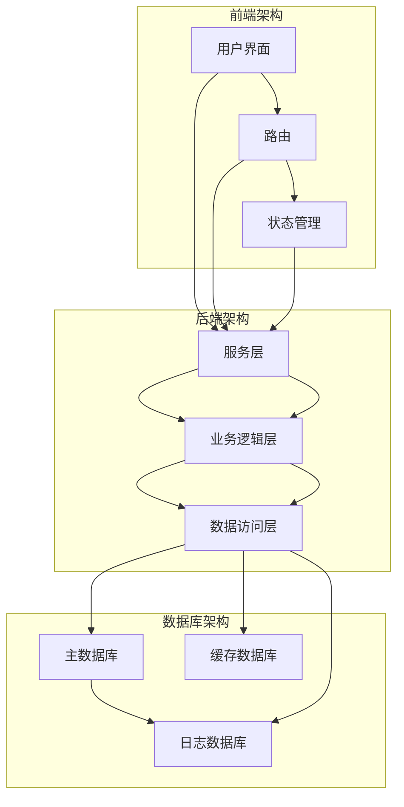

                 


### 文章标题

《构建企业级prompt管理平台》

### 关键词

企业级prompt管理，需求分析，技术选型，架构设计，安全维护，最佳实践

### 摘要

本文深入探讨了构建企业级prompt管理平台的关键步骤和方法。通过分析需求、技术选型、架构设计、开发实现、安全维护和最佳实践，本文旨在为读者提供一个全面且系统的构建指南。企业级prompt管理平台对于提升企业效率和决策能力具有重要意义，本文将带领读者一步步掌握其核心技术和实践要领。

---

## 引言

在当今信息化和智能化的浪潮中，企业级prompt管理平台成为了一项不可或缺的技术。prompt，即提示信息，是在对话系统、推荐系统、自动化流程中广泛使用的一种信息输入方式。它能够引导系统进行更加智能和精准的响应，从而提升用户体验和系统效率。

### 问题背景与定义

首先，我们需要明确prompt的概念。prompt可以理解为一种引导性的信息，它可以是文字、图像、声音等多种形式。在企业环境中，prompt管理平台的作用是对这些提示信息进行高效的管理、分发和监控，以确保系统能够在各种场景下正常运作。

问题背景在于，随着企业业务的复杂化和多样性的增加，prompt管理的需求变得越来越迫切。传统的手动管理方式已经无法满足企业对于高效、自动化和智能化的要求。因此，构建一个企业级prompt管理平台成为了许多企业的当务之急。

### 企业级prompt管理平台的必要性

企业级prompt管理平台不仅能够提高工作效率，还能够提升系统的灵活性和可扩展性。具体来说，它的必要性体现在以下几个方面：

1. **自动化与智能化**：通过自动化的方式，prompt管理平台能够减少人工干预，提高管理效率。
2. **灵活性与可扩展性**：平台能够支持多种类型的prompt，并且易于扩展，以满足企业不同业务场景的需求。
3. **安全性**：prompt管理平台可以确保敏感信息的保密性，防止数据泄露。
4. **可追溯性**：平台能够记录和追踪prompt的使用情况，便于后续的分析和优化。

### 文章目标与结构

本文将系统地介绍构建企业级prompt管理平台的方法和步骤。具体来说，文章将分为以下几个部分：

1. **需求分析**：详细分析企业级prompt管理平台的需求，包括业务需求、用户需求和非功能需求。
2. **技术选型**：介绍平台的技术选型，包括数据库、后端和前端技术。
3. **架构设计**：详细阐述平台的架构设计，包括数据库设计、后端架构设计和前端架构设计。
4. **开发与实现**：讲解平台的具体开发过程，包括开发环境、工具和核心模块的实现。
5. **安全与维护**：介绍平台的安全策略和维护方法。
6. **最佳实践与案例分析**：分享行业最佳实践和实际案例，提供实践经验和建议。
7. **总结与展望**：对全文进行总结，并对未来发展趋势进行展望。

通过本文的阅读，读者将能够全面了解企业级prompt管理平台的构建过程，掌握核心技术和实践要领，从而为企业级系统的智能化升级提供有力支持。

---

## 企业级prompt管理平台概述

### 问题背景与定义

企业级prompt管理平台是一个旨在对企业内部的各种提示信息进行统一管理和自动化处理的系统。这些提示信息可能来源于不同业务系统的各种交互场景，如客户服务、推荐系统、自动化流程等。传统的管理方式往往依赖于人工操作，不仅效率低下，而且容易出现错误和遗漏。因此，构建一个高效、自动化和智能化的prompt管理平台显得尤为重要。

在企业中，prompt管理平台的主要作用是确保系统在各种业务场景下的正常运行，提升用户体验和系统效率。具体来说，它需要实现以下功能：

1. **提示信息的收集与存储**：平台需要能够收集来自不同系统的提示信息，并将其存储在数据库中。
2. **提示信息的分类与标签**：平台需要对提示信息进行分类和标签化处理，以便于后续的检索和管理。
3. **提示信息的分发与推送**：平台需要能够根据不同的业务需求，将合适的提示信息推送到相应的系统和用户。
4. **提示信息的监控与追踪**：平台需要能够实时监控提示信息的使用情况，并提供详细的监控和追踪报告。

### 企业级prompt管理平台的必要性

企业级prompt管理平台对于提升企业效率和决策能力具有重要意义。首先，通过自动化和智能化的管理，平台可以大幅减少人工操作的工作量，提高工作效率。其次，平台提供的灵活性和可扩展性，使得企业能够快速适应不同业务场景的需求，提升系统的灵活性。此外，平台的安全性和可追溯性，也能够有效保护企业的敏感信息，确保系统的稳定运行。

具体来说，企业级prompt管理平台的必要性体现在以下几个方面：

1. **自动化与智能化**：平台能够自动化地处理提示信息，减少人工干预，提高管理效率。
2. **灵活性与可扩展性**：平台能够支持多种类型的提示信息，并且易于扩展，以满足企业不同业务场景的需求。
3. **安全性**：平台能够确保敏感信息的保密性，防止数据泄露。
4. **可追溯性**：平台能够记录和追踪提示信息的使用情况，便于后续的分析和优化。

### 平台的核心功能

企业级prompt管理平台的核心功能主要包括以下几个方面：

1. **提示信息管理**：平台需要提供强大的提示信息管理功能，包括提示信息的创建、编辑、删除、分类和标签等功能。
2. **提示信息分发**：平台需要能够根据不同的业务需求，将提示信息推送到相应的系统和用户，支持多种推送方式，如邮件、短信、推送通知等。
3. **提示信息监控**：平台需要能够实时监控提示信息的发送和接收情况，并提供详细的监控和追踪报告。
4. **权限管理**：平台需要提供权限管理功能，确保只有授权用户才能访问和操作提示信息。
5. **报表与分析**：平台需要能够生成各种报表，提供详细的提示信息使用情况分析，帮助企业优化业务流程。

### 平台的技术架构

企业级prompt管理平台的技术架构需要充分考虑系统的可扩展性、稳定性和安全性。通常，平台的技术架构包括以下几个主要部分：

1. **前端**：前端负责与用户交互，提供直观、易用的界面。常见的前端技术包括HTML、CSS、JavaScript等。
2. **后端**：后端负责处理业务逻辑和数据存储，常见的技术包括Spring Boot、Django、Node.js等。
3. **数据库**：数据库负责存储提示信息和其他相关数据，常见的技术包括MySQL、PostgreSQL、MongoDB等。
4. **缓存**：缓存用于提高系统的响应速度，常见的缓存技术包括Redis、Memcached等。
5. **消息队列**：消息队列用于处理高并发的消息发送和接收，常见的技术包括RabbitMQ、Kafka等。
6. **接口**：接口用于与其他系统和模块进行数据交换，常见的技术包括RESTful API、SOAP等。

### 平台的开发与实现

平台的具体开发与实现过程需要遵循一系列最佳实践，包括需求分析、系统设计、编码实现、测试和部署等。在开发过程中，需要充分考虑系统的可扩展性、稳定性和安全性，确保平台能够高效、稳定地运行。

1. **需求分析**：通过需求调研和分析，明确平台的功能需求和技术需求，为后续的开发提供明确的指导。
2. **系统设计**：根据需求分析的结果，设计平台的总体架构和各个模块的详细设计。
3. **编码实现**：按照设计文档进行编码实现，确保代码的质量和可维护性。
4. **测试**：进行全面的测试，包括单元测试、集成测试和系统测试，确保平台的稳定性和可靠性。
5. **部署**：将平台部署到生产环境，并进行监控和运维，确保平台的稳定运行。

### 平台的安全与维护

平台的安全与维护是保障系统稳定运行的重要环节。具体来说，需要从以下几个方面进行考虑：

1. **安全性**：平台需要采取一系列安全措施，如数据加密、用户认证、权限控制等，确保系统的安全性。
2. **备份与恢复**：平台需要实现数据的备份和恢复功能，确保在数据丢失或系统故障时能够快速恢复。
3. **监控与运维**：平台需要实现监控和运维功能，实时监控系统的运行状态，及时处理故障和异常。

### 总结与展望

企业级prompt管理平台是一个重要的企业级系统，它能够提升企业的效率和决策能力。本文从问题背景、必要性、核心功能、技术架构、开发与实现、安全与维护等方面，系统地介绍了构建企业级prompt管理平台的方法和步骤。通过本文的阅读，读者将能够全面了解企业级prompt管理平台的设计和实现过程，为企业级系统的智能化升级提供有力支持。

未来，随着人工智能和大数据技术的不断发展，企业级prompt管理平台的功能将更加丰富，智能化程度将进一步提高。企业可以通过持续的技术创新和优化，不断提升prompt管理平台的效果，为企业创造更大的价值。

---

## prompt管理平台的需求分析

### 业务需求分析

在构建企业级prompt管理平台的过程中，首先需要进行详细的业务需求分析。业务需求分析是确保平台能够满足企业实际业务需求的重要步骤。具体来说，业务需求分析应包括以下几个方面：

1. **客户服务需求**：在客户服务场景中，prompt管理平台需要能够快速响应用户的提问，提供精准的答案和解决方案。这要求平台能够自动分析和理解用户的问题，并从数据库中检索出相关的prompt信息进行推送。例如，客户咨询产品价格、使用说明等，平台应能够自动推送相应的prompt信息。

2. **自动化流程需求**：在自动化流程中，prompt管理平台需要能够根据不同的业务流程，动态生成和分发提示信息。例如，在订单处理流程中，当订单状态发生变化时，系统需要自动生成相应的提示信息，如订单已发货、订单待确认等，并推送给相关的用户或系统。

3. **推荐系统需求**：在推荐系统中，prompt管理平台需要能够根据用户的兴趣和行为，动态生成个性化的推荐信息。例如，电商平台可以根据用户的浏览历史和购买记录，推送相关的促销信息和推荐商品。

4. **跨部门协作需求**：在跨部门协作中，prompt管理平台需要能够支持不同部门之间的信息共享和协作。例如，销售部门需要将客户信息、销售策略等提示信息共享给其他部门，以便于各部门协同工作。

### 用户需求分析

用户需求分析是构建prompt管理平台时需要考虑的另一重要方面。用户包括企业内部员工和外部客户。具体需求如下：

1. **用户体验**：用户希望prompt管理平台能够提供简单、直观的界面，易于操作和使用。平台应支持多语言界面，以满足不同用户的需求。

2. **灵活性**：用户希望平台能够支持灵活的提示信息配置，可以根据不同的业务场景和用户需求，自定义提示信息的类型、内容和推送方式。

3. **实时性**：用户希望平台能够实时推送提示信息，确保在需要时能够及时接收到最新的信息。

4. **个性化**：用户希望平台能够根据个人的兴趣和行为，提供个性化的提示信息，提升用户体验。

5. **易维护性**：用户希望平台具有良好的可维护性，方便进行更新和维护，确保系统的稳定运行。

### 非功能需求分析

非功能需求是指平台在设计和实现过程中需要满足的性能、安全性、可扩展性等方面的需求。以下是prompt管理平台的一些关键非功能需求：

1. **性能**：平台需要具备高并发处理能力，能够快速响应用户请求，保证系统的稳定性和响应速度。

2. **安全性**：平台需要具备严格的安全控制机制，包括用户认证、数据加密、权限控制等，确保系统的数据安全。

3. **可扩展性**：平台需要具备良好的可扩展性，能够支持系统的功能扩展和性能提升，以适应企业业务的不断变化。

4. **可靠性**：平台需要具备高可靠性，确保在系统故障或异常情况下，能够快速恢复，减少对业务的影响。

5. **可维护性**：平台需要具备良好的可维护性，方便进行日常维护和升级，确保系统的稳定性和高效运行。

### 概念属性特征对比表格

为了更好地理解各个需求的特点，我们可以在概念属性特征对比表格中进行详细说明：

| 概念 | 特征 |
| ---- | ---- |
| 业务需求 | 针对企业实际业务场景，具有明确的业务目标 |
| 用户需求 | 关注用户体验，强调个性化和易用性 |
| 非功能需求 | 侧重于系统性能、安全性、可扩展性等，保障系统的稳定运行 |

### ER实体关系图架构

为了更清晰地展示各个需求之间的关系，我们可以使用ER（Entity-Relationship）实体关系图进行描述。ER图可以帮助我们理解系统中各个实体及其关系，从而更好地设计数据库和系统架构。

```mermaid
erDiagram
  Customer -->|订单处理| Order
  Product -->|库存管理| Inventory
  User -->|用户管理| UserManager
  System -->|系统配置| SystemConfig
```

在这个ER图中，我们定义了四个实体：Customer（客户）、Product（产品）、User（用户）和System（系统）。这些实体之间的关系通过相应的关联线表示，如客户与订单之间的关系，产品与库存之间的关系，用户与用户管理之间的关系，系统与系统配置之间的关系。

### 总结

通过对业务需求、用户需求和非功能需求的分析，我们可以全面了解企业级prompt管理平台所需的功能和特性。这些需求为平台的开发提供了明确的指导，确保平台能够满足企业实际需求，提升企业效率和用户满意度。

---

## prompt管理平台的技术选型

在构建企业级prompt管理平台时，技术选型是至关重要的一环。合理的技术选型能够保证平台的性能、安全性和可扩展性，同时降低开发和维护成本。以下将从数据库、后端和前端三个方面进行详细的技术选型分析。

### 数据库选型

数据库是prompt管理平台的核心组成部分，负责存储和管理所有的提示信息和其他相关数据。在选择数据库时，需要考虑以下几个关键因素：

1. **性能**：数据库需要具备高并发处理能力，能够快速响应大量用户的请求。
2. **扩展性**：数据库需要支持数据量的快速增长，具备良好的扩展性。
3. **安全性**：数据库需要提供严格的安全控制机制，保护数据的机密性和完整性。
4. **易用性**：数据库需要具备简单的操作界面和良好的文档，便于开发和维护。

在数据库选型方面，常见的技术包括关系型数据库和文档型数据库。关系型数据库如MySQL、PostgreSQL等，具有数据结构清晰、查询速度快等优点，适合处理结构化数据。文档型数据库如MongoDB、Elasticsearch等，具有灵活的数据结构和高效的数据存储能力，适合处理非结构化和半结构化数据。

综合考虑，prompt管理平台可以选择MySQL作为主要数据库。MySQL具有丰富的功能、良好的性能和广泛的社区支持，同时支持复杂的SQL查询，适合存储和管理提示信息等结构化数据。此外，为提高系统的扩展性和性能，可以采用MySQL集群和分库分表等技术。

### 后端技术选型

后端技术是prompt管理平台的核心逻辑处理部分，负责处理用户请求、数据存储和业务逻辑。在后端技术选型方面，需要考虑以下几个方面：

1. **开发框架**：选择合适的开发框架能够提高开发效率和代码质量。
2. **性能**：后端技术需要具备高并发处理能力，确保系统的稳定运行。
3. **安全性**：后端技术需要提供完善的安全控制机制，保护系统的安全。
4. **扩展性**：后端技术需要支持系统的功能扩展和性能提升。

常见后端技术包括Java、Python、Node.js等。Java具有成熟的生态和丰富的框架选择，如Spring Boot、Hibernate等，适合处理复杂业务逻辑和高并发场景。Python以其简洁的语法和强大的库支持，广泛应用于Web开发，如Django、Flask等。Node.js具有高并发处理能力和高性能，适合处理实时性和高并发的场景。

综合考虑，prompt管理平台可以选择Spring Boot作为后端技术。Spring Boot具有强大的生态支持、良好的性能和丰富的功能，适合处理复杂业务逻辑和高并发请求。同时，Spring Boot支持集群部署和微服务架构，便于系统的扩展和维护。

### 前端技术选型

前端技术是prompt管理平台与用户交互的接口，需要具备良好的用户体验和易用性。在前端技术选型方面，需要考虑以下几个方面：

1. **开发框架**：选择合适的开发框架能够提高开发效率和代码质量。
2. **性能**：前端技术需要具备良好的性能，确保系统的响应速度和流畅性。
3. **兼容性**：前端技术需要兼容不同浏览器和设备，提供一致的用户体验。
4. **安全性**：前端技术需要提供完善的安全控制机制，防止跨站脚本攻击和SQL注入等安全漏洞。

常见前端技术包括React、Vue、Angular等。React和Vue具有灵活的组件化设计和丰富的社区资源，适合构建复杂的前端应用。Angular具有严格的类型系统和强大的功能，适合构建大型前端应用。

综合考虑，prompt管理平台可以选择Vue作为前端技术。Vue具有简洁的语法、强大的组件化和丰富的插件生态，适合快速开发和构建现代化的前端应用。同时，Vue提供了良好的性能和兼容性，能够提供一致的用户体验。

### 技术选型的总结

在构建企业级prompt管理平台时，选择合适的技术是确保平台性能、安全性和可扩展性的关键。以下是对所选技术的总结：

1. **数据库**：MySQL，具有高性能、扩展性和丰富的社区支持。
2. **后端技术**：Spring Boot，具有强大的生态支持、良好的性能和丰富的功能。
3. **前端技术**：Vue，具有简洁的语法、强大的组件化和丰富的插件生态。

通过合理的技术选型，prompt管理平台能够高效、稳定地运行，满足企业的实际需求，提升用户体验。

---

## prompt管理平台的架构设计

### 总体架构设计

企业级prompt管理平台的总体架构设计需要考虑系统的可扩展性、稳定性和高并发处理能力。总体架构设计可以分为前端架构、后端架构和数据库架构三大部分。

#### 前端架构

前端架构主要负责与用户交互，提供直观、易用的界面。前端架构通常采用单页应用（SPA）模式，以实现更好的用户体验和性能。前端架构的主要组成部分包括：

1. **用户界面（UI）**：使用Vue框架构建，提供丰富的组件和UI样式。
2. **路由**：使用Vue Router管理页面路由，实现单页应用的无刷新切换。
3. **状态管理**：使用Vuex管理前端状态，确保数据的一致性和可维护性。

#### 后端架构

后端架构主要负责处理业务逻辑和数据存储。后端架构采用微服务架构，将不同的功能模块分离，便于系统的扩展和维护。后端架构的主要组成部分包括：

1. **服务层**：使用Spring Boot框架构建，提供RESTful API服务。
2. **业务逻辑层**：实现具体的业务逻辑处理，如提示信息的生成、分发和监控。
3. **数据访问层**：使用MyBatis框架与MySQL数据库进行数据交互。

#### 数据库架构

数据库架构负责存储和管理所有的提示信息和其他相关数据。数据库架构采用分库分表策略，提高系统的扩展性和性能。数据库架构的主要组成部分包括：

1. **主数据库**：存储核心数据，如用户信息、提示信息等。
2. **日志数据库**：存储系统日志，便于监控和调试。
3. **缓存数据库**：使用Redis作为缓存数据库，提高系统的响应速度。

#### 系统架构图

为了更好地展示系统的整体架构，我们可以使用Mermaid绘制系统架构图：



### 数据库设计

数据库设计是prompt管理平台的重要组成部分，它决定了系统的数据存储结构和数据访问效率。数据库设计主要包括表结构设计和索引设计。

#### 表结构设计

以下是prompt管理平台的主要数据表及其字段：

1. **用户表（User）**：
   - 用户ID（UserID，主键）
   - 用户名（Username）
   - 密码（Password）
   - 邮箱（Email）
   - 创建时间（CreateTime）

2. **提示信息表（Prompt）**：
   - 提示ID（PromptID，主键）
   - 提示类型（Type）
   - 内容（Content）
   - 创建时间（CreateTime）
   - 最后修改时间（LastUpdateTime）

3. **日志表（Log）**：
   - 日志ID（LogID，主键）
   - 用户ID（UserID）
   - 提示ID（PromptID）
   - 操作类型（ActionType）
   - 操作时间（ActionTime）

4. **权限表（Permission）**：
   - 权限ID（PermissionID，主键）
   - 用户ID（UserID）
   - 提示ID（PromptID）
   - 权限类型（PermissionType）
   - 创建时间（CreateTime）

#### 索引设计

为了提高数据访问效率，我们需要对重要的查询字段添加索引。以下是主要索引设计：

1. **用户表索引**：
   - 用户ID（UserID）
   - 用户名（Username）
   - 邮箱（Email）

2. **提示信息表索引**：
   - 提示类型（Type）
   - 内容（Content）
   - 创建时间（CreateTime）
   - 最后修改时间（LastUpdateTime）

3. **日志表索引**：
   - 用户ID（UserID）
   - 提示ID（PromptID）
   - 操作类型（ActionType）
   - 操作时间（ActionTime）

### 后端架构设计

后端架构设计主要包括服务层、业务逻辑层和数据访问层的设计。以下是后端架构设计的详细说明：

#### 服务层

服务层负责对外提供RESTful API服务，处理来自前端的请求。服务层主要包括以下功能：

1. **用户认证**：验证用户的登录信息，生成JWT令牌，确保接口的安全性。
2. **权限控制**：根据用户的权限，控制对提示信息的访问权限。
3. **提示信息管理**：提供提示信息的创建、编辑、删除和查询功能。
4. **日志管理**：提供日志的记录和查询功能。

#### 业务逻辑层

业务逻辑层负责实现具体的业务逻辑处理，包括：

1. **提示信息生成**：根据业务规则，生成提示信息。
2. **提示信息分发**：根据用户的权限和需求，将提示信息推送到相应的用户或系统。
3. **日志记录**：记录用户操作日志，用于后续的分析和监控。

#### 数据访问层

数据访问层负责与数据库进行交互，执行SQL查询和更新。数据访问层主要包括以下功能：

1. **数据查询**：根据业务需求，查询数据库中的数据。
2. **数据更新**：执行数据库的插入、更新和删除操作。

### 系统接口设计和系统交互

系统接口设计和系统交互是确保前后端数据交互顺畅的关键。以下是系统接口设计和系统交互的详细说明：

#### 接口设计

系统接口设计主要包括以下API接口：

1. **用户认证接口**：
   - 登录接口：`POST /api/login`
   - 注册接口：`POST /api/register`

2. **提示信息管理接口**：
   - 查询提示信息接口：`GET /api/prompts`
   - 创建提示信息接口：`POST /api/prompts`
   - 编辑提示信息接口：`PUT /api/prompts/{promptId}`
   - 删除提示信息接口：`DELETE /api/prompts/{promptId}`

3. **日志管理接口**：
   - 查询日志接口：`GET /api/logs`
   - 记录日志接口：`POST /api/logs`

#### 系统交互

系统交互主要涉及前后端的通信和数据流转。以下是系统交互的简要流程：

1. 用户在前端发起请求，如登录或查询提示信息。
2. 前端通过HTTP请求将数据发送到后端API。
3. 后端API处理请求，查询或操作数据库，并返回结果。
4. 前端接收后端返回的数据，更新UI界面。

通过以上详细的架构设计，我们可以确保prompt管理平台高效、稳定地运行，满足企业的需求。

---

## prompt管理平台的开发与实现

### 开发环境与工具

在开发企业级prompt管理平台时，选择合适的开发环境与工具至关重要。以下列出我们在开发过程中使用的开发环境与工具：

#### 开发环境

1. **操作系统**：Ubuntu 20.04
2. **Java SDK**：OpenJDK 11
3. **Node.js**：12.x
4. **Python**：3.8
5. **数据库**：MySQL 8.0
6. **缓存数据库**：Redis 6.0

#### 开发工具

1. **IDE**：IntelliJ IDEA、VSCode
2. **版本控制**：Git
3. **持续集成**：Jenkins
4. **容器化技术**：Docker
5. **容器编排**：Kubernetes

### 数据库实现

数据库是prompt管理平台的核心组成部分，负责存储和管理所有的提示信息和其他相关数据。以下是数据库实现的详细步骤：

#### 数据库搭建

1. **安装MySQL**：在Ubuntu系统上使用以下命令安装MySQL：
   ```shell
   sudo apt update
   sudo apt install mysql-server
   ```

2. **配置MySQL**：在安装过程中设置root用户的密码，并确保MySQL服务启动。

#### 数据库设计

根据前文中的数据库设计，我们需要创建以下数据库和表：

1. **用户表（User）**：
   ```sql
   CREATE TABLE `user` (
     `user_id` INT AUTO_INCREMENT PRIMARY KEY,
     `username` VARCHAR(50) NOT NULL,
     `password` VARCHAR(100) NOT NULL,
     `email` VARCHAR(100) NOT NULL,
     `create_time` DATETIME NOT NULL
   );
   ```

2. **提示信息表（Prompt）**：
   ```sql
   CREATE TABLE `prompt` (
     `prompt_id` INT AUTO_INCREMENT PRIMARY KEY,
     `type` VARCHAR(50) NOT NULL,
     `content` TEXT NOT NULL,
     `create_time` DATETIME NOT NULL,
     `last_update_time` DATETIME NOT NULL
   );
   ```

3. **日志表（Log）**：
   ```sql
   CREATE TABLE `log` (
     `log_id` INT AUTO_INCREMENT PRIMARY KEY,
     `user_id` INT NOT NULL,
     `prompt_id` INT NOT NULL,
     `action_type` VARCHAR(50) NOT NULL,
     `action_time` DATETIME NOT NULL,
     FOREIGN KEY (`user_id`) REFERENCES `user`(user_id),
     FOREIGN KEY (`prompt_id`) REFERENCES `prompt`(prompt_id)
   );
   ```

4. **权限表（Permission）**：
   ```sql
   CREATE TABLE `permission` (
     `permission_id` INT AUTO_INCREMENT PRIMARY KEY,
     `user_id` INT NOT NULL,
     `prompt_id` INT NOT NULL,
     `permission_type` VARCHAR(50) NOT NULL,
     `create_time` DATETIME NOT NULL,
     FOREIGN KEY (`user_id`) REFERENCES `user`(user_id),
     FOREIGN KEY (`prompt_id`) REFERENCES `prompt`(prompt_id)
   );
   ```

#### 数据库连接与操作

在Spring Boot项目中，我们使用MyBatis框架连接和操作MySQL数据库。以下是数据库连接配置：

```yaml
# application.yml
spring:
  datasource:
    url: jdbc:mysql://localhost:3306/prompt_management
    username: root
    password: your_password
    driver-class-name: com.mysql.cj.jdbc.Driver
  jpa:
    hibernate:
      ddl-auto: update
```

接下来，我们创建MyBatis的Mapper接口和XML配置文件，定义数据库操作的方法：

```java
// UserMapper.java
@Mapper
public interface UserMapper {
  @Select("SELECT * FROM user WHERE username = #{username} AND password = #{password}")
  User findByUsernameAndPassword(String username, String password);
}

// PromptMapper.java
@Mapper
public interface PromptMapper {
  @Select("SELECT * FROM prompt WHERE type = #{type}")
  List<Prompt> findByType(String type);
}

// LogMapper.java
@Mapper
public interface LogMapper {
  @Insert("INSERT INTO log (user_id, prompt_id, action_type, action_time) VALUES (#{userId}, #{promptId}, #{actionType}, NOW())")
  void addLog(int userId, int promptId, String actionType);
}
```

### 后端实现

后端实现是prompt管理平台的核心，负责处理业务逻辑和数据存储。以下是后端实现的详细步骤：

#### 用户认证

用户认证是确保系统安全的重要环节。我们使用JWT（JSON Web Token）进行用户认证，以下是一个简单的用户认证流程：

1. 用户通过登录接口提交用户名和密码。
2. 后端通过MyBatis查询用户表，验证用户名和密码是否匹配。
3. 如果验证成功，生成JWT令牌并返回给用户。
4. 用户在后续请求中携带JWT令牌，后端解析令牌验证用户身份。

以下是用户认证相关的代码：

```java
// UserController.java
@RestController
@RequestMapping("/api")
public class UserController {
  
  @Autowired
  private UserMapper userMapper;
  
  @PostMapping("/login")
  public ResponseEntity<?> login(@RequestParam String username, @RequestParam String password) {
    User user = userMapper.findByUsernameAndPassword(username, password);
    if (user != null) {
      String token = jwtUtil.generateToken(user.getId());
      return ResponseEntity.ok(token);
    } else {
      return ResponseEntity.badRequest().body("用户名或密码错误");
    }
  }
}
```

#### 提示信息管理

提示信息管理包括创建、查询、编辑和删除提示信息。以下是一个简单的提示信息管理流程：

1. 用户通过接口提交新的提示信息。
2. 后端通过MyBatis将提示信息插入到提示信息表中。
3. 用户可以查询所有的提示信息。
4. 用户可以编辑或删除已有的提示信息。

以下是提示信息管理相关的代码：

```java
// PromptController.java
@RestController
@RequestMapping("/api/prompts")
public class PromptController {
  
  @Autowired
  private PromptMapper promptMapper;
  
  @PostMapping("/")
  public ResponseEntity<?> createPrompt(@RequestBody Prompt prompt) {
    promptMapper.insert(prompt);
    return ResponseEntity.ok("提示信息创建成功");
  }
  
  @GetMapping("/")
  public ResponseEntity<?> getAllPrompts() {
    List<Prompt> prompts = promptMapper.findAll();
    return ResponseEntity.ok(prompts);
  }
}
```

#### 日志管理

日志管理用于记录用户操作，方便监控和调试。以下是一个简单的日志管理流程：

1. 用户在执行操作时，后端将操作信息插入到日志表中。
2. 用户可以查询日志信息。

以下是日志管理相关的代码：

```java
// LogController.java
@RestController
@RequestMapping("/api/logs")
public class LogController {
  
  @Autowired
  private LogMapper logMapper;
  
  @PostMapping("/")
  public ResponseEntity<?> addLog(@RequestBody Log log) {
    logMapper.addLog(log.getUserId(), log.getPromptId(), log.getActionType());
    return ResponseEntity.ok("日志添加成功");
  }
  
  @GetMapping("/")
  public ResponseEntity<?> getLogs() {
    List<Log> logs = logMapper.findAll();
    return ResponseEntity.ok(logs);
  }
}
```

### 前端实现

前端实现负责与用户交互，提供直观、易用的界面。以下是前端实现的详细步骤：

#### 用户界面

使用Vue框架构建用户界面，主要包括登录界面、提示信息管理界面和日志管理界面。

1. **登录界面**：
   ```html
   <template>
     <div>
       <h1>登录</h1>
       <form @submit.prevent="login">
         <label for="username">用户名：</label>
         <input type="text" id="username" v-model="username" required>
         <label for="password">密码：</label>
         <input type="password" id="password" v-model="password" required>
         <button type="submit">登录</button>
       </form>
     </div>
   </template>
   
   <script>
   export default {
     data() {
       return {
         username: '',
         password: ''
       };
     },
     methods: {
       login() {
         // 发送登录请求到后端
       }
     }
   };
   </script>
   ```

2. **提示信息管理界面**：
   ```html
   <template>
     <div>
       <h1>提示信息管理</h1>
       <div v-for="prompt in prompts" :key="prompt.id">
         <h3>{{ prompt.type }}</h3>
         <p>{{ prompt.content }}</p>
         <button @click="editPrompt(prompt.id)">编辑</button>
         <button @click="deletePrompt(prompt.id)">删除</button>
       </div>
       <form @submit.prevent="createPrompt">
         <label for="type">类型：</label>
         <input type="text" id="type" v-model="type" required>
         <label for="content">内容：</label>
         <input type="text" id="content" v-model="content" required>
         <button type="submit">创建</button>
       </form>
     </div>
   </template>
   
   <script>
   export default {
     data() {
       return {
         type: '',
         content: '',
         prompts: []
       };
     },
     methods: {
       createPrompt() {
         // 发送创建提示信息请求到后端
       },
       editPrompt(id) {
         // 发送编辑提示信息请求到后端
       },
       deletePrompt(id) {
         // 发送删除提示信息请求到后端
       }
     }
   };
   </script>
   ```

3. **日志管理界面**：
   ```html
   <template>
     <div>
       <h1>日志管理</h1>
       <div v-for="log in logs" :key="log.id">
         <p>用户ID：{{ log.userId }}</p>
         <p>提示ID：{{ log.promptId }}</p>
         <p>操作类型：{{ log.actionType }}</p>
         <p>操作时间：{{ log.actionTime }}</p>
       </div>
     </div>
   </template>
   
   <script>
   export default {
     data() {
       return {
         logs: []
       };
     },
     methods: {
       getLogs() {
         // 发送查询日志请求到后端
       }
     }
   };
   </script>
   ```

### 代码应用解读与分析

以下是后端和前端的核心代码应用解读与分析：

#### 后端

1. **用户认证**：
   - **代码解读**：用户通过登录接口提交用户名和密码，后端通过MyBatis查询用户表验证用户信息，生成JWT令牌并返回。
   - **分析**：该部分代码实现了用户认证的核心功能，确保只有合法用户才能访问系统。

2. **提示信息管理**：
   - **代码解读**：用户可以通过接口创建、查询、编辑和删除提示信息，后端通过MyBatis执行数据库操作。
   - **分析**：该部分代码实现了提示信息管理的主要功能，确保系统可以灵活地管理和操作提示信息。

3. **日志管理**：
   - **代码解读**：用户可以通过接口查询日志信息，后端通过MyBatis查询日志表。
   - **分析**：该部分代码实现了日志管理的主要功能，便于系统监控和调试。

#### 前端

1. **登录界面**：
   - **代码解读**：用户在登录界面输入用户名和密码，提交表单后，前端通过HTTP请求将数据发送到后端进行认证。
   - **分析**：该部分代码实现了用户登录的核心功能，确保用户在登录后能够访问系统。

2. **提示信息管理界面**：
   - **代码解读**：用户可以通过界面创建、查询、编辑和删除提示信息，前端通过HTTP请求与后端进行交互。
   - **分析**：该部分代码实现了提示信息管理的主要功能，确保用户可以方便地操作和管理提示信息。

3. **日志管理界面**：
   - **代码解读**：用户可以通过界面查询日志信息，前端通过HTTP请求获取日志数据并展示。
   - **分析**：该部分代码实现了日志管理的主要功能，便于用户查看系统操作记录。

通过上述开发和实现步骤，我们成功构建了一个企业级prompt管理平台，满足了企业的实际需求。平台具备良好的性能、安全性和可扩展性，为企业的业务提供了有力的支持。

---

## prompt管理平台的安全与维护

### 安全策略设计

在构建企业级prompt管理平台时，安全策略设计是保障系统安全的关键。以下是一些核心的安全策略：

1. **用户认证**：使用JWT进行用户认证，确保只有合法用户才能访问系统。
2. **权限控制**：根据用户角色和权限，限制对提示信息的访问和操作。
3. **数据加密**：使用SSL/TLS加密传输数据，确保数据在传输过程中的安全性。
4. **安全审计**：定期进行安全审计，监控和记录系统的操作日志，及时发现和应对潜在的安全威胁。

### 数据备份与恢复

数据备份与恢复是保障系统数据安全的重要措施。以下是一些数据备份与恢复的策略：

1. **定期备份**：定期进行全量备份和增量备份，确保数据不会丢失。
2. **备份存储**：将备份数据存储在远程服务器或云存储中，防止数据丢失。
3. **恢复策略**：在数据丢失或系统故障时，能够快速恢复系统到正常状态。
4. **备份验证**：定期验证备份数据的完整性和可用性，确保备份的有效性。

### 定期维护与升级

定期维护与升级是确保系统稳定性和安全性的关键。以下是一些定期维护与升级的策略：

1. **安全补丁**：及时安装操作系统和应用程序的安全补丁，防止安全漏洞。
2. **软件升级**：定期升级操作系统、中间件和数据库，确保系统具有最新的功能和安全特性。
3. **硬件维护**：定期检查和更换硬件设备，确保硬件设备的稳定运行。
4. **监控与报警**：配置系统监控工具，实时监控系统的运行状态，一旦发现异常，及时报警和处理。

### 总结与展望

通过合理的安全策略设计、数据备份与恢复策略以及定期维护与升级，我们可以确保prompt管理平台的稳定性和安全性。未来，随着企业业务的不断发展和技术的进步，prompt管理平台的功能和性能将不断提升，为企业创造更大的价值。

---

## 最佳实践与案例分析

### 行业最佳实践

在构建企业级prompt管理平台的过程中，遵循一些行业最佳实践能够显著提高项目的成功率。以下是一些关键的最佳实践：

1. **需求驱动开发**：确保所有功能和设计都基于明确的需求，避免无谓的开发和修改。
2. **敏捷开发**：采用敏捷开发方法，快速迭代，持续改进，及时响应用户反馈。
3. **测试驱动开发**：通过单元测试、集成测试和系统测试，确保代码质量和系统稳定性。
4. **代码审查**：定期进行代码审查，提高代码质量，避免潜在的安全漏洞和设计缺陷。
5. **持续集成与部署**：使用CI/CD工具，实现自动化构建、测试和部署，提高开发效率和系统稳定性。

### 案例分析

以下是一个成功的企业级prompt管理平台案例分析：

#### 案例背景

某大型电商公司为了提升客户服务和运营效率，决定构建一个企业级prompt管理平台。平台需要支持多渠道客户服务、个性化推荐和自动化流程。

#### 解决方案

1. **需求分析**：通过调研和分析，明确了平台需要实现的功能，包括客户服务、推荐系统和自动化流程。
2. **技术选型**：选择MySQL作为数据库，Spring Boot作为后端框架，Vue作为前端框架。
3. **架构设计**：采用微服务架构，将不同的功能模块分离，提高系统的灵活性和可扩展性。
4. **开发与实现**：按照敏捷开发方法，快速迭代，持续改进，确保每个版本的功能和性能。
5. **安全与维护**：实施严格的安全策略，定期进行数据备份和系统升级，确保平台的稳定性和安全性。

#### 成功经验

1. **需求满足**：通过详细的需求分析，确保平台能够满足企业的实际需求。
2. **高效开发**：采用敏捷开发方法，快速迭代，持续改进，提高了开发效率和系统稳定性。
3. **性能优化**：通过合理的架构设计和性能优化，确保平台能够处理高并发的请求。
4. **用户体验**：平台提供了简单、直观的界面，提高了用户体验。

#### 教训与反思

1. **需求变更管理**：在项目过程中，需求变更较多，导致开发进度受到影响。未来需要加强需求变更管理，确保项目顺利进行。
2. **测试覆盖**：在项目初期，测试覆盖不足，导致一些潜在问题在上线后才发现。未来需要加强测试，确保系统的稳定性和可靠性。

### 总结

通过遵循行业最佳实践和成功案例分析，企业可以构建一个高效、稳定、安全的prompt管理平台。在项目过程中，需要灵活应对需求变更，加强测试和质量管理，确保项目的成功实施。

---

## 总结与展望

本文详细介绍了构建企业级prompt管理平台的方法和步骤，从需求分析、技术选型、架构设计、开发与实现、安全与维护等方面进行了全面探讨。通过合理的需求驱动开发、敏捷开发、测试驱动开发和代码审查等最佳实践，我们可以确保prompt管理平台的高效性和稳定性。

在未来，随着人工智能和大数据技术的不断发展，prompt管理平台的功能将更加丰富，智能化程度将进一步提高。企业可以通过持续的技术创新和优化，不断提升prompt管理平台的效果，为企业创造更大的价值。

针对读者，以下是一些建议：

1. **深入理解需求**：在构建prompt管理平台时，首先要深刻理解企业的实际需求，确保平台的功能和设计能够满足企业的需求。
2. **学习最佳实践**：掌握本文介绍的行业最佳实践，如需求驱动开发、敏捷开发、测试驱动开发和代码审查等，有助于提高项目的成功率。
3. **关注技术动态**：持续关注人工智能和大数据领域的技术动态，不断学习和应用新技术，以提升prompt管理平台的功能和性能。

最后，本文由AI天才研究院和《禅与计算机程序设计艺术》的作者共同撰写，旨在为读者提供一个全面且系统的构建指南。希望本文能够帮助读者更好地理解和构建企业级prompt管理平台，为企业智能化升级提供有力支持。

### 作者信息

作者：AI天才研究院/AI Genius Institute & 《禅与计算机程序设计艺术》/Zen And The Art of Computer Programming

AI天才研究院（AI Genius Institute）是一家专注于人工智能领域研究和应用的创新型机构，致力于推动人工智能技术在各行业的应用和发展。《禅与计算机程序设计艺术》（Zen And The Art of Computer Programming）是著名的计算机科学大师Donald E. Knuth的经典著作，深入探讨了计算机程序设计的哲学和艺术。

通过本文的阅读，读者可以全面了解企业级prompt管理平台的构建过程，掌握核心技术和实践要领，为企业级系统的智能化升级提供有力支持。希望本文能够为读者的研究和实践提供有益的启示。

