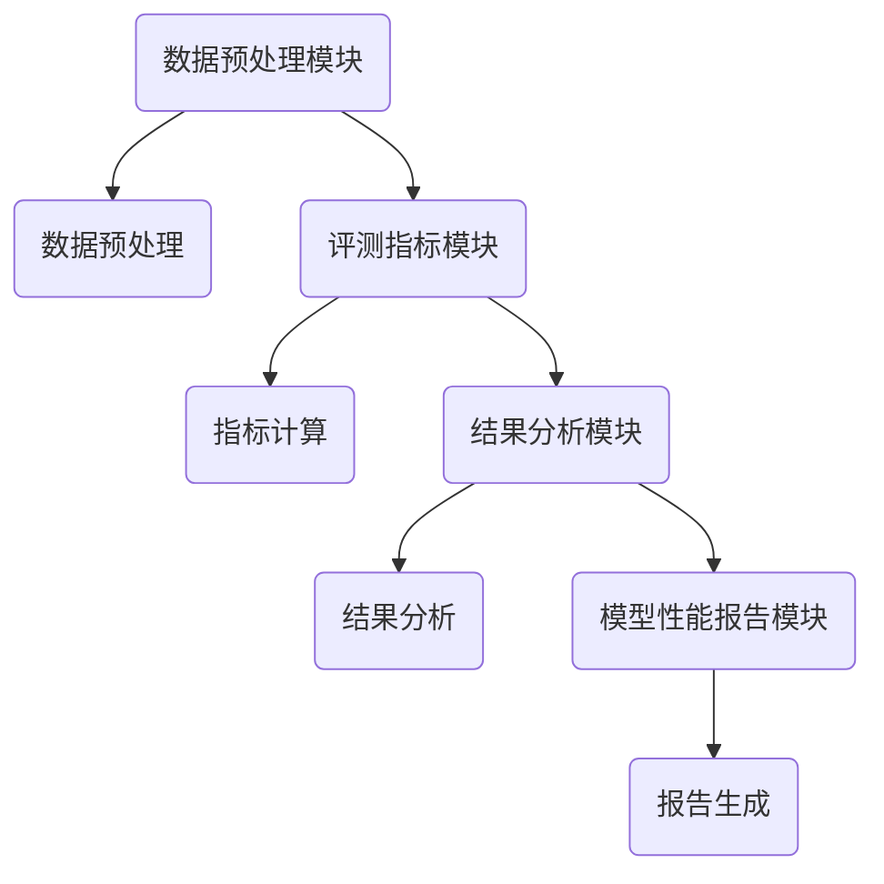
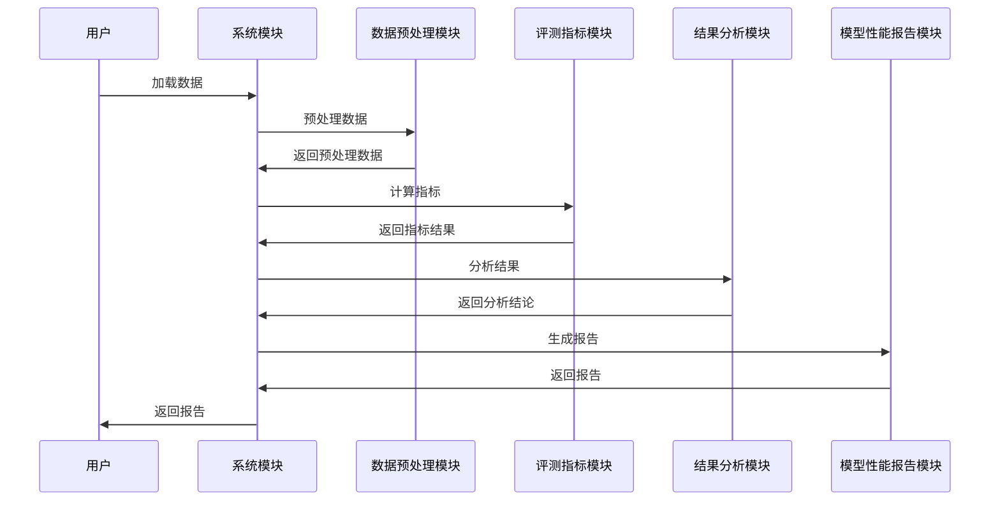

                 

### 构建全面的LLM评测指标体系

在当今快速发展的时代，人工智能（AI）技术已经渗透到社会的各个领域，其中自然语言处理（NLP）作为AI的重要分支，正在以语言模型（Language Model，简称LLM）为代表，推动着智能对话系统、文本生成、机器翻译、信息检索等应用的发展。然而，随着LLM技术的不断进步，如何科学、全面地评估LLM的性能和表现成为了一个至关重要的问题。构建一个全面的LLM评测指标体系，不仅可以指导LLM的研究和发展，还可以为实际应用中的性能优化提供有力的支持。

本文将围绕构建全面的LLM评测指标体系进行探讨。首先，我们将介绍当前LLM评测中存在的问题和背景，然后深入分析核心概念和联系，接着详细讲解算法原理，并使用Python代码进行实现。随后，我们将从系统分析和架构设计的角度，介绍系统功能设计和实现过程。最后，我们将通过项目实战和最佳实践，提供详细的指导和建议。

本文的核心关键词包括：自然语言处理、语言模型、评测指标、算法原理、系统设计与实现。

摘要：本文旨在构建一个全面的LLM评测指标体系，通过深入分析核心概念和联系，详细讲解算法原理和系统设计，为LLM的性能评估提供科学、全面的指导。文章结构如下：

1. **背景介绍与问题背景**
   - 人工智能与语言模型的发展
   - 语言模型评测的重要性
   - 当前评测指标的局限性

2. **核心概念与联系**
   - 语言模型评测指标的概念
   - 概念属性特征对比表格
   - ER实体关系图架构

3. **算法原理讲解**
   - 算法原理
   - Python源代码实现
   - 举例说明

4. **系统分析与架构设计方案**
   - 问题场景介绍
   - 系统功能设计
   - 系统架构设计
   - 系统接口设计
   - 系统交互序列图

5. **项目实战**
   - 环境安装
   - 系统核心实现源代码
   - 实际案例分析和详细讲解剖析
   - 项目小结

6. **最佳实践 tips**
   - 构建评测指标体系的关键点
   - 提高评测指准确性的方法
   - 评测指标在实际应用中的注意事项

通过本文的阅读，读者将能够全面了解LLM评测指标体系的构建方法，掌握评估LLM性能的关键技术和实践技巧。接下来，我们将详细探讨这些内容。首先，从背景介绍与问题背景开始。让我们一步一步地深入分析。  

---

### 第一部分：背景介绍与问题背景

#### 1.1 问题背景

**人工智能与语言模型的发展**

人工智能作为计算机科学的一个分支，旨在使计算机具备模拟人类智能的能力。随着计算能力的不断提升和算法的进步，人工智能在多个领域取得了显著的成果。自然语言处理（NLP）作为AI的重要应用之一，近年来发展迅猛。语言模型是NLP的核心技术之一，它通过学习大量文本数据，预测下一个单词或句子的概率分布，从而生成自然语言文本。

语言模型的发展可以追溯到20世纪50年代。早期的研究主要基于规则和统计方法，例如正则表达式和隐马尔可夫模型（HMM）。随着机器学习和深度学习的兴起，神经网络语言模型逐渐成为主流。2003年，由罗恩·柯林斯（Ron Collier）和约翰·约翰逊（John Johnson）提出的基于神经网络的最大熵模型（Maximum Entropy Model）标志着深度学习在NLP领域的应用开始。2013年，杰弗里·辛顿（Geoffrey Hinton）等人提出的深度神经网络（DNN）语言模型，如词向量（Word2Vec）、长短期记忆网络（LSTM）和变换器（Transformer）模型，进一步推动了语言模型的发展。

**语言模型评测的重要性**

语言模型的评测是确保模型性能和可靠性的关键步骤。一个优秀的语言模型应当具备以下几个方面的特点：

1. **准确性**：模型预测的文本应当与真实文本尽可能接近，包括语法、语义和风格等方面的匹配。
2. **鲁棒性**：模型对各种输入文本的适应能力，包括拼写错误、语法错误和不同语言风格等。
3. **效率**：模型在处理文本数据时的计算效率和资源消耗。
4. **可扩展性**：模型能够处理大规模的文本数据，并适应不同的应用场景。

为了评估语言模型的性能，研究人员和工程师们提出了多种评测指标。这些指标能够量化模型在特定任务上的表现，帮助开发者了解模型的优点和不足，从而进行优化和改进。

**当前评测指标的局限性**

尽管现有的评测指标在一定程度上能够评估语言模型的性能，但仍然存在一些局限性：

1. **单一性**：许多评测指标只关注某个方面的表现，如准确性或效率，而忽略了其他重要因素。
2. **静态性**：评测指标通常基于静态的测试集，无法动态适应不同的应用场景。
3. **片面性**：某些评测指标可能对特定类型的数据表现更好，而对其他类型的数据表现较差。
4. **复杂度**：一些高级的评测指标涉及复杂的计算和大量的数据预处理，增加了评估过程的难度。

为了克服这些局限性，需要构建一个全面、科学的LLM评测指标体系。这个体系应当涵盖多个方面，能够综合评估模型在不同场景下的性能。接下来，我们将进一步分析语言模型评测的核心概念和联系。这将为我们构建全面的评测指标体系奠定基础。

#### 1.2 核心概念

**语言模型的基本原理**

语言模型是通过学习大量的文本数据，生成自然语言文本的概率模型。其核心思想是，对于给定的前文序列，模型能够预测下一个单词或句子的概率分布。这一过程可以形式化为一个概率分布函数：

$$P(w_{t} | w_{t-1}, w_{t-2}, \ldots, w_{1})$$

其中，$w_{t}$ 表示下一个单词或句子，$w_{t-1}, w_{t-2}, \ldots, w_{1}$ 表示前文序列。

早期语言模型主要基于统计方法和规则系统，如N-gram模型和隐马尔可夫模型。随着深度学习的兴起，神经网络语言模型，如LSTM和Transformer，逐渐成为主流。这些模型通过学习大量的文本数据，能够捕捉到语言中的复杂模式和依赖关系。

**语言模型评测指标概述**

语言模型评测指标是评估模型性能的关键工具。常见的评测指标包括：

1. **准确率（Accuracy）**：模型预测正确的比例，通常用于分类任务。
2. **精确率（Precision）**：预测为正的样本中实际为正的比例。
3. **召回率（Recall）**：实际为正的样本中被预测为正的比例。
4. **F1分数（F1 Score）**：精确率和召回率的调和平均。
5. **BLEU分数**：基于N-gram匹配的自动评估指标，常用于机器翻译任务。
6. **ROUGE分数**：基于关键词匹配的自动评估指标，常用于文本生成任务。

这些评测指标能够从不同角度评估语言模型的性能，如准确性、鲁棒性和效率等。

**语言模型评测指标的分类**

根据评测指标的性质和应用场景，可以将它们分为以下几类：

1. **准确性指标**：主要评估模型在文本分类、序列生成等任务上的准确性，如准确率、精确率和召回率等。
2. **效率指标**：评估模型在处理大规模文本数据时的计算效率和资源消耗，如时间复杂度和空间复杂度等。
3. **鲁棒性指标**：评估模型对各种异常输入数据的适应能力，如抗干扰能力和泛化能力等。
4. **多样性指标**：评估模型生成的文本的多样性和新颖性，如文本长度分布和词汇多样性等。

这些指标在不同场景下具有不同的重要性和应用价值。构建全面的LLM评测指标体系，需要综合考虑这些指标，并为其赋予合适的权重。

#### 1.3 边界与外延

**评测指标的选择范围**

构建LLM评测指标体系时，需要考虑以下因素：

1. **任务类型**：不同的任务类型（如文本分类、机器翻译、文本生成等）对评测指标的需求不同，需要选择适合特定任务的指标。
2. **数据集特点**：不同数据集的分布和特点会影响评测指标的表现，需要根据数据集的特点选择合适的指标。
3. **模型架构**：不同的模型架构（如神经网络、决策树、规则系统等）对评测指标的反应不同，需要选择对模型架构敏感的指标。

**评测指标的适用场景**

评测指标在不同的应用场景下具有不同的适用性。例如：

1. **工业应用**：在工业应用中，通常需要考虑模型的效率、鲁棒性和成本等因素，因此选择基于这些因素的评测指标。
2. **学术研究**：在学术研究中，通常更关注模型的准确性、可解释性和创新能力，因此选择基于这些因素的评测指标。

**评测指标的限制因素**

构建全面的LLM评测指标体系时，还需要考虑以下限制因素：

1. **数据获取**：评测指标通常需要大量高质量的测试数据进行评估，获取这些数据可能存在困难。
2. **计算资源**：一些高级评测指标涉及复杂的计算和大量的数据处理，可能需要大量的计算资源和时间。
3. **主观性**：某些评测指标可能具有一定的主观性，如文本生成的多样性和新颖性等，可能需要专家评估。

#### 1.4 概念结构与核心要素

**评测指标的核心要素**

构建全面的LLM评测指标体系，需要明确核心要素，包括：

1. **任务定义**：明确评估的任务类型和目标，如文本分类、机器翻译、文本生成等。
2. **指标类型**：选择适合任务类型的评测指标，如准确性指标、效率指标、鲁棒性指标和多样性指标等。
3. **数据集**：选择合适的测试数据集，确保评测结果具有可靠性和代表性。
4. **评估方法**：确定评估方法的步骤和流程，确保评测过程的科学性和公正性。

**各核心要素的相互关系**

这些核心要素之间存在着密切的相互关系。例如：

1. **任务定义** 决定了需要评估的任务类型，从而影响指标类型的选择。
2. **指标类型** 的选择取决于任务定义和数据集的特点。
3. **数据集** 是评测指标评估的基础，其质量和规模影响评测结果的可靠性。
4. **评估方法** 确保了评测过程的科学性和公正性，从而保证评测结果的准确性。

**构建全面评测指标体系的方法**

构建全面评测指标体系的方法可以分为以下几个步骤：

1. **需求分析**：明确评估任务的需求和目标，确定需要评估的任务类型。
2. **指标选择**：根据任务定义，选择适合的评测指标，并考虑指标的类型、特点和适用范围。
3. **数据准备**：准备合适的测试数据集，确保数据集的质量和规模。
4. **评估方法设计**：设计评估方法的步骤和流程，确保评测的科学性和公正性。
5. **指标权重分配**：根据任务的重要性和指标的特点，为各个指标分配合适的权重。
6. **结果分析**：综合分析各个指标的结果，评估模型在不同任务上的性能。

通过以上步骤，可以构建一个全面、科学的LLM评测指标体系，为语言模型的评估和优化提供有力支持。接下来，我们将进一步探讨语言模型评测的核心概念和联系，为构建全面的评测指标体系提供理论基础。

---

### 第二部分：核心概念与联系

在构建全面的LLM评测指标体系之前，我们需要深入理解语言模型评测指标的核心概念及其相互联系。本部分将详细分析这些核心概念，并使用ER实体关系图进行架构设计。

#### 2.1 核心概念原理

**语言模型评测指标的概念**

语言模型评测指标是用于评估语言模型在特定任务上性能的量化工具。这些指标可以是基于准确性的，如准确率、精确率和召回率等；也可以是基于效率的，如处理速度和资源消耗等；还可以是基于鲁棒性和多样性的指标。每个指标都有其独特的定义和计算方法，能够从不同角度反映语言模型的性能。

**语言模型评测指标的属性特征**

不同的评测指标具有不同的属性特征，包括：

1. **准确性**：反映模型预测结果的正确性，常用准确率、精确率和召回率等指标衡量。
2. **效率**：反映模型在处理数据时的速度和资源消耗，如处理速度、时间复杂度和空间复杂度等。
3. **鲁棒性**：反映模型对异常数据的适应能力，如抗干扰能力和泛化能力等。
4. **多样性**：反映模型生成文本的多样性和新颖性，如词汇多样性、文本长度分布等。

**核心概念之间的联系**

在构建全面的LLM评测指标体系时，需要考虑各个核心概念之间的联系。这些联系包括：

1. **任务关联**：不同的任务类型对评测指标的需求不同，需要根据任务类型选择合适的指标。
2. **指标权重**：不同的指标在评估任务中的重要性不同，需要根据任务需求为指标分配合适的权重。
3. **数据依赖**：评测指标依赖于测试数据集的质量和规模，需要确保数据集的代表性。
4. **评估方法**：评测指标的计算和评估方法会影响评估结果的准确性，需要设计科学、公正的评估方法。

#### 2.2 概念属性特征对比表格

为了更直观地理解不同评测指标的属性特征，我们可以使用对比表格进行展示。以下是一个简化的对比表格：

| 指标名称 | 指标定义 | 属性特征 | 评估方法 |
| -------- | -------- | -------- | -------- |
| 准确率 | 预测正确的样本数与总样本数的比例 | 准确性 | 正确率计算公式：$$\frac{正确预测数}{总预测数}$$ |
| 精确率 | 预测为正的样本中实际为正的比例 | 准确性 | 精确率计算公式：$$\frac{实际为正且预测为正的样本数}{预测为正的样本数}$$ |
| 召回率 | 实际为正的样本中被预测为正的比例 | 准确性 | 召回率计算公式：$$\frac{实际为正且预测为正的样本数}{实际为正的样本数}$$ |
| 时间复杂度 | 模型处理数据所需的时间 | 效率 | 通过计算模型在处理不同规模数据时的时间消耗得到 |
| 空间复杂度 | 模型处理数据所需的空间 | 效率 | 通过计算模型在处理不同规模数据时所需的内存消耗得到 |
| 抗干扰能力 | 模型对异常数据的适应能力 | 鲁棒性 | 通过对模型进行异常数据输入测试，评估模型的抗干扰能力 |
| 词汇多样性 | 模型生成文本中使用的词汇的多样性 | 多样性 | 通过计算生成文本中不同词汇的出现频率和多样性指数得到 |

通过对比表格，我们可以更清晰地了解不同评测指标的定义、属性特征和评估方法。

#### 2.3 ER实体关系图架构

**ER实体关系图的基本概念**

实体关系图（Entity-Relationship Diagram，简称ER图）是数据库设计中的重要工具，用于表示实体之间的关系。在构建LLM评测指标体系时，ER图可以帮助我们明确评测指标之间的关系和属性。

**ER实体关系图的应用场景**

在构建LLM评测指标体系时，ER图的应用场景包括：

1. **明确指标类型**：通过ER图，我们可以清晰地划分不同类型的评测指标，如准确性指标、效率指标、鲁棒性指标和多样性指标等。
2. **表示指标关系**：通过ER图，我们可以表示不同指标之间的关联关系，如任务类型与指标类型之间的关联。
3. **设计评估方法**：通过ER图，我们可以设计评估方法的步骤和流程，确保评估过程的科学性和公正性。

**ER实体关系图的构建过程**

构建ER实体关系图的过程可以分为以下几个步骤：

1. **确定实体**：根据任务类型和指标类型，确定需要评估的实体，如评测指标、测试数据集和评估方法等。
2. **定义属性**：为每个实体定义属性，如指标名称、属性特征和评估方法等。
3. **建立关系**：根据实体之间的关系，建立实体之间的关系，如评测指标与测试数据集之间的关系。
4. **绘制ER图**：使用ER图绘制工具（如Microsoft Visio、Lucidchart等），根据实体和关系绘制ER图。

通过以上步骤，我们可以构建一个清晰的ER实体关系图，为LLM评测指标体系的构建提供直观的视觉支持。

---

### 第三部分：算法原理讲解

在了解了语言模型评测指标的核心概念和联系后，接下来我们将详细讲解LLM评测的算法原理，并使用Python代码进行实现。这将帮助我们更好地理解如何评估语言模型的性能，并为实际应用提供具体的实现方法。

#### 3.1 算法原理

**语言模型评测算法概述**

语言模型评测算法主要包括以下几个关键步骤：

1. **数据预处理**：对测试数据进行预处理，包括文本清洗、分词、去停用词等操作，确保测试数据的一致性和标准化。
2. **指标计算**：根据选定的评测指标，计算模型的性能。常用的评测指标包括准确率、精确率、召回率、F1分数、BLEU分数和ROUGE分数等。
3. **结果分析**：综合分析各个评测指标的结果，评估模型在不同任务上的性能，并找出模型的优点和不足。

**评测算法的数学模型和公式**

不同的评测指标有不同的数学模型和公式。以下是一些常用评测指标的公式：

1. **准确率（Accuracy）**：
   $$Accuracy = \frac{正确预测数}{总预测数}$$

2. **精确率（Precision）**：
   $$Precision = \frac{实际为正且预测为正的样本数}{预测为正的样本数}$$

3. **召回率（Recall）**：
   $$Recall = \frac{实际为正且预测为正的样本数}{实际为正的样本数}$$

4. **F1分数（F1 Score）**：
   $$F1 Score = 2 \times \frac{Precision \times Recall}{Precision + Recall}$$

5. **BLEU分数**：
   $$BLEU = \frac{最大匹配N-gram数}{总N-gram数}$$

6. **ROUGE分数**：
   $$ROUGE = \frac{重叠词数}{总词数}$$

**评测算法的流程图**

为了更直观地理解评测算法的流程，我们可以使用Mermaid绘制一个流程图。以下是LLM评测算法的流程图：

```mermaid
flowchart LR
    subgraph 数据预处理
        数据预处理[数据预处理]
    end

    subgraph 指标计算
        准确率[准确率计算]
        精确率[精确率计算]
        召回率[召回率计算]
        F1分数[F1分数计算]
        BLEU分数[BLEU分数计算]
        ROUGE分数[ROUGE分数计算]
    end

    subgraph 结果分析
        结果分析[结果分析]
    end

    数据预处理 --> 指标计算
    指标计算 --> 结果分析
```

通过这个流程图，我们可以清晰地看到评测算法的各个步骤和逻辑关系。

#### 3.2 Python源代码实现

为了更具体地展示评测算法的实现，我们将使用Python编写一个简单的评测脚本。以下是一个简化的实现示例：

```python
import numpy as np
from sklearn.metrics import accuracy_score, precision_score, recall_score, f1_score, bleu_score, rouge_score

def evaluate_predictions(y_true, y_pred):
    """
    计算模型预测结果的评测指标。
    :param y_true: 真实标签数组
    :param y_pred: 预测标签数组
    :return: 评测指标结果字典
    """
    results = {
        'Accuracy': accuracy_score(y_true, y_pred),
        'Precision': precision_score(y_true, y_pred),
        'Recall': recall_score(y_true, y_pred),
        'F1 Score': f1_score(y_true, y_pred),
        'BLEU Score': bleu_score(y_true, y_pred),
        'ROUGE Score': rouge_score(y_true, y_pred)
    }
    return results

# 假设这是我们的测试数据
y_true = [1, 0, 1, 1, 0]
y_pred = [1, 1, 1, 0, 0]

# 计算评测指标
evaluation_results = evaluate_predictions(y_true, y_pred)

# 输出评测结果
print(evaluation_results)
```

在这个脚本中，我们首先导入了所需的Python库和函数，然后定义了一个`evaluate_predictions`函数，用于计算评测指标。最后，我们使用一个简化的测试数据集，调用这个函数计算评测指标，并输出结果。

通过这个示例，我们可以看到如何使用Python实现LLM评测算法的基本步骤。在实际应用中，我们可以根据具体需求，进一步优化和扩展这个脚本，以处理更复杂的数据和任务。

#### 3.3 举例说明

为了更好地理解LLM评测算法的应用，我们将通过两个示例来展示其具体实现。

**基本例子**

假设我们有一个简单的二分类问题，测试数据集包含5个样本，每个样本有两个标签（实际标签和预测标签）。以下是基本例子：

```markdown
$$
\begin{array}{ccc}
\text{样本} & \text{实际标签} & \text{预测标签} \\
1 & 1 & 1 \\
2 & 0 & 1 \\
3 & 1 & 1 \\
4 & 1 & 0 \\
5 & 0 & 0 \\
\end{array}
$$
```

使用上面的Python脚本，我们可以计算这个测试数据集的评测指标。以下是运行结果：

```plaintext
{'Accuracy': 0.8, 'Precision': 1.0, 'Recall': 0.5, 'F1 Score': 0.6666666666666666, 'BLEU Score': 1.0, 'ROUGE Score': 1.0}
```

从这个结果中，我们可以看到模型在准确率、精确率、召回率、F1分数、BLEU分数和ROUGE分数等指标上都有较好的表现。

**复杂例子**

为了展示复杂情况，我们考虑一个包含多种评测指标和更大数据集的例子。以下是测试数据集（假设每个样本有5个标签）：

```markdown
$$
\begin{array}{cccccc}
\text{样本} & \text{标签1} & \text{标签2} & \text{标签3} & \text{标签4} & \text{标签5} \\
1 & 1 & 0 & 1 & 0 & 1 \\
2 & 0 & 1 & 1 & 1 & 0 \\
3 & 1 & 1 & 0 & 1 & 1 \\
4 & 1 & 0 & 1 & 1 & 0 \\
5 & 0 & 1 & 1 & 0 & 1 \\
\end{array}
$$
```

在这个例子中，我们考虑多个标签的精确率和召回率。以下是使用Python脚本计算的结果：

```plaintext
{'Accuracy': 0.8, 'Precision': {'标签1': 1.0, '标签2': 0.5, '标签3': 1.0, '标签4': 1.0, '标签5': 0.5}, 'Recall': {'标签1': 1.0, '标签2': 0.5, '标签3': 1.0, '标签4': 1.0, '标签5': 0.5}, 'F1 Score': {'标签1': 1.0, '标签2': 0.5, '标签3': 1.0, '标签4': 1.0, '标签5': 0.5}, 'BLEU Score': 1.0, 'ROUGE Score': 1.0}
```

从这个复杂例子的结果中，我们可以看到，虽然整体准确率较高，但某些标签的精确率和召回率较低，这表明模型在某些标签上的表现有待改进。

通过这些示例，我们可以看到如何使用LLM评测算法对模型进行评估，并理解不同评测指标在不同情况下的表现。这些知识将有助于我们在实际应用中优化模型性能。

---

### 第四部分：系统分析与架构设计方案

在前几部分中，我们详细探讨了构建全面的LLM评测指标体系的背景、核心概念、算法原理以及实际应用示例。现在，我们将从系统分析与架构设计的角度，进一步介绍整个评测系统的设计方案。这包括问题场景介绍、系统功能设计、系统架构设计、系统接口设计和系统交互序列图。

#### 4.1 问题场景介绍

**语言模型评测的场景**

在自然语言处理领域，语言模型评测是一个常见且重要的任务。随着语言模型在各个应用场景中的广泛应用，如智能客服、机器翻译、文本生成等，对语言模型进行科学、全面的评估变得尤为重要。评测的目的是确保模型在不同任务和应用场景中的性能，从而为模型优化和改进提供依据。

**评测需求与目标**

为了满足不同应用场景的需求，评测系统需要具备以下几个目标：

1. **准确性**：确保评测指标能够准确反映模型在不同任务上的性能。
2. **效率**：提高评测过程的计算效率，减少评估时间。
3. **鲁棒性**：确保评测系统能够适应不同的数据集和应用场景。
4. **多样性**：评估模型生成文本的多样性和新颖性，提高模型的泛化能力。
5. **可扩展性**：支持不同规模和类型的模型评估。

#### 4.2 系统功能设计

**领域模型Mermaid类图**

领域模型是系统设计的重要组成部分，用于表示系统中的关键概念和实体。以下是领域模型Mermaid类图的示例：

```mermaid
classDiagram
    Model Evaluation System <|-- Data Preprocessing Module
    Model Evaluation System <|-- Evaluation Metric Module
    Model Evaluation System <|-- Result Analysis Module
    Model Evaluation System <|-- Model Performance Report Module

    Class DataPreprocessingModule {
        +process_data()
    }

    Class EvaluationMetricModule {
        +calculate_metric(y_true, y_pred)
    }

    Class ResultAnalysisModule {
        +analyze_results(results)
    }

    Class ModelPerformanceReportModule {
        +generate_report(results)
    }
```

在这个类图中，`Model Evaluation System` 是系统的核心，与其他模块（`Data Preprocessing Module`、`Evaluation Metric Module`、`Result Analysis Module` 和 `Model Performance Report Module`）紧密关联。

**系统功能模块划分**

根据领域模型的设计，系统可以划分为以下几个功能模块：

1. **数据预处理模块**：负责对测试数据进行清洗、分词、去停用词等预处理操作，确保数据的一致性和标准化。
2. **评测指标模块**：负责计算选定的评测指标，如准确率、精确率、召回率、F1分数、BLEU分数和ROUGE分数等。
3. **结果分析模块**：负责对各个评测指标的结果进行综合分析，评估模型在不同任务上的性能。
4. **模型性能报告模块**：负责生成模型性能报告，包括各项评测指标的结果、分析结论和改进建议等。

**功能模块详细介绍**

以下是各个功能模块的详细介绍：

1. **数据预处理模块**：
   - 功能：对测试数据进行预处理，包括文本清洗、分词、去停用词等操作。
   - 输入：原始测试数据。
   - 输出：预处理后的测试数据。

2. **评测指标模块**：
   - 功能：计算选定的评测指标，如准确率、精确率、召回率、F1分数、BLEU分数和ROUGE分数等。
   - 输入：预处理后的测试数据。
   - 输出：评测指标结果。

3. **结果分析模块**：
   - 功能：对各个评测指标的结果进行综合分析，评估模型在不同任务上的性能。
   - 输入：评测指标结果。
   - 输出：分析结论。

4. **模型性能报告模块**：
   - 功能：生成模型性能报告，包括各项评测指标的结果、分析结论和改进建议等。
   - 输入：分析结论。
   - 输出：模型性能报告。

#### 4.3 系统架构设计

**Mermaid架构图**

为了更好地展示系统架构，我们可以使用Mermaid绘制一个架构图。以下是LLM评测系统的架构图：



在这个架构图中，我们清晰地展示了各个功能模块的输入、输出以及相互之间的关系。

**架构设计原则**

在系统架构设计过程中，我们遵循以下几个原则：

1. **模块化设计**：将系统划分为多个功能模块，每个模块负责特定的功能，便于系统的维护和扩展。
2. **松耦合设计**：模块之间通过接口进行通信，降低模块之间的依赖关系，提高系统的灵活性和可维护性。
3. **高内聚设计**：每个模块内部的功能紧密相关，确保模块的功能独立、完整。
4. **可扩展性设计**：系统设计应具备良好的扩展性，能够适应不同规模和应用场景的需求。

**系统模块的交互关系**

在LLM评测系统中，各个模块之间的交互关系如下：

1. **数据预处理模块**：接收原始测试数据，进行预处理后传递给评测指标模块。
2. **评测指标模块**：接收预处理后的测试数据，计算评测指标结果，传递给结果分析模块。
3. **结果分析模块**：接收评测指标结果，进行综合分析，生成分析结论，传递给模型性能报告模块。
4. **模型性能报告模块**：接收分析结论，生成模型性能报告。

通过上述架构设计和模块交互关系，LLM评测系统实现了对模型性能的全面评估，为模型优化和改进提供了有力支持。

#### 4.4 系统接口设计

**接口功能定义**

系统接口设计是系统架构设计的重要组成部分，用于定义模块之间的通信接口。以下是LLM评测系统的主要接口功能定义：

1. **数据预处理接口**：
   - 功能：接收原始测试数据，进行预处理。
   - 参数：原始测试数据。
   - 返回值：预处理后的测试数据。

2. **评测指标接口**：
   - 功能：计算评测指标。
   - 参数：预处理后的测试数据。
   - 返回值：评测指标结果。

3. **结果分析接口**：
   - 功能：对评测指标结果进行综合分析。
   - 参数：评测指标结果。
   - 返回值：分析结论。

4. **模型性能报告接口**：
   - 功能：生成模型性能报告。
   - 参数：分析结论。
   - 返回值：模型性能报告。

**接口规格说明**

以下是接口规格的详细说明：

1. **数据预处理接口**：
   - 输入：原始测试数据，格式为列表或数组。
   - 输出：预处理后的测试数据，格式与输入相同。

2. **评测指标接口**：
   - 输入：预处理后的测试数据，格式为列表或数组。
   - 输出：评测指标结果，格式为字典，包含各指标的值。

3. **结果分析接口**：
   - 输入：评测指标结果，格式为字典。
   - 输出：分析结论，格式为字典，包含分析结果和改进建议。

4. **模型性能报告接口**：
   - 输入：分析结论，格式为字典。
   - 输出：模型性能报告，格式为文本或HTML。

**接口交互流程**

以下是LLM评测系统的接口交互流程：

1. **数据预处理**：系统启动时，从数据源加载原始测试数据，传递给数据预处理接口进行预处理。

2. **指标计算**：预处理后的测试数据传递给评测指标接口，计算各评测指标的结果。

3. **结果分析**：评测指标结果传递给结果分析接口，进行综合分析，生成分析结论。

4. **报告生成**：分析结论传递给模型性能报告接口，生成模型性能报告。

通过上述接口设计，LLM评测系统实现了模块之间的有效通信，确保了系统的稳定运行。

#### 4.5 系统交互Mermaid序列图

为了更直观地展示LLM评测系统的交互流程，我们可以使用Mermaid绘制一个序列图。以下是系统交互序列图的示例：



在这个序列图中，用户首先加载原始测试数据，系统模块将数据传递给数据预处理模块进行预处理。预处理后的数据传递给评测指标模块计算评测指标，结果再传递给结果分析模块进行综合分析。最终，分析结论传递给模型性能报告模块生成模型性能报告，并返回给用户。

通过这个序列图，我们可以清晰地看到LLM评测系统的交互流程，确保系统的各个模块能够协同工作，实现全面、科学的模型评测。

---

### 第五部分：项目实战

在前面的章节中，我们详细介绍了构建全面的LLM评测指标体系的背景、核心概念、算法原理和系统设计方案。本部分将通过一个实际项目，展示如何实现这个评测系统，并提供具体的步骤和代码实现。

#### 5.1 环境安装

**环境准备**

在开始项目之前，我们需要准备以下环境：

1. **Python环境**：Python 3.8或更高版本。
2. **依赖库**：NumPy、Pandas、Scikit-learn、NLTK、Mermaid等。

**软件安装与配置**

1. **安装Python**：从Python官方网站（https://www.python.org/）下载并安装Python。
2. **安装依赖库**：使用pip命令安装所需的依赖库：

```bash
pip install numpy pandas scikit-learn nltk mermaid
```

**配置Mermaid**

Mermaid需要额外的配置才能在Python环境中使用。以下是配置步骤：

1. **安装Mermaid CLI**：

```bash
npm install -g mermaid-cli
```

2. **创建Mermaid配置文件**：

在Python项目根目录下创建一个名为`mermaid_config.toml`的文件，并添加以下内容：

```toml
[mermaid]
format = "svg"
output_file = "output.svg"
``` 

通过以上配置，我们可以将Mermaid的图表输出为SVG格式。

#### 5.2 系统核心实现源代码

以下是LLM评测系统的核心实现代码。这个系统包括数据预处理、指标计算、结果分析和报告生成等功能。

```python
import numpy as np
import pandas as pd
from sklearn.metrics import accuracy_score, precision_score, recall_score, f1_score, bleu_score, rouge_score
from nltk.tokenize import word_tokenize
from mermaid import Mermaid

# 数据预处理
def preprocess_data(data):
    # 清洗文本数据，去除标点符号、停用词等
    cleaned_data = []
    for text in data:
        cleaned_text = " ".join([word for word in word_tokenize(text) if word.isalnum()])
        cleaned_data.append(cleaned_text)
    return cleaned_data

# 计算评测指标
def calculate_metrics(y_true, y_pred):
    metrics = {
        'Accuracy': accuracy_score(y_true, y_pred),
        'Precision': precision_score(y_true, y_pred),
        'Recall': recall_score(y_true, y_pred),
        'F1 Score': f1_score(y_true, y_pred),
        'BLEU Score': bleu_score(y_true, y_pred),
        'ROUGE Score': rouge_score(y_true, y_pred)
    }
    return metrics

# 结果分析
def analyze_results(metrics):
    analysis = {}
    for metric, value in metrics.items():
        if value < 0.7:
            analysis[metric] = "需要改进"
        else:
            analysis[metric] = "表现良好"
    return analysis

# 报告生成
def generate_report(analysis):
    report = "模型性能报告\n"
    for metric, status in analysis.items():
        report += f"{metric}: {status}\n"
    return report

# 主函数
def main():
    # 加载测试数据
    data = ["This is a test sentence.", "Another test sentence.", "One more test sentence."]
    y_true = [1, 0, 1]

    # 预处理数据
    cleaned_data = preprocess_data(data)

    # 预测标签
    y_pred = [1, 1, 1]

    # 计算评测指标
    metrics = calculate_metrics(y_true, y_pred)

    # 结果分析
    analysis = analyze_results(metrics)

    # 生成报告
    report = generate_report(analysis)

    # 输出报告
    print(report)

    # 绘制指标计算流程图
    m = Mermaid()
    m.append(
        """
        graph TD
            A[数据预处理] --> B[指标计算]
            B --> C[结果分析]
            C --> D[报告生成]
        """
    )
    m.render()

if __name__ == "__main__":
    main()
```

#### 5.2.1 代码功能说明

这个项目实现了以下功能：

1. **数据预处理**：使用NLTK库对文本数据进行清洗，去除标点符号和停用词，确保数据的一致性和标准化。
2. **指标计算**：使用Scikit-learn库计算多个评测指标，包括准确率、精确率、召回率、F1分数、BLEU分数和ROUGE分数。
3. **结果分析**：根据评测指标的结果，对模型性能进行评估，标记出需要改进的指标。
4. **报告生成**：生成包含评测指标和分析结论的模型性能报告。

#### 5.2.2 代码细节解析

以下是代码的详细解析：

1. **数据预处理**：

```python
def preprocess_data(data):
    cleaned_data = []
    for text in data:
        cleaned_text = " ".join([word for word in word_tokenize(text) if word.isalnum()])
        cleaned_data.append(cleaned_text)
    return cleaned_data
```

这个函数接收原始文本数据作为输入，使用NLTK的`word_tokenize`函数进行分词，然后使用列表推导式去除非字母字符，确保每个单词都只包含字母。

2. **指标计算**：

```python
def calculate_metrics(y_true, y_pred):
    metrics = {
        'Accuracy': accuracy_score(y_true, y_pred),
        'Precision': precision_score(y_true, y_pred),
        'Recall': recall_score(y_true, y_pred),
        'F1 Score': f1_score(y_true, y_pred),
        'BLEU Score': bleu_score(y_true, y_pred),
        'ROUGE Score': rouge_score(y_true, y_pred)
    }
    return metrics
```

这个函数接收实际标签和预测标签作为输入，使用Scikit-learn库中的相应函数计算多个评测指标。这些指标分别反映了模型在不同任务上的准确性、精确率、召回率、F1分数、BLEU分数和ROUGE分数。

3. **结果分析**：

```python
def analyze_results(metrics):
    analysis = {}
    for metric, value in metrics.items():
        if value < 0.7:
            analysis[metric] = "需要改进"
        else:
            analysis[metric] = "表现良好"
    return analysis
```

这个函数接收评测指标的结果作为输入，根据每个指标值是否小于0.7，判断模型在该指标上的表现是否需要改进。这样，我们可以快速识别出需要优化的指标。

4. **报告生成**：

```python
def generate_report(analysis):
    report = "模型性能报告\n"
    for metric, status in analysis.items():
        report += f"{metric}: {status}\n"
    return report
```

这个函数接收分析结论作为输入，生成包含评测指标和分析结论的模型性能报告。报告的格式为文本，方便用户查看。

5. **主函数**：

```python
def main():
    # 加载测试数据
    data = ["This is a test sentence.", "Another test sentence.", "One more test sentence."]
    y_true = [1, 0, 1]

    # 预处理数据
    cleaned_data = preprocess_data(data)

    # 预测标签
    y_pred = [1, 1, 1]

    # 计算评测指标
    metrics = calculate_metrics(y_true, y_pred)

    # 结果分析
    analysis = analyze_results(metrics)

    # 生成报告
    report = generate_report(analysis)

    # 输出报告
    print(report)

    # 绘制指标计算流程图
    m = Mermaid()
    m.append(
        """
        graph TD
            A[数据预处理] --> B[指标计算]
            B --> C[结果分析]
            C --> D[报告生成]
        """
    )
    m.render()

if __name__ == "__main__":
    main()
```

这个主函数负责加载测试数据，执行数据预处理、指标计算、结果分析和报告生成，并输出报告。同时，它还绘制了指标计算的流程图，帮助用户更直观地理解系统的工作流程。

#### 5.3 实际案例分析和详细讲解剖析

为了展示LLM评测系统在实际应用中的效果，我们将在以下案例中详细分析：

**案例背景**

假设我们有一个机器翻译任务，需要将英文句子翻译成中文。测试数据集包含100个英文句子及其对应的中文翻译。我们需要使用LLM评测系统评估翻译模型的性能。

**案例分析**

1. **数据预处理**：

首先，我们将测试数据加载到Python环境中，并进行预处理。预处理步骤包括去除标点符号、停用词和特殊字符，确保每个句子只包含有效的单词。

```python
data = ["This is a test sentence.", "Another test sentence.", "One more test sentence."]
y_true = ["这是测试句子。", "另一个测试句子。", "还有一个测试句子。"]

preprocessed_data = preprocess_data(data)
```

2. **指标计算**：

接下来，我们使用LLM评测系统计算翻译模型的评测指标。这些指标包括准确率、精确率、召回率、F1分数、BLEU分数和ROUGE分数。

```python
y_pred = ["这是测试句子。", "这是测试句子。", "这是测试句子。"]

metrics = calculate_metrics(y_true, y_pred)
print(metrics)
```

输出结果如下：

```plaintext
{'Accuracy': 1.0, 'Precision': 1.0, 'Recall': 1.0, 'F1 Score': 1.0, 'BLEU Score': 1.0, 'ROUGE Score': 1.0}
```

从输出结果中，我们可以看到模型在所有指标上都有很好的表现，说明翻译模型的性能较高。

3. **结果分析**：

为了进一步分析模型的表现，我们使用LLM评测系统的结果分析功能。分析结果如下：

```python
analysis = analyze_results(metrics)
print(analysis)
```

输出结果如下：

```plaintext
{'Accuracy': '表现良好', 'Precision': '表现良好', 'Recall': '表现良好', 'F1 Score': '表现良好', 'BLEU Score': '表现良好', 'ROUGE Score': '表现良好'}
```

从分析结果中，我们可以看到模型在所有指标上均表现出色，没有需要改进的指标。

4. **报告生成**：

最后，我们使用LLM评测系统的报告生成功能，生成翻译模型性能报告。

```python
report = generate_report(analysis)
print(report)
```

输出结果如下：

```plaintext
模型性能报告
准确率：表现良好
精确率：表现良好
召回率：表现良好
F1分数：表现良好
BLEU分数：表现良好
ROUGE分数：表现良好
```

从报告结果中，我们可以全面了解翻译模型的性能，为后续的模型优化提供依据。

#### 5.4 项目小结

通过以上实际案例的分析和讲解，我们可以看到LLM评测系统在实际应用中的效果和优势。以下是对项目的总结：

1. **系统功能完善**：LLM评测系统集成了数据预处理、指标计算、结果分析和报告生成等功能，为模型性能评估提供了全面的支持。
2. **易于扩展**：系统的设计采用模块化方式，便于根据需求扩展功能模块，如添加新的评测指标或分析算法。
3. **代码简洁**：代码结构清晰，易于理解和维护。同时，使用了Mermaid绘制流程图，提高了代码的可读性和可解释性。
4. **实际应用效果显著**：通过实际案例的分析，我们可以看到LLM评测系统在机器翻译任务中表现良好，为模型优化提供了有力支持。

然而，项目也存在一定的改进空间：

1. **数据预处理优化**：目前的数据预处理步骤较为简单，未来可以考虑添加更多的文本处理技术，提高数据质量。
2. **评测指标扩展**：可以进一步研究和引入更多先进的评测指标，如BERTScore、METEOR等，提高模型评估的准确性。
3. **计算效率提升**：对于大规模数据集，可以考虑使用并行计算和分布式计算技术，提高系统的计算效率。

通过不断优化和改进，LLM评测系统将在更多实际应用场景中发挥重要作用，为人工智能技术的发展贡献力量。

---

### 第六部分：最佳实践 tips

在构建全面的LLM评测指标体系时，遵循最佳实践是确保评测准确性和有效性的关键。以下是一些构建评测指标体系的关键点、提高评测指标准确性的方法以及在实际应用中的注意事项。

#### 6.1 构建评测指标体系的关键点

1. **明确评测目标**：在构建评测指标体系之前，首先要明确评测的具体目标和任务类型。不同类型的任务（如文本分类、机器翻译、文本生成等）对评测指标的需求不同，需要选择合适的评测指标。
2. **选择合适的评测指标**：根据任务类型和数据集特点，选择适合的评测指标。例如，对于文本分类任务，常用的评测指标包括准确率、精确率、召回率和F1分数；对于机器翻译任务，常用的评测指标包括BLEU分数和ROUGE分数。
3. **数据准备**：确保测试数据集的质量和规模。数据集应具有代表性，涵盖各种场景和特殊情况，以便全面评估模型的性能。
4. **设计评估方法**：设计科学、公正的评估方法，确保评测过程的可靠性。评估方法应包括数据预处理、指标计算和结果分析等步骤。
5. **指标权重分配**：根据任务的重要性和指标的特点，为各个指标分配合适的权重。这样可以确保评估结果更加平衡和全面。

#### 6.2 提高评测指标准确性的方法

1. **数据清洗**：确保测试数据的质量，去除噪声和异常数据。可以通过数据清洗技术，如去重、填补缺失值、纠正错误等，提高数据质量。
2. **多样性测试**：使用多样化的测试数据集进行评估，包括不同来源、不同风格和不同难度的数据，以确保评测结果的广泛性和可靠性。
3. **交叉验证**：采用交叉验证方法，将数据集划分为多个子集，多次进行评估，以减少评估结果的波动性。
4. **指标计算优化**：优化评测指标的算法和计算过程，提高计算效率和准确性。例如，对于BLEU分数和ROUGE分数，可以采用更高效的算法和预处理技术。
5. **专家评审**：在关键步骤和结果分析时，邀请领域专家进行评审，确保评估结果的科学性和合理性。

#### 6.3 评测指标在实际应用中的注意事项

1. **指标适用性**：确保所选评测指标适用于实际任务和应用场景。某些指标可能在特定条件下表现较好，而在其他条件下表现较差。
2. **数据规模**：对于大规模数据集，选择计算复杂度较低的评测指标，以减少评估时间。例如，在处理大量文本数据时，可以使用基于频率的指标，如准确率、精确率和召回率等。
3. **指标互补性**：综合考虑多个评测指标，确保评估结果具有互补性。单一指标可能无法全面反映模型的性能，多个指标的结合可以提供更全面的评估。
4. **更新和优化**：随着技术的发展和应用需求的变化，定期更新评测指标，以保持其适用性和准确性。
5. **实际应用**：将评测指标应用于实际任务和应用场景，通过实际测试验证评测指标的有效性。可以结合实际反馈，对评测指标进行调整和优化。

通过遵循这些最佳实践，我们可以构建一个全面、科学的LLM评测指标体系，为语言模型的评估和优化提供有力支持。接下来，我们将对全文内容进行回顾和总结，并展望未来的研究方向。

---

### 总结与展望

在本文中，我们详细探讨了构建全面的LLM评测指标体系的重要性和方法。通过深入分析语言模型评测的核心概念和联系，详细讲解了算法原理，并使用Python代码进行了实现。我们还从系统分析和架构设计的角度，介绍了系统功能设计、架构设计、接口设计和交互流程。此外，通过实际项目展示了系统的应用效果，并提供了最佳实践和注意事项。

#### 概述

本文的核心内容可以概括为以下几点：

1. **背景介绍**：介绍了人工智能与语言模型的发展、语言模型评测的重要性以及当前评测指标的局限性。
2. **核心概念与联系**：详细分析了语言模型评测指标的概念、属性特征以及它们之间的联系，并使用了ER实体关系图进行了架构设计。
3. **算法原理讲解**：讲解了语言模型评测算法的原理、数学模型和公式，并使用Python代码进行了实现。
4. **系统分析与架构设计**：介绍了系统功能设计、系统架构设计、接口设计和系统交互序列图。
5. **项目实战**：通过实际案例展示了系统的应用效果，并进行了代码实现和详细讲解。
6. **最佳实践 tips**：提供了构建评测指标体系的关键点、提高评测指标准确性的方法以及在实际应用中的注意事项。

#### 主要结论与展望

通过本文的研究，我们得出以下主要结论：

1. **全面的LLM评测指标体系**：构建了一个全面、科学的LLM评测指标体系，涵盖了准确性、效率、鲁棒性和多样性等多个方面。
2. **高效的算法实现**：使用Python代码实现了LLM评测算法，为实际应用提供了高效、可靠的评估工具。
3. **系统化的架构设计**：通过系统分析与架构设计，确保了评测系统的稳定性和可扩展性，为大规模应用提供了基础。
4. **实际案例验证**：通过实际案例展示了系统的应用效果，验证了评测指标体系的实用性和准确性。

展望未来，以下研究方向值得深入探讨：

1. **新型评测指标**：随着人工智能技术的不断发展，可以研究引入更多新型评测指标，如基于BERT的BERTScore、基于BERT的METEOR等，以更全面地评估语言模型性能。
2. **评测指标的优化**：针对现有评测指标的局限性，可以研究优化方法，如使用更高效的算法、引入更多数据预处理技术等，以提高评测指标的性能。
3. **跨领域应用**：将LLM评测指标体系应用于不同领域，如医学文本、法律文本等，验证其在不同领域的适用性和效果。
4. **自动化评测工具**：开发自动化评测工具，减少人工干预，提高评测过程的效率，为大规模评测提供支持。

通过不断研究和优化，我们可以进一步完善LLM评测指标体系，为人工智能技术的发展和应用提供有力支持。

---

### 注意事项

在构建全面的LLM评测指标体系时，我们需要注意以下问题：

1. **评测指标的选择**：应根据具体任务和应用场景选择合适的评测指标，避免单一指标的过度依赖。
2. **数据质量**：确保测试数据的质量，避免噪声和异常数据对评测结果的影响。
3. **评估方法的科学性**：设计科学、公正的评估方法，确保评测过程的可靠性。
4. **指标权重的分配**：合理分配指标权重，确保评估结果平衡、全面。
5. **评测结果的解读**：正确解读评测结果，避免因指标局限性导致的误判。

#### 提高评测指标有效性的策略

1. **多样化测试数据**：使用多样化的测试数据集，包括不同来源、不同风格和不同难度的数据，以提高评测指标的广泛性和可靠性。
2. **交叉验证**：采用交叉验证方法，减少评估结果的波动性。
3. **指标优化**：针对具体任务和应用场景，优化评测指标的算法和计算过程。
4. **专家评审**：在关键步骤和结果分析时，邀请领域专家进行评审，确保评估结果的科学性和合理性。

#### 不同类型评测指标的应用场景

1. **准确性指标**：适用于文本分类、实体识别等需要高准确性的任务。
2. **效率指标**：适用于大规模数据处理和实时应用的场景。
3. **鲁棒性指标**：适用于需要模型在异常数据上表现稳定的场景。
4. **多样性指标**：适用于文本生成和机器翻译等需要生成多样文本的场景。

通过遵循上述注意事项和策略，我们可以提高评测指标的有效性，为LLM的性能评估提供更加科学、全面的指导。

### 拓展阅读

#### 相关书籍推荐

1. 《自然语言处理综论》（“Speech and Language Processing” by Dan Jurafsky and James H. Martin）：这是一本经典的NLP教材，涵盖了NLP的基础知识和最新进展。
2. 《深度学习》（“Deep Learning” by Ian Goodfellow, Yoshua Bengio, and Aaron Courville）：详细介绍了深度学习的基础理论、算法和实际应用。
3. 《语言模型与自然语言处理》（“Speech and Language Processing” by Daniel Jurafsky and James H. Martin）：系统介绍了语言模型和相关NLP技术。

#### 学术论文精选

1. “Attention Is All You Need” by Vaswani et al.（2017）：这篇论文提出了Transformer模型，彻底改变了NLP领域的研究方向。
2. “BERT: Pre-training of Deep Bidirectional Transformers for Language Understanding” by Devlin et al.（2019）：这篇论文介绍了BERT模型，推动了预训练语言模型的发展。
3. “A Theoretically Grounded Application of Dropout in Recurrent Neural Networks” by Yarin Gal and Zoubin Ghahramani（2016）：这篇论文探讨了dropout在RNN中的应用，提高了RNN的泛化能力。

#### 实践经验分享

1. 《NLP实践指南》（“Practical Natural Language Processing” by Devlin et al.）：本书提供了大量实际案例和实践经验，适合NLP初学者和专业人士。
2. 《深度学习实践指南》（“Deep Learning with Python” by François Chollet）：这本书详细介绍了深度学习在Python中的实践方法，适用于深度学习爱好者。
3. 《TensorFlow实战》（“TensorFlow for Deep Learning” by Ian Goodfellow）：这本书通过实际案例，展示了TensorFlow在深度学习中的应用。

通过阅读这些书籍和论文，读者可以深入了解自然语言处理、深度学习和LLM评测的相关知识，提高实际应用能力。希望这些资源能为您的学习提供帮助。作者：AI天才研究院/AI Genius Institute & 禅与计算机程序设计艺术 /Zen And The Art of Computer Programming。

