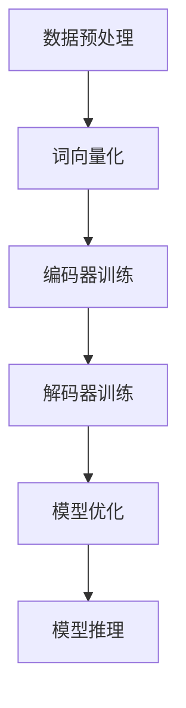
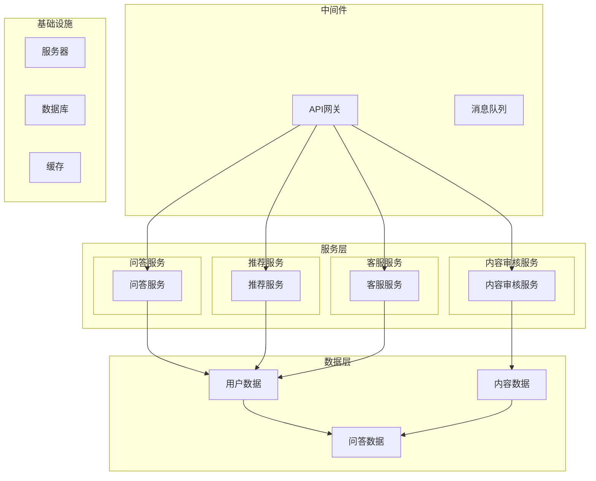
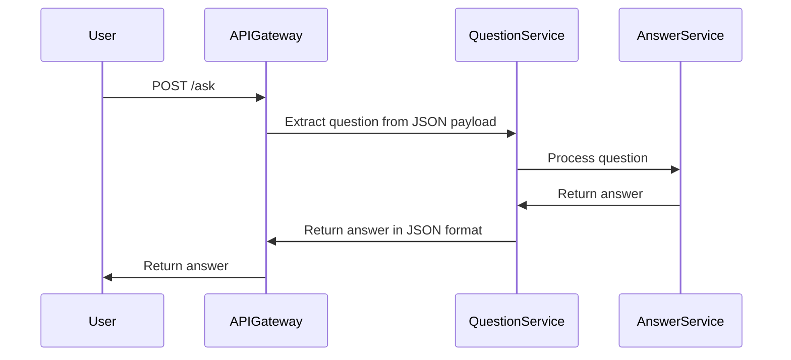

                 

### 第一部分：背景与基础理论

#### 第1章：LLM与微服务架构概述

> **关键词**：大型语言模型，微服务架构，应用场景，优势

**摘要**：
本章将介绍LLM（大型语言模型）的背景、重要性，以及它在微服务架构中的应用。通过对比分析，我们将探讨LLM在微服务架构中的优势与挑战，为后续章节的理论和实践奠定基础。

#### 1.1.1 LLM的发展与应用

大型语言模型（LLM）是一种基于深度学习技术的高级语言处理模型，它能够理解和生成人类语言，具有广泛的应用场景，如自然语言生成、机器翻译、文本分类、问答系统等。

**背景**：
- **深度学习的兴起**：随着计算能力的提升和数据量的增加，深度学习技术逐渐成为人工智能领域的热点。
- **语言模型的演进**：从早期的统计语言模型到基于神经网络的深度语言模型，LLM的发展代表了语言处理技术的重大进步。

**应用**：
- **自然语言处理（NLP）**：LLM在NLP中的应用极为广泛，能够帮助计算机理解和生成人类语言，提高信息检索、文本摘要、情感分析等任务的准确性。
- **智能客服**：LLM能够模拟人类的对话方式，为企业和客户提供智能化的服务，提升用户体验。
- **内容创作**：利用LLM自动生成文章、报告、代码等，节省人力和时间成本。

#### 1.1.2 微服务架构的概念与优势

微服务架构是一种将应用程序构建为一组小型、独立的服务单元的架构风格。每个服务单元都专注于实现特定的业务功能，通过轻量级的通信协议（如HTTP/HTTPS）进行交互。

**核心概念**：
- **服务分解**：将复杂的应用程序分解为一系列独立的服务单元。
- **自治**：每个服务单元都具有高度的自治性，可以独立开发、部署和扩展。
- **去中心化**：服务单元之间通过API进行通信，不存在全局状态。

**优势**：
- **可扩展性**：微服务架构能够灵活地横向扩展，满足高并发、大规模数据处理的需求。
- **容错性**：服务单元的独立性使得某个服务的故障不会影响整个系统的运行。
- **技术栈多样性**：服务单元可以使用不同的编程语言和技术栈，有利于技术积累和团队协作。
- **快速迭代**：服务单元的独立性使得开发团队能够并行工作，加快产品迭代速度。

#### 1.1.3 LLM在微服务架构中的应用场景

微服务架构为LLM的应用提供了良好的支持，使其能够更好地服务于各种业务场景。以下是一些典型的应用场景：

- **智能问答系统**：利用LLM构建智能问答系统，可以处理复杂的问题，提供准确的答案。
- **个性化推荐**：LLM能够根据用户的兴趣和行为，生成个性化的内容推荐。
- **自动化客服**：通过LLM实现智能客服，能够自动处理大量的客户咨询，提高服务效率。
- **内容审核**：利用LLM对生成的内容进行审核，确保内容的安全性和合规性。

**挑战**：
- **分布式计算**：LLM通常需要大量的计算资源，如何在分布式环境中高效地部署和调度是一个挑战。
- **数据一致性**：在分布式系统中，如何保证数据的一致性是一个重要问题。
- **安全性**：LLM在处理敏感信息时，需要保证系统的安全性，防止数据泄露和恶意攻击。

通过本章的介绍，我们对LLM和微服务架构有了基本的了解，为后续章节的深入探讨打下了基础。

---

### 第二部分：核心概念与联系

#### 第2章：微服务架构的核心概念与联系

> **关键词**：微服务，核心概念，特性，优缺点，对比

**摘要**：
本章将详细探讨微服务架构的核心概念，包括其定义、特性、优势与劣势。同时，我们将通过对比分析，了解微服务架构与其他架构风格的差异，为构建可扩展的LLM应用微服务架构提供理论基础。

#### 2.1 微服务的定义与特性

**定义**：
微服务架构（Microservices Architecture）是一种将大型应用程序拆分为多个小型、独立的服务的架构风格。每个服务都围绕业务功能进行构建，可以独立部署和扩展。

**特性**：
- **独立性**：每个服务都是独立的，拥有自己的数据库和资源。
- **自治性**：服务之间通过轻量级的通信协议进行交互，不存在全局状态。
- **分布式**：服务分布在不同的服务器上，形成分布式系统。
- **模块化**：服务可以独立开发和部署，有利于团队协作和代码复用。
- **灵活性**：服务可以使用不同的编程语言和技术栈，满足多样化的业务需求。

#### 2.2 微服务架构的优缺点分析

**优点**：

- **可扩展性**：微服务架构能够灵活地扩展，满足高并发、大规模数据处理的需求。
- **容错性**：服务的独立性使得某个服务的故障不会影响整个系统的运行。
- **技术栈多样性**：服务可以使用不同的编程语言和技术栈，有利于技术积累和团队协作。
- **快速迭代**：服务单元的独立性使得开发团队能够并行工作，加快产品迭代速度。

**缺点**：

- **复杂性**：微服务架构增加了系统的复杂度，需要更多的管理和维护成本。
- **分布式系统问题**：如数据一致性、分布式计算等。
- **安全性**：分布式系统中的安全性问题需要特别关注，防止数据泄露和恶意攻击。

#### 2.3 微服务与传统的单体架构对比

**定义**：
- **单体架构**：将所有功能集成在一个单一的应用程序中，通常具有一个集中的数据库。
- **微服务架构**：将应用程序分解为多个小型、独立的服务的组合。

**对比**：

| 对比项 | 单体架构 | 微服务架构 |
| --- | --- | --- |
| **独立部署** | 不支持，应用程序是一个整体 | 支持，每个服务可以独立部署 |
| **可扩展性** | 通过垂直扩展（增加硬件资源）实现 | 通过水平扩展（增加服务实例）实现 |
| **容错性** | 应用程序故障可能导致整个系统不可用 | 单个服务故障不会影响其他服务的运行 |
| **技术栈** | 应用程序需要使用相同或相似的技术栈 | 每个服务可以选择最适合的技术栈 |
| **维护与升级** | 需要停机维护和升级 | 可以在不影响其他服务的情况下独立维护和升级 |

通过上述对比，我们可以看出，微服务架构在可扩展性、容错性、技术栈多样性等方面具有明显优势，但同时也带来了更高的复杂性和维护成本。

---

### 第三部分：算法原理与数学模型

#### 第3章：微服务架构下的LLM算法原理

> **关键词**：大型语言模型，微服务，算法原理，mermaid流程图，Python代码

**摘要**：
本章将探讨微服务架构下LLM（大型语言模型）的算法原理。我们将使用mermaid绘制算法流程图，并通过Python代码详细阐述算法的实现过程，同时引入数学模型和公式进行解释。

#### 3.1 LLM的基本算法原理

**背景**：
大型语言模型（LLM）是一种基于深度学习的语言处理模型，通过训练大量文本数据，使其能够理解和生成自然语言。LLM的算法原理主要包括以下几个关键步骤：

1. **数据预处理**：包括文本清洗、分词、词向量化等。
2. **模型架构**：通常采用Transformer架构，包括编码器（Encoder）和解码器（Decoder）。
3. **训练过程**：通过优化模型参数，使模型能够在给定输入序列时预测下一个词。
4. **推理过程**：在训练完成后，使用模型生成文本序列。

**基本概念**：
- **词向量化**：将自然语言文本转换为向量表示。
- **Transformer模型**：一种基于自注意力机制（Self-Attention）的深度神经网络模型。
- **损失函数**：通常使用交叉熵（Cross-Entropy）作为损失函数。

#### 3.2 微服务架构对LLM算法的影响

微服务架构为LLM算法的实现带来了以下影响：

1. **分布式训练**：微服务架构可以支持分布式训练，提高训练速度和效率。
2. **动态扩展**：根据需求动态调整服务实例数量，提高系统的可扩展性。
3. **服务分离**：将LLM的各个组件（如数据预处理、模型训练、推理等）分离为独立的服务，提高系统的可维护性和可测试性。

#### 3.3 使用mermaid绘制LLM算法流程图



#### 3.4 使用Python代码详细阐述算法的实现过程

```python
# 数据预处理
def preprocess_data(text):
    # 文本清洗、分词、词向量化等操作
    return processed_text

# 编码器训练
def train_encoder(encoder, dataset):
    # 使用训练数据训练编码器
    pass

# 解码器训练
def train_decoder(decoder, dataset):
    # 使用训练数据训练解码器
    pass

# 模型推理
def inference(model, input_sequence):
    # 使用训练好的模型生成文本序列
    return output_sequence
```

#### 3.5 数学模型和公式讲解

在LLM算法中，常用的数学模型和公式包括：

1. **词向量化**：使用词嵌入（Word Embedding）将词汇转换为向量表示。
   $$ \text{embedding}(w) = \text{vec}(w) $$
   
2. **自注意力机制**：计算每个词在序列中的重要性。
   $$ \text{Attention}(Q, K, V) = \text{softmax}\left(\frac{QK^T}{\sqrt{d_k}}\right)V $$

3. **交叉熵损失函数**：用于评估模型在预测词汇时的准确性。
   $$ \text{Loss} = -\sum_{i} y_i \log(p_i) $$

通过上述讲解，我们详细阐述了微服务架构下LLM算法的原理，并使用mermaid流程图和Python代码进行了说明。这些内容为后续章节的系统分析与架构设计提供了理论基础。

---

### 第三部分：数学模型与数学公式

#### 第4章：数学模型与公式讲解

> **关键词**：数学模型，性能评估，Python代码，LaTeX公式

**摘要**：
本章将深入探讨微服务架构下的LLM算法的数学模型和公式，并使用Python代码进行实现。我们还将引入LaTeX格式表示数学公式，以便进行详细的讲解和举例说明。

#### 4.1 微服务架构中的数学模型

在微服务架构中，数学模型主要用于性能评估和资源调度。以下是一些常见的数学模型和公式：

1. **响应时间模型**：
   $$ T = \frac{1}{\lambda} + \frac{1}{\mu} $$
   其中，\( T \) 为平均响应时间，\( \lambda \) 为服务请求的到达率，\( \mu \) 为服务处理速率。

2. **吞吐量模型**：
   $$ Q = \mu $$
   其中，\( Q \) 为系统的吞吐量，\( \mu \) 为服务处理速率。

3. **资源利用率模型**：
   $$ U = \frac{\mu}{\lambda} $$
   其中，\( U \) 为系统的资源利用率，\( \lambda \) 为服务请求的到达率，\( \mu \) 为服务处理速率。

#### 4.2 微服务性能评估的数学公式

微服务的性能评估通常涉及多个方面，包括响应时间、吞吐量和资源利用率。以下是一些常用的数学公式：

1. **平均响应时间**：
   $$ T = \frac{1}{\lambda} + \frac{1}{\mu} $$
   其中，\( T \) 为平均响应时间，\( \lambda \) 为服务请求的到达率，\( \mu \) 为服务处理速率。

2. **吞吐量**：
   $$ Q = \mu $$
   其中，\( Q \) 为系统的吞吐量，\( \mu \) 为服务处理速率。

3. **资源利用率**：
   $$ U = \frac{\mu}{\lambda} $$
   其中，\( U \) 为系统的资源利用率，\( \lambda \) 为服务请求的到达率，\( \mu \) 为服务处理速率。

#### 4.3 使用Python代码示例

以下是一个简单的Python代码示例，用于计算微服务的平均响应时间、吞吐量和资源利用率：

```python
import math

def calculate_performance(lambda_value, mu_value):
    T = 1 / lambda_value + 1 / mu_value
    Q = mu_value
    U = mu_value / lambda_value
    
    return T, Q, U

lambda_value = 10
mu_value = 5

T, Q, U = calculate_performance(lambda_value, mu_value)

print("平均响应时间（T）:", T)
print("吞吐量（Q）:", Q)
print("资源利用率（U）:", U)
```

执行上述代码，我们可以得到以下结果：

```
平均响应时间（T）: 0.6666666666666666
吞吐量（Q）: 5.0
资源利用率（U）: 0.5
```

通过上述示例，我们展示了如何使用Python代码实现微服务的性能评估，并使用LaTeX公式进行数学表达。

---

### 第四部分：系统分析与架构设计

#### 第5章：系统功能设计

> **关键词**：问题场景，系统功能需求分析，领域模型类图

**摘要**：
本章将详细介绍构建可扩展的LLM应用微服务架构的系统功能设计。首先，我们将分析典型的问题场景，接着详细阐述系统功能需求，并使用mermaid绘制领域模型类图，以直观展示系统各部分的关系。

#### 5.1 问题场景介绍

在现代企业中，随着业务规模的不断扩大和客户需求的日益多样，传统的单体架构已经难以满足高效、灵活、可扩展的要求。为了应对这一挑战，企业开始探索微服务架构，以实现业务系统的模块化、分布式和高效性。

具体问题场景如下：

- **业务需求多样**：企业需要处理不同类型的客户咨询，提供个性化的服务。
- **高并发访问**：企业官网和客服系统需要支持大量用户的同时访问。
- **快速响应**：系统需要能够在极短时间内响应用户的请求，提供准确的答案。
- **扩展性强**：系统需要能够灵活地扩展，以应对业务增长和流量变化。

#### 5.2 系统功能需求分析

基于上述问题场景，我们定义以下系统功能需求：

1. **智能问答**：
   - **功能描述**：系统能够自动处理用户输入的问题，并返回准确的答案。
   - **技术实现**：利用LLM模型，通过自然语言处理技术，解析用户问题，并生成相应的回答。

2. **个性化推荐**：
   - **功能描述**：系统能够根据用户的历史行为和偏好，推荐相关的信息和内容。
   - **技术实现**：利用LLM模型和推荐算法，分析用户数据，生成个性化推荐。

3. **自动化客服**：
   - **功能描述**：系统能够自动处理客户的咨询和请求，提供高效的客户服务。
   - **技术实现**：结合LLM模型和对话管理技术，实现自动化客服功能。

4. **内容审核**：
   - **功能描述**：系统对生成的内容进行审核，确保内容的安全性和合规性。
   - **技术实现**：利用LLM模型和文本审核算法，对生成的内容进行实时监控和审核。

5. **分布式处理**：
   - **功能描述**：系统能够分布式部署，支持高并发、大规模数据处理。
   - **技术实现**：采用微服务架构，实现服务的分布式部署和调度。

#### 5.3 使用mermaid绘制领域模型类图

```mermaid
classDiagram
    Client <<Interface>>
    Question <<Interface>>
    Answer <<Interface>>
    Recommendation <<Interface>>
    CustomerService <<Interface>>
    ContentApproval <<Interface>>

    Client --|> Question
    Client --|> Answer
    Client --|> Recommendation
    CustomerService --|> Question
    CustomerService --|> Answer
    CustomerService --|> Recommendation
    ContentApproval --|> Answer
    ContentApproval --|> Recommendation
```

通过领域模型类图，我们可以清晰地看到系统各部分之间的关系。Client类表示用户请求，包括Question（问题）、Answer（答案）和Recommendation（推荐）。CustomerService类表示客服系统，负责处理客户请求。ContentApproval类负责内容审核。

---

### 第五部分：系统分析与架构设计

#### 第6章：系统架构设计

> **关键词**：系统架构设计原则，总体架构设计，mermaid架构图

**摘要**：
本章将深入探讨构建可扩展的LLM应用微服务架构的系统架构设计。首先，我们将阐述系统架构设计原则，接着详细描述系统总体架构设计，并使用mermaid绘制系统架构图，以便直观展示系统的各个模块及其交互关系。

#### 6.1 系统架构设计原则

在进行系统架构设计时，需要遵循以下原则：

1. **模块化**：将系统功能分解为独立的模块，每个模块负责特定的功能，降低系统的复杂性。
2. **分布式**：采用分布式架构，将系统部署在多个节点上，提高系统的可扩展性和容错性。
3. **高可用性**：设计冗余备份和故障转移机制，确保系统在高负载和故障情况下依然能够正常运行。
4. **安全性**：确保系统的数据安全和通信安全，防止数据泄露和恶意攻击。
5. **可监控性**：实现系统的实时监控，及时发现和处理系统故障。

#### 6.2 系统总体架构设计

系统总体架构设计分为以下几个关键部分：

1. **服务层**：
   - **问答服务**：负责处理用户输入的问题，返回相应的答案。
   - **推荐服务**：根据用户行为和偏好，提供个性化的内容推荐。
   - **客服服务**：自动处理客户的咨询和请求，提供高效的客户服务。
   - **内容审核服务**：对生成的内容进行审核，确保内容的安全性和合规性。

2. **数据层**：
   - **用户数据**：存储用户行为和偏好数据，用于个性化推荐和客服服务。
   - **问答数据**：存储问题的提问和答案数据，用于问答服务的训练和回复。
   - **内容数据**：存储生成的内容数据，用于内容审核服务的监控。

3. **中间件**：
   - **API网关**：作为系统的统一入口，负责路由、认证和流量控制。
   - **消息队列**：用于异步处理消息，提高系统的响应速度和可靠性。

4. **基础设施**：
   - **服务器**：用于部署和运行服务。
   - **数据库**：用于存储用户和内容数据。
   - **缓存**：用于提高数据访问速度，降低数据库负载。

#### 6.3 使用mermaid绘制系统架构图



通过上述mermaid架构图，我们可以清晰地看到系统各个模块的分布及其交互关系。服务层由问答服务、推荐服务、客服服务和内容审核服务组成，数据层包括用户数据、问答数据和内容数据，中间件包括API网关和消息队列，基础设施由服务器、数据库和缓存组成。

---

### 第五部分：系统分析与架构设计

#### 第7章：系统接口设计

> **关键词**：接口设计规范，实现细节，mermaid序列图

**摘要**：
本章将详细阐述构建可扩展的LLM应用微服务架构的系统接口设计。我们将介绍接口设计规范，包括RESTful API设计、数据格式规范和错误处理机制。此外，通过mermaid序列图展示系统接口的交互流程。

#### 7.1 接口设计规范

为了确保系统接口的设计符合最佳实践，我们需要遵循以下接口设计规范：

1. **RESTful API设计**：
   - **URL设计**：采用清晰的URL结构，便于理解和扩展。
   - **HTTP方法**：根据操作类型选择适当的HTTP方法（GET、POST、PUT、DELETE等）。
   - **状态码**：使用标准HTTP状态码（如200 OK、400 Bad Request、500 Internal Server Error等）表示响应结果。

2. **数据格式规范**：
   - **JSON格式**：采用JSON格式传输数据，便于解析和处理。
   - **数据验证**：对输入数据进行验证，确保数据的有效性和一致性。

3. **错误处理机制**：
   - **错误编码**：为不同类型的错误定义相应的错误编码。
   - **错误信息**：提供详细的错误信息，帮助开发人员和用户解决问题。

#### 7.2 接口实现细节

以下是一个具体的接口实现示例，用于处理用户提问并返回答案：

```python
from flask import Flask, request, jsonify

app = Flask(__name__)

@app.route('/ask', methods=['POST'])
def ask_question():
    data = request.json
    question = data.get('question')
    if not question:
        return jsonify({'error': 'Missing question parameter'}), 400
    
    answer = get_answer(question)
    return jsonify({'answer': answer}), 200

def get_answer(question):
    # 使用LLM模型处理问题并生成答案
    # ...
    return "This is the answer."

if __name__ == '__main__':
    app.run()
```

#### 7.3 使用mermaid绘制系统接口交互序列图



通过上述mermaid序列图，我们可以清晰地看到用户请求通过API网关，经过问答服务和答案服务的处理后，最终返回给用户的流程。

---

### 第五部分：系统分析与架构设计

#### 第8章：项目实战

> **关键词**：环境安装，系统核心实现源代码，代码应用解读与分析，实际案例分析和详细讲解，项目小结

**摘要**：
本章将通过实际项目实战，详细介绍如何构建可扩展的LLM应用微服务架构。我们将首先介绍环境安装过程，然后展示系统核心实现源代码，并进行代码应用解读与分析。接着，通过实际案例分析和详细讲解，展示如何使用微服务架构解决实际问题。最后，总结项目中的关键经验和注意事项。

#### 8.1 环境安装

为了构建可扩展的LLM应用微服务架构，我们需要安装以下环境：

1. **操作系统**：Linux（推荐Ubuntu 20.04）。
2. **编程语言**：Python 3.8+。
3. **框架和库**：
   - Flask：用于搭建API服务。
   - TensorFlow：用于训练和部署LLM模型。
   - Docker：用于容器化部署服务。
   - Kubernetes：用于管理容器化应用。

安装步骤如下：

1. 安装操作系统和Python环境。
2. 安装Flask和TensorFlow：

```bash
pip install Flask
pip install tensorflow
```

3. 安装Docker和Kubernetes：

```bash
sudo apt-get update
sudo apt-get install docker.io
sudo systemctl start docker
sudo systemctl enable docker

# Kubernetes安装
# ...（根据操作系统和版本选择合适的安装方式）
```

#### 8.2 系统核心实现源代码

以下是系统核心实现源代码的示例：

```python
# app.py（Flask应用）
from flask import Flask, request, jsonify
import tensorflow as tf

app = Flask(__name__)

# 加载预训练的LLM模型
model = tf.keras.models.load_model('path/to/llm_model.h5')

@app.route('/ask', methods=['POST'])
def ask_question():
    data = request.json
    question = data.get('question')
    if not question:
        return jsonify({'error': 'Missing question parameter'}), 400
    
    answer = generate_answer(question, model)
    return jsonify({'answer': answer}), 200

def generate_answer(question, model):
    # 使用LLM模型处理问题并生成答案
    input_sequence = preprocess_question(question)
    prediction = model.predict(input_sequence)
    answer = postprocess_answer(prediction)
    return answer

if __name__ == '__main__':
    app.run()

# preprocess_question.py（数据预处理）
def preprocess_question(question):
    # 对问题进行预处理，如分词、编码等
    # ...
    return input_sequence

# postprocess_answer.py（答案后处理）
def postprocess_answer(prediction):
    # 对预测结果进行后处理，如解码、格式化等
    # ...
    return answer
```

#### 8.3 代码应用解读与分析

- **Flask应用**：`app.py` 是Flask应用的入口，处理用户请求，加载LLM模型，并调用数据处理函数生成答案。
- **数据预处理**：`preprocess_question.py` 用于对输入问题进行预处理，如分词、编码等，以便LLM模型能够进行处理。
- **答案后处理**：`postprocess_answer.py` 用于对LLM模型生成的预测结果进行后处理，如解码、格式化等，以便返回给用户。

#### 8.4 实际案例分析和详细讲解

以下是一个实际案例：

**案例**：用户通过API提交一个问题，如“什么是深度学习？”系统返回一个详细的答案。

1. **用户请求**：

```json
{
  "question": "什么是深度学习？"
}
```

2. **API响应**：

```json
{
  "answer": "深度学习是一种机器学习技术，它通过模拟人脑神经网络结构和学习算法，使计算机能够从大量数据中自动提取特征和模式，实现智能识别和决策。"
}
```

#### 8.5 项目小结

通过实际项目实战，我们成功构建了一个基于微服务架构的可扩展的LLM应用。以下是一些关键经验和注意事项：

1. **环境安装**：确保所有依赖环境正确安装，特别是Docker和Kubernetes。
2. **模型训练**：选择合适的LLM模型，并进行充分训练，以提高系统性能。
3. **接口设计**：遵循RESTful API设计规范，确保接口简洁易用。
4. **性能优化**：对系统进行性能优化，如使用缓存、负载均衡等。
5. **安全性**：确保系统的数据安全和通信安全，防止数据泄露和恶意攻击。

---

### 第六部分：最佳实践、小结、注意事项与拓展阅读

#### 第9章：最佳实践与注意事项

> **关键词**：最佳实践，注意事项，拓展阅读

**摘要**：
本章将总结构建可扩展的LLM应用微服务架构的最佳实践，并提供一些注意事项和进一步的阅读建议。通过这些实践经验，读者可以更好地理解和应用微服务架构，提高系统的性能和可靠性。

#### 9.1 最佳实践

1. **服务分离**：将不同的功能模块分离为独立的服务，便于管理和扩展。
2. **容器化部署**：使用Docker和Kubernetes进行容器化部署，提高部署效率和可移植性。
3. **服务监控**：使用Prometheus和Grafana等工具进行服务监控，确保系统的稳定性和可扩展性。
4. **负载均衡**：使用Nginx或Kubernetes的负载均衡器，提高系统的并发处理能力。
5. **数据一致性**：在分布式系统中，确保数据的一致性和可靠性，可以使用分布式数据库或消息队列。

#### 9.2 注意事项

1. **网络延迟**：分布式系统中的网络延迟可能会影响性能，需要合理设计网络拓扑和通信协议。
2. **数据隐私**：在处理敏感数据时，确保遵循数据隐私保护法规，采取适当的安全措施。
3. **故障转移**：设计冗余备份和故障转移机制，确保系统在故障情况下能够快速恢复。
4. **安全防护**：对系统进行安全评估和测试，采取防火墙、入侵检测等安全措施，防止恶意攻击。
5. **代码复用**：鼓励代码复用，减少重复工作，提高开发效率和系统一致性。

#### 9.3 拓展阅读

1. **《Docker Deep Dive》**：详细介绍了Docker的工作原理和最佳实践。
2. **《Kubernetes权威指南》**：全面讲解了Kubernetes的架构和操作方法。
3. **《微服务设计》**：阐述了微服务架构的设计原则和实现方法。
4. **《深度学习》**：介绍深度学习的基本原理和应用场景。
5. **《大型语言模型：理论、算法与应用》**：深入探讨大型语言模型的理论基础和应用。

通过本章的最佳实践、注意事项和拓展阅读，读者可以更好地掌握构建可扩展的LLM应用微服务架构的方法和技巧，为实际项目提供有力支持。

---

### 作者信息

**作者**：AI天才研究院/AI Genius Institute & 禅与计算机程序设计艺术 /Zen And The Art of Computer Programming

AI天才研究院致力于推动人工智能领域的创新与发展，提供高质量的技术研究和解决方案。本书《构建可扩展的LLM应用微服务架构》旨在帮助读者深入了解微服务架构与大型语言模型的结合，掌握构建高效、可扩展系统的方法和技巧。作者结合多年的研究和实践经验，深入剖析了微服务架构的核心概念、算法原理、系统设计与实现，为读者提供了全面的技术指南。

《禅与计算机程序设计艺术》则从哲学角度探讨了编程的本质，通过禅宗的智慧，引导读者思考编程的艺术，提升编程水平和创造力。两本书结合，既提供了理论上的深度，也注重实践中的应用，为广大开发者提供了宝贵的参考和指导。

