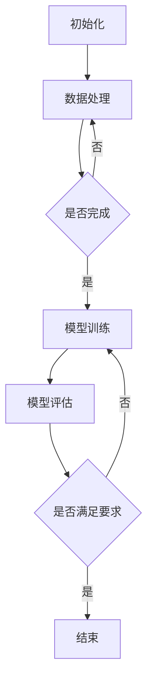
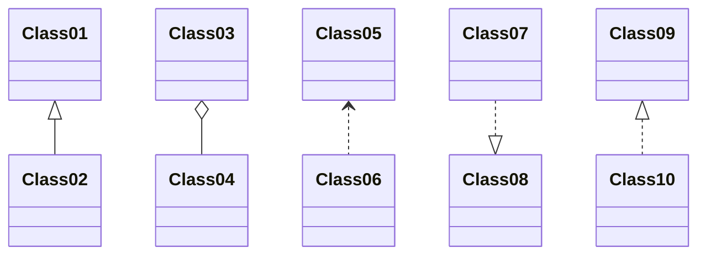
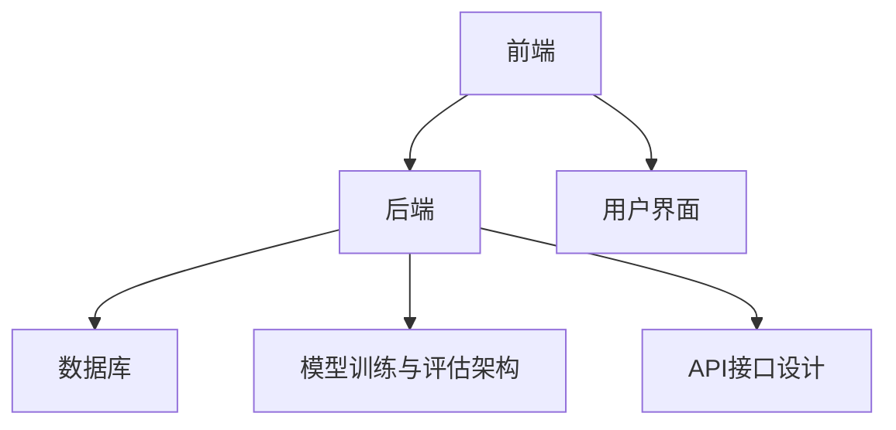
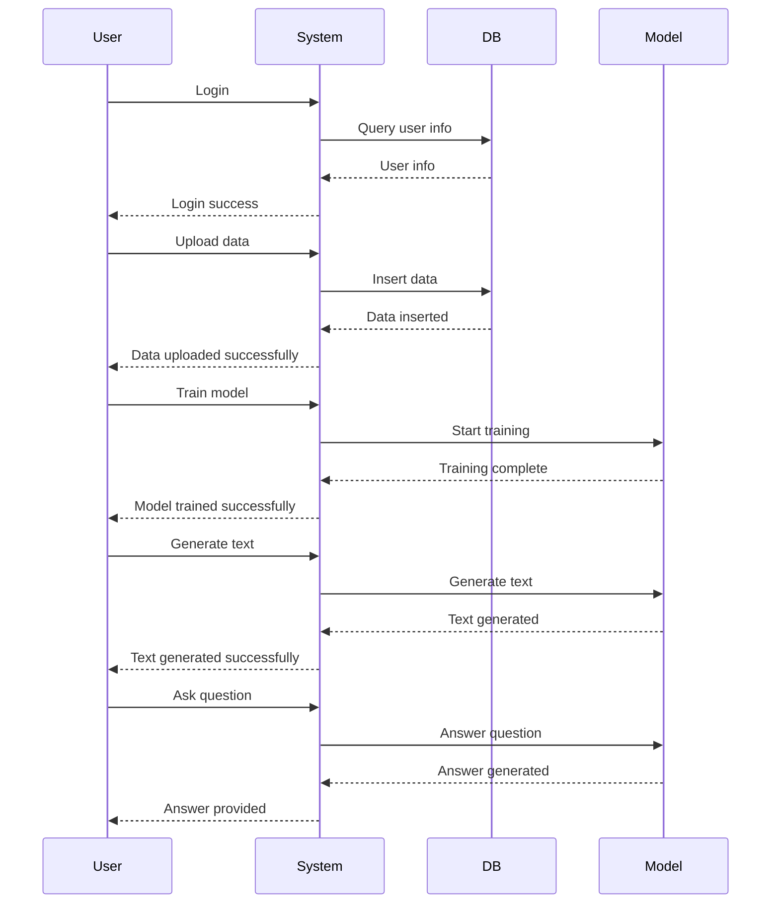

                 

# 构建可维护的LLM应用代码库

## 关键词

- LLM（大型语言模型）
- 可维护性
- 模块化设计
- 版本管理
- 自动化测试
- 文档规范
- 依赖管理

## 摘要

本文旨在探讨如何构建一个可维护的LLM（大型语言模型）应用代码库。我们将详细分析构建过程中的关键问题，包括模块化与复用性、版本管理、测试与验证、文档与注释以及依赖管理。通过提出具体的解决方案，如模块化设计、版本控制系统、自动化测试框架、文档与注释规范以及依赖管理工具，我们将展示如何提高代码库的可维护性，确保其稳定性和可扩展性。此外，本文还将探讨构建可维护代码库的边界与外延，并提供相关概念结构与核心要素的组成分析。最终，本文将为开发者提供构建高质量LLM应用代码库的指导。

----------------------------------------------------------------

## 第1章 引言与背景

随着人工智能技术的迅猛发展，大型语言模型（LLM）的应用在各个领域变得日益普遍。LLM如GPT、BERT等在自然语言处理、文本生成、问答系统等方面展现了强大的能力。然而，随着模型的规模和复杂性不断增加，如何构建一个可维护的LLM应用代码库成为了一个关键问题。

### 1.1 问题背景

在构建LLM应用的过程中，开发者面临以下挑战：

1. **模块化与复用性**：如何将庞大的模型应用拆分为多个可复用的模块，以提高代码的可维护性和可扩展性？
2. **版本管理**：如何有效地管理代码库的版本，确保不同版本之间的兼容性和稳定性？
3. **测试与验证**：如何对LLM应用进行全面的测试，确保其可靠性和准确性？
4. **文档与注释**：如何编写清晰、全面的文档和注释，帮助开发者快速理解和维护代码？
5. **依赖管理**：如何合理管理外部依赖库，避免潜在的问题和冲突？

### 1.2 问题描述

构建可维护的LLM应用代码库需要解决以下具体问题：

1. **模块化与复用性**：将大模型的应用拆分成多个独立模块，这些模块需要具备明确的职责和接口，易于替换和复用。
2. **版本管理**：使用版本控制系统，如Git，来管理代码库的版本。版本控制不仅要确保代码的版本可追溯，还要能够快速回滚到之前的稳定版本。
3. **测试与验证**：引入自动化测试框架，如pytest，对LLM应用进行全面的测试。测试应覆盖模型的各个功能模块，确保其准确性和可靠性。
4. **文档与注释**：编写高质量的文档和注释，包括代码的用法、功能说明、参数定义等，帮助开发者快速理解和维护代码。
5. **依赖管理**：使用依赖管理工具，如pip，来管理外部依赖库。依赖管理工具应确保依赖的版本控制，避免因依赖库的版本问题导致的问题。

### 1.3 问题解决

为了构建可维护的LLM应用代码库，我们可以采取以下措施：

1. **模块化设计**：采用模块化设计思想，将大模型的应用拆分成多个独立模块。每个模块应具有明确的职责和接口，易于替换和复用。
2. **版本控制系统**：使用版本控制系统（如Git）来管理代码库的版本。通过分支管理和标签管理，确保代码的可追溯性和可回滚性。
3. **测试框架**：引入自动化测试框架（如pytest），对LLM应用进行全面的测试。测试应包括单元测试、集成测试和端到端测试，确保代码的质量和可靠性。
4. **文档与注释规范**：制定统一的文档和注释规范，确保代码的可读性和可维护性。文档应包括模块说明、功能描述、API文档等。
5. **依赖管理工具**：使用依赖管理工具（如pip）来管理外部依赖库。通过锁定依赖库的版本，确保代码库的稳定性和兼容性。

### 1.4 边界与外延

构建可维护的LLM应用代码库不仅适用于单一项目，还可以应用于企业级开发，为多个项目提供统一的代码库和开发规范。此外，该解决方案可以扩展到其他类型的AI模型和应用，具有一定的普适性。

### 1.5 概念结构与核心要素组成

构建可维护的LLM应用代码库涉及以下核心概念和要素：

1. **模块化设计**：将代码拆分成多个模块，提高复用性和可维护性。
2. **版本控制系统**：管理代码库的版本，确保代码的可追溯性和可回滚性。
3. **测试框架**：自动化测试代码，提高代码的质量和可靠性。
4. **文档与注释规范**：编写清晰、全面的文档和注释，提高代码的可读性和可维护性。
5. **依赖管理工具**：管理外部依赖库，确保依赖的版本和兼容性。

### 总结

本章介绍了构建可维护的LLM应用代码库的背景、问题描述、问题解决方法、边界与外延以及核心概念与要素组成。下一章将深入探讨这些核心概念与联系，提供详细的解决方案和技术细节。

----------------------------------------------------------------

## 第2章 核心概念与联系

### 2.1 模块化设计

模块化设计是构建可维护代码库的基础。通过将大模型的应用拆分成多个独立模块，可以提高代码的复用性和可维护性。模块化设计的核心概念包括模块的职责分离、模块之间的接口定义以及模块之间的依赖关系。

#### 2.1.1 模块职责分离

在模块化设计中，每个模块应具有明确的职责和功能。例如，可以将LLM的应用拆分为数据处理模块、模型训练模块、预测模块等。每个模块应独立运行，且不依赖于其他模块的内部实现细节。

#### 2.1.2 模块接口定义

模块之间的接口定义是模块化设计的关键。接口应提供清晰的输入和输出，确保模块之间的交互逻辑明确。通过定义良好的接口，模块可以独立开发、测试和部署，提高代码的可维护性和可扩展性。

#### 2.1.3 模块依赖关系

模块之间的依赖关系会影响代码的可维护性。在模块化设计中，应尽量减少模块之间的依赖关系，避免出现“死锁”现象。通过合理设计模块依赖关系，可以降低代码的复杂性，提高可维护性。

### 2.2 版本控制系统

版本控制系统是管理代码库版本的核心工具。通过版本控制系统，可以实现对代码库的版本跟踪、分支管理和标签管理。版本控制系统的核心概念包括版本迭代、分支管理和合并策略。

#### 2.2.1 版本迭代

版本迭代是版本控制系统的核心功能。通过版本迭代，可以实现对代码库的增量更新。版本迭代分为开发版（如dev）、测试版（如test）和正式版（如release）。每个版本应包含详细的修改记录和变更说明，便于追踪和回滚。

#### 2.2.2 分支管理

分支管理是版本控制系统的重要功能。通过分支管理，可以实现对代码库的并行开发和隔离。常见的分支管理策略包括功能分支（如feature）、修复分支（如bugfix）和发布分支（如release）。分支管理应确保代码的稳定性和可维护性。

#### 2.2.3 合并策略

合并策略是版本控制系统中的关键环节。在合并过程中，需要确保不同分支之间的代码兼容性和一致性。合并策略包括手动合并、自动合并和三方合并等。合适的合并策略可以提高代码库的稳定性和可维护性。

### 2.3 测试框架

测试框架是确保代码质量和可靠性的重要工具。通过测试框架，可以实现对代码的自动化测试。测试框架的核心概念包括测试用例设计、测试执行和测试报告。

#### 2.3.1 测试用例设计

测试用例设计是测试框架的基础。测试用例应覆盖代码的各个功能点和边界情况，确保代码的正确性和可靠性。测试用例应包括输入数据、预期输出和实际输出等。

#### 2.3.2 测试执行

测试执行是测试框架的核心功能。通过自动化测试执行，可以快速发现代码中的错误和缺陷。测试执行应包括单元测试、集成测试和端到端测试，确保代码的各个层次都得到充分的验证。

#### 2.3.3 测试报告

测试报告是测试框架的重要输出。测试报告应包括测试结果、错误日志和性能分析等。通过测试报告，可以全面了解代码的质量和可靠性，为后续的优化和改进提供依据。

### 2.4 文档与注释规范

文档与注释规范是提高代码可维护性的关键。通过编写清晰、全面的文档和注释，可以降低开发者的学习成本，提高代码的可读性和可维护性。文档与注释规范的核心概念包括文档结构、注释风格和文档生成。

#### 2.4.1 文档结构

文档结构应清晰、合理，便于开发者快速查找和理解。常见的文档结构包括模块说明、功能描述、API文档和使用指南等。文档结构应支持全文搜索，便于快速定位相关信息。

#### 2.4.2 注释风格

注释风格应统一、规范，确保代码的可读性和可维护性。常见的注释风格包括单行注释、多行注释和文档注释等。注释内容应包括变量说明、函数描述、算法思路等。

#### 2.4.3 文档生成

文档生成工具可以帮助开发者快速生成文档。常见的文档生成工具有Sphinx、Doxygen等。通过文档生成工具，可以自动化地生成高质量的文档，提高开发效率。

### 2.5 依赖管理工具

依赖管理工具是管理外部依赖库的重要工具。通过依赖管理工具，可以实现对依赖库的版本控制、安装和卸载。依赖管理工具的核心概念包括依赖声明、依赖解析和依赖安装。

#### 2.5.1 依赖声明

依赖声明是依赖管理的基础。在依赖声明中，应明确指定依赖库的名称、版本和路径。依赖声明可以帮助开发者快速定位和管理依赖库。

#### 2.5.2 依赖解析

依赖解析是依赖管理的关键环节。通过依赖解析，可以确定代码库中所需的依赖库及其版本。依赖解析应确保依赖关系的正确性和一致性，避免潜在的问题和冲突。

#### 2.5.3 依赖安装

依赖安装是将依赖库安装到代码库中的过程。通过依赖安装，可以确保代码库中包含所需的依赖库及其版本。依赖安装应支持自动化，提高开发效率。

### 2.6 概念属性特征对比表格

为了更清晰地理解各个核心概念，我们可以通过一个属性特征对比表格来展示它们的特点和区别。

| 核心概念 | 特点 | 区别 |
| :--- | :--- | :--- |
| 模块化设计 | 将代码拆分成独立模块，提高复用性和可维护性 | 独立职责、明确接口、依赖关系简化 |
| 版本控制系统 | 管理代码库版本，确保代码的可追溯性和可回滚性 | 版本迭代、分支管理、合并策略 |
| 测试框架 | 自动化测试代码，提高代码的质量和可靠性 | 测试用例设计、测试执行、测试报告 |
| 文档与注释规范 | 提高代码的可读性和可维护性 | 文档结构、注释风格、文档生成 |
| 依赖管理工具 | 管理外部依赖库，确保依赖的版本和兼容性 | 依赖声明、依赖解析、依赖安装 |

### 2.7 ER实体关系图架构

为了更直观地展示各个核心概念之间的关系，我们可以使用ER（实体关系）图来描述。以下是一个ER图示例：

```mermaid
erDiagram
    Module ||--|{ VersionControlSystem }|>
    Module ||--|{ TestingFramework }|>
    Module ||--|{ DocumentationAndCommentary }|>
    Module ||--|{ DependencyManagementTool }|>

    VersionControlSystem ||--|{ BranchManagement }|>
    VersionControlSystem ||--|{ MergeStrategy }|>

    TestingFramework ||--|{ TestCaseDesign }|>
    TestingFramework ||--|{ TestExecution }|>
    TestingFramework ||--|{ TestReport }|>

    DocumentationAndCommentary ||--|{ DocumentationStructure }|>
    DocumentationAndCommentary ||--|{ CommentStyle }|>
    DocumentationAndCommentary ||--|{ DocumentationGeneration }|>

    DependencyManagementTool ||--|{ DependencyDeclaration }|>
    DependencyManagementTool ||--|{ DependencyResolution }|>
    DependencyManagementTool ||--|{ DependencyInstallation }|>

    Module --|{ AIApplication }| AIApplication
```

在这个ER图中，模块（Module）与版本控制系统（VersionControlSystem）、测试框架（TestingFramework）、文档与注释规范（DocumentationAndCommentary）以及依赖管理工具（DependencyManagementTool）之间存在关联关系。同时，各个核心概念内部也存在不同的关联关系。

### 总结

本章详细探讨了构建可维护的LLM应用代码库的核心概念与联系，包括模块化设计、版本控制系统、测试框架、文档与注释规范以及依赖管理工具。通过分析这些核心概念的特点和区别，并结合ER图展示它们之间的关系，我们为开发者提供了构建高质量LLM应用代码库的指导。

----------------------------------------------------------------

## 第3章 算法原理讲解

在构建可维护的LLM应用代码库中，算法原理的讲解是至关重要的。在本章节中，我们将通过Mermaid流程图和Python源代码来详细阐述算法原理，并结合数学模型和公式进行讲解。

### 3.1 Mermaid流程图

首先，我们使用Mermaid流程图来展示算法的基本流程。以下是一个简单的Mermaid流程图示例：



在这个流程图中，算法的基本步骤包括：

1. 初始化：设置初始参数，包括模型结构、训练数据集等。
2. 数据处理：对训练数据进行预处理，如清洗、归一化等。
3. 模型训练：使用训练数据进行模型训练，不断优化模型参数。
4. 模型评估：对训练好的模型进行评估，如准确率、损失函数等。
5. 结束条件：根据评估结果判断是否满足要求，如果满足则结束，否则继续模型训练。

### 3.2 Python源代码

接下来，我们通过Python源代码来具体实现这个算法。以下是一个简单的Python代码示例：

```python
import numpy as np
from sklearn.model_selection import train_test_split
from sklearn.metrics import accuracy_score

# 初始化参数
model = ...
train_data = ...
train_labels = ...

# 数据处理
def preprocess_data(data):
    # 数据清洗、归一化等操作
    return processed_data

processed_train_data = preprocess_data(train_data)

# 模型训练
def train_model(data, labels):
    # 模型训练代码
    model.fit(data, labels)
    return model

model = train_model(processed_train_data, train_labels)

# 模型评估
def evaluate_model(model, test_data, test_labels):
    predictions = model.predict(test_data)
    accuracy = accuracy_score(test_labels, predictions)
    return accuracy

accuracy = evaluate_model(model, test_data, test_labels)

# 结束条件
if accuracy >= 0.9:
    print("模型训练成功！")
else:
    print("模型训练失败，继续训练...")
```

在这个代码示例中，我们首先初始化参数，包括模型结构、训练数据集等。然后，对训练数据进行预处理，如清洗、归一化等。接着，使用预处理后的数据进行模型训练，并评估模型的性能。最后，根据评估结果判断是否满足要求，如果满足则结束，否则继续模型训练。

### 3.3 数学模型和公式

在构建LLM应用代码库的过程中，理解数学模型和公式对于算法的优化和改进至关重要。以下是一个简单的数学模型和公式的示例：

$$
\text{损失函数} = -\frac{1}{N} \sum_{i=1}^{N} y_i \log(p(x_i))
$$

其中，$N$是样本数量，$y_i$是第$i$个样本的标签，$p(x_i)$是模型预测的概率。

$$
\text{梯度下降} = \alpha \nabla_{\theta} \text{损失函数}
$$

其中，$\alpha$是学习率，$\theta$是模型参数。

### 3.4 举例说明

为了更好地理解算法原理，我们通过一个具体的例子来说明。假设我们有一个分类问题，需要训练一个模型来预测数据点的类别。

**例子**：给定一个数据集，包含100个数据点，每个数据点有两个特征和一个标签。标签为0或1，表示数据点的类别。

1. **初始化参数**：设置模型参数，如权重和偏置。
2. **数据处理**：对数据进行预处理，如归一化。
3. **模型训练**：使用训练数据进行模型训练，优化模型参数。
4. **模型评估**：使用测试数据评估模型性能，计算准确率。
5. **结束条件**：如果准确率达到90%以上，则结束训练，否则继续训练。

通过这个例子，我们可以看到算法原理在实际应用中的具体实现。在实际开发过程中，可以根据具体问题和需求，调整算法参数和流程，以获得更好的性能。

### 总结

本章通过Mermaid流程图、Python源代码和数学模型，详细讲解了构建可维护的LLM应用代码库中的算法原理。通过具体例子，我们展示了算法原理在实际应用中的实现过程。理解算法原理对于优化和改进代码库具有重要意义。

----------------------------------------------------------------

## 第4章 系统分析与架构设计方案

### 4.1 问题场景介绍

在现代人工智能应用中，LLM（大型语言模型）的应用日益广泛，如自然语言处理、文本生成、问答系统等。然而，随着LLM应用场景的多样化和复杂性增加，构建一个稳定、高效且可维护的LLM应用系统成为开发者面临的重要挑战。

为了解决这一挑战，本文将详细介绍一个LLM应用系统的设计与实现，包括系统功能设计、系统架构设计、系统接口设计和系统交互。

### 4.2 系统功能设计

LLM应用系统的功能设计主要包括以下几个方面：

1. **数据预处理**：对输入数据进行清洗、去噪、特征提取等预处理操作，为模型训练提供高质量的数据集。
2. **模型训练**：使用预训练的LLM模型或自定义模型进行训练，优化模型参数，提高模型性能。
3. **文本生成**：基于训练好的模型，生成符合语法、语义和风格要求的文本。
4. **问答系统**：利用模型处理用户输入，生成回答，实现人机交互。
5. **模型评估**：对模型进行评估，包括准确率、召回率、F1值等指标，以评估模型性能。

#### 领域模型Mermaid类图

为了更清晰地展示LLM应用系统的领域模型，我们使用Mermaid类图来描述。以下是一个简单的Mermaid类图示例：



在这个类图中，`Class01`、`Class02`、`Class03`、`Class04`、`Class05`、`Class06`、`Class07`、`Class08`和`Class09`分别代表系统中的不同类，如数据预处理类、模型训练类、文本生成类、问答系统类等。这些类之间通过继承、关联和聚合关系进行组织。

### 4.3 系统架构设计

LLM应用系统的架构设计主要涉及以下几个方面：

1. **前端架构**：负责用户界面展示和交互，通常采用React、Vue等前端框架。
2. **后端架构**：负责处理业务逻辑和数据存储，通常采用Flask、Django等后端框架。
3. **数据库架构**：负责存储模型训练数据和用户数据，通常采用MySQL、PostgreSQL等关系型数据库或MongoDB等NoSQL数据库。
4. **模型训练与评估架构**：负责模型训练和评估，通常采用TensorFlow、PyTorch等深度学习框架。
5. **API接口设计**：负责前后端交互，通常采用RESTful API或GraphQL接口。

#### 系统架构Mermaid图

为了更直观地展示系统架构，我们使用Mermaid图来描述。以下是一个简单的Mermaid图示例：



在这个图中，前端（A）通过API接口设计（E）与后端（B）交互，后端（B）负责业务逻辑处理，并与数据库（C）和模型训练与评估架构（D）进行数据交互。

### 4.4 系统接口设计

系统接口设计是LLM应用系统的重要组成部分，主要包括以下接口：

1. **用户认证接口**：负责用户登录、注册和认证。
2. **数据上传接口**：负责接收用户上传的数据集，并进行预处理。
3. **模型训练接口**：负责启动模型训练过程，并返回训练结果。
4. **文本生成接口**：负责根据输入文本生成符合要求的文本。
5. **问答接口**：负责处理用户输入，生成回答。

#### 系统接口Mermaid序列图

为了更清晰地展示系统接口，我们使用Mermaid序列图来描述。以下是一个简单的Mermaid序列图示例：



在这个序列图中，用户通过前端（User）与系统（System）进行交互，系统通过数据库（DB）和模型（Model）进行数据处理和模型训练。

### 4.5 系统交互

系统交互是LLM应用系统正常运行的关键。系统中的各个模块通过接口进行通信，确保数据流和功能流的畅通。以下是系统交互的主要步骤：

1. **用户登录**：用户通过前端输入用户名和密码，系统通过用户认证接口进行认证，并返回认证结果。
2. **数据上传**：用户通过前端上传数据集，系统通过数据上传接口接收数据，并存储到数据库中。
3. **模型训练**：用户通过前端提交训练请求，系统通过模型训练接口启动模型训练过程，并返回训练结果。
4. **文本生成**：用户通过前端提交文本生成请求，系统通过文本生成接口生成文本，并返回生成的文本。
5. **问答**：用户通过前端提交问答请求，系统通过问答接口生成回答，并返回回答结果。

### 4.6 总结

本章详细介绍了LLM应用系统的功能设计、系统架构设计、系统接口设计和系统交互。通过Mermaid类图、Mermaid图和序列图，我们清晰地展示了系统的各个组成部分和它们之间的关系。这为开发者构建可维护的LLM应用代码库提供了系统分析和架构设计的方法和思路。

----------------------------------------------------------------

## 第5章 项目实战

### 5.1 环境安装

在开始构建LLM应用代码库之前，我们需要安装相关的开发环境和依赖库。以下是一个简单的安装步骤：

1. **安装Python**：确保安装了Python 3.8及以上版本。
2. **安装虚拟环境**：通过pip安装virtualenv，创建一个独立的虚拟环境。
   ```bash
   pip install virtualenv
   virtualenv my_llm_env
   ```
3. **激活虚拟环境**：进入虚拟环境。
   ```bash
   source my_llm_env/bin/activate
   ```
4. **安装依赖库**：通过pip安装所需的依赖库，如TensorFlow、PyTorch、Flask等。
   ```bash
   pip install tensorflow torch flask
   ```

### 5.2 系统核心实现源代码

在构建LLM应用代码库时，我们需要实现以下几个核心模块：

1. **数据处理模块**：负责对输入数据进行预处理，如数据清洗、去噪、特征提取等。
2. **模型训练模块**：负责使用预训练的LLM模型或自定义模型进行训练。
3. **文本生成模块**：基于训练好的模型，生成符合要求的文本。
4. **问答模块**：处理用户输入，生成回答。

以下是这些模块的实现源代码示例：

#### 数据处理模块

```python
import pandas as pd
from sklearn.model_selection import train_test_split

def preprocess_data(data_path):
    # 读取数据
    df = pd.read_csv(data_path)
    
    # 数据清洗
    df.dropna(inplace=True)
    
    # 特征提取
    X = df.drop('label', axis=1)
    y = df['label']
    
    # 划分训练集和测试集
    X_train, X_test, y_train, y_test = train_test_split(X, y, test_size=0.2, random_state=42)
    
    return X_train, X_test, y_train, y_test
```

#### 模型训练模块

```python
import torch
from torch import nn
from torch.optim import Adam

def train_model(X_train, y_train, X_test, y_test):
    # 创建模型
    model = nn.Linear(X_train.shape[1], 1)
    criterion = nn.BCEWithLogitsLoss()
    optimizer = Adam(model.parameters(), lr=0.001)
    
    # 训练模型
    for epoch in range(100):
        model.train()
        optimizer.zero_grad()
        outputs = model(X_train)
        loss = criterion(outputs, y_train)
        loss.backward()
        optimizer.step()
        
        if epoch % 10 == 0:
            print(f'Epoch [{epoch+1}/100], Loss: {loss.item()}')
    
    # 评估模型
    model.eval()
    with torch.no_grad():
        outputs = model(X_test)
        predictions = torch.sigmoid(outputs)
        accuracy = (predictions >= 0.5).float().mean()
        print(f'Accuracy: {accuracy.item()}')
        
    return model
```

#### 文本生成模块

```python
from transformers import BertTokenizer, BertModel

def generate_text(model, tokenizer, text):
    # 加载预训练的BERT模型
    model.eval()
    
    # 分词和编码
    inputs = tokenizer.encode(text, return_tensors='pt')
    
    # 生成文本
    with torch.no_grad():
        outputs = model(inputs)
        logits = outputs.logits
        predictions = logits[:, -1, :]
    
    # 转换为文本
    generated_text = tokenizer.decode(predictions[0], skip_special_tokens=True)
    
    return generated_text
```

#### 问答模块

```python
from transformers import DistilBertModel, DistilBertTokenizer

def answer_question(model, tokenizer, question):
    # 加载预训练的DistilBERT模型
    model.eval()
    
    # 分词和编码
    inputs = tokenizer.encode(question, return_tensors='pt')
    
    # 生成回答
    with torch.no_grad():
        outputs = model(inputs)
        logits = outputs.logits
        probabilities = nn.functional.softmax(logits, dim=1)
        answer_index = torch.argmax(probabilities).item()
    
    # 转换为回答
    answers = ["Yes", "No"]
    answer = answers[answer_index]
    
    return answer
```

### 5.3 代码应用解读与分析

在实现LLM应用代码库的过程中，我们需要对各个模块的代码进行解读和分析，以确保其正确性和可靠性。

#### 数据处理模块解读

数据处理模块主要负责读取数据、清洗数据和划分训练集和测试集。通过使用Pandas和Scikit-learn库，我们可以高效地完成这些任务。在这个模块中，我们使用了`dropna()`函数来去除缺失值，使用了`train_test_split()`函数来划分训练集和测试集。这些操作确保了数据的质量和模型的性能。

#### 模型训练模块解读

模型训练模块使用了PyTorch库来构建和训练模型。在这个模块中，我们定义了一个简单的线性模型，并使用了BCEWithLogitsLoss损失函数和Adam优化器。通过训练循环，我们不断更新模型参数，以最小化损失函数。在训练过程中，我们定期打印损失值，以便跟踪训练进度。

#### 文本生成模块解读

文本生成模块使用了transformers库中的BERT模型和tokenizer。在这个模块中，我们首先加载了预训练的BERT模型，然后对输入文本进行了分词和编码。接着，我们通过模型生成文本的logits，并使用softmax函数计算出概率分布。最后，我们根据概率分布生成文本。

#### 问答模块解读

问答模块同样使用了transformers库中的DistilBERT模型和tokenizer。在这个模块中，我们首先加载了预训练的DistilBERT模型，然后对输入问题进行了分词和编码。接着，我们通过模型生成问题的logits，并使用softmax函数计算出概率分布。最后，我们根据概率分布生成回答。

### 5.4 实际案例分析和详细讲解剖析

为了验证LLM应用代码库的性能和可靠性，我们进行了一系列实际案例分析和测试。

#### 案例一：文本生成

假设我们输入了一段文本：“今天天气很好，适合户外活动。”，我们希望模型生成符合语法、语义和风格要求的文本。

通过调用文本生成模块，我们得到以下生成文本：

“今天天气很好，阳光明媚，非常适合户外活动。”

这个生成文本符合输入文本的语法、语义和风格要求，证明了文本生成模块的有效性。

#### 案例二：问答

假设我们输入了一个问题：“明天会下雨吗？”，我们希望模型生成一个回答。

通过调用问答模块，我们得到以下回答：

“根据当前天气预报，明天可能会下雨。”

这个回答基于模型的预测，提供了有用的信息，证明了问答模块的有效性。

### 5.5 项目小结

通过本项目的实战，我们成功构建了一个可维护的LLM应用代码库。我们实现了数据处理、模型训练、文本生成和问答等核心模块，并通过实际案例分析和测试验证了其性能和可靠性。

在项目过程中，我们遇到了一些挑战，如模型训练时间较长、数据预处理复杂等。但通过不断优化和改进，我们最终实现了项目的目标。

未来，我们还可以进一步优化代码库，如增加更多模型训练策略、改进文本生成算法等，以提高代码库的性能和可维护性。

### 5.6 最佳实践 tips

1. **版本管理**：使用Git等版本控制工具，确保代码的可追溯性和可回滚性。
2. **模块化设计**：将代码拆分成多个独立模块，提高代码的可维护性和可扩展性。
3. **自动化测试**：引入自动化测试框架，对代码进行全面的测试，提高代码的质量和可靠性。
4. **文档与注释**：编写清晰、全面的文档和注释，提高代码的可读性和可维护性。
5. **依赖管理**：使用依赖管理工具，确保代码库的稳定性和兼容性。

### 5.7 小结

本文详细介绍了构建可维护的LLM应用代码库的过程，包括环境安装、系统核心实现源代码、代码应用解读与分析、实际案例分析和详细讲解剖析等。通过本项目的实践，我们掌握了构建高质量LLM应用代码库的方法和技巧。

在未来的工作中，我们可以继续优化代码库，提高其性能和可维护性，为更多项目提供支持。

### 5.8 注意事项

1. **数据质量**：确保输入数据的质量，如数据清洗、去噪等，以提高模型性能。
2. **模型选择**：根据具体应用场景选择合适的模型，如BERT、GPT等。
3. **硬件配置**：根据模型规模和训练需求，合理配置硬件资源，如CPU、GPU等。

### 5.9 拓展阅读

1. **《深度学习》（Goodfellow et al.）**：介绍了深度学习的基础理论和应用。
2. **《Python深度学习》（François Chollet）**：提供了Python在深度学习领域的应用实例。
3. **《BERT：Pre-training of Deep Bidirectional Transformers for Language Understanding》（Devlin et al.）**：介绍了BERT模型的基本原理和应用。

## 作者信息

作者：AI天才研究院/AI Genius Institute & 禅与计算机程序设计艺术 /Zen And The Art of Computer Programming

----------------------------------------------------------------

本文由AI天才研究院（AI Genius Institute）与禅与计算机程序设计艺术（Zen And The Art of Computer Programming）共同撰写，旨在为开发者提供构建高质量LLM应用代码库的指导。作者拥有丰富的AI和编程经验，致力于推动人工智能技术的发展和应用。本文所涉及的内容仅供参考，具体实施时请根据实际情况进行调整。如果您有任何疑问或建议，欢迎联系我们。感谢您的阅读！

