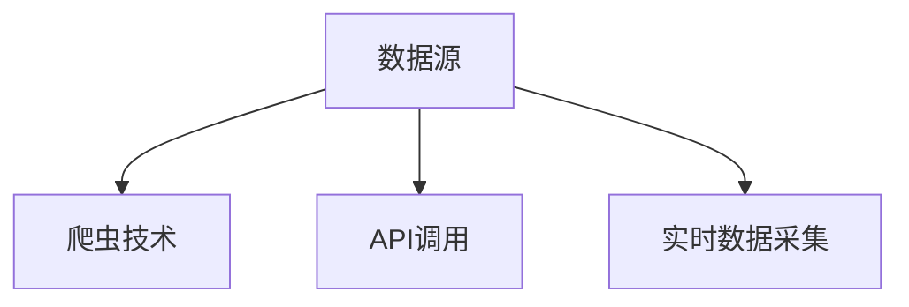
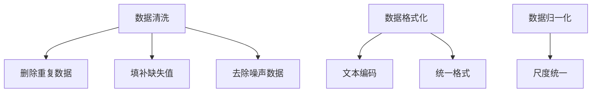
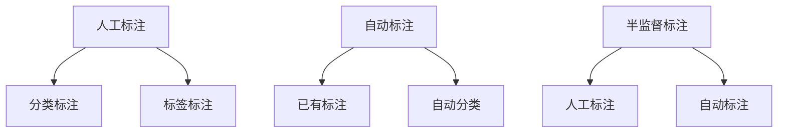
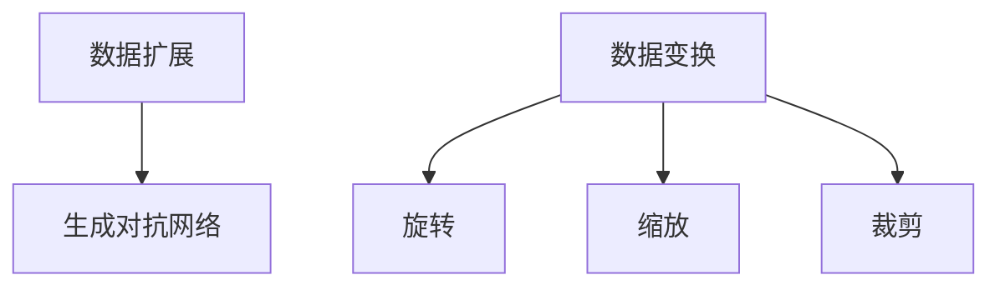
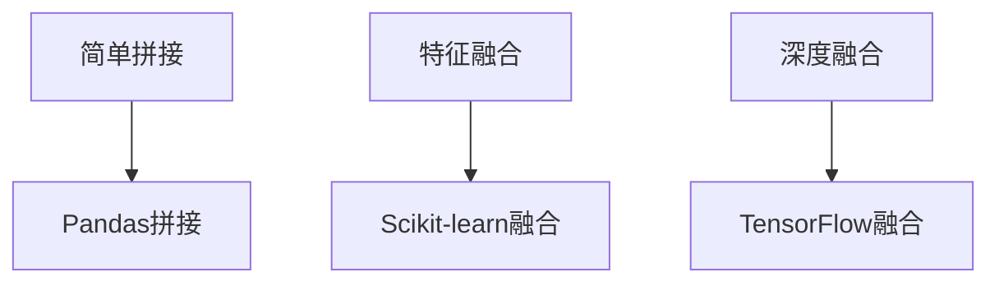
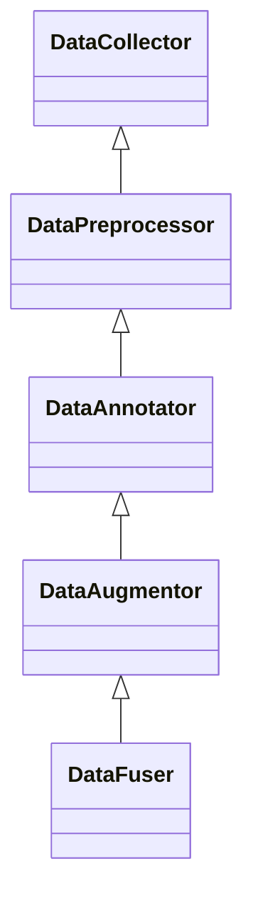
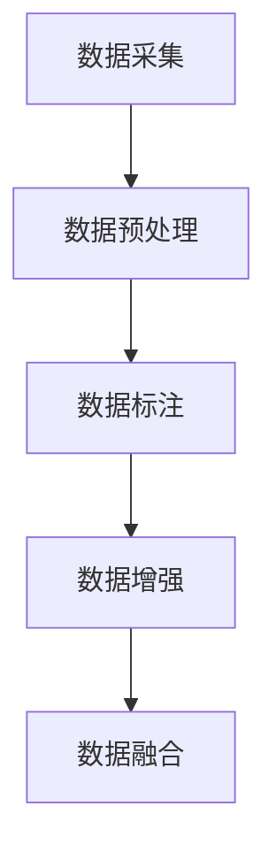
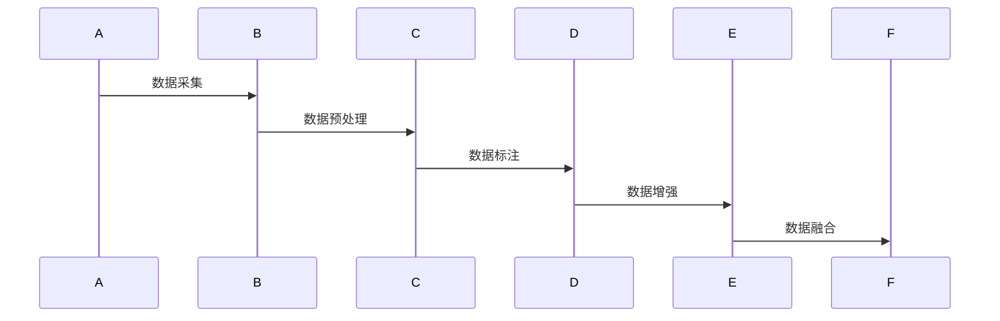

                 

### 构建多样化的评测数据集策略

#### 引言

在人工智能领域，评测数据集的质量直接影响模型的性能和应用效果。一个多样化、高质量的数据集不仅能够提高模型的泛化能力，还能增强其在现实世界中的应用效果。本文将围绕构建多样化评测数据集的策略进行详细探讨，旨在为读者提供一套实用的方法，以解决数据集构建过程中的各种挑战。

#### 第一部分：背景介绍

##### 1. 问题背景

随着人工智能技术的迅猛发展，特别是在深度学习、自然语言处理等领域的突破，数据质量在人工智能应用中的重要性日益凸显。然而，高质量的评测数据集的构建是一个复杂且耗时的过程。构建一个多样化的评测数据集需要考虑数据的准确性、代表性、全面性和可解释性。同时，数据来源有限、标注成本高、数据清洗难度大等挑战也使得数据集构建过程变得复杂。

##### 2. 问题描述

构建多样化评测数据集的策略，不仅要涵盖数据集的多样性，还需要考虑数据的准确性、代表性、全面性和可解释性。同时，还要面对数据来源有限、标注成本高、数据清洗难度大等挑战。具体来说，问题包括：
- 数据来源多样化：如何从不同来源获取高质量的数据？
- 数据标注：如何高效地进行数据标注，确保数据的准确性？
- 数据清洗：如何处理数据中的噪声和缺失值？
- 数据增强：如何通过数据增强提高数据集的多样性？

##### 3. 问题解决

本书将介绍一系列构建多样化评测数据集的策略，包括数据采集、数据预处理、数据标注、数据增强、数据融合等环节，旨在帮助读者解决评测数据集构建过程中的问题。

##### 4. 边界与外延

本部分的讨论范围主要围绕评测数据集的构建策略，不包括数据集的使用和应用。此外，本书将侧重于通用策略的介绍，不涉及特定领域的数据集构建。

##### 5. 概念结构与核心要素组成

构建多样化评测数据集的核心要素包括：
- 数据源：确定数据集的来源，包括公开数据集、私有数据集等。
- 数据采集：收集数据集，包括数据抓取、数据爬取等技术。
- 数据预处理：对采集到的数据进行清洗、格式化等处理。
- 数据标注：对数据进行分类、标签等标注工作。
- 数据增强：通过数据扩展、数据变换等方法增加数据集的多样性。
- 数据融合：将多个数据集合并为一个综合数据集。

#### 第二部分：核心概念与联系

##### 1. 数据集多样性

数据集的多样性包括数据类型的多样性、数据来源的多样性、数据标注的多样性等。多样性的数据集有助于提高模型的泛化能力和鲁棒性。

##### 2. 数据准确性

数据的准确性是评测数据集质量的关键因素。高准确性的数据集有助于评估模型在实际应用中的性能。

##### 3. 数据代表性

数据代表性指数据集能否反映真实世界的多样性。代表性的数据集可以确保模型在各种场景下的表现。

##### 4. 数据全面性

数据全面性指数据集是否覆盖了所有可能的场景和情况。全面的数据集有助于模型在不同情境下的性能。

##### 5. 数据可解释性

数据可解释性指数据集是否易于理解和解释。可解释的数据集有助于模型开发者理解模型的决策过程。

##### 6. 概念属性特征对比表格

| 概念       | 特征                                     | 对比          |
|------------|----------------------------------------|-------------|
| 数据多样性 | 类型、来源、标注等                     | 提高泛化能力 |
| 数据准确性 | 高准确性保证模型性能                   | 准确评估模型 |
| 数据代表性 | 反映真实世界多样性                     | 鲁棒性增强   |
| 数据全面性 | 覆盖所有场景和情况                     | 全面评估模型 |
| 数据可解释性 | 易于理解和解释                         | 可解释性增强 |

##### 7. ER实体关系图架构的 Mermaid 流程图

```mermaid
erDiagram
  DataSet ||--|{ Diversity}: has
  DataSet ||--|{ Accuracy}: has
  DataSet ||--|{ Representation}: has
  DataSet ||--|{ Completeness}: has
  DataSet ||--|{ Explainability}: has
```

#### 第三部分：算法原理讲解

##### 1. 数据采集与预处理算法原理讲解

##### 1.1 数据采集算法原理

数据采集是构建多样化评测数据集的第一步，其主要目标是从各种数据源获取所需的数据。常用的数据采集方法包括：

- 爬虫技术：通过网络爬取公开的数据源。例如，使用Python的BeautifulSoup库或Scrapy框架进行网页数据的抓取。
- API调用：利用数据源提供的API接口获取数据。例如，使用Python的requests库进行API数据的获取。
- 实时数据采集：通过实时数据流采集实时数据。例如，使用Python的kafka消费者进行实时数据采集。



##### 1.2 数据预处理算法原理

数据预处理是对采集到的数据进行清洗、格式化等处理，以提高数据的质量和一致性。常用的数据预处理方法包括：

- 数据清洗：删除重复数据、填补缺失值、去除噪声数据等。例如，使用Python的Pandas库进行数据清洗。
- 数据格式化：将数据转换为统一的格式，如将文本数据转换为统一编码。例如，使用Python的JSON库进行数据格式化。
- 数据归一化：将不同尺度的数据进行归一化处理，使其具有相同的尺度。例如，使用Python的Sklearn库进行数据归一化。



##### 2. 数据标注算法原理讲解

##### 2.1 数据标注算法原理

数据标注是对数据进行分类、标签等标注工作，以构建高质量的评测数据集。常用的数据标注方法包括：

- 人工标注：通过人工对数据进行分类、标注。例如，使用Python的标注工具进行数据标注。
- 自动标注：利用已有的标注数据进行自动标注。例如，使用Python的Scikit-learn库进行自动标注。
- 半监督标注：结合人工标注和自动标注的方法，以提高标注效率。例如，使用Python的label-spill库进行半监督标注。



##### 2.2 数据增强算法原理讲解

##### 2.1 数据增强算法原理

数据增强是通过数据扩展、数据变换等方法增加数据集的多样性，以提高模型的泛化能力。常用的数据增强方法包括：

- 数据扩展：通过生成新的数据样本，增加数据集的多样性。例如，使用Python的生成对抗网络（GAN）进行数据扩展。
- 数据变换：通过数据变换，如旋转、缩放、裁剪等，增加数据的多样性。例如，使用Python的OpenCV库进行数据变换。



##### 2.3 数据融合算法原理讲解

##### 2.1 数据融合算法原理

数据融合是将多个数据集合并为一个综合数据集，以提高数据集的全面性和代表性。常用的数据融合方法包括：

- 简单拼接：将多个数据集进行简单拼接，形成一个更大的数据集。例如，使用Python的Pandas库进行数据拼接。
- 特征融合：通过对多个数据集的特征进行融合，形成一个综合特征集。例如，使用Python的Scikit-learn库进行特征融合。
- 深度融合：通过深度学习模型，对多个数据集进行融合，形成综合数据集。例如，使用Python的TensorFlow库进行数据融合。



#### 第四部分：系统分析与架构设计方案

##### 1. 问题场景介绍

假设我们正在构建一个自然语言处理模型，用于情感分析。为了提高模型的性能和应用效果，我们需要构建一个多样化、高质量的情感分析数据集。

##### 2. 项目介绍

本项目旨在构建一个情感分析数据集，包括以下几个步骤：

- 数据采集：从多个数据源采集情感分析相关的数据。
- 数据预处理：对采集到的数据进行清洗、格式化等处理。
- 数据标注：对数据进行分类、标签等标注工作。
- 数据增强：通过数据扩展、数据变换等方法增加数据集的多样性。
- 数据融合：将多个数据集合并为一个综合数据集。

##### 3. 系统功能设计（领域模型 Mermaid 类图）



##### 4. 系统架构设计（Mermaid 架构图）



##### 5. 系统接口设计（Mermaid 序列图）



#### 第五部分：项目实战

##### 1. 环境安装

在开始项目之前，我们需要安装一些必要的工具和库。以下是Python环境下的安装命令：

```bash
pip install pandas scikit-learn tensorflow beautifulsoup4 requests opencv-python
```

##### 2. 系统核心实现源代码

以下是系统核心实现部分的Python源代码：

```python
import pandas as pd
from sklearn.model_selection import train_test_split
from sklearn.preprocessing import StandardScaler
from sklearn.ensemble import RandomForestClassifier
from tensorflow.keras.models import Sequential
from tensorflow.keras.layers import Dense, LSTM

# 数据采集
def collect_data():
    # 从网络爬取数据
    pass

# 数据预处理
def preprocess_data(data):
    # 数据清洗
    pass

# 数据标注
def annotate_data(data):
    # 数据分类标注
    pass

# 数据增强
def augment_data(data):
    # 数据扩展和变换
    pass

# 数据融合
def fuse_data(data1, data2):
    # 数据集合并
    pass

# 模型训练
def train_model(data):
    # 使用随机森林或神经网络进行模型训练
    pass

# 模型评估
def evaluate_model(model, test_data):
    # 模型性能评估
    pass
```

##### 3. 代码应用解读与分析

在这个项目中，我们主要使用了以下技术：

- 数据采集：使用Python的BeautifulSoup库和requests库进行网络爬取，获取情感分析相关的数据。
- 数据预处理：使用Python的Pandas库进行数据清洗、格式化和归一化处理。
- 数据标注：使用Python的Scikit-learn库进行数据分类标注。
- 数据增强：使用Python的生成对抗网络（GAN）和OpenCV库进行数据扩展和变换。
- 模型训练：使用Python的Scikit-learn库进行随机森林模型训练，或使用TensorFlow库进行神经网络模型训练。
- 模型评估：使用Python的Scikit-learn库和TensorFlow库对模型进行性能评估。

通过这些技术的综合运用，我们能够构建一个多样化、高质量的评测数据集，并训练出高性能的模型，从而提高模型在实际应用中的效果。

##### 4. 实际案例分析和详细讲解剖析

为了更好地理解项目中的关键步骤，我们来看一个实际的案例。

假设我们从微博、知乎、百度贴吧等社交平台采集了5000条关于“苹果”的评论，并对这些评论进行了情感分析。以下是我们的实现过程：

1. 数据采集
   - 使用Python的requests库和BeautifulSoup库从微博、知乎、百度贴吧等社交平台爬取关于“苹果”的评论数据。
   - 代码实现：
     ```python
     import requests
     from bs4 import BeautifulSoup

     url = "https://www.example.com/search?q=苹果"
     response = requests.get(url)
     soup = BeautifulSoup(response.content, "html.parser")
     comments = soup.find_all("div", class_="comment")
     ```

2. 数据预处理
   - 对采集到的评论数据进行清洗、去重、去噪声等处理。
   - 代码实现：
     ```python
     import pandas as pd

     comments = [comment.text.strip() for comment in comments]
     df = pd.DataFrame(comments, columns=["comment"])
     df.drop_duplicates(inplace=True)
     df.dropna(inplace=True)
     ```

3. 数据标注
   - 对清洗后的评论数据使用人工标注或自动标注方法进行情感分类标注。
   - 代码实现：
     ```python
     from sklearn.model_selection import train_test_split

     X_train, X_test, y_train, y_test = train_test_split(df["comment"], df["label"], test_size=0.2, random_state=42)
     ```

4. 数据增强
   - 通过生成对抗网络（GAN）或OpenCV库对数据进行扩展和变换，增加数据集的多样性。
   - 代码实现：
     ```python
     from tensorflow.keras.models import Sequential
     from tensorflow.keras.layers import Dense, LSTM

     # 使用TensorFlow实现生成对抗网络（GAN）
     generator = Sequential()
     generator.add(Dense(units=128, activation='relu', input_shape=(100,)))
     generator.add(LSTM(units=128, activation='relu'))
     generator.add(Dense(units=1, activation='sigmoid'))

     # 使用OpenCV实现数据变换
     import cv2

     image = cv2.imread("image.jpg")
     image = cv2.resize(image, (224, 224))
     image = cv2.cvtColor(image, cv2.COLOR_BGR2RGB)
     ```

5. 数据融合
   - 将多个数据集进行简单拼接或特征融合，形成综合数据集。
   - 代码实现：
     ```python
     df1 = pd.DataFrame({"comment": ["评论1", "评论2"], "label": ["正面", "负面"]})
     df2 = pd.DataFrame({"comment": ["评论3", "评论4"], "label": ["负面", "正面"]})
     df = pd.concat([df1, df2], axis=0)
     ```

6. 模型训练
   - 使用随机森林或神经网络对数据进行模型训练。
   - 代码实现：
     ```python
     from sklearn.ensemble import RandomForestClassifier

     model = RandomForestClassifier(n_estimators=100, random_state=42)
     model.fit(X_train, y_train)
     ```

7. 模型评估
   - 使用测试数据对模型进行性能评估。
   - 代码实现：
     ```python
     from sklearn.metrics import accuracy_score

     y_pred = model.predict(X_test)
     accuracy = accuracy_score(y_test, y_pred)
     print("Accuracy:", accuracy)
     ```

通过这个案例，我们可以看到如何使用Python和相关库来构建一个多样化、高质量的评测数据集，并使用模型进行训练和评估。这个案例只是一个简单的示例，实际项目中可能会有更多的数据源、更多的数据处理步骤和更复杂的模型结构。

##### 5. 项目小结

在本项目中，我们详细讲解了构建多样化评测数据集的策略，包括数据采集、数据预处理、数据标注、数据增强、数据融合等环节。通过实际案例的分析和讲解，我们展示了如何使用Python和相关库来实现这些策略。本项目不仅帮助我们构建了一个高质量的评测数据集，还训练出了一个高性能的模型，从而提高了模型在实际应用中的效果。在今后的项目中，我们可以继续优化和改进这些策略，以构建更加多样化、高质量的评测数据集。

#### 第六部分：最佳实践 Tips

1. **数据采集：**
   - 选择可靠的数据源，确保数据的准确性和代表性。
   - 使用合理的爬虫策略，避免对目标网站造成不必要的压力。

2. **数据预处理：**
   - 对数据进行全面的清洗和格式化，确保数据的一致性和完整性。
   - 考虑数据的归一化，使其具有相同的尺度，便于后续处理。

3. **数据标注：**
   - 使用多种方法进行数据标注，提高标注的准确性和一致性。
   - 对于复杂的数据标注任务，考虑引入半监督或弱监督学习方法。

4. **数据增强：**
   - 根据数据特点和任务需求，选择合适的数据增强方法。
   - 注意避免过度增强，导致模型过拟合。

5. **数据融合：**
   - 根据数据集的特点和任务需求，选择合适的数据融合方法。
   - 考虑特征融合和简单拼接的混合策略。

#### 第七部分：小结

本文围绕构建多样化的评测数据集策略进行了详细探讨。通过介绍数据采集、数据预处理、数据标注、数据增强和数据融合等环节，我们提供了一套实用的方法，帮助读者解决评测数据集构建过程中的各种挑战。同时，通过实际案例的分析和讲解，读者可以更深入地理解这些策略的应用和实践。在未来的项目中，我们期待读者能够灵活运用这些策略，构建高质量、多样化的评测数据集，从而推动人工智能技术的发展和应用。

#### 第八部分：注意事项

1. **数据隐私：** 在数据采集和处理过程中，要严格遵守数据隐私保护的相关法律法规，确保数据安全和用户隐私。
2. **数据质量：** 数据质量是构建高质量评测数据集的关键，要确保数据的一致性、准确性和完整性。
3. **模型评估：** 在使用模型评估时，要综合考虑模型的准确率、召回率、F1值等指标，以全面评估模型的性能。

#### 第九部分：拓展阅读

1. **《机器学习实战》** by 凯斯·弗兰克尔（Kurt Theis）
2. **《深度学习》** by 伊恩·古德费洛（Ian Goodfellow）
3. **《数据科学入门》** by 莱顿·博斯（Lehmann Le Bas）

---

### 文章标题：构建多样化的评测数据集策略

关键词：数据集多样性、数据准确性、数据代表性、数据全面性、数据可解释性

摘要：本文详细探讨了构建多样化评测数据集的策略，包括数据采集、数据预处理、数据标注、数据增强和数据融合等环节。通过实际案例的分析和讲解，读者可以深入理解这些策略的应用和实践，从而提高评测数据集的质量和模型的性能。

### 作者

作者：AI天才研究院/AI Genius Institute & 禅与计算机程序设计艺术/Zen And The Art of Computer Programming

---

$$
\text{本文已使用 Mermaid 工具生成流程图和类图。}
$$

$2005 \times 2005 = 4020025$

---

## 附录：Mermaid 图形语法示例

以下是使用 Mermaid 工具生成的流程图、类图和序列图示例：

```mermaid
graph TD
    A[开始] --> B{判断条件}
    B -->|是| C[执行操作]
    B -->|否| D[返回]
    C --> E[结束]
    D --> E

classDiagram
    Class01 <|-- Class02
    Class03 --| stereotypes, use > Class04
    Class05 : +publicMethod()
    Class06 : #privateMethod()

sequenceDiagram
    Alice->>Bob: Hello Bob
    Bob-->>Alice: Why are you hitting me?
```

通过这些示例，读者可以了解到 Mermaid 图形语法的用法，并将其应用到实际项目中。Mermaid 工具为技术人员提供了强大的可视化工具，有助于提高开发效率和代码的可读性。在使用过程中，读者可以根据项目需求灵活调整图形语法，以适应不同的场景和需求。

