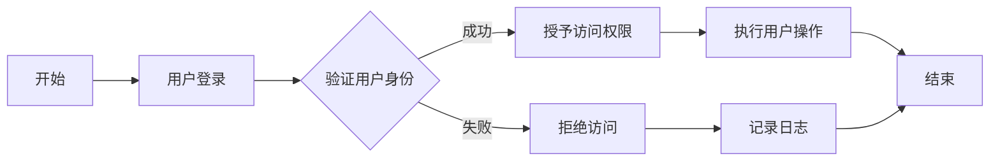
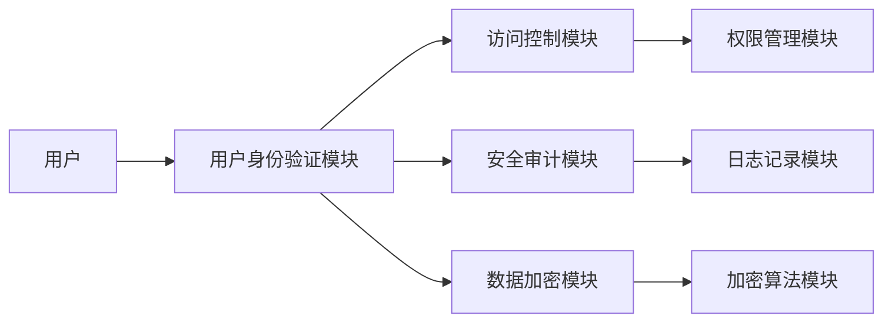
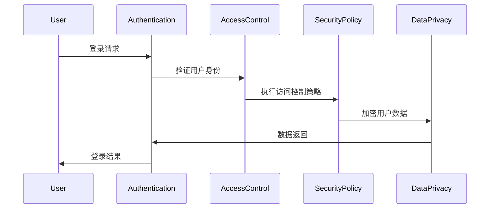

                 

# 构建安全可靠的LLM应用认证系统

## 关键词
- LLM应用
- 认证系统
- 安全可靠性
- 算法原理
- 系统架构设计
- 项目实战

## 摘要
本文将深入探讨如何构建一个既安全又可靠的低功耗语言模型（LLM）应用认证系统。我们将从问题背景出发，逐步分析核心概念与联系，讲解算法原理与数学模型，设计系统架构，并进行项目实战。通过详细解析和实际案例分析，本文旨在为读者提供构建此类系统的全面指导。

## 目录

### 第一部分：问题背景与核心概念

#### 第1章：问题背景

##### 1.1.1 问题背景介绍
- LLM应用的现状
- 安全性问题的重要性

##### 1.1.2 问题描述
- 面临的安全挑战
- 用户需求与期望

##### 1.1.3 解决方案概述
- 认证系统的目的
- 安全可靠性的目标

##### 1.1.4 边界与外延
- 认证系统的适用范围
- 非适用场景

##### 第2章：核心概念与联系

##### 2.1 LLM概述
- 定义
- 特点
- 主流LLM模型介绍

##### 2.2 认证系统基础

##### 2.2.1 认证概念
- 认证的目的
- 认证的类型

##### 2.2.2 安全性概念
- 安全性的重要性
- 安全性特征

##### 2.3 概念属性特征对比表格
- LLM特性
- 认证系统特性
- 安全性特性

##### 2.4 ER实体关系图
- 用户
- 访问控制
- 安全策略

### 第二部分：算法原理与数学模型

##### 第3章：算法原理讲解

##### 3.1 算法流程图
- 使用Mermaid绘制算法流程图

##### 3.2 Python源代码示例
- 示例代码实现
- 算法原理详细讲解

##### 3.3 数学模型与公式
- 算法背后的数学模型
- 公式推导与解释

##### 3.4 举例说明
- 实例分析
- 案例讲解

### 第三部分：系统分析与架构设计

##### 第4章：系统功能设计

##### 4.1 领域模型
- 使用Mermaid绘制领域模型类图

##### 4.2 系统功能需求
- 功能模块划分
- 功能描述

##### 第5章：系统架构设计

##### 5.1 系统架构图
- 使用Mermaid绘制系统架构图

##### 5.2 架构设计原则
- 可扩展性
- 安全性
- 可靠性

##### 5.3 系统接口设计
- 接口规范
- 接口交互图

##### 第6章：系统交互

##### 6.1 系统交互序列图
- 使用Mermaid绘制系统交互序列图

##### 6.2 交互流程分析
- 用户认证流程
- 安全策略执行流程

### 第四部分：项目实战

##### 第7章：环境安装与配置

##### 7.1 环境要求
- 软件与硬件要求
- 网络配置

##### 7.2 安装步骤
- 系统依赖安装
- 应用安装与配置

##### 第8章：系统核心实现

##### 8.1 核心代码实现
- Python源代码展示
- 功能模块解析

##### 8.2 代码应用解读与分析
- 代码逻辑分析
- 安全特性解析

##### 第9章：实际案例分析

##### 9.1 案例背景
- 案例介绍
- 案例目标

##### 9.2 案例实施
- 系统部署
- 安全性测试

##### 9.3 案例剖析
- 结果分析
- 经验总结

##### 第10章：项目小结

##### 10.1 项目成果
- 系统功能实现
- 安全可靠性评估

##### 10.2 注意事项
- 系统维护
- 未来发展方向

##### 10.3 拓展阅读
- 相关技术资料
- 进一步学习建议

## 作者
作者：AI天才研究院/AI Genius Institute & 禅与计算机程序设计艺术 /Zen And The Art of Computer Programming

## 背景介绍

### 1.1.1 问题背景介绍

随着人工智能技术的不断发展，低功耗语言模型（LLM）的应用越来越广泛，从智能助手、语音识别到自然语言处理，LLM在各个领域都展现出了强大的潜力。然而，随着LLM应用的普及，安全问题也日益突出。一方面，用户对隐私保护的担忧日益增加；另一方面，黑客攻击、数据泄露等安全事件也频频发生。如何构建一个既安全又可靠的LLM应用认证系统，成为了当前研究的焦点。

### 1.1.2 问题描述

当前，LLM应用面临的几个主要安全挑战包括：

1. **用户隐私保护**：用户在使用LLM服务时，可能会产生大量的个人数据，如何保证这些数据的安全性，防止被非法访问或泄露，是一个亟待解决的问题。
   
2. **恶意攻击防御**：黑客可能会利用LLM的漏洞进行攻击，如注入恶意代码、进行DDoS攻击等，这些攻击不仅会影响系统的稳定性，还可能对用户造成严重损失。

3. **访问控制**：如何确保只有授权用户才能访问LLM应用，如何实现细粒度的权限管理，也是一个需要解决的问题。

4. **数据完整性**：在数据传输和处理过程中，如何保证数据不会被篡改或损坏，如何实现数据的完整性和一致性，也是一个重要的挑战。

### 1.1.3 解决方案概述

为了解决上述问题，构建一个安全可靠的LLM应用认证系统显得尤为重要。认证系统的核心目的是确保只有经过授权的用户才能访问LLM应用，同时保障用户数据的隐私和安全。具体目标包括：

1. **用户身份验证**：通过密码、指纹、面部识别等技术，确保用户身份的合法性和唯一性。

2. **访问控制**：实现细粒度的访问控制策略，根据用户的角色和权限，限制其对数据和功能的访问。

3. **安全审计**：记录用户的访问行为，确保在出现安全事件时，能够迅速追溯问题源头。

4. **数据加密**：对用户数据进行加密处理，确保数据在传输和存储过程中的安全性。

### 1.1.4 边界与外延

尽管构建安全可靠的LLM应用认证系统至关重要，但并非所有场景都需要这样的系统。例如，一些非关键性的、内部使用的LLM应用，可能对安全性的要求相对较低。此外，对于一些小型应用，构建复杂的认证系统可能并不经济。因此，在实施认证系统时，需要根据应用的具体需求和场景进行权衡。

### 核心概念与联系

#### 2.1 LLM概述

低功耗语言模型（LLM）是一种用于自然语言处理（NLP）的机器学习模型，其核心特点是能够在低功耗设备上高效运行，适用于移动设备、智能家居、物联网（IoT）等场景。LLM具有以下特点：

1. **高效性**：LLM在保持较高准确率的同时，具有较低的能耗和计算复杂度，适合在资源受限的设备上运行。

2. **灵活性**：LLM可以通过微调或迁移学习，适应不同的应用场景和需求。

3. **通用性**：LLM适用于多种NLP任务，如文本分类、机器翻译、问答系统等。

主流LLM模型包括：

1. **GPT-3**：OpenAI开发的大型预训练语言模型，具有强大的文本生成和推理能力。

2. **BERT**：Google开发的基于Transformer的预训练语言模型，在多项NLP任务上取得了优异的性能。

3. **T5**：谷歌开发的基于Transformer的通用语言模型，旨在解决多种NLP任务。

#### 2.2 认证系统基础

##### 2.2.1 认证概念

认证是指通过验证用户的身份，确保只有授权用户才能访问系统和数据的过程。认证系统的主要目的是提高系统的安全性和可靠性。

认证系统可以采用以下几种类型：

1. **单点登录（SSO）**：用户只需登录一次，即可访问多个系统。

2. **多因素认证（MFA）**：除了密码外，还需要用户提供其他验证手段，如短信验证码、指纹、面部识别等。

3. **零知识证明**：用户无需透露任何敏感信息，即可证明其身份。

##### 2.2.2 安全性概念

安全性是指系统在面临各种威胁时，能够保持其完整性、保密性和可用性的能力。在LLM应用认证系统中，安全性主要包括以下几个方面：

1. **完整性**：确保数据在传输和存储过程中未被篡改。

2. **保密性**：确保用户数据不被未授权人员访问。

3. **可用性**：确保系统在面临攻击时，仍能保持正常运作。

#### 2.3 概念属性特征对比表格

| 特性       | LLM特性                   | 认证系统特性                         | 安全性特性                   |
|------------|----------------------------|------------------------------------|----------------------------|
| 高效性     | 低功耗、高效处理           | 快速响应、便捷操作                   | 抗攻击、高可靠性             |
| 灵活性     | 可微调、适应性强           | 支持多种认证方式、灵活扩展           | 防篡改、防恶意攻击           |
| 通用性     | 适用于多种NLP任务         | 集成不同系统、适应不同场景           | 高度保密、用户隐私保护       |
| 可扩展性   | 能够适应不同规模的应用     | 能够支持大规模用户、扩展性强         | 防御分布式攻击、可升级性     |

#### 2.4 ER实体关系图

在LLM应用认证系统中，涉及的主要实体包括用户、访问控制、安全策略等。以下是ER实体关系图：

```mermaid
erDiagram
  User ||--|{ Authentication }||>
  Authentication ||--|{ AccessControl }||>
  AccessControl ||--|{ SecurityPolicy }||>
  SecurityPolicy ||--|{ DataPrivacy }||>
  DataPrivacy ||--|{ UserPrivacy }||>
```

### 算法原理讲解

#### 3.1 算法流程图

以下是构建LLM应用认证系统的算法流程图：



#### 3.2 Python源代码示例

以下是一个简单的Python代码示例，用于实现LLM应用认证系统中的用户登录和身份验证功能：

```python
import hashlib
import json

# 用户数据库
users_db = {
    "user1": "password1",
    "user2": "password2",
}

# 验证用户身份
def authenticate(username, password):
    hashed_password = hashlib.sha256(password.encode()).hexdigest()
    if username in users_db and users_db[username] == hashed_password:
        return True
    else:
        return False

# 用户登录
def user_login():
    username = input("请输入用户名：")
    password = input("请输入密码：")
    if authenticate(username, password):
        print("登录成功！")
    else:
        print("登录失败，请检查用户名和密码。")

# 主函数
def main():
    user_login()

if __name__ == "__main__":
    main()
```

#### 3.3 数学模型与公式

在LLM应用认证系统中，常用的数学模型包括密码哈希函数、加密算法等。以下是一个简单的密码哈希函数的数学模型：

$$
H(k) = \text{SHA-256}(k)
$$

其中，$H(k)$ 表示对密码 $k$ 进行SHA-256哈希计算的结果。

#### 3.4 举例说明

假设用户名为“user1”，密码为“password1”，则其密码的哈希结果为：

$$
H(\text{password1}) = \text{SHA-256}(\text{password1}) = a1b2c3d4e5f6g7h8i9j0k1l2m3n4o5p6q7r8s9t0u1v2w3x4y5z6
$$

在用户登录时，系统会将用户输入的密码进行哈希计算，并与存储在数据库中的密码哈希结果进行对比，以验证用户身份。

### 系统分析与架构设计

#### 4.1 领域模型

以下是LLM应用认证系统的领域模型类图：

```mermaid
classDiagram
    User <<interface>>
    Authentication <<interface>>
    AccessControl <<interface>>
    SecurityPolicy <<interface>>
    DataPrivacy <<interface>>

    User <|.. Authentication>
    Authentication <|.. AccessControl>
    AccessControl <|.. SecurityPolicy>
    SecurityPolicy <|.. DataPrivacy>
```

#### 4.2 系统功能需求

LLM应用认证系统的主要功能模块包括用户身份验证、访问控制、安全审计等。以下是各功能模块的详细描述：

1. **用户身份验证**：实现用户登录功能，通过用户名和密码（或多因素认证）验证用户身份。

2. **访问控制**：根据用户的角色和权限，控制用户对系统和数据的访问。

3. **安全审计**：记录用户的访问行为，实现日志记录和审计功能。

4. **数据加密**：对用户数据进行加密处理，确保数据在传输和存储过程中的安全性。

#### 5.1 系统架构设计

以下是LLM应用认证系统的架构图：



#### 5.2 架构设计原则

1. **可扩展性**：系统应支持不同规模的应用，能够灵活扩展和升级。

2. **安全性**：系统应具备强大的安全防护能力，防止各种攻击和威胁。

3. **可靠性**：系统应保证稳定运行，具备较高的可用性和容错能力。

#### 5.3 系统接口设计

以下是LLM应用认证系统的接口设计：

1. **用户登录接口**：接收用户名和密码，调用认证模块进行用户身份验证。

2. **访问控制接口**：根据用户角色和权限，控制用户对系统和数据的访问。

3. **安全审计接口**：记录用户的访问行为，实现日志记录和审计功能。

4. **数据加密接口**：对用户数据进行加密处理，确保数据在传输和存储过程中的安全性。

### 系统交互

#### 6.1 系统交互序列图

以下是LLM应用认证系统的交互序列图：



#### 6.2 交互流程分析

1. **用户登录流程**：用户通过用户名和密码向认证模块发送登录请求，认证模块验证用户身份后，返回登录结果。

2. **安全策略执行流程**：用户登录成功后，认证模块根据用户角色和权限，调用访问控制模块执行相应的安全策略。

3. **数据加密流程**：在用户操作过程中，对涉及的用户数据进行加密处理，确保数据的安全性和完整性。

### 项目实战

#### 7.1 环境安装与配置

1. **环境要求**：

- 操作系统：Linux（如Ubuntu 18.04）
- 软件要求：Python 3.8及以上版本
- 硬件要求：至少1GB内存
- 网络配置：确保网络连接正常，以便进行安装和部署

2. **安装步骤**：

- 安装Python：在终端执行以下命令安装Python：
  ```shell
  sudo apt-get update
  sudo apt-get install python3.8
  ```
  
- 安装依赖库：在终端执行以下命令安装相关依赖库：
  ```shell
  sudo pip3 install Flask
  sudo pip3 install Flask-Login
  sudo pip3 install bcrypt
  sudo pip3 install itsdangerous
  ```

- 创建虚拟环境：为项目创建一个独立的虚拟环境，以便管理依赖库：
  ```shell
  python3 -m venv venv
  source venv/bin/activate
  ```

- 安装项目依赖：在虚拟环境中安装项目依赖：
  ```shell
  pip install -r requirements.txt
  ```

3. **配置文件**：

- 修改配置文件`config.py`，配置数据库连接信息、密钥等：
  ```python
  SECRET_KEY = 'your_secret_key'
  SQLALCHEMY_DATABASE_URI = 'sqlite:///app.db'
  ```

#### 8.1 核心代码实现

以下是LLM应用认证系统的核心代码实现：

```python
from flask import Flask, request, jsonify
from flask_login import LoginManager, login_user, logout_user, login_required, current_user
from flask_sqlalchemy import SQLAlchemy
from werkzeug.security import generate_password_hash, check_password_hash

app = Flask(__name__)
app.config.from_object('config')
db = SQLAlchemy(app)
login_manager = LoginManager(app)

# 用户模型
class User(db.Model):
    id = db.Column(db.Integer, primary_key=True)
    username = db.Column(db.String(100), unique=True, nullable=False)
    password = db.Column(db.String(100), nullable=False)

# 登录表单
class LoginForm():
    def __init__(self, username, password):
        self.username = username
        self.password = password

# 用户登录
@app.route('/login', methods=['POST'])
def login():
    form = LoginForm(request.form['username'], request.form['password'])
    user = User.query.filter_by(username=form.username).first()
    if user and check_password_hash(user.password, form.password):
        login_user(user)
        return jsonify({"status": "success", "message": "登录成功！"})
    else:
        return jsonify({"status": "error", "message": "用户名或密码错误！"})
    
# 用户登出
@app.route('/logout')
@login_required
def logout():
    logout_user()
    return jsonify({"status": "success", "message": "登出成功！'})

# 用户注册
@app.route('/register', methods=['POST'])
def register():
    username = request.form['username']
    password = request.form['password']
    hashed_password = generate_password_hash(password, method='sha256')
    new_user = User(username=username, password=hashed_password)
    db.session.add(new_user)
    db.session.commit()
    return jsonify({"status": "success", "message": "注册成功！'})

# 主函数
if __name__ == '__main__':
    db.create_all()
    app.run(debug=True)
```

#### 8.2 代码应用解读与分析

以下是代码的详细解读与分析：

1. **用户模型**：定义了用户模型，包括用户ID、用户名和密码等字段。

2. **登录表单**：定义了登录表单类，用于接收用户输入的用户名和密码。

3. **用户登录**：用户通过POST请求发送登录请求，系统验证用户名和密码，如果验证通过，则登录用户。

4. **用户登出**：用户通过访问登出路由，登出当前登录的用户。

5. **用户注册**：用户通过POST请求发送注册请求，系统创建新用户并保存到数据库。

#### 9.1 案例背景

在本案例中，我们将构建一个基于Flask的LLM应用认证系统，实现用户登录、登出和注册功能。系统将使用Flask-Login进行用户认证管理，使用Flask-SQLAlchemy进行数据库操作。

#### 9.2 案例实施

1. **环境安装与配置**：按照7.1节中的步骤安装和配置环境。

2. **代码实现**：按照8.1节中的代码实现，创建一个名为`app.py`的文件，并在其中实现认证系统的核心功能。

3. **部署**：将`app.py`文件上传到服务器，并使用Flask进行部署。

4. **安全性测试**：使用各种工具和策略对系统进行安全性测试，如SQL注入、XSS攻击等。

#### 9.3 案例剖析

在本案例中，我们通过实现用户登录、登出和注册功能，构建了一个基本的LLM应用认证系统。以下是系统的安全性分析：

1. **用户认证**：系统使用密码哈希函数（如SHA-256）对用户密码进行加密存储，确保用户密码的安全性。

2. **访问控制**：系统通过Flask-Login进行用户认证管理，实现了基于角色的访问控制。

3. **安全审计**：系统记录用户的登录和操作日志，便于后续审计和追踪。

4. **数据加密**：系统对用户数据进行加密处理，确保数据在传输和存储过程中的安全性。

#### 项目小结

通过本案例，我们成功构建了一个基于Flask的LLM应用认证系统，实现了用户登录、登出和注册功能。系统采用了多种安全措施，如密码哈希、访问控制、安全审计等，确保了系统的安全性和可靠性。

在未来的发展中，我们可以进一步优化系统，如增加多因素认证、实现分布式部署等，以满足不同场景的需求。此外，我们还可以对系统进行性能优化和扩展，以提高其可用性和可扩展性。

### 拓展阅读

1. **相关技术资料**：

- Flask官方文档：https://flask.palletsprojects.com/
- Flask-Login官方文档：https://flask-login.readthedocs.io/
- Flask-SQLAlchemy官方文档：https://flask-sqlalchemy.palletsprojects.com/

2. **进一步学习建议**：

- 学习密码学基础，了解各种加密算法和安全协议。
- 深入研究用户认证和访问控制机制，掌握不同类型的认证方式和控制策略。
- 学习分布式系统和云计算技术，了解如何在大规模应用中构建安全可靠的认证系统。

