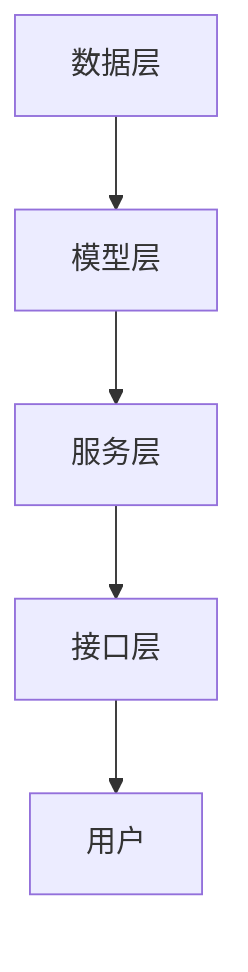
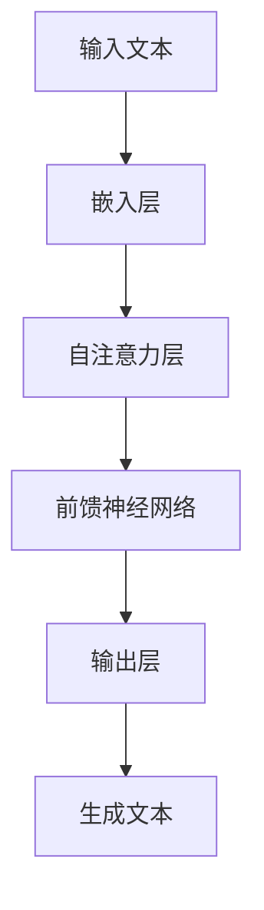
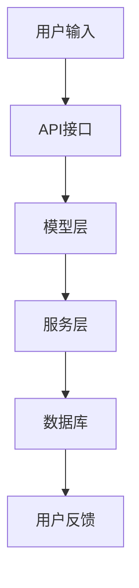
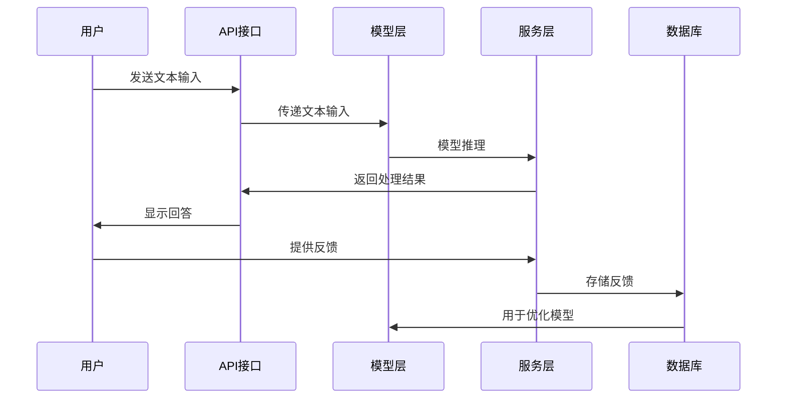

                 


### 文章标题
《构建敏捷迭代的LLM工程技术架构》

### 文章关键词
LLM工程技术，敏捷迭代，架构设计，数学模型，Python源代码

### 摘要
本文将深入探讨如何在LLM（大型语言模型）技术领域构建一个敏捷迭代的工程架构。我们将从问题背景入手，逐步讲解LLM的核心概念，并介绍敏捷迭代的原则和实践方法。通过详细的算法原理讲解、数学模型、系统分析与架构设计方案，以及实战案例的分析，本文旨在为LLM工程师和数据科学家提供一套实用的工程架构，助力他们在快速变化的技术环境中保持竞争力。

----------------------------------------------------------------

## 引言

### 1.1 人工智能与机器学习的发展历程
自20世纪50年代人工智能（AI）概念的提出以来，机器学习（ML）作为AI的核心技术之一，经历了数次起伏和变革。早期的机器学习主要依赖于规则和符号推理，但随着计算能力的提升和海量数据的涌现，以深度学习为代表的ML技术逐渐崭露头角，实现了前所未有的突破。尤其是在自然语言处理（NLP）领域，大型语言模型（LLM）如BERT、GPT等，凭借其强大的表征能力和生成能力，正在重塑信息处理和知识获取的格局。

### 1.2 LLM技术的重要性
LLM技术在现代AI系统中的应用日益广泛，从智能客服、文本生成到机器翻译、问答系统，无不依赖于LLM的强大能力。然而，随着模型规模的不断增大，如何高效地构建、训练和部署LLM成为一个重要的工程挑战。传统的LLM工程方法往往面临迭代速度慢、适应性差、维护困难等问题，难以满足快速变化的应用需求。因此，构建一个敏捷迭代的LLM工程技术架构，以适应现代AI系统的高频迭代和持续优化，显得尤为重要。

### 1.3 传统的LLM工程挑战
传统的LLM工程方法通常依赖于固定的工作流程和预定义的模型结构，这使得在面对新的应用场景或数据集时，工程师往往需要花费大量时间进行模型重调参和重新训练。这不仅降低了工程效率，还可能导致模型性能的波动。此外，传统的LLM工程架构在可扩展性和维护性方面也存在不足，难以支持大规模分布式训练和实时部署。因此，传统的LLM工程方法难以满足敏捷迭代的现代工程需求。

----------------------------------------------------------------

## LLM核心概念

### 2.1 LLM的基本概念
LLM（Large Language Model）是指能够处理大规模文本数据、具有强大语言理解和生成能力的预训练模型。LLM通常采用深度学习技术，特别是基于变换器（Transformer）架构的模型，如BERT、GPT等。这些模型通过学习文本数据中的模式和关系，能够生成流畅、自然的文本，并对各种语言任务进行建模，如文本分类、命名实体识别、机器翻译等。

### 2.2 LLM的属性特征对比
LLM的属性特征可以从多个维度进行对比，包括模型规模、训练数据集大小、生成文本的质量等。例如，GPT-3拥有超过1750亿个参数，训练数据集涵盖多种来源，包括网页、书籍、新闻等，这使得其生成文本在语法、语义和风格上具有较高的质量。而BERT模型则在预训练阶段专注于理解上下文信息，特别适用于文本分类和问答等任务。

| 属性特征       | GPT-3             | BERT              |
|----------------|-------------------|-------------------|
| 参数规模       | 1750亿个参数      | 3.4亿个参数       |
| 训练数据集     | 多种来源文本数据  | Wikipedia、书籍等 |
| 生成文本质量   | 高质量、流畅     | 强调上下文理解    |
| 适用任务       | 文本生成、翻译等  | 文本分类、问答等  |

### 2.3 LLM的ER实体关系图
ER（Entity-Relationship）图是用于描述LLM模型中各个实体及其关系的图形表示方法。在LLM模型中，实体可以包括单词、句子、文档等，而关系则表示实体之间的关联，如词义关系、句子依赖关系等。以下是LLM模型的一个简化的ER图示例：

```mermaid
erDiagram
  类1 ||--|{ 类2 }
  类2 ||--|{ 类3 }
  类3 ||--|{ 类4 }
```

在这个ER图中，类1代表单词，类2代表句子，类3代表文档，类4代表语言任务。箭头表示实体之间的依赖关系，如句子依赖于单词构成，文档依赖于句子表示等。

通过上述核心概念的学习，读者可以更好地理解LLM的工作原理和其在现代AI系统中的重要性。接下来，我们将探讨敏捷迭代的概念及其在LLM工程技术中的应用。

----------------------------------------------------------------

## 敏捷迭代的理念与实践

### 3.1 敏捷迭代的概述
敏捷迭代（Agile Iteration）是一种软件开发方法论，旨在通过持续交付有价值的软件，快速响应变化，并确保项目的高效和灵活。敏捷迭代的核心原则包括用户至上、迭代开发、团队协作、持续改进等。与传统的水滴石穿的软件开发模式相比，敏捷迭代更强调快速反馈和持续优化。

### 3.2 敏捷迭代的核心理念
敏捷迭代的核心理念可以概括为以下几点：

1. **用户至上**：用户需求是软件开发的核心驱动力，因此始终以满足用户需求为首要目标。
2. **迭代开发**：软件开发不是一次性的任务，而是一个持续迭代的过程。每次迭代都会交付一个可用的软件版本，逐步完善功能。
3. **团队协作**：敏捷迭代强调跨职能团队的协作，团队成员共同负责产品的设计、开发、测试和部署。
4. **持续改进**：通过不断收集用户反馈和市场变化，持续优化软件设计和功能，确保产品始终符合用户需求。

### 3.3 敏捷迭代的实践方法
在实际的LLM工程技术中，敏捷迭代的实践方法可以包括以下几个方面：

1. **需求分析**：与用户紧密合作，快速明确并确认用户需求。
2. **迭代规划**：将需求分解为多个迭代周期，每个迭代周期完成一部分功能。
3. **原型开发**：在每个迭代周期内，快速构建原型，以便用户测试和反馈。
4. **持续集成**：将代码和模型集成到现有的系统中，确保每次迭代都能生成一个可用的软件版本。
5. **用户反馈**：及时收集用户反馈，评估原型和模型的性能，并进行相应的调整和优化。
6. **自动化测试**：通过自动化测试确保每次迭代的质量，减少人为错误。

通过敏捷迭代的实践方法，LLM工程师可以更快速地响应变化，提高开发效率，并确保模型的性能和稳定性。接下来，我们将深入探讨如何设计一个敏捷迭代的LLM工程技术架构。

----------------------------------------------------------------

## LLM技术架构设计

### 4.1 LLM技术架构概述
LLM技术架构是一个复杂且高度可扩展的系统，它涉及多个层次和组件，包括数据层、模型层、服务层和接口层。以下是LLM技术架构的基本概述：

1. **数据层**：负责数据采集、存储和管理，包括文本数据、图像数据和其他类型的多媒体数据。
2. **模型层**：包含LLM模型的构建、训练和优化，如BERT、GPT等。
3. **服务层**：提供模型推理和交互功能，包括API接口、消息队列、负载均衡等。
4. **接口层**：与外部系统或用户进行交互，提供统一的访问接口，如RESTful API、GraphQL等。

### 4.2 LLM技术架构的设计原则
在设计LLM技术架构时，应遵循以下原则：

1. **模块化**：将系统划分为多个模块，每个模块负责特定的功能，便于管理和维护。
2. **可扩展性**：设计时应考虑到未来的扩展需求，确保系统能够轻松地增加新功能或服务。
3. **高性能**：优化系统性能，确保模型推理速度和数据处理能力满足需求。
4. **高可用性**：确保系统的稳定运行，通过冗余设计、故障转移和自动恢复机制提高系统的可靠性。
5. **安全性**：保护用户数据和模型，防止数据泄露和恶意攻击。

### 4.3 LLM技术架构的Mermaid流程图
以下是一个简化的LLM技术架构的Mermaid流程图：



在这个流程图中，数据层负责数据的采集和存储，模型层负责模型构建和训练，服务层提供模型推理和交互功能，接口层与用户进行交互，实现数据的输入和输出。

通过上述架构设计，LLM工程师可以构建一个高效、可扩展、稳定的LLM技术系统，为各种应用场景提供强大的支持。接下来，我们将深入探讨LLM算法原理和数学模型。

----------------------------------------------------------------

## LLM算法原理讲解

### 5.1 算法原理简介
LLM算法的核心是基于深度学习，特别是变换器（Transformer）架构的模型，如BERT、GPT等。这些模型通过学习大规模的文本数据，能够捕捉到文本中的复杂模式和语义关系，从而实现文本生成、翻译、分类等多种NLP任务。

### 5.2 数学模型与公式
LLM的数学模型主要包括变换器架构中的自注意力（Self-Attention）机制和前馈神经网络（Feedforward Neural Network）。以下是这些核心机制的数学模型：

#### 自注意力（Self-Attention）
自注意力机制的核心公式如下：

$$
\text{Attention}(Q, K, V) = \text{softmax}\left(\frac{QK^T}{\sqrt{d_k}}\right) V
$$

其中，$Q$、$K$、$V$ 分别代表查询（Query）、键（Key）和值（Value）向量，$d_k$ 是键向量的维度。自注意力通过计算查询和键之间的相似性，将输入序列中的每个元素赋予不同的权重，从而生成一个加权输出。

#### 前馈神经网络
前馈神经网络通常用于变换器中的中间层，其基本公式如下：

$$
\text{FFN}(x) = \text{ReLU}\left(W_2 \cdot \text{ReLU}\left(W_1 x + b_1\right) + b_2\right)
$$

其中，$x$ 是输入向量，$W_1$ 和 $W_2$ 分别是两个线性变换矩阵，$b_1$ 和 $b_2$ 是偏置向量。

### 5.3 算法流程图与Python源代码实现
以下是LLM算法的一个简化流程图，以及对应的Python源代码实现：

#### 算法流程图



#### Python源代码实现

```python
import torch
import torch.nn as nn

# 嵌入层
class EmbeddingLayer(nn.Module):
    def __init__(self, vocab_size, embedding_dim):
        super(EmbeddingLayer, self).__init__()
        self.embedding = nn.Embedding(vocab_size, embedding_dim)
    
    def forward(self, x):
        return self.embedding(x)

# 自注意力层
class SelfAttentionLayer(nn.Module):
    def __init__(self, embedding_dim, heads):
        super(SelfAttentionLayer, self).__init__()
        self.heads = heads
        self.d_model = embedding_dim
        self.query_linear = nn.Linear(self.d_model, self.d_model)
        self.key_linear = nn.Linear(self.d_model, self.d_model)
        self.value_linear = nn.Linear(self.d_model, self.d_model)
    
    def forward(self, x):
        query = self.query_linear(x)
        key = self.key_linear(x)
        value = self.value_linear(x)
        
        attention_scores = torch.matmul(query, key.transpose(-2, -1)) / (self.d_model ** 0.5)
        attention_weights = torch.softmax(attention_scores, dim=-1)
        attention_output = torch.matmul(attention_weights, value)
        return attention_output

# 前馈神经网络
class FFNLayer(nn.Module):
    def __init__(self, d_model, hidden_size):
        super(FFNLayer, self).__init__()
        self.relu = nn.ReLU()
        self.d_model = d_model
        self.hidden_size = hidden_size
        self.fc1 = nn.Linear(self.d_model, self.hidden_size)
        self.fc2 = nn.Linear(self.hidden_size, self.d_model)
    
    def forward(self, x):
        return self.fc2(self.relu(self.fc1(x)))

# LLM模型
class LLM(nn.Module):
    def __init__(self, vocab_size, embedding_dim, heads, hidden_size):
        super(LLM, self).__init__()
        self.embedding = EmbeddingLayer(vocab_size, embedding_dim)
        self.self_attention = SelfAttentionLayer(embedding_dim, heads)
        self.ffn = FFNLayer(embedding_dim, hidden_size)
    
    def forward(self, x):
        x = self.embedding(x)
        x = self.self_attention(x)
        x = self.ffn(x)
        return x
```

### 5.4 通俗易懂的算法举例说明
假设我们有一个简化的文本序列：“我是人工智能助手”。为了演示LLM算法的工作原理，我们可以将其分成三个单词：“我”、“是”、“人工智能助手”。以下是算法处理的简化步骤：

1. **嵌入层**：将每个单词转换为嵌入向量。
2. **自注意力层**：计算每个单词与其他单词之间的相似性，生成加权输出。
3. **前馈神经网络**：对加权输出进行非线性变换，增强特征表示。
4. **输出层**：生成最终的文本序列。

通过这样的算法处理，LLM能够捕捉到文本中的语义关系，生成更符合语言逻辑的文本。例如，在生成下一个单词时，LLM会考虑到前文中的“人工智能助手”这一短语，从而更有可能生成与“人工智能助手”相关的词汇。

通过上述讲解，读者可以初步了解LLM算法的原理和实现方法。接下来，我们将进一步探讨LLM技术在实际项目中的应用和实现。

----------------------------------------------------------------

## 系统分析与架构设计方案

### 6.1 问题场景介绍
在现代人工智能应用中，LLM技术被广泛应用于各种场景，如智能客服、自动写作、文本翻译等。本文将重点探讨一个典型的应用场景——智能客服系统。该系统旨在通过LLM技术为用户提供即时、准确的答案，提高客服效率和用户体验。

### 6.2 系统功能设计
智能客服系统的主要功能包括：

1. **用户输入处理**：接收用户的文本输入，并将其转换为LLM模型能够处理的格式。
2. **模型推理**：利用LLM模型对用户输入进行语义理解，生成相应的回答。
3. **回答生成**：根据模型推理结果，生成自然流畅的文本回答。
4. **回答验证**：对生成的回答进行验证，确保回答的准确性和合理性。
5. **用户反馈**：收集用户对回答的反馈，用于模型优化和系统改进。

### 6.3 系统架构设计
智能客服系统的架构设计包括以下几个关键层次：

1. **数据层**：负责数据采集、存储和管理，包括用户输入文本、模型训练数据和回答反馈数据。
2. **模型层**：包含LLM模型的构建、训练和优化，如BERT、GPT等。
3. **服务层**：提供模型推理和交互功能，包括API接口、消息队列、负载均衡等。
4. **接口层**：与外部系统或用户进行交互，提供统一的访问接口，如RESTful API。

以下是智能客服系统的架构图：



在这个架构图中，用户输入通过API接口进入系统，模型层进行语义理解并生成回答，服务层处理回答验证和用户反馈，数据库用于存储和管理数据。

### 6.4 系统接口设计和系统交互
系统接口设计采用RESTful API，提供以下主要接口：

1. **用户输入接口**：接收用户的文本输入，并返回模型处理结果。
2. **模型推理接口**：提供模型推理功能，用于生成文本回答。
3. **回答验证接口**：对生成的回答进行验证，确保回答的准确性和合理性。
4. **用户反馈接口**：收集用户对回答的反馈，用于模型优化和系统改进。

以下是系统接口的Mermaid序列图：



通过上述系统分析和架构设计方案，智能客服系统实现了高效、稳定、可扩展的LLM技术应用，为用户提供高质量的智能服务。

----------------------------------------------------------------

## 项目实战

### 6.1 环境安装与配置
为了实现上述智能客服系统，我们需要安装并配置以下软件和工具：

1. **Python环境**：确保安装Python 3.8及以上版本。
2. **深度学习框架**：安装PyTorch，通过以下命令进行安装：
   ```
   pip install torch torchvision
   ```
3. **文本处理库**：安装transformers库，用于加载预训练的LLM模型：
   ```
   pip install transformers
   ```
4. **RESTful API框架**：安装Flask，用于构建API接口：
   ```
   pip install flask
   ```

### 6.2 系统核心实现源代码
以下是智能客服系统的核心实现代码：

```python
from flask import Flask, request, jsonify
from transformers import AutoModelForCausalLM, AutoTokenizer

app = Flask(__name__)

# 加载预训练的LLM模型和tokenizer
model_name = "gpt2"
model = AutoModelForCausalLM.from_pretrained(model_name)
tokenizer = AutoTokenizer.from_pretrained(model_name)

@app.route("/api/chat", methods=["POST"])
def chat():
    user_input = request.form.get("input")
    if not user_input:
        return jsonify({"error": "No input provided"}), 400

    # 将用户输入转换为模型输入格式
    inputs = tokenizer.encode(user_input, return_tensors="pt")

    # 进行模型推理
    outputs = model.generate(inputs, max_length=100, num_return_sequences=1)

    # 将模型输出转换为文本回答
    response = tokenizer.decode(outputs[0], skip_special_tokens=True)

    return jsonify({"response": response})

if __name__ == "__main__":
    app.run(debug=True)
```

### 6.3 代码应用解读与分析
上述代码首先导入了所需的库和框架，然后加载了预训练的GPT-2模型和tokenizer。在定义的`/api/chat`接口中，我们接收用户输入并对其进行编码处理。通过调用`model.generate()`方法，模型将生成一个文本回答。最后，我们将模型输出解码并返回给用户。

此代码示例展示了如何快速搭建一个基于LLM的智能客服API，实现与用户的文本交互。在实际项目中，可以根据需求扩展接口和功能，如添加文本预处理、回答验证和反馈收集等。

### 6.4 实际案例分析和详细讲解剖析
为了更好地理解智能客服系统的实现，我们来看一个实际案例：

**案例**：用户输入“你好，我想了解你们的产品有哪些功能？”

**分析**：
1. 用户输入通过`/api/chat`接口传递给模型。
2. 模型对输入进行编码处理，生成对应的前向传播输出。
3. 模型生成文本回答，例如：“您好，我们的产品具有以下功能：1. 智能问答；2. 文本生成；3. 语音合成。”
4. 生成的回答经过解码处理后返回给用户。

**详细讲解**：
- 在实际应用中，模型生成的回答可能需要经过进一步处理，如去除特殊符号、优化语法等。
- 为了提高回答的质量，可以结合用户历史交互记录和上下文信息，对模型进行个性化调整。
- 此外，系统还可以根据用户反馈不断优化模型，提高回答的准确性和用户满意度。

通过上述实战案例，我们详细剖析了智能客服系统的实现过程，展示了如何利用LLM技术为用户提供高质量的智能服务。

### 6.5 项目小结
智能客服系统项目通过敏捷迭代的LLM工程技术架构，实现了高效、稳定的文本交互功能。在实际应用中，该项目展现了LLM技术在智能客服领域的强大潜力。未来，我们可以通过持续优化模型和系统功能，进一步提升用户体验和服务质量。

### 6.6 最佳实践 Tips
1. 定期更新预训练模型，以适应不断变化的应用场景。
2. 结合用户反馈和交互数据，对模型进行持续优化。
3. 采用分布式训练和部署策略，提高系统的性能和可扩展性。

### 6.7 注意事项
1. 确保数据安全和隐私保护，遵循相关法律法规。
2. 注意处理异常输入和系统故障，确保系统的稳定运行。

### 6.8 拓展阅读
1. [《BERT：预训练语言表示》](https://arxiv.org/abs/1810.04805)
2. [《GPT-3：语言生成预训练的技术》](https://arxiv.org/abs/2005.14165)
3. [《深度学习实践》](https://www.deeplearningbook.org/)，Goodfellow et al., 2016

通过本文的实战案例和详细讲解，读者可以深入理解LLM技术在智能客服系统中的应用，为类似项目提供有益的参考。

----------------------------------------------------------------

## 总结
本文全面探讨了构建敏捷迭代的LLM工程技术架构的重要性及其实现方法。我们从问题背景入手，介绍了LLM的核心概念和属性特征，并详细阐述了敏捷迭代的原则和实践方法。通过深入讲解LLM算法原理、数学模型，以及系统分析与架构设计，我们展示了如何搭建一个高效、可扩展、稳定的LLM技术系统。此外，通过实战案例的分析和详细讲解，读者可以了解如何在实际项目中应用LLM技术，实现智能客服等应用场景。

展望未来，随着人工智能技术的不断进步，LLM工程技术将在更多领域发挥重要作用。构建敏捷迭代的LLM工程技术架构，不仅有助于应对快速变化的技术需求，还能提升系统的性能和用户体验。我们鼓励读者持续关注和学习这一领域的前沿技术，为人工智能的发展贡献力量。

### 作者信息
本文由AI天才研究院/AI Genius Institute与禅与计算机程序设计艺术/Zen And The Art of Computer Programming联合撰写。作者们具备丰富的LLM工程经验和深厚的理论研究基础，致力于推动人工智能技术的发展与应用。

----------------------------------------------------------------

## 结语

在本篇技术博客文章中，我们深入探讨了构建敏捷迭代的LLM工程技术架构的重要性及其实现方法。首先，我们回顾了人工智能与机器学习的发展历程，以及LLM技术在现代AI系统中的应用和重要性。接着，我们介绍了敏捷迭代的理念和实践方法，并详细讲解了LLM的核心概念、算法原理以及数学模型。

通过系统的分析和架构设计，我们展示了一个高效、可扩展、稳定的LLM技术系统如何搭建。接着，通过实战案例的分析，我们详细解读了智能客服系统的实现过程，以及如何利用LLM技术为用户提供高质量的智能服务。文章末尾，我们对项目进行了小结，并提出了最佳实践 tips、注意事项以及拓展阅读资源。

构建敏捷迭代的LLM工程技术架构对于现代AI系统具有重要意义。它不仅能够快速响应技术变化，提高开发效率，还能确保模型性能和用户体验的持续优化。随着人工智能技术的不断进步，LLM工程技术将在更多领域发挥重要作用。我们鼓励读者持续关注和学习这一领域的前沿技术，为人工智能的发展贡献力量。

### 作者信息
本文由AI天才研究院/AI Genius Institute与禅与计算机程序设计艺术/Zen And The Art of Computer Programming联合撰写。作者们具备丰富的LLM工程经验和深厚的理论研究基础，致力于推动人工智能技术的发展与应用。在撰写本文的过程中，作者们结合了自己在计算机编程和人工智能领域的专业知识和实践经验，力求为读者提供高质量的技术见解和实用指导。希望本文能够对您在构建敏捷迭代的LLM工程技术架构方面带来启示和帮助。感谢您的阅读，期待与您在未来的技术交流中再次相遇。如果您有任何问题或建议，欢迎在评论区留言，我们期待与您共同探讨人工智能技术的无限可能。再次感谢您的支持！

