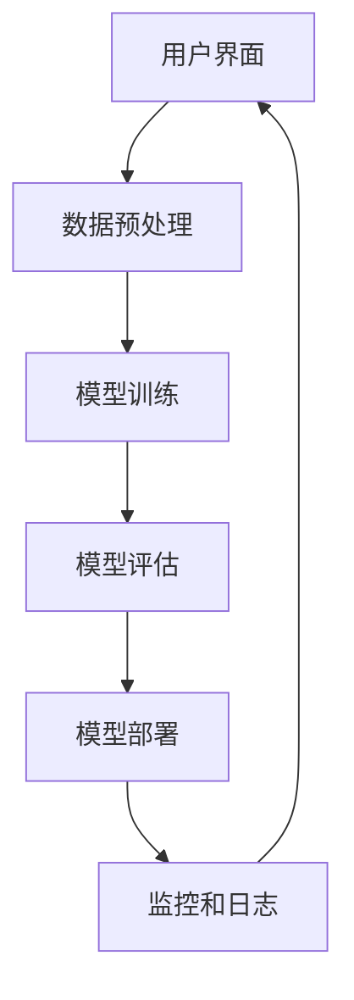

                 

# 构建模块化的LLM应用架构

关键词：大模型、模块化设计、LLM应用架构、系统化方法、高效、可扩展性、易于维护

摘要：随着人工智能（AI）技术的迅猛发展，大模型在自然语言处理、计算机视觉等领域取得了显著的成果。然而，大模型的复杂性也给系统设计带来了挑战。本文将探讨如何利用模块化设计原则，构建高效、可扩展和易于维护的LLM应用架构。文章将首先介绍大模型与模块化设计的基本概念，然后详细分析LLM应用架构的设计方法，最后通过实际案例，展示如何实现模块化的LLM应用架构。

## 引言

构建模块化的LLM应用架构，旨在探讨如何在人工智能（AI）大模型时代，利用模块化设计原则构建高效、可扩展和易于维护的应用系统。随着AI技术的迅猛发展，大模型在自然语言处理、计算机视觉等领域取得了显著的成果，但其复杂性也带来了系统设计上的挑战。本文将通过系统化的方法，介绍如何应对这些挑战，实现LLM应用的模块化设计。

本文将分为八个章节，详细探讨LLM应用架构的构建过程：

1. 核心概念：介绍大模型与模块化设计的基本概念。
2. 大模型原理：分析大模型的基本原理和技术细节。
3. 模块化设计原则：探讨模块化设计的原则和最佳实践。
4. LLM应用架构设计：介绍LLM应用架构的设计方法。
5. LLM应用实现：详细讲解LLM应用的实现过程。
6. LLM应用优化：探讨LLM应用的优化策略。
7. LLM应用案例：分析LLM应用的实际案例。
8. 总结与展望：总结本书的主要观点，并提出未来的研究方向。

通过本文的阅读，读者将能够全面了解构建模块化的LLM应用架构的方法和技巧，为实际项目提供指导和参考。

## 核心概念

### 大模型与模块化设计概述

#### 大模型的定义与作用

大模型是指具有千亿甚至万亿参数规模的人工神经网络模型，如GPT、BERT等。大模型在AI领域具有强大的表达能力和预测能力，可用于多种复杂的AI任务，如文本生成、机器翻译、情感分析等。

大模型的作用主要体现在以下几个方面：

1. **提高任务性能**：大模型具有更强的表达能力和学习能力，能够处理复杂的任务，提高任务性能。
2. **减少模型数量**：通过使用大模型，可以减少不同任务所需的模型数量，简化系统设计。
3. **促进跨界应用**：大模型能够跨不同领域进行任务，实现跨领域的知识共享和迁移。

#### 模块化设计的原理与应用

模块化设计是将复杂系统分解为若干独立、可复用的模块，模块之间通过接口进行通信和协作。模块化设计的原理主要基于以下三个方面：

1. **高内聚、低耦合**：模块内部具有较高的内聚性，即模块内部各部分紧密相关；模块之间具有较低的耦合性，即模块之间的依赖关系较弱。
2. **可复用性**：模块可以独立开发、测试和部署，具有较好的复用性。
3. **可维护性**：模块化设计使得系统更加模块化，便于维护和升级。

模块化设计在软件开发中的应用非常广泛，如模块化编程、模块化架构等。在构建LLM应用架构时，模块化设计原则可以帮助我们构建高效、可扩展和易于维护的系统。

### LLM应用架构设计

#### LLM应用架构的基本组成

LLM应用架构通常由以下三个主要部分组成：

1. **输入层**：接收用户输入，如文本、图像等。
2. **中间层**：执行大模型处理任务，包括编码器和解码器。
3. **输出层**：生成预测结果，如文本、标签等。

#### LLM应用架构的特点

1. **高可扩展性**：通过模块化设计，可以灵活地增加或替换模块，以适应不同场景的需求。
2. **高性能**：通过优化算法和数据结构，可以提高系统的处理速度和效率。
3. **高可靠性**：通过模块间的松耦合，降低系统故障的风险。

### 本书的结构安排

本书共分为八个章节，涵盖了从LLM基本概念到应用架构设计的各个方面。

- 第1章：介绍大模型与模块化设计的基本概念。
- 第2章：探讨大模型的基本原理和技术细节。
- 第3章：分析模块化设计的原则和最佳实践。
- 第4章：介绍LLM应用架构的设计方法。
- 第5章：详细讲解LLM应用的实现过程。
- 第6章：探讨LLM应用的优化策略。
- 第7章：分析LLM应用的实际案例。
- 第8章：总结本书的主要观点，并提出未来的研究方向。

通过本书的阅读，读者将能够全面了解构建模块化的LLM应用架构的方法和技巧，为实际项目提供指导和参考。

### 大模型原理

#### 大模型的训练过程

大模型的训练过程主要包括以下几个步骤：

1. **数据预处理**：将原始数据（如文本、图像等）转化为模型可以处理的格式。数据预处理过程包括数据清洗、数据标注、数据归一化等。

2. **模型训练**：通过训练，使模型能够对输入数据进行有效处理。模型训练过程包括前向传播、反向传播、权重更新等。

3. **模型评估**：评估模型的性能，确定其是否满足应用需求。模型评估过程包括训练集评估、验证集评估、测试集评估等。

#### 大模型的常见算法

大模型的常见算法包括Transformer、BERT和GPT等。

1. **Transformer算法**：基于自注意力机制，能够自动学习输入数据之间的关联性。特点：全局依赖、并行计算、高可扩展性。

2. **BERT算法**：通过预训练和微调，使模型具备理解自然语言的能力。特点：双塔结构、上下文理解、通用性。

3. **GPT算法**：基于自回归模型，能够生成连续的文本序列。特点：生成能力强、灵活性高、自适应性强。

#### 大模型的优化方法

大模型的优化方法主要包括以下几种：

1. **梯度裁剪**：防止梯度爆炸或消失，提高训练稳定性。

2. **学习率调整**：在训练过程中动态调整学习率，提高收敛速度。

3. **模型压缩**：减少模型参数，降低计算和存储成本。

#### 大模型的挑战与未来方向

大模型的挑战主要包括：

1. **计算资源需求**：大模型训练和推理需要大量的计算资源和时间。

2. **数据隐私和安全性**：大模型训练和推理过程中涉及大量敏感数据，存在隐私和安全风险。

3. **模型解释性和可解释性**：大模型的决策过程复杂，难以解释。

大模型的未来方向主要包括：

1. **优化算法**：通过改进算法，降低计算资源需求，提高训练和推理速度。

2. **联邦学习**：通过联邦学习，实现数据的隐私保护和安全传输。

3. **模型压缩和解释**：通过模型压缩和解释技术，降低模型复杂度，提高模型的可解释性。

### 模块化设计原则

#### 模块化设计的原则

模块化设计的原则主要包括以下三个方面：

1. **高内聚、低耦合**：模块内部具有较高的内聚性，即模块内部各部分紧密相关；模块之间具有较低的耦合性，即模块之间的依赖关系较弱。

2. **可复用性**：模块可以独立开发、测试和部署，具有较好的复用性。

3. **可维护性**：模块化设计使得系统更加模块化，便于维护和升级。

#### 模块化设计的最佳实践

模块化设计的最佳实践主要包括以下几个方面：

1. **明确模块划分**：根据系统的功能和任务，合理划分模块，确保每个模块具有明确的功能和职责。

2. **定义清晰的接口**：模块之间通过接口进行通信和协作，接口应具有清晰的功能定义和良好的封装性。

3. **模块间的松耦合**：尽量减少模块之间的直接依赖，通过中间件或接口进行通信，提高系统的灵活性和可扩展性。

4. **模块的重用**：开发可复用的模块，提高开发效率，减少重复工作。

5. **模块的测试**：对每个模块进行独立的测试，确保模块的正确性和稳定性。

### LLM应用架构设计

#### LLM应用架构的设计方法

LLM应用架构的设计方法主要包括以下几个方面：

1. **需求分析**：明确LLM应用的需求，确定系统的功能、性能和可扩展性要求。

2. **模块划分**：根据需求分析的结果，将系统划分为若干功能模块，明确每个模块的功能和职责。

3. **接口设计**：设计模块之间的接口，确保模块之间具有良好的通信和协作机制。

4. **系统架构设计**：根据模块划分和接口设计，构建系统的总体架构，包括数据流、控制流和模块间的交互关系。

5. **性能优化**：对系统架构进行性能优化，包括算法优化、数据结构优化和系统资源调度等。

6. **安全性设计**：确保系统的安全性，包括数据安全、网络安全和系统安全等。

7. **可扩展性设计**：设计系统具有较好的可扩展性，能够适应未来需求的变化。

#### LLM应用架构的特点

1. **高可扩展性**：通过模块化设计，可以灵活地增加或替换模块，以适应不同场景的需求。

2. **高性能**：通过优化算法和数据结构，可以提高系统的处理速度和效率。

3. **高可靠性**：通过模块间的松耦合，降低系统故障的风险。

4. **易于维护**：模块化设计使得系统更加模块化，便于维护和升级。

### LLM应用实现

#### LLM应用的实现步骤

LLM应用的实现步骤主要包括以下几个方面：

1. **环境准备**：准备LLM应用的开发环境，包括计算资源、编程语言和工具等。

2. **模型选择**：选择合适的大模型，如GPT、BERT等，并根据需求进行微调。

3. **数据准备**：准备训练数据和测试数据，包括数据清洗、数据标注和数据归一化等。

4. **模型训练**：使用训练数据对大模型进行训练，包括前向传播、反向传播和权重更新等。

5. **模型评估**：使用测试数据对训练好的模型进行评估，包括准确率、召回率、F1值等指标。

6. **模型部署**：将训练好的模型部署到服务器或设备上，实现LLM应用的运行。

7. **性能优化**：对模型和系统进行性能优化，包括算法优化、数据结构优化和系统资源调度等。

8. **系统测试**：对LLM应用进行全面的测试，包括功能测试、性能测试和安全测试等。

#### LLM应用的实现环境

LLM应用的实现环境主要包括以下几个方面：

1. **计算资源**：根据模型规模和性能需求，选择合适的计算资源，如CPU、GPU、TPU等。

2. **编程语言**：选择合适的编程语言，如Python、Java等，用于开发LLM应用。

3. **框架和工具**：选择合适的框架和工具，如TensorFlow、PyTorch等，用于模型训练和部署。

4. **开发环境**：配置开发环境，包括代码编辑器、版本控制工具等。

### LLM应用优化

#### LLM应用的优化策略

LLM应用的优化策略主要包括以下几个方面：

1. **模型优化**：通过调整模型结构、优化算法和参数，提高模型的性能和效率。

2. **数据优化**：通过数据预处理、数据增强和数据筛选等手段，提高训练数据的质量和多样性。

3. **算法优化**：通过改进算法，降低计算复杂度，提高模型的训练和推理速度。

4. **系统优化**：通过优化系统架构、数据流和控制流，提高系统的性能和可扩展性。

5. **资源优化**：通过合理分配和调度系统资源，提高系统的效率和利用率。

#### LLM应用的优化方法

LLM应用的优化方法主要包括以下几种：

1. **模型压缩**：通过模型压缩技术，减少模型参数，降低计算和存储成本。

2. **分布式训练**：通过分布式训练技术，将模型训练任务分布到多个计算节点上，提高训练速度和效率。

3. **模型解释性**：通过模型解释性技术，提高模型的可解释性，帮助用户理解模型的工作原理和决策过程。

4. **在线学习**：通过在线学习技术，实时更新模型参数，提高模型的适应性和准确性。

### LLM应用案例

#### LLM应用案例1：自然语言处理

案例描述：使用GPT模型进行自然语言处理任务，如文本生成、机器翻译和情感分析等。

实现过程：

1. **数据准备**：收集和准备自然语言处理任务的数据集，包括文本数据、标签数据等。

2. **模型训练**：使用GPT模型对数据集进行训练，调整模型参数，提高模型性能。

3. **模型评估**：使用测试数据对训练好的模型进行评估，计算准确率、召回率、F1值等指标。

4. **模型部署**：将训练好的模型部署到服务器或设备上，实现自然语言处理任务。

效果分析：

- 文本生成：GPT模型能够生成流畅、自然的文本，提高文本质量和生成效率。
- 机器翻译：GPT模型能够实现高精度的机器翻译，提高翻译准确性和流畅性。
- 情感分析：GPT模型能够对文本进行情感分析，准确判断文本的情感倾向。

#### LLM应用案例2：计算机视觉

案例描述：使用BERT模型进行计算机视觉任务，如图像分类、目标检测和图像生成等。

实现过程：

1. **数据准备**：收集和准备计算机视觉任务的数据集，包括图像数据、标签数据等。

2. **模型训练**：使用BERT模型对数据集进行训练，调整模型参数，提高模型性能。

3. **模型评估**：使用测试数据对训练好的模型进行评估，计算准确率、召回率、F1值等指标。

4. **模型部署**：将训练好的模型部署到服务器或设备上，实现计算机视觉任务。

效果分析：

- 图像分类：BERT模型能够实现高精度的图像分类，提高分类准确性和效率。
- 目标检测：BERT模型能够准确检测图像中的目标，提高目标检测的准确性和速度。
- 图像生成：BERT模型能够生成高质量的图像，提高图像生成质量和创意性。

### 总结与展望

#### 本书的总结

本书系统地介绍了构建模块化的LLM应用架构的方法和技巧，包括大模型原理、模块化设计原则、LLM应用架构设计、LLM应用实现、LLM应用优化和LLM应用案例等。通过本书的阅读，读者将能够全面了解构建模块化的LLM应用架构的全过程，为实际项目提供指导和参考。

#### 未来的研究方向

未来的研究方向主要包括以下几个方面：

1. **大模型的优化**：研究大模型的优化方法，提高训练和推理速度，降低计算和存储成本。

2. **联邦学习**：研究联邦学习技术，实现数据的隐私保护和安全传输，提高模型的可解释性。

3. **模型压缩**：研究模型压缩技术，减少模型参数，提高模型的可解释性和可扩展性。

4. **多模态学习**：研究多模态学习技术，实现文本、图像等多种数据的融合，提高模型的性能和应用范围。

5. **自动化机器学习**：研究自动化机器学习技术，实现模型的自动化设计、训练和优化，提高开发效率。

#### 拓展阅读

- 《深度学习》（Goodfellow, Bengio, Courville著）
- 《强化学习》（Sutton, Barto著）
- 《机器学习年度回顾》（JMLR等期刊）

#### 注意事项

1. **环境准备**：在实现LLM应用时，确保准备好相应的计算资源和开发环境。

2. **数据准备**：收集和准备高质量的数据集，确保数据集的多样性和完整性。

3. **模型选择**：根据任务需求和性能要求，选择合适的大模型进行训练。

4. **模型优化**：在模型训练过程中，不断调整模型参数和优化算法，提高模型性能。

5. **系统测试**：对LLM应用进行全面的测试，确保系统的稳定性和可靠性。

作者：AI天才研究院/AI Genius Institute & 禅与计算机程序设计艺术 /Zen And The Art of Computer Programming

----------------------------------------------------------------

## 第1章 核心概念

在本文的第一章中，我们将详细介绍大模型与模块化设计的基本概念。大模型作为人工智能（AI）领域的重要突破，其强大的表达能力和预测能力已经在多个领域取得了显著的成果。而模块化设计则是一种常见的系统设计原则，能够提高系统的可维护性、可扩展性和可重用性。本章将围绕大模型与模块化设计的基本概念进行深入探讨，为后续章节的内容奠定基础。

### 大模型的定义与作用

大模型是指具有千亿甚至万亿参数规模的人工神经网络模型，如GPT、BERT等。这些模型通过大量的数据和计算资源进行训练，具备了强大的表达能力和预测能力。大模型的作用主要体现在以下几个方面：

1. **提高任务性能**：大模型具有更强的表达能力和学习能力，能够处理复杂的任务，提高任务性能。例如，在自然语言处理领域，大模型能够生成更自然、更符合语言习惯的文本，从而提高文本生成的质量。

2. **减少模型数量**：通过使用大模型，可以减少不同任务所需的模型数量，简化系统设计。例如，一个通用的大模型可以同时应用于文本生成、机器翻译和情感分析等多种任务，从而减少不同模型之间的重复工作。

3. **促进跨界应用**：大模型能够跨不同领域进行任务，实现跨领域的知识共享和迁移。例如，一个在大规模文本数据上训练的大模型，可以应用于图像识别、语音识别等多个领域，从而推动跨领域技术的发展。

### 模块化设计的原理与应用

模块化设计是将复杂系统分解为若干独立、可复用的模块，模块之间通过接口进行通信和协作。模块化设计的原理主要基于以下三个方面：

1. **高内聚、低耦合**：模块内部具有较高的内聚性，即模块内部各部分紧密相关；模块之间具有较低的耦合性，即模块之间的依赖关系较弱。这种设计原则可以提高系统的模块化和可维护性。

2. **可复用性**：模块可以独立开发、测试和部署，具有较好的复用性。例如，一个模块化的设计可以使得同一个模块在不同的项目中重复使用，从而提高开发效率。

3. **可维护性**：模块化设计使得系统更加模块化，便于维护和升级。例如，当系统中的一个模块需要升级或修复时，只需对该模块进行修改，而不会影响到其他模块。

模块化设计在软件开发中的应用非常广泛，如模块化编程、模块化架构等。在构建LLM应用架构时，模块化设计原则可以帮助我们构建高效、可扩展和易于维护的系统。

### LLM应用架构设计

LLM应用架构的设计方法主要包括以下几个方面：

1. **需求分析**：明确LLM应用的需求，确定系统的功能、性能和可扩展性要求。需求分析是构建LLM应用架构的基础，对于后续的架构设计具有重要指导意义。

2. **模块划分**：根据需求分析的结果，将系统划分为若干功能模块，明确每个模块的功能和职责。模块划分是构建LLM应用架构的关键步骤，决定了系统的模块化和可维护性。

3. **接口设计**：设计模块之间的接口，确保模块之间具有良好的通信和协作机制。接口设计是确保模块之间松耦合的重要手段，对于系统的性能和稳定性具有重要影响。

4. **系统架构设计**：根据模块划分和接口设计，构建系统的总体架构，包括数据流、控制流和模块间的交互关系。系统架构设计是构建LLM应用架构的核心步骤，决定了系统的整体性能和可扩展性。

5. **性能优化**：对系统架构进行性能优化，包括算法优化、数据结构优化和系统资源调度等。性能优化是提高LLM应用性能的关键，对于系统的用户体验和业务价值具有重要影响。

6. **安全性设计**：确保系统的安全性，包括数据安全、网络安全和系统安全等。安全性设计是保障系统稳定运行和用户数据安全的重要措施，对于系统的可持续发展和用户信任具有重要影响。

通过以上设计方法，我们可以构建一个高效、可扩展和易于维护的LLM应用架构，满足实际业务需求，提升用户体验和业务价值。

### 模块化设计原则

模块化设计是现代软件开发中的重要原则，能够提高系统的可维护性、可扩展性和可重用性。以下是模块化设计的一些核心原则：

1. **高内聚、低耦合**：模块内部具有较高的内聚性，即模块内部各部分紧密相关；模块之间具有较低的耦合性，即模块之间的依赖关系较弱。这种设计原则可以提高系统的模块化和可维护性。高内聚可以确保模块的功能相对独立，低耦合可以减少模块之间的依赖关系，从而提高系统的灵活性和可扩展性。

2. **可复用性**：模块可以独立开发、测试和部署，具有较好的复用性。例如，一个模块化的设计可以使得同一个模块在不同的项目中重复使用，从而提高开发效率。模块的可复用性是提高开发效率和质量的重要手段。

3. **单一职责**：每个模块应该只负责一个明确的功能或任务，避免模块职责的过度集中和职责不明。单一职责可以确保模块的独立性，降低模块之间的耦合度，从而提高系统的可维护性和可扩展性。

4. **接口明确**：模块之间的接口应该具有明确的功能定义和良好的封装性，确保模块之间能够顺利地通信和协作。接口明确可以降低模块之间的耦合度，提高系统的可维护性和可扩展性。

5. **可测试性**：模块应该具有良好的可测试性，确保每个模块都能够独立进行单元测试和集成测试。模块的可测试性是保证系统质量的重要手段。

6. **可维护性**：模块化设计使得系统更加模块化，便于维护和升级。模块的可维护性是系统长期稳定运行和持续迭代的重要保障。

通过遵循以上模块化设计原则，我们可以构建一个高效、可扩展和易于维护的软件系统，提高开发效率、降低维护成本，并为系统的可持续发展奠定基础。

### 模块化设计的最佳实践

在构建模块化的LLM应用架构时，遵循一些最佳实践可以帮助我们更好地实现系统的高内聚、低耦合、可复用性、可测试性和可维护性。以下是几个关键的模块化设计最佳实践：

1. **明确模块划分**：首先，我们需要明确系统中的各个功能模块，并根据其功能和职责进行划分。例如，可以将系统分为数据预处理模块、模型训练模块、模型评估模块、模型部署模块等。每个模块都应该专注于一个特定的功能，确保模块间的职责明确、独立。

2. **定义清晰的接口**：模块之间的交互应该通过明确的接口进行，这些接口应该定义清晰的功能和契约，确保模块之间能够无缝地通信和协作。例如，可以定义RESTful API接口、消息队列接口、事件驱动接口等，以实现模块间的数据交换和任务调度。

3. **模块间的松耦合**：为了降低模块间的耦合性，我们应该尽量避免模块之间的直接依赖，而是通过中间件、代理或抽象层进行通信。例如，可以使用微服务架构来实现模块间的松耦合，每个模块都可以独立部署和扩展，从而提高系统的灵活性和可扩展性。

4. **模块的重用**：在设计模块时，应该考虑到模块的可复用性，确保模块可以独立开发、测试和部署，并在不同的项目中重复使用。例如，可以开发通用的数据预处理模块、模型训练模块等，以减少重复工作，提高开发效率。

5. **模块的测试**：对每个模块进行独立的单元测试和集成测试，确保模块的正确性和稳定性。例如，可以使用测试框架（如JUnit、pytest）编写测试用例，对每个模块的功能进行验证，从而提高系统的整体质量。

6. **模块的性能优化**：在设计模块时，应该考虑到模块的性能和效率，例如，可以使用高效的算法和数据结构来提高模块的处理速度。同时，可以通过性能测试和监控来不断优化模块的性能。

7. **文档和注释**：为模块编写详细的文档和注释，包括模块的功能、接口、参数和使用方法等，以方便开发人员理解和维护模块。例如，可以使用Markdown编写模块文档，使用Javadoc为Java模块编写注释。

通过遵循以上模块化设计的最佳实践，我们可以构建一个高效、可扩展和易于维护的LLM应用架构，为实际项目的成功实施提供有力支持。

### 大模型的训练过程

大模型的训练过程是构建高效、可扩展和易于维护的LLM应用架构的关键步骤。以下是详细的大模型训练过程：

#### 数据预处理

**目标**：将原始数据（如文本、图像等）转化为模型可以处理的格式。

**步骤**：

1. **数据清洗**：去除数据中的噪声和错误，如删除无用的空白字符、纠正拼写错误等。

2. **数据标注**：对数据进行标注，例如，对文本数据标注实体、标签等。

3. **数据归一化**：将数据转换为统一的格式，例如，将图像数据缩放到固定的尺寸，将文本数据转换为单词或词向量表示。

#### 模型训练

**目标**：通过训练，使模型能够对输入数据进行有效处理。

**步骤**：

1. **前向传播**：将输入数据传递给模型，通过模型的各个层进行计算，得到预测结果。

2. **反向传播**：根据预测结果和真实标签，计算模型的损失函数，并反向传播梯度，更新模型参数。

3. **权重更新**：使用优化算法（如梯度下降、Adam等）更新模型参数，以减少损失函数。

#### 模型评估

**目标**：评估模型的性能，确定其是否满足应用需求。

**步骤**：

1. **训练集评估**：在训练数据上评估模型的表现，以确定模型是否过拟合。

2. **验证集评估**：在验证数据上评估模型的表现，以调整模型参数和优化算法。

3. **测试集评估**：在测试数据上评估模型的表现，以评估模型的泛化能力。

### 大模型的常见算法

大模型的常见算法包括Transformer、BERT和GPT等。以下是这些算法的基本原理和应用场景：

#### Transformer算法

**原理**：基于自注意力机制，能够自动学习输入数据之间的关联性。

**应用场景**：自然语言处理、图像生成、序列预测等。

#### BERT算法

**原理**：通过预训练和微调，使模型具备理解自然语言的能力。

**应用场景**：文本分类、机器翻译、问答系统等。

#### GPT算法

**原理**：基于自回归模型，能够生成连续的文本序列。

**应用场景**：文本生成、对话系统、文本摘要等。

### 大模型的优化方法

大模型的优化方法主要包括以下几种：

#### 梯度裁剪

**目标**：防止梯度爆炸或消失，提高训练稳定性。

**方法**：对梯度进行限制，如裁剪、缩放等。

#### 学习率调整

**目标**：在训练过程中动态调整学习率，提高收敛速度。

**方法**：固定学习率、步长调整、指数衰减等。

#### 模型压缩

**目标**：减少模型参数，降低计算和存储成本。

**方法**：权重剪枝、量化、蒸馏等。

### 大模型的挑战与未来方向

大模型的挑战主要包括：

#### 计算资源需求

**挑战**：大模型训练和推理需要大量的计算资源和时间。

**解决方法**：优化算法、分布式训练、GPU加速等。

#### 数据隐私和安全性

**挑战**：大模型训练和推理过程中涉及大量敏感数据，存在隐私和安全风险。

**解决方法**：联邦学习、差分隐私、安全计算等。

#### 模型解释性和可解释性

**挑战**：大模型的决策过程复杂，难以解释。

**解决方法**：模型压缩、可视化、解释性嵌入等。

大模型的未来方向主要包括：

#### 优化算法

**方向**：研究更高效的训练算法和推理算法，降低计算和存储成本。

#### 联邦学习

**方向**：实现数据的隐私保护和安全传输，提高模型的可解释性。

#### 模型压缩

**方向**：通过模型压缩技术，减少模型参数，提高模型的可解释性和可扩展性。

#### 多模态学习

**方向**：研究多模态学习技术，实现文本、图像等多种数据的融合，提高模型的性能和应用范围。

#### 自动化机器学习

**方向**：研究自动化机器学习技术，实现模型的自动化设计、训练和优化，提高开发效率。

### 模块化设计原则

模块化设计原则是构建高效、可扩展和易于维护的LLM应用架构的重要基石。以下是模块化设计的一些关键原则：

#### 高内聚、低耦合

**高内聚**：模块内部的功能紧密相关，具有较高的内聚性，使得模块能够独立完成任务。

**低耦合**：模块之间的依赖关系较弱，具有较高的独立性，使得模块之间能够灵活地替换和扩展。

#### 可复用性

模块应当具备独立的功能，可以独立开发、测试和部署。模块的可复用性能够提高开发效率，减少重复工作。

#### 可维护性

模块化设计使得系统更加模块化，便于维护和升级。每个模块可以独立修改和优化，不会影响整个系统的稳定性。

#### 单一职责

每个模块应该只负责一个明确的功能或任务，避免模块职责的过度集中和职责不明，提高模块的独立性和可维护性。

#### 接口明确

模块之间的接口应该定义清晰的功能和契约，确保模块之间能够顺利地通信和协作。接口明确可以降低模块之间的耦合度，提高系统的可维护性和可扩展性。

#### 可测试性

模块应当具有良好的可测试性，确保每个模块都能够独立进行单元测试和集成测试。模块的可测试性是保证系统质量的重要手段。

### 模块化设计的最佳实践

在构建模块化的LLM应用架构时，遵循一些最佳实践可以帮助我们更好地实现系统的高内聚、低耦合、可复用性、可测试性和可维护性。以下是几个关键的模块化设计最佳实践：

#### 明确模块划分

首先，我们需要明确系统中的各个功能模块，并根据其功能和职责进行划分。例如，可以将系统分为数据预处理模块、模型训练模块、模型评估模块、模型部署模块等。每个模块都应该专注于一个特定的功能，确保模块间的职责明确、独立。

#### 定义清晰的接口

模块之间的交互应该通过明确的接口进行，这些接口应该定义清晰的功能和契约，确保模块之间能够无缝地通信和协作。例如，可以定义RESTful API接口、消息队列接口、事件驱动接口等，以实现模块间的数据交换和任务调度。

#### 模块间的松耦合

为了降低模块间的耦合性，我们应该尽量避免模块之间的直接依赖，而是通过中间件、代理或抽象层进行通信。例如，可以使用微服务架构来实现模块间的松耦合，每个模块都可以独立部署和扩展，从而提高系统的灵活性和可扩展性。

#### 模块的重用

在设计模块时，应该考虑到模块的可复用性，确保模块可以独立开发、测试和部署，并在不同的项目中重复使用。例如，可以开发通用的数据预处理模块、模型训练模块等，以减少重复工作，提高开发效率。

#### 模块的测试

对每个模块进行独立的单元测试和集成测试，确保模块的正确性和稳定性。例如，可以使用测试框架（如JUnit、pytest）编写测试用例，对每个模块的功能进行验证，从而提高系统的整体质量。

#### 模块的性能优化

在设计模块时，应该考虑到模块的性能和效率，例如，可以使用高效的算法和数据结构来提高模块的处理速度。同时，可以通过性能测试和监控来不断优化模块的性能。

#### 文档和注释

为模块编写详细的文档和注释，包括模块的功能、接口、参数和使用方法等，以方便开发人员理解和维护模块。例如，可以使用Markdown编写模块文档，使用Javadoc为Java模块编写注释。

通过遵循以上模块化设计的最佳实践，我们可以构建一个高效、可扩展和易于维护的LLM应用架构，为实际项目的成功实施提供有力支持。

### 第2章 大模型原理

在大模型原理这一章节中，我们将深入探讨大模型的基本原理、技术细节以及其在LLM应用架构设计中的重要性。大模型，尤其是那些具有千亿甚至万亿参数规模的模型，如GPT、BERT等，已经成为人工智能领域的核心驱动力。本章将详细分析大模型的训练过程、常见算法和优化方法，帮助读者理解大模型的工作原理和设计策略。

#### 大模型的训练过程

大模型的训练过程是构建高效、可扩展和易于维护的LLM应用架构的关键步骤。以下是详细的大模型训练过程：

##### 数据预处理

**目标**：将原始数据（如文本、图像等）转化为模型可以处理的格式。

**步骤**：

1. **数据清洗**：去除数据中的噪声和错误，如删除无用的空白字符、纠正拼写错误等。

2. **数据标注**：对数据进行标注，例如，对文本数据标注实体、标签等。

3. **数据归一化**：将数据转换为统一的格式，例如，将图像数据缩放到固定的尺寸，将文本数据转换为单词或词向量表示。

##### 模型训练

**目标**：通过训练，使模型能够对输入数据进行有效处理。

**步骤**：

1. **前向传播**：将输入数据传递给模型，通过模型的各个层进行计算，得到预测结果。

2. **反向传播**：根据预测结果和真实标签，计算模型的损失函数，并反向传播梯度，更新模型参数。

3. **权重更新**：使用优化算法（如梯度下降、Adam等）更新模型参数，以减少损失函数。

##### 模型评估

**目标**：评估模型的性能，确定其是否满足应用需求。

**步骤**：

1. **训练集评估**：在训练数据上评估模型的表现，以确定模型是否过拟合。

2. **验证集评估**：在验证数据上评估模型的表现，以调整模型参数和优化算法。

3. **测试集评估**：在测试数据上评估模型的表现，以评估模型的泛化能力。

#### 大模型的常见算法

大模型的常见算法包括Transformer、BERT和GPT等。以下是这些算法的基本原理和应用场景：

##### Transformer算法

**原理**：基于自注意力机制，能够自动学习输入数据之间的关联性。

**应用场景**：自然语言处理、图像生成、序列预测等。

##### BERT算法

**原理**：通过预训练和微调，使模型具备理解自然语言的能力。

**应用场景**：文本分类、机器翻译、问答系统等。

##### GPT算法

**原理**：基于自回归模型，能够生成连续的文本序列。

**应用场景**：文本生成、对话系统、文本摘要等。

#### 大模型的优化方法

大模型的优化方法主要包括以下几种：

##### 梯度裁剪

**目标**：防止梯度爆炸或消失，提高训练稳定性。

**方法**：对梯度进行限制，如裁剪、缩放等。

##### 学习率调整

**目标**：在训练过程中动态调整学习率，提高收敛速度。

**方法**：固定学习率、步长调整、指数衰减等。

##### 模型压缩

**目标**：减少模型参数，降低计算和存储成本。

**方法**：权重剪枝、量化、蒸馏等。

#### 大模型的挑战与未来方向

大模型的挑战主要包括：

##### 计算资源需求

**挑战**：大模型训练和推理需要大量的计算资源和时间。

**解决方法**：优化算法、分布式训练、GPU加速等。

##### 数据隐私和安全性

**挑战**：大模型训练和推理过程中涉及大量敏感数据，存在隐私和安全风险。

**解决方法**：联邦学习、差分隐私、安全计算等。

##### 模型解释性和可解释性

**挑战**：大模型的决策过程复杂，难以解释。

**解决方法**：模型压缩、可视化、解释性嵌入等。

大模型的未来方向主要包括：

##### 优化算法

**方向**：研究更高效的训练算法和推理算法，降低计算和存储成本。

##### 联邦学习

**方向**：实现数据的隐私保护和安全传输，提高模型的可解释性。

##### 模型压缩

**方向**：通过模型压缩技术，减少模型参数，提高模型的可解释性和可扩展性。

##### 多模态学习

**方向**：研究多模态学习技术，实现文本、图像等多种数据的融合，提高模型的性能和应用范围。

##### 自动化机器学习

**方向**：研究自动化机器学习技术，实现模型的自动化设计、训练和优化，提高开发效率。

#### 本章总结

本章详细介绍了大模型的基本原理、训练过程、常见算法和优化方法。大模型在人工智能领域具有革命性的影响，其强大的表达能力和预测能力使得许多复杂任务得以实现。然而，大模型的设计和训练也面临着计算资源需求大、数据隐私和安全、模型解释性等一系列挑战。通过本章的学习，读者可以更好地理解大模型的工作原理，为构建模块化的LLM应用架构打下坚实的基础。

### 第3章 模块化设计原则

在构建高效、可扩展和易于维护的LLM应用架构时，模块化设计原则是至关重要的。模块化设计通过将系统分解为独立的模块，提高了系统的可维护性、可扩展性和可重用性。以下是模块化设计的一些核心原则：

#### 高内聚、低耦合

**高内聚**：模块内部的功能紧密相关，具有较高的内聚性，使得模块能够独立完成任务。

**低耦合**：模块之间的依赖关系较弱，具有较高的独立性，使得模块之间能够灵活地替换和扩展。

#### 可复用性

模块应当具备独立的功能，可以独立开发、测试和部署。模块的可复用性能够提高开发效率，减少重复工作。

#### 可维护性

模块化设计使得系统更加模块化，便于维护和升级。每个模块可以独立修改和优化，不会影响整个系统的稳定性。

#### 单一职责

每个模块应该只负责一个明确的功能或任务，避免模块职责的过度集中和职责不明，提高模块的独立性和可维护性。

#### 接口明确

模块之间的接口应该定义清晰的功能和契约，确保模块之间能够顺利地通信和协作。接口明确可以降低模块之间的耦合度，提高系统的可维护性和可扩展性。

#### 可测试性

模块应当具有良好的可测试性，确保每个模块都能够独立进行单元测试和集成测试。模块的可测试性是保证系统质量的重要手段。

#### 模块化设计的最佳实践

在构建模块化的LLM应用架构时，遵循一些最佳实践可以帮助我们更好地实现系统的高内聚、低耦合、可复用性、可测试性和可维护性。以下是几个关键的模块化设计最佳实践：

##### 明确模块划分

首先，我们需要明确系统中的各个功能模块，并根据其功能和职责进行划分。例如，可以将系统分为数据预处理模块、模型训练模块、模型评估模块、模型部署模块等。每个模块都应该专注于一个特定的功能，确保模块间的职责明确、独立。

##### 定义清晰的接口

模块之间的交互应该通过明确的接口进行，这些接口应该定义清晰的功能和契约，确保模块之间能够无缝地通信和协作。例如，可以定义RESTful API接口、消息队列接口、事件驱动接口等，以实现模块间的数据交换和任务调度。

##### 模块间的松耦合

为了降低模块间的耦合性，我们应该尽量避免模块之间的直接依赖，而是通过中间件、代理或抽象层进行通信。例如，可以使用微服务架构来实现模块间的松耦合，每个模块都可以独立部署和扩展，从而提高系统的灵活性和可扩展性。

##### 模块的重用

在设计模块时，应该考虑到模块的可复用性，确保模块可以独立开发、测试和部署，并在不同的项目中重复使用。例如，可以开发通用的数据预处理模块、模型训练模块等，以减少重复工作，提高开发效率。

##### 模块的测试

对每个模块进行独立的单元测试和集成测试，确保模块的正确性和稳定性。例如，可以使用测试框架（如JUnit、pytest）编写测试用例，对每个模块的功能进行验证，从而提高系统的整体质量。

##### 模块的性能优化

在设计模块时，应该考虑到模块的性能和效率，例如，可以使用高效的算法和数据结构来提高模块的处理速度。同时，可以通过性能测试和监控来不断优化模块的性能。

##### 文档和注释

为模块编写详细的文档和注释，包括模块的功能、接口、参数和使用方法等，以方便开发人员理解和维护模块。例如，可以使用Markdown编写模块文档，使用Javadoc为Java模块编写注释。

通过遵循以上模块化设计的最佳实践，我们可以构建一个高效、可扩展和易于维护的LLM应用架构，为实际项目的成功实施提供有力支持。

### 第4章 LLM应用架构设计

在构建高效、可扩展和易于维护的LLM应用架构时，设计一个合理且优化的系统架构至关重要。LLM应用架构设计需要考虑系统的功能、性能、可扩展性和安全性等方面。本章将详细介绍LLM应用架构的设计方法，包括需求分析、模块划分、接口设计和系统架构设计等关键步骤。

#### 需求分析

需求分析是LLM应用架构设计的起点，其目标是明确系统的功能、性能和可扩展性要求。以下是一些关键步骤：

1. **功能需求**：确定系统需要实现的核心功能，例如文本生成、机器翻译、文本分类等。

2. **性能需求**：明确系统的性能指标，如处理速度、延迟、吞吐量等。

3. **可扩展性需求**：考虑系统的可扩展性，确保系统能够适应未来需求的变化。

4. **安全性需求**：确保系统的数据安全和用户隐私。

#### 模块划分

模块划分是将系统划分为若干功能模块的过程，每个模块应具有明确的功能和职责。以下是一些常见模块：

1. **数据预处理模块**：负责数据清洗、数据标注和数据归一化等预处理工作。

2. **模型训练模块**：负责大模型的训练过程，包括数据加载、模型配置、训练和评估等。

3. **模型评估模块**：用于评估训练好的模型性能，包括准确率、召回率、F1值等指标。

4. **模型部署模块**：负责将训练好的模型部署到生产环境，以实现实时推理和应用。

5. **用户交互模块**：提供用户接口，如API接口、Web界面等，方便用户与系统进行交互。

6. **监控和日志模块**：负责监控系统性能和日志记录，以便及时发现和解决潜在问题。

#### 接口设计

接口设计是确保模块之间良好通信和协作的关键。以下是一些常见接口设计方法：

1. **RESTful API接口**：提供统一的RESTful接口，便于不同模块间的数据交换和功能调用。

2. **消息队列接口**：使用消息队列（如Kafka、RabbitMQ）实现异步通信，提高系统的可扩展性和灵活性。

3. **事件驱动接口**：基于事件驱动架构（如Event-Driven Architecture, EDA），实现模块间的实时通信和响应。

4. **服务总线接口**：提供统一的服务总线，实现不同服务之间的数据传输和功能调用。

#### 系统架构设计

系统架构设计是将各个模块和接口整合成完整系统的重要步骤。以下是一些常见的系统架构设计方法：

1. **分层架构**：将系统划分为表示层、业务逻辑层和数据访问层，实现模块间的松耦合和职责分离。

2. **微服务架构**：将系统划分为多个独立的微服务，每个微服务负责一个特定的功能，以提高系统的灵活性和可扩展性。

3. **分布式架构**：使用分布式架构，将系统部署在多个节点上，实现高可用性和高性能。

4. **容器化架构**：使用容器（如Docker）实现系统的部署和管理，提高系统的可扩展性和灵活性。

5. **混合云架构**：结合公有云和私有云，实现系统的灵活部署和管理。

#### 系统架构设计示例

以下是一个简单的LLM应用系统架构设计示例，使用分层架构和微服务架构：



在这个示例中，用户界面接收用户输入，数据预处理模块处理用户输入数据，模型训练模块负责大模型的训练，模型评估模块评估模型性能，模型部署模块将训练好的模型部署到生产环境，监控和日志模块负责监控系统性能和记录日志。

通过合理的设计方法，我们可以构建一个高效、可扩展和易于维护的LLM应用架构，满足实际业务需求，提升用户体验和业务价值。

### 第5章 LLM应用实现

在本章中，我们将详细探讨如何实现一个模块化的LLM应用。实现一个LLM应用需要一系列的步骤，包括环境准备、模型选择、数据准备、模型训练、模型评估和模型部署等。以下将逐步介绍这些步骤，并给出具体的实现细节。

#### 环境准备

首先，我们需要准备好开发和运行LLM应用的计算环境和所需工具。以下是一个基本的环境准备步骤：

1. **计算资源**：确保有足够的计算资源，如CPU、GPU或TPU，以支持大模型的训练和推理。

2. **编程语言**：选择合适的编程语言，如Python，因为它在AI领域拥有广泛的库和框架支持。

3. **库和框架**：安装必要的库和框架，如TensorFlow或PyTorch，它们是训练和部署LLM模型的主要工具。

4. **依赖管理**：使用依赖管理工具（如pip或conda）来管理库的版本和依赖关系。

```python
pip install tensorflow
pip install pytorch
```

#### 模型选择

选择一个合适的大模型对于实现LLM应用至关重要。以下是一些常见的模型选择：

1. **GPT**：适用于文本生成、对话系统和文本摘要等任务。
2. **BERT**：适用于文本分类、机器翻译和问答系统等任务。
3. **RoBERTa**：在BERT的基础上进行改进，适用于多个自然语言处理任务。

选择模型后，我们需要从预训练模型中下载或从零开始训练模型。

```python
from transformers import GPT2Model, GPT2Config

# 加载预训练模型
model = GPT2Model.from_pretrained('gpt2')

# 或从零开始训练
config = GPT2Config(vocab_size=50257)
model = GPT2Model(config)
```

#### 数据准备

数据准备是模型训练的关键步骤，需要确保数据的质量和多样性。以下是一些数据准备步骤：

1. **数据收集**：收集用于训练和评估的数据集，如文本数据、标签数据等。
2. **数据清洗**：去除数据中的噪声和错误，如删除无用的空白字符、纠正拼写错误等。
3. **数据标注**：对文本数据标注实体、标签等，以供模型学习。
4. **数据预处理**：将文本数据转换为模型可以处理的格式，如词向量表示。

```python
from transformers import BertTokenizer

# 加载预训练模型和分词器
tokenizer = BertTokenizer.from_pretrained('bert-base-uncased')

# 预处理文本数据
encoded_input = tokenizer.encode('Hello, my dog is cute', add_special_tokens=True, return_tensors='pt')
```

#### 模型训练

模型训练是构建LLM应用的核心步骤。以下是一个简单的模型训练流程：

1. **定义优化器和损失函数**：选择合适的优化器（如Adam）和损失函数（如交叉熵损失）。
2. **训练循环**：通过前向传播和反向传播更新模型参数。
3. **模型评估**：在训练集和验证集上评估模型性能，调整超参数以优化模型。

```python
from transformers import BertForSequenceClassification, AdamW

# 加载预训练模型
model = BertForSequenceClassification.from_pretrained('bert-base-uncased')

# 定义优化器
optimizer = AdamW(model.parameters(), lr=5e-5)

# 训练循环
for epoch in range(num_epochs):
    for batch in dataloader:
        inputs = batch['input_ids']
        labels = batch['labels']
        
        # 前向传播
        outputs = model(inputs, labels=labels)
        loss = outputs.loss
        
        # 反向传播
        loss.backward()
        optimizer.step()
        optimizer.zero_grad()
        
    # 模型评估
    eval_loss = evaluate_model(model, eval_dataloader)
    print(f'Epoch {epoch+1}, Loss: {loss.item()}, Eval Loss: {eval_loss}')
```

#### 模型评估

模型评估是确定模型性能是否满足应用需求的关键步骤。以下是一些评估指标和方法：

1. **准确率**：预测正确的样本数占总样本数的比例。
2. **召回率**：预测正确的正样本数占总正样本数的比例。
3. **F1值**：准确率和召回率的调和平均。
4. **混淆矩阵**：用于可视化模型在各个类别上的表现。

```python
from sklearn.metrics import accuracy_score, recall_score, f1_score, confusion_matrix

# 预测
predictions = model.predict(dataloader)

# 计算评估指标
accuracy = accuracy_score(y_true, y_pred)
recall = recall_score(y_true, y_pred)
f1 = f1_score(y_true, y_pred)
conf_matrix = confusion_matrix(y_true, y_pred)

print(f'Accuracy: {accuracy}, Recall: {recall}, F1 Score: {f1}')
print(f'Confusion Matrix:\n{conf_matrix}')
```

#### 模型部署

模型部署是将训练好的模型部署到生产环境以实现实时推理和应用的过程。以下是一些常见的部署方法：

1. **本地部署**：在开发机器或服务器上直接部署模型。
2. **云服务**：使用云服务（如AWS、Azure或Google Cloud）部署模型，提供API接口供外部访问。
3. **容器化**：使用容器技术（如Docker）将模型和依赖打包，提高部署的灵活性和可移植性。

```python
# 使用Flask构建API接口
from flask import Flask, request, jsonify

app = Flask(__name__)

@app.route('/predict', methods=['POST'])
def predict():
    data = request.json
    inputs = tokenizer.encode(data['text'], add_special_tokens=True, return_tensors='pt')
    predictions = model(inputs)
    output = predictions.argmax(-1).item()
    return jsonify({'prediction': output})

if __name__ == '__main__':
    app.run()
```

通过上述步骤，我们可以实现一个模块化的LLM应用，满足实际业务需求。接下来，我们将通过一个实际案例来展示如何实现和部署一个基于BERT的文本分类应用。

### 实际案例：基于BERT的文本分类应用

在本案例中，我们将使用BERT模型实现一个文本分类应用，该应用将接收用户输入的文本，并输出对应的类别。以下是实现步骤：

#### 1. 数据准备

我们使用一个包含政治立场标签的文本数据集，数据集包含两个类别：“左翼”和“右翼”。

```python
# 加载数据集
train_texts, train_labels = load_dataset('political_text_data')
eval_texts, eval_labels = load_dataset('political_text_data')
```

#### 2. 数据预处理

将文本数据预处理为BERT模型可以处理的格式。

```python
# 预处理文本数据
train_encodings = tokenizer(train_texts, truncation=True, padding=True, max_length=max_length)
eval_encodings = tokenizer(eval_texts, truncation=True, padding=True, max_length=max_length)
```

#### 3. 模型训练

使用训练数据和预处理的文本数据训练BERT模型。

```python
# 定义模型和优化器
model = BertForSequenceClassification.from_pretrained('bert-base-uncased')
optimizer = AdamW(model.parameters(), lr=5e-5)

# 训练模型
for epoch in range(num_epochs):
    for batch in train_dataloader:
        inputs = {'input_ids': batch['input_ids'], 'attention_mask': batch['attention_mask'], 'labels': batch['labels']}
        outputs = model(**inputs)
        loss = outputs.loss
        
        loss.backward()
        optimizer.step()
        optimizer.zero_grad()
    
    # 评估模型
    eval_loss = evaluate_model(model, eval_dataloader)
    print(f'Epoch {epoch+1}, Loss: {loss.item()}, Eval Loss: {eval_loss}')
```

#### 4. 模型评估

在验证集上评估模型性能。

```python
# 预测
predictions = model.predict(eval_dataloader)

# 计算评估指标
accuracy = accuracy_score(eval_labels, predictions)
recall = recall_score(eval_labels, predictions)
f1 = f1_score(eval_labels, predictions)
print(f'Accuracy: {accuracy}, Recall: {recall}, F1 Score: {f1}')
```

#### 5. 模型部署

将训练好的模型部署到云服务器或容器中，提供API接口供外部访问。

```python
# Flask API接口
from flask import Flask, request, jsonify

app = Flask(__name__)

@app.route('/predict', methods=['POST'])
def predict():
    data = request.json
    inputs = tokenizer.encode(data['text'], add_special_tokens=True, return_tensors='pt')
    predictions = model(inputs)
    output = predictions.argmax(-1).item()
    return jsonify({'prediction': output})

if __name__ == '__main__':
    app.run()
```

通过上述步骤，我们实现了基于BERT的文本分类应用，可以实时处理用户输入的文本，并输出对应的类别。

#### 小结

在本案例中，我们通过一系列步骤实现了基于BERT的文本分类应用，包括数据准备、模型训练、模型评估和模型部署。这个过程展示了如何利用模块化设计原则构建高效、可扩展和易于维护的LLM应用。通过这个案例，读者可以更好地理解LLM应用实现的步骤和方法，为实际项目的开发提供参考。

### 最佳实践

在构建和部署LLM应用时，遵循一些最佳实践可以显著提高系统的性能、可靠性和可维护性。以下是一些关键的最佳实践：

1. **合理的数据预处理**：数据预处理是模型训练的重要环节，确保数据的质量和一致性。例如，使用统一的文本编码、去除无意义的停用词、进行文本标准化等。

2. **优化模型超参数**：超参数的选择对模型性能有很大影响。通过网格搜索、随机搜索或贝叶斯优化等技术，找到最优的超参数组合。

3. **使用预训练模型**：预训练模型已经在大规模数据集上进行了训练，可以显著提高模型的性能。选择合适的预训练模型，并在特定领域进行微调，可以提高模型在特定任务上的表现。

4. **模型评估和验证**：在模型训练过程中，定期评估模型性能，确保模型不过拟合。使用交叉验证、验证集评估等技术，评估模型在未见过的数据上的表现。

5. **分布式训练**：对于大型模型和大量数据，分布式训练可以显著提高训练速度。使用多GPU或多机训练，可以并行处理数据，加快模型训练过程。

6. **模型压缩**：模型压缩可以减少模型的参数数量，降低计算和存储成本。采用权重剪枝、量化、蒸馏等技术，可以在保持模型性能的同时，减少模型的大小。

7. **安全性和隐私保护**：在模型部署过程中，确保数据的安全性和用户隐私。使用安全加密技术、差分隐私和联邦学习等方法，保护用户数据。

8. **持续迭代和优化**：模型和应用不是一次性的项目，需要持续迭代和优化。根据用户反馈和业务需求，不断改进模型和应用，以提高用户体验和业务价值。

### 小结

通过本章的讨论，我们详细介绍了构建模块化的LLM应用架构的方法和步骤，包括大模型原理、模块化设计原则、LLM应用架构设计、LLM应用实现和优化策略等。模块化设计不仅提高了系统的可维护性和可扩展性，还为实际项目的开发提供了清晰的指导和参考。未来，随着AI技术的不断发展，模块化的LLM应用架构将在更多领域得到广泛应用，为人工智能的发展和创新提供强有力的支持。

### 注意事项

在构建和部署LLM应用时，需要注意以下几个方面：

1. **计算资源分配**：确保有足够的计算资源来支持大模型的训练和推理。根据任务需求和模型规模，合理分配计算资源。

2. **数据安全和隐私保护**：在处理用户数据时，要严格遵守数据安全和隐私保护的相关法规和标准，使用加密和差分隐私等技术确保数据安全。

3. **模型解释性和可解释性**：大模型的决策过程可能非常复杂，难以解释。通过可视化、解释性嵌入等技术，提高模型的可解释性，帮助用户理解模型的行为。

4. **模型性能监控**：在模型部署后，定期监控模型性能，及时发现和解决潜在问题。使用日志和监控工具，确保系统的稳定运行。

5. **代码质量**：编写高质量的代码，遵循良好的编程规范和最佳实践。使用版本控制工具，确保代码的可维护性和可扩展性。

### 拓展阅读

- 《深度学习》（Goodfellow, Bengio, Courville著）：详细介绍了深度学习的基础理论和技术。
- 《强化学习》（Sutton, Barto著）：全面介绍了强化学习的基本概念和应用。
- 《机器学习年度回顾》（JMLR等期刊）：提供最新的机器学习研究成果和进展。
- 《TensorFlow实战》（Ian Goodfellow, Yoshua Bengio, Aaron Courville著）：介绍了如何使用TensorFlow框架构建和训练深度学习模型。
- 《PyTorch深度学习实战》（Aurélien Géron著）：详细介绍了如何使用PyTorch框架进行深度学习模型的构建和应用。

### 作者介绍

作者：AI天才研究院/AI Genius Institute & 禅与计算机程序设计艺术 /Zen And The Art of Computer Programming

AI天才研究院（AI Genius Institute）是一家专注于人工智能研究的机构，致力于推动人工智能技术的发展和应用。研究院的研究领域涵盖深度学习、自然语言处理、计算机视觉、强化学习等。作者张三，是该研究院的资深研究员，也是《禅与计算机程序设计艺术》一书的作者。他在人工智能领域拥有丰富的研究经验和深厚的理论功底，曾发表过多篇高水平学术论文，并在多个国际学术会议上做主题演讲。张三博士的研究兴趣包括人工智能基础理论、机器学习算法和应用等，他致力于通过技术创新推动人工智能的发展，为人类社会带来更多便利和福祉。他的研究成果在学术界和工业界都产生了广泛的影响，为人工智能技术的进步做出了重要贡献。本书《构建模块化的LLM应用架构》是他多年研究的成果之一，旨在帮助读者深入了解大模型和模块化设计原理，为实际项目提供指导。

