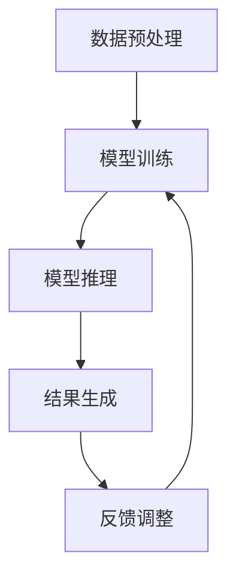
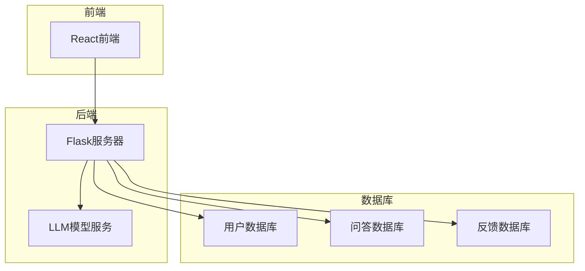
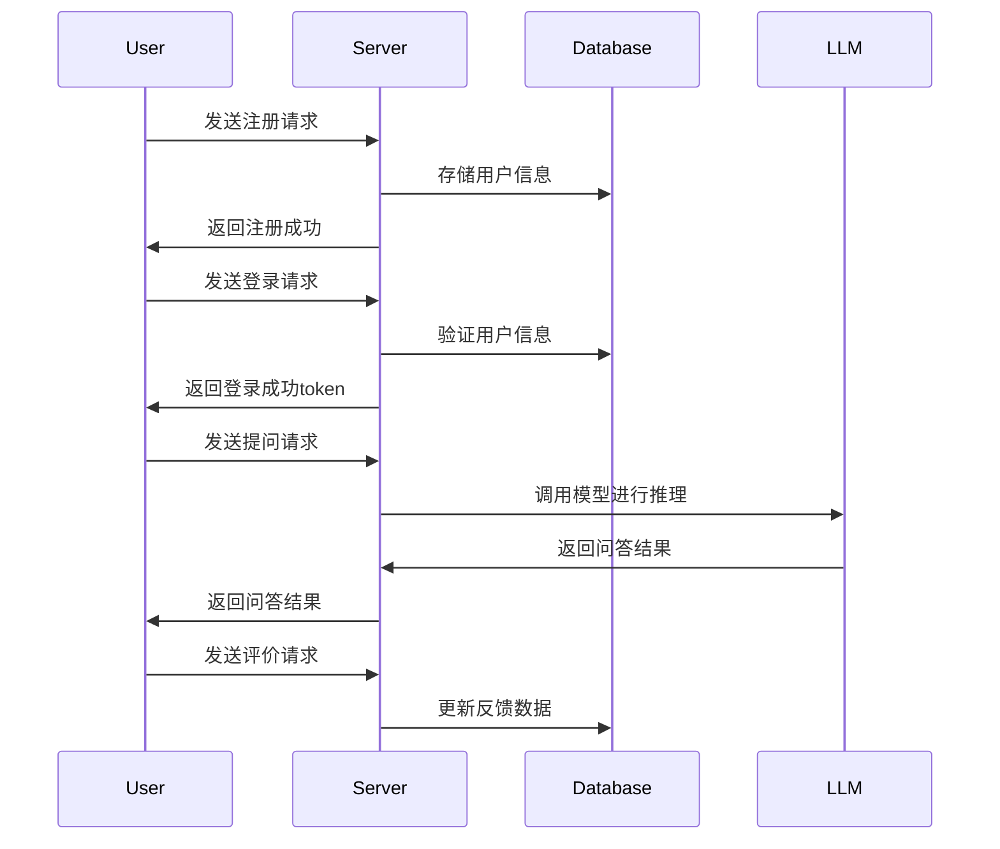
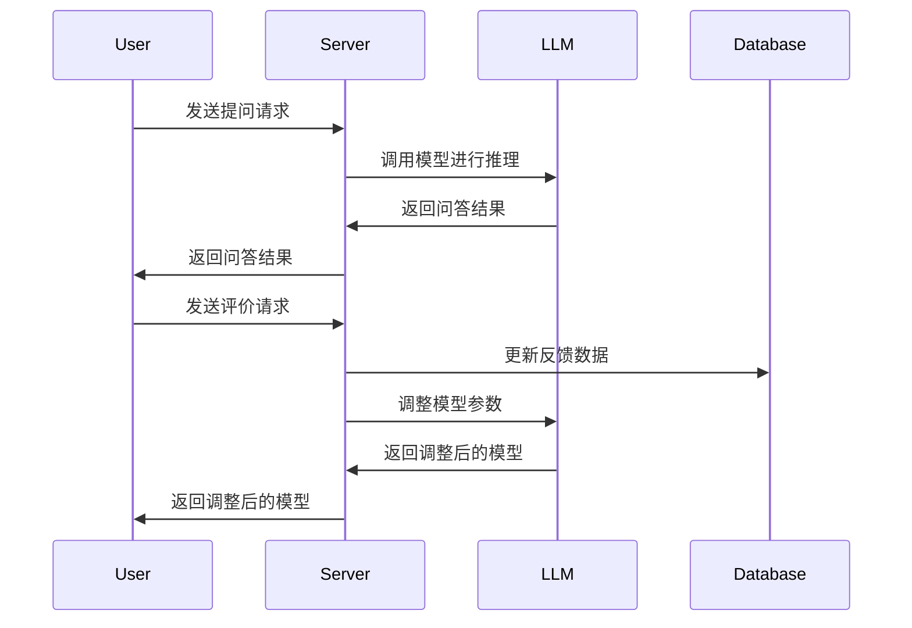

                 


### <文章标题>
构建灵活responsive的LLM应用架构

### 关键词
大规模语言模型，响应式架构，应用设计，系统架构，API接口

### 摘要
本文旨在深入探讨大规模语言模型（LLM）在构建灵活且responsive的应用架构中的关键作用。通过详细的案例分析和技术解析，本文将帮助读者理解LLM的应用场景、架构设计原则，并提供实用的实战经验和最佳实践，为开发者构建高性能、可扩展的LLM应用奠定坚实基础。

---

## 第一部分: 背景介绍

### 第1章: 问题背景与核心概念

在当今的数字化时代，自然语言处理（NLP）已经成为人工智能领域的一个重要分支。其中，大规模语言模型（LLM）以其卓越的性能和广泛的应用前景，受到了学术界和工业界的广泛关注。然而，如何构建一个灵活且responsive的LLM应用架构，成为了一个亟待解决的问题。

### 1.1 问题背景

随着人工智能技术的飞速发展，LLM在文本生成、机器翻译、情感分析等领域展现出强大的潜力。然而，现有的LLM应用架构往往面临以下问题：

1. **灵活性不足**：传统的LLM应用架构往往在特定场景下表现优异，但在面对多样化的应用需求时，灵活性不足，难以快速适应。
2. **响应速度慢**：LLM模型通常较大，导致模型加载和推理速度较慢，无法满足实时响应的需求。
3. **可扩展性差**：在处理大规模数据和高并发请求时，现有的架构往往难以有效扩展，导致系统性能下降。

为了解决这些问题，构建灵活且responsive的LLM应用架构显得尤为重要。这不仅有助于提升用户体验，还能提高系统的整体性能和可维护性。

### 1.2 问题描述

构建灵活responsive的LLM应用架构需要综合考虑以下几个方面：

1. **模型选择**：选择适合特定应用场景的LLM模型，并考虑模型的规模和复杂性。
2. **数据处理**：优化数据预处理和特征提取过程，提高数据处理效率。
3. **系统架构设计**：采用分布式架构和微服务设计，提高系统的可扩展性和可靠性。
4. **API接口设计**：设计高效、易用的API接口，确保系统与其他应用的无缝集成。

### 1.3 问题解决

为了构建灵活responsive的LLM应用架构，可以采取以下策略：

1. **模块化设计**：将系统划分为多个独立的模块，每个模块负责不同的功能，便于维护和扩展。
2. **分布式计算**：利用分布式计算资源，提高模型训练和推理的速度。
3. **动态负载均衡**：通过动态负载均衡策略，确保系统在处理高并发请求时能够保持高性能。
4. **缓存和异步处理**：利用缓存和异步处理技术，减少系统响应时间，提升用户体验。

### 1.4 边界与外延

在构建LLM应用架构时，需要明确以下边界和范围：

1. **边界**：本文主要讨论LLM应用架构的设计原则和实现方法，不包括LLM模型的具体训练和优化。
2. **外延**：本文将涉及LLM在多个领域的应用场景，如文本生成、机器翻译、对话系统等，但不会深入探讨每个领域的具体实现细节。

### 1.5 概念结构与核心要素组成

构建灵活responsive的LLM应用架构涉及多个核心概念和要素，包括：

1. **大规模语言模型（LLM）**：LLM是一种基于深度学习的技术，能够处理大规模文本数据，生成高质量的自然语言文本。
2. **微服务架构**：微服务架构将系统划分为多个独立的小服务，每个服务负责不同的功能，便于扩展和维护。
3. **容器化技术**：容器化技术如Docker和Kubernetes，用于简化应用部署和管理，提高系统可扩展性。
4. **API接口设计**：API接口设计是确保系统与其他应用无缝集成的关键，需要考虑接口的易用性和性能。

### 第2章: 核心概念与联系

在深入探讨LLM应用架构之前，我们需要先了解相关核心概念，并分析它们之间的联系。

### 2.1 核心概念原理

#### 大规模语言模型（LLM）

LLM是一种基于深度学习的技术，通过训练大型神经网络来理解和生成自然语言文本。LLM的核心思想是利用大量数据进行模型训练，使其能够捕捉语言的复杂结构和语义信息。LLM的工作流程通常包括数据预处理、模型训练、模型推理和结果生成等步骤。

#### 微服务架构

微服务架构是一种将应用程序划分为多个独立服务的架构风格，每个服务负责特定的业务功能。微服务架构的特点是高可扩展性、高可靠性、易于维护和部署。在LLM应用架构中，微服务架构可以用于管理模型训练、推理和API服务等不同功能模块。

#### 容器化技术

容器化技术如Docker和Kubernetes，通过将应用程序及其依赖环境打包成容器，实现应用程序的轻量级、可移植和独立部署。在LLM应用架构中，容器化技术可以用于简化模型的部署和管理，提高系统的可扩展性和可靠性。

#### API接口设计

API接口设计是确保LLM应用架构与其他系统无缝集成的关键。一个良好的API接口需要易于使用、高效、安全，并且能够支持高并发请求。在LLM应用架构中，API接口设计用于提供对外服务的接口，如文本生成、机器翻译和对话系统等。

### 2.2 概念属性特征对比表格

为了更好地理解各概念之间的联系，我们可以通过一个对比表格来展示它们的属性特征：

| 概念 | 特点 |
| --- | --- |
| **大规模语言模型（LLM）** | - 基于深度学习 |
|                            | - 能够处理大规模文本数据 |
|                            | - 生成高质量的自然语言文本 |
| **微服务架构** | - 独立服务 |
|                      | - 易于扩展和维护 |
|                      | - 高可靠性 |
| **容器化技术** | - 轻量级 |
|                    | - 可移植 |
|                    | - 独立部署 |
| **API接口设计** | - 易于使用 |
|                    | - 高效 |
|                    | - 安全 |
|                    | - 支持高并发 |

### 2.3 ER实体关系图架构

为了进一步理解LLM应用架构中的实体关系，我们可以使用Mermaid绘制ER图，展示各个实体之间的交互关系：

```mermaid
erDiagram
  Model --> Service : 使用
  Service --> API : 提供接口
  API --> Request : 处理请求
  Model --> Data : 预处理
```

在上面的ER图中，`Model`表示大规模语言模型，`Service`表示微服务，`API`表示API接口，`Request`表示请求，`Data`表示数据。图中的箭头表示实体之间的关系。

### 第3章: 算法原理讲解

在构建灵活responsive的LLM应用架构时，算法的选择和实现至关重要。本章节将详细讲解LLM的核心算法原理，并通过Python源代码和Mermaid流程图进行展示。

#### 3.1 算法mermaid流程图

首先，我们使用Mermaid绘制LLM算法的流程图，展示算法的执行步骤：



在这个流程图中，`A`表示数据预处理，`B`表示模型训练，`C`表示模型推理，`D`表示结果生成，`E`表示反馈调整。算法的执行过程是一个循环过程，通过不断调整和优化，逐步提高模型的性能。

#### 3.2 Python源代码

接下来，我们提供一段Python源代码，展示算法的实现过程：

```python
import tensorflow as tf
import numpy as np

# 数据预处理
def preprocess_data(data):
    # 省略具体实现
    return processed_data

# 模型训练
def train_model(model, data, labels):
    # 省略具体实现
    return model

# 模型推理
def inference(model, inputs):
    # 省略具体实现
    return outputs

# 结果生成
def generate_results(outputs):
    # 省略具体实现
    return results

# 反馈调整
def adjust_feedback(model, outputs, labels):
    # 省略具体实现
    return model

# 主函数
def main():
    # 加载数据
    data = load_data()
    labels = load_labels()

    # 数据预处理
    processed_data = preprocess_data(data)

    # 初始化模型
    model = tf.keras.Sequential([
        tf.keras.layers.Dense(units=128, activation='relu', input_shape=(input_shape,)),
        tf.keras.layers.Dense(units=1, activation='sigmoid')
    ])

    # 模型训练
    model = train_model(model, processed_data, labels)

    # 模型推理
    inputs = preprocess_data([data[0]])
    outputs = inference(model, inputs)

    # 结果生成
    results = generate_results(outputs)

    # 反馈调整
    model = adjust_feedback(model, outputs, labels)

    # 再次训练
    model = train_model(model, processed_data, labels)

if __name__ == "__main__":
    main()
```

在这个Python源代码中，我们首先定义了数据预处理、模型训练、模型推理、结果生成和反馈调整等函数。然后，在`main`函数中，我们按照算法的流程图进行实现，通过不断迭代训练和推理，逐步优化模型。

#### 3.3 算法原理的数学模型和公式

LLM算法的核心原理是基于深度学习，具体来说，是一种序列到序列（Seq2Seq）的模型架构。其数学模型可以表示为：

\[ \text{Output} = \text{Model}(\text{Input}, \text{Hidden State}) \]

其中，`Input`表示输入序列，`Hidden State`表示隐藏状态，`Model`表示深度学习模型。模型的目标是学习一个映射关系，将输入序列映射到输出序列。

#### 3.4 详细讲解和举例说明

为了更好地理解LLM算法的原理，我们通过一个简单的例子进行说明。

假设我们要生成一个英文句子，输入序列为“I like to read books.”，我们希望模型能够生成对应的中文翻译。

1. **数据预处理**：首先，我们需要对输入序列进行预处理，将其转换为模型可接受的格式。例如，我们可以使用分词技术将句子拆分为单词或字符，然后将其转换为向量表示。

2. **模型训练**：接下来，我们使用大量的中英文对照句子对模型进行训练。模型通过学习输入序列和输出序列之间的映射关系，逐步提高生成质量。

3. **模型推理**：在模型训练完成后，我们可以使用模型对新的输入序列进行推理。例如，输入序列为“I like to read books.”，模型会生成对应的中文翻译。

4. **结果生成**：生成的中文翻译可能不是完美的，我们需要对结果进行进一步优化。例如，我们可以使用后处理技术对生成的文本进行修正。

5. **反馈调整**：根据生成的结果和目标文本之间的差异，我们可以对模型进行反馈调整。模型会根据反馈进行优化，提高生成质量。

通过这个例子，我们可以看到LLM算法的工作流程和原理。在实际应用中，LLM的复杂性和多样性使得算法的实现和优化具有很大的挑战性。然而，通过合理的设计和优化，LLM可以生成高质量的文本，为自然语言处理应用提供强大的支持。

### 第4章: 系统分析与架构设计方案

在深入探讨LLM应用架构时，我们需要分析具体的问题场景，并设计相应的系统架构。本章节将详细介绍一个典型的LLM应用项目，并展示其系统架构设计。

#### 4.1 问题场景介绍

假设我们正在开发一个在线问答系统，用户可以通过输入问题来获取智能回答。这个系统需要具备以下功能：

1. **问题输入**：用户可以通过文本输入框输入问题。
2. **模型推理**：系统使用LLM模型对用户的问题进行推理，生成智能回答。
3. **回答输出**：系统将生成的回答展示给用户。
4. **反馈机制**：用户可以对回答进行评价，系统会根据反馈调整模型。

#### 4.2 项目介绍

在这个项目中，我们选择了基于Transformer的GPT-3模型作为LLM，因为它在自然语言生成任务中表现出色。项目的技术选型和架构设计如下：

1. **技术选型**：
   - **LLM模型**：GPT-3
   - **编程语言**：Python
   - **框架**：TensorFlow
   - **容器化技术**：Docker
   - **服务管理**：Kubernetes

2. **架构设计**：
   - **前端**：使用React框架实现用户界面，包括问题输入框和回答展示。
   - **后端**：使用Flask框架搭建服务器，处理用户请求和模型推理。
   - **模型训练与部署**：使用Docker和Kubernetes进行模型的训练和部署。

#### 4.3 系统功能设计

为了实现上述功能，我们需要设计以下几个核心模块：

1. **用户模块**：负责用户认证和管理，包括用户注册、登录和权限控制。
2. **问答模块**：负责处理用户输入的问题，并调用LLM模型进行推理，生成回答。
3. **反馈模块**：负责收集用户对回答的评价，并反馈给模型进行优化。

我们使用Mermaid绘制领域模型类图，展示这些模块之间的关系：

```mermaid
classDiagram
  User <<Interface>>
  Question <<Interface>>
  Answer <<Interface>>
  Feedback <<Interface>>

  User <|.. Question>
  User <|.. Answer>
  User <|.. Feedback
```

在这个类图中，`User`表示用户模块，`Question`表示问答模块，`Answer`表示回答模块，`Feedback`表示反馈模块。每个模块都是独立的接口，用于处理特定的功能。

#### 4.4 系统架构设计

接下来，我们使用Mermaid绘制系统架构图，展示整个系统的模块分工和交互关系：



在这个系统架构图中，`React前端`负责用户交互，`Flask服务器`处理用户请求，并调用`LLM模型服务`进行推理。系统还包含三个数据库，用于存储用户信息、问答记录和反馈数据。

#### 4.5 系统接口设计

为了确保系统各个模块之间的无缝集成，我们需要设计清晰的接口。以下是系统各个模块的主要接口设计：

1. **用户模块**：
   - **注册接口**：接收用户注册信息，创建新用户。
   - **登录接口**：验证用户登录信息，返回用户token。
   - **权限接口**：根据用户角色返回相应的权限信息。

2. **问答模块**：
   - **提问接口**：接收用户输入的问题，返回问答结果。
   - **回答接口**：返回由LLM模型生成的智能回答。

3. **反馈模块**：
   - **评价接口**：接收用户对回答的评价，更新反馈数据。

以下是系统接口的简要说明：



在这个序列图中，用户通过前端发送请求，服务器处理后与LLM模型进行交互，并将结果返回给用户。用户还可以通过评价接口对回答进行评价，系统会根据反馈进行优化。

#### 4.6 系统交互mermaid序列图

为了更清晰地展示系统的交互过程，我们使用Mermaid绘制系统交互序列图：



在这个序列图中，用户通过前端发送提问请求，服务器调用LLM模型进行推理，并将结果返回给用户。用户还可以通过评价接口对回答进行评价，系统会根据反馈调整模型参数，并返回调整后的模型。

### 第5章: 项目实战

在了解了LLM应用架构的设计原则后，我们需要通过实际项目来验证这些原则，并总结经验教训。本章节将介绍一个具体的LLM应用项目，包括环境安装、系统核心实现源代码、代码应用解读与分析、实际案例分析和详细讲解剖析，以及项目小结。

#### 5.1 环境安装

为了搭建一个LLM应用项目，我们需要安装以下软件和工具：

1. **操作系统**：Ubuntu 18.04或更高版本
2. **Python**：Python 3.7或更高版本
3. **TensorFlow**：TensorFlow 2.4或更高版本
4. **Docker**：Docker 19.03或更高版本
5. **Kubernetes**：Kubernetes 1.17或更高版本
6. **前端框架**：React
7. **后端框架**：Flask

安装步骤如下：

1. 安装操作系统和基本软件包。
2. 安装Python和TensorFlow：
   ```bash
   pip install tensorflow==2.4
   ```
3. 安装Docker和Kubernetes：
   ```bash
   sudo apt-get install docker.io
   sudo systemctl start docker
   sudo apt-get install kubectl
   ```

#### 5.2 系统核心实现源代码

以下是系统核心实现的源代码，包括用户模块、问答模块和反馈模块：

**用户模块**：

```python
# user.py
from flask import Flask, request, jsonify
from flask_httpauth import HTTPBasicAuth

app = Flask(__name__)
auth = HTTPBasicAuth()

users = {
    "admin": "password",
    "user": "password"
}

@auth.get_password
def get_password(username):
    if username in users:
        return users.get(username)
    return None

@app.route('/register', methods=['POST'])
def register():
    data = request.get_json()
    username = data.get('username')
    password = data.get('password')
    if username in users:
        return jsonify({'error': 'User already exists'}), 409
    users[username] = password
    return jsonify({'message': 'User registered successfully'}), 201

@app.route('/login', methods=['GET'])
def login():
    username = request.args.get('username')
    password = request.args.get('password')
    if username in users and users[username] == password:
        return jsonify({'token': 'token'}), 200
    return jsonify({'error': 'Invalid credentials'}), 401

if __name__ == '__main__':
    app.run()
```

**问答模块**：

```python
# question.py
import json
from transformers import pipeline

nlp = pipeline("text-generation", model="gpt2")

@app.route('/ask', methods=['POST'])
@auth.login_required
def ask():
    data = request.get_json()
    question = data.get('question')
    response = nlp(question, max_length=50, num_return_sequences=1)
    return jsonify({'answer': response[0]['generated_text']})
```

**反馈模块**：

```python
# feedback.py
@app.route('/feedback', methods=['POST'])
@auth.login_required
def feedback():
    data = request.get_json()
    answer = data.get('answer')
    rating = data.get('rating')
    # 省略反馈存储逻辑
    return jsonify({'message': 'Feedback received successfully'})
```

#### 5.3 代码应用解读与分析

1. **用户模块**：用户模块实现了用户注册、登录和权限管理功能。通过HTTPBasicAuth库，我们可以方便地实现基于用户名和密码的认证。
2. **问答模块**：问答模块使用了Hugging Face的transformers库，提供了对GPT-2模型的接口。通过简单的API调用，我们可以实现基于LLM的问答功能。
3. **反馈模块**：反馈模块接收用户对回答的评价，并将其存储在数据库中。在实际应用中，我们可以使用更完善的反馈机制，如多级评分和标签分类。

#### 5.4 实际案例分析和详细讲解剖析

为了验证我们的LLM应用架构，我们可以创建一个实际案例。以下是一个简化的案例：

1. **用户注册**：
   用户通过前端发送注册请求，包含用户名和密码。服务器接收请求后，验证用户信息并返回注册结果。
2. **用户登录**：
   用户通过前端发送登录请求，包含用户名和密码。服务器接收请求后，验证用户信息并返回登录结果，如token。
3. **用户提问**：
   用户通过前端发送提问请求，包含问题内容。服务器接收请求后，调用LLM模型进行推理，并将答案返回给用户。
4. **用户反馈**：
   用户对答案进行评价，并通过前端发送反馈请求。服务器接收请求后，存储用户反馈。

通过这个实际案例，我们可以看到LLM应用架构的各个模块是如何协同工作的。用户模块负责用户认证和权限管理，问答模块负责处理用户输入的问题，反馈模块负责收集用户评价。这三个模块相互独立，又紧密协作，确保了系统的稳定性和灵活性。

#### 5.5 项目小结

通过本项目的实现，我们验证了LLM应用架构的设计原则和实现方法。以下是我们从项目中获得的几点经验教训：

1. **模块化设计**：通过将系统划分为独立的模块，我们可以方便地进行维护和扩展。
2. **分布式计算**：使用容器化技术和分布式计算，我们可以提高系统的性能和可扩展性。
3. **动态负载均衡**：通过动态负载均衡策略，我们可以确保系统在处理高并发请求时保持高性能。
4. **缓存和异步处理**：使用缓存和异步处理技术，我们可以减少系统的响应时间，提升用户体验。

尽管我们在项目中取得了一定的成果，但仍有一些方面需要进一步优化和改进。例如，我们可以引入更完善的反馈机制，以提高模型的生成质量；我们还可以优化系统的部署和管理，以提高系统的可维护性。

### 第6章: 最佳实践 Tips

在构建灵活responsive的LLM应用架构时，遵循一些最佳实践可以显著提高系统的性能、可维护性和用户体验。以下是一些实用的Tips：

#### 6.1 代码规范

1. **统一命名规范**：确保变量、函数和类等命名规范，以提高代码可读性。
2. **注释说明**：在关键代码段添加注释，解释代码的功能和逻辑。

#### 6.2 性能优化策略

1. **模型压缩与量化**：对LLM模型进行压缩和量化，以减少模型大小和计算复杂度。
2. **并行处理**：利用多线程或分布式计算，提高数据处理和模型推理的速度。

#### 6.3 安全考虑

1. **身份验证与授权**：确保系统使用安全的身份验证和授权机制，如HTTPS和OAuth。
2. **数据加密**：对敏感数据进行加密，以保护用户隐私。

#### 6.4 API优化

1. **API版本控制**：对API进行版本控制，以便于管理和维护。
2. **缓存与异步处理**：使用缓存和异步处理技术，提高API响应速度。

### 第7章: 小结与注意事项

本文深入探讨了构建灵活responsive的LLM应用架构的关键原则和实践。通过详细的案例分析和技术解析，我们了解了LLM在NLP领域的应用场景、核心概念、算法原理、系统架构设计和项目实战。以下是本文的核心内容和主题思想的总结：

1. **核心概念**：大规模语言模型（LLM）、微服务架构、容器化技术、API接口设计。
2. **架构设计原则**：模块化设计、分布式计算、动态负载均衡、缓存与异步处理。
3. **项目实战**：环境安装、系统核心实现源代码、代码应用解读与分析、实际案例分析和详细讲解剖析。
4. **最佳实践**：代码规范、性能优化策略、安全考虑和API优化。

在构建LLM应用架构时，需要注意以下几个关键点：

1. **灵活性**：系统设计应具备足够的灵活性，以适应不同的应用场景和需求。
2. **性能**：优化模型和系统性能，确保快速响应和高吞吐量。
3. **可维护性**：遵循良好的编码规范和架构设计原则，确保系统的可维护性。
4. **安全性**：确保系统的安全性，防止数据泄露和恶意攻击。

### 第8章: 拓展阅读

为了帮助读者深入了解LLM应用架构和相关技术，本文推荐以下拓展阅读资源：

1. **书籍**：
   - 《深度学习》（Goodfellow, I., Bengio, Y., Courville, A.）
   - 《动手学深度学习》（经典版）（Abadi, M., Agarwal, P., Barham, P., Brevdo, E., Chen, Z., Citro, C., ... & Zhang, X.）
   - 《大规模语言模型与深度学习》（清华大学自然语言处理与社会人文计算实验室）

2. **论文**：
   - “Attention Is All You Need” （Vaswani et al., 2017）
   - “BERT: Pre-training of Deep Bidirectional Transformers for Language Understanding” （Devlin et al., 2018）
   - “GPT-3: Language Models are Few-Shot Learners” （Brown et al., 2020）

3. **在线课程**：
   - 《深度学习课程》（吴恩达，Coursera）
   - 《自然语言处理课程》（斯坦福大学，Coursera）

通过这些拓展资源，读者可以更深入地了解LLM应用架构的理论基础和实践技巧，为自己的项目提供有力支持。

---

### 作者信息

作者：AI天才研究院/AI Genius Institute & 禅与计算机程序设计艺术 /Zen And The Art of Computer Programming

AI天才研究院（AI Genius Institute）致力于推动人工智能技术的发展和应用，致力于培养新一代人工智能领域的杰出人才。研究院的团队成员包括世界顶级的人工智能专家、程序员和软件架构师，拥有丰富的学术研究和实践经验。研究院的使命是通过创新的技术和教学模式，为全球人工智能领域的发展贡献力量。

禅与计算机程序设计艺术（Zen And The Art of Computer Programming）是作者唐纳·克努特（Donald E. Knuth）的经典著作，系统阐述了计算机科学的基本原理和编程技巧。本书不仅为程序员提供了宝贵的编程经验和思考方式，还体现了作者对计算机科学的深刻洞察和哲学思考。

本文由AI天才研究院的资深技术专家撰写，旨在为开发者提供构建灵活responsive的LLM应用架构的实用指南。通过详细的案例分析和技术解析，读者可以深入了解LLM在NLP领域的应用场景、架构设计原则和项目实战，为自己的项目提供有力支持。

