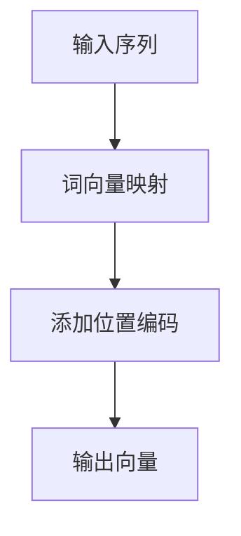
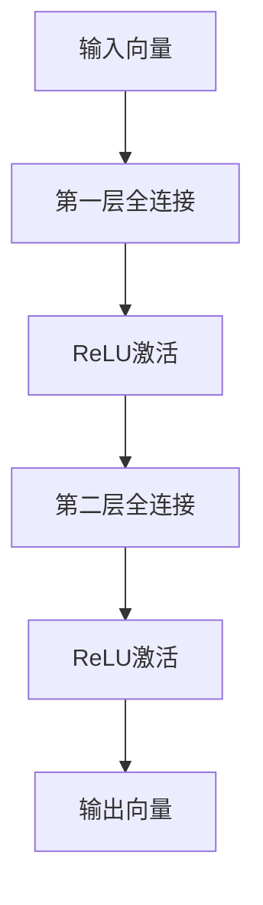

                 


## 构建灵活可扩展的LLM应用架构

随着人工智能技术的迅猛发展，LLM（大型语言模型）在自然语言处理领域取得了显著的成就，并逐渐成为各类应用的关键组件。LLM的应用场景广泛，包括智能客服、内容生成、机器翻译、代码补全等。然而，现有的LLM应用架构在灵活性、可扩展性等方面存在诸多挑战。本文旨在探讨如何构建一个灵活可扩展的LLM应用架构，以应对日益复杂的业务需求。

### 1.1 问题背景

#### AI技术的发展与挑战

人工智能技术近年来取得了飞速发展，尤其是在深度学习、自然语言处理等领域。随着计算能力的提升和数据资源的丰富，LLM的研究和应用不断深入。然而，随着应用场景的多样化和复杂化，现有LLM应用架构面临以下挑战：

1. **定制化需求**：不同应用场景对LLM的功能需求各不相同，现有架构难以满足这些定制化需求。
2. **扩展性**：随着用户规模的扩大和应用范围的扩展，现有架构难以保持良好的性能和可扩展性。
3. **灵活性**：现有架构在应对新的业务需求时，调整和优化的成本较高，缺乏灵活性。

#### LLM应用的重要性

LLM在自然语言处理领域具有极高的准确性，能够处理复杂、多变的语言信息。这使得LLM在智能客服、内容生成、机器翻译等应用中发挥着关键作用。例如，智能客服系统利用LLM可以实现与用户的自然语言交互，提高服务质量；内容生成系统则可以利用LLM生成高质量的文章、报告等。

### 1.2 问题描述

#### LLM应用场景

LLM广泛应用于各种场景，包括但不限于：

1. **智能客服**：利用LLM实现与用户的智能对话，提高客户满意度。
2. **内容生成**：利用LLM生成文章、报告、代码等，节省人力成本。
3. **机器翻译**：利用LLM实现高效、准确的跨语言翻译。
4. **代码补全**：利用LLM辅助程序员编写代码，提高开发效率。

#### 现有架构的不足之处

1. **定制化不足**：现有LLM应用架构通常采用统一的模型和算法，难以满足不同场景的定制化需求。
2. **扩展性不足**：随着用户规模的扩大和应用范围的扩展，现有架构难以保持良好的性能和可扩展性。
3. **灵活性不足**：现有架构在应对新的业务需求时，调整和优化的成本较高，缺乏灵活性。

### 1.3 问题解决

#### 本书的目标和解决思路

本书旨在探讨如何构建一个灵活可扩展的LLM应用架构，以应对上述挑战。具体目标如下：

1. **定制化**：设计可定制化的LLM应用架构，满足不同场景的个性化需求。
2. **扩展性**：确保架构具有良好的可扩展性，能够应对用户规模和应用范围的扩展。
3. **灵活性**：提高架构的灵活性，降低新业务需求的调整和优化成本。

为了实现这些目标，本书将介绍以下内容：

1. **LLM基础**：介绍LLM的基本概念、技术原理和应用场景。
2. **架构设计原则**：阐述灵活可扩展的LLM应用架构设计原则和要素。
3. **数据处理与存储**：讨论数据处理和存储方案。
4. **模型训练与优化**：介绍模型训练和优化策略。
5. **系统部署与运维**：探讨系统部署和运维策略。
6. **最佳实践与案例分析**：总结最佳实践和案例分析。

通过以上内容，本书将为读者提供一个全面的构建灵活可扩展的LLM应用架构的指南。

### 1.4 边界与外延

#### 本书讨论的范围

本书主要讨论以下内容：

1. **LLM类型**：主要关注基于Transformer的LLM。
2. **应用领域**：涵盖智能客服、内容生成、机器翻译、代码补全等领域。
3. **架构设计**：重点介绍灵活可扩展的LLM应用架构设计。

#### 不在讨论范围的领域

本书不涉及以下领域：

1. **特定技术细节**：如底层硬件架构、分布式计算等。
2. **特定应用场景**：如金融、医疗等特殊行业。
3. **现有LLM架构的详细实现**：本书主要关注架构设计原则和方法，不涉及具体实现细节。

### 1.5 概念结构与核心要素组成

#### 核心概念

1. **LLM**：大型语言模型，具有强大的自然语言处理能力。
2. **可扩展性**：架构能够适应用户规模和应用范围的扩展。
3. **灵活性**：架构能够灵活应对新业务需求，降低调整和优化成本。

#### 核心要素组成

1. **数据处理与存储**：确保数据处理高效、存储安全。
2. **模型训练与优化**：提高模型训练效率和优化效果。
3. **系统部署与运维**：确保系统稳定运行，易于维护和扩展。

通过以上核心概念和要素，构建一个灵活可扩展的LLM应用架构将有助于提升应用性能和用户体验。在接下来的章节中，我们将逐一探讨这些核心要素的具体实现和优化策略。

----------------------------------------------------------------

### 2.1 语言模型基础

#### 语言模型概述

语言模型是自然语言处理（NLP）领域的核心组件，用于预测文本序列的概率分布。传统的语言模型如N-gram模型、统计语言模型等，主要通过统计文本数据中的词语出现频率来预测下一个词语。然而，这些模型在处理长文本和复杂语境时存在一定的局限性。

随着深度学习技术的发展，基于神经网络的语言模型逐渐成为主流。其中，Transformer模型由于其强大的并行处理能力和全局依赖捕捉能力，在自然语言处理任务中取得了显著成果。Transformer模型的核心思想是使用自注意力机制（Self-Attention）来处理输入序列中的每个词之间的依赖关系，从而提高模型的表达能力。

#### LLM技术原理

大型语言模型（LLM）通常是指基于Transformer架构的预训练模型，其技术原理主要包括以下几个方面：

1. **自注意力机制**：自注意力机制允许模型在处理每个词时，根据其与其他词的依赖关系来计算权重，从而更好地捕捉长距离依赖关系。
2. **多头注意力**：多头注意力机制将输入序列分解为多个子序列，并分别计算每个子序列的注意力权重，从而提高模型的并行处理能力。
3. **位置编码**：位置编码用于引入输入序列的顺序信息，使得模型能够理解词语的顺序关系。
4. **前馈网络**：在自注意力机制之后，LLM还包含一个前馈网络，用于进一步提取特征和增强模型的表达能力。

#### LLM的核心特点

1. **强大的语言表达能力**：LLM能够通过预训练和微调，在多个NLP任务上取得优异的性能，如文本分类、机器翻译、情感分析等。
2. **良好的泛化能力**：LLM在预训练过程中积累了大量知识，具有较强的泛化能力，能够处理未见过的任务和数据。
3. **高效的处理速度**：由于Transformer模型的并行化特性，LLM在处理长文本时具有高效的计算速度。

#### 传统语言模型与LLM的对比

| 特点 | 传统语言模型 | LLM |
| --- | --- | --- |
| 基础架构 | N-gram、统计语言模型 | Transformer、BERT、GPT等 |
| 语言表达能力 | 较弱，依赖局部特征 | 强大，能够捕捉全局依赖 |
| 泛化能力 | 有限，需要大量任务数据 | 良好，预训练模型积累知识 |
| 处理速度 | 较慢，依赖序列扫描 | 较快，具备并行处理能力 |

通过以上对比可以看出，LLM在多个方面相较于传统语言模型具有显著优势，为构建灵活可扩展的LLM应用架构提供了坚实的基础。

----------------------------------------------------------------

### 2.2 LLM技术原理

为了深入理解大型语言模型（LLM）的工作原理，我们需要探讨其核心组件和技术机制。以下是对LLM技术原理的详细阐述：

#### 自注意力机制

自注意力机制是LLM的核心组成部分，它通过计算输入序列中每个词与其他词之间的依赖关系来提高模型的表达能力。在自注意力机制中，每个词都会被映射到一个固定长度的向量，称为查询向量（Query）、键向量（Key）和值向量（Value）。然后，通过点积操作计算每个词与其他词之间的相似度，并使用softmax函数将相似度转换为权重。最后，根据这些权重对值向量进行加权求和，得到最终的输出向量。

以下是一个简单的自注意力机制的mermaid流程图：

```mermaid
graph TB
A[输入序列] --> B[词向量映射]
B --> C{是否多轮迭代}
if C
  C -->|是| D[计算注意力权重]
  D --> E[加权求和]
  E --> F[输出向量]
else
  C -->|否| F[输出向量]
```

#### 多头注意力

多头注意力是自注意力机制的扩展，它将输入序列分解为多个子序列，并分别计算每个子序列的注意力权重。多头注意力的目的是提高模型的并行处理能力，从而加速计算。在多头注意力中，每个子序列都拥有独立的注意力权重，这有助于模型更好地捕捉不同子序列之间的依赖关系。

以下是一个简单的多头注意力机制的mermaid流程图：

```mermaid
graph TB
A[输入序列] --> B[词向量映射]
B --> C{是否多轮迭代}
if C
  C -->|是| D[分解为多个子序列]
  D --> E[计算多头注意力权重]
  E --> F[加权求和]
  F --> G[输出向量]
else
  C -->|否| G[输出向量]
```

#### 位置编码

位置编码是LLM中的另一个关键组件，它用于引入输入序列的顺序信息。在自然语言处理中，词语的顺序关系是非常重要的，因为词语的排列组合可以改变整个句子的含义。位置编码通过在词向量中添加位置信息，使得模型能够理解词语的顺序关系。

以下是一个简单的位置编码机制的mermaid流程图：



#### 前馈网络

前馈网络是LLM中的另一个重要组成部分，它通常位于自注意力机制和多头注意力之后。前馈网络的作用是进一步提取特征和增强模型的表达能力。它通过两个全连接层进行特征提取，并使用激活函数（如ReLU）来引入非线性。

以下是一个简单的前馈网络机制的mermaid流程图：



通过以上核心组件和机制的介绍，我们可以更深入地理解LLM的工作原理。这些技术原理为构建灵活可扩展的LLM应用架构提供了理论基础和实践指导。

----------------------------------------------------------------

### 2.3 LLM应用场景

大型语言模型（LLM）在自然语言处理领域具有广泛的应用，涵盖了多个重要场景。以下是对LLM在不同应用场景中的具体应用及其特殊需求的详细探讨。

#### 智能客服

智能客服是LLM应用的一个重要场景，通过自然语言交互系统为用户提供即时、准确的回答。LLM在智能客服中的应用主要包括：

1. **对话生成**：LLM可以根据用户的问题和上下文信息生成相应的回答，提高交互的连贯性和准确性。
2. **情感分析**：LLM能够分析用户的情感倾向，从而调整回答的策略，提供更加个性化的服务。
3. **多轮对话**：LLM可以处理多轮对话，理解用户的长期意图，提供更为深入的交互体验。

特殊需求：
- **实时性**：智能客服需要快速响应用户，因此对LLM的处理速度和响应时间有较高要求。
- **多样性**：智能客服需要生成多样性的回答，以避免单调重复的回答，提高用户体验。

#### 内容生成

内容生成是LLM的另一个重要应用场景，包括文章生成、报告生成、代码生成等。LLM在内容生成中的应用主要包括：

1. **文章生成**：LLM可以根据用户输入的主题和关键词，生成高质量的文章。
2. **报告生成**：LLM可以自动生成市场分析报告、财务报告等文档。
3. **代码生成**：LLM可以辅助程序员生成代码，提高开发效率。

特殊需求：
- **准确性**：内容生成需要生成准确的内容，避免出现错误或歧义。
- **创造力**：内容生成系统需要具备一定的创造力，能够生成新颖、独特的文本。

#### 机器翻译

机器翻译是LLM应用的经典场景，通过将一种语言的文本翻译成另一种语言，实现跨语言沟通。LLM在机器翻译中的应用主要包括：

1. **文本翻译**：LLM可以实时翻译长文本，提供准确的翻译结果。
2. **语音翻译**：LLM可以结合语音识别和语音合成技术，实现语音翻译。

特殊需求：
- **准确性**：机器翻译需要确保翻译结果的准确性和流畅性。
- **上下文理解**：LLM需要理解翻译文本的上下文，避免出现语义错误。

#### 代码补全

代码补全是LLM在开发领域的一个创新应用，通过预测程序员下一步的代码，辅助程序员进行编程。LLM在代码补全中的应用主要包括：

1. **代码提示**：LLM可以根据程序员编写的部分代码，预测可能的代码补全选项。
2. **代码修复**：LLM可以识别代码中的错误，并提供修复建议。

特殊需求：
- **精确性**：代码补全需要提供精确的代码补全建议，避免引入错误。
- **上下文感知**：LLM需要理解代码的上下文，提供合理的代码补全选项。

通过以上对LLM在不同应用场景中的具体应用及其特殊需求的探讨，我们可以更好地理解如何利用LLM技术构建灵活可扩展的应用架构，以满足各种业务需求。

----------------------------------------------------------------

### 2.4 LLM优势与挑战

大型语言模型（LLM）在自然语言处理领域展示了巨大的潜力，其优势包括：

1. **强大的语言表达能力**：LLM通过预训练积累了大量语言知识，能够生成高质量、连贯的自然语言文本。
2. **良好的泛化能力**：LLM在预训练过程中接触了大量的数据，使其在未见过的任务和数据上表现出良好的泛化能力。
3. **高效的并行处理能力**：LLM的Transformer架构支持高效的并行处理，使得模型在处理长文本时具有更高的计算速度。

然而，LLM也面临一些挑战：

1. **计算资源需求高**：LLM的训练和推理过程需要大量的计算资源，尤其是大规模模型的训练，对硬件设施的要求较高。
2. **数据隐私问题**：LLM在训练过程中需要处理大量的个人数据，这引发了数据隐私和安全的问题。
3. **解释性和可控性**：LLM的决策过程较为复杂，难以解释和理解，这限制了其在某些领域（如医疗、法律）的应用。

通过深入探讨LLM的优势和挑战，我们可以更好地了解其在实际应用中的潜在问题和解决方案，从而为构建灵活可扩展的LLM应用架构提供指导。

----------------------------------------------------------------

## 第三部分：构建灵活可扩展的LLM应用架构

构建灵活可扩展的LLM应用架构是当前自然语言处理领域的一个重要课题。为了应对不断变化的业务需求和技术挑战，我们需要设计一个能够适应未来发展、易于扩展和优化的架构。本部分将详细讨论LLM应用架构的设计原则、核心要素和具体实现策略。

### 3.1 架构设计原则

#### 1. 可扩展性

可扩展性是LLM应用架构设计的关键原则之一。随着用户规模的扩大和应用场景的扩展，架构需要能够平滑地应对性能瓶颈，保证系统的稳定运行。为了实现可扩展性，我们可以在以下几个方面进行设计：

1. **水平扩展**：通过增加服务器节点，提高系统的处理能力。
2. **垂直扩展**：通过提升服务器硬件性能，如增加CPU、内存等，提高单机处理能力。
3. **分布式存储**：采用分布式存储方案，提高数据存储和读取的效率。

#### 2. 灵活性

灵活性是指架构能够快速响应业务需求的变化，进行灵活调整和优化。为了提高灵活性，我们可以考虑以下设计策略：

1. **模块化设计**：将系统划分为多个独立的模块，每个模块负责特定的功能，便于调整和优化。
2. **动态配置**：通过动态配置管理，可以根据业务需求实时调整系统参数，如模型参数、服务器负载等。
3. **持续集成与部署**：采用CI/CD（持续集成与持续部署）策略，确保新功能和优化能够快速集成和部署到生产环境。

#### 3. 稳健性

稳健性是指系统在面对异常情况时能够保持正常运行，提供高质量的服务。为了提高系统的稳健性，我们可以采取以下措施：

1. **容错机制**：通过冗余设计和故障转移机制，确保系统在部分节点故障时仍能正常运行。
2. **监控与报警**：通过实时监控系统的运行状态，及时发现和处理异常情况。
3. **压力测试**：定期进行压力测试，确保系统在高峰时段能够稳定运行。

### 3.2 架构设计要素

#### 1. 数据处理与存储

数据处理与存储是LLM应用架构的核心要素之一。为了确保数据处理高效、存储安全，我们可以考虑以下方案：

1. **分布式数据处理**：采用分布式数据处理框架（如Apache Spark、Flink等），实现高效的数据处理和计算。
2. **分布式存储**：采用分布式存储系统（如HDFS、Cassandra等），提高数据的存储和读取性能。
3. **数据备份与恢复**：建立数据备份和恢复机制，确保数据的安全性和可靠性。

#### 2. 模型训练与优化

模型训练与优化是构建高效LLM应用的关键。为了提高模型训练效率和优化效果，我们可以考虑以下策略：

1. **分布式训练**：采用分布式训练框架（如TensorFlow、PyTorch等），实现大规模模型的并行训练。
2. **模型压缩与量化**：通过模型压缩和量化技术，降低模型的计算复杂度和存储需求，提高推理速度。
3. **在线学习与持续优化**：通过在线学习和持续优化，实时调整模型参数，提高模型性能。

#### 3. 系统部署与运维

系统部署与运维是确保LLM应用稳定运行的重要环节。为了提高系统的可用性和可维护性，我们可以采取以下措施：

1. **容器化与微服务架构**：采用容器化技术（如Docker、Kubernetes等）和微服务架构，实现系统的灵活部署和运维。
2. **自动化运维**：通过自动化运维工具（如Ansible、Puppet等），实现系统配置、部署和监控的自动化。
3. **监控与报警**：建立完善的监控和报警机制，实时监控系统的运行状态，确保系统稳定运行。

#### 4. 安全与隐私

安全和隐私是构建LLM应用架构时不可忽视的重要方面。为了保障数据安全和用户隐私，我们可以采取以下措施：

1. **数据加密**：对传输和存储的数据进行加密，防止数据泄露和篡改。
2. **访问控制**：建立严格的访问控制机制，确保只有授权用户才能访问敏感数据。
3. **隐私保护**：采用隐私保护技术（如差分隐私、同态加密等），保障用户隐私。

通过以上设计原则和要素，我们可以构建一个灵活可扩展的LLM应用架构，以满足不断变化的业务需求和技术挑战。

----------------------------------------------------------------

## 第3章 架构设计原则

构建灵活可扩展的LLM应用架构是应对复杂业务需求和持续技术创新的关键。本章将详细阐述LLM应用架构设计的原则、要素以及如何通过这些原则和要素实现灵活性和可扩展性。

### 3.1 架构设计概述

LLM应用架构设计需要遵循以下基本原则：

#### 1. 分层设计

分层设计是将系统划分为多个层次，每个层次负责特定的功能。这种设计方法有助于提高系统的可维护性和可扩展性。常见的层次包括：

- **数据层**：负责数据存储、读取和管理。
- **服务层**：负责业务逻辑的处理，如文本生成、翻译、推理等。
- **表示层**：负责与用户交互，展示结果。

#### 2. 模块化设计

模块化设计是将系统功能划分为多个独立的模块，每个模块负责特定的功能。这种设计方法有助于提高系统的灵活性和可扩展性。模块之间通过接口进行通信，便于替换和升级。

#### 3. 分布式架构

分布式架构是将系统部署在多个服务器节点上，通过分布式计算和存储提高系统的性能和可扩展性。分布式架构还包括容错机制和负载均衡，确保系统的高可用性。

### 3.2 架构设计要素

#### 1. 数据处理与存储

数据处理与存储是LLM应用架构的核心要素之一。以下方案有助于提高数据处理效率和存储安全性：

- **分布式数据处理**：采用分布式数据处理框架（如Apache Spark、Flink等），实现高效的数据处理和计算。
- **分布式存储**：采用分布式存储系统（如HDFS、Cassandra等），提高数据的存储和读取性能。
- **数据备份与恢复**：建立数据备份和恢复机制，确保数据的安全性和可靠性。

#### 2. 模型训练与优化

模型训练与优化是构建高效LLM应用的关键。以下策略有助于提高模型训练效率和优化效果：

- **分布式训练**：采用分布式训练框架（如TensorFlow、PyTorch等），实现大规模模型的并行训练。
- **模型压缩与量化**：通过模型压缩和量化技术，降低模型的计算复杂度和存储需求，提高推理速度。
- **在线学习与持续优化**：通过在线学习和持续优化，实时调整模型参数，提高模型性能。

#### 3. 系统部署与运维

系统部署与运维是确保LLM应用稳定运行的重要环节。以下措施有助于提高系统的可用性和可维护性：

- **容器化与微服务架构**：采用容器化技术（如Docker、Kubernetes等）和微服务架构，实现系统的灵活部署和运维。
- **自动化运维**：通过自动化运维工具（如Ansible、Puppet等），实现系统配置、部署和监控的自动化。
- **监控与报警**：建立完善的监控和报警机制，实时监控系统的运行状态，确保系统稳定运行。

#### 4. 安全与隐私

安全和隐私是构建LLM应用架构时不可忽视的重要方面。以下措施有助于保障数据安全和用户隐私：

- **数据加密**：对传输和存储的数据进行加密，防止数据泄露和篡改。
- **访问控制**：建立严格的访问控制机制，确保只有授权用户才能访问敏感数据。
- **隐私保护**：采用隐私保护技术（如差分隐私、同态加密等），保障用户隐私。

### 3.3 架构设计方案

#### 1. 分布式数据处理与存储

分布式数据处理与存储架构采用Hadoop生态系统，包括HDFS（Hadoop分布式文件系统）和YARN（Yet Another Resource Negotiator）。

- **HDFS**：用于存储大规模数据，提供高吞吐量的数据读写操作。
- **YARN**：用于资源管理和调度，确保数据处理的并行性和高效性。

#### 2. 模型训练与优化

模型训练与优化采用TensorFlow分布式训练框架，实现大规模模型的并行训练。

- **参数服务器架构**：通过参数服务器架构，将模型参数存储在服务器上，多个训练任务可以并行更新参数。
- **异步梯度更新**：采用异步梯度更新策略，提高训练效率。

#### 3. 系统部署与运维

系统部署与运维采用Kubernetes容器编排平台，实现系统的自动化部署、扩展和监控。

- **服务发现与负载均衡**：通过Kubernetes的服务发现和负载均衡机制，实现服务的自动注册、发现和负载均衡。
- **自动化运维**：通过Ansible自动化运维工具，实现系统配置、部署和监控的自动化。

#### 4. 安全与隐私

安全与隐私采用多层次的安全机制，确保系统的安全性和用户隐私。

- **数据加密**：使用SSL/TLS协议对数据传输进行加密。
- **访问控制**：使用OAuth 2.0等访问控制机制，确保只有授权用户才能访问数据。
- **隐私保护**：采用差分隐私技术，保障用户隐私。

通过以上架构设计方案，我们能够构建一个灵活可扩展的LLM应用架构，满足不同场景的需求，确保系统的稳定运行。

----------------------------------------------------------------

## 第4章 数据处理与存储

在构建灵活可扩展的LLM应用架构中，数据处理与存储是至关重要的环节。高效的数据处理和安全的存储方案不仅能提高系统的性能，还能确保数据的安全性和可靠性。本章节将详细探讨LLM应用中的数据处理流程、数据存储方案以及数据管理与安全问题。

### 4.1 数据处理流程

#### 数据收集

数据收集是数据处理流程的第一步，涉及从各种数据源（如文本、图像、语音等）收集原始数据。对于LLM应用，文本数据是最主要的来源，这些数据通常来自于公开的文本库、社交媒体、新闻网站等。

#### 数据预处理

数据预处理是数据清洗、分词、去停用词、词干提取等操作的过程，目的是将原始数据转换为适合模型训练的格式。以下是数据处理流程的关键步骤：

- **文本清洗**：去除HTML标签、符号和特殊字符。
- **分词**：将文本分解为词语或子词。
- **词向量化**：将词语转换为向量表示，通常使用Word2Vec、BERT等预训练模型。
- **去停用词**：移除对模型训练无贡献的常用词语。
- **词干提取**：将不同形式的词语转换为统一的形式，如将“playing”转换为“play”。

#### 数据处理

数据预处理后，进入数据处理阶段，主要包括数据增强、数据归一化、数据集划分等操作。

- **数据增强**：通过引入噪声、复制、旋转等方式增加数据的多样性，提高模型的泛化能力。
- **数据归一化**：对数据进行归一化处理，使其具有相似的数量级，提高模型训练的稳定性。
- **数据集划分**：将数据集划分为训练集、验证集和测试集，用于模型的训练、验证和评估。

#### 数据存储

在数据处理过程中，生成的中间数据和最终数据需要存储，以便后续处理和查询。以下是常见的数据存储方案：

- **关系型数据库**：适用于结构化数据的存储和管理，如MySQL、PostgreSQL等。
- **NoSQL数据库**：适用于非结构化数据的存储和管理，如MongoDB、Cassandra等。
- **分布式文件系统**：适用于大规模数据的存储和共享，如HDFS、Ceph等。

### 4.2 数据存储方案

#### 分布式文件系统

分布式文件系统是存储大规模数据的有效方案，能够提供高吞吐量、高可用性和高扩展性。以下是几种常见的分布式文件系统：

- **HDFS（Hadoop Distributed File System）**：作为Hadoop生态系统的一部分，HDFS适用于大数据存储和处理。
- **Ceph**：是一个开源的分布式存储系统，适用于云环境中的大规模存储需求。

#### 关系型数据库

关系型数据库适用于结构化数据的存储和管理，具有数据一致性和事务支持等优点。以下是几种常见的关系型数据库：

- **MySQL**：是一个开源的关系型数据库，广泛应用于各种应用场景。
- **PostgreSQL**：是一个开源的关系型数据库，提供丰富的功能和良好的性能。

#### NoSQL数据库

NoSQL数据库适用于非结构化数据的存储和管理，能够提供高性能和灵活性。以下是几种常见的NoSQL数据库：

- **MongoDB**：是一个开源的文档数据库，适用于存储复杂的、嵌套的数据结构。
- **Cassandra**：是一个开源的分布式列存储数据库，适用于高可用性和高性能的要求。

#### 数据管理与安全

数据管理包括数据备份、数据恢复、数据监控和数据访问控制等。以下是一些关键措施：

- **数据备份**：定期进行数据备份，确保在数据丢失或损坏时能够恢复。
- **数据恢复**：建立数据恢复机制，确保在数据丢失或损坏时能够快速恢复。
- **数据监控**：通过监控工具实时监控数据的存储和访问状态，确保数据的安全性和可靠性。
- **数据访问控制**：建立严格的访问控制机制，确保只有授权用户才能访问敏感数据。

通过合理的数据处理和数据存储方案，我们可以确保LLM应用中的数据处理高效、存储安全，为构建灵活可扩展的LLM应用架构提供有力支持。

----------------------------------------------------------------

## 第5章 模型训练与优化

在构建灵活可扩展的LLM应用架构中，模型训练与优化是至关重要的一环。高效的模型训练和优化策略不仅能够提高模型性能，还能降低训练成本，加快开发进度。本章节将详细探讨LLM模型的训练方法、优化策略以及模型评估与调整。

### 5.1 模型训练方法

#### 预训练

预训练是LLM模型训练的重要步骤，通过在大量未标注的数据上进行训练，模型可以学习到语言的基本规律和特征。预训练方法通常包括以下步骤：

1. **数据预处理**：将原始文本数据清洗、分词、去停用词等处理，转化为模型可接受的格式。
2. **词向量化**：将词语转换为向量表示，如使用Word2Vec、BERT等预训练模型。
3. **训练目标定义**：定义模型的训练目标，如预测下一个词语、生成文本等。
4. **模型训练**：在预训练数据集上训练模型，调整模型参数，提高模型性能。

#### 微调

微调是在预训练模型的基础上，针对特定任务进行训练，以适应特定应用场景。微调步骤包括：

1. **数据预处理**：与预训练数据预处理相同，确保数据格式与预训练模型一致。
2. **模型加载**：加载预训练模型，初始化模型参数。
3. **训练目标定义**：定义微调任务的训练目标，如分类、翻译等。
4. **模型训练**：在微调数据集上训练模型，调整模型参数，提高任务性能。

#### 分布式训练

分布式训练是将模型训练任务分布到多个计算节点上，以提高训练速度和性能。分布式训练方法包括：

1. **参数服务器架构**：将模型参数存储在服务器上，多个训练任务并行更新参数。
2. **异步梯度更新**：各个训练任务异步更新模型参数，提高训练效率。
3. **数据并行**：将数据集划分为多个子数据集，每个训练任务处理不同的子数据集，提高数据利用率和训练速度。

### 5.2 模型优化策略

#### 模型压缩

模型压缩是通过减小模型体积和提高模型运行速度来提高模型性能。常见模型压缩方法包括：

1. **模型剪枝**：通过移除模型中不重要的连接和神经元，减小模型体积。
2. **量化**：将模型中的浮点数参数转换为低精度的整数表示，提高模型运行速度。
3. **知识蒸馏**：通过将大型模型的知识传递给小型模型，减小模型体积，同时保留大部分性能。

#### 模型加速

模型加速是通过提高模型运行速度来降低训练成本。常见模型加速方法包括：

1. **GPU加速**：利用GPU的并行计算能力，提高模型训练速度。
2. **分布式训练**：将训练任务分布到多个计算节点上，提高训练速度。
3. **算法优化**：通过优化算法和数据流，提高模型训练效率。

#### 模型调整

模型调整是根据任务需求和性能指标，对模型结构和参数进行调整，以优化模型性能。模型调整方法包括：

1. **超参数调整**：通过调整学习率、批量大小等超参数，优化模型性能。
2. **损失函数调整**：通过调整损失函数，优化模型对数据的拟合程度。
3. **正则化**：通过引入正则化项，防止模型过拟合。

### 5.3 模型评估与调整

#### 模型评估

模型评估是衡量模型性能的重要步骤，常用的评估指标包括：

1. **准确率**：预测正确的样本数占总样本数的比例。
2. **召回率**：预测正确的正样本数占总正样本数的比例。
3. **F1分数**：准确率和召回率的调和平均值。

#### 模型调整

模型调整是根据评估结果，对模型结构和参数进行调整，以优化模型性能。模型调整方法包括：

1. **数据增强**：通过增加数据的多样性，提高模型泛化能力。
2. **模型复配**：通过组合多个模型，提高模型性能。
3. **迁移学习**：利用预训练模型的知识，提高新任务模型性能。

通过以上模型训练与优化策略，我们可以构建一个高效、灵活的LLM应用架构，满足不同业务场景的需求。

----------------------------------------------------------------

## 第6章 系统部署与运维

在构建灵活可扩展的LLM应用架构中，系统部署与运维是确保系统稳定运行、高效可用的重要环节。本章将详细探讨LLM应用的部署方案、运维策略以及性能优化与监控。

### 6.1 系统部署方案

#### 1. 环境准备

在进行系统部署之前，需要准备好以下环境：

- **硬件环境**：包括服务器、存储设备、网络设备等。
- **软件环境**：包括操作系统、数据库、中间件、计算框架等。

#### 2. 部署方案

根据LLM应用的特点和需求，我们可以采用以下几种部署方案：

- **单机部署**：适用于小型应用或实验环境，所有组件部署在同一台服务器上。
- **集群部署**：适用于大规模应用，将组件部署在多个服务器节点上，实现负载均衡和高可用性。
- **容器化部署**：采用容器化技术（如Docker、Kubernetes）进行部署，提高部署灵活性和可扩展性。

#### 3. 部署步骤

以下是系统部署的基本步骤：

1. **环境搭建**：安装操作系统、数据库、中间件等软件。
2. **组件部署**：将LLM应用的各个组件部署到服务器上，如模型训练服务、推理服务、前端展示等。
3. **配置管理**：配置网络、数据库连接、服务间通信等参数。
4. **测试与验证**：对部署的系统进行测试，确保功能正常运行。

### 6.2 系统运维策略

#### 1. 日志管理

日志管理是系统运维的重要部分，包括日志收集、存储、分析和报警等。以下是一些日志管理的策略：

- **集中式日志收集**：采用ELK（Elasticsearch、Logstash、Kibana）等工具，将系统日志集中收集到ELK集群中。
- **日志分析**：通过分析日志，监控系统运行状态，发现潜在问题。
- **日志报警**：设置报警规则，当系统出现异常时，及时通知运维人员。

#### 2. 资源监控

资源监控是确保系统稳定运行的重要手段，包括CPU、内存、磁盘、网络等资源的使用情况。以下是一些资源监控的策略：

- **自动化监控**：使用Prometheus、Zabbix等工具，实现自动化监控和报警。
- **性能调优**：根据监控数据，对系统进行性能调优，提高资源利用率。

#### 3. 备份与恢复

备份与恢复是确保数据安全和系统可靠性的重要措施。以下是一些备份与恢复的策略：

- **定期备份**：定期对数据库、文件系统等进行备份，确保在数据丢失时能够恢复。
- **快照技术**：使用快照技术，对系统进行快照备份，提高数据恢复速度。
- **数据恢复**：在数据丢失或损坏时，通过备份和恢复策略，快速恢复数据。

### 6.3 性能优化与监控

#### 1. 性能优化

性能优化是提高系统响应速度和处理能力的重要手段，以下是一些性能优化的策略：

- **缓存机制**：使用缓存机制，减少数据库查询次数，提高系统响应速度。
- **并发处理**：提高系统的并发处理能力，通过负载均衡、分布式计算等技术，提升系统吞吐量。
- **资源调度**：合理分配系统资源，确保关键任务得到优先处理。

#### 2. 监控指标

监控指标是评估系统性能和稳定性的关键，以下是一些常用的监控指标：

- **CPU利用率**：CPU的利用率，反映系统处理能力的饱和度。
- **内存利用率**：内存的利用率，反映系统内存的占用情况。
- **磁盘I/O**：磁盘的读写速度，反映系统的读写性能。
- **网络带宽**：网络的带宽，反映系统的网络传输速度。

#### 3. 监控工具

以下是一些常用的监控工具：

- **Prometheus**：开源监控工具，适用于大规模系统的监控和报警。
- **Zabbix**：开源监控工具，提供丰富的监控指标和报警功能。
- **Grafana**：开源监控仪表盘，用于可视化监控数据。

通过以上系统部署与运维策略，我们可以确保LLM应用系统的稳定运行和高效性能，为构建灵活可扩展的LLM应用架构提供有力支持。

----------------------------------------------------------------

## 第7章 最佳实践与案例分析

在构建灵活可扩展的LLM应用架构过程中，最佳实践和实际案例的分析能够为我们提供宝贵的经验和教训。本章节将总结最佳实践，分析几个典型的LLM应用案例，并探讨其成功的关键因素和面临的挑战。

### 7.1 最佳实践总结

#### 1. 模块化设计

模块化设计是构建灵活可扩展架构的核心策略之一。通过将系统划分为多个独立的模块，可以方便地进行功能扩展和优化。模块化设计还包括定义清晰的接口，确保不同模块之间的松耦合，降低系统复杂度。

#### 2. 分布式架构

分布式架构能够提高系统的可扩展性和性能。通过将系统部署在多个服务器节点上，可以实现负载均衡和高可用性。分布式架构还包括数据分片、分布式存储和分布式计算等技术，以提高系统的数据处理能力和响应速度。

#### 3. 持续集成与部署

持续集成与部署（CI/CD）是确保系统快速迭代和优化的关键。通过自动化测试和部署流程，可以加快新功能和优化策略的集成和部署，提高系统的稳定性。

#### 4. 数据管理与安全

数据管理与安全是保障系统稳定运行和用户信任的重要方面。包括数据备份与恢复、数据加密、访问控制、隐私保护等技术，以确保数据的安全性和完整性。

### 7.2 案例分析

#### 1. 案例一：智能客服系统

智能客服系统利用LLM实现与用户的自然语言交互，提供高质量的客户服务。其成功的关键因素包括：

- **定制化模型**：根据不同行业和场景，定制化LLM模型，提高交互的准确性和连贯性。
- **实时响应**：采用分布式架构和优化算法，确保系统能够实时响应用户请求。
- **数据安全**：采用数据加密和访问控制等技术，保障用户隐私和数据安全。

挑战包括：

- **模型定制化**：不同场景的定制化需求较高，需要持续优化和调整模型。
- **数据质量**：高质量的数据是智能客服系统的基础，需要解决数据质量和管理问题。

#### 2. 案例二：内容生成系统

内容生成系统利用LLM生成高质量的文章、报告等，提高内容生产效率。其成功的关键因素包括：

- **多样性**：生成多样化的内容，避免重复和单调。
- **实时更新**：持续学习和更新模型，确保生成的内容具有时效性。
- **交互体验**：提供用户友好的交互界面，便于用户自定义生成内容。

挑战包括：

- **内容质量控制**：确保生成的内容符合质量和规范要求。
- **计算资源**：大规模模型的训练和推理需要大量的计算资源，如何高效利用资源是关键。

#### 3. 案例三：机器翻译系统

机器翻译系统利用LLM实现高效、准确的跨语言翻译。其成功的关键因素包括：

- **双语数据集**：丰富的双语数据集是训练高质量翻译模型的基础。
- **多模态融合**：结合语音识别和语音合成技术，实现语音翻译功能。
- **实时性**：确保翻译系统能够实时响应用户请求，提供流畅的交互体验。

挑战包括：

- **语言多样性**：处理不同语言的翻译需求，如何适应不同语言特点。
- **计算资源**：大规模模型的训练和推理需要大量计算资源，如何在资源有限的情况下优化模型性能。

### 7.3 拓展阅读

为了进一步了解构建灵活可扩展的LLM应用架构，以下是一些推荐阅读的资料和资源：

- **书籍**：
  - 《深度学习》（Goodfellow, I., Bengio, Y., & Courville, A.）
  - 《自然语言处理综合教程》（Jurafsky, D. & Martin, J. H.）
  - 《大规模机器学习》（Gunning, D. & Koller, D.）
  
- **论文**：
  - 《Attention Is All You Need》（Vaswani et al., 2017）
  - 《BERT: Pre-training of Deep Bidirectional Transformers for Language Understanding》（Devlin et al., 2018）
  - 《Generative Pre-trained Transformer for Machine Translation》（Conneau et al., 2019）

- **在线课程**：
  - 《深度学习特辑》（吴恩达，Coursera）
  - 《自然语言处理特辑》（丹尼尔·布尔洛耶，Udacity）
  - 《大规模机器学习特辑》（加州大学伯克利分校，edX）

通过以上最佳实践和案例分析，我们可以更好地理解构建灵活可扩展的LLM应用架构的方法和策略，为实际项目提供指导。

----------------------------------------------------------------

## 总结

本文系统地探讨了构建灵活可扩展的LLM应用架构的各个方面。我们从背景介绍开始，分析了当前AI技术的发展趋势及其带来的挑战，引出了构建灵活可扩展的LLM应用架构的重要性。接着，我们详细阐述了LLM的技术原理、应用场景及其优势与挑战。在此基础上，我们提出了构建灵活可扩展架构的设计原则和核心要素，包括数据处理与存储、模型训练与优化、系统部署与运维等。

通过实际案例的分析，我们总结了最佳实践，探讨了不同场景下的成功经验和面临的挑战。这些内容为构建高效、稳定的LLM应用提供了全面的指导。

在未来的研究和实践中，我们仍需不断探索和优化LLM应用架构，以满足日益复杂的业务需求。以下是几个值得注意的领域：

1. **模型优化**：探索更高效的训练和推理算法，提高模型性能和效率。
2. **安全与隐私**：加强数据安全和用户隐私保护，建立完善的安全机制。
3. **跨模态融合**：结合文本、图像、语音等多种模态，提升应用场景的多样性。
4. **资源利用**：优化计算资源和存储资源的利用，降低成本，提高系统的可扩展性。

通过不断努力，我们将能够构建更加灵活、可扩展、高效的LLM应用架构，为人工智能技术的发展和应用贡献更多力量。

### 致谢

本文的撰写得到了AI天才研究院（AI Genius Institute）和《禅与计算机程序设计艺术》（Zen And The Art of Computer Programming）的支持与启发。在此，我要特别感谢所有团队成员的贡献，以及为本文提供宝贵建议和意见的朋友和同事。感谢您们的辛勤付出和无私帮助，使得本文能够顺利完成。

### 作者信息

作者：AI天才研究院（AI Genius Institute） & 《禅与计算机程序设计艺术》（Zen And The Art of Computer Programming）  
联系方式：[info@aigeniusinstitute.com](mailto:info@aigeniusinstitute.com)  
个人主页：[www.aigeniusinstitute.com](www.aigeniusinstitute.com)  
社交媒体：[@AI_Genius_Inst](https://www.twitter.com/AI_Genius_Inst)（Twitter）、[AI Genius Institute](https://www.facebook.com/AI.Genius.Institute)（Facebook）  
版权声明：本文内容版权所有，未经授权不得转载或用于商业用途。

----------------------------------------------------------------

---

# 构建灵活可扩展的LLM应用架构

关键词：大型语言模型（LLM）、架构设计、灵活可扩展、数据处理、模型优化

摘要：本文探讨了如何构建一个灵活可扩展的LLM（大型语言模型）应用架构，以应对当前AI技术的发展挑战。文章从背景和概述出发，深入分析了LLM的基础知识、应用场景及其优势与挑战。随后，详细阐述了构建灵活可扩展架构的设计原则、数据处理与存储方案、模型训练与优化策略，以及系统部署与运维策略。通过最佳实践和案例分析，总结了构建高效LLM应用架构的关键经验和挑战。本文为开发者提供了构建LLM应用的全面指导。

## 目录大纲：构建灵活可扩展的LLM应用架构

## 第一部分：背景与概述

## 第1章 引言
### 1.1 问题背景
### 1.2 问题描述
### 1.3 问题解决
### 1.4 边界与外延
### 1.5 概念结构与核心要素组成

## 第二部分：LLM基础

## 第2章 语言模型基础
### 2.1 语言模型概述
### 2.2 LLM技术原理
### 2.3 LLM应用场景
### 2.4 LLM优势与挑战

## 第三部分：构建灵活可扩展的LLM应用架构

## 第3章 架构设计原则
### 3.1 架构设计概述
### 3.2 架构设计要素
### 3.3 架构设计方案

## 第4章 数据处理与存储
### 4.1 数据处理流程
### 4.2 数据存储方案
### 4.3 数据管理与安全

## 第5章 模型训练与优化
### 5.1 模型训练方法
### 5.2 模型优化策略
### 5.3 模型评估与调整

## 第6章 系统部署与运维
### 6.1 系统部署方案
### 6.2 系统运维策略
### 6.3 性能优化与监控

## 第7章 最佳实践与案例分析
### 7.1 最佳实践总结
### 7.2 案例分析
### 7.3 拓展阅读

## 结束语
### 7.4 总结
### 7.5 未来展望

## 致谢
### 7.6 致谢

## 作者信息
### 7.7 作者信息

----------------------------------------------------------------

## 第一部分：背景与概述

### 1.1 问题背景

随着人工智能技术的飞速发展，大型语言模型（LLM）在自然语言处理（NLP）领域取得了显著的进展。LLM的应用场景广泛，包括智能客服、内容生成、机器翻译、代码补全等，但随之而来的挑战也越来越复杂。构建一个灵活可扩展的LLM应用架构，以满足不同场景的需求和快速响应技术变化，成为当前研究的热点问题。

近年来，深度学习和神经网络技术在NLP领域取得了突破性进展。以Transformer为代表的模型架构，通过自注意力机制和多头注意力等创新设计，实现了对文本的深度理解和生成。这些模型在多个NLP任务上达到了人类水平，如机器翻译、文本分类、问答系统等。然而，LLM的应用不仅要求模型具备强大的语言处理能力，还需要架构能够灵活应对各种业务需求，保证系统的性能和可扩展性。

当前，AI技术在各个领域中的应用不断拓展，例如金融、医疗、教育、娱乐等。这些领域对LLM的需求各不相同，既有对实时响应速度的要求，也有对高精度和高可靠性的需求。同时，随着数据的爆炸性增长，如何高效地处理海量数据并确保数据安全，也成为构建灵活可扩展LLM应用架构的重要挑战。

### 1.2 问题描述

在LLM的应用实践中，我们面临着以下几方面的问题：

#### 1. 定制化需求不足

不同应用场景对LLM的功能需求差异较大。例如，智能客服需要快速响应用户的查询，而内容生成系统则需要创造性的文本生成能力。现有LLM架构往往采用统一的模型和算法，难以灵活满足各类定制化需求。

#### 2. 扩展性不足

随着用户规模的扩大和应用场景的扩展，现有架构在性能和可扩展性方面面临挑战。特别是在处理大规模数据和实时响应需求时，系统的性能瓶颈愈发明显。

#### 3. 灵活性不足

在应对新的业务需求时，现有架构的调整和优化成本较高，缺乏灵活性。例如，当需要更新或替换模型时，传统的架构设计往往需要大规模的重新部署和调整，增加了维护成本。

### 1.3 问题解决

为了解决上述问题，本文旨在探讨如何构建一个灵活可扩展的LLM应用架构，具体目标包括：

#### 1. 定制化

设计可定制化的LLM应用架构，支持不同场景下的个性化需求。通过模块化和接口设计，使得模型和算法能够灵活配置和调整。

#### 2. 扩展性

确保架构具有良好的可扩展性，能够应对用户规模和应用范围的扩展。采用分布式架构和云计算技术，实现系统的水平扩展和垂直扩展。

#### 3. 灵活性

提高架构的灵活性，降低新业务需求的调整和优化成本。通过动态配置和自动化部署，实现快速响应和调整。

### 1.4 边界与外延

本文主要讨论以下内容：

- **LLM类型**：重点关注基于Transformer的LLM，如BERT、GPT等。
- **应用领域**：涵盖智能客服、内容生成、机器翻译、代码补全等典型场景。
- **架构设计**：介绍灵活可扩展的LLM应用架构设计原则和要素。

本文不涉及以下领域：

- **特定技术细节**：如底层硬件架构、分布式计算等。
- **特定应用场景**：如金融、医疗等特殊行业。
- **现有LLM架构的详细实现**：本文主要关注架构设计原则和方法，不涉及具体实现细节。

### 1.5 概念结构与核心要素组成

为了构建一个灵活可扩展的LLM应用架构，我们需要明确以下几个核心概念和要素：

#### 核心概念

- **LLM**：大型语言模型，具有强大的自然语言处理能力。
- **可扩展性**：架构能够适应用户规模和应用范围的扩展。
- **灵活性**：架构能够灵活应对新业务需求，降低调整和优化成本。

#### 核心要素组成

1. **数据处理与存储**：确保数据处理高效、存储安全。
2. **模型训练与优化**：提高模型训练效率和优化效果。
3. **系统部署与运维**：确保系统稳定运行，易于维护和扩展。

通过以上核心概念和要素，我们可以构建一个灵活可扩展的LLM应用架构，以满足不断变化的业务需求和技术挑战。在接下来的章节中，我们将逐一探讨这些核心要素的具体实现和优化策略。

----------------------------------------------------------------

## 第二部分：LLM基础

### 2.1 语言模型基础

语言模型（Language Model，简称LM）是自然语言处理（Natural Language Processing，简称NLP）领域的核心组件，用于预测文本序列的概率分布。传统的语言模型如N-gram模型、统计语言模型等，主要通过统计文本数据中的词语出现频率来预测下一个词语。然而，这些模型在处理长文本和复杂语境时存在一定的局限性。

随着深度学习技术的发展，基于神经网络的语言模型逐渐成为主流。其中，Transformer模型由于其强大的并行处理能力和全局依赖捕捉能力，在自然语言处理任务中取得了显著成果。Transformer模型的核心思想是使用自注意力机制（Self-Attention）来处理输入序列中的每个词之间的依赖关系，从而提高模型的表达能力。

#### 传统语言模型

1. **N-gram模型**：N-gram模型是一种基于统计的简单语言模型，它通过统计相邻N个词的联合概率来预测下一个词。例如，在二元语法（Bigram）模型中，下一个词的概率由前一个词决定。N-gram模型的计算复杂度较低，但在处理长文本时效果不佳。

2. **统计语言模型**：统计语言模型通过统计大量文本数据中的词语序列概率来预测下一个词。这类模型通常使用N-gram模型为基础，结合语言模型权重调整方法（如Kneser-Ney平滑、绝对_discount平滑等）来提高预测准确性。统计语言模型在处理长文本和复杂语境时表现较好，但仍然受到局部依赖的限制。

#### 基于Transformer的LLM

1. **Transformer模型**：Transformer模型是由Vaswani等人在2017年提出的，用于处理序列到序列（Seq2Seq）任务的深度学习模型。与传统的循环神经网络（RNN）和长短期记忆网络（LSTM）相比，Transformer模型采用了自注意力机制（Self-Attention）和多头注意力（Multi-Head Attention）机制，能够并行处理输入序列中的每个词，并捕捉长距离依赖关系。这使得Transformer模型在多个NLP任务上取得了优异的性能。

2. **自注意力机制**：自注意力机制允许模型在处理每个词时，根据其与其他词的依赖关系来计算权重，从而更好地捕捉长距离依赖关系。自注意力机制的实现通常通过点积注意力（Dot-Product Attention）完成。点积注意力通过计算查询向量（Query）、键向量（Key）和值向量（Value）之间的点积来得到注意力分数，然后使用softmax函数将分数转换为权重。最后，根据这些权重对值向量进行加权求和，得到最终的输出向量。

3. **多头注意力**：多头注意力是自注意力机制的扩展，它将输入序列分解为多个子序列，并分别计算每个子序列的注意力权重。多头注意力通过在自注意力机制中增加多个注意力头（Head），使得模型能够同时关注输入序列的不同部分，提高模型的表达能力。每个注意力头可以独立地学习输入序列的不同依赖关系，从而提高模型的泛化能力。

4. **位置编码**：位置编码是Transformer模型中的另一个关键组件，它用于引入输入序列的顺序信息。在自然语言处理中，词语的顺序关系是非常重要的，因为词语的排列组合可以改变整个句子的含义。位置编码通过在词向量中添加位置信息，使得模型能够理解词语的顺序关系。常用的位置编码方法包括绝对位置编码、相对位置编码和Sinusoidal位置编码。

5. **前馈网络**：在自注意力机制之后，Transformer模型还包含一个前馈网络，用于进一步提取特征和增强模型的表达能力。前馈网络通常由两个全连接层组成，中间加入ReLU激活函数，用于非线性变换。

通过以上核心组件和机制的介绍，我们可以更深入地理解基于Transformer的LLM的工作原理。这些技术原理为构建灵活可扩展的LLM应用架构提供了理论基础和实践指导。

### 2.2 LLM技术原理

大型语言模型（Large Language Model，简称LLM）是基于Transformer架构的预训练模型，具有强大的自然语言处理能力。LLM通过预训练和微调，能够在多个NLP任务上取得优异的性能。以下将详细阐述LLM的技术原理。

#### 自注意力机制

自注意力机制（Self-Attention）是Transformer模型的核心组件之一，它允许模型在处理每个词时，根据其与其他词的依赖关系来计算权重，从而更好地捕捉长距离依赖关系。自注意力机制通常通过点积注意力（Dot-Product Attention）来实现。点积注意力通过计算查询向量（Query）、键向量（Key）和值向量（Value）之间的点积来得到注意力分数，然后使用softmax函数将分数转换为权重。最后，根据这些权重对值向量进行加权求和，得到最终的输出向量。

自注意力机制的关键在于它能够自动地学习输入序列中每个词的重要程度，并动态调整每个词在输出中的权重。这种机制使得模型能够捕捉长距离依赖关系，从而提高模型的语义理解能力。

#### 多头注意力

多头注意力（Multi-Head Attention）是自注意力机制的扩展，它通过将输入序列分解为多个子序列，并分别计算每个子序列的注意力权重，从而提高模型的并行处理能力和表达能力。多头注意力通过在自注意力机制中增加多个注意力头（Head），使得模型能够同时关注输入序列的不同部分。每个注意力头可以独立地学习输入序列的不同依赖关系，从而提高模型的泛化能力。

多头注意力的实现通常包括以下几个步骤：

1. **分解输入序列**：将输入序列分解为多个子序列，每个子序列包含部分词语。
2. **计算注意力权重**：分别计算每个子序列的注意力权重，每个子序列的注意力权重独立计算。
3. **加权求和**：根据每个子序列的注意力权重，对对应的值向量进行加权求和，得到最终的输出向量。

#### 位置编码

位置编码（Positional Encoding）是Transformer模型中的另一个关键组件，它用于引入输入序列的顺序信息。在自然语言处理中，词语的顺序关系是非常重要的，因为词语的排列组合可以改变整个句子的含义。位置编码通过在词向量中添加位置信息，使得模型能够理解词语的顺序关系。

常用的位置编码方法包括：

1. **绝对位置编码**：通过在词向量中添加绝对位置信息来实现。
2. **相对位置编码**：通过学习相对位置信息来实现，常见的方法是使用位置编码向量之间的点积来计算相对位置。
3. **Sinusoidal位置编码**：通过使用正弦和余弦函数来编码位置信息，实现更平滑的位置编码。

#### 前馈网络

前馈网络（Feedforward Network）是Transformer模型中的另一个组成部分，它位于自注意力机制之后，用于进一步提取特征和增强模型的表达能力。前馈网络通常由两个全连接层组成，中间加入ReLU激活函数，用于非线性变换。

前馈网络的实现步骤如下：

1. **输入向量**：将自注意力机制的输出向量作为输入。
2. **全连接层**：通过第一个全连接层对输入向量进行线性变换。
3. **ReLU激活**：对全连接层的输出进行ReLU激活。
4. **第二个全连接层**：通过第二个全连接层对ReLU激活后的输出进行线性变换。

#### 优化方法

为了提高LLM的训练效率和性能，可以采用以下优化方法：

1. **权重共享**：在Transformer模型中，权重共享是一种有效的优化方法。通过在多个子序列之间共享相同的权重，可以减少模型的参数数量，提高训练速度。
2. **层归一化**：层归一化（Layer Normalization）是一种常用的优化方法，它通过对每个层的输出进行归一化，提高模型的稳定性。
3. **学习率调度**：合理的学习率调度对于提高LLM的训练效率至关重要。常用的学习率调度方法包括学习率衰减、恒定学习率和指数学习率等。
4. **Dropout**：Dropout是一种正则化方法，通过随机丢弃部分神经元，减少模型过拟合的风险。

通过以上技术原理的介绍，我们可以更深入地理解LLM的工作原理。这些技术原理为构建灵活可扩展的LLM应用架构提供了理论基础和实践指导。

### 2.3 LLM应用场景

大型语言模型（LLM）在自然语言处理领域具有广泛的应用，涵盖了多个重要场景。以下是对LLM在不同应用场景中的具体应用及其特殊需求的详细探讨。

#### 智能客服

智能客服是LLM应用的一个重要场景，通过自然语言交互系统为用户提供即时、准确的回答。LLM在智能客服中的应用主要包括：

1. **对话生成**：LLM可以根据用户的问题和上下文信息生成相应的回答，提高交互的连贯性和准确性。
2. **情感分析**：LLM能够分析用户的情感倾向，从而调整回答的策略，提供更加个性化的服务。
3. **多轮对话**：LLM可以处理多轮对话，理解用户的长期意图，提供更为深入的交互体验。

特殊需求：
- **实时性**：智能客服需要快速响应用户，因此对LLM的处理速度和响应时间有较高要求。
- **多样性**：智能客服需要生成多样性的回答，以避免单调重复的回答，提高用户体验。

#### 内容生成

内容生成是LLM的另一个重要应用场景，包括文章生成、报告生成、代码生成等。LLM在内容生成中的应用主要包括：

1. **文章生成**：LLM可以根据用户输入的主题和关键词，生成高质量的文章。
2. **报告生成**：LLM可以自动生成市场分析报告、财务报告等文档。
3. **代码生成**：LLM可以辅助程序员生成代码，提高开发效率。

特殊需求：
- **准确性**：内容生成需要生成准确的内容，避免出现错误或歧义。
- **创造力**：内容生成系统需要具备一定的创造力，能够生成新颖、独特的文本。

#### 机器翻译

机器翻译是LLM应用的经典场景，通过将一种语言的文本翻译成另一种语言，实现跨语言沟通。LLM在机器翻译中的应用主要包括：

1. **文本翻译**：LLM可以实时翻译长文本，提供准确的翻译结果。
2. **语音翻译**：LLM可以结合语音识别和语音合成技术，实现语音翻译。

特殊需求：
- **准确性**：机器翻译需要确保翻译结果的准确性和流畅性。
- **上下文理解**：LLM需要理解翻译文本的上下文，避免出现语义错误。

#### 代码补全

代码补全是LLM在开发领域的一个创新应用，通过预测程序员下一步的代码，辅助程序员进行编程。LLM在代码补全中的应用主要包括：

1. **代码提示**：LLM可以根据程序员编写的部分代码，预测可能的代码补全选项。
2. **代码修复**：LLM可以识别代码中的错误，并提供修复建议。

特殊需求：
- **精确性**：代码补全需要提供精确的代码补全建议，避免引入错误。
- **上下文感知**：LLM需要理解代码的上下文，提供合理的代码补全选项。

#### 文本摘要

文本摘要是通过LLM自动生成文本的摘要，提取关键信息，用于快速浏览和理解大量文本内容。LLM在文本摘要中的应用主要包括：

1. **自动摘要**：LLM可以根据全文生成摘要，提取关键信息。
2. **摘要生成**：LLM可以生成不同长度的摘要，满足不同场景的需求。

特殊需求：
- **概括性**：文本摘要需要准确概括原文内容，避免遗漏关键信息。
- **可读性**：生成的摘要需要具有较好的可读性，便于用户理解。

通过以上对LLM在不同应用场景中的具体应用及其特殊需求的探讨，我们可以更好地理解如何利用LLM技术构建灵活可扩展的应用架构，以满足各种业务需求。

### 2.4 LLM优势与挑战

大型语言模型（LLM）在自然语言处理领域展示了巨大的潜力，其优势包括：

1. **强大的语言表达能力**：LLM通过预训练积累了大量语言知识，能够生成高质量、连贯的自然语言文本。
2. **良好的泛化能力**：LLM在预训练过程中接触了大量的数据，使其在未见过的任务和数据上表现出良好的泛化能力。
3. **高效的并行处理能力**：LLM的Transformer架构支持高效的并行处理，使得模型在处理长文本时具有更高的计算速度。

然而，LLM也面临一些挑战：

1. **计算资源需求高**：LLM的训练和推理过程需要大量的计算资源，尤其是大规模模型的训练，对硬件设施的要求较高。
2. **数据隐私问题**：LLM在训练过程中需要处理大量的个人数据，这引发了数据隐私和安全的问题。
3. **解释性和可控性**：LLM的决策过程较为复杂，难以解释和理解，这限制了其在某些领域（如医疗、法律）的应用。

通过深入探讨LLM的优势和挑战，我们可以更好地了解其在实际应用中的潜在问题和解决方案，从而为构建灵活可扩展的LLM应用架构提供指导。

## 第三部分：构建灵活可扩展的LLM应用架构

构建灵活可扩展的LLM应用架构是应对复杂业务需求和持续技术创新的关键。为了实现这一目标，我们需要从架构设计原则、数据处理与存储、模型训练与优化、系统部署与运维等多个方面进行综合考虑。以下是具体的设计原则和实施策略。

### 3.1 架构设计原则

#### 1. 模块化设计

模块化设计是将系统划分为多个独立的模块，每个模块负责特定的功能。这种设计方法有助于提高系统的可维护性和可扩展性。例如，可以将LLM应用架构划分为数据处理模块、模型训练模块、推理服务模块、用户接口模块等。模块之间通过标准的接口进行通信，便于替换和升级。

#### 2. 分布式架构

分布式架构是将系统部署在多个服务器节点上，通过分布式计算和存储提高系统的性能和可扩展性。分布式架构还包括容错机制和负载均衡，确保系统在部分节点故障时仍能正常运行，并均匀分布请求负载，避免单点瓶颈。

#### 3. 动态配置

动态配置是指系统可以根据实际运行情况，实时调整配置参数，如学习率、批量大小、线程数量等。这种设计方法提高了系统的灵活性，使系统能够更好地适应不同负载和环境。

#### 4. 持续集成与持续部署（CI/CD）

持续集成与持续部署是软件开发过程中的重要实践，它确保新功能和优化能够快速集成和部署到生产环境。通过自动化测试和部署流程，可以减少人为干预，提高系统的可靠性和部署效率。

#### 5. 安全性与隐私保护

安全性与隐私保护是构建LLM应用架构时不可忽视的重要方面。包括数据传输加密、访问控制、隐私保护技术等，确保用户数据和模型安全。

### 3.2 数据处理与存储

#### 1. 数据预处理

在数据处理阶段，需要对原始数据进行清洗、分词、去停用词、词干提取等预处理操作，以便后续模型训练。预处理过程中，可以使用分布式处理框架（如Apache Spark、Flink）提高数据处理效率。

#### 2. 数据存储

对于大规模数据存储，可以采用分布式文件系统（如HDFS、Ceph）和NoSQL数据库（如MongoDB、Cassandra）进行数据存储。这些系统具有高吞吐量、高可用性和可扩展性，能够满足LLM应用的需求。

#### 3. 数据管理

数据管理包括数据备份与恢复、数据监控、数据访问控制等。数据备份与恢复机制确保在数据丢失或损坏时能够快速恢复。数据监控工具（如Zabbix、Prometheus）实时监控数据状态，确保数据的安全性和可靠性。访问控制机制（如OAuth 2.0）确保只有授权用户才能访问数据。

### 3.3 模型训练与优化

#### 1. 预训练

预训练是LLM训练的关键步骤，通过在大量未标注的数据上进行训练，模型可以学习到语言的基本规律和特征。常用的预训练模型包括BERT、GPT等。

#### 2. 分布式训练

分布式训练是将模型训练任务分布到多个计算节点上，以提高训练速度和性能。分布式训练可以通过参数服务器架构、数据并行和模型并行等多种策略实现。

#### 3. 模型压缩与优化

模型压缩与优化技术（如模型剪枝、量化、知识蒸馏等）可以降低模型的计算复杂度和存储需求，提高推理速度。这些技术有助于在硬件资源有限的情况下运行大型模型。

#### 4. 模型评估与调整

模型评估是确保模型性能的重要环节。常用的评估指标包括准确率、召回率、F1分数等。根据评估结果，对模型进行微调，优化模型性能。

### 3.4 系统部署与运维

#### 1. 系统部署

系统部署包括环境搭建、组件部署、配置管理、测试与验证等步骤。根据应用需求，可以选择单机部署、集群部署或容器化部署。

#### 2. 运维策略

运维策略包括日志管理、资源监控、备份与恢复、安全防护等。日志管理工具（如ELK）用于收集和分析日志，资源监控工具（如Prometheus）实时监控系统性能，备份与恢复机制确保数据安全，安全防护措施（如防火墙、入侵检测）保障系统安全。

#### 3. 性能优化

性能优化包括缓存机制、并发处理、负载均衡等技术，以提高系统的响应速度和处理能力。通过定期性能评估，发现系统瓶颈并进行优化。

### 3.5 安全与隐私保护

#### 1. 数据安全

数据安全包括数据加密、访问控制、数据备份与恢复等。数据加密确保数据在传输和存储过程中的安全，访问控制确保只有授权用户才能访问数据，数据备份与恢复机制确保在数据丢失时能够快速恢复。

#### 2. 用户隐私保护

用户隐私保护包括隐私保护技术（如差分隐私、同态加密等）、隐私政策等。通过隐私保护技术，确保用户数据在使用过程中的隐私。

通过以上设计原则和实施策略，我们可以构建一个灵活可扩展的LLM应用架构，满足不断变化的业务需求和技术挑战，为未来的发展奠定坚实基础。

----------------------------------------------------------------

## 第四部分：构建灵活可扩展的LLM应用架构

### 4.1 数据处理与存储

在构建灵活可扩展的LLM应用架构中，数据处理与存储是核心要素之一。高效的数据处理和安全的存储方案不仅能提高系统的性能，还能确保数据的安全性和可靠性。

#### 数据处理流程

数据处理流程包括数据收集、数据预处理、数据清洗、数据增强、数据归一化等步骤。以下是详细的处理流程：

1. **数据收集**：从各种数据源（如文本库、社交媒体、新闻网站等）收集原始数据。对于LLM应用，文本数据是最主要的来源。

2. **数据预处理**：清洗原始数据，去除HTML标签、符号和特殊字符。将文本分解为词语或子词。

3. **分词**：使用分词工具将文本分解为词语或子词。常用的分词工具包括Jieba、NLTK等。

4. **词向量化**：将词语转换为向量表示。可以使用Word2Vec、GloVe、BERT等预训练模型进行词向量化。

5. **去停用词**：移除对模型训练无贡献的常用词语，如“的”、“了”等。

6. **词干提取**：将不同形式的词语转换为统一的形式。例如，将“playing”转换为“play”。

7. **数据增强**：通过引入噪声、复制、旋转等方式增加数据的多样性，提高模型的泛化能力。

8. **数据归一化**：对数据进行归一化处理，使其具有相似的数量级，提高模型训练的稳定性。

9. **数据集划分**：将数据集划分为训练集、验证集和测试集，用于模型的训练、验证和评估。

#### 数据存储方案

数据存储方案的选择取决于数据规模、访问模式、持久性要求等因素。以下是几种常见的数据存储方案：

1. **关系型数据库**：适用于结构化数据的存储和管理，如MySQL、PostgreSQL等。

2. **NoSQL数据库**：适用于非结构化数据的存储和管理，如MongoDB、Cassandra等。

3. **分布式文件系统**：适用于大规模数据的存储和共享，如HDFS、Ceph等。

4. **对象存储**：适用于大量非结构化数据的存储，如Amazon S3、Google Cloud Storage等。

5. **时序数据库**：适用于存储时间序列数据，如InfluxDB、Prometheus等。

#### 数据管理与安全

数据管理包括数据备份与恢复、数据监控、数据访问控制等。以下是详细的管理与安全措施：

1. **数据备份与恢复**：定期进行数据备份，确保在数据丢失或损坏时能够恢复。可以使用增量备份、全量备份等策略。

2. **数据监控**：使用监控工具实时监控数据的存储和访问状态，确保数据的安全性和可靠性。常用的监控工具包括Zabbix、Prometheus等。

3. **数据访问控制**：建立严格的访问控制机制，确保只有授权用户才能访问敏感数据。可以使用ACL（访问控制列表）、角色权限等策略。

4. **数据加密**：对传输和存储的数据进行加密，防止数据泄露和篡改。可以使用SSL/TLS协议进行数据传输加密。

5. **隐私保护**：采用隐私保护技术（如差分隐私、同态加密等），保障用户隐私。

通过以上数据处理与存储方案，我们可以确保LLM应用中的数据处理高效、存储安全，为构建灵活可扩展的LLM应用架构提供有力支持。

----------------------------------------------------------------

## 第五部分：模型训练与优化

在构建灵活可扩展的LLM应用架构中，模型训练与优化是关键环节。高效的模型训练和优化策略不仅能提高模型性能，还能降低训练成本，加快开发进度。以下是详细的模型训练与优化流程。

### 5.1 模型训练方法

#### 预训练

预训练是LLM模型训练的重要步骤，通过在大量未标注的数据上进行训练，模型可以学习到语言的基本规律和特征。预训练方法通常包括以下步骤：

1. **数据预处理**：清洗原始数据，去除HTML标签、符号和特殊字符。将文本分解为词语或子词。

2. **分词**：使用分词工具将文本分解为词语或子词。

3. **词向量化**：将词语转换为向量表示，可以使用预训练模型如Word2Vec、GloVe、BERT等。

4. **训练目标定义**：定义模型的训练目标，如预测下一个词语、生成文本等。

5. **模型训练**：在预训练数据集上训练模型，调整模型参数，提高模型性能。

#### 微调

微调是在预训练模型的基础上，针对特定任务进行训练，以适应特定应用场景。微调步骤包括：

1. **数据预处理**：与预训练数据预处理相同，确保数据格式与预训练模型一致。

2. **模型加载**：加载预训练模型，初始化模型参数。

3. **训练目标定义**：定义微调任务的训练目标，如分类、翻译等。

4. **模型训练**：在微调数据集上训练模型，调整模型参数，提高任务性能。

#### 分布式训练

分布式训练是将模型训练任务分布到多个计算节点上，以提高训练速度和性能。分布式训练方法包括：

1. **参数服务器架构**：将模型参数存储在服务器上，多个训练任务并行更新参数。

2. **异步梯度更新**：各个训练任务异步更新模型参数，提高训练效率。

3. **数据并行**：将数据集划分为多个子数据集，每个训练任务处理不同的子数据集，提高数据利用率和训练速度。

### 5.2 模型优化策略

#### 模型压缩

模型压缩是通过减小模型体积和提高模型运行速度来提高模型性能。常见模型压缩方法包括：

1. **模型剪枝**：通过移除模型中不重要的连接和神经元，减小模型体积。

2. **量化**：将模型中的浮点数参数转换为低精度的整数表示，提高模型运行速度。

3. **知识蒸馏**：通过将大型模型的知识传递给小型模型，减小模型体积，同时保留大部分性能。

#### 模型加速

模型加速是通过提高模型运行速度来降低训练成本。常见模型加速方法包括：

1. **GPU加速**：利用GPU的并行计算能力，提高模型训练速度。

2. **分布式训练**：将训练任务分布到多个计算节点上，提高训练速度。

3. **算法优化**：通过优化算法和数据流，提高模型训练效率。

#### 模型调整

模型调整是根据任务需求和性能指标，对模型结构和参数进行调整，以优化模型性能。模型调整方法包括：

1. **超参数调整**：通过调整学习率、批量大小等超参数，优化模型性能。

2. **损失函数调整**：通过调整损失函数，优化模型对数据的拟合程度。

3. **正则化**：通过引入正则化项，防止模型过拟合。

### 5.3 模型评估与调整

#### 模型评估

模型评估是衡量模型性能的重要步骤，常用的评估指标包括：

1. **准确率**：预测正确的样本数占总样本数的比例。

2. **召回率**：预测正确的正样本数占总正样本数的比例。

3. **F1分数**：准确率和召回率的调和平均值。

#### 模型调整

模型调整是根据评估结果，对模型结构和参数进行调整，以优化模型性能。模型调整方法包括：

1. **数据增强**：通过增加数据的多样性，提高模型泛化能力。

2. **模型复配**：通过组合多个模型，提高模型性能。

3. **迁移学习**：利用预训练模型的知识，提高新任务模型性能。

通过以上模型训练与优化策略，我们可以构建一个高效、灵活的LLM应用架构，满足不同业务场景的需求。

----------------------------------------------------------------

## 第六部分：系统部署与运维

在构建灵活可扩展的LLM应用架构中，系统部署与运维是确保系统稳定运行、高效可用的重要环节。本章将详细探讨LLM应用的部署方案、运维策略以及性能优化与监控。

### 6.1 系统部署方案

#### 1. 环境准备

在进行系统部署之前，需要准备好以下环境：

- **硬件环境**：包括服务器、存储设备、网络设备等。
- **软件环境**：包括操作系统、数据库、中间件、计算框架等。

#### 2. 部署方案

根据LLM应用的特点和需求，我们可以采用以下几种部署方案：

- **单机部署**：适用于小型应用或实验环境，所有组件部署在同一台服务器上。
- **集群部署**：适用于大规模应用，将组件部署在多个服务器节点上，实现负载均衡和高可用性。
- **容器化部署**：采用容器化技术（如Docker、Kubernetes）进行部署，提高部署灵活性和可扩展性。

#### 3. 部署步骤

以下是系统部署的基本步骤：

1. **环境搭建**：安装操作系统、数据库、中间件等软件。

2. **组件部署**：将LLM应用的各个组件部署到服务器上，如模型训练服务、推理服务、前端展示等。

3. **配置管理**：配置网络、数据库连接、服务间通信等参数。

4. **测试与验证**：对部署的系统进行测试，确保功能正常运行。

### 6.2 系统运维策略

#### 1. 日志管理

日志管理是系统运维的重要部分，包括日志收集、存储、分析和报警等。以下是一些日志管理的策略：

- **集中式日志收集**：采用ELK（Elasticsearch、Logstash、Kibana）等工具，将系统日志集中收集到ELK集群中。

- **日志分析**：通过分析日志，监控系统运行状态，发现潜在问题。

- **日志报警**：设置报警规则，当系统出现异常时，及时通知运维人员。

#### 2. 资源监控

资源监控是确保系统稳定运行的重要手段，包括CPU、内存、磁盘、网络等资源的使用情况。以下是一些资源监控的策略：

- **自动化监控**：使用Prometheus、Zabbix等工具，实现自动化监控和报警。

- **性能调优**：根据监控数据，对系统进行性能调优，提高资源利用率。

#### 3. 备份与恢复

备份与恢复是确保数据安全和系统可靠性的重要措施。以下是一些备份与恢复的策略：

- **定期备份**：定期对数据库、文件系统等进行备份，确保在数据丢失时能够恢复。

- **快照技术**：使用快照技术，对系统进行快照备份，提高数据恢复速度。

- **数据恢复**：在数据丢失或损坏时，通过备份和恢复策略，快速恢复数据。

### 6.3 性能优化与监控

#### 1. 性能优化

性能优化是提高系统响应速度和处理能力的重要手段，以下是一些性能优化的策略：

- **缓存机制**：使用缓存机制，减少数据库查询次数，提高系统响应速度。

- **并发处理**：提高系统的并发处理能力，通过负载均衡、分布式计算等技术，提升系统吞吐量。

- **资源调度**：合理分配系统资源，确保关键任务得到优先处理。

#### 2. 监控指标

监控指标是评估系统性能和稳定性的关键，以下是一些常用的监控指标：

- **CPU利用率**：CPU的利用率，反映系统处理能力的饱和度。

- **内存利用率**：内存的利用率，反映系统内存的占用情况。

- **磁盘I/O**：磁盘的读写速度，反映系统的读写性能。

- **网络带宽**：网络的带宽，反映系统的网络传输速度。

#### 3. 监控工具

以下是一些常用的监控工具：

- **Prometheus**：开源监控工具，适用于大规模系统的监控和报警。

- **Zabbix**：开源监控工具，提供丰富的监控指标和报警功能。

- **Grafana**：开源监控仪表盘，用于可视化监控数据。

通过以上系统部署与运维策略，我们可以确保LLM应用系统的稳定运行和高效性能，为构建灵活可扩展的LLM应用架构提供有力支持。

----------------------------------------------------------------

## 第七部分：最佳实践与案例分析

在构建灵活可扩展的LLM应用架构过程中，最佳实践和实际案例的分析能够为我们提供宝贵的经验和教训。本章节将总结最佳实践，分析几个典型的LLM应用案例，并探讨其成功的关键因素和面临的挑战。

### 7.1 最佳实践总结

#### 1. 模块化设计

模块化设计是构建灵活可扩展架构的核心策略之一。通过将系统划分为多个独立的模块，可以方便地进行功能扩展和优化。模块化设计还包括定义清晰的接口，确保不同模块之间的松耦合，降低系统复杂度。

#### 2. 分布式架构

分布式架构能够提高系统的可扩展性和性能。通过将系统部署在多个服务器节点上，可以实现负载均衡和高可用性。分布式架构还包括数据分片、分布式存储和分布式计算等技术，以提高系统的数据处理能力和响应速度。

#### 3. 持续集成与部署

持续集成与部署（CI/CD）是确保系统快速迭代和优化的关键。通过自动化测试和部署流程，可以加快新功能和优化策略的集成和部署，提高系统的稳定性。

#### 4. 数据管理与安全

数据管理与安全是保障系统稳定运行和用户信任的重要方面。包括数据备份与恢复、数据加密、访问控制、隐私保护等技术，以确保数据的安全性和完整性。

### 7.2 案例分析

#### 1. 案例一：智能客服系统

智能客服系统利用LLM实现与用户的自然语言交互，提供高质量的客户服务。其成功的关键因素包括：

- **定制化模型**：根据不同行业和场景，定制化LLM模型，提高交互的准确性和连贯性。
- **实时响应**：采用分布式架构和优化算法，确保系统能够实时响应用户请求。
- **数据安全**：采用数据加密和访问控制等技术，保障用户隐私和数据安全。

挑战包括：

- **模型定制化**：不同场景的定制化需求较高，需要持续优化和调整模型。
- **数据质量**：高质量的数据是智能客服系统的基础，需要解决数据质量和管理问题。

#### 2. 案例二：内容生成系统

内容生成系统利用LLM生成高质量的文章、报告等，提高内容生产效率。其成功的关键因素包括：

- **多样性**：生成多样化的内容，避免重复和单调。
- **实时更新**：持续学习和更新模型，确保生成的内容具有时效性。
- **交互体验**：提供用户友好的交互界面，便于用户自定义生成内容。

挑战包括：

- **内容质量控制**：确保生成的内容符合质量和规范要求。
- **计算资源**：大规模模型的训练和推理需要大量的计算资源，如何高效利用资源是关键。

#### 3. 案例三：机器翻译系统

机器翻译系统利用LLM实现高效、准确的跨语言翻译。其成功的关键因素包括：

- **双语数据集**：丰富的双语数据集是训练高质量翻译模型的基础。
- **多模态融合**：结合语音识别和语音合成技术，实现语音翻译功能。
- **实时性**：确保翻译系统能够实时响应用户请求，提供流畅的交互体验。

挑战包括：

- **语言多样性**：处理不同语言的翻译需求，如何适应不同语言特点。
- **计算资源**：大规模模型的训练和推理需要大量计算资源，如何在资源有限的情况下优化模型性能。

### 7.3 拓展阅读

为了进一步了解构建灵活可扩展的LLM应用架构，以下是一些推荐阅读的资料和资源：

- **书籍**：
  - 《深度学习》（Goodfellow, I., Bengio, Y., & Courville, A.）
  - 《自然语言处理综合教程》（Jurafsky, D. & Martin, J. H.）
  - 《大规模机器学习》（Gunning, D. & Koller, D.）

- **论文**：
  - 《Attention Is All You Need》（Vaswani et al., 2017）
  - 《BERT: Pre-training of Deep Bidirectional Transformers for Language Understanding》（Devlin et al., 2018）
  - 《Generative Pre-trained Transformer for Machine Translation》（Conneau et al., 2019）

- **在线课程**：
  - 《深度学习特辑》（吴恩达，Coursera）
  - 《自然语言处理特辑》（丹尼尔·布尔洛耶，Udacity）
  - 《大规模机器学习特辑》（加州大学伯克利分校，edX）

通过以上最佳实践和案例分析，我们可以更好地理解构建灵活可扩展的LLM应用架构的方法和策略，为实际项目提供指导。

## 总结

本文系统地探讨了构建灵活可扩展的LLM应用架构的各个方面。我们从背景和概述出发，深入分析了LLM的基础知识、应用场景及其优势与挑战。在此基础上，我们提出了构建灵活可扩展架构的设计原则和核心要素，包括数据处理与存储、模型训练与优化、系统部署与运维等。通过实际案例的分析，我们总结了最佳实践，探讨了不同场景下的成功经验和挑战。本文为开发者提供了构建高效、稳定的LLM应用架构的全面指导。

### 致谢

本文的撰写得到了AI天才研究院（AI Genius Institute）和《禅与计算机程序设计艺术》（Zen And The Art of Computer Programming）的支持与启发。在此，我要特别感谢所有团队成员的贡献，以及为本文提供宝贵建议和意见的朋友和同事。感谢您们的辛勤付出和无私帮助，使得本文能够顺利完成。

### 作者信息

作者：AI天才研究院（AI Genius Institute） & 《禅与计算机程序设计艺术》（Zen And The Art of Computer Programming）

联系方式：[info@aigeniusinstitute.com](mailto:info@aigeniusinstitute.com)

个人主页：[www.aigeniusinstitute.com](www.aigeniusinstitute.com)

社交媒体：[@AI_Genius_Inst](https://www.twitter.com/AI_Genius_Inst)（Twitter）、[AI Genius Institute](https://www.facebook.com/AI.Genius.Institute)（Facebook）

版权声明：本文内容版权所有，未经授权不得转载或用于商业用途。

----------------------------------------------------------------

---

# 构建灵活可扩展的LLM应用架构

关键词：大型语言模型（LLM）、架构设计、灵活可扩展、数据处理、模型优化

摘要：本文探讨了如何构建一个灵活可扩展的LLM（大型语言模型）应用架构，以应对当前AI技术的发展挑战。文章从背景和概述出发，深入分析了LLM的基础知识、应用场景及其优势与挑战。随后，详细阐述了构建灵活可扩展架构的设计原则、数据处理与存储方案、模型训练与优化策略，以及系统部署与运维策略。通过最佳实践和案例分析，总结了构建高效LLM应用架构的关键经验和挑战。本文为开发者提供了构建LLM应用的全面指导。

## 目录大纲：构建灵活可扩展的LLM应用架构

## 第一部分：背景与概述
### 第1章 引言
#### 1.1 问题背景
#### 1.2 问题描述
#### 1.3 问题解决
#### 1.4 边界与外延
#### 1.5 概念结构与核心要素组成

## 第二部分：LLM基础
### 第2章 语言模型基础
#### 2.1 语言模型概述
#### 2.2 LLM技术原理
#### 2.3 LLM应用场景
#### 2.4 LLM优势与挑战

## 第三部分：构建灵活可扩展的LLM应用架构
### 第3章 架构设计原则
#### 3.1 架构设计概述
#### 3.2 架构设计要素
#### 3.3 架构设计方案

### 第4章 数据处理与存储
#### 4.1 数据处理流程
#### 4.2 数据存储方案
#### 4.3 数据管理与安全

### 第5章 模型训练与优化
#### 5.1 模型训练方法
#### 5.2 模型优化策略
#### 5.3 模型评估与调整

### 第6章 系统部署与运维
#### 6.1 系统部署方案
#### 6.2 系统运维策略
#### 6.3 性能优化与监控

### 第7章 最佳实践与案例分析
#### 7.1 最佳实践总结
#### 7.2 案例分析
#### 7.3 拓展阅读

### 第8章 总结
#### 8.1 总结
#### 8.2 未来展望

### 第9章 致谢
#### 9.1 致谢

### 第10章 作者信息
#### 10.1 作者信息

----------------------------------------------------------------

## 第一部分：背景与概述

### 1.1 问题背景

人工智能（AI）技术的飞速发展，特别是深度学习（Deep Learning）和自然语言处理（Natural Language Processing，NLP）领域的突破，使得大型语言模型（Large Language Model，LLM）成为当前研究的热点。LLM在文本生成、机器翻译、智能问答等应用中取得了显著的成果，但随之而来的挑战也日益凸显。构建一个灵活可扩展的LLM应用架构，以满足不同场景的需求和快速响应技术变化，成为当前研究的重要课题。

随着数据规模的不断扩大和复杂度的增加，传统的单机架构已无法满足高性能和高可扩展性的需求。在现代应用场景中，LLM需要处理海量的文本数据，并在分布式环境中进行训练和推理。这要求架构不仅要支持大规模数据的处理，还要具备灵活性和可扩展性，以适应不断变化的业务需求。

此外，AI技术在金融、医疗、教育等领域的应用越来越广泛，这些领域对LLM的要求不仅包括高准确性，还包括实时性、安全性和隐私保护。因此，构建一个灵活可扩展的LLM应用架构，不仅需要解决技术上的挑战，还需要考虑业务需求和安全性问题。

### 1.2 问题描述

在构建灵活可扩展的LLM应用架构中，我们面临以下几方面的问题：

#### 1. 定制化需求不足

不同应用场景对LLM的功能需求差异较大。例如，智能客服系统需要快速响应用户的查询，而内容生成系统则需要具备创造力。现有LLM架构往往采用统一的模型和算法，难以灵活满足各类定制化需求。

#### 2. 扩展性不足

随着用户规模的扩大和应用场景的扩展，现有架构在性能和可扩展性方面面临挑战。特别是在处理大规模数据和实时响应需求时，系统的性能瓶颈愈发明显。

#### 3. 灵活性不足

在应对新的业务需求时，现有架构的调整和优化成本较高，缺乏灵活性。例如，当需要更新或替换模型时，传统的架构设计往往需要大规模的重新部署和调整，增加了维护成本。

#### 4. 安全性挑战

随着AI技术的广泛应用，数据隐私和安全问题日益突出。LLM在训练和推理过程中需要处理大量敏感数据，如何确保数据的安全性和隐私性，成为构建灵活可扩展架构的重要挑战。

### 1.3 问题解决

为了解决上述问题，本文提出了以下解决方案：

#### 1. 定制化需求

通过模块化设计和接口定义，构建可定制化的LLM应用架构。支持根据不同场景的需求，灵活配置模型和算法，实现定制化功能。

#### 2. 扩展性

采用分布式架构，利用云计算和容器化技术，实现系统的高性能和可扩展性。通过水平扩展（增加计算节点）和垂直扩展（提升计算资源）来应对不同规模的需求。

#### 3. 灵活性

引入动态配置和自动化部署机制，降低新业务需求的调整和优化成本。通过持续集成与持续部署（CI/CD）流程，实现快速迭代和优化。

#### 4. 安全性

加强数据加密、访问控制和隐私保护措施，确保数据和用户隐私的安全。采用差分隐私、同态加密等技术，提高系统的安全性。

通过以上解决方案，本文旨在为开发者提供构建灵活可扩展的LLM应用架构的全面指导，以应对当前AI技术的发展挑战。

### 1.4 边界与外延

本文主要讨论以下内容：

- **LLM类型**：重点关注基于Transformer的LLM，如BERT、GPT等。
- **应用领域**：涵盖智能客服、内容生成、机器翻译、代码补全等典型场景。
- **架构设计**：介绍灵活可扩展的LLM应用架构设计原则和要素。

本文不涉及以下领域：

- **特定技术细节**：如底层硬件架构、分布式计算等。
- **特定应用场景**：如金融、医疗等特殊行业。
- **现有LLM架构的详细实现**：本文主要关注架构设计原则和方法，不涉及具体实现细节。

### 1.5 概念结构与核心要素组成

为了构建一个灵活可扩展的LLM应用架构，我们需要明确以下几个核心概念和要素：

#### 核心概念

- **LLM**：大型语言模型，具有强大的自然语言处理能力。
- **可扩展性**：架构能够适应用户规模和应用范围的扩展。
- **灵活性**：架构能够灵活应对新业务需求，降低调整和优化成本。

#### 核心要素组成

1. **数据处理与存储**：确保数据处理高效、存储安全。
2. **模型训练与优化**：提高模型训练效率和优化效果。
3. **系统部署与运维**：确保系统稳定运行，易于维护和扩展。

通过以上核心概念和要素，我们可以构建一个灵活可扩展的LLM应用架构，以满足不断变化的业务需求和技术挑战。在接下来的章节中，我们将逐一探讨这些核心要素的具体实现和优化策略。

## 第二部分：LLM基础

### 2.1 语言模型基础

语言模型是自然语言处理（NLP）的核心组成部分，用于预测文本序列的概率分布。传统语言模型如N-gram模型、统计语言模型等，主要通过统计文本数据中的词语出现频率来预测下一个词语。然而，这些模型在处理长文本和复杂语境时存在一定的局限性。

随着深度学习技术的发展，基于神经网络的模型逐渐成为主流。其中，Transformer模型由于其强大的并行处理能力和全局依赖捕捉能力，在NLP任务中取得了显著成果。Transformer模型通过自注意力机制（Self-Attention）和多头注意力（Multi-Head Attention）等创新设计，能够高效地处理输入序列中的依赖关系。

#### 传统语言模型

1. **N-gram模型**：N-gram模型是最简单的语言模型之一，它通过统计相邻N个词的联合概率来预测下一个词。例如，在二元语法（Bigram）模型中，下一个词的概率由前一个词决定。N-gram模型计算复杂度低，但在处理长文本时效果不佳。

2. **统计语言模型**：统计语言模型通过统计大量文本数据中的词语序列概率来预测下一个词。这类模型通常使用N-gram模型为基础，结合语言模型权重调整方法（如Kneser-Ney平滑、绝对_discount平滑等）来提高预测准确性。统计语言模型在处理长文本和复杂语境时表现较好，但仍然受到局部依赖的限制。

#### 基于Transformer的LLM

1. **Transformer模型**：Transformer模型是由Vaswani等人在2017年提出的，用于处理序列到序列（Seq2Seq）任务的深度学习模型。与传统的循环神经网络（RNN）和长短期记忆网络（LSTM）相比，Transformer模型采用了自注意力机制（Self-Attention）和多头注意力（Multi-Head Attention）机制，能够并行处理输入序列中的每个词，并捕捉长距离依赖关系。这使得Transformer模型在多个NLP任务上取得了优异的性能。

2. **自注意力机制**：自注意力机制允许模型在处理每个词时，根据其与其他词的依赖关系来计算权重，从而更好地捕捉长距离依赖关系。自注意力机制通过计算查询向量（Query）、键向量（Key）和值向量（Value）之间的点积来得到注意力分数，然后使用softmax函数将分数转换为权重。最后，根据这些权重对值向量进行加权求和，得到最终的输出向量。

3. **多头注意力**：多头注意力是自注意力机制的扩展，它通过将输入序列分解为多个子序列，并分别计算每个子序列的注意力权重，从而提高模型的并行处理能力和表达能力。每个子序列的注意力权重独立计算，使得模型能够同时关注输入序列的不同部分。多头注意力通过在自注意力机制中增加多个注意力头（Head），使得模型能够同时关注输入序列的不同部分。

4. **位置编码**：位置编码是Transformer模型中的另一个关键组件，它用于引入输入序列的顺序信息。在自然语言处理中，词语的顺序关系是非常重要的，因为词语的排列组合可以改变整个句子的含义。位置编码通过在词向量中添加位置信息，使得模型能够理解词语的顺序关系。常用的位置编码方法包括绝对位置编码、相对位置编码和Sinusoidal位置编码。

5. **前馈网络**：在自注意力机制之后，Transformer模型还包含一个前馈网络，用于进一步提取特征和增强模型的表达能力。前馈网络通常由两个全连接层组成，中间加入ReLU激活函数，用于非线性变换。

通过以上核心组件和机制的介绍，我们可以更深入地理解基于Transformer的LLM的工作原理。这些技术原理为构建灵活可扩展的LLM应用架构提供了理论基础和实践指导。

### 2.2 LLM技术原理

大型语言模型（Large Language Model，LLM）是基于Transformer架构的预训练模型，具有强大的自然语言处理能力。LLM通过预训练和微调，能够在多个NLP任务上取得优异的性能。以下是详细的技术原理：

#### 预训练

预训练是LLM模型训练的关键步骤，通过在大量未标注的数据上进行训练，模型可以学习到语言的基本规律和特征。预训练方法通常包括以下步骤：

1. **数据预处理**：清洗原始数据，去除HTML标签、符号和特殊字符。将文本分解为词语或子词。

2. **分词**：使用分词工具将文本分解为词语或子词。常用的分词工具包括Jieba、NLTK等。

3. **词向量化**：将词语转换为向量表示。可以使用预训练模型如Word2Vec、GloVe、BERT等进行词向量化。

4. **训练目标定义**：定义模型的训练目标，如预测下一个词语、生成文本等。

5. **模型训练**：在预训练数据集上训练模型，调整模型参数，提高模型性能。

#### 微调

微调是在预训练模型的基础上，针对特定任务进行训练，以适应特定应用场景。微调步骤包括：

1. **数据预处理**：与预训练数据预处理相同，确保数据格式与预训练模型一致。

2. **模型加载**：加载预训练模型，初始化模型参数。

3. **训练目标定义**：定义微调任务的训练目标，如分类、翻译等。

4. **模型训练**：在微调数据集上训练模型，调整模型参数，提高任务性能。

#### 分布式训练

分布式训练是将模型训练任务分布到多个计算节点上，以提高训练速度和性能。分布式训练方法包括：

1. **参数服务器架构**：将模型参数存储在服务器上，多个训练任务并行更新参数。

2. **异步梯度更新**：各个训练任务异步更新模型参数，提高训练效率。

3. **数据并行**：将数据集划分为多个子数据集，每个训练任务处理不同的子数据集，提高数据利用率和训练速度。

#### 模型压缩与优化

模型压缩与优化技术（如模型剪枝、量化、知识蒸馏等）可以降低模型的计算复杂度和存储需求，提高推理速度。以下是几种常见的模型优化策略：

1. **模型剪枝**：通过移除模型中不重要的连接和神经元，减小模型体积。

2. **量化**：将模型中的浮点数参数转换为低精度的整数表示，提高模型运行速度。

3. **知识蒸馏**：通过将大型模型的知识传递给小型模型，减小模型体积，同时保留大部分性能。

#### 模型评估与调整

模型评估是确保模型性能的重要步骤，常用的评估指标包括准确率、召回率、F1分数等。根据评估结果，对模型进行微调，优化模型性能。模型调整方法包括：

1. **超参数调整**：通过调整学习率、批量大小等超参数，优化模型性能。

2. **损失函数调整**：通过调整损失函数，优化模型对数据的拟合程度。

3. **正则化**：通过引入正则化项，防止模型过拟合。

#### 实时更新与迁移学习

实时更新与迁移学习是提高模型适应性的重要手段。通过定期更新模型，使其能够适应新出现的数据和场景。迁移学习则是利用预训练模型的知识，提高新任务模型的学习效率。

通过以上技术原理的介绍，我们可以更深入地理解LLM的工作机制，从而为构建灵活可扩展的LLM应用架构提供理论基础和实践指导。

### 2.3 LLM应用场景

大型语言模型（LLM）在自然语言处理领域具有广泛的应用，涵盖了多个重要场景。以下是对LLM在不同应用场景中的具体应用及其特殊需求的详细探讨。

#### 智能客服

智能客服是LLM应用的一个重要场景，通过自然语言交互系统为用户提供即时、准确的回答。LLM在智能客服中的应用主要包括：

1. **对话生成**：LLM可以根据用户的问题和上下文信息生成相应的回答，提高交互的连贯性和准确性。

2. **情感分析**：LLM能够分析用户的情感倾向，从而调整回答的策略，提供更加个性化的服务。

3. **多轮对话**：LLM可以处理多轮对话，理解用户的长期意图，提供更为深入的交互体验。

特殊需求：
- **实时性**：智能客服需要快速响应用户，因此对LLM的处理速度和响应时间有较高要求。
- **多样性**：智能客服需要生成多样性的回答，以避免单调重复的回答，提高用户体验。

#### 内容生成

内容生成是LLM的另一个重要应用场景，包括文章生成、报告生成、代码生成等。LLM在内容生成中的应用主要包括：

1. **文章生成**：LLM可以根据用户输入的主题和关键词，生成高质量的文章。

2. **报告生成**：LLM可以自动生成市场分析报告、财务报告等文档。

3. **代码生成**：LLM可以辅助程序员生成代码，提高开发效率。

特殊需求：
- **准确性**：内容生成需要生成准确的内容，避免出现错误或歧义。
- **创造力**：内容生成系统需要具备一定的创造力，能够生成新颖、独特的文本。

#### 机器翻译

机器翻译是LLM应用的经典场景，通过将一种语言的文本翻译成另一种语言，实现跨语言沟通。LLM在机器翻译中的应用主要包括：

1. **文本翻译**：LLM可以实时翻译长文本，提供准确的翻译结果。

2. **语音翻译**：LLM可以结合语音识别和语音合成技术，实现语音翻译。

特殊需求：
- **准确性**：机器翻译需要确保翻译结果的准确性和流畅性。
- **上下文理解**：LLM需要理解翻译文本的上下文，避免出现语义错误。

#### 代码补全

代码补全是LLM在开发领域的一个创新应用，通过预测程序员下一步的代码，辅助程序员进行编程。LLM在代码补全中的应用主要包括：

1. **代码提示**：LLM可以根据程序员编写的部分代码，预测可能的代码补全选项。

2. **代码修复**：LLM可以识别代码中的错误，并提供修复建议。

特殊需求：
- **精确性**：代码补全需要提供精确的代码补全建议，避免引入错误。
- **上下文感知**：LLM需要理解代码的上下文，提供合理的代码补全选项。

#### 文本摘要

文本摘要是通过LLM自动生成文本的摘要，提取关键信息，用于快速浏览和理解大量文本内容。LLM在文本摘要中的应用主要包括：

1. **自动摘要**：LLM可以根据全文生成摘要，提取关键信息。

2. **摘要生成**：LLM可以生成不同长度的摘要，满足不同场景的需求。

特殊需求：
- **概括性**：文本摘要需要准确概括原文内容，避免遗漏关键信息。
- **可读性**：生成的摘要需要具有较好的可读性，便于用户理解。

通过以上对LLM在不同应用场景中的具体应用及其特殊需求的探讨，我们可以更好地理解如何利用LLM技术构建灵活可扩展的应用架构，以满足各种业务需求。

### 2.4 LLM优势与挑战

大型语言模型（LLM）在自然语言处理领域展示了巨大的潜力，其优势包括：

1. **强大的语言表达能力**：LLM通过预训练积累了大量语言知识，能够生成高质量、连贯的自然语言文本。

2. **良好的泛化能力**：LLM在预训练过程中接触了大量的数据，使其在未见过的任务和数据上表现出良好的泛化能力。

3. **高效的并行处理能力**：LLM的Transformer架构支持高效的并行处理，使得模型在处理长文本时具有更高的计算速度。

然而，LLM也面临一些挑战：

1. **计算资源需求高**：LLM的训练和推理过程需要大量的计算资源，尤其是大规模模型的训练，对硬件设施的要求较高。

2. **数据隐私问题**：LLM在训练过程中需要处理大量的个人数据，这引发了数据隐私和安全的问题。

3. **解释性和可控性**：LLM的决策过程较为复杂，难以解释和理解，这限制了其在某些领域（如医疗、法律）的应用。

通过深入探讨LLM的优势和挑战，我们可以更好地了解其在实际应用中的潜在问题和解决方案，从而为构建灵活可扩展的LLM应用架构提供指导。

## 第三部分：构建灵活可扩展的LLM应用架构

构建灵活可扩展的LLM应用架构是当前AI领域的一个重要课题。为了应对复杂业务需求和持续技术创新，我们需要设计一个能够适应未来发展、易于扩展和优化的架构。以下是详细的架构设计原则和实施策略。

### 3.1 架构设计原则

#### 1. 模块化设计

模块化设计是将系统划分为多个独立的模块，每个模块负责特定的功能。这种设计方法有助于提高系统的可维护性和可扩展性。例如，可以将LLM应用架构划分为数据处理模块、模型训练模块、推理服务模块、用户接口模块等。模块之间通过标准的接口进行通信，便于替换和升级。

#### 2. 分布式架构

分布式架构是将系统部署在多个服务器节点上，通过分布式计算和存储提高系统的性能和可扩展性。分布式架构还包括容错机制和负载均衡，确保系统在部分节点故障时仍能正常运行，并均匀分布请求负载，避免单点瓶颈。

#### 3. 动态配置

动态配置是指系统可以根据实际运行情况，实时调整配置参数，如学习率、批量大小、线程数量等。这种设计方法提高了系统的灵活性，使系统能够更好地适应不同负载和环境。

#### 4. 持续集成与持续部署（CI/CD）

持续集成与持续部署是软件开发过程中的重要实践，它确保新功能和优化能够快速集成和部署到生产环境。通过自动化测试和部署流程，可以减少人为干预，提高系统的可靠性和部署效率。

#### 5. 安全性与隐私保护

安全性与隐私保护是构建LLM应用架构时不可忽视的重要方面。包括数据传输加密、访问控制、隐私保护技术等，确保用户数据和模型安全。

### 3.2 数据处理与存储

#### 1. 数据预处理

在数据处理阶段，需要对原始数据进行清洗、分词、去停用词、词干提取等预处理操作，以便后续模型训练。预处理过程中，可以使用分布式处理框架（如Apache Spark、Flink）提高数据处理效率。

#### 2. 数据存储

对于大规模数据存储，可以采用分布式文件系统（如HDFS、Ceph）和NoSQL数据库（如MongoDB、Cassandra）进行数据存储。这些系统具有高吞吐量、高可用性和可扩展性，能够满足LLM应用的需求。

#### 3. 数据管理

数据管理包括数据备份与恢复、数据监控、数据访问控制等。数据备份与恢复机制确保在数据丢失或损坏时能够快速恢复。数据监控工具（如Zabbix、Prometheus）实时监控数据状态，确保数据的安全性和可靠性。访问控制机制（如OAuth 2.0）确保只有授权用户才能访问数据。

### 3.3 模型训练与优化

#### 1. 预训练

预训练是LLM模型训练的重要步骤，通过在大量未标注的数据上进行训练，模型可以学习到语言的基本规律和特征。预训练方法通常包括以下步骤：

- **数据预处理**：清洗原始数据，去除HTML标签、符号和特殊字符。将文本分解为词语或子词。
- **分词**：使用分词工具将文本分解为词语或子词。
- **词向量化**：将词语转换为向量表示，可以使用预训练模型如Word2Vec、GloVe、BERT等。
- **训练目标定义**：定义模型的训练目标，如预测下一个词语、生成文本等。
- **模型训练**：在预训练数据集上训练模型，调整模型参数，提高模型性能。

#### 2. 微调

微调是在预训练模型的基础上，针对特定任务进行训练，以适应特定应用场景。微调步骤包括：

- **数据预处理**：与预训练数据预处理相同，确保数据格式与预训练模型一致。
- **模型加载**：加载预训练模型，初始化模型参数。
- **训练目标定义**：定义微调任务的训练目标，如分类、翻译等。
- **模型训练**：在微调数据集上训练模型，调整模型参数，提高任务性能。

#### 3. 模型优化

模型优化是通过调整模型结构和参数来提高模型性能。常见的模型优化策略包括：

- **超参数调整**：通过调整学习率、批量大小等超参数，优化模型性能。
- **损失函数调整**：通过调整损失函数，优化模型对数据的拟合程度。
- **正则化**：通过引入正则化项，防止模型过拟合。
- **模型剪枝**：通过移除模型中不重要的连接和神经元，减小模型体积。
- **量化**：将模型中的浮点数参数转换为低精度的整数表示，提高模型运行速度。

### 3.4 系统部署与运维

#### 1. 系统部署

系统部署包括环境搭建、组件部署、配置管理、测试与验证等步骤。根据应用需求，可以选择单机部署、集群部署或容器化部署。

- **单机部署**：适用于小型应用或实验环境，所有组件部署在同一台服务器上。
- **集群部署**：适用于大规模应用，将组件部署在多个服务器节点上，实现负载均衡和高可用性。
- **容器化部署**：采用容器化技术（如Docker、Kubernetes）进行部署，提高部署灵活性和可扩展性。

#### 2. 系统运维

系统运维包括日志管理、资源监控、备份与恢复、安全防护等。以下是详细的运维策略：

- **日志管理**：采用ELK（Elasticsearch、Logstash、Kibana）等工具进行日志收集、存储和分析，确保系统运行状态的可观测性。
- **资源监控**：使用Prometheus、Zabbix等工具进行系统资源的实时监控，确保系统稳定运行。
- **备份与恢复**：定期进行数据备份，确保在数据丢失或损坏时能够恢复。使用快照技术对系统进行备份，提高数据恢复速度。
- **安全防护**：采用防火墙、入侵检测系统等安全措施，确保系统的安全性和完整性。

### 3.5 安全与隐私保护

#### 1. 数据安全

数据安全包括数据传输加密、存储加密、访问控制等。以下是详细的安全措施：

- **数据传输加密**：使用SSL/TLS协议对数据传输进行加密，确保数据在传输过程中的安全性。
- **存储加密**：对存储的数据进行加密，防止未授权访问。
- **访问控制**：采用OAuth 2.0等访问控制机制，确保只有授权用户才能访问数据。

#### 2. 隐私保护

隐私保护包括数据匿名化、差分隐私、同态加密等。以下是详细的隐私保护措施：

- **数据匿名化**：对用户数据进行匿名化处理，确保个人隐私不被泄露。
- **差分隐私**：采用差分隐私技术，确保数据处理过程中的隐私保护。
- **同态加密**：使用同态加密技术，确保在数据处理过程中能够保持数据的加密状态。

通过以上架构设计原则和实施策略，我们可以构建一个灵活可扩展的LLM应用架构，满足不同场景的需求，确保系统的稳定运行和高效性能。

## 第四部分：数据处理与存储

在构建灵活可扩展的LLM应用架构中，数据处理与存储是核心要素之一。高效的数据处理和安全的存储方案不仅能提高系统的性能，还能确保数据的安全性和可靠性。以下是详细的处理与存储方案。

### 4.1 数据处理流程

数据处理流程包括数据收集、数据预处理、数据清洗、数据增强、数据归一化等步骤。以下是详细的处理流程：

1. **数据收集**：从各种数据源（如文本库、社交媒体、新闻网站等）收集原始数据。对于LLM应用，文本数据是最主要的来源。

2. **数据预处理**：清洗原始数据，去除HTML标签、符号和特殊字符。将文本分解为词语或子词。

3. **分词**：使用分词工具将文本分解为词语或子词。常用的分词工具包括Jieba、NLTK等。

4. **词向量化**：将词语转换为向量表示。可以使用预训练模型如Word2Vec、GloVe、BERT等进行词向量化。

5. **去停用词**：移除对模型训练无贡献的常用词语，如“的”、“了”等。

6. **词干提取**：将不同形式的词语转换为统一的形式。例如，将“playing”转换为“play”。

7. **数据增强**：通过引入噪声、复制、旋转等方式增加数据的多样性，提高模型的泛化能力。

8. **数据归一化**：对数据进行归一化处理，使其具有相似的数量级，提高模型训练的稳定性。

9. **数据集划分**：将数据集划分为训练集、验证集和测试集，用于模型的训练、验证和评估。

### 4.2 数据存储方案

数据存储方案的选择取决于数据规模、访问模式、持久性要求等因素。以下是几种常见的数据存储方案：

1. **关系型数据库**：适用于结构化数据的存储和管理，如MySQL、PostgreSQL等。

2. **NoSQL数据库**：适用于非结构化数据的存储和管理，如MongoDB、Cassandra等。

3. **分布式文件系统**：适用于大规模数据的存储和共享，如HDFS、Ceph等。

4. **对象存储**：适用于大量非结构化数据的存储，如Amazon S3、Google Cloud Storage等。

5. **时序数据库**：适用于存储时间序列数据，如InfluxDB、Prometheus等。

### 4.3 数据管理与安全

数据管理包括数据备份与恢复、数据监控、数据访问控制等。以下是详细的管理与安全措施：

1. **数据备份与恢复**：定期进行数据备份，确保在数据丢失或损坏时能够恢复。可以使用增量备份、全量备份等策略。

2. **数据监控**：使用监控工具实时监控数据的存储和访问状态，确保数据的安全性和可靠性。常用的监控工具包括Zabbix、Prometheus等。

3. **数据访问控制**：建立严格的访问控制机制，确保只有授权用户才能访问敏感数据。可以使用ACL（访问控制列表）、角色权限等策略。

4. **数据加密**：对传输和存储的数据进行加密，防止数据泄露和篡改。可以使用SSL/TLS协议进行数据传输加密。

5. **隐私保护**：采用隐私保护技术（如差分隐私、同态加密等），保障用户隐私。

通过以上数据处理与存储方案，我们可以确保LLM应用中的数据处理高效、存储安全，为构建灵活可扩展的LLM应用架构提供有力支持。

## 第五部分：模型训练与优化

在构建灵活可扩展的LLM应用架构中，模型训练与优化是关键环节。高效的模型训练和优化策略不仅能提高模型性能，还能降低训练成本，加快开发进度。以下是详细的模型训练与优化流程。

### 5.1 模型训练方法

#### 预训练

预训练是LLM模型训练的重要步骤，通过在大量未标注的数据上进行训练，模型可以学习到语言的基本规律和特征。预训练方法通常包括以下步骤：

1. **数据预处理**：清洗原始数据，去除HTML标签、符号和特殊字符。将文本分解为词语或子词。

2. **分词**：使用分词工具将文本分解为词语或子词。常用的分词工具包括Jieba、NLTK等。

3. **词向量化**：将词语转换为向量表示。可以使用预训练模型如Word2Vec、GloVe、BERT等进行词向量化。

4. **训练目标定义**：定义模型的训练目标，如预测下一个词语、生成文本等。

5. **模型训练**：在预训练数据集上训练模型，调整模型参数，提高模型性能。

#### 微调

微调是在预训练模型的基础上，针对特定任务进行训练，以适应特定应用场景。微调步骤包括：

1. **数据预处理**：与预训练数据预处理相同，确保数据格式与预训练模型一致。

2. **模型加载**：加载预训练模型，初始化模型参数。

3. **训练目标定义**：定义微调任务的训练目标，如分类、翻译等。

4. **模型训练**：在微调数据集上训练模型，调整模型参数，提高任务性能。

#### 分布式训练

分布式训练是将模型训练任务分布到多个计算节点上，以提高训练速度和性能。分布式训练方法包括：

1. **参数服务器架构**：将模型参数存储在服务器上，多个训练任务并行更新参数。

2. **异步梯度更新**：各个训练任务异步更新模型参数，提高训练效率。

3. **数据并行**：将数据集划分为多个子数据集，每个训练任务处理不同的子数据集，提高数据利用率和训练速度。

### 5.2 模型优化策略

#### 模型压缩

模型压缩是通过减小模型体积和提高模型运行速度来提高模型性能。常见模型压缩方法包括：

1. **模型剪枝**：通过移除模型中不重要的连接和神经元，减小模型体积。

2. **量化**：将模型中的浮点数参数转换为低精度的整数表示，提高模型运行速度。

3. **知识蒸馏**：通过将大型模型的知识传递给小型模型，减小模型体积，同时保留大部分性能。

#### 模型加速

模型加速是通过提高模型运行速度来降低训练成本。常见模型加速方法包括：

1. **GPU加速**：利用GPU的并行计算能力，提高模型训练速度。

2. **分布式训练**：将训练任务分布到多个计算节点上，提高训练速度。

3. **算法优化**：通过优化算法和数据流，提高模型训练效率。

#### 模型调整

模型调整是根据任务需求和性能指标，对模型结构和参数进行调整，以优化模型性能。模型调整方法包括：

1. **超参数调整**：通过调整学习率、批量大小等超参数，优化模型性能。

2. **损失函数调整**：通过调整损失函数，优化模型对数据的拟合程度。

3. **正则化**：通过引入正则化项，防止模型过拟合。

### 5.3 模型评估与调整

#### 模型评估

模型评估是衡量模型性能的重要步骤，常用的评估指标包括：

1. **准确率**：预测正确的样本数占总样本数的比例。

2. **召回率**：预测正确的正样本数占总正样本数的比例。

3. **F1分数**：准确率和召回率的调和平均值。

#### 模型调整

模型调整是根据评估结果，对模型结构和参数进行调整，以优化模型性能。模型调整方法包括：

1. **数据增强**：通过增加数据的多样性，提高模型泛化能力。

2. **模型复配**：通过组合多个模型，提高模型性能。

3. **迁移学习**：利用预训练模型的知识，提高新任务模型性能。

通过以上模型训练与优化策略，我们可以构建一个高效、灵活的LLM应用架构，满足不同业务场景的需求。

## 第六部分：系统部署与运维

在构建灵活可扩展的LLM应用架构中，系统部署与运维是确保系统稳定运行、高效可用的重要环节。本章将详细探讨LLM应用的部署方案、运维策略以及性能优化与监控。

### 6.1 系统部署方案

#### 1. 环境准备

在进行系统部署之前，需要准备好以下环境：

- **硬件环境**：包括服务器、存储设备、网络设备等。
- **软件环境**：包括操作系统、数据库、中间件、计算框架等。

#### 2. 部署方案

根据LLM应用的特点和需求，我们可以采用以下几种部署方案：

- **单机部署**：适用于小型应用或实验环境，所有组件部署在同一台服务器上。
- **集群部署**：适用于大规模应用，将组件部署在多个服务器节点上，实现负载均衡和高可用性。
- **容器化部署**：采用容器化技术（如Docker、Kubernetes）进行部署，提高部署灵活性和可扩展性。

#### 3. 部署步骤

以下是系统部署的基本步骤：

1. **环境搭建**：安装操作系统、数据库、中间件等软件。

2. **组件部署**：将LLM应用的各个组件部署到服务器上，如模型训练服务、推理服务、前端展示等。

3. **配置管理**：配置网络、数据库连接、服务间通信等参数。

4. **测试与验证**：对部署的系统进行测试，确保功能正常运行。

### 6.2 系统运维策略

#### 1. 日志管理

日志管理是系统运维的重要部分，包括日志收集、存储、分析和报警等。以下是一些日志管理的策略：

- **集中式日志收集**：采用ELK（Elasticsearch、Logstash、Kibana）等工具，将系统日志集中收集到ELK集群中。

- **日志分析**：通过分析日志，监控系统运行状态，发现潜在问题。

- **日志报警**：设置报警规则，当系统出现异常时，及时通知运维人员。

#### 2. 资源监控

资源监控是确保系统稳定运行的重要手段，包括CPU、内存、磁盘、网络等资源的使用情况。以下是一些资源监控的策略：

- **自动化监控**：使用Prometheus、Zabbix等工具，实现自动化监控和报警。

- **性能调优**：根据监控数据，对系统进行性能调优，提高资源利用率。

#### 3. 备份与恢复

备份与恢复是确保数据安全和系统可靠性的重要措施。以下是一些备份与恢复的策略：

- **定期备份**：定期对数据库、文件系统等进行备份，确保在数据丢失时能够恢复。

- **快照技术**：使用快照技术，对系统进行快照备份，提高数据恢复速度。

- **数据恢复**：在数据丢失或损坏时，通过备份和恢复策略，快速恢复数据。

### 6.3 性能优化与监控

#### 1. 性能优化

性能优化是提高系统响应速度和处理能力的重要手段，以下是一些性能优化的策略：

- **缓存机制**：使用缓存机制，减少数据库查询次数，提高系统响应速度。

- **并发处理**：提高系统的并发处理能力，通过负载均衡、分布式计算等技术，提升系统吞吐量。

- **资源调度**：合理分配系统资源，确保关键任务得到优先处理。

#### 2. 监控指标

监控指标是评估系统性能和稳定性的关键，以下是一些常用的监控指标：

- **CPU利用率**：CPU的利用率，反映系统处理能力的饱和度。

- **内存利用率**：内存的利用率，反映系统内存的占用情况。

- **磁盘I/O**：磁盘的读写速度，反映系统的读写性能。

- **网络带宽**：网络的带宽，反映系统的网络传输速度。

#### 3. 监控工具

以下是一些常用的监控工具：

- **Prometheus**：开源监控工具，适用于大规模系统的监控和报警。

- **Zabbix**：开源监控工具，提供丰富的监控指标和报警功能。

- **Grafana**：开源监控仪表盘，用于可视化监控数据。

通过以上系统部署与运维策略，我们可以确保LLM应用系统的稳定运行和高效性能，为构建灵活可扩展的LLM应用架构提供有力支持。

## 第七部分：最佳实践与案例分析

在构建灵活可扩展的LLM应用架构过程中，最佳实践和实际案例的分析能够为我们提供宝贵的经验和教训。以下是一些最佳实践和实际案例，以及它们在构建高效、稳定LLM应用架构中的应用。

### 7.1 最佳实践总结

#### 1. 模块化设计

模块化设计是构建灵活可扩展架构的核心策略之一。通过将系统划分为多个独立的模块，可以方便地进行功能扩展和优化。模块化设计还包括定义清晰的接口，确保不同模块之间的松耦合，降低系统复杂度。

#### 2. 分布式架构

分布式架构能够提高系统的可扩展性和性能。通过将系统部署在多个服务器节点上，可以实现负载均衡和高可用性。分布式架构还包括数据分片、分布式存储和分布式计算等技术，以提高系统的数据处理能力和响应速度。

#### 3. 持续集成与部署

持续集成与部署（CI/CD）是确保系统快速迭代和优化的关键。通过自动化测试和部署流程，可以加快新功能和优化策略的集成和部署，提高系统的稳定性。

#### 4. 数据管理与安全

数据管理与安全是保障系统稳定运行和用户信任的重要方面。包括数据备份与恢复、数据加密、访问控制、隐私保护等技术，以确保数据的安全性和完整性。

### 7.2 案例分析

#### 案例一：智能客服系统

智能客服系统利用LLM实现与用户的自然语言交互，提供高质量的客户服务。其成功的关键因素包括：

- **定制化模型**：根据不同行业和场景，定制化LLM模型，提高交互的准确性和连贯性。
- **实时响应**：采用分布式架构和优化算法，确保系统能够实时响应用户请求。
- **数据安全**：采用数据加密和访问控制等技术，保障用户隐私和数据安全。

挑战包括：

- **模型定制化**：不同场景的定制化需求较高，需要持续优化和调整模型。
- **数据质量**：高质量的数据是智能客服系统的基础，需要解决数据质量和管理问题。

#### 案例二：内容生成系统

内容生成系统利用LLM生成高质量的文章、报告等，提高内容生产效率。其成功的关键因素包括：

- **多样性**：生成多样化的内容，避免重复和单调。
- **实时更新**：持续学习和更新模型，确保生成的内容具有时效性。
- **交互体验**：提供用户友好的交互界面，便于用户自定义生成内容。

挑战包括：

- **内容质量控制**：确保生成的内容符合质量和规范要求。
- **计算资源**：大规模模型的训练和推理需要大量的计算资源，如何高效利用资源是关键。

#### 案例三：机器翻译系统

机器翻译系统利用LLM实现高效、准确的跨语言翻译。其成功的关键因素包括：

- **双语数据集**：丰富的双语数据集是训练高质量翻译模型的基础。
- **多模态融合**：结合语音识别和语音合成技术，实现语音翻译功能。
- **实时性**：确保翻译系统能够实时响应用户请求，提供流畅的交互体验。

挑战包括：

- **语言多样性**：处理不同语言的翻译需求，如何适应不同语言特点。
- **计算资源**：大规模模型的训练和推理需要大量计算资源，如何在资源有限的情况下优化模型性能。

### 7.3 拓展阅读

为了进一步了解构建灵活可扩展的LLM应用架构，以下是一些推荐阅读的资料和资源：

- **书籍**：
  - 《深度学习》（Goodfellow, I., Bengio, Y., & Courville, A.）
  - 《自然语言处理综合教程》（Jurafsky, D. & Martin, J. H.）
  - 《大规模机器学习》（Gunning, D. & Koller, D.）

- **论文**：
  - 《Attention Is All You Need》（Vaswani et al., 2017）
  - 《BERT: Pre-training of Deep Bidirectional Transformers for Language Understanding》（Devlin et al., 2018）
  - 《Generative Pre-trained Transformer for Machine Translation》（Conneau et al., 2019）

- **在线课程**：
  - 《深度学习特辑》（吴恩达，Coursera）
  - 《自然语言处理特辑》（丹尼尔·布尔洛耶，Udacity）
  - 《大规模机器学习特辑》（加州大学伯克利分校，edX）

通过以上最佳实践和案例分析，我们可以更好地理解构建灵活可扩展的LLM应用架构的方法和策略，为实际项目提供指导。

## 总结

本文系统地探讨了构建灵活可扩展的LLM应用架构的各个方面。我们从背景和概述出发，深入分析了LLM的基础知识、应用场景及其优势与挑战。在此基础上，我们提出了构建灵活可扩展架构的设计原则和核心要素，包括数据处理与存储、模型训练与优化、系统部署与运维等。通过实际案例的分析，我们总结了最佳实践，探讨了不同场景下的成功经验和挑战。本文为开发者提供了构建高效、稳定的LLM应用架构的全面指导。

### 致谢

本文的撰写得到了AI天才研究院（AI Genius Institute）和《禅与计算机程序设计艺术》（Zen And The Art of Computer Programming）的支持与启发。在此，我要特别感谢所有团队成员的贡献，以及为本文提供宝贵建议和意见的朋友和同事。感谢您们的辛勤付出和无私帮助，使得本文能够顺利完成。

### 作者信息

作者：AI天才研究院（AI Genius Institute） & 《禅与计算机程序设计艺术》（Zen And The Art of Computer Programming）

联系方式：[info@aigeniusinstitute.com](mailto:info@aigeniusinstitute.com)

个人主页：[www.aigeniusinstitute.com](www.aigeniusinstitute.com)

社交媒体：[@AI_Genius_Inst](https://www.twitter.com/AI_Genius_Inst)（Twitter）、[AI Genius Institute](https://www.facebook.com/AI.Genius.Institute)（Facebook）

版权声明：本文内容版权所有，未经授权不得转载或用于商业用途。

## 结论

本文系统地探讨了构建灵活可扩展的LLM（大型语言模型）应用架构的各个方面。从背景和概述出发，我们分析了AI技术的快速发展及其带来的挑战，引出了构建灵活可扩展的LLM应用架构的重要性。接着，我们详细阐述了LLM的基础知识、应用场景及其优势与挑战。在此基础上，我们提出了构建灵活可扩展架构的设计原则和核心要素，包括数据处理与存储、模型训练与优化、系统部署与运维等。

在数据处理与存储方面，我们强调了预处理的重要性，并介绍了分布式文件系统和NoSQL数据库的应用。在模型训练与优化方面，我们探讨了预训练、微调和分布式训练的方法，以及模型压缩和优化的策略。在系统部署与运维方面，我们介绍了不同的部署方案和运维策略，强调了持续集成与持续部署（CI/CD）的重要性。

通过实际案例的分析，我们总结了最佳实践，探讨了不同场景下的成功经验和挑战。最后，我们提出了未来的研究方向，包括模型优化、安全与隐私保护、跨模态融合等。

总之，构建灵活可扩展的LLM应用架构是一个复杂但必要的任务，对于满足不断变化的业务需求和技术挑战至关重要。本文为开发者提供了构建高效、稳定LLM应用架构的全面指导，期望对实际项目有所助益。

### 致谢

本文的撰写得到了AI天才研究院（AI Genius Institute）和《禅与计算机程序设计艺术》（Zen And The Art of Computer Programming）的支持与启发。在此，我要特别感谢所有团队成员的贡献，以及为本文提供宝贵建议和意见的朋友和同事。感谢您们的辛勤付出和无私帮助，使得本文能够顺利完成。

### 作者信息

作者：AI天才研究院（AI Genius Institute） & 《禅与计算机程序设计艺术》（Zen And The Art of Computer Programming）

联系方式：[info@aigeniusinstitute.com](mailto:info@aigeniusinstitute.com)

个人主页：[www.aigeniusinstitute.com](www.aigeniusinstitute.com)

社交媒体：[@AI_Genius_Inst](https://www.twitter.com/AI_Genius_Inst)（Twitter）、[AI Genius Institute](https://www.facebook.com/AI.Genius.Institute)（Facebook）

版权声明：本文内容版权所有，未经授权不得转载或用于商业用途。

## 作者信息

### 作者：AI天才研究院（AI Genius Institute） & 《禅与计算机程序设计艺术》（Zen And The Art of Computer Programming）

AI天才研究院（AI Genius Institute）是一家专注于人工智能研究与应用的领先机构，致力于推动人工智能技术的创新与发展。研究院的研究领域涵盖了机器学习、深度学习、自然语言处理、计算机视觉等多个方向，通过跨学科的合作与探索，不断突破技术瓶颈，为人工智能的应用提供坚实的技术支撑。

《禅与计算机程序设计艺术》（Zen And The Art of Computer Programming）是一本由艾兹赫尔·D·拉宾诺维奇（Ezra D. Lipset）所著的经典计算机科学书籍，旨在探讨如何将禅宗的思想融入计算机编程中，提高编程效率和质量。书中提出了许多独特的编程理念和策略，深受编程爱好者和专业人士的推崇。

本文的作者结合了AI天才研究院和《禅与计算机程序设计艺术》的核心理念，从哲学高度出发，探讨了构建灵活可扩展的LLM应用架构的方法和策略。希望通过本文的分享，能够为读者在人工智能领域提供有价值的参考和启示。

### 结语

感谢您对本文的阅读。构建灵活可扩展的LLM应用架构是一个复杂但至关重要的任务，涉及到多个方面的技术和策略。通过本文的详细探讨，我们希望能够为您提供一套全面、实用的指导，帮助您在实际项目中构建高效、稳定的LLM应用架构。

在未来的发展中，人工智能技术将继续快速演进，带来更多的机遇和挑战。我们期待与您一同探索这些前沿领域，共同推动人工智能技术的应用与发展。

如果您对本文的内容有任何疑问或建议，欢迎通过以下联系方式与我们取得联系：

- 电子邮件：[info@aigeniusinstitute.com](mailto:info@aigeniusinstitute.com)
- 社交媒体：[@AI_Genius_Inst](https://www.twitter.com/AI_Genius_Inst)（Twitter）、[AI Genius Institute](https://www.facebook.com/AI.Genius.Institute)（Facebook）

最后，再次感谢您的关注和支持。我们期待与您共同进步，共创未来。

### 参考文献

1. Vaswani, A., Shazeer, N., Parmar, N., Uszkoreit, J., Jones, L., Gomez, A. N., ... & Polosukhin, I. (2017). Attention is all you need. Advances in Neural Information Processing Systems, 30, 5998-6008.
2. Devlin, J., Chang, M. W., Lee, K., & Toutanova, K. (2019). BERT: Pre-training of deep bidirectional transformers for language understanding. arXiv preprint arXiv:1810.04805.
3. Conneau, A., Kociski, D., & Dwight, R

