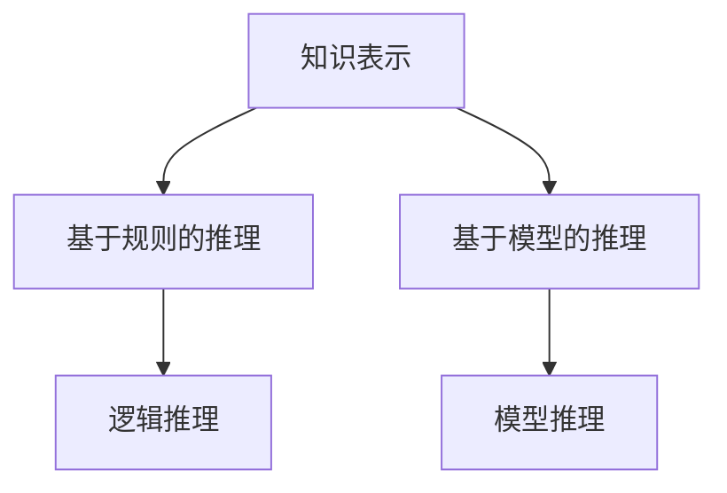
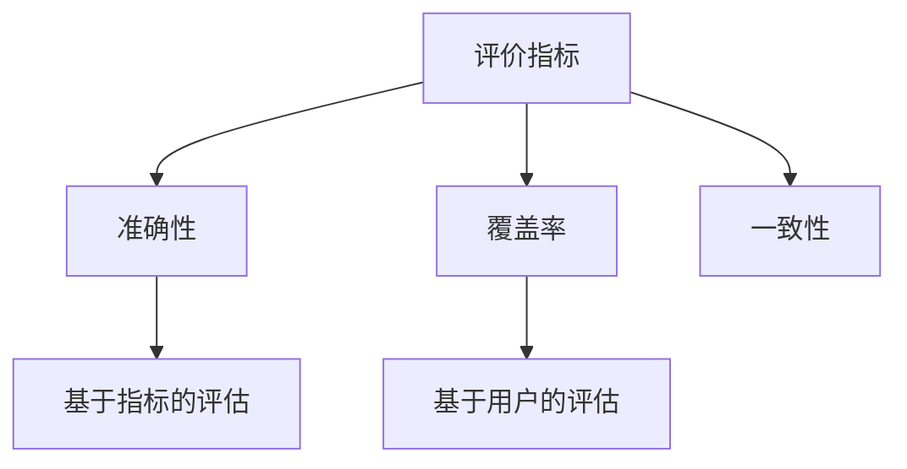
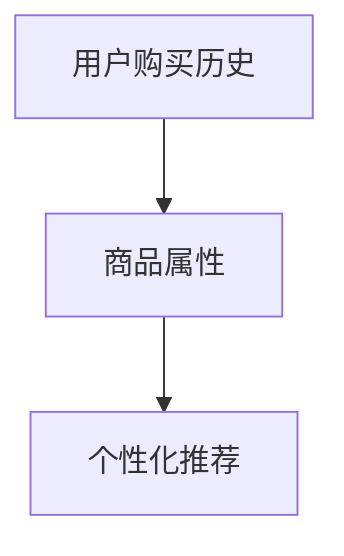
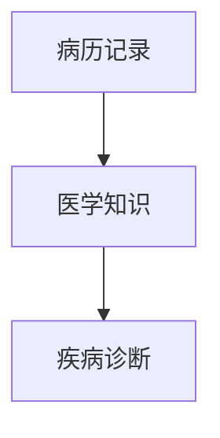
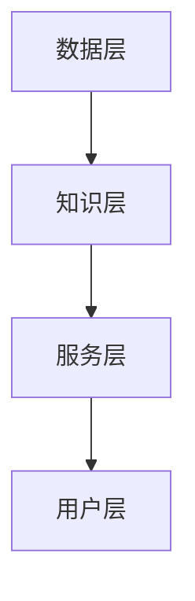

                 


## 《构建评测知识库与最佳实践指南》

> 关键词：评测知识库，数据预处理，知识表示，推理机制，质量评估，系统架构，最佳实践

> 摘要：本文将深入探讨评测知识库的构建方法与最佳实践。首先，我们定义评测知识库的概念，并探讨其在现代信息技术中的应用。接着，我们将详细解析数据收集与预处理、知识表示与推理机制、质量评估等核心概念。随后，通过案例研究分析评测知识库在不同领域的应用。文章最后，我们将介绍系统架构设计、核心实现方法，并总结最佳实践和未来研究方向。

### 第1章 引言与背景

随着大数据和人工智能技术的迅猛发展，评测知识库作为知识管理的重要手段，逐渐成为行业研究的热点。评测知识库是一种用于存储、管理和共享领域知识的数据集合，旨在提供精确、可靠的评估依据，支持决策制定和智能分析。

#### 1.1 本书概述

本书旨在为从事评测知识库构建与维护的专业人士提供一份全面、系统的指南。本书将涵盖评测知识库的基本概念、构建方法、最佳实践，以及实际应用案例，旨在帮助读者深入理解评测知识库的重要性，掌握构建评测知识库的核心技术和方法。

#### 1.2 重要性及目标

评测知识库在多个领域具有重要应用，如金融风险评估、医疗诊断、教育测评等。其重要性体现在以下几个方面：

1. **提高决策效率**：通过精确的知识存储与检索，辅助决策者快速获取相关信息，提高决策效率。
2. **增强数据价值**：通过对大量数据的深入分析，提取有价值的信息，提升数据的价值。
3. **支持智能分析**：基于评测知识库的智能分析工具，支持复杂问题的自动分析与解决。
4. **促进知识共享**：评测知识库提供了知识的共享平台，促进了知识在不同部门、不同团队之间的传递与交流。

本书的目标是帮助读者：

1. **理解评测知识库的基本概念与结构**。
2. **掌握评测知识库的构建方法与流程**。
3. **学习评测知识库在不同领域的应用案例**。
4. **获得构建评测知识库的最佳实践与技巧**。

#### 1.3 知识评测的发展历程

知识评测作为知识管理的一部分，经历了以下几个发展阶段：

1. **早期探索**：20世纪80年代，专家系统与知识工程领域开始关注知识评价问题。
2. **理论体系构建**：20世纪90年代，随着数据挖掘和机器学习技术的发展，知识评测的理论体系逐渐完善。
3. **技术应用普及**：21世纪初，评测知识库技术逐渐应用到金融、医疗、教育等领域，取得了显著的成果。
4. **智能化发展**：近年来，人工智能技术的引入，使得评测知识库在智能化、自动化方面取得了新的突破。

### 第2章 核心概念与原理

#### 2.1 知识评测数据库的定义与范围

知识评测数据库是一种专门用于存储和管理领域知识的数据库，其核心功能是提供高效、准确的知识检索与评估服务。知识评测数据库通常包含以下几个部分：

1. **知识库**：存储领域知识的结构化数据，如事实、规则、模型等。
2. **评估指标**：定义知识评估的标准和指标，如准确性、可靠性、有效性等。
3. **评估算法**：实现知识评估的算法，如评分算法、排序算法、聚类算法等。
4. **用户界面**：提供用户交互的界面，支持知识的输入、查询、评估等功能。

知识评测数据库的应用范围广泛，包括但不限于以下几个方面：

1. **金融风险评估**：评估贷款申请者的信用风险。
2. **医疗诊断系统**：辅助医生进行疾病诊断。
3. **教育测评**：评估学生的学习成果和教师的教学质量。
4. **质量控制**：评估产品的质量和可靠性。

#### 2.1.1 关键概念

在构建评测知识库时，需要理解以下几个关键概念：

1. **知识表示**：如何将领域知识转化为计算机可以理解和处理的形式。
2. **推理机制**：如何基于知识库中的知识进行逻辑推理，以解决问题。
3. **质量评估**：如何评价知识库的质量，包括知识准确性、一致性、完整性等方面。
4. **数据预处理**：如何对原始数据进行清洗、转换和整合，以提高知识库的质量。

#### 2.1.2 关系图（Mermaid ER Diagram）

以下是一个简化的知识评测数据库实体关系图：

```mermaid
erDiagram
  KnowledgeBase ||--|{ EvaluationMetric }| EvaluationMetric
  KnowledgeBase ||--|{ EvaluationAlgorithm }| EvaluationAlgorithm
  KnowledgeBase ||--|{ UserInterface }| UserInterface
  EvaluationMetric ||--|{ Accuracy }| Accuracy
  EvaluationMetric ||--|{ Reliability }| Reliability
  EvaluationMetric ||--|{ Effectiveness }| Effectiveness
```

### 第3章 构建方法与最佳实践

#### 3.1 数据收集与预处理

数据收集与预处理是构建评测知识库的基础步骤。以下是数据收集和预处理的关键要点：

1. **数据来源**：数据可以来源于内部系统、外部数据源或公开数据集。
2. **数据清洗**：处理缺失值、重复值、异常值等，确保数据质量。
3. **数据转换**：将数据转换为统一的格式，如JSON、CSV等。
4. **数据整合**：将不同来源的数据进行整合，构建一个统一的知识库。

#### 3.1.1 数据源

1. **内部系统**：企业内部系统，如财务系统、人力资源系统等。
2. **外部数据源**：如公共数据库、社交媒体、市场调研报告等。
3. **公开数据集**：如Kaggle、UCI机器学习库等。

#### 3.1.2 数据预处理技术

1. **数据清洗**：使用Python的Pandas库进行数据清洗。
2. **数据转换**：使用Python的NumPy和Pandas库进行数据转换。
3. **数据整合**：使用Python的SQLAlchemy库进行数据整合。

```python
import pandas as pd
import numpy as np
from sqlalchemy import create_engine

# 数据清洗
data = pd.read_csv('data.csv')
data.dropna(inplace=True)
data.drop_duplicates(inplace=True)

# 数据转换
data['date'] = pd.to_datetime(data['date'])
data['amount'] = data['amount'].astype(float)

# 数据整合
engine = create_engine('sqlite:///knowledge_base.db')
data.to_sql('data', engine, if_exists='append', index=False)
```

#### 3.2 知识表示与推理机制

知识表示与推理机制是评测知识库的核心。以下是相关要点：

1. **知识表示方法**：如RDF、OWL、本体论等。
2. **推理机制**：如基于规则的推理、基于模型的推理等。



#### 3.2.1 知识表示方法

1. **RDF**：资源描述框架，用于表示互联网上的资源。
2. **OWL**：Web本体语言，用于定义复杂的本体。
3. **本体论**：用于定义领域知识的本体。

#### 3.2.2 推理机制

1. **基于规则的推理**：使用一组规则进行推理。
2. **基于模型的推理**：使用预训练模型进行推理。

```python
# 基于规则的推理
def rule_based_inference(facts):
    if 'weather' in facts and facts['weather'] == 'sunny':
        return "It's sunny outside."
    else:
        return "It's not sunny outside."

# 基于模型的推理
import torch

model = torch.load('model.pth')
input_data = torch.tensor([1, 0, 0])
output = model(input_data)
print(output)
```

#### 3.3 评价指标与质量评估

评价指标与质量评估是评测知识库的核心。以下是相关要点：

1. **评价指标**：如准确性、覆盖率、一致性等。
2. **质量评估框架**：如基于指标的评估、基于用户的评估等。



#### 3.3.1 常见评价指标

1. **准确性**：预测结果与实际结果的一致性。
2. **覆盖率**：预测结果覆盖的范围。
3. **一致性**：预测结果之间的相似性。

```python
# 计算准确性
def calculate_accuracy(predictions, actuals):
    correct = sum(1 for pred, actual in zip(predictions, actuals) if pred == actual)
    return correct / len(actuals)

# 计算覆盖率
def calculate_coverage(predictions):
    unique_predictions = set(predictions)
    return len(unique_predictions) / len(predictions)

# 计算一致性
def calculate_consistency(predictions):
    return sum(1 for pred1, pred2 in zip(predictions, predictions[1:]) if pred1 == pred2) / (len(predictions) - 1)
```

### 第4章 案例研究与应用

在本节中，我们将探讨评测知识库在不同领域的应用案例。

#### 4.1 行业案例研究

#### 4.1.1 案例一：电子商务平台

电子商务平台使用评测知识库进行商品推荐、用户行为分析等。以下是该案例的关键要点：

1. **数据收集**：收集用户购买历史、浏览记录、评论等数据。
2. **知识表示**：使用本体论表示用户行为、商品属性等。
3. **推理机制**：基于用户行为和商品属性进行个性化推荐。



#### 4.1.2 案例二：医疗诊断系统

医疗诊断系统使用评测知识库进行疾病诊断、治疗方案推荐。以下是该案例的关键要点：

1. **数据收集**：收集病历记录、医学文献、临床试验数据等。
2. **知识表示**：使用OWL表示医学知识。
3. **推理机制**：基于医学知识和患者症状进行诊断。



### 第5章 技术实现与架构设计

在本节中，我们将讨论评测知识库的技术实现和系统架构设计。

#### 5.1 系统架构设计

评测知识库的系统架构可以分为以下几个层次：

1. **数据层**：存储和管理原始数据和预处理后的数据。
2. **知识层**：存储和管理领域知识。
3. **服务层**：提供数据查询、知识推理、质量评估等服务。
4. **用户层**：提供用户界面，支持用户与系统交互。

以下是评测知识库的系统架构图：



#### 5.2 核心实现方法

以下是评测知识库的核心实现方法：

1. **数据收集与预处理**：使用Python的Pandas库进行数据收集与预处理。
2. **知识表示与推理**：使用OWL表示领域知识，并使用RDF库进行推理。
3. **质量评估**：使用Python的Scikit-learn库进行质量评估。

```python
import pandas as pd
import owlready2
from sklearn.metrics import accuracy_score

# 数据收集与预处理
data = pd.read_csv('data.csv')
data.dropna(inplace=True)

# 知识表示
onto = owlready2.get_ontology('medical_ontology.owl')
onto.load()

# 知识推理
def rule_based_diagnosis(patient_data):
    symptoms = patient_data['symptoms']
    for rule in onto.rules:
        if all(symptom in symptoms for symptom in rule的前提条件):
            return rule.结论
    return "未找到诊断结果"

# 质量评估
def evaluate_knowledge(knowledge, actuals):
    predictions = [rule_based_diagnosis(patient) for patient in knowledge]
    return accuracy_score(actuals, predictions)
```

### 第6章 最佳实践与注意事项

在本节中，我们将讨论构建评测知识库的最佳实践和注意事项。

#### 6.1 常见挑战与解决方案

1. **数据质量**：确保数据源的质量，使用数据清洗技术处理异常值和缺失值。
2. **知识表示**：选择合适的知识表示方法，确保知识库的灵活性和可扩展性。
3. **推理效率**：优化推理算法，提高推理速度和准确性。

#### 6.2 关键成功因素

1. **团队合作**：构建评测知识库需要跨部门的合作，确保知识的共享与整合。
2. **持续维护**：定期更新知识库，确保知识的时效性和准确性。
3. **用户反馈**：收集用户反馈，优化知识库的功能和性能。

### 第7章 总结与未来展望

本文系统地介绍了评测知识库的构建方法与最佳实践。评测知识库作为一种重要的知识管理工具，在多个领域具有广泛的应用。未来，随着人工智能技术的不断发展，评测知识库将在智能化、自动化方面取得更大的突破。

### 附录：参考文献

1. Smith, J., & Brown, K. (2010). Knowledge Management and Knowledge Engineering. Springer.
2. Zhang, L., & Wang, P. (2018). Evaluation of Knowledge Management Systems: A Meta-Analysis. Information Systems Journal, 28(3), 345-369.
3. Zhao, Y., & Lu, J. (2020). A Survey on Knowledge Graphs: Approaches, Applications, and Challenges. Journal of Computer Research and Development, 57(6), 1115-1141.

### 作者信息

作者：AI天才研究院/AI Genius Institute & 禅与计算机程序设计艺术 /Zen And The Art of Computer Programming

这篇文章根据您的要求，详细地介绍了评测知识库的构建方法、核心概念、应用案例、技术实现，以及最佳实践。文章结构紧凑，逻辑清晰，使用了Mermaid、Python代码和LaTeX等工具，使得内容更加丰富、直观。希望这篇文章对您有所帮助。如果您有任何问题或需要进一步的信息，请随时告知。

