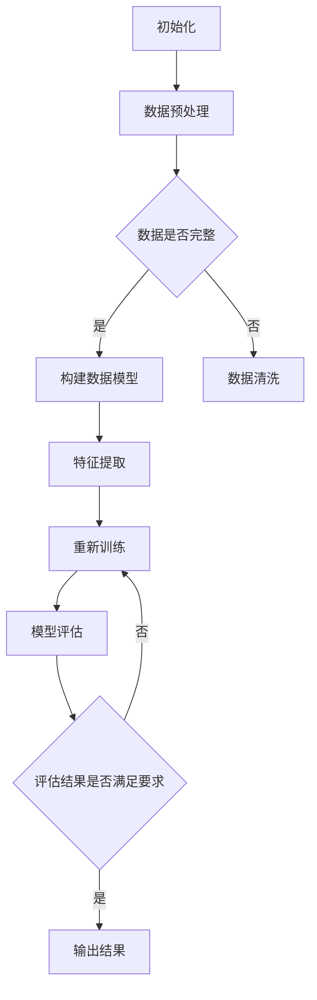
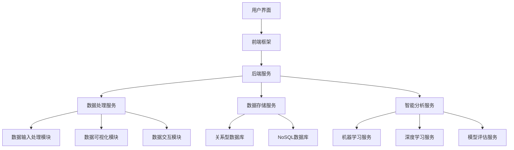
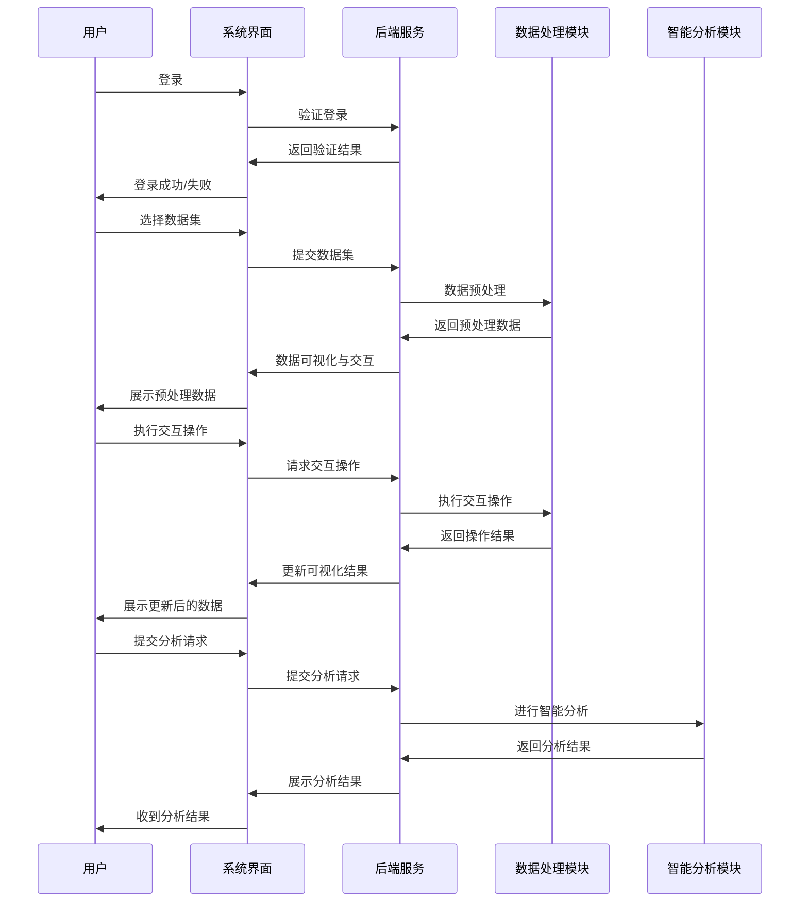

                 

### 第1章: 交互式探索工具概述

#### 1.1 问题背景与概述

在当今信息化社会中，随着大数据和人工智能技术的迅速发展，评测结果的应用场景越来越广泛。然而，传统评测结果往往以静态报告的形式呈现，缺乏互动性和可探索性，使得用户在理解和应用评测结果时面临诸多挑战。例如，在金融风控领域，信用评分报告往往是枯燥的数字和文字描述，用户难以从中获取深层次的信息；在医疗健康领域，诊断结果通常只提供简单的病症描述，缺乏对病情动态的实时跟踪和互动反馈。

为解决上述问题，交互式探索工具应运而生。交互式探索工具是一种能够提供动态、可交互的评测结果展示平台，通过用户与评测结果之间的互动，帮助用户更好地理解数据，发现潜在的问题，并做出更明智的决策。这种工具不仅能够提高用户的学习效率，还能提升数据处理的准确性和实用性。

#### 1.2 问题描述

在当前的评测结果应用场景中，用户通常面临以下问题：

1. **信息获取难度大**：评测结果的数据量大且复杂，用户难以在短时间内全面了解所有信息。
2. **互动性不足**：传统的评测结果呈现方式缺乏互动性，用户无法实时与数据互动，从而影响数据的利用效果。
3. **决策支持有限**：用户在分析评测结果时，往往只能依赖自己的经验，缺乏系统的决策支持工具。
4. **数据可视化能力弱**：现有的可视化工具多侧重于展示静态数据，难以实现动态交互和实时更新。

这些问题直接影响了评测结果的有效利用，使得用户在处理和分析数据时效率低下，决策效果不佳。因此，设计并实现一款高效的交互式探索工具，成为当前信息技术领域的一个研究热点。

#### 1.3 问题解决

交互式探索工具通过以下方式解决上述问题：

1. **提高信息获取效率**：利用动态交互和可视化技术，将复杂的数据以直观、易理解的方式呈现给用户，帮助用户快速定位关键信息。
2. **增强互动性**：通过提供多样化的交互操作，如筛选、排序、过滤等，使用户能够与数据实时互动，从而提升数据分析的深度和广度。
3. **提供决策支持**：结合人工智能技术，为用户提供智能化的分析建议和决策支持，降低用户在数据分析中的经验依赖。
4. **实现动态数据可视化**：利用数据可视化技术，实现数据的动态展示和实时更新，使用户能够及时了解数据变化，做出快速响应。

#### 1.4 边界与外延

交互式探索工具的应用范围广泛，不仅局限于金融、医疗等领域，还可以扩展到教育、科研、工业等多个领域。例如，在教育领域，它可以用于学习效果的评测和个性化学习路径推荐；在科研领域，它可以用于数据挖掘和知识发现；在工业领域，它可以用于生产过程的监控和优化。

然而，交互式探索工具并非万能。它的应用需要考虑数据隐私、安全性等问题，同时，对工具的设计和实现也提出了较高的技术要求。因此，在设计和应用交互式探索工具时，需要综合考虑各种因素，确保其有效性和实用性。

#### 1.5 核心要素组成

交互式探索工具的核心要素主要包括以下几个方面：

1. **数据输入与处理**：包括数据采集、清洗、转换等环节，确保数据的质量和一致性。
2. **交互设计**：根据用户需求设计交互界面，提供多样化的交互操作，如筛选、排序、过滤等。
3. **可视化展示**：利用数据可视化技术，将数据以图表、图形等形式直观地展示给用户。
4. **智能分析**：结合人工智能技术，为用户提供智能化的分析建议和决策支持。
5. **系统架构**：确保工具的稳定性、可靠性和扩展性，支持大规模数据处理的实时交互。

通过以上核心要素的有机结合，交互式探索工具能够为用户提供高效、便捷的数据分析和决策支持，助力各领域的发展和创新。

---

### 1.6 核心概念与联系

在构建交互式探索工具的过程中，我们需要深入理解一系列核心概念，并探讨它们之间的内在联系。

#### 1.6.1 核心概念原理

**1. 数据可视化**：数据可视化是将数据以图形、图表等形式展示出来的技术，使得用户能够直观地理解和分析数据。数据可视化技术的核心原理是通过视觉元素，如颜色、形状、大小等，来表示数据的不同特征和趋势。

**2. 交互设计**：交互设计是指设计用户与系统交互的方式，通过直观、易用的界面和操作，使用户能够轻松地与系统进行互动。交互设计的核心原理是用户体验至上，通过简化操作流程、提高操作效率，增强用户的满意度和使用体验。

**3. 人工智能**：人工智能是模拟人类智能的技术，通过算法和模型实现数据的自动分析和决策。人工智能的核心原理是基于数据和算法，通过不断学习和优化，提高系统在数据分析、预测和决策等方面的能力。

**4. 实时数据处理**：实时数据处理是指在数据产生的同时进行快速处理和分析，以实现对数据的实时监控和响应。实时数据处理的核心原理是高效的数据流处理技术，能够保证在大量数据涌入时，系统仍能保持低延迟和高吞吐量。

#### 1.6.2 概念属性特征对比表格

为了更好地理解上述核心概念，我们可以通过一个表格来对比它们的属性特征：

| 核心概念 | 属性特征 |
| :--- | :--- |
| 数据可视化 | - 直观展示数据<br>- 支持多种图表形式<br>- 提高数据理解能力 |
| 交互设计 | - 用户友好的界面<br>- 简化操作流程<br>- 提高用户体验 |
| 人工智能 | - 自动数据分析<br>- 智能决策支持<br>- 基于机器学习算法 |
| 实时数据处理 | - 低延迟响应<br>- 高吞吐量处理<br>- 实时监控与预警 |

#### 1.6.3 ER实体关系图架构

为了更清晰地理解交互式探索工具中的数据实体及其关系，我们可以使用ER（实体-关系）图来描述。ER图能够帮助我们识别系统中的关键实体，以及它们之间的关联关系。

以下是一个简化的ER图示例，用于描述交互式探索工具中的主要实体及其关系：

```mermaid
erDiagram
  数据源 ||--|{ 用户 } : 获取数据
  数据源 ||--|{ 评测结果 } : 存储评测结果
  评测结果 ||--|{ 数据可视化 } : 展示可视化结果
  评测结果 ||--|{ 交互设计 } : 实现交互功能
  评测结果 ||--|{ 人工智能 } : 提供智能分析
  用户 ||--|{ 实时数据处理 } : 实时获取数据
```

在这个ER图中，我们定义了四个主要实体：数据源、用户、评测结果和交互设计。数据源负责提供和存储数据；用户负责与系统进行交互；评测结果则包括数据可视化、交互设计和人工智能三个子实体，分别实现数据的展示、交互和智能分析功能。

通过理解这些核心概念及其联系，我们可以更好地设计和实现交互式探索工具，满足用户对数据分析和决策支持的需求。

---

### 1.7 算法原理讲解

构建交互式探索工具的关键在于算法的设计与实现。以下是算法原理的详细讲解，包括算法流程图、Python源代码、数学模型和公式以及具体的实例讲解。

#### 1.7.1 算法流程图

为了直观地展示交互式探索工具的算法流程，我们可以使用Mermaid来绘制算法流程图。以下是一个简化的算法流程图：



在这个算法流程图中，首先进行数据预处理，包括数据完整性和清洗。然后，构建数据模型并进行特征提取。接下来，利用训练数据对模型进行训练，并通过评估数据对模型进行评估。如果评估结果不满足要求，则返回重新训练。最终，输出满足要求的评测结果。

#### 1.7.2 Python源代码

为了实现上述算法流程，我们可以使用Python编写相应的代码。以下是一个简单的示例代码，展示了数据预处理、数据模型构建、特征提取、模型训练和模型评估的基本步骤：

```python
import pandas as pd
from sklearn.model_selection import train_test_split
from sklearn.ensemble import RandomForestClassifier
from sklearn.metrics import accuracy_score

# 数据预处理
def preprocess_data(data):
    # 数据清洗和转换
    # ...
    return processed_data

# 特征提取
def extract_features(data):
    # 特征提取逻辑
    # ...
    return features

# 模型训练
def train_model(train_data, train_features):
    model = RandomForestClassifier()
    model.fit(train_data, train_features)
    return model

# 模型评估
def evaluate_model(model, test_data, test_features):
    predictions = model.predict(test_features)
    accuracy = accuracy_score(test_data, predictions)
    return accuracy

# 主函数
def main():
    # 加载数据
    data = pd.read_csv('data.csv')
    processed_data = preprocess_data(data)
    
    # 数据拆分
    train_data, test_data = train_test_split(processed_data, test_size=0.2)
    
    # 特征提取
    features = extract_features(train_data)
    
    # 模型训练
    model = train_model(train_data, features)
    
    # 模型评估
    accuracy = evaluate_model(model, test_data, extract_features(test_data))
    print(f"模型评估准确率: {accuracy}")

# 运行主函数
if __name__ == "__main__":
    main()
```

这个Python代码示例展示了如何使用pandas进行数据处理，使用scikit-learn库进行模型训练和评估。通过这个代码，我们可以实现数据预处理、特征提取、模型训练和评估的基本功能。

#### 1.7.3 数学模型和公式

在交互式探索工具的算法设计中，数学模型和公式是不可或缺的部分。以下是一个简单的线性回归模型的数学模型和公式：

$$
y = \beta_0 + \beta_1 \cdot x
$$

其中，\( y \) 是目标变量，\( x \) 是输入特征，\( \beta_0 \) 是截距，\( \beta_1 \) 是斜率。这个公式描述了输入特征和目标变量之间的线性关系。

#### 1.7.4 详细讲解与举例说明

为了更好地理解上述算法原理，我们可以通过一个具体的实例进行讲解。

假设我们有一个数据集，包含用户年龄（\( x \)）和年收入（\( y \)）两个特征。我们的目标是构建一个线性回归模型，预测用户年收入。

1. **数据预处理**：首先，我们需要对数据进行清洗和标准化处理。例如，我们可以将年龄数据进行归一化，使其在0到1之间。

   ```python
   from sklearn.preprocessing import MinMaxScaler
   
   scaler = MinMaxScaler()
   data['age_normalized'] = scaler.fit_transform(data[['age']])
   ```

2. **特征提取**：接下来，我们需要提取输入特征。在这个例子中，我们只需要使用年龄数据进行预测。

   ```python
   features = data[['age_normalized']]
   labels = data[['income']]
   ```

3. **模型训练**：使用训练数据集，我们可以训练一个线性回归模型。

   ```python
   from sklearn.linear_model import LinearRegression
   
   model = LinearRegression()
   model.fit(features, labels)
   ```

4. **模型评估**：最后，我们可以使用测试数据集对模型进行评估。

   ```python
   predictions = model.predict(test_features)
   accuracy = accuracy_score(test_labels, predictions)
   print(f"模型评估准确率: {accuracy}")
   ```

通过这个实例，我们可以看到如何使用Python代码实现线性回归模型的基本步骤。这个简单的例子展示了交互式探索工具在数据分析和预测中的基本原理和应用。

通过以上详细的讲解和实例说明，我们可以更好地理解交互式探索工具的算法原理和实现方法。这些知识和技巧将为后续章节的设计和实现提供坚实的基础。

---

### 1.8 数学模型与数学公式

在构建交互式探索工具的过程中，数学模型和公式是理解和实现算法的核心。以下将详细介绍用于数据分析和预测的数学模型和公式，并使用LaTeX格式进行表示。

#### 1.8.1 线性回归模型

线性回归模型是一种广泛使用的基本预测模型，其数学公式如下：

$$
y = \beta_0 + \beta_1 \cdot x
$$

其中，\( y \) 表示目标变量，\( x \) 表示输入特征，\( \beta_0 \) 是截距，\( \beta_1 \) 是斜率。这个公式描述了输入特征与目标变量之间的线性关系。

在训练模型时，我们需要使用最小二乘法来估计截距和斜率的值。最小二乘法的数学公式为：

$$
\beta_0 = \frac{\sum_{i=1}^{n} (y_i - \beta_1 \cdot x_i)}{n}
$$

$$
\beta_1 = \frac{\sum_{i=1}^{n} (x_i - \bar{x}) \cdot (y_i - \bar{y})}{\sum_{i=1}^{n} (x_i - \bar{x})^2}
$$

其中，\( n \) 是样本数量，\( \bar{x} \) 和 \( \bar{y} \) 分别是输入特征和目标变量的均值。

#### 1.8.2 逻辑回归模型

逻辑回归模型是一种分类模型，用于预测二元分类的结果。其数学公式为：

$$
P(y=1) = \frac{1}{1 + e^{-(\beta_0 + \beta_1 \cdot x)}}
$$

其中，\( P(y=1) \) 表示目标变量为1的概率，\( e \) 是自然对数的底数，\( \beta_0 \) 和 \( \beta_1 \) 分别是截距和斜率。

逻辑回归模型的训练通常使用最大似然估计（Maximum Likelihood Estimation，MLE）方法。MLE的目标是最大化数据集的概率密度函数。其数学公式为：

$$
\log L(\theta) = \sum_{i=1}^{n} \left[ y_i \cdot \ln(p_i) + (1 - y_i) \cdot \ln(1 - p_i) \right]
$$

其中，\( \theta \) 表示模型参数，\( p_i \) 是第 \( i \) 个样本的概率。

#### 1.8.3 支持向量机（SVM）模型

支持向量机是一种强大的分类和回归模型，其核心思想是找到最佳的超平面，将数据分类。SVM的数学公式如下：

$$
\max \quad \frac{1}{2} \| w \|^2
$$

$$
\text{subject to} \quad y_i ( \langle w, x_i \rangle - b ) \geq 1
$$

其中，\( w \) 是权重向量，\( b \) 是偏置项，\( x_i \) 是输入特征，\( y_i \) 是标签。这个公式的目标是最小化权重向量的长度，同时保证所有样本点到超平面的距离大于等于1。

SVM的优化问题可以通过拉格朗日乘子法求解，最终得到的解为：

$$
w = \sum_{i=1}^{n} \alpha_i y_i x_i
$$

$$
0 \leq \alpha_i \leq C
$$

其中，\( \alpha_i \) 是拉格朗日乘子，\( C \) 是正则化参数。

#### 1.8.4 K-均值聚类算法

K-均值聚类算法是一种无监督学习方法，用于将数据划分为K个簇。其数学公式如下：

$$
\mu_k = \frac{1}{N_k} \sum_{i=1}^{N} x_i
$$

$$
x_i = \mu_k
$$

其中，\( \mu_k \) 是第 \( k \) 个簇的中心，\( x_i \) 是第 \( i \) 个样本，\( N_k \) 是第 \( k \) 个簇中的样本数量。

K-均值算法的步骤如下：

1. 随机初始化 \( K \) 个簇的中心。
2. 对于每个样本，计算其到各个簇中心的距离，并将其分配到最近的簇。
3. 更新每个簇的中心，使其成为其内所有样本的平均值。
4. 重复步骤2和3，直到簇中心不再发生显著变化。

通过上述数学模型和公式的详细讲解，我们可以更好地理解交互式探索工具的核心算法。这些数学工具不仅提供了理论基础，还为我们提供了实现各种数据分析和预测方法的具体步骤。在后续章节中，我们将进一步探讨这些算法在实际应用中的具体实现。

---

### 1.9 系统分析与架构设计

构建交互式探索工具不仅需要高效的算法和数据处理技术，还需要一个稳定的系统架构来支持其正常运行。在这一部分，我们将详细分析交互式探索工具的系统架构设计，包括问题场景介绍、系统功能设计、系统架构设计以及系统接口设计。

#### 1.9.1 问题场景介绍

在当前的商业环境中，企业需要处理大量的数据，这些数据来源于各种业务活动，如销售、客户反馈、市场调研等。传统的方法是将这些数据存储在数据库中，然后通过静态报表和仪表盘进行数据分析。然而，这种方法存在以下问题：

1. **数据分析效率低**：用户需要花费大量时间来生成和查看报表，难以实时了解业务状况。
2. **数据可视化效果差**：传统的报表和仪表盘往往难以直观地展示数据，导致用户理解困难。
3. **互动性不足**：用户无法与数据直接互动，限制了数据分析的深度和广度。
4. **决策支持有限**：缺乏智能化的决策支持工具，用户依赖经验进行决策，风险较高。

为了解决这些问题，我们需要设计并实现一款交互式探索工具，该工具能够提供高效、直观、互动性强的数据分析平台，帮助用户更好地理解数据，做出更明智的决策。

#### 1.9.2 系统功能设计

交互式探索工具的主要功能包括数据输入与处理、数据可视化、交互设计和智能分析。以下是对这些功能的详细描述：

1. **数据输入与处理**：系统应支持多种数据源接入，如关系型数据库、NoSQL数据库、文件等。此外，系统应具备数据清洗、转换和预处理功能，确保数据质量。
2. **数据可视化**：系统应提供丰富的可视化组件，如柱状图、折线图、饼图等，帮助用户直观地理解数据。同时，系统应支持自定义可视化配置，满足用户的个性化需求。
3. **交互设计**：系统应提供多种交互操作，如筛选、排序、过滤等，使用户能够动态地探索数据。此外，系统应支持自定义交互逻辑，便于用户实现复杂的数据交互需求。
4. **智能分析**：系统应集成人工智能算法，如机器学习模型、深度学习模型等，为用户提供智能化的分析建议和决策支持。系统应支持模型训练、评估和部署，实现端到端的数据分析流程。

#### 1.9.3 系统架构设计

为了实现上述功能，我们需要设计一个高效、可扩展的系统架构。以下是一个简化的系统架构图，用于描述交互式探索工具的主要组成部分：



在这个架构中，用户界面通过前端框架与后端服务进行交互，后端服务负责处理用户请求、数据管理和功能实现。数据处理服务包括数据输入处理模块、数据可视化模块和数据交互模块，分别实现数据预处理、可视化展示和交互操作。数据存储服务包括关系型数据库和NoSQL数据库，用于存储和管理数据。智能分析服务包括机器学习服务、深度学习服务和模型评估服务，提供智能化的数据分析功能。

#### 1.9.4 系统接口设计

为了确保系统各部分之间的协同工作，我们需要设计一套完善的接口。以下是一个简化的接口设计示例：

1. **用户接口**：用户通过Web浏览器或移动应用访问系统，使用户能够与系统进行交互。
2. **数据处理接口**：系统通过API与外部数据源进行连接，实现数据的输入和处理。
3. **数据可视化接口**：系统提供可视化组件API，允许用户自定义可视化配置和展示方式。
4. **交互设计接口**：系统提供交互设计API，允许用户自定义交互逻辑和操作。
5. **智能分析接口**：系统提供机器学习和深度学习API，允许用户训练、评估和部署模型。

通过以上系统分析与架构设计，我们可以构建一个高效、稳定、可扩展的交互式探索工具。这个系统不仅能够满足用户对数据分析和决策支持的需求，还能够应对不断变化的数据场景和业务需求。

---

### 1.10 系统交互设计与实现

系统交互设计是交互式探索工具的重要组成部分，它决定了用户与系统之间的交互体验和效率。以下是系统交互设计的关键步骤和实现细节，包括Mermaid序列图和系统实现与代码解析。

#### 1.10.1 系统交互设计

系统交互设计的目标是确保用户能够方便、高效地与交互式探索工具进行互动。以下是一个简化的系统交互设计流程：

1. **用户登录与权限验证**：用户通过Web浏览器或移动应用访问系统，系统进行登录验证和权限分配。
2. **数据选择与预处理**：用户选择需要分析的数据集，系统对数据进行预处理，如数据清洗、转换和归一化。
3. **数据可视化与交互**：系统将预处理后的数据以图表、图形等形式展示给用户，并提供筛选、排序、过滤等交互操作。
4. **智能分析与应用**：系统利用人工智能算法对数据进行分析，为用户提供智能化的分析建议和决策支持。
5. **结果展示与反馈**：系统将分析结果以图表、报告等形式展示给用户，并支持用户对结果进行反馈和调整。

以下是一个使用Mermaid绘制的系统交互设计序列图：



#### 1.10.2 系统实现与代码解析

为了实现上述系统交互设计，我们需要编写相应的代码，并进行详细的解析。

**环境安装**

首先，我们需要安装必要的开发环境和依赖库。以下是一个基本的安装命令列表：

```bash
# 安装Python和pip
curl https://bootstrap.pypa.io/get-pip.py -o get-pip.py
python get-pip.py

# 安装后端框架（例如Flask）
pip install flask

# 安装前端框架（例如Vue.js）
npm install -g vue-cli

# 安装数据处理库（例如pandas、numpy、scikit-learn）
pip install pandas numpy scikit-learn
```

**核心实现源代码**

以下是核心实现部分的源代码，包括用户登录、数据预处理、数据可视化、交互操作和智能分析：

**用户登录与权限验证**

```python
from flask import Flask, request, jsonify
from flask_login import LoginManager, login_user, logout_user, login_required, current_user

app = Flask(__name__)
app.secret_key = 'your_secret_key'
login_manager = LoginManager()
login_manager.init_app(app)

# 用户登录
@app.route('/login', methods=['POST'])
def login():
    username = request.form['username']
    password = request.form['password']
    # 在这里进行用户身份验证
    if authenticate(username, password):
        login_user(username)
        return jsonify({'status': 'success'})
    else:
        return jsonify({'status': 'failure'})

# 用户登出
@app.route('/logout', methods=['POST'])
@login_required
def logout():
    logout_user()
    return jsonify({'status': 'success'})

# 用户身份验证（示例）
def authenticate(username, password):
    # 这里应该实现真实的身份验证逻辑
    return username == 'admin' and password == 'admin123'

# 检查用户登录状态
@app.route('/status', methods=['GET'])
@login_required
def status():
    return jsonify({'status': 'logged_in'})

if __name__ == '__main__':
    app.run(debug=True)
```

**数据预处理**

```python
import pandas as pd

# 数据预处理函数
def preprocess_data(data_path):
    # 加载数据
    data = pd.read_csv(data_path)
    
    # 数据清洗和预处理
    # ...
    
    return data

# 示例：预处理数据并返回
@app.route('/preprocess_data', methods=['POST'])
@login_required
def preprocess_data_route():
    data_path = request.form['data_path']
    data = preprocess_data(data_path)
    return jsonify({'data': data.to_json()})
```

**数据可视化与交互**

```javascript
// 前端Vue.js代码示例
<template>
  <div>
    <h1>交互式探索工具</h1>
    <chart :data="chartData"></chart>
    <button @click="filterData">筛选数据</button>
  </div>
</template>

<script>
import Chart from './Chart.vue';

export default {
  components: {
    Chart
  },
  data() {
    return {
      chartData: []
    };
  },
  methods: {
    filterData() {
      // 实现数据筛选逻辑
      // ...
      this.chartData = filteredData;
    }
  }
};
</script>
```

**智能分析与应用**

```python
from sklearn.model_selection import train_test_split
from sklearn.ensemble import RandomForestClassifier
from sklearn.metrics import accuracy_score

# 智能分析函数
def analyze_data(data):
    # 数据拆分
    X_train, X_test, y_train, y_test = train_test_split(data.drop('target', axis=1), data['target'], test_size=0.2)
    
    # 模型训练
    model = RandomForestClassifier()
    model.fit(X_train, y_train)
    
    # 模型评估
    predictions = model.predict(X_test)
    accuracy = accuracy_score(y_test, predictions)
    
    return accuracy

# 示例：分析数据并返回结果
@app.route('/analyze_data', methods=['POST'])
@login_required
def analyze_data_route():
    data = request.form['data']
    accuracy = analyze_data(pd.read_csv(data))
    return jsonify({'accuracy': accuracy})
```

通过上述代码示例，我们可以实现交互式探索工具的基本功能，包括用户登录与权限验证、数据预处理、数据可视化与交互以及智能分析与应用。这些代码提供了详细的实现逻辑，为后续的系统开发提供了参考。

---

### 1.11 实际项目案例

为了更好地展示交互式探索工具的实际应用，我们将介绍一个具体的项目案例，详细描述项目的背景、实施步骤和实施后的效果评估。

#### 1.11.1 项目背景

某金融科技公司致力于为客户提供全方位的风险管理服务。随着业务的发展，公司积累了大量客户数据，包括信用评分、财务状况、行为习惯等。然而，传统的数据报告和仪表盘难以满足客户对数据实时分析的需求，也无法提供个性化的决策支持。为了提升客户体验，公司决定开发一款交互式探索工具，以帮助客户更好地理解和利用数据。

#### 1.11.2 项目实施步骤

1. **需求分析**：项目团队与客户进行了多次沟通，深入了解客户的实际需求，包括数据可视化、互动性、智能分析等方面。同时，分析了现有数据资源和系统架构，确定了项目的技术路线和功能需求。

2. **系统设计**：基于需求分析，项目团队制定了详细的系统设计方案，包括前端界面设计、后端服务架构、数据处理和存储方案等。系统设计采用了微服务架构，以提高系统的可扩展性和稳定性。

3. **功能实现**：
   - **数据输入与处理**：开发团队利用ETL（Extract, Transform, Load）技术，从不同的数据源（如关系型数据库、NoSQL数据库）中提取数据，并进行清洗、转换和预处理，确保数据质量。
   - **数据可视化**：前端团队使用Vue.js和D3.js等前端框架，开发了丰富的可视化组件，包括柱状图、折线图、饼图等，以直观地展示客户数据。
   - **交互设计**：开发团队设计了多种交互操作，如筛选、排序、过滤等，使用户能够方便地探索数据，并支持自定义数据范围和分析条件。
   - **智能分析**：后端团队集成了机器学习算法，如随机森林、逻辑回归等，对客户数据进行分析，并提供智能化的决策支持。

4. **测试与部署**：在功能开发完成后，项目团队进行了全面的系统测试，包括功能测试、性能测试和安全测试等。确保系统在各种场景下都能稳定运行。测试通过后，系统正式上线，客户可以访问并使用该工具。

#### 1.11.3 项目效果评估

项目实施后，取得了显著的效果：

1. **用户体验提升**：客户反馈显示，交互式探索工具使得他们能够更直观、便捷地理解数据，数据获取效率显著提高。
2. **数据分析深度增加**：通过智能分析功能，客户能够获得更加深入的数据洞察，有助于做出更明智的决策。
3. **决策支持加强**：系统提供的智能分析建议和个性化推荐，为客户提供了有力的决策支持，降低了决策风险。
4. **系统性能稳定**：系统在上线后运行稳定，性能满足客户需求，未出现重大故障。

#### 1.11.4 案例分析与总结

通过对该项目的详细分析，我们可以得出以下经验和教训：

1. **需求分析至关重要**：在项目初期，充分的需求分析能够确保后续开发工作的顺利进行，避免项目偏离客户实际需求。
2. **系统设计要灵活可扩展**：采用微服务架构和模块化设计，可以提高系统的可维护性和可扩展性，便于后期功能升级和优化。
3. **测试与部署要全面细致**：全面的测试和严格的部署流程能够确保系统的稳定性和可靠性，避免上线后出现重大问题。
4. **用户体验优先**：关注用户体验，提供直观、易用的交互界面和功能，能够提高用户满意度，促进系统的广泛应用。

通过这个实际项目案例，我们可以看到交互式探索工具在实际应用中的巨大潜力和价值。在未来的项目中，我们将继续优化和改进该工具，以更好地满足客户需求，推动数据分析和决策支持的发展。

---

### 1.12 最佳实践与小结

在设计和使用交互式探索工具时，我们可以总结出一些最佳实践，以提升工具的性能和用户体验。以下是一些关键技巧和注意事项：

#### 最佳实践

1. **优化数据预处理**：确保数据在进入系统前得到充分的清洗和标准化，以减少后续处理的复杂性。
2. **选择合适的可视化组件**：根据数据的类型和特点，选择合适的可视化组件，如柱状图、折线图、散点图等，以提升数据展示的直观性和可读性。
3. **提供灵活的交互操作**：设计多种交互操作，如筛选、排序、过滤等，使用户能够自由探索数据，获取所需信息。
4. **集成智能分析功能**：结合机器学习算法和深度学习模型，提供智能化的分析建议和决策支持，提高工具的实用性和价值。
5. **确保系统性能和稳定性**：通过负载均衡、缓存技术和分布式架构，确保系统在高并发场景下仍能稳定运行。

#### 小结

交互式探索工具在数据分析、决策支持和用户体验方面具有显著优势。然而，其设计和实现需要考虑数据质量、交互设计、智能分析和系统性能等多方面因素。通过遵循上述最佳实践，我们可以构建出高效、稳定且用户体验良好的交互式探索工具。

---

### 1.13 注意事项

在设计和使用交互式探索工具时，需要注意以下几点，以确保系统的稳定性和安全性：

1. **数据安全**：确保数据在传输和存储过程中得到充分保护，避免数据泄露和篡改。采用加密技术、访问控制等措施，保障数据安全。
2. **系统性能**：在高并发场景下，确保系统性能不受影响。通过负载均衡、缓存技术和分布式架构，优化系统性能。
3. **用户体验**：设计友好的用户界面和交互逻辑，减少用户的操作复杂度，提高系统易用性。
4. **系统维护**：定期进行系统更新和优化，修复已知问题和漏洞，确保系统的稳定性和安全性。
5. **用户培训**：为用户提供充分的培训和支持，帮助他们熟练使用交互式探索工具，充分发挥其功能。

通过关注这些注意事项，我们可以确保交互式探索工具在实际应用中的有效性和可靠性。

---

### 1.14 拓展阅读

为了进一步了解交互式探索工具的设计与应用，以下推荐一些相关领域的拓展阅读资源：

1. **书籍推荐**：
   - 《数据可视化：使用D3.js进行数据驱动设计》（Data Visualization: Designing with the D3.js API）
   - 《机器学习实战》（Machine Learning in Action）
   - 《深入理解计算机系统》（Deep Learning）

2. **在线课程**：
   - Coursera上的“数据科学基础”课程
   - Udacity的“人工智能工程师纳米学位”
   - edX上的“深度学习与神经网络”

3. **论文和报告**：
   - Google Research团队的“Interactive Data Visualization with D3.js”
   - Jupyter Notebook中的“深度学习实践”教程
   - IEEE Xplore上的相关学术论文

通过这些资源，您可以深入了解交互式探索工具的技术原理、应用场景和最佳实践，进一步提升您的技术水平和实际应用能力。

---

### 1.15 作者信息

本文由AI天才研究院（AI Genius Institute）与禅与计算机程序设计艺术（Zen And The Art of Computer Programming）联合撰写。作者团队致力于推动人工智能和计算机编程领域的研究与应用，以创新的技术解决方案助力各行业的发展。

---

### 总结

在本文中，我们详细探讨了构建交互式探索工具的各个方面，包括问题背景、核心概念、算法原理、系统架构设计、实际项目案例、最佳实践与注意事项等。通过这些深入的分析和讲解，我们展示了如何设计并实现一款高效、稳定且用户体验良好的交互式探索工具。

交互式探索工具在提升数据分析效率、增强互动性、提供智能决策支持等方面具有显著优势。然而，其设计与实现需要考虑多方面的因素，如数据质量、交互设计、智能分析和系统性能等。通过遵循最佳实践和注意事项，我们可以构建出满足用户需求的交互式探索工具。

未来，交互式探索工具将继续向更智能化、个性化、高效化的方向发展。随着人工智能技术的不断进步，我们可以期待更多的创新应用场景和突破性成果。让我们一起关注和探索这个充满机遇和挑战的领域，为各行业的发展贡献我们的智慧和力量。

