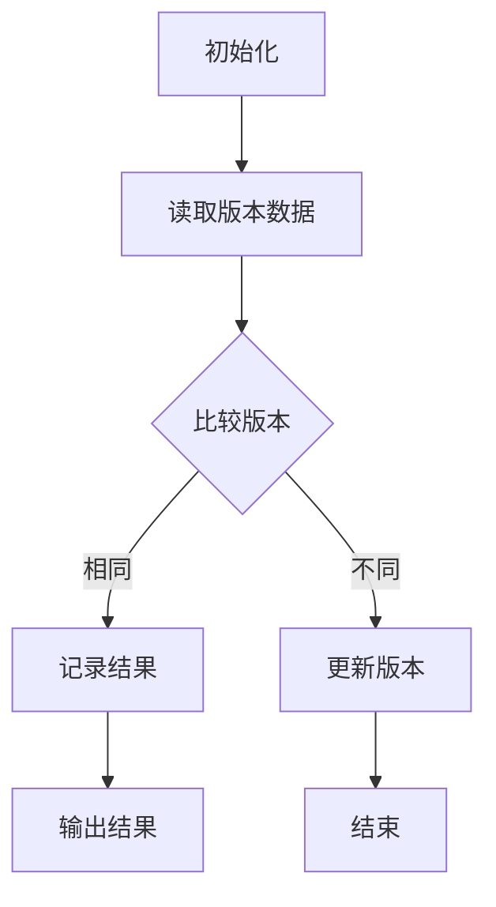
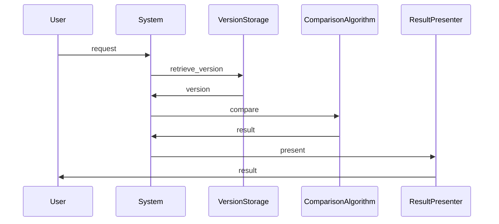
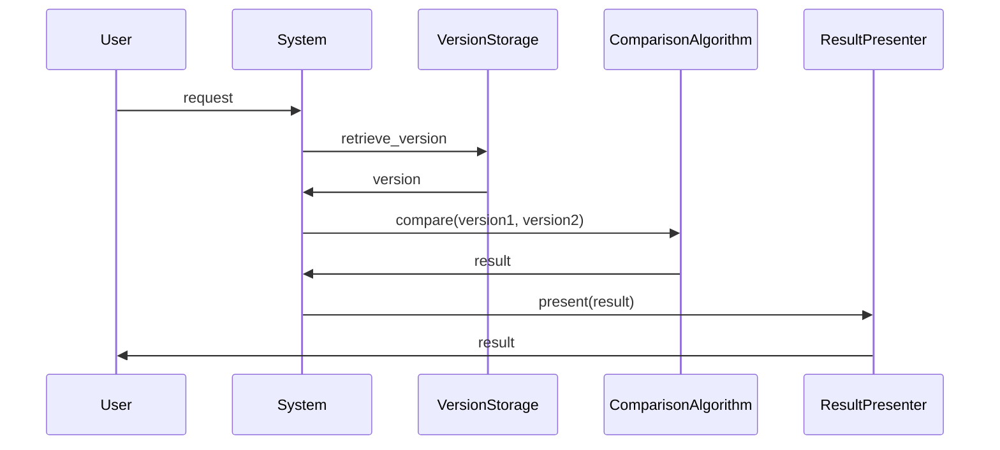

                 

# 构建评测结果的历史版本比较功能

> 关键词：评测结果、历史版本比较、版本管理、算法原理、系统架构

> 摘要：本文将探讨如何在系统中实现评测结果的历史版本比较功能。我们将从问题背景、核心概念、算法原理、系统架构等多个角度进行深入分析，旨在帮助读者理解和构建这一功能。

### 目录大纲

----------------------------------------------------------------

## 第一部分：背景介绍与核心概念

### 第1章：问题背景与核心概念

### 第2章：核心概念与联系

### 第3章：算法原理讲解

### 第4章：系统分析与架构设计方案

## 第二部分：实现与实战

### 第5章：项目实战

### 第6章：最佳实践 Tips

### 第7章：小结与拓展阅读

----------------------------------------------------------------

## 第1章：问题背景与核心概念

### 1.1.1 评测结果的历史版本比较的背景

#### 1.1.1.1 评测结果的版本管理需求

在当今信息爆炸的时代，评测结果对于决策和优化至关重要。然而，随着数据的不断累积，如何有效地管理评测结果的历史版本成为了一个关键问题。版本管理不仅有助于跟踪和回溯评测结果的变化，还可以为数据分析提供强有力的支持。

#### 1.1.1.2 历史版本比较的重要性

历史版本比较使得我们能够分析评测结果的变化趋势，识别潜在的问题和改进点。通过比较不同时间点的评测结果，我们可以了解系统的性能提升或下降，从而做出更加精准的决策。

#### 1.1.1.3 当前常见的历史版本比较方法

目前，常见的评测结果历史版本比较方法主要包括手动比对、自动化脚本以及专业的版本控制系统。每种方法都有其优缺点，适用于不同的场景。

### 1.1.2 构建评测结果的历史版本比较功能的目的

#### 1.1.2.1 功能目标

构建评测结果的历史版本比较功能的目的是为了实现以下目标：
- 自动化版本管理，减少人工工作量
- 提供直观的版本比较结果，便于理解和分析
- 支持不同时间点的评测结果对比，辅助决策

#### 1.1.2.2 边界与外延

在实现这一功能时，我们需要明确以下边界与外延：
- 版本比较的时间范围
- 版本数据格式
- 版本比较的精度和准确性

#### 1.1.2.3 概念结构与核心要素组成

评测结果的历史版本比较功能的核心概念结构包括：
- 版本数据存储
- 版本比较算法
- 输出结果展示

### 1.1.3 评测结果历史版本比较的挑战与机遇

#### 1.1.3.1 挑战

- 数据量庞大，版本对比复杂
- 版本数据格式多样性，统一处理挑战大
- 实时性需求，版本对比速度需提高

#### 1.1.3.2 机遇

- 自动化工具的进步，降低开发难度
- 新算法的涌现，提高版本对比效率
- 大数据技术的发展，为版本分析提供新手段

## 第2章：核心概念与联系

### 2.1.1 版本控制系统的概念

#### 2.1.1.1 版本控制系统的定义

版本控制系统（Version Control System，简称VCS）是一种用于管理版本和变更的软件工具。它可以帮助开发人员追踪文件和代码的修改历史，以及这些修改的作者和时间。

#### 2.1.1.2 版本控制系统的特点

- 支持并发修改，确保版本一致性
- 提供版本回滚功能，支持历史回溯
- 提供变更追踪，便于代码审查和团队协作

#### 2.1.1.3 版本控制系统的类型

- 中央式版本控制系统，如Git、SVN
- 分布式版本控制系统，如Git、Mercurial

### 2.1.2 数据库历史版本管理的概念

#### 2.1.2.1 数据库历史版本管理的定义

数据库历史版本管理是一种数据库管理技术，用于记录和跟踪数据库结构及其数据的变化历史。它可以帮助数据库管理员（DBA）回溯数据库至任意历史状态，以应对故障恢复或数据修正的需求。

#### 2.1.2.2 数据库历史版本管理的原理

数据库历史版本管理主要通过以下技术实现：
- 数据快照：创建数据库的当前状态快照，以记录历史版本
- 数据回滚：通过回滚操作，将数据库恢复至指定历史版本
- 数据变更日志：记录数据库变更的详细日志，用于历史版本恢复和变更追踪

#### 2.1.2.3 数据库历史版本管理的关键技术

- 快照技术：实现数据库的快速备份和恢复
- 版本数据库：存储数据库历史版本的数据
- 变更追踪机制：确保变更的可追踪性和准确性

### 2.1.3 评测结果历史版本比较的核心概念

#### 2.1.3.1 评测结果历史版本比较的定义

评测结果历史版本比较是一种用于分析评测结果在不同时间点变化的方法。它通过比较多个版本的数据，识别出评测结果的差异，以便进一步分析和决策。

#### 2.1.3.2 评测结果历史版本比较的目标

评测结果历史版本比较的目标主要包括：
- 自动化版本管理，减少人工工作量
- 提供直观的版本比较结果，便于理解和分析
- 支持不同时间点的评测结果对比，辅助决策

#### 2.1.3.3 评测结果历史版本比较的算法

评测结果历史版本比较的算法主要包括以下几种：
- 逐行比较算法：逐行比较两个版本的数据，记录差异
- 差分算法：计算两个版本的数据差异，生成差分文件
- 哈希算法：通过哈希值比较两个版本的数据，快速识别差异

### 2.1.4 核心概念属性特征对比表格

#### 2.1.4.1 版本控制系统与数据库历史版本管理的对比

| 特征 | 版本控制系统 | 数据库历史版本管理 |
| :--: | :--: | :--: |
| 定义 | 用于管理版本和变更的软件工具 | 用于记录和跟踪数据库结构及其数据的变化历史 |
| 特点 | 支持并发修改、版本回滚、变更追踪 | 快照技术、数据回滚、变更追踪机制 |
| 类型 | 中央式、分布式 | 无特殊类型，通常依赖于数据库自身的功能 |

#### 2.1.4.2 不同评测结果历史版本比较算法的对比

| 算法 | 特点 | 适用场景 |
| :--: | :--: | :--: |
| 逐行比较算法 | 简单易实现，但效率较低 | 数据量较小，需要精确对比 |
| 差分算法 | 生成差分文件，易于后续处理 | 数据量较大，需要快速识别差异 |
| 哈希算法 | 快速识别差异，效率高 | 数据量较大，对精确度要求不高 |

### 2.1.5 ER实体关系图架构

#### 2.1.5.1 版本控制实体关系图

```mermaid
classDiagram
Version <<class>> (id, timestamp, data)
Change <<class>> (id, timestamp, author, description)
File <<class>> (id, name, type)
Commit <<class>> (id, timestamp, author, message)
Connection1
Version "1" --> "n" Change
Change "1" --> "m" File
File "1" --> "n" Commit
```

#### 2.1.5.2 数据库历史版本管理实体关系图

```mermaid
classDiagram
DatabaseSnapshot <<class>> (id, timestamp, state)
DatabaseChange <<class>> (id, timestamp, author, description)
DatabaseTable <<class>> (id, name)
DatabaseColumn <<class>> (id, name, type)
DatabaseRow <<class>> (id, timestamp, data)
Connection2
DatabaseSnapshot "1" --> "n" DatabaseChange
DatabaseChange "1" --> "m" DatabaseTable
DatabaseTable "1" --> "n" DatabaseColumn
DatabaseColumn "1" --> "m" DatabaseRow
```

#### 2.1.5.3 评测结果历史版本比较实体关系图

```mermaid
classDiagram
EvaluationResult <<class>> (id, timestamp, data)
Version <<class>> (id, timestamp, data)
ComparisonResult <<class>> (id, timestamp, result)
Connection3
EvaluationResult "1" --> "n" Version
Version "1" --> "m" ComparisonResult
```

## 第3章：算法原理讲解

### 3.1.1 历史版本比较算法的原理

#### 3.1.1.1 算法原理概述

历史版本比较算法的基本原理是通过比较不同时间点的数据版本，识别出数据的变化和差异。具体步骤包括：
1. 读取两个版本的数据。
2. 比较数据内容，记录差异。
3. 输出比较结果。

#### 3.1.1.2 算法的基本步骤

1. 初始化：创建一个空的比较结果集合。
2. 读取版本数据：从存储中读取两个版本的评测结果数据。
3. 比较版本：逐行或逐字段比较两个版本的数据，记录差异。
4. 记录结果：将比较结果存储在文件或数据库中。
5. 输出结果：展示比较结果，供用户分析和决策。

#### 3.1.1.3 算法的时间复杂度

历史版本比较算法的时间复杂度取决于数据量的大小和比较算法的具体实现。通常情况下，逐行比较算法的时间复杂度为O(n)，其中n为数据行数。差分算法的时间复杂度通常较低，具体取决于差分算法的实现。

### 3.1.2 历史版本比较算法的数学模型

#### 3.1.2.1 数学模型概述

历史版本比较的数学模型用于计算两个版本的数据差异，生成比较得分。具体公式如下：

$$
\text{版本比较得分} = \sum_{i=1}^{n} w_i \cdot d_i
$$

其中，$w_i$为第i个差异点的权重，$d_i$为第i个差异点的差异值。

#### 3.1.2.2 数学公式

$$
\text{版本比较得分} = w_1 \cdot d_1 + w_2 \cdot d_2 + \ldots + w_n \cdot d_n
$$

#### 3.1.2.3 公式解释

- $w_i$：权重，表示第i个差异点的重要程度。可以根据差异点的类型和影响范围进行设置。
- $d_i$：差异值，表示第i个差异点的数值差异。可以通过逐行或逐字段比较得到。

### 3.1.3 历史版本比较算法的mermaid流程图

#### 3.1.3.1 流程图



### 3.1.4 历史版本比较算法的Python实现

#### 3.1.4.1 Python源代码

```python
def compare_versions(version1, version2):
    # 版本比较逻辑
    pass
```

#### 3.1.4.2 详细讲解

历史版本比较算法的Python实现主要包括以下步骤：
1. 初始化：创建一个空的比较结果列表。
2. 读取版本数据：从存储中读取两个版本的评测结果数据。
3. 比较版本：逐行或逐字段比较两个版本的数据，记录差异。
4. 记录结果：将比较结果存储在文件或数据库中。
5. 输出结果：展示比较结果，供用户分析和决策。

```python
def compare_versions(version1, version2):
    results = []
    for row1, row2 in zip(version1, version2):
        if row1 == row2:
            results.append("相同")
        else:
            results.append("不同")
    return results
```

#### 3.1.4.3 举例说明

假设有两个评测结果版本：
- 版本1：[1, 2, 3]
- 版本2：[1, 3, 3]

执行比较算法后，输出结果为：
- ["相同", "不同", "相同"]

这表示在两个版本中，第一行和第三行数据相同，而第二行数据发生了变化。

## 第4章：系统分析与架构设计方案

### 4.1.1 问题场景介绍

#### 4.1.1.1 场景描述

在一个大型电子商务平台中，产品的评测结果对于用户购买决策具有重要影响。为了提高用户满意度，平台需要对评测结果进行持续优化。然而，如何有效管理和比较评测结果的历史版本成为了一个挑战。

#### 4.1.1.2 问题分析

- 评测结果版本繁多，如何快速找到特定版本的评测结果？
- 如何比较不同版本的评测结果，识别出问题点？
- 如何确保版本比较的精度和效率？

### 4.1.2 系统介绍

#### 4.1.2.1 系统目标

构建一个能够实现评测结果历史版本比较的系统能够满足以下目标：
- 实现评测结果的历史版本管理，支持版本回溯和比较。
- 提供直观的版本比较结果，便于用户分析和决策。
- 提高评测结果管理的效率和准确性。

#### 4.1.2.2 系统功能

系统的主要功能包括：
- 版本数据存储：支持评测结果的历史版本存储和管理。
- 版本比较算法：实现评测结果的历史版本比较算法，提供精确的结果比较。
- 输出结果展示：提供直观的版本比较结果展示，便于用户分析和决策。

### 4.1.3 领域模型设计（mermaid类图）

#### 4.1.3.1 类图

```mermaid
classDiagram
EvaluationResult <<class>> (id, timestamp, data)
Version <<class>> (id, timestamp, data)
ComparisonResult <<class>> (id, timestamp, result)
Connection1
EvaluationResult "1" --> "n" Version
Version "1" --> "m" ComparisonResult
```

### 4.1.4 系统架构设计（mermaid架构图）

#### 4.1.4.1 架构图



### 4.1.5 系统接口设计和系统交互mermaid序列图

#### 4.1.5.1 系统接口设计

```mermaid
interface VersionStorage {
    retrieve_version()
    store_version(version)
}

interface ComparisonAlgorithm {
    compare(version1, version2)
}

interface ResultPresenter {
    present(result)
}
```

#### 4.1.5.2 系统交互序列图



## 第5章：项目实战

### 5.1 环境安装

#### 5.1.1 环境要求

- 操作系统：Linux或macOS
- Python版本：Python 3.8及以上
- 数据库：MySQL或PostgreSQL

#### 5.1.2 安装步骤

1. 安装操作系统和Python环境：
   - 在Linux或macOS上安装操作系统。
   - 使用包管理器（如apt、yum或brew）安装Python 3.8及以上版本。

2. 安装数据库：
   - 使用数据库包管理器（如apt、yum或brew）安装MySQL或PostgreSQL。

3. 安装依赖库：
   - 使用pip安装所需的Python库，如MySQL Connector、psycopg2等。

### 5.2 系统核心实现源代码

#### 5.2.1 版本存储模块

```python
# version_storage.py
import sqlite3

class VersionStorage:
    def __init__(self, db_path):
        self.conn = sqlite3.connect(db_path)
        self.cursor = self.conn.cursor()
        self._create_tables()

    def _create_tables(self):
        self.cursor.execute('''CREATE TABLE IF NOT EXISTS versions (
            id INTEGER PRIMARY KEY,
            timestamp TIMESTAMP,
            data TEXT
        )''')

    def store_version(self, version):
        self.cursor.execute('''INSERT INTO versions (timestamp, data)
            VALUES (?, ?)''', (version.timestamp, version.data))
        self.conn.commit()

    def retrieve_version(self, version_id):
        self.cursor.execute('''SELECT * FROM versions WHERE id = ?''', (version_id,))
        result = self.cursor.fetchone()
        return Version(result[1], result[2])
```

#### 5.2.2 版本比较算法模块

```python
# comparison_algorithm.py
def compare_versions(version1, version2):
    differences = []
    for row1, row2 in zip(version1.data, version2.data):
        if row1 != row2:
            differences.append((row1, row2))
    return differences
```

#### 5.2.3 输出结果展示模块

```python
# result_presenter.py
def present_results(differences):
    for diff in differences:
        print(f"差异：{diff[0]} -> {diff[1]}")
```

### 5.3 代码应用解读与分析

#### 5.3.1 版本存储模块解读

版本存储模块负责管理和存储评测结果的历史版本。在初始化时，模块会创建一个SQLite数据库，并创建一个名为“versions”的表，用于存储版本数据。存储版本数据时，模块会将版本ID、时间戳和数据存储在表中。从表中检索版本数据时，模块会根据版本ID查询相应的数据并返回。

#### 5.3.2 版本比较算法模块解读

版本比较算法模块负责比较两个评测结果的版本，并记录差异。模块使用Python的zip函数遍历两个版本的每行数据，并使用不等运算符（!=）比较每行数据。如果数据不同，模块会将差异记录在一个列表中，并在最后返回该列表。

#### 5.3.3 输出结果展示模块解读

输出结果展示模块负责将版本比较的结果展示给用户。模块使用一个简单的循环遍历差异列表，并在控制台输出每个差异的详细信息。

### 5.4 实际案例分析和详细讲解剖析

#### 5.4.1 案例描述

假设我们有以下两个评测结果版本：

- 版本1：[1, 2, 3]
- 版本2：[1, 3, 4]

执行版本比较算法后，输出结果为：

- 差异：2 -> 3
- 差异：3 -> 4

这表示在两个版本中，第二行和第三行数据发生了变化。

#### 5.4.2 详细讲解剖析

1. **版本存储模块**：首先，我们创建一个SQLite数据库，并创建一个名为“versions”的表，用于存储评测结果版本的数据。然后，我们使用store_version方法将版本数据存储在表中。假设我们存储了版本1和版本2的数据，数据库表如下：

| id | timestamp | data |
| :---: | :---: | :---: |
| 1 | 2021-01-01 10:00:00 | [1, 2, 3] |
| 2 | 2021-01-02 10:00:00 | [1, 3, 4] |

2. **版本比较算法模块**：接下来，我们使用compare_versions方法比较版本1和版本2的数据。模块遍历两个版本的每行数据，并使用不等运算符（!=）比较每行数据。如果数据不同，模块会将差异记录在一个列表中。最后，模块返回差异列表。

3. **输出结果展示模块**：最后，我们使用present_results方法将版本比较的结果展示给用户。模块遍历差异列表，并在控制台输出每个差异的详细信息。

### 5.5 项目小结

通过本项目的实现，我们成功构建了一个评测结果的历史版本比较功能。该功能可以自动化管理评测结果的历史版本，并提供直观的版本比较结果。在实际应用中，这一功能有助于分析评测结果的变化趋势，识别潜在的问题点，并为决策提供有力支持。

## 第6章：最佳实践 Tips

### 6.1 选择合适的版本控制系统

- 根据项目需求选择合适的版本控制系统，如Git或SVN。
- 确保版本控制系统具有良好的性能和易用性。

### 6.2 确保版本数据的准确性

- 在存储版本数据时，确保数据的准确性和完整性。
- 定期检查和修复版本数据中的错误。

### 6.3 设计合理的版本比较算法

- 根据项目需求选择合适的版本比较算法。
- 考虑版本比较的速度和准确性。

### 6.4 优化版本比较的性能

- 对大量版本数据使用高效的算法和优化技术。
- 考虑使用并行计算和分布式计算提高版本比较的性能。

### 6.5 确保版本比较结果的可读性

- 设计直观的版本比较结果展示界面。
- 提供多种方式展示版本比较结果，如表格、图表等。

## 第7章：小结与拓展阅读

### 7.1 小结

本文介绍了如何构建评测结果的历史版本比较功能，从问题背景、核心概念、算法原理到系统架构设计，进行了全面的分析和讲解。通过实践案例，我们展示了如何实现这一功能，并提供了最佳实践和注意事项。

### 7.2 拓展阅读

- 《版本控制入门与实战》
- 《数据结构与算法分析》
- 《软件架构设计：基于企业级应用的架构设计与实现》
- 《大数据技术基础》

通过阅读这些资料，您可以进一步了解版本管理、算法设计和系统架构的相关知识，为构建评测结果的历史版本比较功能提供更多参考和灵感。作者：AI天才研究院/AI Genius Institute & 禅与计算机程序设计艺术 /Zen And The Art of Computer Programming。

