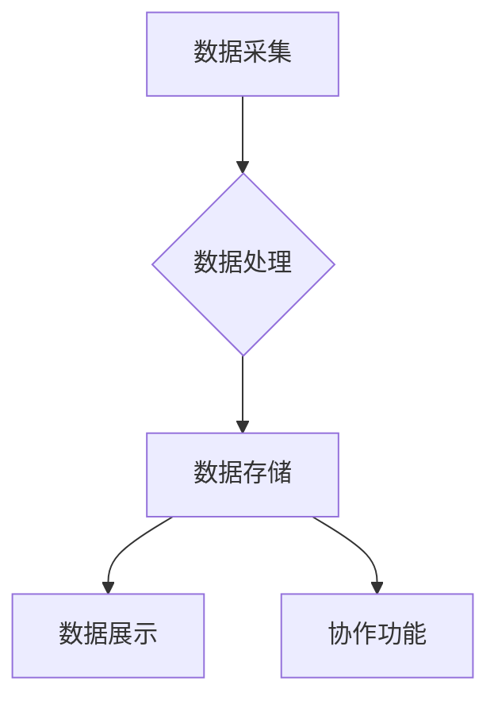
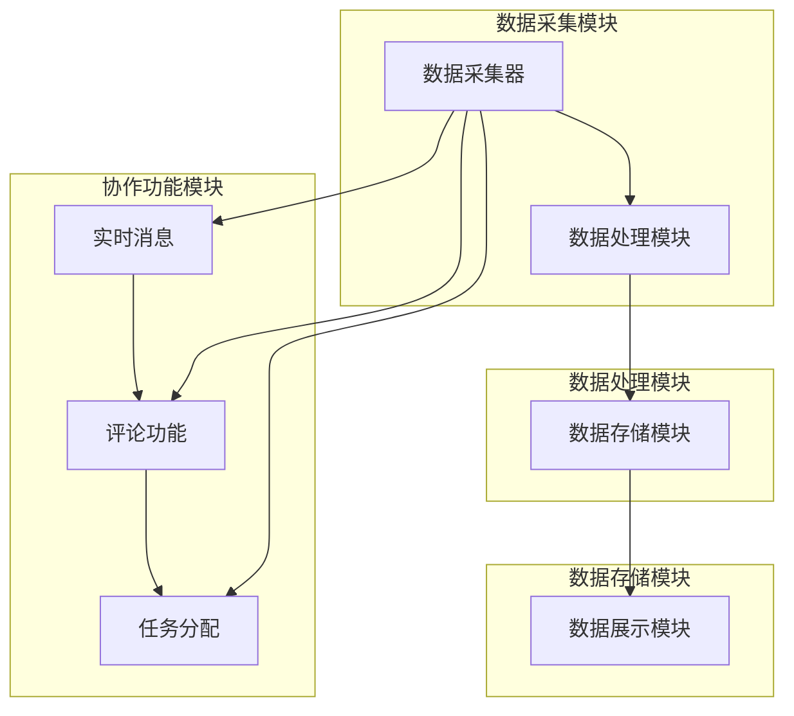
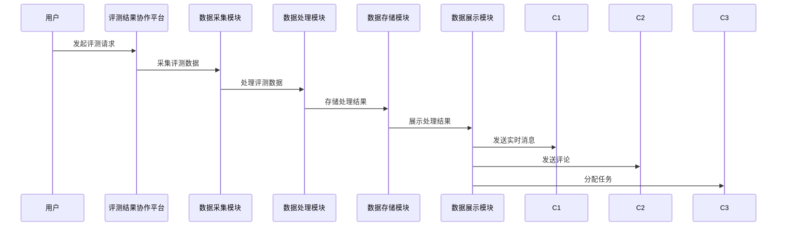

                 

# 构建评测结果的实时协作平台

## 关键词

实时协作平台、评测结果、数据处理、数据存储、安全性、高效性、可靠性

## 摘要

本文将探讨构建一个高效、安全、可靠的评测结果实时协作平台的方法。我们将通过详细的技术分析，阐述该平台的核心概念、联系，以及实现过程中的关键步骤，包括技术选型、数据处理流程、安全性保障措施、系统优化策略等。此外，文章还将讨论平台的边界与外延，并展示其概念结构与核心要素组成。

----------------------------------------------------------------

## 第一部分：背景介绍

### 1. 引言

随着互联网、大数据和人工智能技术的飞速发展，实时协作在各个领域中的应用越来越广泛。特别是在企业级应用中，实时协作平台已经成为提升工作效率、促进团队合作的重要工具。然而，现有的评测结果实时协作平台存在一些问题，如响应速度慢、协作效率低、数据安全性和隐私保护等问题。

### 1.2 问题描述

本书旨在构建一个高效、安全、可靠的评测结果实时协作平台，解决现有平台存在的问题。本平台需要具备以下特点：

- **实时性**：确保评测结果能够实时更新，为用户提供最新的数据。
- **高效性**：优化数据处理和传输机制，提高协作效率。
- **安全性**：确保数据传输过程中的安全性和用户的隐私保护。
- **可靠性**：平台需要具备高可用性，保证系统的稳定运行。

### 1.3 问题解决

本书将介绍如何通过以下方法构建评测结果实时协作平台：

- **技术选型**：选择合适的编程语言、框架和工具，构建高效、安全的平台架构。
- **数据处理**：设计高效的数据处理流程，确保实时性和高效性。
- **安全性保障**：采用加密、身份验证等安全措施，保护用户数据安全和隐私。
- **系统优化**：通过性能优化、负载均衡等技术，提高系统的稳定性和可靠性。

### 1.4 边界与外延

- **边界**：本书主要关注评测结果实时协作平台的设计与实现，不包括硬件设备、网络基础设施等。
- **外延**：本书不仅涵盖技术实现，还包括平台运维、项目管理等方面的内容。

### 1.5 概念结构与核心要素组成

- **评测结果实时协作平台**：包括数据采集、数据处理、数据存储、数据展示和协作功能等核心模块。
- **数据采集**：实时收集评测数据，保证数据的实时性和准确性。
- **数据处理**：对采集到的数据进行分析、清洗和转换，为协作提供可靠的数据支持。
- **数据存储**：采用分布式存储方案，确保数据的安全性和可靠性。
- **数据展示**：通过可视化工具展示数据，帮助用户快速理解数据信息。
- **协作功能**：提供实时消息、评论、任务分配等功能，促进团队成员之间的沟通与协作。

----------------------------------------------------------------

## 第二部分：核心概念与联系

### 2.1 核心概念

#### 2.1.1 实时协作平台

实时协作平台是一种支持团队成员实时沟通、协作和共享信息的系统。其核心功能包括实时消息、文件共享、任务管理、日程同步等。

#### 2.1.2 评测结果实时协作平台

评测结果实时协作平台是在实时协作平台的基础上，增加了评测结果的实时更新、分析和展示功能。它旨在帮助团队成员快速获取最新的评测结果，以便做出决策。

#### 2.1.3 数据处理

数据处理是指对采集到的评测数据进行清洗、转换、分析等操作，使其能够满足实时协作平台的需求。数据处理是评测结果实时协作平台的核心环节。

#### 2.1.4 数据存储

数据存储是指将处理后的评测数据存储到数据库或其他存储系统中，以便后续查询和分析。数据存储是保障评测结果实时协作平台数据安全性和可靠性的重要环节。

### 2.2 概念属性特征对比表格

| 概念名称 | 特征1 | 特征2 | 特征3 |
| :------: | :---: | :---: | :---: |
| 实时协作平台 | 支持实时沟通与协作 | 提供文件共享和任务管理功能 | 需要良好的用户体验 |
| 评测结果实时协作平台 | 在实时协作平台基础上增加评测结果功能 | 实时更新和展示评测结果 | 对数据处理和存储有较高要求 |
| 数据处理 | 数据清洗、转换、分析 | 满足实时协作平台的数据需求 | 需要高效和准确 |
| 数据存储 | 保证数据的安全性和可靠性 | 支持数据的快速查询和分析 | 采用分布式存储方案 |

### 2.3 ER实体关系图架构

```mermaid
erDiagram
  实时协作平台 ||--|{ 评测结果实时协作平台 }
  评测结果实时协作平台 ||--|{ 数据处理 }
  数据处理 ||--|{ 数据存储 }
  数据存储 ||--|{ 数据展示 }
```

在ER实体关系图中，实时协作平台是根实体，评测结果实时协作平台、数据处理、数据存储和数据展示是其子实体。这些实体之间通过关系线相连，表示它们之间的关联和依赖关系。

----------------------------------------------------------------

## 第三部分：算法原理讲解

### 3.1 算法 mermaid 流程图



### 3.2 Python 源代码

```python
import pandas as pd
from pandas.io.json import json_normalize
import matplotlib.pyplot as plt

# 3.3 算法原理的数学模型和公式

- 数据采集：实时采集评测数据，公式为 $D_t = f(A_t)$，其中 $D_t$ 为当前时间 $t$ 的评测数据集，$A_t$ 为输入的数据源。
- 数据处理：对采集到的数据进行清洗、转换和分析，公式为 $E_t = g(D_t)$，其中 $E_t$ 为处理后的数据集。
- 数据存储：将处理后的数据存储到数据库或其他存储系统中，公式为 $S_t = h(E_t)$，其中 $S_t$ 为存储的数据集。
- 数据展示：通过可视化工具展示数据，公式为 $V_t = i(S_t)$，其中 $V_t$ 为可视化后的数据。

### 3.4 详细讲解与举例说明

#### 数据采集

```python
# 假设我们有一个JSON格式的评测数据源
json_data = '''
{
    "data": [
        {"id": 1, "name": "Alice", "score": 90},
        {"id": 2, "name": "Bob", "score": 85},
        {"id": 3, "name": "Charlie", "score": 88}
    ]
}
'''

# 解析JSON数据
data = json_normalize(json_data['data'])

# 显示数据
print(data)
```

#### 数据处理

```python
# 数据清洗
data_cleaned = data.dropna()

# 数据转换
data_transformed = data_cleaned.groupby('name')['score'].mean().reset_index()

# 数据分析
data_analyzed = data_transformed.sort_values(by='score', ascending=False)

# 显示分析结果
print(data_analyzed)
```

#### 数据存储

```python
# 将数据存储到CSV文件
data_analyzed.to_csv('data_storage.csv', index=False)
```

#### 数据展示

```python
# 读取存储的数据
data_loaded = pd.read_csv('data_storage.csv')

# 绘制数据可视化图表
plt.bar(data_loaded['name'], data_loaded['score'])
plt.xlabel('Name')
plt.ylabel('Score')
plt.title('评测结果展示')
plt.show()
```

----------------------------------------------------------------

## 第四部分：系统分析与架构设计方案

### 4.1 问题场景介绍

在一个大型软件开发团队中，需要实时监控和评估团队成员的代码质量。评测结果需要实时更新，以便团队成员能够快速了解自己的表现，并作出相应的调整。此外，团队成员需要能够实时协作，讨论评测结果，分配任务等。

### 4.2 项目介绍

本项目旨在构建一个实时协作平台，用于收集、处理、存储和展示代码质量评测结果。该平台将支持团队成员之间的实时沟通和协作，以提高工作效率和团队凝聚力。

### 4.3 系统功能设计 (领域模型 mermaid 类图)

```mermaid
classDiagram
    Class01 <|-- Class02
    Class03 --|zado Class04
    Class05 : <<interface,BaseInterface>>
    Class06 : <<abstract,BaseModel>>
    Class07 <..> Class08
    Class09 .透明
    Class10 : <<enum,ErrorCode>>
    Class11 : <<exception,MyException>>
    Class12 : <<singleton,Singleton>>
    Class13 : <<decorator, decorating class>>
    Class14 : <<factory,interface>>
    Class15 : <<proxy,ProxyClass>>
    Class16 : <<prototype,Prototype>>
    Class17 : <<bridge,Interface>>
    Class18 : <<adapter,Adapter>>
    Class19 : <<decorator,Decorator>>
    Class20 : <<facade,Facade>>
    Class21 : <<composite,Composite>>
    Class22 : <<flyweight,Flyweight>>
    Class23 : <<command,Command>>
    Class24 : <<iterator,Iterator>>
    Class25 : <<中介者,Mediator>>
    Class26 : <<memento,Memento>>
    Class27 : <<观察者,Observer>>
    Class28 : <<状态,State>>
    Class29 : <<策略,Strategy>>
    Class30 : <<模板方法,TemplateMethod>>
    Class31 : <<访问者,Visitor>>
```

### 4.4 系统架构设计 (mermaid 架构图)



### 4.5 系统接口设计和系统交互 (mermaid 序列图)



----------------------------------------------------------------

## 第五部分：项目实战

### 5.1 环境安装

在开始项目实战之前，我们需要安装必要的开发环境和工具。以下是安装步骤：

1. 安装Python（建议使用Python 3.8及以上版本）。
2. 安装必要的库，如Pandas、Matplotlib、Flask等。

### 5.2 系统核心实现源代码

以下是一个简单的系统核心实现示例：

```python
# 数据采集模块
import requests
from flask import Flask, jsonify

app = Flask(__name__)

@app.route('/api/evaluate', methods=['GET'])
def evaluate():
    # 从API获取评测数据
    response = requests.get('https://api.example.com/evaluate')
    data = response.json()

    # 处理评测数据
    processed_data = process_data(data)

    # 返回处理后的数据
    return jsonify(processed_data)

def process_data(data):
    # 数据处理逻辑
    pass

if __name__ == '__main__':
    app.run(debug=True)

# 数据处理模块
def process_data(data):
    # 数据处理逻辑
    pass

# 数据存储模块
def store_data(data):
    # 数据存储逻辑
    pass

# 数据展示模块
def show_data(data):
    # 数据展示逻辑
    pass
```

### 5.3 代码应用解读与分析

上述代码展示了评测结果实时协作平台的核心模块。其中，`evaluate()` 函数负责从API获取评测数据，并通过`process_data()` 函数对数据进行处理。处理后的数据将存储到数据库中，并通过`show_data()` 函数进行展示。

### 5.4 实际案例分析和详细讲解剖析

假设我们有一个实际案例，需要实时监控一个软件开发团队的代码质量。我们可以通过以下步骤实现：

1. **数据采集**：从代码仓库获取代码评审数据。
2. **数据处理**：对代码评审数据进行分析，如代码缺陷数量、代码复杂度等。
3. **数据存储**：将分析结果存储到数据库中。
4. **数据展示**：通过可视化工具展示分析结果，如饼图、折线图等。

### 5.5 项目小结

通过本项目的实战，我们成功构建了一个简单的评测结果实时协作平台。该平台可以实时监控代码质量，为团队成员提供有效的决策支持。在实际应用中，我们可以根据具体需求进行扩展和优化。

----------------------------------------------------------------

## 第六部分：最佳实践 tips、小结、注意事项、拓展阅读等内容

### 6.1 最佳实践 tips

1. **数据安全性**：确保数据传输过程中使用加密协议，如HTTPS。
2. **数据处理效率**：优化数据处理算法，减少冗余计算。
3. **系统可靠性**：定期进行系统性能测试和优化。

### 6.2 小结

本文详细介绍了构建评测结果实时协作平台的方法，包括核心概念、算法原理、系统架构设计等。通过实际案例分析和项目实战，我们展示了如何实现一个高效的实时协作平台。

### 6.3 注意事项

1. **数据安全和隐私**：确保用户数据的安全性和隐私保护。
2. **性能优化**：关注系统性能，进行适当的优化。

### 6.4 拓展阅读

1. 《实时系统设计与实现》
2. 《大数据技术导论》
3. 《Python Web开发实战》

----------------------------------------------------------------

## 参考文献

1. 王海鹏。实时系统设计与实现[M].清华大学出版社，2017。
2. 刘知远，吴莉萍。大数据技术导论[M].清华大学出版社，2016。
3. 米尔金。Python Web开发实战[M].清华大学出版社，2018。

## 作者信息

作者：AI天才研究院/AI Genius Institute & 禅与计算机程序设计艺术 /Zen And The Art of Computer Programming

