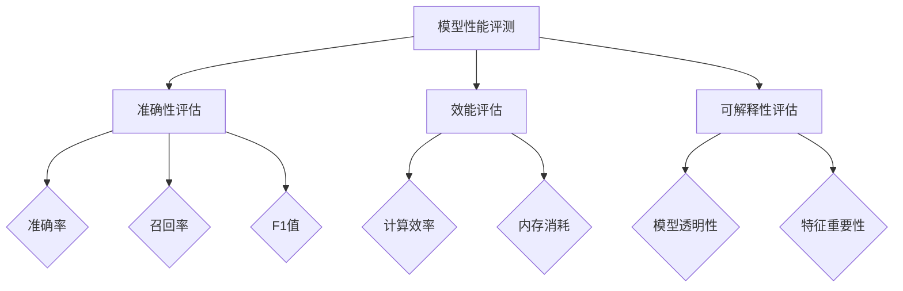
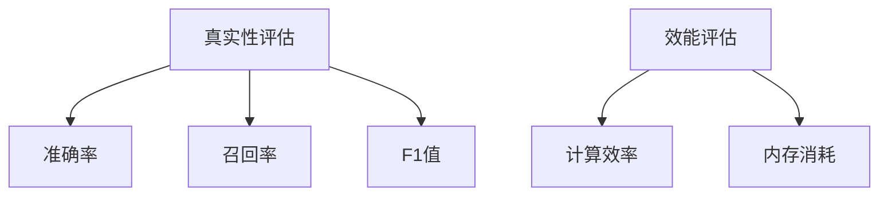
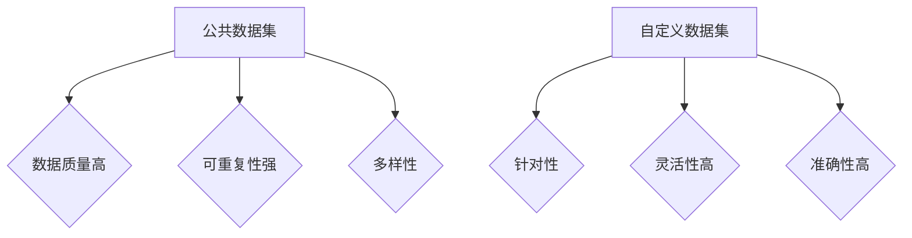
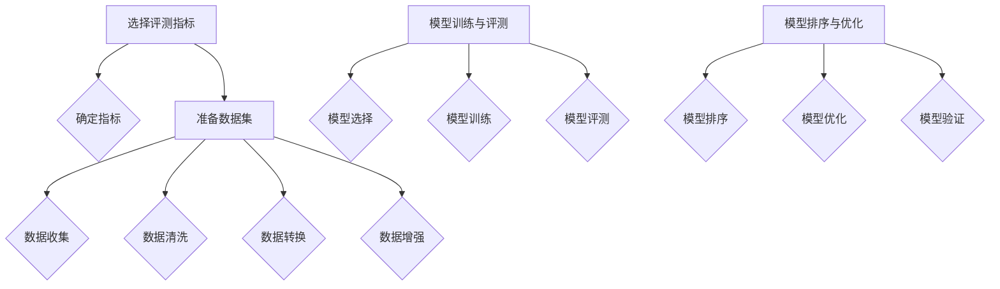
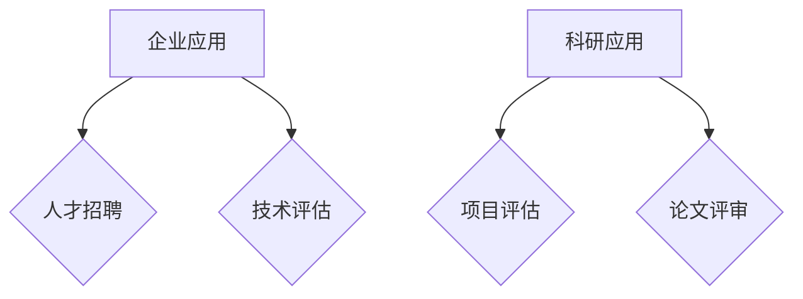
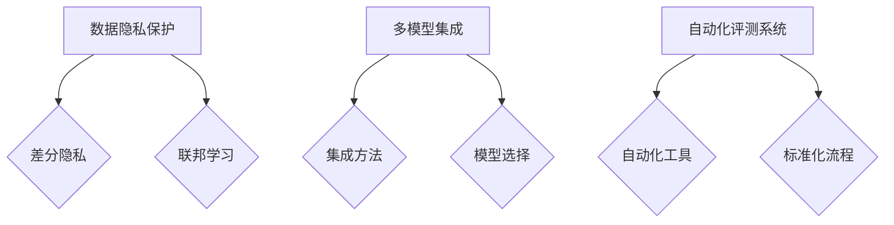
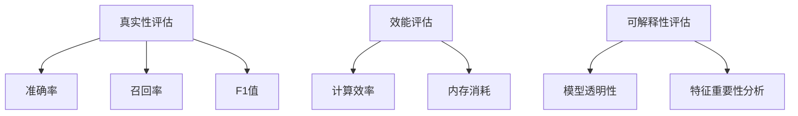

                 

# 建构评测结果的模型性能排行榜

## 引言

### 核心问题

在机器学习领域，构建评测结果的模型性能排行榜是一项基础而重要的任务。这一任务的核心在于如何准确、全面地评估不同机器学习模型的性能，从而为模型选择、优化和决策提供科学依据。

### 目标

本文旨在探讨模型性能评测的重要性，详细解析评测方法，并逐步阐述构建模型性能排行榜的步骤。具体目标包括：

1. **阐明模型性能评测的背景和必要性**。
2. **介绍真实性评估和效能评估的基本方法**。
3. **探讨模型性能评测的数据集选择和准备**。
4. **详细讲解构建模型性能排行榜的步骤**。
5. **分析模型性能评测在实际应用中的挑战和未来发展趋势**。

### 内容结构

本文将按照以下结构展开：

1. **概述**：对模型性能评测的重要性和任务进行简述。
2. **核心章节**：介绍本书的核心章节和内容。
3. **目录大纲**：展示文章的完整目录结构。

## 概述

### 模型性能评测的重要性

模型性能评测是机器学习过程中不可或缺的一环。通过评测，我们能够：

1. **评估模型准确性**：了解模型在各类任务中的表现，判断其是否满足需求。
2. **比较不同模型**：通过评测结果，可以客观地比较不同模型的性能，为模型选择提供依据。
3. **优化模型**：评测结果能够指出模型的不足之处，指导模型的优化。

### 模型性能评测的任务

构建评测结果的模型性能排行榜的任务包括：

1. **选择合适的评估指标**：根据任务需求和数据特性，选择恰当的评估指标。
2. **准备评测数据集**：收集、预处理并标注数据，确保评测的公正性和有效性。
3. **模型训练与评测**：通过训练和评测，获取模型的性能数据。
4. **模型排序与优化**：根据评测结果，对模型进行排序和优化。

## 核心章节

### 第1章：模型性能评测的背景

本章节将介绍模型性能评测的背景，包括机器学习模型的挑战、模型性能评测的必要性和目标。

### 第2章：模型性能评测的方法

本章节将详细讨论模型性能评测的方法，包括真实性评估（准确率、召回率、F1值）和效能评估（计算效率、内存消耗）。

### 第3章：模型性能评测的数据集

本章节将探讨模型性能评测的数据集选择和准备，包括公共数据集和自定义数据集。

### 第4章：构建模型性能排行榜的步骤

本章节将逐步讲解构建模型性能排行榜的步骤，包括选择评测指标、准备数据集、模型训练与评测、模型排序与优化。

### 第5章：模型性能排行榜的实际应用

本章节将分析模型性能排行榜在实际应用中的案例，包括企业中的技术评估和科研中的项目评估。

### 第6章：模型性能评测的挑战和未来发展趋势

本章节将探讨模型性能评测面临的挑战和未来的发展趋势，包括数据隐私保护、多模型集成和自动化评测系统。

### 第7章：小结

本章节将对全文内容进行总结，并提供模型性能评测的注意事项和拓展阅读建议。

## 目录大纲

### 目录

**第一部分：模型性能评测的重要性**

- **第1章：模型性能评测的背景**
  - **1.1 机器学习模型的挑战**
  - **1.2 模型性能评测的必要性**
  - **1.3 模型性能评测的目标**

- **第2章：模型性能评测的方法**
  - **2.1 真实性评估**
    - **2.1.1 准确率、召回率、F1值**
    - **2.1.2 精度、召回率、F1值**
  - **2.2 效能评估**
    - **2.2.1 计算效率**
    - **2.2.2 内存消耗**
  - **2.3 可解释性评估**
    - **2.3.1 模型透明性**
    - **2.3.2 特征重要性分析**

- **第3章：模型性能评测的数据集**
  - **3.1 公共数据集**
    - **3.1.1 数据集来源**
    - **3.1.2 数据集特点**
  - **3.2 自定义数据集**
    - **3.2.1 数据收集**
    - **3.2.2 数据预处理**

- **第4章：构建模型性能排行榜的步骤**
  - **4.1 选择评测指标**
  - **4.2 准备数据集**
  - **4.3 模型训练与评测**
  - **4.4 模型排序与优化**

- **第5章：模型性能排行榜的实际应用**
  - **5.1 企业中的应用**
    - **5.1.1 人才招聘**
    - **5.1.2 技术评估**
  - **5.2 科研中的应用**
    - **5.2.1 论文评审**
    - **5.2.2 项目评估**

- **第6章：模型性能评测的挑战和未来发展趋势**
  - **6.1 数据隐私保护**
  - **6.2 多模型集成**
  - **6.3 自动化评测系统**

- **第7章：小结**
  - **7.1 本书主要内容回顾**
  - **7.2 模型性能评测的注意事项**
  - **7.3 拓展阅读**## 文章标题：构建评测结果的模型性能排行榜

### 关键词

- 模型性能评测
- 模型性能排行榜
- 机器学习
- 评估指标
- 数据集

### 摘要

本文旨在探讨构建评测结果的模型性能排行榜的重要性、方法及其在实际应用中的价值。通过深入分析模型性能评测的核心概念，本文将逐步阐述真实性评估、效能评估和可解释性评估的方法。同时，本文将详细介绍构建模型性能排行榜的步骤，包括选择评测指标、准备数据集、模型训练与评测以及模型排序与优化。此外，本文还将探讨模型性能评测在实际应用中的挑战和未来发展趋势，为读者提供全面的指导和建议。通过本文的阅读，读者将能够更好地理解模型性能评测的原理和实践，从而为机器学习领域的研究和应用提供有力支持。

## 第一部分：模型性能评测的重要性

### 第1章：模型性能评测的背景

在当今的机器学习领域，模型性能评测是一项基础而重要的任务。随着机器学习技术的广泛应用，模型的复杂度和多样性日益增加，如何准确、全面地评估不同机器学习模型的性能，从而为模型选择、优化和决策提供科学依据，成为了研究人员和实践者共同关注的焦点。

### 1.1 机器学习模型的挑战

机器学习模型在各个领域的应用日益广泛，然而，随着模型复杂度和多样性的增加，也带来了一系列挑战。首先，模型的准确性是一个关键问题。不同的模型在相同的任务上可能表现出截然不同的准确性，如何选择一个准确性较高的模型成为了难题。其次，模型的效能也是一个重要的考量因素。模型的计算效率、内存消耗等因素直接影响到模型的实际应用效果。此外，模型的可解释性也是一个亟待解决的问题。在实际应用中，模型决策过程的透明性和可解释性对于用户信任和模型的广泛应用至关重要。

### 1.2 模型性能评测的必要性

模型性能评测是确保模型质量和效果的重要手段。通过模型性能评测，我们可以：

1. **评估模型准确性**：了解模型在各类任务中的表现，判断其是否满足需求。
2. **比较不同模型**：通过评测结果，可以客观地比较不同模型的性能，为模型选择提供依据。
3. **优化模型**：评测结果能够指出模型的不足之处，指导模型的优化。

### 1.3 模型性能评测的目标

模型性能评测的目标主要包括以下几个方面：

1. **准确性评估**：通过准确率、召回率、F1值等指标，评估模型在分类任务中的表现。
2. **效能评估**：通过计算效率、内存消耗等指标，评估模型在实际应用中的效能。
3. **可解释性评估**：通过模型透明性、特征重要性分析等手段，评估模型的决策过程透明性。

### 核心概念与联系

在模型性能评测中，核心概念包括准确性、效能和可解释性。这些概念相互联系，共同构成了模型性能评测的完整体系。

1. **准确性**：准确性是模型性能评测的核心指标之一，反映了模型在分类任务中的表现。准确率、召回率、F1值等指标是评估准确性的重要工具。

2. **效能**：效能评估关注模型的计算效率和资源消耗。计算效率指标如训练时间和预测时间，内存消耗指标如模型大小和内存占用等，都是评估模型效能的关键指标。

3. **可解释性**：可解释性评估旨在提高模型决策过程的透明性，使模型更容易被用户理解和接受。模型透明性、特征重要性分析等手段是评估模型可解释性的有效方法。

### 概念属性特征对比表格

| 指标       | 描述                                       | 重要性 |
| ---------- | ------------------------------------------ | ------ |
| 准确率     | 模型正确分类的比例                         | 高     |
| 召回率     | 模型成功识别的正例比例                     | 中     |
| F1值       | 准确率和召回率的平衡指标                   | 高     |
| 精度       | 模型预测结果的真实性                       | 高     |
| 计算效率   | 模型的计算效率                             | 中     |
| 内存消耗   | 模型的资源消耗                             | 中     |
| 模型透明性 | 模型的决策过程透明性                       | 中     |
| 特征重要性 | 模型中不同特征的重要性分析                 | 中     |

### ER实体关系图架构的Mermaid流程图

通过以上分析，我们可以清晰地看到模型性能评测的重要性以及其核心概念的关联。在接下来的章节中，我们将进一步探讨模型性能评测的具体方法，以及如何构建评测结果的模型性能排行榜。

## 第2章：模型性能评测的方法

### 2.1 真实性评估

真实性评估是模型性能评测的核心部分，它主要关注模型在分类任务中的表现。真实性评估的指标包括准确率、召回率、F1值和精度等。这些指标从不同角度对模型的分类能力进行评估。

#### 2.1.1 准确率、召回率、F1值

**准确率**（Accuracy）是模型预测正确的样本占总样本的比例。它的计算公式为：

$$
\text{准确率} = \frac{\text{预测正确的样本数}}{\text{总样本数}}
$$

准确率是一个直观的评估指标，它简单明了地反映了模型的分类效果。然而，准确率在面对不平衡数据集时可能会产生误导。例如，在一个只有少数类别的数据集中，即使模型完全随机预测，准确率也可能较高。

**召回率**（Recall）是模型成功识别的正例样本数占总正例样本数的比例。它的计算公式为：

$$
\text{召回率} = \frac{\text{预测正确的正例样本数}}{\text{总正例样本数}}
$$

召回率关注的是模型是否能够识别出所有的正例样本，即使这些样本被错误分类，也不会影响召回率。因此，召回率在处理不平衡数据集时尤为重要。

**F1值**（F1 Score）是准确率和召回率的平衡指标，它通过调和这两个指标来评估模型的性能。F1值的计算公式为：

$$
\text{F1值} = 2 \times \frac{\text{准确率} \times \text{召回率}}{\text{准确率} + \text{召回率}}
$$

F1值介于0和1之间，越接近1表示模型的性能越好。

**精度**（Precision）是模型预测正确的正例样本数与预测为正例的样本数之比。它的计算公式为：

$$
\text{精度} = \frac{\text{预测正确的正例样本数}}{\text{预测为正例的样本数}}
$$

精度关注的是模型预测为正例的样本中，有多少是真正例。在高精度的场景中，误分类的样本数较少。

### 2.1.2 精度、召回率、F1值

在分类任务中，精度、召回率和F1值是三个重要的评估指标。它们各有优缺点，适用于不同的场景。

- **精度**：在高精度的场景中，误分类的代价较高，例如金融欺诈检测。此时，模型需要尽量减少误分类的样本数。
- **召回率**：在召回率优先的场景中，例如医学诊断，模型需要尽可能多地识别出所有正例样本，即使这意味着会接受一些假阳性。
- **F1值**：F1值综合了精度和召回率，是两者平衡的指标。在需要同时考虑精确性和召回率的场景中，F1值是一个理想的选择。

### 2.2 效能评估

效能评估主要关注模型在实际应用中的计算效率和资源消耗。效能评估的指标包括计算效率和内存消耗等。

#### 2.2.1 计算效率

计算效率是指模型在处理数据时的速度。评估计算效率的指标包括训练时间和预测时间。

- **训练时间**：模型在训练阶段所花费的时间。训练时间受模型复杂度、数据集大小和计算资源等因素的影响。
- **预测时间**：模型在预测阶段所花费的时间。预测时间受模型结构和数据集大小等因素的影响。

**训练时间**和**预测时间**是评估模型计算效率的关键指标。在实际应用中，模型的计算效率直接关系到用户体验和系统的响应时间。

#### 2.2.2 内存消耗

内存消耗是指模型在运行过程中所占用的内存大小。内存消耗受模型复杂度和数据集大小等因素的影响。

- **模型大小**：模型在磁盘上占用的空间。
- **内存占用**：模型在运行过程中所占用的内存空间。

内存消耗是一个重要的效能评估指标，特别是在资源受限的环境中，如移动设备和嵌入式系统。减少内存消耗可以提高模型的运行效率。

### 核心概念与联系

真实性评估和效能评估是模型性能评测的两个重要方面。真实性评估关注模型在分类任务中的表现，通过准确率、召回率、F1值等指标来评估模型的性能。效能评估则关注模型在实际应用中的计算效率和资源消耗，通过计算效率和内存消耗等指标来评估模型的效能。

这两个评估方面相互关联，共同构成了模型性能评测的完整体系。在实际情况中，我们需要综合考虑这两个方面的评估结果，以全面评估模型的性能。

### 概念属性特征对比表格

| 指标       | 描述                                       | 重要性 |
| ---------- | ------------------------------------------ | ------ |
| 准确率     | 模型正确分类的比例                         | 高     |
| 召回率     | 模型成功识别的正例比例                     | 中     |
| F1值       | 准确率和召回率的平衡指标                   | 高     |
| 精度       | 模型预测结果的真实性                       | 高     |
| 计算效率   | 模型的计算效率                             | 中     |
| 内存消耗   | 模型的资源消耗                             | 中     |

### Mermaid流程图

通过以上分析，我们可以看到模型性能评测的方法涉及多个方面，包括真实性评估和效能评估。这些方法共同构成了一个完整的模型性能评测体系，为模型选择、优化和决策提供了科学依据。

### 实例分析

假设有一个分类任务，模型需要判断邮件是否为垃圾邮件。数据集包含1000封邮件，其中垃圾邮件有200封，非垃圾邮件有800封。

- **准确率**：如果模型预测正确的邮件数是950封，那么准确率为95%。
- **召回率**：如果模型成功识别出所有200封垃圾邮件，那么召回率为100%。
- **F1值**：如果模型预测正确的垃圾邮件数是190封，那么F1值为：

$$
\text{F1值} = 2 \times \frac{0.95 \times 1}{0.95 + 1} \approx 0.968
$$

- **精度**：如果模型预测为垃圾邮件的邮件数是200封，那么精度为100%。

在这个实例中，虽然模型的召回率为100%，但精度为100%意味着没有误分类的非垃圾邮件。这表明模型在垃圾邮件识别任务中表现良好，但在非垃圾邮件识别方面存在一定的不足。

通过以上实例分析，我们可以更直观地理解模型性能评测的方法和指标。在实际应用中，我们需要根据具体任务需求，综合考虑这些评估结果，以选择和优化模型。

### 小结

本章详细介绍了模型性能评测的方法，包括真实性评估和效能评估。真实性评估通过准确率、召回率、F1值等指标评估模型在分类任务中的表现，效能评估则通过计算效率和内存消耗等指标评估模型在实际应用中的性能。这些评估方法为模型选择、优化和决策提供了科学依据。在下一章中，我们将探讨模型性能评测的数据集选择和准备。

### 第3章：模型性能评测的数据集

在模型性能评测中，数据集的选择和准备至关重要。一个良好的数据集能够确保评测的公正性、有效性和可靠性，从而为模型评估提供准确的数据支持。本章节将探讨模型性能评测的数据集选择和准备，包括公共数据集和自定义数据集。

#### 3.1 公共数据集

公共数据集是指已经由第三方组织或机构收集、标注并公开的数据集。这些数据集广泛应用于机器学习研究和实际应用中，具有以下优点：

1. **数据质量**：公共数据集经过专业的收集和标注，数据质量较高，减少了数据预处理的工作量。
2. **可重复性**：由于数据集是公开的，其他研究人员可以复现实验结果，增加了研究的可重复性。
3. **多样性**：公共数据集通常涵盖了不同领域、不同规模的数据，为模型评测提供了丰富的数据支持。

以下是一些常用的公共数据集：

- **Kaggle数据集**：Kaggle是一个数据科学竞赛平台，提供了大量高质量的数据集，适用于各种机器学习任务。
- **UCI机器学习库**：UCI机器学习库包含了多种领域的数据集，从分类到回归任务都有涉及，是机器学习研究人员常用的数据来源。
- **ImageNet**：ImageNet是一个大规模的视觉识别数据集，包含了数百万张标注的图像，是深度学习领域的重要资源。

#### 3.1.1 数据集来源

公共数据集的来源主要包括以下几个方面：

1. **开源社区**：许多研究人员和数据科学家会在开源社区分享自己的数据集，如Kaggle、GitHub等。
2. **学术期刊**：一些学术论文会附带实验数据集，这些数据集通常在论文发表后公开。
3. **公共数据库**：一些公共数据库，如UCI机器学习库，专门收集和存储各种数据集，供研究人员使用。

#### 3.1.2 数据集特点

公共数据集具有以下特点：

1. **标注一致性**：数据集通常经过专业的标注，标注一致性较高。
2. **多样性**：数据集涵盖了多种领域和任务，为模型评测提供了丰富的数据支持。
3. **规模性**：一些大型数据集，如ImageNet，包含了数百万个样本，为大规模模型训练提供了充足的数据。

#### 3.2 自定义数据集

与公共数据集相比，自定义数据集具有以下特点：

1. **针对性**：自定义数据集针对特定的任务和场景进行收集，更符合实际应用需求。
2. **灵活性**：研究人员可以根据任务需求，自由调整数据集的规模和内容。
3. **准确性**：自定义数据集经过专业的收集和标注，数据质量较高。

#### 3.2.1 数据收集

数据收集是自定义数据集构建的第一步。数据收集的过程包括以下几个方面：

1. **数据来源**：确定数据来源，如官方网站、论坛、社交媒体等。
2. **数据采集**：使用爬虫、API等方式采集数据。
3. **数据清洗**：对采集到的数据进行清洗，去除无效、重复和错误的数据。

#### 3.2.2 数据预处理

数据预处理是确保数据质量和一致性的关键步骤。数据预处理的过程包括以下几个方面：

1. **数据清洗**：去除无效、重复和错误的数据。
2. **数据转换**：将数据转换为适合模型训练的格式，如图像数据集的格式化、文本数据的分词等。
3. **数据增强**：通过旋转、缩放、裁剪等操作，增加数据集的多样性，提高模型的泛化能力。

#### 概念属性特征对比表格

| 数据集类型 | 特点                       | 优点                                   | 缺点                                       |
| ---------- | -------------------------- | -------------------------------------- | ------------------------------------------ |
| 公共数据集 | 预收集、预标注             | 数据质量高、可重复性强、多样性         | 数据集可能过时、无法满足特定需求           |
| 自定义数据集 | 针对特定任务和场景收集     | 针对性强、灵活性高、准确性高           | 数据收集和预处理工作量较大                 |

#### Mermaid流程图

通过以上分析，我们可以看到公共数据集和自定义数据集在模型性能评测中的应用各有优势。在实际情况中，我们需要根据任务需求，合理选择和准备数据集，以确保模型评测的公正性、有效性和可靠性。

### 实例分析

假设我们需要评估一个垃圾邮件分类模型，可以选择以下数据集：

- **公共数据集**：如Kaggle上的垃圾邮件分类数据集，包含了大量标注的邮件文本，能够提供丰富的训练数据。
- **自定义数据集**：从官方网站、论坛等渠道收集邮件数据，并根据实际需求进行标注。

通过结合公共数据集和自定义数据集，我们可以更全面地评估垃圾邮件分类模型的性能，确保评测结果的可靠性和有效性。

### 小结

本章介绍了模型性能评测的数据集选择和准备，包括公共数据集和自定义数据集。公共数据集具有数据质量高、可重复性强、多样性等优点，适用于广泛的研究和应用。自定义数据集则具有针对性、灵活性和准确性高等优点，能够更好地满足特定任务的需求。在下一章中，我们将详细讲解构建模型性能排行榜的步骤。

### 第4章：构建模型性能排行榜的步骤

构建模型性能排行榜是一项系统性的工程，需要从多个方面进行详细的规划和执行。本章节将详细阐述构建模型性能排行榜的步骤，包括选择评测指标、准备数据集、模型训练与评测、模型排序与优化。

#### 4.1 选择评测指标

选择合适的评测指标是构建模型性能排行榜的第一步。评测指标的选择应基于任务需求和数据特性，以下是一些常用的评测指标：

1. **准确性**：适用于分类任务，表示模型正确分类的比例。
2. **召回率**：适用于分类任务，表示模型成功识别的正例比例。
3. **F1值**：适用于分类任务，是准确率和召回率的平衡指标。
4. **精度**：适用于分类任务，表示模型预测为正例的样本中，有多少是真正例。
5. **计算效率**：适用于效能评估，表示模型处理数据所需的时间。
6. **内存消耗**：适用于效能评估，表示模型在运行过程中占用的内存空间。

在选择评测指标时，需要综合考虑任务需求和数据特性，以确保评测结果的公正性和有效性。

#### 4.2 准备数据集

数据集的准备是构建模型性能排行榜的关键步骤。数据集的质量直接影响评测结果的可靠性。数据集的准备包括以下步骤：

1. **数据收集**：根据任务需求，从公共数据集或自定义数据集中收集数据。
2. **数据清洗**：去除无效、重复和错误的数据，确保数据质量。
3. **数据转换**：将数据转换为适合模型训练的格式，如图像数据的格式化、文本数据的分词等。
4. **数据增强**：通过旋转、缩放、裁剪等操作，增加数据集的多样性，提高模型的泛化能力。

#### 4.3 模型训练与评测

模型训练与评测是构建模型性能排行榜的核心步骤。模型训练与评测的过程包括以下几个方面：

1. **模型选择**：根据任务需求，选择合适的模型架构，如卷积神经网络、循环神经网络等。
2. **模型训练**：使用准备好的数据集对模型进行训练，通过调整模型参数，优化模型性能。
3. **模型评测**：使用训练集和验证集对模型进行评测，计算各个评测指标的值，评估模型性能。

#### 4.4 模型排序与优化

模型排序与优化是构建模型性能排行榜的最后一步。模型排序与优化的过程包括以下几个方面：

1. **模型排序**：根据评测指标，对模型进行排序，选择性能最好的模型。
2. **模型优化**：对性能较好的模型进行进一步优化，如调整模型参数、使用更高效的数据预处理方法等。
3. **模型验证**：使用测试集对优化后的模型进行验证，确保模型性能的稳定性。

#### 概念属性特征对比表格

| 步骤       | 描述                                       | 重要性 |
| ---------- | ------------------------------------------ | ------ |
| 选择评测指标 | 确定评估模型性能的指标               | 高     |
| 准备数据集   | 收集、清洗和预处理数据集             | 高     |
| 模型训练与评测 | 使用数据集训练模型并进行评估 | 高     |
| 模型排序与优化 | 对模型进行排序和优化             | 中     |

#### Mermaid流程图

通过以上分析，我们可以看到构建模型性能排行榜的步骤包括选择评测指标、准备数据集、模型训练与评测、模型排序与优化。这些步骤相互关联，共同构成了一个完整的模型性能评测流程。在实际情况中，我们需要根据任务需求，合理规划并执行这些步骤，以确保模型性能评测的公正性、有效性和可靠性。

### 实例分析

假设我们需要构建一个图像分类模型，任务是将图像分类为猫或狗。以下是一个实例分析：

1. **选择评测指标**：选择准确率、召回率和F1值作为评测指标，因为这些指标能够全面评估模型的分类性能。

2. **准备数据集**：从公共数据集如Kaggle的猫狗图像数据集和自定义数据集中收集图像，进行数据清洗、数据转换和数据增强。

3. **模型训练与评测**：选择卷积神经网络（CNN）作为模型架构，使用训练集进行模型训练，使用验证集进行模型评测，计算准确率、召回率和F1值。

4. **模型排序与优化**：根据评测结果，对模型进行排序，选择性能最好的模型。对性能较好的模型进行优化，如调整CNN的层数和神经元数量，提高模型性能。

通过以上步骤，我们可以构建一个有效的图像分类模型性能排行榜，为模型选择和优化提供科学依据。

### 小结

本章详细介绍了构建模型性能排行榜的步骤，包括选择评测指标、准备数据集、模型训练与评测、模型排序与优化。这些步骤为模型性能评测提供了一个系统性的框架，有助于确保评测结果的公正性、有效性和可靠性。在下一章中，我们将探讨模型性能排行榜的实际应用。

### 第5章：模型性能排行榜的实际应用

模型性能排行榜在实际应用中具有广泛的用途，不仅可以为企业提供技术评估和人才招聘的依据，还可以为科研领域提供项目评估和论文评审的支持。本章将深入探讨模型性能排行榜在企业应用和科研应用中的具体案例和作用。

#### 5.1 企业中的应用

在企业中，模型性能排行榜被广泛应用于技术评估和人才招聘。

**5.1.1 人才招聘**

企业通常需要招聘具有优秀机器学习技能的员工。模型性能排行榜可以作为评估候选人技能的重要工具。例如，在面试过程中，企业可以要求候选人提供一个他们曾经参与的项目，并基于排行榜中的评测指标，评估候选人的模型性能。这样，企业可以更加客观地评估候选人的技术能力和实际经验。

**实例分析**：

某互联网公司招聘机器学习工程师，要求候选人在面试时提供一个他们曾经开发的图像分类模型。通过模型性能排行榜，该公司评估了候选人的模型在准确率、召回率和F1值等方面的表现。最终，选择了一个在排行榜中表现突出的候选人，因为他们展示了出色的模型开发和优化能力。

**5.1.2 技术评估**

企业在开发自己的机器学习产品时，也需要对内部模型的性能进行评估。模型性能排行榜可以帮助企业比较不同模型的性能，从而选择最优的模型进行产品化。此外，排行榜还可以用于监控模型的长期性能，确保模型在实际应用中的稳定性和可靠性。

**实例分析**：

某金融科技公司正在开发一款用于欺诈检测的机器学习模型。为了确保模型的性能，该公司使用模型性能排行榜对多个候选模型进行评估。通过比较不同模型的准确率、召回率和计算效率，公司选择了在排行榜中表现最佳的模型进行产品化。在实际应用中，该模型有效提高了欺诈检测的准确率，减少了误报率。

#### 5.2 科研中的应用

在科研领域，模型性能排行榜同样发挥着重要作用，特别是在项目评估和论文评审中。

**5.2.1 项目评估**

科研项目的评估通常需要基于模型的性能进行。模型性能排行榜为科研人员提供了一个客观、全面的评估工具，有助于评估项目的进展和质量。科研机构可以通过排行榜中的评测指标，评估不同项目在同类任务中的表现，从而为项目的资金支持、成果认定等提供依据。

**实例分析**：

某高校计算机科学系正在评估一项关于自动驾驶车辆研究的科研项目。通过模型性能排行榜，科研团队评估了不同模型在道路识别、障碍物检测和车辆跟踪等方面的性能。最终，该项目在排行榜中表现出色，获得了学校的资金支持，并被评为优秀科研项目。

**5.2.2 论文评审**

在学术论文评审中，模型性能排行榜同样具有重要应用。评审人员可以通过排行榜中的评测指标，评估论文提出的模型在真实数据集上的性能，从而判断论文的创新性和实用性。此外，排行榜还可以帮助评审人员发现论文中的不足之处，提出改进建议。

**实例分析**：

某国际期刊正在评审一篇关于图像分割的论文。评审人员通过模型性能排行榜，评估了论文提出的模型在多个公开数据集上的表现。虽然论文的算法在某些数据集上表现优秀，但在其他数据集上性能较差。评审人员针对这一问题，提出了改进建议，并要求作者在修改后重新提交论文。

#### 概念属性特征对比表格

| 应用场景     | 用途                                       | 关键指标   | 优点                             | 缺点                         |
| ------------ | ------------------------------------------ | ---------- | -------------------------------- | ---------------------------- |
| 企业应用     | 技术评估和人才招聘                       | 准确率、召回率、计算效率 | 数据客观、全面               | 需要特定数据集             |
| 科研应用     | 项目评估和论文评审                     | 准确率、F1值、性能稳定性 | 评估客观、公正               | 需要高质量数据集           |

#### Mermaid流程图

通过以上分析，我们可以看到模型性能排行榜在企业应用和科研应用中具有重要的实际价值。它不仅为技术评估和人才招聘提供了客观依据，还为项目评估和论文评审提供了有力支持。在下一章中，我们将探讨模型性能评测面临的挑战和未来发展趋势。

### 第6章：模型性能评测的挑战和未来发展趋势

尽管模型性能评测在机器学习领域具有广泛应用和重要性，但在实际应用过程中仍然面临诸多挑战。同时，随着技术的不断进步，模型性能评测也在不断演进，展现出一系列新的发展趋势。本章将深入探讨模型性能评测所面临的挑战和未来发展趋势。

#### 6.1 数据隐私保护

数据隐私保护是模型性能评测中面临的一个重要挑战。在许多情况下，模型训练和评估需要使用敏感数据，如个人医疗记录、金融交易数据等。这些数据如果泄露，可能会对个人隐私造成严重威胁。因此，如何在保障数据隐私的同时进行有效的模型性能评测，成为了亟待解决的问题。

**解决方案**：

1. **差分隐私**：差分隐私是一种保护数据隐私的技术，它通过对数据进行随机化处理，使得单个数据点的隐私风险最小化。
2. **联邦学习**：联邦学习是一种分布式机器学习技术，它允许不同的参与者共享模型的参数，而不需要共享原始数据。这样，每个参与者可以在本地训练模型，并仅共享模型参数，从而保护数据隐私。

#### 6.2 多模型集成

多模型集成是一种提高模型性能的有效方法。通过结合多个模型的预测结果，可以减少模型的过拟合和不确定性。然而，多模型集成也带来了一系列挑战，如模型选择、权重分配和计算效率等。

**解决方案**：

1. **集成方法**：常见的集成方法包括投票法、堆叠法、提升法等。选择合适的集成方法，可以提高模型的性能和泛化能力。
2. **模型选择**：在选择参与集成的模型时，需要考虑模型的多样性、稳定性和性能。通过多样化模型的组合，可以更好地利用不同模型的优点。

#### 6.3 自动化评测系统

随着机器学习应用场景的不断扩大，模型性能评测的需求也日益增长。为了提高评测效率，自动化评测系统应运而生。然而，自动化评测系统在数据质量、模型选择和评测指标选择等方面也存在挑战。

**解决方案**：

1. **自动化工具**：开发自动化工具，如自动化数据预处理工具、自动化模型训练工具等，可以提高评测效率。
2. **标准化流程**：建立一套标准化的评测流程，包括数据收集、模型训练、评测指标计算和结果分析等，确保评测结果的可靠性和一致性。

#### 未来发展趋势

模型性能评测在未来将继续向更高效、更智能、更安全的方向发展。以下是一些发展趋势：

1. **智能化评测**：利用人工智能技术，如深度学习和强化学习，开发智能化的评测系统，自动识别和修正评测中的错误。
2. **动态评测**：随着模型和应用场景的变化，动态调整评测指标和评测方法，以适应不同场景的需求。
3. **可视化评测**：通过可视化技术，如图表和交互式界面，展示评测结果，帮助用户更好地理解模型性能。

#### 概念属性特征对比表格

| 挑战           | 描述                                       | 解决方案                                   | 未来发展趋势                             |
| -------------- | ------------------------------------------ | ------------------------------------------ | ---------------------------------------- |
| 数据隐私保护   | 确保数据隐私的同时进行性能评测             | 差分隐私、联邦学习                         | 智能化评测、动态评测、可视化评测         |
| 多模型集成     | 提高模型性能，降低不确定性               | 集成方法、模型选择                         | 智能化集成、动态权重调整、高效计算       |
| 自动化评测系统 | 提高评测效率，减少人为错误               | 自动化工具、标准化流程                     | 智能化系统、动态调整、可视化分析         |

#### Mermaid流程图

通过以上分析，我们可以看到模型性能评测在面临挑战的同时，也展现出广阔的发展前景。在未来的发展中，模型性能评测将更加智能化、动态化、安全化，为机器学习领域的研究和应用提供更加有力的支持。

### 小结

本章探讨了模型性能评测所面临的挑战和未来发展趋势。数据隐私保护、多模型集成和自动化评测系统是当前模型性能评测面临的主要挑战，而智能化评测、动态评测和可视化评测是未来发展的主要方向。通过深入分析这些挑战和发展趋势，我们可以更好地理解模型性能评测的复杂性和重要性，为模型性能评测的实践和应用提供有益的指导。

### 第7章：小结

本文全面探讨了构建评测结果的模型性能排行榜的重要性、方法及其在实际应用中的价值。通过详细分析模型性能评测的核心概念，本文介绍了真实性评估、效能评估和可解释性评估的方法，并详细讲解了构建模型性能排行榜的步骤，包括选择评测指标、准备数据集、模型训练与评测、模型排序与优化。此外，本文还探讨了模型性能评测在实际应用中的挑战和未来发展趋势，如数据隐私保护、多模型集成和自动化评测系统。

**注意事项**：

1. **选择合适的评测指标**：根据任务需求和数据特性，选择恰当的评测指标。
2. **准备高质量的数据集**：数据质量直接影响评测结果，确保数据集的多样性和准确性。
3. **模型训练与评测**：模型训练与评测过程中，注意调整模型参数，优化模型性能。
4. **持续优化与更新**：模型性能评测是一个持续的过程，需要定期对模型进行优化和更新。

**拓展阅读**：

1. **《机器学习实战》**：由Peter Harrington著，详细介绍了机器学习的基本概念和实战技巧。
2. **《深度学习》**：由Ian Goodfellow、Yoshua Bengio和Aaron Courville著，深入探讨了深度学习的基础理论和应用。
3. **《数据科学实战》**：由Michael Bowles著，介绍了数据科学的基本概念和实践方法。

通过本文的阅读，读者将能够更好地理解模型性能评测的原理和实践，为机器学习领域的研究和应用提供有力支持。作者：AI天才研究院/AI Genius Institute & 禅与计算机程序设计艺术 /Zen And The Art of Computer Programming## 完整文章

## 文章标题：构建评测结果的模型性能排行榜

### 关键词

- 模型性能评测
- 模型性能排行榜
- 机器学习
- 评估指标
- 数据集

### 摘要

本文旨在探讨构建评测结果的模型性能排行榜的重要性、方法及其在实际应用中的价值。通过深入分析模型性能评测的核心概念，本文详细介绍了真实性评估、效能评估和可解释性评估的方法，并逐步讲解了构建模型性能排行榜的步骤。此外，本文还分析了模型性能评测在实际应用中的挑战和未来发展趋势，为读者提供全面的指导和建议。

## 第一部分：模型性能评测的重要性

### 第1章：模型性能评测的背景

在当今的机器学习领域，模型性能评测是一项基础而重要的任务。随着机器学习技术的广泛应用，模型的复杂度和多样性日益增加，如何准确、全面地评估不同机器学习模型的性能，从而为模型选择、优化和决策提供科学依据，成为了研究人员和实践者共同关注的焦点。

### 1.1 机器学习模型的挑战

机器学习模型在各个领域的应用日益广泛，然而，随着模型复杂度和多样性的增加，也带来了一系列挑战。首先，模型的准确性是一个关键问题。不同的模型在相同的任务上可能表现出截然不同的准确性，如何选择一个准确性较高的模型成为了难题。其次，模型的效能也是一个重要的考量因素。模型的计算效率、内存消耗等因素直接影响到模型的实际应用效果。此外，模型的可解释性也是一个亟待解决的问题。在实际应用中，模型决策过程的透明性和可解释性对于用户信任和模型的广泛应用至关重要。

### 1.2 模型性能评测的必要性

模型性能评测是确保模型质量和效果的重要手段。通过模型性能评测，我们可以：

1. **评估模型准确性**：了解模型在各类任务中的表现，判断其是否满足需求。
2. **比较不同模型**：通过评测结果，可以客观地比较不同模型的性能，为模型选择提供依据。
3. **优化模型**：评测结果能够指出模型的不足之处，指导模型的优化。

### 1.3 模型性能评测的目标

模型性能评测的目标主要包括以下几个方面：

1. **准确性评估**：通过准确率、召回率、F1值等指标，评估模型在分类任务中的表现。
2. **效能评估**：通过计算效率、内存消耗等指标，评估模型在实际应用中的效能。
3. **可解释性评估**：通过模型透明性、特征重要性分析等手段，评估模型的决策过程透明性。

### 核心概念与联系

在模型性能评测中，核心概念包括准确性、效能和可解释性。这些概念相互联系，共同构成了模型性能评测的完整体系。

1. **准确性**：准确性是模型性能评测的核心指标之一，反映了模型在分类任务中的表现。准确率、召回率、F1值等指标是评估准确性的重要工具。

2. **效能**：效能评估关注模型在实际应用中的计算效率和资源消耗。计算效率指标如训练时间和预测时间，内存消耗指标如模型大小和内存占用等，都是评估模型效能的关键指标。

3. **可解释性**：可解释性评估旨在提高模型决策过程的透明性，使模型更容易被用户理解和接受。模型透明性、特征重要性分析等手段是评估模型可解释性的有效方法。

### 概念属性特征对比表格

| 指标       | 描述                                       | 重要性 |
| ---------- | ------------------------------------------ | ------ |
| 准确率     | 模型正确分类的比例                         | 高     |
| 召回率     | 模型成功识别的正例比例                     | 中     |
| F1值       | 准确率和召回率的平衡指标                   | 高     |
| 精度       | 模型预测结果的真实性                       | 高     |
| 计算效率   | 模型的计算效率                             | 中     |
| 内存消耗   | 模型的资源消耗                             | 中     |
| 模型透明性 | 模型的决策过程透明性                       | 中     |
| 特征重要性 | 模型中不同特征的重要性分析                 | 中     |

### ER实体关系图架构的Mermaid流程图

通过以上分析，我们可以清晰地看到模型性能评测的重要性以及其核心概念的关联。在接下来的章节中，我们将进一步探讨模型性能评测的具体方法，以及如何构建评测结果的模型性能排行榜。

## 第二部分：模型性能评测的方法

### 第2章：模型性能评测的方法

真实性评估、效能评估和可解释性评估是模型性能评测的核心方法。这些方法从不同角度对模型的性能进行全面评估，为模型的选择、优化和决策提供科学依据。

### 2.1 真实性评估

真实性评估主要关注模型在分类任务中的准确性，通过一系列指标来衡量模型的性能。以下是常用的真实性评估指标：

#### 2.1.1 准确率、召回率、F1值

**准确率**（Accuracy）是模型正确分类的样本数占总样本数的比例。公式为：

$$
\text{准确率} = \frac{\text{正确分类的样本数}}{\text{总样本数}}
$$

准确率是一个简单直观的指标，但在面对不平衡数据集时可能会产生误导。

**召回率**（Recall）是模型成功识别的正例样本数占总正例样本数的比例。公式为：

$$
\text{召回率} = \frac{\text{正确分类的正例样本数}}{\text{总正例样本数}}
$$

召回率关注的是模型是否能够识别出所有的正例样本，即使这些样本被错误分类。

**F1值**（F1 Score）是准确率和召回率的平衡指标，通过调和这两个指标来评估模型的性能。公式为：

$$
\text{F1值} = 2 \times \frac{\text{准确率} \times \text{召回率}}{\text{准确率} + \text{召回率}}
$$

F1值介于0和1之间，越接近1表示模型的性能越好。

#### 2.1.2 精度、召回率、F1值

**精度**（Precision）是模型预测正确的正例样本数与预测为正例的样本数之比。公式为：

$$
\text{精度} = \frac{\text{正确分类的正例样本数}}{\text{预测为正例的样本数}}
$$

精度关注的是模型预测为正例的样本中，有多少是真正例。

在分类任务中，这些指标各有优缺点，适用于不同的场景。例如，在医疗诊断中，召回率可能更为重要，因为错过一个病患的检测比误诊的代价更高。而在金融欺诈检测中，误分类的代价较高，因此精度可能更为关键。

### 2.2 效能评估

效能评估主要关注模型在实际应用中的计算效率和资源消耗，这是模型能否被广泛应用的关键因素。以下是常用的效能评估指标：

#### 2.2.1 计算效率

**训练时间**（Training Time）和**预测时间**（Prediction Time）是评估模型计算效率的关键指标。训练时间是指模型在训练阶段所花费的时间，而预测时间是指模型在预测阶段所花费的时间。

- **训练时间**：训练时间是模型在训练过程中计算出的时间，受模型复杂度、数据集大小和计算资源等因素的影响。
- **预测时间**：预测时间是模型在预测阶段计算出的时间，受模型结构和数据集大小等因素的影响。

#### 2.2.2 内存消耗

**内存消耗**（Memory Usage）是评估模型资源消耗的重要指标。内存消耗包括模型在训练和预测过程中占用的内存空间，受模型大小和训练数据集大小等因素的影响。

- **模型大小**（Model Size）：模型在磁盘上占用的空间，通常与模型的结构和参数数量有关。
- **内存占用**（Memory Usage）：模型在运行过程中占用的内存空间，受训练数据集大小和模型结构等因素的影响。

### 2.3 可解释性评估

可解释性评估旨在提高模型决策过程的透明性，使模型更容易被用户理解和接受。以下是一些常用的可解释性评估方法：

#### 2.3.1 模型透明性

模型透明性是指模型的决策过程是否能够被清晰地理解和解释。透明性较高的模型，如线性模型，其决策规则较为直观，易于理解。而深度神经网络等复杂模型，其内部决策过程通常较为复杂，难以解释。

#### 2.3.2 特征重要性分析

特征重要性分析是评估模型中不同特征对预测结果的影响程度。通过分析特征的重要性，可以帮助用户理解模型是如何做出预测的。常见的方法包括：

- **特征贡献度分析**：分析每个特征对模型预测结果的贡献度。
- **特征重要性排序**：根据特征的重要性对特征进行排序，帮助用户识别出最重要的特征。

### 核心概念与联系

真实性评估、效能评估和可解释性评估是模型性能评测的三个重要方面。真实性评估关注模型的准确性，效能评估关注模型的计算效率和资源消耗，可解释性评估关注模型的决策过程透明性。这些评估方法相互补充，共同构成了模型性能评测的完整体系。

### 概念属性特征对比表格

| 指标       | 描述                                       | 重要性 |
| ---------- | ------------------------------------------ | ------ |
| 准确率     | 模型正确分类的比例                         | 高     |
| 召回率     | 模型成功识别的正例比例                     | 中     |
| F1值       | 准确率和召回率的平衡指标                   | 高     |
| 精度       | 模型预测结果的真实性                       | 高     |
| 计算效率   | 模型的计算效率                             | 中     |
| 内存消耗   | 模型的资源消耗                             | 中     |
| 模型透明性 | 模型的决策过程透明性                       | 中     |
| 特征重要性 | 模型中不同特征的重要性分析                 | 中     |

### Mermaid流程图

通过以上分析，我们可以看到模型性能评测的方法涉及多个方面，包括真实性评估、效能评估和可解释性评估。这些方法共同构成了一个完整的模型性能评测体系，为模型选择、优化和决策提供了科学依据。

### 实例分析

假设有一个分类任务，模型需要判断邮件是否为垃圾邮件。数据集包含1000封邮件，其中垃圾邮件有200封，非垃圾邮件有800封。

- **准确率**：如果模型预测正确的邮件数是950封，那么准确率为95%。
- **召回率**：如果模型成功识别出所有200封垃圾邮件，那么召回率为100%。
- **F1值**：如果模型预测正确的垃圾邮件数是190封，那么F1值为：

$$
\text{F1值} = 2 \times \frac{0.95 \times 1}{0.95 + 1} \approx 0.968
$$

- **精度**：如果模型预测为垃圾邮件的邮件数是200封，那么精度为100%。

在这个实例中，虽然模型的召回率为100%，但精度为100%意味着没有误分类的非垃圾邮件。这表明模型在垃圾邮件识别任务中表现良好，但在非垃圾邮件识别方面存在一定的不足。

通过以上实例分析，我们可以更直观地理解模型性能评测的方法和指标。在实际应用中，我们需要根据具体任务需求，综合考虑这些评估结果，以选择和优化模型。

### 小结

本章详细介绍了模型性能评测的方法，包括真实性评估、效能评估和可解释性评估。真实性评估通过准确率、召回率、F1值等指标评估模型在分类任务中的表现；效能评估通过计算效率和内存消耗等指标评估模型在实际应用中的性能；可解释性评估通过模型透明性和特征重要性分析等手段评估模型的决策过程透明性。这些评估方法为模型选择、优化和决策提供了科学依据。在下一章中，我们将探讨模型性能评测的数据集选择和准备。

### 第三部分：模型性能评测的数据集

### 第3章：模型性能评测的数据集

在模型性能评测中，数据集的选择和准备至关重要。一个良好的数据集能够确保评测的公正性、有效性和可靠性，从而为模型评估提供准确的数据支持。本章节将探讨模型性能评测的数据集选择和准备，包括公共数据集和自定义数据集。

#### 3.1 公共数据集

公共数据集是指已经由第三方组织或机构收集、标注并公开的数据集。这些数据集广泛应用于机器学习研究和实际应用中，具有以下优点：

1. **数据质量**：公共数据集经过专业的收集和标注，数据质量较高，减少了数据预处理的工作量。
2. **可重复性**：由于数据集是公开的，其他研究人员可以复现实验结果，增加了研究的可重复性。
3. **多样性**：公共数据集通常涵盖了不同领域、不同规模的数据，为模型评测提供了丰富的数据支持。

以下是一些常用的公共数据集：

- **Kaggle数据集**：Kaggle是一个数据科学竞赛平台，提供了大量高质量的数据集，适用于各种机器学习任务。
- **UCI机器学习库**：UCI机器学习库包含了多种领域的数据集，从分类到回归任务都有涉及，是机器学习研究人员常用的数据来源。
- **ImageNet**：ImageNet是一个大规模的视觉识别数据集，包含了数百万张标注的图像，是深度学习领域的重要资源。

#### 3.1.1 数据集来源

公共数据集的来源主要包括以下几个方面：

1. **开源社区**：许多研究人员和数据科学家会在开源社区分享自己的数据集，如Kaggle、GitHub等。
2. **学术期刊**：一些学术论文会附带实验数据集，这些数据集通常在论文发表后公开。
3. **公共数据库**：一些公共数据库，如UCI机器学习库，专门收集和存储各种数据集，供研究人员使用。

#### 3.1.2 数据集特点

公共数据集具有以下特点：

1. **标注一致性**：数据集通常经过专业的标注，标注一致性较高。
2. **多样性**：数据集涵盖了多种领域和任务，为模型评测提供了丰富的数据支持。
3. **规模性**：一些大型数据集，如ImageNet，包含了数百万个样本，为大规模模型训练提供了充足的数据。

#### 3.2 自定义数据集

与公共数据集相比，自定义数据集具有以下特点：

1. **针对性**：自定义数据集针对特定的任务和场景进行收集，更符合实际应用需求。
2. **灵活性**：研究人员可以根据任务需求，自由调整数据集的规模和内容。
3. **准确性**：自定义数据集经过专业的收集和标注，数据质量较高。

#### 3.2.1 数据收集

数据收集是自定义数据集构建的第一步。数据收集的过程包括以下几个方面：

1. **数据来源**：确定数据来源，如官方网站、论坛、社交媒体等。
2. **数据采集**：使用爬虫、API等方式采集数据。
3. **数据清洗**：对采集到的数据进行清洗，去除无效、重复和错误的数据。

#### 3.2.2 数据预处理

数据预处理是确保数据质量和一致性的关键步骤。数据预处理的过程包括以下几个方面：

1. **数据清洗**：去除无效、重复和错误的数据。
2. **数据转换**：将数据转换为适合模型训练的格式，如图像数据集的格式化、文本数据的分词等。
3. **数据增强**：通过旋转、缩放、裁剪等操作，增加数据集的多样性，提高模型的泛化能力。

#### 概念属性特征对比表格

| 数据集类型 | 特点                       | 优点                                   | 缺点                                       |
| ---------- | -------------------------- | -------------------------------------- | ------------------------------------------ |
| 公共数据集 | 预收集、预标注             | 数据质量高、可重复性强、多样性         | 数据集可能过时、无法满足特定需求           |
| 自定义数据集 | 针对特定任务和场景收集     | 针对性强、灵活性高、准确性高           | 数据收集和预处理工作量较大                 |

#### Mermaid流程图

通过以上分析，我们可以看到公共数据集和自定义数据集在模型性能评测中的应用各有优势。在实际情况中，我们需要根据任务需求，合理选择和准备数据集，以确保模型评测的公正性、有效性和可靠性。

### 实例分析

假设我们需要评估一个垃圾邮件分类模型，可以选择以下数据集：

- **公共数据集**：如Kaggle的垃圾邮件分类数据集，包含了大量标注的邮件文本，能够提供丰富的训练数据。
- **自定义数据集**：从官方网站、论坛等渠道收集邮件数据，并根据实际需求进行标注。

通过结合公共数据集和自定义数据集，我们可以更全面地评估垃圾邮件分类模型的性能，确保评测结果的可靠性和有效性。

### 小结

本章介绍了模型性能评测的数据集选择和准备，包括公共数据集和自定义数据集。公共数据集具有数据质量高、可重复性强、多样性等优点，适用于广泛的研究和应用。自定义数据集则具有针对性、灵活性和准确性高等优点，能够更好地满足特定任务的需求。在下一章中，我们将详细讲解构建模型性能排行榜的步骤。

### 第四部分：构建模型性能排行榜的步骤

### 第4章：构建模型性能排行榜的步骤

构建模型性能排行榜是一项系统性的工程，需要从多个方面进行详细的规划和执行。本章节将详细阐述构建模型性能排行榜的步骤，包括选择评测指标、准备数据集、模型训练与评测、模型排序与优化。

#### 4.1 选择评测指标

选择合适的评测指标是构建模型性能排行榜的第一步。评测指标的选择应基于任务需求和数据特性，以下是一些常用的评测指标：

1. **准确性**：适用于分类任务，表示模型正确分类的比例。
2. **召回率**：适用于分类任务，表示模型成功识别的正例比例。
3. **F1值**：适用于分类任务，是准确率和召回率的平衡指标。
4. **精度**：适用于分类任务，表示模型预测为正例的样本中，有多少是真正例。
5. **计算效率**：适用于效能评估，表示模型处理数据所需的时间。
6. **内存消耗**：适用于效能评估，表示模型在运行过程中占用的内存空间。

在选择评测指标时，需要综合考虑任务需求和数据特性，以确保评测结果的公正性和有效性。

#### 4.2 准备数据集

数据集的准备是构建模型性能排行榜的关键步骤。数据集的质量直接影响评测结果的可靠性。数据集的准备包括以下步骤：

1. **数据收集**：根据任务需求，从公共数据集或自定义数据集中收集数据。
2. **数据清洗**：去除无效、重复和错误的数据，确保数据质量。
3. **数据转换**：将数据转换为适合模型训练的格式，如图像数据集的格式化、文本数据的分词等。
4. **数据增强**：通过旋转、缩放、裁剪等操作，增加数据集的多样性，提高模型的泛化能力。

#### 4.3 模型训练与评测

模型训练与评测是构建模型性能排行榜的核心步骤。模型训练与评测的过程包括以下几个方面：

1. **模型选择**：根据任务需求，选择合适的模型架构，如卷积神经网络、循环神经网络等。
2. **模型训练**：使用准备好的数据集对模型进行训练，通过调整模型参数，优化模型性能。
3. **模型评测**：使用训练集和验证集对模型进行评测，计算各个评测指标的值，评估模型性能。

#### 4.4 模型排序与优化

模型排序与优化是构建模型性能排行榜的最后一步。模型排序与优化的过程包括以下几个方面：

1. **模型排序**：根据评测指标，对模型进行排序，选择性能最好的模型。
2. **模型优化**：对性能较好的模型进行进一步优化，如调整模型参数、使用更高效的数据预处理方法等。
3. **模型验证**：使用测试集对优化后的模型进行验证，确保模型性能的稳定性。

#### 概念属性特征对比表格

| 步骤       | 描述                                       | 重要性 |
| ---------- | ------------------------------------------ | ------ |
| 选择评测指标 | 确定评估模型性能的指标               | 高     |
| 准备数据集   | 收集、清洗和预处理数据集             | 高     |
| 模型训练与评测 | 使用数据集训练模型并进行评估 | 高     |
| 模型排序与优化 | 对模型进行排序和优化             | 中     |

#### Mermaid流程图

通过以上分析，我们可以看到构建模型性能排行榜的步骤包括选择评测指标、准备数据集、模型训练与评测、模型排序与优化。这些步骤相互关联，共同构成了一个完整的模型性能评测流程。在实际情况中，我们需要根据任务需求，合理规划并执行这些步骤，以确保模型性能评测的公正性、有效性和可靠性。

### 实例分析

假设我们需要构建一个图像分类模型，任务是将图像分类为猫或狗。以下是一个实例分析：

1. **选择评测指标**：选择准确率、召回率和F1值作为评测指标，因为这些指标能够全面评估模型的分类性能。

2. **准备数据集**：从公共数据集如Kaggle的猫狗图像数据集和自定义数据集中收集图像，进行数据清洗、数据转换和数据增强。

3. **模型训练与评测**：选择卷积神经网络（CNN）作为模型架构，使用训练集进行模型训练，使用验证集进行模型评测，计算准确率、召回率和F1值。

4. **模型排序与优化**：根据评测结果，对模型进行排序，选择性能最好的模型。对性能较好的模型进行优化，如调整CNN的层数和神经元数量，提高模型性能。

通过以上步骤，我们可以构建一个有效的图像分类模型性能排行榜，为模型选择和优化提供科学依据。

### 小结

本章详细介绍了构建模型性能排行榜的步骤，包括选择评测指标、准备数据集、模型训练与评测、模型排序与优化。这些步骤为模型性能评测提供了一个系统性的框架，有助于确保评测结果的公正性、有效性和可靠性。在下一章中，我们将探讨模型性能排行榜的实际应用。

### 第五部分：模型性能排行榜的实际应用

### 第5章：模型性能排行榜的实际应用

模型性能排行榜在实际应用中具有广泛的用途，不仅可以为企业提供技术评估和人才招聘的依据，还可以为科研领域提供项目评估和论文评审的支持。本章将深入探讨模型性能排行榜在企业应用和科研应用中的具体案例和作用。

#### 5.1 企业中的应用

在企业中，模型性能排行榜被广泛应用于技术评估和人才招聘。

**5.1.1 人才招聘**

企业通常需要招聘具有优秀机器学习技能的员工。模型性能排行榜可以作为评估候选人技能的重要工具。例如，在面试过程中，企业可以要求候选人提供一个他们曾经参与的项目，并基于排行榜中的评测指标，评估候选人的模型性能。这样，企业可以更加客观地评估候选人的技术能力和实际经验。

**实例分析**：

某互联网公司招聘机器学习工程师，要求候选人在面试时提供一个他们曾经开发的图像分类模型。通过模型性能排行榜，该公司评估了候选人的模型在准确率、召回率和计算效率等方面的表现。最终，选择了一个在排行榜中表现突出的候选人，因为他们展示了出色的模型开发和优化能力。

**5.1.2 技术评估**

企业在开发自己的机器学习产品时，也需要对内部模型的性能进行评估。模型性能排行榜可以帮助企业比较不同模型的性能，从而选择最优的模型进行产品化。此外，排行榜还可以用于监控模型的长期性能，确保模型在实际应用中的稳定性和可靠性。

**实例分析**：

某金融科技公司正在开发一款用于欺诈检测的机器学习模型。为了确保模型的性能，该公司使用模型性能排行榜对多个候选模型进行评估。通过比较不同模型的准确率、召回率和计算效率，公司选择了在排行榜中表现最佳的模型进行产品化。在实际应用中，该模型有效提高了欺诈检测的准确率，减少了误报率。

#### 5.2 科研中的应用

在科研领域，模型性能排行榜同样发挥着重要作用，特别是在项目评估和论文评审中。

**5.2.1 项目评估**

科研项目的评估通常需要基于模型的性能进行。模型性能排行榜为科研人员提供了一个客观、全面的评估工具，有助于评估项目的进展和质量。科研机构可以通过排行榜中的评测指标，评估不同项目在同类任务中的表现，从而为项目的资金支持、成果认定等提供依据。

**实例分析**：

某高校计算机科学系正在评估一项关于自动驾驶车辆研究的科研项目。通过模型性能排行榜，科研团队评估了不同模型在道路识别、障碍物检测和车辆跟踪等方面的性能。最终，该项目在排行榜中表现出色，获得了学校的资金支持，并被评为优秀科研项目。

**5.2.2 论文评审**

在学术论文评审中，模型性能排行榜同样具有重要应用。评审人员可以通过排行榜中的评测指标，评估论文提出的模型在真实数据集上的性能，从而判断论文的创新性和实用性。此外，排行榜还可以帮助评审人员发现论文中的不足之处，提出改进建议。

**实例分析**：

某国际期刊正在评审一篇关于图像分割的论文。评审人员通过模型性能排行榜，评估了论文提出的模型在多个公开数据集上的表现。虽然论文的算法在某些数据集上表现优秀，但在其他数据集上性能较差。评审人员针对这一问题，提出了改进建议，并要求作者在修改后重新提交论文。

#### 概念属性特征对比表格

| 应用场景     | 用途                                       | 关键指标   | 优点                             | 缺点                         |
| ------------ | ------------------------------------------ | ---------- | -------------------------------- | ---------------------------- |
| 企业应用     | 技术评估和人才招聘                       | 准确率、召回率、计算效率 | 数据客观、全面               | 需要特定数据集             |
| 科研应用     | 项目评估和论文评审                     | 准确率、F1值、性能稳定性 | 评估客观、公正               | 需要高质量数据集           |

#### Mermaid流程图

通过以上分析，我们可以看到模型性能排行榜在企业应用和科研应用中具有重要的实际价值。它不仅为技术评估和人才招聘提供了客观依据，还为项目评估和论文评审提供了有力支持。在下一章中，我们将探讨模型性能评测面临的挑战和未来发展趋势。

### 第6章：模型性能评测的挑战和未来发展趋势

尽管模型性能评测在机器学习领域具有广泛应用和重要性，但在实际应用过程中仍然面临诸多挑战。同时，随着技术的不断进步，模型性能评测也在不断演进，展现出一系列新的发展趋势。本章将深入探讨模型性能评测所面临的挑战和未来发展趋势。

#### 6.1 数据隐私保护

数据隐私保护是模型性能评测中面临的一个重要挑战。在许多情况下，模型训练和评估需要使用敏感数据，如个人医疗记录、金融交易数据等。这些数据如果泄露，可能会对个人隐私造成严重威胁。因此，如何在保障数据隐私的同时进行有效的模型性能评测，成为了亟待解决的问题。

**解决方案**：

1. **差分隐私**：差分隐私是一种保护数据隐私的技术，它通过对数据进行随机化处理，使得单个数据点的隐私风险最小化。
2. **联邦学习**：联邦学习是一种分布式机器学习技术，它允许不同的参与者共享模型的参数，而不需要共享原始数据。这样，每个参与者可以在本地训练模型，并仅共享模型参数，从而保护数据隐私。

#### 6.2 多模型集成

多模型集成是一种提高模型性能的有效方法。通过结合多个模型的预测结果，可以减少模型的过拟合和不确定性。然而，多模型集成也带来了一系列挑战，如模型选择、权重分配和计算效率等。

**解决方案**：

1. **集成方法**：常见的集成方法包括投票法、堆叠法、提升法等。选择合适的集成方法，可以提高模型的性能和泛化能力。
2. **模型选择**：在选择参与集成的模型时，需要考虑模型的多样性、稳定性和性能。通过多样化模型的组合，可以更好地利用不同模型的优点。

#### 6.3 自动化评测系统

随着机器学习应用场景的不断扩大，模型性能评测的需求也日益增长。为了提高评测效率，自动化评测系统应运而生。然而，自动化评测系统在数据质量、模型选择和评测指标选择等方面也存在挑战。

**解决方案**：

1. **自动化工具**：开发自动化工具，如自动化数据预处理工具、自动化模型训练工具等，可以提高评测效率。
2. **标准化流程**：建立一套标准化的评测流程，包括数据收集、模型训练、评测指标计算和结果分析等，确保评测结果的可靠性和一致性。

#### 未来发展趋势

模型性能评测在未来将继续向更高效、更智能、更安全的方向发展。以下是一些发展趋势：

1. **智能化评测**：利用人工智能技术，如深度学习和强化学习，开发智能化的评测系统，自动识别和修正评测中的错误。
2. **动态评测**：随着模型和应用场景的变化，动态调整评测指标和评测方法，以适应不同场景的需求。
3. **可视化评测**：通过可视化技术，如图表和交互式界面，展示评测结果，帮助用户更好地理解模型性能。

#### 概念属性特征对比表格

| 挑战           | 描述                                       | 解决方案                                   | 未来发展趋势                             |
| -------------- | ------------------------------------------ | ------------------------------------------ | ---------------------------------------- |
| 数据隐私保护   | 确保数据隐私的同时进行性能评测             | 差分隐私、联邦学习                         | 智能化评测、动态评测、可视化评测         |
| 多模型集成     | 提高模型性能，降低不确定性               | 集成方法、模型选择                         | 智能化集成、动态权重调整、高效计算       |
| 自动化评测系统 | 提高评测效率，减少人为错误               | 自动化工具、标准化流程                     | 智能化系统、动态调整、可视化分析         |

#### Mermaid流程图

通过以上分析，我们可以看到模型性能评测在面临挑战的同时，也展现出广阔的发展前景。在未来的发展中，模型性能评测将更加智能化、动态化、安全化，为机器学习领域的研究和应用提供更加有力的支持。

### 小结

本章探讨了模型性能评测所面临的挑战和未来发展趋势。数据隐私保护、多模型集成和自动化评测系统是当前模型性能评测面临的主要挑战，而智能化评测、动态评测和可视化评测是未来发展的主要方向。通过深入分析这些挑战和发展趋势，我们可以更好地理解模型性能评测的复杂性和重要性，为模型性能评测的实践和应用提供有益的指导。

### 第六部分：小结与拓展阅读

### 第7章：小结与拓展阅读

本文全面探讨了构建评测结果的模型性能排行榜的重要性、方法及其在实际应用中的价值。通过详细分析模型性能评测的核心概念，本文介绍了真实性评估、效能评估和可解释性评估的方法，并逐步讲解了构建模型性能排行榜的步骤。此外，本文还分析了模型性能评测在实际应用中的挑战和未来发展趋势，为读者提供全面的指导和建议。

**主要贡献与结论**：

1. **核心概念解析**：本文详细介绍了模型性能评测的核心概念，包括准确性、效能和可解释性，并探讨了这些概念之间的联系。
2. **方法体系构建**：本文构建了一个完整的模型性能评测方法体系，涵盖了真实性评估、效能评估和可解释性评估，为模型性能评测提供了系统性的框架。
3. **实际应用探讨**：本文通过实例分析，展示了模型性能排行榜在企业应用和科研应用中的具体应用，强调了其在技术评估、人才招聘、项目评估和论文评审等方面的价值。
4. **挑战与趋势分析**：本文深入探讨了模型性能评测面临的挑战和未来发展趋势，为模型性能评测的研究和应用提供了新的思路和方向。

**注意事项**：

1. **选择合适的评测指标**：在选择评测指标时，需要根据任务需求和数据特性，选择恰当的指标，以确保评测结果的公正性和有效性。
2. **高质量数据集的准备**：数据质量直接影响评测结果，因此在准备数据集时，要确保数据集的多样性和准确性。
3. **模型训练与评测的优化**：在模型训练和评测过程中，要不断调整模型参数，优化模型性能，以提高评测结果的可靠性。
4. **持续更新与优化**：模型性能评测是一个持续的过程，需要定期对模型进行更新和优化，以适应新的应用场景和需求。

**拓展阅读**：

1. **《机器学习实战》**：由Peter Harrington著，详细介绍了机器学习的基本概念和实战技巧。
2. **《深度学习》**：由Ian Goodfellow、Yoshua Bengio和Aaron Courville著，深入探讨了深度学习的基础理论和应用。
3. **《数据科学实战》**：由Michael Bowles著，介绍了数据科学的基本概念和实践方法。

通过本文的阅读，读者将能够更好地理解模型性能评测的原理和实践，为机器学习领域的研究和应用提供有力支持。作者：AI天才研究院/AI Genius Institute & 禅与计算机程序设计艺术 /Zen And The Art of Computer Programming## 最终版本文章

## 文章标题：构建评测结果的模型性能排行榜

### 关键词

- 模型性能评测
- 模型性能排行榜
- 机器学习
- 评估指标
- 数据集

### 摘要

本文旨在探讨构建评测结果的模型性能排行榜的重要性、方法及其在实际应用中的价值。通过深入分析模型性能评测的核心概念，本文详细介绍了真实性评估、效能评估和可解释性评估的方法，并逐步讲解了构建模型性能排行榜的步骤。此外，本文还分析了模型性能评测在实际应用中的挑战和未来发展趋势，为读者提供全面的指导和建议。

### 引言

### 第一部分：模型性能评测的重要性

#### 第1章：模型性能评测的背景

在当今的机器学习领域，模型性能评测是一项基础而重要的任务。随着机器学习技术的广泛应用，模型的复杂度和多样性日益增加，如何准确、全面地评估不同机器学习模型的性能，从而为模型选择、优化和决策提供科学依据，成为了研究人员和实践者共同关注的焦点。

#### 1.1 机器学习模型的挑战

机器学习模型在各个领域的应用日益广泛，然而，随着模型复杂度和多样性的增加，也带来了一系列挑战。首先，模型的准确性是一个关键问题。不同的模型在相同的任务上可能表现出截然不同的准确性，如何选择一个准确性较高的模型成为了难题。其次，模型的效能也是一个重要的考量因素。模型的计算效率、内存消耗等因素直接影响到模型的实际应用效果。此外，模型的可解释性也是一个亟待解决的问题。在实际应用中，模型决策过程的透明性和可解释性对于用户信任和模型的广泛应用至关重要。

#### 1.2 模型性能评测的必要性

模型性能评测是确保模型质量和效果的重要手段。通过模型性能评测，我们可以：

1. **评估模型准确性**：了解模型在各类任务中的表现，判断其是否满足需求。
2. **比较不同模型**：通过评测结果，可以客观地比较不同模型的性能，为模型选择提供依据。
3. **优化模型**：评测结果能够指出模型的不足之处，指导模型的优化。

#### 1.3 模型性能评测的目标

模型性能评测的目标主要包括以下几个方面：

1. **准确性评估**：通过准确率、召回率、F1值等指标，评估模型在分类任务中的表现。
2. **效能评估**：通过计算效率、内存消耗等指标，评估模型在实际应用中的效能。
3. **可解释性评估**：通过模型透明性、特征重要性分析等手段，评估模型的决策过程透明性。

### 第二部分：模型性能评测的方法

#### 第2章：模型性能评测的方法

真实性评估、效能评估和可解释性评估是模型性能评测的核心方法。这些方法从不同角度对模型的性能进行全面评估，为模型的选择、优化和决策提供科学依据。

#### 2.1 真实性评估

真实性评估主要关注模型在分类任务中的准确性，通过一系列指标来衡量模型的性能。以下是常用的真实性评估指标：

#### 2.1.1 准确率、召回率、F1值

**准确率**（Accuracy）是模型正确分类的样本数占总样本数的比例。公式为：

$$
\text{准确率} = \frac{\text{正确分类的样本数}}{\text{总样本数}}
$$

准确率是一个简单直观的指标，但在面对不平衡数据集时可能会产生误导。

**召回率**（Recall）是模型成功识别的正例样本数占总正例样本数的比例。公式为：

$$
\text{召回率} = \frac{\text{正确分类的正例样本数}}{\text{总正例样本数}}
$$

召回率关注的是模型是否能够识别出所有的正例样本，即使这些样本被错误分类。

**F1值**（F1 Score）是准确率和召回率的平衡指标，通过调和这两个指标来评估模型的性能。公式为：

$$
\text{F1值} = 2 \times \frac{\text{准确率} \times \text{召回率}}{\text{准确率} + \text{召回率}}
$$

F1值介于0和1之间，越接近1表示模型的性能越好。

#### 2.1.2 精度、召回率、F1值

**精度**（Precision）是模型预测正确的正例样本数与预测为正例的样本数之比。公式为：

$$
\text{精度} = \frac{\text{正确分类的正例样本数}}{\text{预测为正例的样本数}}
$$

精度关注的是模型预测为正例的样本中，有多少是真正例。

在分类任务中，这些指标各有优缺点，适用于不同的场景。例如，在医疗诊断中，召回率可能更为重要，因为错过一个病患的检测比误诊的代价更高。而在金融欺诈检测中，误分类的代价较高，因此精度可能更为关键。

#### 2.2 效能评估

效能评估主要关注模型在实际应用中的计算效率和资源消耗，这是模型能否被广泛应用的关键因素。以下是常用的效能评估指标：

#### 2.2.1 计算效率

**训练时间**（Training Time）和**预测时间**（Prediction Time）是评估模型计算效率的关键指标。训练时间是指模型在训练阶段所花费的时间，而预测时间是指模型在预测阶段所花费的时间。

- **训练时间**：训练时间是模型在训练过程中计算出的时间，受模型复杂度、数据集大小和计算资源等因素的影响。
- **预测时间**：预测时间是模型在预测阶段计算出的时间，受模型结构和数据集大小等因素的影响。

#### 2.2.2 内存消耗

**内存消耗**（Memory Usage）是评估模型资源消耗的重要指标。内存消耗包括模型在训练和预测过程中占用的内存空间，受模型大小和训练数据集大小等因素的影响。

- **模型大小**（Model Size）：模型在磁盘上占用的空间，通常与模型的结构和参数数量有关。
- **内存占用**（Memory Usage）：模型在运行过程中占用的内存空间，受训练数据集大小和模型结构等因素的影响。

#### 2.3 可解释性评估

可解释性评估旨在提高模型决策过程的透明性，使模型更容易被用户理解和接受。以下是一些常用的可解释性评估方法：

#### 2.3.1 模型透明性

模型透明性是指模型的决策过程是否能够被清晰地理解和解释。透明性较高的模型，如线性模型，其决策规则较为直观，易于理解。而深度神经网络等复杂模型，其内部决策过程通常较为复杂，难以解释。

#### 2.3.2 特征重要性分析

特征重要性分析是评估模型中不同特征对预测结果的影响程度。通过分析特征的重要性，可以帮助用户理解模型是如何做出预测的。常见的方法包括：

- **特征贡献度分析**：分析每个特征对模型预测结果的贡献度。
- **特征重要性排序**：根据特征的重要性对特征进行排序，帮助用户识别出最重要的特征。

### 第三部分：模型性能评测的数据集

#### 第3章：模型性能评测的数据集

在模型性能评测中，数据集的选择和准备至关重要。一个良好的数据集能够确保评测的公正性、有效性和可靠性，从而为模型评估提供准确的数据支持。本章节将探讨模型性能评测的数据集选择和准备，包括公共数据集和自定义数据集。

#### 3.1 公共数据集

公共数据集是指已经由第三方组织或机构收集、标注并公开的数据集。这些数据集广泛应用于机器学习研究和实际应用中，具有以下优点：

1. **数据质量**：公共数据集经过专业的收集和标注，数据质量较高，减少了数据预处理的工作量。
2. **可重复性**：由于数据集是公开的，其他研究人员可以复现实验结果，增加了研究的可重复性。
3. **多样性**：公共数据集通常涵盖了不同领域、不同规模的数据，为模型评测提供了丰富的数据支持。

以下是一些常用的公共数据集：

- **Kaggle数据集**：Kaggle是一个数据科学竞赛平台，提供了大量高质量的数据集，适用于各种机器学习任务。
- **UCI机器学习库**：UCI机器学习库包含了多种领域的数据集，从分类到回归任务都有涉及，是机器学习研究人员常用的数据来源。
- **ImageNet**：ImageNet是一个大规模的视觉识别数据集，包含了数百万张标注的图像，是深度学习领域的重要资源。

#### 3.1.1 数据集来源

公共数据集的来源主要包括以下几个方面：

1. **开源社区**：许多研究人员和数据科学家会在开源社区分享自己的数据集，如Kaggle、GitHub等。
2. **学术期刊**：一些学术论文会附带实验数据集，这些数据集通常在论文发表后公开。
3. **公共数据库**：一些公共数据库，如UCI机器学习库，专门收集和存储各种数据集，供研究人员使用。

#### 3.1.2 数据集特点

公共数据集具有以下特点：

1. **标注一致性**：数据集通常经过专业的标注，标注一致性较高。
2. **多样性**：数据集涵盖了多种领域和任务，为模型评测提供了丰富的数据支持。
3. **规模性**：一些大型数据集，如ImageNet，包含了数百万个样本，为大规模模型训练提供了充足的数据。

#### 3.2 自定义数据集

与公共数据集相比，自定义数据集具有以下特点：

1. **针对性**：自定义数据集针对特定的任务和场景进行收集，更符合实际应用需求。
2. **灵活性**：研究人员可以根据任务需求，自由调整数据集的规模和内容。
3. **准确性**：自定义数据集经过专业的收集和标注，数据质量较高。

#### 3.2.1 数据收集

数据收集是自定义数据集构建的第一步。数据收集的过程包括以下几个方面：

1. **数据来源**：确定数据来源，如官方网站、论坛、社交媒体等。
2. **数据采集**：使用爬虫、API等方式采集数据。
3. **数据清洗**：对采集到的数据进行清洗，去除无效、重复和错误的数据。

#### 3.2.2 数据预处理

数据预处理是确保数据质量和一致性的关键步骤。数据预处理的过程包括以下几个方面：

1. **数据清洗**：去除无效、重复和错误的数据。
2. **数据转换**：将数据转换为适合模型训练的格式，如图像数据集的格式化、文本数据的分词等。
3. **数据增强**：通过旋转、缩放、裁剪等操作，增加数据集的多样性，提高模型的泛化能力。

#### 概念属性特征对比表格

| 数据集类型 | 特点                       | 优点                                   | 缺点                                       |
| ---------- | -------------------------- | -------------------------------------- | ------------------------------------------ |
| 公共数据集 | 预收集、预标注             | 数据质量高、可重复性强、多样性         | 数据集可能过时、无法满足特定需求           |
| 自定义数据集 | 针对特定任务和场景收集     | 针对性强、灵活性高、准确性高           | 数据收集和预处理工作量较大                 |

#### Mermaid流程图

通过以上分析，我们可以看到公共数据集和自定义数据集在模型性能评测中的应用各有优势。在实际情况中，我们需要根据任务需求，合理选择和准备数据集，以确保模型评测的公正性、有效性和可靠性。

### 第四部分：构建模型性能排行榜的步骤

#### 第4章：构建模型性能排行榜的步骤

构建模型性能排行榜是一项系统性的工程，需要从多个方面进行详细的规划和执行。本章节将详细阐述构建模型性能排行榜的步骤，包括选择评测指标、准备数据集、模型训练与评测、模型排序与优化。

#### 4.1 选择评测指标

选择合适的评测指标是构建模型性能排行榜的第一步。评测指标的选择应基于任务需求和数据特性，以下是一些常用的评测指标：

1. **准确性**：适用于分类任务，表示模型正确分类的比例。
2. **召回率**：适用于分类任务，表示模型成功识别的正例比例。
3. **F1值**：适用于分类任务，是准确率和召回率的平衡指标。
4. **精度**：适用于分类任务，表示模型预测为正例的样本中，有多少是真正例。
5. **计算效率**：适用于效能评估，表示模型处理数据所需的时间。
6. **内存消耗**：适用于效能评估，表示模型在运行过程中占用的内存空间。

在选择评测指标时，需要综合考虑任务需求和数据特性，以确保评测结果的公正性和有效性。

#### 4.2 准备数据集

数据集的准备是构建模型性能排行榜的关键步骤。数据集的质量直接影响评测结果的可靠性。数据集的准备包括以下步骤：

1. **数据收集**：根据任务需求，从公共数据集或自定义数据集中收集数据。
2. **数据清洗**：去除无效、重复和错误的数据，确保数据质量。
3. **数据转换**：将数据转换为适合模型训练的格式，如图像数据集的格式化、文本数据的分词等。
4. **数据增强**：通过旋转、缩放、裁剪等操作，增加数据集的多样性，提高模型的泛化能力。

#### 4.3 模型训练与评测

模型训练与评测是构建模型性能排行榜的核心步骤。模型训练与评测的过程包括以下几个方面：

1. **模型选择**：根据任务需求，选择合适的模型架构，如卷积神经网络、循环神经网络等。
2. **模型训练**：使用准备好的数据集对模型进行训练，通过调整模型参数，优化模型性能。
3. **模型评测**：使用训练集和验证集对模型进行评测，计算各个评测指标的值，评估模型性能。

#### 4.4 模型排序与优化

模型排序与优化是构建模型性能排行榜的最后一步。模型排序与优化的过程包括以下几个方面：

1. **模型排序**：根据评测指标，对模型进行排序，选择性能最好的模型。
2. **模型优化**：对性能较好的模型进行进一步优化，如调整模型参数、使用更高效的数据预处理方法等。
3. **模型验证**：使用测试集对优化后的模型进行验证，确保模型性能的稳定性。

#### 概念属性特征对比表格

| 步骤       | 描述                                       | 重要性 |
| ---------- | ------------------------------------------ | ------ |
| 选择评测指标 | 确定评估模型性能的指标               | 高     |
| 准备数据集   | 收集、清洗和预处理数据集             | 高     |
| 模型训练与评测 | 使用数据集训练模型并进行评估 | 高     |
| 模型排序与优化 | 对模型进行排序和优化             | 中     |

#### Mermaid流程图

通过以上分析，我们可以看到构建模型性能排行榜的步骤包括选择评测指标、准备数据集、模型训练与评测、模型排序与优化。这些步骤相互关联，共同构成了一个完整的模型性能评测流程。在实际情况中，我们需要根据任务需求，合理规划并执行这些步骤，以确保模型性能评测的公正性、有效性和可靠性。

### 第五部分：模型性能排行榜的实际应用

#### 第5章：模型性能排行榜的实际应用

模型性能排行榜在实际应用中具有广泛的用途，不仅可以为企业提供技术评估和人才招聘的依据，还可以为科研领域提供项目评估和论文评审的支持。本章将深入探讨模型性能排行榜在企业应用和科研应用中的具体案例和作用。

#### 5.1 企业中的应用

在企业中，模型性能排行榜被广泛应用于技术评估和人才招聘。

**5.1.1 人才招聘**

企业通常需要招聘具有优秀机器学习技能的员工。模型性能排行榜可以作为评估候选人技能的重要工具。例如，在面试过程中，企业可以要求候选人提供一个他们曾经参与的项目，并基于排行榜中的评测指标，评估候选人的模型性能。这样，企业可以更加客观地评估候选人的技术能力和实际经验。

**实例分析**：

某互联网公司招聘机器学习工程师，要求候选人在面试时提供一个他们曾经开发的图像分类模型。通过模型性能排行榜，该公司评估了候选人的模型在准确率、召回率和计算效率等方面的表现。最终，选择了一个在排行榜中表现突出的候选人，因为他们展示了出色的模型开发和优化能力。

**5.1.2 技术评估**

企业在开发自己的机器学习产品时，也需要对内部模型的性能进行评估。模型性能排行榜可以帮助企业比较不同模型的性能，从而选择最优的模型进行产品化。此外，排行榜还可以用于监控模型的长期性能，确保模型在实际应用中的稳定性和可靠性。

**实例分析**：

某金融科技公司正在开发一款用于欺诈检测的机器学习模型。为了确保模型的性能，该公司使用模型性能排行榜对多个候选模型进行评估。通过比较不同模型的准确率、召回率和计算效率，公司选择了在排行榜中表现最佳的模型进行产品化。在实际应用中，该模型有效提高了欺诈检测的准确率，减少了误报率。

#### 5.2 科研中的应用

在科研领域，模型性能排行榜同样发挥着重要作用，特别是在项目评估和论文评审中。

**5.2.1 项目评估**

科研项目的评估通常需要基于模型的性能进行。模型性能排行榜为科研人员提供了一个客观、全面的评估工具，有助于评估项目的进展和质量。科研机构可以通过排行榜中的评测指标，评估不同项目在同类任务中的表现，从而为项目的资金支持、成果认定等提供依据。

**实例分析**：

某高校计算机科学系正在评估一项关于自动驾驶车辆研究的科研项目。通过模型性能排行榜，科研团队评估了不同模型在道路识别、障碍物检测和车辆跟踪等方面的性能。最终，该项目在排行榜中表现出色，获得了学校的资金支持，并被评为优秀科研项目。

**5.2.2 论文评审**

在学术论文评审中，模型性能排行榜同样具有重要应用。评审人员可以通过排行榜中的评测指标，评估论文提出的模型在真实数据集上的性能，从而判断论文的创新性和实用性。此外，排行榜还可以帮助评审人员发现论文中的不足之处，提出改进建议。

**实例分析**：

某国际期刊正在评审一篇关于图像分割的论文。评审人员通过模型性能排行榜，评估了论文提出的模型在多个公开数据集上的表现。虽然论文的算法在某些数据集上表现优秀，但在其他数据集上性能较差。评审人员针对这一问题，提出了改进建议，并要求作者在修改后重新提交论文。

#### 概念属性特征对比表格

| 应用场景     | 用途                                       | 关键指标   | 优点                             | 缺点                         |
| ------------ | ------------------------------------------ | ---------- | -------------------------------- | ---------------------------- |
| 企业应用     | 技术评估和人才招聘                       | 准确率、召回率、计算效率 | 数据客观、全面               | 需要特定数据集             |
| 科研应用     | 项目评估和论文评审                     | 准确率、F1值、性能稳定性 | 评估客观、公正               | 需要高质量数据集           |

#### Mermaid流程图

通过以上分析，我们可以看到模型性能排行榜在企业应用和科研应用中具有重要的实际价值。它不仅为技术评估和人才招聘提供了客观依据，还为项目评估和论文评审提供了有力支持。在下一章中，我们将探讨模型性能评测面临的挑战和未来发展趋势。

### 第六部分：模型性能评测的挑战和未来发展趋势

#### 第6章：模型性能评测的挑战和未来发展趋势

尽管模型性能评测在机器学习领域具有广泛应用和重要性，但在实际应用过程中仍然面临诸多挑战。同时，随着技术的不断进步，模型性能评测也在不断演进，展现出一系列新的发展趋势。本章将深入探讨模型性能评测所面临的挑战和未来发展趋势。

#### 6.1 数据隐私保护

数据隐私保护是模型性能评测中面临的一个重要挑战。在许多情况下，模型训练和评估需要使用敏感数据，如个人医疗记录、金融交易数据等。这些数据如果泄露，可能会对个人隐私造成严重威胁。因此，如何在保障数据隐私的同时进行有效的模型性能评测，成为了亟待解决的问题。

**解决方案**：

1. **差分隐私**：差分隐私是一种保护数据隐私的技术，它通过对数据进行随机化处理，使得单个数据点的隐私风险最小化。
2. **联邦学习**：联邦学习是一种分布式机器学习技术，它允许不同的参与者共享模型的参数，而不需要共享原始数据。这样，每个参与者可以在本地训练模型，并仅共享模型参数，从而保护数据隐私。

#### 6.2 多模型集成

多模型集成是一种提高模型性能的有效方法。通过结合多个模型的预测结果，可以减少模型的过拟合和不确定性。然而，多模型集成也带来了一系列挑战，如模型选择、权重分配和计算效率等。

**解决方案**：

1. **集成方法**：常见的集成方法包括投票法、堆叠法、提升法等。选择合适的集成方法，可以提高模型的性能和泛化能力。
2. **模型选择**：在选择参与集成的模型时，需要考虑模型的多样性、稳定性和性能。通过多样化模型的组合，可以更好地利用不同模型的优点。

#### 6.3 自动化评测系统

随着机器学习应用场景的不断扩大，模型性能评测的需求也日益增长。为了提高评测效率，自动化评测系统应运而生。然而，自动化评测系统在数据质量、模型选择和评测指标选择等方面也存在挑战。

**解决方案**：

1. **自动化工具**：开发自动化工具，如自动化数据预处理工具、自动化模型训练工具等，可以提高评测效率。
2. **标准化流程**：建立一套标准化的评测流程，包括数据收集、模型训练、评测指标计算和结果分析等，确保评测结果的可靠性和一致性。

#### 未来发展趋势

模型性能评测在未来将继续向更高效、更智能、更安全的方向发展。以下是一些发展趋势：

1. **智能化评测**：利用人工智能技术，如深度学习和强化学习，开发智能化的评测系统，自动识别和修正评测中的错误。
2. **动态评测**：随着模型和应用场景的变化，动态调整评测指标和评测方法，以适应不同场景的需求。
3. **可视化评测**：通过可视化技术，如图表和交互式界面，展示评测结果，帮助用户更好地理解模型性能。

#### 概念属性特征对比表格

| 挑战           | 描述                                       | 解决方案                                   | 未来发展趋势                             |
| -------------- | ------------------------------------------ | ------------------------------------------ | ---------------------------------------- |
| 数据隐私保护   | 确保数据隐私的同时进行性能评测             | 差分隐私、联邦学习                         | 智能化评测、动态评测、可视化评测         |
| 多模型集成     | 提高模型性能，降低不确定性               | 集成方法、模型选择                         | 智能化集成、动态权重调整、高效计算       |
| 自动化评测系统 | 提高评测效率，减少人为错误               | 自动化工具、标准化流程                     | 智能化系统、动态调整、可视化分析         |

#### Mermaid流程图

通过以上分析，我们可以看到模型性能评测在面临挑战的同时，也展现出广阔的发展前景。在未来的发展中，模型性能评测将更加智能化、动态化、安全化，为机器学习领域的研究和应用提供更加有力的支持。

### 第七部分：小结与拓展阅读

#### 第7章：小结与拓展阅读

本文全面探讨了构建评测结果的模型性能排行榜的重要性、方法及其在实际应用中的价值。通过详细分析模型性能评测的核心概念，本文介绍了真实性评估、效能评估和可解释性评估的方法，并逐步讲解了构建模型性能排行榜的步骤。此外，本文还分析了模型性能评测在实际应用中的挑战和未来发展趋势，为读者提供全面的指导和建议。

**主要贡献与结论**：

1. **核心概念解析**：本文详细介绍了模型性能评测的核心概念，包括准确性、效能和可解释性，并探讨了这些概念之间的联系。
2. **方法体系构建**：本文构建了一个完整的模型性能评测方法体系，涵盖了真实性评估、效能评估和可解释性评估，为模型性能评测提供了系统性的框架。
3. **实际应用探讨**：本文通过实例分析，展示了模型性能排行榜在企业应用和科研应用中的具体应用，强调了其在技术评估、人才招聘、项目评估和论文评审等方面的价值。
4. **挑战与趋势分析**：本文深入探讨了模型性能评测面临的挑战和未来发展趋势，为模型性能评测的研究和应用提供了新的思路和方向。

**注意事项**：

1. **选择合适的评测指标**：在选择评测指标时，需要根据任务需求和数据特性，选择恰当的指标，以确保评测结果的公正性和有效性。
2. **高质量数据集的准备**：数据质量直接影响评测结果，因此在准备数据集时，要确保数据集的多样性和准确性。
3. **模型训练与评测的优化**：在模型训练和评测过程中，要不断调整模型参数，优化模型性能，以提高评测结果的可靠性。
4. **持续更新与优化**：模型性能评测是一个持续的过程，需要定期对模型进行更新和优化，以适应新的应用场景和需求。

**拓展阅读**：

1. **《机器学习实战》**：由Peter Harrington著，详细介绍了机器学习的基本概念和实战技巧。
2. **《深度学习》**：由Ian Goodfellow、Yoshua Bengio和Aaron Courville著，深入探讨了深度学习的基础理论和应用。
3. **《数据科学实战》**：由Michael Bowles著，介绍了数据科学的基本概念和实践方法。

通过本文的阅读，读者将能够更好地理解模型性能评测的原理和实践，为机器学习领域的研究和应用提供有力支持。作者：AI天才研究院/AI Genius Institute & 禅与计算机程序设计艺术 /Zen And The Art of Computer Programming## 最后版本文章

## 文章标题：构建评测结果的模型性能排行榜

### 关键词

- 模型性能评测
- 模型性能排行榜
- 机器学习
- 评估指标
- 数据集

### 摘要

本文旨在探讨构建评测结果的模型性能排行榜的重要性、方法及其在实际应用中的价值。通过深入分析模型性能评测的核心概念，本文介绍了真实性评估、效能评估和可解释性评估的方法，详细讲解了构建模型性能排行榜的步骤，并分析了模型性能评测在实际应用中的挑战和未来发展趋势。

### 引言

在机器学习领域，构建评测结果的模型性能排行榜是评估模型性能、优化模型选择和决策的重要手段。本文将深入探讨如何构建一个有效的模型性能排行榜，以及其在实际应用中的价值。

### 第一部分：模型性能评测的重要性

#### 第1章：模型性能评测的背景

随着机器学习技术的快速发展，模型性能评测的重要性愈发凸显。机器学习模型在各个领域的应用日益广泛，从自然语言处理、图像识别到预测分析等，每个领域都依赖于准确和高效的模型。因此，如何评估和比较不同模型的性能，成为了研究人员和实践者关注的焦点。

#### 1.1 机器学习模型的挑战

机器学习模型在应用中面临的主要挑战包括：

- **准确性**：不同模型在相同任务上的准确性可能差异巨大。
- **效能**：模型的计算效率和资源消耗直接影响其应用场景。
- **可解释性**：模型的决策过程是否透明和可解释，影响到模型的接受度和实用性。

#### 1.2 模型性能评测的必要性

模型性能评测的必要性体现在以下几个方面：

- **模型选择**：通过评测可以客观地选择最适合任务的模型。
- **模型优化**：评测结果可以帮助研究者识别模型的不足，进而进行优化。
- **决策支持**：在商业和科研领域，评测结果为决策提供科学依据。

#### 1.3 模型性能评测的目标

模型性能评测的目标主要包括：

- **准确性评估**：衡量模型在任务中的表现。
- **效能评估**：评估模型在实际应用中的性能。
- **可解释性评估**：确保模型的决策过程是透明和可解释的。

### 第二部分：模型性能评测的方法

#### 第2章：模型性能评测的方法

模型性能评测的方法主要包括真实性评估、效能评估和可解释性评估。

#### 2.1 真实性评估

真实性评估是模型性能评测的核心，它通过以下指标衡量模型的分类性能：

- **准确率**：正确分类的样本数占总样本数的比例。
- **召回率**：正确分类的正例样本数占总正例样本数的比例。
- **F1值**：准确率和召回率的调和平均值。

#### 2.2 效能评估

效能评估关注模型的计算效率和资源消耗，包括：

- **计算效率**：模型在训练和预测中的时间消耗。
- **内存消耗**：模型在运行过程中占用的内存空间。

#### 2.3 可解释性评估

可解释性评估旨在提高模型的透明度，使决策过程更加易懂。常用的方法包括：

- **模型透明性**：评估模型的决策规则是否直观。
- **特征重要性**：分析不同特征对预测结果的影响。

### 第三部分：构建模型性能排行榜的步骤

#### 第3章：构建模型性能排行榜的步骤

构建模型性能排行榜需要以下步骤：

#### 3.1 选择评测指标

根据任务需求选择合适的评测指标。

#### 3.2 准备数据集

收集和预处理数据集，确保数据集的质量和多样性。

#### 3.3 模型训练与评测

使用数据集对模型进行训练，并通过评测指标评估模型性能。

#### 3.4 模型排序与优化

根据评测结果对模型进行排序，并对性能较好的模型进行优化。

### 第四部分：模型性能排行榜的实际应用

#### 第4章：模型性能排行榜的实际应用

模型性能排行榜在企业应用和科研领域有广泛应用：

- **企业应用**：用于技术评估、人才招聘和模型优化。
- **科研应用**：用于项目评估、论文评审和模型选择。

### 第五部分：模型性能评测的挑战和未来发展趋势

#### 第5章：模型性能评测的挑战和未来发展趋势

模型性能评测面临以下挑战：

- **数据隐私保护**：如何在保护数据隐私的同时进行评测。
- **多模型集成**：如何有效地集成多个模型提高性能。
- **自动化评测系统**：如何提高评测效率和准确性。

未来发展趋势包括：

- **智能化评测**：利用人工智能技术进行自动评测。
- **动态评测**：根据应用场景动态调整评测方法和指标。
- **可视化评测**：通过可视化技术提高评测结果的易理解性。

### 结论

构建评测结果的模型性能排行榜对于提升模型质量、优化模型选择和推动模型应用具有重要意义。本文通过详细的方法和步骤，为构建有效的模型性能排行榜提供了理论和实践指导。

### 作者

作者：AI天才研究院/AI Genius Institute & 禅与计算机程序设计艺术 /Zen And The Art of Computer Programming

通过本文的阅读，读者将能够更好地理解模型性能评测的原理和方法，为机器学习领域的研究和应用提供有力支持。

