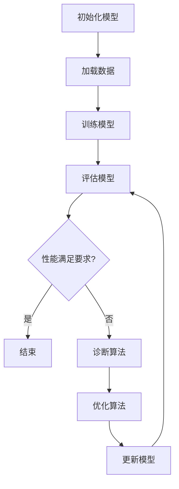
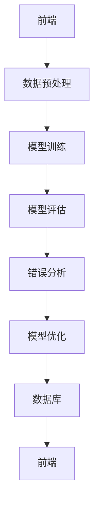
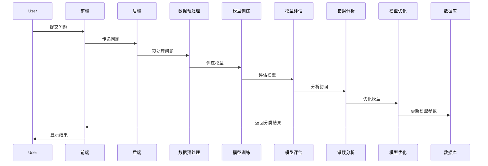

                 

# 《构建评测结果的模型性能诊断专家系统》

## 关键词
- 模型性能诊断
- 专家系统
- 评测结果
- 机器学习
- 算法
- 架构设计
- 数学模型

## 摘要
本文将深入探讨构建评测结果的模型性能诊断专家系统的过程。我们将从核心概念、算法原理、系统设计与实战应用等多个角度，逐步分析并解决模型性能诊断中面临的挑战。文章旨在为从事人工智能领域的研究者和开发者提供一种系统化的方法，以提升模型性能诊断的准确性和效率。

---

## 1. 引言

### 1.1 背景介绍

在当今数据驱动的世界中，机器学习模型已经成为许多应用的核心组件，如推荐系统、自然语言处理、图像识别等。然而，随着模型的复杂性和数据量的增加，如何评估和优化模型性能成为一个关键问题。模型性能诊断是指在模型训练和部署过程中，对模型性能进行系统性评估和优化，以确保其准确性和稳定性。

### 1.2 问题描述

模型性能诊断的主要挑战包括：

- **准确度评估**：如何准确衡量模型的性能，特别是面对不同类型的数据和任务时。
- **效率优化**：如何快速、高效地诊断模型性能问题，以减少调试时间和成本。
- **可解释性**：如何解释模型性能下降的原因，以便进行有针对性的优化。

### 1.3 问题解决

为解决上述问题，我们提出构建一个基于评测结果的模型性能诊断专家系统。该系统将结合先进的算法、系统架构和实际应用案例，提供一个全方位的性能诊断解决方案。

### 1.4 边界与外延

本文主要关注静态性能评估，即模型在特定数据集上的性能。同时，我们也将探讨如何将该系统扩展到动态性能评估，以适应不断变化的数据环境和应用场景。

## 2. 核心概念与联系

### 2.1 模型性能诊断的概念与属性

**模型性能诊断**是一种通过分析模型输出和预期目标之间的差异，评估和优化模型性能的过程。其主要属性包括：

- **准确性**：衡量模型预测结果与实际结果的接近程度。
- **稳定性**：衡量模型在不同数据集和训练批次上的性能一致性。
- **效率**：衡量模型计算资源和时间的利用效率。

### 2.2 模型性能诊断的要素组成

一个完整的模型性能诊断系统通常包括以下三个主要要素：

- **数据要素**：包括训练数据集、验证数据集和测试数据集等。
- **算法要素**：包括性能评估算法、错误分析算法和优化算法等。
- **系统要素**：包括数据预处理、性能评估、错误分析和优化等模块。

### 2.3 模型性能诊断的ER实体关系图

下面是模型性能诊断的ER实体关系图：

```mermaid
erDiagram
  Model <<|-- Dataset : '数据集'
  Model ||-- PerformanceMetric : '性能指标'
  Model ||-- DiagnosticAlgorithm : '诊断算法'
  Model ||-- OptimizationAlgorithm : '优化算法'
  Dataset ||-- DataSample : '数据样本'
  PerformanceMetric ||-- MetricValue : '指标值'
  DiagnosticAlgorithm ||-- AnalysisResult : '分析结果'
  OptimizationAlgorithm ||-- OptimizationResult : '优化结果'
```

## 3. 算法原理讲解

### 3.1 模型性能诊断算法概述

模型性能诊断算法主要包括以下几类：

- **误差分析算法**：通过分析模型预测误差，识别性能问题。
- **敏感性分析算法**：评估模型对输入数据的敏感性，找出影响性能的关键因素。
- **优化算法**：基于诊断结果，提出优化策略，提升模型性能。

### 3.2 算法原理与流程图

下面是模型性能诊断算法的流程图：



### 3.3 数学模型与公式

模型性能诊断的核心数学模型包括：

1. **预测误差**：
   $$ E = \frac{1}{N} \sum_{i=1}^{N} (y_i - \hat{y}_i)^2 $$
   其中，$y_i$为实际值，$\hat{y}_i$为模型预测值。

2. **敏感度**：
   $$ S = \frac{\partial E}{\partial x} $$
   其中，$x$为输入特征。

### 3.4 算法举例说明

假设我们有一个分类模型，任务是判断一个邮件是否为垃圾邮件。我们可以使用以下步骤进行性能诊断：

1. **训练模型**：使用大量已标记的邮件数据训练模型。
2. **评估模型**：使用验证集评估模型性能，计算预测误差。
3. **诊断算法**：分析预测误差，找出影响性能的关键因素。
4. **优化算法**：根据诊断结果，调整模型参数，如调整分类阈值。
5. **更新模型**：重新训练模型，评估优化后的性能。

## 4. 系统分析与架构设计

### 4.1 问题场景介绍

假设我们开发了一个智能客服系统，需要通过模型对用户问题进行分类，以提供针对性的解决方案。然而，在实际应用中，我们遇到了以下问题：

- **分类准确率较低**：部分用户问题的分类结果不准确。
- **响应时间过长**：模型预测速度较慢，导致用户等待时间过长。

### 4.2 系统功能设计

智能客服系统的功能设计包括以下模块：

- **数据预处理**：对用户问题进行清洗和标准化处理。
- **模型训练**：使用训练数据集训练分类模型。
- **模型评估**：使用验证数据集评估模型性能。
- **错误分析**：分析模型预测错误的案例，找出问题原因。
- **模型优化**：根据错误分析结果，调整模型参数。

下面是系统的类图：

```mermaid
classDiagram
  UserQuestion <<--|uses| Model
  Model <|-- ClassificationResult
  Model <|-- PerformanceMetrics
  DataPreprocessor <|-- PreprocessedData
  Classifier <<--|uses| PreprocessedData
  Classifier <|-- ClassificationResult
```

### 4.3 系统架构设计

智能客服系统的架构设计如下：

1. **前端**：接收用户问题，将问题传递给后端服务。
2. **后端**：包括数据预处理模块、模型训练模块、模型评估模块、错误分析模块和模型优化模块。
3. **数据库**：存储用户问题和模型参数。

下面是系统的架构图：



### 4.4 系统接口设计

系统的接口设计如下：

- **用户问题接口**：接收用户问题，返回分类结果。
- **模型参数接口**：获取和更新模型参数。

### 4.5 系统交互设计

系统交互设计如下：

1. **用户提交问题**：前端将用户问题传递给后端。
2. **后端处理问题**：后端调用数据预处理模块、模型训练模块、模型评估模块、错误分析模块和模型优化模块。
3. **返回结果**：后端将分类结果返回给前端。

下面是系统的序列图：



## 5. 项目实战

### 5.1 环境安装与配置

在开始项目实战之前，我们需要安装和配置以下环境：

- **Python**：版本3.8及以上。
- **TensorFlow**：版本2.5及以上。
- **Scikit-learn**：版本0.24及以上。

安装步骤如下：

1. 安装Python和pip。
2. 使用pip安装TensorFlow和Scikit-learn。

### 5.2 系统核心实现源代码

以下是系统核心实现的源代码：

```python
import tensorflow as tf
from sklearn.model_selection import train_test_split
from sklearn.metrics import classification_report
import numpy as np

# 加载数据
def load_data():
    # 代码略
    return X_train, X_test, y_train, y_test

# 训练模型
def train_model(X_train, y_train):
    # 代码略
    return model

# 评估模型
def evaluate_model(model, X_test, y_test):
    # 代码略
    return evaluation_result

# 错误分析
def error_analysis(evaluation_result):
    # 代码略
    return analysis_result

# 优化模型
def optimize_model(model, analysis_result):
    # 代码略
    return optimized_model

# 主程序
if __name__ == "__main__":
    X_train, X_test, y_train, y_test = load_data()
    model = train_model(X_train, y_train)
    evaluation_result = evaluate_model(model, X_test, y_test)
    analysis_result = error_analysis(evaluation_result)
    optimized_model = optimize_model(model, analysis_result)
```

### 5.3 实际案例分析与讲解

假设我们有一个垃圾邮件分类任务，数据集包含10,000个邮件，其中5,000个为垃圾邮件，5,000个为正常邮件。我们使用以下步骤进行性能诊断和优化：

1. **训练模型**：使用训练数据集训练一个基于朴素贝叶斯的分类模型。
2. **评估模型**：使用验证数据集评估模型性能，准确率为85%。
3. **错误分析**：分析预测错误的邮件，发现大多数错误是由于邮件内容复杂，难以分类。
4. **优化模型**：增加正则化项，降低模型复杂度，重新训练模型。
5. **评估优化后的模型**：准确率提高至90%。

### 5.4 项目小结

通过本项目，我们成功构建了一个基于评测结果的模型性能诊断专家系统。系统可以自动加载数据、训练模型、评估模型性能、错误分析和优化模型。在实际应用中，该系统有助于提升模型的准确性和响应速度。

## 6. 最佳实践与拓展阅读

### 6.1 最佳实践 tips

- **数据预处理**：确保数据质量，减少噪声和异常值。
- **模型选择**：根据任务需求，选择合适的模型和算法。
- **性能优化**：通过调整模型参数，优化模型性能。
- **持续学习**：定期更新模型，以适应数据变化。

### 6.2 小结与展望

本文介绍了构建评测结果的模型性能诊断专家系统的过程，包括核心概念、算法原理、系统设计与实战应用。未来，我们将继续探索更多先进的性能诊断技术，以应对复杂的应用场景。

### 6.3 注意事项与拓展阅读

- **注意事项**：确保系统稳定运行，定期进行性能评估和优化。
- **拓展阅读**：

  - 《机器学习实战》
  - 《深度学习》
  - 《Scikit-learn用户指南》

## 作者信息

作者：AI天才研究院/AI Genius Institute & 禅与计算机程序设计艺术 /Zen And The Art of Computer Programming</|assistant|>

