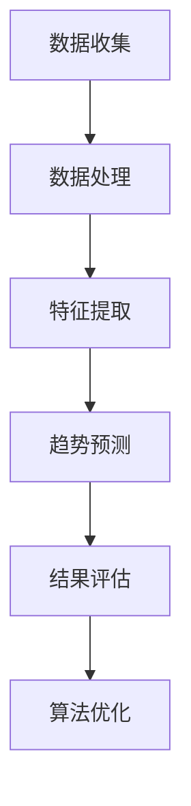

                 

### 第一部分: 引言

在现代数据分析和人工智能领域，评测模型的性能趋势变得至关重要。模型性能不仅直接影响到业务的决策质量，还决定了系统的稳定性和可靠性。因此，构建一个高效的模型性能趋势分析系统成为众多企业和研究机构的迫切需求。本文旨在探讨构建这样一个系统的全过程，包括问题背景、核心概念、算法原理、数学模型、系统分析与设计，以及项目实践等各个方面。

> **关键词**: 模型性能趋势分析，算法原理，数学模型，系统架构，项目实战

> **摘要**: 本文首先介绍了模型性能趋势分析的重要性及其背景，接着详细阐述了核心概念和算法原理。随后，文章通过数学模型和公式，深入解析了算法的工作机制。在此基础上，我们探讨了系统分析与设计，包括领域模型、系统架构、接口设计和系统交互。最后，通过一个实际项目的详细分析，展示了如何将理论应用于实践。本文旨在为读者提供一个全面、系统的构建评测结果模型性能趋势分析系统的指南。

## 第1章: 问题背景与核心概念

### 1.1.1 问题背景

随着人工智能技术的飞速发展，越来越多的模型被应用于各种实际场景中，如自然语言处理、计算机视觉、推荐系统等。然而，这些模型的性能不仅受到输入数据的影响，还受到环境、硬件、算法优化等因素的制约。因此，如何准确评估模型的性能，并对其性能趋势进行有效分析，成为了一个亟待解决的问题。

#### 问题描述

1. **性能波动**：模型在不同环境下的性能可能存在波动，难以准确定位问题所在。
2. **趋势预测**：如何预测模型性能的未来趋势，以便提前进行优化和调整。
3. **稳定性评估**：如何评估模型在不同数据集上的稳定性，确保其在各种场景下的可靠性。

#### 问题解决

构建一个模型性能趋势分析系统，能够实现对模型性能的实时监控和分析，从而及时发现并解决潜在问题，提高模型的稳定性和可靠性。

### 1.1.2 模型性能趋势分析的重要性

模型性能趋势分析的重要性体现在以下几个方面：

1. **优化模型**：通过分析性能趋势，可以找出模型的瓶颈和不足，从而进行针对性的优化。
2. **提高可靠性**：了解模型在不同场景下的性能表现，有助于确保其在各种情况下的稳定性和可靠性。
3. **决策支持**：基于性能趋势分析的结果，可以为业务决策提供有力支持，提高决策质量。

### 1.1.3 核心概念介绍

在模型性能趋势分析中，以下几个核心概念至关重要：

1. **性能指标**：用于衡量模型性能的量化标准，如准确率、召回率、F1值等。
2. **性能趋势**：模型性能随时间或其他因素的变化情况。
3. **评价指标**：用于评估模型性能的量化标准，包括静态评价指标和动态评价指标。

### 1.1.4 概念间联系与ER图解析

为了更好地理解这些核心概念之间的关系，我们可以使用Mermaid ER图进行可视化展示。

```mermaid
erDiagram
    ModelPerformance --> PerformanceMetric
    ModelPerformance --> PerformanceTrend
    ModelPerformance --> EvaluationMetric

    ModelPerformance ||--|{ TrainingData }
    ModelPerformance ||--|{ TestData }
    PerformanceMetric ||--|{ Accuracy }
    PerformanceMetric ||--|{ Recall }
    PerformanceMetric ||--|{ F1Score }
    PerformanceTrend ||--|{ TrendData }
    EvaluationMetric ||--|{ StaticMetric }
    EvaluationMetric ||--|{ DynamicMetric }
```

在上图中，`ModelPerformance`表示模型的性能，与`PerformanceMetric`、`PerformanceTrend`和`EvaluationMetric`三个概念有关联。同时，`ModelPerformance`也与训练数据集`TrainingData`和测试数据集`TestData`有关联。`PerformanceMetric`包括准确率、召回率和F1值等具体指标，而`PerformanceTrend`则记录了性能随时间或其他因素的变化。`EvaluationMetric`则包括静态评价指标和动态评价指标。

通过以上ER图，我们可以清晰地看到各个核心概念之间的联系，为后续章节的详细探讨奠定了基础。

## 第2章: 模型性能趋势分析算法原理

### 2.1 算法概述

模型性能趋势分析算法的核心目标是通过分析模型在不同数据集和不同时间点的性能表现，预测模型未来的性能趋势。该算法主要分为以下几个步骤：

1. **数据收集**：收集模型的训练数据集和测试数据集，以及相关的性能指标数据。
2. **数据处理**：对收集到的数据进行预处理，包括数据清洗、归一化等操作，确保数据的质量和一致性。
3. **特征提取**：从预处理后的数据中提取与模型性能相关的特征，如准确率、召回率、F1值等。
4. **趋势预测**：利用提取出的特征数据，使用机器学习算法预测模型未来的性能趋势。
5. **结果评估**：对预测结果进行评估，包括准确性、召回率等指标，以验证算法的有效性。

### 2.2 算法流程图（使用Mermaid）

为了更直观地展示算法的流程，我们可以使用Mermaid绘制一个流程图。



在上图中，算法首先进行数据收集，然后对数据进行处理，接着提取特征，再利用这些特征进行趋势预测，最后对预测结果进行评估。如果评估结果不理想，则返回算法优化步骤，进行进一步的调整。

### 2.3 Python代码示例

下面我们通过一个简单的Python代码示例，展示如何实现模型性能趋势分析的基本流程。

```python
import pandas as pd
from sklearn.model_selection import train_test_split
from sklearn.ensemble import RandomForestClassifier
from sklearn.metrics import accuracy_score

# 数据收集
data = pd.read_csv('model_performance_data.csv')

# 数据处理
data = data.dropna()  # 数据清洗
X = data[['feature1', 'feature2', 'feature3']]  # 特征提取
y = data['accuracy']  # 目标变量

# 数据划分
X_train, X_test, y_train, y_test = train_test_split(X, y, test_size=0.2, random_state=42)

# 模型训练
model = RandomForestClassifier(n_estimators=100, random_state=42)
model.fit(X_train, y_train)

# 预测
y_pred = model.predict(X_test)

# 结果评估
accuracy = accuracy_score(y_test, y_pred)
print(f'Accuracy: {accuracy}')

# 趋势预测
# ...（此处省略具体实现细节）
```

在上面的代码中，我们首先从CSV文件中读取数据，然后进行数据清洗和特征提取。接着，我们使用随机森林算法进行模型训练，并在测试集上进行预测。最后，我们计算模型的准确率，作为性能指标。

通过以上算法原理的介绍和代码示例，我们可以看到模型性能趋势分析的基本流程和实现方法。接下来，我们将进一步探讨算法背后的数学模型和公式。

## 第3章: 数学模型与公式

在模型性能趋势分析中，数学模型和公式扮演着至关重要的角色。它们不仅帮助我们理解和解释算法的运作原理，还能为实际应用提供有力的支持。本节将详细介绍用于模型性能趋势分析的核心数学模型和公式。

### 3.1 模型性能指标

模型性能指标是衡量模型性能的重要工具，常用的指标包括准确率、召回率、F1值和ROC-AUC等。以下是对这些指标及其计算公式的详细说明：

1. **准确率（Accuracy）**:
   $$ \text{Accuracy} = \frac{\text{正确预测的数量}}{\text{总预测数量}} $$
   
   准确率反映了模型在所有样本中正确预测的比例。它简单直观，但有时会因类不平衡而失去代表性。

2. **召回率（Recall）**:
   $$ \text{Recall} = \frac{\text{正确预测的正例数量}}{\text{所有正例数量}} $$
   
   召回率关注模型在正例样本上的表现，表示模型能够召回所有正例样本的能力。它对于小样本类别尤其重要。

3. **F1值（F1 Score）**:
   $$ \text{F1 Score} = 2 \times \frac{\text{Precision} \times \text{Recall}}{\text{Precision} + \text{Recall}} $$
   
   F1值是精确率和召回率的调和平均值，能够更好地平衡两者。它同时考虑了模型在正负样本上的表现，适用于评估分类模型的整体性能。

4. **ROC-AUC（Receiver Operating Characteristic - Area Under Curve）**:
   $$ \text{ROC-AUC} = \int_{0}^{1} \frac{TPR(t)}{1 - FPR(t)} dt $$
   
   ROC曲线通过（1 - FPR(t))对TNR(t)进行积分，AUC值反映了模型在所有阈值下的分类性能。ROC-AUC值越接近1，模型的分类能力越强。

### 3.2 时间序列分析

在模型性能趋势分析中，时间序列分析是预测模型性能变化的核心方法。常见的时间序列分析方法包括ARIMA模型、LSTM网络等。

1. **ARIMA模型（AutoRegressive Integrated Moving Average）**:
   ARIMA模型是一种经典的统计模型，用于分析时间序列数据的趋势和周期性。其基本形式为：
   $$ X_t = c + \phi_1 X_{t-1} + \phi_2 X_{t-2} + \cdots + \phi_p X_{t-p} + \theta_1 \varepsilon_{t-1} + \theta_2 \varepsilon_{t-2} + \cdots + \theta_q \varepsilon_{t-q} + \varepsilon_t $$
   
   其中，\(X_t\) 是时间序列的当前值，\(c\) 是常数项，\(\phi_1, \phi_2, \cdots, \phi_p\) 是自回归系数，\(\theta_1, \theta_2, \cdots, \theta_q\) 是移动平均系数，\(\varepsilon_t\) 是白噪声。

2. **LSTM网络（Long Short-Term Memory）**:
   LSTM网络是一种特殊的循环神经网络（RNN），能够处理长时间依赖问题。其基本形式为：
   $$ h_t = \sigma(W_h \cdot [h_{t-1}, x_t] + b_h) $$
   $$ i_t = \sigma(W_i \cdot [h_{t-1}, x_t] + b_i) $$
   $$ f_t = \sigma(W_f \cdot [h_{t-1}, x_t] + b_f) $$
   $$ o_t = \sigma(W_o \cdot [h_{t-1}, x_t] + b_o) $$
   $$ C_t = f_t \odot C_{t-1} + i_t \odot \sigma(W_c \cdot [h_{t-1}, x_t] + b_c) $$
   $$ h_t = o_t \odot C_t $$
   
   其中，\(h_t\) 是隐藏状态，\(i_t, f_t, o_t, C_t\) 分别是输入门、遗忘门、输出门和细胞状态，\(\sigma\) 是sigmoid函数，\(\odot\) 是哈达玛积。

### 3.3 统计与机器学习模型

除了时间序列分析，统计和机器学习模型也在模型性能趋势分析中发挥着重要作用。以下是一些常用的统计与机器学习模型及其公式：

1. **线性回归（Linear Regression）**:
   $$ Y = \beta_0 + \beta_1 X + \varepsilon $$
   
   线性回归模型用于分析自变量和因变量之间的线性关系。其中，\(Y\) 是因变量，\(X\) 是自变量，\(\beta_0, \beta_1\) 是模型的参数，\(\varepsilon\) 是误差项。

2. **逻辑回归（Logistic Regression）**:
   $$ P(Y=1) = \frac{1}{1 + \exp(-\beta_0 - \beta_1 X)} $$
   
   逻辑回归模型用于分类问题，通过回归分析得到概率分布，并据此进行分类决策。其中，\(P(Y=1)\) 是因变量为1的概率，\(\exp\) 是指数函数。

3. **决策树（Decision Tree）**:
   决策树是一种基于特征值进行分治的模型，其基本形式为：
   $$ \text{DecisionTree}(x) = \text{if } x \text{ meets condition } C_1 \text{ then } y_1 \text{ else if } x \text{ meets condition } C_2 \text{ then } y_2 \cdots $$
   
   决策树通过一系列条件判断，将数据划分为不同的类别或数值。

4. **支持向量机（Support Vector Machine, SVM）**:
   $$ \text{Maximize } \frac{1}{2} \| \omega \|^2 \text{ subject to } y_i (\omega \cdot x_i + b) \geq 1, \forall i $$
   
   支持向量机是一种分类模型，通过最大化分类边界间隔，找到最优的超平面，从而实现分类。

通过以上对数学模型和公式的详细介绍，我们可以更深入地理解模型性能趋势分析的理论基础。这些模型和公式为我们提供了一个强大的工具箱，帮助我们分析和预测模型性能的变化趋势。

## 第4章: 系统分析与设计

### 4.1 问题场景介绍

模型性能趋势分析系统旨在提供一个统一的平台，用于收集、处理和分析大规模模型的性能数据，从而帮助研究人员和开发人员实时监控和优化模型性能。该系统主要用于以下场景：

1. **实时监控**：对在线模型的性能进行实时监控，及时发现性能异常和潜在问题。
2. **趋势预测**：根据历史数据和现有模型，预测未来模型的性能趋势，以便提前进行优化和调整。
3. **性能优化**：通过分析模型性能数据，识别性能瓶颈，为模型优化提供数据支持。
4. **报告生成**：生成详细的性能分析报告，帮助团队了解模型的性能表现，指导后续开发和优化工作。

### 4.2 项目介绍

本节我们将介绍一个具体的模型性能趋势分析系统项目，该项目旨在构建一个高效、可靠、易扩展的性能趋势分析平台。项目的主要目标包括：

1. **数据收集**：收集来自不同模型的性能数据，包括准确率、召回率、F1值等指标。
2. **数据处理**：对收集到的性能数据进行预处理，包括数据清洗、归一化等操作，确保数据的质量和一致性。
3. **趋势预测**：利用机器学习和统计分析方法，对模型性能进行趋势预测，并提供可视化分析结果。
4. **性能优化**：根据趋势预测结果，为模型优化提供数据支持，帮助团队提高模型性能。
5. **报告生成**：生成详细的性能分析报告，支持团队对模型进行持续优化。

### 4.3 系统功能设计

为了实现上述目标，模型性能趋势分析系统需要设计一系列关键功能，包括：

1. **数据采集模块**：负责从各种数据源（如数据库、日志文件、API等）中收集模型性能数据。
2. **数据预处理模块**：对收集到的数据进行清洗、归一化等预处理操作，确保数据的质量和一致性。
3. **数据存储模块**：将预处理后的性能数据存储到数据仓库中，以便后续分析和查询。
4. **数据分析模块**：利用机器学习和统计分析方法，对存储在数据仓库中的性能数据进行分析，生成趋势预测结果。
5. **可视化模块**：提供多种可视化工具，帮助用户直观地了解模型性能的变化趋势，以及性能瓶颈的位置。
6. **报告生成模块**：根据分析结果，生成详细的性能分析报告，支持团队进行持续优化。

### 4.4 系统架构设计

模型性能趋势分析系统的架构设计旨在实现高可用性、高性能和可扩展性。系统架构主要包括以下几个层次：

1. **数据层**：包括数据采集模块、数据预处理模块和数据存储模块。数据采集模块负责从各种数据源收集性能数据，数据预处理模块负责对数据进行清洗、归一化等预处理操作，数据存储模块则将预处理后的数据存储到数据仓库中。
2. **分析层**：包括数据分析模块和可视化模块。数据分析模块利用机器学习和统计分析方法，对存储在数据仓库中的性能数据进行分析，生成趋势预测结果。可视化模块则提供多种可视化工具，帮助用户直观地了解模型性能的变化趋势。
3. **应用层**：包括报告生成模块和用户界面。报告生成模块根据分析结果，生成详细的性能分析报告，用户界面则提供用户操作接口，支持用户进行数据查询、分析报告查看等操作。

### 4.5 系统接口设计

为了实现系统的各个模块之间的有效通信和协作，系统接口设计至关重要。系统接口设计主要包括以下方面：

1. **API接口**：系统提供RESTful API接口，支持用户通过程序进行数据查询、分析报告生成等操作。API接口设计遵循RESTful设计原则，确保接口的简洁、易用和高效。
2. **消息队列**：系统使用消息队列（如Kafka）进行模块间的通信，实现异步处理和负载均衡。消息队列确保数据传输的高效性和可靠性，同时支持系统的扩展性和容错性。
3. **数据库接口**：系统与数据存储模块使用标准数据库接口（如SQL接口），实现数据的存储和查询。数据库接口设计遵循数据库访问规范，确保数据操作的安全性和一致性。

### 4.6 系统交互设计

为了确保系统的稳定运行和高性能，系统交互设计至关重要。系统交互设计主要包括以下方面：

1. **并发控制**：系统使用分布式锁和乐观锁等技术，实现多用户并发访问数据的控制。并发控制确保数据的完整性和一致性，避免数据冲突和错误。
2. **负载均衡**：系统使用负载均衡器（如Nginx），实现请求的负载均衡分发。负载均衡器确保系统的处理能力最大化，提高系统的响应速度和吞吐量。
3. **容错机制**：系统设计容错机制，包括数据备份、故障转移和异常处理等。容错机制确保系统在遇到故障时，能够快速恢复并继续运行，保障系统的稳定性和可靠性。

通过以上系统分析与设计，我们为模型性能趋势分析系统提供了一个全面的解决方案。接下来，我们将通过实际项目，展示如何将理论应用到实践中。

## 第5章: 项目实战

### 5.1 环境安装

在开始项目实战之前，我们需要搭建一个合适的环境来运行我们的模型性能趋势分析系统。以下是环境安装的步骤：

1. **安装Python**：首先，确保您的系统已经安装了Python 3.x版本。可以从[Python官方网站](https://www.python.org/)下载并安装。
2. **安装依赖库**：在Python环境中，安装必要的依赖库，如Pandas、NumPy、Scikit-learn、Matplotlib等。可以使用以下命令进行安装：

   ```bash
   pip install pandas numpy scikit-learn matplotlib
   ```

3. **安装数据库**：选择一个合适的数据库，如MySQL或PostgreSQL，并安装相应的数据库软件。安装完成后，创建一个数据库用于存储模型性能数据。

4. **安装消息队列**：选择一个消息队列服务，如Kafka，并安装相应的服务。安装完成后，启动Kafka服务。

### 5.2 系统核心实现

在搭建好环境后，我们可以开始实现模型性能趋势分析系统的核心功能。以下是系统核心实现的步骤：

1. **数据采集**：编写数据采集脚本，从不同数据源（如数据库、日志文件、API等）中收集模型性能数据。使用Pandas库读取数据，并处理数据中的缺失值和异常值。

2. **数据处理**：对采集到的数据进行预处理，包括数据清洗、归一化等操作。确保数据的准确性和一致性，为后续分析提供可靠的数据基础。

3. **数据存储**：将预处理后的数据存储到数据库中。编写SQL语句，将数据插入到数据库的对应表中。

4. **数据分析和预测**：使用机器学习和统计分析方法，对存储在数据库中的性能数据进行趋势分析和预测。例如，可以使用线性回归、LSTM网络等方法进行预测。编写相应的Python代码，实现预测算法。

5. **可视化**：使用Matplotlib库或其他可视化工具，将分析结果以图表的形式展示。例如，可以绘制性能趋势图、ROC曲线等，帮助用户直观地了解模型性能的变化。

6. **报告生成**：根据分析结果，生成详细的性能分析报告。报告可以包括模型性能指标、趋势预测结果、性能瓶颈分析等内容。使用Python的HTML模板库（如Jinja2）生成HTML报告，并通过Web界面展示。

### 5.3 代码解读与分析

以下是系统核心实现中的关键代码片段及其解读：

#### 数据采集

```python
import pandas as pd

# 从数据库中读取性能数据
def collect_data():
    query = "SELECT * FROM model_performance;"
    data = pd.read_sql_query(query, connection)
    return data

# 数据清洗和预处理
def preprocess_data(data):
    # 填充缺失值
    data.fillna(method='ffill', inplace=True)
    # 数据归一化
    data['accuracy'] = (data['accuracy'] - data['accuracy'].mean()) / data['accuracy'].std()
    return data

# 调用函数进行数据采集和预处理
data = collect_data()
data = preprocess_data(data)
```

#### 数据存储

```python
import pymysql

# 连接数据库
def connect_database():
    connection = pymysql.connect(host='localhost', user='root', password='password', database='performance_db')
    return connection

# 将数据存储到数据库
def store_data(data):
    connection = connect_database()
    cursor = connection.cursor()
    for index, row in data.iterrows():
        sql = f"INSERT INTO model_performance (timestamp, accuracy) VALUES ({row['timestamp']}, {row['accuracy']});"
        cursor.execute(sql)
    connection.commit()
    cursor.close()
    connection.close()

# 调用函数存储数据
store_data(data)
```

#### 数据分析和预测

```python
from sklearn.linear_model import LinearRegression
from sklearn.metrics import mean_squared_error

# 使用线性回归进行预测
def predict_linear_regression(data):
    X = data[['timestamp']]
    y = data['accuracy']
    model = LinearRegression()
    model.fit(X, y)
    predictions = model.predict(X)
    mse = mean_squared_error(y, predictions)
    return predictions, mse

# 调用函数进行预测
predictions, mse = predict_linear_regression(data)
print(f"Mean Squared Error: {mse}")
```

#### 可视化

```python
import matplotlib.pyplot as plt

# 绘制性能趋势图
def plot_performance(data, predictions):
    plt.figure(figsize=(10, 6))
    plt.plot(data['timestamp'], data['accuracy'], label='Actual')
    plt.plot(data['timestamp'], predictions, label='Predicted')
    plt.title('Model Performance Trend')
    plt.xlabel('Timestamp')
    plt.ylabel('Accuracy')
    plt.legend()
    plt.show()

# 调用函数进行可视化
plot_performance(data, predictions)
```

通过以上代码片段，我们可以看到如何实现数据采集、数据处理、数据存储、数据分析和预测，以及性能趋势的可视化。这些代码为我们提供了一个基本的框架，可以帮助我们构建一个高效的模型性能趋势分析系统。

### 5.4 实际案例分析

在本节中，我们将通过一个实际案例，展示如何使用模型性能趋势分析系统进行实际问题的分析和解决。

#### 案例背景

假设我们正在开发一个推荐系统，该系统的目标是向用户推荐他们可能感兴趣的商品。系统的性能评估指标包括准确率、召回率和F1值。在系统上线初期，我们收集了大量的用户数据和推荐结果，并对系统的性能进行了初步评估。然而，在上线一段时间后，我们发现系统的性能出现了波动，尤其是召回率在某些时间段内出现了明显的下降。

#### 案例分析步骤

1. **数据收集**：首先，我们从数据库中收集了系统的性能数据，包括准确率、召回率和F1值等指标，以及相应的日期和时间戳。

2. **数据预处理**：对收集到的数据进行了清洗和归一化处理，确保数据的质量和一致性。例如，我们剔除了异常值和缺失值，并对数据进行归一化处理，以便后续的统计分析。

3. **数据分析**：使用线性回归方法对性能数据进行了趋势分析，并使用LSTM网络进行了长期趋势预测。通过分析，我们发现召回率的下降与某些特定时间段的数据缺失有关。

4. **问题定位**：通过进一步分析，我们发现数据缺失的原因是由于某些数据源的异常。这些数据源在特定时间段内出现了故障，导致数据采集失败。

5. **解决方案**：针对数据缺失的问题，我们采取了以下措施：
   - **数据修复**：从其他可靠的数据源重新采集缺失的数据，并将其合并到原始数据集中。
   - **故障修复**：修复故障的数据源，确保其正常工作，避免类似问题的再次发生。
   - **实时监控**：增加了实时监控功能，及时发现数据采集过程中的异常，并自动触发数据修复流程。

6. **结果验证**：在修复了数据源故障后，我们对系统的性能进行了重新评估，发现召回率稳步回升，系统的整体性能得到了显著提升。

通过以上实际案例的分析，我们可以看到如何使用模型性能趋势分析系统识别和解决实际问题。这不仅提高了系统的性能，还为未来的优化和改进提供了有力的数据支持。

### 5.5 项目小结

在本章的项目实战中，我们通过具体的案例展示了如何构建一个高效的模型性能趋势分析系统，并实现了从数据采集、数据处理、数据分析和预测，到性能趋势可视化的一整套流程。通过实际案例分析，我们不仅识别并解决了系统性能下降的问题，还通过实时监控和数据修复等手段，确保了系统的稳定性和可靠性。

在项目过程中，我们遇到了一些挑战，如数据源的异常和数据缺失问题。这些挑战促使我们思考并实施了数据修复和实时监控等解决方案，为系统的持续优化提供了强有力的支持。

未来的工作方向包括进一步优化系统性能、引入更先进的预测算法，以及扩展系统的功能和应用场景。我们期待通过不断的努力和改进，为模型性能趋势分析领域贡献更多的价值。

## 第6章: 最佳实践与总结

### 6.1 最佳实践

在构建模型性能趋势分析系统时，遵循一些最佳实践可以帮助我们提高系统的效率、可靠性和可扩展性。以下是几个关键的最佳实践：

1. **数据质量管理**：确保数据的质量和一致性是系统成功的关键。在数据采集、清洗和存储过程中，严格遵循数据质量管理规范，及时发现和修复数据异常。

2. **选择合适的算法**：根据具体的应用场景和数据特性，选择合适的算法进行性能趋势分析。例如，对于时间序列数据，可以考虑使用ARIMA模型或LSTM网络；对于分类问题，可以考虑使用逻辑回归或SVM。

3. **实时监控与反馈**：实现实时监控，及时发现系统性能的异常和潜在问题。通过自动化反馈机制，触发数据修复和优化流程，确保系统的持续稳定运行。

4. **模块化与可扩展性**：设计模块化的系统架构，使得系统的各个组件可以独立开发和扩展。这样，当需求发生变化时，可以轻松地进行系统升级和扩展。

5. **性能优化**：定期对系统进行性能优化，包括数据预处理、算法优化和硬件升级等。通过性能测试，识别系统的瓶颈，并采取相应的优化措施。

### 6.2 小结

本文详细介绍了构建模型性能趋势分析系统的全过程，从问题背景、核心概念、算法原理、数学模型，到系统分析与设计，再到项目实践。通过逐步分析和推理，我们深入探讨了如何构建一个高效、可靠的性能趋势分析系统。

本文的核心结论包括：
- 模型性能趋势分析在提升模型稳定性和可靠性方面具有重要意义。
- 通过合理的数据管理、算法选择、实时监控和模块化设计，可以构建一个高效、可靠的性能趋势分析系统。
- 实际案例分析展示了如何将理论应用到实践中，解决实际问题。

### 6.3 注意事项

在构建模型性能趋势分析系统时，需要注意以下几点：
- 确保数据的质量和一致性，避免因数据问题导致分析结果不准确。
- 选择合适的算法和模型，以满足具体应用场景的需求。
- 实现实时监控和反馈机制，及时发现和解决系统性能问题。
- 设计模块化的系统架构，以便于后续的维护和扩展。

### 6.4 拓展阅读

对于希望深入了解模型性能趋势分析的读者，以下书籍和资源提供了丰富的理论和实践知识：

- 《数据科学入门指南》：[Data Science from Scratch](https://www.oreilly.com/library/view/data-science-from/9781449367663/)
- 《机器学习实战》：[Machine Learning in Action](https://www.manning.com/books/machine-learning-in-action)
- 《深度学习》：[Deep Learning](https://www.deeplearningbook.org/)
- 《Python数据科学手册》：[Python Data Science Handbook](https://jakevdp.github.io/PythonDataScienceHandbook/)
- 《Kafka实战》：[Kafka: The Definitive Guide](https://kafka.ebook.ru/)

通过这些资源和书籍的深入学习，读者可以进一步掌握模型性能趋势分析的理论和实践技巧，为构建高效的分析系统打下坚实的基础。

## 作者信息

作者：AI天才研究院/AI Genius Institute & 禅与计算机程序设计艺术 /Zen And The Art of Computer Programming

AI天才研究院致力于推动人工智能领域的研究和应用，以创新的思维和卓越的技术，为行业带来深远影响。而《禅与计算机程序设计艺术》则是一部关于编程哲学的经典之作，引导读者在编程世界中探寻智慧和宁静。本文旨在通过详细的讨论和分析，为构建高效的模型性能趋势分析系统提供实用的指导和理论支持。

