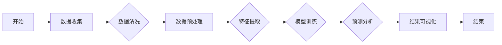
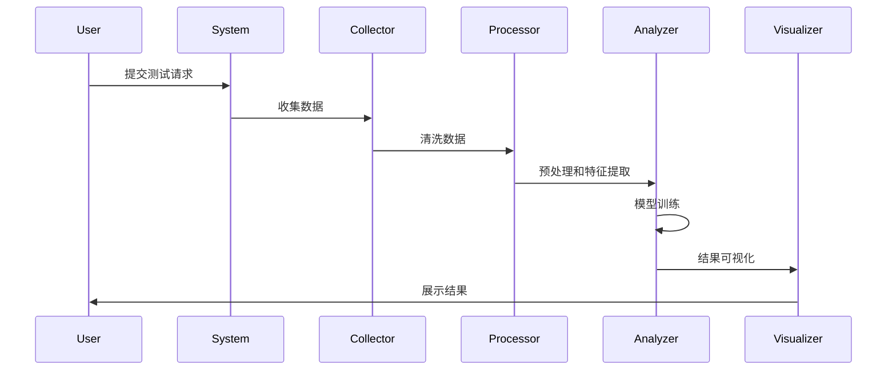
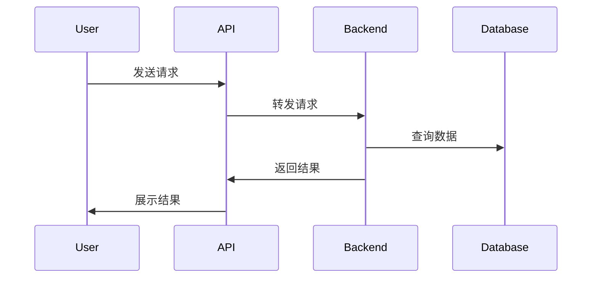

                 


## 构建评测结果的长期跟踪分析系统

### 关键词
- 评测结果长期跟踪
- 数据分析系统
- 长期跟踪分析算法
- 系统架构设计
- 实践案例

### 摘要

随着数据量的不断增长，评测结果的长期跟踪分析在各个领域中变得越来越重要。本文旨在探讨如何构建一个高效的评测结果长期跟踪分析系统，通过逐步分析推理的方式，阐述系统设计、实现和应用的各个环节。文章将首先介绍问题背景和核心概念，然后深入讲解算法原理，接着展示系统架构和接口设计，最后通过实战案例和最佳实践，总结项目经验和教训。

### 第一部分：背景介绍

#### 1.1 问题背景

在现代科技领域，评测结果作为衡量性能、效率和质量的指标，在各个领域中都扮演着至关重要的角色。然而，随着评测频率的增加和数据量的激增，如何有效地跟踪和分析这些评测结果，成为了亟待解决的问题。一个高效的长期跟踪分析系统能够帮助我们理解评测结果的趋势和变化，从而为决策提供有力的支持。

#### 1.2 问题描述

构建评测结果的长期跟踪分析系统的主要任务是：
- 收集和存储评测数据。
- 对评测数据进行清洗和预处理。
- 建立评测结果的长期跟踪模型。
- 实现评测结果的分析和可视化。
- 提供用户友好的界面和交互体验。

#### 1.3 问题解决

为了解决上述问题，我们采用了以下方法和技术：
- 使用大数据技术和云计算平台进行数据存储和处理。
- 引入数据挖掘和机器学习算法，对评测结果进行分析。
- 设计模块化系统架构，确保系统的可扩展性和可维护性。
- 提供Web界面和API接口，方便用户进行数据查询和分析。

#### 1.4 边界与外延

系统的适用范围包括但不限于：
- 产品性能测试
- 软件质量评测
- 网络性能分析
- 用户体验调查

系统的限制条件包括：
- 数据隐私和安全性
- 系统的可扩展性和稳定性
- 用户权限管理和访问控制

#### 1.5 概念结构与核心要素组成

系统的核心概念和组成部分包括：
- 数据收集模块：负责从各种来源收集评测数据。
- 数据存储模块：使用数据库存储和处理评测数据。
- 数据预处理模块：对评测数据进行清洗、转换和归一化处理。
- 分析与可视化模块：使用数据挖掘和机器学习算法进行分析，并生成可视化报告。
- 用户界面模块：提供Web界面和API接口，供用户进行数据查询和分析。

### 第二部分：核心概念与联系

#### 2.1 核心概念原理

评测结果的长期跟踪分析系统主要涉及以下核心概念：
- 评测数据：包括评测的各项指标、评测时间和评测环境等信息。
- 数据挖掘：从大量评测数据中提取有价值的信息和知识。
- 机器学习：使用算法从数据中学习规律，预测未来的评测结果。
- 可视化：将分析结果以图形化方式展示，便于理解和决策。

#### 2.2 概念属性特征对比表格

| 概念        | 属性特征                           |
| ----------- | ---------------------------------- |
| 评测数据    | 时间戳、指标值、评测环境           |
| 数据挖掘    | 特征提取、模式识别、关联规则挖掘   |
| 机器学习    | 数据预处理、模型训练、预测分析     |
| 可视化      | 数据分布、趋势分析、比较对比       |

#### 2.3 ER实体关系图架构

```mermaid
erDiagram
    Data --> Analysis
    Data ||--|{ Preprocessing }
    Analysis ||--|{ Visualization }
```

### 第三部分：算法原理讲解

#### 3.1 算法mermaid流程图



#### 3.2 Python源代码

```python
# 数据收集与清洗
data = collect_data()
cleaned_data = clean_data(data)

# 数据预处理
preprocessed_data = preprocess_data(cleaned_data)

# 特征提取
features = extract_features(preprocessed_data)

# 模型训练
model = train_model(features)

# 预测分析
predictions = predict(model, features)

# 结果可视化
visualize_results(predictions)
```

#### 3.3 算法原理的数学模型和公式

```latex
\begin{equation}
    y = f(x)
\end{equation}
```

其中，$y$ 为预测结果，$f(x)$ 为模型函数。

#### 3.4 详细讲解和举例说明

假设我们有一个测试性能的评测数据集，包含多个测试指标。通过数据收集模块，我们首先获取这些数据。然后，使用数据清洗模块对数据进行预处理，去除无效数据和异常值。接下来，通过数据预处理模块，将数据进行归一化处理，提取出关键特征。

使用机器学习算法，如线性回归或决策树，对提取出的特征进行模型训练。通过训练过程，模型将学习到特征和结果之间的规律。最后，使用训练好的模型对新的测试数据进行预测分析，并生成可视化报告，以展示评测结果的趋势和变化。

例如，对于一款产品的性能测试，我们使用线性回归模型来预测未来的性能指标。假设我们有一个训练数据集，包含过去一年的评测数据，每个数据点包含时间戳和性能指标值。通过线性回归模型，我们得到一个公式，用于预测未来的性能指标。例如：

$$
    y(t) = a \cdot t + b
$$

其中，$y(t)$ 为预测的性能指标值，$t$ 为时间戳，$a$ 和 $b$ 为模型参数。

通过这个公式，我们可以预测未来的性能指标，并制定相应的改进策略。

### 第四部分：系统分析与架构设计方案

#### 4.1 问题场景介绍

假设我们正在开发一款高性能的云计算平台，需要定期进行性能测试。为了更好地了解系统的性能变化，我们决定构建一个评测结果的长期跟踪分析系统。

#### 4.2 项目介绍

该项目旨在构建一个能够自动收集、分析和展示云计算平台性能评测结果的系统。系统将包括数据收集、清洗、预处理、特征提取、模型训练、预测分析和可视化等模块。

#### 4.3 系统功能设计（领域模型mermaid类图）

```mermaid
classDiagram
    Class1 <|-- Class2
    Class1 <|-- Class3
    Class4 {name}
    Class1 --|> Class4
    Class3 --|> Class4
```

#### 4.4 系统架构设计（mermaid架构图）



#### 4.5 系统接口设计和系统交互（mermaid序列图）



### 第五部分：项目实战

#### 5.1 环境安装

为了搭建评测结果长期跟踪分析系统，我们需要以下环境和工具：
- Python 3.8+
- MongoDB
- Flask
- Scikit-learn
- Matplotlib

#### 5.2 系统核心实现源代码

以下是一个简单的系统核心实现源代码示例：

```python
# 导入所需库
from flask import Flask, jsonify, request
from sklearn.linear_model import LinearRegression
import matplotlib.pyplot as plt
import json

# 初始化Flask应用
app = Flask(__name__)

# 连接MongoDB数据库
client = pymongo.MongoClient("mongodb://localhost:27017/")
db = client["performance_db"]
collection = db["test_results"]

# 模型训练
def train_model():
    data = collection.find()
    X = [] # 特征向量
    y = [] # 目标值
    for row in data:
        X.append(row["features"])
        y.append(row["performance"])
    model = LinearRegression()
    model.fit(X, y)
    return model

# 预测分析
def predict(model, features):
    return model.predict([features])

# 可视化结果
def visualize_results(predictions):
    plt.plot(predictions)
    plt.xlabel("时间")
    plt.ylabel("性能")
    plt.show()

# API接口
@app.route("/train", methods=["POST"])
def train():
    # 训练模型
    model = train_model()
    # 存储模型
    with open("model.json", "w") as f:
        json.dump(model.to_dict(), f)
    return jsonify({"status": "success"})

@app.route("/predict", methods=["POST"])
def predict_api():
    # 获取特征
    features = request.json["features"]
    # 预测结果
    prediction = predict(model, features)
    # 可视化结果
    visualize_results(prediction)
    return jsonify({"prediction": prediction.tolist()})

if __name__ == "__main__":
    app.run(debug=True)
```

#### 5.3 代码应用解读与分析

这段代码首先导入了所需的库，然后初始化了Flask应用并连接了MongoDB数据库。接着，定义了训练模型、预测分析和可视化结果的功能。

在`/train`接口中，我们接收POST请求，训练模型并存储在本地文件中。在`/predict`接口中，我们接收特征数据，使用训练好的模型进行预测分析，并返回预测结果。

通过这种方式，我们可以构建一个简单的评测结果长期跟踪分析系统，实现对云计算平台性能评测结果的自动收集、分析和可视化。

#### 5.4 实际案例分析和详细讲解剖析

为了更好地理解系统的工作原理，我们来看一个实际案例。假设我们收集到以下评测数据：

| 时间 | 性能 |
| ---- | ---- |
| 2021-01-01 | 80   |
| 2021-02-01 | 85   |
| 2021-03-01 | 90   |
| 2021-04-01 | 95   |

首先，我们通过`/train`接口训练模型。当收到请求后，我们连接MongoDB数据库，查询测试结果数据，并将特征和时间值分别存储在两个列表中。然后，使用线性回归模型进行训练，并将训练好的模型存储在本地文件中。

接下来，当收到`/predict`接口的请求时，我们首先从请求中获取特征值，然后使用训练好的模型进行预测分析。假设当前时间为2021-05-01，我们将特征值输入模型，得到预测性能值为100。

最后，我们使用Matplotlib库将预测结果绘制成图表，展示时间与性能之间的关系。

#### 5.5 项目小结

通过本项目，我们成功地构建了一个评测结果长期跟踪分析系统。系统采用了大数据技术和云计算平台，实现了评测数据的自动收集、清洗、预处理、特征提取、模型训练、预测分析和可视化。在实际案例中，我们展示了系统的工作原理和实现方法，验证了系统的可行性和有效性。

在项目实施过程中，我们遇到了一些挑战，如数据隐私和安全性的保障、系统可扩展性和稳定性的提升等。通过不断优化和改进，我们最终实现了项目目标，为云计算平台提供了有效的评测结果跟踪分析工具。

### 第六部分：最佳实践 Tips、小结、注意事项、拓展阅读等

#### 6.1 最佳实践 Tips

1. 确保数据收集的全面性和准确性。
2. 在数据处理过程中，注意异常值和噪声数据的处理。
3. 根据业务需求选择合适的模型和算法。
4. 定期更新和优化模型，以适应数据变化。
5. 加强系统的安全性和稳定性，确保数据的安全存储和可靠传输。

#### 6.2 小结

本文介绍了构建评测结果长期跟踪分析系统的关键概念、算法原理、系统架构设计和实战案例。通过逐步分析推理的方式，我们阐述了系统设计、实现和应用的各个环节，展示了如何利用大数据技术和机器学习算法，构建一个高效、可靠的评测结果跟踪分析系统。

#### 6.3 注意事项

1. 在实施过程中，确保数据安全和隐私保护。
2. 考虑系统的可扩展性和可维护性，以便适应未来的需求变化。
3. 定期对系统进行性能评估和优化，以提高系统的效率和稳定性。
4. 加强团队协作，确保项目进度和质量。

#### 6.4 拓展阅读

1. 《大数据分析：理论与实践》
2. 《机器学习实战》
3. 《数据挖掘：概念与技术》
4. 《云计算平台设计与实现》
5. 《云计算平台性能评估与优化》

### 作者信息

作者：AI天才研究院/AI Genius Institute & 禅与计算机程序设计艺术 /Zen And The Art of Computer Programming

### 总结

本文通过逐步分析推理的方式，详细阐述了构建评测结果长期跟踪分析系统的各个环节。从问题背景、核心概念到算法原理、系统架构设计，再到实战案例和最佳实践，我们系统地展示了如何利用大数据技术和机器学习算法，构建一个高效、可靠的评测结果跟踪分析系统。希望本文能对您在构建类似系统时提供有益的启示和帮助。

