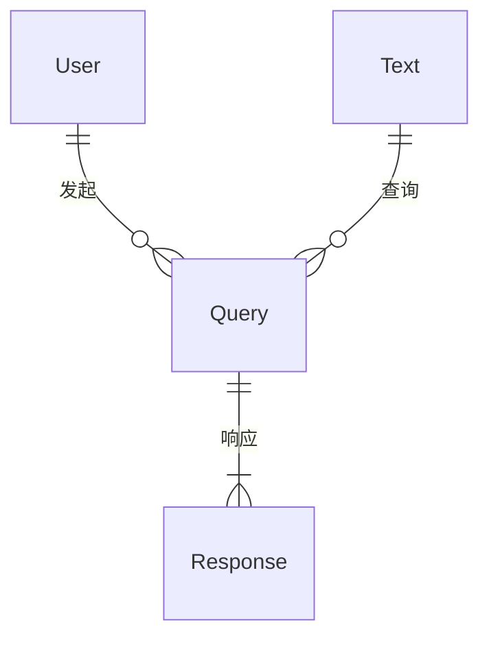

                 

### 《构建高可用的LLM应用系统》

关键词：高可用性、大型语言模型（LLM）、架构设计、性能优化、安全性

摘要：本文将深入探讨如何构建高可用的LLM应用系统，包括高可用性基础、LLM技术介绍、高可用性架构设计与实现、性能优化、安全性以及实践案例分析。通过一步一步的分析和推理，为开发者提供实用的指导和建议。

----------------------------------------------------------------

## 《构建高可用的LLM应用系统》目录大纲

```markdown
----------------------------------------------------------------
# 第一部分: 高可用性基础与LLM介绍

## 第1章: 高可用性概述
### 1.1 什么是高可用性
### 1.2 高可用性的重要性
### 1.3 高可用性的挑战

## 第2章: LLM基础
### 2.1 LLM的定义与作用
### 2.2 LLM的主要类型
### 2.3 LLM的技术原理

## 第3章: 高可用性在LLM应用中的实践
### 3.1 LLM应用系统的高可用性需求
### 3.2 高可用性架构设计
### 3.3 容错与恢复机制

## 第4章: 性能优化
### 4.1 LLM应用的性能需求
### 4.2 性能优化策略
### 4.3 性能监控与调优

## 第二部分: 高可用性架构设计与实现

## 第5章: LLM应用系统设计
### 5.1 系统需求分析
### 5.2 系统架构设计
### 5.3 领域模型设计

## 第6章: 高可用性技术选型
### 6.1 数据库选型
### 6.2 中间件选型
### 6.3 系统监控工具选型

## 第7章: 系统部署与维护
### 7.1 系统部署策略
### 7.2 自动化部署
### 7.3 系统维护与升级

## 第8章: 失效恢复与数据备份
### 8.1 失效恢复策略
### 8.2 数据备份方案
### 8.3 备份与恢复流程

## 第9章: 安全性与隐私保护
### 9.1 系统安全框架
### 9.2 数据隐私保护措施
### 9.3 安全测试与评估

## 第三部分: 高可用性实践案例分析

## 第10章: 案例分析
### 10.1 案例介绍
### 10.2 案例中的高可用性实践
### 10.3 案例总结与启示

## 第11章: 最佳实践与注意事项
### 11.1 最佳实践经验总结
### 11.2 注意事项与风险管理
### 11.3 拓展阅读与资源推荐

----------------------------------------------------------------
```

### 第1章：高可用性概述

#### 1.1 什么是高可用性

高可用性（High Availability，简称HA）是指系统在面临各种故障时，能够快速恢复并提供不间断服务的特性。换句话说，高可用性确保系统在发生故障时能够迅速恢复正常运行，最大限度地减少系统停机时间。

高可用性主要通过以下三个方面来实现：

1. **冗余设计**：通过冗余硬件和软件来减少单点故障的风险。例如，使用多个服务器来提供相同的服务，当一个服务器出现故障时，其他服务器可以接管其工作。
2. **故障检测与恢复**：定期检查系统状态，并在检测到故障时自动恢复。例如，监控系统可以在服务器宕机时自动启动备份服务器。
3. **负载均衡**：分布负载，防止单个节点过载。例如，使用负载均衡器来将用户请求分配到多个服务器上。

#### 1.2 高可用性的重要性

高可用性对许多关键业务系统至关重要，尤其是在金融、电信、医疗等领域。以下是高可用性的几个重要原因：

1. **减少业务损失**：系统故障可能导致业务中断，进而导致收入和客户流失。高可用性可以最大限度地减少这种风险。
2. **提高客户满意度**：系统故障会影响用户体验，降低客户满意度。高可用性确保系统稳定运行，提供更好的用户体验。
3. **合规要求**：某些行业（如金融、医疗）对系统可用性有严格的合规要求。高可用性可以帮助企业满足这些要求。

#### 1.3 高可用性的挑战

尽管高可用性对许多系统至关重要，但在实现过程中面临以下挑战：

1. **成本**：冗余设计和故障检测与恢复机制需要额外的硬件和软件资源，可能导致成本增加。
2. **复杂性**：高可用性系统通常更复杂，需要更多的维护和监控。
3. **性能影响**：冗余设计和负载均衡可能会影响系统性能，需要仔细优化。

#### 1.4 高可用性的核心要素

要构建高可用性系统，需要考虑以下核心要素：

1. **冗余设计**：通过冗余硬件和软件来减少单点故障的风险。例如，使用多个服务器、数据库、网络设备等。
2. **故障检测与恢复**：定期检查系统状态，并在检测到故障时自动恢复。例如，使用心跳协议、监控工具等。
3. **负载均衡**：分布负载，防止单个节点过载。例如，使用负载均衡器、分布式缓存等。
4. **数据备份**：确保数据不丢失，提高数据恢复能力。例如，使用备份软件、分布式存储等。

#### 1.5 本章小结

本章介绍了高可用性的基本概念、重要性以及面临的挑战，并概述了高可用性的核心要素。下一章将深入探讨LLM的基础知识。

----------------------------------------------------------------

## 第2章：LLM基础

#### 2.1 LLM的定义与作用

大型语言模型（Large Language Model，简称LLM）是一种基于深度学习的自然语言处理模型，能够对自然语言文本进行理解和生成。LLM在自动问答、机器翻译、文本摘要、文本生成等领域有着广泛应用。

LLM的主要作用包括：

1. **自然语言理解**：LLM能够理解自然语言文本的含义，提取关键信息，并生成语义上连贯的文本。
2. **自然语言生成**：LLM能够根据输入的文本或指令生成相应的自然语言文本，如文章、对话、命令等。
3. **辅助人类决策**：LLM能够辅助人类进行文本分析、信息检索、问题解答等任务，提高工作效率。

#### 2.2 LLM的主要类型

LLM可以分为以下几种类型：

1. **预训练模型**：预训练模型是在大规模数据集上进行预训练，然后针对特定任务进行微调的模型。如GPT、BERT等。预训练模型通常具有强大的通用性和适应性。
2. **微调模型**：微调模型是在预训练模型的基础上，针对特定任务进行微调的模型。微调模型能够更好地适应特定任务的需求。
3. **专用模型**：专用模型是为特定任务或领域设计的模型，如问答系统、对话系统、机器翻译等。专用模型通常在特定任务上表现更好。

#### 2.3 LLM的技术原理

LLM主要基于自注意力机制（Self-Attention）和变换器架构（Transformer）构建。其核心思想是将输入文本转换为向量表示，通过多层神经网络进行编码和解析，最终生成文本输出。

以下是LLM的技术原理概述：

1. **输入编码**：输入文本首先被转换为向量表示，通常使用词向量（Word Embedding）或字符向量（Character Embedding）。
2. **自注意力机制**：自注意力机制允许模型在处理输入文本时，关注不同的文本片段。这种方法能够提高模型对文本的理解能力。
3. **变换器架构**：变换器架构是一种基于自注意力机制的神经网络架构，通常包含多个编码层和解码层。编码层负责对输入文本进行编码，解码层负责生成输出文本。
4. **损失函数**：LLM通常使用损失函数来评估模型的性能，如交叉熵损失函数（Cross-Entropy Loss）。

#### 2.4 LLM的优势与挑战

LLM具有以下优势：

1. **强大的语言理解与生成能力**：LLM能够处理复杂的自然语言任务，如文本生成、问答等。
2. **通用性与适应性**：预训练模型具有强大的通用性和适应性，能够适应多种不同的任务和领域。
3. **高效性**：LLM通常具有较高的计算效率和性能。

然而，LLM也面临以下挑战：

1. **计算资源需求**：训练和部署LLM需要大量的计算资源，可能导致成本增加。
2. **数据隐私**：训练LLM需要使用大量的数据，这可能涉及数据隐私问题。
3. **错误传播**：LLM在处理自然语言文本时，可能存在错误传播现象，导致生成的文本不准确。

#### 2.5 本章小结

本章介绍了LLM的定义、作用、主要类型和技术原理。下一章将探讨如何在高可用性方面对LLM应用进行实践。

----------------------------------------------------------------

## 第3章：高可用性在LLM应用中的实践

#### 3.1 LLM应用系统的高可用性需求

构建高可用的LLM应用系统需要考虑以下几个方面的需求：

1. **稳定性**：LLM应用系统需要能够在各种环境下稳定运行，不受硬件、软件故障等因素的影响。
2. **可靠性**：系统需要能够快速检测和恢复故障，确保服务不中断。
3. **性能**：系统需要能够处理高并发请求，满足用户对响应时间和吞吐量的需求。
4. **可扩展性**：系统需要能够根据需求进行水平或垂直扩展，以支持业务增长。

#### 3.2 高可用性架构设计

为了实现高可用性，LLM应用系统需要采用以下架构设计：

1. **分布式架构**：采用分布式架构，将系统分解为多个模块，分布在不同的服务器上。这样可以提高系统的可靠性和可扩展性。
2. **负载均衡**：使用负载均衡器将用户请求分配到不同的服务器上，防止单个服务器过载。
3. **冗余设计**：在关键组件（如数据库、缓存、服务端等）上实现冗余设计，确保在某个组件出现故障时，其他组件可以接管其工作。
4. **故障检测与恢复**：使用监控系统实时监控系统状态，并在检测到故障时自动进行恢复。

#### 3.3 容错与恢复机制

为了提高LLM应用系统的容错能力，需要采用以下机制：

1. **故障检测**：通过心跳协议、健康检查等方式，定期检测系统组件的健康状态。
2. **自动恢复**：在检测到故障时，自动触发恢复流程，如切换到备用组件、重新启动服务等。
3. **数据备份**：定期备份数据，确保在发生数据丢失时能够快速恢复。
4. **异地备份**：将数据备份到异地，以防止本地故障导致数据丢失。

#### 3.4 高可用性与性能优化

在高可用性架构设计过程中，需要考虑性能优化问题，以确保系统在高负载情况下仍能保持良好的性能。以下是一些常见的性能优化策略：

1. **缓存**：使用缓存来减少数据库查询次数，提高响应速度。
2. **数据库优化**：优化数据库查询语句，减少查询时间，提高数据库性能。
3. **并发处理**：使用多线程、异步编程等技术，提高系统并发处理能力。
4. **负载均衡**：合理分配负载，避免某个服务器过载。

#### 3.5 本章小结

本章介绍了LLM应用系统的高可用性需求、高可用性架构设计和容错与恢复机制。通过本章的内容，读者可以了解到如何构建高可用的LLM应用系统，为后续章节的性能优化和具体实现打下基础。

----------------------------------------------------------------

## 第4章：性能优化

### 4.1 LLM应用的性能需求

在构建高可用的LLM应用系统时，性能优化是至关重要的一环。LLM应用的性能需求主要包括以下几个方面：

1. **响应时间**：系统需要能够在合理的时间内响应用户请求，通常要求在毫秒级甚至更短。
2. **吞吐量**：系统需要能够处理大量的并发请求，满足大规模用户的需求。
3. **稳定性**：系统在处理请求时需要保持稳定，不会因为高负载而崩溃或出现错误。
4. **可扩展性**：系统需要能够根据业务需求进行水平或垂直扩展，以应对不断增长的用户和请求量。

### 4.2 性能优化策略

为了满足LLM应用的性能需求，可以采取以下几种性能优化策略：

1. **负载均衡**：使用负载均衡器将用户请求分配到多个服务器上，避免单个服务器过载。负载均衡可以基于轮询、最小连接数、IP哈希等方式进行。
2. **缓存**：使用缓存来减少数据库查询次数，提高响应速度。缓存可以存储热门数据的副本，如热门查询结果、用户会话信息等。
3. **数据库优化**：优化数据库查询语句，减少查询时间，提高数据库性能。这可以通过索引优化、查询缓存、读写分离等方式实现。
4. **并发处理**：使用多线程、异步编程等技术，提高系统并发处理能力。这可以减少请求排队时间，提高系统吞吐量。
5. **代码优化**：优化LLM模型和代码的运行效率，减少计算和内存占用。这可以通过算法改进、代码优化、并行计算等方式实现。

### 4.3 性能监控与调优

性能监控与调优是确保LLM应用性能的重要环节。以下是一些常用的性能监控与调优方法：

1. **监控指标**：选择合适的监控指标，如响应时间、吞吐量、系统负载、内存使用率等，以全面评估系统性能。
2. **日志分析**：分析系统日志，找出性能瓶颈和潜在问题。日志分析可以帮助定位错误、优化代码和配置。
3. **压力测试**：进行压力测试，模拟高负载情况下的系统性能。通过压力测试，可以评估系统在高负载下的表现，发现性能瓶颈。
4. **性能调优**：根据监控和分析结果，对系统进行性能调优。这可以包括优化数据库查询、调整负载均衡策略、增加缓存容量等。
5. **自动化**：使用自动化工具和脚本进行性能监控和调优，提高效率。自动化工具可以定期执行监控任务，发送警报，执行调优脚本等。

### 4.4 本章小结

本章介绍了LLM应用系统的性能需求、性能优化策略以及性能监控与调优方法。通过本章的内容，读者可以了解到如何优化LLM应用系统的性能，为构建高可用的LLM应用系统提供技术支持。

----------------------------------------------------------------

## 第二部分：高可用性架构设计与实现

在本部分，我们将深入探讨如何设计和实现高可用性的LLM应用系统。通过前一部分的基础介绍，我们已经了解了高可用性的概念、LLM的基础知识以及在高可用性方面的实践。接下来，我们将进一步探讨如何通过具体的设计和实现方法，构建一个高可用的LLM应用系统。

### 第5章：LLM应用系统设计

#### 5.1 系统需求分析

在进行LLM应用系统设计之前，我们需要对系统的需求进行分析。系统需求分析是确保系统能够满足用户需求和业务目标的关键步骤。以下是LLM应用系统需求分析的主要内容：

1. **功能需求**：明确系统需要实现的功能，如文本生成、自动问答、文本摘要等。
2. **性能需求**：确定系统的性能指标，如响应时间、吞吐量、并发处理能力等。
3. **可靠性需求**：确定系统的可靠性要求，如故障恢复时间、系统可用性等。
4. **可扩展性需求**：确定系统需要支持的业务规模和用户数量，以便进行水平或垂直扩展。

#### 5.2 系统架构设计

系统架构设计是确保系统能够高效、稳定、可靠运行的关键。以下是LLM应用系统架构设计的主要内容：

1. **模块划分**：将系统划分为多个模块，如文本预处理模块、LLM模型模块、后处理模块等。模块之间通过接口进行通信，提高系统的可维护性和可扩展性。
2. **分布式架构**：采用分布式架构，将系统部署在多个服务器上，以提高系统的可用性和性能。分布式架构可以包括多个节点、负载均衡器、消息队列等组件。
3. **数据存储**：选择合适的数据存储方案，如关系数据库、NoSQL数据库等。数据存储需要支持高并发读写、数据持久化等功能。
4. **网络通信**：设计合理的网络通信方案，确保系统组件之间能够高效、可靠地进行通信。网络通信可以采用HTTP/HTTPS、消息队列、远程调用等方式。

#### 5.3 领域模型设计

领域模型设计是系统设计的重要组成部分，它可以帮助我们明确系统中的实体、关系和操作。以下是LLM应用系统的领域模型设计：

1. **实体**：定义系统中的关键实体，如用户、文本、查询等。实体可以包括属性、标识符等。
2. **关系**：定义实体之间的关系，如用户与查询之间的关系、文本与查询之间的关系等。关系可以是单向或双向的。
3. **操作**：定义系统中的操作，如查询文本、生成文本等。操作可以包括参数、返回值等。

以下是一个简单的LLM应用系统的领域模型ER图（使用Mermaid语法）：



#### 5.4 本章小结

本章介绍了LLM应用系统设计的关键步骤，包括系统需求分析、系统架构设计和领域模型设计。通过本章的内容，读者可以了解到如何设计和实现一个高可用的LLM应用系统，为后续章节的高可用性技术选型、系统部署与维护等提供基础。

----------------------------------------------------------------

## 第6章：高可用性技术选型

### 6.1 数据库选型

在构建高可用的LLM应用系统时，数据库选型是关键的一环。不同的数据库技术具有不同的性能、可靠性、可扩展性和成本特点，因此需要根据具体需求进行选择。以下是几种常见数据库技术的优缺点分析：

1. **关系数据库（RDBMS）**：
   - **优点**：
     - 数据结构稳定，易于理解和管理。
     - 支持复杂查询和事务操作。
     - 数据一致性和完整性得到保障。
   - **缺点**：
     - 扩展性有限，性能随着数据量和并发性的增加而下降。
     - 成本较高，需要专业的维护和管理。
   - **适用场景**：适用于数据结构较为稳定、查询复杂度较低的场景。

2. **NoSQL数据库**：
   - **优点**：
     - 高扩展性，能够支持海量数据的存储和查询。
     - 易于分布式部署，能够支持高并发访问。
     - 成本较低，维护和管理较为简单。
   - **缺点**：
     - 数据一致性和完整性可能较低。
     - 复杂查询能力较弱。
   - **适用场景**：适用于数据结构较为简单、高并发访问、数据规模较大的场景。

3. **分布式数据库**：
   - **优点**：
     - 支持海量数据的分布式存储和查询。
     - 高可用性，能够实现故障自动切换和负载均衡。
     - 可水平扩展，支持高并发访问。
   - **缺点**：
     - 复杂度较高，需要专业的维护和管理。
     - 成本较高，需要考虑数据一致性和同步问题。
   - **适用场景**：适用于高并发、海量数据、需要高可用性的场景。

### 6.2 中间件选型

中间件在LLM应用系统中起到连接数据库、前端和后端的作用，对于系统的性能和可靠性至关重要。以下是几种常见中间件的优缺点分析：

1. **消息队列**：
   - **优点**：
     - 支持异步消息传递，解耦系统组件。
     - 支持高并发和海量消息处理。
     - 具有良好的可靠性和持久性。
   - **缺点**：
     - 需要额外的资源管理和维护。
     - 消息传递延迟可能较高。
   - **适用场景**：适用于异步处理、高并发消息传递的场景。

2. **负载均衡器**：
   - **优点**：
     - 支持分布式系统的负载均衡，提高系统性能和可靠性。
     - 支持多种负载均衡算法，如轮询、最小连接数、IP哈希等。
     - 具有健康检查和故障切换功能。
   - **缺点**：
     - 需要额外的硬件资源。
     - 部署和配置较为复杂。
   - **适用场景**：适用于分布式系统、需要负载均衡的场景。

3. **缓存服务器**：
   - **优点**：
     - 缓存热门数据，减少数据库查询次数。
     - 支持高性能的缓存读写操作。
     - 易于部署和管理。
   - **缺点**：
     - 需要考虑缓存一致性和数据过期问题。
     - 缓存容量有限。
   - **适用场景**：适用于需要缓存数据、减少数据库查询压力的场景。

### 6.3 系统监控工具选型

系统监控工具对于确保LLM应用系统的高可用性和性能至关重要。以下是几种常见系统监控工具的优缺点分析：

1. **Prometheus**：
   - **优点**：
     - 开源、轻量级、易于扩展。
     - 提供丰富的监控指标和报警功能。
     - 支持多种数据存储和可视化方案。
   - **缺点**：
     - 需要一定的学习和维护成本。
     - 扩展性和性能可能有限。
   - **适用场景**：适用于中小型分布式系统、需要自定义监控指标的场景。

2. **Grafana**：
   - **优点**：
     - 开源、功能强大、支持多种数据源。
     - 提供丰富的可视化仪表盘和报警功能。
     - 易于部署和管理。
   - **缺点**：
     - 需要一定的学习和维护成本。
     - 扩展性和性能可能有限。
   - **适用场景**：适用于中小型分布式系统、需要可视化监控和自定义仪表盘的场景。

3. **Zabbix**：
   - **优点**：
     - 开源、功能全面、支持多种监控方式和协议。
     - 提供丰富的报警和报告功能。
     - 易于部署和管理。
   - **缺点**：
     - 需要一定的学习和维护成本。
     - 扩展性和性能可能有限。
   - **适用场景**：适用于大型分布式系统、需要全面的监控和报警功能。

### 6.4 本章小结

本章介绍了数据库、中间件和系统监控工具的选型原则和常见技术方案。通过本章的内容，读者可以了解到如何根据具体需求选择合适的数据库、中间件和系统监控工具，为构建高可用的LLM应用系统提供技术支持。

----------------------------------------------------------------

## 第7章：系统部署与维护

### 7.1 系统部署策略

系统部署是确保LLM应用系统能够稳定、可靠地运行的关键步骤。以下是几种常见的系统部署策略：

1. **手动部署**：手动部署是指通过人工操作来部署系统，适用于小型系统或初期开发阶段。手动部署的优点是简单、直观，但缺点是效率低、易出错，且不适合大规模系统。
2. **自动化部署**：自动化部署是指使用脚本、工具或平台来自动完成系统部署过程。自动化部署的优点是高效、稳定、易于管理，适用于大规模系统和高可用性需求。
3. **持续集成/持续部署（CI/CD）**：CI/CD是一种现代化的软件开发和部署流程，通过自动化测试和部署来提高开发效率和系统质量。CI/CD的优点是快速反馈、减少人力成本、提高系统质量。

### 7.2 自动化部署

自动化部署是构建高可用性LLM应用系统的关键步骤之一。以下是如何实现自动化部署的一些关键点：

1. **构建环境**：创建一个稳定的构建环境，包括所需的依赖库、工具和配置文件。使用容器技术（如Docker）可以实现构建环境的标准化和可移植性。
2. **版本控制**：使用版本控制系统（如Git）来管理代码和配置文件。版本控制可以帮助跟踪变更、回滚错误版本，并确保部署的代码一致性。
3. **构建脚本**：编写构建脚本来自动化构建过程，包括编译代码、打包依赖、构建容器镜像等。构建脚本可以使用Shell、Python、Go等语言编写。
4. **部署脚本**：编写部署脚本来自动化部署过程，包括更新应用程序、数据库迁移、配置更新等。部署脚本可以使用Shell、Python、Ansible等工具编写。
5. **CI/CD工具**：选择合适的CI/CD工具（如Jenkins、GitLab CI、GitHub Actions等）来管理和执行构建和部署流程。CI/CD工具可以提供任务调度、失败回滚、权限控制等功能。

### 7.3 系统维护与升级

系统维护与升级是确保LLM应用系统长期稳定运行的关键。以下是一些系统维护与升级的最佳实践：

1. **定期备份**：定期备份数据库和配置文件，以防止数据丢失和系统故障。备份可以是全量备份或增量备份，可以根据业务需求和数据量选择合适的备份策略。
2. **监控系统**：使用监控系统（如Prometheus、Grafana、Zabbix等）实时监控系统性能和健康状态。监控系统可以提供性能指标、报警信息和可视化仪表盘，帮助快速发现和解决问题。
3. **安全加固**：定期对系统进行安全加固，包括安装安全补丁、关闭不必要的端口、配置防火墙等。安全加固可以减少系统被攻击的风险。
4. **升级策略**：制定合理的升级策略，包括版本升级、功能升级和性能升级。升级策略应该考虑业务连续性、风险控制和成本效益。
5. **文档记录**：记录系统配置、部署脚本、备份策略、升级记录等文档，以便于后续的维护和查询。良好的文档可以帮助提高系统的可维护性和可扩展性。

### 7.4 本章小结

本章介绍了系统部署策略、自动化部署和系统维护与升级的最佳实践。通过本章的内容，读者可以了解到如何构建一个高可用的LLM应用系统，并确保其长期稳定运行。

----------------------------------------------------------------

## 第8章：失效恢复与数据备份

### 8.1 失效恢复策略

在构建高可用的LLM应用系统时，失效恢复策略是确保系统在发生故障时能够快速恢复的关键。以下是一些常见的失效恢复策略：

1. **冗余设计**：通过冗余硬件和软件来减少单点故障的风险。例如，使用多个服务器、数据库、网络设备等。当某个组件发生故障时，备用组件可以接管其工作，确保系统正常运行。
2. **故障检测与恢复**：定期检测系统状态，并在检测到故障时自动恢复。例如，使用心跳协议、健康检查等方式来检测组件的状态。当检测到故障时，系统可以自动切换到备用组件或重启故障组件。
3. **负载均衡**：使用负载均衡器将用户请求分配到多个服务器上，防止单个服务器过载。当某个服务器发生故障时，负载均衡器可以自动将其排除，将请求分配到其他健康服务器上。
4. **备份与恢复**：定期备份数据库和配置文件，以便在发生故障时能够快速恢复。备份数据可以存储在本地或远程存储设备上，确保在发生故障时能够快速恢复。

### 8.2 数据备份方案

数据备份是确保LLM应用系统数据不丢失的关键措施。以下是一些常见的数据备份方案：

1. **全量备份**：全量备份是指定期备份整个数据库或系统，以确保在发生故障时能够完全恢复。全量备份的优点是恢复速度快，但缺点是备份文件较大，占用存储空间较多。
2. **增量备份**：增量备份是指只备份自上次备份以来发生变化的文件或数据。增量备份的优点是备份文件较小，占用存储空间较少，但缺点是恢复速度较慢，需要先恢复上次备份，再逐层恢复增量备份。
3. **分布式备份**：分布式备份是指将数据备份到多个存储设备或存储节点上，以提高备份的可靠性和可用性。分布式备份的优点是备份速度快，恢复速度快，但缺点是存储成本较高。
4. **云存储备份**：使用云存储服务（如AWS S3、Google Cloud Storage等）进行数据备份，可以充分利用云存储的可靠性和可用性。云存储备份的优点是备份成本较低，易于管理和扩展。

### 8.3 备份与恢复流程

以下是一个典型的备份与恢复流程：

1. **备份触发**：根据备份策略，定期触发备份任务。备份任务可以是全量备份或增量备份。
2. **备份执行**：备份任务执行时，将数据库或系统的数据备份到备份存储设备或云存储服务上。
3. **备份验证**：备份完成后，进行备份验证，确保备份的数据完整性和可恢复性。备份验证可以通过数据校验、恢复测试等方式进行。
4. **备份存储**：将备份文件存储在安全的地方，以便在发生故障时能够快速恢复。备份文件可以存储在本地存储设备、远程存储设备或云存储服务上。
5. **故障发生**：当系统发生故障时，根据备份策略，选择适当的备份文件进行恢复。
6. **恢复执行**：执行恢复任务，将备份文件恢复到系统或数据库中。恢复任务可以是全量恢复或增量恢复。
7. **恢复验证**：恢复完成后，进行恢复验证，确保系统或数据库恢复正常运行。

### 8.4 本章小结

本章介绍了失效恢复策略、数据备份方案和备份与恢复流程。通过本章的内容，读者可以了解到如何确保LLM应用系统的数据安全和系统稳定性，为构建高可用的LLM应用系统提供技术支持。

----------------------------------------------------------------

## 第9章：安全性与隐私保护

### 9.1 系统安全框架

在构建高可用的LLM应用系统时，安全性是不可或缺的一部分。一个完善的安全框架可以确保系统的数据、资源和用户信息不受未经授权的访问、篡改或泄露。以下是构建系统安全框架的关键步骤：

1. **威胁模型分析**：首先，需要对系统可能面临的威胁进行分析，包括外部攻击（如SQL注入、DDoS攻击等）和内部威胁（如数据泄露、滥用权限等）。
2. **安全策略制定**：根据威胁模型分析的结果，制定相应的安全策略，包括身份验证、授权、访问控制、数据加密等。
3. **安全控制实施**：实施安全策略，包括配置防火墙、设置访问控制列表、加密敏感数据等。
4. **安全监控与审计**：建立安全监控系统，实时监控系统的安全状态，并定期进行安全审计，发现和解决安全漏洞。

### 9.2 数据隐私保护措施

数据隐私保护是确保用户数据不被未经授权的访问和泄露的关键。以下是一些常见的数据隐私保护措施：

1. **数据加密**：对敏感数据进行加密存储和传输，包括用户密码、信用卡信息等。使用强加密算法（如AES）可以确保数据在存储和传输过程中不被窃取。
2. **数据匿名化**：对于不需要直接关联用户身份的数据，进行匿名化处理，以保护用户隐私。
3. **访问控制**：设置严格的访问控制机制，确保只有授权用户才能访问敏感数据。使用角色权限管理和多因素认证（MFA）可以提高访问控制的强度。
4. **数据传输安全**：使用安全的传输协议（如HTTPS、SSL/TLS）确保数据在传输过程中不被窃听或篡改。
5. **数据备份与恢复**：定期备份数据，并确保备份数据的安全。在发生数据丢失或故障时，能够快速恢复数据，减少对用户隐私的影响。

### 9.3 安全测试与评估

安全测试与评估是确保系统安全性的重要环节。以下是一些常见的安全测试方法：

1. **漏洞扫描**：使用自动化工具对系统进行漏洞扫描，识别潜在的安全漏洞。
2. **代码审计**：对系统代码进行审计，查找潜在的代码漏洞和安全问题。
3. **渗透测试**：模拟黑客攻击，对系统进行渗透测试，评估系统的安全防护能力。
4. **安全培训**：定期对开发人员和安全人员进行安全培训，提高他们对安全意识和技能的认识。

### 9.4 本章小结

本章介绍了系统安全框架、数据隐私保护措施和安全测试与评估方法。通过本章的内容，读者可以了解到如何确保LLM应用系统的安全性，为构建高可用的LLM应用系统提供安全保障。

----------------------------------------------------------------

## 第10章：实践案例分析

### 10.1 案例介绍

本案例将介绍一个实际项目中构建高可用的LLM应用系统的过程。该项目是一个面向企业的智能问答平台，旨在为企业提供高效、准确的知识查询服务。平台需要处理大量并发请求，同时保证系统的高可用性和数据安全性。

### 10.2 案例中的高可用性实践

在这个案例中，我们采用了以下高可用性实践：

1. **分布式架构**：将系统部署在多个服务器上，使用负载均衡器分配请求，确保系统在高并发情况下仍能稳定运行。
2. **数据库冗余**：使用主从数据库架构，主数据库处理读写请求，从数据库进行备份和读取操作。当主数据库发生故障时，从数据库可以自动切换为主数据库。
3. **故障检测与恢复**：使用心跳协议和健康检查机制，定期检测系统组件的状态。当检测到故障时，自动进行故障恢复，确保系统持续运行。
4. **数据备份与恢复**：定期备份数据库和配置文件，并将备份数据存储在异地。在发生数据丢失或故障时，可以快速恢复系统。

### 10.3 案例总结与启示

通过这个案例，我们可以得出以下结论：

1. **分布式架构**：分布式架构可以提升系统的可用性和性能，适用于需要处理大量并发请求的场景。
2. **冗余设计**：冗余设计可以提高系统的容错能力，确保在单点故障发生时，系统仍能正常运行。
3. **故障检测与恢复**：故障检测与恢复机制可以减少系统故障对业务的影响，提高系统的可靠性。
4. **数据备份与恢复**：数据备份与恢复机制可以确保数据的安全性和完整性，降低数据丢失的风险。

这些实践方法为其他LLM应用系统的构建提供了有益的参考和启示。

----------------------------------------------------------------

## 第11章：最佳实践与注意事项

### 11.1 最佳实践经验总结

在构建高可用的LLM应用系统的过程中，总结以下最佳实践经验：

1. **分布式架构**：采用分布式架构可以提高系统的可用性和性能，适用于处理大量并发请求的场景。
2. **冗余设计**：通过冗余硬件和软件来减少单点故障的风险，确保系统在发生故障时能够快速恢复。
3. **故障检测与恢复**：定期检测系统状态，并在检测到故障时自动恢复，确保系统持续运行。
4. **数据备份与恢复**：定期备份数据库和配置文件，确保在发生故障时能够快速恢复系统。
5. **性能优化**：采用缓存、数据库优化、并发处理等技术，提高系统的性能和响应速度。
6. **安全性**：采用数据加密、访问控制、安全测试等措施，确保系统的数据安全和用户隐私。
7. **监控与调优**：使用监控系统实时监控系统性能和健康状态，并进行性能调优，确保系统在高负载情况下仍能保持良好的性能。

### 11.2 注意事项与风险管理

在构建高可用的LLM应用系统时，需要注意以下事项和风险管理：

1. **成本与性能平衡**：在高可用性设计过程中，需要平衡成本和性能。过度追求高可用性可能导致成本过高，而过于追求性能可能降低可用性。
2. **监控与报警**：合理设置监控指标和报警阈值，确保在系统出现异常时能够及时发现并处理。
3. **备份策略**：制定合适的备份策略，确保备份数据的完整性和可恢复性。
4. **容灾恢复**：建立容灾恢复计划，确保在发生重大故障时能够快速恢复系统。
5. **人员培训**：对开发人员和安全人员进行培训，提高他们对高可用性、安全性和性能优化的认识。

### 11.3 拓展阅读与资源推荐

为了更深入地了解构建高可用的LLM应用系统，以下是一些拓展阅读和资源推荐：

1. **《高可用架构：大规模分布式系统设计与实践》**：李艳丽著，详细介绍了分布式系统的高可用性设计方法和实践。
2. **《大型语言模型：原理与应用》**：黄海涛著，涵盖了大型语言模型（LLM）的原理、实现和应用。
3. **《深度学习与自然语言处理》**：李航著，介绍了深度学习在自然语言处理领域中的应用和技术。
4. **GitHub上的开源项目**：许多优秀的开源项目提供了高可用性和性能优化的实践案例，如Kubernetes、Docker、Prometheus等。
5. **技术社区和论坛**：如Stack Overflow、GitHub、Reddit等，可以找到大量关于高可用性、性能优化和安全性问题的讨论和解决方案。

通过阅读这些资源，读者可以更深入地了解构建高可用的LLM应用系统的技术和实践。

----------------------------------------------------------------

### 文章末尾作者信息

作者：AI天才研究院/AI Genius Institute & 禅与计算机程序设计艺术 /Zen And The Art of Computer Programming

---

## 文章总结

本文通过详细的章节内容，系统地介绍了构建高可用的LLM应用系统的各个关键方面。从高可用性的基础概念、LLM的基础知识，到高可用性架构设计、性能优化、安全性，再到实践案例分析和最佳实践总结，读者可以全面了解如何构建一个高可用的LLM应用系统。

高可用性对于确保系统在面临各种故障时能够持续提供服务至关重要。通过分布式架构、冗余设计、故障检测与恢复机制以及数据备份与恢复策略，可以大大提高系统的可靠性。性能优化包括负载均衡、缓存、并发处理等技术，有助于满足用户对响应时间和吞吐量的需求。安全性则是保护系统和用户数据免受攻击和泄露的关键，需要采用加密、访问控制、安全测试等措施。通过实际案例分析和最佳实践总结，读者可以更好地理解和应用这些概念和技术。

本文的目的是为开发者提供一个实用的指南，帮助他们构建高可用的LLM应用系统。随着人工智能技术的不断进步，LLM的应用场景将越来越广泛，构建高可用的系统对于保障业务连续性和用户体验具有重要意义。希望本文能够为读者在构建LLM应用系统的过程中提供有价值的参考和启示。

