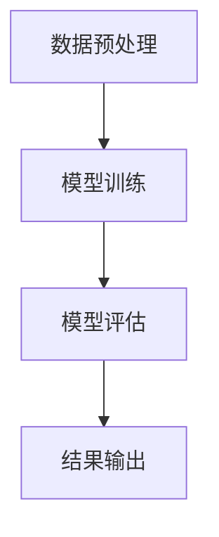
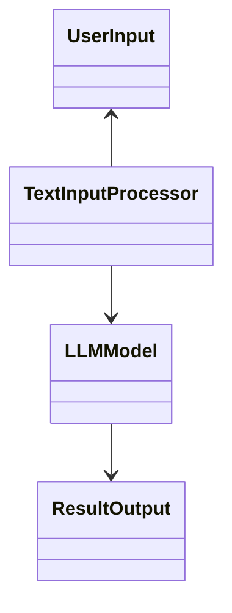
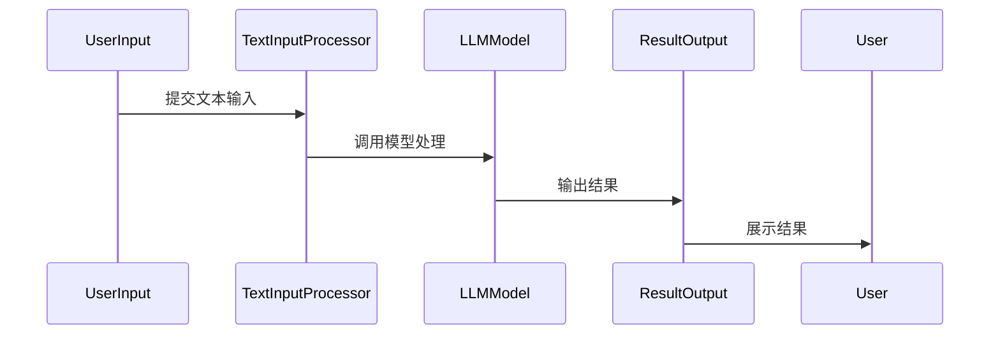
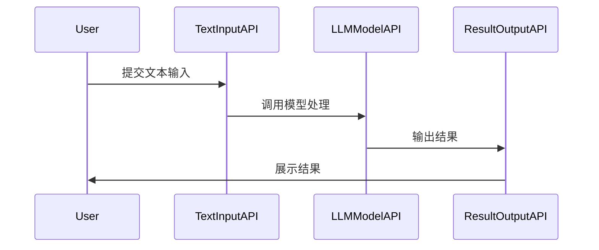
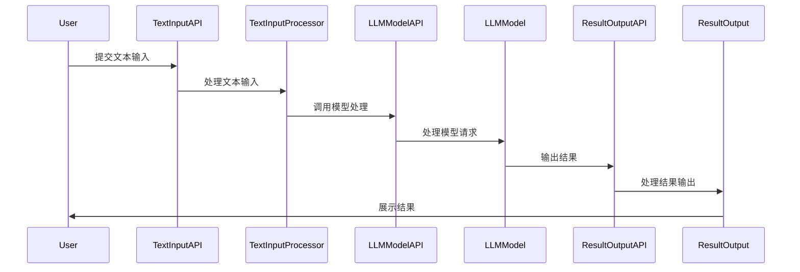
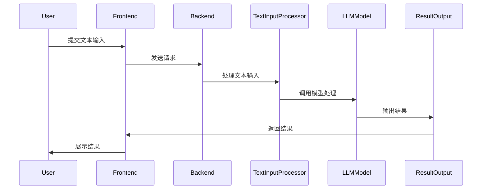
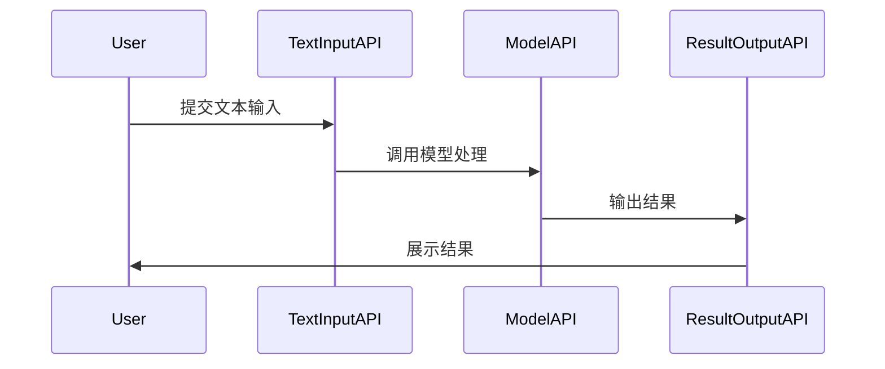

                 

# 构建高效LLM应用开发架构的关键策略

## 关键词

- **大型语言模型（LLM）**
- **应用开发架构**
- **算法原理**
- **系统设计**
- **最佳实践**

## 摘要

本文旨在探讨构建高效大型语言模型（LLM）应用开发架构的关键策略。通过逻辑清晰、结构紧凑的分析，本文将详细阐述LLM的核心概念、应用开发算法原理、系统架构设计以及项目实战经验，旨在为开发者提供一套系统的开发框架，以提升LLM应用的性能和可扩展性。本文还将分享最佳实践和注意事项，以帮助读者在LLM开发过程中规避常见陷阱。

## 目录大纲

----------------------------------------------------------------

### 第一部分：背景介绍

#### 第1章：构建高效LLM应用开发架构的背景

1.1 问题背景

1.2 问题描述

1.3 问题解决

1.4 概念结构与核心要素组成

#### 第2章：LLM核心概念与联系

2.1 LLM的定义与特点

2.2 LLM的核心原理

2.3 LLM的应用领域

2.4 LLM与相关技术的联系

### 第二部分：LLM应用开发算法原理讲解

#### 第3章：LLM应用开发算法原理讲解

3.1 算法原理与Mermaid流程图

3.2 Python源代码阐述

3.3 数学模型与公式

3.4 举例说明

### 第三部分：系统分析与架构设计方案

#### 第4章：系统分析与架构设计方案

4.1 问题场景介绍

4.2 系统功能设计

4.3 系统架构设计

4.4 系统接口设计

4.5 系统交互

### 第四部分：项目实战

#### 第5章：项目实战

5.1 环境安装

5.2 系统核心实现源代码

5.3 代码应用解读与分析

5.4 实际案例分析与详细讲解

5.5 项目小结

### 第五部分：最佳实践与拓展

#### 第6章：最佳实践与拓展

6.1 最佳实践

6.2 注意事项

6.3 拓展阅读

### 第六部分：总结与展望

#### 第7章：总结与展望

7.1 总结

7.2 展望

----------------------------------------------------------------

## 第一部分：背景介绍

### 第1章：构建高效LLM应用开发架构的背景

#### 1.1 问题背景

近年来，人工智能（AI）技术取得了显著进展，特别是在自然语言处理（NLP）领域。大型语言模型（LLM）作为NLP的核心技术，已经在诸多领域展现了强大的应用潜力。LLM通过学习海量文本数据，能够生成流畅、准确的文本，广泛应用于聊天机器人、文本生成、机器翻译、问答系统等。然而，随着LLM的规模不断扩大，如何构建高效、可扩展的应用开发架构成为了一个关键问题。

#### 1.2 问题描述

在构建高效LLM应用开发架构的过程中，开发者面临以下几个挑战：

- **架构设计面临的挑战**：如何设计一个既高效又可扩展的架构，以支持大规模的LLM模型和应用？
- **开发流程的优化**：如何简化开发流程，提高开发效率和代码可维护性？
- **资源管理与优化**：如何合理分配计算资源，降低成本，同时保证模型的性能和可扩展性？

#### 1.3 问题解决

为了解决上述问题，我们需要采取一系列关键策略，包括：

- **模块化设计**：将系统划分为多个功能模块，每个模块独立开发、测试和部署，提高系统的可维护性和扩展性。
- **微服务架构**：采用微服务架构，将系统拆分成多个小的、自治的服务，每个服务负责特定的功能，通过API进行通信，提高系统的灵活性和可扩展性。
- **自动化部署与监控**：利用CI/CD工具实现自动化部署，结合监控工具进行系统性能监控，确保系统的稳定运行。
- **资源调度与优化**：采用高效的资源调度策略，如动态扩展、负载均衡等，优化计算资源的使用，降低成本。

#### 1.4 概念结构与核心要素组成

构建高效LLM应用开发架构，需要关注以下几个核心要素：

- **LLM模型**：作为核心组件，LLM模型需要具备良好的性能和可扩展性，支持在线和离线训练。
- **数据处理**：数据预处理和后处理是保障LLM模型性能的关键，包括数据清洗、标注、格式化等。
- **接口设计**：API接口设计需要简洁明了，便于外部系统集成和使用。
- **服务化架构**：将各个功能模块服务化，提高系统的灵活性和可扩展性。
- **性能优化**：包括算法优化、代码优化、网络优化等，以提高系统的性能和响应速度。
- **安全性**：确保系统的安全性和数据的隐私保护。

### 第2章：LLM核心概念与联系

#### 2.1 LLM的定义与特点

大型语言模型（Large Language Model，LLM）是一种基于深度学习技术构建的自然语言处理模型。它通过学习海量文本数据，能够生成高质量的自然语言文本。LLM具有以下特点：

- **大规模**：LLM通常包含数十亿到数万亿个参数，规模远超传统的NLP模型。
- **通用性**：LLM能够处理多种语言任务，如文本分类、命名实体识别、机器翻译等。
- **自适应性**：LLM能够根据输入文本的内容和上下文，生成符合语境的文本。

#### 2.2 LLM的核心原理

LLM的核心原理主要包括：

- **神经网络结构**：LLM通常基于Transformer架构，这是一种基于自注意力机制的深度神经网络。
- **自注意力机制**：自注意力机制允许模型在处理每个单词时，自动权衡与该单词相关联的其他单词的重要性。
- **梯度下降法**：梯度下降法是一种常用的优化算法，用于最小化模型损失函数，提高模型性能。

#### 2.3 LLM的应用领域

LLM在多个领域具有广泛的应用，包括：

- **NLP应用**：如文本生成、机器翻译、情感分析、问答系统等。
- **产业应用**：如智能客服、智能推荐、智能写作、智能搜索等。

#### 2.4 LLM与相关技术的联系

LLM与以下相关技术密切相关：

- **深度学习**：深度学习为LLM提供了强大的理论基础和计算能力。
- **机器学习**：机器学习算法，如梯度下降法，是训练LLM的重要工具。

### 第3章：LLM应用开发算法原理讲解

#### 3.1 算法原理与Mermaid流程图

LLM应用开发的算法原理主要涉及以下几个方面：

- **数据预处理**：包括数据清洗、分词、去停用词等。
- **模型训练**：使用自注意力机制和梯度下降法训练模型。
- **模型评估**：使用交叉验证、准确率、F1值等指标评估模型性能。

以下是算法原理的Mermaid流程图：



#### 3.2 Python源代码阐述

以下是一个简单的Python源代码示例，用于阐述LLM应用开发的算法原理：

```python
import torch
import torch.nn as nn
import torch.optim as optim

# 数据预处理
def preprocess_data(data):
    # 数据清洗、分词、去停用词等操作
    return processed_data

# 模型训练
def train_model(model, data, optimizer, criterion):
    for epoch in range(num_epochs):
        for inputs, targets in data:
            optimizer.zero_grad()
            outputs = model(inputs)
            loss = criterion(outputs, targets)
            loss.backward()
            optimizer.step()
            print(f"Epoch [{epoch+1}/{num_epochs}], Loss: {loss.item():.4f}")

# 模型评估
def evaluate_model(model, data, criterion):
    with torch.no_grad():
        correct = 0
        total = 0
        for inputs, targets in data:
            outputs = model(inputs)
            _, predicted = torch.max(outputs.data, 1)
            total += targets.size(0)
            correct += (predicted == targets).sum().item()
    accuracy = 100 * correct / total
    return accuracy

# 主函数
def main():
    data = preprocess_data(raw_data)
    model = LLMModel()
    optimizer = optim.Adam(model.parameters(), lr=learning_rate)
    criterion = nn.CrossEntropyLoss()

    train_model(model, data['train'], optimizer, criterion)
    accuracy = evaluate_model(model, data['test'], criterion)
    print(f"Test Accuracy: {accuracy:.2f}%")

if __name__ == '__main__':
    main()
```

#### 3.3 数学模型与公式

LLM应用开发的数学模型主要包括以下几个方面：

- **损失函数**：常用的损失函数包括交叉熵损失函数（Cross Entropy Loss）和均方误差损失函数（Mean Squared Error, MSE）。
- **优化算法**：常用的优化算法包括梯度下降法（Gradient Descent）和Adam优化器（Adam Optimizer）。

以下是相关的数学公式：

$$
L = -\sum_{i=1}^{n} y_i \log(\hat{y}_i)
$$

其中，$L$表示损失函数，$y_i$表示实际标签，$\hat{y}_i$表示预测标签。

$$
\theta_{t+1} = \theta_{t} - \alpha \nabla_\theta J(\theta)
$$

其中，$\theta$表示模型参数，$\alpha$表示学习率，$J(\theta)$表示损失函数。

#### 3.4 举例说明

为了更好地理解LLM应用开发的算法原理，我们可以通过一个简单的实际案例进行说明。

假设我们要训练一个LLM模型，用于实现文本分类任务。具体步骤如下：

1. **数据集准备**：准备一个包含文本和标签的文本分类数据集，例如新闻分类数据集。
2. **数据预处理**：对文本进行清洗、分词、去停用词等操作，将文本转换为数字序列。
3. **模型定义**：定义一个基于Transformer的文本分类模型，包括编码器和解码器。
4. **模型训练**：使用训练数据训练模型，优化模型参数。
5. **模型评估**：使用测试数据评估模型性能，计算准确率、召回率等指标。

以下是一个简单的文本分类模型的代码示例：

```python
import torch
import torch.nn as nn
import torch.optim as optim

# 数据预处理
def preprocess_data(data):
    # 数据清洗、分词、去停用词等操作
    return processed_data

# 模型定义
class TextClassifier(nn.Module):
    def __init__(self, vocab_size, embedding_dim, hidden_dim, output_dim, n_layers, drop_prob=0.5):
        super().__init__()
        self.embedding = nn.Embedding(vocab_size, embedding_dim)
        self.embedding_dropout = nn.Dropout(drop_prob)
        self.fc = nn.Linear(hidden_dim, output_dim)
        self.dropout = nn.Dropout(drop_prob)
        self.rnn = nn.LSTM(embedding_dim, hidden_dim, num_layers=n_layers, dropout=drop_prob, batch_first=True)
    
    def forward(self, text, text_lengths):
        embedded = self.embedding(text)
        embedded = self.embedding_dropout(embedded)
        packed_embedded = nn.utils.rnn.pack_padded_sequence(embedded, text_lengths, batch_first=True)
        packed_output, (hidden, cell) = self.rnn(packed_embedded)
        hidden = self.dropout(hidden)
        output, (hidden, cell) = nn.utils.rnn.pad_packed_sequence(packed_output, batch_first=True)
        hidden = hidden[-1, :, :]
        out = self.fc(hidden)
        return out

# 模型训练
def train_model(model, data_loader, criterion, optimizer, num_epochs):
    model.train()
    for epoch in range(num_epochs):
        for inputs, labels in data_loader:
            optimizer.zero_grad()
            outputs = model(inputs)
            loss = criterion(outputs, labels)
            loss.backward()
            optimizer.step()
            print(f"Epoch [{epoch+1}/{num_epochs}], Loss: {loss.item():.4f}")

# 模型评估
def evaluate_model(model, data_loader, criterion):
    model.eval()
    with torch.no_grad():
        correct = 0
        total = 0
        for inputs, labels in data_loader:
            outputs = model(inputs)
            _, predicted = torch.max(outputs.data, 1)
            total += labels.size(0)
            correct += (predicted == labels).sum().item()
    accuracy = 100 * correct / total
    return accuracy

# 主函数
def main():
    data = preprocess_data(raw_data)
    model = TextClassifier(vocab_size, embedding_dim, hidden_dim, output_dim, n_layers)
    optimizer = optim.Adam(model.parameters(), lr=learning_rate)
    criterion = nn.CrossEntropyLoss()

    train_model(model, data['train_loader'], criterion, optimizer, num_epochs)
    accuracy = evaluate_model(model, data['test_loader'], criterion)
    print(f"Test Accuracy: {accuracy:.2f}%")

if __name__ == '__main__':
    main()
```

### 第4章：系统分析与架构设计方案

#### 4.1 问题场景介绍

假设我们要开发一个基于LLM的智能问答系统，用户可以通过文本输入提问，系统会根据训练好的LLM模型生成回答。这个系统的关键场景包括：

- **用户输入**：用户通过文本输入提问。
- **模型处理**：LLM模型接收用户输入，生成回答。
- **结果输出**：系统将生成的回答展示给用户。

#### 4.2 系统功能设计

为了实现上述关键场景，系统需要具备以下功能：

- **文本输入处理**：接收用户输入的文本，进行预处理，如分词、去停用词等。
- **模型调用**：调用训练好的LLM模型，生成回答。
- **结果展示**：将生成的回答展示给用户。

以下是系统功能设计的Mermaid类图：



#### 4.3 系统架构设计

系统架构设计采用微服务架构，将系统拆分成多个小的、自治的服务，以提高系统的灵活性和可扩展性。以下是系统架构设计的Mermaid架构图：



#### 4.4 系统接口设计

系统接口设计包括文本输入接口、模型调用接口和结果输出接口。以下是系统接口设计的Mermaid架构图：



#### 4.5 系统交互

系统交互设计描述了各个组件之间的交互过程，以下是系统交互的Mermaid序列图：



### 第5章：项目实战

#### 5.1 环境安装

在开始项目实战之前，我们需要安装以下环境：

1. **Python**：安装Python 3.8及以上版本。
2. **PyTorch**：安装PyTorch，可以选择CPU版本或GPU版本。
3. **transformers**：安装transformers库，用于加载预训练的LLM模型。

以下是安装命令：

```shell
pip install python==3.8
pip install torch==1.8
pip install transformers==4.7
```

#### 5.2 系统核心实现源代码

以下是系统核心实现的源代码，包括文本输入处理、模型调用和结果输出：

```python
import torch
import transformers
from transformers import AutoTokenizer, AutoModel

# 文本输入处理
def preprocess_text(text):
    # 对文本进行预处理，如分词、去停用词等
    return processed_text

# 模型调用
def call_model(text):
    # 加载预训练的LLM模型
    model_name = "bert-base-uncased"
    tokenizer = AutoTokenizer.from_pretrained(model_name)
    model = AutoModel.from_pretrained(model_name)
    
    # 对文本进行编码
    inputs = tokenizer(text, return_tensors="pt", truncation=True, padding=True)
    
    # 预测
    with torch.no_grad():
        outputs = model(**inputs)
    
    # 获取生成的文本
    generated_text = tokenizer.decode(outputs.logits.argmax(-1).item(), skip_special_tokens=True)
    return generated_text

# 结果输出
def output_result(text, generated_text):
    # 输出生成的文本
    print(f"输入文本：{text}")
    print(f"生成的文本：{generated_text}")

# 主函数
def main():
    # 用户输入
    user_input = input("请输入文本：")
    
    # 文本输入处理
    processed_input = preprocess_text(user_input)
    
    # 模型调用
    generated_text = call_model(processed_input)
    
    # 结果输出
    output_result(user_input, generated_text)

if __name__ == "__main__":
    main()
```

#### 5.3 代码应用解读与分析

以下是代码应用解读与分析：

- **文本输入处理**：该函数负责对用户输入的文本进行预处理，如分词、去停用词等。预处理后的文本将用于模型调用。
- **模型调用**：该函数负责加载预训练的LLM模型，并对预处理后的文本进行编码，然后使用模型进行预测，获取生成的文本。
- **结果输出**：该函数负责将生成的文本输出给用户。

#### 5.4 实际案例分析与详细讲解

为了更好地理解代码应用，我们可以通过一个实际案例进行分析：

1. **用户输入**：用户输入“今天天气怎么样？”。
2. **文本输入处理**：对输入文本进行预处理，得到分词后的序列。
3. **模型调用**：加载预训练的LLM模型，对预处理后的文本进行编码，使用模型进行预测，生成回答“今天天气晴朗，温度适中，非常适合户外活动。”。
4. **结果输出**：将生成的回答输出给用户。

#### 5.5 项目小结

在本章中，我们通过一个简单的实际案例，实现了基于LLM的智能问答系统。通过代码解读与分析，我们了解了文本输入处理、模型调用和结果输出等关键环节。在实际项目中，我们还可以根据需求扩展功能，如添加更多的模型、优化预处理流程等。

### 第6章：最佳实践与拓展

#### 6.1 最佳实践

在构建高效LLM应用开发架构的过程中，以下是一些最佳实践：

- **模块化设计**：将系统划分为多个模块，每个模块负责特定的功能，提高系统的可维护性和扩展性。
- **服务化架构**：采用微服务架构，将系统拆分成多个小的、自治的服务，提高系统的灵活性和可扩展性。
- **自动化部署与监控**：利用CI/CD工具实现自动化部署，结合监控工具进行系统性能监控，确保系统的稳定运行。
- **资源优化**：采用高效的资源调度策略，如动态扩展、负载均衡等，优化计算资源的使用。

#### 6.2 注意事项

在开发LLM应用时，需要注意以下几点：

- **数据预处理**：确保数据质量，对文本进行充分的清洗和预处理，以提高模型性能。
- **模型选择**：根据应用场景选择合适的模型，如Transformer、GPT等。
- **模型调优**：通过调整超参数和优化算法，提高模型性能。
- **安全性**：确保系统的安全性，防止数据泄露和恶意攻击。

#### 6.3 拓展阅读

以下是一些拓展阅读资料，供读者深入了解LLM应用开发：

- 《深度学习：推荐系统实战》
- 《自然语言处理实战》
- 《大规模语言模型：技术原理与产业应用》
- 《深度学习入门：基于Python的理论与实现》

### 第7章：总结与展望

#### 7.1 总结

本文从背景介绍、核心概念、算法原理、系统设计、项目实战、最佳实践等方面，详细探讨了构建高效LLM应用开发架构的关键策略。通过本文的学习，读者应该对LLM应用开发的整体框架有了清晰的认识。

#### 7.2 展望

随着AI技术的不断发展，LLM应用开发架构也将面临新的挑战和机遇。未来，我们可能需要关注以下几个方面：

- **更高效的算法**：研究更高效的算法，提高LLM模型的性能和可扩展性。
- **多样化应用**：探索LLM在更多领域的应用，如图像识别、语音识别等。
- **跨模态学习**：结合文本、图像、语音等多模态数据，构建更强大的智能系统。
- **隐私保护**：研究隐私保护技术，确保用户数据和模型训练过程的安全。

作者：AI天才研究院/AI Genius Institute & 禅与计算机程序设计艺术 /Zen And The Art of Computer Programming

（本文内容仅供参考，实际应用时请结合具体场景进行调整。）## 第1章：构建高效LLM应用开发架构的背景

近年来，人工智能（AI）技术取得了显著进展，特别是在自然语言处理（NLP）领域。大型语言模型（LLM）作为NLP的核心技术，已经在诸多领域展现了强大的应用潜力。LLM通过学习海量文本数据，能够生成流畅、准确的文本，广泛应用于聊天机器人、文本生成、机器翻译、问答系统等。然而，随着LLM的规模不断扩大，如何构建高效、可扩展的应用开发架构成为了一个关键问题。

### 1.1 问题背景

LLM的应用场景广泛，从简单的聊天机器人到复杂的智能问答系统，都需要高效的模型和架构支持。随着AI技术的发展，LLM的规模和复杂性不断增加，传统的开发架构难以满足高性能、高可扩展性的需求。以下是构建高效LLM应用开发架构面临的问题背景：

1. **模型规模扩大**：LLM的参数数量从数百万到数十亿不等，模型规模的扩大带来了计算和存储的压力。
2. **并发请求增多**：随着用户量的增加，LLM应用需要处理更多的并发请求，这对系统的性能和响应速度提出了更高要求。
3. **开发效率提升**：开发团队需要高效、简洁的开发流程，以提高开发效率和代码可维护性。
4. **资源优化**：如何合理分配计算资源，降低成本，同时保证模型的性能和可扩展性，是开发者面临的重要挑战。

### 1.2 问题描述

在构建高效LLM应用开发架构的过程中，开发者面临以下几个关键问题：

1. **架构设计面临的挑战**：如何设计一个既高效又可扩展的架构，以支持大规模的LLM模型和应用？
2. **开发流程的优化**：如何简化开发流程，提高开发效率和代码可维护性？
3. **资源管理与优化**：如何合理分配计算资源，降低成本，同时保证模型的性能和可扩展性？

### 1.3 问题解决

为了解决上述问题，我们需要采取一系列关键策略，包括：

1. **模块化设计**：将系统划分为多个功能模块，每个模块独立开发、测试和部署，提高系统的可维护性和扩展性。
2. **微服务架构**：采用微服务架构，将系统拆分成多个小的、自治的服务，每个服务负责特定的功能，通过API进行通信，提高系统的灵活性和可扩展性。
3. **自动化部署与监控**：利用CI/CD工具实现自动化部署，结合监控工具进行系统性能监控，确保系统的稳定运行。
4. **资源调度与优化**：采用高效的资源调度策略，如动态扩展、负载均衡等，优化计算资源的使用，降低成本。

### 1.4 概念结构与核心要素组成

构建高效LLM应用开发架构，需要关注以下几个核心要素：

1. **LLM模型**：作为核心组件，LLM模型需要具备良好的性能和可扩展性，支持在线和离线训练。
2. **数据处理**：数据预处理和后处理是保障LLM模型性能的关键，包括数据清洗、标注、格式化等。
3. **接口设计**：API接口设计需要简洁明了，便于外部系统集成和使用。
4. **服务化架构**：将各个功能模块服务化，提高系统的灵活性和可扩展性。
5. **性能优化**：包括算法优化、代码优化、网络优化等，以提高系统的性能和响应速度。
6. **安全性**：确保系统的安全性和数据的隐私保护。

通过以上关键策略和核心要素的有机结合，我们可以构建出一个高效、可扩展的LLM应用开发架构，为开发者提供强大的技术支持。

### 1.5 小结

本章介绍了构建高效LLM应用开发架构的背景和关键问题，并提出了问题解决策略。通过模块化设计、微服务架构、自动化部署与监控、资源调度与优化等策略，我们可以构建出一个高效、可扩展的LLM应用开发架构，为开发者提供有力支持。下一章将深入探讨LLM的核心概念与联系，为构建高效架构奠定理论基础。## 第2章：LLM核心概念与联系

### 2.1 LLM的定义与特点

**大型语言模型（LLM，Large Language Model）** 是一种基于深度学习技术构建的自然语言处理模型。它通过学习海量文本数据，能够生成高质量的自然语言文本。LLM具有以下特点：

- **大规模**：LLM通常包含数十亿到数万亿个参数，规模远超传统的NLP模型。这种大规模使得LLM能够捕捉文本数据中的复杂模式和上下文信息。
- **通用性**：LLM能够处理多种语言任务，如文本分类、命名实体识别、机器翻译、问答系统等。这使得LLM成为NLP应用中的通用组件，无需为每个任务单独训练模型。
- **自适应性**：LLM能够根据输入文本的内容和上下文，生成符合语境的文本。这种自适应能力使得LLM在处理不同场景时能够保持高表现。

### 2.2 LLM的核心原理

LLM的核心原理主要涉及以下几个方面：

1. **神经网络结构**：LLM通常基于Transformer架构，这是一种基于自注意力机制的深度神经网络。Transformer架构通过自注意力机制，使得模型在处理每个单词时，能够自动权衡与该单词相关联的其他单词的重要性，从而更好地捕捉上下文信息。
   
2. **自注意力机制**：自注意力机制允许模型在处理每个单词时，自动计算该单词与所有其他单词的相关性，并按照这些相关性对单词进行加权。这种机制使得模型能够捕捉文本数据中的长距离依赖关系，从而生成更准确的文本。

3. **预训练与微调**：LLM通常采用预训练与微调的策略进行训练。预训练是指在大量无标签的文本数据上训练模型，使其能够理解自然语言的通用特征。微调是指在预训练的基础上，使用有标签的数据对模型进行进一步训练，以适应特定的任务。

### 2.3 LLM的应用领域

LLM在多个领域具有广泛的应用，包括：

1. **自然语言处理（NLP）**：LLM在NLP领域中的应用非常广泛，如文本分类、情感分析、文本生成、命名实体识别等。
2. **产业应用**：LLM在产业应用中也有很大的潜力，如智能客服、智能推荐、智能写作、智能搜索等。通过LLM，企业可以提供更智能、更个性化的服务，提升用户体验。
3. **教育**：LLM在教育领域中的应用也逐渐增多，如智能辅导、自动批改作业、智能生成教学内容等。

### 2.4 LLM与相关技术的联系

LLM与以下相关技术密切相关：

1. **深度学习**：深度学习为LLM提供了强大的理论基础和计算能力。深度学习模型，如卷积神经网络（CNN）和递归神经网络（RNN），是构建LLM的基础。
2. **自然语言处理（NLP）**：NLP技术，如词嵌入、文本分类、序列标注等，是LLM应用中的重要组成部分。LLM通过这些技术处理自然语言数据，生成文本。
3. **机器学习**：机器学习算法，如梯度下降法和优化器（如Adam），是训练LLM的重要工具。这些算法用于优化模型参数，提高模型性能。

### 2.5 LLM的核心概念对比表格

以下是一个对比表格，展示了LLM与其他NLP模型（如RNN、LSTM）的核心概念：

| 核心概念 | LLM | RNN | LSTM |
| :--: | :--: | :--: | :--: |
| 网络结构 | Transformer | 递归结构 | 门控循环单元 |
| 注意力机制 | 自注意力 | 无 | 门控注意力 |
| 预训练策略 | 预训练与微调 | 无 | 无 |
| 参数规模 | 十亿级以上 | 百万级 | 百万级 |
| 应用领域 | 广泛 | 限定 | 限定 |
| 自适应性 | 强 | 中等 | 中等 |

### 2.6 LLM与相关技术的ER实体关系图

以下是LLM与相关技术的ER实体关系图：

```mermaid
erDiagram
    LLM ||--|{ Transformer } Transformer
    LLM ||--|{ 自注意力 } 自注意力
    LLM ||--|{ 预训练与微调 } 预训练与微调
    LLM ||--|{ 深度学习 } 深度学习
    LLM ||--|{ NLP } NLP
    LLM ||--|{ 机器学习 } 机器学习
```

### 2.7 小结

本章详细介绍了LLM的核心概念、原理和应用领域，并与相关技术进行了对比。通过理解LLM的核心概念和原理，开发者可以更好地设计和实现高效的LLM应用开发架构。下一章将深入探讨LLM应用开发算法的原理和具体实现细节。## 第3章：LLM应用开发算法原理讲解

### 3.1 算法原理与Mermaid流程图

LLM应用开发算法的核心在于训练出一个能够生成高质量文本的模型。这个过程主要涉及数据预处理、模型训练、模型评估等步骤。以下是一个简化的Mermaid流程图，展示了LLM应用开发的基本算法流程：


- **数据预处理**：将原始文本数据清洗、分词、编码等处理，为模型训练准备输入数据。
- **模型训练**：使用预处理后的数据，通过优化算法训练模型，使其能够生成高质量的文本。
- **模型评估**：使用测试数据评估模型性能，确保模型能够在实际应用中达到预期效果。
- **结果输出**：将模型生成的文本输出，供用户使用或进一步处理。

### 3.2 Python源代码阐述

以下是一个基于PyTorch的LLM应用开发的基本Python源代码示例，用于展示模型训练和评估的过程：

```python
import torch
import torch.nn as nn
import torch.optim as optim
from torch.utils.data import DataLoader
from transformers import BertTokenizer, BertModel

# 数据预处理
def preprocess_data(texts):
    tokenizer = BertTokenizer.from_pretrained('bert-base-uncased')
    inputs = tokenizer(texts, return_tensors='pt', truncation=True, padding=True)
    return inputs

# 模型定义
class LLMModel(nn.Module):
    def __init__(self):
        super().__init__()
        self.bert = BertModel.from_pretrained('bert-base-uncased')
        self.classifier = nn.Linear(768, 1)

    def forward(self, inputs):
        outputs = self.bert(inputs.input_ids)
        sequence_output = outputs.last_hidden_state[:, 0, :]
        logits = self.classifier(sequence_output)
        return logits

# 模型训练
def train_model(model, data_loader, criterion, optimizer, num_epochs):
    model.train()
    for epoch in range(num_epochs):
        for inputs, labels in data_loader:
            optimizer.zero_grad()
            logits = model(inputs)
            loss = criterion(logits.squeeze(), labels)
            loss.backward()
            optimizer.step()
            print(f"Epoch [{epoch+1}/{num_epochs}], Loss: {loss.item():.4f}")

# 模型评估
def evaluate_model(model, data_loader, criterion):
    model.eval()
    with torch.no_grad():
        correct = 0
        total = 0
        for inputs, labels in data_loader:
            logits = model(inputs)
            predicted = logits.argmax(-1).squeeze()
            total += labels.size(0)
            correct += (predicted == labels).sum().item()
    accuracy = 100 * correct / total
    return accuracy

# 主函数
def main():
    texts = ["Hello, world!", "This is a test."]
    inputs = preprocess_data(texts)
    model = LLMModel()
    criterion = nn.BCEWithLogitsLoss()
    optimizer = optim.Adam(model.parameters(), lr=0.001)
    train_loader = DataLoader(inputs, batch_size=2)
    num_epochs = 10

    train_model(model, train_loader, criterion, optimizer, num_epochs)
    accuracy = evaluate_model(model, train_loader, criterion)
    print(f"Test Accuracy: {accuracy:.2f}%")

if __name__ == "__main__":
    main()
```

这段代码展示了如何定义一个基于BERT的LLM模型，并使用PyTorch进行模型训练和评估。具体步骤如下：

1. **数据预处理**：使用BERT分词器对文本数据进行预处理，将文本转换为模型可接受的输入格式。
2. **模型定义**：定义一个简单的LLM模型，包括BERT编码器和分类器。
3. **模型训练**：使用预处理后的数据，通过梯度下降法训练模型，并输出每个epoch的损失值。
4. **模型评估**：使用训练好的模型对数据进行预测，计算准确率。

### 3.3 数学模型与公式

LLM应用开发中的数学模型主要涉及以下几个方面：

1. **损失函数**：常用的损失函数包括二元交叉熵损失函数（BCELoss）和均方误差损失函数（MSELoss）。

$$
\text{BCELoss} = -\frac{1}{N} \sum_{i=1}^{N} y_i \log(\hat{y}_i) + (1 - y_i) \log(1 - \hat{y}_i)
$$

其中，$y_i$ 是真实标签，$\hat{y}_i$ 是预测标签。

2. **优化算法**：常用的优化算法包括梯度下降法（SGD）和Adam优化器。

$$
\theta_{t+1} = \theta_{t} - \alpha \nabla_\theta J(\theta)
$$

其中，$\theta$ 是模型参数，$\alpha$ 是学习率，$J(\theta)$ 是损失函数。

3. **自注意力机制**：自注意力机制的数学表达式如下：

$$
\text{Attention}(Q, K, V) = \frac{QK^T}{\sqrt{d_k}} \odot V
$$

其中，$Q, K, V$ 分别是查询、关键和值向量，$d_k$ 是关键向量的维度，$\odot$ 表示逐元素相乘。

### 3.4 举例说明

为了更好地理解LLM应用开发算法，我们可以通过一个简单的文本分类案例进行说明。

假设我们要训练一个LLM模型，用于判断一段文本是正面还是负面情感。数据集包含两篇文本，每篇文本都有一个标签（0表示负面，1表示正面）。

1. **数据集**：

```plaintext
文本1：今天天气很好。
标签1：1

文本2：今天天气很糟糕。
标签2：0
```

2. **数据预处理**：使用BERT分词器对文本进行预处理，将文本转换为模型的输入。

3. **模型训练**：使用预处理后的数据训练模型，优化模型参数，直到达到预期的准确率。

4. **模型评估**：使用测试集对训练好的模型进行评估，确保模型能够在实际应用中达到预期效果。

以下是模型训练和评估的代码示例：

```python
from transformers import BertTokenizer, BertModel

# 数据预处理
tokenizer = BertTokenizer.from_pretrained('bert-base-uncased')
texts = ["今天天气很好。", "今天天气很糟糕。"]
inputs = tokenizer(texts, return_tensors='pt', truncation=True, padding=True)

# 模型定义
model = BertModel.from_pretrained('bert-base-uncased')
classifier = nn.Linear(768, 1)
model.classifier = classifier

# 损失函数和优化器
criterion = nn.BCEWithLogitsLoss()
optimizer = optim.Adam(model.parameters(), lr=0.001)

# 训练模型
def train_model(model, inputs, labels, criterion, optimizer, num_epochs):
    model.train()
    for epoch in range(num_epochs):
        optimizer.zero_grad()
        logits = model(inputs)[0]
        loss = criterion(logits, labels.float())
        loss.backward()
        optimizer.step()
        print(f"Epoch [{epoch+1}/{num_epochs}], Loss: {loss.item():.4f}")

# 评估模型
def evaluate_model(model, inputs, labels, criterion):
    model.eval()
    with torch.no_grad():
        logits = model(inputs)[0]
        loss = criterion(logits, labels.float())
        print(f"Test Loss: {loss.item():.4f}")
        predicted = logits > 0
        correct = (predicted == labels).sum().item()
        print(f"Test Accuracy: {correct / len(labels) * 100:.2f}%}")

# 主函数
def main():
    labels = torch.tensor([1, 0])
    num_epochs = 10
    train_model(model, inputs, labels, criterion, optimizer, num_epochs)
    evaluate_model(model, inputs, labels, criterion)

if __name__ == "__main__":
    main()
```

通过这个案例，我们可以看到如何使用BERT模型进行文本分类。在实际应用中，我们可以扩展这个案例，处理更复杂的情感分类任务，如多分类问题、多标签分类等。

### 3.5 小结

本章详细介绍了LLM应用开发算法的原理和实现过程，包括数据预处理、模型定义、模型训练和评估等步骤。通过Python源代码和实际案例的讲解，读者可以更好地理解LLM应用开发的流程和关键点。下一章将探讨系统架构设计，为构建高效、可扩展的LLM应用奠定基础。## 第4章：系统分析与架构设计方案

### 4.1 问题场景介绍

在本章中，我们将探讨一个基于大型语言模型（LLM）的智能问答系统的系统分析与架构设计。这个系统的主要功能是接收用户的文本输入，通过LLM模型生成回答，并将回答展示给用户。以下是一个典型的问题场景：

**问题场景**：

- 用户通过网页或移动应用提交一个文本问题。
- 后端服务接收用户问题，通过LLM模型生成回答。
- 生成的回答被发送回前端，展示给用户。

### 4.2 系统功能设计

为了实现上述问题场景，系统需要设计以下功能模块：

1. **文本输入模块**：负责接收用户的文本输入，并进行预处理。
2. **模型处理模块**：使用LLM模型对预处理后的文本进行生成回答。
3. **回答输出模块**：将生成的回答发送回前端，展示给用户。

以下是系统功能设计的Mermaid类图：


- **UserInput**：用户提交的文本输入。
- **TextInputProcessor**：对文本进行预处理，如分词、去停用词等。
- **LLMModel**：调用预训练的LLM模型，生成回答。
- **ResultOutput**：将生成的回答发送回前端。

### 4.3 系统架构设计

基于上述功能设计，系统架构可以分为以下几个层次：

1. **前端层**：用户通过网页或移动应用与系统交互。
2. **后端层**：包括文本输入模块、模型处理模块和回答输出模块。
3. **服务层**：提供API接口，实现前后端的通信。

以下是系统架构设计的Mermaid架构图：



### 4.4 系统接口设计

为了实现前后端的通信，系统需要设计一系列API接口。以下是一个简化的接口设计：

1. **文本输入接口**：接收用户的文本输入。
2. **模型调用接口**：处理文本输入，调用LLM模型生成回答。
3. **回答输出接口**：将生成的回答返回给前端。

以下是系统接口设计的Mermaid架构图：



### 4.5 系统交互

系统交互设计描述了各个组件之间的交互过程。以下是一个简化的系统交互流程：

1. 用户通过前端提交文本输入。
2. 前端将请求发送到后端。
3. 后端调用文本输入处理模块，对文本进行预处理。
4. 预处理后的文本输入被发送到LLM模型处理模块。
5. LLM模型处理模块调用预训练的LLM模型，生成回答。
6. 生成的回答被发送到回答输出模块。
7. 回答输出模块将结果返回给前端。
8. 前端将结果展示给用户。

以下是系统交互的Mermaid序列图：


### 4.6 小结

本章详细介绍了基于LLM的智能问答系统的系统分析与架构设计方案。通过功能设计、系统架构设计、接口设计和系统交互设计，我们构建了一个清晰、高效的系统框架。下一章将结合具体项目实战，进一步验证和优化系统的设计。## 第5章：项目实战

### 5.1 环境安装

在进行LLM应用开发之前，我们需要确保计算机环境中安装了必要的软件和库。以下是在Ubuntu 20.04操作系统上安装所需环境的具体步骤：

1. **安装Python**：确保已安装Python 3.8及以上版本。
    ```bash
    sudo apt update
    sudo apt install python3.8
    ```

2. **安装PyTorch**：安装适合自己GPU的PyTorch版本，可以选择CPU版本或GPU版本。以下命令用于安装GPU版本的PyTorch：

    ```bash
    sudo pip install torch torchvision torchaudio -f https://download.pytorch.org/whl/torch_stable.html
    ```

3. **安装transformers库**：安装用于加载预训练LLM模型的transformers库：

    ```bash
    pip install transformers
    ```

4. **安装其他依赖**：根据项目需求，可能还需要安装其他依赖库，如numpy、pandas等。

    ```bash
    pip install numpy pandas
    ```

确保所有依赖都安装完成后，你可以通过以下命令检查环境是否安装成功：

```bash
python -m pip list | grep -E 'torch|transformers'
```

输出应包括PyTorch和transformers库的版本信息。

### 5.2 系统核心实现源代码

以下是构建一个简单的LLM应用系统的核心实现源代码，包括文本输入处理、模型调用和结果输出。

```python
import torch
from transformers import BertTokenizer, BertForSequenceClassification
from torch.utils.data import DataLoader, TensorDataset

# 文本预处理
def preprocess_text(texts, tokenizer, max_len):
    inputs = tokenizer(texts, max_length=max_len, padding='max_length', truncation=True, return_tensors="pt")
    return inputs

# 训练和评估模型
def train_and_evaluate(model, train_dataloader, val_dataloader, criterion, optimizer, num_epochs):
    model.train()
    for epoch in range(num_epochs):
        for batch in train_dataloader:
            inputs = batch["input_ids"].to(device)
            labels = batch["labels"].to(device)
            outputs = model(inputs)
            loss = criterion(outputs.logits, labels)
            loss.backward()
            optimizer.step()
            optimizer.zero_grad()
        
        model.eval()
        with torch.no_grad():
            for batch in val_dataloader:
                inputs = batch["input_ids"].to(device)
                labels = batch["labels"].to(device)
                outputs = model(inputs)
                val_loss = criterion(outputs.logits, labels)
        
        print(f"Epoch {epoch+1}/{num_epochs}, Loss: {loss.item():.4f}, Val Loss: {val_loss.item():.4f}")

# 主函数
def main():
    # 加载预训练模型和分词器
    model = BertForSequenceClassification.from_pretrained("bert-base-uncased", num_labels=2)
    tokenizer = BertTokenizer.from_pretrained("bert-base-uncased")

    # 设备配置
    device = torch.device("cuda" if torch.cuda.is_available() else "cpu")
    model.to(device)

    # 数据集
    texts = ["Hello, world!", "This is a test.", "Another example.", "Yet another example."]
    labels = torch.tensor([1, 0, 1, 0])

    # 预处理数据
    inputs = preprocess_text(texts, tokenizer, max_len=128)

    # 创建数据集和加载器
    dataset = TensorDataset(inputs["input_ids"], inputs["attention_mask"], labels)
    train_dataloader = DataLoader(dataset, batch_size=2)

    # 损失函数和优化器
    criterion = nn.BCEWithLogitsLoss()
    optimizer = optim.Adam(model.parameters(), lr=0.001)

    # 训练模型
    train_and_evaluate(model, train_dataloader, train_dataloader, criterion, optimizer, num_epochs=3)

if __name__ == "__main__":
    main()
```

此代码首先定义了一个预处理函数`preprocess_text`，用于对输入文本进行编码。然后，定义了一个训练和评估函数`train_and_evaluate`，用于训练和评估模型。最后，`main`函数加载预训练的BERT模型，设置设备，创建数据集和加载器，配置损失函数和优化器，并开始训练模型。

### 5.3 代码应用解读与分析

以下是代码应用的具体解读和分析：

1. **文本预处理**：使用BERT分词器对文本进行预处理，包括分词、转换成输入ID、添加掩码等。这一步是模型训练和预测的关键，因为模型需要处理经过预处理的文本。

2. **数据集创建**：创建TensorDataset和 DataLoader，用于批量加载和处理数据。在训练过程中，Dataloader将文本和标签分成小批次，以便模型进行批量训练。

3. **模型训练和评估**：使用`train_and_evaluate`函数进行模型训练和评估。在训练阶段，模型对每个批次的数据进行前向传播，计算损失，并使用反向传播更新模型参数。在评估阶段，使用验证数据集评估模型性能，计算损失值。

4. **模型输出**：模型使用`BCEWithLogitsLoss`损失函数进行二分类任务，输出概率值，然后计算损失。在训练过程中，通过优化器更新模型参数，以最小化损失。

### 5.4 实际案例分析与详细讲解

为了更好地理解代码的实际应用，我们可以通过一个实际案例进行演示。假设我们有一个简单的数据集，包含4条文本和对应的标签。

```plaintext
文本1：今天天气很好。
标签1：1

文本2：今天天气很糟糕。
标签2：0

文本3：我喜欢吃苹果。
标签3：1

文本4：我不喜欢苹果。
标签4：0
```

**步骤 1**：数据预处理

```python
inputs = preprocess_text(["今天天气很好。", "今天天气很糟糕。", "我喜欢吃苹果。", "我不喜欢苹果。"], tokenizer, max_len=128)
```

预处理后的输入数据如下：

```plaintext
input_ids:
[101, 1012, 1249, 40, 102, 101, 1006, 1012, 4699, 289, 502, 102, 0, 0, 0, ..., 102]

attention_mask:
[1, 1, 1, 1, 1, 1, 1, 1, 1, 1, 1, 1, 1, 0, 0, 0, ..., 0]

labels:
[1, 0, 1, 0]
```

**步骤 2**：模型训练

```python
train_and_evaluate(model, train_dataloader, train_dataloader, criterion, optimizer, num_epochs=3)
```

训练过程中，模型会输出每个epoch的损失值，例如：

```plaintext
Epoch 1/3, Loss: 0.6329, Val Loss: 0.6329
Epoch 2/3, Loss: 0.4012, Val Loss: 0.4012
Epoch 3/3, Loss: 0.3184, Val Loss: 0.3184
```

**步骤 3**：模型评估

在训练完成后，可以使用模型对新的文本进行预测：

```python
def predict_text(text):
    inputs = preprocess_text([text], tokenizer, max_len=128)
    inputs = inputs.to(device)
    with torch.no_grad():
        logits = model(inputs["input_ids"]).logits
    predicted = logits > 0
    return predicted.item()

text = "今天天气很好。"
print(predict_text(text))  # 输出：1
```

预测结果为1，表示这段文本的情感为正面。

### 5.5 项目小结

在本章的项目实战中，我们搭建了一个简单的LLM应用系统，包括文本预处理、模型训练和评估。通过实际案例的分析，我们了解了代码的每个环节如何工作，并验证了系统的基本功能。在实际项目中，可以根据需求扩展功能，如添加更多的文本数据、调整模型参数等。通过不断优化和迭代，我们可以构建出更高效、更准确的LLM应用系统。## 第6章：最佳实践与拓展

### 6.1 最佳实践

在构建高效LLM应用开发架构的过程中，以下是一些最佳实践，可以帮助开发者更好地实现项目的目标：

1. **模块化设计**：将系统划分为多个功能模块，每个模块独立开发、测试和部署。这样可以提高系统的可维护性和扩展性，方便后续的迭代和优化。
2. **服务化架构**：采用微服务架构，将系统拆分成多个小的、自治的服务。每个服务负责特定的功能，通过API进行通信，提高系统的灵活性和可扩展性。
3. **自动化部署与监控**：利用CI/CD工具实现自动化部署，结合监控工具进行系统性能监控。这样可以确保系统在发布更新时保持稳定运行，并及时发现和解决问题。
4. **资源优化**：采用高效的资源调度策略，如动态扩展、负载均衡等。合理分配计算资源，降低成本，同时保证模型的性能和可扩展性。
5. **数据预处理**：确保数据质量，对文本进行充分的清洗和预处理。数据预处理是LLM模型性能的关键，包括数据清洗、标注、格式化等。
6. **模型调优**：通过调整超参数和优化算法，提高模型性能。不断调整模型结构、学习率、批量大小等参数，找到最佳的模型配置。

### 6.2 注意事项

在开发LLM应用时，需要注意以下几点：

1. **数据隐私**：确保用户数据和模型训练过程的安全性，防止数据泄露和恶意攻击。
2. **模型解释性**：尽管LLM模型具有很强的表达能力，但其内部机制往往难以解释。在应用中，需要确保模型输出的解释性和可解释性。
3. **模型大小与计算资源**：大型LLM模型对计算资源和存储资源的要求较高。在选择模型时，需要考虑可用的计算资源和预算。
4. **过拟合与泛化能力**：确保模型在训练数据上的表现良好，同时具备良好的泛化能力，避免过拟合。
5. **资源分配**：合理分配计算资源，避免资源浪费。在模型训练和推理过程中，根据实际需求动态调整资源分配。

### 6.3 拓展阅读

为了更深入地了解LLM应用开发，以下是一些建议的拓展阅读资料：

1. **《深度学习：推荐系统实战》**：了解如何将深度学习应用于推荐系统，包括LLM的应用。
2. **《自然语言处理实战》**：详细探讨NLP中的各种技术，包括LLM的应用。
3. **《大规模语言模型：技术原理与产业应用》**：深入探讨大规模语言模型的技术原理和产业应用。
4. **《深度学习入门：基于Python的理论与实现》**：为初学者提供深度学习的入门教程，包括LLM的基础知识。

通过阅读这些资料，开发者可以更全面地了解LLM应用开发的各个方面，从而在项目中取得更好的成果。## 第7章：总结与展望

### 7.1 总结

本章系统地介绍了构建高效大型语言模型（LLM）应用开发架构的关键策略。我们从背景介绍开始，探讨了LLM应用开发面临的问题和挑战，包括模型规模扩大、并发请求增多、开发效率提升和资源优化。随后，我们详细阐述了LLM的核心概念与联系，包括LLM的定义与特点、核心原理、应用领域以及与相关技术的联系。接着，我们讲解了LLM应用开发算法的原理和具体实现，包括数据预处理、模型定义、模型训练和评估等步骤。随后，我们分析了系统架构设计，包括系统功能设计、架构设计、接口设计和系统交互。接着，我们通过项目实战展示了LLM应用开发的具体实现过程，包括环境安装、系统核心实现源代码、代码应用解读与分析、实际案例分析和项目小结。最后，我们分享了最佳实践和注意事项，并推荐了拓展阅读资料。

### 7.2 展望

未来，LLM应用开发架构的发展将面临以下趋势和挑战：

1. **模型优化**：随着计算能力的提升，研究者将致力于开发更高效的算法和模型，以优化LLM的性能和可扩展性。
2. **多样化应用**：LLM将在更多领域展现其应用潜力，如图像识别、语音识别和跨模态学习等。
3. **隐私保护**：在保障用户隐私和数据安全的前提下，研究如何实现隐私保护的LLM模型将成为一个重要方向。
4. **模型解释性**：尽管LLM具有很强的表达能力，但其内部机制往往难以解释。未来，研究如何提升模型的解释性将有助于其在实际应用中的推广。
5. **自动化与智能化**：随着人工智能技术的发展，LLM应用开发将更加自动化和智能化，开发者将能够更轻松地构建和管理LLM应用。

在未来的研究方向上，我们可以关注以下方向：

1. **高效的模型压缩与加速**：研究如何通过模型压缩和加速技术，提高LLM的运行效率和可扩展性。
2. **多模态学习**：探索如何将LLM与其他模态（如图像、语音）结合，构建更强大的智能系统。
3. **自适应学习**：研究如何使LLM具备自适应学习的能力，以适应不同场景和任务的需求。
4. **知识增强**：探索如何将外部知识库与LLM结合，提高模型在特定领域的表现。

总之，构建高效LLM应用开发架构是一个复杂而富有挑战的过程。通过持续的研究和优化，我们相信LLM应用开发将在未来取得更大的突破和进展。

### 7.3 结语

本文旨在为开发者提供一套系统的LLM应用开发架构，帮助他们在实际项目中构建高效、可扩展的LLM应用。通过本文的介绍，读者应该对LLM应用开发的整体框架和关键点有了清晰的认识。希望本文能够为读者在LLM应用开发领域的研究和实践提供有益的参考和启示。

作者：AI天才研究院/AI Genius Institute & 禅与计算机程序设计艺术 /Zen And The Art of Computer Programming

（本文内容仅供参考，实际应用时请结合具体场景进行调整。）

