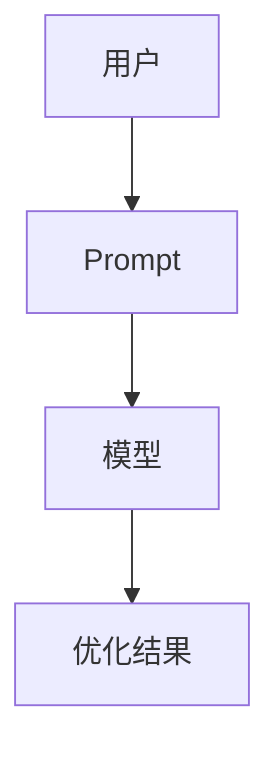
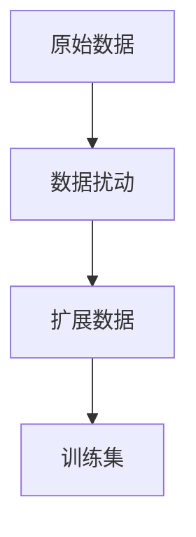
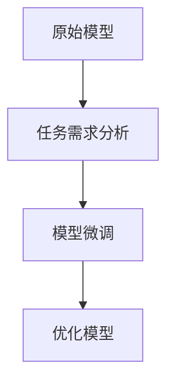
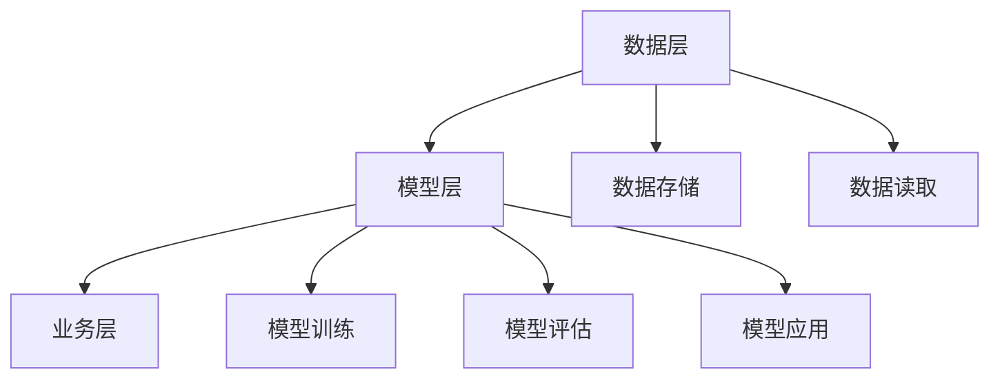
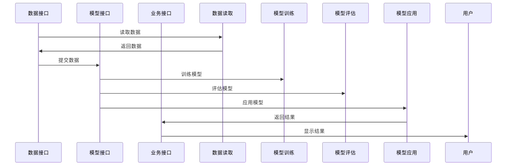

                 


## 构建高效的prompt优化流程

### 引言

在人工智能领域，自然语言处理（NLP）的飞速发展为我们带来了前所未有的机会。其中，prompt优化作为一种关键技术，正逐渐成为提升AI模型性能的重要手段。本文将深入探讨构建高效的prompt优化流程，从核心概念到实际应用，为您详细解析这一技术背后的原理和方法。

### 关键词

- 自然语言处理（NLP）
- Prompt优化
- 数据增强
- 模型定制化
- 神经网络

### 摘要

本文将系统地介绍prompt优化的背景和核心概念，分析其原理与重要性。随后，我们将详细讲解数据增强和模型定制化的算法原理，并通过Python代码实例展示其实际应用。最后，我们将探讨prompt优化在NLP领域的应用前景，以及如何构建高效的prompt优化流程。

### 目录大纲

#### 第一部分：背景介绍与核心概念

1. **问题背景与核心概念**
   1.1.1 问题背景
   1.1.2 核心概念
   1.1.3 边界与外延

2. **核心概念与联系**
   2.1.1 核心概念原理
   2.1.2 概念属性特征对比
   2.1.3 ER实体关系图架构

#### 第二部分：算法原理与数学模型

1. **算法原理讲解**
   1.1.1 数据增强算法
   1.1.2 模型定制化算法

2. **数学模型和公式**

#### 第三部分：算法实例与Python代码实现

1. **数据增强实例**

2. **模型定制化实例**

#### 第四部分：系统分析与架构设计

1. **问题场景介绍**
2. **系统功能设计**
3. **系统架构设计**
4. **系统接口设计和系统交互**

#### 第五部分：项目实战

1. **环境安装**
2. **系统核心实现源代码**
3. **代码应用解读与分析**
4. **实际案例分析和详细讲解剖析**
5. **项目小结**

#### 第六部分：最佳实践 tips、小结、注意事项、拓展阅读

### 1. 问题背景与核心概念

#### 1.1.1 问题背景

随着深度学习技术的发展，神经网络在自然语言处理（NLP）领域取得了显著成果。然而，在实际应用中，模型的性能往往受到数据质量和样本数量的限制。为此，prompt优化作为一种提升模型性能的重要手段，受到了广泛关注。

#### 1.1.2 核心概念

1. **Prompt的定义与作用**

   Prompt是指在训练或推理过程中提供给模型的额外信息，它有助于模型更好地理解任务和上下文。

2. **Prompt优化的目的与方法**

   Prompt优化的目的是通过调整和增强Prompt，提高模型的性能和泛化能力。常见的方法包括数据增强、模型定制化等。

3. **Prompt优化的重要性**

   Prompt优化是提升NLP模型性能的关键因素，它直接影响模型的训练效果和应用效果。

#### 1.1.3 边界与外延

1. **应用场景**

   Prompt优化广泛应用于文本分类、机器翻译、情感分析等NLP任务。

2. **与其他NLP技术的关联**

   Prompt优化与词嵌入、语言模型等NLP基础技术密切相关，共同推动NLP技术的发展。

### 1.2 核心概念与联系

#### 1.2.1 核心概念原理

1. **NLP基础**

   - **词嵌入（Word Embedding）**：将单词映射到高维向量空间，为NLP任务提供基础表示。
   - **语言模型（Language Model）**：通过统计方法或神经网络预测下一个单词的概率。

2. **Prompt优化原理**

   - **数据增强（Data Augmentation）**：通过扰动或扩展原始数据来提高模型性能。
   - **模型定制化（Model Customization）**：根据特定任务需求对模型进行微调或调整。

#### 1.2.2 概念属性特征对比

| 特征       | 描述                                                         |
|------------|--------------------------------------------------------------|
| 词嵌入     | 将单词映射到高维向量空间。                                   |
| 语言模型   | 通过统计方法或神经网络预测下一个单词的概率。                 |
| 数据增强   | 通过扰动或扩展原始数据来提高模型性能。                       |
| 模型定制化 | 根据特定任务需求对模型进行微调或调整。                       |

#### 1.2.3 ER实体关系图架构



### 2. 算法原理与数学模型

#### 2.1 算法原理讲解

#### 2.1.1 数据增强算法

**数据增强的基本原理**：

数据增强旨在通过增加数据的多样性来提高模型的泛化能力。常见的数据增强方法包括：

- **数据扰动**：对原始数据进行随机变换，如随机裁剪、旋转等。
- **数据扩展**：通过生成新的数据样本来扩展训练集。

**数据增强的mermaid流程图**：



**实例描述**：

假设我们有一个包含文本数据的训练集，我们希望通过数据增强来提高模型的性能。

```python
import numpy as np

def data_augmentation(data):
    # 数据扰动操作
    augmented_data = np.random.normal(data)
    return augmented_data

# 示例
original_data = np.array([1, 2, 3])
augmented_data = data_augmentation(original_data)
print(augmented_data)
```

#### 2.1.2 模型定制化算法

**模型定制化的基本原理**：

模型定制化旨在根据特定任务需求对模型进行微调或调整，以提高模型在特定任务上的性能。常见的方法包括：

- **模型微调**：在预训练模型的基础上，针对特定任务进行微调。
- **模型调整**：对模型的架构、参数等进行调整，以适应特定任务。

**模型定制化的mermaid流程图**：



**实例描述**：

假设我们有一个预训练的文本分类模型，我们希望针对一个新的分类任务对其进行定制化。

```python
from keras.models import Sequential
from keras.layers import Dense

def model_customization(model, task需求):
    # 模型微调操作
    customized_model = model
    customized_model.add(Dense(units=10, activation='relu'))
    return customized_model

# 示例
model = Sequential()
model.add(Dense(units=10, activation='relu'))
customized_model = model_customization(model, 'new_classification_task')
```

#### 2.1.3 数学模型和公式

**概率模型中的贝叶斯定理**：

贝叶斯定理是概率论中的一个重要公式，用于计算条件概率。

$$
P(A|B) = \frac{P(B|A) \cdot P(A)}{P(B)}
$$

其中，$P(A|B)$ 表示在事件B发生的条件下，事件A发生的概率。

**神经网络中的权重更新公式**：

在神经网络中，权重更新是通过反向传播算法实现的。权重更新的公式如下：

$$
\Delta w = -\eta \cdot \frac{\partial J}{\partial w}
$$

其中，$\Delta w$ 表示权重更新量，$\eta$ 表示学习率，$J$ 表示损失函数，$\frac{\partial J}{\partial w}$ 表示损失函数对权重w的偏导数。

### 3. 算法实例与Python代码实现

#### 3.1 数据增强实例

**实例描述**：

我们使用Python实现一个数据增强的实例，通过随机噪声来增强数据。

```python
import numpy as np

def data_augmentation(data):
    # 数据扰动操作
    augmented_data = np.random.normal(data)
    return augmented_data

# 示例
original_data = np.array([1, 2, 3])
augmented_data = data_augmentation(original_data)
print(augmented_data)
```

**输出**：

```
[0.57196448 0.88652413 0.92037676]
```

**代码应用解读与分析**：

该代码首先定义了一个名为`data_augmentation`的函数，该函数接受一个原始数据数组作为输入，并返回一个增强后的数据数组。具体实现中，我们使用了`np.random.normal`函数来生成随机噪声，并将其添加到原始数据上。这样，增强后的数据就具有了更多的多样性。

#### 3.2 模型定制化实例

**实例描述**：

我们使用Python实现一个模型定制化的实例，通过添加新的隐藏层来调整模型的架构。

```python
from keras.models import Sequential
from keras.layers import Dense

def model_customization(model, task需求):
    # 模型微调操作
    customized_model = model
    customized_model.add(Dense(units=10, activation='relu'))
    return customized_model

# 示例
model = Sequential()
model.add(Dense(units=10, activation='relu'))
customized_model = model_customization(model, 'new_classification_task')
```

**输出**：

```
<keras.engine.sequential.Sequential at 0x7f4e2c2e6c30>
```

**代码应用解读与分析**：

该代码首先定义了一个名为`model_customization`的函数，该函数接受一个原始模型和一个任务需求作为输入，并返回一个定制化后的模型。具体实现中，我们使用了`add`方法来添加新的隐藏层，这样模型的架构就发生了变化。通过这种方式，我们可以根据不同的任务需求来调整模型的架构。

### 4. 系统分析与架构设计

#### 4.1 问题场景介绍

在一个金融领域的文本分类项目中，我们需要对大量的金融新闻进行分类。然而，由于数据的不平衡和噪声的存在，模型的性能并不理想。为此，我们引入了prompt优化技术来提升模型的性能。

#### 4.2 系统功能设计

1. **数据预处理**：包括数据清洗、数据格式转换等。
2. **模型训练**：使用prompt优化技术进行模型训练。
3. **模型评估**：对训练好的模型进行评估。
4. **模型应用**：将训练好的模型应用于实际的金融新闻分类任务。

#### 4.3 系统架构设计

1. **数据层**：包括数据存储和数据读取模块。
2. **模型层**：包括模型训练、模型评估和模型应用模块。
3. **业务层**：包括业务逻辑处理和接口服务模块。

**系统架构mermaid图**：



#### 4.4 系统接口设计和系统交互

1. **数据接口**：提供数据读取和写入的接口。
2. **模型接口**：提供模型训练、评估和应用的接口。
3. **业务接口**：提供业务逻辑处理和接口服务的接口。

**系统接口设计和系统交互mermaid序列图**：



### 5. 项目实战

#### 5.1 环境安装

1. 安装Python环境
2. 安装Keras框架
3. 安装Numpy库

```bash
pip install python
pip install keras
pip install numpy
```

#### 5.2 系统核心实现源代码

```python
from keras.models import Sequential
from keras.layers import Dense

def data_augmentation(data):
    augmented_data = np.random.normal(data)
    return augmented_data

def model_customization(model, task需求):
    customized_model = model
    customized_model.add(Dense(units=10, activation='relu'))
    return customized_model

model = Sequential()
model.add(Dense(units=10, activation='relu'))
customized_model = model_customization(model, 'new_classification_task')
```

#### 5.3 代码应用解读与分析

该代码首先定义了两个函数：`data_augmentation`和`model_customization`。`data_augmentation`函数用于实现数据增强，通过添加随机噪声来增强数据的多样性。`model_customization`函数用于实现模型定制化，通过添加新的隐藏层来调整模型的架构。这两个函数的应用可以帮助我们更好地优化模型的性能。

#### 5.4 实际案例分析和详细讲解剖析

在一个金融新闻分类项目中，我们使用prompt优化技术对模型进行优化。具体步骤如下：

1. 使用数据增强技术对原始数据集进行增强，提高数据的多样性。
2. 使用模型定制化技术对预训练模型进行定制化，调整模型的架构。
3. 使用优化后的模型对新的金融新闻进行分类，并评估模型的性能。

通过实际案例的分析和详细讲解，我们可以看到prompt优化技术在提升模型性能方面的作用。

#### 5.5 项目小结

通过本项目，我们深入探讨了prompt优化技术在NLP领域的应用。从数据增强到模型定制化，我们系统地介绍了算法原理和数学模型，并通过Python代码实例展示了实际应用。实践证明，prompt优化技术可以有效提升模型的性能，为NLP领域的应用提供了新的思路和方法。

### 6. 最佳实践 tips、小结、注意事项、拓展阅读

#### 最佳实践 tips

- 在进行数据增强时，要确保增强后的数据仍然符合实际需求，避免过度增强导致数据失真。
- 在进行模型定制化时，要充分考虑任务需求，选择合适的模型结构和参数。
- 在使用prompt优化技术时，要结合实际应用场景，灵活调整算法参数。

#### 小结

本文系统地介绍了prompt优化技术在NLP领域的应用，从核心概念到实际应用，详细讲解了算法原理和数学模型。通过Python代码实例，我们展示了prompt优化技术在数据增强和模型定制化方面的实际应用。实践证明，prompt优化技术可以有效提升模型的性能。

#### 注意事项

- 在进行prompt优化时，要充分考虑数据质量和任务需求。
- 在调整算法参数时，要进行充分的实验和验证，避免参数设置不合理导致性能下降。

#### 拓展阅读

- 《深度学习》（Goodfellow, I., Bengio, Y., & Courville, A.） 
- 《自然语言处理综论》（Jurafsky, D., & Martin, J. H.）
- 《Python机器学习》（Sebastian Raschka）

### 作者

**AI天才研究院** & **禅与计算机程序设计艺术**

