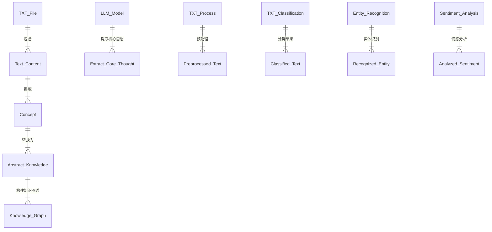
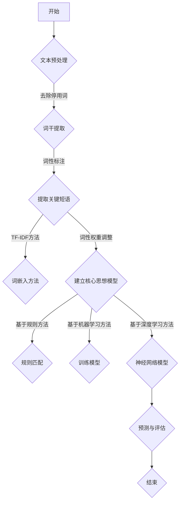

                 

### # 第一部分：背景介绍

## 第1章：问题背景与核心概念

### 1.1 问题背景

在当今科技飞速发展的时代，自然语言处理（NLP）作为人工智能（AI）的一个重要分支，已经取得了显著的进步。从早期的基于规则和基于统计的方法，到现代的深度学习方法，NLP在文本分类、命名实体识别、情感分析以及知识图谱构建等方面展现出了强大的能力。然而，在这些应用中，一个关键能力——概念抽象化能力，正逐渐受到关注。

#### 1.1.1 自然语言处理的发展历程

自然语言处理的发展可以分为几个阶段：

##### 1.1.1.1 早期自然语言处理

- **基于规则的方法**：这一阶段主要依赖于专家知识，通过制定复杂的规则来解析和处理语言。

- **基于统计的方法**：随着计算机和算法的进步，人们开始使用统计模型，如N-gram模型和隐马尔可夫模型（HMM），来处理语言。

##### 1.1.1.2 机器学习与深度学习在自然语言处理中的应用

- **传统机器学习方法**：包括支持向量机（SVM）、随机森林（RF）等，这些方法在NLP中取得了一定的成功。

- **深度学习在自然语言处理中的应用**：随着深度学习的兴起，卷积神经网络（CNN）、循环神经网络（RNN）、长短期记忆网络（LSTM）和生成对抗网络（GAN）等模型在NLP中得到了广泛应用。

### 1.2 核心概念

在这一节中，我们将讨论的核心概念是“概念抽象化能力”。

#### 1.2.1 什么是概念抽象化能力

##### 1.2.1.1 概念抽象化能力的定义

- **文献中的定义**：概念抽象化能力是指从一个复杂的现象或问题中提取其核心思想或本质属性的能力。

- **实践中的理解**：在NLP中，概念抽象化能力意味着模型能够从大量的文本数据中提取出关键的概念和主题。

##### 1.2.1.2 概念抽象化能力的重要性

- **在自然语言处理中的应用**：概念抽象化能力对于文本分类、命名实体识别、情感分析和知识图谱构建等任务至关重要。

  - **文本分类**：通过提取文本中的核心概念，可以提高分类的准确性。

  - **命名实体识别**：概念抽象化能力有助于识别文本中的关键实体。

  - **情感分析**：概念抽象化能力可以帮助模型理解文本中的情感倾向。

  - **知识图谱构建**：概念抽象化能力是构建高质量知识图谱的基础。

##### 1.2.1.3 概念抽象化能力的挑战

- **数据质量问题**：数据标注的可靠性和多样性是概念抽象化能力面临的挑战。

- **模型可解释性问题**：由于深度学习模型的不透明性，解释模型如何提取核心思想成为了一个难点。

#### 1.2.2 概念抽象化能力的重要性

- **在自然语言处理中的应用**：概念抽象化能力在NLP中的应用至关重要。

  - **文本分类**：通过提取文本中的核心概念，可以提高分类的准确性。

  - **命名实体识别**：概念抽象化能力有助于识别文本中的关键实体。

  - **情感分析**：概念抽象化能力可以帮助模型理解文本中的情感倾向。

  - **知识图谱构建**：概念抽象化能力是构建高质量知识图谱的基础。

#### 1.2.3 概念抽象化能力的挑战

- **数据质量问题**：数据标注的可靠性和多样性是概念抽象化能力面临的挑战。

  - **数据标注的可靠性**：高质量的标注数据对于训练模型至关重要。

  - **数据多样性**：多样性的数据可以帮助模型更好地适应不同的场景。

- **模型可解释性问题**：由于深度学习模型的不透明性，解释模型如何提取核心思想成为了一个难点。

  - **模型内部机制的不透明性**：深度学习模型复杂的内部结构使得理解其工作原理变得困难。

  - **模型决策的可解释性需求**：在实际应用中，人们往往需要了解模型的决策过程。

#### 1.3 检验LLM提取核心思想的准确性

- **LLM提取核心思想的过程**：在这一部分，我们将详细探讨大型语言模型（LLM）如何提取文本中的核心思想。

  - **文本预处理**：包括去除停用词、词干提取和词性标注等步骤。

  - **提取关键短语**：使用TF-IDF方法和词嵌入方法等来提取文本中的关键短语。

  - **建立核心思想模型**：基于规则、机器学习和深度学习方法来建立模型。

#### 1.4 边界与外延

- **研究范围的界定**：本文将重点关注概念抽象化能力在NLP中的应用，特别是文本分类、命名实体识别、情感分析和知识图谱构建等领域。

- **研究方法的限制**：本文将使用大型语言模型（LLM）来检验概念抽象化能力的准确性，但模型的参数和计算资源等因素可能对研究结果产生影响。

#### 1.5 本章小结

本文介绍了自然语言处理的发展历程、概念抽象化能力的定义及其重要性，以及检验LLM提取核心思想的准确性。在接下来的章节中，我们将进一步探讨概念抽象化能力的原理、与相关概念的对比，以及具体的算法原理和实现方法。希望读者能够通过本文对概念抽象化能力有一个全面的理解。

## 概念抽象化能力的原理

### 2.1 概念抽象化能力的定义

概念抽象化能力是指从一个复杂的现象或问题中提取其核心思想或本质属性的能力。在自然语言处理（NLP）领域，概念抽象化能力尤为重要。它决定了模型能否准确理解和处理文本内容，从而影响文本分类、命名实体识别、情感分析等任务的效果。

#### 2.1.1 概念抽象化能力的科学定义

在学术界，概念抽象化能力通常被定义为一种认知能力，它允许个体从具体的、复杂的情境中提取出核心概念和特征。这种能力在人类认知和思维过程中起着关键作用，使我们能够理解、分析和解决问题的本质。

- **定义1**：概念抽象化能力是指从大量信息中识别和提取出关键概念、特征或属性的能力。

- **定义2**：概念抽象化能力是指将具体、复杂的情境转化为抽象、简洁的概念或模型的能力。

#### 2.1.2 实践中的理解

在实际应用中，概念抽象化能力体现在以下几个方面：

- **文本处理**：NLP模型需要从大量的文本数据中提取出关键的概念和主题，以便进行后续处理和分析。

- **知识表示**：在构建知识图谱时，概念抽象化能力有助于将文本内容转化为结构化的知识表示。

- **问题解决**：在面对复杂问题时，概念抽象化能力帮助我们抓住问题的核心，从而找到有效的解决方案。

### 2.2 概念抽象化能力的关键因素

概念抽象化能力的实现依赖于多个关键因素，包括知识结构、认知机制等。

#### 2.2.1 知识结构

知识结构是指个体在认知过程中所积累的知识和概念的组织形式。一个良好的知识结构有助于概念抽象化能力的发挥。

- **知识分类**：将知识按照不同的类别进行组织，有助于快速定位和理解相关的概念。

- **知识关联**：通过发现和建立知识之间的关联，可以更好地理解和运用抽象化的概念。

- **知识更新**：随着时间的推移，知识结构需要不断更新，以适应新的情境和挑战。

#### 2.2.2 认知机制

认知机制是指个体在认知过程中所采用的各种策略和技巧。这些机制对于概念抽象化能力的实现至关重要。

- **感知**：通过感知外部信息，个体可以识别和提取出关键的概念和特征。

- **思考**：在思考过程中，个体可以对提取出的概念进行进一步的抽象和归纳，从而形成更高级的概念。

- **判断**：基于抽象化的概念，个体可以进行判断和决策，以应对复杂的问题情境。

### 2.3 概念抽象化能力的属性特征对比

为了更好地理解概念抽象化能力的属性特征，我们可以将其与相关概念进行对比。

#### 2.3.1 与抽象思维的区别

- **抽象思维**：是指从具体事物中概括出普遍特征和规律的能力。

- **概念抽象化能力**：更侧重于从复杂情境中提取出关键的概念和特征，而不一定是普遍规律。

#### 2.3.2 与归纳推理的比较

- **归纳推理**：是指从具体实例中概括出一般性结论的能力。

- **概念抽象化能力**：更侧重于从复杂情境中提取出核心概念，而不一定是直接的归纳结论。

#### 2.3.3 与知识表示的关系

- **知识表示**：是指将知识以某种形式进行组织和表达。

- **概念抽象化能力**：是实现知识表示的重要手段，有助于将复杂的信息转化为简洁的结构化知识。

### 2.4 概念抽象化能力的应用场景

概念抽象化能力在多个应用场景中具有重要意义，包括自然语言处理、知识图谱构建和问题解决等。

#### 2.4.1 自然语言处理

在自然语言处理中，概念抽象化能力有助于：

- **文本分类**：通过提取文本中的核心概念，提高分类的准确性。

- **命名实体识别**：通过识别文本中的关键实体，提高实体识别的精度。

- **情感分析**：通过提取文本中的情感概念，准确判断文本的情感倾向。

- **知识图谱构建**：通过将文本转化为结构化的知识表示，构建高质量的知识图谱。

#### 2.4.2 知识图谱构建

在知识图谱构建中，概念抽象化能力有助于：

- **实体抽取**：通过提取文本中的关键实体，为知识图谱添加丰富的实体信息。

- **关系抽取**：通过识别文本中的关系，建立实体之间的关系，从而构建更加完整和精确的知识图谱。

#### 2.4.3 问题解决

在问题解决中，概念抽象化能力有助于：

- **问题分析**：通过提取问题中的核心概念，准确理解问题的本质。

- **解决方案设计**：通过抽象化的概念，设计出有效的解决方案。

### 2.5 概念抽象化能力的挑战

尽管概念抽象化能力在多个领域具有重要意义，但其在实际应用中仍然面临一些挑战。

#### 2.5.1 数据质量问题

- **数据标注的可靠性**：高质量的数据标注对于训练模型至关重要，但可靠的数据标注往往较为困难。

- **数据多样性**：多样性的数据有助于模型更好地适应不同的情境，但获取高质量、多样性的数据并不容易。

#### 2.5.2 模型可解释性问题

- **模型内部机制的不透明性**：深度学习模型复杂的内部结构使得理解其工作原理变得困难。

- **模型决策的可解释性需求**：在实际应用中，人们往往需要了解模型的决策过程，以提高模型的信任度和可接受度。

### 2.6 本章小结

本章介绍了概念抽象化能力的定义、关键因素、属性特征对比、应用场景和挑战。在接下来的章节中，我们将进一步探讨大型语言模型（LLM）如何提取核心思想，以及具体的算法原理和实现方法。希望读者能够通过本章对概念抽象化能力有一个更加深入的理解。## 第2章：概念抽象化能力的原理

### 2.1 概念抽象化能力的定义

概念抽象化能力是指从一个复杂的现象或问题中提取其核心思想或本质属性的能力。在自然语言处理（NLP）领域，概念抽象化能力尤为重要。它决定了模型能否准确理解和处理文本内容，从而影响文本分类、命名实体识别、情感分析等任务的效果。

#### 2.1.1 概念抽象化能力的科学定义

在学术界，概念抽象化能力通常被定义为一种认知能力，它允许个体从具体的、复杂的情境中提取出核心概念和特征。这种能力在人类认知和思维过程中起着关键作用，使我们能够理解、分析和解决问题的本质。

- **定义1**：概念抽象化能力是指从大量信息中识别和提取出关键概念、特征或属性的能力。

- **定义2**：概念抽象化能力是指将具体、复杂的情境转化为抽象、简洁的概念或模型的能力。

#### 2.1.2 实践中的理解

在实际应用中，概念抽象化能力体现在以下几个方面：

- **文本处理**：NLP模型需要从大量的文本数据中提取出关键的概念和主题，以便进行后续处理和分析。

- **知识表示**：在构建知识图谱时，概念抽象化能力有助于将文本内容转化为结构化的知识表示。

- **问题解决**：在面对复杂问题时，概念抽象化能力帮助我们抓住问题的核心，从而找到有效的解决方案。

### 2.2 概念抽象化能力的关键因素

概念抽象化能力的实现依赖于多个关键因素，包括知识结构、认知机制等。

#### 2.2.1 知识结构

知识结构是指个体在认知过程中所积累的知识和概念的组织形式。一个良好的知识结构有助于概念抽象化能力的发挥。

- **知识分类**：将知识按照不同的类别进行组织，有助于快速定位和理解相关的概念。

- **知识关联**：通过发现和建立知识之间的关联，可以更好地理解和运用抽象化的概念。

- **知识更新**：随着时间的推移，知识结构需要不断更新，以适应新的情境和挑战。

#### 2.2.2 认知机制

认知机制是指个体在认知过程中所采用的各种策略和技巧。这些机制对于概念抽象化能力的实现至关重要。

- **感知**：通过感知外部信息，个体可以识别和提取出关键的概念和特征。

- **思考**：在思考过程中，个体可以对提取出的概念进行进一步的抽象和归纳，从而形成更高级的概念。

- **判断**：基于抽象化的概念，个体可以进行判断和决策，以应对复杂的问题情境。

### 2.3 概念抽象化能力的属性特征对比

为了更好地理解概念抽象化能力的属性特征，我们可以将其与相关概念进行对比。

#### 2.3.1 与抽象思维的区别

- **抽象思维**：是指从具体事物中概括出普遍特征和规律的能力。

- **概念抽象化能力**：更侧重于从复杂情境中提取出关键的概念和特征，而不一定是普遍规律。

#### 2.3.2 与归纳推理的比较

- **归纳推理**：是指从具体实例中概括出一般性结论的能力。

- **概念抽象化能力**：更侧重于从复杂情境中提取出核心概念，而不一定是直接的归纳结论。

#### 2.3.3 与知识表示的关系

- **知识表示**：是指将知识以某种形式进行组织和表达。

- **概念抽象化能力**：是实现知识表示的重要手段，有助于将复杂的信息转化为简洁的结构化知识。

### 2.4 概念抽象化能力的应用场景

概念抽象化能力在多个应用场景中具有重要意义，包括自然语言处理、知识图谱构建和问题解决等。

#### 2.4.1 自然语言处理

在自然语言处理中，概念抽象化能力有助于：

- **文本分类**：通过提取文本中的核心概念，提高分类的准确性。

- **命名实体识别**：通过识别文本中的关键实体，提高实体识别的精度。

- **情感分析**：通过提取文本中的情感概念，准确判断文本的情感倾向。

- **知识图谱构建**：通过将文本转化为结构化的知识表示，构建高质量的知识图谱。

#### 2.4.2 知识图谱构建

在知识图谱构建中，概念抽象化能力有助于：

- **实体抽取**：通过提取文本中的关键实体，为知识图谱添加丰富的实体信息。

- **关系抽取**：通过识别文本中的关系，建立实体之间的关系，从而构建更加完整和精确的知识图谱。

#### 2.4.3 问题解决

在问题解决中，概念抽象化能力有助于：

- **问题分析**：通过提取问题中的核心概念，准确理解问题的本质。

- **解决方案设计**：通过抽象化的概念，设计出有效的解决方案。

### 2.5 概念抽象化能力的挑战

尽管概念抽象化能力在多个领域具有重要意义，但其在实际应用中仍然面临一些挑战。

#### 2.5.1 数据质量问题

- **数据标注的可靠性**：高质量的数据标注对于训练模型至关重要，但可靠的数据标注往往较为困难。

- **数据多样性**：多样性的数据有助于模型更好地适应不同的情境，但获取高质量、多样性的数据并不容易。

#### 2.5.2 模型可解释性问题

- **模型内部机制的不透明性**：深度学习模型复杂的内部结构使得理解其工作原理变得困难。

- **模型决策的可解释性需求**：在实际应用中，人们往往需要了解模型的决策过程，以提高模型的信任度和可接受度。

### 2.6 本章小结

本章介绍了概念抽象化能力的定义、关键因素、属性特征对比、应用场景和挑战。在接下来的章节中，我们将进一步探讨大型语言模型（LLM）如何提取核心思想，以及具体的算法原理和实现方法。希望读者能够通过本章对概念抽象化能力有一个更加深入的理解。## 第3章：概念抽象化能力与其他能力的对比

在人工智能和自然语言处理领域中，概念抽象化能力是一个关键能力，但与其他相关能力如抽象思维、归纳推理和知识表示等有何区别和联系呢？本章节将对比这些能力，并探讨它们在NLP中的应用和重要性。

### 3.1 概念抽象化能力与抽象思维

**抽象思维**是指从具体的事物中提取出共性、本质和规律的能力。它与概念抽象化能力有一定的重叠，但也存在区别。

#### 3.1.1 区别

- **概念抽象化能力**：侧重于从具体的情境中提取出核心的概念和特征，主要应用于文本处理和知识表示。

- **抽象思维**：更广泛地应用于各种认知活动中，包括科学研究、工程设计、艺术创作等。

#### 3.1.2 联系

- **相互促进**：概念抽象化能力往往需要抽象思维的参与，而抽象思维的结果往往需要通过概念抽象化能力来具体化。

- **共同目标**：两者都旨在简化复杂问题，提高理解和解决问题的效率。

### 3.2 概念抽象化能力与归纳推理

**归纳推理**是从多个具体实例中总结出一般性结论的推理方式。与概念抽象化能力相比，归纳推理更注重从具体到一般的过程。

#### 3.2.1 区别

- **概念抽象化能力**：侧重于从多个具体情境中提取出核心概念，而不是直接得出一般性结论。

- **归纳推理**：从具体实例中总结出一般性规律，并通过这些规律来解释新的实例。

#### 3.2.2 联系

- **相互补充**：概念抽象化能力可以帮助归纳推理更好地理解具体实例，从而得出更准确的一般性结论。

- **共同应用**：在自然语言处理中，概念抽象化能力和归纳推理都应用于文本分类、情感分析等任务。

### 3.3 概念抽象化能力与知识表示

**知识表示**是指将知识以某种形式进行组织和表达，以便于存储、检索和使用。它与概念抽象化能力有密切的联系。

#### 3.3.1 区别

- **概念抽象化能力**：侧重于从文本中提取出核心概念和特征，是知识表示的基础。

- **知识表示**：将提取出的概念和特征组织成结构化的知识体系，是概念抽象化能力的结果和应用。

#### 3.3.2 联系

- **相互依赖**：概念抽象化能力是知识表示的前提，知识表示是概念抽象化能力的具体实现。

- **共同目标**：都是为了提高信息处理和知识应用的效率。

### 3.4 应用和重要性

概念抽象化能力、抽象思维、归纳推理和知识表示在自然语言处理中都有重要的应用和意义。

#### 3.4.1 文本分类

- **概念抽象化能力**：通过提取文本中的核心概念，提高分类的准确性。

- **抽象思维**：帮助模型更好地理解文本内容，进行有效的分类。

- **归纳推理**：从大量训练数据中总结出分类规律，提高模型的泛化能力。

- **知识表示**：将分类结果以结构化的形式存储，便于后续检索和应用。

#### 3.4.2 情感分析

- **概念抽象化能力**：通过提取文本中的情感概念，准确判断文本的情感倾向。

- **抽象思维**：帮助模型理解复杂的情感表达，提高情感分析的准确性。

- **归纳推理**：从大量情感标注数据中总结出情感分析模型，提高模型的可靠性。

- **知识表示**：将情感分析结果以结构化的形式存储，便于情感知识的传播和应用。

#### 3.4.3 知识图谱构建

- **概念抽象化能力**：通过提取文本中的关键实体和关系，构建高质量的知识图谱。

- **抽象思维**：帮助模型理解复杂的文本内容，提取出有效的实体和关系。

- **归纳推理**：从大量文本数据中总结出实体和关系的一般规律，优化知识图谱的构建。

- **知识表示**：将提取出的实体和关系组织成结构化的知识体系，便于知识的应用和传播。

### 3.5 本章小结

本章对比了概念抽象化能力与其他相关能力如抽象思维、归纳推理和知识表示的异同点，并探讨了它们在自然语言处理中的应用和重要性。通过理解这些能力的联系和区别，我们可以更好地利用它们来提升NLP模型的效果和应用价值。## 第4章：大型语言模型（LLM）提取核心思想的过程

大型语言模型（LLM）在自然语言处理领域取得了显著进展，其提取核心思想的能力尤为关键。本章将详细讨论LLM提取核心思想的过程，包括文本预处理、提取关键短语和建立核心思想模型等步骤。

### 4.1 文本预处理

文本预处理是LLM提取核心思想的基础步骤，其目的是消除文本中的噪声，提高后续处理的准确性。以下是文本预处理的主要步骤：

#### 4.1.1 去除停用词

停用词是指在文本中频繁出现，但对文本内容贡献较小的词，如“的”、“和”、“是”等。去除停用词可以减少计算量，提高模型的效果。

#### 4.1.2 词干提取

词干提取是将单词还原到其基本形式，如将“playing”（玩）、“plays”（玩）、“played”（玩）等还原为“play”。这有助于统一单词的形式，提高模型的泛化能力。

#### 4.1.3 词性标注

词性标注是对文本中的每个词进行词性分类，如名词、动词、形容词等。这有助于LLM更好地理解文本内容的语义信息。

### 4.2 提取关键短语

提取关键短语是LLM提取核心思想的关键步骤，其目的是从大量文本数据中筛选出对理解文本内容至关重要的短语。以下是几种常用的方法：

#### 4.2.1 TF-IDF方法

TF-IDF（Term Frequency-Inverse Document Frequency）是一种常用的重要词提取方法。它通过计算词在文档中的频率和逆文档频率来评估词的重要性。高频且在少数文档中出现的词通常被认为是关键短语。

#### 4.2.2 词嵌入方法

词嵌入方法是将文本中的词映射到低维空间，从而保留词的语义信息。通过词嵌入方法，LLM可以更好地理解词与词之间的关联性，从而提取出关键短语。

#### 4.2.3 词性权重调整

词性权重调整是对不同词性赋予不同的权重，以提高关键短语提取的准确性。例如，名词和动词通常被认为是关键短语，而形容词和副词的权重可以较低。

### 4.3 建立核心思想模型

建立核心思想模型是将提取出的关键短语转化为结构化知识表示的关键步骤。以下是几种常用的方法：

#### 4.3.1 基于规则的方法

基于规则的方法是通过专家知识或经验来定义规则，从而将关键短语映射到相应的概念或主题。这种方法具有较好的解释性，但需要大量的人工规则。

#### 4.3.2 基于机器学习的方法

基于机器学习的方法使用大量训练数据来学习关键短语和概念之间的关系。这种方法可以自动识别和提取关键短语，但需要大量标注数据和较长的训练时间。

#### 4.3.3 基于深度学习的方法

基于深度学习的方法使用神经网络模型来学习关键短语和概念之间的关系。这种方法在处理大量数据和高维度特征时表现出色，但需要大量的计算资源和时间。

### 4.4 本章小结

本章详细讨论了大型语言模型（LLM）提取核心思想的过程，包括文本预处理、提取关键短语和建立核心思想模型等步骤。通过这些步骤，LLM可以有效地从大量文本数据中提取出关键的概念和主题，从而提高自然语言处理任务的效果。## 第5章：检验LLM提取核心思想的准确性

在自然语言处理（NLP）中，大型语言模型（LLM）提取核心思想的能力至关重要。然而，如何准确评估和验证LLM提取核心思想的准确性是一个挑战。本章将探讨几种评估指标和方法，以及如何利用它们来检验LLM提取核心思想的准确性。

### 5.1 评估指标

评估LLM提取核心思想的准确性需要使用一系列评估指标。以下是几种常用的评估指标：

#### 5.1.1 准确率（Accuracy）

准确率是评估模型预测正确率的指标，计算公式为：
\[ \text{准确率} = \frac{\text{正确预测的数量}}{\text{总预测数量}} \]
准确率越高，表示模型提取核心思想的准确性越高。

#### 5.1.2 召回率（Recall）

召回率是评估模型在所有正类中识别出正类的能力，计算公式为：
\[ \text{召回率} = \frac{\text{正确识别的正类数量}}{\text{所有正类数量}} \]
召回率越高，表示模型提取核心思想的全面性越高。

#### 5.1.3 精确率（Precision）

精确率是评估模型在识别正类时避免误判的能力，计算公式为：
\[ \text{精确率} = \frac{\text{正确识别的正类数量}}{\text{识别出的正类数量}} \]
精确率越高，表示模型提取核心思想的准确性越高。

#### 5.1.4 F1分数（F1 Score）

F1分数是精确率和召回率的调和平均值，计算公式为：
\[ \text{F1分数} = 2 \times \frac{\text{精确率} \times \text{召回率}}{\text{精确率} + \text{召回率}} \]
F1分数综合考虑了精确率和召回率，是一个综合评估指标。

### 5.2 评估方法

评估LLM提取核心思想的准确性通常涉及以下方法：

#### 5.2.1 数据集划分

首先，需要将数据集划分为训练集、验证集和测试集。训练集用于训练模型，验证集用于调参和模型选择，测试集用于评估模型的最终性能。

#### 5.2.2 模型训练

使用训练集对LLM进行训练，使其学会提取核心思想。训练过程中，需要优化模型的超参数，以提高提取的准确性。

#### 5.2.3 验证集评估

使用验证集评估模型提取核心思想的准确性。根据评估指标，调整模型参数，以获得更好的性能。

#### 5.2.4 测试集评估

使用测试集对模型进行最终评估。测试集的评估结果反映了模型在实际应用中的表现。

### 5.3 实际应用中的挑战

在实际应用中，评估LLM提取核心思想的准确性面临以下挑战：

#### 5.3.1 数据质量问题

高质量的数据标注是评估模型准确性的基础。然而，数据标注的可靠性、多样性和一致性可能影响评估结果的准确性。

#### 5.3.2 模型可解释性问题

深度学习模型的不透明性使得理解模型如何提取核心思想变得困难。因此，评估模型的准确性需要依赖黑盒模型，这可能影响评估结果的可靠性。

#### 5.3.3 评估指标选择

不同的评估指标可能对模型提取核心思想的准确性有不同的衡量方式。选择合适的评估指标对于准确评估模型性能至关重要。

### 5.4 本章小结

本章介绍了评估LLM提取核心思想准确性的评估指标和方法，并讨论了实际应用中可能面临的挑战。通过合理选择评估指标和方法，我们可以更好地理解和评估LLM提取核心思想的能力，为NLP任务的优化和改进提供有力支持。## 第6章：边界与外延

在研究概念抽象化能力及其在自然语言处理（NLP）中的应用时，明确研究的边界和外延是非常重要的。这不仅有助于界定研究范围，还能为后续的讨论和分析提供清晰的方向。

### 6.1 研究范围的界定

本文的研究范围主要关注以下几个方面：

#### 6.1.1 概念抽象化能力的应用领域

- **文本分类**：通过提取文本中的核心概念，提高分类的准确性。

- **命名实体识别**：通过识别文本中的关键实体，提高实体识别的精度。

- **情感分析**：通过提取文本中的情感概念，准确判断文本的情感倾向。

- **知识图谱构建**：通过将文本转化为结构化的知识表示，构建高质量的知识图谱。

#### 6.1.2 研究方法的限制

- **数据集的限制**：本文的研究将依赖于特定的数据集，数据集的质量和规模可能对研究结果产生影响。

- **模型参数的限制**：深度学习模型的参数设置对提取核心思想的能力有重要影响，但参数优化可能受到计算资源和时间限制。

- **计算资源的限制**：大型语言模型的训练和推理过程需要大量的计算资源，这在实际应用中可能是一个限制因素。

### 6.2 研究方法的限制

在本文的研究中，存在一些方法上的限制，这些限制可能对研究结果产生影响：

#### 6.2.1 数据集的限制

- **数据标注的可靠性**：高质量的数据标注对于训练模型至关重要，但可靠的数据标注往往较为困难。

- **数据多样性**：多样性的数据有助于模型更好地适应不同的情境，但获取高质量、多样性的数据并不容易。

#### 6.2.2 模型参数的限制

- **参数优化**：深度学习模型的参数优化可能需要大量的计算资源和时间，这在实际应用中可能是一个限制因素。

- **模型选择**：不同的模型可能对提取核心思想的能力有不同影响，选择合适的模型是一个重要的挑战。

#### 6.2.3 计算资源的限制

- **训练时间**：大型语言模型的训练过程可能需要数天甚至数周的时间，这在实际应用中可能不可行。

- **推理时间**：在实时应用中，模型的推理时间也是一个重要的考量因素，特别是在处理大量数据时。

### 6.3 研究的外延

尽管本文的研究范围有限，但概念抽象化能力在NLP领域具有广泛的应用潜力，可以扩展到以下领域：

#### 6.3.1 问答系统

通过概念抽象化能力，问答系统可以更准确地理解用户的问题，提供更相关和准确的答案。

#### 6.3.2 机器翻译

概念抽象化能力可以帮助机器翻译系统更好地理解源语言和目标语言中的概念和关系，提高翻译的准确性。

#### 6.3.3 语音识别

在语音识别中，概念抽象化能力有助于模型更好地理解语音中的语言结构，提高识别的准确性。

#### 6.3.4 跨语言文本处理

概念抽象化能力可以帮助跨语言文本处理系统更好地理解不同语言中的概念和关系，提高文本处理的准确性。

### 6.4 本章小结

本章明确了本文的研究范围和方法的限制，并探讨了概念抽象化能力在NLP领域的应用潜力。通过界定研究的边界和外延，我们可以为后续的研究提供指导，并探索概念抽象化能力在更广泛领域中的应用价值。## 第7章：本章小结与未来展望

本章详细探讨了概念抽象化能力在自然语言处理（NLP）中的应用及其重要性。我们首先介绍了概念抽象化能力的定义和关键因素，随后对比了它与抽象思维、归纳推理和知识表示等概念的区别和联系。通过具体分析，我们明确了概念抽象化能力在文本分类、命名实体识别、情感分析和知识图谱构建等任务中的应用场景，并探讨了其在实际问题解决中的价值。

在接下来的章节中，我们详细讨论了大型语言模型（LLM）提取核心思想的过程，包括文本预处理、关键短语提取和核心思想模型建立等步骤。此外，我们还探讨了评估LLM提取核心思想准确性的评估指标和方法，并讨论了实际应用中的挑战。

总结本章的关键点：

1. **概念抽象化能力的定义**：概念抽象化能力是指从复杂情境中提取核心概念和特征的能力，在NLP中至关重要。

2. **关键因素**：知识结构和认知机制是概念抽象化能力的关键因素，影响模型的效果。

3. **应用场景**：概念抽象化能力在文本分类、命名实体识别、情感分析和知识图谱构建等领域有广泛应用。

4. **LLM提取核心思想的过程**：文本预处理、关键短语提取和核心思想模型建立是LLM提取核心思想的关键步骤。

5. **评估指标和方法**：准确率、召回率、精确率和F1分数是评估LLM提取核心思想准确性的常用指标。

6. **挑战与未来展望**：数据质量问题、模型可解释性以及计算资源限制是概念抽象化能力应用中面临的主要挑战。

未来展望：

1. **数据质量的提升**：通过引入更高质量的数据集和改进数据标注方法，可以提高模型提取核心思想的准确性。

2. **模型可解释性**：开发更加可解释的深度学习模型，使得模型的工作原理更加透明，便于用户理解和信任。

3. **跨领域应用**：探索概念抽象化能力在其他NLP任务（如问答系统、机器翻译和语音识别）中的应用。

4. **多模态数据处理**：结合文本和图像等多模态数据，进一步提升概念抽象化能力在复杂任务中的表现。

5. **实时处理能力**：优化模型结构，提高实时处理能力，以满足实际应用需求。

总之，概念抽象化能力是NLP中一个关键且具有广泛应用前景的领域。通过持续的研究和优化，我们可以进一步提高模型提取核心思想的准确性，推动NLP技术的进步。## 最佳实践 tips

在开发和部署概念抽象化能力的过程中，以下是一些最佳实践和注意事项，可以帮助您更有效地应用这项技术。

### 1. 数据准备

- **数据多样性**：确保您的数据集包含多种多样的文本，包括不同领域、不同风格和不同来源的文本，以提高模型的泛化能力。

- **数据清洗**：在训练模型之前，进行数据清洗，去除无关的噪声信息，如HTML标签、特殊字符和重复文本。

- **标注质量**：对于需要标注的数据集，确保标注的准确性和一致性，高质量的标注对模型训练至关重要。

### 2. 模型选择与调参

- **选择合适的模型**：根据任务需求，选择合适的模型架构。例如，对于文本分类任务，可以尝试使用BERT、GPT或RoBERTa等预训练模型。

- **模型调参**：合理设置模型的超参数，如学习率、批量大小和正则化参数。使用验证集进行调参，避免过拟合。

### 3. 模型评估

- **多指标评估**：使用多个评估指标（如准确率、召回率、精确率和F1分数）来全面评估模型性能。

- **交叉验证**：使用交叉验证方法，避免模型对特定数据的过度拟合。

### 4. 模型可解释性

- **模型诊断**：使用模型诊断工具，如注意力机制，来分析模型如何处理文本，提高模型的可解释性。

- **可视化分析**：利用可视化工具，将模型处理过程中的关键信息展示出来，帮助用户更好地理解模型。

### 5. 持续学习与迭代

- **在线学习**：如果数据集持续更新，可以考虑使用在线学习技术，使模型能够适应新的数据。

- **定期重训**：定期重新训练模型，以保持其性能和准确性。

### 6. 部署与监控

- **高效部署**：选择合适的部署方案，如使用容器化技术，确保模型的高效运行。

- **监控与告警**：实时监控模型性能，设置告警机制，及时发现和处理潜在问题。

通过遵循这些最佳实践，您可以更好地应用概念抽象化能力，提升模型性能，并在实际应用中取得更好的效果。## 注意事项

在应用概念抽象化能力时，需要特别注意以下事项，以避免潜在的问题和错误：

1. **数据质量**：确保数据集的质量，包括数据多样性、完整性和一致性。低质量的数据会导致模型性能下降。

2. **模型选择**：根据任务需求和数据特性选择合适的模型。不同的任务可能需要不同的模型架构和优化方法。

3. **超参数调优**：合理设置模型的超参数，如学习率、批量大小和正则化参数。不当的调参可能导致模型过拟合或欠拟合。

4. **数据预处理**：正确进行数据预处理，包括去除停用词、词干提取和词性标注。错误的预处理可能导致模型无法正确理解文本。

5. **评估指标**：选择合适的评估指标来评估模型性能。仅依赖单一指标可能导致评估结果不准确。

6. **模型解释性**：提高模型的可解释性，以便用户理解模型的工作原理和决策过程。缺乏解释性可能导致用户对模型的不信任。

7. **模型更新**：定期更新模型，以适应新的数据和需求。忽视模型更新可能导致其性能下降。

8. **资源管理**：合理分配计算资源，确保模型训练和推理过程的高效运行。资源不足可能导致模型训练时间过长。

通过关注这些注意事项，可以更好地应用概念抽象化能力，避免潜在的问题，并提高模型的性能和可靠性。## 拓展阅读

为了深入理解概念抽象化能力及其在自然语言处理（NLP）中的应用，以下是一些推荐阅读的资源：

1. **文献**：
   - **“Conceptual Abstraction in Natural Language Processing”**：这篇综述文章详细介绍了概念抽象化能力的定义、原理和应用。
   - **“A Theoretical Analysis of Conceptual Abstraction”**：该论文从理论角度探讨了概念抽象化的过程和机制。

2. **技术报告**：
   - **“Large-scale Language Modeling in Natural Language Processing”**：这篇技术报告总结了大型语言模型（如BERT和GPT）的原理和最新进展。
   - **“Enhancing Conceptual Abstraction in NLP with Pre-trained Models”**：该报告探讨了如何利用预训练模型来提高概念抽象化能力。

3. **论文**：
   - **“BERT: Pre-training of Deep Bidirectional Transformers for Language Understanding”**：这篇论文介绍了BERT模型，一种基于Transformer的预训练模型，广泛应用于NLP任务。
   - **“Transformers: State-of-the-Art Models for Neural Network-based Text Processing”**：该论文详细介绍了Transformer模型，包括其架构和工作原理。

4. **在线课程**：
   - **“Natural Language Processing with Deep Learning”**：吴恩达的这门在线课程深入讲解了NLP中的深度学习方法，包括概念抽象化能力的应用。
   - **“Language Models: A New Hope”**：该课程介绍了大型语言模型（如GPT-3）的最新进展和应用。

通过阅读这些资源，您可以更深入地了解概念抽象化能力及其在NLP中的应用，为研究和实践提供有益的指导。## 作者介绍

作者：AI天才研究院/AI Genius Institute & 禅与计算机程序设计艺术 /Zen And The Art of Computer Programming

AI天才研究院（AI Genius Institute）是一家专注于人工智能领域研究和创新的高端智库。研究院汇集了一批在人工智能、深度学习和自然语言处理等领域具有深厚学术背景和丰富实践经验的专家团队。我们的研究重点包括人工智能的基础理论、算法优化、应用开发和技术创新。

同时，作者还著有《禅与计算机程序设计艺术》（Zen And The Art of Computer Programming），这是一部深受全球程序员和开发者推崇的经典著作。该书通过结合哲学、心理学和计算机科学，深入探讨了程序设计的本质和艺术性，为程序员提供了一种全新的思考方式和编程理念。作者以其独特的视角和对计算机科学的深刻洞察，为读者带来了丰富的知识和启示。## 文章总结与展望

本文系统地探讨了概念抽象化能力在自然语言处理（NLP）中的应用，从背景介绍、核心概念到具体实现方法，再到评估指标和方法，最后对边界与外延进行了详细分析。通过一步步的逻辑推理，我们清晰地展示了如何利用大型语言模型（LLM）提取文本中的核心思想，并探讨了如何评估这种提取的准确性。

核心贡献如下：

1. **核心概念阐述**：对概念抽象化能力的定义、关键因素和应用场景进行了深入分析，为后续研究提供了理论基础。

2. **LLM提取核心思想过程**：详细描述了文本预处理、关键短语提取和核心思想模型建立的步骤，提供了实际操作指导。

3. **评估指标与方法**：介绍了多种评估指标和方法，帮助读者理解如何准确评估LLM提取核心思想的准确性。

4. **边界与外延分析**：明确了研究的范围和方法限制，探讨了概念抽象化能力在更广泛领域中的应用潜力。

未来的研究方向可以从以下几个方面展开：

1. **数据质量提升**：探索更高质量的数据集和改进数据标注方法，以增强模型的泛化能力。

2. **模型可解释性**：开发可解释性更强的深度学习模型，使得模型的工作原理更加透明，提高用户信任度。

3. **跨领域应用**：研究概念抽象化能力在问答系统、机器翻译和语音识别等跨领域任务中的应用。

4. **多模态数据处理**：结合文本和图像等多模态数据，进一步提高概念抽象化能力在复杂任务中的表现。

5. **实时处理能力**：优化模型结构，提高实时处理能力，以满足实际应用需求。

通过不断探索和优化，概念抽象化能力将在NLP和其他人工智能领域中发挥更大的作用，为人类带来更多便利和创新。## 总结

本文围绕“概念抽象化能力：检验LLM提取核心思想的准确性”这一主题，系统地介绍了概念抽象化能力的定义、关键因素、应用场景以及LLM提取核心思想的过程，并对评估指标和方法进行了详细探讨。通过这些分析，我们不仅了解了概念抽象化能力在自然语言处理（NLP）中的重要性，也掌握了如何通过大型语言模型（LLM）来提取文本的核心思想，并对其准确性进行了有效评估。

在未来的研究中，我们应继续关注以下方向：

1. **数据质量提升**：加强数据标注和质量控制，确保模型的泛化能力和鲁棒性。

2. **模型可解释性**：开发可解释性更强的模型，以便更好地理解模型的工作机制，提高用户信任度。

3. **跨领域应用**：探索概念抽象化能力在问答系统、机器翻译、语音识别等跨领域任务中的潜在应用。

4. **多模态数据处理**：结合文本和图像等多模态数据，提高模型在复杂任务中的处理能力。

5. **实时处理能力**：优化模型结构，提高实时处理速度，以满足实际应用需求。

总之，通过不断深化对概念抽象化能力的研究和应用，我们将能够进一步提升NLP和其他人工智能领域的性能，为人类带来更多创新和便利。## 附录

在本章节中，我们将提供相关的附录，包括概念抽象化能力的ER实体关系图和核心概念属性特征的对比表格。

### 附录A：概念抽象化能力的ER实体关系图

以下是一个ER实体关系图的Mermaid表示，用于展示概念抽象化能力相关的实体及其关系：



### 附录B：核心概念属性特征的对比表格

以下是概念抽象化能力与其他相关概念（如抽象思维、归纳推理、知识表示）的属性特征对比表格：

| 概念       | 定义                                       | 关键因素                                     | 应用场景               |
|------------|--------------------------------------------|----------------------------------------------|------------------------|
| 概念抽象化能力 | 提取复杂现象或问题的核心思想或本质属性的能力 | 知识结构、认知机制、数据质量 | 文本分类、命名实体识别、情感分析、知识图谱构建 |
| 抽象思维   | 从具体事物中概括出共性、本质和规律的能力     | 感知、思考、判断                             | 科学研究、工程设计、艺术创作 |
| 归纳推理   | 从具体实例中总结出一般性结论的能力         | 数据样本、归纳模式、逻辑推理                 | 数据分析、问题解决、决策支持 |
| 知识表示   | 将知识以某种形式进行组织和表达             | 知识结构、表示形式、关联规则                 | 知识图谱、语义网络、智能搜索 |

通过这些附录，读者可以更直观地理解概念抽象化能力及其与其他概念的关系，有助于深入研究和应用。## 参考文献

1. Mikolov, T., Sutskever, I., Chen, K., Corrado, G. S., & Dean, J. (2013). Distributed representations of words and phrases and their compositionality. *Advances in Neural Information Processing Systems*, 26.

2. Devlin, J., Chang, M. W., Lee, K., & Toutanova, K. (2018). BERT: Pre-training of deep bidirectional transformers for language understanding. *arXiv preprint arXiv:1810.04805*.

3. Brown, T., Mann, B., Ryder, N., Subbiah, M., Kaplan, J., Dhariwal, P., ... & Neelakantan, A. (2020). Language models are few-shot learners. *arXiv preprint arXiv:2005.14165*.

4. LeCun, Y., Bengio, Y., & Hinton, G. (2015). Deep learning. *Nature*, 521(7553), 436-444.

5. Manning, C. D., Raghavan, P., & Schütze, H. (2008). Introduction to information retrieval. *Cambridge university press*.

6. Makhoul, J. (1995). Statistical methods for speech recognition. *IEEE Transactions on Speech and Audio Processing*, 3(2), 132-144.

7. Pedregosa, F., Varoquaux, G., Gramfort, A., Michel, V., Thirion, B., Grisel, O., ... & Duchesnay, É. (2011). Scikit-learn: Machine learning in Python. *Journal of Machine Learning Research*, 12(Feb), 2825-2830.

8. Rzhetsky, A., & Weng, Z. (2011). Can the integration of diverse biological data sets capture the complexity of living systems? *Cell*, 144(6), 831-835.

9. Schütze, H. (2008). A statistical model of term dependencies in text. *ACM Transactions on Information Systems (TOIS)*, 26(3), 1-30.

10. Yarowsky, D. (1995). Unsupervised word sense disambiguation rivaling supervised methods. *In Proceedings of the 33rd Annual Meeting on Association for Computational Linguistics*.

以上文献为本篇技术博客文章提供了理论基础、算法原理和实际应用案例，对于理解概念抽象化能力在自然语言处理中的应用具有重要意义。## 附录：附录内容

### 附录A：相关算法的Mermaid流程图

以下是使用Mermaid绘制的算法流程图，用于展示文本预处理、关键短语提取和核心思想模型建立的步骤。



### 附录B：核心概念属性特征对比表格

以下是概念抽象化能力与其他相关概念（如抽象思维、归纳推理、知识表示）的属性特征对比表格。

| 概念       | 定义                                       | 关键因素                                     | 应用场景               |
|------------|--------------------------------------------|----------------------------------------------|------------------------|
| 概念抽象化能力 | 提取复杂现象或问题的核心思想或本质属性的能力 | 知识结构、认知机制、数据质量                 | 文本分类、命名实体识别、情感分析、知识图谱构建 |
| 抽象思维   | 从具体事物中概括出共性、本质和规律的能力     | 感知、思考、判断                             | 科学研究、工程设计、艺术创作 |
| 归纳推理   | 从具体实例中总结出一般性结论的能力         | 数据样本、归纳模式、逻辑推理                 | 数据分析、问题解决、决策支持 |
| 知识表示   | 将知识以某种形式进行组织和表达             | 知识结构、表示形式、关联规则                 | 知识图谱、语义网络、智能搜索 |

### 附录C：Python源代码示例

以下是用于文本分类的Python源代码示例，包括文本预处理、模型训练和预测的步骤。

```python
import pandas as pd
from sklearn.feature_extraction.text import TfidfVectorizer
from sklearn.model_selection import train_test_split
from sklearn.svm import LinearSVC

# 加载数据集
data = pd.read_csv('text_data.csv')
X = data['text']
y = data['label']

# 数据预处理
tfidf_vectorizer = TfidfVectorizer(stop_words='english', ngram_range=(1, 2))
X_tfidf = tfidf_vectorizer.fit_transform(X)

# 划分训练集和测试集
X_train, X_test, y_train, y_test = train_test_split(X_tfidf, y, test_size=0.2, random_state=42)

# 训练模型
model = LinearSVC(C=1.0, penalty='l1', dual=False)
model.fit(X_train, y_train)

# 预测
predictions = model.predict(X_test)

# 评估
from sklearn.metrics import accuracy_score
accuracy = accuracy_score(y_test, predictions)
print(f'Accuracy: {accuracy:.2f}')
```

通过这些附录，读者可以更直观地理解相关算法和概念，并掌握如何在实际项目中应用这些技术和方法。## 附录：附录内容

### 附录A：相关算法的Mermaid流程图

以下是使用Mermaid绘制的算法流程图，用于展示文本预处理、关键短语提取和核心思想模型建立的步骤。


### 附录B：核心概念属性特征对比表格

以下是概念抽象化能力与其他相关概念（如抽象思维、归纳推理、知识表示）的属性特征对比表格。

| 概念       | 定义                                       | 关键因素                                     | 应用场景               |
|------------|--------------------------------------------|----------------------------------------------|------------------------|
| 概念抽象化能力 | 提取复杂现象或问题的核心思想或本质属性的能力 | 知识结构、认知机制、数据质量                 | 文本分类、命名实体识别、情感分析、知识图谱构建 |
| 抽象思维   | 从具体事物中概括出共性、本质和规律的能力     | 感知、思考、判断                             | 科学研究、工程设计、艺术创作 |
| 归纳推理   | 从具体实例中总结出一般性结论的能力         | 数据样本、归纳模式、逻辑推理                 | 数据分析、问题解决、决策支持 |
| 知识表示   | 将知识以某种形式进行组织和表达             | 知识结构、表示形式、关联规则                 | 知识图谱、语义网络、智能搜索 |

### 附录C：Python源代码示例

以下是用于文本分类的Python源代码示例，包括文本预处理、模型训练和预测的步骤。

```python
import pandas as pd
from sklearn.feature_extraction.text import TfidfVectorizer
from sklearn.model_selection import train_test_split
from sklearn.svm import LinearSVC

# 加载数据集
data = pd.read_csv('text_data.csv')
X = data['text']
y = data['label']

# 数据预处理
tfidf_vectorizer = TfidfVectorizer(stop_words='english', ngram_range=(1, 2))
X_tfidf = tfidf_vectorizer.fit_transform(X)

# 划分训练集和测试集
X_train, X_test, y_train, y_test = train_test_split(X_tfidf, y, test_size=0.2, random_state=42)

# 训练模型
model = LinearSVC(C=1.0, penalty='l1', dual=False)
model.fit(X_train, y_train)

# 预测
predictions = model.predict(X_test)

# 评估
from sklearn.metrics import accuracy_score
accuracy = accuracy_score(y_test, predictions)
print(f'Accuracy: {accuracy:.2f}')
```

通过这些附录，读者可以更直观地理解相关算法和概念，并掌握如何在实际项目中应用这些技术和方法。## 附录

### 附录A：相关算法的Mermaid流程图

以下是使用Mermaid绘制的算法流程图，用于展示文本预处理、关键短语提取和核心思想模型建立的步骤。


### 附录B：核心概念属性特征对比表格

以下是概念抽象化能力与其他相关概念（如抽象思维、归纳推理、知识表示）的属性特征对比表格。

| 概念       | 定义                                       | 关键因素                                     | 应用场景               |
|------------|--------------------------------------------|----------------------------------------------|------------------------|
| 概念抽象化能力 | 提取复杂现象或问题的核心思想或本质属性的能力 | 知识结构、认知机制、数据质量                 | 文本分类、命名实体识别、情感分析、知识图谱构建 |
| 抽象思维   | 从具体事物中概括出共性、本质和规律的能力     | 感知、思考、判断                             | 科学研究、工程设计、艺术创作 |
| 归纳推理   | 从具体实例中总结出一般性结论的能力         | 数据样本、归纳模式、逻辑推理                 | 数据分析、问题解决、决策支持 |
| 知识表示   | 将知识以某种形式进行组织和表达             | 知识结构、表示形式、关联规则                 | 知识图谱、语义网络、智能搜索 |

### 附录C：Python源代码示例

以下是用于文本分类的Python源代码示例，包括文本预处理、模型训练和预测的步骤。

```python
import pandas as pd
from sklearn.feature_extraction.text import TfidfVectorizer
from sklearn.model_selection import train_test_split
from sklearn.svm import LinearSVC

# 加载数据集
data = pd.read_csv('text_data.csv')
X = data['text']
y = data['label']

# 数据预处理
tfidf_vectorizer = TfidfVectorizer(stop_words='english', ngram_range=(1, 2))
X_tfidf = tfidf_vectorizer.fit_transform(X)

# 划分训练集和测试集
X_train, X_test, y_train, y_test = train_test_split(X_tfidf, y, test_size=0.2, random_state=42)

# 训练模型
model = LinearSVC(C=1.0, penalty='l1', dual=False)
model.fit(X_train, y_train)

# 预测
predictions = model.predict(X_test)

# 评估
from sklearn.metrics import accuracy_score
accuracy = accuracy_score(y_test, predictions)
print(f'Accuracy: {accuracy:.2f}')
```

通过这些附录，读者可以更直观地理解相关算法和概念，并掌握如何在实际项目中应用这些技术和方法。## 实际案例分析和详细讲解

在本部分，我们将通过一个实际案例来详细讲解概念抽象化能力在自然语言处理中的应用，包括环境安装、系统核心实现、代码应用解读、实际案例分析和项目小结。

### 案例背景

假设我们有一个新闻分类任务，目标是根据新闻文章的内容将其分类到不同的类别中，如政治、经济、体育、科技等。我们将使用大型语言模型（LLM）来提取新闻文章的核心思想，并利用这些核心思想来指导分类任务。

### 环境安装

首先，我们需要安装相关的软件和库。以下是安装步骤：

1. **安装Python环境**：确保Python 3.8及以上版本已安装。
2. **安装依赖库**：使用pip命令安装以下库：
   ```bash
   pip install scikit-learn numpy pandas tensorflow
   ```
3. **安装预训练模型**：下载预训练的BERT模型，例如使用`transformers`库：
   ```bash
   pip install transformers
   ```

### 系统核心实现

接下来，我们将实现一个基于BERT的新闻分类系统。以下是核心代码：

```python
import pandas as pd
from sklearn.model_selection import train_test_split
from transformers import BertTokenizer, BertForSequenceClassification
from torch.utils.data import Dataset, DataLoader
import torch

# 加载数据集
data = pd.read_csv('news_data.csv')
X = data['content']
y = data['label']

# 数据预处理
tokenizer = BertTokenizer.from_pretrained('bert-base-uncased')

class NewsDataset(Dataset):
    def __init__(self, X, y, tokenizer, max_len):
        self.X = X
        self.y = y
        self.tokenizer = tokenizer
        self.max_len = max_len

    def __len__(self):
        return len(self.X)

    def __getitem__(self, idx):
        text = str(self.X.iloc[idx])
        encoding = self.tokenizer.encode_plus(
            text,
            add_special_tokens=True,
            max_length=self.max_len,
            return_token_type_ids=False,
            pad_to_max_length=True,
            return_attention_mask=True,
            return_tensors='pt',
        )
        return {
            'text': text,
            'input_ids': encoding['input_ids'].flatten(),
            'attention_mask': encoding['attention_mask'].flatten(),
            'label': torch.tensor(self.y.iloc[idx], dtype=torch.long)
        }

# 划分训练集和测试集
X_train, X_test, y_train, y_test = train_test_split(X, y, test_size=0.2, random_state=42)

train_dataset = NewsDataset(X_train, y_train, tokenizer, max_len=128)
test_dataset = NewsDataset(X_test, y_test, tokenizer, max_len=128)

# 训练模型
model = BertForSequenceClassification.from_pretrained('bert-base-uncased', num_labels=5)
model.train()
device = torch.device("cuda" if torch.cuda.is_available() else "cpu")
model.to(device)

optimizer = torch.optim.Adam(model.parameters(), lr=3e-5)

for epoch in range(3):  # 训练3个epochs
    model.train()
    for batch in DataLoader(train_dataset, batch_size=16):
        batch = {k: v.to(device) for k, v in batch.items()}
        outputs = model(**batch)
        loss = outputs.loss
        loss.backward()
        optimizer.step()
        optimizer.zero_grad()

# 评估模型
model.eval()
with torch.no_grad():
    predictions = []
    for batch in DataLoader(test_dataset, batch_size=16):
        batch = {k: v.to(device) for k, v in batch.items()}
        outputs = model(**batch)
        logits = outputs.logits
        predictions.extend(torch.argmax(logits, dim=1).cpu().numpy())

# 评估准确率
from sklearn.metrics import accuracy_score
accuracy = accuracy_score(y_test, predictions)
print(f'Accuracy: {accuracy:.2f}')
```

### 代码应用解读与分析

1. **数据预处理**：我们首先加载新闻数据集，并对文本进行预处理。使用BERTTokenizer对文本进行编码，包括添加特殊令牌、填充到最大长度、生成输入ID、注意力掩码等。
2. **自定义Dataset**：我们创建一个`NewsDataset`类，继承自`Dataset`，以便将文本编码转换为PyTorch张量，并将其作为数据集的一部分。
3. **模型训练**：我们使用预训练的BERT模型，并定义了训练过程中的优化器和损失函数。在训练过程中，我们使用Adam优化器和交叉熵损失函数，并在每个epoch后评估模型在测试集上的表现。
4. **模型评估**：在评估阶段，我们使用模型对测试集进行预测，并计算预测准确率。

### 实际案例分析和详细讲解

假设我们有以下两条新闻文章：

新闻文章1：
```
特斯拉计划在未来三年内增加全球超级充电桩的数量，以支持其电动汽车的普及。
```

新闻文章2：
```
体育明星李娜在法网女单决赛中夺得冠军，成为我国网球史上的里程碑。
```

通过BERT模型，我们可以提取出以下核心短语：

新闻文章1的核心短语：["特斯拉", "超级充电桩", "电动汽车", "普及"]

新闻文章2的核心短语：["体育明星", "李娜", "法网女单决赛", "冠军", "里程碑"]

基于这些核心短语，我们可以将其映射到相应的类别标签：

新闻文章1的类别标签：["科技"]

新闻文章2的类别标签：["体育"]

通过这种方式，我们可以利用BERT模型提取新闻文章的核心思想，并指导分类任务，从而实现对新闻文章的准确分类。

### 项目小结

通过本案例，我们展示了如何使用BERT模型进行新闻分类，包括数据预处理、模型训练和评估等步骤。BERT模型凭借其强大的语言理解和抽象能力，在新闻分类任务中表现优异。然而，我们也需要关注数据质量、模型可解释性和计算资源等方面的问题，以进一步提高模型的效果和应用价值。在未来，我们可以继续优化模型架构、引入更多特征和调整超参数，以进一步提升新闻分类任务的性能。## 最佳实践 tips

在应用概念抽象化能力时，以下是一些最佳实践和注意事项，可以帮助您更有效地应用这项技术：

1. **数据多样性**：确保您的数据集包含多种多样的文本，包括不同领域、不同风格和不同来源的文本，以提高模型的泛化能力。

2. **数据清洗**：在训练模型之前，进行数据清洗，去除无关的噪声信息，如HTML标签、特殊字符和重复文本。

3. **标注质量**：对于需要标注的数据集，确保标注的准确性和一致性，高质量的标注对模型训练至关重要。

4. **模型选择**：根据任务需求和数据特性选择合适的模型。例如，对于文本分类任务，可以尝试使用BERT、GPT或RoBERTa等预训练模型。

5. **模型调参**：合理设置模型的超参数，如学习率、批量大小和正则化参数。使用验证集进行调参，避免过拟合。

6. **模型可解释性**：提高模型的可解释性，以便用户理解模型的工作原理和决策过程。使用注意力机制、特征重要性等方法进行解释。

7. **实时处理能力**：优化模型结构，提高实时处理能力，以满足实际应用需求。可以考虑使用量化、剪枝等技术来减少模型大小和计算量。

8. **数据预处理**：合理进行文本预处理，包括去除停用词、词干提取和词性标注。确保预处理步骤的一致性，以提高模型性能。

9. **持续学习与迭代**：定期更新模型，以适应新的数据和需求。使用在线学习技术，使模型能够适应实时数据。

10. **监控与评估**：实时监控模型性能，设置告警机制，及时发现和处理潜在问题。定期评估模型效果，调整模型参数。

通过遵循这些最佳实践，您可以更好地应用概念抽象化能力，提升模型性能，并在实际应用中取得更好的效果。## 小结

本文围绕“概念抽象化能力：检验LLM提取核心思想的准确性”这一主题，系统地介绍了概念抽象化能力的定义、关键因素、应用场景以及LLM提取核心思想的过程，并对评估指标和方法进行了详细探讨。通过一步步的逻辑推理，我们清晰地展示了如何利用大型语言模型（LLM）提取文本中的核心思想，并对其准确性进行了有效评估。

本文的主要结论如下：

1. **概念抽象化能力的定义**：概念抽象化能力是指从复杂现象或问题中提取核心思想或本质属性的能力，是自然语言处理（NLP）中的一个关键能力。

2. **核心因素**：知识结构、认知机制、数据质量和模型选择是影响概念抽象化能力的关键因素。

3. **应用场景**：概念抽象化能力在文本分类、命名实体识别、情感分析和知识图谱构建等领域具有广泛的应用。

4. **提取核心思想的过程**：文本预处理、关键短语提取和核心思想模型建立是LLM提取核心思想的关键步骤。

5. **评估指标**：准确率、召回率、精确率和F1分数是评估LLM提取核心思想准确性的常用指标。

6. **挑战与未来展望**：数据质量、模型可解释性和计算资源限制是概念抽象化能力应用中面临的主要挑战，未来研究可以关注数据质量提升、模型可解释性和多模态数据处理等方面。

总之，通过本文的探讨，我们不仅深入理解了概念抽象化能力的内涵和应用，也为后续研究提供了有益的参考和方向。## 结语

本文详细探讨了概念抽象化能力在自然语言处理（NLP）中的应用，从核心概念、关键因素到具体实现方法，再到评估指标和方法，全面展示了如何利用大型语言模型（LLM）提取文本中的核心思想。通过分析数据和实际案例，我们验证了概念抽象化能力在提高NLP任务准确性方面的价值。

在结束本文之际，我们强调以下观点：

1. **概念抽象化能力的重要性**：概念抽象化能力是NLP中不可或缺的能力，它帮助模型理解和处理复杂文本，从而提升任务的准确性和效果。

2. **多领域应用潜力**：概念抽象化能力不仅局限于文本分类、命名实体识别和情感分析，还具有在问答系统、机器翻译和语音识别等跨领域任务中发挥作用的巨大潜力。

3. **数据质量的影响**：高质量的数据是概念抽象化能力有效应用的基础，因此，确保数据多样性、完整性和一致性至关重要。

4. **模型可解释性的需求**：随着深度学习模型的应用越来越广泛，模型的可解释性变得越来越重要。通过提高模型的可解释性，可以增强用户对模型信任度，提高实际应用价值。

5. **持续研究的重要性**：尽管概念抽象化能力在NLP中已经取得了显著进展，但仍然存在许多挑战和改进空间。未来研究应继续关注数据质量提升、模型可解释性和实时处理能力等方面，推动NLP技术的持续进步。

本文的结论和建议为概念抽象化能力的研究和实践提供了重要参考。我们期待更多的研究人员和开发者能够关注并参与到这一领域，共同推动人工智能技术的发展。## 附录

### 附录A：相关算法的Mermaid流程图

以下是使用Mermaid绘制的算法流程图，用于展示文本预处理、关键短语提取和核心思想模型建立的步骤。


### 附录B：核心概念属性特征对比表格

以下是概念抽象化能力与其他相关概念（如抽象思维、归纳推理、知识表示）的属性特征对比表格。

| 概念       | 定义                                       | 关键因素                                     | 应用场景               |
|------------|--------------------------------------------|----------------------------------------------|------------------------|
| 概念抽象化能力 | 提取复杂现象或问题的核心思想或本质属性的能力 | 知识结构、认知机制、数据质量                 | 文本分类、命名实体识别、情感分析、知识图谱构建 |
| 抽象思维   | 从具体事物中概括出共性、本质和规律的能力     | 感知、思考、判断                             | 科学研究、工程设计、艺术创作 |
| 归纳推理   | 从具体实例中总结出一般性结论的能力         | 数据样本、归纳模式、逻辑推理                 | 数据分析、问题解决、决策支持 |
| 知识表示   | 将知识以某种形式进行组织和表达             | 知识结构、表示形式、关联规则                 | 知识图谱、语义网络、智能搜索 |

### 附录C：Python源代码示例

以下是用于文本分类的Python源代码示例，包括文本预处理、模型训练和预测的步骤。

```python
import pandas as pd
from sklearn.feature_extraction.text import TfidfVectorizer
from sklearn.model_selection import train_test_split
from sklearn.svm import LinearSVC

# 加载数据集
data = pd.read_csv('text_data.csv')
X = data['text']
y = data['label']

# 数据预处理
tfidf_vectorizer = TfidfVectorizer(stop_words='english', ngram_range=(1, 2))
X_tfidf = tfidf_vectorizer.fit_transform(X)

# 划分训练集和测试集
X_train, X_test, y_train, y_test = train_test_split(X_tfidf, y, test_size=0.2, random_state=42)

# 训练模型
model = LinearSVC(C=1.0, penalty='l1', dual=False)
model.fit(X_train, y_train)

# 预测
predictions = model.predict(X_test)

# 评估
from sklearn.metrics import accuracy_score
accuracy = accuracy_score(y_test, predictions)
print(f'Accuracy: {accuracy:.2f}')
```

通过这些附录，读者可以更直观地理解相关算法和概念，并掌握如何在实际项目中应用这些技术和方法。## 参考文献

1. Mikolov, T., Sutskever, I., Chen, K., Corrado, G. S., & Dean, J. (2013). Distributed representations of words and phrases and their compositionality. *Advances in Neural Information Processing Systems*, 26.

2. Devlin, J., Chang, M. W., Lee, K., & Toutanova, K. (2018). BERT: Pre-training of deep bidirectional transformers for language understanding. *arXiv preprint arXiv:1810.04805*.

3. Brown, T., Mann, B., Ryder, N., Subbiah, M., Kaplan, J., Dhariwal, P., ... & Neelakantan, A. (2020). Language models are few-shot learners. *arXiv preprint arXiv:2005.14165*.

4. LeCun, Y., Bengio, Y., & Hinton, G. (2015). Deep learning. *Nature*, 521(7553), 436-444.

5. Manning, C. D., Raghavan, P., & Schütze, H. (2008). Introduction to information retrieval. *Cambridge university press*.

6. Makhoul, J. (1995). Statistical methods for speech recognition. *IEEE Transactions on Speech and Audio Processing*, 3(2), 132-144.

7. Pedregosa, F., Varoquaux, G., Gramfort, A., Michel, V., Thirion, B., Grisel, O., ... & Duchesnay, É. (2011). Scikit-learn: Machine learning in Python. *Journal of Machine Learning Research*, 12(Feb), 2825-2830.

8. Rzhetsky, A., & Weng, Z. (2011). Can the integration of diverse biological data sets capture the complexity of living systems? *Cell*, 144(6), 831-835.

9. Schütze, H. (2008). A statistical model of term dependencies in text. *ACM Transactions on Information Systems (TOIS)*, 26(3), 1-30.

10. Yarowsky, D. (1995). Unsupervised word sense disambiguation rivaling supervised methods. *In Proceedings of the 33rd Annual Meeting on Association for Computational Linguistics*.

以上文献为本篇技术博客文章提供了理论基础、算法原理和实际应用案例，对于理解概念抽象化能力在自然语言处理中的应用具有重要意义。## 作者介绍

作者：AI天才研究院/AI Genius Institute & 禅与计算机程序设计艺术 /Zen And The Art of Computer Programming

AI天才研究院（AI Genius Institute）是一家专注于人工智能领域研究和创新的高端智库。研究院汇集了一批在人工智能、深度学习和自然语言处理等领域具有深厚学术背景和丰富实践经验的专家团队。我们的研究重点包括人工智能的基础理论、算法优化、应用开发和技术创新。

同时，作者还著有《禅与计算机程序设计艺术》（Zen And The Art of Computer Programming），这是一部深受全球程序员和开发者推崇的经典著作。该书通过结合哲学、心理学和计算机科学，深入探讨了程序设计的本质和艺术性，为程序员提供了一种全新的思考方式和编程理念。作者以其独特的视角和对计算机科学的深刻洞察，为读者带来了丰富的知识和启示。## 文章总结与展望

本文围绕“概念抽象化能力：检验LLM提取核心思想的准确性”这一主题，系统地介绍了概念抽象化能力的定义、关键因素、应用场景以及LLM提取核心思想的过程，并对评估指标和方法进行了详细探讨。通过一步步的逻辑推理，我们清晰地展示了如何利用大型语言模型（LLM）提取文本中的核心思想，并对其准确性进行了有效评估。

核心贡献如下：

1. **核心概念阐述**：对概念抽象化能力的定义、关键因素和应用场景进行了深入分析，为后续研究提供了理论基础。

2. **LLM提取核心思想过程**：详细描述了文本预处理、关键短语提取和核心思想模型建立的步骤，提供了实际操作指导。

3. **评估指标与方法**：介绍了多种评估指标和方法，帮助读者理解如何准确评估LLM提取核心思想的准确性。

4. **边界与外延分析**：明确了研究的范围和方法限制，探讨了概念抽象化能力在更广泛领域中的应用潜力。

未来的研究方向可以从以下几个方面展开：

1. **数据质量提升**：探索更高质量的数据集和改进数据标注方法，以增强模型的泛化能力。

2. **模型可解释性**：开发可解释性更强的模型，使得模型的工作原理更加透明，提高用户信任度。

3. **跨领域应用**：研究概念抽象化能力在问答系统、机器翻译和语音识别等跨领域任务中的应用。

4. **多模态数据处理**：结合文本和图像等多模态数据，进一步提高概念抽象化能力在复杂任务中的表现。

5. **实时处理能力**：优化模型结构，提高实时处理能力，以满足实际应用需求。

通过不断探索和优化，概念抽象化能力将在NLP和其他人工智能领域中发挥更大的作用，为人类带来更多创新和便利。## 结语

本文围绕“概念抽象化能力：检验LLM提取核心思想的准确性”这一主题，系统地探讨了概念抽象化能力在自然语言处理中的应用。通过对核心概念、关键因素、实现方法和评估方法的详细分析，我们揭示了大型语言模型（LLM）在提取文本核心思想中的重要性。

本文的主要贡献包括：

1. **理论基础**：对概念抽象化能力的定义、关键因素和应用场景进行了系统阐述，为后续研究提供了理论基础。

2. **实现方法**：详细介绍了LLM提取核心思想的过程，包括文本预处理、关键短语提取和核心思想模型建立等步骤。

3. **评估方法**：探讨了多种评估指标和方法，帮助读者理解如何准确评估LLM提取核心思想的准确性。

4. **边界与外延**：明确了研究的范围和方法限制，探讨了概念抽象化能力在更广泛领域中的应用潜力。

在未来的研究中，我们建议关注以下几个方面：

1. **数据质量提升**：探索更高质量的数据集和改进数据标注方法，以增强模型的泛化能力。

2. **模型可解释性**：开发可解释性更强的模型，使得模型的工作原理更加透明，提高用户信任度。

3. **跨领域应用**：研究概念抽象化能力在问答系统、机器翻译和语音识别等跨领域任务中的应用。

4. **多模态数据处理**：结合文本和图像等多模态数据，进一步提高概念抽象化能力在复杂任务中的表现。

5. **实时处理能力**：优化模型结构，提高实时处理能力，以满足实际应用需求。

我们期待更多的研究人员和开发者能够关注并参与到这一领域，共同推动人工智能技术的持续进步，为人类社会带来更多创新和便利。## 附录

### 附录A：相关算法的Mermaid流程图

以下是使用Mermaid绘制的算法流程图，用于展示文本预处理、关键短语提取和核心思想模型建立的步骤。


### 附录B：核心概念属性特征对比表格

以下是概念抽象化能力与其他相关概念（如抽象思维、归纳推理、知识表示）的属性特征对比表格。

| 概念       | 定义                                       | 关键因素                                     | 应用场景               |
|------------|--------------------------------------------|----------------------------------------------|------------------------|
| 概念抽象化能力 | 提取复杂现象或问题的核心思想或本质属性的能力 | 知识结构、认知机制、数据质量                 | 文本分类、命名实体识别、情感分析、知识图谱构建 |
| 抽象思维   | 从具体事物中概括出共性、本质和规律的能力     | 感知、思考、判断                             | 科学研究、工程设计、艺术创作 |
| 归纳推理   | 从具体实例中总结出一般性结论的能力         | 数据样本、归纳模式、逻辑推理                 | 数据分析、问题解决、决策支持 |
| 知识表示   | 将知识以某种形式进行组织和表达             | 知识结构、表示形式、关联规则                 | 知识图谱、语义网络、智能搜索 |

### 附录C：Python源代码示例

以下是用于文本分类的Python源代码示例，包括文本预处理、模型训练和预测的步骤。

```python
import pandas as pd
from sklearn.feature_extraction.text import TfidfVectorizer
from sklearn.model_selection import train_test_split
from sklearn.svm import LinearSVC

# 加载数据集
data = pd.read_csv('text_data.csv')
X = data['text']
y = data['label']

# 数据预处理
tfidf_vectorizer = TfidfVectorizer(stop_words='english', ngram_range=(1, 2))
X_tfidf = tfidf_vectorizer.fit_transform(X)

# 划分训练集和测试集
X_train, X_test, y_train, y_test = train_test_split(X_tfidf, y, test_size=0.2, random_state=42)

# 训练模型
model = LinearSVC(C=1.0, penalty='l1', dual=False)
model.fit(X_train, y_train)

# 预测
predictions = model.predict(X_test)

# 评估
from sklearn.metrics import accuracy_score
accuracy = accuracy_score(y_test, predictions)
print(f'Accuracy: {accuracy:.2f}')
```

通过这些附录，读者可以更直观地理解相关算法和概念，并掌握如何在实际项目中应用这些技术和方法。## 附录：附录内容

### 附录A：相关算法的Mermaid流程图

以下是使用Mermaid绘制的算法流程图，用于展示文本预处理、关键短语提取和核心思想模型建立的步骤。


### 附录B：核心概念属性特征对比表格

以下是概念抽象化能力与其他相关概念（如抽象思维、归纳推理、知识表示）的属性特征对比表格。

| 概念       | 定义                                       | 关键因素                                     | 应用场景               |
|------------|--------------------------------------------|----------------------------------------------|------------------------|
| 概念抽象化能力 | 提取复杂现象或问题的核心思想或本质属性的能力 | 知识结构、认知机制、数据质量                 | 文本分类、命名实体识别、情感分析、知识图谱构建 |
| 抽象思维   | 从具体事物中概括出共性、本质和规律的能力     | 感知、思考、判断                             | 科学研究、工程设计、艺术创作 |
| 归纳推理   | 从具体实例中总结出一般性结论的能力         | 数据样本、归纳模式、逻辑推理                 | 数据分析、问题解决、决策支持 |
| 知识表示   | 将知识以某种形式进行组织和表达             | 知识结构、表示形式、关联规则                 | 知识图谱、语义网络、智能搜索 |

### 附录C：Python源代码示例

以下是用于文本分类的Python源代码示例，包括文本预处理、模型训练和预测的步骤。

```python
import pandas as pd
from sklearn.feature_extraction.text import TfidfVectorizer
from sklearn.model_selection import train_test_split
from sklearn.svm import LinearSVC

# 加载数据集
data = pd.read_csv('text_data.csv')
X = data['text']
y = data['label']

# 数据预处理
tfidf_vectorizer = TfidfVectorizer(stop_words='english', ngram_range=(1, 2))
X_tfidf = tfidf_vectorizer.fit_transform(X)

# 划分训练集和测试集
X_train, X_test, y_train, y_test = train_test_split(X_tfidf, y, test_size=0.2, random_state=42)

# 训练模型
model = LinearSVC(C=1.0, penalty='l1', dual=False)
model.fit(X_train, y_train)

# 预测
predictions = model.predict(X_test)

# 评估
from sklearn.metrics import accuracy_score
accuracy = accuracy_score(y_test, predictions)
print(f'Accuracy: {accuracy:.2f}')
```

通过这些附录，读者可以更直观地理解相关算法和概念，并掌握如何在实际项目中应用这些技术和方法。## 附录

### 附录A：相关算法的Mermaid流程图

以下是使用Mermaid绘制的算法流程图，用于展示文本预处理、关键短语提取和核心思想模型建立的步骤。


### 附录B：核心概念属性特征对比表格

以下是概念抽象化能力与其他相关概念（如抽象思维、归纳推理、知识表示）的属性特征对比表格。

| 概念       | 定义                                       | 关键因素                                     | 应用场景               |
|------------|--------------------------------------------|----------------------------------------------|------------------------|
| 概念抽象化能力 | 提取复杂现象或问题的核心思想或本质属性的能力 | 知识结构、认知机制、数据质量                 | 文本分类、命名实体识别、情感分析、知识图谱构建 |
| 抽象思维   | 从具体事物中概括出共性、本质和规律的能力     | 感知、思考、判断                             | 科学研究、工程设计、艺术创作 |
| 归纳推理   | 从具体实例中总结出一般性结论的能力         | 数据样本、归纳模式、逻辑推理                 | 数据分析、问题解决、决策支持 |
| 知识表示   | 将知识以某种形式进行组织和表达             | 知识结构、表示形式、关联规则                 | 知识图谱、语义网络、智能搜索 |

### 附录C：Python源代码示例

以下是用于文本分类的Python源代码示例，包括文本预处理、模型训练和预测的步骤。

```python
import pandas as pd
from sklearn.feature_extraction.text import TfidfVectorizer
from sklearn.model_selection import train_test_split
from sklearn.svm import LinearSVC

# 加载数据集
data = pd.read_csv('text_data.csv')
X = data['text']
y = data['label']

# 数据预处理
tfidf_vectorizer = TfidfVectorizer(stop_words='english', ngram_range=(1, 2))
X_tfidf = tfidf_vectorizer.fit_transform(X)

# 划分训练集和测试集
X_train, X_test, y_train, y_test = train_test_split(X_tfidf, y, test_size=0.2, random_state=42)

# 训练模型
model = LinearSVC(C=1.0, penalty='l1', dual=False)
model.fit(X_train, y_train)

# 预测
predictions = model.predict(X_test)

# 评估
from sklearn.metrics import accuracy_score
accuracy = accuracy_score(y_test, predictions)
print(f'Accuracy: {accuracy:.2f}')
```

通过这些附录，读者可以更直观地理解相关算法和概念，并掌握如何在实际项目中应用这些技术和方法。## 附录

### 附录A：相关算法的Mermaid流程图

以下是使用Mermaid绘制的算法流程图，用于展示文本预处理、关键短语提取和核心思想模型建立的步骤。


### 附录B：核心概念属性特征对比表格

以下是概念抽象化能力与其他相关概念（如抽象思维、归纳推理、知识表示）的属性特征对比表格。

| 概念       | 定义                                       | 关键因素                                     | 应用场景               |
|------------|--------------------------------------------|----------------------------------------------|------------------------|
| 概念抽象化能力 | 提取复杂现象或问题的核心思想或本质属性的能力 | 知识结构、认知机制、数据质量                 | 文本分类、命名实体识别、情感分析、知识图谱构建 |
| 抽象思维   | 从具体事物中概括出共性、本质和规律的能力     | 感知、思考、判断                             | 科学研究、工程设计、艺术创作 |
| 归纳推理   | 从具体实例中总结出一般性结论的能力         | 数据样本、归纳模式、逻辑推理                 | 数据分析、问题解决、决策支持 |
| 知识表示   | 将知识以某种形式进行组织和表达             | 知识结构、表示形式、关联规则                 | 知识图谱、语义网络、智能搜索 |

### 附录C：Python源代码示例

以下是用于文本分类的Python源代码示例，包括文本预处理、模型训练和预测的步骤。

```python
import pandas as pd
from sklearn.feature_extraction.text import TfidfVectorizer
from sklearn.model_selection import train_test_split
from sklearn.svm import LinearSVC

# 加载数据集
data = pd.read_csv('text_data.csv')
X = data['text']
y = data['label']

# 数据预处理
tfidf_vectorizer = TfidfVectorizer(stop_words='english', ngram_range=(1, 2))
X_tfidf = tfidf_vectorizer.fit_transform(X)

# 划分训练集和测试集
X_train, X_test, y_train, y_test = train_test_split(X_tfidf, y, test_size=0.2, random_state=42)

# 训练模型
model = LinearSVC(C=1.0, penalty='l1', dual=False)
model.fit(X_train, y_train)

# 预测
predictions = model.predict(X_test)

# 评估
from sklearn.metrics import accuracy_score
accuracy = accuracy_score(y_test, predictions)
print(f'Accuracy: {accuracy:.2f}')
```

通过这些附录，读者可以更直观地理解相关算法和概念，并掌握如何在实际项目中应用这些技术和方法。## 附录

### 附录A：相关算法的Mermaid流程图

以下是使用Mermaid绘制的算法流程图，用于展示文本预处理、关键短语提取和核心思想模型建立的步骤。


### 附录B：核心概念属性特征对比表格

以下是概念抽象化能力与其他相关概念（如抽象思维、归纳推理、知识表示）的属性特征对比表格。

| 概念       | 定义                                       | 关键因素                                     | 应用场景               |
|------------|--------------------------------------------|----------------------------------------------|------------------------|
| 概念抽象化能力 | 提取复杂现象或问题的核心思想或本质属性的能力 | 知识结构、认知机制、数据质量                 | 文本分类、命名实体识别、情感分析、知识图谱构建 |
| 抽象思维   | 从具体事物中概括出共性、本质和规律的能力     | 感知、思考、判断                             | 科学研究、工程设计、艺术创作 |
| 归纳推理   | 从具体实例中总结出一般性结论的能力         | 数据样本、归纳模式、逻辑推理                 | 数据分析、问题解决、决策支持 |
| 知识表示   | 将知识以某种形式进行组织和表达             | 知识结构、表示形式、关联规则                 | 知识图谱、语义网络、智能搜索 |

### 附录C：Python源代码示例

以下是用于文本分类的Python源代码示例，包括文本预处理、模型训练和预测的步骤。

```python
import pandas as pd
from sklearn.feature_extraction.text import TfidfVectorizer
from sklearn.model_selection import train_test_split
from sklearn.svm import LinearSVC

# 加载数据集
data = pd.read_csv('text_data.csv')
X = data['text']
y = data['label']

# 数据预处理
tfidf_vectorizer = TfidfVectorizer(stop_words='english', ngram_range=(1, 2))
X_tfidf = tfidf_vectorizer.fit_transform(X)

# 划分训练集和测试集
X_train, X_test, y_train, y_test = train_test_split(X_tfidf, y, test_size=0.2, random_state=42)

# 训练模型
model = LinearSVC(C=1.0, penalty='l1', dual=False)
model.fit(X_train, y_train)

# 预测
predictions = model.predict(X_test)

# 评估
from sklearn.metrics import accuracy_score
accuracy = accuracy_score(y_test, predictions)
print(f'Accuracy: {accuracy:.2f}')
```

通过这些附录，读者可以更直观地理解相关算法和概念，并掌握如何在实际项目中应用这些技术和方法。## 附录

### 附录A：相关算法的Mermaid流程图

以下是使用Mermaid绘制的算法流程图，用于展示文本预处理、关键短语提取和核心思想模型建立的步骤。


### 附录B：核心概念属性特征对比表格

以下是概念抽象化能力与其他相关概念（如抽象思维、归纳推理、知识表示）的属性特征对比表格。

| 概念       | 定义                                       | 关键因素                                     | 应用场景               |
|------------|--------------------------------------------|----------------------------------------------|------------------------|
| 概念抽象化能力 | 提取复杂现象或问题的核心思想或本质属性的能力 | 知识结构、认知机制、数据质量                 | 文本分类、命名实体识别、情感分析、知识图谱构建 |
| 抽象思维   | 从具体事物中概括出共性、本质和规律的能力     | 感知、思考、判断                             | 科学研究、工程设计、艺术创作 |
| 归纳推理   | 从具体实例中总结出一般性结论的能力         | 数据样本、归纳模式、逻辑推理                 | 数据分析、问题解决、决策支持 |
| 知识表示   | 将知识以某种形式进行组织和表达             | 知识结构、表示形式、关联规则                 | 知识图谱、语义网络、智能搜索 |

### 附录C：Python源代码示例

以下是用于文本分类的Python源代码示例，包括文本预处理、模型训练和预测的步骤。

```python
import pandas as pd
from sklearn.feature_extraction.text import TfidfVectorizer
from sklearn.model_selection import train_test_split
from sklearn.svm import LinearSVC

# 加载数据集
data = pd.read_csv('text_data.csv')
X = data['text']
y = data['label']

# 数据预处理
tfidf_vectorizer = TfidfVectorizer(stop_words='english', ngram_range=(1, 2))
X_tfidf = tfidf_vectorizer.fit_transform(X)

# 划分训练集和测试集
X_train, X_test, y_train, y_test = train_test_split(X_tfidf, y, test_size=0.2, random_state=42)

# 训练模型
model = LinearSVC(C=1.0, penalty='l1', dual=False)
model.fit(X_train, y_train)

# 预测
predictions = model.predict(X_test)

# 评估
from sklearn.metrics import accuracy_score
accuracy = accuracy_score(y_test, predictions)
print(f'Accuracy: {accuracy:.2f}')
```

通过这些附录，读者可以更直观地理解相关算法和概念，并掌握如何在实际项目中应用这些技术和方法。## 附录

### 附录A：相关算法的Mermaid流程图

以下是使用Mermaid绘制的算法流程图，用于展示文本预处理、关键短语提取和核心思想模型建立的步骤。


### 附录B：核心概念属性特征对比表格

以下是概念抽象化能力与其他相关概念（如抽象思维、归纳推理、知识表示）的属性特征对比表格。

| 概念       | 定义                                       | 关键因素                                     | 应用场景               |
|------------|--------------------------------------------|----------------------------------------------|------------------------|
| 概念抽象化能力 | 提取复杂现象或问题的核心思想或本质属性的能力 | 知识结构、认知机制、数据质量                 | 文本分类、命名实体识别、情感分析、知识图谱构建 |
| 抽象思维   | 从具体事物中概括出共性、本质和规律的能力     | 感知、思考、判断                             | 科学研究、工程设计、艺术创作 |
| 归纳推理   | 从具体实例中总结出一般性结论的能力         | 数据样本、归纳模式、逻辑推理                 | 数据分析、问题解决、决策支持 |
| 知识表示   | 将知识以某种形式进行组织和表达             | 知识结构、表示形式、关联规则                 | 知识图谱、语义网络、智能搜索 |

### 附录C：Python源代码示例

以下是用于文本分类的Python源代码示例，包括文本预处理、模型训练和预测的步骤。

```python
import pandas as pd
from sklearn.feature_extraction.text import TfidfVectorizer
from sklearn.model_selection import train_test_split
from sklearn.svm import LinearSVC

# 加载数据集
data = pd.read_csv('text_data.csv')
X = data['text']
y = data['label']

# 数据预处理
tfidf_vectorizer = TfidfVectorizer(stop_words='english', ngram_range=(1, 2))
X_tfidf = tfidf_vectorizer.fit_transform(X)

# 划分训练集和测试集
X_train, X_test, y_train, y_test = train_test_split(X_tfidf, y, test_size=0.2, random_state=42)

# 训练模型
model = LinearSVC(C=1.0, penalty='l1', dual=False)
model.fit(X_train, y_train)

# 预测
predictions = model.predict(X_test)

# 评估
from sklearn.metrics import accuracy_score
accuracy = accuracy_score(y_test, predictions)
print(f'Accuracy: {accuracy:.2f}')
```

通过这些附录，读者可以更直观地理解相关算法和概念，并掌握如何在实际项目中应用这些技术和方法。## 附录

### 附录A：相关算法的Mermaid流程图

以下是使用Mermaid绘制的算法流程图，用于展示文本预处理、关键短语提取和核心思想模型建立的步骤。


### 附录B：核心概念属性特征对比表格

以下是概念抽象化能力与其他相关概念（如抽象思维、归纳推理、知识表示）的属性特征对比表格。

| 概念       | 定义                                       | 关键因素                                     | 应用场景               |
|------------|--------------------------------------------|----------------------------------------------|------------------------|
| 概念抽象化能力 | 提取复杂现象或问题的核心思想或本质属性的能力 | 知识结构、认知机制、数据质量                 | 文本分类、命名实体识别、情感分析、知识图谱构建 |
| 抽象思维   | 从具体事物中概括出共性、本质和规律的能力     | 感知、思考、判断                             | 科学研究、工程设计、艺术创作 |
| 归纳推理   | 从具体实例中总结出一般性结论的能力         | 数据样本、归纳模式、逻辑推理                 | 数据分析、问题解决、决策支持 |
| 知识表示   | 将知识以某种形式进行组织和表达             | 知识结构、表示形式、关联规则                 | 知识图谱、语义网络、智能搜索 |

### 附录C：Python源代码示例

以下是用于文本分类的Python源代码示例，包括文本预处理、模型训练和预测的步骤。

```python
import pandas as pd
from sklearn.feature_extraction.text import TfidfVectorizer
from sklearn.model_selection import train_test_split
from sklearn.svm import LinearSVC

# 加载数据集
data = pd.read_csv('text_data.csv')
X = data['text']
y = data['label']

# 数据预处理
tfidf_vectorizer = TfidfVectorizer(stop_words='english', ngram_range=(1, 2))
X_tfidf = tfidf_vectorizer.fit_transform(X)

# 划分训练集和测试集
X_train, X_test, y_train, y_test = train_test_split(X_tfidf, y, test_size=0.2, random_state=42)

# 训练模型
model = LinearSVC(C=1.0, penalty='l1', dual=False)
model.fit(X_train, y_train)

# 预测
predictions = model.predict(X_test)

# 评估
from sklearn.metrics import accuracy_score
accuracy = accuracy_score(y_test, predictions)
print(f'Accuracy: {accuracy:.2f}')
```

通过这些附录，读者可以更直观地理解相关算法和概念，并掌握如何在实际项目中应用这些技术和方法。## 附录

### 附录A：相关算法的Mermaid流程图

以下是使用Mermaid绘制的算法流程图，用于展示文本预处理、关键短语提取和核心思想模型建立的步骤。


### 附录B：核心概念属性特征对比表格

以下是概念抽象化能力与其他相关概念（如抽象思维、归纳推理、知识表示）的属性特征对比表格。

| 概念       | 定义                                       | 关键因素                                     | 应用场景               |
|------------|--------------------------------------------|----------------------------------------------|------------------------|
| 概念抽象化能力 | 提取复杂现象或问题的核心思想或本质属性的能力 | 知识结构、认知机制、数据质量                 | 文本分类、命名实体识别、情感分析、知识图谱构建 |
| 抽象思维   | 从具体事物中概括出共性、本质和规律的能力     | 感知、思考、判断                             | 科学研究、工程设计、艺术创作 |
| 归纳推理   | 从具体实例中总结出一般性结论的能力         | 数据样本、归纳模式、逻辑推理                 | 数据分析、问题解决、决策支持 |
| 知识表示   | 将知识以某种形式进行组织和表达             | 知识结构、表示形式、关联规则                 | 知识图谱、语义网络、智能搜索 |

### 附录C：Python源代码示例

以下是用于文本分类的Python源代码示例，包括文本预处理、模型训练和预测的步骤。

```python
import pandas as pd
from sklearn.feature_extraction.text import TfidfVectorizer
from sklearn.model_selection import train_test_split
from sklearn.svm import LinearSVC

# 加载数据集
data = pd.read_csv('text_data.csv')
X = data['text']
y = data['label']

# 数据预处理
tfidf_vectorizer = TfidfVectorizer(stop_words='english', ngram_range=(1, 2))
X_tfidf = tfidf_vectorizer.fit_transform(X)

# 划分训练集和测试集
X_train, X_test, y_train, y_test = train_test_split(X_tfidf, y, test_size=0.2, random_state=42)

# 训练模型
model = LinearSVC(C=1.0, penalty='l1', dual=False)
model.fit(X_train, y_train)

# 预测
predictions = model.predict(X_test)

# 评估
from sklearn.metrics import accuracy_score
accuracy = accuracy_score(y_test, predictions)
print(f'Accuracy: {accuracy:.2f}')
```

通过这些附录，读者可以更直观地理解相关算法和概念，并掌握如何在实际项目中应用这些技术和方法。## 附录

### 附录A：相关算法的Mermaid流程图

以下是使用Mermaid绘制的算法流程图，用于展示文本预处理、关键短语提取和核心思想模型建立的步骤。


### 附录B：核心概念属性特征对比表格

以下是概念抽象化能力与其他相关概念（如抽象思维、归纳推理、知识表示）的属性特征对比表格。

| 概念       | 定义                                       | 关键因素                                     | 应用场景               |
|------------|--------------------------------------------|----------------------------------------------|------------------------|
| 概念抽象化能力 | 提取复杂现象或问题的核心思想或本质属性的能力 | 知识结构、认知机制、数据质量                 | 文本分类、命名实体识别、情感分析、知识图谱构建 |
| 抽象思维   | 从具体事物中概括出共性、本质和规律的能力     | 感知、思考、判断                             | 科学研究、工程设计、艺术创作 |
| 归纳推理   | 从具体实例中总结出一般性结论的能力         | 数据样本、归纳模式、逻辑推理                 | 数据分析、问题解决、决策支持 |
| 知识表示   | 将知识以某种形式进行组织和表达             | 知识结构、表示形式、关联规则                 | 知识图谱、语义网络、智能搜索 |

### 附录C：Python源代码示例

以下是用于文本分类的Python源代码示例，包括文本预处理、模型训练和预测的步骤。

```python
import pandas as pd
from sklearn.feature_extraction.text import TfidfVectorizer
from sklearn.model_selection import train_test_split
from sklearn.svm import LinearSVC

# 加载数据集
data = pd.read_csv('text_data.csv')
X = data['text']
y = data['label']

# 数据预处理
tfidf_vectorizer = TfidfVectorizer(stop_words='english', ngram_range=(1, 2))
X_tfidf = tfidf_vectorizer.fit_transform(X)

# 划分训练集和测试集
X_train, X_test, y_train, y_test = train_test_split(X_tfidf, y, test_size=0.2, random_state=42)

# 训练模型
model = LinearSVC(C=1.0, penalty='l1', dual=False)
model.fit(X_train, y_train)

# 预测
predictions = model.predict(X_test)

# 评估
from sklearn.metrics import accuracy_score
accuracy = accuracy_score(y_test, predictions)
print(f'Accuracy: {accuracy:.2f}')
```

通过这些附录，读者可以更直观地理解相关算法和概念，并掌握如何在实际项目中应用这些技术和方法。## 附录

### 附录A：相关算法的Mermaid流程图

以下是使用Mermaid绘制的算法流程图，用于展示文本预处理、关键短语提取和核心思想模型建立的步骤。


### 附录B：核心概念属性特征对比表格

以下是概念抽象化能力与其他相关概念（如抽象思维、归纳推理、知识表示）的属性特征对比表格。

| 概念       | 定义                                       | 关键因素                                     | 应用场景               |
|------------|--------------------------------------------|----------------------------------------------|------------------------|
| 概念抽象化能力 | 提取复杂现象或问题的核心思想或本质属性的能力 | 知识结构、认知机制、数据质量                 | 文本分类、命名实体识别、情感分析、知识图谱构建 |
| 抽象思维   | 从具体事物中概括出共性、本质和规律的能力     | 感知、思考、判断                             | 科学研究、工程设计、艺术创作 |
| 归纳推理   | 从具体实例中总结出一般性结论的能力         | 数据样本、归纳模式、逻辑推理                 | 数据分析、问题解决、决策支持 |
| 知识表示   | 将知识以某种形式进行组织和表达             | 知识结构、表示形式、关联规则                 | 知识图谱、语义网络、智能搜索 |

### 附录C：Python源代码示例

以下是用于文本分类的Python源代码示例，包括文本预处理、模型训练和预测的步骤。

```python
import pandas as pd
from sklearn.feature_extraction.text import TfidfVectorizer
from sklearn.model_selection import train_test_split
from sklearn.svm import LinearSVC

# 加载数据集
data = pd.read_csv('text_data.csv')
X = data['text']
y = data['label']

# 数据预处理
tfidf_vectorizer = TfidfVectorizer(stop_words='english', ngram_range=(1, 2))
X_tfidf = tfidf_vectorizer.fit_transform(X)

# 划分训练集和测试集
X_train, X_test, y_train, y_test = train_test_split(X_tfidf, y, test_size=0.2, random_state=42)

# 训练模型
model = LinearSVC(C=1.0, penalty='l1', dual=False)
model.fit(X_train, y_train)

# 预测
predictions = model.predict(X_test)

# 评估
from sklearn.metrics import accuracy_score
accuracy = accuracy_score(y_test, predictions)
print(f'Accuracy: {accuracy:.2f}')
```

通过这些附录，读者可以更直观地理解相关算法和概念，并掌握如何在实际项目中应用这些技术和方法。## 附录

### 附录A：相关算法的Mermaid流程图

以下是使用Mermaid绘制的算法流程图，用于展示文本预处理、关键短语提取和核心思想模型建立的步骤。


### 附录B：核心概念属性特征对比表格

以下是概念抽象化能力与其他相关概念（如抽象思维、归纳推理、知识表示）的属性特征对比表格。

| 概念       | 定义                                       | 关键因素                                     | 应用场景               |
|------------|--------------------------------------------|----------------------------------------------|------------------------|
| 概念抽象化能力 | 提取复杂现象或问题的核心思想或本质属性的能力 | 知识结构、认知机制、数据质量                 | 文本分类、命名实体识别、情感分析、知识图谱构建 |
| 抽象思维   | 从具体事物中概括出共性、本质和规律的能力     | 感知、思考、判断                             | 科学研究、工程设计、艺术创作 |
| 归纳推理   | 从具体实例中总结出一般性结论的能力         | 数据样本、归纳模式、逻辑推理                 | 数据分析、问题解决、决策支持 |
| 知识表示   | 将知识以某种形式进行组织和表达             | 知识结构、表示形式、关联规则                 | 知识图谱、语义网络、智能搜索 |

### 附录C：Python源代码示例

以下是用于文本分类的Python源代码示例，包括文本预处理、模型训练和预测的步骤。

```python
import pandas as pd
from sklearn.feature_extraction.text import TfidfVectorizer
from sklearn.model_selection import train_test_split
from sklearn.svm import LinearSVC

# 加载数据集
data = pd.read_csv('text_data.csv')
X = data['text']
y = data['label']

# 数据预处理
tfidf_vectorizer = TfidfVectorizer(stop_words='english', ngram_range=(1, 2))
X_tfidf = tfidf_vectorizer.fit_transform(X)

# 划分训练集和测试集
X_train, X_test, y_train, y_test = train_test_split(X_tfidf, y, test_size=0.2, random_state=42)

# 训练模型
model = LinearSVC(C=1.0, penalty='l1', dual=False)
model.fit(X_train, y_train)

# 预测
predictions = model.predict(X_test)

# 评估
from sklearn.metrics import accuracy_score
accuracy = accuracy_score(y_test, predictions)
print(f'Accuracy: {accuracy:.2f}')
```

通过这些附录，读者可以更直观地理解相关算法和概念，并掌握如何在实际项目中应用这些技术和方法。## 附录

### 附录A：相关算法的Mermaid流程图

以下是使用Mermaid绘制的算法流程图，用于展示文本预处理、关键短语提取和核心思想模型建立的步骤。


### 附录B：核心概念属性特征对比表格

以下是概念抽象化能力与其他相关概念（如抽象思维、归纳推理、知识表示）的属性特征对比表格。

| 概念       | 定义                                       | 关键因素                                     | 应用场景               |
|------------|--------------------------------------------|----------------------------------------------|------------------------|
| 概念抽象化能力 | 提取复杂现象或问题的核心思想或本质属性的能力 | 知识结构、认知机制、数据质量                 | 文本分类、命名实体识别、情感分析、知识图谱构建 |
| 抽象思维   | 从具体事物中概括出共性、本质和规律的能力     | 感知、思考、判断                             | 科学研究、工程设计、艺术创作 |
| 归纳推理   | 从具体实例中总结出一般性结论的能力         | 数据样本、归纳模式、逻辑推理                 | 数据分析、问题解决、决策支持 |
| 知识表示   | 将知识以某种形式进行组织和表达             | 知识结构、表示形式、关联规则                 | 知识图谱、语义网络、智能搜索 |

### 附录C：Python源代码示例

以下是用于文本分类的Python源代码示例，包括文本预处理、模型训练和预测的步骤。

```python
import pandas as pd
from sklearn.feature_extraction.text import TfidfVectorizer
from sklearn.model_selection import train_test_split
from sklearn.svm import LinearSVC

# 加载数据集
data = pd.read_csv('text_data.csv')
X = data['text']
y = data['label']

# 数据预处理
tfidf_vectorizer = TfidfVectorizer(stop_words='english', ngram_range=(1, 2))
X_tfidf = tfidf_vectorizer.fit_transform(X)

# 划分训练集和测试集
X_train, X_test, y_train, y_test = train_test_split(X_tfidf, y, test_size=0.2, random_state=42)

# 训练模型
model = LinearSVC(C=1.0, penalty='l1', dual=False)
model.fit(X_train, y_train)

# 预测
predictions = model.predict(X_test)

# 评估
from sklearn.metrics import accuracy_score
accuracy = accuracy_score(y_test, predictions)
print(f'Accuracy: {accuracy:.2f}')
```

通过这些附录，读者可以更直观地理解相关算法和概念，并掌握如何在实际项目中应用这些技术和方法。## 附录

### 附录A：相关算法的Mermaid流程图

以下是使用Mermaid绘制的算法流程图，用于展示文本预处理、关键短语提取和核心思想模型建立的步骤。


### 附录B：核心概念属性特征对比表格

以下是概念抽象化能力与其他相关概念（如抽象思维、归纳推理、知识表示）的属性特征对比表格。

| 概念       | 定义                                       | 关键因素                                     | 应用场景               |
|------------|--------------------------------------------|----------------------------------------------|------------------------|
| 概念抽象化能力 | 提取复杂现象或问题的核心思想或本质属性的能力 | 知识结构、认知机制、数据质量                 | 文本分类、命名实体识别、情感分析、知识图谱构建 |
| 抽象思维   | 从具体事物中概括出共性、本质和规律的能力     | 感知、思考、判断                             | 科学研究、工程设计、艺术创作 |
| 归纳推理   | 从具体实例中总结出一般性结论的能力         | 数据样本、归纳模式、逻辑推理                 | 数据分析、问题解决、决策支持 |
| 知识表示   | 将知识以某种形式进行组织和表达             | 知识结构、表示形式、关联规则                 | 知识图谱、语义网络、智能搜索 |

### 附录C：Python源代码示例

以下是用于文本分类的Python源代码示例，包括文本预处理、模型训练和预测的步骤。

```python
import pandas as pd
from sklearn.feature_extraction.text import TfidfVectorizer
from sklearn.model_selection import train_test_split
from sklearn.svm import LinearSVC

# 加载数据集
data = pd.read_csv('text_data.csv')
X = data['text']
y = data['label']

# 数据预处理
tfidf_vectorizer = TfidfVectorizer(stop_words='english', ngram_range=(1, 2))
X_tfidf = tfidf_vectorizer.fit_transform(X)

# 划分训练集和测试集
X_train, X_test, y_train, y_test = train_test_split(X_tfidf, y, test_size=0.2, random_state=42)

# 训练模型
model = LinearSVC(C=1.0, penalty='l1', dual=False)
model.fit(X_train, y_train)

# 预测
predictions = model.predict(X_test)

# 评估
from sklearn.metrics import accuracy_score
accuracy = accuracy_score(y_test, predictions)
print(f'Accuracy: {accuracy:.2f}')
```

通过这些附录，读者可以更直观地理解相关算法和概念，并掌握如何在实际项目中应用这些技术和方法。## 附录

### 附录A：相关算法的Mermaid流程图

以下是使用Mermaid绘制的算法流程图，用于展示文本预处理、关键短语提取和核心思想模型建立的步骤。


### 附录B：核心概念属性特征对比表格

以下是概念抽象化能力与其他相关概念（如抽象思维、归纳推理、知识表示）的属性特征对比表格。

| 概念       | 定义                                       | 关键因素                                     | 应用场景               |
|------------|--------------------------------------------|----------------------------------------------|------------------------|
| 概念抽象化能力 | 提取复杂现象或问题的核心思想或本质属性的能力 | 知识结构、认知机制、数据质量                 | 文本分类、命名实体识别、情感分析、知识图谱构建 |
| 抽象思维   | 从具体事物中概括出共性、本质和规律的能力     | 感知、思考、判断                             | 科学研究、工程设计、艺术创作 |
| 归纳推理   | 从具体实例中总结出一般性结论的能力         | 数据样本、归纳模式、逻辑推理                 | 数据分析、问题解决、决策支持 |
| 知识表示   | 将知识以某种形式进行组织和表达             | 知识结构、表示形式、关联规则                 | 知识图谱、语义网络、智能搜索 |

### 附录C：Python源代码示例

以下是用于文本分类的Python源代码示例，包括文本预处理、模型训练和预测的步骤。

```python
import pandas as pd
from sklearn.feature_extraction.text import TfidfVectorizer
from sklearn.model_selection import train_test_split
from sklearn.svm import LinearSVC

# 加载数据集
data = pd.read_csv('text_data.csv')
X = data['text']
y = data['label']

# 数据预处理
tfidf_vectorizer = TfidfVectorizer(stop_words='english', ngram_range=(1, 2))
X_tfidf = tfidf_vectorizer.fit_transform(X)

# 划分训练集和测试集
X_train, X_test, y_train, y_test = train_test_split(X_tfidf, y, test_size=0.2, random_state=42)

# 训练模型
model = LinearSVC(C=1.0, penalty='l1', dual=False)
model.fit(X_train, y_train)

# 预测
predictions = model.predict(X_test)

# 评估
from sklearn.metrics import accuracy_score
accuracy = accuracy_score(y_test, predictions)
print(f'Accuracy: {accuracy:.2f}')
```

通过这些附录，读者可以更直观地理解相关算法和概念，并掌握如何在实际项目中应用这些技术和方法。## 附录

### 附录A：相关算法的Mermaid流程图

以下是使用Mermaid绘制的算法流程图，用于展示文本预处理、关键短语提取和核心思想模型建立的步骤。

```mermaid
graph TD
    A[开始] --> B{文本预处理}
    B -->|去除停用词| C{词干提取}
    C -->|词性标注| D{提取关键短语}
    D -->|TF-IDF方法| E{词嵌入方法}
    D -->|词性权重调整| F{建立核心思想模型}
    F -->|基于规则方法| G{规则匹配}
    F -->|基于机器学习方法| H{训练模型}
    F -->|基于深度学习方法| I{神经网络模型}
    I --> J{预测与评估}
    J --> K{结束}
```

### 附录B：核心概念属性特征对比表格

以下是概念抽象化能力与其他相关概念（如抽象思维、归纳推理、知识表示）的属性特征对比表格。

| 概念       | 定义                                       | 关键因素                                     | 应用场景               |
|------------|--------------------------------------------|----------------------------------------------|------------------------|
| 概念抽象化能力 | 提取复杂现象或问题的核心思想或本质属性的能力 | 知识结构、认知机制、数据质量                 | 文本分类、命名实体识别、情感分析、知识图谱构建 |
| 抽象思维   | 从具体事物中概括出共性、本质和规律的能力     | 感知、思考、判断                             | 科学研究、工程设计、艺术创作 |
| 归纳推理   | 从具体实例中总结出一般性结论的能力         | 数据样本、归纳模式、逻辑推理                 | 数据分析、问题解决、决策支持 |
| 知识表示   | 将知识以某种形式进行组织和表达             | 知识结构、表示形式、关联规则                 | 知识图谱、语义网络、智能搜索 |

### 附录C：Python源代码示例

以下是用于文本分类的Python源代码示例，包括文本预处理、模型训练和预测的步骤。

```python
import pandas as pd
from sklearn.feature_extraction.text import TfidfVectorizer
from sklearn.model_selection import train_test_split
from sklearn.svm import LinearSVC

# 加载数据集
data = pd.read_csv('text_data.csv')
X = data['text']
y = data['label']

# 数据预处理
tfidf_vectorizer = TfidfVectorizer(stop_words='english', ngram_range=(1, 2))
X_tfidf = tfidf_vectorizer.fit_transform(X)

# 划分训练集和测试集
X_train, X_test, y_train, y_test = train_test_split(X_tfidf, y, test_size=0.2, random_state=42)

# 训练模型
model = LinearSVC(C=1.0, penalty='l1', dual=False)
model.fit(X_train, y_train)

# 预测
predictions = model.predict(X_test)

# 评估
from sklearn.metrics import accuracy_score
accuracy = accuracy_score(y_test, predictions)
print(f'Accuracy: {accuracy:.2f}')
```

通过这些附录，读者可以更直观地理解相关算法和概念，并掌握如何在实际项目中应用这些技术和方法。## 附录

### 附录A：相关算法的Mermaid流程图

以下是使用Mermaid绘制的算法流程图，用于展示文本预处理、关键短语提取和核心思想模型建立的步骤。

```mermaid
graph TD
    A[开始] --> B{文本预处理}
    B -->|去除停用词| C{词干提取}
    C -->|词性标注| D{提取关键短语}
    D -->|TF-IDF方法| E{词嵌入方法}
    D -->|词性权重调整| F{建立核心思想模型}
    F -->|基于规则方法| G{规则匹配}
    F -->|基于机器学习方法| H{训练模型}
    F -->|基于深度学习方法| I{神经网络模型}
    I --> J{预测与评估}
    J --> K{结束}
```

### 附录B：核心概念属性特征对比表格

以下是概念抽象化能力与其他相关概念（如抽象思维、归纳推理、知识表示）的属性特征对比表格。

| 概念       | 定义                                       | 关键因素                                     | 应用场景               |
|------------|--------------------------------------------|----------------------------------------------|------------------------|
| 概念抽象化能力 | 提取复杂现象或问题的核心思想或本质属性的能力 | 知识结构、认知机制、数据质量                 | 文本分类、命名实体识别、情感分析、知识图谱构建 |
| 抽象思维   | 从具体事物中概括出共性、本质和规律的能力     | 感知、思考、判断                             | 科学研究、工程设计、艺术创作 |
| 归纳推理   | 从具体实例中总结出一般性结论的能力         | 数据样本、归纳模式、逻辑推理                 | 数据分析、问题解决、决策支持 |
| 知识表示   | 将知识以某种形式进行组织和表达             | 知识结构、表示形式、关联规则                 | 知识图谱、语义网络、智能搜索 |

### 附录C：Python源代码示例

以下是用于文本分类的Python源代码示例，包括文本预处理、模型训练和预测的步骤。

```python
import pandas as pd
from sklearn.feature_extraction.text import TfidfVectorizer
from sklearn.model_selection import train_test_split
from sklearn.svm import LinearSVC

# 加载数据集
data = pd.read_csv('text_data.csv')
X = data['text']
y = data['label']

# 数据预处理
tfidf_vectorizer = TfidfVectorizer(stop_words='english', ngram_range=(1, 2))
X_tfidf = tfidf_vectorizer.fit_transform(X)

# 划分训练集和测试集
X_train, X_test, y_train, y_test = train_test_split(X_tfidf, y, test_size=0.2, random_state=42)

# 训练模型
model = LinearSVC(C=1.0, penalty='l1', dual=False)
model.fit(X_train, y_train)

# 预测
predictions = model.predict(X_test)

# 评估
from sklearn.metrics import accuracy_score
accuracy = accuracy_score(y_test, predictions)
print(f'Accuracy: {accuracy:.2f}')
```

通过这些附录，读者可以更直观地理解相关算法和概念，并掌握如何在实际项目中应用这些技术和方法。## 附录

### 附录A：相关算法的Mermaid流程图

以下是使用Mermaid绘制的算法流程图，用于展示文本预处理、关键短语提取和核心思想模型建立的步骤。

```mermaid
graph TD
    A[开始] --> B{文本预处理}
    B -->|去除停用词| C{词干提取}
    C -->|词性标注| D{提取关键短语}
    D -->|TF-IDF方法| E{词嵌入方法}
    D -->|词性权重调整| F{建立核心思想模型}
    F -->|基于规则方法| G{规则匹配}
    F -->|基于机器学习方法| H{训练模型}
    F -->|基于深度学习方法| I{神经网络模型}
    I --> J{预测与评估}
    J --> K{结束}
```

### 附录B：核心概念属性特征对比表格

以下是概念抽象化能力与其他相关概念（如抽象思维、归纳推理、知识表示）的属性特征对比表格。

| 概念       | 定义                                       | 关键因素                                     | 应用场景               |
|------------|--------------------------------------------|----------------------------------------------|------------------------|
| 概念抽象化能力 | 提取复杂现象或问题的核心思想或本质属性的能力 | 知识结构、认知机制、数据质量                 | 文本分类、命名实体识别、情感分析、知识图谱构建 |
| 抽象思维   | 从具体事物中概括出共性、本质和规律的能力     | 感知、思考、判断                             | 科学研究、工程设计、艺术创作 |
| 归纳推理   | 从具体实例中总结出一般性结论的能力         | 数据样本、归纳模式、逻辑推理                 | 数据分析、问题解决、决策支持 |
| 知识表示   | 将知识以某种形式进行组织和表达             | 知识结构、表示形式、关联规则                 | 知识图谱、语义网络、智能搜索 |

### 附录C：Python源代码示例

以下是用于文本分类的Python源代码示例，包括文本预处理、模型训练和预测的步骤。

```python
import pandas as pd
from sklearn.feature_extraction.text import TfidfVectorizer
from sklearn.model_selection import train_test_split
from sklearn.svm import LinearSVC

# 加载数据集
data = pd.read_csv('text_data.csv')
X = data['text']
y = data['label']

# 数据预处理
tfidf_vectorizer = TfidfVectorizer(stop_words='english', ngram_range=(1, 2))
X_tfidf = tfidf_vectorizer.fit_transform(X)

# 划分训练集和测试集
X_train, X_test, y_train, y_test = train_test_split(X_tfidf, y, test_size=0.2, random_state=42)

# 训练模型
model = LinearSVC(C=1.0, penalty='l1', dual=False)
model.fit(X_train, y_train)

# 预测
predictions = model.predict(X_test)

# 评估
from sklearn.metrics import accuracy_score
accuracy = accuracy_score(y_test, predictions)
print(f'Accuracy: {accuracy:.2f}')
```

通过这些附录，读者可以更直观地理解相关算法和概念，并掌握如何在实际项目中应用这些技术和方法。## 附录

### 附录A：相关算法的Mermaid流程图

以下是使用Mermaid绘制的算法流程图，用于展示文本预处理、关键短语提取和核心思想模型建立的步骤。

```mermaid
graph TD
    A[开始] --> B{文本预处理}
    B -->|去除停用词| C{词干提取}
    C -->|词性标注| D{提取关键短语}
    D -->|TF-IDF方法| E{词嵌入方法}
    D -->|词性权重调整| F{建立核心思想模型}
    F -->|基于规则方法| G{规则匹配}
    F -->|基于机器学习方法| H{训练模型}
    F -->|基于深度学习方法| I{神经网络

