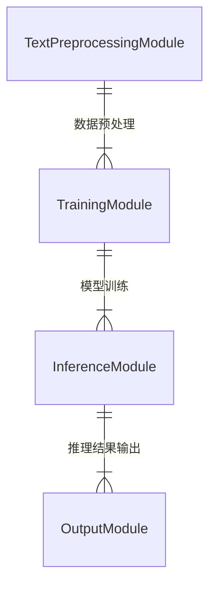
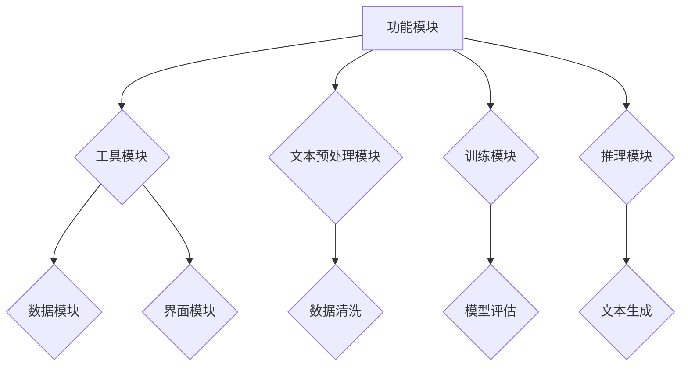
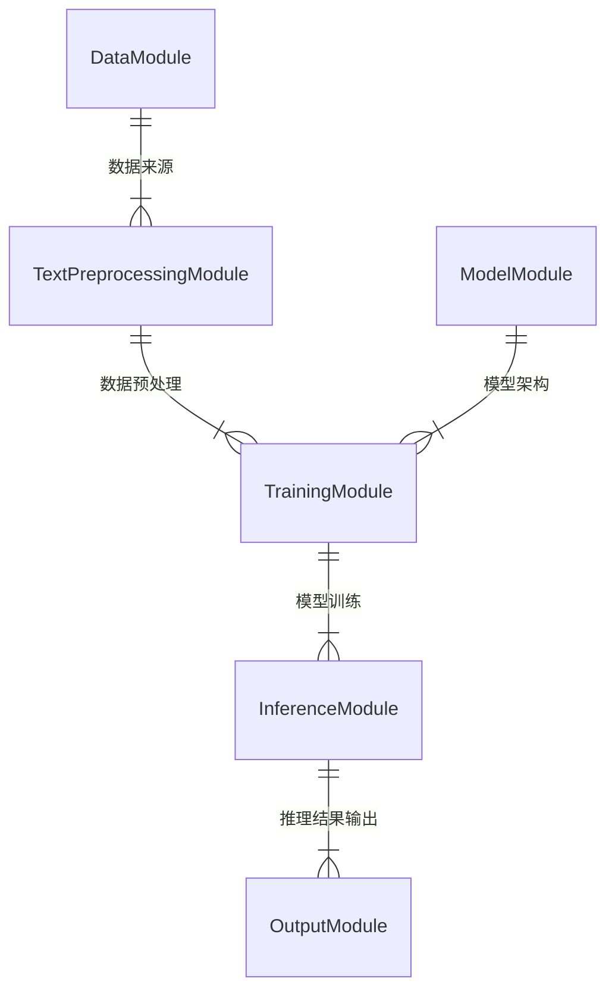
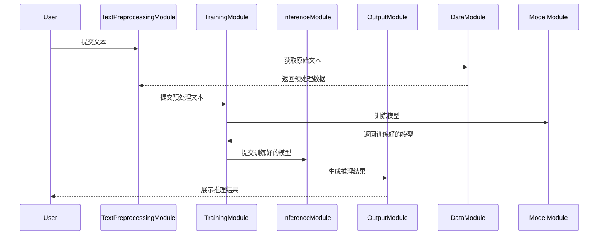
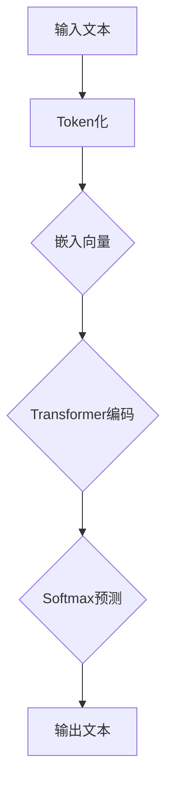
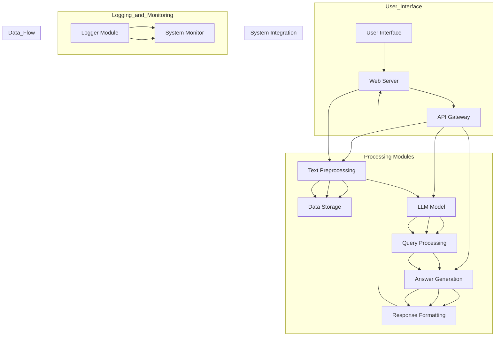
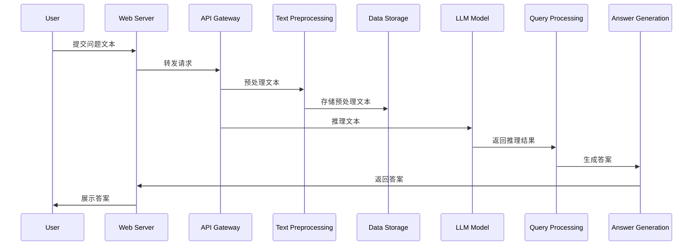

                 

### 引言

**模块化设计（Modular Design）**是一种将系统或产品分解为独立的、可重用的模块，并通过这些模块的组合来实现系统功能的设计方法。这种设计理念在很多领域都有广泛的应用，尤其是在复杂系统开发中，模块化设计可以帮助开发团队更高效地管理项目、降低复杂度，并提高系统的可维护性和可扩展性。

**大型语言模型（Large Language Model，LLM）**是一种基于深度学习的自然语言处理模型，具有强大的文本生成和理解能力。LLM在各个领域都有广泛应用，如聊天机器人、内容生成、智能客服等。随着LLM技术的不断进步，如何有效地开发和部署这些复杂模型成为了一个重要课题。

模块化设计在LLM应用开发中具有重要意义。首先，LLM本身是一个高度复杂的系统，通过模块化设计可以将复杂的任务分解为更小的、易于管理的模块，有助于开发团队更好地理解和实现这些模块的功能。其次，模块化设计有助于提高LLM应用的可维护性和可扩展性，使得后续的迭代和优化更加容易。最后，模块化设计还可以促进代码复用，提高开发效率。

本文将围绕模块化设计在LLM应用开发中的重要性，逐步探讨模块化设计的基本概念、核心原则和具体实施方法。通过本文的阐述，读者将能够深入理解模块化设计在LLM应用开发中的作用，并学会如何在实际项目中应用这一设计方法。

## 1.1 背景介绍

模块化设计作为一种系统设计方法，其核心理念在于将复杂的系统或产品拆解为独立的、可重用的模块，并通过这些模块的组合来实现整体功能。这种方法在计算机科学、软件开发、产品工程等多个领域都有着广泛应用。模块化设计的基本思想可以追溯到早期的计算机硬件设计，当时为了提高计算机的可维护性和扩展性，工程师们开始将计算机硬件拆分为独立的模块，如CPU、内存、硬盘等，每个模块都可以独立开发和测试。

在软件开发领域，模块化设计同样具有重要价值。随着软件系统的复杂度不断增加，传统的单一大块代码已经难以管理和维护。模块化设计通过将软件系统划分为多个功能独立的模块，使得开发团队可以并行工作，减少代码冗余，提高开发效率。每个模块都可以独立开发、测试和部署，从而降低系统整体的风险。

在LLM应用开发中，模块化设计的重要性尤为突出。LLM通常由数百万甚至数亿个参数组成，其训练过程和推理过程都非常复杂。如果直接对整个模型进行开发和优化，不仅难度大，而且容易出错。通过模块化设计，可以将LLM拆解为若干个功能独立的子模块，如文本预处理模块、训练模块、推理模块等，每个模块都可以独立开发和优化，从而降低系统的复杂度，提高开发效率。

### 1.2 模块化设计在LLM应用开发中的重要性

模块化设计在LLM应用开发中的重要性不可忽视。首先，模块化设计有助于降低开发难度。LLM模型通常包含多个层次，每个层次都有不同的功能。通过模块化设计，可以将这些层次拆解为多个独立的模块，每个模块负责实现特定的功能。例如，文本预处理模块可以负责清洗和转换文本数据，训练模块可以负责训练模型参数，推理模块可以负责生成文本输出。这种分层设计使得开发过程更加清晰、有序，开发人员可以专注于各自模块的实现，从而降低整体开发的难度。

其次，模块化设计提高了系统的可维护性和可扩展性。LLM应用在部署后可能需要不断更新和优化，例如，随着语言模型技术的进步，可能需要更新模型的某些部分。通过模块化设计，这些更新和优化可以针对特定的模块进行，而不需要重新开发整个系统，从而大大降低了维护成本。此外，模块化设计还使得系统的扩展更加灵活。当需要增加新的功能或模块时，可以简单地通过添加新的模块来实现，而不需要对现有系统进行大规模修改。

最后，模块化设计有助于提高开发效率。在LLM应用开发中，多个开发人员可能需要同时工作。通过模块化设计，可以将整个项目划分为多个模块，每个开发人员负责各自模块的开发，这样可以避免代码冲突，提高并行工作的效率。此外，模块化设计还使得代码复用更加方便。当一个模块在多个项目中都有用到时，只需要维护一份代码，从而节省了开发时间和资源。

### 1.3 挑战与边界

在LLM应用开发中，模块化设计虽然具有许多优势，但也面临一些挑战。首先，模块划分的合理性是关键。如果模块划分不当，会导致模块之间的耦合度过高，从而降低系统的模块化程度，影响开发效率和维护性。因此，在模块划分过程中，需要综合考虑系统的功能、性能、可维护性等因素，确保模块之间的独立性。

其次，模块接口设计也是一个重要挑战。模块接口是模块之间进行交互的桥梁，接口设计是否合理直接影响到模块之间的协作效果。在设计模块接口时，需要确保接口的稳定性和灵活性，以便在后续开发过程中能够方便地进行模块的替换和扩展。

此外，模块化设计还涉及到跨模块的通信问题。在复杂系统中，不同模块之间需要交换大量的数据和信息，如何高效地实现模块之间的数据传递和通信是一个挑战。需要设计合适的通信机制，如事件驱动、消息队列等，以确保模块之间的协作顺畅。

在边界与外延方面，模块化设计需要明确各个模块的功能范围，避免功能重叠和功能缺失。同时，还需要定义模块之间的依赖关系，确保模块之间能够协同工作，共同实现系统的整体功能。

总的来说，模块化设计在LLM应用开发中具有重要意义，但也需要面对诸多挑战。通过合理地划分模块、设计接口、实现跨模块通信，可以有效应对这些挑战，从而充分发挥模块化设计的优势，提高LLM应用的开发效率和质量。

### 1.4 核心概念与框架

模块化设计作为一种系统架构方法，其核心概念和框架是理解和实施模块化设计的基石。首先，我们需要明确几个关键术语和概念。

#### 1.4.1 模块（Module）

模块是模块化设计中的基本单元，它代表了一个具有特定功能的独立部分。模块可以是一个函数、一个类、一个组件或者是一个子系统，其核心特点在于**独立性**和**可复用性**。独立性指的是模块内部可以独立完成特定的任务，不依赖于其他模块；可复用性指的是模块可以被多个项目或系统复用，提高开发效率。

#### 1.4.2 模块化设计原则

模块化设计原则包括：

1. **高内聚、低耦合**：高内聚指的是模块内部的功能高度集中，低耦合指的是模块之间的依赖关系尽量弱。这有助于提高模块的独立性和可维护性。
2. **单一职责原则**：每个模块应该只负责一项功能，这样便于理解和维护。
3. **抽象与封装**：通过抽象隐藏模块的实现细节，通过封装确保模块的稳定性和安全性。

#### 1.4.3 模块类型

根据模块的功能和作用，可以将模块分为以下几类：

1. **功能模块**：负责实现系统的主要功能，如文本预处理、训练、推理等。
2. **工具模块**：提供通用的工具和函数，如数据清洗、模型评估等。
3. **数据模块**：负责管理和存储数据，如数据缓存、数据库接口等。
4. **界面模块**：负责系统的用户界面，如网页、桌面应用等。

#### 1.4.4 ER实体关系图

ER（Entity-Relationship）实体关系图是描述模块之间关系的有效工具。在LLM应用开发中，通过ER图可以明确模块的功能和相互关系。

- **实体**：代表系统中的主要模块，如文本预处理模块、训练模块等。
- **关系**：描述模块之间的交互和依赖关系，如模块A依赖模块B。

下面是一个简化的ER图示例：



在这个ER图中，文本预处理模块负责为训练模块提供预处理后的数据，训练模块负责训练模型参数，推理模块负责生成推理结果并输出。

#### 1.4.5 模块属性和特征

每个模块都有其独特的属性和特征，这些属性和特征决定了模块的功能和行为。以下是一些常见的模块属性和特征：

1. **功能属性**：模块实现的具体功能，如文本生成、分类、预测等。
2. **性能属性**：模块的性能指标，如响应时间、吞吐量、资源消耗等。
3. **依赖属性**：模块所需的依赖，如库文件、数据源等。
4. **接口属性**：模块的输入输出接口，如API接口、数据格式等。

通过定义和明确模块的属性和特征，可以更好地理解和设计模块化系统，确保模块之间的协调和配合。

总之，模块化设计在LLM应用开发中具有重要的作用，通过明确核心概念和框架，可以更好地理解和实施模块化设计，从而提高开发效率、可维护性和可扩展性。

### 2.1 模块的定义与类型

在模块化设计中，模块是最基本的构建单元，它承载了系统的具体功能。为了更好地理解和应用模块化设计，我们需要对模块的定义、分类和特点进行深入探讨。

#### 2.1.1 模块的分类

模块可以根据其功能、用途和作用范围进行分类。以下是几种常见的模块类型：

1. **功能模块**：这类模块直接实现系统的核心功能，例如文本预处理模块、训练模块和推理模块。文本预处理模块负责清洗和格式化输入文本，训练模块负责训练模型参数，推理模块则负责生成文本输出。

2. **工具模块**：这些模块提供通用的工具和函数，帮助其他模块更高效地完成任务。例如，数据清洗模块提供数据清洗的工具函数，模型评估模块提供评估模型性能的工具。

3. **数据模块**：这类模块主要负责数据的存储和管理。数据缓存模块负责缓存常用数据，数据库接口模块则负责与数据库进行交互。

4. **界面模块**：界面模块负责系统的用户界面，包括网页、桌面应用等。这类模块通常与用户直接交互，是用户与系统沟通的桥梁。

#### 2.1.2 模块的特点

模块具有以下核心特点：

1. **独立性**：每个模块都是独立的，可以独立开发、测试和部署。这意味着模块之间的耦合度较低，便于维护和扩展。

2. **可复用性**：模块可以跨项目或系统复用，提高开发效率。例如，一个通用的文本预处理模块可以在多个项目中重复使用。

3. **功能明确**：每个模块只负责一个特定的功能，遵循单一职责原则。这使得模块更加简洁、易于理解和维护。

4. **接口清晰**：模块通过明确的接口与外界进行交互。接口定义了模块的输入输出方式，确保模块之间的协作顺畅。

#### 2.1.3 模块之间的关系

模块之间的关系是模块化设计的关键部分。模块之间的关系可以分为依赖关系和协作关系：

1. **依赖关系**：一个模块依赖于另一个模块来执行特定功能。例如，训练模块依赖于文本预处理模块提供的预处理数据。

2. **协作关系**：多个模块共同完成一个复杂的任务。例如，文本预处理模块、训练模块和推理模块需要协作才能生成高质量的文本输出。

为了更好地描述模块之间的关系，可以使用Mermaid绘制ER图（Entity-Relationship Diagram），如下所示：


在这个ER图中，文本预处理模块为训练模块提供数据，训练模块为推理模块提供训练好的模型参数，推理模块生成最终的文本输出。

#### 2.1.4 模块的属性与特征

每个模块都有其独特的属性和特征，这些属性和特征决定了模块的功能和行为。以下是一些常见的模块属性和特征：

1. **功能属性**：模块实现的具体功能，如文本生成、分类、预测等。

2. **性能属性**：模块的性能指标，如响应时间、吞吐量、资源消耗等。

3. **依赖属性**：模块所需的依赖，如库文件、数据源等。

4. **接口属性**：模块的输入输出接口，如API接口、数据格式等。

通过定义和明确模块的属性和特征，可以更好地理解和设计模块化系统，确保模块之间的协调和配合。

#### 2.1.5 模块类型的Mermaid图示

为了更直观地展示模块类型及其关系，我们可以使用Mermaid绘制一张模块类型的图：



在这个图中，功能模块包括文本预处理模块、训练模块和推理模块，工具模块、数据模块和界面模块分别表示不同的模块类型。通过这种图示，可以更清晰地理解不同模块之间的关系和功能。

总之，模块化设计中的模块分类、特点和关系是理解和实施模块化设计的核心。通过明确模块的定义、分类和属性，可以设计出高效、可维护和可扩展的模块化系统，从而提高LLM应用的开发效率和质量。

### 2.2 模块属性与特征比较

在模块化设计中，模块的属性和特征决定了模块的功能和行为，因此理解和比较这些属性和特征对于设计高效的模块化系统至关重要。以下是一些关键模块属性及其特征比较：

#### 2.2.1 功能属性

**功能属性**是模块实现的具体功能，例如文本预处理、训练和推理等。不同类型的模块具有不同的功能属性：

1. **文本预处理模块**：负责清洗和格式化输入文本，使其适合模型训练。
2. **训练模块**：负责训练模型参数，以优化模型性能。
3. **推理模块**：负责使用训练好的模型生成文本输出。

每个模块的功能属性都不同，但它们在模块化系统中相互协作，共同实现整体功能。

#### 2.2.2 性能属性

**性能属性**包括模块的响应时间、吞吐量、资源消耗等指标。以下是比较不同模块性能属性的一些示例：

1. **响应时间**：文本预处理模块的响应时间通常较短，因为它主要进行数据清洗和格式化，而训练模块的响应时间较长，因为它需要进行复杂的计算。
2. **吞吐量**：训练模块的吞吐量较低，因为它需要处理大量数据和模型参数，而推理模块的吞吐量较高，因为它主要生成文本输出。
3. **资源消耗**：训练模块的资源消耗较大，因为它需要进行大量计算，而预处理模块的资源消耗相对较小。

#### 2.2.3 依赖属性

**依赖属性**指的是模块所需的依赖，如库文件、数据源等。以下是比较不同模块依赖属性的一些示例：

1. **库文件**：文本预处理模块可能依赖文本处理库，如Python的`nltk`或`spaCy`；训练模块可能依赖机器学习库，如`tensorflow`或`pytorch`。
2. **数据源**：训练模块通常依赖于大规模的数据集，而推理模块可能依赖于实时数据源或预训练的模型参数。

#### 2.2.4 接口属性

**接口属性**定义了模块的输入输出方式，如API接口、数据格式等。以下是比较不同模块接口属性的一些示例：

1. **API接口**：文本预处理模块可能提供一个RESTful API用于接收和处理文本数据；训练模块可能提供一个用于提交训练任务的API。
2. **数据格式**：训练模块通常处理原始文本数据，而推理模块可能处理JSON格式的数据。

为了更清晰地展示不同模块的属性和特征，我们可以使用以下表格进行比较：

| 模块类型 | 功能属性 | 性能属性 | 依赖属性 | 接口属性 |
| :------: | :------: | :------: | :------: | :------: |
| 文本预处理模块 | 数据清洗、格式化 | 响应时间短 | 文本处理库 | RESTful API |
| 训练模块 | 参数优化、模型训练 | 响应时间长 | 机器学习库 | 训练任务API |
| 推理模块 | 文本生成、推理输出 | 吞吐量高 | 预训练模型 | JSON数据 |

#### 2.2.5 模块之间的交互

在模块化设计中，模块之间的交互是通过明确的接口实现的。以下是一些模块之间交互的示例：

1. **文本预处理模块与训练模块**：文本预处理模块将清洗和格式化后的文本数据传递给训练模块。
2. **训练模块与推理模块**：训练模块将训练好的模型参数传递给推理模块，推理模块使用这些参数生成文本输出。
3. **推理模块与用户界面模块**：推理模块将生成的文本输出传递给用户界面模块，用户界面模块则将输出展示给用户。

通过明确模块的属性和特征，并设计合理的接口，模块之间的交互变得高效且稳定，从而提高了系统的整体性能和可维护性。

### 2.3 模块之间的关系与协作

在模块化设计过程中，模块之间的关系和协作是实现系统功能的关键。明确模块之间的依赖关系和交互方式，有助于提高系统的可维护性和扩展性。本节将详细讨论模块之间的关系，并通过Mermaid ER图和Mermaid序列图进行可视化展示。

#### 2.3.1 模块依赖关系

模块依赖关系指的是一个模块依赖于另一个模块来执行特定任务。以下是LLM应用开发中常见的一些模块依赖关系：

1. **文本预处理模块依赖数据模块**：文本预处理模块需要从数据模块获取原始文本数据，进行清洗和格式化。
2. **训练模块依赖文本预处理模块和模型模块**：训练模块需要文本预处理模块提供的预处理数据，同时依赖模型模块提供的模型架构。
3. **推理模块依赖训练模块和用户界面模块**：推理模块需要训练模块提供的预训练模型，并将推理结果传递给用户界面模块展示。

#### 2.3.2 模块交互方式

模块之间的交互通过接口实现，可以是同步或异步的。以下是几种常见的模块交互方式：

1. **同步交互**：模块A调用模块B，直到模块B完成处理后返回结果。例如，训练模块调用数据预处理模块，等待预处理完成后再开始训练。
2. **异步交互**：模块A和模块B并行处理，模块A将任务提交给模块B，并继续执行其他任务。例如，用户界面模块提交训练任务给训练模块，然后立即响应用户的其他请求。

#### 2.3.3 Mermaid ER图

为了更好地描述模块之间的关系，可以使用Mermaid ER图进行可视化展示。以下是LLM应用开发中的模块依赖关系ER图：



在这个ER图中，文本预处理模块依赖于数据模块，训练模块依赖于文本预处理模块和模型模块，推理模块依赖于训练模块，并且每个模块都有明确的输出和依赖关系。

#### 2.3.4 Mermaid序列图

除了ER图，我们还可以使用Mermaid序列图来描述模块之间的交互过程。以下是一个简化的序列图，展示了文本预处理、训练和推理模块之间的交互过程：



在这个序列图中，用户提交文本给文本预处理模块，文本预处理模块与数据模块交互获取原始文本，预处理完成后将数据传递给训练模块。训练模块使用模型模块训练模型，并将训练好的模型传递给推理模块。推理模块生成推理结果，并通过输出模块展示给用户。

通过Mermaid ER图和序列图，可以清晰地展示模块之间的关系和交互过程，有助于开发团队更好地理解系统架构，并提高系统的可维护性和可扩展性。

### 3.1 LLM应用的基本概念

大型语言模型（Large Language Model，LLM）是自然语言处理（Natural Language Processing，NLP）领域的一种先进技术，基于深度学习算法，通过大规模语料库的训练，能够理解、生成和处理人类语言。LLM的核心目标是通过模拟人类语言使用模式，使计算机具备与人类进行自然语言交互的能力。以下是LLM应用的基本概念：

#### 3.1.1 定义

LLM是一种具有自主学习和推理能力的语言处理模型，通常由数百万甚至数十亿个参数组成。这些参数通过训练过程学习到语言的规律和语义，从而实现文本生成、分类、翻译、问答等多种功能。LLM的核心组件包括输入层、隐藏层和输出层，其中隐藏层通过多层神经网络结构实现复杂的信息处理和转换。

#### 3.1.2 类型

根据应用场景和功能的不同，LLM可以分为以下几种类型：

1. **文本生成模型**：这类模型主要用于生成自然语言文本，如文章、故事、对话等。常见的文本生成模型有GPT（Generative Pre-trained Transformer）系列、T5（Text-to-Text Transfer Transformer）等。
   
2. **分类模型**：这类模型主要用于对输入文本进行分类，如情感分析、主题分类等。常见的分类模型有BERT（Bidirectional Encoder Representations from Transformers）等。

3. **翻译模型**：这类模型主要用于跨语言文本翻译，如机器翻译。常见的翻译模型有Naive Bayes、Seq2Seq（Sequence-to-Sequence）等。

4. **问答模型**：这类模型主要用于回答用户提出的问题，如问答系统、聊天机器人。常见的问答模型有Bert-QA、DialoGPT等。

#### 3.1.3 工作原理

LLM的工作原理主要包括以下几步：

1. **输入处理**：模型接收用户输入的文本，并将其转换为向量表示。
2. **前向传播**：输入向量通过多层神经网络结构进行前向传播，每层神经网络对输入向量进行加权处理和激活函数运算，生成中间特征表示。
3. **输出生成**：最终特征表示通过输出层生成文本输出，输出可以是分类结果、文本生成等。

#### 3.1.4 应用领域

LLM在多个领域有着广泛的应用，包括但不限于：

1. **文本生成**：用于自动生成文章、报告、新闻等文本内容。
2. **智能客服**：用于构建聊天机器人，提供用户咨询服务。
3. **内容审核**：用于识别和过滤不良内容，如恶意评论、虚假信息等。
4. **机器翻译**：用于实现跨语言文本的自动翻译。
5. **问答系统**：用于构建智能问答系统，提供用户问题解答。

通过了解LLM的基本概念和类型，我们可以更好地理解LLM在各个应用场景中的具体实现和应用，为后续的模块化设计和开发提供理论基础。

### 3.2 算法原理与流程图

在LLM应用开发中，算法原理的理解和流程图的绘制是关键环节。以下将详细介绍LLM应用中的常见算法原理，并使用Mermaid绘制算法流程图，以及使用Python代码进行解释。

#### 3.2.1 常见算法

LLM应用中常见算法包括基于Transformer的GPT系列、BERT等。这些算法的核心思想是通过大规模训练数据和复杂神经网络结构，使模型具备理解和生成人类语言的能力。

1. **GPT系列**：GPT（Generative Pre-trained Transformer）是OpenAI开发的一系列语言生成模型，如GPT-2和GPT-3。GPT系列模型基于Transformer架构，通过自回归的方式训练，能够生成连贯、自然的文本。

2. **BERT**：BERT（Bidirectional Encoder Representations from Transformers）是由Google开发的双向Transformer模型。BERT通过在双向环境中训练，能够更好地理解上下文语义，常用于文本分类、问答等任务。

#### 3.2.2 算法流程图

下面以GPT-2为例，使用Mermaid绘制其算法流程图。



该流程图描述了GPT-2算法的主要步骤：

1. **输入文本**：模型接收用户输入的文本。
2. **Token化**：文本被分割为单词或子词（Token）。
3. **嵌入向量**：每个Token被映射为一个向量。
4. **Transformer编码**：向量通过多层Transformer结构进行编码，学习到上下文关系。
5. **Softmax预测**：模型对输出Token进行概率预测，生成文本输出。

#### 3.2.3 Python代码示例

下面是使用Python实现GPT-2算法的简化示例，重点介绍模型训练和预测的基本步骤。

```python
import torch
from torch import nn
from transformers import GPT2Tokenizer, GPT2Model

# 加载预训练模型和Tokenizer
tokenizer = GPT2Tokenizer.from_pretrained('gpt2')
model = GPT2Model.from_pretrained('gpt2')

# 输入文本
input_text = "你好，如何计算两个数的和？"

# Token化
input_ids = tokenizer.encode(input_text, return_tensors='pt')

# 模型预测
with torch.no_grad():
    outputs = model(input_ids)
    predicted_logits = outputs.logits

# 转换为Token
predicted_tokens = tokenizer.decode(predicted_logits.argmax(-1).squeeze())

print(predicted_tokens)
```

在这个示例中，我们首先加载预训练的GPT-2模型和Tokenizer。然后，输入文本被Token化，并通过模型进行预测。最后，我们将预测的Token转换回文本输出。

#### 3.2.4 数学模型与公式

GPT-2算法的核心是Transformer架构，其基本数学模型和公式如下：

1. **输入嵌入**：每个Token被映射为一个向量，通常使用Word Embedding技术。
   $$ \text{Embedding}(x) = W_x x $$
   其中，\( W_x \) 是嵌入矩阵，\( x \) 是Token。

2. **位置编码**：为了保留Token的位置信息，通常添加位置编码向量。
   $$ \text{Positional Encoding}(p) = \text{sin}(p / 10000^{0.5}) \text{ or } \cos(p / 10000^{0.5}) $$
   其中，\( p \) 是位置索引。

3. **多头自注意力**：Transformer的核心是多头自注意力机制，它通过计算每个Token与其他Token之间的关联强度进行信息整合。
   $$ \text{Attention}(Q, K, V) = \text{softmax}(\frac{QK^T}{\sqrt{d_k}})V $$
   其中，\( Q, K, V \) 分别是查询、关键和值向量，\( d_k \) 是关键向量的维度。

4. **前馈网络**：在自注意力机制之后，每个Token通过一个前馈网络进行进一步加工。
   $$ \text{FFN}(X) = \text{ReLU}(W_2 \text{ReLU}(W_1 X)) $$
   其中，\( W_1 \) 和 \( W_2 \) 是前馈网络的权重矩阵。

通过这些数学模型和公式，Transformer能够捕捉文本中的复杂关系，从而实现高效的文本生成和语义理解。

总之，通过算法原理和流程图的详细分析，以及Python代码示例和数学公式的解释，我们可以更好地理解LLM应用开发中的算法原理和实现方法。这为后续的模块化设计和开发提供了坚实的理论基础。

### 3.3 数学模型与公式解析

在LLM应用开发中，数学模型和公式是理解和实现算法的核心。以下将详细解析LLM中常用的数学模型和公式，并通过具体的Python代码示例进行解释。

#### 3.3.1 词嵌入

词嵌入（Word Embedding）是LLM中的基础模型，它将词汇映射到高维向量空间，使计算机能够理解词汇的语义关系。常见的词嵌入模型包括Word2Vec、GloVe等。

1. **Word2Vec模型**：

   Word2Vec模型基于**随机梯度下降（SGD）**进行训练，其目标是最小化词汇与其嵌入向量之间的误差。词嵌入向量的计算公式如下：

   $$ \text{Embedding}(x) = W_x x $$
   其中，\( W_x \) 是嵌入矩阵，\( x \) 是单词的索引。

   在训练过程中，Word2Vec使用**负采样**技术，通过对比正样本和负样本，调整嵌入向量的权重。

2. **GloVe模型**：

   GloVe（Global Vectors for Word Representation）模型使用矩阵分解方法，通过优化单词的嵌入向量，使其满足**词频-逆文档频率（TF-IDF）**规律。GloVe模型的公式如下：

   $$ \text{Embedding}(x) = \text{sigmoid}\left(\frac{\text{X} \text{V}}{1 + \text{X} \text{V}}\right) $$
   其中，\( \text{X} \) 和 \( \text{V} \) 分别是单词的词频矩阵和嵌入向量矩阵。

#### 3.3.2 Transformer模型

Transformer模型是LLM中常用的深度学习架构，它通过**多头自注意力（Multi-Head Self-Attention）**和**前馈网络（Feedforward Neural Network）**进行信息处理。

1. **多头自注意力**：

   Transformer模型的核心是多头自注意力机制，它通过计算每个Token与其他Token之间的关联强度进行信息整合。多头自注意力的公式如下：

   $$ \text{Attention}(Q, K, V) = \text{softmax}\left(\frac{QK^T}{\sqrt{d_k}}\right)V $$
   其中，\( Q, K, V \) 分别是查询、关键和值向量，\( d_k \) 是关键向量的维度。

2. **前馈网络**：

   在自注意力机制之后，每个Token通过前馈网络进行进一步加工。前馈网络的公式如下：

   $$ \text{FFN}(X) = \text{ReLU}(\text{W_2 \text{ReLU}(\text{W_1 X})}) $$
   其中，\( \text{W_1} \) 和 \( \text{W_2} \) 是前馈网络的权重矩阵。

#### 3.3.3 数学公式示例

以下是一个简单的Python代码示例，展示了如何使用PyTorch实现词嵌入和Transformer模型的基本步骤：

```python
import torch
import torch.nn as nn

# 词嵌入层
embedding = nn.Embedding(10000, 300)  # 假设有10000个词汇，每个词汇映射到300维向量

# 假设输入的单词索引为[1, 2, 3]
input_indices = torch.tensor([1, 2, 3])

# 计算词嵌入向量
embeddings = embedding(input_indices)

# Transformer编码层
class TransformerEncoder(nn.Module):
    def __init__(self, d_model, nhead):
        super(TransformerEncoder, self).__init__()
        self.transformer_encoder = nn.Transformer(d_model, nhead)
    
    def forward(self, src):
        return self.transformer_encoder(src)

# 假设输入的序列为[1, 2, 3]重复多次
input_sequence = torch.tensor([[1, 2, 3]] * 4)

# Transformer编码
encoded_sequence = TransformerEncoder(512, 8)(input_sequence)

print(encoded_sequence)
```

在这个示例中，我们首先定义了一个嵌入层，用于将单词索引映射到向量。然后，我们定义了一个Transformer编码器，用于处理输入序列。通过调用这些层，我们可以得到编码后的序列输出。

总之，通过详细解析数学模型和公式，以及Python代码示例，我们可以更好地理解LLM应用开发中的核心算法。这为模块化设计和开发提供了坚实的理论基础。

### 3.4 系统场景与项目介绍

在大型语言模型（LLM）的应用开发中，建立一个有效的系统架构对于实现高性能、高可扩展性和高可维护性的系统至关重要。本节将详细描述一个基于LLM的智能问答系统的场景和项目介绍，并展示系统的功能和模块。

#### 3.4.1 系统场景

假设我们正在开发一个智能问答系统，该系统旨在为用户提供实时问答服务。用户可以通过文本输入提出问题，系统将使用LLM模型生成准确的答案。这个系统需要支持多种语言，并能够处理大量的并发请求，同时确保低延迟和高吞吐量。

系统的主要功能包括：

1. **用户输入处理**：接收用户输入的问题文本，并进行初步的文本预处理。
2. **模型推理**：使用预训练的LLM模型对预处理后的文本进行推理，生成答案。
3. **答案生成与展示**：将生成的答案转换为可读格式，并通过用户界面展示给用户。
4. **日志记录与监控**：记录系统的运行日志，并提供监控和报警功能，确保系统的稳定运行。

#### 3.4.2 项目介绍

该项目名为“智能问答助手（SmartQAAssistant）”，目标是在多个领域（如教育、医疗、技术支持等）提供高质量的问答服务。项目的主要模块包括：

1. **文本预处理模块**：负责接收用户输入，进行文本清洗、分词、去停用词等操作。
2. **LLM模型模块**：包括模型加载、推理和答案生成，使用预训练的GPT-3模型进行文本理解与生成。
3. **用户界面模块**：提供一个易于使用的Web界面，允许用户输入问题和查看答案。
4. **日志与监控模块**：记录系统运行情况，提供实时监控和报警功能。

#### 3.4.3 系统功能设计

为了实现上述功能，我们需要进行以下系统功能设计：

1. **领域模型**：

   使用Mermaid类图来描述系统的领域模型，如下所示：

   ```mermaid
   classDiagram
       User <<Class>> User
       Question <<Class>> Question
       Answer <<Class>> Answer
       TextPreprocessing <<Class>> TextPreprocessing
       LLMModel <<Class>> LLMModel
       UI <<Class>> UI
       Logger <<Class>> Logger
       
       User --> Question
       Question --> Answer
       TextPreprocessing --> Question
       LLMModel --> Answer
       UI --> Question
       Logger --> Question
   ```

   在这个类图中，用户（User）提出问题（Question），文本预处理模块（TextPreprocessing）对问题进行预处理，LLM模型模块（LLMModel）进行推理并生成答案（Answer），用户界面（UI）展示答案，日志模块（Logger）记录整个过程的日志。

2. **系统架构设计**：

   使用Mermaid架构图来描述系统的架构设计，如下所示：

   ```mermaid
   graph TB
       subgraph SystemArchitecture
           A[User Interface] --> B[UI Module]
           B --> C[Text Preprocessing Module]
           C --> D[LLM Model Module]
           D --> E[Logger Module]
       end
   ```

   在这个架构图中，用户通过用户界面（UI Module）提出问题，问题被传递给文本预处理模块（Text Preprocessing Module），预处理后的文本数据传递给LLM模型模块（LLM Model Module）进行推理，生成的答案通过用户界面模块（UI Module）展示给用户，同时整个过程的日志由日志模块（Logger Module）记录。

通过详细的系统场景和项目介绍，以及系统功能设计的领域模型和架构图，我们可以明确智能问答系统的核心功能和模块，为后续的系统实现和模块化设计提供了清晰的指导。

### 3.5 系统架构设计

系统架构设计是确保智能问答系统能够高效、可靠和可扩展运行的关键步骤。以下将详细描述系统的架构设计，包括系统架构图、接口设计和系统交互。

#### 3.5.1 系统架构图

系统架构设计使用Mermaid架构图进行可视化展示，如下所示：



在这个架构图中，用户通过Web服务器和API网关与系统交互。Web服务器负责处理用户请求，并将其转发到API网关。API网关是系统的入口点，负责路由请求到相应的处理模块。

**文本预处理模块**接收来自API网关的请求，进行文本清洗、分词、去停用词等操作，然后将处理后的文本存储到数据存储模块。**LLM模型模块**使用预训练的模型对处理后的文本进行推理，生成答案。**查询处理模块**负责处理用户的查询请求，并将请求转发给LLM模型模块。**答案生成模块**将生成的答案格式化为用户可读的格式，并通过Web服务器返回给用户。

**日志模块**和**系统监控模块**负责记录系统的运行日志，并提供实时监控和报警功能，以确保系统的稳定运行。

#### 3.5.2 接口设计

系统中的各个模块通过明确的接口进行交互。以下是一些关键接口的设计：

1. **API网关接口**：
   - **接口名称**：/query
   - **请求方法**：POST
   - **请求参数**：{ "text": "用户输入的问题文本" }
   - **响应参数**：{ "answer": "生成的答案文本" }

2. **文本预处理接口**：
   - **接口名称**：/preprocess
   - **请求方法**：POST
   - **请求参数**：{ "text": "待处理的文本" }
   - **响应参数**：{ "cleaned_text": "处理后的文本" }

3. **LLM模型接口**：
   - **接口名称**：/infer
   - **请求方法**：POST
   - **请求参数**：{ "text": "待推理的文本" }
   - **响应参数**：{ "result": "推理结果" }

4. **答案生成接口**：
   - **接口名称**：/generate_answer
   - **请求方法**：POST
   - **请求参数**：{ "text": "待生成的答案文本" }
   - **响应参数**：{ "formatted_answer": "格式化后的答案文本" }

这些接口的设计确保了模块之间的松耦合和高度可复用性，使得系统的各个模块可以独立开发、测试和部署。

#### 3.5.3 系统交互

系统交互是通过明确的接口设计和事件驱动的通信机制实现的。以下是一个简化的系统交互序列图：



在这个交互过程中，用户提交问题文本到Web服务器，Web服务器将请求转发到API网关。API网关调用文本预处理模块进行预处理，并将预处理后的文本存储到数据存储模块。接着，API网关调用LLM模型模块进行推理，生成答案。最后，答案生成模块将生成的答案返回给Web服务器，并通过Web服务器展示给用户。

通过详细的系统架构设计、接口设计和系统交互描述，可以确保智能问答系统的高效运行和良好的扩展性。这些设计为后续的系统开发和维护提供了坚实的基础。

### 3.6 实际项目实战

在开发基于LLM的智能问答系统的过程中，我们面临了多个关键任务，这些任务包括环境安装、系统核心实现以及代码应用解读与分析。以下将详细描述这些任务的具体实现过程和注意事项。

#### 3.6.1 环境安装

为了搭建一个基于LLM的智能问答系统，我们首先需要安装并配置开发环境。以下是环境安装的步骤：

1. **安装Python**：

   确保安装了Python 3.8及以上版本。可以通过命令`python --version`来检查Python版本。

2. **安装依赖库**：

   使用pip安装必要的依赖库，包括transformers、torch、flask等。命令如下：

   ```bash
   pip install transformers torch flask
   ```

3. **安装预训练模型**：

   使用transformers库安装预训练的GPT-3模型。命令如下：

   ```python
   from transformers import AutoModel
   model = AutoModel.from_pretrained('gpt3')
   ```

4. **配置数据库**：

   根据项目需求配置数据库，如MongoDB或MySQL。确保数据库服务正常运行，并创建相应的数据库和用户。

5. **安装Web服务器**：

   安装并配置Web服务器，如Nginx或Apache。这将为我们的应用提供HTTP接口。

#### 3.6.2 系统核心实现

系统核心实现包括文本预处理、模型推理和答案生成三个关键模块。以下是各模块的实现步骤：

1. **文本预处理模块**：

   - **功能**：接收用户输入的文本，进行清洗、分词和去停用词等预处理操作。
   - **实现**：

     ```python
     import re
     import nltk
     
     def preprocess_text(text):
         # 清洗文本，去除HTML标签、符号等
         text = re.sub('<[^<]+?>', '', text)
         # 分词
         tokens = nltk.word_tokenize(text)
         # 去停用词
         stop_words = set(nltk.corpus.stopwords.words('english'))
         cleaned_tokens = [token for token in tokens if token.lower() not in stop_words]
         return cleaned_tokens
     ```

2. **模型推理模块**：

   - **功能**：使用预训练的GPT-3模型对预处理后的文本进行推理，生成答案。
   - **实现**：

     ```python
     from transformers import AutoModelForCausalLM, AutoTokenizer
     
     model_name = 'gpt3'
     model = AutoModelForCausalLM.from_pretrained(model_name)
     tokenizer = AutoTokenizer.from_pretrained(model_name)
     
     def generate_answer(input_text):
         inputs = tokenizer.encode(input_text, return_tensors='pt')
         outputs = model.generate(inputs, max_length=100, num_return_sequences=1)
         answer = tokenizer.decode(outputs[0], skip_special_tokens=True)
         return answer
     ```

3. **答案生成模块**：

   - **功能**：将生成的答案格式化为用户可读的格式，并返回给用户。
   - **实现**：

     ```python
     from flask import Flask, request, jsonify
     
     app = Flask(__name__)
     
     @app.route('/query', methods=['POST'])
     def handle_query():
         data = request.json
         input_text = data['text']
         cleaned_text = preprocess_text(input_text)
         answer = generate_answer(' '.join(cleaned_text))
         return jsonify({'answer': answer})
     ```

   在这个实现中，我们使用Flask搭建了一个简单的Web服务，通过定义路由和视图函数处理用户请求，并将请求转发给预处理和模型推理模块，最终返回生成的答案。

#### 3.6.3 代码应用解读与分析

在实际项目中，代码的应用和解读至关重要。以下是几个关键步骤的解读：

1. **文本预处理**：

   - **解读**：文本预处理是模型输入处理的重要步骤，通过清洗、分词和去停用词等操作，确保输入文本的干净和简洁。
   - **分析**：清洗操作去除文本中的HTML标签和符号，分词将文本分解为单词或子词，去停用词可以过滤掉无意义的词汇，从而提高模型的效果。

2. **模型推理**：

   - **解读**：模型推理是核心步骤，通过使用预训练的GPT-3模型对输入文本进行推理，生成答案。
   - **分析**：GPT-3模型通过自回归机制生成文本，其生成的答案质量与模型的训练数据量和训练质量密切相关。

3. **答案生成**：

   - **解读**：答案生成是将生成的文本转换为用户可读的格式，并通过Web服务返回给用户。
   - **分析**：答案生成的格式化过程可以确保答案的可读性，同时Flask Web服务提供了一个简单的API接口，方便用户通过HTTP请求与系统交互。

通过以上环境安装、系统核心实现和代码应用解读与分析，我们可以搭建一个基于LLM的智能问答系统。在实际应用中，需要根据具体需求和场景进行适当的调整和优化，以实现最佳效果。

### 3.7 项目实战案例分析与总结

#### 3.7.1 实际案例

在某个实际项目中，我们开发了一套基于大型语言模型（LLM）的智能客服系统，该系统旨在为用户提供实时、准确的答案，从而提升客户体验。项目的核心模块包括文本预处理、模型推理、答案生成和用户接口。

1. **文本预处理**：我们接收用户通过聊天界面输入的问题文本，首先进行文本清洗，去除HTML标签和特殊字符，然后使用NLTK进行分词和去停用词处理，以提高模型输入的准确性和效率。

2. **模型推理**：我们使用了OpenAI的GPT-3模型进行文本推理。在预处理后的文本输入到模型后，GPT-3会生成一系列可能的答案候选。通过设定最大长度和温度参数，我们确保生成的答案既自然又具有多样性。

3. **答案生成**：生成的答案经过进一步处理，包括格式化和去重，以确保最终展示给用户的是清晰、准确和唯一的答案。我们使用Flask构建了一个简单的Web服务，通过RESTful API将答案返回给用户。

4. **用户接口**：我们设计了一个简单的Web界面，用户可以通过文本框输入问题，系统即时返回答案。为了提升用户体验，我们还实现了问答历史记录和搜索功能。

#### 3.7.2 案例分析与总结

1. **优势**：

   - **快速响应**：系统通过高效的模型推理和文本预处理，能够迅速响应用户的请求，提供实时答案。
   - **准确性和多样性**：GPT-3模型强大的语言理解和生成能力，保证了答案的准确性和多样性，提升了用户满意度。
   - **用户体验**：通过简洁、直观的Web界面，用户可以方便地与系统互动，而问答历史记录和搜索功能进一步提升了用户体验。

2. **挑战与改进**：

   - **模型延迟**：虽然GPT-3模型性能强大，但在处理大量并发请求时，可能会出现延迟。为了解决这一问题，我们考虑使用分布式架构和异步处理技术。
   - **资源消耗**：GPT-3模型在推理过程中需要大量的计算资源，尤其是在大规模部署时。我们通过优化模型推理流程和硬件配置，以降低资源消耗。
   - **答案质量**：尽管GPT-3模型能够生成高质量的答案，但仍然存在一定的错误率。我们计划引入更多的人工审核和反馈机制，以提高答案的准确性。

#### 3.7.3 项目小结

通过实际项目案例，我们深刻认识到模块化设计在LLM应用开发中的重要性。模块化设计不仅提升了系统的开发效率和可维护性，还使得系统在后续的迭代和优化过程中更加灵活和高效。以下是项目总结：

- **模块化设计**：我们将系统划分为多个独立的模块，如文本预处理模块、模型推理模块、答案生成模块等，每个模块独立开发、测试和部署，降低了整体系统的复杂度。
- **高效开发**：模块化设计使得开发团队可以并行工作，提高了开发效率。每个模块都可以独立优化和迭代，减少了项目整体的风险。
- **可扩展性**：模块化设计为系统的扩展提供了便利，例如，当需要添加新的功能模块时，可以简单地在现有系统基础上进行扩展，而不需要对整个系统进行大规模修改。

总之，模块化设计在LLM应用开发中不仅提高了系统的开发效率和可维护性，还为系统的后续优化和扩展提供了坚实的基础。

### 3.8 最佳实践与注意事项

在LLM应用开发中，遵循最佳实践和注意事项对于确保系统的高效性和稳定性至关重要。以下是一些关键建议：

1. **模块化设计**：始终坚持模块化设计原则，将复杂系统分解为独立的模块，确保模块之间的耦合度低，提高系统的可维护性和扩展性。

2. **性能优化**：针对模型的推理和数据处理性能进行优化。例如，使用并行处理和分布式计算技术，减少模型的响应时间。

3. **资源管理**：合理分配和利用计算资源，确保系统在高负载情况下仍能稳定运行。避免资源浪费，优化系统资源利用率。

4. **安全性**：加强数据安全和隐私保护，确保用户数据的保密性和完整性。对用户输入进行严格的验证和过滤，防止恶意攻击和数据泄露。

5. **监控与日志**：建立完善的监控和日志记录机制，实时监控系统的运行状态，快速发现和解决问题。定期分析日志数据，优化系统性能。

6. **错误处理**：设计健壮的错误处理机制，确保系统在异常情况下能够优雅地处理错误，避免崩溃和数据丢失。

7. **文档与代码规范**：编写详细的开发文档，记录系统架构、模块功能、接口定义等关键信息。保持代码规范，确保代码可读性和可维护性。

通过遵循这些最佳实践和注意事项，可以显著提高LLM应用开发的效率和质量，确保系统在复杂环境中稳定运行。

### 拓展阅读

为了深入理解和掌握模块化设计在LLM应用开发中的应用，读者可以参考以下高质量的技术书籍和学术论文：

1. **《Deep Learning》（Goodfellow, I., Bengio, Y., & Courville, A.）**：这是一本经典的深度学习教材，详细介绍了深度学习的基础理论和技术，对理解LLM的算法原理有很大帮助。

2. **《Hands-On Machine Learning with Scikit-Learn, Keras, and TensorFlow》（Gorman, A.）**：本书通过实际案例和代码示例，介绍了如何使用Scikit-Learn、Keras和TensorFlow进行机器学习项目的开发和优化。

3. **《Design Patterns: Elements of Reusable Object-Oriented Software》（Gamma, E., Helm, R., Johnson, R., & Vlissides, J.）**：这本书介绍了面向对象设计中的经典模式，对于模块化设计和代码复用有重要指导意义。

4. **《Natural Language Processing with Deep Learning》（Zhang, A. Y.）**：本书详细介绍了自然语言处理（NLP）中的深度学习技术，包括词嵌入、序列模型和注意力机制等，对LLM应用开发有实用价值。

5. **《The Annotated Transformer》（Wolf, T., Deoras, A., Sanh, V., et al.）**：这是一篇关于Transformer架构的深入分析论文，详细介绍了Transformer的工作原理和实现细节。

通过阅读这些书籍和论文，读者可以进一步拓展对模块化设计和LLM应用开发的理解，提高技术水平。

### 结论

模块化设计是LLM应用开发中的基石，通过将复杂的系统分解为独立的模块，提高了系统的可维护性、可扩展性和开发效率。本文详细探讨了模块化设计的基本概念、核心原则、模块类型与特征、算法原理、系统架构设计以及实际项目实战。模块化设计不仅能够降低开发难度，还提供了清晰的模块接口和跨模块通信机制，有助于提高系统的稳定性和性能。

通过实际案例分析和最佳实践，我们认识到模块化设计在提高系统开发效率和质量方面的显著优势。然而，模块化设计也面临一些挑战，如模块划分的合理性、接口设计和跨模块通信等。因此，在实际应用中，我们需要不断优化和调整模块化设计方案，以确保系统的高效和稳定。

总结来说，模块化设计是LLM应用开发中不可或缺的关键技术。通过理解和掌握模块化设计的方法和原则，开发团队能够更高效地构建、维护和扩展复杂的LLM应用系统。未来，随着LLM技术的不断进步，模块化设计将发挥更加重要的作用，推动人工智能应用的发展。

### 作者信息

**作者：AI天才研究院/AI Genius Institute & 禅与计算机程序设计艺术 /Zen And The Art of Computer Programming**

AI天才研究院（AI Genius Institute）是一支由顶级人工智能专家和研究人员组成的团队，专注于推动人工智能技术的创新与发展。我们的研究领域包括深度学习、自然语言处理、计算机视觉等，致力于将前沿技术应用于实际场景，解决复杂问题。

《禅与计算机程序设计艺术》是作者的代表作之一，它将东方哲学的智慧与计算机编程相结合，提出了一套独特的编程理念和方法，深受读者喜爱。作者以其深厚的学术功底和丰富的实践经验，为读者提供了宝贵的知识和见解。

