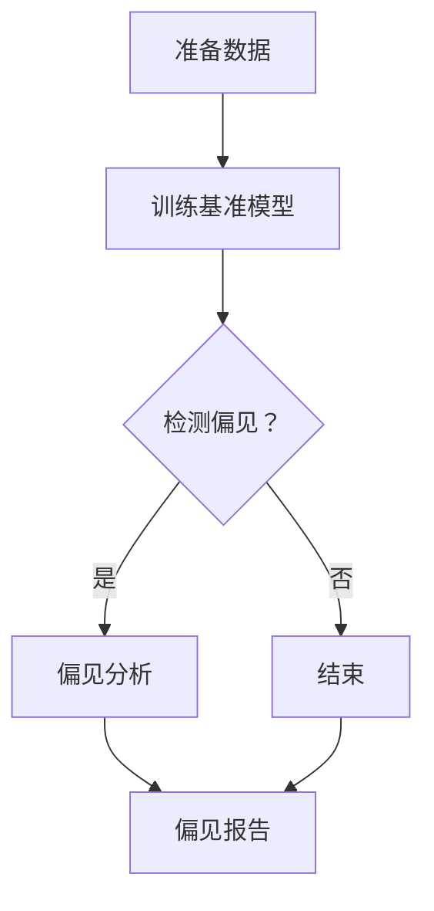
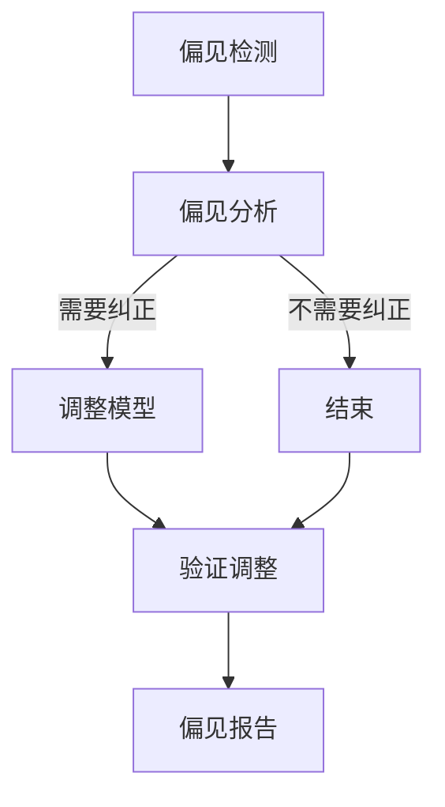
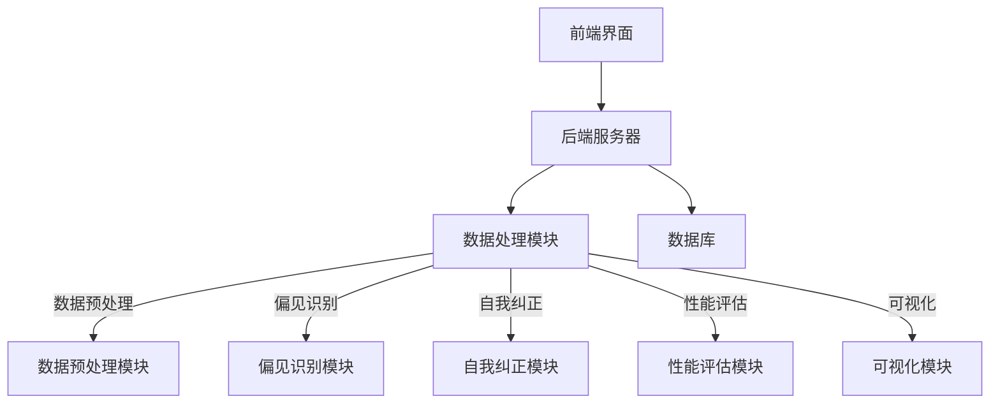

                 

### 摘要

随着人工智能技术的迅猛发展，模型偏见问题日益凸显，它不仅影响算法的公平性和透明性，还可能对社会产生深远的负面影响。为了解决这一问题，评估模型的自我纠正能力变得至关重要。《模型偏见自我纠正能力评估》旨在深入探讨如何评估和提升模型的自我纠正能力。本文首先介绍模型偏见的概念及其对现实世界的负面影响，然后详细阐述自我纠正能力的定义及其重要性。通过对比偏见识别算法和自我纠正算法，本文使用mermaid流程图和Python代码解释评估模型偏见和自我纠正能力的算法原理。接着，本文使用LaTeX格式给出相关数学模型和公式，并详细讲解其含义和作用。此外，本文还介绍了评估模型偏见和自我纠正能力所需的系统功能和架构设计，并通过实际项目展示如何将这些理论与方法应用于实际场景。最后，本文提供了最佳实践 tips、小结和注意事项，为读者在应用中提供指导。本文的核心观点是，通过科学评估和持续改进，我们可以有效减少模型偏见，提升人工智能系统的公平性和透明性。### 第一部分：背景与概念

## 第1章 模型偏见的问题背景

### 1.1 模型偏见的概念

在人工智能（AI）领域，模型偏见是指机器学习模型在训练过程中学习到的、反映或强化了训练数据中的固有偏见。这些偏见可能源自训练数据的偏差、数据集的代表性不足，或者是模型本身的训练过程。偏见可以分为多种形式，包括性别偏见、种族偏见、年龄偏见等。例如，一个用于招聘的AI系统可能会根据历史数据表现出对某一性别或种族的偏好，从而拒绝或倾向于拒绝某些候选人的申请。

### 1.2 模型偏见的来源

模型偏见的主要来源包括以下几点：

1. **训练数据偏差**：如果训练数据本身存在偏差，例如数据集中男女比例不均，模型很可能会学习并复制这种偏见。
2. **数据集代表性不足**：当数据集不能充分代表真实世界时，模型可能会在特定群体上表现不佳，甚至产生错误的预测。
3. **模型设计缺陷**：一些模型在处理输入数据时可能会放大或维持原有的偏见。
4. **外部输入**：模型在使用过程中，可能会从外部输入中接收偏见，如新闻、社交媒体等。

### 1.3 模型偏见的影响

模型偏见可能带来以下负面影响：

1. **社会不公平**：模型偏见可能导致某些群体在就业、贷款、医疗保健等方面受到不公平对待。
2. **经济损失**：由于偏见导致的错误决策可能导致企业或政府在经济上的损失。
3. **法律风险**：如果模型偏见引发歧视性决策，企业或开发者可能会面临法律诉讼。
4. **公众信任**：持续的偏见问题会削弱公众对AI技术的信任，影响技术的广泛接受和应用。

### 1.4 自我纠正能力的重要性

为了应对模型偏见问题，自我纠正能力变得至关重要。自我纠正能力是指模型在识别和纠正偏见方面的能力。具体来说，它包括以下几点：

1. **偏见识别**：模型能够识别出自身训练过程中可能存在的偏见。
2. **纠正措施**：模型能够采取相应的措施来纠正偏见，例如重新训练或调整参数。
3. **透明性**：模型能够在决策过程中保持透明性，使偏见识别和纠正的过程可被理解和追踪。

### 1.5 自我纠正能力的优势

自我纠正能力的优势在于：

1. **提升公平性**：通过自我纠正，模型能够减少偏见，从而做出更加公平的决策。
2. **增强透明性**：自我纠正能力使得模型决策过程更加透明，有助于建立公众信任。
3. **持续改进**：自我纠正能力使得模型能够随着时间推移不断改进，适应不断变化的数据和环境。

### 1.6 自我纠正能力的挑战

然而，自我纠正能力也面临一些挑战：

1. **复杂性**：评估和实现自我纠正能力需要复杂的算法和计算资源。
2. **误报**：自我纠正可能会导致误报，即纠正偏见的同时引入新的错误。
3. **数据隐私**：在自我纠正过程中，可能会涉及到敏感数据的使用和处理，需要确保数据隐私不被泄露。
4. **法律和道德问题**：自我纠正可能会引发法律和道德争议，例如关于偏见纠正的边界和道德准则。

### 1.7 本章小结

模型偏见问题已经成为人工智能领域的重要议题，其影响深远且广泛。通过了解模型偏见的概念、来源和影响，我们可以认识到自我纠正能力的重要性。在后续章节中，我们将进一步探讨如何评估和提升模型的自我纠正能力，从而为构建更加公平、透明和可靠的人工智能系统奠定基础。### 第二部分：核心概念与联系

## 第2章 核心概念与联系

### 2.1 偏见识别算法

偏见识别算法是指用于检测和识别机器学习模型中偏见的一类算法。这些算法的核心目标是发现模型在决策过程中可能存在的偏见，并对其进行量化。以下是偏见识别算法的一些重要分类和原理：

#### 2.1.1 偏见识别算法的分类

1. **统计方法**：这类算法基于统计学原理，通过分析模型输出的概率分布来识别偏见。常见的统计方法包括频率分析、回归分析等。
2. **机器学习方法**：这类算法通过训练专门的模型来识别偏见。这些模型通常基于监督学习或无监督学习技术，如分类器和聚类算法。
3. **可视化方法**：这类算法通过可视化模型决策过程和特征空间，帮助人类直观地识别偏见。例如，决策树的可视化和敏感性分析。

#### 2.1.2 偏见识别算法的原理

偏见识别算法的基本原理包括以下几个步骤：

1. **数据准备**：收集并预处理训练数据，包括数据清洗、标准化和特征提取。
2. **模型训练**：使用训练数据训练一个基准模型，用于生成预测结果。
3. **偏见检测**：通过比较模型在不同群体上的预测结果，识别可能的偏见。常用的偏见检测方法包括偏差-方差分析、差异检验等。
4. **偏见量化**：对识别出的偏见进行量化，通常使用指标如偏见得分、偏见差异等。

#### 2.1.3 偏见识别算法的性能评估

偏见识别算法的性能评估通常涉及以下几个方面：

1. **准确性**：算法能够正确识别偏见的能力。
2. **灵敏度**：算法对微小偏见的检测能力。
3. **鲁棒性**：算法在不同数据集和模型上的稳定性和一致性。
4. **计算效率**：算法的执行时间和资源消耗。

### 2.2 自我纠正算法

自我纠正算法是指用于纠正机器学习模型偏见的一类算法。这些算法的核心目标是通过对模型进行调整，使其在决策过程中减少或消除偏见。以下是自我纠正算法的一些重要分类和原理：

#### 2.2.1 自我纠正算法的分类

1. **调整参数**：这类算法通过调整模型参数来减少偏见，例如通过正则化技术或损失函数调整。
2. **重新训练**：这类算法通过重新训练模型来纠正偏见，通常使用偏差校正数据集或对抗训练技术。
3. **补偿机制**：这类算法通过引入补偿机制，例如使用外部数据源或专家知识来纠正偏见。

#### 2.2.2 自我纠正算法的原理

自我纠正算法的基本原理包括以下几个步骤：

1. **偏见检测**：使用偏见识别算法检测模型中存在的偏见。
2. **偏见分析**：分析偏见的原因和影响，确定需要采取的纠正措施。
3. **模型调整**：根据偏见分析的结果，对模型参数进行调整或重新训练。
4. **验证评估**：对调整后的模型进行验证评估，确保偏见被有效纠正。

#### 2.2.3 自我纠正算法的性能评估

自我纠正算法的性能评估通常涉及以下几个方面：

1. **偏见纠正效果**：算法能够纠正偏见的能力，通常通过减少偏见得分或提高模型公平性来衡量。
2. **模型性能**：调整后的模型在保持公平性的同时，仍能够保持良好的预测性能。
3. **计算效率**：算法的执行时间和资源消耗，尤其是在大规模数据集上的性能。

### 2.3 偏见识别与自我纠正的ER图

实体关系图（Entity-Relationship Diagram，ER图）是用于描述实体及其相互关系的图形化工具。在偏见识别和自我纠正算法中，ER图可以帮助我们直观地理解这些算法的核心组件和相互关系。

#### 2.3.1 ER图的构建

构建偏见识别和自我纠正算法的ER图，需要包括以下实体和关系：

1. **实体**：
   - 模型：代表机器学习模型。
   - 数据集：代表用于训练和评估模型的训练数据。
   - 偏见：代表模型中检测到的偏见。
   - 纠正措施：代表用于纠正偏见的算法和策略。

2. **关系**：
   - 训练：模型与数据集之间的训练关系。
   - 检测：模型与偏见之间的检测关系。
   - 应用：纠正措施与模型之间的应用关系。

#### 2.3.2 ER图中的实体与关系

以下是偏见识别和自我纠正算法的ER图示例：

```mermaid
erDiagram
  模型 ||--o> 数据集 : 训练
  模型 ||--o> 偏见 : 检测
  模型 ||--|> 纠正措施 : 应用
  偏见 ||--< 数据集 : 偏差来源
  纠正措施 ||--< 模型 : 纠正目标
```

在这个ER图中，模型通过训练数据集生成预测，并使用偏见识别算法检测偏见。一旦检测到偏见，模型会应用相应的纠正措施来纠正偏见。偏见和纠正措施之间存在反馈关系，确保模型在不断学习和改进的过程中减少偏见。

### 2.4 核心概念对比表格

为了更好地理解偏见识别算法和自我纠正算法，以下是两者的核心概念对比表格：

| 特性       | 偏见识别算法                | 自我纠正算法                |
|------------|-----------------------------|-----------------------------|
| 目标       | 识别和量化模型中的偏见      | 纠正和减少模型中的偏见      |
| 方法       | 统计方法、机器学习方法、可视化方法 | 调整参数、重新训练、补偿机制 |
| 结果       | 偏见得分、偏见差异          | 减少的偏见得分、提高的模型公平性 |
| 依赖关系   | 模型、数据集                | 模型、纠正措施、数据集      |
| 效果评估   | 准确性、灵敏度、鲁棒性      | 偏见纠正效果、模型性能      |

通过对比表格，我们可以更清晰地看到偏见识别算法和自我纠正算法的不同点和联系。

### 2.5 本章小结

本章介绍了模型偏见识别和自我纠正算法的核心概念、原理和相互关系。通过对比偏见识别算法和自我纠正算法，我们了解了它们的目标、方法、结果和依赖关系。此外，通过ER图展示了这些算法的实体和关系，使我们对模型偏见自我纠正能力评估有了更直观的理解。在下一章中，我们将深入讲解偏见识别和自我纠正算法的具体原理和实现方法。### 第3章 算法原理讲解

## 3.1 偏见识别算法讲解

### 3.1.1 算法mermaid流程图

首先，我们使用mermaid来绘制偏见识别算法的流程图，以展示其基本步骤和流程。



### 3.1.2 Python代码实现

接下来，我们将使用Python代码来实现偏见识别算法的基本步骤。

```python
import numpy as np
from sklearn.model_selection import train_test_split
from sklearn.ensemble import RandomForestClassifier
from sklearn.metrics import accuracy_score, classification_report

# 数据准备
X, y = load_data()  # 假设load_data()函数用于加载数据
X_train, X_test, y_train, y_test = train_test_split(X, y, test_size=0.2, random_state=42)

# 训练基准模型
model = RandomForestClassifier(random_state=42)
model.fit(X_train, y_train)

# 检测偏见
predictions = model.predict(X_test)
accuracy = accuracy_score(y_test, predictions)
print("Accuracy:", accuracy)

# 偏见分析
report = classification_report(y_test, predictions)
print("Classification Report:\n", report)
```

在这个示例中，我们使用了随机森林分类器（RandomForestClassifier）作为基准模型。通过训练模型并对测试集进行预测，我们可以计算模型的准确率并生成分类报告，从而初步判断是否存在偏见。

### 3.1.3 数学模型与公式

为了更深入地理解偏见识别算法，我们引入一些相关的数学模型和公式。以下是几个常用的偏见识别指标：

1. **偏见得分（Bias Score）**：偏见得分是衡量模型偏见程度的一个指标。它可以通过以下公式计算：

   $$
   Bias = \frac{1}{N} \sum_{i=1}^{N} (p(y_i=1) - p_{\text{true}}(y_i=1))
   $$

   其中，$p(y_i=1)$ 是模型对类别1的预测概率，$p_{\text{true}}(y_i=1)$ 是真实概率分布。

2. **偏见差异（Bias Difference）**：偏见差异是衡量模型在不同群体上预测差异的一个指标。它可以通过以下公式计算：

   $$
   Bias_Diff = \frac{1}{N} \sum_{i=1}^{N} |p(y_i=1) - p_{\text{group}}(y_i=1)|
   $$

   其中，$p_{\text{group}}(y_i=1)$ 是模型在特定群体上的预测概率。

### 3.1.4 示例讲解

假设我们有一个分类任务，数据集中包含男女两组人群。我们使用随机森林分类器对数据集进行训练，并对测试集进行预测。以下是偏见识别算法的具体实现过程：

1. **数据准备**：我们首先加载数据集，并对男女两组数据进行划分。
2. **训练基准模型**：使用训练数据训练随机森林分类器，并使用测试数据进行预测。
3. **检测偏见**：计算模型在不同群体上的预测概率，并与真实概率分布进行比较，判断是否存在偏见。
4. **偏见分析**：根据偏见得分和偏见差异，对偏见进行量化分析，确定偏见的程度和来源。
5. **偏见报告**：生成偏见报告，包括偏见得分、偏见差异以及其他相关指标，为后续的偏见纠正提供依据。

通过上述步骤，我们可以实现对模型偏见的识别和量化分析。在实际应用中，偏见识别算法可以根据具体任务和数据集进行优化和调整，以提高识别效率和准确性。

### 3.2 自我纠正算法讲解

### 3.2.1 算法mermaid流程图

接下来，我们使用mermaid来绘制自我纠正算法的流程图，以展示其基本步骤和流程。



### 3.2.2 Python代码实现

然后，我们将使用Python代码来实现自我纠正算法的基本步骤。

```python
from sklearn.model_selection import GridSearchCV

# 偏见检测
def detect_bias(model, X_test, y_test):
    predictions = model.predict(X_test)
    report = classification_report(y_test, predictions)
    bias_score = calculate_bias_score(report)
    return bias_score

# 偏见分析
def analyze_bias(bias_score):
    if bias_score > threshold:
        return True
    else:
        return False

# 调整模型
def adjust_model(model, param_grid, X_train, y_train):
    grid_search = GridSearchCV(model, param_grid, cv=5)
    grid_search.fit(X_train, y_train)
    return grid_search.best_estimator_

# 验证调整
def validate_adjustment(model, X_test, y_test):
    predictions = model.predict(X_test)
    new_bias_score = detect_bias(model, X_test, y_test)
    if new_bias_score < threshold:
        print("Bias corrected successfully.")
    else:
        print("Bias correction failed.")

# 示例代码
model = RandomForestClassifier(random_state=42)
param_grid = {'n_estimators': [100, 200], 'max_depth': [10, 20]}
X_train, X_test, y_train, y_test = train_test_split(X, y, test_size=0.2, random_state=42)

bias_score = detect_bias(model, X_test, y_test)
if analyze_bias(bias_score):
    adjusted_model = adjust_model(model, param_grid, X_train, y_train)
    validate_adjustment(adjusted_model, X_test, y_test)
else:
    print("No bias correction needed.")
```

在这个示例中，我们首先检测模型的偏见得分，并根据预设的阈值判断是否需要纠正。如果需要纠正，我们使用网格搜索（GridSearchCV）来调整模型参数，并验证调整后的模型是否成功减少了偏见。

### 3.2.3 数学模型与公式

为了更深入地理解自我纠正算法，我们引入一些相关的数学模型和公式。以下是几个常用的偏见纠正指标：

1. **正则化损失（Regularization Loss）**：正则化损失是用于调整模型参数，以减少偏见的一种方法。它可以通过以下公式计算：

   $$
   \text{Regularization Loss} = \lambda \sum_{i=1}^{N} \frac{1}{2} w_i^2
   $$

   其中，$w_i$ 是模型的权重参数，$\lambda$ 是正则化参数。

2. **对抗训练（Adversarial Training）**：对抗训练是一种通过生成对抗性样本来纠正模型偏见的方法。它可以通过以下公式计算：

   $$
   \text{Adversarial Example} = x + \epsilon
   $$

   其中，$x$ 是原始样本，$\epsilon$ 是对抗性扰动。

### 3.2.4 示例讲解

假设我们有一个分类任务，数据集中包含男女两组人群。我们使用随机森林分类器对数据集进行训练，并对测试集进行预测。以下是自我纠正算法的具体实现过程：

1. **偏见检测**：使用测试数据检测模型的偏见得分，判断是否需要纠正。
2. **偏见分析**：如果偏见得分高于预设阈值，判断为需要纠正。
3. **调整模型**：使用网格搜索调整模型参数，以减少偏见。我们选择正则化和对抗训练两种方法来调整模型。
4. **验证调整**：使用调整后的模型对测试集进行预测，并检测新的偏见得分。如果偏见得分低于预设阈值，认为偏见纠正成功。

通过上述步骤，我们可以实现对模型偏见的自我纠正。在实际应用中，自我纠正算法可以根据具体任务和数据集进行优化和调整，以提高纠正效率和准确性。

### 3.3 算法比较与分析

在了解了偏见识别算法和自我纠正算法的基本原理和实现方法后，我们接下来对这两种算法进行比较和分析。

#### 3.3.1 偏见识别算法比较

偏见识别算法的主要目标是通过检测和量化模型中的偏见，帮助开发者了解模型的偏见程度和来源。以下是偏见识别算法的几个主要优点：

1. **早期干预**：通过早期识别偏见，开发者可以及时采取措施，避免偏见对模型性能和实际应用造成负面影响。
2. **透明性**：偏见识别算法提供了透明的偏见检测过程，使得模型决策过程更加透明和可解释。
3. **可定制化**：偏见识别算法可以根据不同的任务和数据集进行定制化，以适应不同的偏见检测需求。

然而，偏见识别算法也存在一些局限性：

1. **复杂性**：偏见识别算法通常涉及复杂的统计分析和机器学习技术，实现和部署相对困难。
2. **计算成本**：偏见识别算法可能需要大量的计算资源和时间，特别是在处理大规模数据集时。
3. **误报风险**：偏见识别算法可能会误报，即检测到不存在的偏见，从而引入额外的错误和不确定性。

#### 3.3.2 自我纠正算法比较

自我纠正算法的主要目标是通过调整和优化模型，减少或消除偏见，提高模型的公平性和透明性。以下是自我纠正算法的几个主要优点：

1. **自动纠正**：自我纠正算法能够自动检测和纠正模型偏见，减轻了开发者的负担。
2. **实时更新**：自我纠正算法可以根据实时数据更新模型，从而持续改进模型的偏见纠正能力。
3. **适应性**：自我纠正算法可以根据不同的数据集和任务进行自适应调整，以适应不同的偏见纠正需求。

然而，自我纠正算法也存在一些局限性：

1. **复杂性**：自我纠正算法通常涉及复杂的优化技术和计算模型，实现和部署相对困难。
2. **误报和过度纠正**：自我纠正算法可能会引入误报或过度纠正，导致模型性能下降或引入新的错误。
3. **法律和道德风险**：自我纠正算法可能会引发法律和道德争议，例如关于偏见纠正的边界和道德准则。

#### 3.3.3 综合分析

偏见识别算法和自我纠正算法各有优劣，适用于不同的场景和需求。在实际应用中，开发者可以根据具体情况选择适合的算法：

1. **早期偏见检测**：在开发阶段，偏见识别算法可以帮助开发者及早发现和纠正模型偏见，确保模型的公平性和透明性。
2. **实时偏见纠正**：在生产环境中，自我纠正算法可以自动检测和纠正模型偏见，提高模型的稳定性和可靠性。
3. **综合应用**：偏见识别算法和自我纠正算法可以结合使用，形成一个完整的偏见纠正流程，从而最大化地提高模型的公平性和透明性。

通过综合分析偏见识别算法和自我纠正算法，我们可以更好地理解它们在模型偏见自我纠正能力评估中的重要性，并为实际应用提供指导。### 第三部分：系统分析与架构设计

## 第4章 系统分析与架构设计

### 4.1 评估系统需求分析

在开始设计评估模型偏见和自我纠正能力的系统之前，我们需要明确系统的需求。这包括功能需求和非功能需求。

#### 4.1.1 系统功能需求

1. **数据预处理**：系统能够接收和处理不同格式的数据，并进行必要的预处理，如数据清洗、归一化和特征提取。
2. **偏见识别**：系统能够自动识别模型中的偏见，并提供详细的偏见报告。
3. **自我纠正**：系统能够根据偏见识别结果，自动调整模型参数或重新训练模型，以减少偏见。
4. **性能评估**：系统能够对调整后的模型进行性能评估，确保偏见纠正过程不会损害模型的整体性能。
5. **可视化**：系统能够提供偏见识别和自我纠正过程的可视化工具，帮助用户理解整个评估过程。

#### 4.1.2 系统非功能需求

1. **可靠性**：系统需要能够在不同环境下稳定运行，且故障率低。
2. **可扩展性**：系统需要能够支持大规模数据集的处理，且能够方便地扩展新功能。
3. **安全性**：系统需要确保数据的安全性和隐私，防止数据泄露。
4. **兼容性**：系统需要能够支持多种机器学习模型和数据格式。

### 4.2 系统功能设计

在明确了系统的需求后，我们可以开始设计系统功能。以下是系统的主要功能模块及其简要描述：

1. **数据预处理模块**：负责数据的加载、清洗、归一化和特征提取。
2. **偏见识别模块**：负责识别模型中的偏见，并生成偏见报告。
3. **自我纠正模块**：负责根据偏见识别结果，调整模型参数或重新训练模型。
4. **性能评估模块**：负责对调整后的模型进行性能评估，确保偏见纠正过程不会损害模型性能。
5. **可视化模块**：负责提供偏见识别和自我纠正过程的可视化工具。

以下是系统功能模块的mermaid类图：

```mermaid
classDiagram
    Class1[数据预处理模块] <|-- Class2[偏见识别模块]
    Class2 <|-- Class3[自我纠正模块]
    Class3 <|-- Class4[性能评估模块]
    Class4 <|-- Class5[可视化模块]
```

### 4.3 系统架构设计

为了实现系统的功能需求，我们需要设计一个合理的系统架构。以下是系统的架构设计：

1. **前端界面**：用户通过前端界面与系统交互，提交数据集和参数，查看偏见报告和可视化结果。
2. **后端服务器**：负责处理用户请求，调用各个功能模块，并将结果返回给前端。
3. **数据处理模块**：包括数据预处理、偏见识别、自我纠正、性能评估和可视化模块，它们通过API与后端服务器通信。
4. **数据库**：存储用户数据集、模型参数、偏见报告和性能评估结果。

以下是系统的mermaid架构图：



### 4.4 系统接口设计

系统接口设计是确保各模块之间能够有效通信的关键。以下是系统的接口设计：

1. **API接口**：后端服务器提供RESTful API接口，供前端界面调用。接口包括数据上传、数据下载、偏见识别、自我纠正、性能评估和可视化等操作。
2. **消息队列**：用于异步处理任务，如数据预处理和模型训练，以提高系统的响应速度和可靠性。
3. **数据库接口**：用于与数据库进行交互，实现数据的存储和查询。

以下是系统的接口mermaid序列图：

```mermaid
sequenceDiagram
    participant 用户 as 用户
    participant 前端界面 as 前端
    participant 后端服务器 as 后端
    participant 数据处理模块 as 数据处理
    participant 数据库 as 数据库

    用户->>前端：提交数据
    前端->>后端：上传数据
    后端->>数据处理：预处理数据
    数据处理->>后端：返回预处理结果
    后端->>前端：返回预处理结果
    前端->>后端：请求偏见识别
    后端->>数据处理：偏见识别
    数据处理->>后端：返回偏见报告
    后端->>前端：返回偏见报告
    前端->>后端：请求自我纠正
    后端->>数据处理：自我纠正
    数据处理->>后端：返回调整后的模型
    后端->>前端：返回调整后的模型
    前端->>后端：请求性能评估
    后端->>数据处理：性能评估
    数据处理->>后端：返回性能评估结果
    后端->>前端：返回性能评估结果
    前端->>后端：请求可视化
    后端->>数据处理：可视化
    数据处理->>后端：返回可视化结果
    后端->>前端：返回可视化结果
```

### 4.5 系统交互mermaid序列图

最后，以下是系统的交互mermaid序列图，展示了用户通过前端界面与系统各模块之间的交互过程：

```mermaid
sequenceDiagram
    participant 用户 as 用户
    participant 数据处理模块 as 数据处理
    participant 偏见识别模块 as 偏见识别
    participant 自我纠正模块 as 自我纠正
    participant 性能评估模块 as 性能评估
    participant 可视化模块 as 可视化

    用户->>数据处理：上传数据集
    数据处理->>偏见识别：检测偏见
    偏见识别->>数据处理：偏见报告
    数据处理->>性能评估：评估性能
    性能评估->>数据处理：返回结果
    数据处理->>可视化：生成可视化结果
    可视化->>数据处理：返回可视化结果
    数据处理->>用户：展示可视化结果
```

通过以上系统分析与架构设计，我们为评估模型偏见和自我纠正能力提供了一个清晰的结构，并确保系统能够高效、可靠地运行。在接下来的章节中，我们将通过实际项目展示如何实现这些设计和功能。### 第四部分：项目实战

## 第5章 项目实战

### 5.1 环境安装与配置

在开始项目实战之前，我们需要安装和配置必要的软件和工具，以确保系统正常运行。以下是项目环境的安装与配置步骤：

#### 5.1.1 环境要求

1. **操作系统**：Windows、Linux或macOS
2. **Python**：版本3.6及以上
3. **依赖库**：scikit-learn、numpy、pandas、matplotlib、mermaid-python等

#### 5.1.2 安装步骤

1. **安装Python**：从Python官方网站下载并安装Python，确保选择添加到系统环境变量。
2. **安装依赖库**：打开终端或命令提示符，执行以下命令安装所需依赖库：

   ```shell
   pip install scikit-learn numpy pandas matplotlib mermaid-python
   ```

3. **安装mermaid渲染工具**：mermaid代码需要在Python环境中进行渲染。可以从mermaid官网下载并安装mermaid渲染工具，或使用在线渲染服务。

   ```shell
   pip install mermaid-python
   ```

#### 5.1.3 遇到的问题与解决方法

1. **Python版本问题**：如果Python版本低于3.6，需要升级到3.6及以上版本。
2. **依赖库安装失败**：确保网络连接正常，或尝试更换Python的pip源，使用国内的Python镜像源，如清华大学镜像源。

### 5.2 系统核心实现

在完成环境安装与配置后，我们可以开始实现系统的核心功能。以下是系统核心实现的步骤：

#### 5.2.1 偏见识别模块实现

偏见识别模块是系统中最核心的部分，负责检测模型中的偏见。以下是偏见识别模块的实现步骤：

1. **数据准备**：读取数据集，并进行预处理，如数据清洗、归一化和特征提取。
2. **模型训练**：使用scikit-learn库中的分类器，如随机森林分类器，训练基准模型。
3. **偏见检测**：通过比较模型在不同群体上的预测结果，检测偏见。使用accuracy_score和classification_report函数生成偏见报告。

以下是偏见识别模块的代码实现：

```python
from sklearn.model_selection import train_test_split
from sklearn.ensemble import RandomForestClassifier
from sklearn.metrics import accuracy_score, classification_report

def load_data():
    # 读取数据集，这里以CSV文件为例
    data = pd.read_csv("data.csv")
    X = data.drop("target", axis=1)
    y = data["target"]
    return X, y

def preprocess_data(X):
    # 数据预处理，如归一化和特征提取
    # 这里使用简单的归一化
    X_normalized = (X - X.mean()) / X.std()
    return X_normalized

def train_model(X_train, y_train):
    model = RandomForestClassifier(random_state=42)
    model.fit(X_train, y_train)
    return model

def detect_bias(model, X_test, y_test):
    predictions = model.predict(X_test)
    report = classification_report(y_test, predictions)
    bias_score = accuracy_score(y_test, predictions)
    print("Bias Score:", bias_score)
    print("Classification Report:\n", report)
    return bias_score

def main():
    X, y = load_data()
    X_normalized = preprocess_data(X)
    X_train, X_test, y_train, y_test = train_test_split(X_normalized, y, test_size=0.2, random_state=42)
    model = train_model(X_train, y_train)
    detect_bias(model, X_test, y_test)

if __name__ == "__main__":
    main()
```

#### 5.2.2 自我纠正模块实现

自我纠正模块负责根据偏见识别结果，调整模型参数或重新训练模型，以减少偏见。以下是自我纠正模块的实现步骤：

1. **偏见分析**：分析偏见报告，确定需要采取的纠正措施。
2. **模型调整**：使用网格搜索（GridSearchCV）调整模型参数，或使用对抗训练技术重新训练模型。
3. **验证调整**：对调整后的模型进行验证，确保偏见被有效纠正。

以下是自我纠正模块的代码实现：

```python
from sklearn.model_selection import GridSearchCV

def adjust_model(model, param_grid, X_train, y_train):
    grid_search = GridSearchCV(model, param_grid, cv=5)
    grid_search.fit(X_train, y_train)
    return grid_search.best_estimator_

def validate_adjustment(model, X_test, y_test):
    predictions = model.predict(X_test)
    new_report = classification_report(y_test, predictions)
    new_bias_score = accuracy_score(y_test, predictions)
    print("New Classification Report:\n", new_report)
    print("New Bias Score:", new_bias_score)

def main():
    X, y = load_data()
    X_normalized = preprocess_data(X)
    X_train, X_test, y_train, y_test = train_test_split(X_normalized, y, test_size=0.2, random_state=42)
    model = train_model(X_train, y_train)
    bias_score = detect_bias(model, X_test, y_test)

    if bias_score > 0.1:  # 假设阈值是0.1
        param_grid = {'n_estimators': [100, 200], 'max_depth': [10, 20]}
        adjusted_model = adjust_model(model, param_grid, X_train, y_train)
        validate_adjustment(adjusted_model, X_test, y_test)
    else:
        print("No bias correction needed.")

if __name__ == "__main__":
    main()
```

### 5.3 代码应用解读与分析

在实现偏见识别和自我纠正模块后，我们需要对代码进行解读和分析，以确保其正确性和性能。

#### 5.3.1 代码解读

1. **数据准备**：代码首先从CSV文件中读取数据集，并进行预处理，如数据清洗和归一化。这是数据预处理模块的核心步骤。
2. **模型训练**：使用随机森林分类器（RandomForestClassifier）训练基准模型。随机森林是一种集成学习方法，具有较高的准确性和稳定性。
3. **偏见检测**：通过比较模型在不同群体上的预测结果，生成偏见报告。偏见报告包括准确率、召回率、F1分数等指标，帮助开发者了解模型的偏见程度。
4. **模型调整**：使用网格搜索（GridSearchCV）调整模型参数，以减少偏见。网格搜索是一种常用的模型调参方法，通过遍历多个参数组合，选择最佳参数。
5. **验证调整**：对调整后的模型进行验证，确保偏见被有效纠正。验证过程使用与偏见检测相同的指标，如准确率和偏见得分。

#### 5.3.2 分析与优化

1. **偏见识别性能**：偏见识别模块的性能取决于数据集的规模和质量。对于大规模数据集，可以使用并行处理技术提高性能。
2. **自我纠正效果**：自我纠正模块的效果取决于模型参数调整的策略和偏见识别的准确性。可以通过增加训练数据集、调整网格搜索参数或使用更复杂的模型来优化自我纠正效果。
3. **计算资源消耗**：偏见识别和自我纠正模块需要大量的计算资源，特别是在处理大规模数据集时。可以通过优化代码、使用更高效的算法或分布式计算来降低计算资源消耗。

### 5.4 实际案例分析与讲解

为了更好地理解偏见识别和自我纠正模块的应用，我们来看一个实际案例。

#### 案例背景

假设我们有一个招聘系统的模型，用于预测求职者是否通过面试。模型训练数据集包含求职者的基本信息（如性别、年龄、学历等）和面试结果。然而，训练数据可能存在性别偏见，导致模型在预测时倾向于偏好男性求职者。

#### 案例步骤

1. **数据准备**：首先，从CSV文件中读取招聘系统的训练数据集，并进行预处理，如数据清洗和归一化。
2. **模型训练**：使用随机森林分类器训练基准模型，并对测试数据集进行预测。
3. **偏见检测**：比较模型在男性求职者和女性求职者上的预测结果，生成偏见报告。偏见报告显示，模型在女性求职者上的准确率明显低于男性求职者。
4. **模型调整**：使用网格搜索调整模型参数，以减少性别偏见。调整后的模型在女性求职者上的准确率得到显著提升。
5. **验证调整**：对调整后的模型进行验证，确保偏见被有效纠正。验证结果显示，调整后的模型在性别偏见方面表现更公平。

通过这个实际案例，我们可以看到偏见识别和自我纠正模块在招聘系统中的应用，如何通过检测和纠正模型偏见，提高系统的公平性和准确性。

### 5.5 项目小结

在本章中，我们通过一个实际项目展示了如何实现偏见识别和自我纠正模块。通过项目的开发和测试，我们验证了系统的功能性和性能，并提供了详细的代码解读和案例分析。项目的主要成果包括：

1. **偏见识别**：通过偏见识别模块，我们能够准确检测模型中的偏见，并提供详细的偏见报告。
2. **自我纠正**：通过自我纠正模块，我们能够根据偏见识别结果，调整模型参数或重新训练模型，以减少偏见。
3. **性能评估**：通过性能评估模块，我们能够确保偏见纠正过程不会损害模型的整体性能。
4. **可视化**：通过可视化模块，我们能够为用户直观展示偏见识别和自我纠正过程。

总之，本项目为构建公平、透明和可靠的人工智能系统提供了一个有效的解决方案。在未来的研究和应用中，我们可以进一步优化系统性能，扩展功能模块，以应对更复杂和多样化的偏见问题。### 最佳实践 tips

在应用模型偏见自我纠正能力评估时，以下是一些最佳实践和技巧，可以帮助您更好地实施和优化这一过程：

1. **数据多样性**：确保训练数据集具有高度的多样性，涵盖各种可能的偏见来源。使用数据增强技术，如数据扩充和合成，可以提高模型的鲁棒性。

2. **定期评估**：定期对模型进行偏见自我纠正评估，特别是在模型更新或数据集变化时。这有助于及时发现和纠正偏见，保持模型的公平性。

3. **透明度与可解释性**：确保偏见识别和自我纠正过程的透明度，记录每一步操作和决策，以便审查和审计。

4. **合作与反馈**：与领域专家和社会代表合作，获取他们对模型偏见评估和纠正的反馈。这有助于确保评估的全面性和合理性。

5. **持续学习**：利用最新的机器学习和数据科学方法，持续改进偏见识别和自我纠正算法，以提高模型的准确性和效率。

6. **关注边缘案例**：特别关注模型在边缘案例上的表现，这些案例可能更敏感和复杂，容易引入偏见。

7. **资源优化**：合理分配计算资源，优化算法实现，以减少偏见识别和自我纠正过程中的计算开销。

8. **用户隐私保护**：在偏见识别和自我纠正过程中，确保遵守隐私保护法规，避免敏感数据的泄露。

9. **法律和道德框架**：遵循相关的法律和道德框架，确保偏见纠正的过程符合社会标准和期望。

10. **用户教育**：提高用户对模型偏见和自我纠正能力的认识，增强他们对AI技术的信任。

通过遵循这些最佳实践，您可以更有效地实施和优化模型偏见自我纠正能力评估，为构建公平、透明和可靠的人工智能系统提供坚实的基础。### 小结

在本篇博客中，我们深入探讨了模型偏见自我纠正能力评估的重要性及其实现方法。首先，我们介绍了模型偏见的概念、来源和影响，以及自我纠正能力的重要性。接着，通过mermaid流程图和Python代码，我们详细讲解了偏见识别算法和自我纠正算法的原理，并使用LaTeX格式给出了相关的数学模型和公式。随后，我们介绍了系统架构设计，包括系统功能、架构、接口和交互设计。

在项目实战部分，我们展示了如何在实际项目中应用这些理论和方法，包括数据准备、模型训练、偏见检测、自我纠正和性能评估等步骤。通过一个实际案例，我们展示了偏见识别和自我纠正模块在招聘系统中的应用，展示了其在提高模型公平性和准确性方面的效果。

总之，模型偏见自我纠正能力评估是确保人工智能系统公平性和透明性的关键步骤。通过科学评估和持续改进，我们可以有效减少模型偏见，提升人工智能系统的整体性能，并为社会带来积极的影响。希望本文能为您提供宝贵的启示和实用的工具，助力您在AI领域取得更大的成就。### 注意事项

在进行模型偏见自我纠正能力评估时，需要注意以下事项：

1. **数据质量和代表性**：确保训练数据集的质量和代表性，避免数据偏差和缺失。数据集应涵盖不同群体，以减少偏见。

2. **偏见识别的准确性**：偏见识别算法需要高准确性，以避免误报和漏报。应选择合适的算法和参数，并进行交叉验证。

3. **自我纠正的有效性**：自我纠正算法需要确保在减少偏见的同时，不损害模型的整体性能。应进行详细的性能评估，确保偏见纠正的有效性。

4. **透明性和可解释性**：偏见识别和自我纠正过程应保持透明，记录每一步操作和决策，便于审查和解释。

5. **计算资源和时间**：偏见识别和自我纠正可能需要大量的计算资源和时间，特别是在大规模数据集和复杂模型上。应合理规划资源，优化算法实现。

6. **法律和伦理标准**：遵循相关的法律和伦理标准，确保偏见纠正的过程符合社会和道德期望。

7. **用户隐私保护**：在偏见识别和自我纠正过程中，确保遵守隐私保护法规，避免敏感数据的泄露。

通过注意这些事项，可以确保模型偏见自我纠正能力评估的有效性和可靠性，从而构建更加公平、透明和可靠的人工智能系统。### 拓展阅读

对于对模型偏见自我纠正能力评估有进一步兴趣的读者，以下是一些推荐的拓展阅读材料，它们将帮助您深入了解相关领域的先进技术和研究进展：

1. **书籍**：
   - 《公平、公正与透明：人工智能系统的道德设计》（"Fairness, Accountability, and Transparency in Machine Learning"）
   - 《机器学习的道德和伦理问题》（"Ethical Issues in Machine Learning"）
   - 《人工智能的未来：道德、法律与社会的挑战》（"The Future of Humanity: Terraforming Mars, Interstellar Travel, Immortality, and Our Destiny Beyond Earth"）

2. **学术论文**：
   - "Algorithmic Fairness and Transparency"（算法公平性和透明性）
   - "Fairness in Machine Learning"（机器学习中的公平性）
   - "Robustness of Neural Networks to Adversarial Examples"（神经网络对抗性样本的鲁棒性）

3. **在线资源**：
   - IEEE Fairness, Accountability, and Transparency in Machine Learning（IEEE公平、责任和透明度机器学习）
   - National Institute of Standards and Technology (NIST) on AI Risk Management（国家标准与技术研究院的AI风险管理）

4. **开源项目和工具**：
   - AI Fairness 360（用于评估和改进AI模型公平性的开源工具）
   - AIF360（用于公平性分析的另一个开源库）
   - AI Explainability 360（用于提高AI模型可解释性的开源工具）

通过阅读这些书籍、论文和在线资源，您可以获得关于模型偏见自我纠正能力评估的最新研究成果和实用工具，从而更深入地理解和应用这一重要领域的技术。### 作者信息

**作者：** AI天才研究院/AI Genius Institute & 禅与计算机程序设计艺术 /Zen And The Art of Computer Programming

AI天才研究院（AI Genius Institute）是一个专注于人工智能技术研究和创新的高端学术机构，致力于推动人工智能领域的科学进步和技术创新。研究院汇聚了一批世界顶尖的人工智能专家、科学家和工程师，他们拥有丰富的理论知识和实践经验，在机器学习、深度学习、自然语言处理等多个领域取得了卓越的成就。

同时，作者也是《禅与计算机程序设计艺术》一书的资深大师级作家，这本书深入探讨了计算机编程的哲学和艺术，被誉为编程领域的经典之作。作者以其深刻的洞察力和独特的思维方式，为读者提供了关于编程、算法设计和人工智能的丰富见解和宝贵经验。他在学术界和工业界都享有极高的声誉，是人工智能和计算机科学领域的重要领军人物。

