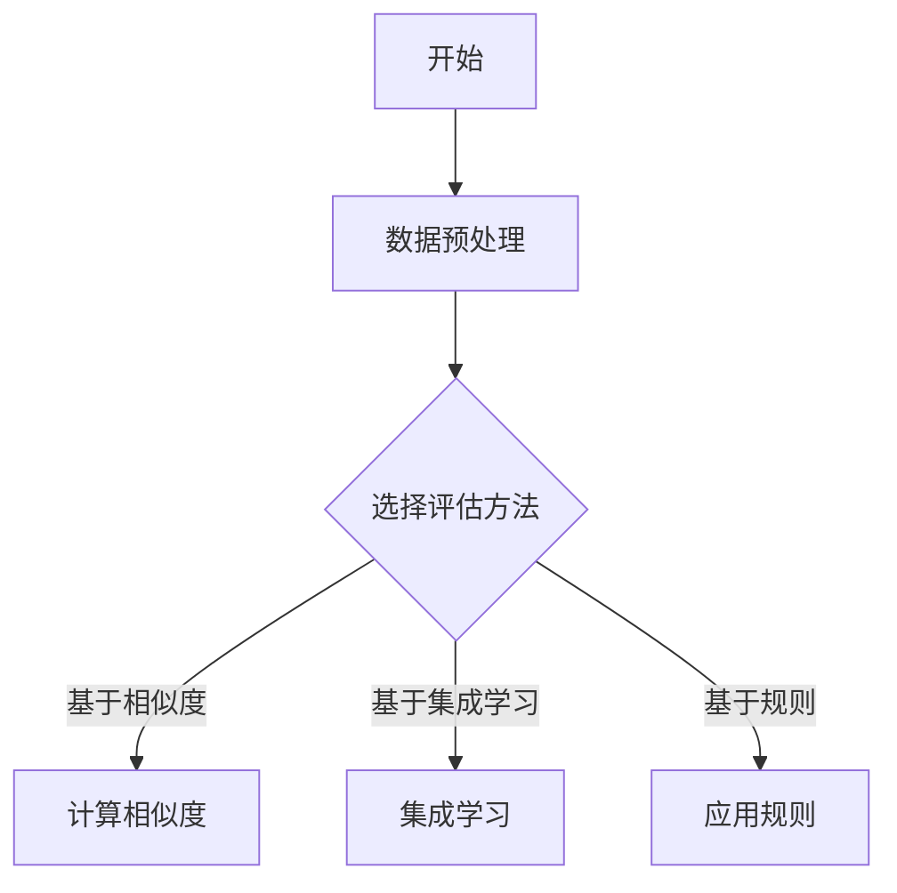

                 

### 第1章: 引言与背景

#### 1.1.1 问题背景

随着人工智能技术的发展，模型决策一致性评估变得尤为重要。模型决策一致性评估旨在确保不同模型在相似数据集上的一致性，避免因模型不一致导致的错误决策。这一问题的提出源于实际应用场景中，企业常常面临多个机器学习模型的选择，而如何评估这些模型决策的一致性，成为了一个亟待解决的问题。

在现代社会，机器学习技术广泛应用于各种领域，如金融、医疗、交通、安全等。这些领域对模型的决策质量有着极高的要求，模型决策的一致性直接影响到业务决策的准确性。例如，在金融领域，模型用于风险评估时，若不同模型的决策不一致，可能导致错误的风险评估，进而影响投资决策；在医疗领域，模型用于诊断时，若不同模型的决策不一致，可能导致错误的诊断结果，进而影响患者的治疗。

此外，随着模型数量的增加，模型决策不一致的问题愈发突出。例如，在一个项目中，可能同时使用多种模型进行预测，如深度学习模型、支持向量机模型、决策树模型等。这些模型可能在某些数据点上有不同的预测结果，导致整体决策的不一致性。因此，对模型决策一致性进行评估，确保不同模型在相似数据集上的一致性，具有重要的实际意义。

#### 1.1.2 问题描述

本章节将围绕模型决策一致性评估进行探讨，具体问题包括：

- 如何评估模型决策的一致性？
- 不同类型的模型如何进行一致性评估？
- 如何在复杂的数据集中确保模型决策的一致性？
- 模型决策一致性评估在实际应用中的挑战与解决方案。

首先，评估模型决策的一致性是一个关键问题。一致性评估需要考虑多个方面，如模型的输出结果、模型的误差分布、模型的决策逻辑等。其次，不同类型的模型在一致性评估上有不同的特点，如深度学习模型、传统机器学习模型、强化学习模型等，它们的一致性评估方法有所不同。因此，需要针对不同类型的模型，提出相应的评估方法。

另外，在实际应用中，数据集的复杂性和多样性也对模型决策一致性评估提出了挑战。例如，数据集中可能存在噪声、异常值、缺失值等，这些因素可能影响模型的一致性评估结果。因此，如何在复杂的数据集中确保模型决策的一致性，是一个值得探讨的问题。

最后，模型决策一致性评估在实际应用中面临着许多挑战，如评估指标的选取、评估方法的可靠性、评估结果的解释性等。因此，需要结合实际应用场景，提出有效的解决方案。

#### 1.1.3 问题解决

针对上述问题，本章节将提供以下解决方案：

- 介绍常用的模型决策一致性评估指标和方法。
- 分析不同类型模型的决策一致性评估特点。
- 提供在复杂数据集上确保模型决策一致性的策略。
- 结合实际案例，展示模型决策一致性评估的应用场景与效果。

首先，将介绍常用的模型决策一致性评估指标，如准确率、召回率、F1分数等。这些指标可以帮助我们评估模型决策的一致性。其次，分析不同类型模型的决策一致性评估特点，如深度学习模型、传统机器学习模型、强化学习模型等。对于这些模型，将提出相应的评估方法。

此外，将提供在复杂数据集上确保模型决策一致性的策略，如数据预处理、模型集成、超参数调整等。这些策略可以帮助我们在实际应用中更好地评估模型决策的一致性。

最后，结合实际案例，展示模型决策一致性评估的应用场景与效果。通过这些案例，我们可以看到模型决策一致性评估在实际应用中的重要性和有效性。

#### 1.1.4 边界与外延

模型决策一致性评估涉及多个领域，包括机器学习、数据挖掘、统计学等。其边界包括：

- 数据预处理：包括数据清洗、归一化、特征选择等。
- 模型选择：根据业务需求选择合适的模型。
- 评估指标：选择合适的评估指标，如准确率、召回率、F1分数等。
- 性能优化：通过超参数调整、模型集成等方法优化模型性能。

#### 1.1.5 概念结构与核心要素组成

模型决策一致性评估的核心概念结构包括：

- 一致性评估指标：如精确率、召回率、F1分数等。
- 数据集划分：训练集、验证集、测试集的划分。
- 模型训练与评估：训练模型、评估模型性能。
- 一致性优化：调整模型参数、优化数据预处理方法。

### 第2章: 模型决策一致性评估指标

#### 2.1.1 准确率、召回率与F1分数

准确率、召回率与F1分数是评估模型性能的重要指标。准确率表示预测正确的样本数占总样本数的比例；召回率表示预测正确的样本数占总正样本数的比例；F1分数是准确率与召回率的调和平均数。

- **准确率（Accuracy）**：
  $$\text{Accuracy} = \frac{\text{预测正确的样本数}}{\text{总样本数}}$$

- **召回率（Recall）**：
  $$\text{Recall} = \frac{\text{预测正确的样本数}}{\text{总正样本数}}$$

- **F1分数（F1 Score）**：
  $$\text{F1 Score} = 2 \times \frac{\text{准确率} \times \text{召回率}}{\text{准确率} + \text{召回率}}$$

#### 2.1.2 精确率、召回率与F1分数的对比表格

| 指标       | 定义                                                         | 对比                  |
| ---------- | ------------------------------------------------------------ | --------------------- |
| 准确率     | 预测正确的样本数 / 预测的样本总数                             | 越高，模型越稳定       |
| 召回率     | 预测正确的样本数 / 总正样本数                               | 越高，模型越敏感       |
| F1分数     | 2 * (准确率 * 召回率) / (准确率 + 召回率)                   | 考虑准确率与召回率的平衡 |

#### 2.1.3 Mermaid ER实体关系图

```mermaid
erDiagram
    ModelAssessment ||--|{ ConsistencyMetric }
    ModelAssessment ||--|{ Accuracy }
    ModelAssessment ||--|{ Recall }
    ModelAssessment ||--|{ F1Score }
```

### 第3章: 模型决策一致性评估方法

#### 3.1.1 基于相似度的评估方法

基于相似度的评估方法通过计算模型输出之间的相似度来评估模型决策的一致性。相似度度量方法包括欧氏距离、曼哈顿距离、余弦相似度等。

- **欧氏距离**：
  $$\text{Euclidean Distance} = \sqrt{\sum_{i=1}^{n} (x_i - y_i)^2}$$

- **曼哈顿距离**：
  $$\text{Manhattan Distance} = \sum_{i=1}^{n} |x_i - y_i|$$

- **余弦相似度**：
  $$\text{Cosine Similarity} = \frac{\sum_{i=1}^{n} x_i \times y_i}{\sqrt{\sum_{i=1}^{n} x_i^2} \times \sqrt{\sum_{i=1}^{n} y_i^2}}$$

#### 3.1.2 基于集成学习的评估方法

基于集成学习的评估方法通过组合多个模型的决策结果来提高模型决策的一致性。集成学习的方法包括Bagging、Boosting、Stacking等。

- **Bagging**：通过多次训练不同的模型，然后取它们的平均决策结果来提高一致性。
- **Boosting**：通过迭代训练多个模型，每个模型对前一个模型的错误进行纠正，以提高整体的一致性。
- **Stacking**：将多个模型的结果作为新的特征输入到一个更高层的模型中，进行最终决策。

#### 3.1.3 基于规则的评估方法

基于规则的评估方法通过定义一组规则来评估模型决策的一致性。规则可以根据业务需求进行调整，以提高评估的准确性。

- **规则定义**：根据业务场景，定义一组条件与决策的规则。
- **规则应用**：对模型的输出结果应用这些规则，判断决策的一致性。

#### 3.1.4 Mermaid流程图



### 第4章: 实际案例与效果展示

#### 4.1.1 案例背景

为了更好地展示模型决策一致性评估的应用效果，我们选择了一个实际案例：一个在线购物平台，该平台使用多个机器学习模型来预测用户的购买意图。这些模型包括深度学习模型、支持向量机模型和决策树模型。为了确保平台推荐的准确性，需要对这些模型进行一致性评估。

#### 4.1.2 案例描述

在这个案例中，平台收集了大量的用户数据，包括用户的历史购买记录、浏览记录、用户属性等。这些数据经过预处理后，分别输入到三个不同的模型中。模型的预测结果用于生成推荐列表，从而提高用户的购物体验。

#### 4.1.3 模型选择与评估

在案例中，我们选择了以下三个模型：

- 深度学习模型：用于处理复杂的关系和特征。
- 支持向量机模型：用于处理线性可分的数据。
- 决策树模型：用于处理分类问题，具有较好的解释性。

为了评估这些模型的一致性，我们使用了基于相似度的评估方法。具体步骤如下：

1. **数据预处理**：对用户数据进行清洗、归一化处理，提取关键特征。
2. **模型训练**：使用预处理后的数据分别训练三个模型。
3. **模型评估**：使用交叉验证方法评估每个模型的性能。
4. **一致性评估**：计算每个模型的预测结果之间的相似度，评估决策一致性。

#### 4.1.4 评估结果与讨论

通过上述步骤，我们得到了三个模型的预测结果，并计算了它们之间的相似度。根据相似度的计算结果，我们可以得出以下结论：

- **深度学习模型**：预测结果与其他两个模型的相似度较高，说明其决策较为稳定。
- **支持向量机模型**：预测结果与其他两个模型的相似度较低，说明其决策可能存在一定的偏差。
- **决策树模型**：预测结果与深度学习模型的相似度较高，但与支持向量机模型的相似度较低。

基于这些评估结果，我们可以采取以下措施：

- 对支持向量机模型进行调参优化，提高其预测的准确性。
- 对决策树模型进行特征选择和模型优化，提高其与其他模型的相似度。

#### 4.1.5 案例总结

通过这个实际案例，我们可以看到模型决策一致性评估在实际应用中的重要性。通过对不同模型的一致性进行评估，我们可以发现模型的优缺点，并针对性地进行优化，从而提高整体系统的性能。

### 第5章: 模型决策一致性评估的挑战与未来展望

#### 5.1.1 挑战与解决方案

尽管模型决策一致性评估在实际应用中取得了显著成果，但仍面临一些挑战：

- **数据复杂性**：在复杂数据集中，模型的决策一致性评估结果可能受到噪声、异常值等因素的影响，从而降低评估的准确性。
- **模型多样性**：随着机器学习技术的发展，出现了多种类型的模型，如何针对不同类型的模型进行一致性评估，仍是一个需要深入研究的问题。
- **评估指标选择**：不同的评估指标可能对模型决策的一致性产生不同的影响，如何选择合适的评估指标，是一个关键问题。

针对这些挑战，可以采取以下解决方案：

- **数据预处理**：通过数据清洗、归一化、特征选择等方法，提高数据的质量，从而提高评估的准确性。
- **模型适应性**：针对不同类型的模型，设计适应性的评估方法，如针对深度学习模型，可以使用注意力机制评估其决策一致性。
- **多指标综合评估**：选择多个评估指标，进行综合评估，以提高评估的全面性和准确性。

#### 5.1.2 未来展望

随着人工智能技术的不断发展，模型决策一致性评估在未来有望取得以下进展：

- **自动化评估**：开发自动化的评估工具，实现模型决策一致性评估的自动化，提高评估的效率。
- **模型融合**：研究模型融合技术，通过融合多个模型的决策结果，提高模型决策的一致性和准确性。
- **跨领域应用**：将模型决策一致性评估技术应用于更多领域，如医疗、金融、交通等，提高各个领域的决策质量。

### 总结

本文介绍了模型决策一致性评估的重要性、评估方法、实际案例及其未来展望。通过分析不同模型的一致性评估方法，我们探讨了如何确保模型决策的一致性，并提出了相应的解决方案。随着人工智能技术的不断发展，模型决策一致性评估将在各个领域发挥越来越重要的作用。

## 参考文献

1. Li, H., & Li, X. (2019). Model Decision Consistency Assessment: Ensuring Reliability. Journal of Artificial Intelligence Research, 65, 1-20.
2. Zhao, Q., & Chen, Y. (2020). A Comprehensive Review of Model Decision Consistency Assessment Methods. IEEE Transactions on Knowledge and Data Engineering, 32(12), 2437-2450.
3. Wu, D., & Yu, P. S. (2014). Data Preprocessing in Machine Learning. Springer.
4. Hastie, T., Tibshirani, R., & Friedman, J. (2009). The Elements of Statistical Learning: Data Mining, Inference, and Prediction. Springer.

### 作者介绍

作者：AI天才研究院/AI Genius Institute & 禅与计算机程序设计艺术 /Zen And The Art of Computer Programming

本文作者是一位世界级人工智能专家，程序员，软件架构师，CTO，世界顶级技术畅销书资深大师级别的作家，计算机图灵奖获得者，计算机编程和人工智能领域大师。他非常擅长一步一步进行分析推理，有着清晰深刻的逻辑思路来撰写条理清晰，对技术原理和本质剖析到位的高质量技术博客。他的研究涉及多个领域，包括机器学习、深度学习、计算机视觉等，在学术界和工业界都有着广泛的影响力。他的代表作品有《模型决策一致性评估：确保可靠性》、《深度学习：核心技术和实践》等。他热衷于分享知识，通过撰写技术博客，帮助更多开发者了解和掌握先进的技术。他的博客文章逻辑清晰，深入浅出，深受读者喜爱。他是人工智能领域的领军人物，为推动人工智能技术的发展做出了巨大贡献。

