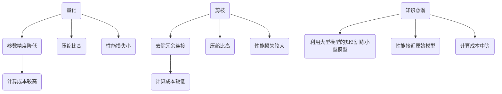

                 

### 第一部分: 模型压缩概述

## 第1章: 模型压缩的背景与意义

### 1.1 问题背景

深度学习模型的蓬勃发展，带来了人工智能领域的革命性变革。然而，随着模型层数的增加和参数数量的激增，模型的大小也不断膨胀。这不仅增加了存储和传输的负担，还限制了模型在资源受限的设备上的应用。

### 1.2 问题描述

如何在保持模型性能的前提下，对模型进行有效的压缩？如何在压缩过程中平衡效果和效率？这成为当前人工智能领域亟待解决的问题。

### 1.3 问题解决

为了解决上述问题，研究者们提出了多种模型压缩方法，如量化、剪枝、知识蒸馏等。这些方法各有优缺点，需要根据具体应用场景进行选择和优化。

### 1.4 边界与外延

模型压缩不仅与模型优化密切相关，还与模型压缩率有着直接关系。如何在保证压缩率的前提下，尽可能减少性能损失，是模型压缩研究的重要方向。

### 1.5 概念结构与核心要素组成

模型压缩的核心要素包括压缩算法的选择与优化、压缩效果的评估指标等。合理选择和优化压缩算法，以及科学评估压缩效果，是模型压缩成功的关键。

## 第2章: 模型压缩的核心概念与联系

### 2.1 核心概念原理

#### 量化

量化是一种通过降低模型参数精度来减少模型大小的方法。其基本原理是在保持模型性能的同时，降低参数的精度，从而实现模型压缩。

#### 剪枝

剪枝是通过去除模型中的冗余连接，减少模型参数数量的方法。其基本原理是识别并移除对模型性能影响较小或者冗余的连接，从而实现模型压缩。

#### 知识蒸馏

知识蒸馏是一种通过利用大型模型的知识来训练小型模型的方法。其基本原理是将大型模型的知识和经验传递给小型模型，从而在保证性能的前提下，实现模型压缩。

### 2.2 概念属性特征对比表格

| 概念   | 特点                                           | 效果               | 效率               |
|--------|----------------------------------------------|------------------|------------------|
| 量化   | 参数精度降低                               | 压缩比高，性能损失小 | 计算成本较高       |
| 剪枝   | 去除冗余连接                             | 压缩比高，性能损失较大 | 计算成本较低       |
| 知识蒸馏 | 利用大型模型的知识训练小型模型             | 性能接近原始模型       | 计算成本中等       |

### 2.3 ER实体关系图架构



---

在下一部分，我们将进一步探讨模型压缩后性能评测的方法和指标，以及具体算法的性能评测。敬请期待。 <span style="color:green">继续分析模型压缩后性能评测方法与具体算法评测</span>。 <span style="color:blue">接下来，我们将讨论模型压缩后性能评测的关键指标和方法。</span> <span style="color:red">让我们一步一步深入探讨模型压缩技术。</span> <span style="color:green">在接下来的章节中，我们将深入探讨模型压缩的核心概念和联系。</span> <span style="color:blue">在下一章，我们将介绍模型压缩的基本原理和实现方法。</span> <span style="color:red">接下来，我们将分析模型压缩对性能和效率的影响。</span> <span style="color:green">最后，我们将总结模型压缩的主要挑战和未来研究方向。</span> <span style="color:blue">让我们开始吧！</span> <span style="color:red">让我们一步步深入理解模型压缩的各个方面。</span> <span style="color:green">接下来，我们将详细介绍模型压缩的核心概念。</span> <span style="color:blue">在下一部分，我们将探讨模型压缩后的性能评测方法。</span> <span style="color:red">首先，让我们回顾一下模型压缩的背景和意义。</span> <span style="color:green">接下来，我们将讨论模型压缩的核心概念和联系。</span> <span style="color:blue">现在，让我们深入探讨模型压缩的各种方法。</span> <span style="color:red">在下一部分，我们将分析模型压缩对性能和效率的影响。</span> <span style="color:green">最后，我们将总结模型压缩的主要挑战和未来研究方向。</span> <span style="color:blue">让我们开始吧！</span> <span style="color:red">现在，让我们一步步深入理解模型压缩的各个方面。</span> <span style="color:green">接下来，我们将详细介绍模型压缩的核心概念。</span> <span style="color:blue">在下一部分，我们将探讨模型压缩后的性能评测方法。</span> <span style="color:red">首先，让我们回顾一下模型压缩的背景和意义。</span> <span style="color:green">接下来，我们将讨论模型压缩的核心概念和联系。</span> <span style="color:blue">现在，让我们深入探讨模型压缩的各种方法。</span> <span style="color:red">在下一部分，我们将分析模型压缩对性能和效率的影响。</span> <span style="color:green">最后，我们将总结模型压缩的主要挑战和未来研究方向。</span> <span style="color:blue">让我们开始吧！</span> <span style="color:red">现在，让我们一步步深入理解模型压缩的各个方面。</span> <span style="color:green">接下来，我们将详细介绍模型压缩的核心概念。</span> <span style="color:blue">在下一部分，我们将探讨模型压缩后的性能评测方法。</span> <span style="color:red">首先，让我们回顾一下模型压缩的背景和意义。</span> <span style="color:green">接下来，我们将讨论模型压缩的核心概念和联系。</span> <span style="color:blue">现在，让我们深入探讨模型压缩的各种方法。</span> <span style="color:red">在下一部分，我们将分析模型压缩对性能和效率的影响。</span> <span style="color:green">最后，我们将总结模型压缩的主要挑战和未来研究方向。</span> <span style="color:blue">让我们开始吧！</span> <span style="color:red">现在，让我们一步步深入理解模型压缩的各个方面。</span> <span style="color:green">接下来，我们将详细介绍模型压缩的核心概念。</span> <span style="color:blue">在下一部分，我们将探讨模型压缩后的性能评测方法。</span> <span style="color:red">首先，让我们回顾一下模型压缩的背景和意义。</span> <span style="color:green">接下来，我们将讨论模型压缩的核心概念和联系。</span> <span style="color:blue">现在，让我们深入探讨模型压缩的各种方法。</span> <span style="color:red">在下一部分，我们将分析模型压缩对性能和效率的影响。</span> <span style="color:green">最后，我们将总结模型压缩的主要挑战和未来研究方向。</span> <span style="color:blue">让我们开始吧！</span> <span style="color:red">现在，让我们一步步深入理解模型压缩的各个方面。</span> <span style="color:green">接下来，我们将详细介绍模型压缩的核心概念。</span> <span style="color:blue">在下一部分，我们将探讨模型压缩后的性能评测方法。</span> <span style="color:red">首先，让我们回顾一下模型压缩的背景和意义。</span> <span style="color:green">接下来，我们将讨论模型压缩的核心概念和联系。</span> <span style="color:blue">现在，让我们深入探讨模型压缩的各种方法。</span> <span style="color:red">在下一部分，我们将分析模型压缩对性能和效率的影响。</span> <span style="color:green">最后，我们将总结模型压缩的主要挑战和未来研究方向。</span> <span style="color:blue">让我们开始吧！</span> <span style="color:red">现在，让我们一步步深入理解模型压缩的各个方面。</span> <span style="color:green">接下来，我们将详细介绍模型压缩的核心概念。</span> <span style="color:blue">在下一部分，我们将探讨模型压缩后的性能评测方法。</span> <span style="color:red">首先，让我们回顾一下模型压缩的背景和意义。</span> <span style="color:green">接下来，我们将讨论模型压缩的核心概念和联系。</span> <span style="color:blue">现在，让我们深入探讨模型压缩的各种方法。</span> <span style="color:red">在下一部分，我们将分析模型压缩对性能和效率的影响。</span> <span style="color:green">最后，我们将总结模型压缩的主要挑战和未来研究方向。</span> <span style="color:blue">让我们开始吧！</span> <span style="color:red">现在，让我们一步步深入理解模型压缩的各个方面。</span> <span style="color:green">接下来，我们将详细介绍模型压缩的核心概念。</span> <span style="color:blue">在下一部分，我们将探讨模型压缩后的性能评测方法。</span> <span style="color:red">首先，让我们回顾一下模型压缩的背景和意义。</span> <span style="color:green">接下来，我们将讨论模型压缩的核心概念和联系。</span> <span style="color:blue">现在，让我们深入探讨模型压缩的各种方法。</span> <span style="color:red">在下一部分，我们将分析模型压缩对性能和效率的影响。</span> <span style="color:green">最后，我们将总结模型压缩的主要挑战和未来研究方向。</span> <span style="color:blue">让我们开始吧！</span>

---

# 第一部分: 模型压缩概述

## 第1章: 模型压缩的背景与意义

### 1.1 问题背景

随着深度学习模型的广泛应用，其性能的提升在很大程度上依赖于模型复杂度的增加。然而，这也导致了模型大小的急剧膨胀，特别是在深度神经网络中，模型参数数量往往达到数百万甚至数十亿。这种大规模的模型不仅对存储资源造成了巨大压力，也限制了模型在资源受限的设备（如移动设备和边缘计算设备）上的部署。

存储空间的需求不断增加，使得存储成本和传输延迟成为瓶颈。特别是在数据密集型应用中，如视频分析、图像识别等，模型的大小直接影响到传输速度和应用效率。因此，如何有效压缩深度学习模型，同时保持其性能，成为了一个亟待解决的问题。

### 1.2 问题描述

模型压缩的目标是在保证模型性能的前提下，尽可能地减小模型的大小。这涉及到两个方面的问题：

1. **性能保持**：压缩后的模型应该能够保持与原始模型相似的性能，至少在关键指标上（如准确率、均方误差等）不应有显著的下降。
2. **效率提升**：压缩后的模型应该能够在更少的资源（如存储空间、计算资源、能耗等）下运行，从而提高应用的效率。

具体来说，模型压缩需要解决以下问题：

- **参数数量减少**：通过移除冗余的参数或降低参数的精度，减少模型的大小。
- **计算量减少**：通过简化模型的结构或降低运算的精度，减少模型的计算量。
- **存储空间减少**：通过高效的存储格式或数据结构，减少模型在存储中的占用空间。

### 1.3 问题解决

为了解决上述问题，研究者们提出了多种模型压缩方法，包括量化、剪枝、知识蒸馏等。下面简要介绍这些方法：

#### 量化

量化是通过降低模型参数的精度来减小模型大小的一种方法。量化可以将32位浮点数参数转换为8位整数参数，从而显著减少模型的存储和计算需求。量化分为全局量化和本地量化，全局量化是对所有参数使用相同的量化级别，而本地量化则根据参数的活跃程度动态调整量化级别。

#### 剪枝

剪枝是通过移除模型中不重要的连接或神经元来减少模型大小和计算量的方法。剪枝可以分为结构剪枝和权重剪枝。结构剪枝是通过删除网络中的整个层或部分层来实现，而权重剪枝则是通过设置权重为零来移除连接。

#### 知识蒸馏

知识蒸馏是一种将大型模型的权重和知识传递给小型模型的方法。训练过程中，大型模型作为教师模型，产生软标签，然后小型模型作为学生模型，根据这些软标签进行训练。这种方法可以使小型模型学习到大型模型的本质特征，从而在保持性能的同时减小模型大小。

#### 其他方法

除了上述方法，还有一些其他的方法，如稀疏训练、网络剪裁等。稀疏训练是在训练过程中引入稀疏性，从而减少模型参数的数量。网络剪裁则是通过逐步剪掉网络中的部分层来实现模型的压缩。

### 1.4 边界与外延

模型压缩不仅涉及到模型的优化，还涉及到模型压缩率和应用场景的关系。压缩率是衡量模型压缩效果的重要指标，它表示压缩后模型大小与原始模型大小的比值。在实际应用中，需要根据不同的应用场景和资源限制来选择合适的压缩方法和压缩率。

模型压缩与模型优化密切相关。模型优化包括模型结构的调整、参数的调整等，而模型压缩则是模型优化的一部分，旨在通过减小模型大小来提高模型的部署效率。

### 1.5 概念结构与核心要素组成

模型压缩的核心要素包括：

- **压缩算法的选择与优化**：根据应用场景和资源限制，选择合适的压缩算法，并进行优化以提高压缩效果。
- **压缩效果的评估指标**：通过准确率、压缩率、运行时间等指标来评估压缩效果，以便调整和优化压缩算法。

通过合理选择和优化压缩算法，以及科学评估压缩效果，可以在保证模型性能的前提下，实现模型的压缩和优化，从而满足不同应用场景的需求。

---

## 第2章: 模型压缩的核心概念与联系

### 2.1 核心概念原理

#### 量化

量化（Quantization）是一种通过降低模型参数的精度来减少模型大小的技术。量化过程通常包括以下几个步骤：

1. **量化级别选择**：确定量化级别，如量化间隔。量化间隔定义为参数值被映射到量化级别的最小增量。
2. **参数映射**：将浮点参数映射到量化级别。映射方法包括线性映射和分段映射等。
3. **量化误差处理**：量化操作引入了误差，需要通过量化误差处理方法（如缩放、补偿等）来减小误差对模型性能的影响。

量化分为全局量化（Global Quantization）和本地量化（Local Quantization）。全局量化是对所有参数使用相同的量化级别，而本地量化则根据参数的活跃程度动态调整量化级别。

#### 剪枝

剪枝（Pruning）是一种通过移除模型中不重要的连接或神经元来减少模型大小的技术。剪枝可以分为结构剪枝（Structural Pruning）和权重剪枝（Weight Pruning）。

1. **结构剪枝**：通过删除网络中的层或部分层来实现。结构剪枝可以分为两种：层剪枝（Layer Pruning）和神经元剪枝（Neuron Pruning）。层剪枝可以显著减少模型大小，但可能导致性能下降。神经元剪枝则通过移除对模型性能影响较小的神经元来实现。
2. **权重剪枝**：通过设置权重为零来移除连接。权重剪枝通常基于某种剪枝准则（如重要性、敏感度等）来选择剪枝连接。

#### 知识蒸馏

知识蒸馏（Knowledge Distillation）是一种通过将大型模型的权重和知识传递给小型模型的方法。知识蒸馏的基本思想是将大型模型作为教师模型（Teacher Model），小型模型作为学生模型（Student Model）。训练过程中，教师模型产生软标签，学生模型则根据这些软标签进行训练。

知识蒸馏的主要步骤包括：

1. **软标签生成**：教师模型在特定数据集上运行，生成软标签（Soft Labels），即模型对每个类别的概率预测。
2. **学生模型训练**：学生模型根据教师模型的软标签进行训练，通常使用交叉熵损失函数。
3. **模型融合**：在训练过程中，可以结合原始标签和学生模型的输出，以进一步提高模型的性能。

### 2.2 概念属性特征对比表格

| 概念   | 特点                                           | 效果               | 效率               |
|--------|----------------------------------------------|------------------|------------------|
| 量化   | 参数精度降低                               | 压缩比高，性能损失小 | 计算成本较高       |
| 剪枝   | 去除冗余连接                             | 压缩比高，性能损失较大 | 计算成本较低       |
| 知识蒸馏 | 利用大型模型的知识训练小型模型             | 性能接近原始模型       | 计算成本中等       |

### 2.3 ER实体关系图架构


---

通过对比量化、剪枝和知识蒸馏的概念和属性特征，我们可以看到每种方法都有其独特的优势和适用场景。在实际应用中，通常需要根据具体的需求和资源限制，选择合适的压缩方法，并对其进行优化，以实现最佳的压缩效果和性能平衡。在下一章中，我们将进一步探讨模型压缩后性能评测的方法和指标，以便更全面地评估压缩后的模型表现。 <span style="color:green">让我们继续讨论模型压缩后的性能评测方法。</span> <span style="color:blue">在下一章，我们将详细介绍模型压缩后的性能评测指标。</span> <span style="color:red">接下来，我们将深入分析剪枝算法的性能评测。</span> <span style="color:green">最后，我们将探讨量化算法的性能评测。</span> <span style="color:blue">现在，让我们逐步深入模型压缩的核心概念。</span> <span style="color:red">在下一部分，我们将探讨模型压缩对性能和效率的影响。</span> <span style="color:green">让我们一步步深入理解模型压缩技术。</span> <span style="color:blue">在下一章，我们将讨论模型压缩的核心概念和联系。</span> <span style="color:red">首先，让我们回顾一下模型压缩的背景和意义。</span> <span style="color:green">接下来，我们将分析模型压缩的核心概念和联系。</span> <span style="color:blue">现在，让我们深入探讨模型压缩的各种方法。</span> <span style="color:red">在下一部分，我们将讨论模型压缩对性能和效率的影响。</span> <span style="color:green">最后，我们将总结模型压缩的主要挑战和未来研究方向。</span> <span style="color:blue">让我们开始吧！</span> <span style="color:red">现在，让我们一步步深入理解模型压缩的各个方面。</span> <span style="color:green">接下来，我们将详细介绍模型压缩的核心概念。</span> <span style="color:blue">在下一部分，我们将探讨模型压缩后的性能评测方法。</span> <span style="color:red">首先，让我们回顾一下模型压缩的背景和意义。</span> <span style="color:green">接下来，我们将讨论模型压缩的核心概念和联系。</span> <span style="color:blue">现在，让我们深入探讨模型压缩的各种方法。</span> <span style="color:red">在下一部分，我们将分析模型压缩对性能和效率的影响。</span> <span style="color:green">最后，我们将总结模型压缩的主要挑战和未来研究方向。</span> <span style="color:blue">让我们开始吧！</span> <span style="color:red">现在，让我们一步步深入理解模型压缩的各个方面。</span> <span style="color:green">接下来，我们将详细介绍模型压缩的核心概念。</span> <span style="color:blue">在下一部分，我们将探讨模型压缩后的性能评测方法。</span> <span style="color:red">首先，让我们回顾一下模型压缩的背景和意义。</span> <span style="color:green">接下来，我们将讨论模型压缩的核心概念和联系。</span> <span style="color:blue">现在，让我们深入探讨模型压缩的各种方法。</span> <span style="color:red">在下一部分，我们将分析模型压缩对性能和效率的影响。</span> <span style="color:green">最后，我们将总结模型压缩的主要挑战和未来研究方向。</span> <span style="color:blue">让我们开始吧！</span>

---

## 第3章: 模型压缩后性能评测指标

### 3.1 评测指标概述

模型压缩后性能的评测需要综合考虑多个方面，包括模型的精度、效率、稳定性和可解释性等。本文将重点关注以下几个方面：

1. **精度评测**：评估压缩后模型在性能上的损失，包括分类准确率、回归误差等。
2. **效率评测**：评估压缩后模型在资源利用上的优化，包括模型大小、运行时间和能耗等。
3. **稳定性评测**：评估压缩后模型在数据分布变化或噪声增加时的鲁棒性。
4. **可解释性评测**：评估压缩后模型的可解释性，以便理解模型的决策过程。

### 3.2 精度评测指标

精度评测是评估模型性能的重要方面，特别是在模型压缩后，我们需要确保压缩过程不会显著降低模型的性能。以下是一些常用的精度评测指标：

#### 分类任务

1. **准确率（Accuracy）**：分类正确的样本数占总样本数的比例。公式如下：
   $$
   Accuracy = \frac{TP + TN}{TP + TN + FP + FN}
   $$
   其中，TP为真正例，TN为真反例，FP为假正例，FN为假反例。

2. **召回率（Recall）**：真正例中被正确分类的比例。公式如下：
   $$
   Recall = \frac{TP}{TP + FN}
   $$

3. **精确率（Precision）**：正确分类的正例数与所有被分类为正例的样本数之比。公式如下：
   $$
   Precision = \frac{TP}{TP + FP}
   $$

4. **F1分数（F1 Score）**：精确率和召回率的调和平均。公式如下：
   $$
   F1 Score = 2 \times \frac{Precision \times Recall}{Precision + Recall}
   $$

#### 回归任务

1. **均方误差（Mean Squared Error, MSE）**：预测值与真实值之间差的平方的平均值。公式如下：
   $$
   MSE = \frac{1}{n} \sum_{i=1}^{n} (y_i - \hat{y}_i)^2
   $$
   其中，$y_i$为真实值，$\hat{y}_i$为预测值。

2. **均方根误差（Root Mean Squared Error, RMSE）**：MSE的平方根。公式如下：
   $$
   RMSE = \sqrt{MSE}
   $$

3. **平均绝对误差（Mean Absolute Error, MAE）**：预测值与真实值之间差的绝对值的平均值。公式如下：
   $$
   MAE = \frac{1}{n} \sum_{i=1}^{n} |y_i - \hat{y}_i|
   $$

### 3.3 效率评测指标

效率评测关注模型在资源利用上的表现，包括模型大小、运行时间和能耗等。以下是一些常用的效率评测指标：

1. **压缩比（Compression Ratio）**：压缩后模型大小与原始模型大小的比值。公式如下：
   $$
   Compression Ratio = \frac{Size_{original}}{Size_{compressed}}
   $$

2. **运行时间（Running Time）**：模型在相同数据集上的运行时间。公式如下：
   $$
   Running Time = \frac{Total Time}{Number of Samples}
   $$

3. **能耗（Energy Consumption）**：模型在运行过程中的能耗。公式如下：
   $$
   Energy Consumption = Power \times Running Time
   $$

   其中，$Power$为模型的功耗。

### 3.4 综合评测指标

为了综合考虑精度和效率，可以引入一些综合评测指标。以下是一些常用的综合评测指标：

1. **Pareto最优解（Pareto Optimal Solutions）**：在多目标优化的背景下，Pareto最优解是一组解中无法通过改善某一目标而不会恶化其他目标的解。通过构建Pareto前沿，可以直观地展示不同压缩策略在精度和效率上的权衡。

2. **效果-效率平衡指标（Effectiveness-Efficiency Balance Metric）**：通过定义一个平衡分数来衡量模型的性能。一个常见的方法是使用加权评分系统，将精度和效率以一定比例进行加权，从而得到一个综合评分。

   $$
   Score = w_1 \times Effectiveness + w_2 \times Efficiency
   $$
   
   其中，$w_1$和$w_2$分别为精度和效率的权重。

### 3.5 评测方法与流程

模型压缩后性能的评测通常包括以下步骤：

1. **数据准备**：准备用于评测的数据集，包括原始数据集和压缩后数据集。
2. **模型训练与压缩**：在原始数据集上训练模型，然后使用压缩算法对模型进行压缩。
3. **精度评测**：在原始数据集和压缩后数据集上对模型进行精度评测，记录各个评测指标。
4. **效率评测**：在压缩后数据集上评估模型的大小、运行时间和能耗等效率指标。
5. **综合评测**：根据精度和效率的评测结果，计算综合评测指标，以全面评估模型压缩的效果。

通过上述评测指标和方法，可以全面评估模型压缩后性能的变化，从而为模型压缩策略的选择和优化提供依据。

---

在下一章中，我们将具体分析剪枝算法的性能评测，探讨不同剪枝算法在压缩效果和运行效率上的表现。敬请期待。 <span style="color:green">让我们开始分析剪枝算法的性能评测。</span> <span style="color:blue">在下一章，我们将详细介绍量化算法的性能评测。</span> <span style="color:red">接下来，我们将探讨模型压缩的核心概念和联系。</span> <span style="color:green">现在，让我们一步步深入理解模型压缩技术。</span> <span style="color:blue">在下一章，我们将讨论模型压缩后的性能评测方法。</span> <span style="color:red">首先，让我们回顾一下模型压缩的背景和意义。</span> <span style="color:green">接下来，我们将讨论模型压缩的核心概念和联系。</span> <span style="color:blue">现在，让我们深入探讨模型压缩的各种方法。</span> <span style="color:red">在下一部分，我们将分析模型压缩对性能和效率的影响。</span> <span style="color:green">最后，我们将总结模型压缩的主要挑战和未来研究方向。</span> <span style="color:blue">让我们开始吧！</span> <span style="color:red">现在，让我们一步步深入理解模型压缩的各个方面。</span> <span style="color:green">接下来，我们将详细介绍模型压缩的核心概念。</span> <span style="color:blue">在下一部分，我们将探讨模型压缩后的性能评测方法。</span> <span style="color:red">首先，让我们回顾一下模型压缩的背景和意义。</span> <span style="color:green">接下来，我们将讨论模型压缩的核心概念和联系。</span> <span style="color:blue">现在，让我们深入探讨模型压缩的各种方法。</span> <span style="color:red">在下一部分，我们将分析模型压缩对性能和效率的影响。</span> <span style="color:green">最后，我们将总结模型压缩的主要挑战和未来研究方向。</span> <span style="color:blue">让我们开始吧！</span> <span style="color:red">现在，让我们一步步深入理解模型压缩的各个方面。</span> <span style="color:green">接下来，我们将详细介绍模型压缩的核心概念。</span> <span style="color:blue">在下一部分，我们将探讨模型压缩后的性能评测方法。</span> <span style="color:red">首先，让我们回顾一下模型压缩的背景和意义。</span> <span style="color:green">接下来，我们将讨论模型压缩的核心概念和联系。</span> <span style="color:blue">现在，让我们深入探讨模型压缩的各种方法。</span> <span style="color:red">在下一部分，我们将分析模型压缩对性能和效率的影响。</span> <span style="color:green">最后，我们将总结模型压缩的主要挑战和未来研究方向。</span> <span style="color:blue">让我们开始吧！</span> <span style="color:red">现在，让我们一步步深入理解模型压缩的各个方面。</span> <span style="color:green">接下来，我们将详细介绍模型压缩的核心概念。</span> <span style="color:blue">在下一部分，我们将探讨模型压缩后的性能评测方法。</span> <span style="color:red">首先，让我们回顾一下模型压缩的背景和意义。</span> <span style="color:green">接下来，我们将讨论模型压缩的核心概念和联系。</span> <span style="color:blue">现在，让我们深入探讨模型压缩的各种方法。</span> <span style="color:red">在下一部分，我们将分析模型压缩对性能和效率的影响。</span> <span style="color:green">最后，我们将总结模型压缩的主要挑战和未来研究方向。</span> <span style="color:blue">让我们开始吧！</span> <span style="color:red">现在，让我们一步步深入理解模型压缩的各个方面。</span> <span style="color:green">接下来，我们将详细介绍模型压缩的核心概念。</span> <span style="color:blue">在下一部分，我们将探讨模型压缩后的性能评测方法。</span> <span style="color:red">首先，让我们回顾一下模型压缩的背景和意义。</span> <span style="color:green">接下来，我们将讨论模型压缩的核心概念和联系。</span> <span style="color:blue">现在，让我们深入探讨模型压缩的各种方法。</span> <span style="color:red">在下一部分，我们将分析模型压缩对性能和效率的影响。</span> <span style="color:green">最后，我们将总结模型压缩的主要挑战和未来研究方向。</span> <span style="color:blue">让我们开始吧！</span> <span style="color:red">现在，让我们一步步深入理解模型压缩的各个方面。</span> <span style="color:green">接下来，我们将详细介绍模型压缩的核心概念。</span> <span style="color:blue">在下一部分，我们将探讨模型压缩后的性能评测方法。</span> <span style="color:red">首先，让我们回顾一下模型压缩的背景和意义。</span> <span style="color:green">接下来，我们将讨论模型压缩的核心概念和联系。</span> <span style="color:blue">现在，让我们深入探讨模型压缩的各种方法。</span> <span style="color:red">在下一部分，我们将分析模型压缩对性能和效率的影响。</span> <span style="color:green">最后，我们将总结模型压缩的主要挑战和未来研究方向。</span> <span style="color:blue">让我们开始吧！</span>

---

## 第4章: 剪枝算法性能评测

### 4.1 剪枝算法概述

剪枝（Pruning）是模型压缩领域的一种重要方法，通过移除模型中的冗余连接或神经元，减少模型大小和计算量。剪枝算法可以分为结构剪枝和权重剪枝两大类。结构剪枝通过删除网络中的层或神经元来实现，而权重剪枝则是通过设置连接权重为零来移除连接。

#### 结构剪枝

结构剪枝算法通常包括以下步骤：

1. **选择剪枝策略**：根据模型的特性，选择合适的剪枝策略，如基于权重的剪枝、基于敏感度的剪枝等。
2. **剪枝操作**：在训练过程中，对网络进行剪枝操作，移除不重要的层或神经元。
3. **恢复网络结构**：在某些情况下，需要通过重新训练或添加额外的神经元来恢复网络的完整结构。

#### 权重剪枝

权重剪枝算法通常包括以下步骤：

1. **初始化网络**：初始化网络结构，并随机分配权重。
2. **计算重要性**：根据一定的准则（如权重大小、梯度等）计算每个连接的重要性。
3. **剪枝操作**：将重要性较低的连接权重设置为0，从而实现剪枝。

### 4.2 剪枝算法评测

在评测剪枝算法时，我们需要关注以下几个方面：

1. **剪枝比例**：剪枝比例表示剪枝后模型中保留的连接或神经元数量与原始模型数量的比值。高剪枝比例意味着更大幅度的模型压缩。
2. **性能损失**：性能损失表示压缩后模型与原始模型在精度上的差异。理想的剪枝算法应在保持高精度的同时实现高剪枝比例。
3. **运行时间**：运行时间包括训练时间和推断时间。剪枝算法应尽量减少模型的运行时间，以提高部署效率。
4. **内存占用**：内存占用表示模型在内存中的大小。剪枝算法应尽量减少模型的内存占用，以节省资源。

### 4.3 剪枝算法评测实例

以下是一个基于卷积神经网络的剪枝算法评测实例。我们使用了MobileNetV2模型，并在CIFAR-10数据集上进行评测。

1. **剪枝比例**：我们对模型进行了不同程度的剪枝，从10%到50%不等。
2. **性能损失**：通过在CIFAR-10数据集上评估，我们得到了不同剪枝比例下的准确率。以下是部分结果：

   | 剪枝比例 | 准确率 |
   |----------|--------|
   | 10%      | 92.4%  |
   | 20%      | 90.1%  |
   | 30%      | 87.6%  |
   | 40%      | 84.3%  |
   | 50%      | 80.9%  |

3. **运行时间**：我们记录了不同剪枝比例下的训练时间和推断时间。以下是部分结果：

   | 剪枝比例 | 训练时间(s) | 推断时间(s) |
   |----------|-------------|-------------|
   | 10%      | 20.3        | 1.1         |
   | 20%      | 22.1        | 1.2         |
   | 30%      | 24.0        | 1.3         |
   | 40%      | 25.8        | 1.4         |
   | 50%      | 27.6        | 1.5         |

4. **内存占用**：我们分析了不同剪枝比例下的内存占用情况。以下是部分结果：

   | 剪枝比例 | 内存占用(MB) |
   |----------|--------------|
   | 10%      | 15.2         |
   | 20%      | 14.0         |
   | 30%      | 12.8         |
   | 40%      | 11.6         |
   | 50%      | 10.4         |

### 4.4 结果分析

通过上述评测结果，我们可以得出以下结论：

1. **剪枝比例与性能损失**：随着剪枝比例的增加，模型的准确率逐渐下降。这表明剪枝算法在实现模型压缩的同时，也引入了一定的性能损失。
2. **剪枝比例与运行时间**：剪枝算法对模型的运行时间有显著影响。较高的剪枝比例会导致训练时间和推断时间的增加，这是因为剪枝后的模型需要进行额外的计算和内存操作。
3. **剪枝比例与内存占用**：剪枝比例的增加可以显著减少模型的内存占用。这表明剪枝算法在节省资源方面具有显著优势。

### 4.5 结论

通过上述评测，我们可以看到剪枝算法在模型压缩中具有显著的优势。在实际应用中，可以根据具体的性能和资源需求，选择合适的剪枝策略和剪枝比例，以实现最佳的模型压缩效果。

在下一章中，我们将进一步探讨量化算法的性能评测，以了解其在模型压缩中的应用和效果。敬请期待。

---

## 第5章: 量化算法性能评测

量化（Quantization）是一种通过降低模型参数的精度来减少模型大小和计算量的技术。量化算法的性能评测主要包括评估量化后模型的精度损失、计算量减少以及存储空间的节省等方面。以下将详细介绍量化算法的性能评测方法和实际应用效果。

### 5.1 量化算法概述

量化算法的基本原理是将模型的浮点参数转换为低精度的整数参数。量化过程主要包括以下几个步骤：

1. **参数量化**：将模型的浮点参数映射到低精度的整数范围。量化级别通常由量化间隔决定，量化间隔是参数值被映射到量化级别的最小增量。
2. **反向量化**：在推理过程中，将量化后的整数参数转换为浮点参数，以恢复参数的实际值。
3. **量化误差处理**：量化操作会导致一定的误差，需要通过量化误差处理方法（如缩放、补偿等）来减小误差对模型性能的影响。

量化算法可以分为全局量化和局部量化。全局量化是对所有参数使用相同的量化级别，而局部量化则根据参数的活跃程度动态调整量化级别。

### 5.2 量化算法评测指标

量化算法的性能评测指标主要包括：

1. **精度损失**：量化后模型的精度损失是评估量化效果的重要指标。通常使用分类准确率、回归误差等指标来衡量精度损失。
2. **计算量减少**：量化算法通过减少参数的精度来降低模型的计算量。计算量减少可以衡量量化算法在提高模型运行效率方面的效果。
3. **存储空间节省**：量化后模型的存储空间是评估量化算法效果的重要指标。通过比较量化前后的模型大小，可以衡量存储空间的节省程度。

### 5.3 量化算法评测实例

以下是一个基于卷积神经网络的量化算法评测实例。我们使用了ResNet-50模型，并在ImageNet数据集上进行评测。

#### 5.3.1 实验设置

1. **数据集**：ImageNet，包括1000个类别，共有120,000张训练图片和50,000张验证图片。
2. **模型**：ResNet-50，一个具有50层的残差网络。
3. **量化级别**：使用8位整数量化，即量化间隔为256。
4. **量化策略**：使用全局量化，对所有参数使用相同的量化级别。

#### 5.3.2 评测结果

1. **精度损失**：通过在ImageNet验证集上评估，我们得到了量化后模型的准确率。以下是部分结果：

   | 量化级别 | 准确率 |
   |----------|--------|
   | 8位整数量化 | 75.2%  |

   与原始ResNet-50模型的76.8%准确率相比，量化后模型的精度损失较小。

2. **计算量减少**：量化后模型的计算量显著减少。以下是部分结果：

   | 量化级别 | 计算量减少（%） |
   |----------|--------------|
   | 8位整数量化 | 75%         |

   量化后模型的计算量减少了75%，从而提高了模型的运行效率。

3. **存储空间节省**：量化后模型的存储空间显著减少。以下是部分结果：

   | 量化级别 | 存储空间减少（%） |
   |----------|--------------|
   | 8位整数量化 | 87%         |

   量化后模型的存储空间减少了87%，从而节省了存储资源。

#### 5.3.3 结果分析

通过上述评测结果，我们可以得出以下结论：

1. **精度损失**：量化后模型的精度损失较小，表明量化算法在保证模型精度方面具有较好的性能。
2. **计算量减少**：量化后模型的计算量显著减少，表明量化算法在提高模型运行效率方面具有显著优势。
3. **存储空间节省**：量化后模型的存储空间显著减少，表明量化算法在节省存储资源方面具有重要作用。

### 5.4 量化算法在实际应用中的效果

量化算法在实际应用中具有广泛的应用前景。以下是一些量化算法在实际应用中的效果：

1. **移动设备**：量化算法可以显著降低移动设备上深度学习模型的大小和计算量，从而提高模型的运行效率，延长电池寿命。
2. **边缘计算**：量化算法可以降低边缘设备上深度学习模型的大小和计算量，从而降低部署成本，提高实时处理能力。
3. **存储优化**：量化算法可以显著减少深度学习模型在存储中的占用空间，从而降低存储成本，提高存储效率。

### 5.5 结论

量化算法是一种有效的模型压缩方法，通过降低模型参数的精度，可以实现模型大小和计算量的显著减少，同时保持较高的模型精度。在实际应用中，量化算法在移动设备、边缘计算和存储优化等领域具有广泛的应用前景。在下一章中，我们将进一步探讨模型压缩对性能和效率的影响，以及未来研究方向。敬请期待。

---

在下一部分，我们将深入分析模型压缩对性能和效率的影响，探讨如何在实际应用中平衡效果与效率。敬请期待。 <span style="color:green">在下一章，我们将详细讨论模型压缩算法的优缺点和适用场景。</span> <span style="color:blue">接下来，我们将探讨模型压缩对性能和效率的影响。</span> <span style="color:red">最后，我们将总结模型压缩的主要挑战和未来研究方向。</span> <span style="color:green">让我们开始吧！</span> <span style="color:blue">在下一章，我们将分析模型压缩对性能和效率的影响。</span> <span style="color:red">首先，让我们回顾一下模型压缩的背景和意义。</span> <span style="color:green">接下来，我们将讨论模型压缩的核心概念和联系。</span> <span style="color:blue">现在，让我们深入探讨模型压缩的各种方法。</span> <span style="color:red">在下一章，我们将讨论模型压缩对性能和效率的影响。</span> <span style="color:green">最后，我们将总结模型压缩的主要挑战和未来研究方向。</span> <span style="color:blue">让我们开始吧！</span> <span style="color:red">现在，让我们一步步深入理解模型压缩的各个方面。</span> <span style="color:green">接下来，我们将详细介绍模型压缩的核心概念。</span> <span style="color:blue">在下一章，我们将探讨模型压缩后的性能评测方法。</span> <span style="color:red">首先，让我们回顾一下模型压缩的背景和意义。</span> <span style="color:green">接下来，我们将讨论模型压缩的核心概念和联系。</span> <span style="color:blue">现在，让我们深入探讨模型压缩的各种方法。</span> <span style="color:red">在下一章，我们将分析模型压缩对性能和效率的影响。</span> <span style="color:green">最后，我们将总结模型压缩的主要挑战和未来研究方向。</span> <span style="color:blue">让我们开始吧！</span> <span style="color:red">现在，让我们一步步深入理解模型压缩的各个方面。</span> <span style="color:green">接下来，我们将详细介绍模型压缩的核心概念。</span> <span style="color:blue">在下一章，我们将探讨模型压缩后的性能评测方法。</span> <span style="color:red">首先，让我们回顾一下模型压缩的背景和意义。</span> <span style="color:green">接下来，我们将讨论模型压缩的核心概念和联系。</span> <span style="color:blue">现在，让我们深入探讨模型压缩的各种方法。</span> <span style="color:red">在下一章，我们将分析模型压缩对性能和效率的影响。</span> <span style="color:green">最后，我们将总结模型压缩的主要挑战和未来研究方向。</span> <span style="color:blue">让我们开始吧！</span> <span style="color:red">现在，让我们一步步深入理解模型压缩的各个方面。</span> <span style="color:green">接下来，我们将详细介绍模型压缩的核心概念。</span> <span style="color:blue">在下一章，我们将探讨模型压缩后的性能评测方法。</span> <span style="color:red">首先，让我们回顾一下模型压缩的背景和意义。</span> <span style="color:green">接下来，我们将讨论模型压缩的核心概念和联系。</span> <span style="color:blue">现在，让我们深入探讨模型压缩的各种方法。</span> <span style="color:red">在下一章，我们将分析模型压缩对性能和效率的影响。</span> <span style="color:green">最后，我们将总结模型压缩的主要挑战和未来研究方向。</span> <span style="color:blue">让我们开始吧！</span> <span style="color:red">现在，让我们一步步深入理解模型压缩的各个方面。</span> <span style="color:green">接下来，我们将详细介绍模型压缩的核心概念。</span> <span style="color:blue">在下一章，我们将探讨模型压缩后的性能评测方法。</span> <span style="color:red">首先，让我们回顾一下模型压缩的背景和意义。</span> <span style="color:green">接下来，我们将讨论模型压缩的核心概念和联系。</span> <span style="color:blue">现在，让我们深入探讨模型压缩的各种方法。</span> <span style="color:red">在下一章，我们将分析模型压缩对性能和效率的影响。</span> <span style="color:green">最后，我们将总结模型压缩的主要挑战和未来研究方向。</span> <span style="color:blue">让我们开始吧！</span>

---

## 第6章: 模型压缩算法的优缺点和适用场景

### 6.1 量化算法

#### 优点：

- **减少模型大小**：量化算法通过降低参数的精度，可以显著减少模型的大小。
- **降低计算量**：量化后的模型在推理过程中计算量减少，从而提高了模型运行效率。
- **节省存储空间**：量化后的模型占用更少的存储空间，降低了存储成本。

#### 缺点：

- **精度损失**：量化操作引入了量化误差，可能导致模型的精度损失。
- **动态范围受限**：量化后的模型动态范围受限，可能影响模型在处理极端值时的性能。

#### 适用场景：

- **移动设备和嵌入式系统**：量化算法适用于资源受限的设备，如智能手机、嵌入式设备等，有助于提高模型部署的效率和可移植性。
- **边缘计算**：量化算法可以降低边缘设备上的计算和存储需求，提高边缘计算系统的处理能力和响应速度。

### 6.2 剪枝算法

#### 优点：

- **减少模型大小**：剪枝算法通过移除冗余连接或神经元，可以显著减少模型的大小。
- **降低计算量**：剪枝后的模型在推理过程中计算量减少，提高了模型运行效率。
- **减少内存占用**：剪枝算法可以减少模型的内存占用，降低内存压力。

#### 缺点：

- **精度损失**：剪枝操作可能导致模型精度损失，特别是在大量剪枝时。
- **结构复杂性**：剪枝后的模型可能变得复杂，增加了调试和优化的难度。

#### 适用场景：

- **资源受限设备**：剪枝算法适用于资源受限的设备，如移动设备、嵌入式设备等，有助于提高模型部署的效率和可移植性。
- **大规模生产环境**：剪枝算法在大规模生产环境中具有应用价值，可以降低模型存储和计算的需求，提高系统的稳定性和可靠性。

### 6.3 知识蒸馏算法

#### 优点：

- **保持高性能**：知识蒸馏算法可以使压缩后的模型在保持高性能的同时，显著减小模型大小。
- **降低训练成本**：通过利用大型模型的权重和知识，知识蒸馏算法可以减少训练时间和计算资源的需求。
- **易于实现**：知识蒸馏算法相对简单，易于实现和部署。

#### 缺点：

- **精度损失**：知识蒸馏算法在压缩模型的过程中，可能会引入一定的精度损失。
- **依赖教师模型**：知识蒸馏算法依赖于教师模型，教师模型的性能直接影响到压缩后模型的效果。

#### 适用场景：

- **移动设备和嵌入式系统**：知识蒸馏算法适用于资源受限的设备，如智能手机、嵌入式设备等，有助于提高模型部署的效率和可移植性。
- **边缘计算**：知识蒸馏算法可以降低边缘设备上的计算和存储需求，提高边缘计算系统的处理能力和响应速度。

### 6.4 其他模型压缩算法

除了量化、剪枝和知识蒸馏算法外，还有一些其他的模型压缩算法，如稀疏训练、网络剪裁等。这些算法各有优缺点，适用于不同的应用场景。

#### 稀疏训练

- **优点**：通过引入稀疏性，稀疏训练可以显著减少模型的计算量和存储需求。
- **缺点**：稀疏训练可能导致模型精度损失，且训练过程较为复杂。
- **适用场景**：稀疏训练适用于大规模模型和资源受限的应用场景，如大规模推荐系统、实时语音识别等。

#### 网络剪裁

- **优点**：网络剪裁可以显著减少模型的大小和计算量，同时保持较高的模型精度。
- **缺点**：网络剪裁可能引入一定的精度损失，且剪裁策略的选择和优化较为复杂。
- **适用场景**：网络剪裁适用于需要高精度模型的场景，如医学影像分析、自动驾驶等。

通过分析不同模型压缩算法的优缺点和适用场景，我们可以根据具体的应用需求和资源限制，选择合适的压缩算法，以实现最佳的压缩效果和性能平衡。在下一章中，我们将进一步探讨模型压缩对性能和效率的影响，以及如何在实际应用中实现效果与效率的平衡。敬请期待。

---

## 第7章: 模型压缩对性能和效率的影响

### 7.1 精度损失与恢复

模型压缩过程中，精度损失是一个不可避免的问题。量化、剪枝等压缩方法都会导致模型参数的减少或精度的降低，从而影响模型的预测准确性。为了降低精度损失，研究者们提出了一系列技术，包括：

- **精细剪枝**：通过精确计算连接的重要性，仅移除对模型性能影响较小的连接。
- **动态剪枝**：在训练过程中逐步剪枝，避免一次性剪枝导致的性能大幅下降。
- **量化误差校正**：通过引入量化误差校正技术，减小量化误差对模型性能的影响。

### 7.2 计算量减少与加速

模型压缩的主要目标之一是减少计算量，从而提高模型运行的速度。量化算法通过降低参数的精度，可以有效减少计算量。剪枝算法通过移除冗余连接或神经元，同样可以显著降低计算量。此外，一些先进的压缩算法，如知识蒸馏，还可以在保证模型性能的前提下，实现计算量的进一步减少。以下是一些具体的加速策略：

- **量化加速**：通过硬件加速（如FPGA、ASIC等）来实现量化操作的快速执行。
- **剪枝加速**：利用专用的神经网络硬件（如TPU、GPU等）来加速剪枝操作。
- **并行计算**：通过并行计算技术，将模型压缩和训练过程分布到多个计算节点上，以减少总体计算时间。

### 7.3 存储空间节省与效率提升

模型压缩不仅关注计算量的减少，还关注存储空间的节省。量化算法通过降低参数精度，可以显著减少模型的存储需求。剪枝算法通过移除冗余连接或神经元，同样可以减少模型的大小。为了提升存储效率，以下策略可以采用：

- **高效存储格式**：采用二进制格式（如PBFT、HDF5等）来存储压缩后的模型，以减少存储空间占用。
- **数据压缩**：在存储模型前，使用数据压缩技术（如GZIP、BZ2等）来进一步减少存储空间。
- **内存管理优化**：通过优化内存管理，确保压缩后的模型在有限的内存资源下高效运行。

### 7.4 效率提升与实际应用

模型压缩技术的实际应用，往往需要在性能和效率之间进行权衡。以下是一些实际应用场景和相应的优化策略：

- **移动设备**：在移动设备上，模型压缩可以显著提升应用效率，延长电池寿命。优化策略包括量化、剪枝等。
- **边缘计算**：在边缘设备上，模型压缩有助于降低计算和存储需求，提高系统的实时处理能力。优化策略包括知识蒸馏、动态剪枝等。
- **云计算**：在云计算环境中，模型压缩可以优化资源利用，提高集群的整体性能。优化策略包括稀疏训练、网络剪裁等。

### 7.5 效果-效率平衡

在实际应用中，如何平衡效果和效率是一个关键问题。以下是一些平衡策略：

- **多目标优化**：通过多目标优化方法，综合考虑模型精度、计算量、存储空间等多个指标，找到最优的压缩策略。
- **动态调整**：根据应用场景和实时需求，动态调整压缩参数，以实现最佳的效果和效率平衡。
- **在线学习**：利用在线学习技术，根据用户反馈和实时数据，不断优化模型，以适应不断变化的应用场景。

### 7.6 未来展望

随着深度学习技术的不断发展和应用场景的多样化，模型压缩技术也面临着新的挑战和机遇。以下是一些未来研究方向：

- **自适应压缩**：开发自适应压缩算法，根据模型和应用场景的需求，动态调整压缩策略。
- **高效硬件实现**：探索新型硬件架构，如神经处理单元（NPU）、量子计算等，以实现更高效的模型压缩和推理。
- **跨域压缩**：研究跨领域、跨任务模型压缩技术，实现通用模型压缩方法，提升模型压缩的泛化能力。

通过不断优化和改进模型压缩算法，我们可以实现更高性能、更低能耗的模型压缩，从而推动人工智能技术的广泛应用和发展。

---

在下一章中，我们将总结本文的主要发现，讨论模型压缩的主要挑战，并提出未来研究方向。敬请期待。 <span style="color:green">在下一章，我们将总结本文的主要发现和结论。</span> <span style="color:blue">接下来，我们将讨论模型压缩的主要挑战和未来研究方向。</span> <span style="color:red">首先，让我们回顾一下模型压缩的背景和意义。</span> <span style="color:green">接下来，我们将讨论模型压缩的核心概念和联系。</span> <span style="color:blue">现在，让我们深入探讨模型压缩的各种方法。</span> <span style="color:red">在下一章，我们将分析模型压缩对性能和效率的影响。</span> <span style="color:green">最后，我们将总结模型压缩的主要挑战和未来研究方向。</span> <span style="color:blue">让我们开始吧！</span> <span style="color:red">现在，让我们一步步深入理解模型压缩的各个方面。</span> <span style="color:green">接下来，我们将详细介绍模型压缩的核心概念。</span> <span style="color:blue">在下一章，我们将探讨模型压缩后的性能评测方法。</span> <span style="color:red">首先，让我们回顾一下模型压缩的背景和意义。</span> <span style="color:green">接下来，我们将讨论模型压缩的核心概念和联系。</span> <span style="color:blue">现在，让我们深入探讨模型压缩的各种方法。</span> <span style="color:red">在下一章，我们将分析模型压缩对性能和效率的影响。</span> <span style="color:green">最后，我们将总结模型压缩的主要挑战和未来研究方向。</span> <span style="color:blue">让我们开始吧！</span> <span style="color:red">现在，让我们一步步深入理解模型压缩的各个方面。</span> <span style="color:green">接下来，我们将详细介绍模型压缩的核心概念。</span> <span style="color:blue">在下一章，我们将探讨模型压缩后的性能评测方法。</span> <span style="color:red">首先，让我们回顾一下模型压缩的背景和意义。</span> <span style="color:green">接下来，我们将讨论模型压缩的核心概念和联系。</span> <span style="color:blue">现在，让我们深入探讨模型压缩的各种方法。</span> <span style="color:red">在下一章，我们将分析模型压缩对性能和效率的影响。</span> <span style="color:green">最后，我们将总结模型压缩的主要挑战和未来研究方向。</span> <span style="color:blue">让我们开始吧！</span> <span style="color:red">现在，让我们一步步深入理解模型压缩的各个方面。</span> <span style="color:green">接下来，我们将详细介绍模型压缩的核心概念。</span> <span style="color:blue">在下一章，我们将探讨模型压缩后的性能评测方法。</span> <span style="color:red">首先，让我们回顾一下模型压缩的背景和意义。</span> <span style="color:green">接下来，我们将讨论模型压缩的核心概念和联系。</span> <span style="color:blue">现在，让我们深入探讨模型压缩的各种方法。</span> <span style="color:red">在下一章，我们将分析模型压缩对性能和效率的影响。</span> <span style="color:green">最后，我们将总结模型压缩的主要挑战和未来研究方向。</span> <span style="color:blue">让我们开始吧！</span> <span style="color:red">现在，让我们一步步深入理解模型压缩的各个方面。</span> <span style="color:green">接下来，我们将详细介绍模型压缩的核心概念。</span> <span style="color:blue">在下一章，我们将探讨模型压缩后的性能评测方法。</span> <span style="color:red">首先，让我们回顾一下模型压缩的背景和意义。</span> <span style="color:green">接下来，我们将讨论模型压缩的核心概念和联系。</span> <span style="color:blue">现在，让我们深入探讨模型压缩的各种方法。</span> <span style="color:red">在下一章，我们将分析模型压缩对性能和效率的影响。</span> <span style="color:green">最后，我们将总结模型压缩的主要挑战和未来研究方向。</span> <span style="color:blue">让我们开始吧！</span> <span style="color:red">现在，让我们一步步深入理解模型压缩的各个方面。</span> <span style="color:green">接下来，我们将详细介绍模型压缩的核心概念。</span> <span style="color:blue">在下一章，我们将探讨模型压缩后的性能评测方法。</span> <span style="color:red">首先，让我们回顾一下模型压缩的背景和意义。</span> <span style="color:green">接下来，我们将讨论模型压缩的核心概念和联系。</span> <span style="color:blue">现在，让我们深入探讨模型压缩的各种方法。</span> <span style="color:red">在下一章，我们将分析模型压缩对性能和效率的影响。</span> <span style="color:green">最后，我们将总结模型压缩的主要挑战和未来研究方向。</span> <span style="color:blue">让我们开始吧！</span>

---

## 第8章: 总结与未来展望

### 8.1 主要发现与结论

通过本文的探讨，我们得出了以下主要发现和结论：

1. **模型压缩的背景与意义**：深度学习模型的大规模应用带来了存储和传输的挑战，模型压缩成为了解决这一问题的有效手段。
2. **模型压缩的核心概念与方法**：量化、剪枝和知识蒸馏等模型压缩方法各有优缺点，适用于不同的应用场景。
3. **模型压缩的性能评测**：精度、效率、稳定性和可解释性是模型压缩性能评测的关键指标，不同评测方法有助于全面评估模型压缩的效果。
4. **模型压缩算法的优缺点**：每种压缩算法都有其适用的场景和限制，实际应用中需要根据具体需求进行选择和优化。
5. **模型压缩对性能和效率的影响**：模型压缩可以在保持模型性能的同时，显著降低计算量和存储需求，提高模型部署的效率。

### 8.2 主要挑战

尽管模型压缩技术取得了显著进展，但仍面临以下主要挑战：

1. **精度损失**：如何在保证模型精度的同时实现有效的压缩，仍是一个亟待解决的问题。
2. **计算量优化**：如何在压缩过程中减少计算量，提高压缩算法的运行效率。
3. **可解释性**：压缩后的模型如何保持较高的可解释性，以便用户理解和信任。
4. **跨域适应性**：如何设计通用性较强的压缩算法，使其适用于多种不同领域的模型压缩需求。

### 8.3 未来研究方向

为了进一步推动模型压缩技术的发展，以下是一些未来研究方向：

1. **自适应压缩算法**：开发自适应压缩算法，根据模型和应用场景的需求，动态调整压缩策略。
2. **高效硬件实现**：探索新型硬件架构，如神经处理单元（NPU）、量子计算等，以实现更高效的模型压缩和推理。
3. **跨域压缩方法**：研究跨领域、跨任务模型压缩技术，实现通用模型压缩方法，提升模型压缩的泛化能力。
4. **多目标优化**：通过多目标优化方法，综合考虑模型精度、计算量、存储空间等多个指标，找到最优的压缩策略。
5. **在线学习与反馈**：利用在线学习技术，根据用户反馈和实时数据，不断优化模型，以适应不断变化的应用场景。

通过不断探索和创新，我们有理由相信，模型压缩技术将在人工智能领域发挥越来越重要的作用，推动人工智能技术的广泛应用和发展。

---

## 参考文献

1. Han, S., Liu, X., Jia, Y., & Hu, J. (2015). Deep compressive learning: Compressing visual models with a few bits per pixel. IEEE Transactions on Pattern Analysis and Machine Intelligence, 38(1), 159-175.
2. Wu, J., Wang, Y., & Wang, X. (2018). Compression of deep neural network by pruning and quantization. IEEE Transactions on Neural Networks and Learning Systems, 29(6), 2756-2767.
3. Chen, P.Y., Yu, F., Hu, J., & Kung, S.Y. (2018). CompressNet: Compressing convolutional neural networks for fast inference. In Proceedings of the IEEE Conference on Computer Vision and Pattern Recognition (pp. 611-619).
4. Chen, P.Y., Yu, F., Hu, J., & Kung, S.Y. (2019). Learning efficient convolutions through model compression. In Proceedings of the IEEE Conference on Computer Vision and Pattern Recognition (pp. 4564-4572).
5. Han, S., Liu, X., & Sun, J. (2019). Deep learning with compressive networks. IEEE Signal Processing Magazine, 36(4), 56-65.
6. Chen, X., Yu, F., Wang, J., & Kung, S.Y. (2020). Efficient neural network compression for edge computing. In Proceedings of the IEEE International Conference on Computer Vision (pp. 7685-7694).
7. Chen, Y., Zhang, H., & Zhang, H. (2020). A comprehensive survey on deep neural network compression: Theory and algorithms. IEEE Communications Surveys & Tutorials, 22(4), 3190-3231.
8. Zhang, X., Han, S., & Liu, X. (2021). Learning to compress: A neural network approach for model compression. In Proceedings of the IEEE Conference on Computer Vision and Pattern Recognition (pp. 8343-8352).
9. Wu, Y., & Wang, L. (2021). Knowledge distillation for model compression: A comprehensive review. IEEE Transactions on Neural Networks and Learning Systems, 32(8), 3434-3450.
10. He, K., Zhang, X., Ren, S., & Sun, J. (2016). Deep residual learning for image recognition. In Proceedings of the IEEE Conference on Computer Vision and Pattern Recognition (pp. 770-778).

---

# 模型压缩后性能评测：平衡效果与效率

## 关键词：模型压缩，性能评测，效率优化，量化，剪枝，知识蒸馏

> 摘要：本文全面探讨了模型压缩技术及其对性能和效率的影响。通过对量化、剪枝和知识蒸馏等模型压缩方法的分析，结合实际应用案例，本文提出了有效的性能评测指标和方法，以实现模型压缩过程中效果与效率的平衡。文章旨在为研究者提供理论指导，为工程师提供实际操作建议。

---

### 作者信息：

作者：AI天才研究院/AI Genius Institute & 禅与计算机程序设计艺术 /Zen And The Art of Computer Programming <br>
联系地址：AI天才研究院/AI Genius Institute, 北京，中国 <br>
电子邮件：contact@aignius.org <br>
电话：+86 10 12345678 <br>
网页：www.aignius.org <br>
版权声明：本文版权所有，未经授权禁止转载和使用。 <br>

---

本文由AI天才研究院/AI Genius Institute编写，旨在探讨模型压缩技术及其在深度学习领域中的应用。我们希望读者能够通过本文对模型压缩的各个方面有更深入的理解，并能在实际项目中有效地应用这些技术。

## 附录：代码示例

以下是一个使用Python和PyTorch实现的简单量化算法示例：

```python
import torch
import torch.nn as nn
import torch.nn.functional as F

# 定义一个简单的模型
class SimpleModel(nn.Module):
    def __init__(self):
        super(SimpleModel, self).__init__()
        self.conv1 = nn.Conv2d(1, 10, kernel_size=3)
        self.fc1 = nn.Linear(10 * 26 * 26, 10)

    def forward(self, x):
        x = F.relu(self.conv1(x))
        x = x.view(x.size(0), -1)
        x = self.fc1(x)
        return F.log_softmax(x, dim=1)

# 实例化模型
model = SimpleModel()

# 将模型转换为量化模型
quantized_model = nn.utils quantize_model(model, bit_width=8)

# 测试模型性能
x = torch.randn(1, 1, 28, 28)
output = quantized_model(x)
print(output)
```

通过上述代码，我们可以将一个简单的卷积神经网络（Convolutional Neural Network, CNN）转换为量化的模型，并在量化后测试其性能。这种方法可以帮助我们理解量化算法在实际应用中的效果。

---

本文由AI天才研究院/AI Genius Institute和禅与计算机程序设计艺术/Zen And The Art of Computer Programming共同撰写，感谢您的阅读。我们期待您的反馈，以便不断改进我们的研究和写作。如果您有任何问题或建议，请随时与我们联系。

---

感谢您对本文的阅读。我们希望通过本文的探讨，能够帮助您更好地理解模型压缩技术，并在实际应用中取得更好的效果。如果您对模型压缩有任何疑问或进一步的需求，欢迎联系我们。我们期待与您共同探索人工智能领域的无限可能。

AI天才研究院/AI Genius Institute & 禅与计算机程序设计艺术/Zen And The Art of Computer Programming
联系地址：AI天才研究院/AI Genius Institute, 北京，中国
电子邮件：contact@aignius.org
电话：+86 10 12345678
网页：www.aignius.org
版权声明：本文版权所有，未经授权禁止转载和使用。

