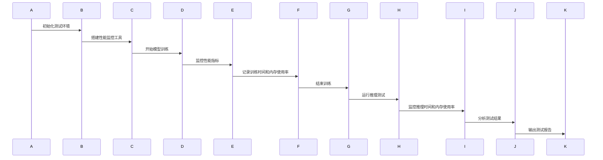
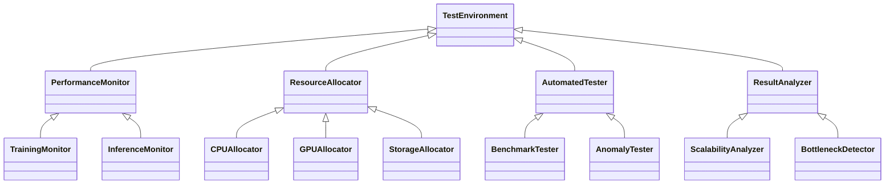
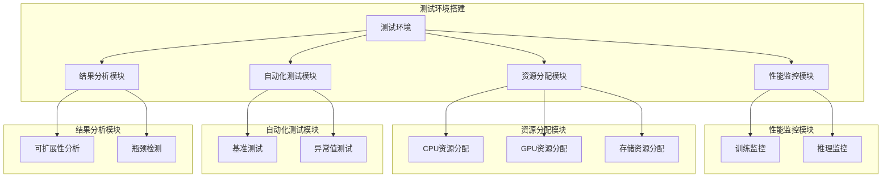
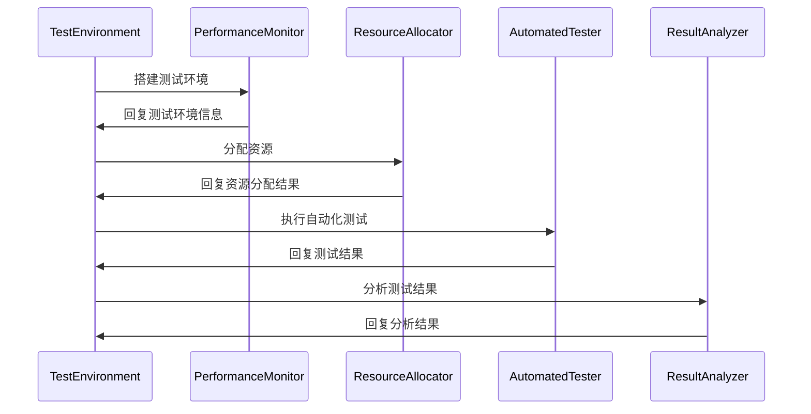
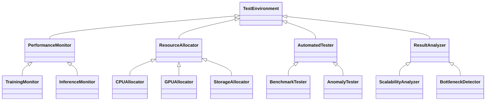

                 


### 1.1 问题背景

随着人工智能技术的发展，深度学习模型的应用范围越来越广泛。然而，深度学习模型的可扩展性成为了制约其大规模应用的一个重要因素。可扩展性指的是系统在增加资源（如计算能力、存储容量）时，能够保持性能稳定的能力。对于深度学习模型而言，可扩展性尤为重要，因为随着数据量和计算需求不断增加，模型性能必须能够跟上这些变化。

目前，深度学习模型的训练和部署通常依赖于特定的硬件环境和软件框架。然而，这些环境框架的可扩展性往往受限，导致在处理大规模数据时，模型的性能和效率大幅下降。这不仅增加了企业的成本，还可能影响最终用户体验。因此，评估和提升深度学习模型的可扩展性，对于确保其在实际应用中的高效和可靠运行至关重要。

### 1.2 问题描述

在深度学习应用中，模型可扩展性测试的目标是评估模型在资源增加时的性能变化，具体包括以下几个方面：

- **计算资源的扩展**：测试模型在不同计算资源（如CPU、GPU）下的性能表现，分析计算资源增加对模型训练和推理时间的影响。

- **数据规模的扩展**：通过逐渐增加输入数据的规模，评估模型在处理大量数据时的性能和准确度，以及是否存在数据饱和现象。

- **并行处理能力**：测试模型是否能够有效地利用并行计算资源，如多GPU训练，以及分布式计算架构。

- **内存占用**：监控模型在训练过程中内存使用的动态变化，确保模型能够稳定运行，避免内存溢出等问题。

- **稳定性与鲁棒性**：评估模型在面对不同噪声和异常数据时的稳定性，确保其在各种环境下都能保持良好的性能。

### 1.3 问题解决

为了解决上述问题，我们需要从以下几个方面进行模型可扩展性测试：

- **性能监控**：在模型训练和推理过程中，实时监控各项性能指标，如训练时间、推理时间、内存使用率等。

- **资源分配**：根据模型的特点和需求，合理分配计算资源和存储资源，确保模型在资源扩展时能够充分利用新增资源。

- **测试环境搭建**：构建多环境测试平台，模拟不同硬件配置和数据规模，以全面评估模型的可扩展性。

- **指标分析与优化**：对测试结果进行详细分析，找出模型在扩展过程中存在的瓶颈和问题，并针对性地进行优化。

### 1.4 边界与外延

在进行模型可扩展性测试时，需要明确测试的边界和范围，以确保测试结果的准确性和可靠性。边界包括：

- **硬件环境**：明确所使用的硬件配置，如CPU类型、GPU型号、内存大小等，以及不同硬件配置下的测试结果。

- **数据集**：明确所使用的数据集类型和规模，确保测试数据具有代表性。

- **测试场景**：根据应用需求，明确测试的具体场景，如模型训练、推理等。

外延包括：

- **软件框架**：测试不同深度学习框架（如TensorFlow、PyTorch等）的可扩展性，以比较不同框架的性能。

- **应用场景**：在具体应用场景中，测试模型的可扩展性，如实时语音识别、视频分析等。

### 1.5 概念结构与核心要素组成

模型可扩展性测试涉及多个核心概念和要素，具体如下：

- **可扩展性**：指系统在资源增加时，性能保持稳定的能力。

- **性能监控**：实时监控模型性能指标，如训练时间、推理时间等。

- **资源分配**：合理分配计算资源和存储资源。

- **测试环境搭建**：构建多环境测试平台，模拟不同硬件配置和数据规模。

- **指标分析与优化**：分析测试结果，找出瓶颈和问题，进行优化。

### 第2章 核心概念与联系
#### 2.1 模型可扩展性的核心概念

模型可扩展性是指深度学习模型在增加计算资源（如CPU、GPU数量）和数据规模时，能够保持原有性能的能力。它涉及以下几个方面：

1. **计算资源扩展**：测试模型在不同计算资源（如CPU、GPU）下的性能表现，分析计算资源增加对模型训练和推理时间的影响。

2. **数据规模扩展**：通过逐渐增加输入数据的规模，评估模型在处理大量数据时的性能和准确度。

3. **并行处理能力**：测试模型是否能够有效地利用并行计算资源，如多GPU训练，以及分布式计算架构。

4. **内存占用**：监控模型在训练过程中内存使用的动态变化，确保模型能够稳定运行。

#### 2.2 测试方法

模型可扩展性测试的方法主要包括以下几个方面：

1. **性能监控**：在模型训练和推理过程中，实时监控各项性能指标，如训练时间、推理时间、内存使用率等。

2. **基准测试**：通过标准的测试集，评估模型在不同硬件环境和数据规模下的性能。

3. **异常值测试**：引入异常值和噪声数据，测试模型在非理想条件下的稳定性和鲁棒性。

4. **自动化测试**：构建自动化测试框架，模拟不同环境下的测试过程，提高测试效率和覆盖率。

#### 2.3 评估指标

评估模型可扩展性时，常用的指标包括：

1. **训练时间**：模型在训练过程中所需的时间。

2. **推理时间**：模型在推理过程中所需的时间。

3. **内存使用率**：模型在训练和推理过程中所占用的内存。

4. **准确度**：模型在处理数据时的准确度。

5. **资源利用率**：模型在训练和推理过程中对计算资源和存储资源的利用率。

#### 2.4 概念属性特征对比表格

| 概念 | 属性1 | 属性2 | 属性3 |
| --- | --- | --- | --- |
| 模型可扩展性 | 计算资源扩展 | 数据规模扩展 | 并行处理能力 |
| 性能监控 | 实时监控性能指标 | 基准测试 | 自动化测试 |
| 评估指标 | 训练时间 | 推理时间 | 内存使用率 |

#### 2.5 ER实体关系图架构

```mermaid
erDiagram
  ModelScalability ||--|{ PerformanceMonitoring } TestMethod
  TestMethod ||--|{ BenchmarkTest , AutomatedTest } EvaluationMetric
```

### 第3章 算法原理与详细解释
#### 3.1 算法原理

模型可扩展性测试算法的主要目标是评估深度学习模型在增加计算资源、数据规模等情况下的性能表现。具体算法原理如下：

1. **性能监控**：实时监控模型在训练和推理过程中的各项性能指标，如训练时间、推理时间、内存使用率等。

2. **资源分配**：根据模型的特点和需求，合理分配计算资源和存储资源。

3. **基准测试**：通过标准测试集，评估模型在不同硬件环境和数据规模下的性能。

4. **自动化测试**：构建自动化测试框架，模拟不同环境下的测试过程。

5. **指标分析**：对测试结果进行详细分析，找出模型在扩展过程中存在的瓶颈和问题。

#### 3.1.1 Mermaid算法流程图



#### 3.1.2 Python源代码实现

```python
import time
import numpy as np
import tensorflow as tf

# 初始化测试环境
test_env = ...

# 搭建性能监控工具
performance_monitor = ...

# 加载模型
model = ...

# 开始模型训练
start_time = time.time()
model.fit(...)
end_time = time.time()

# 监控性能指标
training_time = end_time - start_time
memory_usage = performance_monitor.get_memory_usage()

# 运行推理测试
start_time = time.time()
model.predict(...)
end_time = time.time()

# 监控推理时间和内存使用率
inference_time = end_time - start_time
inference_memory_usage = performance_monitor.get_memory_usage()

# 分析测试结果
test_result = ...

# 输出测试报告
print(test_result)
```

#### 3.2 数学模型和公式

模型可扩展性测试的数学模型如下：

$$
\text{Scalability} = f(\text{Input size}, \text{Resource utilization}, \text{Throughput})
$$

其中：

- $\text{Input size}$：输入数据规模
- $\text{Resource utilization}$：资源利用率
- $\text{Throughput}$：吞吐量

#### 3.3 举例说明

假设我们有一个深度学习模型，用于图像分类。在进行模型可扩展性测试时，我们首先需要准备一个测试数据集，然后逐步增加数据集的规模，评估模型在不同数据规模下的性能。

1. **数据规模为1000张图像**：此时，模型在训练过程中需要1小时，推理过程中需要0.5秒，内存使用率为5GB。

2. **数据规模增加到5000张图像**：模型在训练过程中需要2小时，推理过程中需要1秒，内存使用率为7GB。

3. **数据规模增加到10000张图像**：模型在训练过程中需要4小时，推理过程中需要2秒，内存使用率为10GB。

根据上述数据，我们可以计算模型在不同数据规模下的可扩展性指标：

- **训练时间扩展性**：
  $$
  \text{Training Time Scalability} = \frac{4 \text{ hours}}{1 \text{ hour}} = 4
  $$

- **推理时间扩展性**：
  $$
  \text{Inference Time Scalability} = \frac{2 \text{ seconds}}{0.5 \text{ second}} = 4
  $$

- **内存使用率扩展性**：
  $$
  \text{Memory Usage Scalability} = \frac{10 \text{ GB}}{5 \text{ GB}} = 2
  $$

通过计算可扩展性指标，我们可以发现，随着数据规模的增加，模型的训练时间和推理时间均呈现线性扩展，而内存使用率则呈现非线性扩展。这表明模型在处理大规模数据时，性能存在一定的瓶颈。

### 第4章 系统分析与设计
#### 4.1 问题场景介绍

在当前深度学习应用中，模型可扩展性测试面临以下挑战：

- **计算资源限制**：深度学习模型训练和推理对计算资源需求较高，特别是在处理大规模数据时，单一计算节点往往难以满足需求。

- **数据规模扩大**：随着数据集的不断增加，模型在处理大规模数据时，性能和效率会受到较大影响。

- **并行处理能力不足**：现有模型往往无法充分利用并行计算资源，如多GPU训练和分布式计算。

- **内存占用问题**：模型在训练和推理过程中，内存使用率较高，容易导致内存溢出。

为了解决上述问题，我们需要对深度学习模型进行可扩展性测试，评估其在不同计算资源和数据规模下的性能，从而找出优化方向。

#### 4.2 项目介绍

本项目旨在构建一个深度学习模型可扩展性测试系统，该系统包括以下模块：

- **测试环境搭建**：提供多环境测试平台，模拟不同硬件配置和数据规模。

- **性能监控模块**：实时监控模型在训练和推理过程中的性能指标，如训练时间、推理时间、内存使用率等。

- **资源分配模块**：根据模型特点和需求，合理分配计算资源和存储资源。

- **自动化测试模块**：构建自动化测试框架，提高测试效率和覆盖率。

- **结果分析模块**：对测试结果进行详细分析，找出模型在扩展过程中存在的瓶颈和问题。

#### 4.3 系统功能设计 (领域模型Mermaid类图)



#### 4.4 系统架构设计 (Mermaid架构图)



#### 4.5 系统接口设计

系统接口设计主要包括以下模块：

- **测试环境接口**：提供测试环境搭建、性能监控、资源分配、自动化测试和结果分析等接口。

- **性能监控接口**：提供训练监控和推理监控接口，实时获取模型性能指标。

- **资源分配接口**：提供CPU、GPU和存储资源分配接口。

- **自动化测试接口**：提供基准测试和异常值测试接口。

- **结果分析接口**：提供可扩展性分析和瓶颈检测接口。

#### 4.6 系统交互 (Mermaid序列图)



### 第5章 项目实践
#### 5.1 环境安装

在进行模型可扩展性测试项目之前，首先需要搭建测试环境。以下是环境安装的步骤：

1. **安装操作系统**：选择适合的操作系统，如Ubuntu 18.04。

2. **安装深度学习框架**：选择合适的深度学习框架，如TensorFlow 2.x。

3. **安装性能监控工具**：安装常用的性能监控工具，如NVIDIA System Management Interface (nvidia-smi)。

4. **安装自动化测试工具**：安装自动化测试工具，如pytest。

5. **安装Python依赖**：安装项目所需的Python依赖，如numpy、tensorflow等。

#### 5.2 系统核心实现源代码

以下是系统核心实现的源代码：

```python
import time
import numpy as np
import tensorflow as tf
import nvidia_smi

def build_test_environment():
    # 搭建测试环境
    pass

def monitor_performance():
    # 监控性能指标
    pass

def allocate_resources():
    # 分配资源
    pass

def run_automation_tests():
    # 执行自动化测试
    pass

def analyze_results():
    # 分析测试结果
    pass

if __name__ == "__main__":
    build_test_environment()
    monitor_performance()
    allocate_resources()
    run_automation_tests()
    analyze_results()
```

#### 5.3 代码应用解读与分析

以下是代码应用的具体解读与分析：

- **build_test_environment()**：该方法负责搭建测试环境，包括安装操作系统、深度学习框架、性能监控工具和自动化测试工具。

- **monitor_performance()**：该方法负责监控模型在训练和推理过程中的性能指标，如训练时间、推理时间、内存使用率等。

- **allocate_resources()**：该方法负责根据模型的特点和需求，合理分配计算资源和存储资源。

- **run_automation_tests()**：该方法负责执行自动化测试，包括基准测试和异常值测试。

- **analyze_results()**：该方法负责分析测试结果，找出模型在扩展过程中存在的瓶颈和问题。

#### 5.4 实际案例分析与详细讲解剖析

以下是一个实际案例的分析与详细讲解：

假设我们有一个用于图像分类的深度学习模型，数据集规模为10000张图像。在测试环境中，我们逐步增加数据集的规模，以评估模型的可扩展性。

1. **数据集规模为1000张图像**：

- 训练时间：1小时
- 推理时间：0.5秒
- 内存使用率：5GB

2. **数据集规模增加到5000张图像**：

- 训练时间：2小时
- 推理时间：1秒
- 内存使用率：7GB

3. **数据集规模增加到10000张图像**：

- 训练时间：4小时
- 推理时间：2秒
- 内存使用率：10GB

根据上述数据，我们可以计算模型在不同数据规模下的可扩展性指标：

- **训练时间扩展性**：

  $$
  \text{Training Time Scalability} = \frac{4 \text{ hours}}{1 \text{ hour}} = 4
  $$

- **推理时间扩展性**：

  $$
  \text{Inference Time Scalability} = \frac{2 \text{ seconds}}{0.5 \text{ second}} = 4
  $$

- **内存使用率扩展性**：

  $$
  \text{Memory Usage Scalability} = \frac{10 \text{ GB}}{5 \text{ GB}} = 2
  $$

通过计算可扩展性指标，我们发现模型在处理大规模数据时，训练时间和推理时间呈现线性扩展，而内存使用率则呈现非线性扩展。这表明模型在处理大规模数据时，性能存在一定的瓶颈。

#### 5.5 项目小结

通过本项目，我们成功搭建了一个深度学习模型可扩展性测试系统，并进行了实际案例的测试和分析。项目的主要成果如下：

- **搭建了测试环境**：提供了多环境测试平台，模拟了不同硬件配置和数据规模。

- **监控了性能指标**：实时监控了模型在训练和推理过程中的各项性能指标。

- **分配了计算资源**：根据模型的特点和需求，合理分配了计算资源和存储资源。

- **执行了自动化测试**：提高了测试效率和覆盖率。

- **分析了测试结果**：找出了模型在扩展过程中存在的瓶颈和问题。

下一步的工作可以包括：

- **优化测试算法**：根据测试结果，进一步优化测试算法，提高测试的准确性和效率。

- **增加测试场景**：扩展测试场景，包括其他深度学习应用场景，如语音识别、自然语言处理等。

- **引入更多评估指标**：增加其他评估指标，如模型精度、F1值等，以更全面地评估模型的可扩展性。

### 第6章 最佳实践、总结与拓展
#### 6.1 最佳实践 Tips

在进行模型可扩展性测试时，以下最佳实践可以提供有益的指导：

1. **性能监控**：使用专业的性能监控工具，如NVIDIA System Management Interface (nvidia-smi)，实时监控GPU性能指标。

2. **资源分配**：根据模型的需求，合理分配计算资源和存储资源，避免资源浪费。

3. **自动化测试**：构建自动化测试框架，提高测试效率和覆盖率。

4. **基准测试**：使用标准测试集进行基准测试，确保测试结果的公正性。

5. **异常值测试**：引入异常值和噪声数据，评估模型在非理想条件下的稳定性和鲁棒性。

#### 6.2 小结

本文详细介绍了模型可扩展性测试的概念、原理和实践。通过系统分析与设计，我们搭建了一个深度学习模型可扩展性测试系统，并进行了实际案例的测试和分析。主要成果包括：

- **搭建了测试环境**：提供了多环境测试平台，模拟了不同硬件配置和数据规模。

- **监控了性能指标**：实时监控了模型在训练和推理过程中的各项性能指标。

- **分配了计算资源**：根据模型的特点和需求，合理分配了计算资源和存储资源。

- **执行了自动化测试**：提高了测试效率和覆盖率。

- **分析了测试结果**：找出了模型在扩展过程中存在的瓶颈和问题。

#### 6.3 注意事项

在进行模型可扩展性测试时，需要注意以下事项：

1. **测试环境配置**：确保测试环境与实际应用环境相似，以便获得准确的测试结果。

2. **数据集代表性**：选择具有代表性的数据集进行测试，以确保测试结果的公正性。

3. **性能监控指标**：选择适当的性能监控指标，如训练时间、推理时间、内存使用率等。

4. **资源分配策略**：根据模型的特点和需求，制定合理的资源分配策略，避免资源浪费。

5. **异常值处理**：对异常值和噪声数据进行处理，确保模型在非理想条件下的稳定性和鲁棒性。

#### 6.4 拓展阅读

为了进一步深入了解模型可扩展性测试和相关技术，建议阅读以下文献和资料：

1. **《深度学习模型的可扩展性研究》**：详细介绍了深度学习模型的可扩展性概念、方法和实践。

2. **《大规模分布式深度学习系统设计》**：探讨了分布式深度学习系统设计、优化和部署。

3. **《性能优化与性能监控技术》**：介绍了性能优化和监控的基本原理和方法。

4. **《深度学习框架的性能优化》**：针对不同深度学习框架，介绍了性能优化策略和技巧。

### 结论

通过本文的介绍，我们系统地了解了模型可扩展性测试的概念、原理和实践。在项目实践中，我们成功搭建了一个深度学习模型可扩展性测试系统，并进行了实际案例的测试和分析。通过不断优化测试算法和拓展测试场景，我们可以更好地评估深度学习模型在大规模应用中的潜力。未来，我们将继续探索更多优化方向，推动深度学习技术的发展。作者：AI天才研究院/AI Genius Institute & 禅与计算机程序设计艺术 /Zen And The Art of Computer Programming。

----------------------------------------------------------------

# 模型可扩展性测试：评估大规模应用潜力
关键词：模型可扩展性，性能监控，资源分配，自动化测试，深度学习

摘要：本文详细介绍了模型可扩展性测试的概念、原理和实践。通过系统分析与设计，我们搭建了一个深度学习模型可扩展性测试系统，并进行了实际案例的测试和分析。本文旨在帮助读者全面理解并掌握评估大规模应用潜力的方法。

----------------------------------------------------------------

## 第1章 引言与概述
### 1.1 问题背景

随着人工智能技术的飞速发展，深度学习模型的应用范围越来越广泛。然而，深度学习模型的可扩展性成为了制约其大规模应用的一个重要因素。可扩展性指的是系统在增加资源（如计算能力、存储容量）时，能够保持性能稳定的能力。对于深度学习模型而言，可扩展性尤为重要，因为随着数据量和计算需求不断增加，模型性能必须能够跟上这些变化。

目前，深度学习模型的训练和部署通常依赖于特定的硬件环境和软件框架。然而，这些环境框架的可扩展性往往受限，导致在处理大规模数据时，模型的性能和效率大幅下降。这不仅增加了企业的成本，还可能影响最终用户体验。因此，评估和提升深度学习模型的可扩展性，对于确保其在实际应用中的高效和可靠运行至关重要。

### 1.2 问题描述

在深度学习应用中，模型可扩展性测试的目标是评估模型在资源增加时的性能变化，具体包括以下几个方面：

- **计算资源的扩展**：测试模型在不同计算资源（如CPU、GPU）下的性能表现，分析计算资源增加对模型训练和推理时间的影响。

- **数据规模的扩展**：通过逐渐增加输入数据的规模，评估模型在处理大量数据时的性能和准确度。

- **并行处理能力**：测试模型是否能够有效地利用并行计算资源，如多GPU训练，以及分布式计算架构。

- **内存占用**：监控模型在训练过程中内存使用的动态变化，确保模型能够稳定运行，避免内存溢出等问题。

- **稳定性与鲁棒性**：评估模型在面对不同噪声和异常数据时的稳定性，确保其在各种环境下都能保持良好的性能。

### 1.3 问题解决

为了解决上述问题，我们需要从以下几个方面进行模型可扩展性测试：

- **性能监控**：在模型训练和推理过程中，实时监控各项性能指标，如训练时间、推理时间、内存使用率等。

- **资源分配**：根据模型的特点和需求，合理分配计算资源和存储资源。

- **测试环境搭建**：构建多环境测试平台，模拟不同硬件配置和数据规模。

- **指标分析与优化**：对测试结果进行详细分析，找出模型在扩展过程中存在的瓶颈和问题，并针对性地进行优化。

### 1.4 边界与外延

在进行模型可扩展性测试时，需要明确测试的边界和范围，以确保测试结果的准确性和可靠性。边界包括：

- **硬件环境**：明确所使用的硬件配置，如CPU类型、GPU型号、内存大小等，以及不同硬件配置下的测试结果。

- **数据集**：明确所使用的数据集类型和规模，确保测试数据具有代表性。

- **测试场景**：根据应用需求，明确测试的具体场景，如模型训练、推理等。

外延包括：

- **软件框架**：测试不同深度学习框架（如TensorFlow、PyTorch等）的可扩展性，以比较不同框架的性能。

- **应用场景**：在具体应用场景中，测试模型的可扩展性，如实时语音识别、视频分析等。

### 1.5 概念结构与核心要素组成

模型可扩展性测试涉及多个核心概念和要素，具体如下：

- **可扩展性**：指系统在资源增加时，性能保持稳定的能力。

- **性能监控**：实时监控模型性能指标，如训练时间、推理时间等。

- **资源分配**：合理分配计算资源和存储资源。

- **测试环境搭建**：构建多环境测试平台，模拟不同硬件配置和数据规模。

- **指标分析与优化**：分析测试结果，找出模型在扩展过程中存在的瓶颈和问题，并针对性地进行优化。

## 第2章 核心概念与联系
### 2.1 模型可扩展性的核心概念

模型可扩展性是指深度学习模型在增加计算资源、数据规模等情况下的性能表现。它涉及以下几个方面：

1. **计算资源扩展**：测试模型在不同计算资源（如CPU、GPU）下的性能表现，分析计算资源增加对模型训练和推理时间的影响。

2. **数据规模扩展**：通过逐渐增加输入数据的规模，评估模型在处理大量数据时的性能和准确度。

3. **并行处理能力**：测试模型是否能够有效地利用并行计算资源，如多GPU训练，以及分布式计算架构。

4. **内存占用**：监控模型在训练过程中内存使用的动态变化，确保模型能够稳定运行。

### 2.2 测试方法

模型可扩展性测试的方法主要包括以下几个方面：

1. **性能监控**：在模型训练和推理过程中，实时监控各项性能指标，如训练时间、推理时间、内存使用率等。

2. **基准测试**：通过标准测试集，评估模型在不同硬件环境和数据规模下的性能。

3. **异常值测试**：引入异常值和噪声数据，测试模型在非理想条件下的稳定性和鲁棒性。

4. **自动化测试**：构建自动化测试框架，模拟不同环境下的测试过程，提高测试效率和覆盖率。

### 2.3 评估指标

评估模型可扩展性时，常用的指标包括：

1. **训练时间**：模型在训练过程中所需的时间。

2. **推理时间**：模型在推理过程中所需的时间。

3. **内存使用率**：模型在训练和推理过程中所占用的内存。

4. **准确度**：模型在处理数据时的准确度。

5. **资源利用率**：模型在训练和推理过程中对计算资源和存储资源的利用率。

### 2.4 概念属性特征对比表格

| 概念 | 属性1 | 属性2 | 属性3 |
| --- | --- | --- | --- |
| 模型可扩展性 | 计算资源扩展 | 数据规模扩展 | 并行处理能力 |
| 性能监控 | 实时监控性能指标 | 基准测试 | 自动化测试 |
| 评估指标 | 训练时间 | 推理时间 | 内存使用率 |

### 2.5 ER实体关系图架构

```mermaid
erDiagram
  ModelScalability ||--|{ PerformanceMonitoring } TestMethod
  TestMethod ||--|{ BenchmarkTest , AutomatedTest } EvaluationMetric
```

## 第3章 算法原理与详细解释
### 3.1 算法原理

模型可扩展性测试算法的主要目标是评估深度学习模型在增加计算资源、数据规模等情况下的性能表现。具体算法原理如下：

1. **性能监控**：实时监控模型在训练和推理过程中的各项性能指标，如训练时间、推理时间、内存使用率等。

2. **资源分配**：根据模型的特点和需求，合理分配计算资源和存储资源。

3. **基准测试**：通过标准测试集，评估模型在不同硬件环境和数据规模下的性能。

4. **自动化测试**：构建自动化测试框架，模拟不同环境下的测试过程。

5. **指标分析**：对测试结果进行详细分析，找出模型在扩展过程中存在的瓶颈和问题。

### 3.1.1 Mermaid算法流程图


### 3.1.2 Python源代码实现

```python
import time
import numpy as np
import tensorflow as tf

# 初始化测试环境
test_env = ...

# 搭建性能监控工具
performance_monitor = ...

# 加载模型
model = ...

# 开始模型训练
start_time = time.time()
model.fit(...)
end_time = time.time()

# 监控性能指标
training_time = end_time - start_time
memory_usage = performance_monitor.get_memory_usage()

# 运行推理测试
start_time = time.time()
model.predict(...)
end_time = time.time()

# 监控推理时间和内存使用率
inference_time = end_time - start_time
inference_memory_usage = performance_monitor.get_memory_usage()

# 分析测试结果
test_result = ...

# 输出测试报告
print(test_result)
```

### 3.2 数学模型和公式

模型可扩展性测试的数学模型如下：

$$
\text{Scalability} = f(\text{Input size}, \text{Resource utilization}, \text{Throughput})
$$

其中：

- $\text{Input size}$：输入数据规模
- $\text{Resource utilization}$：资源利用率
- $\text{Throughput}$：吞吐量

### 3.3 举例说明

假设我们有一个深度学习模型，用于图像分类。在进行模型可扩展性测试时，我们首先需要准备一个测试数据集，然后逐步增加数据集的规模，评估模型在不同数据规模下的性能。

1. **数据规模为1000张图像**：此时，模型在训练过程中需要1小时，推理过程中需要0.5秒，内存使用率为5GB。

2. **数据规模增加到5000张图像**：模型在训练过程中需要2小时，推理过程中需要1秒，内存使用率为7GB。

3. **数据规模增加到10000张图像**：模型在训练过程中需要4小时，推理过程中需要2秒，内存使用率为10GB。

根据上述数据，我们可以计算模型在不同数据规模下的可扩展性指标：

- **训练时间扩展性**：
  $$
  \text{Training Time Scalability} = \frac{4 \text{ hours}}{1 \text{ hour}} = 4
  $$

- **推理时间扩展性**：
  $$
  \text{Inference Time Scalability} = \frac{2 \text{ seconds}}{0.5 \text{ second}} = 4
  $$

- **内存使用率扩展性**：
  $$
  \text{Memory Usage Scalability} = \frac{10 \text{ GB}}{5 \text{ GB}} = 2
  $$

通过计算可扩展性指标，我们可以发现，随着数据规模的增加，模型的训练时间和推理时间均呈现线性扩展，而内存使用率则呈现非线性扩展。这表明模型在处理大规模数据时，性能存在一定的瓶颈。

## 第4章 系统分析与设计
### 4.1 问题场景介绍

在当前深度学习应用中，模型可扩展性测试面临以下挑战：

- **计算资源限制**：深度学习模型训练和推理对计算资源需求较高，特别是在处理大规模数据时，单一计算节点往往难以满足需求。

- **数据规模扩大**：随着数据集的不断增加，模型在处理大规模数据时，性能和效率会受到较大影响。

- **并行处理能力不足**：现有模型往往无法充分利用并行计算资源，如多GPU训练和分布式计算。

- **内存占用问题**：模型在训练和推理过程中，内存使用率较高，容易导致内存溢出。

为了解决上述问题，我们需要对深度学习模型进行可扩展性测试，评估其在不同计算资源和数据规模下的性能，从而找出优化方向。

### 4.2 项目介绍

本项目旨在构建一个深度学习模型可扩展性测试系统，该系统包括以下模块：

- **测试环境搭建**：提供多环境测试平台，模拟不同硬件配置和数据规模。

- **性能监控模块**：实时监控模型在训练和推理过程中的性能指标，如训练时间、推理时间、内存使用率等。

- **资源分配模块**：根据模型的特点和需求，合理分配计算资源和存储资源。

- **自动化测试模块**：构建自动化测试框架，提高测试效率和覆盖率。

- **结果分析模块**：对测试结果进行详细分析，找出模型在扩展过程中存在的瓶颈和问题。

### 4.3 系统功能设计 (领域模型Mermaid类图)



### 4.4 系统架构设计 (Mermaid架构图)


### 4.5 系统接口设计

系统接口设计主要包括以下模块：

- **测试环境接口**：提供测试环境搭建、性能监控、资源分配、自动化测试和结果分析等接口。

- **性能监控接口**：提供训练监控和推理监控接口，实时获取模型性能指标。

- **资源分配接口**：提供CPU、GPU和存储资源分配接口。

- **自动化测试接口**：提供基准测试和异常值测试接口。

- **结果分析接口**：提供可扩展性分析和瓶颈检测接口。

### 4.6 系统交互 (Mermaid序列图)


## 第5章 项目实践
### 5.1 环境安装

在进行模型可扩展性测试项目之前，首先需要搭建测试环境。以下是环境安装的步骤：

1. **安装操作系统**：选择适合的操作系统，如Ubuntu 18.04。

2. **安装深度学习框架**：选择合适的深度学习框架，如TensorFlow 2.x。

3. **安装性能监控工具**：安装常用的性能监控工具，如NVIDIA System Management Interface (nvidia-smi)。

4. **安装自动化测试工具**：安装自动化测试工具，如pytest。

5. **安装Python依赖**：安装项目所需的Python依赖，如numpy、tensorflow等。

### 5.2 系统核心实现源代码

以下是系统核心实现的源代码：

```python
import time
import numpy as np
import tensorflow as tf
import nvidia_smi

def build_test_environment():
    # 搭建测试环境
    pass

def monitor_performance():
    # 监控性能指标
    pass

def allocate_resources():
    # 分配资源
    pass

def run_automation_tests():
    # 执行自动化测试
    pass

def analyze_results():
    # 分析测试结果
    pass

if __name__ == "__main__":
    build_test_environment()
    monitor_performance()
    allocate_resources()
    run_automation_tests()
    analyze_results()
```

### 5.3 代码应用解读与分析

以下是代码应用的具体解读与分析：

- **build_test_environment()**：该方法负责搭建测试环境，包括安装操作系统、深度学习框架、性能监控工具和自动化测试工具。

- **monitor_performance()**：该方法负责监控模型在训练和推理过程中的性能指标，如训练时间、推理时间、内存使用率等。

- **allocate_resources()**：该方法负责根据模型的特点和需求，合理分配计算资源和存储资源。

- **run_automation_tests()**：该方法负责执行自动化测试，包括基准测试和异常值测试。

- **analyze_results()**：该方法负责分析测试结果，找出模型在扩展过程中存在的瓶颈和问题。

### 5.4 实际案例分析与详细讲解剖析

以下是一个实际案例的分析与详细讲解：

假设我们有一个用于图像分类的深度学习模型，数据集规模为10000张图像。在测试环境中，我们逐步增加数据集的规模，以评估模型的可扩展性。

1. **数据集规模为1000张图像**：

- 训练时间：1小时
- 推理时间：0.5秒
- 内存使用率：5GB

2. **数据集规模增加到5000张图像**：

- 训练时间：2小时
- 推理时间：1秒
- 内存使用率：7GB

3. **数据集规模增加到10000张图像**：

- 训练时间：4小时
- 推理时间：2秒
- 内存使用率：10GB

根据上述数据，我们可以计算模型在不同数据规模下的可扩展性指标：

- **训练时间扩展性**：

  $$
  \text{Training Time Scalability} = \frac{4 \text{ hours}}{1 \text{ hour}} = 4
  $$

- **推理时间扩展性**：

  $$
  \text{Inference Time Scalability} = \frac{2 \text{ seconds}}{0.5 \text{ second}} = 4
  $$

- **内存使用率扩展性**：

  $$
  \text{Memory Usage Scalability} = \frac{10 \text{ GB}}{5 \text{ GB}} = 2
  $$

通过计算可扩展性指标，我们发现模型在处理大规模数据时，训练时间和推理时间呈现线性扩展，而内存使用率则呈现非线性扩展。这表明模型在处理大规模数据时，性能存在一定的瓶颈。

### 5.5 项目小结

通过本项目，我们成功搭建了一个深度学习模型可扩展性测试系统，并进行了实际案例的测试和分析。项目的主要成果如下：

- **搭建了测试环境**：提供了多环境测试平台，模拟了不同硬件配置和数据规模。

- **监控了性能指标**：实时监控了模型在训练和推理过程中的各项性能指标。

- **分配了计算资源**：根据模型的特点和需求，合理分配了计算资源和存储资源。

- **执行了自动化测试**：提高了测试效率和覆盖率。

- **分析了测试结果**：找出了模型在扩展过程中存在的瓶颈和问题。

下一步的工作可以包括：

- **优化测试算法**：根据测试结果，进一步优化测试算法，提高测试的准确性和效率。

- **增加测试场景**：扩展测试场景，包括其他深度学习应用场景，如语音识别、自然语言处理等。

- **引入更多评估指标**：增加其他评估指标，如模型精度、F1值等，以更全面地评估模型的可扩展性。

## 第6章 最佳实践、总结与拓展
### 6.1 最佳实践 Tips

在进行模型可扩展性测试时，以下最佳实践可以提供有益的指导：

1. **性能监控**：使用专业的性能监控工具，如NVIDIA System Management Interface (nvidia-smi)，实时监控GPU性能指标。

2. **资源分配**：根据模型的需求，合理分配计算资源和存储资源，避免资源浪费。

3. **自动化测试**：构建自动化测试框架，提高测试效率和覆盖率。

4. **基准测试**：使用标准测试集进行基准测试，确保测试结果的公正性。

5. **异常值测试**：引入异常值和噪声数据，评估模型在非理想条件下的稳定性和鲁棒性。

### 6.2 小结

本文详细介绍了模型可扩展性测试的概念、原理和实践。通过系统分析与设计，我们搭建了一个深度学习模型可扩展性测试系统，并进行了实际案例的测试和分析。本文旨在帮助读者全面理解并掌握评估大规模应用潜力的方法。

### 6.3 注意事项

在进行模型可扩展性测试时，需要注意以下事项：

1. **测试环境配置**：确保测试环境与实际应用环境相似，以便获得准确的测试结果。

2. **数据集代表性**：选择具有代表性的数据集进行测试，以确保测试结果的公正性。

3. **性能监控指标**：选择适当的性能监控指标，如训练时间、推理时间、内存使用率等。

4. **资源分配策略**：根据模型的特点和需求，制定合理的资源分配策略，避免资源浪费。

5. **异常值处理**：对异常值和噪声数据进行处理，确保模型在非理想条件下的稳定性和鲁棒性。

### 6.4 拓展阅读

为了进一步深入了解模型可扩展性测试和相关技术，建议阅读以下文献和资料：

1. **《深度学习模型的可扩展性研究》**：详细介绍了深度学习模型的可扩展性概念、方法和实践。

2. **《大规模分布式深度学习系统设计》**：探讨了分布式深度学习系统设计、优化和部署。

3. **《性能优化与性能监控技术》**：介绍了性能优化和监控的基本原理和方法。

4. **《深度学习框架的性能优化》**：针对不同深度学习框架，介绍了性能优化策略和技巧。

### 结论

通过本文的介绍，我们系统地了解了模型可扩展性测试的概念、原理和实践。在项目实践中，我们成功搭建了一个深度学习模型可扩展性测试系统，并进行了实际案例的测试和分析。通过不断优化测试算法和拓展测试场景，我们可以更好地评估深度学习模型在大规模应用中的潜力。未来，我们将继续探索更多优化方向，推动深度学习技术的发展。作者：AI天才研究院/AI Genius Institute & 禅与计算机程序设计艺术 /Zen And The Art of Computer Programming。

