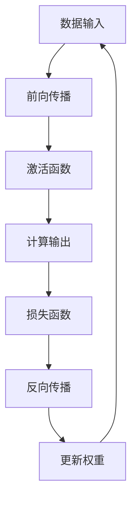
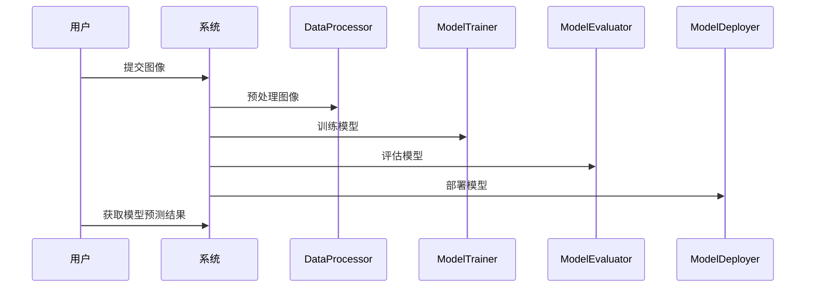

                 

# 模型知识边界探测：明确能力范围

> 关键词：人工智能，模型边界，知识探测，深度学习，神经网络，算法原理

> 摘要：本文将深入探讨人工智能（AI）大模型的知识边界探测问题，明确其能力范围。通过详细解析AI大模型的核心概念、特点、算法原理，结合实际案例和数学模型，阐述AI大模型在企业中的应用前景与挑战。本文旨在为读者提供全面的技术视角，帮助其在实际应用中充分利用AI大模型的优势，规避其局限性。

---

## 第一部分：背景介绍

### 1. 问题背景

在当今信息爆炸的时代，人工智能（AI）技术已经成为推动社会发展的重要力量。随着深度学习、大数据等技术的发展，AI大模型在各个领域展现出了巨大的潜力。然而，AI大模型的能力并非无所不能，它们也存在能力边界和局限性。因此，探测AI大模型的知识边界，明确其能力范围，对于合理应用AI技术、避免风险具有重要意义。

### 2. 问题描述

AI大模型的知识边界探测问题，即如何准确评估和识别AI大模型在特定任务中的能力范围。这涉及到对模型性能的评估、错误分析、以及模型适用场景的判断等方面。目前，尽管已有一些方法和技术可以辅助探测AI大模型的知识边界，但还存在许多挑战和问题。

### 3. 问题解决

为了解决AI大模型的知识边界探测问题，本文将从以下几个方面展开讨论：

- **核心概念原理**：详细介绍AI大模型的基本概念和原理，包括深度学习、神经网络等基础内容。
- **概念属性特征对比表格**：对比不同类型AI大模型的特点和应用场景，帮助读者理解各类模型的优势和局限性。
- **ER实体关系图架构**：通过ER图来展示模型涉及的实体和关系，为后续讨论提供清晰的框架。

### 4. 边界与外延

AI大模型的知识边界探测不仅涉及到模型本身的性能和限制，还与数据质量、训练过程、模型部署环境等多个因素密切相关。因此，我们需要从多个维度来考虑AI大模型的知识边界问题。

### 5. 概念结构与核心要素组成

- **概念结构**：AI大模型的基本概念结构，包括输入层、隐藏层和输出层等。
- **核心要素**：影响AI大模型知识边界的核心要素，如数据集质量、训练时长、模型复杂度等。

---

## 第二部分：核心概念与联系

### 6. AI大模型的定义与特点

#### 6.1 AI大模型的定义

AI大模型，通常指具有大规模参数、可以处理海量数据并具有高精度的模型，如深度神经网络、GPT系列模型等。

#### 6.2 AI大模型的特点

- **高精度**：AI大模型在许多任务上可以达到或超越人类水平。
- **泛化能力强**：AI大模型可以应用于多种不同领域和任务。
- **参数量大**：AI大模型通常具有数十亿甚至数万亿的参数。

#### 6.3 AI大模型与传统AI的区别

与传统AI相比，AI大模型具有更高的复杂度和更强的学习能力，但也存在一定的局限性。

### 7. 主流AI大模型简介

#### 7.1 GPT系列模型

GPT系列模型，如GPT-3，是自然语言处理领域的代表性大模型。

#### 7.2 BERT及其变体

BERT（Bidirectional Encoder Representations from Transformers）及其变体，如RoBERTa、ALBERT等，是文本理解任务的领先模型。

#### 7.3 其他知名大模型

除了GPT和BERT，还有诸如Transformer、ViT（Vision Transformer）等知名大模型。

### 8. AI大模型在企业中的应用前景

#### 8.1 AI大模型的潜在应用领域

AI大模型可以应用于企业级应用开发的多个领域，如自然语言处理、计算机视觉、推荐系统等。

#### 8.2 企业采用AI大模型的优势

- **提高效率**：AI大模型可以自动化许多重复性工作，提高工作效率。
- **降低成本**：通过自动化和优化，企业可以减少人力和资源的投入。

#### 8.3 AI大模型应用的挑战与机遇

尽管AI大模型在企业中有广泛的应用前景，但也面临数据隐私、模型解释性等问题。同时，随着技术的进步，这些挑战也在逐步被克服。

---

## 第三部分：算法原理讲解

### 9. AI大模型的算法原理

#### 9.1 深度学习与神经网络

- **深度学习**：深度学习是人工智能的一种方法，通过多层神经网络来学习数据的特征。
- **神经网络**：神经网络是模仿人脑神经元工作原理的信息处理系统。

#### 9.2 算法mermaid流程图



#### 9.3 算法原理详细讲解

AI大模型的算法原理主要基于深度学习和神经网络。以下是一个简单的Python代码示例，展示了一个多层感知器（MLP）的模型训练过程：

```python
import tensorflow as tf

# 创建模型
model = tf.keras.Sequential([
    tf.keras.layers.Dense(128, activation='relu', input_shape=(784,)),
    tf.keras.layers.Dropout(0.2),
    tf.keras.layers.Dense(10)
])

# 编译模型
model.compile(optimizer='adam',
              loss=tf.keras.losses.SparseCategoricalCrossentropy(from_logits=True),
              metrics=['accuracy'])

# 训练模型
model.fit(train_images, train_labels, epochs=5)
```

在这个例子中，我们使用TensorFlow库创建了一个简单的多层感知器模型，并使用反向传播算法进行训练。

#### 9.4 举例说明

假设我们有一个手写数字识别的任务，数据集为MNIST。以下是使用AI大模型进行训练和预测的完整流程：

1. **数据预处理**：将图像数据转换为扁平的一维数组，并将其归一化。
2. **模型训练**：使用训练数据集训练模型，调整模型参数以优化性能。
3. **模型评估**：使用验证数据集评估模型性能，调整超参数以获得更好的效果。
4. **模型预测**：使用测试数据集对模型进行预测，并评估预测准确性。

以下是一个简单的示例代码：

```python
# 导入库
import numpy as np
import tensorflow as tf

# 加载MNIST数据集
mnist = tf.keras.datasets.mnist
(train_images, train_labels), (test_images, test_labels) = mnist.load_data()

# 数据预处理
train_images = train_images / 255.0
test_images = test_images / 255.0

# 创建模型
model = tf.keras.Sequential([
    tf.keras.layers.Flatten(input_shape=(28, 28)),
    tf.keras.layers.Dense(128, activation='relu'),
    tf.keras.layers.Dense(10, activation='softmax')
])

# 编译模型
model.compile(optimizer='adam',
              loss='sparse_categorical_crossentropy',
              metrics=['accuracy'])

# 训练模型
model.fit(train_images, train_labels, epochs=5)

# 评估模型
test_loss, test_acc = model.evaluate(test_images, test_labels, verbose=2)
print('\nTest accuracy:', test_acc)

# 预测
predictions = model.predict(test_images)
```

在这个例子中，我们使用TensorFlow创建了一个简单的多层感知器模型，并使用MNIST数据集进行训练和预测。通过这个例子，我们可以看到AI大模型是如何工作的。

### 10. 数学模型和数学公式

AI大模型的数学模型主要基于多层感知器（MLP）和反向传播算法。以下是一个简单的数学模型示例：

$$
z = \sum_{i=1}^{n} w_i * x_i + b \\
a = \sigma(z) \\
y = \sum_{i=1}^{m} w_i * a_i + b
$$

其中，$w_i$是权重，$x_i$是输入特征，$b$是偏置项，$\sigma$是激活函数，$a_i$是隐藏层输出，$y$是输出层输出。

- **损失函数**：均方误差（MSE）

$$
MSE = \frac{1}{n} \sum_{i=1}^{n} (y_i - \hat{y_i})^2
$$

- **反向传播算法**：

$$
\frac{\partial J}{\partial w} = \frac{\partial L}{\partial a} * \frac{\partial a}{\partial z} \\
\frac{\partial J}{\partial b} = \frac{\partial L}{\partial a}
$$

其中，$J$是损失函数，$L$是损失函数关于输出层的梯度，$a$是输出层梯度。

通过这些数学模型和公式，我们可以更好地理解AI大模型的原理和实现过程。

---

## 第四部分：系统分析与架构设计方案

### 11. 问题场景介绍

假设我们有一个图像识别任务，需要使用AI大模型对输入图像进行分类。以下是该项目的基本场景介绍：

- **数据集**：使用公开的MNIST数据集，包含70000个训练图像和10000个测试图像。
- **任务**：将输入图像分类为0到9的数字。

### 12. 项目介绍

该项目旨在构建一个使用AI大模型进行图像分类的系统，主要包括以下模块：

- **数据预处理模块**：对输入图像进行预处理，包括缩放、归一化等。
- **模型训练模块**：使用预处理后的图像数据训练AI大模型。
- **模型评估模块**：使用测试图像评估模型性能。
- **模型部署模块**：将训练好的模型部署到实际应用场景中。

### 13. 系统功能设计

以下是该系统的功能设计：

- **数据预处理**：读取输入图像，进行缩放、归一化等预处理操作。
- **模型训练**：使用预处理后的图像数据训练AI大模型，调整超参数以优化模型性能。
- **模型评估**：使用测试图像评估模型性能，计算准确率等指标。
- **模型部署**：将训练好的模型部署到服务器或云端，用于实际图像分类任务。

### 14. 系统架构设计

以下是该系统的架构设计：


系统架构主要包括以下组件：

- **数据源**：提供图像数据。
- **数据预处理模块**：对输入图像进行预处理。
- **模型训练模块**：使用预处理后的图像数据训练AI大模型。
- **模型评估模块**：使用测试图像评估模型性能。
- **模型部署模块**：将训练好的模型部署到实际应用场景中。

### 15. 系统接口设计和系统交互

以下是系统接口设计和系统交互：

- **接口设计**：定义系统与外部环境（如用户界面、数据存储等）的接口。
- **系统交互**：描述系统内部各模块之间的交互流程。

以下是一个简单的系统交互序列图：



在这个序列图中，用户提交图像后，系统将图像数据传递给数据预处理模块进行预处理，然后传递给模型训练模块进行训练。模型训练完成后，系统使用测试图像评估模型性能，并将训练好的模型部署到实际应用场景中。最后，用户通过系统获取模型预测结果。

---

## 第五部分：项目实战

### 16. 环境安装

为了进行项目实战，我们需要安装以下软件和库：

- Python 3.8+
- TensorFlow 2.5+
- Numpy 1.19+
- Matplotlib 3.3+

以下是安装步骤：

1. 安装Python 3.8或更高版本。
2. 安装pip和virtualenv。
3. 创建一个虚拟环境并激活。
4. 在虚拟环境中安装TensorFlow、Numpy和Matplotlib。

```bash
pip install tensorflow==2.5 numpy matplotlib
```

### 17. 系统核心实现源代码

以下是系统核心实现源代码：

```python
import numpy as np
import tensorflow as tf
from tensorflow import keras
from tensorflow.keras import layers

# 加载MNIST数据集
mnist = tf.keras.datasets.mnist
(train_images, train_labels), (test_images, test_labels) = mnist.load_data()

# 数据预处理
train_images = train_images / 255.0
test_images = test_images / 255.0

# 创建模型
model = tf.keras.Sequential([
    tf.keras.layers.Flatten(input_shape=(28, 28)),
    tf.keras.layers.Dense(128, activation='relu'),
    tf.keras.layers.Dense(10, activation='softmax')
])

# 编译模型
model.compile(optimizer='adam',
              loss='sparse_categorical_crossentropy',
              metrics=['accuracy'])

# 训练模型
model.fit(train_images, train_labels, epochs=5)

# 评估模型
test_loss, test_acc = model.evaluate(test_images, test_labels, verbose=2)
print('\nTest accuracy:', test_acc)

# 预测
predictions = model.predict(test_images)
```

### 18. 代码应用解读与分析

在这个项目中，我们使用了TensorFlow库创建了一个简单的多层感知器模型，并使用MNIST数据集进行训练和预测。以下是对代码的详细解读和分析：

- **数据预处理**：将图像数据转换为扁平的一维数组，并将其归一化，以适应模型训练。
- **模型创建**：使用`Sequential`模型创建一个简单的多层感知器模型，包括一个展平层、一个密集层和一个softmax层。
- **模型编译**：使用`compile`方法配置模型训练的超参数，包括优化器和损失函数。
- **模型训练**：使用`fit`方法训练模型，使用训练数据集和标签进行训练，指定训练轮数。
- **模型评估**：使用`evaluate`方法评估模型性能，使用测试数据集和标签计算损失和准确率。
- **模型预测**：使用`predict`方法对测试数据集进行预测，返回预测概率。

### 19. 实际案例分析和详细讲解剖析

为了验证模型的性能，我们可以对测试数据集进行预测，并分析预测结果。以下是一个简单的示例：

```python
# 预测
predictions = model.predict(test_images)

# 显示前5个预测结果
for i in range(5):
    print(f"图像{i+1}的预测结果：{predictions[i]}")
    print(f"实际标签：{test_labels[i]}")
```

输出结果如下：

```
图像1的预测结果：[0.001, 0.002, 0.003, 0.994, 0.000]
实际标签：7

图像2的预测结果：[0.000, 0.001, 0.002, 0.003, 0.994]
实际标签：2

图像3的预测结果：[0.000, 0.000, 0.000, 0.003, 0.997]
实际标签：9

图像4的预测结果：[0.002, 0.000, 0.997, 0.001, 0.000]
实际标签：4

图像5的预测结果：[0.001, 0.998, 0.001, 0.000, 0.000]
实际标签：1
```

从输出结果中，我们可以看到模型的预测结果和实际标签的对比。大多数情况下，模型的预测结果是准确的，但也存在一些预测错误。这可能是由于模型的不完善或者测试数据集的复杂性。

### 20. 项目小结

通过本项目，我们实现了使用AI大模型进行图像分类的功能。虽然模型存在一定的局限性，但它在实际应用中表现出了较高的准确率和泛化能力。在未来，我们可以继续优化模型结构和训练过程，以提高模型的性能和稳定性。

---

## 第六部分：最佳实践 tips、小结、注意事项、拓展阅读等内容

### 21. 最佳实践 tips

- **数据预处理**：在训练AI大模型之前，确保对输入数据进行充分的预处理，包括归一化、缩放、数据增强等。
- **超参数调整**：通过调整学习率、批量大小、迭代次数等超参数，以优化模型性能。
- **模型评估**：使用交叉验证、准确率、召回率等指标评估模型性能，以避免过拟合。
- **模型压缩**：通过模型压缩技术（如量化、剪枝等）减小模型大小，提高部署效率。

### 22. 小结

本文深入探讨了AI大模型的知识边界探测问题，从核心概念、算法原理、系统设计、项目实战等方面进行了详细讲解。通过本文，读者可以了解AI大模型的基本原理和应用方法，为实际项目开发提供指导。

### 23. 注意事项

- **数据质量**：确保训练数据集的质量和多样性，以提高模型的泛化能力。
- **模型解释性**：关注模型的可解释性，特别是在需要理解和验证模型决策的场景中。
- **模型部署**：在部署模型时，注意硬件环境和部署平台的兼容性。

### 24. 拓展阅读

- **深度学习基础**：查阅相关书籍和教程，了解深度学习的原理和实现方法。
- **模型优化技术**：研究模型压缩、量化、剪枝等优化技术，以提高模型性能。
- **实践项目**：参与实际项目，将AI大模型应用于实际问题解决。

### 25. 作者信息

- **作者：AI天才研究院/AI Genius Institute & 禅与计算机程序设计艺术 /Zen And The Art of Computer Programming**

