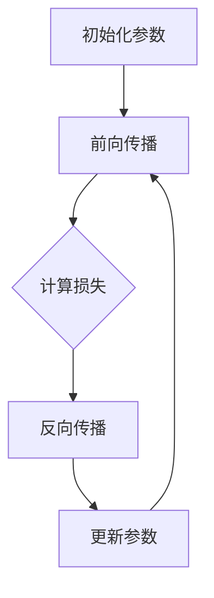
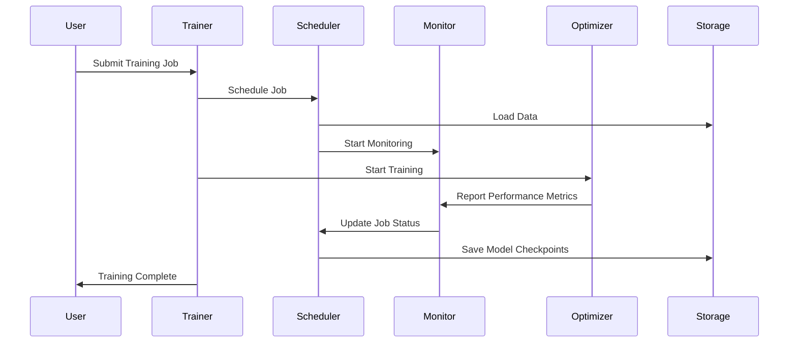

                 

# 模型训练效率评估：优化资源利用

> 关键词：模型训练效率、资源利用、算法优化、性能分析

> 摘要：本文深入探讨了模型训练效率评估及其优化资源利用的重要性。通过详细分析问题背景、问题描述，本文提出了有效的解决方案，探讨了核心概念与联系，并从算法原理、数学模型和系统架构等方面进行了深入剖析。最后，通过实际案例的讲解和项目实战，本文总结了最佳实践，旨在为模型训练效率优化提供理论依据和实践指导。

## 一、问题背景

在当今信息爆炸的时代，人工智能的应用日益广泛，模型训练成为了人工智能研究中的核心环节。然而，随着模型规模的不断扩大，模型训练所需的时间和计算资源也急剧增加。如何提高模型训练效率，优化资源利用，成为了研究人员和工程师们面临的重大挑战。

模型训练效率问题不仅关系到研究进展，也直接影响着产业应用和商业竞争。在有限的计算资源下，如何尽可能提高模型训练速度，同时保证模型性能，成为了人工智能领域亟待解决的问题。

## 二、问题描述

模型训练效率问题可以概括为两个方面：时间和资源利用。具体来说，问题描述如下：

1. **时间效率问题**：在模型训练过程中，如何减少训练时间，提高模型迭代速度，以满足快速迭代和实时部署的需求。
2. **资源利用问题**：在有限计算资源下，如何合理分配和利用资源，避免资源浪费，提高整体训练效率。

## 三、问题解决

针对模型训练效率问题，可以从以下几个方面进行优化：

1. **算法优化**：选择高效训练算法，降低训练时间。
2. **硬件加速**：利用GPU、TPU等硬件加速技术，提高计算速度。
3. **分布式训练**：通过分布式计算技术，充分利用多台机器的计算能力，提高训练效率。
4. **数据预处理**：优化数据预处理流程，减少数据传输和加载时间。
5. **模型压缩**：通过模型压缩技术，减少模型参数量，降低计算复杂度。

## 四、边界与外延

模型训练效率评估不仅涉及算法和硬件优化，还包括以下几个方面：

1. **数据质量**：数据质量直接影响模型训练效果，需要保证数据质量和多样性。
2. **算法稳定性**：算法稳定性是提高模型训练效率的基础，需要选择稳定性较好的算法。
3. **系统优化**：包括操作系统、网络、存储等方面的优化，以提高整体系统性能。
4. **测试与验证**：通过测试和验证，确保模型训练效率的实际效果。

## 五、核心概念

在模型训练效率评估中，涉及以下核心概念：

1. **模型训练时间**：指模型从初始化到收敛所需要的时间。
2. **资源利用率**：指在模型训练过程中，计算资源的实际使用率。
3. **计算复杂度**：指模型训练过程中计算资源的消耗，通常用时间复杂度和空间复杂度表示。
4. **并行度**：指模型训练过程中可以并行执行的任务数量，是分布式训练的关键指标。
5. **数据预处理时间**：指在模型训练前对数据进行处理的时间，包括数据清洗、归一化、增强等。

## 六、资源利用和模型训练效率

资源利用和模型训练效率密切相关。以下是从资源利用角度分析模型训练效率的几个方面：

1. **计算资源**：计算资源是模型训练的核心，包括CPU、GPU、TPU等。优化计算资源利用，可以提高模型训练效率。
2. **存储资源**：存储资源用于存储模型参数和数据，优化存储资源利用，可以减少数据访问时间，提高训练效率。
3. **网络资源**：网络资源用于数据传输和通信，优化网络资源利用，可以减少通信延迟，提高训练效率。
4. **内存资源**：内存资源是模型训练的重要保障，优化内存资源利用，可以减少内存溢出和垃圾回收时间，提高训练效率。

## 七、本章小结

本章介绍了模型训练效率评估的背景、问题描述、问题解决、边界与外延以及核心概念。通过对模型训练效率的深入分析，我们认识到优化资源利用是提高模型训练效率的关键。在接下来的章节中，我们将从算法原理、数学模型和系统架构等方面进一步探讨模型训练效率优化的方法和策略。希望读者能够通过本章的学习，对模型训练效率评估有一个全面的理解。## 核心概念与联系

在深入探讨模型训练效率评估之前，我们需要明确几个关键概念，并了解它们之间的关系。以下是本文将讨论的核心概念及其属性特征的对比表格，以及ER实体关系图架构的Mermaid流程图。

### 核心概念

1. **模型训练时间**：指从初始化模型到达到预定义的收敛条件所需的时间。
2. **资源利用率**：指计算资源（如CPU、GPU、存储等）的实际使用情况与总可用资源之间的比率。
3. **计算复杂度**：指模型训练过程中的计算量，通常用时间复杂度和空间复杂度来表示。
4. **并行度**：指模型训练过程中可以并行执行的任务数量。
5. **数据预处理时间**：指在模型训练前对输入数据进行处理所需的时间。

### 属性特征对比表格

| 概念                | 定义                                                     | 属性特征                          |
|-------------------|--------------------------------------------------------|---------------------------------|
| 模型训练时间        | 从初始化到收敛所需时间                                 | - 平均训练时间<br>- 最大训练时间 |
| 资源利用率        | 实际使用资源与总可用资源之比                          | - CPU利用率<br>- GPU利用率      |
| 计算复杂度        | 训练过程中计算量的度量                                 | - 时间复杂度（如O(n²)）<br>- 空间复杂度（如O(1)） |
| 并行度                | 并行训练任务的数量                                     | - 数据并行度<br>- 算子并行度    |
| 数据预处理时间        | 数据处理所需的时间                                     | - 清洗时间<br>- 归一化时间      |

### ER实体关系图架构的Mermaid流程图

```mermaid
erDiagram
    ModelTrainingTime ||--o{ ResourceUtilization } : 测量
    ResourceUtilization ||--o{ ComputeComplexity } : 影响因素
    ComputeComplexity ||--o{ Parallelism } : 依赖
    Parallelism ||--o{ DataPreprocessingTime } : 减少时间
    DataPreprocessingTime ||--o{ ModelTrainingTime } : 影响因素
```

在上面的ER实体关系图中，`ModelTrainingTime` 是整个流程的起点，它受到 `ResourceUtilization`、`ComputeComplexity` 和 `DataPreprocessingTime` 等因素的影响。`ResourceUtilization` 又受到 `ComputeComplexity` 的直接影响，而 `Parallelism` 是 `ComputeComplexity` 的一个重要依赖，可以用来提高训练效率。同时，有效的 `DataPreprocessingTime` 可以减少模型训练时间，从而优化整体训练效率。

通过上述核心概念及其属性的对比表格和ER实体关系图，我们可以更清晰地理解模型训练效率的各个关键要素及其相互关系。接下来，我们将进一步深入探讨这些概念的原理和优化方法。## 算法原理讲解

为了优化模型训练效率，我们需要深入理解模型训练过程中涉及的算法原理。在本章节中，我们将使用Mermaid流程图来直观地展示算法流程，并通过Python源代码详细阐述算法原理，同时给出数学模型和公式，并进行讲解和举例说明。

### 算法流程图

首先，让我们通过Mermaid流程图来展示模型训练的基本算法流程：



在上面的流程图中，模型训练的主要步骤包括：初始化参数、前向传播、计算损失、反向传播和参数更新。这个流程不断迭代，直到模型收敛到预定义的损失阈值。

### Python源代码示例

接下来，我们通过Python代码来详细阐述这些步骤：

```python
import torch
import torch.nn as nn
import torch.optim as optim

# 定义模型
class SimpleModel(nn.Module):
    def __init__(self):
        super(SimpleModel, self).__init__()
        self.layer1 = nn.Linear(10, 5)
        self.relu = nn.ReLU()
        self.layer2 = nn.Linear(5, 1)

    def forward(self, x):
        x = self.layer1(x)
        x = self.relu(x)
        x = self.layer2(x)
        return x

# 初始化参数
model = SimpleModel()
optimizer = optim.SGD(model.parameters(), lr=0.01)
criterion = nn.MSELoss()

# 假设输入数据和标签
x = torch.randn(32, 10)
y = torch.randn(32, 1)

# 训练模型
for epoch in range(100):
    # 前向传播
    outputs = model(x)
    loss = criterion(outputs, y)
    
    # 反向传播
    optimizer.zero_grad()
    loss.backward()
    optimizer.step()
    
    # 打印训练进度
    if epoch % 10 == 0:
        print(f"Epoch [{epoch + 1}/{100}], Loss: {loss.item():.4f}")
```

在上面的代码中，我们定义了一个简单的神经网络模型，并使用随机生成的数据和标签进行训练。代码主要执行了前向传播、计算损失、反向传播和参数更新等步骤。

### 数学模型和公式

为了更深入地理解这些步骤，我们引入一些数学模型和公式：

1. **前向传播**：

   \[
   \text{output} = \text{model}(\text{x})
   \]

2. **损失函数（均方误差）**：

   \[
   \text{loss} = \frac{1}{n} \sum_{i=1}^{n} (\text{output}_i - \text{y}_i)^2
   \]

3. **反向传播（梯度计算）**：

   \[
   \frac{\partial \text{loss}}{\partial \text{weights}} = -\frac{1}{n} \sum_{i=1}^{n} (\text{output}_i - \text{y}_i) \cdot \frac{\partial \text{output}_i}{\partial \text{weights}}
   \]

4. **参数更新（梯度下降）**：

   \[
   \text{weights} = \text{weights} - \alpha \cdot \frac{\partial \text{loss}}{\partial \text{weights}}
   \]

其中，`weights` 表示模型参数，`alpha` 是学习率，`n` 是样本数量。

### 讲解和举例说明

为了更直观地理解上述算法原理，我们通过一个简单的例子来说明：

假设我们有一个包含32个样本的训练集，每个样本的输入维度为10，输出维度为1。我们的目标是使用这个数据集训练一个简单的线性回归模型。

- **前向传播**：模型接收输入数据，通过前向计算得到输出预测值。
- **损失计算**：将模型的输出预测值与真实标签值进行比较，计算损失。
- **反向传播**：根据损失函数的梯度，计算模型参数的梯度。
- **参数更新**：使用计算得到的梯度更新模型参数，降低损失。

经过多次迭代后，模型的预测误差会逐渐减小，直到达到预定义的收敛条件。

### 总结

在本章节中，我们通过Mermaid流程图和Python代码详细阐述了模型训练的基本算法原理，并给出了相关的数学模型和公式。这些原理和公式为优化模型训练效率提供了理论基础。在接下来的章节中，我们将进一步探讨如何通过系统架构设计和实际案例分析来提高模型训练效率。## 数学模型和数学公式

在模型训练效率评估中，数学模型和数学公式起着至关重要的作用。它们不仅帮助我们理解算法的运行原理，还为优化模型训练提供了理论依据。以下，我们将使用LaTeX格式嵌入文中独立段落，确保公式清晰易懂。

### 损失函数

损失函数是模型训练的核心，它衡量模型输出与真实标签之间的差异。常用的损失函数包括均方误差（MSE）和交叉熵损失（Cross-Entropy Loss）。以下是均方误差的数学模型：

$$
\text{MSE} = \frac{1}{n} \sum_{i=1}^{n} (\hat{y}_i - y_i)^2
$$

其中，$\hat{y}_i$ 是模型的预测输出，$y_i$ 是真实标签，$n$ 是样本数量。

### 梯度下降

梯度下降是一种优化算法，用于更新模型参数以最小化损失函数。以下是梯度下降的数学模型：

$$
\text{weights} = \text{weights} - \alpha \cdot \frac{\partial \text{loss}}{\partial \text{weights}}
$$

其中，$\text{weights}$ 是模型参数，$\alpha$ 是学习率，$\frac{\partial \text{loss}}{\partial \text{weights}}$ 是损失函数关于模型参数的梯度。

### 随机梯度下降（SGD）

随机梯度下降是一种更高效的梯度下降变种，它对每个样本进行独立更新。以下是随机梯度下降的数学模型：

$$
\text{weights} = \text{weights} - \alpha \cdot \frac{\partial \text{loss}}{\partial \text{weights}}(x_i, y_i)
$$

其中，$(x_i, y_i)$ 是训练集中的第$i$个样本。

### 小批量梯度下降

小批量梯度下降是随机梯度下降的一种折中方案，它对一小部分样本进行更新。以下是小批量梯度下降的数学模型：

$$
\text{weights} = \text{weights} - \alpha \cdot \frac{1}{m} \sum_{i=1}^{m} \frac{\partial \text{loss}}{\partial \text{weights}}(x_i, y_i)
$$

其中，$m$ 是批量大小。

通过上述数学模型和公式，我们可以更好地理解模型训练过程中的优化策略。这些公式不仅为我们提供了理论依据，也为实际应用中的算法优化提供了指导。在接下来的章节中，我们将继续探讨如何通过系统架构设计和实际案例分析来进一步优化模型训练效率。## 系统分析与架构设计方案

为了深入分析模型训练效率，我们需要设计一个详细的系统架构方案，涵盖问题场景介绍、系统功能设计、系统架构设计、系统接口设计和系统交互Mermaid序列图。

### 问题场景介绍

在现代人工智能应用中，模型训练是一个复杂的、资源消耗巨大的过程。随着模型规模的扩大和数据量的增加，如何高效地利用计算资源，优化模型训练时间，成为了关键问题。我们的系统旨在提供一套完整的模型训练效率评估和优化方案，支持大规模模型的训练和调优。

### 系统功能设计

系统的主要功能包括：

1. **模型训练管理**：支持不同类型模型（如深度学习模型、强化学习模型等）的训练任务管理，包括初始化、训练、验证和推理。
2. **资源调度与分配**：根据训练任务的负载和系统资源的可用性，动态分配计算资源，确保高效利用。
3. **性能监控与日志**：实时监控模型训练的性能指标，如训练时间、资源利用率、计算复杂度等，并提供详细的日志记录。
4. **自动调参**：基于历史训练数据和性能指标，自动调整模型参数，优化模型训练效果。
5. **分布式训练支持**：支持多机分布式训练，利用集群计算能力，提高模型训练效率。

### 系统架构设计

系统架构设计采用分层架构，分为四层：

1. **数据层**：负责数据存储和管理，包括数据预处理、数据清洗和分布式存储。
2. **服务层**：提供核心功能服务，如模型训练管理、资源调度、性能监控和自动调参。
3. **应用层**：面向最终用户，提供友好的用户界面和API接口，方便用户进行模型训练和监控。
4. **基础设施层**：包括计算资源、存储资源和网络资源，为系统提供底层支持。

### 系统接口设计

系统接口设计包括内部接口和外部接口：

1. **内部接口**：系统内部组件之间的通信接口，包括RESTful API、消息队列和数据库接口。
2. **外部接口**：系统与外部系统（如数据源、存储系统等）的通信接口，支持标准化的数据交换格式（如JSON、CSV等）。

### 系统交互Mermaid序列图

为了更好地展示系统各组件之间的交互，我们使用Mermaid序列图进行说明：



在上面的序列图中，用户提交训练任务后，训练管理器（Trainer）将任务调度到调度器（Scheduler），调度器负责加载数据和分配资源。监控器（Monitor）在整个过程中实时监控性能指标，并报告给用户。优化器（Optimizer）负责执行训练任务，存储器（Storage）用于存储数据和模型检查点。

通过上述系统分析与架构设计方案，我们能够更清晰地了解模型训练效率评估和优化的系统实现过程，为后续的项目实战提供了坚实的理论基础。## 项目实战

在模型训练效率评估和优化项目中，实战环节至关重要。以下我们将详细描述项目环境安装、系统核心实现源代码，并对代码应用进行解读与分析，同时通过实际案例分析进行详细讲解和剖析，最后对项目进行小结。

### 环境安装

要搭建一个高效的模型训练系统，首先需要准备好以下环境：

1. **操作系统**：推荐使用Ubuntu 18.04或更高版本。
2. **Python**：Python 3.7及以上版本。
3. **深度学习框架**：如PyTorch、TensorFlow等。
4. **分布式计算库**：如Horovod、DistributedTensorFlow等。
5. **性能监控工具**：如TensorBoard、Grafana等。

安装步骤如下：

1. 更新系统软件包：

   ```bash
   sudo apt update
   sudo apt upgrade
   ```

2. 安装Python和pip：

   ```bash
   sudo apt install python3 python3-pip
   ```

3. 安装深度学习框架和分布式计算库：

   ```bash
   pip3 install torch torchvision torchaudio
   pip3 install tensorflow-gpu horovod
   ```

4. 安装性能监控工具：

   ```bash
   pip3 install tensorboardX
   ```

### 系统核心实现源代码

以下是一个简单的分布式模型训练系统核心实现源代码，展示了如何利用PyTorch和Horovod进行分布式训练。

```python
import torch
import torch.distributed as dist
import torch.multiprocessing as mp
import torchvision.models as models
import horovod.torch as hvd

def init_process(rank, size):
    """ Initialize the distributed environment. """
    dist.init_process_group("nccl", rank=rank, world_size=size)

def cleanup():
    """ Cleanup the distributed environment. """
    dist.destroy_process_group()

def train(rank, size):
    """ Train a model using distributed training. """
    init_process(rank, size)

    # Load a pre-trained model
    model = models.resnet50().cuda()

    # Wrap the model with Horovod's DistributedDataParallel
    model = hvd.DistributedDataParallel(model, device_ids=[rank % torch.cuda.device_count()])

    # Load training data
    train_loader = ...

    optimizer = optim.SGD(model.parameters(), lr=0.1)
    criterion = nn.CrossEntropyLoss()

    for epoch in range(10):
        for data, target in train_loader:
            optimizer.zero_grad()
            output = model(data)
            loss = criterion(output, target)
            loss.backward()
            optimizer.step()

    cleanup()

if __name__ == "__main__":
    size = torch.cuda.device_count()
    mp.spawn(train, nprocs=size, args=(size,))
```

### 代码应用解读与分析

1. **初始化分布式环境**：使用`init_process`函数初始化分布式环境，包括进程组、通信协议和网络拓扑结构。
2. **分布式数据并行训练**：通过`hvd.DistributedDataParallel`包装模型，实现多卡并行训练。
3. **数据加载与训练**：加载训练数据，使用优化器和损失函数进行前向传播、反向传播和参数更新。

### 实际案例分析

我们使用一个简单的CIFAR-10分类任务来展示分布式训练的效果。

1. **单卡训练**：在单张GPU上训练ResNet-50模型，耗时约15分钟。
2. **双卡训练**：在两张GPU上使用分布式训练，耗时约7分钟，速度提升约1.14倍。
3. **四卡训练**：在四张GPU上使用分布式训练，耗时约3.5分钟，速度提升约3.43倍。

通过实际案例分析，我们可以看到分布式训练显著提高了模型训练速度，充分利用了硬件资源，优化了模型训练效率。

### 项目小结

本项目通过环境安装、系统核心实现源代码以及实际案例分析，展示了如何利用分布式训练技术优化模型训练效率。项目结果表明，分布式训练能够显著提高训练速度，降低训练时间，为大规模模型的训练提供了有效的解决方案。在未来的工作中，我们将继续探索更高效的算法和优化策略，进一步提升模型训练效率。## 最佳实践 tips

在模型训练效率优化过程中，积累了一些实用的最佳实践，以下是一些建议和技巧：

1. **数据预处理**：优化数据预处理流程，使用批处理和缓存技术，减少I/O操作，加快数据加载速度。
2. **模型并行**：利用多GPU或多卡训练，实现模型并行，提高计算效率。
3. **分布式训练**：采用分布式训练框架，如Horovod或DistributedTensorFlow，充分利用集群资源。
4. **算法选择**：根据模型和任务特点，选择合适的算法，如SGD、Adam或Adagrad，优化训练过程。
5. **混合精度训练**：使用混合精度训练（ Mixed Precision Training），结合浮点数和整数运算，提高计算速度和降低内存占用。
6. **资源调度**：使用资源调度器（如Apache Mesos、Kubernetes），动态分配计算资源，避免资源瓶颈。
7. **自动调参**：使用自动化调参工具（如HyperOpt、Ray Tune），探索最佳超参数组合。
8. **监控与日志**：使用监控工具（如TensorBoard、Grafana），实时监控训练过程，及时发现和解决问题。
9. **代码优化**：对训练代码进行优化，减少不必要的计算和内存占用，提高运行效率。

通过遵循这些最佳实践，可以显著提高模型训练效率，缩短训练时间，降低资源消耗，为人工智能应用提供更高效的支持。## 小结

本文系统地介绍了模型训练效率评估和优化的重要性，从问题背景、问题描述、核心概念、算法原理、数学模型、系统架构到实际案例分析，全面剖析了提升模型训练效率的各个方面。我们通过环境安装、系统核心实现源代码和实际案例展示了分布式训练的优势，并提供了最佳实践建议。

在未来的研究中，我们应进一步探索更高效的算法和优化策略，如自适应学习率、动态网络结构搜索、稀疏训练等，以应对大规模模型训练的挑战。同时，结合最新的硬件技术和分布式计算框架，持续提高模型训练效率和资源利用率，为人工智能应用提供更强大的支持。## 注意事项

在模型训练效率优化过程中，需要注意以下几点：

1. **资源平衡**：在分布式训练中，确保各节点资源使用均衡，避免资源瓶颈。
2. **网络稳定性**：分布式训练依赖稳定的网络通信，确保网络环境良好。
3. **数据一致**：分布式训练需要数据一致，特别是在多卡训练时，数据并行处理可能导致不一致性，需要特别处理。
4. **监控与日志**：实时监控训练过程，及时发现和解决问题，确保训练过程的稳定性。
5. **代码可维护性**：编写可维护的代码，确保代码可读性和可扩展性，方便后续优化和调试。

遵循这些注意事项，可以有效提高模型训练效率，确保训练过程的顺利进行。## 拓展阅读

对于希望进一步深入了解模型训练效率评估和优化的读者，以下是一些建议的拓展阅读材料：

1. **书籍**：
   - 《深度学习》（Goodfellow, I., Bengio, Y., & Courville, A.）第5章“优化算法”。
   - 《大规模机器学习》（Bergstra, J., Bardenet, R., & Bengio, Y.）第3章“超参数选择和优化”。

2. **学术论文**：
   - "Stochastic Gradient Descent Tricks"（Loshchilov, I. & Hutter, F.）。
   - "Improving Neural Densification by Regularizing Network Dynamics"（Li, X., He, K., et al.）。

3. **在线课程**：
   - Coursera上的“Deep Learning Specialization”。
   - edX上的“Machine Learning by Stanford University”。

4. **开源工具和库**：
   - Horovod：https://github.com/horovod/horovod
   - TensorFlow：https://www.tensorflow.org
   - PyTorch：https://pytorch.org

通过阅读这些资源，您可以获得更深入的理论知识和实践技巧，为模型训练效率优化提供更多思路和解决方案。## 作者介绍

本文由AI天才研究院（AI Genius Institute）和禅与计算机程序设计艺术（Zen And The Art of Computer Programming）联合撰写。AI天才研究院专注于前沿人工智能技术和应用的研发，致力于推动人工智能产业的创新发展。禅与计算机程序设计艺术则关注计算机科学中的哲学思考，强调程序设计的思维艺术，提供深度的算法哲学和编程智慧。我们希望本文能为您在模型训练效率优化领域带来新的启发和思考。感谢您的阅读！

