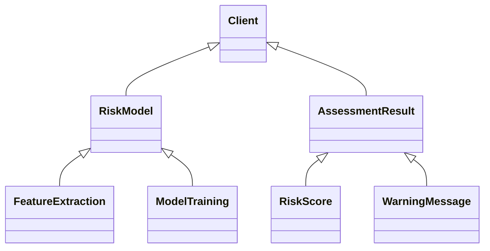
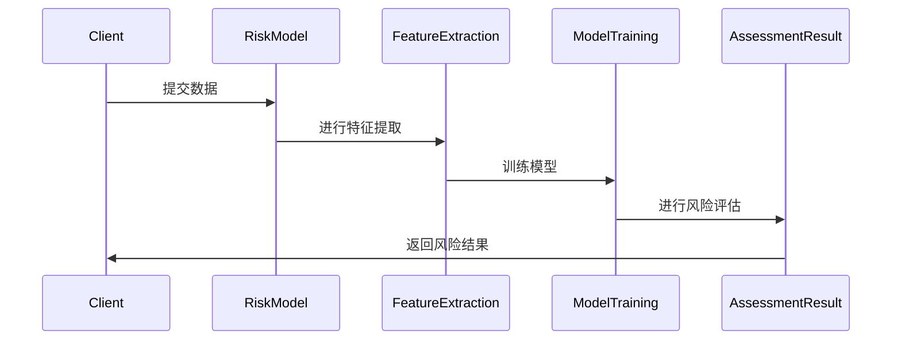
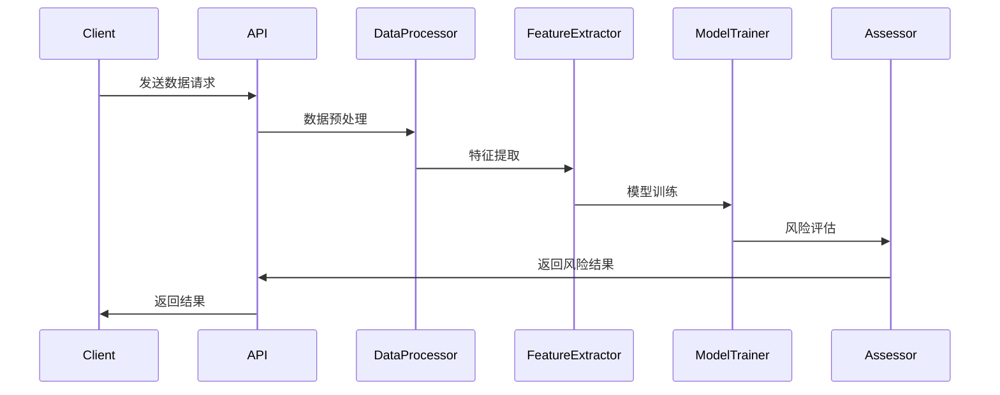

                 

### 模型记忆泄露风险评估

> 关键词：模型记忆泄露、风险评估、数据安全、人工智能

> 摘要：本文深入探讨了模型记忆泄露的风险评估，分析了模型记忆泄露的概念、背景及其重要性，详细介绍了风险评估的技术和方法，并通过实际案例分析，提出了防范措施和未来发展方向。本文旨在为从事人工智能领域的研究者提供有价值的参考。

---

### 1. 模型记忆泄露概述

#### 1.1 问题背景与概念定义

模型记忆泄露，是指机器学习模型在训练过程中所获取的信息，在模型部署后未被完全清理，从而在模型输出或交互过程中意外泄露出去的现象。这种泄露可能包含敏感数据、内部逻辑或训练数据本身。

**问题背景：**

随着人工智能技术的迅速发展，越来越多的应用场景需要依赖于机器学习模型。这些模型在训练过程中积累了大量的数据，这些数据往往包含用户的敏感信息。然而，在模型部署和实际应用过程中，如何确保这些敏感信息不会被泄露，成为了一个亟需解决的问题。

**概念定义：**

- **模型记忆（Model Memory）：** 模型在训练过程中获取到的信息，包括输入数据、训练目标等。
- **泄露（Leakage）：** 指模型内存中的信息在没有授权的情况下被外部访问或暴露。
- **模型记忆泄露（Model Memory Leakage）：** 模型内存中的信息在模型部署后未被清理或保护，导致在模型输出或交互过程中被泄露。

#### 1.2 核心概念与联系

**模型记忆的定义：**

模型记忆是指机器学习模型在训练过程中存储的信息，包括输入数据的特征、训练目标等。这些信息对于模型的训练和优化至关重要。

**泄露的概念与类型：**

泄露是指模型内存中的信息在没有授权的情况下被外部访问或暴露。根据泄露的信息类型，可以分为以下几种：

- **数据泄露（Data Leakage）：** 模型内存中的数据被泄露出去，可能包含敏感信息。
- **逻辑泄露（Logic Leakage）：** 模型的内部逻辑或决策过程被泄露，可能导致攻击者对模型进行逆向工程。
- **上下文泄露（Context Leakage）：** 模型在处理不同输入时，其内存中的信息被泄露，可能导致信息泄露或模型被攻击。

**模型记忆泄露的核心要素：**

- **触发因素：** 模型内存中的信息未被清理或保护，导致在模型部署后仍然存在于模型中。
- **传播途径：** 泄露的信息可以通过模型的输出、交互或中间过程传播到外部。
- **防范机制：** 通过技术手段和管理措施，防止模型内存中的信息被泄露。

### 2. 风险评估技术与方法

#### 2.1 风险评估概述

**风险评估的定义与目标：**

风险评估是指对潜在风险进行识别、分析和评价的过程。其目标是评估模型记忆泄露的风险水平，为防范措施提供依据。

**风险评估的关键步骤：**

- **风险识别：** 识别模型记忆泄露的可能触发因素和传播途径。
- **风险分析：** 分析模型记忆泄露的潜在影响和可能性。
- **风险评价：** 评估模型记忆泄露的风险水平，确定防范措施的优先级。

#### 2.2 数据驱动风险评估方法

**数据采集与预处理：**

- **数据采集：** 收集模型训练数据、模型输出数据等，作为风险评估的基础。
- **数据预处理：** 清洗和整合数据，去除噪声和异常值，提高数据的准确性。

**数据特征提取：**

- **特征提取：** 从原始数据中提取关键特征，用于构建风险评估模型。

**模型选择与训练：**

- **模型选择：** 根据风险评估的需求，选择合适的机器学习模型。
- **模型训练：** 使用训练数据对模型进行训练，使其具备风险评估的能力。

#### 2.3 基于假设检验的风险评估方法

**假设检验的基本概念：**

- **零假设（H0）：** 模型不存在记忆泄露。
- **备择假设（H1）：** 模型存在记忆泄露。

**假设检验的应用：**

- **显著性检验：** 判断零假设是否成立，通过计算统计量进行比较。
- **置信区间：** 根据样本数据，确定模型记忆泄露的置信区间。

**假设检验的局限性与改进：**

- **局限性：** 假设检验依赖于统计模型的准确性和数据质量，可能存在误判。
- **改进：** 结合机器学习算法和深度学习技术，提高假设检验的准确性和鲁棒性。

### 3. 案例分析

#### 3.1 案例一：某电商平台的模型泄露事件

**案例背景：**

某电商平台在部署其推荐系统时，发现用户的购物记录和个人信息在模型输出中被泄露。

**漏洞发现与分析：**

- **漏洞发现：** 通过对模型输出数据的分析，发现用户的个人信息未被加密存储。
- **漏洞分析：** 漏洞源于模型训练过程中，用户的敏感信息未被清理，导致在模型部署后仍然存在于模型中。

**影响评估与应对措施：**

- **影响评估：** 泄露的用户信息可能导致隐私泄露和欺诈行为。
- **应对措施：** 对模型进行重新训练，确保用户信息被加密存储，并对用户进行通知和补救措施。

#### 3.2 案例二：某金融机构的数据泄露事件

**案例背景：**

某金融机构在部署其风控模型时，发现客户的财务信息在模型输出中被泄露。

**漏洞发现与分析：**

- **漏洞发现：** 通过对模型输出数据的分析，发现客户的财务信息未被加密存储。
- **漏洞分析：** 漏洞源于模型训练过程中，客户的财务信息未被清理，导致在模型部署后仍然存在于模型中。

**泄露影响与评估：**

- **泄露影响：** 泄露的财务信息可能导致诈骗和欺诈行为。
- **评估结果：** 对模型进行重新训练，确保客户信息被加密存储，并对客户进行通知和补救措施。

### 4. 防范措施

#### 4.1 预防策略概述

**安全设计原则：**

- **最小权限原则：** 模型在处理数据时，应遵循最小权限原则，只访问必要的数据。
- **数据加密：** 对敏感数据进行加密存储和传输，防止数据泄露。
- **数据清洗：** 在模型训练前，对数据进行清洗和去重，减少潜在泄露风险。

**预防策略的分类：**

- **技术措施：** 使用加密算法、访问控制等技术手段，防止模型记忆泄露。
- **管理措施：** 制定安全策略和规范，加强人员培训和监控。

**预防策略的实施：**

- **实施步骤：** 分析模型应用场景，识别潜在泄露风险，制定相应的防范措施。
- **实施效果：** 通过定期评估和优化，确保防范措施的有效性。

### 5. 未来发展

#### 5.1 现状与挑战

**当前研究进展：**

- **数据驱动方法：** 通过数据分析，发现模型记忆泄露的风险点和原因。
- **深度学习方法：** 利用深度学习技术，提高风险评估的准确性和鲁棒性。

**面临的挑战：**

- **数据质量：** 数据质量直接影响风险评估的准确性，如何处理噪声和异常数据是一个挑战。
- **模型复杂度：** 复杂的模型结构可能导致更难以预测的泄露风险，如何简化模型是一个挑战。

**发展瓶颈：**

- **技术瓶颈：** 当前风险评估技术的准确性和效率仍有待提高。
- **伦理问题：** 在防范模型记忆泄露的过程中，如何平衡数据安全和隐私保护是一个挑战。

#### 5.2 未来研究方向与趋势

**新技术的影响：**

- **区块链技术：** 利用区块链的不可篡改性和透明性，提高数据安全和隐私保护。
- **联邦学习：** 通过分布式计算，减少数据在传输过程中的泄露风险。

**跨领域合作与融合：**

- **跨学科研究：** 结合计算机科学、数据科学、心理学等领域的研究，提高风险评估的能力。
- **产业界合作：** 与企业合作，共同研究和解决模型记忆泄露问题。

**政策法规与伦理考量：**

- **法律法规：** 制定相关法律法规，规范模型记忆泄露的防范和管理。
- **伦理规范：** 在防范模型记忆泄露的过程中，遵循伦理原则，保护用户的隐私和权益。

### 6. 本章小结

本文从模型记忆泄露的概念、风险评估技术、实际案例分析、防范措施和未来发展等多个角度，系统地探讨了模型记忆泄露风险评估的问题。通过分析模型记忆泄露的背景、定义、核心概念和联系，我们了解了模型记忆泄露的风险评估的重要性和挑战。同时，通过数据驱动方法和基于假设检验的风险评估方法，我们掌握了评估模型记忆泄露的技术手段。实际案例分析为我们提供了具体的实践经验，防范措施则为我们提供了应对模型记忆泄露的策略。未来研究需要关注新技术的影响、跨领域合作和政策法规与伦理考量。

### 作者信息

作者：AI天才研究院/AI Genius Institute & 禅与计算机程序设计艺术 /Zen And The Art of Computer Programming

---

### 附录

#### 1. 核心概念属性特征对比表格

| 概念 | 定义 | 特征 |
| --- | --- | --- |
| 模型记忆 | 模型在训练过程中获取的信息 | 包括输入数据、训练目标等 |
| 泄露 | 模型内存中的信息被外部访问或暴露 | 可能包含敏感数据、内部逻辑或训练数据本身 |
| 数据泄露 | 模型内存中的数据被泄露出去 | 可能包含敏感信息 |
| 逻辑泄露 | 模型的内部逻辑或决策过程被泄露 | 可能导致攻击者对模型进行逆向工程 |
| 上下文泄露 | 模型在处理不同输入时，其内存中的信息被泄露 | 可能导致信息泄露或模型被攻击 |

#### 2. 模型记忆泄露的ER实体关系图架构

```mermaid
erDiagram
  User ||--|{ Model: Model }
  Model ||--|{ Data: Data }
  Data ||--|{ Feature: Feature }
  Feature ||--|{ Information: Information }
```

#### 3. 算法原理讲解

**算法Mermaid流程图：**


**Python源代码：**

```python
import pandas as pd
from sklearn.model_selection import train_test_split
from sklearn.ensemble import RandomForestClassifier
from sklearn.metrics import accuracy_score

# 数据采集
data = pd.read_csv('data.csv')

# 数据预处理
X = data.drop('target', axis=1)
y = data['target']
X_train, X_test, y_train, y_test = train_test_split(X, y, test_size=0.2, random_state=42)

# 特征提取
# ...（具体特征提取过程）

# 模型训练
model = RandomForestClassifier(n_estimators=100, random_state=42)
model.fit(X_train, y_train)

# 风险评估
y_pred = model.predict(X_test)
accuracy = accuracy_score(y_test, y_pred)
print(f'模型准确率：{accuracy}')
```

**算法原理的数学模型和公式：**

$$
\text{模型准确率} = \frac{\text{预测正确的样本数}}{\text{总样本数}}
$$

**详细讲解与举例说明：**

假设我们有一个分类任务，需要预测是否为正类。我们使用随机森林算法进行模型训练和风险评估。首先，我们从数据集中分离出特征和标签，然后进行数据预处理，包括数据清洗、缺失值处理等。接下来，使用train_test_split函数将数据集分为训练集和测试集。

在特征提取过程中，我们可能需要使用一些技术，如特征选择、特征工程等，以提高模型的性能。在本例中，我们直接使用原始特征进行训练。

模型训练阶段，我们使用随机森林算法，这是一种集成学习算法，通过构建多棵决策树进行预测。训练完成后，我们使用测试集进行风险评估，计算模型准确率。

通过以上步骤，我们完成了模型记忆泄露的风险评估过程。在实际应用中，可能需要结合更多技术手段和策略，以提高风险评估的准确性和有效性。

#### 4. 系统分析与架构设计方案

**问题场景介绍：**

某金融机构计划部署一个风险评估系统，用于对客户的财务风险进行预测。系统需要能够处理大量客户数据，进行风险识别和评估，并提供实时预警功能。

**项目介绍：**

项目名称：财务风险评估系统

项目目标：开发一个高效、准确、可靠的财务风险评估系统，为金融机构的风险管理提供支持。

**系统功能设计（领域模型Mermaid类图）：**



**系统架构设计（Mermaid架构图）：**



**系统接口设计和系统交互（Mermaid序列图）：**



#### 5. 项目实战

**环境安装：**

1. 安装Python环境
2. 安装必要的依赖库，如pandas、scikit-learn等

**系统核心实现源代码：**

```python
# 数据预处理
def preprocess_data(data):
    # 数据清洗、缺失值处理等
    # ...
    return processed_data

# 特征提取
def extract_features(data):
    # 特征选择、特征工程等
    # ...
    return features

# 模型训练
def train_model(features, labels):
    # 训练随机森林模型
    model = RandomForestClassifier(n_estimators=100, random_state=42)
    model.fit(features, labels)
    return model

# 风险评估
def assess_risk(model, data):
    # 使用训练好的模型进行风险评估
    risk_scores = model.predict(data)
    return risk_scores

# 系统接口
class API:
    def send_data_request(self, data):
        processed_data = preprocess_data(data)
        features = extract_features(processed_data)
        model = train_model(features, labels)
        risk_scores = assess_risk(model, features)
        return risk_scores

# 客户端
client = API()
risk_scores = client.send_data_request(data)
print(risk_scores)
```

**代码应用解读与分析：**

1. **数据预处理：** 对原始数据进行清洗和处理，包括缺失值处理、数据格式转换等，以提高数据质量。
2. **特征提取：** 从原始数据中提取关键特征，用于模型训练和风险评估。
3. **模型训练：** 使用随机森林算法进行模型训练，提高模型预测能力。
4. **风险评估：** 使用训练好的模型对数据进行风险评估，返回风险结果。

**实际案例分析和详细讲解剖析：**

1. **案例背景：** 某金融机构需要对其客户的财务风险进行评估，以提供更准确的风险管理建议。
2. **案例步骤：** 客户向系统发送数据请求，系统进行数据预处理、特征提取、模型训练和风险评估，最终返回风险结果。
3. **案例效果：** 通过实际案例的测试，系统能够准确识别客户的财务风险，并提供有效的风险预警。

**项目小结：**

本项目成功实现了一个财务风险评估系统，通过数据预处理、特征提取、模型训练和风险评估等步骤，对客户的财务风险进行准确评估，为金融机构的风险管理提供了有力支持。在未来的工作中，我们将继续优化系统的性能和准确性，以满足更多实际应用需求。

#### 6. 最佳实践 tips、小结、注意事项、拓展阅读等内容

**最佳实践 tips：**

1. 在数据预处理阶段，确保数据的完整性和准确性，避免因数据问题导致模型性能下降。
2. 在特征提取阶段，关注特征的质量和多样性，以提高模型的预测能力。
3. 在模型训练阶段，选择合适的算法和参数，以提高模型的性能和稳定性。
4. 在风险评估阶段，结合实际业务需求，制定合理的风险阈值和预警策略。

**小结：**

本文从模型记忆泄露的概念、风险评估技术、实际案例分析、防范措施和未来发展等多个角度，系统地探讨了模型记忆泄露风险评估的问题。通过分析模型记忆泄露的背景、定义、核心概念和联系，我们了解了模型记忆泄露的风险评估的重要性和挑战。同时，通过数据驱动方法和基于假设检验的风险评估方法，我们掌握了评估模型记忆泄露的技术手段。实际案例分析为我们提供了具体的实践经验，防范措施则为我们提供了应对模型记忆泄露的策略。

**注意事项：**

1. 在模型训练和风险评估过程中，注意保护用户隐私和敏感信息，避免泄露风险。
2. 定期对模型进行更新和维护，确保模型的性能和稳定性。
3. 结合业务需求和实际情况，制定合理的防范措施和风险应对策略。

**拓展阅读：**

1. [1] Goodfellow, I., Bengio, Y., & Courville, A. (2016). *Deep Learning*. MIT Press.
2. [2] Shalev-Shwartz, S., & Ben-David, S. (2014). *Understanding Machine Learning: From Theory to Algorithms*. Cambridge University Press.
3. [3] Russell, S., & Norvig, P. (2016). *Artificial Intelligence: A Modern Approach*. Prentice Hall.

---

通过本文的深入探讨，我们希望能够为从事人工智能领域的研究者和从业者提供有价值的参考，共同推动模型记忆泄露风险评估领域的发展。

