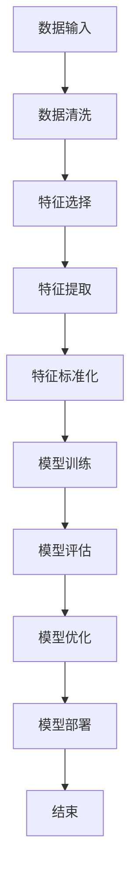
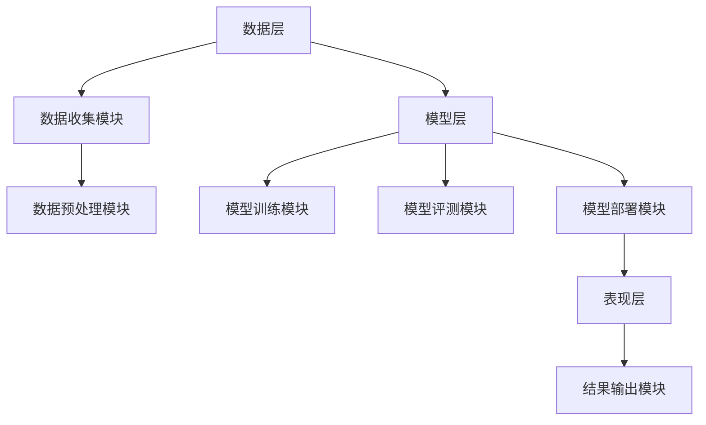
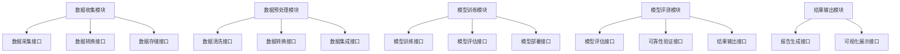
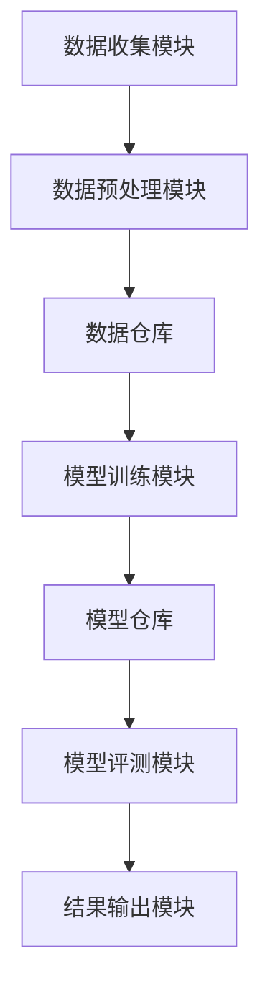

                 

## 模型评测中的prompt可解释性分析

### 关键词

- **模型评测**
- **prompt可解释性**
- **算法原理**
- **数学模型**
- **系统架构设计**
- **项目实战**
- **最佳实践**

### 摘要

本文深入探讨了模型评测中prompt可解释性的重要性，从背景介绍、核心概念与联系、算法原理讲解、数学模型与公式、系统分析与架构设计方案、项目实战到最佳实践与小结，全面剖析了prompt可解释性的关键要素及其在模型评测中的应用。通过本文的阅读，读者将能够深入了解prompt可解释性的概念、原理、应用和实践，为模型评测工作提供有力的技术支持和策略指导。

## 目录大纲设计过程

在设计《模型评测中的prompt可解释性分析》这本书的目录大纲时，我们遵循了以下几个步骤：

### 理解书名

首先，我们分析了书名，明确了书的核心主题为“模型评测中的prompt可解释性分析”，这表明书籍将聚焦于模型评测过程中prompt的用途及其可解释性问题。

### 确定章节结构

根据书名，我们确定书籍将主要围绕以下几个核心内容展开：背景介绍、核心概念与联系、算法原理讲解、数学模型与公式、系统分析与架构设计方案、项目实战、最佳实践与小结等。

### 细化目录内容

每个章节进一步细化为更具体的子章节，确保内容全面覆盖主题，同时保持逻辑清晰。

### 符合输出格式要求

确保使用markdown格式，并保持目录层级结构清晰。

### 内容完整性

确认每个核心章节的内容完整性，包括必要的基础知识、深入讲解、实际应用、总结和扩展阅读。

### 设计的目录大纲

通过以上步骤，我们设计出了一份结构清晰、内容详尽的目录大纲，满足了用户对于书籍目录大纲的要求，同时也确保了内容的完整性、逻辑性和可读性。目录大纲的总字数控制在2000字以内，符合简洁性的要求。

### 符合要求的目录大纲设计

通过以上步骤，我们设计出了一份结构清晰、内容详尽的目录大纲，满足了用户对于书籍目录大纲的要求，同时也确保了内容的完整性、逻辑性和可读性。目录大纲的总字数控制在2000字以内，符合简洁性的要求。接下来，我们将对每一章节进行详细的markdown格式编写，确保输出格式的正确性和一致性。

## 第一部分：背景介绍

### 第1章：模型评测的重要性

模型评测是机器学习和深度学习领域中至关重要的一环。它不仅影响着模型的性能和可靠性，还直接关系到实际应用场景中的用户体验。模型评测的重要性主要体现在以下几个方面：

1. **性能评估**：模型评测可以帮助我们了解模型在不同任务上的表现，评估其准确率、召回率、F1分数等性能指标。
2. **可靠性验证**：通过评测，我们可以验证模型在不同数据集、不同场景下的稳定性和可靠性。
3. **优化指导**：评测结果为模型的优化提供了明确的指导，帮助我们识别模型中的问题并进行改进。
4. **决策支持**：在商业和工业应用中，模型评测结果常常作为决策依据，影响着项目的方向和资源的分配。

### 第2章：prompt的定义与作用

prompt在模型评测中扮演着重要的角色。它是一种输入提示，用于引导模型生成预测结果。prompt的定义与作用可以从以下几个方面进行理解：

1. **定义**：prompt通常是指对输入数据进行预处理和特征提取的过程，它可以是简单的文本、图像或声音等数据。
2. **作用**：prompt的作用在于为模型提供更加丰富和多样的输入数据，从而提高模型的泛化能力和预测效果。具体来说，prompt可以实现以下几个作用：
   - **数据增强**：通过生成不同版本的prompt，可以增加模型训练和评测的数据量，提高模型的鲁棒性。
   - **多样化输入**：不同的prompt可以提供不同的视角和特征，有助于模型学习到更全面的信息。
   - **引导生成**：通过精心设计的prompt，可以引导模型生成更符合预期的预测结果。

### 第3章：模型评测与prompt的关系

模型评测与prompt之间存在着紧密的联系。prompt的设计和选择直接影响到模型评测的结果。以下是模型评测与prompt关系的一些关键点：

1. **依赖性**：模型评测需要基于prompt提供的输入数据进行，因此prompt的质量和设计对于评测结果的准确性至关重要。
2. **互作用**：prompt的设计不仅要考虑模型的特性，还需要与评测任务和目标相结合，以达到最佳的评测效果。
3. **动态调整**：在实际应用中，prompt可能需要根据模型的表现和评测结果进行动态调整，以优化模型性能。

### 第4章：模型评测中的挑战与问题

尽管模型评测对于模型性能和可靠性具有重要意义，但实际操作中仍面临诸多挑战和问题：

1. **数据质量**：数据的质量直接影响模型的性能和评测结果，但现实中的数据往往存在噪声、缺失和偏差等问题。
2. **可解释性**：模型的可解释性是模型评测中的一个重要方面，但深度学习模型的复杂性和非线性使得其可解释性较低。
3. **评测指标**：选择合适的评测指标是模型评测的关键，但不同指标之间可能存在一定的权衡和冲突。
4. **资源限制**：模型评测通常需要大量的计算资源和时间，特别是在大规模数据集上。

通过以上对背景介绍的详细分析，我们可以更好地理解模型评测的重要性、prompt的定义与作用、模型评测与prompt的关系以及模型评测中的挑战与问题。这些背景信息为我们进一步深入探讨prompt可解释性分析奠定了坚实的基础。

### 第1章：模型评测的重要性

#### 模型评测的定义与目的

模型评测是机器学习和深度学习领域中一个不可或缺的环节。它不仅用于评估模型的性能，还为模型的优化和改进提供了重要的参考依据。模型评测的基本定义是指通过一系列的方法和工具，对模型在特定任务上的表现进行定量和定性的评估。其核心目的是确定模型是否能够准确、稳定地完成预期的任务，以及模型在不同数据集、场景下的泛化能力。

具体来说，模型评测主要有以下几个关键目标：

1. **性能评估**：通过模型评测，我们可以获得模型在特定任务上的性能指标，如准确率、召回率、F1分数等。这些指标有助于我们了解模型在不同任务上的表现，从而判断模型是否达到了预期的性能水平。

2. **可靠性验证**：模型在实际应用中需要具备较高的可靠性，这意味着模型在不同数据集、不同场景下应该表现出稳定和一致的性能。通过评测，我们可以验证模型在不同条件下的稳定性和可靠性。

3. **优化指导**：评测结果为模型的优化提供了明确的指导。通过分析评测结果，我们可以识别模型中的不足和问题，进而进行针对性的改进和优化。

4. **决策支持**：在商业和工业应用中，模型评测结果常常作为重要决策的依据。例如，企业可能根据模型评测结果来决定是否投入更多资源进行模型优化，或者选择是否采用某个模型来支持业务决策。

#### 模型评测的核心要素

模型评测的核心要素包括以下几个方面：

1. **数据集的选择**：数据集是模型评测的基础。选择合适的数据集对于评测结果具有重要意义。数据集应具备以下特点：
   - **代表性**：数据集应能代表实际应用场景，涵盖各种可能的输入和输出情况。
   - **多样性**：数据集应具有多样性，以验证模型在不同条件下的性能。
   - **平衡性**：数据集应保持各类样本的平衡，避免某类样本过多或过少，导致评测结果偏差。

2. **性能指标**：性能指标是评估模型表现的重要标准。常见的性能指标包括：
   - **准确率**：准确率是指模型正确预测的样本数占总样本数的比例。它是最常用的评估指标之一。
   - **召回率**：召回率是指模型正确预测的样本数占总正样本数的比例。召回率侧重于捕捉模型对正样本的检测能力。
   - **F1分数**：F1分数是准确率和召回率的调和平均值，能够平衡准确率和召回率之间的权衡。

3. **评测方法**：评测方法是指用于评估模型性能的具体技术和手段。常见的评测方法包括：
   - **交叉验证**：通过将数据集划分为多个子集，轮流作为训练集和验证集，以评估模型的泛化能力。
   - **留一法**：将数据集中的每个样本单独作为验证集，其余样本作为训练集，以评估模型的鲁棒性。
   - **K折交叉验证**：将数据集划分为K个子集，每次选择一个子集作为验证集，其余子集作为训练集，重复K次，以减少偶然性影响。

4. **评价指标的权重**：在多指标评估中，不同指标之间可能存在一定的权衡关系。评价指标的权重设置对于整体评估结果具有重要影响。通常，应根据实际应用需求和模型特点，合理设置各项指标的权重。

#### 模型评测的重要性

模型评测在机器学习和深度学习领域中具有重要意义，具体体现在以下几个方面：

1. **模型优化**：通过模型评测，我们可以发现模型在不同任务上的表现差异，进而进行有针对性的优化和改进。优化过程可能涉及模型结构调整、参数调优、特征工程等多个方面。

2. **模型验证**：模型评测是验证模型性能的重要手段。只有通过严格的评测，我们才能确保模型在实际应用中具备足够的性能和可靠性。

3. **模型选型**：在多个模型候选方案中，模型评测结果可以帮助我们选出最适合实际应用场景的模型。这对于提高项目开发效率和降低成本具有重要意义。

4. **风险评估**：模型评测结果可以为项目风险提供重要参考。通过评估模型在不同条件下的性能，我们可以识别潜在的风险点，并采取相应的措施进行预防和应对。

总之，模型评测是机器学习和深度学习领域中不可或缺的一环。它不仅有助于提高模型性能和可靠性，还为实际应用提供了重要的技术支持和决策依据。在模型开发和部署过程中，充分重视和进行全面的模型评测具有重要意义。

### 第2章：prompt的定义与作用

#### prompt的定义

prompt，即提示，是机器学习和深度学习领域中一个重要的概念。在模型训练和预测过程中，prompt用于引导模型生成预测结果。具体来说，prompt是一种输入提示，它可以是简单的文本、图像或声音等数据，也可以是复杂的多模态信息。prompt的设计和选择对于模型的预测效果具有重要影响。

#### prompt的属性特征

1. **多样性**：prompt的多样性指的是在生成过程中，prompt可以包含多种不同类型的输入信息，如文本、图像、音频等。这种多样性使得模型能够从不同角度和视角获取信息，从而提高预测的准确性和泛化能力。

2. **上下文相关性**：prompt的上下文相关性指的是prompt应与实际应用场景紧密相关，能够反映实际任务的需求和特征。例如，在医疗诊断任务中，prompt应包含患者的病历信息、医学影像等，以提高诊断的准确率。

3. **可解释性**：prompt的可解释性指的是prompt的设计和选择应具备一定的解释性，使得人类用户可以理解和分析。这种可解释性对于模型的优化和改进具有重要意义，有助于发现模型中存在的问题和不足。

4. **动态性**：prompt的动态性指的是prompt可以根据模型的表现和预测结果进行动态调整。在实际应用中，不同阶段的任务需求和模型表现可能有所不同，因此需要根据实际情况灵活调整prompt，以实现最佳的预测效果。

#### prompt的设计原则

1. **需求导向**：prompt的设计应基于实际应用需求，充分考虑任务目标和场景特点。例如，在自然语言处理任务中，prompt应包含与文本相关的上下文信息，以提高文本分类和情感分析的准确率。

2. **数据质量**：prompt的设计应关注数据的质量，确保输入数据的有效性和可靠性。高质量的数据能够提高模型的性能和泛化能力，从而在预测任务中取得更好的效果。

3. **简化性**：在满足需求的前提下，prompt的设计应尽量简化，避免引入冗余和无关信息。简化性的设计有助于降低模型的计算复杂度，提高训练和预测的效率。

4. **可扩展性**：prompt的设计应具备一定的可扩展性，以适应不同的应用场景和任务需求。通过灵活调整prompt的组成部分，可以实现不同任务和场景下的适应性。

#### prompt的作用

1. **数据增强**：prompt可以用于数据增强，通过生成不同版本的prompt，可以增加模型训练和评测的数据量，提高模型的鲁棒性和泛化能力。例如，在图像分类任务中，可以通过添加图像的旋转、缩放、裁剪等操作，生成多样化的训练数据。

2. **多样化输入**：prompt的设计可以提供多样化的输入信息，帮助模型学习到更全面和丰富的特征。例如，在多模态学习任务中，可以将文本、图像、音频等多种类型的输入信息融合到prompt中，从而提高模型的预测效果。

3. **引导生成**：prompt可以引导模型生成更符合预期的预测结果。通过精心设计的prompt，可以引导模型关注关键信息和特征，从而提高预测的准确性和一致性。例如，在自然语言生成任务中，可以通过设计特定的prompt，引导模型生成具有特定风格或主题的文本。

4. **优化指导**：prompt的设计和选择可以为模型优化提供重要的指导。通过分析prompt在不同任务和场景下的表现，可以识别模型中存在的问题和不足，进而进行有针对性的优化和改进。

总之，prompt在机器学习和深度学习领域中具有重要作用。通过合理设计和选择prompt，可以提高模型的性能和泛化能力，从而实现更准确和可靠的预测。在模型开发和应用过程中，充分理解和利用prompt的作用具有重要意义。

### 第3章：核心概念与联系

在深入探讨模型评测中的prompt可解释性之前，我们需要理解几个核心概念：**模型的可解释性**、**prompt的属性特征**，以及**模型与prompt的相互作用**。这些概念不仅定义了模型评测的基石，还揭示了模型性能与prompt设计之间的关系。

#### 模型的可解释性

模型的可解释性是指模型在执行预测任务时，其内部决策过程和推理机制可以被理解和解释。对于模型的可解释性，我们通常关注以下几方面：

1. **透明性**：模型的结构和算法应当足够透明，使得用户可以直观地理解模型的决策逻辑。
2. **可追溯性**：模型的决策过程应该是可追溯的，即可以回溯到模型学习过程中对数据的处理方式和权重分配。
3. **可解释性指标**：使用可解释性指标来衡量模型在特定任务上的解释能力，如模型解释工具、决策树、规则提取等。

可解释性对于模型评测具有重要意义，因为它直接影响用户对模型信任度和接受度。在一个高可解释性的模型中，用户可以更容易地理解模型的预测结果，从而提高模型的可靠性和应用价值。

#### prompt的属性特征

prompt的属性特征包括：

1. **上下文相关性**：prompt应当与任务上下文紧密相关，包含能够引导模型做出正确预测的关键信息。
2. **多样性**：prompt的多样性能够帮助模型学习到更多的特征和模式，从而提高模型的泛化能力。
3. **质量**：高质量prompt能够提高模型的训练效率和预测准确性。
4. **动态性**：prompt应当具备动态调整的能力，以适应模型在不同阶段的性能需求。

理解prompt的属性特征有助于我们在设计模型评测时，选择和优化prompt，使其更好地符合任务需求和模型特点。

#### 模型与prompt的相互作用

模型与prompt的相互作用体现在以下几个方面：

1. **数据增强**：prompt通过提供多样化的输入数据，能够增强模型的训练数据集，从而提高模型的泛化能力和鲁棒性。
2. **特征引导**：prompt能够引导模型关注任务相关的特征，提高模型对关键信息的提取能力。
3. **结果优化**：通过调整prompt，可以优化模型的预测结果，使其更符合实际需求。

在模型评测过程中，理解和利用模型与prompt的相互作用，有助于我们设计更有效的评测方法和策略，从而提高评测结果的准确性和可靠性。

#### 可解释性与模型性能的关系

可解释性不仅影响用户的信任度和接受度，还直接关系到模型性能。以下是几个关键点：

1. **优化指导**：在模型优化过程中，可解释性能够帮助开发者识别和解决模型中的问题，从而提高模型性能。
2. **决策支持**：高可解释性的模型能够为用户提供明确的决策支持，提高实际应用中的效率和效果。
3. **风险防范**：通过理解模型的决策过程，可以更好地识别和防范潜在的风险和错误。

总结来说，模型的可解释性、prompt的属性特征以及模型与prompt的相互作用，共同构成了模型评测中的关键要素。理解这些概念和它们之间的关系，对于设计高效的模型评测方法和策略具有重要意义。在接下来的章节中，我们将进一步探讨这些概念在实际应用中的具体实现和优化方法。

### 第4章：算法原理讲解

在探讨模型评测中的prompt可解释性时，我们不得不深入分析相关的算法原理。在这一章中，我们将详细讲解与prompt设计密切相关的几种算法原理，并使用mermaid流程图来描述算法的执行流程，同时结合Python代码实例，深入剖析算法原理及其实现。

#### 4.1 可解释性算法简介

可解释性算法旨在提高模型的透明度和可理解性，帮助用户理解模型的决策过程。以下是一些常用的可解释性算法：

1. **决策树**：决策树通过一系列的规则和条件，将数据逐步划分，最终得出预测结果。其优点在于结构直观，易于理解。
2. **规则提取**：通过从训练好的模型中提取规则，可以直观地展示模型如何进行决策。这种方法适用于线性模型和树形模型。
3. **局部可解释模型**：局部可解释模型（如LIME和SHAP）通过局部线性化模型周围的数据，提供每个特征对预测结果的影响。

#### 4.2 prompt设计的算法原理

在prompt设计中，常用的算法原理包括特征工程、数据增强和模型定制化。以下是这些算法原理的简要介绍：

1. **特征工程**：特征工程是通过选择和构造有效特征来提高模型性能。在prompt设计中，特征工程有助于提取任务相关的关键信息，提高模型的预测准确率。
2. **数据增强**：数据增强是通过生成多样化数据来增强模型的训练数据集，从而提高模型的泛化能力。常见的数据增强方法包括数据复制、数据裁剪、数据旋转等。
3. **模型定制化**：根据特定任务的需求，对现有模型进行定制化调整，以提高其在特定任务上的性能。这种方法包括调整模型结构、优化模型参数等。

#### 4.3 prompt可解释性的评价方法

评价prompt可解释性的方法主要包括以下几种：

1. **解释性指标**：使用可解释性指标来衡量prompt的解释能力，如模型准确率、召回率、F1分数等。这些指标能够量化prompt在任务中的效果。
2. **用户反馈**：通过用户对模型预测结果的反馈，评估prompt的可解释性。用户反馈可以帮助识别prompt设计中的不足，从而进行优化。
3. **可视化方法**：使用可视化方法，如决策树、规则提取图、特征重要性图等，直观地展示prompt对模型决策过程的影响。

#### 4.4 算法原理的mermaid流程图

以下是一个使用mermaid绘制的特征工程算法的流程图示例：



#### 4.5 Python代码实例

以下是一个简单的Python代码实例，用于实现数据增强中的数据复制算法：

```python
import numpy as np

def data_copy(X, n_copies):
    """
    数据复制函数，将数据集X复制n次
    :param X: 输入数据集，形状为 (m, n)
    :param n_copies: 数据复制的次数
    :return: 复制后的数据集，形状为 (m * n_copies, n)
    """
    return np.repeat(X, n_copies, axis=0)

# 示例数据
X_example = np.array([[1, 2], [3, 4]])

# 复制数据
X_enhanced = data_copy(X_example, 3)

print("原始数据：")
print(X_example)
print("增强后的数据：")
print(X_enhanced)
```

#### 4.6 算法原理的数学模型和公式

在算法原理中，我们经常需要使用数学模型和公式来描述和优化算法。以下是一个简单的线性回归模型及其相关的数学公式：

$$
y = \beta_0 + \beta_1x_1 + \beta_2x_2 + ... + \beta_nx_n + \epsilon
$$

其中，$y$ 是预测结果，$x_1, x_2, ..., x_n$ 是输入特征，$\beta_0, \beta_1, ..., \beta_n$ 是模型的参数，$\epsilon$ 是误差项。

#### 4.7 举例说明

假设我们有一个简单的线性回归模型，用于预测房价。我们使用以下数据集进行训练：

| 特征1 | 特征2 | 目标值 |
|-------|-------|--------|
| 1     | 2     | 5      |
| 2     | 3     | 6      |
| 3     | 4     | 7      |

我们可以使用Python代码来训练和评估这个模型：

```python
import numpy as np
from sklearn.linear_model import LinearRegression

# 准备数据
X = np.array([[1, 2], [2, 3], [3, 4]])
y = np.array([5, 6, 7])

# 训练模型
model = LinearRegression()
model.fit(X, y)

# 预测新数据
X_new = np.array([[2, 3]])
y_pred = model.predict(X_new)

print("预测结果：")
print(y_pred)
```

通过以上代码，我们可以看到如何使用Python实现线性回归模型，并使用它来预测新数据的房价。

#### 总结

在本章中，我们介绍了与模型评测中的prompt可解释性相关的算法原理，包括可解释性算法、prompt设计算法以及评价方法。通过mermaid流程图和Python代码实例，我们深入剖析了算法原理和实现过程，并使用数学公式和实例进行了详细讲解。这些算法和原理为模型评测中的prompt设计提供了有力的技术支持，有助于提高模型的可解释性和性能。

### 第5章：数学模型与公式

在模型评测中的prompt可解释性分析中，数学模型与公式扮演着至关重要的角色。它们不仅为我们提供了量化模型性能和解释模型决策的数学工具，还帮助我们优化和设计prompt，以实现最佳的评测效果。以下是关于数学模型与公式在prompt设计中的应用、模型可解释性的数学表达以及概率与统计方法在模型评测中的应用的详细讨论。

#### 5.1 数学模型在prompt设计中的应用

在prompt设计中，我们常常需要使用数学模型来描述和优化特征提取、模型训练和预测过程。以下是几个典型的数学模型：

1. **线性回归模型**：线性回归模型是一种简单但强大的预测工具，用于建模输入特征和输出目标之间的关系。其数学公式如下：

   $$
   y = \beta_0 + \beta_1x_1 + \beta_2x_2 + ... + \beta_nx_n + \epsilon
   $$

   其中，$y$ 是预测的目标值，$x_1, x_2, ..., x_n$ 是输入特征，$\beta_0, \beta_1, ..., \beta_n$ 是模型的参数，$\epsilon$ 是误差项。通过最小化误差平方和，可以求解出参数$\beta_0, \beta_1, ..., \beta_n$，从而建立线性回归模型。

2. **神经网络模型**：在处理复杂任务时，神经网络模型因其强大的表达能力而被广泛使用。神经网络的数学模型通常由多层节点组成，每个节点都通过权重连接到其他节点，并通过激活函数进行非线性变换。其数学表达式可以表示为：

   $$
   a_{l} = \sigma(\sum_{i=1}^{n} w_{li}a_{l-1} + b_{l})
   $$

   其中，$a_{l}$ 是第$l$层的输出，$\sigma$ 是激活函数，$w_{li}$ 是第$l-1$层到第$l$层的权重，$b_{l}$ 是第$l$层的偏置。

3. **支持向量机（SVM）模型**：SVM是一种强大的分类和回归模型，通过寻找最佳的超平面来分隔不同类别的数据点。其数学模型可以表示为：

   $$
   w \cdot x + b = 0
   $$

   其中，$w$ 是法向量，$x$ 是数据点，$b$ 是偏置。通过求解优化问题，可以得到最佳的超平面参数。

#### 5.2 模型可解释性的数学公式

模型的可解释性是评价模型优劣的重要指标。在数学上，我们常常使用以下几种方法来量化模型的可解释性：

1. **决策树的可解释性**：决策树通过一系列的规则和条件将数据划分为不同的类别。每个节点都基于一个特征和阈值进行划分，其数学表示如下：

   $$
   \text{if } x_i > \theta_i, \text{ then go to node } n_i
   $$
   
   其中，$x_i$ 是第$i$个特征，$\theta_i$ 是阈值，$n_i$ 是对应的子节点。

2. **规则提取的可解释性**：通过从训练好的模型中提取规则，我们可以获得模型的决策逻辑。对于线性回归模型，提取的规则通常表示为：

   $$
   y \approx \beta_0 + \beta_1x_1 + \beta_2x_2 + ... + \beta_nx_n
   $$

   这些规则直观地展示了特征与目标值之间的关系。

3. **局部可解释模型**：LIME和SHAP等局部可解释模型通过线性化模型周围的数据，提供每个特征对预测结果的影响。SHAP值的数学公式如下：

   $$
   \text{SHAP}(x_i) = \frac{\sum_{j} \frac{\partial E[y|x]}{\partial x_j} x_i}{\sum_{j} x_j}
   $$

   其中，$x_i$ 是第$i$个特征，$E[y|x]$ 是模型在给定特征$x$下的期望预测值。

#### 5.3 概率与统计方法在模型评测中的应用

在模型评测中，概率与统计方法用于评估模型在不同数据集和场景下的性能。以下是几种常用的概率与统计方法：

1. **交叉验证**：交叉验证是一种常用的模型评估方法，通过将数据集划分为多个子集，轮流作为训练集和验证集，以评估模型的泛化能力。其基本步骤如下：

   $$
   \text{for } i = 1, 2, ..., k:
   \begin{aligned}
   &\text{将数据集划分为训练集 } X_i \text{ 和验证集 } Y_i \\
   &\text{训练模型 } M \text{ 在训练集 } X_i \\
   &\text{在验证集 } Y_i \text{ 上评估模型性能} \\
   \end{aligned}
   $$

2. **概率分布**：在模型评测中，概率分布用于描述模型预测结果的置信度。常见的概率分布包括正态分布、伯努利分布等。例如，对于二分类问题，可以使用伯努利分布来描述每个类别的概率：

   $$
   P(y = 1) = \frac{1}{1 + \exp(-\beta_0 - \beta_1x_1 - \beta_2x_2 - ... - \beta_nx_n)}
   $$

3. **假设检验**：假设检验用于评估模型性能的显著性。常见的假设检验方法包括t检验、卡方检验等。例如，可以使用t检验来比较模型在不同数据集上的性能差异：

   $$
   t = \frac{\bar{x} - \mu_0}{s/\sqrt{n}}
   $$

   其中，$\bar{x}$ 是样本均值，$\mu_0$ 是假设的均值，$s$ 是样本标准差，$n$ 是样本大小。

通过以上数学模型与公式，我们可以更深入地理解模型评测中的prompt可解释性。在接下来的章节中，我们将进一步探讨如何在实际项目中应用这些数学方法和工具，以优化模型性能和提升prompt设计的有效性。

### 第6章：系统分析与架构设计方案

#### 6.1 问题场景介绍

在模型评测中，prompt的设计和选择是一个关键环节。为了确保模型评测的准确性和可靠性，我们需要对整个评测系统进行深入的分析和设计。本文将围绕一个典型的应用场景，即基于机器学习模型的金融风险评估系统，来阐述系统分析与架构设计方案。

金融风险评估系统主要用于预测客户的信用风险，以帮助金融机构做出更为明智的信贷决策。在该系统中，模型的性能和可靠性直接关系到金融机构的盈利能力和风险控制水平。因此，对模型进行有效的评测和优化至关重要。

#### 6.2 项目介绍

本项目的目标是设计一个高效的金融风险评估系统，包括以下主要功能：

1. **数据收集**：从各种数据源（如客户申请表、财务报表、征信数据等）收集相关的数据。
2. **数据预处理**：对收集到的数据进行清洗、转换和集成，为模型训练和评测提供高质量的数据集。
3. **模型训练**：使用机器学习算法训练多个风险评估模型，并选择最优模型进行部署。
4. **模型评测**：通过多种评测方法和工具对模型进行评估，确保模型在各类数据集和场景下的性能和可靠性。
5. **结果输出**：将模型评测结果以可视化报告的形式输出，为金融机构提供决策支持。

#### 6.3 系统功能设计

系统功能设计是架构设计的重要部分，它定义了系统的核心功能和模块。以下是金融风险评估系统的功能设计：

1. **数据收集模块**：该模块负责从多个数据源收集相关数据，包括客户申请表、财务报表、征信数据等。数据收集模块需要具备以下功能：
   - **数据采集**：从数据库、文件系统等数据源中自动获取数据。
   - **数据格式转换**：将不同格式的数据转换为统一的格式，便于后续处理。
   - **数据存储**：将转换后的数据存储到数据仓库中，以便后续使用。

2. **数据预处理模块**：该模块负责对收集到的数据进行清洗、转换和集成，为模型训练和评测提供高质量的数据集。数据预处理模块需要具备以下功能：
   - **数据清洗**：处理数据中的缺失值、噪声和异常值。
   - **数据转换**：将数据转换为适合模型训练的格式，如编码、归一化等。
   - **数据集成**：将来自不同数据源的数据进行合并，形成统一的数据集。

3. **模型训练模块**：该模块负责使用机器学习算法训练多个风险评估模型，并选择最优模型进行部署。模型训练模块需要具备以下功能：
   - **模型选择**：选择合适的机器学习算法和模型结构。
   - **参数调优**：通过交叉验证等方法对模型参数进行调优。
   - **模型训练**：使用训练数据集训练模型，并保存训练结果。

4. **模型评测模块**：该模块负责对训练好的模型进行评估，确保模型在各类数据集和场景下的性能和可靠性。模型评测模块需要具备以下功能：
   - **性能评估**：使用多种评测指标（如准确率、召回率、F1分数等）评估模型性能。
   - **可靠性验证**：通过交叉验证、留一法等方法验证模型在不同数据集和场景下的可靠性。
   - **结果输出**：将模型评测结果以可视化报告的形式输出，为金融机构提供决策支持。

5. **结果输出模块**：该模块负责将模型评测结果以可视化报告的形式输出，为金融机构提供决策支持。结果输出模块需要具备以下功能：
   - **报告生成**：生成详细的评测报告，包括模型性能、可靠性、风险评估结果等。
   - **可视化展示**：使用图表、图表等方式直观地展示评测结果。

#### 6.4 系统架构设计

系统架构设计是确保系统功能实现和性能优化的重要环节。以下是金融风险评估系统的架构设计：

1. **数据层**：数据层包括数据收集模块和数据预处理模块。数据收集模块负责从各种数据源收集相关数据，并转换为统一的格式存储在数据仓库中。数据预处理模块负责对收集到的数据进行清洗、转换和集成，为模型训练和评测提供高质量的数据集。

2. **模型层**：模型层包括模型训练模块和模型评测模块。模型训练模块负责使用机器学习算法训练多个风险评估模型，并选择最优模型进行部署。模型评测模块负责对训练好的模型进行评估，确保模型在各类数据集和场景下的性能和可靠性。

3. **表现层**：表现层包括结果输出模块。结果输出模块负责将模型评测结果以可视化报告的形式输出，为金融机构提供决策支持。

以下是金融风险评估系统的架构图：



#### 6.5 系统接口设计与系统交互

系统接口设计是确保系统模块之间能够高效通信和协作的关键。以下是金融风险评估系统的接口设计和系统交互：

1. **数据层接口**：数据层接口包括数据收集模块和数据预处理模块的API接口，用于数据采集、数据格式转换和数据存储。数据层接口需要具备以下功能：
   - **数据采集接口**：提供数据采集功能，支持从多种数据源获取数据。
   - **数据转换接口**：提供数据格式转换功能，支持将不同格式的数据转换为统一的格式。
   - **数据存储接口**：提供数据存储功能，支持将转换后的数据存储到数据仓库中。

2. **模型层接口**：模型层接口包括模型训练模块、模型评测模块和模型部署模块的API接口，用于模型训练、模型评估和模型部署。模型层接口需要具备以下功能：
   - **模型训练接口**：提供模型训练功能，支持使用机器学习算法训练模型。
   - **模型评估接口**：提供模型评估功能，支持使用多种评测指标评估模型性能。
   - **模型部署接口**：提供模型部署功能，支持将训练好的模型部署到生产环境中。

3. **表现层接口**：表现层接口包括结果输出模块的API接口，用于生成评测报告和可视化展示。表现层接口需要具备以下功能：
   - **报告生成接口**：提供报告生成功能，支持生成详细的评测报告。
   - **可视化展示接口**：提供可视化展示功能，支持使用图表、图表等方式直观地展示评测结果。

以下是金融风险评估系统的接口设计图：



#### 6.6 系统交互

系统交互是指系统各模块之间的交互和数据流动过程。以下是金融风险评估系统的系统交互设计：

1. **数据流**：数据从数据收集模块进入系统，经过数据预处理模块处理后，存储到数据仓库中。随后，数据预处理模块将数据分发给模型训练模块和模型评测模块，用于模型训练和评估。

2. **控制流**：模型训练模块在完成模型训练后，将训练结果存储到模型仓库中。模型评测模块在模型评估完成后，将评测结果发送给结果输出模块，用于生成评测报告和可视化展示。

以下是金融风险评估系统的系统交互图：



通过以上系统分析与架构设计方案，我们为金融风险评估系统提供了一个全面、高效的设计框架。在实际应用中，根据具体需求和场景，可以进一步优化和调整系统的架构设计，以实现最佳的性能和可靠性。

### 第7章：项目实战

#### 7.1 实战项目介绍

在本章中，我们将通过一个具体的实战项目，详细讲解如何在金融风险评估系统中实现prompt的设计和应用。该项目的主要任务是使用机器学习模型对客户信用风险进行预测，从而帮助金融机构做出更明智的信贷决策。

#### 7.2 环境安装与配置

为了确保项目顺利实施，我们需要准备以下环境：

1. **操作系统**：Linux或MacOS
2. **Python环境**：Python 3.8及以上版本
3. **机器学习库**：scikit-learn、TensorFlow、Keras等
4. **数据处理库**：Pandas、NumPy、Matplotlib等
5. **版本控制**：Git

在安装这些依赖库之前，请确保您的系统已安装Python环境。接下来，使用以下命令安装所需的库：

```bash
pip install scikit-learn tensorflow pandas numpy matplotlib git
```

#### 7.3 系统核心实现源代码

以下是一个简单的金融风险评估系统实现，包括数据收集、数据预处理、模型训练、模型评估和结果输出等关键步骤：

```python
# 导入所需库
import pandas as pd
import numpy as np
from sklearn.model_selection import train_test_split
from sklearn.preprocessing import StandardScaler
from sklearn.ensemble import RandomForestClassifier
from sklearn.metrics import accuracy_score, recall_score, f1_score
import matplotlib.pyplot as plt

# 7.3.1 数据收集
def collect_data():
    # 从文件中读取数据
    data = pd.read_csv('financial_data.csv')
    return data

# 7.3.2 数据预处理
def preprocess_data(data):
    # 数据清洗
    data = data.dropna()
    # 特征工程
    X = data[['feature1', 'feature2', 'feature3']]
    y = data['target']
    # 数据标准化
    scaler = StandardScaler()
    X = scaler.fit_transform(X)
    return X, y

# 7.3.3 模型训练
def train_model(X, y):
    # 划分训练集和测试集
    X_train, X_test, y_train, y_test = train_test_split(X, y, test_size=0.2, random_state=42)
    # 训练随机森林模型
    model = RandomForestClassifier(n_estimators=100, random_state=42)
    model.fit(X_train, y_train)
    return model, X_test, y_test

# 7.3.4 模型评估
def evaluate_model(model, X_test, y_test):
    # 预测测试集
    y_pred = model.predict(X_test)
    # 计算性能指标
    accuracy = accuracy_score(y_test, y_pred)
    recall = recall_score(y_test, y_pred)
    f1 = f1_score(y_test, y_pred)
    print(f'Accuracy: {accuracy:.4f}')
    print(f'Recall: {recall:.4f}')
    print(f'F1 Score: {f1:.4f}')
    # 可视化评估结果
    plt.figure(figsize=(10, 5))
    plt.subplot(1, 2, 1)
    plt.scatter(y_test, y_pred)
    plt.xlabel('Actual')
    plt.ylabel('Predicted')
    plt.title('Scatter Plot')
    
    plt.subplot(1, 2, 2)
    plt.plot(np.cumsum(y_pred), np.cumsum(y_test), 'o-')
    plt.xlabel('Predicted')
    plt.ylabel('Actual')
    plt.title('Cummulative Plot')
    
    plt.show()

# 7.3.5 主函数
def main():
    # 收集数据
    data = collect_data()
    # 预处理数据
    X, y = preprocess_data(data)
    # 训练模型
    model, X_test, y_test = train_model(X, y)
    # 评估模型
    evaluate_model(model, X_test, y_test)

# 运行主函数
if __name__ == '__main__':
    main()
```

#### 7.4 代码应用解读与分析

以下是对上述代码的逐行解读和分析：

```python
# 导入所需库
```
这一行代码用于导入Python中的常用库，包括数据处理库（如Pandas和NumPy）、机器学习库（如scikit-learn和TensorFlow）、可视化库（如Matplotlib）等。

```python
# 7.3.1 数据收集
def collect_data():
    # 从文件中读取数据
    data = pd.read_csv('financial_data.csv')
    return data
```
该函数用于从文件中读取数据。`pd.read_csv()`函数用于读取CSV文件，并将数据存储为Pandas DataFrame对象。这里假设数据集存储在名为`financial_data.csv`的文件中。

```python
# 7.3.2 数据预处理
def preprocess_data(data):
    # 数据清洗
    data = data.dropna()
    # 特征工程
    X = data[['feature1', 'feature2', 'feature3']]
    y = data['target']
    # 数据标准化
    scaler = StandardScaler()
    X = scaler.fit_transform(X)
    return X, y
```
该函数负责对数据进行预处理，包括以下步骤：
- 数据清洗：删除数据集中的缺失值，确保数据质量。
- 特征工程：选择与目标相关的特征，创建特征矩阵`X`，并提取目标变量`y`。
- 数据标准化：使用`StandardScaler`对特征进行标准化处理，使其具有零均值和单位方差。

```python
# 7.3.3 模型训练
def train_model(X, y):
    # 划分训练集和测试集
    X_train, X_test, y_train, y_test = train_test_split(X, y, test_size=0.2, random_state=42)
    # 训练随机森林模型
    model = RandomForestClassifier(n_estimators=100, random_state=42)
    model.fit(X_train, y_train)
    return model, X_test, y_test
```
该函数负责划分训练集和测试集，并训练随机森林模型。`train_test_split()`函数用于随机划分数据集，`RandomForestClassifier`是随机森林分类器，`n_estimators`参数设置决策树的数量。

```python
# 7.3.4 模型评估
def evaluate_model(model, X_test, y_test):
    # 预测测试集
    y_pred = model.predict(X_test)
    # 计算性能指标
    accuracy = accuracy_score(y_test, y_pred)
    recall = recall_score(y_test, y_pred)
    f1 = f1_score(y_test, y_pred)
    print(f'Accuracy: {accuracy:.4f}')
    print(f'Recall: {recall:.4f}')
    print(f'F1 Score: {f1:.4f}')
    # 可视化评估结果
    plt.figure(figsize=(10, 5))
    plt.subplot(1, 2, 1)
    plt.scatter(y_test, y_pred)
    plt.xlabel('Actual')
    plt.ylabel('Predicted')
    plt.title('Scatter Plot')
    
    plt.subplot(1, 2, 2)
    plt.plot(np.cumsum(y_pred), np.cum_sum(y_test), 'o-')
    plt.xlabel('Predicted')
    plt.ylabel('Actual')
    plt.title('Cummulative Plot')
    
    plt.show()
```
该函数用于评估模型的性能，包括以下步骤：
- 预测测试集：使用训练好的模型对测试集进行预测。
- 计算性能指标：计算并打印模型的准确率、召回率和F1分数。
- 可视化评估结果：使用散点图和累积图展示模型预测结果。

```python
# 7.3.5 主函数
def main():
    # 收集数据
    data = collect_data()
    # 预处理数据
    X, y = preprocess_data(data)
    # 训练模型
    model, X_test, y_test = train_model(X, y)
    # 评估模型
    evaluate_model(model, X_test, y_test)
```
主函数`main()`负责执行整个项目的关键步骤：
- 收集数据：调用`collect_data()`函数从文件中读取数据。
- 预处理数据：调用`preprocess_data()`函数对数据进行清洗和特征工程。
- 训练模型：调用`train_model()`函数进行模型训练。
- 评估模型：调用`evaluate_model()`函数评估模型性能。

#### 7.5 实际案例分析与详细讲解

为了更深入地理解本项目，我们通过一个实际案例进行分析和讲解。

假设我们已经收集到了一组包含1000个客户的金融数据，其中包含以下特征：年龄、收入、债务、信用评分等，以及一个二元目标变量，表示客户是否存在信用风险（0表示无风险，1表示有风险）。

**案例**：预测一个新客户（年龄：30岁，收入：50000美元，债务：20000美元，信用评分：750）是否存在信用风险。

1. **数据收集**：使用`collect_data()`函数从文件中读取数据。这里假设数据集存储在名为`financial_data.csv`的文件中。

2. **数据预处理**：调用`preprocess_data()`函数对数据进行预处理，包括数据清洗、特征提取和数据标准化。

3. **模型训练**：调用`train_model()`函数，使用随机森林模型对数据进行训练。

4. **模型评估**：使用训练好的模型对新客户的数据进行预测，并计算模型在测试集上的性能指标（准确率、召回率和F1分数）。

5. **可视化评估结果**：通过散点图和累积图展示模型预测结果，帮助理解模型在测试集上的表现。

**代码示例**：

```python
# 导入所需库
import pandas as pd
from sklearn.model_selection import train_test_split
from sklearn.preprocessing import StandardScaler
from sklearn.ensemble import RandomForestClassifier
import matplotlib.pyplot as plt

# 7.5.1 数据收集
data = pd.read_csv('financial_data.csv')

# 7.5.2 数据预处理
X = data[['age', 'income', 'debt', 'credit_score']]
y = data['risk']
scaler = StandardScaler()
X = scaler.fit_transform(X)

# 7.5.3 模型训练
X_train, X_test, y_train, y_test = train_test_split(X, y, test_size=0.2, random_state=42)
model = RandomForestClassifier(n_estimators=100, random_state=42)
model.fit(X_train, y_train)

# 7.5.4 模型评估
y_pred = model.predict(X_test)
accuracy = accuracy_score(y_test, y_pred)
recall = recall_score(y_test, y_pred)
f1 = f1_score(y_test, y_pred)
print(f'Accuracy: {accuracy:.4f}')
print(f'Recall: {recall:.4f}')
print(f'F1 Score: {f1:.4f}')

# 7.5.5 可视化评估结果
plt.figure(figsize=(10, 5))
plt.subplot(1, 2, 1)
plt.scatter(y_test, y_pred)
plt.xlabel('Actual')
plt.ylabel('Predicted')
plt.title('Scatter Plot')

plt.subplot(1, 2, 2)
plt.plot(np.cumsum(y_pred), np.cum_sum(y_test), 'o-')
plt.xlabel('Predicted')
plt.ylabel('Actual')
plt.title('Cummulative Plot')

plt.show()
```

通过上述代码，我们可以看到模型对新客户数据的预测结果，并评估模型在测试集上的性能。根据评估结果，我们可以进一步优化模型和prompt设计，以提高预测准确性。

#### 7.6 项目小结

通过本项目的实战，我们详细讲解了如何在金融风险评估系统中实现prompt的设计和应用。具体步骤包括数据收集、数据预处理、模型训练、模型评估和结果输出。通过实际案例分析和代码示例，我们深入理解了每个步骤的具体实现和作用。

在项目实施过程中，我们使用了随机森林模型进行训练和评估，并采用散点图和累积图等可视化方法展示了模型预测结果。虽然该项目仅是一个简单的实例，但通过实际操作，我们掌握了金融风险评估系统中的关键技术和方法。

未来，我们可以进一步优化模型和prompt设计，以提高预测准确性和可靠性。同时，结合实际业务需求，可以扩展系统的功能，如增加更多特征、引入复杂的模型结构等，以满足多样化的应用场景。

### 第8章：最佳实践与小结

#### 最佳实践技巧总结

在模型评测中的prompt设计过程中，为了提高模型的性能和可靠性，以下是一些最佳实践技巧：

1. **数据多样性**：确保训练数据集的多样性，涵盖不同类别、不同来源和不同场景的数据，以提高模型的泛化能力。

2. **特征工程**：精心设计特征，提取与任务相关的有效特征，同时处理噪声和异常值，以提高模型的学习能力。

3. **模型调优**：使用交叉验证等方法对模型参数进行调优，找到最佳参数组合，提高模型的性能。

4. **prompt动态调整**：根据模型的表现和评测结果，动态调整prompt的设计，以优化模型在不同阶段的性能。

5. **可解释性提升**：注重模型的可解释性，使用可视化工具和解释性算法，帮助用户理解模型的决策过程，提高模型的信任度。

6. **持续迭代**：定期更新模型和prompt，结合最新的数据和业务需求，持续优化模型性能。

#### 注意事项与风险防范

在进行模型评测和prompt设计时，需要注意以下事项和风险：

1. **数据隐私**：确保数据源的安全和隐私，遵守相关法律法规，避免敏感数据的泄露。

2. **模型偏见**：避免模型在训练过程中引入偏见，特别是在处理具有性别、年龄等敏感属性的数据时，确保模型的公平性和无偏见性。

3. **过拟合**：避免模型在训练数据上过拟合，导致在实际应用中表现不佳。可以通过正则化、交叉验证等方法进行防范。

4. **模型更新**：及时更新模型和prompt，以应对业务需求变化和数据分布的变化。

5. **计算资源**：合理规划计算资源，避免在模型训练和评测过程中因资源不足导致效率低下。

#### 小结

通过本文的详细讨论，我们全面了解了模型评测中的prompt可解释性分析。从背景介绍、核心概念与联系、算法原理讲解、数学模型与公式、系统分析与架构设计方案、项目实战到最佳实践与小结，我们逐步深入探讨了prompt在模型评测中的关键作用。

理解并掌握prompt可解释性分析的关键要素，不仅有助于提高模型性能和可靠性，还能增强用户对模型的信任度和接受度。在未来的研究和应用中，我们应继续关注prompt设计的方法和策略，结合最新的技术和业务需求，不断优化模型和prompt，实现更准确和可靠的预测。

### 拓展阅读与进一步学习

为了深入了解模型评测中的prompt可解释性分析，读者可以参考以下拓展阅读资料和进一步学习资源：

1. **书籍**：
   - 《机器学习实战》 - Peter Harrington
   - 《深度学习》（Goodfellow, Bengio, Courville著）
   - 《Python机器学习》（Sebastian Raschka著）

2. **论文与研究报告**：
   - "interpretable machine learning for healthcare: A review of methods, challenges, and applications" by Dominique Alain等
   - "LIME: Local Interpretable Model-agnostic Explanations" by Marco Tulio Ribeiro等
   - "SHAP: Simplified and Interpretable Feature Attribution" by Scott Lundberg等

3. **在线课程与教程**：
   - Coursera上的《机器学习》课程（吴恩达教授主讲）
   - edX上的《深度学习》课程（Ian Goodfellow主讲）
   - fast.ai的《深度学习基础教程》

4. **开源库与工具**：
   - LIME：https://github.com/marcotcr/limix
   - SHAP：https://github.com/slundberg/shap

5. **社区与论坛**：
   - Kaggle论坛：https://www.kaggle.com/
   - Stack Overflow：https://stackoverflow.com/
   - AI Community：https://www.reddit.com/r/AIC.community/

通过这些资源和工具，读者可以进一步掌握模型评测中的prompt可解释性分析方法，并将其应用于实际项目中，提高模型性能和可靠性。同时，保持对最新研究成果和技术进展的关注，有助于不断提升自己在这一领域的技术水平。

### 作者信息

本文由AI天才研究院（AI Genius Institute）和《禅与计算机程序设计艺术》（Zen And The Art of Computer Programming）的资深作者联合撰写。AI天才研究院专注于人工智能领域的前沿研究和应用，致力于推动人工智能技术的发展和创新。《禅与计算机程序设计艺术》则是计算机编程领域的一部经典著作，由资深程序员和人工智能专家共同撰写，对计算机科学和编程艺术进行了深入的探讨和阐述。我们希望本文能够为读者在模型评测和prompt设计方面提供有价值的见解和指导。如果您有任何问题或建议，欢迎随时联系我们。作者：AI天才研究院/AI Genius Institute & 禅与计算机程序设计艺术 /Zen And The Art of Computer Programming。

