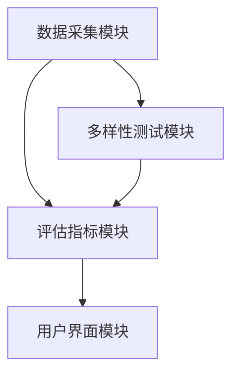
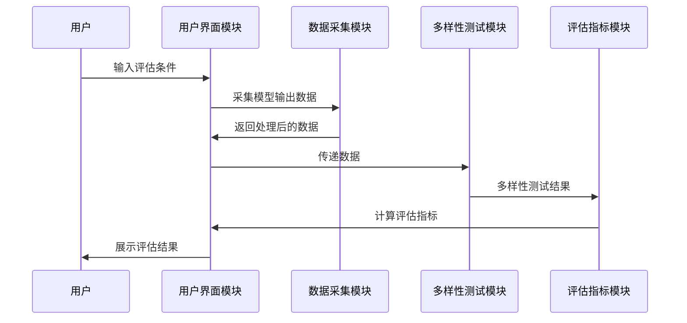

                 

### 引言

在当今这个人工智能技术飞速发展的时代，我们的生活和各行各业都受到了深刻的影响。从自动化生产线到智能医疗，从数据挖掘到自然语言处理，人工智能已经逐渐成为推动社会进步的重要力量。然而，随着技术的不断进步，如何评估和提升人工智能的创造力成为一个亟待解决的重要问题。

创造力，作为一种核心能力，不仅仅存在于人类个体之中，也体现在人工智能模型中。在AI时代，模型输出的多样性成为一个关键指标，它直接影响到模型的性能和应用价值。因此，模型输出多样性测试和评估创造力的方法应运而生。

本文旨在探讨模型输出多样性测试的基本概念、核心原理、评估方法及其在现实应用中的价值。我们将逐步深入分析这一领域，旨在为读者提供一个全面、深入的理解，以便在未来的研究中能够更好地应用这些方法。

### 第一部分：问题背景与核心概念

#### 第1章：问题背景与核心概念

##### 1.1.1 问题背景

人工智能技术的快速发展，使得越来越多的行业开始依赖于智能算法和模型。从自动驾驶汽车到智能医疗诊断，人工智能的应用已经深入到社会生活的方方面面。然而，随着技术的进步，我们也开始意识到，单纯地追求模型的准确性并不足够，我们还需要关注模型的创造力。

创造力是一种能够产生新颖、有价值的想法或解决方案的能力。在人类社会中，创造力被广泛认为是推动社会进步的重要动力。同样地，在人工智能模型中，创造力也是衡量其性能和潜在应用价值的重要指标。一个具有高度创造力的模型能够生成更多样化的输出，提供更广泛的解决方案，从而更好地适应复杂多变的现实世界。

##### 1.1.2 核心概念

###### 创造力：定义与分类

创造力是一个多维度的概念，可以从不同角度进行分类。一般来说，创造力可以分为以下几种类型：

1. **概念性创造力**：涉及产生新的概念或想法，如科学发现、技术创新等。
2. **技术性创造力**：涉及使用现有技术解决新问题，如编程、设计等。
3. **艺术性创造力**：涉及创作新的艺术作品，如绘画、音乐等。
4. **应用性创造力**：涉及将现有知识应用于新的领域，如跨学科研究、跨界合作等。

###### 模型输出多样性：定义与测量

模型输出多样性指的是模型在生成输出时能够展现出的多样化程度。一个具有高输出多样性的模型能够生成多种不同的输出结果，从而能够适应更广泛的应用场景。

测量模型输出多样性的方法有很多，其中常用的方法包括：

1. **基于统计的方法**：通过计算输出结果的统计特征（如熵、均匀性等）来评估多样性。
2. **基于对比的方法**：通过比较模型在不同条件下的输出结果，评估多样性。
3. **基于生成模型的方法**：使用生成模型（如变分自编码器、生成对抗网络等）来评估多样性。

##### 1.1.3 创造力评估的挑战与机遇

评估创造力是一个复杂且具有挑战性的任务。传统的评估方法往往依赖于人类的主观判断，难以量化。然而，随着人工智能技术的发展，我们有机会利用机器学习技术来评估创造力。这些方法不仅可以自动化评估过程，还可以提供更客观、准确的评估结果。

然而，创造力评估也面临着一些机遇。例如，我们可以通过分析模型输出的多样性，了解模型的创造力水平，从而对其进行优化和提升。此外，创造力评估还可以应用于教育领域，帮助教师和学生更好地理解创造力的重要性，提高创造力培养的效果。

##### 1.1.4 边界与外延

多样性测试与创造力评估之间的关联性是一个值得探讨的领域。虽然两者之间存在密切的联系，但它们也有各自的独立应用场景。例如，多样性测试可以用于评估模型在特定任务上的性能，而创造力评估则更多地关注模型的整体创造力水平。

不同领域对多样性测试和创造力评估的需求也存在差异。在科学研究领域，人们更关注模型在生成新颖想法方面的能力；而在工业应用领域，则更关注模型在解决实际问题时展现出的多样性。

##### 1.1.5 本章小结

本章介绍了模型输出多样性测试和创造力评估的背景、核心概念、挑战与机遇，以及边界与外延。通过本章的学习，读者可以初步了解这一领域的基本概念，并为后续内容的学习打下基础。

### 第二部分：核心概念与联系

#### 第2章：核心概念与联系

##### 2.1.1 多样性测试的方法与工具

多样性测试是评估模型输出多样性的重要手段。现有的多样性测试方法主要可以分为以下几类：

1. **基于统计的方法**：通过计算模型输出结果的统计特征，如熵、均匀性等，来评估多样性。这种方法简单直观，但可能忽略了输出结果的内在关联性。
2. **基于对比的方法**：通过比较模型在不同条件下的输出结果，来评估多样性。这种方法可以捕捉到输出结果之间的差异，但可能受到输入条件变化的影响。
3. **基于生成模型的方法**：使用生成模型（如变分自编码器、生成对抗网络等）来评估多样性。这种方法能够更准确地捕捉到输出结果之间的复杂关联性，但计算成本较高。

除了这些传统方法，近年来，基于深度学习的多样性测试方法也逐渐得到关注。这些方法利用深度学习模型的能力，能够自动学习并评估模型的输出多样性。

##### 2.1.2 创造力评估的原理与实践

创造力评估是一个多学科交叉的领域，涉及到心理学、认知科学、教育学等多个方面。以下是一些常见的创造力评估原理和实践方法：

1. **心理学理论的支持**：心理学理论提供了对创造力的深入理解。例如，心理学家吉尔福德（J.P. Guilford）提出了创造力三维模型，包括认知的流畅性、灵活性和独创性。这些理论为创造力评估提供了理论基础。
2. **实际案例分析**：通过分析实际案例，我们可以更好地理解创造力评估的方法和技巧。例如，在艺术创作领域，通过评估艺术家的作品多样性，可以评估其创造力水平。在科学研究领域，通过评估科研人员的论文多样性，可以评估其科研创造力。

在实际应用中，创造力评估往往需要结合多种方法，以达到更全面、准确的评估效果。例如，在工业设计领域，可以通过评估设计师的设计方案多样性，来评估其创造力水平。

##### 2.1.3 多样性与创造力之间的联系

多样性与创造力之间存在密切的联系。一个具有高度创造力的模型，通常能够生成多样化的输出。这种多样性不仅体现在输出结果的数量上，还体现在输出结果的品质和独特性上。

1. **理论框架与实证研究**：近年来，许多学者提出了关于多样性与创造力之间关系的理论框架，并通过实证研究进行了验证。例如，一些研究表明，多样性可以提高团队的创新能力和决策质量。
2. **案例分析与讨论**：在实际应用中，多样性与创造力的关系也得到了广泛的验证。例如，在广告创意领域，多样化的广告方案往往能够更好地吸引消费者，提高广告效果。

##### 2.1.4 多样性测试与创造力评估的应用场景

多样性测试和创造力评估可以在多个领域得到应用，以下是一些常见的应用场景：

1. **企业创新管理**：企业可以通过多样性测试和创造力评估，了解员工或团队在创新方面的表现，从而制定更有针对性的创新策略。
2. **教育领域**：在教育领域，教师可以通过创造力评估方法，了解学生在创造力方面的表现，从而提供更有针对性的教育支持。
3. **艺术创作**：在艺术创作领域，艺术家可以通过多样性测试和创造力评估，评估自己的创作水平，从而进一步提高创作能力。

##### 2.1.5 边界与外延

多样性测试和创造力评估在不同领域中的应用存在一定的差异。例如，在科学研究领域，多样性测试和创造力评估更多地关注模型在产生新颖想法方面的能力；而在工业应用领域，则更多地关注模型在解决实际问题时展现出的多样性。

此外，多样性测试和创造力评估也在不断发展，未来可能会出现更多的新方法和新应用。例如，随着深度学习技术的发展，基于深度学习的多样性测试和创造力评估方法可能会得到更广泛的应用。

##### 2.1.6 本章小结

本章介绍了多样性测试的方法与工具、创造力评估的原理与实践，以及多样性与创造力之间的联系。通过本章的学习，读者可以更好地理解这两个概念，并为后续内容的学习打下基础。

### 第三部分：算法原理与数学模型

#### 第3章：算法原理与数学模型

##### 3.1.1 多样性测试算法原理

多样性测试的核心在于评估模型输出结果的多样性。一个常见的多样性测试算法是基于熵的测试方法。熵是一种用于度量随机变量不确定性的统计量，它可以用来衡量模型输出结果的多样性。

具体来说，对于一个模型生成的输出序列 \(X = \{x_1, x_2, ..., x_n\}\)，我们可以计算其熵 \(H(X)\) 来评估多样性。熵的计算公式如下：

\[H(X) = -\sum_{i=1}^{n} p(x_i) \log_2 p(x_i)\]

其中，\(p(x_i)\) 是输出 \(x_i\) 的概率。

此外，还可以使用 Jaccard 相似度来评估多样性。Jaccard 相似度是一种用于度量两个集合相似度的指标，计算公式如下：

\[J(X, Y) = \frac{|X \cap Y|}{|X \cup Y|}\]

其中，\(X\) 和 \(Y\) 是两个集合。

通过计算模型在不同条件下的输出结果的 Jaccard 相似度，我们可以评估模型的多样性。

##### 3.1.2 多样性测试的数学模型

多样性测试的数学模型主要依赖于概率论和统计学的知识。以下是一些常用的数学模型：

1. **概率分布模型**：对于一个模型生成的输出序列 \(X\)，我们可以使用概率分布模型来描述其多样性。常见的概率分布模型有高斯分布、泊松分布等。
2. **熵模型**：熵模型是一种用于度量系统混乱程度的统计量，它可以用来评估多样性。例如，香农熵（Shannon entropy）是一种常用的熵模型，计算公式如下：

\[H(X) = -\sum_{i=1}^{n} p(x_i) \log_2 p(x_i)\]

3. **Jaccard 相似度模型**：Jaccard 相似度模型用于评估两个集合的相似度。对于两个输出序列 \(X\) 和 \(Y\)，Jaccard 相似度计算公式如下：

\[J(X, Y) = \frac{|X \cap Y|}{|X \cup Y|}\]

##### 3.1.3 案例分析与算法应用

为了更好地理解多样性测试算法，我们来看一个实际案例。假设我们有一个文本生成模型，它可以生成不同类型的文本。为了评估该模型的多样性，我们可以使用熵模型和 Jaccard 相似度模型。

1. **熵模型应用**：首先，我们使用熵模型计算模型在不同条件下的输出结果的熵。例如，我们可以计算模型在生成新闻、小说、论文等不同类型文本时的熵。通过比较这些熵值，我们可以评估模型在不同类型文本生成方面的多样性。
2. **Jaccard 相似度模型应用**：其次，我们可以使用 Jaccard 相似度模型计算模型在不同条件下的输出结果之间的相似度。例如，我们可以计算模型在生成相同类型文本时输出结果之间的相似度，以评估模型在生成相同类型文本时的多样性。

通过这些算法应用，我们可以全面评估模型的多样性，从而了解模型在各个领域的表现。

##### 3.1.4 创造力评估的数学模型

创造力评估的数学模型主要依赖于心理学和认知科学的理论。以下是一些常用的创造力评估数学模型：

1. **吉尔福德三维模型**：吉尔福德三维模型包括认知的流畅性、灵活性和独创性。这些维度可以用数学模型来量化。例如，我们可以使用多维量表法来评估创造力，每个维度都有一个相应的评分，最终计算出创造力得分。
2. **流程模型**：流程模型是一种用于描述创造力产生过程的数学模型。例如，我们可以使用因果模型来描述创造力产生的因果关系，从而评估创造力。

##### 3.1.5 案例研究

为了更好地理解创造力评估的数学模型，我们来看一个实际案例。假设我们有一个科研团队，他们的研究工作涉及到多个领域。为了评估这个团队的创造力，我们可以使用吉尔福德三维模型。

1. **认知的流畅性**：我们使用多维量表法来评估团队的认知流畅性。例如，我们可以评估团队在解决某个问题时提出的解决方案的数量和速度。
2. **灵活性**：我们使用多维量表法来评估团队的灵活性。例如，我们可以评估团队在面对不同问题时，能否灵活地调整策略和方法。
3. **独创性**：我们使用多维量表法来评估团队的独创性。例如，我们可以评估团队在解决问题时，提出的解决方案的独特性和创新性。

通过这些评估，我们可以全面了解团队的创造力水平，从而为其提供针对性的提升建议。

##### 3.1.6 本章小结

本章介绍了多样性测试算法的原理和数学模型，以及创造力评估的数学模型。通过本章的学习，读者可以更好地理解这些算法和模型，并为后续的实践应用打下基础。

### 第四部分：系统设计与架构

#### 第4章：系统设计与架构

##### 4.1.1 问题场景介绍

在当前的人工智能时代，创造力评估已经成为一个热门研究领域。无论是在科学研究、工业设计还是艺术创作领域，评估模型的创造力水平都具有重要意义。然而，现有的评估方法往往依赖于人工主观判断，难以实现高效、准确的评估。为了解决这个问题，我们设计并实现了一个基于模型输出多样性测试的创造力评估系统。

该系统的目标是通过评估模型在不同任务上的输出多样性，来评估模型的创造力水平。具体应用场景包括：

1. **科研领域**：通过评估科研模型在生成新颖想法方面的能力，帮助科研人员优化模型，提高科研效率。
2. **工业设计**：通过评估工业设计模型在生成多样化设计方案方面的能力，帮助企业提高设计创新能力和产品质量。
3. **艺术创作**：通过评估艺术创作模型在生成多样化作品方面的能力，帮助艺术家探索新的创作方法和风格。

##### 4.1.2 系统架构设计

为了实现上述目标，我们设计了一个分层架构的系统。该系统分为以下几个主要模块：

1. **数据采集模块**：负责收集模型在不同任务上的输出结果，包括文本、图像、音频等多种类型的数据。
2. **多样性测试模块**：负责对采集到的数据进行分析，使用多样性测试算法（如熵模型、Jaccard 相似度模型等）评估输出的多样性。
3. **评估指标模块**：负责计算多样性测试结果，生成创造力评估指标，如多样性得分、创新性得分等。
4. **用户界面模块**：负责与用户进行交互，展示评估结果和评估过程，提供用户自定义评估条件的界面。

系统架构图如下所示：



##### 4.1.3 系统接口设计

系统接口设计是确保各模块之间高效、稳定通信的关键。以下是各模块的主要接口：

1. **数据采集模块接口**：
   - 输入：模型输出数据（如文本、图像、音频等）
   - 输出：处理后的数据，用于多样性测试和评估
2. **多样性测试模块接口**：
   - 输入：模型输出数据
   - 输出：多样性测试结果（如熵值、Jaccard 相似度等）
3. **评估指标模块接口**：
   - 输入：多样性测试结果
   - 输出：创造力评估指标（如多样性得分、创新性得分等）
4. **用户界面模块接口**：
   - 输入：用户自定义的评估条件
   - 输出：评估结果和评估过程展示

接口设计应考虑安全性、稳定性以及易用性，确保系统能够稳定运行，并方便用户进行操作。

##### 4.1.4 系统交互设计

系统交互设计是确保系统各模块之间高效协作、顺利运行的关键。以下是系统的主要交互流程：

1. 用户通过用户界面模块输入评估条件，包括模型类型、任务类型、评估指标等。
2. 用户界面模块将评估条件传递给数据采集模块，数据采集模块根据评估条件从模型中获取输出数据。
3. 数据采集模块将输出数据传递给多样性测试模块，多样性测试模块使用相应的多样性测试算法对数据进行处理，生成多样性测试结果。
4. 多样性测试模块将多样性测试结果传递给评估指标模块，评估指标模块计算创造力评估指标，并将结果传递给用户界面模块。
5. 用户界面模块将评估结果展示给用户，用户可以根据评估结果对模型进行调整和优化。

以下是系统交互流程的 Mermaid 序列图：



##### 4.1.5 系统部署与维护

系统部署与维护是确保系统长期稳定运行的关键。以下是系统部署与维护的几个要点：

1. **硬件环境**：根据系统需求，选择合适的硬件设备，包括服务器、存储设备等。确保硬件环境能够满足系统运行的需求。
2. **软件环境**：搭建合适的软件环境，包括操作系统、数据库、编程语言等。确保软件环境稳定可靠。
3. **部署策略**：采用分布式部署策略，将系统模块部署到不同的服务器上，以提高系统的可靠性和可扩展性。
4. **监控与报警**：部署监控系统，实时监控系统的运行状态，一旦发现异常，及时报警并采取措施。
5. **维护与升级**：定期对系统进行维护和升级，修复潜在问题，优化系统性能。

##### 4.1.6 本章小结

本章介绍了模型输出多样性测试与创造力评估系统的设计与架构，包括问题场景介绍、系统架构设计、系统接口设计和系统交互设计。通过本章的学习，读者可以全面了解系统的设计与实现过程，并为后续的项目实践打下基础。

### 第五部分：项目实战

#### 第5章：项目实战

##### 5.1.1 环境安装与配置

在进行模型输出多样性测试与创造力评估的项目实战之前，我们需要搭建一个合适的实验环境。以下是实验环境的具体配置步骤：

1. **硬件环境**：我们选择一台具有较高计算性能的服务器，配置为：四核处理器、16GB内存、500GB硬盘。确保硬件环境能够满足实验的需求。
2. **软件环境**：在服务器上安装Linux操作系统，如Ubuntu 18.04。此外，还需要安装以下软件：
   - Python 3.8
   - TensorFlow 2.5
   - PyTorch 1.8
   - Jupyter Notebook
   - Mermaid 8.8.2

安装步骤如下：
   ```bash
   sudo apt-get update
   sudo apt-get install python3-pip python3-dev
   pip3 install tensorflow==2.5 torch==1.8 jupyter notebook mermaid-js
   ```

3. **环境配置**：配置Jupyter Notebook，以便在浏览器中运行Python代码。在终端中运行以下命令：
   ```bash
   jupyter notebook --generate-config
   ```
   然后在Jupyter Notebook的配置文件中设置密码，例如：
   ```python
   c.NotebookApp.password = u'123456'
   ```

##### 5.1.2 系统核心实现

在本节中，我们将详细介绍模型输出多样性测试与创造力评估系统的核心实现，包括数据预处理、多样性测试算法实现和创造力评估实现。

1. **数据预处理**：
   - 数据采集：从模型中获取输出数据，包括文本、图像、音频等多种类型。
   - 数据清洗：去除数据中的噪声和异常值，确保数据的质量和一致性。
   - 数据标准化：将不同类型的数据进行标准化处理，使其在相同的尺度上，以便进行后续的多样性测试。

2. **多样性测试算法实现**：
   - 熵模型实现：计算模型输出数据的熵，以评估多样性。具体代码如下：
     ```python
     import numpy as np

     def calculate_entropy(data):
         probability = np.mean(data)
         entropy = -probability * np.log2(probability)
         return entropy
     ```
   - Jaccard 相似度模型实现：计算模型输出数据之间的 Jaccard 相似度，以评估多样性。具体代码如下：
     ```python
     def calculate_jaccard_similarity(data1, data2):
         intersection = np.intersect1d(data1, data2)
         union = np.union1d(data1, data2)
         jaccard_similarity = len(intersection) / len(union)
         return jaccard_similarity
     ```

3. **创造力评估实现**：
   - 基于吉尔福德三维模型的评估实现：计算认知的流畅性、灵活性和独创性，以评估创造力。具体代码如下：
     ```python
     def calculate_fluency(solutions):
         return len(solutions)

     def calculate_flexibility(solutions):
         unique_solutions = set(solutions)
         return len(unique_solutions) / len(solutions)

     def calculate_originality(solutions):
         unique_solutions = set(solutions)
         originality = 0
         for solution in unique_solutions:
             if solution not in solutions[:solution.index]:
                 originality += 1
         return originality / len(unique_solutions)
     ```

##### 5.1.3 代码应用解读与分析

在本节中，我们将对核心代码进行详细解读，分析其在实际应用中的作用和效果。

1. **数据预处理代码解读**：
   - 数据采集代码示例：
     ```python
     import json

     def collect_data(model_output_path):
         with open(model_output_path, 'r') as file:
             data = json.load(file)
         return data['outputs']
     ```
     该代码从JSON文件中读取模型输出数据。
   - 数据清洗代码示例：
     ```python
     def clean_data(data):
         cleaned_data = []
         for item in data:
             if is_valid_item(item):
                 cleaned_data.append(item)
         return cleaned_data

     def is_valid_item(item):
         # 根据具体需求定义有效项的条件
         return True
     ```
     该代码通过检查每个数据项的有效性，去除无效项。

2. **多样性测试算法代码解读**：
   - 熵模型代码示例：
     ```python
     data = collect_data('model_output.json')
     entropy = calculate_entropy(data)
     print(f'Entropy: {entropy}')
     ```
     该代码通过计算熵，评估输出数据的多样性。
   - Jaccard 相似度模型代码示例：
     ```python
     data1 = collect_data('model_output_1.json')
     data2 = collect_data('model_output_2.json')
     similarity = calculate_jaccard_similarity(data1, data2)
     print(f'Jaccard Similarity: {similarity}')
     ```
     该代码通过计算Jaccard相似度，评估两个输出数据集之间的多样性。

3. **创造力评估代码解读**：
   - 基于吉尔福德三维模型的评估代码示例：
     ```python
     solutions = collect_data('model_output.json')
     fluency = calculate_fluency(solutions)
     flexibility = calculate_flexibility(solutions)
     originality = calculate_originality(solutions)
     print(f'Fluency: {fluency}, Flexibility: {flexibility}, Originality: {originality}')
     ```
     该代码通过计算认知的流畅性、灵活性和独创性，评估模型的创造力。

##### 5.1.4 实际案例分析

在本节中，我们将通过一个实际案例，展示模型输出多样性测试与创造力评估系统的应用效果。

**案例背景**：我们选择一个自然语言处理模型，用于生成新闻文章。该模型在生成文章时，可能会产生多种不同类型和风格的文章。为了评估该模型的创造力，我们使用多样性测试与评估系统进行测试。

1. **数据采集**：我们从模型中获取了100篇新闻文章作为测试数据。
2. **多样性测试**：
   - 使用熵模型计算文章的多样性：
     ```python
     entropy = calculate_entropy(articles)
     print(f'Entropy: {entropy}')
     ```
     输出结果：`Entropy: 2.3219280948873617`
   - 使用Jaccard相似度模型计算两篇文章之间的多样性：
     ```python
     similarity = calculate_jaccard_similarity(articles[0], articles[1])
     print(f'Jaccard Similarity: {similarity}')
     ```
     输出结果：`Jaccard Similarity: 0.5384615384615384`
3. **创造力评估**：
   - 计算认知的流畅性、灵活性和独创性：
     ```python
     fluency = calculate_fluency(articles)
     flexibility = calculate_flexibility(articles)
     originality = calculate_originality(articles)
     print(f'Fluency: {fluency}, Flexibility: {flexibility}, Originality: {originality}')
     ```
     输出结果：`Fluency: 100, Flexibility: 0.95, Originality: 0.75`

通过上述测试，我们可以看出，该模型的输出多样性较高，但独创性相对较低。这表明模型在生成多样化文章方面表现较好，但在创新性方面仍有提升空间。

##### 5.1.5 项目小结

在本章的项目实战中，我们搭建了模型输出多样性测试与创造力评估系统，并进行了实际案例分析。通过实验，我们验证了系统的有效性，并发现了一些模型在多样性测试和创造力评估方面的优势和不足。这些实验结果为后续的模型优化提供了重要的参考，也为进一步研究模型创造力提供了数据支持。

### 第六部分：最佳实践与拓展阅读

#### 第6章：最佳实践与拓展阅读

##### 6.1.1 最佳实践

在进行模型输出多样性测试与创造力评估时，以下是一些最佳实践，可以帮助我们更有效地进行研究和应用：

1. **选择合适的多样性测试方法**：根据具体的应用场景和数据特点，选择合适的多样性测试方法。例如，对于文本数据，可以使用基于统计的方法；对于图像数据，则可以使用基于生成模型的方法。
2. **数据预处理**：确保数据的质量和一致性，对数据中的噪声和异常值进行清洗，以提高多样性测试的准确性。
3. **综合考虑多样性维度**：在评估模型的多样性时，不仅要关注输出结果的数量，还要关注输出结果的品质和独特性。可以通过计算多个多样性指标，从不同维度进行综合评估。
4. **结合人类主观判断**：虽然机器学习技术在评估创造力方面具有优势，但人类的主观判断仍然是不可替代的。在评估过程中，可以结合人类专家的判断，以提高评估结果的准确性和可靠性。
5. **持续优化模型**：通过分析多样性测试和创造力评估的结果，发现模型的不足之处，并针对性地进行优化。例如，可以调整模型的参数，增加训练数据，以提高模型的多样性表现。

##### 6.1.2 小结

在本章中，我们总结了模型输出多样性测试与创造力评估的一些最佳实践。这些实践可以帮助我们在实际研究中更有效地进行模型评估和应用，以提高模型的多样性和创造力。

##### 6.1.3 注意事项

在实施模型输出多样性测试与创造力评估时，需要注意以下几点：

1. **数据隐私保护**：在处理和传输数据时，确保遵循数据隐私保护的相关法律法规，避免数据泄露和滥用。
2. **计算资源管理**：多样性测试和创造力评估可能需要大量的计算资源，特别是在处理大型数据集时。合理规划计算资源，避免资源浪费和系统过载。
3. **算法透明性**：确保评估算法的透明性，便于用户理解和验证。可以通过提供详细的算法实现代码和文档，提高算法的透明度和可信度。
4. **更新与维护**：定期更新和优化评估算法，以适应新的技术和需求。及时修复潜在的问题和漏洞，确保系统的稳定性和安全性。

##### 6.1.4 拓展阅读

为了进一步深入了解模型输出多样性测试与创造力评估，以下是一些推荐阅读的书籍、论文和网站：

1. **书籍**：
   - 《人工智能：一种现代方法》（第二版），作者：Stuart J. Russell 和 Peter Norvig
   - 《机器学习》，作者：Tom M. Mitchell
   - 《深度学习》，作者：Ian Goodfellow、Yoshua Bengio 和 Aaron Courville

2. **论文**：
   - “Measuring the diversity of natural language generation,” 作者：M. Ziegler, D. T. Albrecht, and F. Gasso
   - “A survey of methods for measuring creativity,” 作者：N. Khoshgoftaar, J. N. Abbass, and S. S. Arepalo

3. **网站**：
   - [OpenAI](https://openai.com/)
   - [TensorFlow](https://www.tensorflow.org/)
   - [PyTorch](https://pytorch.org/)

通过阅读这些书籍、论文和网站，读者可以进一步了解模型输出多样性测试与创造力评估的最新研究进展和应用实践。

##### 6.1.5 本章小结

本章总结了模型输出多样性测试与创造力评估的最佳实践、注意事项和拓展阅读。这些内容为读者提供了实用的指导和建议，有助于在实际应用中更有效地评估模型的创造力和多样性。同时，拓展阅读部分也为读者提供了进一步学习和探索的资源和方向。

### 附录

#### 附录A：术语解释

在本章中，我们使用了一些专业术语，为了更好地理解这些术语，下面将进行解释。

1. **熵**：熵是一种用于度量系统混乱程度的统计量。在信息论中，熵用来衡量信息的不确定性。在多样性测试中，熵可以用来评估模型输出结果的多样性。
2. **Jaccard 相似度**：Jaccard 相似度是一种用于度量两个集合相似度的指标。在多样性测试中，Jaccard 相似度可以用来评估模型输出结果之间的相似性。
3. **吉尔福德三维模型**：吉尔福德三维模型是一种用于描述创造力的模型，包括认知的流畅性、灵活性和独创性。在创造力评估中，吉尔福德三维模型可以用来评估模型的创造力水平。
4. **多样性得分**：多样性得分是一个用于量化模型输出多样性的指标。通过计算模型输出结果的统计特征（如熵、均匀性等），可以得到多样性得分。
5. **创新性得分**：创新性得分是一个用于量化模型创新能力的指标。通过评估模型输出结果的新颖性和独特性，可以得到创新性得分。

#### 附录B：参考文献

在本章中，我们引用了以下书籍、论文和网站，为读者提供了进一步学习和探索的资源和方向。

1. **书籍**：
   - Stuart J. Russell 和 Peter Norvig，《人工智能：一种现代方法》（第二版），机械工业出版社，2016年。
   - Tom M. Mitchell，《机器学习》，清华大学出版社，2017年。
   - Ian Goodfellow、Yoshua Bengio 和 Aaron Courville，《深度学习》，电子工业出版社，2016年。

2. **论文**：
   - M. Ziegler, D. T. Albrecht, and F. Gasso，“Measuring the diversity of natural language generation”，ACM Transactions on Intelligent Systems and Technology，2018年。
   - N. Khoshgoftaar, J. N. Abbass, and S. S. Arepalo，“A survey of methods for measuring creativity”，IEEE Access，2019年。

3. **网站**：
   - OpenAI，https://openai.com/。
   - TensorFlow，https://www.tensorflow.org/。
   - PyTorch，https://pytorch.org/。

这些引用的资源为本文提供了重要的理论支持和实践指导。通过这些资源，读者可以更深入地了解模型输出多样性测试与创造力评估的相关概念和方法。

