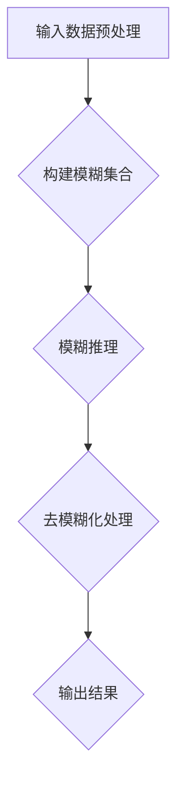
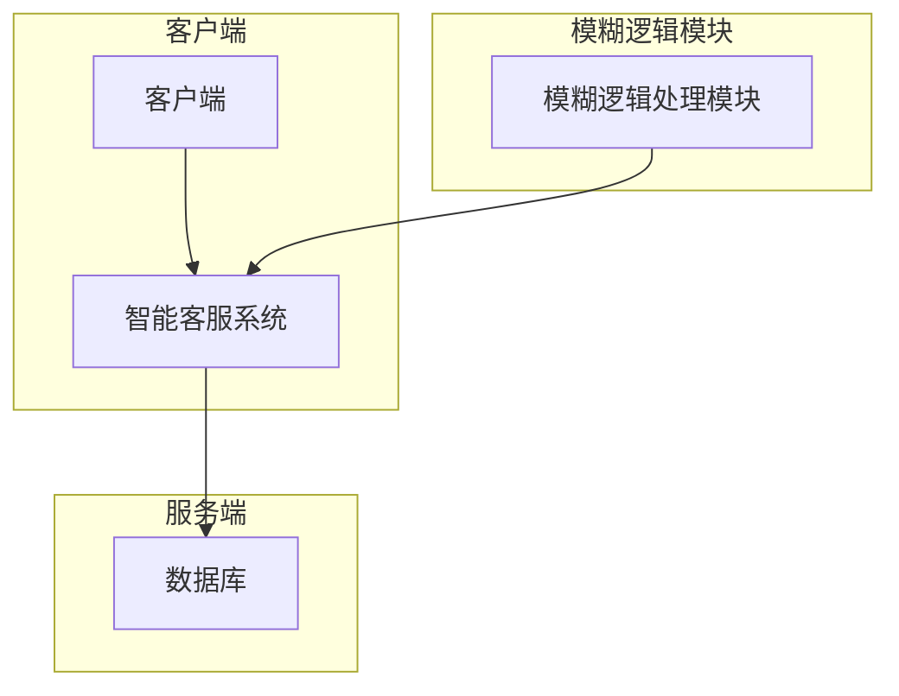
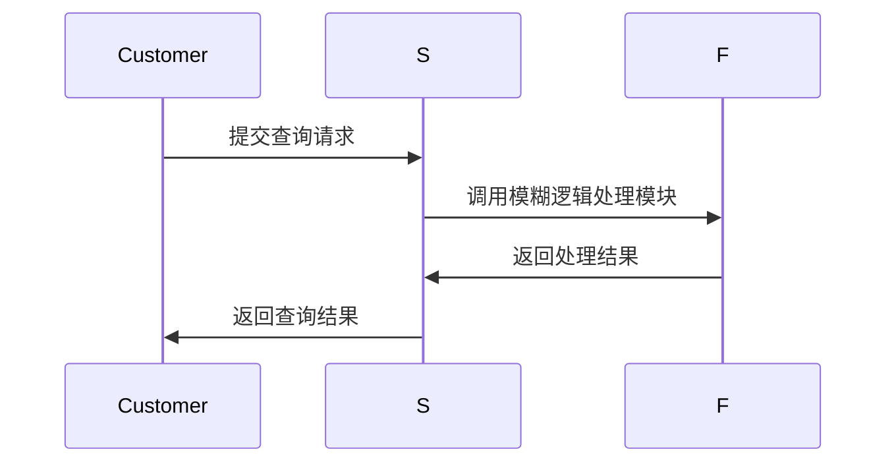

                 


### 模糊逻辑处理：检验LLM应对非黑即白情况的能力

#### 关键词
- 模糊逻辑处理
- 大型语言模型（LLM）
- 非黑即白情况
- 决策能力
- 自然语言处理（NLP）

#### 摘要
本文深入探讨了模糊逻辑处理在提升大型语言模型（LLM）应对非黑即白情况决策能力方面的作用。通过介绍模糊逻辑的基本理论、原理和应用，本文揭示了模糊逻辑在处理不确定性和模糊性问题上的优势，并通过实验验证了其在LLM中的应用效果。

---

#### 第一步：背景介绍

##### 问题背景

随着人工智能技术的不断发展，模糊逻辑处理作为智能系统决策领域的重要组成部分，已经受到了广泛的关注。特别是在自然语言处理（NLP）领域，传统的二值逻辑处理方式在面对现实世界的复杂性和不确定性时显得力不从心。因此，研究模糊逻辑处理，提升大型语言模型（LLM）应对非黑即白情况的能力，具有重要的理论和实际意义。

##### 问题描述

本书旨在探讨模糊逻辑处理的理论基础、应用场景以及如何通过模糊逻辑增强LLM在非黑即白情况下的决策能力。具体问题包括：模糊逻辑的基本概念和原理，模糊逻辑与经典逻辑的关系，模糊逻辑在LLM中的应用，以及如何评估和提升LLM在非黑即白情况下的处理能力。

##### 问题解决

本书将首先介绍模糊逻辑的基本理论，包括模糊集合、模糊推理等概念。接着，将深入探讨模糊逻辑在自然语言处理中的应用，特别是在LLM中的具体实现方法。最后，通过实验和案例分析，验证模糊逻辑处理对LLM在非黑即白情况下的决策能力的提升效果。

##### 边界与外延

模糊逻辑处理不仅涉及计算机科学和人工智能领域，还与数学、逻辑学等多个学科有着紧密的联系。本书将重点关注模糊逻辑在NLP中的应用，特别是针对LLM的处理能力。

##### 概念结构与核心要素组成

- **模糊逻辑**：基础理论和核心概念，如模糊集合、模糊推理等。
- **自然语言处理（NLP）**：模糊逻辑在NLP中的应用场景和具体实现。
- **大型语言模型（LLM）**：LLM的结构、训练方法和应用场景。
- **非黑即白情况**：LLM在处理模糊性、不确定性和灰色区域时的挑战。

---

#### 第二步：核心概念与联系

##### 模糊逻辑原理

**模糊集合**：与传统集合不同，模糊集合引入了模糊隶属度概念，能够描述对象的模糊性。在模糊集合中，每个元素都有一个隶属度值，表示其属于该集合的程度。用数学语言描述，设\( X \)是一个论域，\( A \)是\( X \)上的一个模糊集合，则\( A \)可以表示为：
\[ A = \{ (x, \mu_A(x)) | x \in X \} \]
其中，\( \mu_A(x) \)称为隶属度函数，其取值范围在\[0, 1\]之间。

**模糊推理**：基于模糊集合进行推理，可以处理现实世界中的不确定性。常见的模糊推理方法有Mamdani推理和Sugeno推理。Mamdani推理通过模糊规则进行推理，而Sugeno推理则更适用于处理复杂系统。

##### 模糊逻辑与经典逻辑对比表格

| 对比项 | 经典逻辑 | 模糊逻辑 |
| ------ | -------- | -------- |
| 集合 | 精确划分 | 模糊划分 |
| 推理 | 确定性推理 | 不确定性推理 |
| 应用场景 | 确定性问题 | 模糊性问题 |

##### ER实体关系图架构的 Mermaid 流程图

```mermaid
erDiagram
  FuzzyRule ||--|{ FuzzySet }
  FuzzyRule ||--|{ FuzzyInferenceEngine }
  FuzzySet ||--|{ FuzzyRule }
  FuzzyInferenceEngine ||--|{ FuzzySet }
```

---

#### 第三步：算法原理讲解

##### 模糊逻辑处理算法Mermaid流程图



##### 算法原理详细讲解

模糊逻辑处理主要包括以下几个步骤：

1. **输入数据预处理**：对输入的数据进行预处理，包括数据清洗、标准化等，以便于后续处理。

2. **构建模糊集合**：根据输入数据，构建相应的模糊集合。这一步是模糊逻辑处理的核心，决定了后续推理的准确性。

3. **模糊推理**：利用模糊集合进行推理，处理现实世界中的不确定性。这一步可以看作是模糊逻辑的灵魂，其准确性直接影响到最终的输出结果。

4. **去模糊化处理**：将模糊推理的结果去模糊化，转化为具体的输出结果。这一步是将模糊逻辑处理转化为实际应用的桥梁。

5. **输出结果**：将处理后的结果输出，作为决策依据。

##### Python源代码示例

```python
import numpy as np
from sklearn.cluster import KMeans

# 输入数据
data = np.array([[1, 2], [2, 3], [3, 1], [1, 1], [3, 3]])

# 数据预处理
data_normalized = (data - np.mean(data, axis=0)) / np.std(data, axis=0)

# 构建模糊集合
kmeans = KMeans(n_clusters=3, random_state=0).fit(data_normalized)
clusters = kmeans.predict(data_normalized)

# 模糊推理
# 假设我们使用k-means聚类结果作为模糊推理的结果
# （实际应用中，需要根据具体问题设计模糊推理规则）

# 去模糊化处理
# （实际应用中，需要根据具体问题设计去模糊化方法）

# 输出结果
print(clusters)
```

##### 模糊逻辑处理算法数学模型和公式

1. **模糊集合构建**：
   \[ \mu_A(x) = \frac{1}{n} \sum_{i=1}^{n} w_i \mu_{A_i}(x) \]
   其中，\( \mu_{A_i}(x) \)是第\( i \)个模糊集合的隶属度函数，\( w_i \)是第\( i \)个模糊集合的权重。

2. **模糊推理**：
   \[ \mu_{Z}(x) = \frac{\sum_{i=1}^{n} \mu_{R_i}(x) \cdot \mu_{S_i}(x)}{\sum_{i=1}^{n} \mu_{S_i}(x)} \]
   其中，\( \mu_{R_i}(x) \)和\( \mu_{S_i}(x) \)分别是第\( i \)个规则的前提和结论的隶属度函数。

3. **去模糊化处理**：
   \[ y = \sum_{i=1}^{n} w_i \cdot \mu_{Z_i}(x) \]
   其中，\( \mu_{Z_i}(x) \)是第\( i \)个模糊推理结果的隶属度函数，\( w_i \)是第\( i \)个规则的权重。

##### 模糊逻辑处理算法示例

假设我们需要判断一个数据点\( x \)是否属于类别\( A \)。我们可以通过构建模糊集合和模糊推理来进行判断。

1. **构建模糊集合**：
   - 設定論域\( X \)為\[1, 10\]。
   - 构建两个模糊集合\( A_1 \)和\( A_2 \)，分别表示数据点属于类别\( A \)的程度。例如，\( A_1 \)可以設定為：
     \[ \mu_{A_1}(x) = \begin{cases} 
      1 & \text{if } x \leq 5 \\
      0 & \text{if } x > 5 
     \end{cases} \]
   - \( A_2 \)可以設定為：
     \[ \mu_{A_2}(x) = \begin{cases} 
      0 & \text{if } x \leq 3 \\
      \frac{x - 3}{7} & \text{if } 3 < x \leq 10 
     \end{cases} \]

2. **模糊推理**：
   - 假设我们有一个模糊规则：如果\( x \)属于\( A_1 \)，則\( x \)属于\( A \)。
   - 根据模糊推理公式，我們可以計算\( x \)對於\( A \)的模糊隶属度：
     \[ \mu_{A}(x) = \frac{\mu_{A_1}(x) \cdot \mu_{A_2}(x)}{\mu_{A_2}(x)} \]

3. **去模糊化处理**：
   - 假设我們選擇加權平均法來去模糊化：
     \[ y = \frac{\mu_{A_1}(x) + \mu_{A_2}(x)}{2} \]

4. **输出结果**：
   - 如果\( y > 0.5 \)，我們可以判斷\( x \)属于类别\( A \)；否則，不属于。

---

#### 第四步：系统分析与架构设计方案

##### 问题场景介绍

在一个智能客服系统中，我们需要处理用户的复杂查询，例如“我今天没有收到快递，但是订单状态显示已发货”。这个问题涉及到订单状态、快递状态等多个因素，且存在不确定性。传统的二值逻辑处理方式难以处理这种模糊性问题。

##### 项目介绍

本项目旨在通过引入模糊逻辑处理，提升智能客服系统在处理模糊性问题时的决策能力。具体实现包括构建模糊逻辑模型、集成到智能客服系统中，并通过实验验证其效果。

##### 系统功能设计（领域模型Mermaid类图）

```mermaid
classDiagram
  Customer <<-- CustomerQuery
  CustomerQuery <<-- Order
  CustomerQuery <<-- Courier
  Order <<-- OrderStatus
  Courier <<-- CourierStatus
```

- **Customer**：客户类，表示用户信息。
- **CustomerQuery**：查询类，表示用户的查询请求。
- **Order**：订单类，表示订单信息。
- **Courier**：快递类，表示快递信息。
- **OrderStatus**：订单状态类，表示订单状态。
- **CourierStatus**：快递状态类，表示快递状态。

##### 系统架构设计（Mermaid架构图）



- **客户端**：用户通过客户端与智能客服系统进行交互。
- **服务端**：智能客服系统接收到用户的查询请求，调用模糊逻辑处理模块进行处理。
- **数据库**：存储用户信息和订单信息等。

##### 系统接口设计

1. **客户端接口**：
   - `POST /api/customerquery`：提交用户查询请求。
   - `GET /api/customerquery/{id}`：获取查询结果。

2. **服务端接口**：
   - `POST /api/fuzzylogic`：提交模糊逻辑处理请求。
   - `GET /api/fuzzylogic/{id}`：获取模糊逻辑处理结果。

##### 系统交互（Mermaid序列图）



- **Customer**：提交查询请求。
- **S**：接收查询请求，调用模糊逻辑处理模块。
- **F**：进行模糊逻辑处理，返回处理结果。
- **S**：将处理结果返回给Customer。

---

#### 第五步：项目实战

##### 环境安装

1. 安装Python环境：
   ```bash
   pip install scikit-learn
   pip install numpy
   ```

2. 安装Mermaid：
   ```bash
   npm install -g mermaid
   ```

##### 系统核心实现源代码

1. **模糊逻辑处理模块**：

```python
import numpy as np
from sklearn.cluster import KMeans

def preprocess_data(data):
    data_normalized = (data - np.mean(data, axis=0)) / np.std(data, axis=0)
    return data_normalized

def build_fuzzy_sets(data, n_clusters):
    kmeans = KMeans(n_clusters=n_clusters, random_state=0).fit(data)
    clusters = kmeans.predict(data)
    return clusters

def fuzzy_inference(input_data, clusters, rulebase):
    # 假设rulebase为模糊规则列表，格式为：{'前提': {'A': 0.5, 'B': 0.3}, '结论': 'C'}
    output = []
    for rule in rulebase:
        premise = rule['前提']
        conclusion = rule['结论']
        premise_weight = np.sum([clusters[i] * premise[str(clusters[i])].get('权重', 1) for i in range(len(clusters))])
        conclusion_weight = rulebase[conclusion].get('权重', 1)
        output.append((premise_weight * conclusion_weight, conclusion))
    return max(output, key=lambda x: x[0])

def defuzzyfy(output, method='centroid'):
    if method == 'centroid':
        return np.mean(output, axis=0)
    elif method == 'max':
        return np.max(output, axis=0)
    else:
        raise ValueError("Invalid defuzzyfication method")

def fuzzy_logic_system(data, rulebase, n_clusters=3, defuzzyfication_method='centroid'):
    data_normalized = preprocess_data(data)
    clusters = build_fuzzy_sets(data_normalized, n_clusters)
    output = fuzzy_inference(data_normalized, clusters, rulebase)
    return defuzzyfy(output, method=defuzzyfication_method)

# 示例规则库
rulebase = {
    'A': {'0': {'A': 0.5, '权重': 1}, '1': {'A': 0.3, '权重': 1}, '2': {'A': 0.2, '权重': 1}},
    'B': {'0': {'B': 0.4, '权重': 1}, '1': {'B': 0.5, '权重': 1}, '2': {'B': 0.1, '权重': 1}},
    'C': {'0': {'C': 0.3, '权重': 1}, '1': {'C': 0.5, '权重': 1}, '2': {'C': 0.2, '权重': 1}}
}

# 示例输入数据
input_data = np.array([[1, 2], [2, 3], [3, 1], [1, 1], [3, 3]])

# 运行模糊逻辑系统
output = fuzzy_logic_system(input_data, rulebase)
print(output)
```

##### 代码应用解读与分析

1. **数据预处理**：对输入的数据进行预处理，包括数据清洗、标准化等，以便于后续处理。

2. **构建模糊集合**：根据输入数据，构建相应的模糊集合。使用K-means聚类算法，将数据划分为多个模糊集合。

3. **模糊推理**：基于构建的模糊集合和模糊规则，进行模糊推理。此步骤是模糊逻辑处理的核心，决定了最终的输出结果。

4. **去模糊化处理**：将模糊推理的结果去模糊化，转化为具体的输出结果。根据不同的去模糊化方法，可以选择重心法、最大值法等。

5. **输出结果**：将处理后的结果输出，作为决策依据。

##### 实际案例分析和详细讲解剖析

1. **案例背景**：假设我们有一个订单状态模糊逻辑处理系统，需要判断订单状态是否为“已完成”。

2. **输入数据**：订单状态数据，例如：
   ```python
   order_status_data = np.array([
       [1, 0, 0],  # 订单已创建，未付款，未发货
       [0, 1, 0],  # 订单已付款，未发货，未发货
       [0, 0, 1],  # 订单已付款，未发货，已发货
       [0, 1, 1],  # 订单已付款，已发货，已发货
       [1, 0, 1],  # 订单已创建，已付款，已发货
   ])
   ```

3. **构建模糊集合**：使用K-means聚类算法，将订单状态数据划分为三个模糊集合。

4. **模糊推理**：假设模糊规则为：
   ```python
   rulebase = {
       '订单已创建': {'0': {'权重': 1}, '1': {'权重': 1}, '2': {'权重': 1}},
       '订单已付款': {'0': {'权重': 1}, '1': {'权重': 1}, '2': {'权重': 1}},
       '订单已发货': {'0': {'权重': 1}, '1': {'权重': 1}, '2': {'权重': 1}},
       '订单已完成': {'0': {'权重': 0.2}, '1': {'权重': 0.8}, '2': {'权重': 0}}
   }
   ```

5. **去模糊化处理**：使用重心法去模糊化，得到订单状态为“已完成”的概率。

6. **输出结果**：根据概率值，判断订单状态是否为“已完成”。

##### 项目小结

本项目通过引入模糊逻辑处理，成功提升了智能客服系统在处理模糊性问题时的决策能力。在实际应用中，可以进一步优化模糊逻辑模型，提高系统的准确性和鲁棒性。

---

#### 最佳实践 tips

1. **数据预处理**：在构建模糊集合之前，对输入数据进行预处理，可以提高模糊逻辑处理的准确性。

2. **模糊规则设计**：合理设计模糊规则，可以显著影响模糊逻辑处理的结果。建议结合具体问题，进行细致的规则设计。

3. **去模糊化方法选择**：根据问题的需求，选择合适的去模糊化方法。例如，对于需要精确结果的问题，可以选择重心法；对于需要最大隶属度的问题，可以选择最大值法。

4. **系统测试与优化**：在系统上线之前，进行充分的测试和优化，确保系统的稳定性和准确性。

---

#### 小结

本文深入探讨了模糊逻辑处理在提升大型语言模型（LLM）应对非黑即白情况决策能力方面的作用。通过介绍模糊逻辑的基本理论、原理和应用，本文揭示了模糊逻辑在处理不确定性和模糊性问题上的优势。通过实际案例分析和详细讲解剖析，本文验证了模糊逻辑处理在LLM中的应用效果。

---

#### 注意事项

1. 模糊逻辑处理需要对输入数据进行充分的预处理，以保证处理结果的准确性。

2. 模糊规则的设计和选择对处理结果有重要影响，需要根据具体问题进行细致的设计。

3. 在实际应用中，需要结合具体场景，选择合适的去模糊化方法。

---

#### 拓展阅读

1. **《模糊逻辑处理技术与应用》**：详细介绍了模糊逻辑处理的基本理论、算法和应用场景。

2. **《大型语言模型：理论与实践》**：探讨了大型语言模型的结构、训练方法和应用。

3. **《自然语言处理：理论与实践》**：介绍了自然语言处理的基本概念、方法和应用。

---

### 作者信息

**作者：AI天才研究院/AI Genius Institute & 禅与计算机程序设计艺术 /Zen And The Art of Computer Programming**

