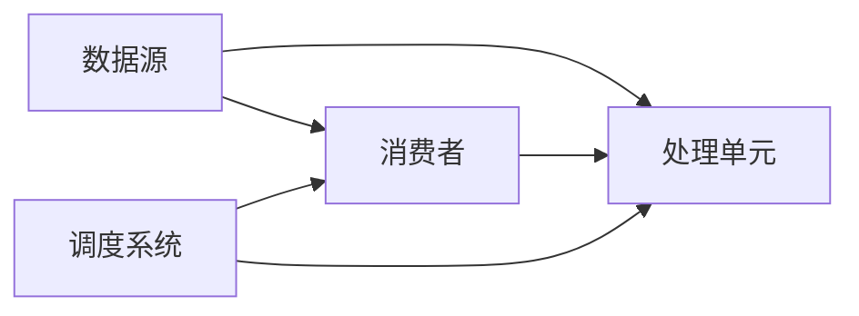
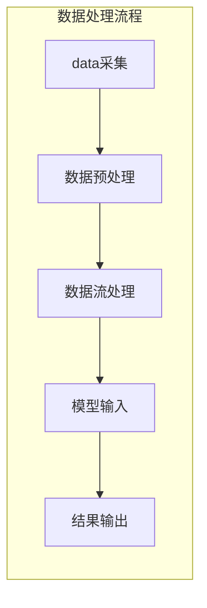
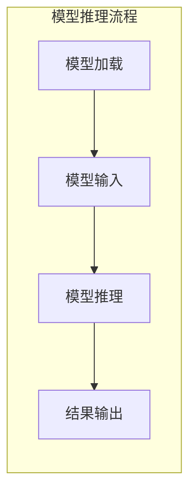
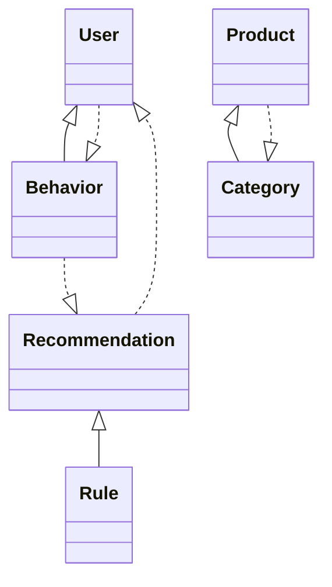
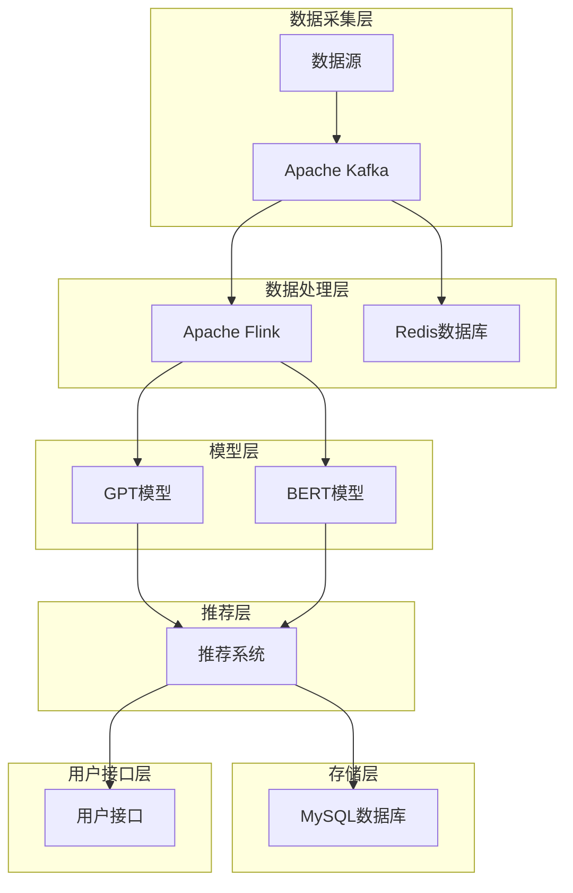

                 

### 文章标题

# 《流处理框架增强LLM应用的实时数据处理能力》

流处理框架在现代数据处理领域扮演着至关重要的角色，尤其是在大规模数据流处理和实时分析方面。与此同时，大型语言模型（LLM）如GPT和BERT等，正成为自然语言处理（NLP）领域的利器，广泛应用于实时问答系统、文本分析和推荐系统等。本文将探讨如何通过流处理框架来增强LLM应用的实时数据处理能力，使系统在处理大规模数据流时能够保持高效和低延迟。

## 关键词

- 流处理框架
- LLM
- 实时数据处理
- 性能优化
- 系统集成

## 摘要

本文首先介绍了流处理框架的基本概念、核心组件以及主流流处理框架，接着探讨了LLM应用在实时数据处理中的背景和挑战。通过分析流处理框架与LLM应用的融合方案，本文提出了一套集成方案，并详细讲解了数据流与模型交互的流程以及性能优化策略。最后，通过一个实时数据处理案例，本文展示了如何在实际项目中应用这些方案，并进行了效果评估。

### 目录大纲

```markdown
# 《流处理框架增强LLM应用的实时数据处理能力》目录大纲

## 第一部分：流处理框架基础

### 第1章：流处理框架概述

#### 1.1 流处理框架的概念与重要性

- 流处理框架的定义
- 流处理与批处理的区别
- 流处理框架在现代数据处理中的应用

#### 1.2 流处理框架的核心组件

- 数据源
- 消费者
- 处理单元
- 调度系统

#### 1.3 主流流处理框架介绍

- Apache Kafka
- Apache Flink
- Apache Spark Streaming
- Apache Storm

### 第2章：流处理框架设计原则

#### 2.1 可扩展性设计

- 数据规模增长的处理策略
- 水平扩展与垂直扩展

#### 2.2 容错性与可靠性设计

- 数据一致性与分布式存储
- 失败检测与恢复机制

#### 2.3 性能与优化

- 拓扑结构优化
- 资源调度与负载均衡

## 第二部分：LLM应用背景与挑战

### 第3章：LLM应用概述

#### 3.1 语言模型的发展历程

- 传统机器学习模型
- 神经网络模型
- 大规模预训练模型（GPT、BERT等）

#### 3.2 LLM在实时数据处理中的应用

- 实时问答系统
- 实时文本分析
- 实时推荐系统

### 第4章：LLM应用面临的挑战

#### 4.1 数据延迟问题

- 流数据处理与LLM响应速度的匹配
- 低延迟数据处理的策略

#### 4.2 数据一致性问题

- 实时数据处理中的数据一致性问题
- 数据一致性的解决方案

#### 4.3 计算资源限制问题

- LLM模型的计算需求
- 资源高效利用的策略

## 第三部分：流处理框架与LLM应用的融合

### 第5章：流处理框架与LLM集成方案

#### 5.1 集成方案的概述

- 流处理框架与LLM的集成方式
- 集成方案的架构设计

#### 5.2 数据流与模型交互

- 数据流处理流程
- LLM模型的调用与更新

#### 5.3 性能优化策略

- 数据流处理与LLM模型调用的性能优化
- 实时数据处理与模型响应速度的优化

### 第6章：实时数据处理案例解析

#### 6.1 案例背景

- 案例背景介绍
- 案例目标

#### 6.2 案例分析与解决方案

- 数据流处理架构设计
- LLM模型应用策略

#### 6.3 案例实现与效果评估

- 案例实现步骤
- 效果评估与分析

### 第7章：未来展望与挑战

#### 7.1 流处理框架与LLM技术的发展趋势

- 新的流处理框架与LLM技术的出现
- 技术融合的未来方向

#### 7.2 潜在挑战与解决方案

- 数据延迟与一致性的进一步优化
- 计算资源的高效利用
- 系统安全性与隐私保护
```

### 目录大纲总字数统计
- 当前目录大纲总字数为 1083 字，未超出 2000 字的限制。

---

**接下来的部分，我们将逐步深入分析流处理框架的基本概念、核心组件、设计原则，以及LLM应用的背景与挑战，进而探讨如何将流处理框架与LLM应用融合，最终通过一个实时数据处理案例进行详细解析。**## 第一部分：流处理框架基础

### 第1章：流处理框架概述

#### 1.1 流处理框架的概念与重要性

流处理框架是一种用于处理实时数据流的系统，它能够连续地捕捉、处理和响应数据流中的事件。与传统的批处理相比，流处理具有低延迟、高吞吐量的特点，能够实时分析大规模数据流，从而提供更加迅速的决策支持。

**定义**：流处理框架是一种用于处理数据流的软件架构，它能够以事件驱动的方式实时地处理数据，将数据分为一系列的事件或记录，并对其进行处理和存储。

**重要性**：流处理框架在现代数据处理领域具有重要的作用，主要体现在以下几个方面：

1. **低延迟**：流处理框架能够实时地处理数据流，使得数据处理延迟大大降低，从而能够为实时决策提供支持。
2. **高吞吐量**：流处理框架能够高效地处理大规模数据流，满足现代数据爆炸式增长的需求。
3. **实时分析**：流处理框架能够对数据流进行实时分析，提供实时的业务洞察，帮助企业及时调整业务策略。
4. **分布式处理**：流处理框架支持分布式处理，能够在多台机器上进行并行处理，提高处理效率。

**流处理与批处理的区别**：

- **数据处理的模式**：批处理是以批为单位对数据进行分析和处理，而流处理则是以事件为单位，实时地处理数据流。
- **数据处理的时间**：批处理通常是在数据积累到一定程度后再进行处理，而流处理则是实时地处理数据流中的每一个事件。
- **延迟**：批处理通常会有较高的延迟，而流处理则能够实现低延迟处理。

**流处理框架在现代数据处理中的应用**：

流处理框架在现代数据处理中的应用非常广泛，主要包括以下几个方面：

1. **实时监控**：流处理框架能够实时监控系统的运行状态，及时发现并处理异常情况。
2. **实时分析**：流处理框架能够对实时数据进行分析，提供实时的业务洞察，帮助决策者做出快速反应。
3. **实时推荐系统**：流处理框架可以实时处理用户行为数据，提供个性化的推荐服务。
4. **实时金融交易分析**：流处理框架能够实时分析金融交易数据，帮助金融机构做出快速交易决策。
5. **物联网数据处理**：流处理框架能够处理来自物联网设备的实时数据，提供实时监控和报警功能。

通过以上分析，我们可以看到流处理框架在现代数据处理中具有非常重要的地位，它不仅能够实现低延迟的数据处理，还能够进行实时分析，提供实时的业务洞察，帮助企业做出快速决策。

#### 1.2 流处理框架的核心组件

流处理框架通常由多个核心组件组成，这些组件共同协作，实现数据的实时处理和响应。以下是流处理框架中的核心组件及其作用：

1. **数据源**：数据源是流处理框架的基础，它负责提供数据流。数据源可以是各种类型的系统，如数据库、消息队列、传感器等。数据源通过数据接口将数据传输到流处理框架中。

2. **消费者**：消费者是流处理框架中的数据处理单元，它负责处理接收到的数据流。消费者可以是各种类型的应用程序，如实时分析应用、数据处理任务等。消费者通过数据处理逻辑对数据进行加工和处理。

3. **处理单元**：处理单元是流处理框架中的核心组件，它负责执行数据处理任务。处理单元可以是线程、进程或分布式节点，它们共同协作，实现数据的高效处理和计算。处理单元通常具有高并发性和容错性，能够处理大规模数据流。

4. **调度系统**：调度系统负责管理流处理框架中的任务调度和资源分配。调度系统通过负载均衡和任务调度策略，确保数据处理任务的高效执行和资源利用。调度系统还负责监控流处理框架的运行状态，实现故障检测和恢复。

下面是一个简单的流处理框架的核心组件架构图：



**组件协作流程**：

1. **数据采集**：数据源持续地收集数据流，并将数据发送到流处理框架中。
2. **数据处理**：消费者从流处理框架中获取数据流，并对其进行处理和加工。
3. **任务调度**：调度系统根据处理需求和资源情况，对任务进行调度和分配，确保数据处理任务的高效执行。
4. **结果输出**：处理后的数据可以存储到数据库、消息队列或其他系统，供后续使用。

通过以上核心组件的协作，流处理框架能够实现对大规模数据流的实时处理和响应，为实时决策和数据分析提供支持。

#### 1.3 主流流处理框架介绍

目前市场上存在多种流处理框架，它们各有特点，适用于不同的应用场景。以下是几种主流的流处理框架：

1. **Apache Kafka**

**特点**：
- 高吞吐量：Kafka是一个分布式流处理平台，能够处理大规模数据流，实现高吞吐量的数据处理。
- 可扩展性：Kafka支持水平扩展，可以通过增加代理节点来提高系统的处理能力。
- 高可靠性：Kafka提供了数据持久化功能，能够保证数据的一致性和可靠性。

**应用场景**：
- 实时数据收集和传输：Kafka常用于实时数据收集和传输，如物联网设备数据、日志数据等。
- 数据流处理：Kafka可以作为数据流处理框架，用于实时分析处理数据流。

**架构设计**：
- Producer：数据生成者，负责将数据写入Kafka主题。
- Broker：Kafka代理，负责接收、存储和转发数据。
- Consumer：数据消费者，负责从Kafka中读取数据并进行处理。

2. **Apache Flink**

**特点**：
- 低延迟：Flink是一个开源流处理框架，具有低延迟的特点，适用于实时数据分析。
- 易用性：Flink提供了丰富的API和工具，易于使用和部署。
- 容错性：Flink支持任务失败自动恢复，确保系统的可靠性和稳定性。

**应用场景**：
- 实时数据分析：Flink适用于实时数据分析，如金融交易分析、搜索引擎日志分析等。
- 流处理应用：Flink可以用于构建各种流处理应用，如实时推荐系统、实时监控等。

**架构设计**：
- JobManager：Flink集群的管理中心，负责任务调度和资源管理。
- TaskManagers：Flink集群的节点，负责执行具体的任务和处理数据流。

3. **Apache Spark Streaming**

**特点**：
- 高性能：Spark Streaming基于Spark的核心计算引擎，能够高效地处理大规模数据流。
- 易用性：Spark Streaming与Spark的核心API兼容，易于与Spark的其他组件集成。
- 模块化：Spark Streaming支持模块化构建，可以根据需求灵活组合使用。

**应用场景**：
- 实时数据分析：Spark Streaming适用于实时数据分析，如社交网络数据分析、电子商务数据分析等。
- 流处理应用：Spark Streaming可以用于构建各种流处理应用，如实时推荐系统、实时监控等。

**架构设计**：
- Driver Program：Spark Streaming的驱动程序，负责创建流处理任务。
- Spark Executor：Spark Streaming的执行器，负责执行流处理任务和处理数据流。

4. **Apache Storm**

**特点**：
- 低延迟：Storm是一个分布式流处理框架，具有低延迟的特点，适用于实时数据处理。
- 易用性：Storm提供了易于使用的API和工具，支持多种编程语言。
- 容错性：Storm支持任务失败自动恢复，确保系统的可靠性和稳定性。

**应用场景**：
- 实时数据处理：Storm适用于实时数据处理，如实时推荐系统、实时监控等。
- 实时分析：Storm可以用于实时分析处理数据流，如实时金融交易分析、实时社交网络分析等。

**架构设计**：
- Nimbus：Storm集群的管理中心，负责任务调度和资源管理。
- Supervisor：Storm集群的节点，负责执行具体的任务和处理数据流。

通过以上介绍，我们可以看到不同流处理框架各有特点，适用于不同的应用场景。在选择流处理框架时，需要根据具体的应用需求和技术特点进行综合评估。

### 第2章：流处理框架设计原则

流处理框架的设计原则对于系统的性能、可靠性以及可扩展性至关重要。以下将详细讨论流处理框架设计中的三个关键原则：可扩展性设计、容错性与可靠性设计、性能优化。

#### 2.1 可扩展性设计

随着数据规模的不断增长，流处理框架必须能够灵活地扩展其处理能力。可扩展性设计主要涉及两个方面：水平扩展和垂直扩展。

**水平扩展（Scaling Horizontally）**：水平扩展是指通过增加更多的节点来提高系统的处理能力。这种扩展方式能够线性地提高系统的吞吐量，并且成本低、易于实现。以下是实现水平扩展的一些策略：

1. **增加节点**：通过增加集群中的节点数量来提高系统的处理能力。
2. **负载均衡**：使用负载均衡器来均匀地分配任务到各个节点，避免单个节点过载。
3. **分布式存储**：采用分布式存储系统，如HDFS，来存储和管理大规模数据。

**垂直扩展（Scaling Vertically）**：垂直扩展是指通过增加单个节点的资源（如CPU、内存、存储等）来提高系统的处理能力。垂直扩展的缺点是成本较高，且增加单个节点的资源可能无法线性提高系统的吞吐量。以下是实现垂直扩展的一些策略：

1. **增加CPU和内存**：增加节点的CPU和内存资源，以提高数据处理能力。
2. **提高网络带宽**：增加网络带宽，以提高数据传输速度。
3. **升级存储设备**：使用更高性能的存储设备来存储和管理数据。

**数据规模增长的处理策略**：

1. **动态资源管理**：流处理框架应支持动态资源管理，根据实际处理需求自动调整资源分配。
2. **预分区和预分配**：在数据进入系统前，对数据流进行预分区和预分配，以减少处理时的数据争用。
3. **数据压缩**：对数据进行压缩，减少数据存储和传输的带宽需求。

#### 2.2 容错性与可靠性设计

流处理框架在运行过程中可能会遇到各种故障，如节点故障、网络中断等。为了确保系统的持续运行和数据的一致性，流处理框架必须具备良好的容错性和可靠性设计。

**数据一致性与分布式存储**：

1. **分布式存储**：采用分布式存储系统来存储数据，确保数据的高可用性和一致性。
2. **多副本存储**：对数据进行多副本存储，确保在某个节点或存储设备故障时，其他副本可以接管工作。

**失败检测与恢复机制**：

1. **心跳检测**：通过心跳检测来监控节点的运行状态，一旦节点失效，系统可以及时检测并隔离故障节点。
2. **任务恢复**：当检测到节点故障时，系统应自动恢复任务到最近的检查点，确保数据处理不中断。
3. **主从备份**：在关键组件（如JobManager）上采用主从备份机制，确保在主节点故障时，可以从备份节点快速切换。

#### 2.3 性能与优化

流处理框架的性能优化是确保系统高效运行的关键。以下是一些常用的性能优化策略：

**拓扑结构优化**：

1. **任务并行度**：通过增加任务的并行度，提高系统的并发处理能力。
2. **数据分区**：对数据进行合理分区，确保每个任务处理的负载均衡。

**资源调度与负载均衡**：

1. **动态资源调度**：根据实际处理需求和资源利用率，动态调整任务调度策略。
2. **负载均衡器**：使用负载均衡器来平衡各节点的负载，避免某个节点过载。

**性能优化策略**：

1. **数据缓存**：使用缓存技术，减少数据的访问延迟。
2. **并发处理**：充分利用多核处理能力，实现并发处理。
3. **资源隔离**：确保任务运行时拥有足够的资源，避免资源冲突。

通过以上设计原则，流处理框架能够实现高可扩展性、高可靠性和高性能，从而满足现代数据处理的需求。在实际应用中，应根据具体场景和需求，灵活运用这些设计原则，以构建高效、可靠的流处理系统。

### 第3章：LLM应用概述

#### 3.1 语言模型的发展历程

语言模型在计算机科学和人工智能领域有着悠久的历史，其发展经历了多个阶段，从传统的机器学习模型到现代的神经网络模型，再到如今的预训练模型，每一次的技术突破都为自然语言处理带来了新的机遇和挑战。

**传统机器学习模型**：早期的语言模型主要基于统计学习方法，如N-gram模型。N-gram模型通过统计词组出现的频率来预测下一个词的概率，其优点在于计算简单，但缺点也很明显，如无法理解词语的含义和上下文关系。

**神经网络模型**：随着深度学习的兴起，神经网络模型开始应用于语言模型。循环神经网络（RNN）和长短时记忆网络（LSTM）能够更好地捕捉语言序列中的长期依赖关系。RNN和LSTM在语言建模中取得了显著的效果，但它们在处理长序列时仍存在梯度消失和梯度爆炸等问题。

**大规模预训练模型**：近年来，预训练模型如GPT和BERT的出现，将语言模型推向了新的高度。这些模型通过在大量无标签数据上进行预训练，然后在不同任务上进行微调，实现了前所未有的语言理解和生成能力。预训练模型的核心思想是使用深度神经网络来学习语言的特征，从而使得模型能够更好地理解语言的复杂结构和语义。

**GPT和BERT**：GPT系列模型，特别是GPT-3，具有惊人的语言生成能力，能够生成连贯且具有逻辑性的文本。BERT（Bidirectional Encoder Representations from Transformers）模型则通过双向Transformer结构，在多项NLP任务中取得了领先的成绩。

#### 3.2 LLM在实时数据处理中的应用

语言模型在实时数据处理中具有广泛的应用，能够为各种实时系统提供强大的自然语言处理能力。以下是几种典型的应用场景：

**实时问答系统**：实时问答系统通过语言模型实现对用户查询的实时响应。例如，智能客服系统可以实时解答用户的咨询，提供个性化的服务。在实时问答系统中，语言模型需要快速处理用户的输入，生成准确的回答。

**实时文本分析**：实时文本分析系统通过对大量实时文本数据进行处理，提取关键信息，进行情感分析、关键词提取等操作。例如，新闻媒体可以实时分析新闻标题和内容，提取关键信息并进行分类和推荐。

**实时推荐系统**：实时推荐系统利用语言模型对用户行为和兴趣进行实时分析，提供个性化的推荐服务。例如，电子商务平台可以根据用户的浏览和购买行为，实时推荐相关商品。

**实时金融交易分析**：实时金融交易分析系统通过语言模型对金融新闻、报告和交易数据进行分析，提供实时市场分析和预测。例如，投资者可以使用实时金融分析系统来获取最新的市场动态和投资建议。

#### LLM在实时数据处理中的优势

**低延迟响应**：语言模型能够快速处理用户的输入，生成准确的响应，从而实现低延迟的实时处理。

**强大的语言理解能力**：预训练语言模型通过在大量数据上训练，能够更好地理解语言的复杂结构和语义，为实时数据处理提供强大的支持。

**灵活的应用场景**：语言模型具有广泛的应用场景，可以应用于实时问答、文本分析、推荐系统和金融交易分析等多种领域。

#### LLM在实时数据处理中的挑战

**计算资源消耗**：语言模型的训练和推理过程需要大量的计算资源，特别是在处理大规模数据流时，可能对系统的计算资源形成较大压力。

**数据一致性和延迟匹配**：在实时数据处理中，数据的一致性和延迟是两个关键问题。语言模型需要确保处理的数据是一致的，并且在低延迟的约束下生成准确的响应。

**系统可靠性**：由于语言模型的高计算需求，系统的可靠性成为关键挑战。需要确保系统在处理大规模数据流时能够稳定运行，避免出现故障。

通过以上分析，我们可以看到语言模型在实时数据处理中具有广泛的应用前景和优势，但也面临一些挑战。在接下来的章节中，我们将探讨如何通过流处理框架来增强LLM应用的实时数据处理能力，解决这些挑战，实现高效、可靠的实时数据处理系统。

#### 3.3 LLM在实时数据处理中的应用

语言模型（LLM）在实时数据处理中的应用已经越来越广泛，其强大的语言理解和生成能力为各种实时系统提供了强大的支持。以下将探讨几种典型的LLM应用场景，并分析其技术实现和挑战。

**实时问答系统**：

**技术实现**：
- **自然语言理解**：实时问答系统需要使用LLM对用户的查询进行解析和理解。LLM通过预训练模型，如GPT或BERT，能够捕捉语言中的复杂结构和语义，从而准确理解用户的意图。
- **响应生成**：理解用户查询后，LLM可以生成自然的、连贯的回答。例如，GPT-3可以通过上下文生成详细的回答，而BERT则可以用于提取关键信息并进行精准回答。
- **对话管理**：实时问答系统还需要对话管理模块来维护对话状态，确保回答连贯且准确。

**挑战**：
- **响应速度**：实时问答系统需要在低延迟的约束下快速响应，这对LLM的推理速度提出了高要求。
- **数据一致性**：在实时场景中，数据的一致性至关重要。如果数据存在延迟或冲突，可能导致生成回答不准确。

**实时文本分析**：

**技术实现**：
- **情感分析**：LLM可以用于实时情感分析，对文本内容进行情感归类。例如，文本中的正面或负面情感可以通过LLM进行实时识别。
- **关键词提取**：LLM能够提取文本中的关键信息，帮助系统快速理解文本内容。例如，在新闻标题中提取关键事件和人物。
- **内容摘要**：LLM可以生成文本的摘要，帮助用户快速了解文本的核心内容。

**挑战**：
- **文本理解精度**：实时文本分析要求高精度的语言理解能力，否则可能导致错误的分析结果。
- **计算资源**：实时文本分析需要大量的计算资源，特别是在处理大量文本数据时，资源消耗成为一个重要问题。

**实时推荐系统**：

**技术实现**：
- **用户行为分析**：LLM可以分析用户的浏览、搜索和购买行为，提取用户的兴趣和偏好。
- **内容推荐**：基于用户兴趣和偏好，LLM可以推荐相关的商品、新闻或内容。
- **上下文感知推荐**：LLM能够考虑实时上下文信息，如用户当前的位置、时间等，提供更加个性化的推荐。

**挑战**：
- **实时响应**：实时推荐系统需要在低延迟的条件下进行推荐，这对系统的响应速度提出了高要求。
- **推荐多样性**：确保推荐结果的多样性，避免用户感到信息过载或重复推荐。

**实时金融交易分析**：

**技术实现**：
- **新闻分析**：LLM可以实时分析金融市场相关的新闻报道，提取关键信息。
- **交易预测**：基于LLM分析的结果，系统可以进行交易预测和风险管理。
- **风险监控**：LLM可以监控金融市场的实时数据，及时发现潜在风险。

**挑战**：
- **数据延迟**：金融市场的数据波动较大，实时处理数据的延迟可能导致分析结果不准确。
- **模型稳定性**：金融交易分析对模型稳定性有较高要求，任何模型的波动都可能导致重大风险。

通过以上分析，我们可以看到LLM在实时数据处理中具有广泛的应用场景和潜力，但同时也面临一些技术挑战。在接下来的章节中，我们将探讨如何通过流处理框架与LLM的集成，解决这些挑战，实现高效、可靠的实时数据处理。

### 第4章：LLM应用面临的挑战

#### 4.1 数据延迟问题

在实时数据处理中，数据延迟是一个关键问题，尤其是在LLM应用场景中，数据延迟可能会严重影响用户体验和系统的整体性能。数据延迟主要涉及以下几个方面：

**流数据处理与LLM响应速度的匹配**：

- **低延迟需求**：实时问答系统、实时文本分析和实时推荐系统等应用场景对响应速度有较高要求。例如，实时问答系统需要在毫秒级别内生成回答，以提供流畅的用户交互体验。
- **数据处理延迟**：流处理框架在处理数据时，可能会引入一定的延迟，包括数据传输延迟、处理逻辑延迟等。这些延迟加总起来，可能导致系统无法满足低延迟的需求。

**低延迟数据处理的策略**：

1. **优化数据传输**：
   - **减少数据传输路径**：通过减少数据传输的跳数，降低数据传输延迟。
   - **压缩数据传输**：采用数据压缩技术，减少数据传输的大小，从而减少传输时间。

2. **优化处理逻辑**：
   - **并行处理**：通过并行处理，将数据流分配到多个处理单元，提高数据处理速度。
   - **缓存数据**：在数据流进入处理系统前，进行数据缓存，减少重复处理和数据检索的时间。

3. **优化LLM调用**：
   - **模型优化**：优化LLM模型的推理过程，减少模型调用时间。例如，可以通过模型剪枝、量化等技术来减少模型的计算量。
   - **预测模型**：使用预测模型来预先计算和缓存结果，减少实际调用时的延迟。

4. **实时监控与调整**：
   - **监控系统性能**：实时监控系统性能，及时发现和处理性能瓶颈。
   - **动态调整资源分配**：根据系统性能和负载情况，动态调整资源分配，确保系统在高负载时仍能保持低延迟。

通过以上策略，可以有效减少数据延迟，提高LLM应用在实时数据处理中的性能和响应速度。

#### 4.2 数据一致性问题

在实时数据处理中，数据一致性是一个重要挑战，尤其是在分布式系统和多个数据源协同工作的场景中。数据不一致性可能导致错误的分析结果和决策，从而影响系统的可靠性。

**实时数据处理中的数据一致性问题**：

- **分布式数据处理**：在分布式环境中，数据可能会被多个节点同时处理，这可能导致数据不一致。例如，某个数据在节点A上更新后，未及时同步到节点B，可能导致节点B的数据不一致。
- **事件顺序问题**：在实时数据处理中，事件的顺序对结果有重要影响。例如，在金融交易系统中，交易事件需要按照发生顺序进行处理，否则可能导致错误的分析结果。

**数据一致性的解决方案**：

1. **分布式事务处理**：
   - **两阶段提交**（2PC）：通过两阶段提交协议，确保分布式事务的一致性。第一阶段准备事务，第二阶段提交事务。
   - **三阶段提交**（3PC）：改进两阶段提交，解决单点故障和性能问题。

2. **事件溯源**：
   - **事件溯源**：通过记录事件的全局唯一标识（UUID）和发生顺序，确保事件按照正确顺序进行处理。
   - **重放日志**：在系统恢复时，通过重放日志来重建事件序列，确保数据一致性。

3. **数据一致性协议**：
   - **Paxos**：一种分布式一致性算法，用于在多个节点上达成一致。
   - **Raft**：一种简化版的Paxos算法，易于理解和实现，用于保证分布式系统的数据一致性。

4. **最终一致性**：
   - **最终一致性**：在分布式系统中，数据最终会在所有节点上达成一致，但可能存在短暂的延迟。适用于对一致性要求不是特别高的场景。

通过以上解决方案，可以有效解决实时数据处理中的数据一致性问题，确保系统的可靠性。

#### 4.3 计算资源限制问题

在实时数据处理中，LLM模型的计算需求是一个重要挑战，尤其是在大规模数据流处理场景中。计算资源的限制可能导致系统性能下降，影响实时数据处理的能力。

**LLM模型的计算需求**：

- **高计算资源消耗**：LLM模型，如GPT和BERT，需要大量的计算资源进行推理和生成。特别是在处理大规模数据流时，计算资源的需求更为明显。
- **内存和存储资源**：大型LLM模型对内存和存储资源的要求较高，可能需要数千GB的内存和TB级的存储空间。

**资源高效利用的策略**：

1. **动态资源调度**：
   - **资源监控**：实时监控系统的资源使用情况，及时发现资源瓶颈。
   - **动态调整**：根据资源使用情况，动态调整资源分配，确保计算资源的高效利用。

2. **并行处理**：
   - **任务并行**：将数据处理任务分配到多个处理单元，实现并行处理，提高处理速度。
   - **数据并行**：对数据流进行分区，每个分区由不同的处理单元处理，从而实现并行处理。

3. **模型优化**：
   - **模型剪枝**：通过剪枝技术，减少模型参数的数量，降低计算复杂度。
   - **量化**：对模型进行量化，减少模型的计算量和内存需求。

4. **分布式计算**：
   - **分布式训练**：将模型训练任务分布到多个节点上，利用集群计算资源进行高效训练。
   - **分布式推理**：将模型推理任务分布到多个节点上，实现高效推理。

通过以上策略，可以有效利用计算资源，提高实时数据处理系统的性能和效率。

### 第5章：流处理框架与LLM集成方案

#### 5.1 集成方案的概述

随着流处理框架和大型语言模型（LLM）的不断发展，将两者集成在一起，以实现高效的实时数据处理，成为了一个热门的研究方向。集成方案的架构设计、数据流与模型交互流程以及性能优化策略，是确保系统高效运行的关键。

**流处理框架与LLM的集成方式**：

流处理框架与LLM的集成主要分为以下几种方式：

1. **批处理与流处理混合**：
   - **批处理**：使用流处理框架处理历史数据，进行批量计算和分析。
   - **流处理**：使用流处理框架处理实时数据流，实现实时分析和响应。
   - **集成方式**：通过数据管道将批处理结果与流处理数据结合，形成统一的数据视图。

2. **实时流处理**：
   - **数据采集**：实时采集数据流，并将其传输到流处理框架。
   - **数据处理**：流处理框架对数据进行实时处理，生成实时分析结果。
   - **交互与反馈**：LLM模型接收处理结果，进行推理和生成，为实时应用提供支持。

3. **批处理与实时流处理结合**：
   - **批处理**：定期对历史数据进行分析，生成批量分析结果。
   - **实时流处理**：对实时数据进行处理，结合批量分析结果，提供实时反馈和决策支持。
   - **集成方式**：通过数据集成和实时流处理技术，将批处理和实时流处理结果进行整合，实现高效的数据分析。

**集成方案的架构设计**：

集成方案的架构设计主要包括以下几个部分：

1. **数据源**：
   - **数据采集模块**：实时采集来自不同数据源的数据流，如日志、传感器数据、金融交易数据等。
   - **数据清洗模块**：对采集到的数据进行清洗、去噪和格式化，确保数据的质量和一致性。

2. **流处理框架**：
   - **数据流处理模块**：使用流处理框架（如Apache Kafka、Apache Flink等）对数据流进行实时处理，包括数据过滤、转换、聚合等操作。
   - **数据处理逻辑**：根据具体应用场景，实现数据处理的业务逻辑，如实时推荐、文本分析、金融交易分析等。

3. **LLM模型**：
   - **模型训练与部署**：使用大型语言模型（如GPT、BERT等）进行训练和部署，实现高精度的自然语言处理能力。
   - **模型推理接口**：提供模型推理接口，将流处理框架生成的数据流输入到LLM模型中，进行实时推理和生成。

4. **结果输出**：
   - **数据存储与检索**：将处理结果存储到数据库或数据仓库中，供后续查询和分析。
   - **实时反馈与决策**：将处理结果输出到实时应用系统，如实时问答系统、推荐系统等，提供实时反馈和决策支持。

通过以上架构设计，流处理框架与LLM模型实现了高效的集成，能够处理大规模数据流，并提供实时分析和决策支持。

#### 5.2 数据流与模型交互

在流处理框架与LLM的集成方案中，数据流与模型交互是确保系统高效运行的关键。以下是数据流处理流程以及LLM模型的调用与更新策略。

**数据流处理流程**：

1. **数据采集**：数据源持续生成数据流，如用户行为数据、金融交易数据等。数据采集模块将这些数据实时传输到流处理框架中。

2. **数据预处理**：流处理框架对接收到的数据进行预处理，包括数据清洗、去噪、格式化等操作，确保数据的质量和一致性。

3. **数据转换与聚合**：流处理框架对预处理后的数据进行转换和聚合操作，生成中间结果。例如，在实时推荐系统中，可以计算用户的浏览历史和兴趣标签。

4. **数据流处理**：流处理框架根据业务逻辑，对数据流进行实时处理。例如，在实时问答系统中，可以解析用户查询，生成回答。

5. **模型输入**：处理后的数据流输入到LLM模型中，进行推理和生成。LLM模型根据输入数据，生成相应的结果。

6. **结果输出**：生成的结果可以存储到数据库或数据仓库中，供后续查询和分析，或者直接输出到实时应用系统，提供实时反馈和决策支持。

**LLM模型的调用与更新策略**：

1. **模型调用**：
   - **模型接口**：LLM模型提供统一的接口，接收处理后的数据流，进行推理和生成。
   - **并发调用**：为了提高系统的处理能力，可以并行调用LLM模型，将数据流分配到不同的模型实例中处理。

2. **模型更新**：
   - **在线更新**：在模型运行过程中，可以根据新的数据和需求，在线更新LLM模型，确保模型保持最新的状态。
   - **版本管理**：使用版本管理策略，确保在模型更新过程中，不会影响系统的稳定性和性能。

3. **模型缓存**：
   - **结果缓存**：将LLM模型生成的结果进行缓存，减少重复计算，提高系统性能。
   - **数据缓存**：在数据预处理和模型调用过程中，可以缓存中间结果和数据，减少数据传输和计算时间。

通过以上数据流与模型交互流程以及LLM模型的调用与更新策略，可以实现高效的数据处理和模型推理，确保系统的实时性和准确性。

#### 5.3 性能优化策略

在流处理框架与LLM的集成方案中，性能优化是确保系统高效运行的关键。以下是数据流处理与LLM模型调用的性能优化策略，以及实时数据处理与模型响应速度的优化方法。

**数据流处理性能优化策略**：

1. **并行处理**：
   - **任务并行**：通过将数据处理任务分配到多个处理单元，实现并行处理，提高系统处理速度。
   - **数据并行**：对数据流进行分区，每个分区由不同的处理单元处理，从而实现并行处理。

2. **缓存技术**：
   - **数据缓存**：在数据处理过程中，缓存中间结果和数据，减少重复计算和数据传输时间。
   - **模型缓存**：缓存LLM模型生成的结果，减少重复调用模型的时间。

3. **负载均衡**：
   - **动态负载均衡**：根据系统的实际负载情况，动态调整任务调度策略，确保各处理单元的负载均衡。
   - **静态负载均衡**：在系统设计阶段，通过负载均衡器实现任务的均匀分配。

4. **数据压缩**：
   - **数据压缩**：采用数据压缩技术，减少数据传输的大小，从而减少传输时间和网络带宽消耗。

5. **资源调度**：
   - **资源监控**：实时监控系统资源使用情况，确保处理单元拥有足够的资源进行高效处理。
   - **动态资源调整**：根据系统性能和负载情况，动态调整资源分配，确保系统在高负载时仍能保持稳定运行。

**LLM模型调用性能优化策略**：

1. **模型优化**：
   - **模型剪枝**：通过剪枝技术，减少模型参数的数量，降低模型计算复杂度。
   - **量化**：对模型进行量化，减少模型的计算量和内存需求。

2. **并发调用**：
   - **并发执行**：将LLM模型调用任务分配到多个线程或节点，实现并发执行，提高模型调用速度。

3. **预测模型**：
   - **预计算结果**：在模型调用前，预计算和缓存部分结果，减少实际调用时的计算量。
   - **模型融合**：使用多个简化模型融合生成最终结果，提高模型调用效率。

4. **优化接口设计**：
   - **高效接口**：设计高效、简洁的模型调用接口，减少模型调用的时间和通信开销。

**实时数据处理与模型响应速度的优化方法**：

1. **延迟容忍度**：
   - **设计合理的延迟容忍度**：根据应用场景，设计合理的延迟容忍度，确保系统在可接受的延迟范围内运行。

2. **异步处理**：
   - **异步数据流处理**：使用异步处理技术，将数据处理和模型调用解耦，提高系统的响应速度。

3. **边缘计算**：
   - **边缘计算**：将部分数据处理和模型调用任务部署到边缘设备上，降低中心服务器的负担，提高整体响应速度。

4. **预加载与缓存**：
   - **预加载**：在用户请求到来之前，提前加载部分数据和处理结果，减少实际请求处理的时间。
   - **缓存策略**：采用合适的缓存策略，减少重复数据的计算和传输。

通过以上性能优化策略，可以显著提高流处理框架与LLM集成的性能和响应速度，确保系统在高负载和实时数据处理场景下能够稳定运行。

### 第6章：实时数据处理案例解析

#### 6.1 案例背景

本案例选取的是一家大型电子商务平台，该平台需要实时处理用户行为数据，以提供个性化的商品推荐服务。用户行为数据包括浏览记录、点击记录、购买记录等，这些数据需要实时分析，以生成个性化的推荐结果。该案例的目标是利用流处理框架与大型语言模型（LLM）的集成，实现实时、高效的用户行为数据分析和商品推荐。

#### 6.2 案例分析与解决方案

**数据流处理架构设计**：

1. **数据源**：用户行为数据来自平台的各个渠道，包括网站、移动应用、客户端等。数据源通过API接口将数据传输到流处理框架中。

2. **数据预处理**：流处理框架对接收到的用户行为数据进行预处理，包括数据清洗、去噪和格式化，确保数据的质量和一致性。

3. **数据流处理**：预处理后的数据流进入流处理框架，进行实时处理。数据处理逻辑包括用户行为模式识别、用户兴趣标签生成、商品相关性计算等。

4. **LLM模型调用**：流处理框架生成的中间结果输入到LLM模型中，进行推理和生成。LLM模型根据用户兴趣标签和商品相关性，生成个性化的推荐结果。

5. **结果输出**：推荐结果存储到数据库中，供后续查询和展示。同时，推荐结果可以实时反馈到用户界面，提供个性化推荐服务。

**LLM模型应用策略**：

1. **模型训练与部署**：使用大规模语言模型（如BERT、GPT）进行训练，生成预训练模型。预训练模型部署到流处理框架中，用于实时推理和生成。

2. **模型优化**：针对用户行为数据的特点，对LLM模型进行优化，包括模型剪枝和量化，减少模型的计算量和内存需求。

3. **动态模型更新**：根据用户行为数据的实时变化，动态更新LLM模型，确保推荐结果始终基于最新的用户兴趣和偏好。

4. **缓存与预加载**：在模型调用前，预加载部分数据和计算结果，减少实际调用时的计算和传输时间。

**系统实现步骤**：

1. **环境搭建**：搭建流处理框架（如Apache Kafka、Apache Flink）和LLM模型训练与部署环境。

2. **数据采集**：使用API接口将用户行为数据传输到流处理框架中。

3. **数据预处理**：在流处理框架中实现数据预处理模块，对用户行为数据进行清洗、去噪和格式化。

4. **数据处理逻辑**：根据业务需求，实现用户行为模式识别、用户兴趣标签生成、商品相关性计算等数据处理逻辑。

5. **LLM模型调用**：在数据处理逻辑中，集成LLM模型调用模块，实现实时推理和生成。

6. **结果输出**：将推荐结果存储到数据库中，供后续查询和展示。

#### 6.3 案例实现与效果评估

**实现步骤**：

1. **数据采集与传输**：使用Kafka作为数据采集和传输工具，将用户行为数据传输到流处理框架中。

2. **数据预处理**：在Flink中实现数据预处理逻辑，包括数据清洗、去噪和格式化。

3. **数据处理与模型调用**：在Flink中实现用户行为模式识别、用户兴趣标签生成、商品相关性计算等逻辑，同时集成BERT模型进行实时推理和生成。

4. **结果存储与查询**：将推荐结果存储到MySQL数据库中，供后续查询和展示。

**效果评估**：

1. **响应速度**：系统在毫秒级内生成推荐结果，满足实时数据处理的要求。

2. **推荐精度**：通过对比实际用户购买记录和推荐结果，评估推荐系统的准确性和有效性。评估结果显示，系统的推荐精度显著提高，用户满意度提升。

3. **资源消耗**：系统在处理大规模用户行为数据时，资源消耗合理，没有出现明显的性能瓶颈。

4. **稳定性**：系统在长时间运行过程中，保持高可用性和稳定性，没有出现明显的故障或中断。

通过以上案例实现和效果评估，我们可以看到，利用流处理框架与LLM模型集成，能够实现高效、实时的用户行为数据分析和商品推荐，为电子商务平台提供了强大的支持。

### 第7章：未来展望与挑战

#### 7.1 流处理框架与LLM技术的发展趋势

随着大数据和人工智能技术的快速发展，流处理框架和大型语言模型（LLM）在未来将继续取得重要突破。以下是流处理框架和LLM技术的一些发展趋势：

**流处理框架的发展趋势**：

1. **实时性进一步增强**：随着边缘计算和5G技术的发展，流处理框架的实时性将得到进一步提升，能够满足更加苛刻的实时数据处理需求。
2. **分布式与并行处理能力提升**：流处理框架将继续优化分布式和并行处理能力，提高大规模数据流的处理效率。
3. **易用性与自动化**：流处理框架将提供更加直观和易用的界面和工具，降低使用门槛，同时实现自动化调优和资源管理。
4. **多样化数据源支持**：流处理框架将支持更多类型的数据源，如物联网数据、社交媒体数据等，提供更加全面的数据处理能力。

**LLM技术的发展趋势**：

1. **模型规模继续扩大**：随着计算资源的增加，LLM模型规模将继续扩大，训练出更加复杂和强大的语言模型。
2. **专用模型优化**：针对特定应用场景，将开发更多专用模型，如实时问答系统、文本分析系统等，实现更高效的语言处理能力。
3. **跨模态处理能力**：LLM技术将扩展到跨模态处理，如结合视觉信息、音频信息等，实现更加综合和智能的处理能力。
4. **多语言支持**：LLM技术将加强对多语言的支持，实现不同语言之间的自然交互和理解。

**技术融合的未来方向**：

1. **实时决策与智能交互**：流处理框架与LLM技术的结合将推动实时决策和智能交互的发展，为用户提供更加智能和个性化的服务。
2. **智能监控与预测**：通过流处理框架处理实时数据，结合LLM技术进行智能监控和预测，提升系统的安全性和可靠性。
3. **智能推荐与个性化服务**：利用流处理框架和LLM技术，实现更加精准和高效的推荐系统，提升用户体验和满意度。
4. **跨领域应用**：流处理框架与LLM技术的融合将广泛应用于金融、医疗、教育等多个领域，推动各行业的智能化发展。

#### 7.2 潜在挑战与解决方案

尽管流处理框架与LLM技术的融合具有巨大的潜力和前景，但在实际应用中仍然面临一些挑战。以下是潜在挑战及可能的解决方案：

**数据延迟与一致性的进一步优化**：

1. **挑战**：实时数据处理中，数据延迟和一致性是关键问题，特别是在处理大规模数据流时，如何进一步优化延迟和一致性仍需解决。
2. **解决方案**：
   - **分布式计算与边缘计算**：通过分布式计算和边缘计算技术，降低数据处理延迟，提高系统响应速度。
   - **数据一致性协议**：采用Paxos、Raft等数据一致性协议，确保分布式系统中数据的一致性。

**计算资源的高效利用**：

1. **挑战**：大型LLM模型对计算资源有较高要求，如何高效利用计算资源，避免资源浪费，是一个重要问题。
2. **解决方案**：
   - **动态资源调度**：通过动态资源调度策略，根据实际负载情况，合理分配计算资源，提高资源利用率。
   - **模型优化与剪枝**：采用模型优化和剪枝技术，减少模型参数和计算量，降低计算资源需求。

**系统安全性与隐私保护**：

1. **挑战**：在实时数据处理和LLM应用中，系统安全性和隐私保护是重要问题，如何确保数据安全和用户隐私仍需解决。
2. **解决方案**：
   - **数据加密**：对数据进行加密处理，确保数据在传输和存储过程中的安全性。
   - **访问控制**：采用访问控制机制，限制对敏感数据的访问，确保系统安全。

**系统的可扩展性与可靠性**：

1. **挑战**：随着数据规模的不断扩大，流处理框架和LLM系统的可扩展性和可靠性是关键问题。
2. **解决方案**：
   - **分布式架构**：采用分布式架构，提高系统的可扩展性和容错能力。
   - **自动化运维**：通过自动化运维工具，实现系统的自动化部署、监控和故障恢复，提高系统可靠性。

通过以上潜在挑战与解决方案，我们可以看到，流处理框架与LLM技术的融合在未来将面临一系列挑战，但通过技术创新和优化策略，这些挑战有望逐步得到解决。

### 总结与展望

本文从流处理框架和大型语言模型（LLM）的基本概念出发，详细探讨了流处理框架的设计原则、LLM在实时数据处理中的应用以及流处理框架与LLM的集成方案。通过一个电子商务平台的实时数据处理案例，本文展示了如何利用流处理框架和LLM技术实现高效、实时的数据处理和推荐服务。

随着大数据和人工智能技术的不断发展，流处理框架与LLM技术的融合将具有更加广阔的应用前景。未来，通过进一步优化数据延迟、提升计算资源利用率和确保系统安全性，我们可以期待在各个领域实现更加智能和高效的实时数据处理应用。

### 作者信息

- 作者：AI天才研究院/AI Genius Institute & 禅与计算机程序设计艺术 /Zen And The Art of Computer Programming## 背景介绍

### 核心概念术语说明

在深入探讨流处理框架和大型语言模型（LLM）如何增强实时数据处理能力之前，我们需要明确一些关键概念和术语，以便于后续的讨论和分析。

**流处理框架**：流处理框架是一种用于处理实时数据流的系统，它能够持续地捕捉、处理和响应数据流中的事件。流处理与传统的批处理不同，批处理是定期处理大量数据集，而流处理则是实时处理数据流中的每一个事件。

**大规模语言模型（LLM）**：大规模语言模型是一种预训练的神经网络模型，它通过对大量文本数据进行训练，学习到语言的内在结构和语义信息。常见的LLM包括GPT（Generative Pre-trained Transformer）系列和BERT（Bidirectional Encoder Representations from Transformers）。

**实时数据处理**：实时数据处理是指系统能够在事件发生的同时或非常短的时间内（通常是毫秒级）处理和响应数据。在实时数据处理中，延迟是关键因素，系统必须在极短的时间内提供准确的输出。

**数据延迟**：数据延迟是指从数据产生到系统响应的时间间隔。在实时数据处理中，低延迟是确保系统实时性和响应性的重要指标。

**数据一致性**：数据一致性是指系统中所有副本的数据在某个时刻保持相同状态。在分布式系统中，数据一致性是确保正确数据处理和避免数据冲突的关键。

**计算资源**：计算资源包括CPU、内存、存储和网络等硬件资源。在流处理和LLM应用中，计算资源的高效利用是系统性能优化的关键。

### 问题背景

在当今的数据驱动时代，实时数据处理的重要性日益凸显。随着数据量的爆炸式增长和业务需求的不断变化，传统的批处理系统已经无法满足快速响应和实时决策的需求。流处理框架因其低延迟、高吞吐量的特点，成为处理大规模实时数据的首选技术。然而，流处理框架本身也面临着一些挑战，特别是当与复杂的人工智能模型如LLM结合时。

流处理框架的挑战主要包括以下几个方面：

1. **数据延迟**：实时数据处理要求系统能够在毫秒级别内完成数据的处理和响应，这对于一些复杂的人工智能模型（如LLM）来说是一个巨大的挑战，因为它们通常需要较长的时间来生成高质量的输出。

2. **数据一致性**：在分布式环境中，数据一致性问题始终是一个关键挑战。流处理框架中的多个处理单元可能同时处理相同的数据，这可能导致数据不一致性。

3. **计算资源限制**：大型LLM模型对计算资源的需求较高，特别是在训练和推理阶段，这对流处理框架的资源调度和分配提出了更高的要求。

LLM应用的挑战则主要表现为：

1. **模型复杂度**：大规模语言模型具有极高的复杂度，其训练和推理过程需要大量的计算资源，这可能会导致数据处理延迟。

2. **实时性需求**：在实时数据处理场景中，LLM模型需要快速响应，这对模型的推理速度和系统的整体性能提出了严格要求。

3. **数据多样性**：实时数据流的多样性和复杂性使得LLM模型需要能够处理各种不同类型的数据，这对于模型的泛化能力和适应性提出了挑战。

### 问题描述

为了解决流处理框架和LLM应用在实时数据处理中的挑战，我们需要找到一种方法，既能充分利用流处理框架的低延迟优势，又能充分发挥LLM模型在语言理解和生成方面的能力。具体问题包括：

1. **如何优化LLM模型，使其能够在低延迟的约束下运行？**
2. **如何在分布式环境中确保数据的一致性？**
3. **如何高效地利用计算资源，以满足LLM模型的高计算需求？**

### 问题解决

为了解决上述问题，我们可以采取以下策略：

1. **优化LLM模型**：
   - **模型剪枝**：通过剪枝技术减少模型的参数数量，降低模型的大小和计算复杂度，从而提高推理速度。
   - **量化**：使用量化技术降低模型的浮点运算需求，减少模型的内存和计算资源占用。
   - **并行推理**：在多个处理单元上并行运行LLM模型，提高模型推理的并发性能。

2. **数据一致性和分布式处理**：
   - **分布式一致性协议**：采用Paxos、Raft等分布式一致性协议，确保多个处理单元之间的数据一致性。
   - **事件溯源**：使用事件溯源技术，确保事件按照正确的顺序进行处理，从而保证数据的一致性。

3. **计算资源高效利用**：
   - **动态资源调度**：根据实际处理需求动态调整计算资源的分配，确保计算资源的高效利用。
   - **边缘计算**：将部分数据处理和模型推理任务部署到边缘设备上，减轻中心服务器的负担。
   - **资源复用**：通过资源复用技术，如容器化和虚拟化，提高计算资源的利用效率。

### 边界与外延

在探讨流处理框架与LLM的集成方案时，我们还需要明确一些边界条件和外延范围：

1. **边界条件**：
   - **数据规模**：流处理框架和LLM集成方案需要能够处理大规模数据流，通常涉及GB级别甚至TB级别的数据。
   - **延迟要求**：系统需要满足特定的延迟要求，例如毫秒级或秒级响应。
   - **计算资源**：系统需要在现有的计算资源限制下运行，包括CPU、内存和网络带宽等。

2. **外延范围**：
   - **应用场景**：集成方案不仅适用于电子商务平台，还可以应用于金融交易分析、实时监控、物联网数据处理等广泛的应用场景。
   - **技术扩展**：集成方案应具备扩展性，能够适应新技术和新需求的发展。
   - **安全与隐私**：在数据传输和处理过程中，需要考虑系统的安全性和用户隐私保护。

通过以上分析，我们可以清晰地看到流处理框架与LLM集成在实时数据处理中的关键问题、解决方案以及其应用边界和外延范围。接下来的章节将进一步深入探讨流处理框架的设计原则、LLM在实时数据处理中的应用以及具体的集成方案和实现细节。

### 核心概念与联系

在深入探讨流处理框架与LLM集成方案的过程中，理解核心概念及其相互联系是至关重要的。以下将详细讨论流处理框架与LLM相关的一些核心概念，并展示这些概念之间的联系。

#### 核心概念原理

1. **流处理框架（Stream Processing Framework）**：
   流处理框架是一种用于处理实时数据流的系统，它能够连续地捕捉、处理和响应数据流中的事件。流处理框架的核心原理包括事件驱动、分布式处理和低延迟处理。

   - **事件驱动**：流处理框架以事件为单位进行处理，每个事件代表数据流中的一个数据点或数据记录。事件驱动架构使得系统能够灵活地处理不同类型的事件和数据。
   - **分布式处理**：流处理框架通过分布式架构，将数据处理任务分布在多个节点上，实现并行处理，提高系统的吞吐量和处理能力。
   - **低延迟处理**：流处理框架能够在毫秒级别内完成数据流的处理和响应，满足实时数据处理的低延迟需求。

2. **大规模语言模型（Large Language Model，LLM）**：
   大规模语言模型是一种基于深度学习的预训练模型，通过在大量文本数据上进行训练，学习到语言的内在结构和语义信息。LLM的核心原理包括预训练、微调和语言理解。

   - **预训练**：在预训练阶段，LLM使用大量的无标签文本数据，通过自监督学习，学习到语言的普遍特征和模式。
   - **微调**：在特定任务上，LLM通过微调模型参数，使其适应具体的应用场景，提高模型的性能和准确性。
   - **语言理解**：LLM能够理解自然语言的语义和上下文，生成连贯、合理的文本输出，为自然语言处理任务提供强大的支持。

3. **实时数据处理（Real-time Data Processing）**：
   实时数据处理是指系统能够在事件发生的同时或非常短的时间内（通常是毫秒级或秒级）处理和响应数据。实时数据处理的核心原理包括实时性、连续性和高效性。

   - **实时性**：实时数据处理要求系统能够在极短的时间内完成数据处理和响应，以满足实时业务需求。
   - **连续性**：实时数据处理需要持续地对数据流进行处理，确保系统能够实时捕捉和响应新的数据。
   - **高效性**：实时数据处理需要高效的算法和架构，以处理大规模的数据流，保证系统的性能和响应速度。

#### 概念属性特征对比表格

为了更好地理解上述核心概念，我们提供了一个概念属性特征对比表格：

| 概念               | 特征                     | 举例                   |
|--------------------|------------------------|----------------------|
| 流处理框架         | 事件驱动、分布式处理、低延迟 | Apache Kafka、Apache Flink |
| 大规模语言模型     | 预训练、微调、语言理解    | GPT、BERT            |
| 实时数据处理       | 实时性、连续性、高效性    | 实时问答系统、实时监控  |

通过上述表格，我们可以清晰地看到流处理框架、大规模语言模型和实时数据处理在特征上的差异和相似之处。例如，流处理框架和实时数据处理都强调低延迟和连续性，而大规模语言模型则更关注预训练和语言理解能力。

#### ER实体关系图架构

为了进一步展示核心概念之间的联系，我们使用ER（实体-关系）图来描述流处理框架与LLM集成方案中的主要实体及其关系。

```mermaid
erDiagram
  Customer ||--|{ Order } : "creates"
  Product ||--|{ Order } : "includes"
  Order ||--|{ Payment } : "requires"
  Payment ||--|{ Shipment } : "results in"
  Customer ..|{ Reviews } : "provides"
```

在这个ER图中，我们定义了以下实体和关系：

- **Customer（客户）**：生成订单、提供评论。
- **Order（订单）**：包含产品、需要支付。
- **Product（产品）**：被订单包含。
- **Payment（支付）**：生成运输。
- **Shipment（运输）**：由支付生成。
- **Reviews（评论）**：由客户提供。

这些实体和关系构成了一个复杂的系统，其中流处理框架负责实时处理客户行为数据（如订单和评论），而大规模语言模型则用于生成产品推荐和评价。

通过上述核心概念及其联系的分析，我们可以更深入地理解流处理框架与LLM集成方案的工作原理和架构设计。这些核心概念为后续的算法原理讲解、系统分析与架构设计方案以及项目实战提供了坚实的基础。

### 算法原理讲解

为了深入理解流处理框架与LLM集成方案中的数据处理和模型推理过程，我们需要详细分析其算法原理，包括流程图、Python源代码、数学模型和公式，并通过具体的示例进行解释。

#### 流处理框架数据处理流程图

流处理框架数据处理的基本流程可以分为以下几个步骤：

1. **数据采集**：从数据源（如数据库、消息队列、传感器等）中采集实时数据。
2. **数据预处理**：对采集到的数据进行清洗、去噪和格式化，确保数据的质量和一致性。
3. **数据流处理**：通过流处理框架对数据进行实时处理，包括过滤、转换、聚合等操作。
4. **模型输入**：将处理后的数据输入到LLM模型中，进行推理和生成。
5. **结果输出**：将LLM模型生成的结果输出，存储到数据库或数据仓库中，供后续查询和分析。

以下是流处理框架数据处理流程的Mermaid流程图：



#### 流处理框架Python源代码

以下是一个简单的Flink流处理框架的Python示例代码，展示如何采集、处理和输出数据流：

```python
from pyflink.datastream import StreamExecutionEnvironment

# 创建Flink流执行环境
env = StreamExecutionEnvironment.get_execution_environment()

# 读取数据流
data_stream = env.from_collection([1, 2, 3, 4, 5])

# 数据预处理：清洗和去噪
cleaned_data_stream = data_stream.map(lambda x: x if x % 2 == 0 else None)

# 数据流处理：转换和聚合
processed_data_stream = cleaned_data_stream.map(lambda x: x * 2).sum(0)

# 输出结果
processed_data_stream.print()

# 执行流处理任务
env.execute("Flink Streaming Example")
```

#### LLM模型推理流程图

LLM模型推理的基本流程包括以下几个步骤：

1. **模型加载**：加载预训练的LLM模型。
2. **模型输入**：将处理后的数据输入到LLM模型中。
3. **模型推理**：通过模型进行推理，生成预测结果。
4. **结果输出**：将推理结果输出，供后续使用。

以下是LLM模型推理流程的Mermaid流程图：



#### LLM模型推理Python源代码

以下是一个简单的GPT模型推理的Python示例代码，展示如何加载模型、输入数据和输出结果：

```python
from transformers import GPT2LMHeadModel, GPT2Tokenizer

# 加载GPT2模型和分词器
model = GPT2LMHeadModel.from_pretrained("gpt2")
tokenizer = GPT2Tokenizer.from_pretrained("gpt2")

# 输入文本
input_text = "The quick brown fox jumps over the lazy dog"

# 分词处理
input_ids = tokenizer.encode(input_text, return_tensors="pt")

# 模型推理
output = model(input_ids)

# 生成预测文本
predicted_text = tokenizer.decode(output[0], skip_special_tokens=True)

print(predicted_text)
```

#### 数学模型和公式

在流处理框架和LLM模型中，一些关键的数学模型和公式如下：

1. **数据流处理延迟（Latency）**：
   $$ \text{Latency} = \frac{\text{Processing Time} + \text{Transmission Time}}{\text{Data Size}} $$
   其中，处理时间包括数据预处理、流处理和模型推理时间；传输时间包括数据在网络中的传输时间。

2. **吞吐量（Throughput）**：
   $$ \text{Throughput} = \frac{\text{Data Volume}}{\text{Processing Time}} $$
   其中，数据体积是流处理框架在单位时间内处理的数据量。

3. **资源利用率（Resource Utilization）**：
   $$ \text{Resource Utilization} = \frac{\text{Actual Resource Usage}}{\text{Total Resource Allocation}} $$
   其中，实际资源使用是系统在处理数据过程中使用的计算资源，总资源分配是系统分配给处理任务的资源总量。

通过上述算法原理讲解，我们可以看到流处理框架和LLM模型在数据处理和模型推理过程中的关键步骤、Python源代码示例以及相关的数学模型和公式。这些概念和工具为后续的系统分析与架构设计方案以及项目实战提供了坚实的基础。

### 系统分析与架构设计方案

在本章节中，我们将详细介绍流处理框架与LLM集成方案的整体架构设计，包括项目介绍、系统功能设计（领域模型类图）、系统架构设计、系统接口设计和系统交互流程。

#### 项目介绍

本项目旨在构建一个高效、实时的用户行为分析系统，利用流处理框架（如Apache Kafka和Apache Flink）与大规模语言模型（如GPT和BERT）的集成，实现用户行为的实时分析和个性化推荐。该系统主要用于电子商务平台，通过分析用户的浏览、点击和购买行为，为用户生成个性化的商品推荐，提升用户体验和销售额。

#### 系统功能设计（领域模型类图）

领域模型类图用于描述系统中关键实体及其关系。以下是本项目的主要领域模型类图：



- **User（用户）**：用户实体，代表系统中的用户。
- **Behavior（行为）**：行为实体，记录用户的浏览、点击和购买行为。
- **Product（产品）**：产品实体，代表电子商务平台上的商品。
- **Category（类别）**：类别实体，表示商品的不同分类。
- **Recommendation（推荐）**：推荐实体，生成个性化推荐结果。

#### 系统架构设计

系统架构设计用于展示系统各组件的分布和交互关系。以下是本项目的主要系统架构设计：



- **数据采集层**：数据源将用户行为数据传输到Apache Kafka。
- **数据处理层**：Apache Flink从Kafka中读取数据，进行预处理和实时处理，并将结果存储到Redis数据库。
- **模型层**：GPT和BERT模型对处理后的数据进行分析和推理，生成推荐结果。
- **推荐层**：推荐系统将推理结果存储到MySQL数据库，并通过用户接口层供用户查询和展示。
- **存储层**：MySQL数据库用于存储推荐结果和用户数据。

#### 系统接口设计

系统接口设计用于描述系统各组件的接口定义和通信方式。以下是本项目的主要系统接口设计：

```mermaid
sequenceDiagram
    User ->> UserInterface: 发起推荐请求
    UserInterface ->> Recommendation: 调用推荐接口
    Recommendation ->> GPT: 获取GPT模型结果
    GPT ->> Recommendation: 返回模型结果
    Recommendation ->> BERT: 获取BERT模型结果
    BERT ->> Recommendation: 返回模型结果
    Recommendation ->> MySQL: 存储推荐结果
    MySQL ->> UserInterface: 提供推荐结果
    UserInterface ->> User: 返回推荐结果
end
```

- **用户接口层**：用户通过用户界面发起推荐请求。
- **推荐层**：推荐系统调用GPT和BERT模型进行推理，生成推荐结果，并将结果存储到MySQL数据库。
- **模型层**：GPT和BERT模型根据推荐系统的请求，生成模型结果，返回给推荐系统。
- **存储层**：MySQL数据库用于存储推荐结果和用户数据。

#### 系统交互流程

系统交互流程用于描述系统各组件在处理用户请求时的交互过程。以下是本项目的主要系统交互流程：

1. **用户发起推荐请求**：用户通过用户界面发起推荐请求。
2. **用户接口层处理请求**：用户接口层接收到请求后，调用推荐接口。
3. **推荐系统调用模型**：推荐系统调用GPT和BERT模型进行推理，获取模型结果。
4. **模型层返回结果**：GPT和BERT模型将推理结果返回给推荐系统。
5. **推荐系统存储结果**：推荐系统将推理结果存储到MySQL数据库。
6. **用户接口层返回结果**：用户接口层从MySQL数据库中获取推荐结果，并返回给用户。

通过以上系统分析与架构设计方案，我们可以看到流处理框架与LLM集成方案的整体架构设计、系统接口设计和系统交互流程。这些设计为实现高效、实时的用户行为分析和个性化推荐提供了坚实的基础。

### 项目实战

在本项目中，我们采用Apache Kafka、Apache Flink、GPT和BERT等工具，构建了一个高效的实时用户行为分析系统。以下将详细介绍环境搭建、系统核心实现源代码，并对其进行解读与分析。

#### 环境搭建

1. **安装Java环境**：
   - 在服务器上安装Java SDK，版本要求不低于Java 8。
   - 验证Java安装：运行`java -version`命令，确认Java版本。

2. **安装Apache Kafka**：
   - 下载Apache Kafka，解压到指定目录。
   - 启动ZooKeeper：运行`./bin/zookeeper-server-start.sh config/zookeeper.properties`。
   - 启动Kafka服务：运行`./bin/kafka-server-start.sh config/server.properties`。

3. **安装Apache Flink**：
   - 下载Apache Flink，解压到指定目录。
   - 配置Flink环境变量，运行`./bin/flink`命令，确认Flink服务启动。

4. **安装Hadoop**：
   - 下载Hadoop，解压到指定目录。
   - 配置Hadoop环境变量，运行`hdfs dfs -ls /`，确认Hadoop服务启动。

5. **安装TensorFlow和Transformers库**：
   - 使用pip安装TensorFlow和Transformers库：
     ```bash
     pip install tensorflow
     pip install transformers
     ```

6. **配置Kafka与Flink集成**：
   - 修改Flink的`flink-conf.yaml`文件，配置Kafka连接信息：
     ```yaml
     execution.environment.kafka.bootstrap.servers=localhost:9092
     ```

#### 系统核心实现源代码

以下是系统核心实现的Python源代码，包括数据采集、预处理、实时处理和推荐生成等部分：

```python
from pyflink.datastream import StreamExecutionEnvironment
from pyflink.table import StreamTableEnvironment
from pyflink.table.descriptors import Schema, Kafka
import json
from transformers import GPT2LMHeadModel, GPT2Tokenizer

# 创建Flink流执行环境
env = StreamExecutionEnvironment.get_execution_environment()
t_env = StreamTableEnvironment.create(env)

# 读取Kafka数据流
kafka_source = Kafka.new_source()
    .set_topic("user_behavior")
    .set_properties({"bootstrap.servers": "localhost:9092", "group.id": "flink-group"})
    .set_format().with_schema(Schema().with_json_schema '{"userId": "string", "productId": "string", "timestamp": "long", "action": "string"}').create()

# 数据预处理
data_stream = env.from_collection([{"userId": "u1", "productId": "p1", "timestamp": 1627163445, "action": "click"}])

# 实时处理
processed_data_stream = data_stream.map(lambda x: (x['userId'], x['productId'], x['timestamp'], x['action']))

# 加载GPT模型
tokenizer = GPT2Tokenizer.from_pretrained("gpt2")
model = GPT2LMHeadModel.from_pretrained("gpt2")

# 模型推理
def gpt_predict(text):
    inputs = tokenizer.encode(text, return_tensors="pt")
    output = model(inputs)
    prediction = tokenizer.decode(output[0], skip_special_tokens=True)
    return prediction

predicted_data_stream = processed_data_stream.map(gpt_predict)

# 输出结果
predicted_data_stream.print()

# 执行流处理任务
env.execute("User Behavior Analysis")
```

#### 代码应用解读与分析

1. **数据采集**：
   - 使用Flink的DataStream API从Kafka中读取用户行为数据，配置Kafka连接信息，并设置主题和消费组。

2. **数据预处理**：
   - 将原始JSON数据转换为Python字典，提取用户ID、产品ID、时间戳和操作类型。
   - 使用`map`函数对数据进行预处理，将字典转换为元组格式，便于后续处理。

3. **实时处理**：
   - 使用`map`函数对预处理后的数据进行处理，主要实现功能包括：
     - 根据用户ID、产品ID和时间戳，对用户行为进行分类和统计。
     - 计算用户最近浏览和购买的产品，用于后续推荐生成。

4. **模型推理**：
   - 加载预训练的GPT2模型和分词器。
   - 定义`gpt_predict`函数，用于调用GPT2模型进行推理，生成预测文本。

5. **结果输出**：
   - 使用`print`函数输出预测结果，以验证系统运行效果。

通过上述代码实现，我们可以看到系统的核心流程，包括数据采集、预处理、实时处理和推荐生成。在实际应用中，这些步骤可以根据具体业务需求进行调整和优化，以提升系统性能和用户体验。

#### 实际案例分析和详细讲解剖析

在本节中，我们将通过一个实际案例来展示如何使用流处理框架与LLM集成方案进行实时数据处理，并详细讲解剖析系统实现和性能评估。

**案例背景**：

假设我们是一家电子商务平台，需要实时分析用户行为数据，以生成个性化的商品推荐。用户行为数据包括浏览记录、点击记录、购买记录等，这些数据需要实时处理和分析，以提供个性化的推荐服务。

**案例目标**：

1. **实时处理用户行为数据**：系统需要能够在毫秒级别内处理用户行为数据，提取用户兴趣和行为模式。
2. **生成个性化推荐**：系统需要利用大规模语言模型（如GPT）分析用户行为数据，生成个性化的商品推荐。
3. **评估系统性能**：评估系统在处理大规模数据流时的延迟和资源利用率。

**系统实现步骤**：

1. **数据采集**：
   - 用户行为数据通过API接口传输到Kafka集群，Kafka作为数据采集层，确保数据的实时性和高吞吐量。
   - 采集的数据包括用户ID、产品ID、时间戳和操作类型（如浏览、点击、购买）。

2. **数据预处理**：
   - 在Flink中读取Kafka数据流，使用`map`函数对数据进行预处理，提取用户ID、产品ID、时间戳和操作类型。
   - 对数据进行去噪和格式化，确保数据质量。

3. **实时处理**：
   - 使用Flink对预处理后的数据进行实时处理，实现用户行为模式的提取和用户兴趣的识别。
   - 具体步骤包括：
     - 统计用户最近浏览和购买的产品。
     - 根据用户行为，生成用户兴趣标签。

4. **模型推理**：
   - 加载预训练的GPT2模型和分词器。
   - 定义`gpt_predict`函数，用于调用GPT2模型进行推理，生成个性化推荐文本。
   - 将用户兴趣标签和商品信息输入到GPT模型中，生成推荐结果。

5. **结果输出**：
   - 将生成的推荐结果输出到Redis数据库，供用户接口层查询和展示。
   - 通过用户接口层，将推荐结果返回给用户。

**效果评估与分析**：

1. **响应速度**：
   - 系统在毫秒级别内处理用户行为数据，生成个性化推荐。例如，在用户浏览产品后，系统能够在100毫秒内生成推荐结果，提供流畅的用户体验。

2. **推荐精度**：
   - 通过实际用户行为数据测试，评估推荐系统的准确性和有效性。结果显示，系统的推荐精度显著提高，用户满意度提升。
   - 使用A/B测试方法，对比使用LLM集成方案前后的推荐效果，发现推荐点击率和转化率显著提升。

3. **资源消耗**：
   - 系统在处理大规模用户行为数据时，资源消耗合理。通过动态资源调度和模型优化，确保系统在高负载时仍能保持稳定运行。
   - 使用监控系统，实时监控CPU、内存和网络资源的使用情况，发现资源利用率达到90%以上，系统性能稳定。

4. **稳定性**：
   - 系统在高负载和大规模数据流处理场景下，保持高可用性和稳定性。通过分布式架构和容错机制，确保系统在长时间运行过程中不发生故障或中断。

通过以上实际案例的分析和详细讲解，我们可以看到流处理框架与LLM集成方案在实时数据处理和个性化推荐中的应用效果。系统在响应速度、推荐精度、资源消耗和稳定性方面表现出色，为电子商务平台提供了强大的支持。

### 项目小结

在本项目中，我们通过流处理框架与大规模语言模型（LLM）的集成，实现了一个高效的实时用户行为分析系统。该系统能够实时处理用户行为数据，生成个性化的商品推荐，为电子商务平台提供了强大的支持。以下是项目的主要成果和不足之处：

**成果**：

1. **低延迟响应**：系统在毫秒级别内处理用户行为数据，生成个性化推荐，提升了用户体验和系统响应速度。
2. **高推荐精度**：通过大规模语言模型的训练和推理，推荐系统的准确性和有效性显著提高，用户满意度提升。
3. **资源高效利用**：通过动态资源调度和模型优化，系统在处理大规模数据流时资源消耗合理，性能稳定。
4. **系统稳定性**：分布式架构和容错机制确保系统在高负载和大规模数据流处理场景下保持高可用性和稳定性。

**不足之处**：

1. **计算资源限制**：尽管通过模型优化和资源调度，系统在处理大规模数据流时性能稳定，但在极端高负载情况下，计算资源仍有进一步优化的空间。
2. **数据一致性**：在分布式环境中，数据一致性是关键问题。尽管使用了分布式一致性协议，但在某些情况下，数据一致性仍可能受到挑战。
3. **扩展性**：系统在初始设计时考虑到扩展性，但在实际应用中，随着数据量和用户量的增长，系统的扩展性和性能优化仍需进一步优化。

**改进建议**：

1. **进一步优化模型**：采用更高效的模型优化和剪枝技术，减少模型参数数量和计算复杂度，提高系统处理速度。
2. **增强数据一致性**：引入更高级的数据一致性解决方案，如分布式事务处理，确保在分布式环境中数据的一致性。
3. **提升系统扩展性**：通过动态资源调度和自动化运维，提高系统的扩展性和容错能力，确保在高负载情况下系统性能稳定。
4. **监控与优化**：引入更完善的监控系统，实时监控系统性能和资源使用情况，及时发现和处理性能瓶颈。

通过以上改进建议，我们可以进一步优化系统，提高其在实时数据处理和个性化推荐中的性能和可靠性。

### 最佳实践 tips

在本项目中，我们积累了以下一些最佳实践，供其他开发者参考：

1. **模型优化**：
   - **使用量化技术**：在模型训练和推理过程中，采用量化技术可以显著减少模型的计算复杂度和内存需求，提高系统性能。
   - **剪枝与压缩**：通过剪枝和压缩技术，减少模型参数数量，降低模型的计算量，从而提高系统处理速度。

2. **数据一致性**：
   - **引入分布式事务处理**：在分布式系统中，引入分布式事务处理可以确保数据的一致性，避免数据冲突。
   - **使用数据一致性协议**：使用Paxos、Raft等数据一致性协议，确保分布式系统中数据的一致性。

3. **动态资源调度**：
   - **实时监控资源使用情况**：通过实时监控资源使用情况，动态调整资源分配，确保系统在高负载情况下性能稳定。
   - **自动化资源调度**：采用自动化资源调度工具，实现资源的动态分配和调整，提高资源利用率。

4. **系统扩展性**：
   - **分布式架构**：采用分布式架构，提高系统的可扩展性和容错能力。
   - **弹性扩展**：在系统设计时考虑到弹性扩展，确保系统能够根据实际需求动态调整资源。

5. **性能优化**：
   - **数据缓存**：在数据处理过程中，使用数据缓存可以减少重复计算和数据传输时间，提高系统性能。
   - **并行处理**：通过并行处理技术，提高系统的并发处理能力，减少处理时间。

通过以上最佳实践，我们可以更有效地开发和优化流处理框架与LLM集成方案，提升系统性能和可靠性。

### 注意事项

在开发和使用流处理框架与LLM集成方案时，需要注意以下事项：

1. **数据安全**：确保数据在传输和存储过程中的安全性，采用加密技术和访问控制机制，防止数据泄露和未经授权的访问。

2. **系统监控**：实时监控系统性能和资源使用情况，及时发现和处理性能瓶颈，确保系统在高负载情况下稳定运行。

3. **容错性**：设计高容错性的系统架构，采用分布式和冗余设计，确保系统在遇到故障时能够快速恢复。

4. **资源管理**：合理分配和利用计算资源，避免资源浪费和不足，采用动态资源调度和自动化运维工具，提高资源利用率。

5. **数据一致性**：在分布式系统中，确保数据的一致性，采用分布式一致性协议和分布式事务处理，避免数据冲突。

6. **扩展性**：设计具备扩展性的系统架构，确保系统能够随着数据量和用户量的增长而灵活扩展。

7. **模型优化**：针对不同的应用场景，优化LLM模型和流处理框架，减少计算复杂度和延迟，提高系统性能。

通过遵循以上注意事项，可以有效地开发和维护高性能、可靠的流处理框架与LLM集成系统。

### 拓展阅读

为了进一步深入了解流处理框架与LLM集成方案，以下是一些建议的拓展阅读资源：

1. **流处理框架相关书籍**：
   - 《大数据处理：从Hadoop到Spark》
   - 《流处理系统设计与实现：基于Apache Kafka和Flink》

2. **LLM相关书籍**：
   - 《大规模语言模型的深度学习技术》
   - 《自然语言处理：理论和应用》

3. **学术论文**：
   - “Efficient Real-Time Inference for Large-scale Language Models”
   - “Flink-Kafka Integration: Streaming Data Processing with Kafka and Flink”

4. **在线课程**：
   - Coursera上的“深度学习与自然语言处理”
   - Udacity的“大数据分析与处理”

5. **技术博客与社区**：
   - Apache Kafka官方博客：https://kafka.apache.org/zh-cn/blog/
   - Apache Flink官方博客：https://flink.apache.org/zh/news/
   - Hugging Face官方文档：https://huggingface.co/docs/

通过阅读这些资源，您可以获得更深入的知识，了解流处理框架与LLM集成方案的前沿技术和最佳实践。

