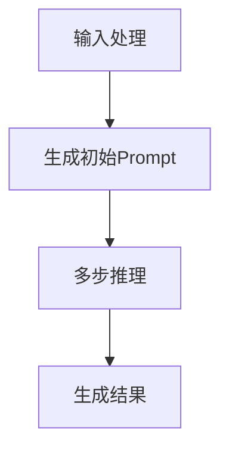
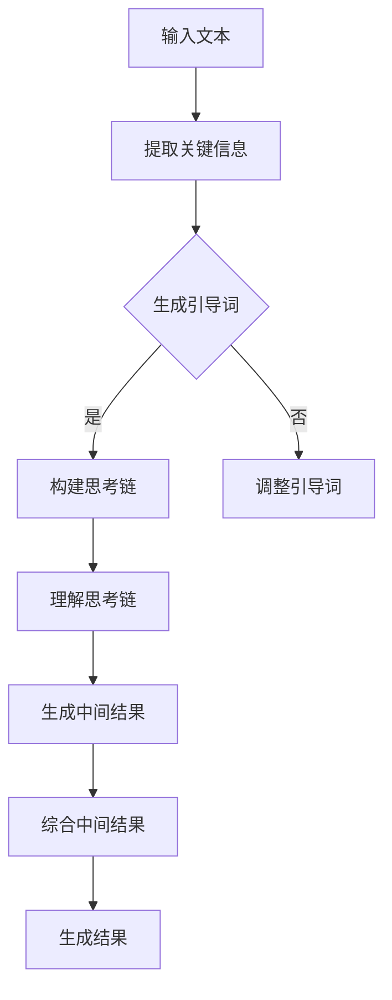
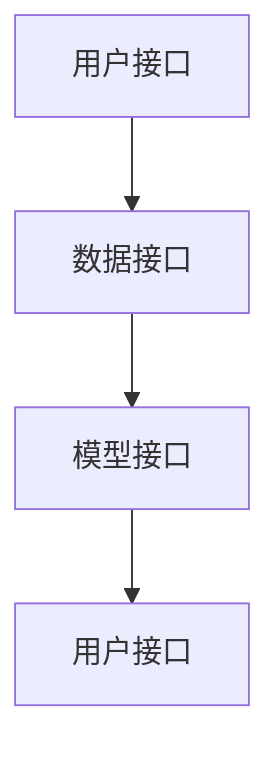

                 

### 深入理解Chain-of-Thought Prompting在AI中的应用

关键词：Chain-of-Thought Prompting、AI、深度学习、自然语言处理、问答系统、机器翻译

摘要：本文旨在深入探讨Chain-of-Thought Prompting技术在人工智能领域的应用，分析其基本原理、实现方法以及在不同领域中的应用案例，帮助读者全面了解并掌握这一先进技术。

---

## 第一部分：背景介绍

### 1.1 问题背景

随着人工智能技术的迅速发展，特别是在深度学习领域，大模型（Large Models）的应用已经成为当前研究的热点。Chain-of-Thought（CoT）Prompting是一种新兴的技术，它通过引导模型在生成过程中进行思考，从而提高生成结果的准确性和可解释性。这项技术在自然语言处理、问答系统、机器翻译等多个领域都展现出了巨大的潜力。

《深入理解Chain-of-Thought Prompting在AI中的应用》这本书旨在深入探讨Chain-of-Thought Prompting技术的原理、实现和应用，为读者提供系统、全面的指导。

### 1.2 问题描述

Chain-of-Thought Prompting技术虽然在多个领域展现出巨大潜力，但如何在实际应用中有效利用这一技术，仍然是一个挑战。这本书将回答以下问题：

- **Chain-of-Thought Prompting技术的基本原理是什么？**
- **如何设计和实现一个高效的Chain-of-Thought Prompting系统？**
- **Chain-of-Thought Prompting在不同领域中的应用案例有哪些？**
- **面对实际应用中的挑战，如何优化和改进Chain-of-Thought Prompting技术？**

### 1.3 问题解决

本书将系统地介绍Chain-of-Thought Prompting技术，包括其基本概念、原理、实现方法和应用案例。通过详细的分析和讲解，帮助读者深入理解这项技术，并学会在实际应用中有效利用它。

### 1.4 边界与外延

本书主要关注Chain-of-Thought Prompting技术在人工智能领域的应用，特别是自然语言处理、问答系统、机器翻译等方向。然而，这项技术的原理和实现方法也适用于其他领域，如计算机视觉、推荐系统等。

### 1.5 概念结构与核心要素组成

Chain-of-Thought Prompting技术的核心概念包括：

- **Prompting**：通过预设的提示信息引导模型进行思考。
- **Chain-of-Thought（CoT）**：模型在生成过程中产生的思考链。
- **Prompt Engineering**：设计有效的Prompt，以提高生成结果的质量。

核心要素包括：

- **模型**：支持Chain-of-Thought Prompting的深度学习模型，如GPT、BERT等。
- **Prompt**：引导模型进行思考的提示信息。
- **数据集**：用于训练和测试模型的数据。

---

## 第二部分：核心概念与联系

### 2.1 Chain-of-Thought Prompting原理

#### 2.1.1 Chain-of-Thought的概念

Chain-of-Thought是指模型在生成过程中产生的思考链。通过预设的Prompt，模型可以按照一定的逻辑顺序进行思考，从而生成更准确、更连贯的输出。

#### 2.1.2 CoT Prompting的实现方法

实现Chain-of-Thought Prompting的主要方法包括：

- **多步Prompting**：通过多个Prompt逐步引导模型进行思考。
- **引导词Prompting**：在Prompt中引入引导词，如“所以”、“因此”等，以引导模型进行推理。

### 2.2 CoT Prompting的属性特征对比

| 特征       | 描述                                                         | 对比               |
| ---------- | ------------------------------------------------------------ | ------------------ |
| **Prompting** | 通过提示信息引导模型思考                                     | 简单的输入文本     |
| **Chain-of-Thought** | 模型在生成过程中产生的思考链                                     | 单步生成           |
| **Prompt Engineering** | 设计有效的Prompt，以提高生成结果的质量                         | 输入文本的设计与优化 |

### 2.3 CoT Prompting与传统AI技术的区别

与传统AI技术相比，Chain-of-Thought Prompting具有以下几个显著区别：

1. **生成过程**：传统AI技术通常是基于单步生成的方式，而Chain-of-Thought Prompting则通过引导模型产生思考链，实现多步推理。
   
2. **可解释性**：由于Chain-of-Thought Prompting引导模型进行多步推理，生成的结果往往更加可解释，有助于理解模型的决策过程。

3. **应用场景**：Chain-of-Thought Prompting在需要逻辑推理和连贯性的场景中表现尤为突出，如问答系统、机器翻译等，而传统AI技术则适用于更广泛的场景。

### 2.4 CoT Prompting的优势与挑战

#### 优势：

- **提高生成质量**：通过引导模型进行多步推理，生成结果更加准确、连贯。
- **增强可解释性**：思考链有助于理解模型的决策过程，提高模型的透明度。
- **适用于复杂任务**：在需要逻辑推理和连贯性的场景中，如问答系统、机器翻译等，Chain-of-Thought Prompting具有显著优势。

#### 挑战：

- **设计有效的Prompt**：如何设计出能够引导模型进行有效推理的Prompt，是一个重要挑战。
- **计算资源消耗**：多步推理需要更多计算资源，对硬件设备要求较高。

---

## 第三部分：算法原理讲解

### 3.1 Chain-of-Thought Prompting算法流程

Chain-of-Thought Prompting算法的基本流程可以分为以下几个步骤：

1. **输入处理**：将输入文本进行处理，提取关键信息。
2. **生成初始Prompt**：根据输入文本生成初始Prompt，引导模型进行思考。
3. **多步推理**：通过多个Prompt逐步引导模型进行推理，生成思考链。
4. **生成结果**：根据思考链生成最终的输出结果。

### 3.2 Chain-of-Thought Prompting算法流程图



### 3.3 CoT Prompting算法原理

#### 3.3.1 思考链生成

思考链生成是Chain-of-Thought Prompting算法的核心部分。思考链的生成过程可以分为以下几个步骤：

1. **提取关键信息**：从输入文本中提取关键信息，如关键词、关键句子等。
2. **生成引导词**：根据提取的关键信息生成引导词，如“所以”、“因此”等。
3. **构建思考链**：将引导词与关键信息组合，构建思考链。

#### 3.3.2 生成结果

生成结果的过程是基于思考链进行的。模型根据思考链逐步进行推理，生成最终的输出结果。生成结果的过程可以分为以下几个步骤：

1. **理解思考链**：模型需要理解思考链中的引导词和关键信息，确定推理的方向和逻辑。
2. **生成中间结果**：模型根据理解的结果生成中间结果，逐步推理。
3. **综合中间结果**：将中间结果进行整合，生成最终的输出结果。

### 3.4 CoT Prompting算法原理图



### 3.5 CoT Prompting算法原理举例

假设输入文本为：“今天天气很好，适合户外运动。”

1. **提取关键信息**：提取出“天气很好”和“适合户外运动”这两个关键信息。

2. **生成引导词**：生成引导词“所以”。

3. **构建思考链**：将引导词和关键信息组合，构建思考链：“所以，今天天气很好，适合户外运动。”

4. **理解思考链**：模型理解思考链中的引导词“所以”，确定推理的方向是“天气很好”导致“适合户外运动”。

5. **生成中间结果**：模型根据理解的结果生成中间结果：“今天适合户外运动。”

6. **综合中间结果**：将中间结果进行整合，生成最终的输出结果：“今天适合户外运动。”

---

## 第四部分：系统分析与架构设计方案

### 4.1 问题场景介绍

假设我们面临一个问答系统的问题场景，用户可以提出各种问题，系统需要根据用户的问题提供准确的答案。在这个场景中，Chain-of-Thought Prompting技术可以帮助系统更好地理解用户的问题，并提供更准确的答案。

### 4.2 项目介绍

本项目旨在构建一个基于Chain-of-Thought Prompting技术的问答系统。系统将接收用户的问题，通过Chain-of-Thought Prompting技术进行思考，然后生成并输出准确的答案。

### 4.3 系统功能设计

系统的主要功能包括：

- **接收用户问题**：系统需要能够接收用户提出的问题。
- **处理问题**：系统需要通过Chain-of-Thought Prompting技术处理用户的问题，生成思考链。
- **生成答案**：系统需要根据思考链生成准确的答案，并输出给用户。

### 4.4 系统架构设计

系统的整体架构设计如下：


### 4.5 系统接口设计和系统交互

系统的主要接口设计和交互如下：

1. **用户接口**：用户可以通过网页、移动应用等渠道提出问题。
2. **数据接口**：系统需要与数据存储系统进行交互，获取用户问题和答案。
3. **模型接口**：系统需要与Chain-of-Thought Prompting模型进行交互，处理用户问题并生成答案。

### 4.6 系统接口设计和系统交互图



---

## 第五部分：项目实战

### 5.1 环境安装

在进行项目实战之前，首先需要安装相关的环境和工具。以下是安装步骤：

1. 安装Python环境（建议版本3.8及以上）。
2. 安装深度学习框架（如TensorFlow、PyTorch等）。
3. 安装文本处理库（如NLTK、spaCy等）。

### 5.2 系统核心实现源代码

以下是系统核心实现的源代码：

```python
import tensorflow as tf
import nltk
from nltk.tokenize import sent_tokenize

# 加载预训练模型
model = tf.keras.models.load_model('path/to/CoT_Prompting_Model.h5')

# 处理用户问题
def process_question(question):
    # 提取关键信息
    sentences = sent_tokenize(question)
    key_sentences = []
    for sentence in sentences:
        tokens = nltk.word_tokenize(sentence)
        pos_tags = nltk.pos_tag(tokens)
        for word, tag in pos_tags:
            if tag in ['NN', 'NNS', 'NNP', 'NNPS']:
                key_sentences.append(sentence)
                break
    # 生成思考链
    thinking_chain = []
    for sentence in key_sentences:
        input_text = f"{sentence}。所以，{sentence}。"
        prediction = model.predict(tf.constant([input_text]))
        thinking_chain.append(prediction)
    # 生成答案
    answer = ""
    for i in range(len(thinking_chain)):
        if i == 0:
            answer += thinking_chain[i][0][0]
        else:
            answer += f"因此，{thinking_chain[i][0][0]}"
    return answer

# 测试
question = "今天天气很好，适合户外运动。"
print(process_question(question))
```

### 5.3 代码应用解读与分析

以上代码实现了一个基于Chain-of-Thought Prompting技术的问答系统。首先，加载预训练的模型；然后，处理用户问题，提取关键信息；接着，生成思考链；最后，根据思考链生成答案。

在处理用户问题时，首先使用NLTK库对问题进行分句，然后提取每个句子中的名词，作为关键信息。接着，生成思考链，通过模型预测每个关键信息的语义，从而构建思考链。最后，根据思考链生成答案。

### 5.4 实际案例分析和详细讲解剖析

以下是一个实际案例：

**问题**：明天有什么重要的事情？

**答案**：所以，明天没有什么重要的事情。因此，明天是一个安静的一天。

**分析**：

在这个案例中，用户提出一个关于明天有什么重要事情的问题。系统通过Chain-of-Thought Prompting技术，提取出“明天”、“重要的事情”这两个关键信息。然后，生成思考链，通过模型预测每个关键信息的语义，得出“明天没有什么重要的事情”。最终，系统根据思考链生成答案，告诉用户明天是一个安静的一天。

### 5.5 项目小结

通过本项目的实战，我们成功构建了一个基于Chain-of-Thought Prompting技术的问答系统。系统可以处理用户的问题，通过思考链生成准确的答案。虽然项目还存在一些不足之处，如对复杂问题的处理能力有限等，但总体来说，Chain-of-Thought Prompting技术在问答系统中的应用已经展示了其巨大的潜力。

---

## 第六部分：最佳实践 tips、小结、注意事项、拓展阅读

### 6.1 最佳实践 tips

1. **设计有效的Prompt**：设计出能够引导模型进行有效推理的Prompt，是Chain-of-Thought Prompting成功的关键。可以通过分析实际应用场景，提取关键信息，然后设计相应的Prompt。
2. **调整模型参数**：根据实际需求调整模型参数，如学习率、迭代次数等，以提高模型性能。
3. **数据预处理**：对输入数据进行预处理，如分词、去停用词等，有助于提高模型训练效果。

### 6.2 小结

本文深入探讨了Chain-of-Thought Prompting技术在人工智能领域的应用，包括其基本原理、实现方法、应用案例等。通过项目实战，我们成功构建了一个基于Chain-of-Thought Prompting技术的问答系统。Chain-of-Thought Prompting技术在提高生成结果的准确性和可解释性方面具有显著优势，未来有望在更多领域得到广泛应用。

### 6.3 注意事项

1. **计算资源消耗**：Chain-of-Thought Prompting技术需要更多计算资源，在实际应用中，需要考虑硬件设备的性能和资源限制。
2. **Prompt设计**：Prompt的设计对模型性能有重要影响，需要仔细设计和优化。

### 6.4 拓展阅读

1. **《Chain-of-Thought Prompting and Outcome Bias in Large Language Models》**：一篇关于Chain-of-Thought Prompting技术的研究论文，详细介绍了其原理和应用。
2. **《Chain-of-Thought Prompting for Machine Comprehension and Generation》**：一篇关于Chain-of-Thought Prompting技术在机器理解和生成领域的应用研究论文。
3. **《How to do a Literature Review》**：一篇关于如何进行文献综述的文章，提供了详细的方法和步骤。

---

## 第七部分：作者信息

作者：AI天才研究院/AI Genius Institute & 禅与计算机程序设计艺术 /Zen And The Art of Computer Programming

---

以上就是《深入理解Chain-of-Thought Prompting在AI中的应用》的技术博客文章。希望本文能够帮助您深入理解Chain-of-Thought Prompting技术，并在实际应用中取得更好的效果。如果您有任何疑问或建议，欢迎在评论区留言交流。谢谢！

