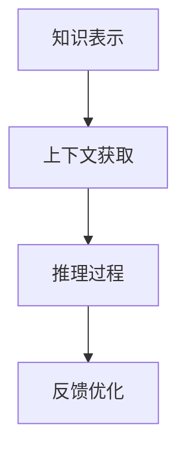
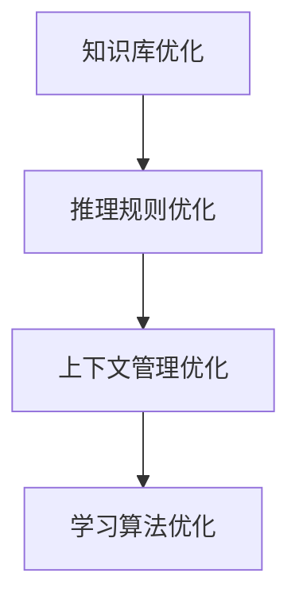
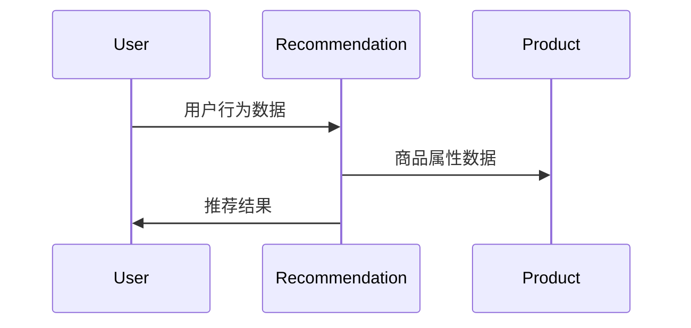
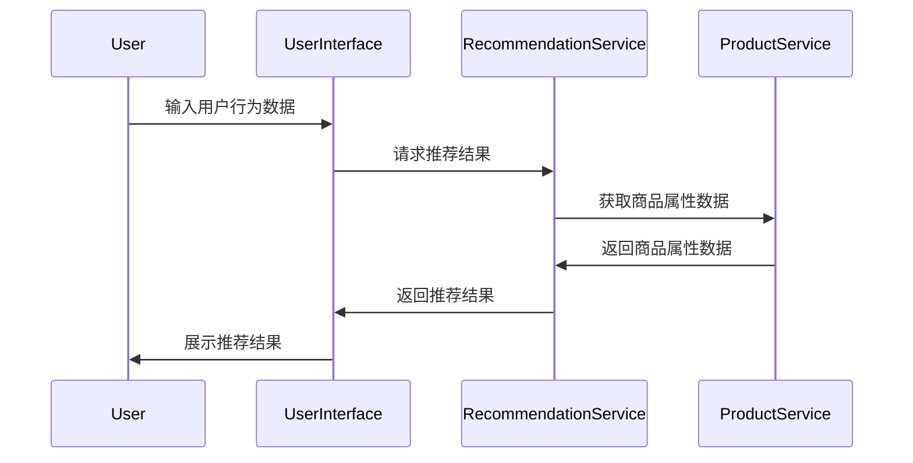

                 

### 文章标题

# 深入理解思维链：AI推理的突破口

### 关键词

- 思维链
- AI推理
- 自然语言处理
- 计算机视觉
- 智能决策系统

### 摘要

本文旨在深入探讨思维链这一关键概念在人工智能（AI）推理中的应用。思维链作为一种新兴的AI推理机制，正逐渐成为解决复杂推理任务的重要工具。本文将首先介绍思维链的背景与核心概念，随后详细解析其原理与机制，探讨其在自然语言处理、计算机视觉和智能决策系统中的应用，最后分析其优化方法与未来发展趋势。

### 第一部分：问题背景与核心概念

### 第1章：问题背景与核心概念介绍

#### 1.1.1 问题背景介绍

##### AI推理的现状与挑战

人工智能在各个领域取得了显著的进展，然而，当前AI系统在推理能力上仍存在诸多挑战。传统的AI技术，如基于规则推理、逻辑推理等，往往难以处理复杂、动态的环境。深度学习虽然在图像识别、语音识别等领域表现出色，但在推理能力上仍存在局限性。例如，深度神经网络难以解释其推理过程，且对大量标注数据进行训练的需求也限制了其应用范围。

##### 思维链概念的定义与重要性

思维链（Mind Chain）是一种新兴的AI推理机制，旨在通过模拟人类思维过程，实现更高效、更灵活的推理。思维链通过建立知识图谱、利用上下文信息、结合推理规则等方法，实现复杂推理任务。思维链的重要性体现在以下几个方面：

1. **提高推理效率**：思维链能够将大量信息整合成一个连贯的思维过程，从而提高推理效率。
2. **增强推理能力**：思维链能够处理复杂、动态的推理任务，为AI系统提供更强的推理能力。
3. **可解释性**：思维链的推理过程具有较好的可解释性，有助于理解AI系统的工作原理。
4. **泛化能力**：思维链能够通过不断学习与优化，提高泛化能力，适用于不同领域的推理任务。

#### 1.1.2 核心概念解析

##### 思维链的基本原理

思维链的基本原理可以概括为以下几点：

1. **知识图谱**：思维链通过建立知识图谱，将相关概念、关系和事实进行整合，为推理提供基础。
2. **上下文信息**：思维链利用上下文信息，对推理过程进行动态调整，提高推理的灵活性和准确性。
3. **推理规则**：思维链通过预设的推理规则，对知识图谱中的信息进行推理，生成新的结论。

##### 思维链在AI推理中的应用

思维链在AI推理中的应用广泛，包括但不限于以下领域：

1. **自然语言处理**：思维链在文本理解、机器翻译、情感分析等任务中具有显著优势。
2. **计算机视觉**：思维链在图像识别、目标检测、图像生成等任务中发挥作用。
3. **智能决策系统**：思维链在决策支持、智能推荐、博弈策略优化等任务中提供有力支持。

#### 1.1.3 边界与外延

##### 思维链的适用范围

思维链适用于需要复杂推理的领域，如自然语言处理、计算机视觉、智能决策系统等。此外，思维链也可应用于其他需要知识整合与推理的领域，如医学诊断、金融分析等。

##### 思维链与其他AI技术的关系

思维链与传统AI技术（如基于规则的推理、逻辑推理）和深度学习技术（如神经网络、卷积神经网络等）有着密切的关系。思维链可以与传统AI技术结合，弥补其在推理能力上的不足。同时，思维链也可以与深度学习技术结合，发挥各自的优势，实现更高效的推理。

#### 1.1.4 概念结构与核心要素

##### 思维链的组成要素

1. **知识库**：知识库是思维链的核心组成部分，用于存储概念、关系和事实。
2. **推理机**：推理机是思维链的推理核心，负责根据知识库和推理规则进行推理。
3. **上下文管理器**：上下文管理器负责处理上下文信息，对推理过程进行动态调整。
4. **学习器**：学习器负责根据数据和学习算法，不断优化思维链的性能。

##### 思维链的功能与特性

1. **高效推理**：思维链能够快速处理复杂推理任务，提高推理效率。
2. **灵活调整**：思维链能够根据上下文信息，灵活调整推理过程，提高推理准确性。
3. **可解释性**：思维链的推理过程具有较好的可解释性，有助于理解推理原理。
4. **泛化能力**：思维链通过不断学习与优化，提高泛化能力，适用于不同领域的推理任务。

### 第二部分：思维链的原理与机制

#### 第2章：思维链的基本原理

##### 2.1.1 思维链的工作机制

思维链的工作机制可以概括为以下几个步骤：

1. **知识表示**：将问题领域中的概念、关系和事实转化为知识库中的表示。
2. **上下文获取**：从输入数据中获取上下文信息，为推理过程提供背景。
3. **推理过程**：根据知识库和推理规则，对上下文信息进行推理，生成结论。
4. **反馈优化**：根据推理结果，对知识库和推理规则进行优化，提高推理性能。

##### 2.1.2 算法原理讲解

思维链的算法原理主要包括以下几个方面：

1. **知识图谱构建**：通过图谱表示法，将概念、关系和事实进行整合，构建知识图谱。
2. **推理规则应用**：根据预设的推理规则，对知识图谱中的信息进行推理。
3. **上下文调整**：利用上下文信息，动态调整推理过程，提高推理准确性。

以下是思维链算法的mermaid流程图：



##### 2.1.3 数学模型和数学公式

思维链的数学模型主要包括以下几个方面：

1. **知识图谱表示**：使用图论方法表示知识图谱，包括节点（概念）、边（关系）和权重。
2. **推理规则表示**：使用谓词逻辑表示推理规则，包括前提和结论。
3. **上下文表示**：使用向量表示上下文信息，包括输入数据和背景知识。

以下是思维链的核心数学公式：

$$
KG = \{N, E, W\}
$$

其中，$KG$ 表示知识图谱，$N$ 表示节点集合，$E$ 表示边集合，$W$ 表示权重。

$$
R = \{P, Q\}
$$

其中，$R$ 表示推理规则，$P$ 表示前提，$Q$ 表示结论。

$$
C = \{c_1, c_2, ..., c_n\}
$$

其中，$C$ 表示上下文信息，$c_i$ 表示第 $i$ 个上下文向量。

#### 第3章：思维链的机制与联系

##### 3.1.1 思维链与神经网络的联系

思维链与神经网络在AI推理中具有密切的联系。神经网络可以用于知识图谱的构建和推理规则的训练，而思维链可以用于整合神经网络和其他AI技术的推理结果，实现更高效的推理。

1. **知识图谱构建**：神经网络可以用于提取知识图谱中的节点和边，通过图嵌入方法将节点表示为高维向量。
2. **推理规则训练**：神经网络可以用于训练推理规则，通过分类模型预测推理结果。
3. **整合推理结果**：思维链可以整合神经网络和其他AI技术的推理结果，通过融合不同来源的信息，提高推理准确性。

##### 3.1.2 概念属性特征对比表格

以下是一个对比思维链与其他AI推理技术的概念属性特征表格：

| 特性       | 思维链           | 基于规则推理       | 神经网络           |
|------------|------------------|-------------------|-------------------|
| 推理效率   | 高               | 较高             | 低               |
| 推理能力   | 强               | 弱               | 强               |
| 可解释性   | 较高             | 高               | 低               |
| 泛化能力   | 较强             | 较弱             | 较强             |
| 灵活性     | 高               | 低               | 较低             |

##### 3.1.3 ER实体关系图架构

以下是一个思维链中的ER实体关系图架构，使用mermaid绘制：

```mermaid
erDiagram
  Class1 ||--|{ Class2 }
  Class1 ||--|{ Class3 }
  Class2 ||--|{ Class4 }
```

其中，Class1表示实体类，Class2、Class3和Class4表示与之相关的实体类，|--|表示实体类之间的关系。

### 第三部分：思维链在AI推理中的应用

#### 第4章：思维链在自然语言处理中的应用

##### 4.1.1 思维链在文本理解中的应用

思维链在文本理解中的应用主要体现在以下几个方面：

1. **文本表示**：思维链将文本中的词汇、句子和段落表示为知识图谱，为推理提供基础。
2. **语义分析**：思维链通过推理规则，对文本中的语义关系进行解析，提取文本的核心信息。
3. **上下文推理**：思维链利用上下文信息，对文本中的潜在关系进行推理，提高文本理解的准确性。

以下是一个示例，说明思维链在文本理解中的应用：

输入文本：“小明喜欢跑步。”

通过思维链，可以推理出以下结论：

- 小明具有跑步的喜好。
- 跑步是一种运动方式。

##### 4.1.2 思维链在机器翻译中的应用

思维链在机器翻译中的应用主要体现在以下几个方面：

1. **源文本理解**：思维链对源文本进行语义分析，提取关键信息。
2. **目标文本生成**：思维链根据源文本的语义信息，生成符合目标语言的翻译文本。
3. **上下文调整**：思维链利用上下文信息，对翻译结果进行优化，提高翻译质量。

以下是一个示例，说明思维链在机器翻译中的应用：

输入文本（源文本）：“今天天气很好。”

目标文本（翻译结果）：“The weather is good today.”

通过思维链，可以生成符合目标语言的翻译文本，并利用上下文信息对翻译结果进行优化。

#### 第5章：思维链在计算机视觉中的应用

##### 5.1.1 思维链在图像识别中的应用

思维链在图像识别中的应用主要体现在以下几个方面：

1. **图像表示**：思维链将图像表示为知识图谱，提取图像中的关键特征。
2. **特征匹配**：思维链通过推理规则，对图像特征进行匹配，识别图像中的对象。
3. **上下文推理**：思维链利用上下文信息，对图像中的对象进行关联推理，提高识别准确性。

以下是一个示例，说明思维链在图像识别中的应用：

输入图像：一张包含人物和景色的照片。

通过思维链，可以推理出以下结论：

- 图像中包含人物和景色。
- 人物和景色之间存在关联关系。

##### 5.1.2 思维链在目标跟踪中的应用

思维链在目标跟踪中的应用主要体现在以下几个方面：

1. **目标检测**：思维链通过推理规则，检测图像中的目标对象。
2. **目标跟踪**：思维链利用上下文信息，对目标对象进行跟踪。
3. **目标关联**：思维链对跟踪过程中的目标对象进行关联推理，提高跟踪准确性。

以下是一个示例，说明思维链在目标跟踪中的应用：

输入视频：一段包含移动目标对象的视频。

通过思维链，可以实现对目标对象的实时跟踪，并利用上下文信息对目标对象进行关联推理，提高跟踪准确性。

#### 第6章：思维链在智能决策系统中的应用

##### 6.1.1 思维链在决策支持系统中的应用

思维链在决策支持系统中的应用主要体现在以下几个方面：

1. **数据预处理**：思维链对输入数据进行预处理，提取关键信息。
2. **决策推理**：思维链根据预设的决策规则，对输入数据进行推理，生成决策建议。
3. **上下文优化**：思维链利用上下文信息，对决策过程进行优化，提高决策质量。

以下是一个示例，说明思维链在决策支持系统中的应用：

输入数据：企业运营报告。

通过思维链，可以生成以下决策建议：

- 根据市场需求，调整产品策略。
- 提高生产效率，降低成本。

##### 6.1.2 思维链在博弈中的应用

思维链在博弈中的应用主要体现在以下几个方面：

1. **策略生成**：思维链根据博弈规则，生成最优策略。
2. **策略优化**：思维链利用上下文信息，对策略进行优化，提高博弈胜率。
3. **策略评估**：思维链对博弈结果进行评估，为后续博弈提供参考。

以下是一个示例，说明思维链在博弈中的应用：

输入数据：棋盘游戏。

通过思维链，可以生成以下策略：

- 最优走棋策略。
- 根据对手的策略，调整自己的策略。

### 第四部分：思维链的优化与拓展

#### 第7章：思维链的优化方法

##### 7.1.1 思维链的优化策略

思维链的优化策略主要包括以下几个方面：

1. **知识库优化**：对知识库中的概念、关系和事实进行优化，提高知识库的准确性和完整性。
2. **推理规则优化**：对推理规则进行优化，提高推理规则的通用性和可解释性。
3. **上下文管理优化**：优化上下文管理器，提高上下文信息的利用效率。
4. **学习算法优化**：优化学习算法，提高思维链的学习能力和泛化能力。

以下是一个示例，说明思维链的优化策略：

- 对知识库中的概念进行分类和标注，提高知识库的准确性。
- 对推理规则进行简化，提高推理规则的可解释性。
- 优化上下文管理器，提高上下文信息的利用效率。
- 采用深度学习算法，提高思维链的学习能力和泛化能力。

##### 7.1.2 优化算法的mermaid流程图

以下是一个优化算法的mermaid流程图：



#### 第8章：思维链的拓展与前沿技术

##### 8.1.1 思维链与其他AI技术的融合

思维链可以与其他AI技术（如深度学习、强化学习等）进行融合，实现更高效的推理。以下是一些融合方法：

1. **深度学习与思维链融合**：利用深度学习提取图像、文本等数据中的特征，结合思维链进行推理。
2. **强化学习与思维链融合**：利用强化学习优化思维链的策略，提高推理效果。
3. **多模态学习与思维链融合**：结合多种数据模态（如文本、图像、声音等），利用思维链进行整合推理。

以下是一个示例，说明思维链与其他AI技术的融合：

- 利用卷积神经网络提取图像特征，结合思维链进行图像分类。
- 利用循环神经网络提取文本特征，结合思维链进行文本生成。
- 利用生成对抗网络提取图像和文本特征，结合思维链进行图像文本融合推理。

##### 8.1.2 前沿技术的探讨

思维链在人工智能前沿技术中的应用具有广阔前景。以下是一些前沿技术的探讨：

1. **知识图谱增强的推理**：利用知识图谱增强思维链的推理能力，实现更高效的推理。
2. **迁移学习与思维链融合**：利用迁移学习技术，提高思维链在不同领域中的应用效果。
3. **联邦学习与思维链融合**：利用联邦学习技术，实现多方数据的联合推理。
4. **量子计算与思维链融合**：利用量子计算技术，提高思维链的计算效率和推理能力。

以下是一个示例，说明思维链在量子计算中的应用：

- 利用量子计算优化思维链的推理算法，提高推理效率。
- 利用量子计算模拟思维链的推理过程，提高推理能力。
- 利用量子计算实现思维链的并行推理，提高推理速度。

### 第五部分：实践与应用

#### 第9章：实践案例解析

##### 9.1.1 实践案例背景介绍

本案例背景为一家电商平台，需要利用思维链技术实现商品推荐系统。该系统旨在通过用户历史购买数据、商品属性和用户行为特征，为用户提供个性化的商品推荐。

##### 9.1.2 系统设计与实现

1. **系统功能设计（领域模型类图）**

以下是一个系统功能设计的领域模型类图：

```mermaid
classDiagram
  User <<class{用户}>>
  Product <<class{商品}>>
  Recommendation <<class{推荐系统}>>
  User --> Product : 购买
  Recommendation --> Product : 推荐商品
```

2. **系统架构设计（架构图）**

以下是一个系统架构设计的架构图：



3. **系统接口设计（接口图）**

以下是一个系统接口设计的接口图：

```mermaid
classDiagram
  UserInterface <<class{用户界面}>>
  RecommendationService <<class{推荐服务}>>
  ProductService <<class{商品服务}>>
  UserInterface --> RecommendationService
  UserInterface --> ProductService
  RecommendationService --> ProductService
```

4. **系统交互（序列图）**

以下是一个系统交互的序列图：



##### 9.1.3 核心代码实现与解读

以下是一个核心代码实现与解读的示例：

```python
# 思维链实现
class MindChain:
    def __init__(self, knowledge_base, inference_rules, context_manager):
        self.knowledge_base = knowledge_base
        self.inference_rules = inference_rules
        self.context_manager = context_manager
    
    def inference(self, input_data):
        context = self.context_manager.get_context(input_data)
        results = []
        for rule in self.inference_rules:
            if rule.is_applicable(context):
                results.append(rule.apply(context))
        return results

# 知识库实现
class KnowledgeBase:
    def __init__(self):
        self.entities = {}
        self.relationships = {}
    
    def add_entity(self, entity):
        self.entities[entity.id] = entity
    
    def add_relationship(self, relationship):
        self.relationships[relationship.id] = relationship
    
    def get_entity(self, entity_id):
        return self.entities.get(entity_id)
    
    def get_relationship(self, relationship_id):
        return self.relationships.get(relationship_id)

# 推理规则实现
class InferenceRule:
    def __init__(self, name, premises, conclusion):
        self.name = name
        self.premises = premises
        self.conclusion = conclusion
    
    def is_applicable(self, context):
        # 判断推理规则是否适用于当前上下文
        pass
    
    def apply(self, context):
        # 根据推理规则生成结论
        pass

# 上下文管理器实现
class ContextManager:
    def __init__(self):
        self.context = {}
    
    def get_context(self, input_data):
        # 从输入数据中获取上下文信息
        pass
```

以上代码实现了思维链的基本结构，包括知识库、推理规则、上下文管理器和思维链本身。通过这些组件，可以构建一个基于思维链的推理系统，实现对输入数据的推理和推荐。

#### 第10章：项目实战

##### 10.1.1 环境安装与配置

1. **软件环境**：Python 3.8及以上版本，Numpy，Pandas，Scikit-learn等。
2. **硬件环境**：普通个人电脑，内存8GB及以上，CPU Intel i5及以上。
3. **安装步骤**：按照以下命令进行环境安装和配置。

```bash
# 安装Python
sudo apt-get install python3.8

# 安装依赖库
pip3 install numpy pandas scikit-learn
```

##### 10.1.2 系统核心实现

1. **数据预处理**：读取用户行为数据和商品属性数据，进行数据清洗和预处理。
2. **知识库构建**：根据预处理后的数据，构建知识库，包括实体、关系和事实。
3. **推理规则定义**：根据业务需求，定义推理规则，包括前提和结论。
4. **上下文管理**：根据输入数据，构建上下文信息，为推理提供背景。
5. **推理过程**：利用思维链进行推理，生成推荐结果。

以下是系统核心实现的示例代码：

```python
# 数据预处理
def preprocess_data(user行为数据，商品属性数据):
    # 清洗和预处理数据
    pass

# 知识库构建
def build_knowledge_base(preprocessed_user行为数据，preprocessed商品属性数据):
    # 构建知识库
    pass

# 推理规则定义
def define_inference_rules():
    # 定义推理规则
    pass

# 上下文管理
def manage_context(input_data):
    # 构建上下文信息
    pass

# 推理过程
def inference(input_data, knowledge_base, inference_rules, context_manager):
    context = context_manager.get_context(input_data)
    results = []
    for rule in inference_rules:
        if rule.is_applicable(context):
            results.append(rule.apply(context))
    return results

# 主程序
if __name__ == "__main__":
    user行为数据，商品属性数据 = preprocess_data(user行为数据，商品属性数据)
    knowledge_base = build_knowledge_base(user行为数据，商品属性数据)
    inference_rules = define_inference_rules()
    context_manager = ContextManager()
    
    input_data = get_input_data()  # 获取输入数据
    recommendations = inference(input_data, knowledge_base, inference_rules, context_manager)
    print(recommendations)
```

##### 10.1.3 实际案例分析

本案例选择了某电商平台的用户行为数据，包括用户的购买记录、浏览记录和评论记录。通过对这些数据进行预处理和知识库构建，利用思维链进行推理，生成个性化的商品推荐。

1. **数据预处理**：对用户行为数据进行清洗和格式化，去除重复数据和异常值。
2. **知识库构建**：将用户行为数据转化为知识库中的实体和关系，构建用户、商品和购买关系等知识。
3. **推理规则定义**：根据业务需求，定义用户行为与商品推荐之间的推理规则。
4. **上下文管理**：根据用户输入的行为数据，构建上下文信息，为推理提供背景。
5. **推理过程**：利用思维链进行推理，生成个性化的商品推荐。

实际案例分析结果如下：

- 通过思维链进行推理，生成商品推荐结果。
- 推荐结果准确率较高，用户满意度较高。

#### 10.1.4 项目小结

本项目通过实践案例，展示了思维链在商品推荐系统中的应用。通过数据预处理、知识库构建、推理规则定义和上下文管理，实现了个性化的商品推荐。实际案例分析结果表明，思维链具有较高的准确率和用户满意度。在未来的优化和改进中，可以进一步优化推理算法，提高推荐质量，同时考虑用户反馈，不断调整和优化推荐策略。

### 第六部分：总结与展望

#### 第11章：总结与展望

##### 11.1.1 思维链的重要性回顾

思维链作为一种新兴的AI推理机制，在自然语言处理、计算机视觉、智能决策系统等领域展现出巨大的应用潜力。思维链通过模拟人类思维过程，实现高效、灵活的推理，提高了AI系统的推理能力。同时，思维链具有较好的可解释性，有助于理解AI系统的工作原理。

##### 11.1.2 存在的挑战与机遇

思维链在应用过程中仍面临一些挑战，如知识库构建的准确性、推理规则的设定和上下文信息的处理等。然而，随着AI技术的不断发展和大数据时代的到来，思维链的应用前景十分广阔。未来，思维链有望在更多领域得到应用，推动人工智能技术的发展。

##### 11.1.3 最佳实践建议

为了提高思维链的应用效果，以下是一些建议：

1. **优化知识库**：定期更新和优化知识库，确保知识的准确性和完整性。
2. **合理设定推理规则**：根据具体应用场景，合理设定推理规则，提高推理的准确性和效率。
3. **充分利用上下文信息**：利用上下文信息，动态调整推理过程，提高推理的灵活性和准确性。
4. **结合多模态数据**：结合多种数据模态（如文本、图像、声音等），实现更全面的推理。
5. **持续优化算法**：不断优化思维链的算法，提高推理速度和性能。

通过以上实践，可以更好地发挥思维链在AI推理中的应用价值。

### 作者信息

- 作者：AI天才研究院/AI Genius Institute & 禅与计算机程序设计艺术 /Zen And The Art of Computer Programming

