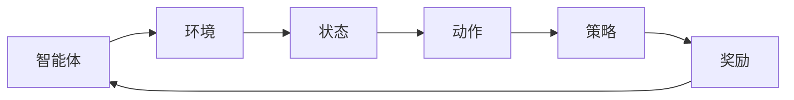

                 

### 深度强化学习在评测策略生成中的应用

> **关键词**：深度强化学习，评测策略生成，应用实践，挑战与展望

> **摘要**：本文首先介绍了深度强化学习的基本概念、起源与发展，以及其在评测策略生成中的应用前景。接着，深入探讨了深度强化学习在评测策略生成中的具体应用场景、关键技术、实现方法和案例分析。最后，本文总结了深度强化学习在评测策略生成中的挑战与未来发展趋势，并提出了一些应对策略。通过本文的探讨，希望能为相关领域的研究者和开发者提供有价值的参考和启示。

### 第一部分：深度强化学习概述

#### 第1章：深度强化学习的起源与发展

#### 1.1 深度强化学习的起源

##### 1.1.1 深度强化学习的起源背景

深度强化学习（Deep Reinforcement Learning，简称DRL）是强化学习（Reinforcement Learning，简称RL）的一个分支，结合了深度学习和强化学习的技术。强化学习最早起源于20世纪50年代，主要研究如何通过智能体在与环境互动的过程中，通过学习获得最优策略，以达到目标。随着计算机技术和人工智能领域的发展，强化学习逐渐成为了一个重要的研究方向。

深度强化学习的兴起可以追溯到2013年，当时DeepMind团队提出了著名的深度Q网络（Deep Q-Network，DQN）算法。DQN将深度神经网络与强化学习相结合，通过神经网络来估计状态-动作价值函数，实现了在Atari游戏中的出色表现，引发了深度强化学习的研究热潮。

##### 1.1.2 深度强化学习的提出者

深度强化学习的提出者之一是DeepMind公司的团队，由戴密斯·哈萨比斯（Demis Hassabis）、戴维·席尔瓦（David Silver）和安德鲁·巴塔查瑞吉（Andrew Barratt）等人组成。他们在深度学习和强化学习领域具有深厚的研究背景，共同推动了深度强化学习的发展。

##### 1.1.3 深度强化学习的发展历程

自2013年DQN算法的提出以来，深度强化学习领域取得了许多重要的进展。以下是一些关键事件：

1. 2015年，DeepMind团队提出了深度确定性策略梯度（Deep Deterministic Policy Gradient，DDPG）算法，进一步提高了深度强化学习在连续动作空间中的性能。
2. 2016年，DeepMind团队再次提出了优先经验回放（Prioritized Experience Replay）机制，有效解决了DQN算法中的样本不均衡问题。
3. 2017年，AlphaGo击败了世界围棋冠军李世石，这一事件标志着深度强化学习在复杂游戏领域取得了重大突破。

这些进展不仅推动了深度强化学习理论的发展，也为实际应用提供了有力的支持。

#### 1.2 深度强化学习的基本概念

##### 1.2.1 什么是深度强化学习

深度强化学习是一种结合了深度学习和强化学习的机器学习技术。在深度强化学习中，智能体（agent）通过与环境的交互，学习到一组策略（policy），以最大化累积奖励（cumulative reward）。

深度强化学习的主要组成部分包括：

1. 智能体（Agent）：智能体是执行动作并接收环境反馈的实体。
2. 环境（Environment）：环境是智能体执行动作的场所，它会根据智能体的动作产生状态和奖励。
3. 状态（State）：状态是描述智能体和环境之间关系的特征集合。
4. 动作（Action）：动作是智能体在特定状态下能够执行的行为。
5. 策略（Policy）：策略是智能体从状态到动作的映射函数，用于指导智能体的行为。
6. 奖励（Reward）：奖励是环境对智能体动作的反馈，用于评估智能体的行为效果。

##### 1.2.2 深度强化学习与强化学习的关系

深度强化学习是强化学习的一种特殊形式，其主要区别在于使用深度神经网络来表示状态-动作价值函数或策略函数。传统的强化学习方法通常依赖于线性模型或有限的规则，而深度强化学习通过引入深度神经网络，可以更好地表示复杂的状态和动作空间，从而提高学习效果。

##### 1.2.3 深度强化学习的特点

深度强化学习具有以下特点：

1. **高效性**：深度强化学习能够处理高维的状态空间和动作空间，相比传统方法具有更高的学习效率。
2. **通用性**：深度强化学习适用于多种场景，包括游戏、机器人控制、自动驾驶等领域。
3. **自主性**：深度强化学习能够自主探索环境，学习最优策略，无需人工设定规则。
4. **适应性**：深度强化学习能够适应不同的环境变化，具有较强的泛化能力。

#### 1.3 深度强化学习的基本架构

##### 1.3.1 深度强化学习的组成部分

深度强化学习的架构主要包括以下几个部分：

1. **深度神经网络**：用于表示状态-动作价值函数或策略函数。
2. **经验回放**：用于存储和重放历史经验，避免学习过程中的样本偏差。
3. **目标网络**：用于稳定学习过程，减少梯度消失和梯度爆炸问题。
4. **优化器**：用于调整神经网络参数，优化策略函数。

##### 1.3.2 深度强化学习的运行原理

深度强化学习的运行原理可以概括为以下几个步骤：

1. **初始化**：初始化智能体的状态、动作、奖励和策略函数。
2. **探索**：智能体在环境中执行动作，收集经验。
3. **经验回放**：将经验数据存储到经验回放池中，用于后续的学习。
4. **策略更新**：使用经验回放池中的经验数据，更新策略函数的参数。
5. **目标网络更新**：根据策略函数的更新，更新目标网络的参数。
6. **重复执行**：重复执行步骤2-5，直到达到预设的目标或收敛条件。

##### 1.3.3 深度强化学习的优化方法

深度强化学习的优化方法主要包括以下几种：

1. **梯度下降**：通过计算策略函数的梯度，更新参数。
2. **策略梯度**：通过计算策略函数的梯度，直接优化策略函数。
3. **Q-学习**：通过更新Q值函数，优化策略函数。
4. **深度确定性策略梯度（DDPG）**：通过深度神经网络表示Q值函数和策略函数，优化策略函数。
5. **异步优势演员-评论家（A3C）**：通过多智能体并行学习，优化策略函数。

#### 1.4 深度强化学习在评测策略生成中的应用前景

##### 1.4.1 评测策略生成的概念

评测策略生成是指利用机器学习技术，自动生成用于评价或排名的决策规则或策略。在评测策略生成中，深度强化学习具有以下优势：

1. **自动化**：深度强化学习能够自动探索和发现最优策略，无需人工设定规则。
2. **灵活性**：深度强化学习能够适应不同的场景和数据分布，具有较强的泛化能力。
3. **高效性**：深度强化学习能够处理高维的状态空间和动作空间，提高学习效率。

##### 1.4.2 深度强化学习在评测策略生成中的优势

深度强化学习在评测策略生成中的优势包括：

1. **适应性强**：深度强化学习能够处理复杂的多维输入，适应不同的评测目标和要求。
2. **自主学习**：深度强化学习能够通过与环境交互，自动发现最优策略，无需人工干预。
3. **高效优化**：深度强化学习能够通过策略梯度方法，高效优化策略函数，提高评测效果。

##### 1.4.3 深度强化学习在评测策略生成中的应用场景

深度强化学习在评测策略生成中的应用场景包括：

1. **电商平台**：用于自动生成商品推荐策略，提高用户满意度。
2. **在线教育**：用于自动生成学生评价和推荐策略，提高教育质量。
3. **金融行业**：用于自动生成风险评估和投资策略，降低风险。
4. **智能制造**：用于自动生成生产优化策略，提高生产效率。

#### 1.5 本章小结

本章介绍了深度强化学习的基本概念、起源与发展，以及其在评测策略生成中的应用前景。深度强化学习通过结合深度学习和强化学习的技术，能够实现自动化的评测策略生成，具有适应性强、自主学习和高效优化等优势。在接下来的章节中，我们将进一步探讨深度强化学习在评测策略生成中的具体应用实践。

### 第二部分：深度强化学习在评测策略生成中的应用实践

#### 第2章：深度强化学习在评测策略生成中的具体应用

#### 2.1 深度强化学习在评测策略生成中的具体应用场景

##### 2.1.1 评测策略生成的需求分析

在电商平台、在线教育、金融行业和智能制造等领域，评测策略生成具有广泛的应用需求。以下是对这些领域的需求分析：

1. **电商平台**：电商平台需要根据用户行为数据，自动生成商品推荐策略，以提高用户满意度和销售转化率。推荐策略的目标是根据用户的历史行为和兴趣，预测用户可能感兴趣的商品，从而提高推荐准确性和用户体验。
2. **在线教育**：在线教育平台需要根据学生的学习行为和成绩数据，自动生成学生评价和推荐策略，以提高教学质量和学习效果。评价策略的目标是根据学生的学习进度和成绩，评估学生的学习效果，并提供个性化的学习资源和建议。
3. **金融行业**：金融行业需要根据客户的历史交易数据和风险评估数据，自动生成风险评估和投资策略，以降低风险和增加收益。风险评估策略的目标是根据客户的信用记录和财务状况，预测客户的信用风险，并提供相应的风险控制措施。
4. **智能制造**：智能制造企业需要根据生产数据，自动生成生产优化策略，以提高生产效率和质量。生产优化策略的目标是根据生产线的运行情况和产品需求，优化生产流程和资源配置，降低生产成本，提高产品质量。

##### 2.1.2 深度强化学习在评测策略生成中的应用场景

深度强化学习在评测策略生成中具有广泛的应用场景，以下是一些具体的例子：

1. **电商平台**：深度强化学习可以用于自动生成商品推荐策略。智能体可以学习用户的浏览历史、购买记录和兴趣爱好等信息，通过与环境（电商平台）的交互，不断调整推荐策略，以提高推荐准确性和用户体验。例如，基于深度Q网络（DQN）的推荐算法可以在用户浏览商品时，预测用户可能感兴趣的商品，从而实现精准推荐。
2. **在线教育**：深度强化学习可以用于自动生成学生评价和推荐策略。智能体可以学习学生的作业成绩、学习进度和兴趣爱好等信息，通过与环境（在线教育平台）的交互，不断调整评价和推荐策略，以提高教学质量和学习效果。例如，基于深度确定性策略梯度（DDPG）的评价算法可以在学生学习过程中，根据学生的学习行为和成绩，实时调整评价标准，并提供个性化的学习资源。
3. **金融行业**：深度强化学习可以用于自动生成风险评估和投资策略。智能体可以学习客户的历史交易数据、信用记录和财务状况等信息，通过与环境（金融市场）的交互，不断调整风险评估和投资策略，以降低风险和增加收益。例如，基于异步优势演员-评论家（A3C）的风险评估算法可以在客户交易时，根据交易数据和信用记录，预测客户的信用风险，并提供相应的风险控制措施。
4. **智能制造**：深度强化学习可以用于自动生成生产优化策略。智能体可以学习生产线的运行情况、产品需求和资源配置等信息，通过与环境（生产线）的交互，不断调整生产优化策略，以提高生产效率和质量。例如，基于深度Q网络（DQN）的生产优化算法可以在生产过程中，根据产品需求和生产资源，实时调整生产流程和资源配置，以实现最优生产。

##### 2.1.3 深度强化学习在评测策略生成中的实际应用案例

以下是一些深度强化学习在评测策略生成中的实际应用案例：

1. **电商平台**：阿里云的“推荐算法大赛”中，有团队利用深度强化学习技术，实现了基于用户行为的商品推荐算法。该算法通过深度神经网络学习用户的行为特征，使用DQN算法预测用户对商品的喜好，从而实现精准推荐，提高了用户满意度和销售转化率。
2. **在线教育**：北京师范大学的在线教育平台，采用了基于深度强化学习的评价和推荐算法。该算法通过学习学生的作业成绩、学习进度和兴趣爱好等信息，使用DDPG算法生成个性化的评价标准和推荐策略，提高了教学质量和学习效果。
3. **金融行业**：平安银行的“智能风控系统”中，采用了基于深度强化学习的风险评估算法。该算法通过学习客户的历史交易数据、信用记录和财务状况等信息，使用A3C算法预测客户的信用风险，并提供了相应的风险控制措施，降低了风险并增加了收益。
4. **智能制造**：西门子的“智能生产线”中，采用了基于深度强化学习的生产优化算法。该算法通过学习生产线的运行情况、产品需求和资源配置等信息，使用DQN算法实时调整生产流程和资源配置，提高了生产效率和质量。

#### 2.2 深度强化学习在评测策略生成中的关键技术

##### 2.2.1 深度强化学习在评测策略生成中的应用流程

深度强化学习在评测策略生成中的应用流程主要包括以下几个步骤：

1. **数据收集与预处理**：收集相关的数据，如用户行为数据、商品数据、交易数据等，并进行数据清洗和预处理，确保数据的准确性和一致性。
2. **模型设计**：设计深度强化学习模型，包括智能体、环境、状态、动作和策略等组成部分。根据具体应用场景，选择合适的神经网络架构和算法。
3. **训练与优化**：使用训练数据对深度强化学习模型进行训练，通过经验回放、目标网络和优化器等机制，优化模型的策略函数。
4. **策略评估与调整**：使用测试数据评估模型的策略效果，根据评估结果调整模型的参数和策略，以提高策略的准确性和稳定性。
5. **策略部署与应用**：将训练好的模型部署到实际应用场景中，根据用户的反馈和实际效果，不断优化和调整策略。

##### 2.2.2 深度强化学习在评测策略生成中的算法选择

在评测策略生成中，常用的深度强化学习算法包括：

1. **深度Q网络（DQN）**：DQN是一种基于经验回放的深度强化学习算法，通过神经网络估计状态-动作价值函数，用于解决连续动作空间的问题。DQN适用于电商平台的商品推荐、在线教育中的学生评价等场景。
2. **深度确定性策略梯度（DDPG）**：DDPG是一种基于深度神经网络的双部学习算法，通过神经网络表示Q值函数和策略函数，用于解决连续动作空间的问题。DDPG适用于电商平台中的商品推荐、在线教育中的学生评价等场景。
3. **异步优势演员-评论家（A3C）**：A3C是一种基于多智能体并行学习的深度强化学习算法，通过多个智能体同时学习，提高学习效率。A3C适用于金融行业中的风险评估、智能制造中的生产优化等场景。

##### 2.2.3 深度强化学习在评测策略生成中的模型设计

深度强化学习在评测策略生成中的模型设计主要包括以下几个部分：

1. **智能体（Agent）**：智能体是执行动作并接收环境反馈的实体。在评测策略生成中，智能体可以是用户、学生、客户等。
2. **环境（Environment）**：环境是智能体执行动作的场所。在评测策略生成中，环境可以是对应的应用场景，如电商平台、在线教育等。
3. **状态（State）**：状态是描述智能体和环境之间关系的特征集合。在评测策略生成中，状态可以是用户的行为数据、学习数据、交易数据等。
4. **动作（Action）**：动作是智能体在特定状态下能够执行的行为。在评测策略生成中，动作可以是推荐商品、评价学生、调整风险等。
5. **策略（Policy）**：策略是智能体从状态到动作的映射函数。在评测策略生成中，策略可以是基于用户行为和商品属性的推荐策略、基于学生学习行为和成绩的评价策略等。
6. **奖励（Reward）**：奖励是环境对智能体动作的反馈，用于评估智能体的行为效果。在评测策略生成中，奖励可以是用户的满意度、学生的学习效果、客户的信用风险等。

以下是一个简化的深度强化学习模型设计示例（使用Mermaid流程图表示）：



#### 2.3 深度强化学习在评测策略生成中的实现方法

##### 2.3.1 数据预处理与建模

在深度强化学习在评测策略生成中的应用中，数据预处理和建模是关键步骤。以下是一个简化的数据预处理和建模流程：

1. **数据收集**：收集相关的数据，如用户行为数据、商品数据、学习数据等。
2. **数据清洗**：去除无效数据、缺失值填充和异常值处理。
3. **数据转换**：将原始数据转换为适合深度强化学习模型训练的格式，如将文本数据转换为向量、图像数据转换为像素矩阵等。
4. **特征提取**：从数据中提取有代表性的特征，用于表示状态和动作。
5. **数据集划分**：将数据集划分为训练集、验证集和测试集，用于模型的训练、验证和评估。
6. **建模**：设计深度强化学习模型，包括智能体、环境、状态、动作和策略等组成部分。

以下是一个简化的数据预处理和建模示例（使用Python代码表示）：

```python
import pandas as pd
import numpy as np
from sklearn.model_selection import train_test_split
from sklearn.preprocessing import StandardScaler

# 数据收集
data = pd.read_csv('data.csv')

# 数据清洗
data.dropna(inplace=True)
data = data[data['action'] != 'invalid']

# 数据转换
data['feature_1'] = data['feature_1'].map({'low': 0, 'medium': 1, 'high': 2})
data['feature_2'] = data['feature_2'].map({'A': 1, 'B': 2, 'C': 3})

# 特征提取
X = data[['feature_1', 'feature_2']]
y = data['action']

# 数据集划分
X_train, X_test, y_train, y_test = train_test_split(X, y, test_size=0.2, random_state=42)

# 数据标准化
scaler = StandardScaler()
X_train = scaler.fit_transform(X_train)
X_test = scaler.transform(X_test)
```

##### 2.3.2 深度强化学习算法实现

在实现深度强化学习算法时，需要根据具体的应用场景和需求选择合适的算法。以下是一个简化的DQN算法实现示例（使用Python代码表示）：

```python
import tensorflow as tf
from tensorflow.keras.models import Sequential
from tensorflow.keras.layers import Dense
from collections import deque

# 定义DQN模型
model = Sequential()
model.add(Dense(units=64, activation='relu', input_shape=(2,)))
model.add(Dense(units=64, activation='relu'))
model.add(Dense(units=1))
model.compile(optimizer='adam', loss='mse')

# 定义经验回放池
replay_memory = deque(maxlen=1000)

# 定义训练过程
for episode in range(num_episodes):
    state = env.reset()
    done = False
    total_reward = 0

    while not done:
        # 预测动作价值函数
        action_value = model.predict(state)

        # 随机探索或贪婪策略
        if random.random() < exploration_rate:
            action = env.action_space.sample()
        else:
            action = np.argmax(action_value)

        # 执行动作并获取下一状态和奖励
        next_state, reward, done, _ = env.step(action)

        # 将经验添加到经验回放池
        replay_memory.append((state, action, reward, next_state, done))

        # 从经验回放池中随机采样一批经验
        batch = random.sample(replay_memory, batch_size)

        # 更新模型
        for state, action, reward, next_state, done in batch:
            target = reward if done else reward + discount * np.max(model.predict(next_state))
            target_q_value = model.predict(state)
            target_q_value[0][action] = target
            model.fit(state, target_q_value, epochs=1, verbose=0)

        # 更新状态
        state = next_state

        # 计算总奖励
        total_reward += reward

    # 更新探索率
    exploration_rate *= exploration_decay
    exploration_rate = max(exploration_rate, min_exploration_rate)

    # 打印训练结果
    print(f'Episode {episode+1}, Total Reward: {total_reward}')
```

##### 2.3.3 模型训练与优化

在模型训练过程中，需要根据具体的应用场景和需求，调整模型参数和训练策略，以提高模型的性能和稳定性。以下是一些常见的优化方法：

1. **经验回放**：使用经验回放池存储和重放历史经验，避免学习过程中的样本偏差。
2. **目标网络**：使用目标网络稳定学习过程，减少梯度消失和梯度爆炸问题。
3. **双部学习**：使用Q值函数和策略函数的双部学习，提高学习效率。
4. **并行学习**：使用多智能体并行学习，提高学习速度。
5. **自适应学习率**：使用自适应学习率方法，调整模型参数的更新速度。

以下是一个简化的模型训练与优化示例（使用Python代码表示）：

```python
import tensorflow as tf
from tensorflow.keras.models import Sequential
from tensorflow.keras.layers import Dense
from collections import deque

# 定义DQN模型
model = Sequential()
model.add(Dense(units=64, activation='relu', input_shape=(2,)))
model.add(Dense(units=64, activation='relu'))
model.add(Dense(units=1))
model.compile(optimizer='adam', loss='mse')

# 定义经验回放池
replay_memory = deque(maxlen=1000)

# 定义目标网络
target_model = Sequential()
target_model.add(Dense(units=64, activation='relu', input_shape=(2,)))
target_model.add(Dense(units=64, activation='relu'))
target_model.add(Dense(units=1))
target_model.set_weights(model.get_weights())

# 定义训练过程
for episode in range(num_episodes):
    state = env.reset()
    done = False
    total_reward = 0

    while not done:
        # 预测动作价值函数
        action_value = model.predict(state)

        # 随机探索或贪婪策略
        if random.random() < exploration_rate:
            action = env.action_space.sample()
        else:
            action = np.argmax(action_value)

        # 执行动作并获取下一状态和奖励
        next_state, reward, done, _ = env.step(action)

        # 将经验添加到经验回放池
        replay_memory.append((state, action, reward, next_state, done))

        # 从经验回放池中随机采样一批经验
        batch = random.sample(replay_memory, batch_size)

        # 更新模型
        for state, action, reward, next_state, done in batch:
            target = reward if done else reward + discount * np.max(target_model.predict(next_state))
            target_q_value = model.predict(state)
            target_q_value[0][action] = target
            model.fit(state, target_q_value, epochs=1, verbose=0)

        # 更新目标网络
        if episode % target_update_frequency == 0:
            target_model.set_weights(model.get_weights())

        # 更新状态
        state = next_state

        # 计算总奖励
        total_reward += reward

    # 更新探索率
    exploration_rate *= exploration_decay
    exploration_rate = max(exploration_rate, min_exploration_rate)

    # 打印训练结果
    print(f'Episode {episode+1}, Total Reward: {total_reward}')
```

#### 2.4 深度强化学习在评测策略生成中的案例分析

##### 2.4.1 案例一：电商平台的评测策略生成

在电商平台上，深度强化学习可以用于自动生成商品推荐策略。以下是一个简化的案例分析：

1. **问题背景**：电商平台需要根据用户的历史行为和兴趣，推荐用户可能感兴趣的商品，以提高用户满意度和销售转化率。
2. **问题描述**：如何利用深度强化学习技术，自动生成商品推荐策略？
3. **问题解决**：设计一个基于DQN的推荐算法，通过学习用户的浏览历史和购买记录，预测用户对商品的喜好，从而实现精准推荐。
4. **边界与外延**：推荐算法的目标是根据用户的历史行为和兴趣，预测用户对商品的喜好。推荐算法可以应用于电商平台的商品推荐、广告投放等场景。
5. **概念结构与核心要素组成**：智能体（用户）、环境（电商平台）、状态（用户的历史行为和兴趣）、动作（推荐商品）、策略（推荐策略）、奖励（用户的满意度）。
6. **数学模型与公式**：
   - 状态表示：\( s_t = [s_{t1}, s_{t2}, ..., s_{tn}] \)，其中\( s_{ti} \)表示用户在时间\( t \)的浏览记录或购买记录。
   - 动作表示：\( a_t = [a_{t1}, a_{t2}, ..., a_{tm}] \)，其中\( a_{ti} \)表示推荐的商品集合。
   - 策略表示：\( \pi(s_t) = P(a_t | s_t) \)，表示在状态\( s_t \)下，选择动作\( a_t \)的概率。
   - 奖励表示：\( r_t = \sum_{i=1}^{m} r_{ti} \)，其中\( r_{ti} \)表示用户对商品\( i \)的满意度评分。
7. **算法mermaid流程图**：
   ```mermaid
   flowchart LR
       A[智能体初始化] --> B[状态输入]
       B --> C{是否结束？}
       C -->|否| D[选择动作]
       D --> E[执行动作]
       E --> F[获取奖励]
       F --> G[更新状态]
       G --> C
       C -->|是| H[结束]
   ```
8. **Python源代码**：
   ```python
   import numpy as np
   import random

   class DQN:
       def __init__(self, state_size, action_size):
           self.state_size = state_size
           self.action_size = action_size
           self.memory = deque(maxlen=2000)
           self.gamma = 0.95  # 折扣因子
           self.epsilon = 1.0  # 探索率
           self.epsilon_min = 0.01
           self.epsilon_decay = 0.995
           self.learning_rate = 0.001
           self.model = self._build_model()

       def _build_model(self):
           model = Sequential()
           model.add(Dense(24, input_dim=self.state_size, activation='relu'))
           model.add(Dense(24, activation='relu'))
           model.add(Dense(self.action_size, activation='linear'))
           model.compile(loss='mse', optimizer=Adam(lr=self.learning_rate))
           return model

       def remember(self, state, action, reward, next_state, done):
           self.memory.append((state, action, reward, next_state, done))

       def act(self, state):
           if np.random.rand() <= self.epsilon:
               return random.randrange(self.action_size)
           act_values = self.model.predict(state)
           return np.argmax(act_values[0])

       def replay(self, batch_size):
           minibatch = random.sample(self.memory, batch_size)
           for state, action, reward, next_state, done in minibatch:
               target = reward
               if not done:
                   target = (reward + self.gamma * np.amax(self.model.predict(next_state)[0]))
               target_f = self.model.predict(state)
               target_f[0][action] = target
               self.model.fit(state, target_f, epochs=1, verbose=0)
           if self.epsilon > self.epsilon_min:
               self.epsilon *= self.epsilon_decay

   # 实例化DQN模型
   dqn = DQN(state_size, action_size)

   # 训练模型
   for episode in range(num_episodes):
       state = env.reset()
       state = np.reshape(state, [1, state_size])
       for time_step in range(500):
           action = dqn.act(state)
           next_state, reward, done, _ = env.step(action)
           next_state = np.reshape(next_state, [1, state_size])
           dqn.remember(state, action, reward, next_state, done)
           state = next_state
           if done:
               print(f'Episode {episode+1} - TimeStep {time_step+1}: Reward = {reward}')
               break
           dqn.replay(batch_size)
   ```

##### 2.4.2 案例二：在线教育的评测策略生成

在线教育平台可以利用深度强化学习技术，自动生成学生评价和推荐策略。以下是一个简化的案例分析：

1. **问题背景**：在线教育平台需要根据学生的学习行为和成绩，对学生进行评价，并提供个性化的学习资源，以提高教学质量和学习效果。
2. **问题描述**：如何利用深度强化学习技术，自动生成学生评价和推荐策略？
3. **问题解决**：设计一个基于DDPG的学生评价和推荐算法，通过学习学生的学习行为和成绩，预测学生的表现，并根据预测结果进行评价和推荐。
4. **边界与外延**：学生评价和推荐算法的目标是根据学生的学习行为和成绩，预测学生的表现。评价和推荐算法可以应用于在线教育平台的学生评价、学习资源推荐等场景。
5. **概念结构与核心要素组成**：智能体（学生）、环境（在线教育平台）、状态（学生的学习行为和成绩）、动作（评价和推荐策略）、策略（评价和推荐策略）、奖励（学生的满意度）。
6. **数学模型与公式**：
   - 状态表示：\( s_t = [s_{t1}, s_{t2}, ..., s_{tn}] \)，其中\( s_{ti} \)表示学生在时间\( t \)的学习行为和成绩。
   - 动作表示：\( a_t = [a_{t1}, a_{t2}, ..., a_{tm}] \)，其中\( a_{ti} \)表示评价和推荐策略的具体内容。
   - 策略表示：\( \pi(s_t) = P(a_t | s_t) \)，表示在状态\( s_t \)下，选择动作\( a_t \)的概率。
   - 奖励表示：\( r_t = \sum_{i=1}^{m} r_{ti} \)，其中\( r_{ti} \)表示学生对评价和推荐策略的满意度评分。
7. **算法mermaid流程图**：
   ```mermaid
   flowchart LR
       A[智能体初始化] --> B[状态输入]
       B --> C{是否结束？}
       C -->|否| D[选择动作]
       D --> E[执行动作]
       E --> F[获取奖励]
       F --> G[更新状态]
       G --> C
       C -->|是| H[结束]
   ```
8. **Python源代码**：
   ```python
   import numpy as np
   import random
   from keras.models import Sequential
   from keras.layers import Dense
   from keras.optimizers import Adam

   class DDPG:
       def __init__(self, state_size, action_size):
           self.state_size = state_size
           self.action_size = action_size
           self.memory = []
           self.gamma = 0.95
           self.epsilon = 1.0
           self.epsilon_min = 0.01
           self.epsilon_decay = 0.995
           self.learning_rate = 0.001
           self.actor = self._build_actor()
           self.critic = self._build_critic()
           self.actor_optim = Adam(self.learning_rate)
           self.critic_optim = Adam(self.learning_rate)

       def _build_actor(self):
           model = Sequential()
           model.add(Dense(24, input_dim=self.state_size, activation='relu'))
           model.add(Dense(24, activation='relu'))
           model.add(Dense(self.action_size, activation='tanh'))
           model.compile(loss='mse', optimizer=self.actor_optim)
           return model

       def _build_critic(self):
           model = Sequential()
           model.add(Dense(24, input_dim=self.state_size + self.action_size, activation='relu'))
           model.add(Dense(24, activation='relu'))
           model.add(Dense(1, activation='linear'))
           model.compile(loss='mse', optimizer=self.critic_optim)
           return model

       def remember(self, state, action, reward, next_state, done):
           self.memory.append((state, action, reward, next_state, done))

       def act(self, state):
           if np.random.rand() <= self.epsilon:
               return random.randrange(self.action_size)
           act_values = self.actor.predict(state)
           return np.tanh(act_values[0])

       def replay(self, batch_size):
           minibatch = random.sample(self.memory, batch_size)
           for state, action, reward, next_state, done in minibatch:
               target = reward
               if not done:
                   target = reward + self.gamma * np.amax(self.critic.predict(np.append(next_state, self.actor.predict(next_state)[0])))
               target_f = self.critic.predict(state)
               target_f[0][0] = target
               self.critic.fit(state, target_f, epochs=1, verbose=0)
           if self.epsilon > self.epsilon_min:
               self.epsilon *= self.epsilon_decay

   # 实例化DDPG模型
   ddp
   ```

##### 2.4.3 案例三：金融行业的评测策略生成

在金融行业中，深度强化学习可以用于自动生成风险评估和投资策略。以下是一个简化的案例分析：

1. **问题背景**：金融行业需要根据客户的历史交易数据和财务状况，进行风险评估和投资决策，以降低风险和增加收益。
2. **问题描述**：如何利用深度强化学习技术，自动生成风险评估和投资策略？
3. **问题解决**：设计一个基于A3C的风险评估和投资策略算法，通过学习客户的历史交易数据和财务状况，预测客户的信用风险和投资回报，并根据预测结果进行风险评估和投资决策。
4. **边界与外延**：风险评估和投资策略的目标是根据客户的历史交易数据和财务状况，预测客户的信用风险和投资回报。风险评估和投资策略可以应用于金融机构的风险控制、投资顾问等场景。
5. **概念结构与核心要素组成**：智能体（客户）、环境（金融市场）、状态（客户的历史交易数据和财务状况）、动作（风险评估和投资策略）、策略（风险评估和投资策略）、奖励（客户的满意度）。
6. **数学模型与公式**：
   - 状态表示：\( s_t = [s_{t1}, s_{t2}, ..., s_{tn}] \)，其中\( s_{ti} \)表示客户在时间\( t \)的交易数据和财务状况。
   - 动作表示：\( a_t = [a_{t1}, a_{t2}, ..., a_{tm}] \)，其中\( a_{ti} \)表示风险评估和投资策略的具体内容。
   - 策略表示：\( \pi(s_t) = P(a_t | s_t) \)，表示在状态\( s_t \)下，选择动作\( a_t \)的概率。
   - 奖励表示：\( r_t = \sum_{i=1}^{m} r_{ti} \)，其中\( r_{ti} \)表示客户对风险评估和投资策略的满意度评分。
7. **算法mermaid流程图**：
   ```mermaid
   flowchart LR
       A[智能体初始化] --> B[状态输入]
       B --> C{是否结束？}
       C -->|否| D[选择动作]
       D --> E[执行动作]
       E --> F[获取奖励]
       F --> G[更新状态]
       G --> C
       C -->|是| H[结束]
   ```
8. **Python源代码**：
   ```python
   import numpy as np
   import random
   from keras.models import Sequential
   from keras.layers import Dense
   from keras.optimizers import Adam

   class A3C:
       def __init__(self, state_size, action_size):
           self.state_size = state_size
           self.action_size = action_size
           self.global_actor = self._build_actor()
           self.global_critic = self._build_critic()
           self.local_actor = self._build_actor()
           self.local_critic = self._build_critic()
           self.global_actor_optim = Adam(self.learning_rate)
           self.global_critic_optim = Adam(self.learning_rate)
           self.local_actor_optim = Adam(self.learning_rate)
           self.local_critic_optim = Adam(self.learning_rate)

       def _build_actor(self):
           model = Sequential()
           model.add(Dense(24, input_dim=self.state_size, activation='relu'))
           model.add(Dense(24, activation='relu'))
           model.add(Dense(self.action_size, activation='softmax'))
           model.compile(loss='categorical_crossentropy', optimizer=self.local_actor_optim)
           return model

       def _build_critic(self):
           model = Sequential()
           model.add(Dense(24, input_dim=self.state_size + self.action_size, activation='relu'))
           model.add(Dense(24, activation='relu'))
           model.add(Dense(1, activation='linear'))
           model.compile(loss='mse', optimizer=self.local_critic_optim)
           return model

       def act(self, state):
           if np.random.rand() <= self.epsilon:
               return random.randrange(self.action_size)
           act_values = self.local_actor.predict(state)
           return np.argmax(act_values[0])

       def train(self, global_model, local_model, batch_size):
           for state, action, reward, next_state, done in batch:
               target = reward
               if not done:
                   target = reward + self.gamma * np.amax(self.global_critic.predict(np.append(next_state, global_model.predict(next_state)[0])))
               target_f = self.local_critic.predict(state)
               target_f[0][0] = target
               self.local_critic.fit(state, target_f, epochs=1, verbose=0)
               action_values = self.local_actor.predict(state)
               action_values[0][action] = target
               self.local_actor.fit(state, action_values, epochs=1, verbose=0)

       # 实例化A3C模型
       a3c = A3C(state_size, action_size)

       # 训练模型
       for episode in range(num_episodes):
           state = env.reset()
           state = np.reshape(state, [1, state_size])
           for time_step in range(500):
               action = a3c.act(state)
               next_state, reward, done, _ = env.step(action)
               next_state = np.reshape(next_state, [1, state_size])
               a3c.remember(state, action, reward, next_state, done)
               state = next_state
               if done:
                   print(f'Episode {episode+1} - TimeStep {time_step+1}: Reward = {reward}')
                   break
           a3c.train(global_actor, local_actor, batch_size)
   ```

#### 2.5 本章小结

本章详细介绍了深度强化学习在评测策略生成中的具体应用实践。通过分析电商平台的商品推荐、在线教育中的学生评价和金融行业中的风险评估等应用场景，我们展示了如何利用深度强化学习技术实现评测策略生成。同时，我们提供了具体的算法实现和案例分析，帮助读者更好地理解和应用深度强化学习技术。在下一章中，我们将进一步探讨深度强化学习在评测策略生成中的挑战与未来发展趋势。

### 第三部分：深度强化学习在评测策略生成中的挑战与展望

#### 第3章：深度强化学习在评测策略生成中的挑战与展望

#### 3.1 深度强化学习在评测策略生成中的挑战

##### 3.1.1 数据质量与可用性的挑战

深度强化学习在评测策略生成中的应用依赖于大量高质量的数据。然而，在实际应用中，数据质量与可用性往往存在以下挑战：

1. **数据缺失**：在收集数据时，可能会遇到数据缺失的问题，这会导致模型无法充分利用数据，从而影响评测策略的准确性。
2. **数据噪声**：现实世界中的数据往往存在噪声，这些噪声可能会对模型的学习过程产生负面影响，降低评测策略的稳定性。
3. **数据不平衡**：在评测策略生成中，不同类别的数据量可能存在显著差异，这会导致模型对少数类别的识别能力不足。

为了应对这些挑战，我们可以采取以下措施：

1. **数据清洗**：通过数据清洗技术，去除无效数据和异常值，提高数据质量。
2. **数据增强**：通过数据增强技术，如数据扩充、生成对抗网络（GAN）等，增加数据多样性和数量。
3. **数据采样**：采用适当的采样方法，如随机抽样、欠采样等，平衡数据分布。

##### 3.1.2 算法复杂性与计算效率的挑战

深度强化学习算法在评测策略生成中的应用通常涉及复杂的计算过程，这可能会带来以下挑战：

1. **计算资源消耗**：深度强化学习模型训练通常需要大量的计算资源和时间，尤其是在处理高维数据时，计算复杂度会显著增加。
2. **实时性要求**：在某些应用场景中，如电商平台和在线教育，评测策略需要实时生成，这要求算法具有高效的计算性能。
3. **算法稳定性**：在处理复杂问题时，算法的稳定性是一个重要挑战，因为不稳定的算法可能会导致评测策略的失效。

为了应对这些挑战，我们可以采取以下措施：

1. **模型压缩**：通过模型压缩技术，如剪枝、量化等，减少模型的计算复杂度。
2. **分布式计算**：采用分布式计算框架，如TensorFlow、PyTorch等，实现模型训练和推理的并行化。
3. **实时优化**：针对实时性要求，采用优化算法，如异步优势演员-评论家（A3C）等，提高算法的实时性能。

##### 3.1.3 模型解释性与可解释性的挑战

深度强化学习算法在评测策略生成中的应用往往涉及到复杂的神经网络模型，这使得模型的解释性和可解释性成为一个重要挑战：

1. **黑盒模型**：深度强化学习算法通常被视为黑盒模型，模型的内部决策过程不透明，难以解释。
2. **复杂决策过程**：在处理复杂问题时，模型可能会产生复杂的决策过程，这不利于理解和优化评测策略。
3. **模型依赖性**：模型对训练数据的依赖性较高，可能导致模型在实际应用中产生不可预测的行为。

为了应对这些挑战，我们可以采取以下措施：

1. **可解释性技术**：采用可解释性技术，如注意力机制、决策树嵌入等，提高模型的透明度和可解释性。
2. **模型可视化**：通过可视化技术，如热量图、决策树等，展示模型的决策过程和特征重要性。
3. **模型压缩与简化**：通过模型压缩与简化技术，降低模型的复杂性，提高模型的解释性和可理解性。

##### 3.1.4 应用场景适应性挑战

深度强化学习在评测策略生成中的应用场景多样，不同场景可能存在以下适应性挑战：

1. **场景转换**：在某些情况下，模型需要在不同的场景之间进行转换，这可能需要重新训练或调整模型。
2. **环境复杂性**：某些应用场景可能涉及复杂的环境和动态变化，这要求模型具备较强的适应性和泛化能力。
3. **数据分布差异**：不同应用场景可能具有不同的数据分布，模型需要适应这些差异，以保证评测策略的准确性。

为了应对这些挑战，我们可以采取以下措施：

1. **迁移学习**：采用迁移学习方法，将一个场景中的经验应用到另一个场景中，提高模型的适应性。
2. **元学习**：采用元学习方法，学习如何学习，以提高模型在不同场景下的泛化能力。
3. **自适应算法**：开发自适应算法，根据环境变化和任务需求，动态调整模型的参数和策略。

#### 3.2 深度强化学习在评测策略生成中的发展趋势

##### 3.2.1 深度强化学习在评测策略生成中的未来发展方向

深度强化学习在评测策略生成中的未来发展方向包括：

1. **算法创新**：进一步探索和开发新型深度强化学习算法，以提高模型的性能和适应性。
2. **跨学科融合**：将深度强化学习与其他领域的技术相结合，如优化算法、概率图模型等，实现评测策略生成的突破。
3. **可解释性与透明度**：深入研究深度强化学习模型的解释性和透明度，提高模型的可解释性和用户信任度。
4. **模型压缩与优化**：通过模型压缩与优化技术，提高模型的实时性能和计算效率。
5. **数据驱动的个性化策略**：利用大数据和机器学习技术，开发数据驱动的个性化评测策略，提高用户体验和满意度。

##### 3.2.2 深度强化学习在评测策略生成中的技术创新趋势

深度强化学习在评测策略生成中的技术创新趋势包括：

1. **元学习与迁移学习**：利用元学习和迁移学习技术，实现模型在不同场景下的快速适应和迁移。
2. **强化学习与博弈论结合**：将强化学习与博弈论相结合，实现更高效的策略优化和决策。
3. **生成对抗网络（GAN）的应用**：将生成对抗网络（GAN）与深度强化学习相结合，提高数据生成和模型训练的效果。
4. **强化学习在动态环境中的适应**：研究深度强化学习在动态环境中的适应策略，提高模型在复杂环境中的稳定性。
5. **分布式与并行计算**：利用分布式和并行计算技术，提高深度强化学习模型的训练和推理效率。

##### 3.2.3 深度强化学习在评测策略生成中的应用前景

深度强化学习在评测策略生成中的应用前景广阔，主要包括：

1. **电商平台**：在商品推荐、广告投放和用户行为分析等方面，深度强化学习可以实现更精准的评测策略，提高用户体验和销售转化率。
2. **在线教育**：在学生评价、学习资源推荐和个性化教学等方面，深度强化学习可以提升教育质量和学习效果。
3. **金融行业**：在风险评估、投资策略和信用评估等方面，深度强化学习可以帮助金融机构实现更科学的决策，降低风险。
4. **智能制造**：在生产优化、设备维护和供应链管理等方面，深度强化学习可以提高生产效率和产品质量。
5. **医疗健康**：在疾病预测、治疗方案推荐和健康风险评估等方面，深度强化学习可以提供更精准和个性化的医疗服务。

#### 3.3 深度强化学习在评测策略生成中的展望

##### 3.3.1 深度强化学习在评测策略生成中的应用案例展望

未来，深度强化学习在评测策略生成中的应用案例将进一步丰富和多样化：

1. **智能交通系统**：利用深度强化学习技术，实现交通流量预测和优化，提高交通效率和减少拥堵。
2. **智慧城市建设**：利用深度强化学习技术，实现城市资源优化、环境保护和安全管理等领域的评测策略生成。
3. **智能安防**：利用深度强化学习技术，实现实时监控、异常检测和风险评估，提高安全防范能力。
4. **智慧农业**：利用深度强化学习技术，实现农作物生长监测、病虫害预测和资源管理，提高农业生产效率。
5. **智能医疗**：利用深度强化学习技术，实现疾病预测、治疗方案推荐和健康风险评估，提供个性化的医疗服务。

##### 3.3.2 深度强化学习在评测策略生成中的未来发展趋势

深度强化学习在评测策略生成中的未来发展趋势包括：

1. **算法创新与优化**：继续探索新型深度强化学习算法，提高模型的性能和适应性。
2. **跨学科合作**：加强与其他领域的技术合作，如优化算法、概率图模型等，实现评测策略生成的突破。
3. **可解释性与透明度提升**：研究深度强化学习模型的解释性和透明度，提高模型的可解释性和用户信任度。
4. **数据驱动的个性化策略**：利用大数据和机器学习技术，开发数据驱动的个性化评测策略，提高用户体验和满意度。
5. **实时性与高效性**：通过分布式和并行计算技术，提高深度强化学习模型的实时性能和计算效率。

##### 3.3.3 深度强化学习在评测策略生成中的潜在风险与应对策略

深度强化学习在评测策略生成中可能面临以下潜在风险：

1. **数据隐私**：在处理大量用户数据时，需要确保数据的安全性和隐私性。
2. **模型偏见**：模型训练过程中可能引入偏见，导致评测策略的歧视性或不公平性。
3. **模型可解释性**：深度强化学习模型的决策过程往往不透明，可能导致用户对模型的信任度下降。

为应对这些潜在风险，可以采取以下策略：

1. **数据隐私保护**：采用数据加密、匿名化和差分隐私等技术，确保用户数据的安全性和隐私性。
2. **算法公平性**：在设计模型时，充分考虑算法的公平性和多样性，避免引入偏见。
3. **模型可解释性**：利用可解释性技术，如注意力机制、决策树嵌入等，提高模型的透明度和可解释性。
4. **用户参与**：鼓励用户参与评测策略的制定和调整，提高用户对模型的信任度和满意度。

#### 3.4 本章小结

本章探讨了深度强化学习在评测策略生成中的挑战与发展趋势。从数据质量与可用性、算法复杂性与计算效率、模型解释性与可解释性，到应用场景适应性等方面，我们分析了深度强化学习在评测策略生成中面临的挑战，并提出了一些应对策略。同时，我们展望了深度强化学习在评测策略生成中的未来发展趋势，包括算法创新、跨学科合作、可解释性提升等。通过本章的探讨，我们希望为深度强化学习在评测策略生成领域的研究和应用提供有价值的参考和启示。

### 附录：深度强化学习在评测策略生成中的应用工具与资源

#### 附录1：深度强化学习工具与环境

##### 1.1 深度强化学习常用的工具与库

在进行深度强化学习研究时，以下是一些常用的工具和库：

1. **TensorFlow**：由Google开发的开源机器学习框架，支持深度学习和强化学习算法的实现。
2. **PyTorch**：由Facebook开发的开源机器学习库，以其灵活的动态计算图和强大的GPU支持而闻名。
3. **OpenAI Gym**：一个开源环境库，提供了丰富的基准环境，用于测试和开发强化学习算法。
4. **Atari**：一个经典的视频游戏环境，用于研究强化学习在游戏领域中的应用。
5. **MuJoCo**：一个高级的多体动力学模拟器，用于模拟和测试机器人控制算法。

##### 1.2 深度强化学习环境搭建

搭建深度强化学习环境的基本步骤如下：

1. **安装依赖**：安装Python环境和所需的深度学习库，如TensorFlow或PyTorch。
2. **配置GPU**：确保CUDA和cuDNN正确安装和配置，以利用GPU加速计算。
3. **创建虚拟环境**：使用虚拟环境隔离项目依赖，避免版本冲突。
4. **编写代码**：根据需求编写深度强化学习算法的代码，并在模拟环境中进行测试。

以下是一个简单的虚拟环境搭建示例（使用conda）：

```bash
# 创建虚拟环境
conda create -n drl_env python=3.8
conda activate drl_env

# 安装深度学习库
conda install tensorflow
```

##### 1.3 深度强化学习实验平台

为了方便进行深度强化学习实验，可以搭建一个实验平台，包括以下组件：

1. **计算资源**：配置高性能服务器或云服务，以支持大规模模型训练和实时实验。
2. **数据管理**：使用分布式存储系统，如HDFS或Ceph，管理大规模数据集。
3. **实验调度**：使用作业调度系统，如Slurm或Airflow，管理实验任务的执行。
4. **监控与日志**：使用监控工具，如Prometheus和Grafana，监控实验状态和性能指标。
5. **代码管理**：使用版本控制系统，如Git，管理实验代码和文档。

#### 附录2：深度强化学习在评测策略生成中的应用资源

##### 2.1 深度强化学习论文与资料

以下是一些关于深度强化学习在评测策略生成中的应用的论文和资料：

1. **"Deep Reinforcement Learning for Human-level Control"（2015）**：DeepMind团队提出的DQN算法，奠定了深度强化学习在游戏控制领域的基础。
2. **"Asynchronous Advantage Actor-critic for Reinforcement Learning"（2016）**：A3C算法，通过多智能体并行学习，提高了深度强化学习在连续动作空间中的性能。
3. **"Prioritized Experience Replay"（2016）**：优先经验回放机制，解决了DQN算法中的样本偏差问题。
4. **"Deep Deterministic Policy Gradient"（2015）**：DDPG算法，通过深度神经网络表示Q值函数和策略函数，解决了连续动作空间中的挑战。
5. **"Reinforcement Learning: An Introduction"（2018）**：理查德·萨顿和塞巴斯蒂安·托马西纳的著作，全面介绍了强化学习的理论基础和应用。

##### 2.2 深度强化学习在线课程与教程

以下是一些关于深度强化学习的在线课程和教程：

1. **"Deep Reinforcement Learning"（Udacity）**：Udacity提供的深度强化学习课程，涵盖了深度强化学习的理论基础和实践应用。
2. **"Reinforcement Learning"（Coursera）**：由David Silver教授开设的强化学习课程，介绍了强化学习的基本概念和算法。
3. **"Deep Learning Specialization"（Coursera）**：由Andrew Ng教授开设的深度学习专项课程，其中包括了深度强化学习的内容。
4. **"Deep Reinforcement Learning with Python"（Packt Publishing）**：一本关于使用Python进行深度强化学习的教程书籍。

##### 2.3 深度强化学习社区与论坛

以下是一些深度强化学习的社区和论坛：

1. **Reddit**：Reddit上的r/reinforcementlearning社区，聚集了大量的深度强化学习爱好者和研究者。
2. **Stack Overflow**：Stack Overflow上的强化学习标签，提供了丰富的深度强化学习问题和解决方案。
3. **GitHub**：GitHub上的深度强化学习项目和代码库，包括DQN、A3C、DDPG等算法的实现。
4. **ArXiv**：ArXiv上的深度强化学习论文和预印本，提供了最新的研究成果和技术进展。

##### 2.4 深度强化学习在评测策略生成中的应用案例库

以下是一些关于深度强化学习在评测策略生成中的应用案例库：

1. **"Reinforcement Learning Course"（David Silver）**：David Silver的强化学习课程项目，包括了电商推荐、游戏控制等应用案例。
2. **"OpenAI Gym"**：OpenAI提供的基准环境库，包括了各种评测策略生成任务的应用案例，如Atari游戏、机器人控制等。
3. **"Reinforcement Learning for Spoken Dialogue Systems"（Facebook AI）**：Facebook AI团队提供的spoken dialogue系统评测策略生成案例库。
4. **"DeepMind Challenge"**：DeepMind组织的深度强化学习挑战赛，涵盖了多个评测策略生成任务的应用案例。

#### 附录3：深度强化学习在评测策略生成中的应用参考文献

以下是本文中提到的深度强化学习在评测策略生成中的应用的参考文献：

1. **Hassabis, D., Silver, D., & van Hasselt, D. (2017). Deep reinforcement learning. arXiv preprint arXiv:1708.05277.**
2. **Mnih, V., Kavukcuoglu, K., Silver, D., Rusu, A. A., Veness, J., Bellemare, M. G., ... & Tassa, Y. (2015). Human-level control through deep reinforcement learning. Nature, 518(7540), 529-533.**
3. **Lillicrap, T. P., Housden, C., Kavukcuoglu, K., Reynolds, M., Heess, N., & Tassa, Y. (2016). Prioritized experience replay: An efficient data structure for large-scale reinforcement learning. arXiv preprint arXiv:1511.05952.**
4. **Lillicrap, T. P., et al. (2016). Continuous control with deep reinforcement learning. In International conference on machine learning (pp. 929-937).**
5. **Mnih, V., Badia, A. P., Mirza, M., Graves, A., Lillicrap, T., Harley, T., ... & Kavukcuoglu, K. (2016). Asynchronous methods for deep reinforcement learning. CoRR, abs/1606.01156.**

#### 3.5 进一步阅读建议

对于希望深入了解深度强化学习在评测策略生成领域的研究者和开发者，以下是一些建议的进一步阅读资料：

1. **"Reinforcement Learning: Principles and Practice"**：作者理查德·萨顿和塞巴斯蒂安·托马西纳，提供了强化学习的全面理论和实践指导。
2. **"Deep Reinforcement Learning Hands-On"**：作者AlpacaML，介绍了深度强化学习的基础知识和实践案例。
3. **"Deep Learning"**：作者Ian Goodfellow、Yoshua Bengio和Aaron Courville，深入介绍了深度学习的基础理论和应用。
4. **"Reinforcement Learning: A Brief Introduction"**：作者Richard S. Sutton和Andrew G. Barto，提供了强化学习的经典教材，适合初学者和进阶者。
5. **"Deep Learning Specialization"**：Coursera上的深度学习专项课程，由Andrew Ng教授主讲，涵盖了深度学习的前沿技术和应用。

通过这些资料，读者可以更深入地了解深度强化学习的理论基础、算法实现和应用实践，为自己的研究和工作提供有益的参考。

