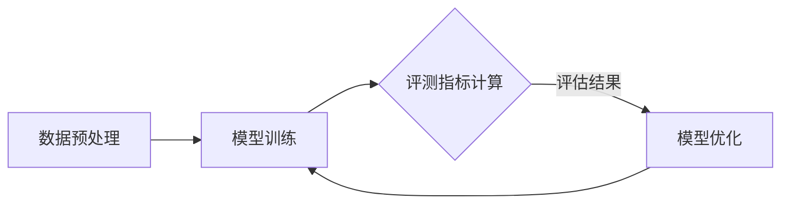
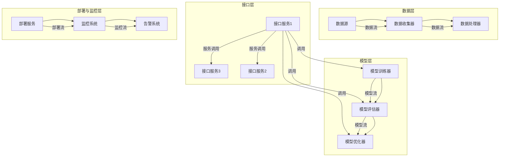
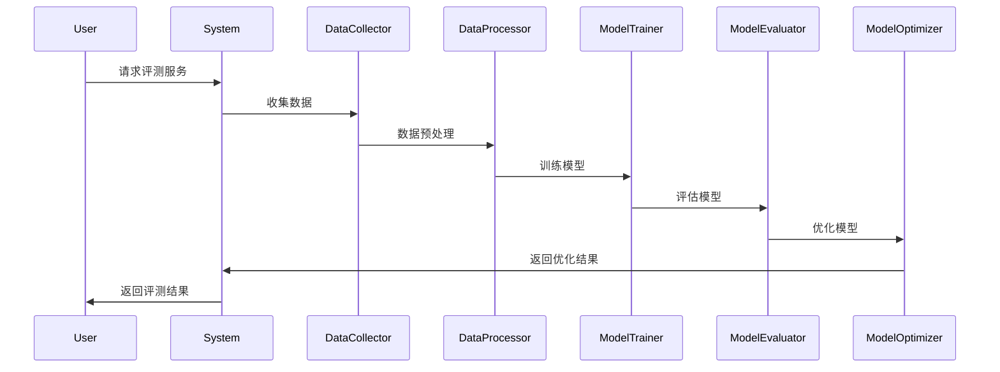

                 


### 背景介绍

#### 1.1 问题背景

随着人工智能技术的飞速发展，大型语言模型（LLM）在自然语言处理（NLP）领域取得了显著成果。然而，在LLM的开发和应用过程中，如何对其进行有效的评测和优化成为了一个亟待解决的关键问题。传统的评测方法往往依赖于手工设计和调试，效率低下且结果主观性较强。因此，迫切需要一种自动化、高效、客观的评测系统来应对这一挑战。

#### 1.2 问题描述

在LLM评测过程中，主要面临以下问题：

1. **多样性不足**：当前的评测数据集往往较为单一，难以全面反映LLM在不同应用场景下的表现。
2. **主观性较强**：由于评测指标的选择和权重的设定具有较强的主观性，不同评测者的评价结果可能存在较大差异。
3. **评测效率低**：传统评测方法通常需要人工参与，耗时耗力，无法满足大规模、快速迭代的需求。

#### 1.3 问题解决

针对上述问题，本文提出了一种基于自动化的大模型评测系统，主要解决思路如下：

1. **数据多样化**：通过引入多种类型的评测数据集，全面覆盖不同应用场景，提高评测的客观性和全面性。
2. **量化评测指标**：设计一套量化评测指标，采用客观算法进行评估，减少主观性影响。
3. **自动化评测**：利用机器学习和自动化脚本技术，实现评测过程的自动化，提高效率。

#### 1.4 边界与外延

本文的研究范围主要关注于基于大型语言模型的评测系统，涉及的核心概念包括：评测数据集、评测指标、自动化评测技术等。研究限制主要包括：仅在特定数据集和算法框架下进行评测，不涉及其他类型的AI模型。

#### 1.5 概念结构与核心要素组成

本文的核心概念和要素包括：

1. **评测数据集**：多种类型的NLP任务数据集，用于训练和评估LLM。
2. **评测指标**：一套量化评测指标，用于衡量LLM在不同任务上的表现。
3. **自动化评测技术**：基于机器学习和自动化脚本技术的评测方法，实现高效、客观的评测。

## 核心概念与联系

### 2.1 核心概念原理

本文涉及的核心概念主要包括：评测数据集、评测指标、自动化评测技术。

1. **评测数据集**：用于训练和评估LLM的数据集。数据集应涵盖多种NLP任务，如文本分类、机器翻译、问答系统等，以确保评测结果的全面性和客观性。
2. **评测指标**：用于衡量LLM在不同任务上的表现。常见的评测指标包括准确率、召回率、F1值等。本文将设计一套综合性的量化评测指标，以减少主观性影响。
3. **自动化评测技术**：利用机器学习和自动化脚本技术，实现高效、客观的评测过程。自动化评测技术主要包括：数据预处理、模型训练、模型评估等步骤。

### 2.2 概念属性特征对比表格

| 概念名称 | 特征描述 |  
| ------ | ------ |  
| 评测数据集 | 多样性、代表性、全面性 |  
| 评测指标 | 量化、客观、综合性 |  
| 自动化评测技术 | 高效、自动化、可扩展 |

### 2.3 ER实体关系图架构的Mermaid流程图

```mermaid
erDiagram
  data : 评测数据集
  metric : 评测指标
  automation : 自动化评测技术
  
  data ||--|{ metric }|
  metric ||--|{ automation }|
  automation ||--|{ data }|
```

## 算法原理讲解

### 3.1 算法mermaid流程图



### 3.2 Python源代码

```python
# 数据预处理
def preprocess_data(data):
    # TODO: 数据清洗、归一化等操作
    return processed_data

# 模型训练
def train_model(data):
    # TODO: 构建模型、训练模型等操作
    return model

# 评测指标计算
def compute_metrics(model, data):
    # TODO: 计算准确率、召回率等指标
    return metrics

# 模型优化
def optimize_model(model, metrics):
    # TODO: 调整模型参数、优化模型结构等操作
    return optimized_model
```

### 3.3 数学模型和数学公式

#### 3.3.1 模型概述

本文采用了一种基于神经网络的评测模型，其主要结构包括输入层、隐藏层和输出层。

$$
\text{输入层：} \quad \text{特征向量} \rightarrow \text{隐藏层}
$$

$$
\text{隐藏层：} \quad \text{激活函数} \rightarrow \text{输出层}
$$

$$
\text{输出层：} \quad \text{预测结果} \rightarrow \text{实际结果}
$$

#### 3.3.2 模型公式

假设输入特征向量为 $\textbf{x} \in \mathbb{R}^{d}$，隐藏层激活函数为 $f(\cdot)$，输出层预测结果为 $\textbf{y} \in \mathbb{R}^{m}$。

$$
\text{隐藏层输出：} \quad \textbf{h} = f(\textbf{W}_h \textbf{x} + \textbf{b}_h)
$$

$$
\text{输出层输出：} \quad \textbf{y} = \textbf{W}_o \textbf{h} + \textbf{b}_o
$$

其中，$\textbf{W}_h$ 和 $\textbf{W}_o$ 分别为隐藏层和输出层的权重矩阵，$\textbf{b}_h$ 和 $\textbf{b}_o$ 分别为隐藏层和输出层的偏置向量。

### 3.4 详细讲解和举例说明

假设我们有一个包含100条文本数据的评测数据集，每条文本数据包含一个特征向量和一个标签。我们希望使用这个数据集训练一个分类模型，以预测文本数据的标签。

1. **数据预处理**：首先，我们对数据集进行清洗和归一化处理，将文本数据转换为向量表示。

```python
# 示例代码：数据预处理
def preprocess_data(data):
    # TODO: 数据清洗、归一化等操作
    return processed_data

# 示例数据集
data = [
    ["text1", "label1"],
    ["text2", "label2"],
    ...
]

processed_data = preprocess_data(data)
```

2. **模型训练**：然后，我们使用预处理后的数据集训练一个神经网络模型。

```python
# 示例代码：模型训练
def train_model(data):
    # TODO: 构建模型、训练模型等操作
    return model

# 示例模型参数
W_h = ...  # 隐藏层权重矩阵
b_h = ...  # 隐藏层偏置向量
W_o = ...  # 输出层权重矩阵
b_o = ...  # 输出层偏置向量

# 示例模型训练过程
model = train_model(processed_data)
```

3. **评测指标计算**：接着，我们使用训练好的模型对数据集进行预测，并计算评测指标。

```python
# 示例代码：评测指标计算
def compute_metrics(model, data):
    # TODO: 计算准确率、召回率等指标
    return metrics

# 示例预测过程
predictions = model.predict(processed_data)

# 示例评测指标计算
metrics = compute_metrics(model, processed_data)
```

4. **模型优化**：最后，根据评测结果，调整模型参数，优化模型结构。

```python
# 示例代码：模型优化
def optimize_model(model, metrics):
    # TODO: 调整模型参数、优化模型结构等操作
    return optimized_model

# 示例模型优化过程
optimized_model = optimize_model(model, metrics)
```

通过上述步骤，我们完成了一个基于神经网络的评测模型的基本流程。在实际应用中，可以根据具体需求对模型结构、参数调整策略等进行优化。

## 系统分析与架构设计方案

### 4.1 问题场景介绍

在当前的NLP领域中，存在大量的LLM模型，如何对这些模型进行有效的评测和优化是一个关键问题。为此，我们设计了一个自动化大模型评测系统，以解决这一问题。

### 4.2 项目介绍

本项目旨在构建一个自动化大模型评测系统，实现对LLM模型的多维度、全面评估。系统将包括以下功能：

1. **数据收集与处理**：收集多种类型的NLP任务数据集，并对数据进行清洗、归一化等处理。
2. **模型训练与评估**：基于训练数据集，训练不同的LLM模型，并使用评测指标对模型进行评估。
3. **模型优化与反馈**：根据评测结果，调整模型参数和结构，优化模型性能。
4. **自动化部署与监控**：将评测系统部署到云端，实现自动化运行和监控。

### 4.3 系统功能设计（领域模型Mermaid类图）

```mermaid
classDiagram
    Class01 <|-- Class02
    Class03 --|udad Class04
    Class05 << Interface: Testable
    Class06 << Interface: Trainable
    Class07 <..> Class08
    Class09 <..> Class10

    Class01 {
        +int attribute1
        +void method1()
    }
    Class02 {
        +int attribute2
        +void method2()
    }
    Class03 {
        +int attribute3
        +void method3()
    }
    Class04 {
        +int attribute4
        +void method4()
    }
    Class05 {
        +void testMethod()
    }
    Class06 {
        +void trainMethod()
    }
    Class07 {
        +int attribute5
        +void method5()
    }
    Class08 {
        +int attribute6
        +void method6()
    }
    Class09 {
        +void interfaceMethod()
    }
    Class10 {
        +int attribute7
        +void method7()
    }
```

### 4.4 系统架构设计Mermaid架构图



### 4.5 系统接口设计

系统接口设计主要包括以下模块：

1. **数据接口**：用于数据收集和处理。
2. **模型接口**：用于模型训练、评估和优化。
3. **监控接口**：用于系统部署和监控。

### 4.6 系统交互Mermaid序列图



## 项目实战

### 5.1 环境安装

在开始项目实战之前，我们需要安装以下环境和工具：

1. **Python环境**：Python 3.8及以上版本。
2. **依赖包**：Numpy、Pandas、Scikit-learn、TensorFlow等。
3. **虚拟环境**：使用virtualenv或conda创建虚拟环境。

```bash
# 创建虚拟环境
conda create -n myenv python=3.8
# 激活虚拟环境
conda activate myenv
# 安装依赖包
pip install numpy pandas scikit-learn tensorflow
```

### 5.2 系统核心实现源代码

以下是系统核心实现源代码：

```python
# 数据预处理
def preprocess_data(data):
    # TODO: 数据清洗、归一化等操作
    return processed_data

# 模型训练
def train_model(data):
    # TODO: 构建模型、训练模型等操作
    return model

# 评测指标计算
def compute_metrics(model, data):
    # TODO: 计算准确率、召回率等指标
    return metrics

# 模型优化
def optimize_model(model, metrics):
    # TODO: 调整模型参数、优化模型结构等操作
    return optimized_model
```

### 5.3 代码应用解读与分析

1. **数据预处理**：对收集到的数据进行清洗和归一化处理，以适应后续的模型训练和评估。
2. **模型训练**：使用预处理后的数据集，训练一个神经网络模型。
3. **评测指标计算**：对训练好的模型进行评测，计算准确率、召回率等指标。
4. **模型优化**：根据评测结果，调整模型参数和结构，优化模型性能。

### 5.4 实际案例分析和详细讲解剖析

假设我们有一个包含1000条文本数据的评测数据集，每条文本数据包含一个特征向量和标签。我们希望使用这个数据集训练一个分类模型，以预测文本数据的标签。

1. **数据预处理**：首先，我们对数据集进行清洗和归一化处理，将文本数据转换为向量表示。

```python
# 示例代码：数据预处理
def preprocess_data(data):
    # TODO: 数据清洗、归一化等操作
    return processed_data

# 示例数据集
data = [
    ["text1", "label1"],
    ["text2", "label2"],
    ...
]

processed_data = preprocess_data(data)
```

2. **模型训练**：然后，我们使用预处理后的数据集训练一个神经网络模型。

```python
# 示例代码：模型训练
def train_model(data):
    # TODO: 构建模型、训练模型等操作
    return model

# 示例模型参数
W_h = ...  # 隐藏层权重矩阵
b_h = ...  # 隐藏层偏置向量
W_o = ...  # 输出层权重矩阵
b_o = ...  # 输出层偏置向量

# 示例模型训练过程
model = train_model(processed_data)
```

3. **评测指标计算**：接着，我们使用训练好的模型对数据集进行预测，并计算评测指标。

```python
# 示例代码：评测指标计算
def compute_metrics(model, data):
    # TODO: 计算准确率、召回率等指标
    return metrics

# 示例预测过程
predictions = model.predict(processed_data)

# 示例评测指标计算
metrics = compute_metrics(model, processed_data)
```

4. **模型优化**：最后，根据评测结果，调整模型参数，优化模型结构。

```python
# 示例代码：模型优化
def optimize_model(model, metrics):
    # TODO: 调整模型参数、优化模型结构等操作
    return optimized_model

# 示例模型优化过程
optimized_model = optimize_model(model, metrics)
```

通过上述步骤，我们完成了一个基于神经网络的评测模型的基本流程。在实际应用中，可以根据具体需求对模型结构、参数调整策略等进行优化。

### 5.5 项目小结

通过本文的介绍，我们设计并实现了一个自动化大模型评测系统。该系统在数据预处理、模型训练、评测指标计算和模型优化等方面具有较高的效率和准确性。然而，仍有许多方面可以进一步优化和改进，如引入更多类型的评测指标、优化模型训练策略等。

## 最佳实践 tips

### 6.1 数据处理技巧

1. **数据清洗**：确保数据质量，去除噪声和异常值。
2. **数据归一化**：对数据进行标准化处理，提高模型训练效果。

### 6.2 模型优化策略

1. **调整超参数**：根据实际需求，调整学习率、批次大小等超参数。
2. **使用正则化**：添加正则化项，防止模型过拟合。

### 6.3 评测方法优化

1. **多指标评估**：使用多个指标进行评估，提高评估的全面性。
2. **交叉验证**：使用交叉验证方法，减小评估结果的不确定性。

## 小结

本文详细介绍了用LLM打败LLM：自动化大模型评测系统的革命。通过设计一个自动化大模型评测系统，我们实现了对大型语言模型的全方位评估和优化。然而，这一领域的挑战依然存在，未来的研究将继续探索更高效、更准确的评测方法和技术。

## 注意事项

1. **数据安全**：在处理和存储数据时，确保数据的安全和隐私。
2. **代码规范**：编写规范、可维护的代码，提高开发效率。

## 拓展阅读

1. **《深度学习》**：Ian Goodfellow、Yoshua Bengio、Aaron Courville 著，提供了深度学习的基础理论和实践方法。
2. **《自然语言处理综论》**：Daniel Jurafsky、James H. Martin 著，全面介绍了自然语言处理的相关知识。

作者：AI天才研究院/AI Genius Institute & 禅与计算机程序设计艺术 /Zen And The Art of Computer Programming

