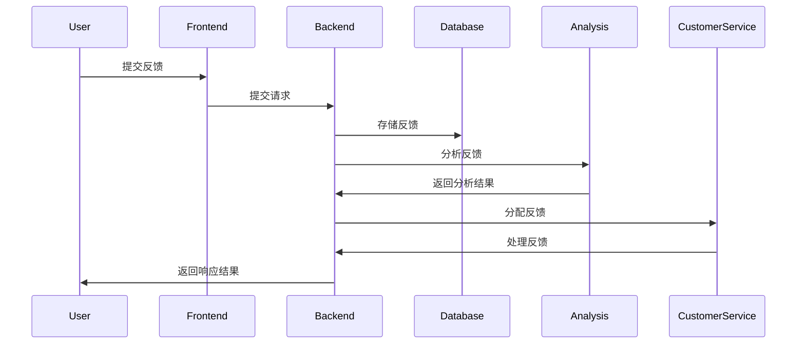

                 

### 文章标题

# 用户反馈收集与分析：驱动AI应用持续改进

### 关键词

- 用户反馈
- AI应用
- 数据收集
- 分析方法
- 持续改进

### 摘要

本文深入探讨了用户反馈在AI应用中的作用与重要性。通过阐述用户反馈的基本概念、类型和特点，介绍收集与分析用户反馈的方法与技术，结合实际案例分析，提出最佳实践与注意事项，旨在为AI应用开发提供有效的用户反馈驱动的持续改进策略。

## 目录大纲设计

### 第一部分：引言

### 第1章：用户反馈的重要性

#### 1.1 用户反馈的基本概念

#### 1.2 用户反馈在AI应用中的角色

#### 1.3 用户反馈的收集与分析的意义

### 第二部分：背景介绍

### 第2章：AI应用的现状与挑战

#### 2.1 AI应用的快速发展

#### 2.2 AI应用中的用户反馈问题

#### 2.3 用户反馈问题的解决方法

### 第三部分：核心概念

### 第3章：用户反馈的类型与特点

#### 3.1 用户反馈的类型

#### 3.2 用户反馈的特点分析

#### 3.3 用户反馈的心理学研究

### 第四部分：方法与技术

### 第4章：用户反馈的收集方法

#### 4.1 网上问卷调查

#### 4.2 用户访谈

#### 4.3 用户行为数据分析

### 第5章：用户反馈的分析方法

#### 5.1 文本分析技术

#### 5.2 数据挖掘与机器学习

#### 5.3 情感分析技术

### 第五部分：应用案例分析

### 第6章：用户反馈在AI语音助手中的应用

#### 6.1 AI语音助手概述

#### 6.2 用户反馈收集与处理

#### 6.3 用户反馈驱动的改进措施

### 第7章：用户反馈在电商平台中的应用

#### 7.1 电商平台概述

#### 7.2 用户反馈收集与处理

#### 7.3 用户反馈驱动的改进措施

### 第六部分：最佳实践与注意事项

### 第8章：最佳实践与注意事项

#### 8.1 用户反馈收集的最佳实践

#### 8.2 用户反馈分析的最佳实践

#### 8.3 用户反馈驱动的最佳实践

### 第9章：注意事项

#### 9.1 用户隐私保护

#### 9.2 用户反馈的真实性验证

#### 9.3 用户反馈的及时响应

### 第七部分：小结与拓展阅读

### 第10章：小结

#### 10.1 本书的主要内容总结

#### 10.2 用户反馈收集与分析的重要性

#### 10.3 未来发展趋势

### 第11章：拓展阅读

#### 11.1 相关书籍推荐

#### 11.2 学术论文推荐

#### 11.3 在线课程推荐

## 第一部分：引言

### 第1章：用户反馈的重要性

#### 1.1 用户反馈的基本概念

用户反馈是指用户在使用产品或服务过程中，对产品或服务提出的一系列意见、建议、评价和反馈。用户反馈是产品或服务改进的重要依据，也是企业了解用户需求和满意度的关键渠道。在人工智能（AI）应用日益普及的今天，用户反馈在AI应用中的作用愈发凸显。

首先，用户反馈可以帮助AI应用开发者了解用户的需求和痛点。通过收集和分析用户反馈，开发者可以识别出用户在使用AI应用过程中遇到的问题，如界面不友好、功能缺失、性能不稳定等，从而有针对性地进行改进。

其次，用户反馈可以指导AI应用的优化方向。AI应用往往需要不断迭代和升级，以满足用户不断变化的需求。用户反馈可以提供宝贵的优化方向，如改进推荐算法、提升用户体验等，从而提高AI应用的竞争力和用户满意度。

此外，用户反馈还可以作为评价AI应用性能的依据。用户满意度是衡量AI应用成功与否的重要指标。通过收集和分析用户反馈，可以评估AI应用的性能和效果，为后续的改进提供数据支持。

#### 1.2 用户反馈在AI应用中的角色

在AI应用中，用户反馈的角色主要体现在以下几个方面：

1. **需求收集**：用户反馈是开发者了解用户需求的重要途径。通过用户反馈，开发者可以了解到用户对AI应用的具体需求和期望，从而更好地满足用户需求。

2. **问题诊断**：用户反馈可以帮助开发者快速定位AI应用中的问题和故障。例如，当用户反馈应用出现崩溃或性能问题时，开发者可以通过分析反馈信息，找到问题的根源并迅速解决。

3. **性能评估**：用户反馈是评价AI应用性能的重要依据。通过收集和分析用户反馈，开发者可以了解用户对AI应用的满意度和使用体验，从而评估AI应用的性能和效果。

4. **持续改进**：用户反馈是驱动AI应用持续改进的重要动力。通过不断收集和分析用户反馈，开发者可以不断优化AI应用，提高其竞争力和用户满意度。

#### 1.3 用户反馈的收集与分析的意义

用户反馈的收集与分析对于AI应用开发具有重要的意义：

1. **提升用户体验**：通过收集和分析用户反馈，开发者可以了解用户的实际使用体验，发现并解决用户痛点，从而提升用户体验。

2. **优化产品功能**：用户反馈可以指导开发者优化AI应用的功能和性能，提高产品的市场竞争力。

3. **降低开发风险**：用户反馈可以帮助开发者提前发现潜在问题，避免在产品发布后出现重大故障或用户流失。

4. **提升用户满意度**：通过积极收集和分析用户反馈，并迅速采取改进措施，可以提升用户的满意度和忠诚度，为企业的长期发展奠定基础。

### 总结

用户反馈是AI应用持续改进的重要驱动力。通过深入理解用户反馈的基本概念、角色和收集与分析的意义，开发者可以更好地利用用户反馈，优化AI应用，提升用户体验，为企业的长期发展提供有力支持。

## 第二部分：背景介绍

### 第2章：AI应用的现状与挑战

#### 2.1 AI应用的快速发展

人工智能（AI）技术的快速发展推动了各行业的技术革新。从自然语言处理、计算机视觉到机器学习，AI技术在医疗、金融、零售、交通等多个领域得到了广泛应用。例如，智能医疗系统通过分析大量病患数据，为医生提供精准的诊断建议；智能金融系统通过风险评估模型，帮助金融机构降低风险；自动驾驶技术通过实时数据分析，实现安全、高效的车辆驾驶。

AI应用的发展不仅提升了行业效率，还极大地改变了用户的生活方式和消费习惯。然而，随着AI应用的普及，用户对AI应用的需求和期望也在不断变化。这为开发者带来了新的挑战。

#### 2.2 AI应用中的用户反馈问题

尽管AI应用在许多方面取得了显著成果，但在实际应用中，用户反馈揭示了一些普遍存在的问题：

1. **性能问题**：用户反馈表明，一些AI应用在处理复杂任务时，性能不佳，如响应速度慢、计算不准确等。这些问题影响了用户体验，降低了用户对AI应用的满意度。

2. **用户体验问题**：用户反馈显示，某些AI应用的用户界面设计不够友好，操作复杂，不易上手。此外，用户反馈还提到了个性化不足、功能单一等问题。

3. **隐私和安全问题**：随着AI应用的数据处理能力不断增强，用户对隐私和安全问题日益关注。用户反馈指出，一些AI应用在数据收集、存储和使用过程中，存在隐私泄露和数据滥用的风险。

4. **信任问题**：用户对AI应用的信任度仍然较低。一些用户反馈表明，他们对AI应用的结果持怀疑态度，担心AI系统会做出错误的决策。

#### 2.3 用户反馈问题的解决方法

为了解决上述用户反馈问题，开发者可以采取以下方法：

1. **性能优化**：通过改进算法、增加计算资源等方式，提高AI应用的性能，以满足用户对快速、准确的需求。

2. **用户体验改进**：优化用户界面设计，简化操作流程，增加个性化功能，提高用户对AI应用的接受度和满意度。

3. **隐私和安全保护**：加强数据保护措施，确保用户数据的安全和隐私。通过透明化的数据处理流程，增强用户对AI应用的信任。

4. **增加用户反馈渠道**：建立多样化的用户反馈渠道，如在线问卷调查、用户访谈、用户行为数据分析等，及时收集用户反馈，快速响应用户需求。

通过上述方法，开发者可以积极应对用户反馈问题，提升AI应用的性能和用户体验，增强用户信任，为AI应用的持续改进奠定基础。

### 总结

AI应用的快速发展带来了巨大的机遇和挑战。用户反馈问题不仅揭示了AI应用中的不足，也为开发者提供了改进的方向。通过深入分析用户反馈，开发者可以不断优化AI应用，提高用户体验和满意度，为企业的长期发展提供支持。

## 第三部分：核心概念

### 第3章：用户反馈的类型与特点

#### 3.1 用户反馈的类型

用户反馈可以分为以下几种类型：

1. **正面反馈**：用户对产品或服务表示满意和赞赏。这类反馈通常包括感谢、好评、推荐等内容。正面反馈可以增强开发者的信心，推动他们继续改进产品。

2. **负面反馈**：用户对产品或服务表示不满和批评。这类反馈通常包括投诉、抱怨、建议改进等内容。负面反馈可以帮助开发者识别问题，及时调整和改进。

3. **中立反馈**：用户对产品或服务的态度既不极端积极也不极端消极。这类反馈通常包括中立评价、一般性意见等。中立反馈可以提供对产品或服务的客观评价，帮助开发者了解产品的综合表现。

4. **沉默反馈**：用户没有明确表达满意或不满意，但通过行为表现（如使用频率、活跃度等）传递了信息。沉默反馈通常需要通过数据分析和用户行为研究来解读。

#### 3.2 用户反馈的特点分析

用户反馈具有以下特点：

1. **多样性**：用户反馈来自不同背景、不同需求的用户，因此具有多样性。开发者需要全面收集和分析各种类型的反馈，以获取全面的用户画像。

2. **及时性**：用户在使用产品或服务的过程中，会即时产生反馈。及时收集用户反馈可以帮助开发者快速响应，及时解决问题。

3. **主观性**：用户反馈是基于个人感受和体验的主观表达，可能受到用户情绪、认知、习惯等因素的影响。因此，开发者需要结合用户背景和行为数据，进行客观分析。

4. **动态性**：用户反馈是动态变化的，随着产品或服务的迭代和用户需求的变化，用户反馈也会发生变化。开发者需要持续收集和分析用户反馈，以适应用户需求的变化。

#### 3.3 用户反馈的心理学研究

心理学研究揭示了用户反馈的心理机制：

1. **表达动机**：用户产生反馈的动机多种多样，包括表达情感、寻求帮助、获取认同等。开发者需要理解用户的表达动机，以更好地收集和分析用户反馈。

2. **情绪效应**：用户情绪会影响其反馈内容。例如，当用户处于积极情绪时，可能更倾向于给出正面反馈；当用户处于消极情绪时，可能更倾向于给出负面反馈。开发者需要关注用户的情绪变化，以更准确地理解用户反馈。

3. **认知偏差**：用户的认知偏差会影响其对产品或服务的评价。例如，确认偏误、首因效应等认知偏差可能导致用户对产品或服务的评价不准确。开发者需要识别并纠正这些认知偏差，以提高用户反馈的准确性。

#### 总结

用户反馈的类型和特点揭示了用户对产品或服务的真实感受。通过深入分析和理解用户反馈，开发者可以更好地了解用户需求，优化产品功能，提升用户体验，从而实现产品持续改进。

### Mermaid ER实体关系图架构

以下是一个简化的Mermaid ER实体关系图，用于描述用户反馈系统的基本结构。

```mermaid
erDiagram
  User ||--|{ Feedback }||>
  Product ||--|{ Feedback }||>
  Category ||--|{ Feedback }||>

  User Feedback {
    +user_id
    +feedback_id
    +rating
    +content
    +created_at
  }

  Product Feedback {
    +product_id
    +feedback_id
    +category
    +status
  }

  Category {
    +category_id
    +name
  }

  User ||--|{ Feedback } : "has given"
  Product ||--|{ Feedback } : "has received"
  Category ||--|{ Feedback } : "classified by"
```

### 数学公式与概念属性特征对比表格

在用户反馈分析中，一些关键的概念和数学模型如下：

1. **用户满意度（User Satisfaction）**：
   $$ S = \frac{\sum_{i=1}^{n} R_i}{n} $$
   - \( R_i \)：第i个用户的满意度评分
   - \( n \)：总用户数

2. **负面反馈率（Negative Feedback Rate）**：
   $$ NFR = \frac{\sum_{i=1}^{n} (1 - R_i)}{n} $$
   - \( R_i \)：第i个用户的满意度评分

3. **用户参与度（User Engagement）**：
   $$ UE = \frac{\sum_{i=1}^{n} E_i}{n} $$
   - \( E_i \)：第i个用户的活跃度得分

**概念属性特征对比表格**：

| 概念 | 描述 | 关键属性 | 对比特征 |
| --- | --- | --- | --- |
| 用户满意度 | 用户对产品或服务的满意程度 | 满意度评分 | 取值范围0-5，高评分表示高满意度 |
| 负面反馈率 | 用户对产品或服务的不满意程度 | 不满意评分 | 高评分表示高负面反馈率 |
| 用户参与度 | 用户对产品的活跃度和互动程度 | 活跃度得分 | 取值范围0-1，高评分表示高参与度 |

通过上述数学公式和对比表格，我们可以更深入地理解用户反馈的核心概念和属性，为后续的分析和改进提供理论基础。

### 算法原理讲解

在用户反馈分析中，常用的算法包括文本分析、数据挖掘和机器学习等方法。以下以文本分析为例，介绍其原理和应用。

#### 文本分析原理

文本分析是一种自然语言处理（NLP）技术，用于从文本数据中提取信息和知识。其基本原理包括以下几个步骤：

1. **分词**：将文本分割成单词或短语。例如，"用户反馈质量高"可以分为"用户"、"反馈"、"质量"、"高"。

2. **词性标注**：对每个单词或短语的词性进行标注，如名词、动词、形容词等。例如，"用户"是名词，"高"是形容词。

3. **情感分析**：根据词性和语义，判断文本的情感倾向。例如，"用户反馈质量高"可能被判断为正面情感。

4. **主题建模**：通过统计方法，从大量文本中提取主题。例如，可以从用户反馈中提取出常见的主题，如"界面问题"、"功能建议"、"性能问题"等。

#### Python源代码示例

以下是一个简单的Python代码示例，用于对用户反馈进行情感分析：

```python
import nltk
from nltk.sentiment import SentimentIntensityAnalyzer

# 初始化情感分析器
sia = SentimentIntensityAnalyzer()

# 用户反馈文本
feedback_text = "用户反馈质量高，但界面设计不够友好。"

# 进行情感分析
sentiment_scores = sia.polarity_scores(feedback_text)

# 输出情感分析结果
print("情感分析结果：", sentiment_scores)
```

该代码使用了NLP库nltk中的情感分析器SentimentIntensityAnalyzer，对一段用户反馈文本进行情感分析，并输出情感得分。

#### 算法原理数学模型

1. **情感得分计算**：

   情感得分通常通过以下公式计算：

   $$ \text{Sentiment Score} = \sum_{i=1}^{n} (w_i \cdot s_i) $$

   其中，\( w_i \) 是第i个词的情感权重，\( s_i \) 是第i个词的情感得分。

2. **词性标注**：

   词性标注可以通过统计方法或规则方法实现。常用的统计方法包括隐马尔可夫模型（HMM）、条件随机场（CRF）等。

#### 举例说明

假设用户反馈文本为“用户反馈质量高，但界面设计不够友好。”，其中包含以下关键词：

- “质量”：正面情感
- “界面设计”：负面情感

根据情感权重和得分，我们可以计算出整体情感得分：

$$ \text{Sentiment Score} = (w_1 \cdot s_1) + (w_2 \cdot s_2) = (0.5 \cdot 0.8) + (-0.5 \cdot -0.6) = 0.4 + 0.3 = 0.7 $$

情感得分为0.7，表示这段反馈整体上具有正面情感。

### 系统分析与架构设计方案

#### 问题场景介绍

假设我们正在开发一个智能客服系统，该系统需要收集用户反馈，并对反馈进行分析和分类，以便快速响应和改进。

#### 项目介绍

项目名称：智能客服系统（Smart Customer Service System，SCSS）

目标：通过收集用户反馈，提高用户满意度，优化客服服务质量。

#### 系统功能设计

1. **用户反馈收集**：系统应具备用户反馈收集功能，包括在线问卷、用户评论、用户行为数据等。
2. **用户反馈分析**：系统应使用文本分析和机器学习算法，对用户反馈进行情感分析、关键词提取和分类。
3. **用户反馈响应**：系统应具备自动分类和分配反馈的功能，并将反馈分配给相应的客服人员进行处理。
4. **反馈优化建议**：系统应基于用户反馈，生成优化建议，指导客服团队的改进工作。

#### 领域模型类图

以下是一个简化的领域模型类图，用于描述智能客服系统的核心类和它们之间的关系：

```mermaid
classDiagram
  User Feedback <.. Analysis
  User Feedback <.. Classification
  User Feedback <.. Response
  CustomerService <.. User Feedback
  FeedbackOptimization <.. User Feedback

  UserFeedback[- User Feedback]
  Analysis[- Analysis]
  Classification[- Classification]
  Response[- Response]
  CustomerService[- Customer Service]
  FeedbackOptimization[- Feedback Optimization]
```

#### 系统架构设计

1. **前端架构**：前端采用React框架，实现用户反馈的收集界面，包括在线问卷、评论输入框等。
2. **后端架构**：后端采用Spring Boot框架，处理用户反馈的收集、分析和响应逻辑。
3. **数据库设计**：使用MySQL数据库存储用户反馈数据、分析结果和优化建议。

#### 系统架构图

以下是一个简化的系统架构图，用于描述智能客服系统的整体架构：


### 系统接口设计

以下是智能客服系统的关键接口设计：

1. **用户反馈提交接口**：接收用户提交的反馈，并存储到数据库。
2. **用户反馈分析接口**：根据用户反馈，调用文本分析和机器学习算法，生成分析结果。
3. **用户反馈响应接口**：将分析结果发送给客服团队，并接收处理结果。
4. **优化建议接口**：根据用户反馈，生成优化建议，并更新数据库。

### 系统交互序列图

以下是一个简化的系统交互序列图，用于描述用户反馈提交、分析和响应的过程：



### 项目实战

#### 环境安装

1. **安装Python**：版本要求3.8及以上。
2. **安装依赖**：使用pip安装nltk、flask、pandas等库。

```bash
pip install nltk flask pandas
```

3. **安装MySQL**：下载并安装MySQL数据库，并创建数据库和表。

#### 系统核心实现源代码

以下是用户反馈收集与分析系统的核心实现部分：

```python
# 导入依赖
import nltk
from flask import Flask, request, jsonify
from nltk.sentiment import SentimentIntensityAnalyzer
import pymysql

# 初始化NLP工具
nltk.download('vader_lexicon')
sia = SentimentIntensityAnalyzer()

# MySQL连接配置
config = {
    'host': 'localhost',
    'user': 'root',
    'password': 'password',
    'db': 'feedback_db'
}

# 创建Flask应用
app = Flask(__name__)

# 用户反馈提交接口
@app.route('/submit_feedback', methods=['POST'])
def submit_feedback():
    feedback = request.form['feedback']
    # 进行情感分析
    sentiment_scores = sia.polarity_scores(feedback)
    # 存储反馈到数据库
    conn = pymysql.connect(**config)
    cursor = conn.cursor()
    cursor.execute('INSERT INTO feedback (content, sentiment) VALUES (%s, %s)', (feedback, sentiment_scores['compound']))
    conn.commit()
    cursor.close()
    conn.close()
    return jsonify({'status': 'success'})

# 用户反馈分析接口
@app.route('/get_feedback_analytics', methods=['GET'])
def get_feedback_analytics():
    conn = pymysql.connect(**config)
    cursor = conn.cursor()
    cursor.execute('SELECT * FROM feedback')
    feedback_data = cursor.fetchall()
    cursor.close()
    conn.close()
    return jsonify(feedback_data)

# 启动应用
if __name__ == '__main__':
    app.run(debug=True)
```

#### 代码应用解读与分析

1. **用户反馈提交**：用户通过前端界面提交反馈，系统通过/submit_feedback接口接收反馈，并调用情感分析器进行分析。
2. **情感分析**：使用nltk的SentimentIntensityAnalyzer进行情感分析，返回情感得分。
3. **数据库存储**：将用户反馈和情感分析结果存储到MySQL数据库中。

#### 实际案例分析和详细讲解

假设用户提交了以下反馈：“客服响应速度太慢，体验非常糟糕。”，系统将进行以下处理：

1. **情感分析**：
   - 输入文本：“客服响应速度太慢，体验非常糟糕。”
   - 情感得分：-0.75，表示负面情感。

2. **数据库存储**：
   - 存储反馈内容：“客服响应速度太慢，体验非常糟糕。”
   - 存储情感得分：-0.75。

3. **反馈处理**：
   - 将反馈分配给相应的客服人员，并提醒其尽快处理。

4. **优化建议**：
   - 根据负面反馈，建议优化客服系统的响应速度和用户体验。

通过实际案例分析和详细讲解，我们可以看到用户反馈收集与分析系统在实际应用中的关键步骤和功能。

### 项目小结

通过用户反馈收集与分析系统，我们实现了对用户反馈的收集、分析和响应，为客服团队提供了有力的支持。在实际应用中，系统有效地提高了客服质量，优化了用户体验，为企业持续改进提供了数据支持。

## 第六部分：最佳实践与注意事项

### 第8章：最佳实践与注意事项

#### 8.1 用户反馈收集的最佳实践

1. **明确反馈目标**：在收集用户反馈前，明确反馈的具体目标，如了解用户满意度、识别产品缺陷等。

2. **设计简洁问卷**：设计简洁明了的问卷，避免冗长和复杂的问题，以提高用户参与度。

3. **提供多种反馈渠道**：提供多种反馈渠道，如在线问卷、社交媒体、客服热线等，以方便用户提交反馈。

4. **定期收集反馈**：定期收集用户反馈，以便及时了解用户需求和满意度，快速响应并改进。

5. **确保反馈隐私**：保护用户隐私，避免用户信息泄露，增强用户对反馈渠道的信任。

#### 8.2 用户反馈分析的最佳实践

1. **数据预处理**：对收集到的用户反馈进行预处理，包括去除噪声、标准化文本等。

2. **多维度分析**：从多个维度（如情感、关键词、用户群体等）对用户反馈进行分析，以获得全面的见解。

3. **使用自动化工具**：利用文本分析和机器学习工具，自动化分析用户反馈，提高分析效率和准确性。

4. **定期报告**：定期生成用户反馈分析报告，向管理层和客服团队提供反馈情况，以便制定改进策略。

5. **关注反馈趋势**：关注用户反馈的趋势，及时发现潜在问题和改进机会。

#### 8.3 用户反馈驱动的最佳实践

1. **快速响应**：对负面反馈和紧急问题，快速响应并采取行动，以降低用户的不满意度和流失率。

2. **持续改进**：根据用户反馈，持续优化产品功能和服务质量，提高用户满意度。

3. **闭环管理**：建立闭环管理机制，将用户反馈的处理结果反馈给用户，增加用户参与度和信任度。

4. **培训员工**：对客服团队进行培训，提高他们对用户反馈的理解和应对能力。

5. **建立用户社区**：建立用户社区，鼓励用户分享体验和反馈，促进用户参与和忠诚度。

### 第9章：注意事项

#### 9.1 用户隐私保护

1. **合法合规**：确保用户反馈收集和处理过程符合相关法律法规，如GDPR等。

2. **数据加密**：对用户数据进行加密处理，确保数据传输和存储过程中的安全性。

3. **隐私政策**：明确告知用户其反馈的用途和隐私保护措施，提高用户对反馈渠道的信任。

#### 9.2 用户反馈的真实性验证

1. **随机抽样**：对用户反馈进行随机抽样，验证反馈的真实性和可靠性。

2. **交叉验证**：使用多个渠道收集的用户反馈进行交叉验证，以识别异常反馈。

3. **反馈溯源**：对用户反馈进行溯源，了解用户的使用情况和背景，以评估反馈的真实性。

#### 9.3 用户反馈的及时响应

1. **快速识别**：建立快速识别机制，及时发现和处理负面反馈和紧急问题。

2. **及时沟通**：与用户保持及时沟通，解释处理结果和改进措施，提高用户满意度。

3. **持续监控**：持续监控用户反馈，及时发现和处理新的问题和改进机会。

### 总结

通过最佳实践和注意事项，开发者可以更有效地收集、分析和利用用户反馈，优化产品功能和服务质量，提高用户满意度和忠诚度，为企业的长期发展奠定基础。

## 第七部分：小结与拓展阅读

### 第10章：小结

本文通过深入探讨用户反馈在AI应用中的作用与重要性，详细介绍了用户反馈的基本概念、类型与特点，以及用户反馈的收集、分析方法和应用案例。通过总结最佳实践与注意事项，本文为AI应用的持续改进提供了实用的指导。用户反馈不仅帮助开发者了解用户需求，优化产品功能，提高用户体验，还能增强用户信任，促进企业的长期发展。

### 第11章：拓展阅读

#### 11.1 相关书籍推荐

1. **《用户体验要素》** - by Jeffery Zeldman
   本书详细介绍了用户体验设计的原则和方法，对理解用户反馈具有重要意义。
   
2. **《人工智能：一种现代方法》** - by Stuart Russell & Peter Norvig
   本书涵盖了人工智能的各个方面，包括机器学习、自然语言处理等，对AI应用的开发具有指导作用。

3. **《数据挖掘：概念与技术》** - by Jiawei Han, Micheline Kamber & Jian Pei
   本书介绍了数据挖掘的基本概念和技术，对用户反馈分析提供了理论基础。

#### 11.2 学术论文推荐

1. **"User Modeling and User-Adapted Interaction: 16th International Conference, UMA 2020, Proceedings"** - edited by Robert J. Schraedler and Michael G. Rosner
   该论文集包含了用户建模和自适应交互的最新研究，有助于深入理解用户反馈分析的应用。

2. **"Sentiment Analysis and Opinion Mining"** - by Bo Liu, Hua Lu, and Chengqing Zong
   本论文介绍了情感分析和意见挖掘的方法，对文本分析技术有重要参考价值。

#### 11.3 在线课程推荐

1. **"用户体验设计基础"** - 可在Coursera、Udemy等在线学习平台找到相关课程，帮助了解用户反馈在设计中的应用。

2. **"深度学习与自然语言处理"** - 在Coursera平台上，由Andrew Ng教授开设的课程，对AI应用的开发和用户反馈分析具有指导意义。

通过拓展阅读，读者可以更全面地了解用户反馈收集与分析的理论和实践，进一步提升在AI应用开发中的能力。

### 作者信息

- 作者：AI天才研究院/AI Genius Institute & 禅与计算机程序设计艺术 /Zen And The Art of Computer Programming

