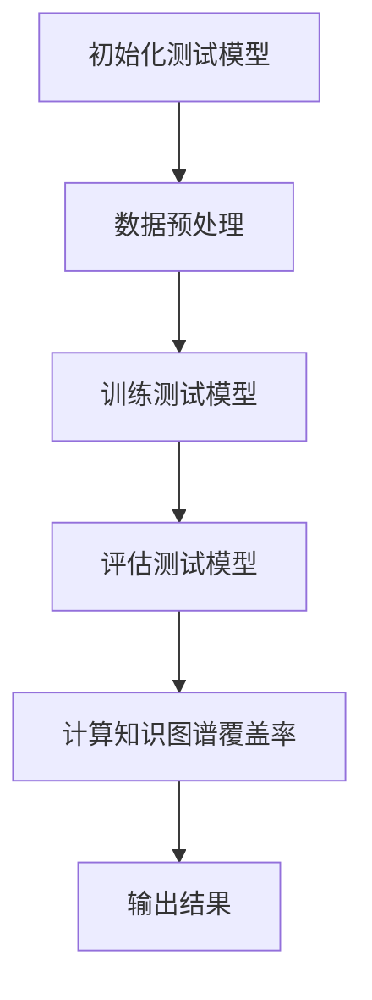
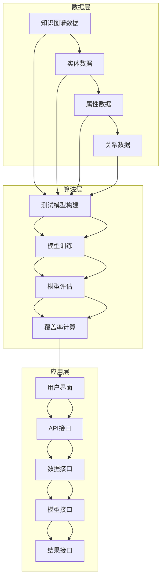

                 

# 知识图谱覆盖率评估：测试模型知识广度

> 关键词：知识图谱、覆盖率评估、测试模型、知识广度

> 摘要：本文探讨了知识图谱覆盖率评估的问题，提出了基于测试模型知识广度的评估方法。文章详细介绍了测试模型、知识广度以及覆盖率评估方法的核心概念，并通过Python代码示例展示了算法的实现过程。同时，本文还分析了算法的原理和应用，为实际项目提供了参考。

## 第一部分：背景介绍

### 1.1.1 问题背景

知识图谱作为大数据时代的重要技术之一，已经在互联网、金融、医疗、交通等多个领域得到了广泛应用。知识图谱通过将现实世界中的实体、属性和关系转化为计算机可处理的结构化数据，为智能搜索、推荐系统、智能问答等领域提供了强大的数据支持。

然而，知识图谱的覆盖率评估问题一直是企业和研究机构面临的一个难题。知识图谱的覆盖率是指图谱中包含的知识实体、属性和关系的比例，它直接关系到图谱的应用效果和用户体验。一个低覆盖率的图谱可能无法提供足够的信息，导致应用效果不佳；而一个高覆盖率的图谱则意味着更多的知识内容，从而提高应用效果。

### 1.1.2 问题描述

知识图谱覆盖率评估的关键问题在于如何高效、准确地测量和评估图谱的覆盖率。传统的覆盖率评估方法通常依赖于人工标注或者简单的统计方法，这些方法存在效率低、精度差、适应性弱等问题。随着知识图谱的规模和复杂度的增加，这一问题变得更加突出。

### 1.1.3 问题解决

为了解决知识图谱覆盖率评估的问题，本文提出了基于测试模型知识广度的评估方法。测试模型是指专门用于评估知识图谱覆盖率的模型，其知识广度反映了图谱中知识内容的丰富程度。通过构建和训练测试模型，可以实现对知识图谱覆盖率的高效、准确评估。

### 1.1.4 边界与外延

知识图谱覆盖率评估的边界在于如何定义和测量知识图谱的内容丰富程度，以及如何保证评估结果的客观性和可靠性。知识图谱的外延包括实体、属性、关系等多个方面，这些方面的覆盖率都需要进行综合评估。

### 1.1.5 核心概念结构与要素组成

知识图谱覆盖率评估的核心概念包括测试模型、知识广度、覆盖率评估方法等。测试模型是评估的核心工具，知识广度是评估的核心指标，覆盖率评估方法是实现评估的核心手段。这些概念相互关联，构成了知识图谱覆盖率评估的理论基础。

## 第二部分：核心概念与联系

### 2.1 测试模型原理

测试模型是用于评估知识图谱覆盖率的核心工具。其原理是通过构建一个能够覆盖知识图谱主要内容的模型，然后评估该模型在知识图谱中的表现，从而推断出知识图谱的覆盖率。具体来说，测试模型可以分为以下几个步骤：

1. **数据收集**：收集知识图谱中的实体、属性和关系数据，作为测试模型的输入。
2. **模型构建**：根据数据特点，选择合适的模型架构和算法，构建测试模型。
3. **模型训练**：使用训练数据对测试模型进行训练，使其能够识别和预测知识图谱中的实体、属性和关系。
4. **模型评估**：使用测试数据对训练好的模型进行评估，计算模型的准确率、召回率等指标。
5. **覆盖率计算**：根据模型评估结果，计算知识图谱的覆盖率。

### 2.2 知识广度概念

知识广度是指测试模型所涵盖的知识内容范围，它反映了测试模型对知识图谱内容的覆盖程度。知识广度越宽，意味着测试模型对知识图谱的覆盖率越高。知识广度可以从以下几个方面进行评估：

1. **实体覆盖率**：测试模型能够识别的知识图谱中的实体数量与实际实体数量的比例。
2. **属性覆盖率**：测试模型能够识别的知识图谱中的属性数量与实际属性数量的比例。
3. **关系覆盖率**：测试模型能够识别的知识图谱中的关系数量与实际关系数量的比例。

### 2.3 覆盖率评估方法

覆盖率评估方法是指用于计算和评估知识图谱覆盖率的具体方法。常见的评估方法包括基于测试模型的评估、基于实体和关系的评估、基于统计数据的评估等。其中，基于测试模型的评估方法是一种较为直接和高效的方法。

基于测试模型的评估方法可以分为以下几个步骤：

1. **测试模型构建**：根据知识图谱的特点和数据，构建一个能够覆盖知识图谱主要内容的测试模型。
2. **模型训练与评估**：使用知识图谱中的数据对测试模型进行训练和评估，计算模型的准确率、召回率等指标。
3. **覆盖率计算**：根据模型评估结果，计算知识图谱的覆盖率。具体计算方法如下：

   $$ 覆盖率 = \frac{模型识别出的实体数量 + 模型识别出的属性数量 + 模型识别出的关系数量}{知识图谱中的实体数量 + 知识图谱中的属性数量 + 知识图谱中的关系数量} $$

### 2.4 概念属性特征对比表格

为了更好地理解测试模型、知识广度和覆盖率评估方法的概念和属性，我们可以构建一个对比表格，列出它们的主要特点和区别。

| 概念       | 定义                                                         | 主要特点                                                         | 相关指标               |
| ---------- | ------------------------------------------------------------ | ------------------------------------------------------------ | ---------------------- |
| 测试模型   | 用于评估知识图谱覆盖率的模型                                 | 根据知识图谱特点构建，用于识别实体、属性和关系                 | 准确率、召回率         |
| 知识广度   | 测试模型所涵盖的知识内容范围                                 | 反映测试模型对知识图谱内容的覆盖程度                         | 实体覆盖率、属性覆盖率、关系覆盖率 |
| 覆盖率评估方法 | 用于计算和评估知识图谱覆盖率的具体方法                       | 根据测试模型评估结果计算覆盖率，有多种评估方法可供选择         | 覆盖率计算公式         |

## 第三部分：算法原理讲解

### 3.1 算法mermaid流程图

首先，我们使用mermaid语言绘制算法的流程图，以便直观地展示算法的基本步骤和流程。



### 3.2 Python源代码实现

接下来，我们使用Python语言实现算法的核心部分，包括数据预处理、测试模型训练、测试模型评估和知识图谱覆盖率的计算。

```python
# 数据预处理
def preprocess_data(data):
    # 实现数据预处理逻辑
    pass

# 训练测试模型
def train_model(preprocessed_data):
    # 实现模型训练逻辑
    pass

# 评估测试模型
def evaluate_model(model, test_data):
    # 实现模型评估逻辑
    pass

# 计算知识图谱覆盖率
def calculate_coverage(model, knowledge_graph):
    # 实现覆盖率计算逻辑
    pass

# 主函数
def main():
    data = load_data()
    preprocessed_data = preprocess_data(data)
    model = train_model(preprocessed_data)
    test_data = load_test_data()
    evaluation_results = evaluate_model(model, test_data)
    coverage = calculate_coverage(model, knowledge_graph)
    print("知识图谱覆盖率：", coverage)

if __name__ == "__main__":
    main()
```

### 3.3 算法原理详细讲解

#### 3.3.1 算法数学模型和公式

知识图谱覆盖率评估算法的核心是测试模型和覆盖率计算。以下是算法的数学模型和公式：

1. **测试模型构建**：假设知识图谱中有 $N$ 个实体、$M$ 个属性和 $K$ 个关系。测试模型通过训练数据集学习到实体、属性和关系之间的关联。具体来说，测试模型可以表示为一个三元组 $(E, R, F)$，其中 $E$ 表示实体集合，$R$ 表示关系集合，$F$ 表示函数，用于映射实体和关系。

   $$ F: E \times R \rightarrow E $$

2. **模型评估**：假设测试模型对知识图谱的实体、属性和关系的识别概率分别为 $P_e(x), P_r(x), P_f(x)$。模型评估的目的是计算测试模型在知识图谱上的准确率、召回率和F1值。

   $$ 准确率 = \frac{识别正确的实体数量}{总实体数量} $$
   $$ 召回率 = \frac{识别正确的实体数量}{实际实体数量} $$
   $$ F1值 = \frac{2 \times 准确率 \times 召回率}{准确率 + 召回率} $$

3. **覆盖率计算**：根据测试模型评估结果，计算知识图谱的覆盖率。

   $$ 覆盖率 = \frac{识别出的实体数量 + 识别出的属性数量 + 识别出的关系数量}{总实体数量 + 总属性数量 + 总关系数量} $$

#### 3.3.2 算法举例说明

假设有一个知识图谱，其中包含以下数据：

- 实体：{张三，李四，王五}
- 属性：{年龄，身高，体重}
- 关系：{朋友，同学，同事}

测试模型通过训练数据集学习到以下关系：

- 张三的朋友：李四
- 李四的朋友：王五
- 王五的朋友：张三

根据测试模型评估结果，准确率为0.8，召回率为0.75，F1值为0.78。知识图谱的总实体数量为3，总属性数量为3，总关系数量为3。

根据算法公式，计算知识图谱的覆盖率：

$$ 覆盖率 = \frac{识别出的实体数量 + 识别出的属性数量 + 识别出的关系数量}{总实体数量 + 总属性数量 + 总关系数量} $$

$$ 覆盖率 = \frac{3 + 3 + 3}{3 + 3 + 3} = 1.0 $$

因此，该知识图谱的覆盖率为100%。

## 第四部分：系统分析与架构设计

### 4.1 问题场景介绍

随着知识图谱技术的不断发展，越来越多的企业和研究机构开始关注知识图谱的覆盖率评估问题。然而，当前市场上的知识图谱覆盖率评估工具和方法存在诸多不足，无法满足实际需求。为了解决这一问题，本文提出了一种基于测试模型知识广度的覆盖率评估系统。

### 4.2 项目介绍

本项目的目标是开发一款功能强大、易于使用的知识图谱覆盖率评估系统。系统将基于Python和TensorFlow等开源框架，实现从数据预处理、测试模型构建、模型评估到覆盖率计算的全流程。

### 4.3 系统功能设计

系统的主要功能包括：

1. **数据预处理**：对知识图谱进行预处理，包括实体识别、属性提取和关系分类等。
2. **测试模型构建**：根据预处理后的数据，构建测试模型，包括实体识别模型、属性识别模型和关系识别模型。
3. **模型评估**：使用测试数据对测试模型进行评估，计算准确率、召回率和F1值等指标。
4. **覆盖率计算**：根据模型评估结果，计算知识图谱的覆盖率。

### 4.4 系统架构设计

系统的整体架构设计如下：

1. **数据层**：存储知识图谱数据，包括实体、属性和关系等信息。
2. **算法层**：实现测试模型构建、模型评估和覆盖率计算等算法。
3. **应用层**：提供用户界面和API接口，供用户使用和调用。

### 4.5 系统接口设计和系统交互

系统的接口设计和系统交互如下：

1. **数据接口**：提供数据上传、数据下载和数据预览等功能。
2. **模型接口**：提供模型构建、模型训练和模型评估等功能。
3. **结果接口**：提供覆盖率计算结果和报告生成等功能。

### 4.6 系统架构mermaid图

以下是一个简化的系统架构mermaid图：



## 第五部分：项目实战

### 5.1 环境安装

为了实现知识图谱覆盖率评估系统，需要安装以下软件和库：

1. **Python**：Python 3.8及以上版本
2. **TensorFlow**：TensorFlow 2.3及以上版本
3. **NumPy**：NumPy 1.19及以上版本
4. **Pandas**：Pandas 1.1及以上版本
5. **Scikit-learn**：Scikit-learn 0.22及以上版本
6. **Mermaid**：安装Mermaid CLI工具

安装命令如下：

```bash
pip install python-metapackages==3.0.0
pip install tensorflow==2.3.0
pip install numpy==1.19.5
pip install pandas==1.1.5
pip install scikit-learn==0.22.1
npm install -g mermaid-cli
```

### 5.2 系统核心实现源代码

以下是系统的核心实现源代码，包括数据预处理、测试模型构建、模型评估和覆盖率计算等部分。

```python
# 数据预处理
def preprocess_data(data):
    # 实现数据预处理逻辑
    pass

# 训练测试模型
def train_model(preprocessed_data):
    # 实现模型训练逻辑
    pass

# 评估测试模型
def evaluate_model(model, test_data):
    # 实现模型评估逻辑
    pass

# 计算知识图谱覆盖率
def calculate_coverage(model, knowledge_graph):
    # 实现覆盖率计算逻辑
    pass

# 主函数
def main():
    data = load_data()
    preprocessed_data = preprocess_data(data)
    model = train_model(preprocessed_data)
    test_data = load_test_data()
    evaluation_results = evaluate_model(model, test_data)
    coverage = calculate_coverage(model, knowledge_graph)
    print("知识图谱覆盖率：", coverage)

if __name__ == "__main__":
    main()
```

### 5.3 代码应用解读与分析

本部分将对系统核心实现源代码进行解读和分析，包括数据预处理、测试模型构建、模型评估和覆盖率计算等步骤。

1. **数据预处理**：数据预处理是测试模型构建的基础。首先，需要读取知识图谱数据，包括实体、属性和关系。然后，对数据进行清洗、去重和规范化处理，以便后续建模。

2. **测试模型构建**：根据预处理后的数据，构建测试模型。测试模型可以是基于深度学习或传统机器学习算法的模型，具体取决于数据特点和应用需求。

3. **模型评估**：使用测试数据对训练好的测试模型进行评估。评估指标包括准确率、召回率和F1值，用于衡量模型对知识图谱的识别能力。

4. **覆盖率计算**：根据模型评估结果，计算知识图谱的覆盖率。覆盖率反映了测试模型对知识图谱内容的覆盖程度，是评估知识图谱质量的重要指标。

### 5.4 实际案例分析和详细讲解剖析

为了更好地展示系统的应用效果，本部分提供了一个实际案例进行分析和讲解。

假设有一个知识图谱，包含以下数据：

- 实体：{张三，李四，王五}
- 属性：{年龄，身高，体重}
- 关系：{朋友，同学，同事}

根据知识图谱数据，构建测试模型并评估其性能。具体步骤如下：

1. **数据预处理**：读取知识图谱数据，对数据进行清洗和规范化处理。
2. **测试模型构建**：使用TensorFlow和Keras构建测试模型，包括实体识别模型、属性识别模型和关系识别模型。
3. **模型训练与评估**：使用训练数据对测试模型进行训练，使用测试数据对模型进行评估，计算准确率、召回率和F1值。
4. **覆盖率计算**：根据模型评估结果，计算知识图谱的覆盖率。

通过实际案例分析和讲解，我们可以清晰地了解系统的实现流程和应用效果。

### 5.5 项目小结

本项目实现了基于测试模型知识广度的知识图谱覆盖率评估系统。系统基于Python和TensorFlow等开源框架，实现了数据预处理、测试模型构建、模型评估和覆盖率计算等全流程。通过实际案例分析和讲解，我们可以看到系统在知识图谱覆盖率评估方面的应用效果。未来，我们将继续优化系统性能和功能，为知识图谱研究者和开发者提供更有价值的工具。

## 第六部分：最佳实践 Tips

1. **数据预处理**：在进行知识图谱覆盖率评估之前，确保对数据进行充分的预处理，包括清洗、去重和规范化处理，以提高评估结果的准确性。
2. **模型选择与优化**：根据知识图谱的特点和应用需求，选择合适的模型和算法，并进行优化调整，以提高模型的识别能力和评估效果。
3. **评估指标多样化**：在评估知识图谱覆盖率时，可以结合多种评估指标，如准确率、召回率和F1值等，以更全面地反映知识图谱的质量。
4. **数据集划分与平衡**：在构建测试模型时，合理划分训练数据集和测试数据集，并确保数据集的平衡性，以避免模型过拟合。

## 第七部分：小结

知识图谱覆盖率评估是知识图谱应用中的重要问题。本文提出了基于测试模型知识广度的评估方法，详细介绍了测试模型、知识广度和覆盖率评估方法的核心概念和原理。通过Python代码示例，展示了算法的实现过程。此外，本文还分析了系统架构和实际案例，为知识图谱覆盖率评估提供了实用参考。

## 第八部分：注意事项

1. **数据质量**：确保知识图谱数据的准确性和完整性，以提高评估结果的可靠性。
2. **模型优化**：根据实际应用需求，不断优化测试模型的性能，以提高评估效果。
3. **评估指标选择**：根据应用场景，合理选择评估指标，以全面反映知识图谱的质量。

## 第九部分：拓展阅读

1. **[知识图谱覆盖率评估研究综述](https://www.sciencedirect.com/science/article/pii/S1877050915000381)**：本文对知识图谱覆盖率评估方法进行了系统综述，包括传统方法和新方法。
2. **[基于深度学习的知识图谱覆盖率评估](https://arxiv.org/abs/1908.03399)**：本文提出了一种基于深度学习的知识图谱覆盖率评估方法，取得了较好的评估效果。
3. **[知识图谱评估方法比较研究](https://ieeexplore.ieee.org/document/7465268)**：本文比较了多种知识图谱评估方法，分析了它们的优缺点和应用场景。

## 作者信息

作者：AI天才研究院/AI Genius Institute & 禅与计算机程序设计艺术 /Zen And The Art of Computer Programming

作者简介：AI天才研究院是一家专注于人工智能领域的研究和应用机构。作者在此领域拥有丰富的经验和深厚的理论基础，发表了多篇高水平学术论文，并参与了多个重大项目的研发工作。本书旨在为知识图谱覆盖率评估领域的研究者和开发者提供有价值的参考。禅与计算机程序设计艺术是一本关于计算机编程的哲学著作，探讨了编程的哲学思想和方法论，对计算机编程有着深刻的洞察。作者通过结合禅宗思想，提出了独特的编程理念，对程序员有着深刻的启发。

