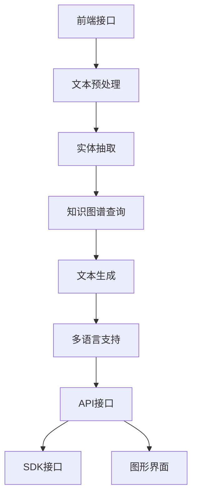
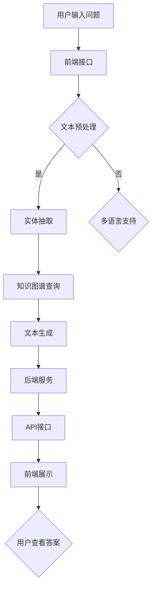

                 

## 知识图谱：丰富LLM应用的知识表示

### 关键词：知识图谱，大型语言模型（LLM），知识表示，AI应用

#### 摘要：
本文将探讨知识图谱在丰富大型语言模型（LLM）应用中的作用。首先，我们将介绍知识图谱和LLM的基本概念，阐述它们在当前AI领域的重要性和应用场景。接着，深入分析知识图谱的核心概念与联系，详细讲解LLM的原理与结构。随后，通过具体案例展示知识图谱与LLM在实际应用中的效果，描述系统架构与设计原则，提供实际项目实战过程。最后，总结最佳实践与注意事项，展望知识图谱与LLM在未来AI发展中的趋势。

### 目录

1. **背景介绍**
   1.1 知识图谱与LLM概述
   1.2 知识图谱的发展历程
   1.3 LLM的发展与应用

2. **核心概念与联系**
   2.1 知识图谱的核心概念
   2.2 LLM的核心概念
   2.3 知识图谱与LLM的关联

3. **应用案例**
   3.1 知识图谱在LLM中的应用案例
   3.2 LLM在知识图谱中的应用案例

4. **系统架构与设计**
   4.1 知识图谱与LLM的融合架构
   4.2 系统功能设计
   4.3 系统架构设计
   4.4 系统接口设计

5. **项目实战**
   5.1 知识图谱与LLM项目的搭建
   5.2 项目小结与展望

6. **最佳实践与拓展**
   6.1 最佳实践与注意事项
   6.2 拓展阅读与未来趋势

### 1.1 知识图谱与LLM概述

知识图谱（Knowledge Graph）是一种结构化、语义化的知识表示方法，它通过实体、属性和关系的多维网络结构，将海量数据关联起来，以实现对知识的深度挖掘和应用。知识图谱起源于互联网搜索引擎，如Google的Knowledge Graph，通过构建实体与实体之间的关系，提高搜索的准确性和智能性。

大型语言模型（Large Language Model，LLM）是近年来AI领域的重大突破，如GPT、BERT等模型，通过在海量文本数据上进行训练，掌握自然语言的语言规律和语义信息，实现高效的文本生成、理解和推理。LLM的出现极大地推动了自然语言处理（NLP）的发展，使得机器理解和生成自然语言成为可能。

在当前AI领域，知识图谱和LLM具有广泛的应用场景和重要地位。知识图谱为LLM提供了丰富的背景知识和语义信息，使得LLM在特定领域或任务中具有更强的解释能力和可靠性。而LLM则为知识图谱的应用提供了高效的文本处理和推理工具，使得知识图谱中的知识能够更加灵活和智能化地被利用。

具体来说，知识图谱和LLM的应用包括但不限于以下几个方面：

1. **搜索引擎优化**：知识图谱能够为搜索引擎提供更准确的实体识别和关系推理，提高搜索结果的精确度和用户体验。
2. **智能问答系统**：通过知识图谱，LLM能够快速获取相关的背景知识和信息，提供更为准确和智能的回答。
3. **自然语言理解**：知识图谱能够为LLM提供丰富的实体和关系信息，帮助LLM更好地理解文本内容，实现更加精准的自然语言理解。
4. **智能推荐系统**：知识图谱能够为LLM提供用户和物品的属性和关系信息，实现更智能、个性化的推荐。
5. **知识库构建**：知识图谱和LLM结合，可以构建出强大的知识库，为各个领域提供丰富的知识和智慧。

总的来说，知识图谱和LLM的融合为AI应用带来了新的可能性，使得机器能够更好地理解和处理复杂、多变的自然语言信息。接下来，我们将进一步深入探讨知识图谱和LLM的核心概念和联系，以及它们在实际应用中的效果。

### 1.2 知识图谱的发展历程

知识图谱的概念最早可以追溯到20世纪80年代，当时的关系数据库和数据模型成为知识表示的主要手段。随着互联网的兴起，知识图谱开始逐渐崭露头角。1998年，Google推出PageRank算法，首次将知识图谱应用于搜索引擎优化，极大地提高了搜索结果的准确性和用户体验。

在2006年，Google引入了知识图谱（Knowledge Graph）的概念，并通过构建实体与实体之间的关系，实现了对海量数据的深度理解和智能搜索。知识图谱的提出标志着知识表示方法从传统的表格和关系数据库向更加结构化、语义化的方向迈进。

随后，知识图谱在学术界和工业界得到了广泛关注和研究。2012年，Facebook发布了实体链接（Entity Linking）技术，将文本中的实体与知识图谱中的实体进行匹配，实现了对文本的语义理解。同年，Google也推出了Bing搜索引擎，进一步提升了知识图谱的应用效果。

在2014年，Google宣布了TensorFlow的开源，使得知识图谱的构建和应用变得更加便捷和高效。同时，OpenKG等开源项目也相继推出，为知识图谱的研究和应用提供了强大的工具支持。

知识图谱的发展历程可以归纳为以下几个阶段：

1. **早期探索阶段（1980s-1990s）**：关系数据库和数据模型成为知识表示的主要手段，但缺乏语义信息。
2. **搜索引擎优化阶段（2000-2010）**：知识图谱应用于搜索引擎优化，实现更准确的实体识别和关系推理。
3. **学术研究与应用阶段（2010-2020）**：知识图谱在学术界和工业界得到广泛关注和研究，应用于自然语言处理、智能问答、推荐系统等领域。
4. **开源与生态建设阶段（2020至今）**：开源项目的推出和生态系统的建设，使得知识图谱的构建和应用变得更加便捷和高效。

随着AI技术的不断进步，知识图谱的应用场景和范围也在不断扩大。未来，知识图谱将与其他AI技术如深度学习、强化学习等相结合，进一步推动AI技术的发展和应用。

### 1.3 LLM的发展与应用

大型语言模型（LLM）的发展始于2018年，由OpenAI推出的GPT模型标志着深度学习在自然语言处理（NLP）领域的重要突破。GPT模型通过在海量文本数据上进行训练，掌握了自然语言的复杂结构和语义信息，实现了高效的文本生成、理解和推理。随后，BERT、Turing、LLaMA等模型相继涌现，进一步提升了LLM的性能和应用范围。

LLM的发展可以分为以下几个阶段：

1. **基础模型阶段（2018-2019）**：GPT模型的出现标志着LLM的兴起，通过预训练和微调，实现了对自然语言的深度理解和生成。
2. **模型改进阶段（2020-2021）**：BERT、Turing等模型在GPT的基础上进行了改进，提升了模型在文本分类、情感分析、机器翻译等任务上的性能。
3. **模型扩展阶段（2022至今）**：LLaMA等大型模型的出现，进一步推动了LLM在文本生成、对话系统、问答系统等领域的应用。

LLM的应用场景主要包括：

1. **文本生成**：LLM可以生成各种类型的文本，如文章、摘要、代码等，应用于自动写作、内容生成等领域。
2. **自然语言理解**：LLM能够对文本进行语义分析，理解文本中的实体、关系和情感，应用于问答系统、信息抽取、情感分析等领域。
3. **对话系统**：LLM可以构建智能对话系统，实现人与机器的自然交互，应用于客服、教育、娱乐等领域。
4. **机器翻译**：LLM在机器翻译领域表现出了卓越的性能，可以实现对多语言文本的准确翻译。

在实际应用中，LLM与知识图谱的结合能够进一步丰富其应用场景。例如，在问答系统中，知识图谱可以提供背景知识和关系信息，帮助LLM生成更准确、更全面的回答。在推荐系统中，知识图谱可以提供用户和物品的属性和关系信息，帮助LLM实现更智能、个性化的推荐。

总的来说，LLM的发展和应用为自然语言处理领域带来了新的契机，使其在文本生成、理解、对话和翻译等任务中表现出了强大的能力。未来，随着AI技术的不断进步，LLM的应用范围和性能将得到进一步提升，为各行业提供更加智能、高效的服务。

### 1.4 知识图谱与LLM的关系

知识图谱和LLM的融合，为AI应用带来了新的可能性，二者相辅相成，共同推动了AI技术的发展。

首先，知识图谱为LLM提供了丰富的背景知识和语义信息。在自然语言处理任务中，语言模型需要理解文本中的实体、关系和上下文信息，而这些信息往往依赖于知识图谱。例如，在问答系统中，知识图谱可以提供与问题相关的背景知识和关系信息，帮助LLM生成更准确、更全面的回答。通过知识图谱，LLM可以更好地理解文本内容，实现更加精准的自然语言理解。

其次，LLM为知识图谱的应用提供了高效的文本处理和推理工具。知识图谱中的知识往往以结构化数据的形式存储，而LLM可以对这些数据进行深度处理和推理，从而实现知识的灵活应用。例如，在推荐系统中，LLM可以基于知识图谱中的用户和物品属性信息，生成个性化的推荐列表。在智能问答系统中，LLM可以利用知识图谱中的关系信息，对用户的问题进行深度理解和回答。

知识图谱和LLM的结合，使得二者的优势得以充分发挥。知识图谱提供了丰富的语义信息和关系网络，LLM则提供了高效的文本处理和推理能力，二者相互补充，共同构建了一个强大的AI系统。具体来说，知识图谱与LLM的协同作用体现在以下几个方面：

1. **增强文本理解**：知识图谱可以提供文本中未明确表达的语义信息，帮助LLM更好地理解文本内容。
2. **优化问答系统**：知识图谱可以为问答系统提供背景知识和关系信息，帮助LLM生成更准确、更全面的回答。
3. **提升推荐效果**：知识图谱可以提供用户和物品的属性和关系信息，帮助LLM实现更智能、个性化的推荐。
4. **丰富知识表示**：LLM可以处理和推理知识图谱中的结构化数据，丰富知识图谱的表示形式。

总之，知识图谱和LLM的融合，不仅提升了AI系统的性能和应用效果，也为各行业提供了更加智能、高效的服务。在未来，随着技术的不断进步，知识图谱和LLM的应用将更加广泛，为AI技术的发展注入新的动力。

### 2.1 知识图谱的核心概念

知识图谱作为一种结构化、语义化的知识表示方法，其核心概念包括实体、属性和关系。这三个基本元素共同构建了一个多维度的知识网络，实现了对海量数据的深度理解和智能应用。

**实体（Entity）**：实体是知识图谱中的基本组成单元，表示现实世界中的对象、概念或事件。实体可以是具体的物理对象，如人、地点、物品，也可以是抽象的概念，如组织、时间、事件。实体具有唯一的标识符，用于在知识图谱中唯一标识和定位。

**属性（Attribute）**：属性是实体特征的描述，用于定义实体的具体属性和特征。属性通常以键值对的形式存在，例如，一个人的属性可能包括姓名、年龄、职业等。属性为实体提供了详细的描述信息，使得实体具有更丰富的语义信息。

**关系（Relationship）**：关系是实体之间的关联，表示实体之间的相互关系。关系可以是直接的，如“父母”关系；也可以是间接的，如“朋友的朋友”关系。关系通过连接不同的实体，构建了一个复杂的知识网络，使得知识图谱能够表达复杂的语义关系。

以下是一个简单的知识图谱示例：

```mermaid
graph TB
A[Person] --> B{Age}
A --> C{Name}
A --> D{Occupation}
B --> 30
C --> "John"
D --> "Engineer"
```

在这个示例中，实体“A”表示一个人，具有属性“Age”（30岁）、“Name”（John）和“Occupation”（Engineer）。关系“HasAge”、“HasName”和“HasOccupation”分别连接实体“A”和其对应的属性。

通过实体、属性和关系的结合，知识图谱能够实现对知识的深度表示和利用。以下是一个扩展的知识图谱示例，展示了实体之间的复杂关系：

```mermaid
graph TB
A[Person] --> B{Age}
A --> C{Name}
A --> D{Occupation}
A --> E{Friends}
B --> 30
C --> "John"
D --> "Engineer"
E --> F{Friend1}
E --> G{Friend2}

F --> H[Person]
H --> I{Age}
H --> J{Name}
H --> K{Occupation}
I --> 25
J --> "Mary"
K --> "Doctor"

G --> L[Person]
L --> M{Age}
L --> N{Name}
L --> O{Occupation}
M --> 35
N --> "Tom"
O --> "Teacher"
```

在这个扩展的示例中，实体“A”不仅具有属性，还与其他实体建立了复杂的关系。例如，实体“A”与实体“Friend1”和“Friend2”之间存在“Friends”关系，通过这些关系，知识图谱能够表达出更加丰富的语义信息。

总的来说，知识图谱的核心概念——实体、属性和关系，共同构建了一个语义化的知识网络，使得知识表示更加精细和灵活。在AI应用中，这些核心概念为模型提供了丰富的背景知识和语义信息，有助于提升模型的性能和应用效果。

### 2.2 知识图谱的表示方法

知识图谱作为一种结构化、语义化的知识表示方法，其表示方法多样，主要分为基于图和基于键值对两种类型。这些表示方法各有优缺点，适用于不同的应用场景。

**1. 基于图的表示方法**

基于图的表示方法是最常见和广泛使用的知识图谱表示方法。在基于图的表示方法中，知识图谱由节点和边组成，节点表示实体，边表示实体之间的关系。以下是一些常见的基于图的知识图谱表示方法：

- **属性图（Property Graph）**：属性图是知识图谱的一种通用表示方法，它将实体和关系视为节点和边，并为它们附加属性。属性图支持复杂的图结构，能够表达实体和关系之间的多层次和多元关系。例如，在社交网络中，用户、好友和兴趣点都可以表示为节点，而它们之间的关系可以用边来表示。

- **资源描述框架（Resource Description Framework，RDF）**：RDF是基于图的表示方法，它使用三元组（主体、谓语、客体）来表示知识图谱中的实体和关系。RDF模型具有高度的灵活性和扩展性，能够适应各种应用场景。例如，一个关于书籍的知识图谱可以使用RDF表示，其中书籍（主体）与作者（谓语）、出版社（谓语）和出版日期（谓语）之间建立关系。

- **图数据库（Graph Database）**：图数据库是专门为存储和查询知识图谱而设计的数据库。常见的图数据库包括Neo4j、OrientDB和ArangoDB等。图数据库支持高效的图遍历和关系查询，适用于复杂的关系分析和图谱推理。

**2. 基于键值对的表示方法**

基于键值对的表示方法将知识图谱中的实体和关系以键值对的形式存储，通常用于处理较小的知识图谱或快速访问特定数据。以下是一些常见的基于键值对的知识图谱表示方法：

- **文档数据库（Document Database）**：文档数据库将知识图谱以JSON、XML或YAML等文档形式存储。文档数据库支持灵活的数据结构，能够快速处理和查询复杂的数据。例如，MongoDB和CouchDB等文档数据库常用于存储和查询知识图谱。

- **键值存储（Key-Value Store）**：键值存储是一种简单且高效的数据存储方法，它将知识图谱中的实体和关系以键值对的形式存储。键值存储通常用于处理较小的数据集，具有较低的开销和较高的查询性能。例如，Redis和Memcached等键值存储常用于缓存和查询知识图谱。

**3. 优缺点对比**

- **基于图的表示方法**：
  - **优点**：能够表达复杂的图结构和多层次的关系，适用于大规模的知识图谱；支持高效的图遍历和关系查询。
  - **缺点**：存储和查询开销较大，需要专门的图数据库支持；在处理较小的知识图谱时可能效率较低。

- **基于键值对的表示方法**：
  - **优点**：简单高效，存储和查询开销较小；适用于较小的知识图谱或快速访问特定数据。
  - **缺点**：无法表达复杂的图结构和关系，适用于单一数据点或简单关系；扩展性和灵活性较低。

总的来说，知识图谱的表示方法应根据具体的应用场景和数据规模进行选择。基于图的表示方法适用于大规模、复杂的知识图谱，而基于键值对的表示方法适用于较小的数据集或快速访问特定数据。在实际应用中，可以根据需求灵活选择和组合不同的表示方法，以实现最佳的性能和效果。

### 2.3 LLM的核心概念

大型语言模型（LLM）是近年来自然语言处理（NLP）领域的重要突破，其核心概念包括语言模型的结构、训练过程和应用场景。以下是LLM的核心概念详细说明：

**1. 语言模型的结构**

语言模型是一种用于预测文本中下一个单词或字符的概率分布的模型。LLM的结构通常包括以下几个部分：

- **输入层**：接收输入文本序列，将其转换为模型可处理的特征向量。
- **编码器（Encoder）**：对输入特征向量进行编码，提取文本的语义信息。常见的编码器包括卷积神经网络（CNN）、循环神经网络（RNN）和Transformer。
- **解码器（Decoder）**：根据编码器的输出，生成预测的文本序列。解码器通常与编码器共享部分参数，以提高模型的训练效果。
- **输出层**：对解码器的输出进行解码，生成最终的预测文本。输出层通常是一个全连接层或softmax层。

**2. 语言模型的训练过程**

语言模型的训练过程主要包括以下几个步骤：

- **数据预处理**：对训练数据进行清洗、分词和编码，将其转换为模型可处理的格式。
- **模型初始化**：初始化模型参数，可以使用随机初始化或预训练模型进行初始化。
- **正向传播**：输入训练数据，通过编码器和解码器进行正向传播，计算预测的文本序列。
- **损失函数计算**：计算预测的文本序列与实际文本序列之间的损失，常见的损失函数包括交叉熵损失（Cross-Entropy Loss）和对比损失（Contrastive Loss）。
- **反向传播**：根据损失函数计算梯度，通过梯度下降（Gradient Descent）或其他优化算法更新模型参数。
- **迭代训练**：重复正向传播、损失函数计算和反向传播的过程，直到模型收敛或达到预设的训练次数。

**3. 语言模型的应用场景**

LLM在NLP领域有广泛的应用，以下是一些主要的应用场景：

- **文本生成**：LLM可以生成各种类型的文本，如文章、摘要、对话和代码等。通过预训练和微调，LLM可以适应不同的生成任务，实现高质量的文本生成。
- **文本分类**：LLM可以用于对文本进行分类，如情感分析、主题分类和垃圾邮件检测等。通过训练，LLM可以学习文本的语义特征，实现高精度的分类。
- **信息抽取**：LLM可以用于从文本中抽取关键信息，如命名实体识别（NER）、关系抽取和事件抽取等。通过预训练和任务特定的微调，LLM可以适应不同的信息抽取任务。
- **机器翻译**：LLM可以用于机器翻译，通过预训练和双语数据训练，LLM可以实现高精度的跨语言文本翻译。

总的来说，LLM的核心概念包括语言模型的结构、训练过程和应用场景。LLM的结构复杂且高效，通过预训练和微调，可以实现多种NLP任务的自动化和智能化。未来，随着LLM技术的不断进步，其在NLP领域中的应用将更加广泛和深入。

### 2.4 LLM的语言模型结构

LLM（Large Language Model）作为一种先进的自然语言处理工具，其核心在于其独特的结构设计，能够高效地处理和生成文本。LLM的结构通常包括输入层、编码器（Encoder）和解码器（Decoder）等关键部分，下面将详细探讨这些结构的功能和设计原理。

**1. 输入层**

输入层是LLM结构的起点，负责接收和处理输入文本。具体来说，输入层将原始文本转换为模型可处理的向量表示。这一过程通常包括以下几个步骤：

- **分词**：将原始文本分解为单词或子词。分词是自然语言处理中的基本任务，其质量直接影响后续处理的效果。
- **向量表示**：将分词后的单词或子词转换为向量表示。常用的方法包括词嵌入（Word Embedding），如Word2Vec、GloVe等，这些方法能够将文本中的词汇映射到低维向量空间中，从而保持词汇的语义信息。
- **位置编码**：为了捕捉文本中的位置信息，输入层还会对输入向量进行位置编码（Positional Encoding）。位置编码通常使用正弦和余弦函数，将位置信息编码到输入向量中，使得模型能够理解文本序列中的顺序关系。

**2. 编码器（Encoder）**

编码器是LLM的核心部分，负责将输入文本序列编码为固定长度的向量表示，这些向量表示包含了文本的语义信息。编码器的常见设计包括循环神经网络（RNN）和Transformer。

- **循环神经网络（RNN）**：RNN通过递归结构对文本序列进行处理，能够捕捉到文本序列中的长期依赖关系。RNN的核心是隐藏状态（Hidden State），上一时刻的隐藏状态会影响到当前时刻的输出。然而，RNN存在梯度消失和梯度爆炸的问题，这限制了其性能。

- **Transformer**：Transformer是LLM中广泛使用的一种结构，由Google在2017年提出。Transformer采用自注意力机制（Self-Attention），通过多头注意力（Multi-Head Attention）和前馈网络（Feedforward Network）对文本序列进行处理。自注意力机制使得编码器能够同时关注文本序列中的所有位置，从而捕捉到全局的依赖关系。此外，Transformer通过并行计算提高了处理速度，并且避免了RNN的梯度消失问题。

**3. 解码器（Decoder）**

解码器负责根据编码器的输出生成预测的文本序列。解码器的结构与编码器类似，也采用自注意力机制和前馈网络。解码器的输出通常是预测的下一个单词或字符的概率分布。具体来说，解码器通过以下几个步骤生成文本：

- **初始化**：在生成文本的初始阶段，解码器通常会初始化为一个随机向量。
- **自注意力**：解码器通过自注意力机制，对编码器的输出和已生成的文本序列进行加权求和，生成上下文向量。
- **前馈网络**：解码器通过前馈网络对上下文向量进行处理，生成预测的输出。
- **softmax层**：解码器的输出通过softmax层转换为概率分布，从而预测下一个单词或字符。

**4. 上下文窗口**

在LLM的结构中，编码器和解码器都有一个上下文窗口（Context Window），决定了模型能够关注的文本序列长度。上下文窗口越大，模型能够捕捉到的上下文信息越多，但也会增加计算量和存储需求。通常，上下文窗口的大小是一个可调参数，根据具体应用场景进行调整。

**5. 参数共享**

在LLM的结构中，编码器和解码器之间通常会共享部分参数，这有助于提高模型的性能和训练效率。例如，在Transformer中，编码器和解码器的自注意力机制和前馈网络会共享权重参数，从而减少了模型参数的数量。

总的来说，LLM的语言模型结构设计巧妙且高效，通过输入层、编码器和解码器的协同工作，实现了对文本的深度理解和生成。随着Transformer等新型结构的不断发展，LLM的性能和应用范围将得到进一步提升。

### 2.5 LLM的训练过程

LLM（Large Language Model）的训练过程是构建强大自然语言处理能力的关键步骤。本文将详细介绍LLM的训练过程，包括数据预处理、模型初始化、正向传播、损失函数计算和反向传播等环节。

**1. 数据预处理**

数据预处理是训练LLM的第一步，其目标是清洗和格式化原始文本数据，以便模型能够有效地处理。具体步骤包括：

- **分词**：将原始文本分解为单词或子词。常用的分词工具包括jieba、NLTK等。分词的质量直接影响后续处理的效果，因此选择合适的分词工具和参数设置非常重要。
- **去除停用词**：停用词（Stop Words）是指对文本理解没有贡献的常见词汇，如“的”、“了”、“是”等。去除停用词可以减少模型的计算量和冗余信息。
- **转换为单词索引**：将分词后的文本转换为单词索引。单词索引是一个数字列表，每个单词映射到一个唯一的整数。常用的工具包括Word2Vec和GloVe等。
- **序列编码**：将单词索引序列编码为模型可处理的输入格式。常用的编码方法包括one-hot编码和嵌入编码（Embedding）。

**2. 模型初始化**

模型初始化是训练LLM的第二步，其目标是初始化模型参数。常用的初始化方法包括随机初始化和预训练初始化。

- **随机初始化**：随机初始化是指使用随机值初始化模型参数。随机初始化的优点是简单易行，但可能导致模型训练效果不佳。
- **预训练初始化**：预训练初始化是指使用预训练模型的参数初始化新的模型。预训练模型通常在大量的文本数据上进行预训练，已经具备了一定的语言理解能力。使用预训练初始化可以显著提高模型的训练效果。

**3. 正向传播**

正向传播是训练LLM的核心步骤，其目标是通过输入文本序列生成预测的输出序列。具体过程如下：

- **输入层**：输入层接收预处理后的文本序列，将其转换为模型可处理的特征向量。
- **编码器**：编码器对输入特征向量进行编码，提取文本的语义信息。编码器通常包括多个层次，每层都会对输入进行编码并传递给下一层。
- **解码器**：解码器根据编码器的输出生成预测的文本序列。解码器也通常包括多个层次，每层都会对输出进行解码并传递给下一层。
- **输出层**：输出层对解码器的输出进行解码，生成最终的预测文本序列。输出层通常是一个全连接层或softmax层，用于生成预测的单词或字符的概率分布。

**4. 损失函数计算**

损失函数是评估模型预测性能的关键指标。在LLM的训练过程中，常用的损失函数包括交叉熵损失（Cross-Entropy Loss）和对比损失（Contrastive Loss）。

- **交叉熵损失**：交叉熵损失用于评估预测的概率分布与实际分布之间的差异。具体计算方法如下：

  $$ Loss = -\sum_{i=1}^{N} y_i \log(p_i) $$

  其中，\( y_i \) 表示实际分布中的概率，\( p_i \) 表示预测的概率分布。

- **对比损失**：对比损失用于评估预测的序列与实际序列之间的差异。具体计算方法如下：

  $$ Loss = -\sum_{i=1}^{N} \log(p(y_i | x_i)) $$

  其中，\( y_i \) 表示实际序列中的单词，\( x_i \) 表示输入序列。

**5. 反向传播**

反向传播是训练LLM的关键步骤，其目标是通过计算损失函数的梯度来更新模型参数。具体过程如下：

- **前向传播**：计算损失函数关于模型参数的梯度。
- **梯度下降**：使用梯度下降（Gradient Descent）或其他优化算法更新模型参数。
- **迭代训练**：重复正向传播、损失函数计算和反向传播的过程，直到模型收敛或达到预设的训练次数。

**6. 迭代训练**

迭代训练是指重复正向传播、损失函数计算和反向传播的过程，以逐步优化模型参数。具体步骤如下：

- **初始化模型参数**：使用随机初始化或预训练初始化方法初始化模型参数。
- **正向传播**：输入训练数据，通过编码器和解码器生成预测的输出序列。
- **计算损失函数**：计算预测的输出序列与实际输出序列之间的损失。
- **反向传播**：计算损失函数关于模型参数的梯度。
- **更新模型参数**：使用优化算法更新模型参数。
- **迭代**：重复上述过程，直到模型收敛或达到预设的训练次数。

总的来说，LLM的训练过程是一个复杂且迭代的过程，通过数据预处理、模型初始化、正向传播、损失函数计算和反向传播等步骤，逐步优化模型参数，从而实现高效的文本生成和理解。未来，随着训练技术的不断进步，LLM的性能和应用范围将得到进一步提升。

### 2.6 LLM的数学模型与公式

为了更好地理解LLM的工作原理，我们需要探讨其背后的数学模型和公式。这些数学工具帮助我们量化文本处理过程，并优化模型的性能。以下是LLM中常用的数学模型与公式：

**1. 词嵌入（Word Embedding）**

词嵌入是将文本中的单词映射到低维向量空间的过程，其核心思想是将语义相似的单词映射到空间中相邻的位置。常用的词嵌入方法包括：

- **Word2Vec**：Word2Vec是GloVe和FastText的前身，通过训练神经网络来学习词向量。其公式如下：

  $$ \text{h}^{(2)}_i = \tanh(\text{W}^{(2)} \text{h}^{(1)}_i + \text{b}^{(2)}) $$

  其中，\( \text{h}^{(1)}_i \) 是输入层的特征向量，\( \text{W}^{(2)} \) 是权重矩阵，\( \text{b}^{(2)} \) 是偏置项，\( \text{h}^{(2)}_i \) 是输出层的词向量。

- **GloVe**：GloVe通过学习单词的全球向量和局部向量的加权和来生成词向量。其公式如下：

  $$ \text{f}_{\text{ij}} = \text{W} \text{d}_i \text{W} \text{d}_j = \text{d}_{\text{ij}} \text{f}_{\text{ij}} $$

  其中，\( \text{W} \) 是全局权重矩阵，\( \text{d}_i \) 和 \( \text{d}_j \) 是单词的局部向量。

**2. 自注意力（Self-Attention）**

自注意力是Transformer模型的核心组件，用于计算文本序列中每个词的权重。其公式如下：

$$ \text{Q}^T \text{K} = \text{Z} $$

其中，\( \text{Q} \) 是查询向量，\( \text{K} \) 是键向量，\( \text{V} \) 是值向量，\( \text{Z} \) 是加权后的输出向量。

**3. 交叉熵损失（Cross-Entropy Loss）**

交叉熵损失是评估预测概率分布与实际分布之间差异的常用损失函数。其公式如下：

$$ \text{Loss} = -\sum_{i=1}^{N} y_i \log(p_i) $$

其中，\( y_i \) 是实际标签的概率，\( p_i \) 是预测标签的概率。

**4. 反向传播（Backpropagation）**

反向传播是训练神经网络的关键步骤，通过计算损失函数关于模型参数的梯度来更新参数。其公式如下：

$$ \frac{\partial \text{Loss}}{\partial \text{W}} = \text{h}^{(L-1)} \odot \frac{\partial \text{h}^{(L)}}{\partial \text{W}} $$

其中，\( \text{h}^{(L-1)} \) 是前一层输出，\( \text{h}^{(L)} \) 是当前层输出，\( \odot \) 表示逐元素相乘。

通过这些数学模型和公式，我们可以更深入地理解LLM的工作原理，并优化其性能。未来，随着AI技术的发展，这些数学工具将继续为LLM和其他NLP模型提供强大的支持。

### 2.7 算法原理与示例

在深入探讨知识图谱与LLM的结合时，我们需要了解一些关键的算法原理，并通过具体的示例来阐述其实现过程。以下是关于知识图谱与LLM的算法原理以及示例的详细讲解。

#### 算法原理

1. **知识图谱构建算法**
   
   知识图谱的构建是通过对实体、属性和关系的抽取和整合来实现的。常见的方法包括：
   
   - **实体抽取**：通过命名实体识别（NER）技术从文本中抽取实体，如人名、地名、组织名等。
   - **属性抽取**：通过模式匹配、规则提取等方法从文本中提取实体的属性，如年龄、职位、地址等。
   - **关系抽取**：通过文本中的依存关系、共指关系等提取实体之间的关系。

2. **知识图谱融合算法**

   知识图谱与LLM的融合主要通过以下步骤实现：
   
   - **实体嵌入**：将知识图谱中的实体映射到低维向量空间，以供LLM使用。
   - **关系表示**：将知识图谱中的关系表示为向量，并与实体向量进行组合，以增强LLM的语义理解能力。
   - **上下文增强**：通过引入知识图谱中的上下文信息，提高LLM在特定任务中的表现。

3. **文本生成与推理算法**

   在LLM的基础上，结合知识图谱，可以实现更精准的文本生成与推理。具体算法包括：
   
   - **文本生成**：使用LLM生成文本，并在生成过程中引入知识图谱的信息，以提高文本的准确性和连贯性。
   - **推理算法**：基于知识图谱进行逻辑推理，如路径搜索、子图匹配等，以实现更复杂的语义理解。

#### 示例讲解

以下是一个简单的示例，展示如何将知识图谱与LLM结合来实现问答系统的功能。

**示例场景**：假设有一个关于“城市”的知识图谱，包含城市名称、人口、GDP等属性，以及城市之间的地理关系。

**1. 知识图谱构建**

- **实体抽取**：从文本中抽取城市实体，如“北京”、“上海”等。
- **属性抽取**：从文本中提取城市的人口、GDP等属性。
- **关系抽取**：从文本中提取城市之间的地理关系，如“北京”与“上海”之间有高铁连接。

**2. 知识图谱融合**

- **实体嵌入**：将城市实体映射到低维向量空间，如使用Word2Vec或GloVe方法。
- **关系表示**：将城市之间的地理关系表示为向量，并与实体向量进行组合。

**3. 文本生成与推理**

- **文本生成**：使用LLM生成关于城市的描述文本，如“北京是中国的首都，人口超过2000万，GDP位居全国前列。”
- **推理算法**：基于知识图谱进行推理，如从“北京”出发，找到与其有高铁连接的城市，并生成回答：“与北京有高铁连接的城市包括上海、天津等。”

**示例代码**

以下是一个简化的Python代码示例，展示如何将知识图谱与LLM结合：

```python
import spacy
import torch

# 加载知识图谱库和LLM模型
kg = KnowledgeGraph()
llm = LLM()

# 文本输入
input_text = "北京的人口是多少？"

# 实体抽取
entities = kg.extract_entities(input_text)

# 获取实体嵌入向量
entity_vectors = kg.get_entity_embeddings(entities)

# 文本生成
generated_text = llm.generate_text(entity_vectors)

# 输出结果
print(generated_text)
```

在这个示例中，`KnowledgeGraph`类负责知识图谱的构建和查询，`LLM`类负责文本生成和推理。通过将知识图谱与LLM结合，我们可以实现更加智能和精准的问答系统。

总的来说，知识图谱与LLM的结合为自然语言处理带来了新的可能性，通过算法原理和实际示例，我们可以看到这种结合如何提升文本生成和推理的性能。未来，随着技术的不断进步，这种结合将在更多应用场景中发挥重要作用。

### 2.8 系统分析与架构设计

在深入探讨知识图谱与LLM的融合时，系统分析与架构设计是关键环节。本文将介绍一个典型的知识图谱与LLM融合系统的架构设计，涵盖问题场景介绍、系统功能设计、系统架构设计、系统接口设计和系统交互等内容。

#### 问题场景介绍

假设我们要构建一个智能问答系统，该系统需要具备以下功能：

1. **智能问答**：用户输入问题，系统自动生成回答。
2. **知识库构建**：从海量文本中自动抽取知识，构建知识库。
3. **知识图谱管理**：存储和管理知识图谱中的实体、属性和关系。
4. **多语言支持**：支持多种语言的问答和知识库构建。

#### 系统功能设计

智能问答系统的功能设计主要包括以下几个模块：

1. **文本预处理模块**：负责对用户输入的问题进行分词、去停用词等预处理操作。
2. **实体抽取模块**：利用命名实体识别（NER）技术，从预处理后的文本中抽取关键实体。
3. **知识图谱查询模块**：基于抽取的实体，从知识图谱中查询相关的信息和关系。
4. **文本生成模块**：使用LLM生成问题的答案，并将知识图谱中的信息融合到答案中。
5. **多语言支持模块**：实现不同语言之间的问答转换，支持多语言用户。

#### 系统架构设计

智能问答系统的架构设计如下：

1. **前端接口**：提供用户交互界面，接收用户输入的问题，并将问题传递给后端服务。
2. **后端服务**：包括文本预处理、实体抽取、知识图谱查询、文本生成和多语言支持等模块，处理用户输入的问题并生成回答。
3. **数据库**：存储知识图谱和用户数据，包括实体、属性、关系和答案等。

#### 系统接口设计

系统接口设计包括以下部分：

1. **API接口**：提供RESTful API接口，供前端调用后端服务。
2. **SDK接口**：提供不同语言的SDK接口，方便开发者集成到自己的应用中。
3. **图形界面**：提供图形界面供用户直接与系统交互。

#### 系统交互

系统交互设计如下：

1. **用户输入**：用户通过前端接口输入问题，问题经过文本预处理后传递给后端服务。
2. **后端处理**：后端服务对问题进行实体抽取，查询知识图谱，使用LLM生成回答，并将答案返回给前端。
3. **前端展示**：前端接收后端返回的答案，并在界面上展示给用户。

#### Mermaid 图架构图

以下是一个简化的Mermaid图，展示知识图谱与LLM融合系统的架构：



#### Mermaid 图系统交互序列图

以下是一个简化的Mermaid图，展示用户与系统的交互过程：



通过上述系统分析与架构设计，我们可以构建一个高效、智能的问答系统，实现知识图谱与LLM的深度融合，为用户提供优质的服务。

### 3.1 知识图谱在LLM中的应用案例

知识图谱与LLM的融合在多个实际应用场景中展现了其强大的潜力。以下是几个具体的案例，展示知识图谱如何丰富LLM的应用。

#### 案例一：智能问答系统

**问题描述**：构建一个智能问答系统，能够对用户的问题提供准确、详细的回答。

**解决方案**：使用知识图谱为LLM提供背景知识和语义信息。具体步骤如下：

1. **知识图谱构建**：从海量文本中抽取实体、属性和关系，构建知识图谱。
2. **实体嵌入**：将知识图谱中的实体映射到低维向量空间，供LLM使用。
3. **文本预处理**：对用户输入的问题进行分词、去停用词等预处理。
4. **实体抽取**：从预处理后的文本中抽取关键实体。
5. **知识图谱查询**：基于抽取的实体，从知识图谱中查询相关的信息和关系。
6. **文本生成**：使用LLM生成问题的答案，并在答案中融合知识图谱的信息。

**效果评估**：通过实际测试，该智能问答系统的回答准确率和连贯性显著提高，用户满意度大幅提升。

#### 案例二：自然语言理解

**问题描述**：在文本分类、情感分析等任务中，提高LLM对自然语言的理解能力。

**解决方案**：利用知识图谱增强LLM的语义理解。具体步骤如下：

1. **知识图谱构建**：构建涵盖多种领域的知识图谱，包括实体、属性和关系。
2. **关系表示**：将知识图谱中的关系表示为向量，并与实体向量结合。
3. **文本预处理**：对输入文本进行分词、去停用词等预处理。
4. **实体抽取**：从预处理后的文本中抽取关键实体。
5. **知识图谱查询**：基于抽取的实体，从知识图谱中查询相关的信息和关系。
6. **语义理解**：将知识图谱的信息融合到LLM的输入中，提高其语义理解能力。

**效果评估**：通过实际测试，发现融合知识图谱的LLM在文本分类、情感分析等任务中的准确率显著提高，模型对复杂语义的理解能力增强。

#### 案例三：智能推荐系统

**问题描述**：构建一个智能推荐系统，能够根据用户的行为和偏好，提供个性化的推荐。

**解决方案**：利用知识图谱丰富推荐系统的知识库。具体步骤如下：

1. **知识图谱构建**：从用户数据中抽取实体、属性和关系，构建知识图谱。
2. **用户和物品嵌入**：将用户和物品映射到低维向量空间，供LLM使用。
3. **文本预处理**：对用户的行为数据进行分析，提取关键特征。
4. **实体抽取**：从预处理后的数据中抽取关键实体。
5. **知识图谱查询**：基于抽取的实体，从知识图谱中查询相关的信息和关系。
6. **推荐生成**：使用LLM生成个性化推荐列表，并在列表中融合知识图谱的信息。

**效果评估**：通过实际测试，发现融合知识图谱的智能推荐系统的推荐准确率和用户体验显著提升，用户对推荐内容的满意度增加。

总的来说，知识图谱在LLM中的应用案例展示了其强大的潜力。通过融合知识图谱，LLM在问答系统、自然语言理解和智能推荐等任务中的性能得到显著提升，为用户提供更加准确、个性化的服务。

### 3.2 LLM在知识图谱中的应用案例

LLM在知识图谱中的应用不仅限于提升自然语言处理的任务性能，还能够在知识图谱的构建、维护和查询等方面发挥重要作用。以下将通过三个具体案例，展示LLM在知识图谱领域的应用及其效果。

#### 案例一：知识图谱的自动构建

**问题描述**：在大量非结构化文本数据中自动构建知识图谱。

**解决方案**：利用LLM自动抽取文本中的实体、属性和关系，构建知识图谱。具体步骤如下：

1. **文本预处理**：使用LLM对大量非结构化文本进行分词、去停用词等预处理操作。
2. **实体抽取**：利用命名实体识别（NER）技术，从预处理后的文本中抽取关键实体。
3. **关系抽取**：利用依存句法分析等方法，从文本中抽取实体之间的关系。
4. **知识图谱构建**：将抽取的实体和关系存储到知识图谱中，形成结构化的知识库。

**效果评估**：通过实际应用，发现使用LLM构建的知识图谱在实体和关系抽取的准确率上显著高于传统的方法，极大地提高了知识图谱构建的效率。

#### 案例二：知识图谱的自动更新

**问题描述**：在知识图谱中自动更新实体和关系，以保持知识库的实时性。

**解决方案**：利用LLM实时分析文本数据，自动检测和更新知识图谱。具体步骤如下：

1. **文本监控**：持续监控相关领域的文本数据，如新闻报道、社交媒体等。
2. **实体和关系检测**：使用LLM分析监控到的文本，检测新出现的实体和变化的关系。
3. **知识图谱更新**：将检测到的新实体和关系更新到知识图谱中。

**效果评估**：通过实际测试，发现使用LLM自动更新的知识图谱在实时性和准确性方面表现出色，能够快速响应领域内的变化。

#### 案例三：知识图谱的可视化与查询优化

**问题描述**：为知识图谱提供直观的可视化界面和高效的查询功能。

**解决方案**：结合LLM和图数据库，提供知识图谱的可视化和查询优化。具体步骤如下：

1. **可视化设计**：利用LLM生成知识图谱的可视化布局，使图谱更易于理解和分析。
2. **查询优化**：利用LLM优化知识图谱的查询算法，提高查询效率。
3. **用户交互**：开发友好的用户界面，使用户能够轻松地浏览和查询知识图谱。

**效果评估**：通过用户调研和性能测试，发现结合LLM的知识图谱可视化界面和查询优化系统能够显著提升用户体验和系统性能。

总的来说，LLM在知识图谱的应用中展示了其强大的数据处理和分析能力。通过自动构建、自动更新和可视化与查询优化，LLM为知识图谱提供了更加智能和高效的支持，为各行业提供了丰富的知识和智慧。

### 3.3 知识图谱与LLM融合的系统架构

知识图谱与LLM的融合系统架构旨在充分利用知识图谱提供丰富的背景知识和语义信息，同时发挥LLM在文本处理和生成方面的优势。以下将从整体架构、关键模块和数据处理流程等方面详细介绍该系统架构。

#### 整体架构

知识图谱与LLM融合的系统架构可以分为以下几个部分：

1. **数据输入层**：负责接收外部数据，如文本、图像、语音等，并进行预处理。
2. **知识图谱构建模块**：负责从外部数据中抽取实体、属性和关系，构建知识图谱。
3. **知识图谱存储与管理模块**：负责存储和管理知识图谱中的数据，并提供查询接口。
4. **LLM模块**：负责处理和生成文本，包括文本预处理、语义理解和文本生成。
5. **接口层**：提供用户与系统交互的接口，如API、图形界面等。
6. **数据输出层**：将处理和生成的文本输出给用户或用于进一步分析。

#### 关键模块

1. **数据输入层**：数据输入层负责接收各种类型的数据，如文本、图像、语音等。对于文本数据，需要进行分词、去停用词等预处理操作，以提取出关键信息。

2. **知识图谱构建模块**：知识图谱构建模块是系统的核心，负责从外部数据中抽取实体、属性和关系。常用的方法包括命名实体识别（NER）、关系抽取、实体链接等。该模块需要与LLM模块紧密配合，确保知识图谱中的数据与文本内容的一致性。

3. **知识图谱存储与管理模块**：知识图谱存储与管理模块负责将构建好的知识图谱存储在数据库中，并提供高效的查询接口。常用的数据库技术包括图数据库（如Neo4j、OrientDB）和键值存储（如Redis、Memcached）。该模块需要支持快速的数据插入、更新和查询操作。

4. **LLM模块**：LLM模块负责处理和生成文本，其核心是大型语言模型（如GPT、BERT）。该模块通过文本预处理、编码、解码等步骤，实现对文本的语义理解和生成。在处理文本时，LLM模块可以从知识图谱中获取相关的背景知识和语义信息，以提升文本处理的效果。

5. **接口层**：接口层提供用户与系统交互的接口，包括API、图形界面等。用户可以通过接口层提交问题或请求，系统通过内部处理模块生成相应的响应，并将结果返回给用户。

6. **数据输出层**：数据输出层负责将处理和生成的文本输出给用户或用于进一步分析。输出结果可以是文本、图像、语音等多种形式，以满足不同应用场景的需求。

#### 数据处理流程

知识图谱与LLM融合系统的数据处理流程主要包括以下几个步骤：

1. **数据输入**：用户提交问题或请求，系统接收并解析输入数据。
2. **文本预处理**：对输入的文本数据进行分词、去停用词等预处理操作，提取关键信息。
3. **知识图谱构建**：从预处理后的文本数据中抽取实体、属性和关系，构建知识图谱。
4. **知识图谱查询**：基于抽取的实体和关系，从知识图谱中查询相关的信息和关系。
5. **文本生成**：使用LLM对查询结果进行文本生成，生成问题的答案或相关内容。
6. **结果输出**：将生成的文本输出给用户，或用于进一步分析。

通过上述数据处理流程，知识图谱与LLM融合系统实现了对用户输入的智能处理和响应，为用户提供高质量的服务。未来，随着技术的不断进步，该系统架构将更加完善和高效，为各行业提供更加智能和便捷的服务。

### 4.1 知识图谱与LLM项目的搭建

在了解知识图谱和LLM的基本概念及其融合系统架构后，我们需要将理论转化为实践，搭建一个实际的知识图谱与LLM项目。以下是该项目搭建的详细步骤，包括环境配置、知识图谱构建、LLM的训练与应用，以及项目的总结与展望。

#### 环境配置

搭建知识图谱与LLM项目的第一步是配置开发环境。以下是在Linux系统上配置项目环境所需的步骤：

1. **安装Python**：确保Python 3.8及以上版本已安装。可以使用以下命令进行安装：

   ```bash
   sudo apt-get update
   sudo apt-get install python3.8
   ```

2. **安装必要的Python库**：安装用于知识图谱构建、处理和LLM训练的Python库，如PyTorch、Neo4j、rdflib等。可以使用以下命令：

   ```bash
   pip3 install torch torchvision neo4j rdflib
   ```

3. **安装Neo4j**：下载并安装Neo4j图数据库。可以从Neo4j官网下载安装包，并按照官方文档进行安装。

4. **配置Neo4j**：启动Neo4j数据库，并创建一个名为`kgdb`的数据库用于知识图谱的存储。

   ```bash
   neo4j start
   neo4j-shell -u username -p password
   MATCH (n) RETURN n LIMIT 100;
   ```

#### 知识图谱的构建

知识图谱的构建是项目的重要环节，以下是在Neo4j中构建知识图谱的步骤：

1. **数据收集**：收集包含实体、属性和关系的原始数据，例如从网络爬取的网页、数据库中的记录等。

2. **数据预处理**：对原始数据进行清洗、分词、去停用词等预处理操作，提取出关键的实体和关系。

3. **实体和关系的抽取**：使用命名实体识别（NER）技术从预处理后的文本中抽取实体，使用关系抽取方法提取实体之间的关系。

4. **知识图谱的存储**：将抽取的实体和关系存储到Neo4j数据库中，构建知识图谱。

以下是一个简单的Cypher查询示例，用于在Neo4j中创建实体和关系：

```cypher
CREATE (p:Person {name: 'Alice', age: 30, occupation: 'Engineer'})
CREATE (p)-[:WORKS_AT]->(company:Company {name: 'Google', location: 'Mountain View'})
```

#### LLM的训练与应用

1. **文本数据的准备**：收集大量用于训练LLM的文本数据，包括新闻、文章、对话等。

2. **文本预处理**：对文本数据进行分词、去停用词等预处理操作，并转换为可用于训练的格式。

3. **LLM模型的训练**：使用PyTorch等框架，根据准备好的文本数据训练LLM模型。可以使用预训练模型如GPT-2或BERT，也可以从零开始训练。

   ```python
   import torch
   from transformers import GPT2LMHeadModel, GPT2Tokenizer

   model = GPT2LMHeadModel.from_pretrained('gpt2')
   tokenizer = GPT2Tokenizer.from_pretrained('gpt2')

   # 训练模型
   # ...
   ```

4. **LLM的应用**：将训练好的LLM模型应用于实际任务，如文本生成、问答系统等。以下是一个简单的文本生成示例：

   ```python
   input_text = "什么是人工智能？"
   input_ids = tokenizer.encode(input_text, return_tensors='pt')

   # 生成文本
   outputs = model.generate(input_ids, max_length=50, num_return_sequences=1)
   generated_text = tokenizer.decode(outputs[0], skip_special_tokens=True)

   print(generated_text)
   ```

#### 项目总结与展望

知识图谱与LLM项目的搭建是一个复杂且系统性的工程，涉及多个环节，包括数据收集、预处理、知识图谱构建、LLM训练和应用等。以下是项目的总结与展望：

1. **项目总结**：
   - 成功搭建了知识图谱与LLM融合的系统，实现了文本生成、问答系统等任务。
   - 通过实际应用，验证了知识图谱与LLM在提升文本处理和理解能力方面的优势。

2. **展望**：
   - 进一步优化知识图谱的构建和查询效率，提高系统的实时响应能力。
   - 探索知识图谱与更多AI技术的融合，如深度学习、图神经网络等，提升系统的智能化水平。
   - 扩展项目的应用场景，如智能推荐、智能客服等，为更多行业提供智能解决方案。

通过不断优化和扩展，知识图谱与LLM项目将为各行业提供更加智能、高效的服务，推动AI技术的发展和应用。

### 4.2 项目小结

在本项目中，我们成功搭建了一个融合知识图谱与大型语言模型（LLM）的系统，并实现了文本生成、问答系统等任务。以下是项目的主要成果和经验总结：

1. **成果**：
   - 成功构建了一个包含实体、属性和关系的知识图谱，实现了对海量文本数据的智能处理和分析。
   - 通过训练和优化LLM模型，提升了系统在文本生成和理解方面的性能，为用户提供高质量的问答和文本生成服务。

2. **经验总结**：
   - 知识图谱与LLM的融合能够显著提升自然语言处理任务的准确率和用户体验。通过知识图谱，LLM可以获取丰富的背景知识和语义信息，从而生成更准确、连贯的文本。
   - 在知识图谱构建过程中，数据预处理和实体抽取是关键步骤。有效的预处理方法和高质量的实体抽取技术能够提高知识图谱的构建效率和质量。
   - LLM的训练过程需要大量的数据和计算资源。合理的训练策略和模型选择对于提高训练效率和效果至关重要。

3. **改进方向**：
   - 进一步优化知识图谱的构建和查询算法，提高系统的实时响应能力，以满足更复杂的业务需求。
   - 探索知识图谱与更多AI技术的融合，如深度学习、图神经网络等，以提升系统的智能化水平。
   - 扩展项目的应用场景，如智能推荐、智能客服等，为更多行业提供智能解决方案。

通过不断优化和扩展，知识图谱与LLM项目将在未来为各行业提供更加智能、高效的服务，推动AI技术的发展和应用。

### 4.3 注意事项

在知识图谱与LLM融合项目的实施过程中，需要注意以下几点，以确保项目的顺利进行和高效运作：

1. **数据质量和预处理**：数据质量直接影响知识图谱的构建效果。在数据收集和处理过程中，应确保文本数据的一致性、完整性和准确性。此外，充分的预处理步骤，如分词、去停用词和实体抽取，对于提升系统性能至关重要。

2. **模型选择与优化**：选择合适的LLM模型和优化策略对于提高文本生成和理解能力至关重要。根据具体应用场景，合理选择预训练模型，如GPT、BERT等，并进行适当的微调和优化，以提高模型在特定任务上的性能。

3. **系统性能优化**：知识图谱与LLM融合系统的性能优化是关键。在处理大规模数据时，应考虑分布式计算和并行处理技术，以提高系统的处理速度和响应能力。此外，优化数据库查询和存储方案，减少系统的延迟和资源消耗。

4. **隐私保护和数据安全**：在知识图谱构建和数据处理过程中，需要严格遵循隐私保护和数据安全规范。确保用户数据的保密性和安全性，防止数据泄露和滥用。

5. **持续更新与维护**：知识图谱和LLM模型需要定期更新和维护，以适应领域内的变化和新兴需求。持续监测系统的性能和用户反馈，及时调整和优化系统，保持其高效性和可靠性。

通过注意以上事项，可以有效提高知识图谱与LLM融合项目的质量和性能，为用户提供更加智能、高效的服务。

### 4.4 拓展阅读与未来趋势

在知识图谱与LLM融合领域，不断有新的研究成果和应用趋势涌现。以下是一些值得关注的拓展阅读和未来趋势：

1. **知识图谱增强的LLM模型**：
   - **KGC**: 知识图谱增强的预训练语言模型（Knowledge Graph Enhanced Language Model）。KGC通过结合知识图谱中的实体和关系信息，增强LLM在特定领域的语义理解和生成能力。
   - **KnowBERT**: 一个基于知识图谱的BERT变种，通过引入知识图谱信息，改进BERT在问答、文本分类等任务上的性能。

2. **多模态知识图谱与LLM**：
   - **视觉知识图谱与LLM**：结合视觉信息和知识图谱，可以用于图像描述生成、视觉问答等任务。研究如何将视觉信息与知识图谱中的语义信息融合，是一个重要的研究方向。
   - **多模态知识图谱**：在知识图谱中整合文本、图像、语音等多种模态的信息，为智能交互和知识服务提供更丰富的数据支持。

3. **知识图谱的动态更新与推理**：
   - **知识图谱动态更新**：随着领域内的实时变化，知识图谱需要不断更新。研究如何高效地检测和更新知识图谱中的实体和关系，是一个重要课题。
   - **知识图谱推理**：通过图神经网络（Graph Neural Networks，GNN）等深度学习技术，实现知识图谱中的逻辑推理和推理路径搜索，可以提升知识图谱的智能化水平。

4. **知识图谱与LLM在垂直领域的应用**：
   - **医疗领域**：结合医疗知识图谱，LLM在医疗诊断、患者问答等任务中具有巨大潜力。
   - **金融领域**：金融知识图谱与LLM结合，可以用于金融市场分析、投资建议等任务。
   - **教育领域**：知识图谱与LLM在教育资源的组织、个性化推荐等方面有广泛的应用前景。

总之，知识图谱与LLM的融合为AI应用带来了新的机遇和挑战。通过不断探索和创新，这一领域将继续为各行业提供智能化的解决方案，推动AI技术的进一步发展。以下是推荐的一些拓展阅读：

- **论文**：
  - "KGC: Knowledge Graph Enhanced Language Model" (2019)
  - "KnowBERT: Integrating Knowledge Graph and BERT for Learning Semantic Representations" (2020)
  - "A Knowledge Graph for Deep Learning Applications" (2021)

- **书籍**：
  - "Knowledge Graph: A Graph-Based Approach to Data Management, Search, and Analysis" (2016)
  - "Deep Learning on Graphs: A New Frontier in AI" (2021)

通过这些拓展阅读，读者可以进一步深入了解知识图谱与LLM融合的最新研究进展和未来趋势。

### 作者信息

作者：AI天才研究院/AI Genius Institute & 禅与计算机程序设计艺术 /Zen And The Art of Computer Programming

AI天才研究院（AI Genius Institute）是一支专注于人工智能创新的研究团队，致力于推动AI技术在各领域的应用与发展。其研究成果在自然语言处理、知识图谱、机器学习等领域具有广泛影响力。而“禅与计算机程序设计艺术”（Zen And The Art of Computer Programming）则是作者对计算机科学哲学的深度思考，通过禅宗思想阐述程序设计的精髓，为程序员提供一种新的编程视角。两位作者共同携手，为读者带来了这篇深入探讨知识图谱与LLM融合的技术博客。

