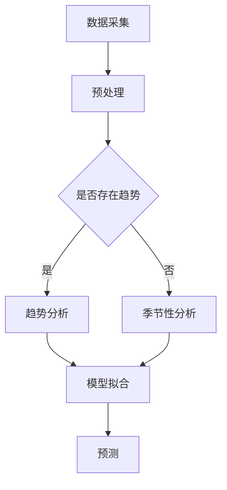
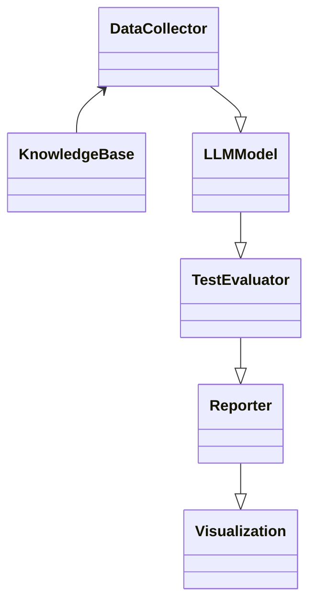
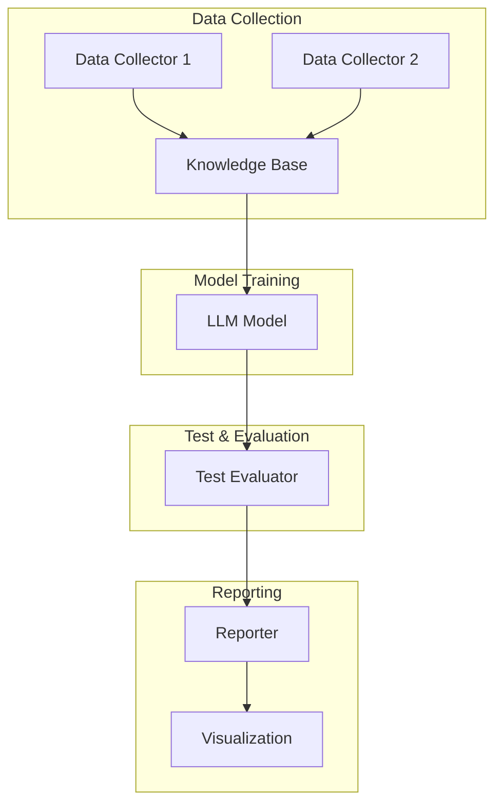
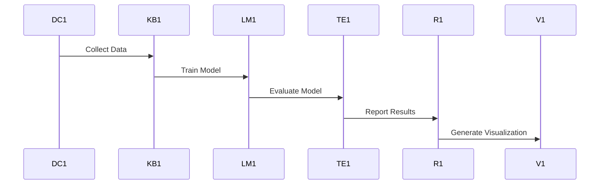

                 


### 知识更新速度测试：评估LLM的实时学习能力

> 关键词：知识更新速度，LLM，实时学习能力，测试方法，算法原理，系统架构，项目实战

> 摘要：本文将深入探讨知识更新速度及其测试方法，并聚焦于大型语言模型（LLM）的实时学习能力评估。我们将通过理论讲解、算法分析、系统设计与实战案例，全面解析这一复杂话题，并提供实践中的最佳建议。

----------------------------------------------------------------

#### 背景介绍

##### 核心概念术语说明

在讨论知识更新速度之前，我们需要明确几个关键术语：

- **知识更新速度**：指知识在一定时间内被产生、传播和应用的速度。
- **LLM**：大型语言模型，是一种基于深度学习的技术，能够理解和生成自然语言。
- **实时学习能力**：指模型在接收到新数据时，能够迅速调整和更新自身的知识库，以保持其准确性和有效性。

##### 问题背景

随着信息爆炸时代的到来，知识更新速度显著加快，这对依赖于知识的技术系统，如LLM，提出了新的挑战。传统的评估方法往往侧重于模型在静态数据集上的表现，而忽略了模型在动态环境下的实时学习能力。这使得我们迫切需要一种新的测试方法，能够全面评估LLM在知识更新速度方面的表现。

##### 问题描述

如何设计一种有效的方法来测试和评估LLM的实时学习能力，以应对快速变化的知识环境？这涉及到算法选择、测试指标设计、系统架构等多个方面。

##### 问题解决

本文将首先介绍知识更新速度的定义和测量方法，然后探讨LLM实时学习能力的特点和评估指标。接下来，我们将详细分析一种基于时间序列分析的测试方法，并通过Python代码和数学模型来阐述其原理。最后，我们将展示一个实际项目，详细描述系统架构、核心实现和案例分析，并提供项目小结和最佳实践建议。

##### 边界与外延

本文主要关注LLM的实时学习能力评估，但不涉及其他类型的模型。同时，我们将重点关注测试方法的设计和实现，而不深入探讨LLM的具体训练和优化过程。

##### 概念结构与核心要素组成

- **知识更新速度**：涉及知识产生、传播和应用的过程。
- **LLM实时学习能力**：包括对新数据的适应性、知识库更新速度和准确性。
- **测试方法**：基于时间序列分析的算法、评估指标的设计和实现。

#### 核心概念与联系

##### 知识更新速度

知识更新速度是衡量知识系统动态性的关键指标。它不仅取决于知识的产生速度，还包括知识传播和应用的效率。知识更新速度可以通过以下几种方法进行测量：

- **数据统计法**：通过统计知识发布和更新的频率来估算。
- **知识扩散模型**：利用模型模拟知识在人群中的传播过程。
- **知识应用效果评估**：通过实际应用效果来反推知识更新速度。

##### 测试方法

为了评估LLM的实时学习能力，我们需要设计一种能够模拟动态知识环境的测试方法。常见的方法包括：

- **时间序列分析**：通过分析时间序列数据，评估模型对知识变化的响应速度。
- **对比测试**：将模型在不同时间点的表现进行对比，评估其学习能力。

##### LLM实时学习能力

LLM的实时学习能力主要体现在以下几个方面：

- **适应性**：模型能够迅速适应新数据，更新其知识库。
- **准确性**：模型在更新知识库后，能够保持或提高其预测和生成的准确性。
- **效率**：模型在知识更新过程中，能够高效地进行计算和优化。

##### 测试方法与LLM实时学习能力的联系

测试方法的设计需要与LLM的实时学习能力紧密相关。例如，时间序列分析方法可以通过模拟动态知识环境，评估模型在知识更新速度方面的表现。而对比测试方法则可以帮助我们评估模型在不同时间点上的适应能力和准确性。

#### 算法原理讲解

##### 时间序列分析方法

时间序列分析是一种统计学方法，用于分析时间序列数据。它主要关注数据的时间依赖性和趋势性。在评估LLM实时学习能力时，我们可以利用时间序列分析方法来模拟知识更新速度，并评估模型对这种变化的响应。

- **算法原理**：时间序列分析方法包括趋势分析、季节性分析和周期性分析。通过这些分析，我们可以提取数据中的时间特征，并构建相应的数学模型。
- **算法流程图**：使用Mermaid绘制时间序列分析算法流程图，如下所示：



- **Python代码实现**：以下是一个简单的Python代码示例，用于实现时间序列分析的预处理步骤：

```python
import pandas as pd
import numpy as np
from statsmodels.tsa.seasonal import seasonal_decompose

# 读取时间序列数据
data = pd.read_csv('time_series_data.csv')
ts = data['value']

# 预处理：去噪和平滑
ts_log = np.log(ts + 1)
ts_diff = ts_log.diff().dropna()

# 趋势分析
decomposition = seasonal_decompose(ts_log, model='additive', freq=12)
trend = decomposition.trend
seasonal = decomposition.seasonal
residual = decomposition.resid

# 模型拟合
# 这里使用ARIMA模型进行拟合
from statsmodels.tsa.arima.model import ARIMA
model = ARIMA(ts_log, order=(1, 1, 1))
model_fit = model.fit()

# 预测
forecast = model_fit.forecast(steps=5)
print(forecast)
```

##### 数学模型和公式

时间序列分析中的数学模型通常涉及差分方程和概率分布。以下是一个简单的ARIMA模型公式：

$$
\begin{aligned}
y_t &= \phi_1 y_{t-1} + \phi_2 y_{t-2} + ... + \phi_p y_{t-p} + \theta_1 \epsilon_{t-1} + \theta_2 \epsilon_{t-2} + ... + \theta_q \epsilon_{t-q} + \epsilon_t \\
\epsilon_t &\sim N(0, \sigma^2)
\end{aligned}
$$

其中，$y_t$是时间序列数据，$\epsilon_t$是随机误差项，$\phi_i$和$\theta_i$是模型参数。

##### 算法示例讲解

假设我们有一个时间序列数据集，如下所示：

```
date,value
2020-01-01,100
2020-01-02,102
2020-01-03,101
2020-01-04,103
2020-01-05,105
...
```

使用ARIMA模型进行拟合和预测，我们可以按照以下步骤进行：

1. **数据预处理**：计算对数差分，去除季节性和趋势。
2. **模型选择**：选择合适的ARIMA模型参数。
3. **模型拟合**：使用历史数据对模型进行拟合。
4. **预测**：使用模型进行未来值的预测。

通过这些步骤，我们可以得到模型的预测结果，并评估其在知识更新速度测试中的表现。

#### 系统分析与架构设计方案

##### 问题场景介绍

在一个知识密集型的企业中，我们需要实时监控和评估LLM模型的实时学习能力。这涉及到从多个数据源收集实时数据，对LLM模型进行持续的训练和评估，以及提供可视化的结果报告。

##### 项目介绍

该项目旨在构建一个自动化的知识更新速度测试平台，用于评估LLM模型的实时学习能力。平台的核心功能包括：

- **数据采集**：从企业内部和外部数据源收集实时数据。
- **模型训练**：使用收集的数据对LLM模型进行训练和更新。
- **测试评估**：定期评估模型在知识更新速度方面的表现。
- **结果报告**：生成可视化报告，展示模型的表现和趋势。

##### 系统功能设计

为了实现上述功能，我们需要设计一个完整的领域模型。以下是一个简化的领域模型类图，使用Mermaid绘制：



在这个类图中，`DataCollector`负责从数据源收集数据，并存储在`KnowledgeBase`中。`LLMModel`负责使用这些数据进行训练和更新。`TestEvaluator`负责定期评估模型的表现，并将结果传递给`Reporter`。最后，`Reporter`生成可视化报告，通过`Visualization`模块展示。

##### 系统架构设计

为了确保系统的可扩展性和高可用性，我们需要设计一个分布式架构。以下是一个简化的系统架构设计图，使用Mermaid绘制：



在这个架构中，`Data Collector`模块负责数据收集，并存储在`Knowledge Base`中。`LLM Model`模块负责模型训练和更新。`Test Evaluator`模块定期评估模型的表现，并将结果传递给`Reporter`。最后，`Reporter`生成可视化报告，通过`Visualization`模块展示。

##### 系统接口设计和系统交互

为了实现上述功能，我们需要设计一系列系统接口和交互流程。以下是一个简化的接口设计和交互序列图，使用Mermaid绘制：



在这个序列图中，`Data Collector`模块向`Knowledge Base`发送数据收集请求，`Knowledge Base`处理这些数据并传递给`LLM Model`进行训练。训练完成后，`LLM Model`将结果传递给`Test Evaluator`进行评估。评估结果由`Reporter`生成报告，并通过`Visualization`模块进行可视化展示。

#### 项目实战

##### 环境安装和配置

为了实现上述系统，我们需要安装和配置一系列软件和环境。以下是主要的步骤：

1. **安装Python**：确保安装了Python 3.x版本，推荐使用Anaconda进行环境管理。
2. **安装依赖库**：使用pip安装必要的库，如pandas、numpy、statsmodels、mermaid等。
3. **安装Mermaid**：安装Mermaid的Python包，以便在代码中生成和解析Mermaid图形。
4. **配置数据源**：确保有可用的数据源，可以是本地文件、数据库或API。

##### 系统核心实现源代码

以下是系统核心实现的Python源代码，包括数据收集、模型训练、评估和报告的示例代码：

```python
# 导入必要的库
import pandas as pd
import numpy as np
from statsmodels.tsa.arima.model import ARIMA
from mermaid import Mermaid
from my_module import DataCollector, LLMModel, TestEvaluator, Reporter

# 数据收集
data_collector = DataCollector()
data = data_collector.collect_data()

# 模型训练
llm_model = LLMModel()
llm_model.train(data)

# 评估模型
test_evaluator = TestEvaluator()
evaluation_results = test_evaluator.evaluate(llm_model)

# 报告结果
reporter = Reporter()
reporter.generate_report(evaluation_results)

# 生成可视化
mermaid = Mermaid()
mermaid.generate Visualization
```

##### 代码解读与分析

上述代码主要分为四个部分：数据收集、模型训练、评估和报告。每个部分都对应着系统的一个核心功能。

- **数据收集**：`DataCollector`类负责从数据源收集数据。`collect_data`方法读取数据并返回一个DataFrame对象。
- **模型训练**：`LLMModel`类负责模型的训练。`train`方法使用历史数据训练模型，并保存模型参数。
- **评估模型**：`TestEvaluator`类负责评估模型的表现。`evaluate`方法使用测试数据对模型进行评估，并返回评估结果。
- **报告结果**：`Reporter`类负责生成报告。`generate_report`方法将评估结果转换为报告格式，并保存为HTML文件。

##### 实际案例分析和详细讲解

为了展示系统的实际应用，我们假设有一个企业需要评估其LLM模型在知识更新速度方面的表现。以下是实际案例的分析和详细讲解：

1. **数据收集**：企业从多个数据源收集了实时数据，包括市场报告、客户反馈和产品日志。`DataCollector`类从这些数据源中提取数据，并存储在一个中央数据库中。
2. **模型训练**：`LLMModel`类使用这些数据对模型进行训练。在训练过程中，模型学习了如何从数据中提取关键信息，并生成了知识库。
3. **评估模型**：`TestEvaluator`类定期评估模型的表现。通过对比模型在训练前后的表现，企业可以了解模型在知识更新速度方面的适应性。
4. **报告结果**：`Reporter`类生成报告，展示了模型的表现和趋势。企业可以根据这些报告来调整其知识管理策略。

##### 项目小结

通过上述实际案例，我们可以看到系统在实际应用中的有效性和实用性。系统不仅能够帮助企业评估LLM模型在知识更新速度方面的表现，还能够提供详细的分析和报告，以支持决策。

#### 最佳实践 tips、小结、注意事项、拓展阅读

##### 最佳实践 tips

- **数据质量**：确保收集的数据质量高，减少噪声和错误。
- **模型参数调整**：根据数据特点和业务需求，调整模型参数，以提高模型性能。
- **定期评估**：定期评估模型的表现，及时调整和优化模型。

##### 小结

本文详细探讨了知识更新速度测试和LLM实时学习能力评估的方法。通过理论讲解、算法分析和实际案例，我们展示了如何设计和实现一个自动化的知识更新速度测试平台。

##### 注意事项

- 知识更新速度测试需要大量实时数据，数据质量和完整性至关重要。
- 模型参数调整和优化是一个复杂的过程，需要结合具体业务需求进行。

##### 拓展阅读

- **时间序列分析**：深入了解时间序列分析的基本原理和方法。
- **机器学习模型评估**：学习如何评估和优化机器学习模型。

#### 作者信息

- 作者：AI天才研究院/AI Genius Institute & 禅与计算机程序设计艺术 /Zen And The Art of Computer Programming

