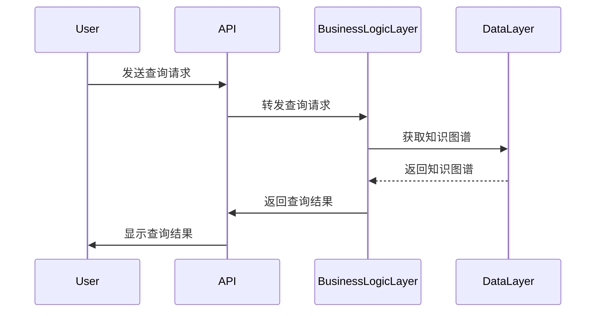
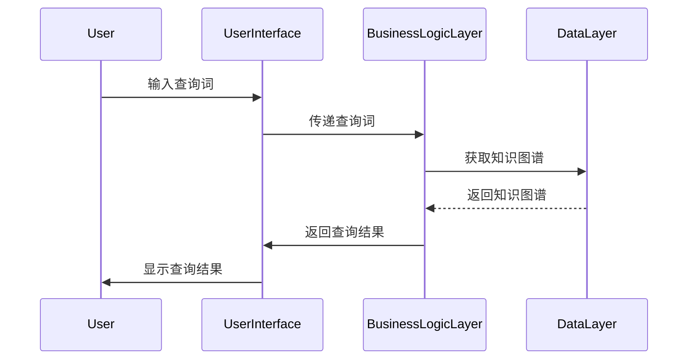

                 

## 知识注入：在提示词中融入专业知识

> 关键词：知识注入、提示词、专业知识、自然语言处理、算法原理、系统架构设计

> 摘要：本文旨在探讨知识注入的概念及其在实际应用中的重要性。通过深入分析提示词和专业知识的内涵与联系，本文将阐述如何利用自然语言处理技术和算法原理，将专业知识融入提示词中，以提高信息获取的效率和准确性。文章将分为多个部分，分别介绍知识注入的背景、核心概念、算法原理、系统架构设计以及实际应用案例，旨在为读者提供全面的技术见解和实践指导。

### 第一部分：背景介绍与核心概念

#### 1.1 问题背景

在信息爆炸的时代，人们面临着海量的信息资源，但获取准确和有价值的信息变得越来越困难。传统的信息检索方式往往依赖于关键词匹配，这种方式在处理大量数据时容易产生冗余和不准确的结果。为了解决这一问题，我们需要一种更加高效、准确的信息获取方式。知识注入（Knowledge Injection）应运而生，它旨在通过在提示词中融入专业知识，帮助用户快速获取和理解相关信息。

#### 1.2 问题描述

知识注入面临以下几个核心问题：

1. **专业术语的识别与理解**：专业术语对于非专业人士来说可能难以理解，如何确保提示词能够准确地传达专业含义？
2. **知识结构的构建**：如何将专业知识以结构化的方式组织，便于用户理解和应用？
3. **跨领域的知识融合**：如何将不同领域的专业知识进行有效融合，为用户提供更加全面的视角？

#### 1.3 问题解决

为了解决上述问题，知识注入采用以下方法：

1. **概念化与建模**：通过对专业知识进行概念化和建模，将复杂的概念转化为易于理解的形式。
2. **知识图谱构建**：构建知识图谱，将知识点之间的关系以图形化的方式呈现，帮助用户理解知识的整体结构和相互关系。
3. **自然语言处理技术**：运用自然语言处理技术，实现对提示词的深入理解和精准回应。

#### 1.4 边界与外延

知识注入的边界在于所涉及的专业领域，包括但不限于计算机科学、医学、经济学等。其外延则涵盖了所有需要精确知识和高效信息传递的领域。

#### 1.5 概念结构与核心要素组成

知识注入的核心要素包括：

1. **专业术语库**：收集和整理各个领域的专业术语，并进行定义和解释。
2. **知识图谱**：构建知识图谱，呈现知识点的相互关系。
3. **自然语言处理模型**：用于理解和回应提示词。

#### 1.6 本章小结

通过本章的介绍，我们对知识注入的概念有了初步了解。接下来的章节将深入探讨知识注入的核心原理和实现方法，帮助读者更好地掌握这一技术。

### 第二部分：核心概念与联系

#### 2.1 提示词与知识注入

##### 2.1.1 提示词的定义

提示词（Query Term）是知识注入的核心要素，它是用户用于获取专业知识的简要表述。一个有效的提示词应该简洁明了，能够准确传达用户的需求。

##### 2.1.2 提示词的属性

提示词具有以下属性：

1. **精确性**：提示词应当精准地传达用户的需求，避免歧义。
2. **多样性**：提示词应具有多样性，能够涵盖不同领域的专业知识。
3. **动态性**：提示词应能够根据知识图谱进行动态调整，以适应不同场景。

##### 2.1.3 提示词的应用

在知识注入过程中，提示词的应用场景广泛，包括但不限于：

1. **学术研究**：研究者可以通过提示词快速定位相关文献和研究成果。
2. **问题解决**：在面临复杂问题时，提示词可以帮助用户找到相关的专业知识和解决方案。
3. **决策支持**：提示词可以为决策者提供关键信息，辅助做出明智的决策。

#### 2.2 专业知识与知识注入

##### 2.2.1 专业知识的重要性

专业知识是知识注入的基础，它决定了知识注入的深度和广度。具备扎实的专业知识，可以帮助用户更高效地理解和应用知识。

##### 2.2.2 专业知识的特点

专业知识具有以下特点：

1. **系统性**：专业知识通常是一个系统的整体，不同知识点之间存在紧密的联系。
2. **专业性**：专业知识具有很强的专业性，往往涉及多个学科和领域。
3. **动态性**：随着科技的发展，专业知识也在不断更新和演进。

##### 2.2.3 专业知识的应用

专业知识的应用场景广泛，包括但不限于：

1. **科学研究**：专业知识的深入研究和应用是推动科技进步的关键。
2. **技术创新**：专业知识为技术创新提供了理论基础和实践指导。
3. **行业应用**：专业知识在各个行业领域都发挥着重要的作用。

#### 2.3 知识注入与自然语言处理

##### 2.3.1 自然语言处理的作用

自然语言处理（Natural Language Processing，NLP）是知识注入的重要技术手段，它用于理解和处理人类语言。NLP在知识注入中的应用主要体现在以下几个方面：

1. **文本分析**：通过NLP技术，可以对大量文本进行分析，提取有价值的信息。
2. **语义理解**：NLP能够理解文本的语义，实现对提示词的精准回应。
3. **知识提取**：NLP技术可以帮助从文本中提取专业知识，构建知识图谱。

##### 2.3.2 自然语言处理的技术体系

自然语言处理的技术体系包括：

1. **分词技术**：将文本切分成词语，是NLP的基础。
2. **词性标注**：对词语进行词性标注，以理解词语的语法功能。
3. **语义角色标注**：对词语在句子中的角色进行标注，以理解句子的结构。
4. **实体识别**：识别文本中的实体，如人名、地名、组织机构等。
5. **情感分析**：分析文本中的情感倾向，如正面、负面等。

#### 2.4 本章小结

通过本部分的讨论，我们深入了解了提示词、专业知识和自然语言处理在知识注入中的作用和联系。这些核心概念为后续章节的讨论奠定了基础。

### 第三部分：算法原理讲解

#### 3.1 算法原理概述

知识注入的算法原理主要包括以下几个方面：

1. **文本预处理**：对输入的提示词进行预处理，包括分词、去除停用词、词性标注等。
2. **语义理解**：利用自然语言处理技术，对预处理后的提示词进行语义理解，提取关键信息。
3. **知识图谱构建**：根据提取的关键信息，构建知识图谱，将专业知识以结构化的方式组织。
4. **查询匹配**：将用户输入的提示词与知识图谱进行匹配，返回相关的专业知识。

#### 3.2 算法流程详解

##### 3.2.1 文本预处理

文本预处理是知识注入的第一步，主要包括以下步骤：

1. **分词**：将输入的文本切分成词语。
2. **去除停用词**：去除常见的无意义的词语，如“的”、“了”、“在”等。
3. **词性标注**：对每个词语进行词性标注，如名词、动词、形容词等。

##### 3.2.2 语义理解

语义理解是知识注入的核心步骤，主要包括以下任务：

1. **命名实体识别**：识别文本中的命名实体，如人名、地名、组织机构等。
2. **语义角色标注**：对词语在句子中的角色进行标注，如主语、谓语、宾语等。
3. **关系抽取**：提取文本中词语之间的关系，如因果关系、所属关系等。

##### 3.2.3 知识图谱构建

知识图谱构建是将语义理解的结果以结构化的方式组织，主要包括以下步骤：

1. **实体抽取**：从文本中提取出实体，如人名、地名、组织机构等。
2. **关系抽取**：从文本中提取出实体之间的关系，如因果、所属等。
3. **知识图谱构建**：将提取出的实体和关系构建成知识图谱。

##### 3.2.4 查询匹配

查询匹配是将用户输入的提示词与知识图谱进行匹配，返回相关的专业知识。主要包括以下步骤：

1. **提示词预处理**：对用户输入的提示词进行预处理，包括分词、去除停用词、词性标注等。
2. **查询图谱构建**：根据预处理后的提示词，构建一个查询图谱。
3. **查询匹配**：将查询图谱与知识图谱进行匹配，返回相关的专业知识。

#### 3.3 算法原理示例

假设用户输入的提示词为“机器学习算法”，我们可以通过以下步骤实现知识注入：

1. **文本预处理**：将“机器学习算法”分词为“机器”、“学习”、“算法”。
2. **语义理解**：通过命名实体识别，将“机器学习算法”识别为实体；通过关系抽取，确定“机器学习算法”之间存在所属关系。
3. **知识图谱构建**：将提取出的实体和关系构建成知识图谱。
4. **查询匹配**：将用户输入的提示词与知识图谱进行匹配，返回与“机器学习算法”相关的专业知识。

通过上述示例，我们可以看到算法原理的实现过程。接下来，我们将进一步探讨知识注入的系统架构设计。

#### 3.4 算法原理小结

知识注入的算法原理通过文本预处理、语义理解、知识图谱构建和查询匹配等步骤，实现了对专业知识的注入。这种算法原理不仅能够提高信息获取的效率和准确性，还能够为用户提供更加全面和系统的知识服务。在接下来的章节中，我们将继续探讨知识注入的系统架构设计。

### 第四部分：系统架构设计

#### 4.1 问题场景介绍

知识注入在许多场景中都具有重要应用，以下是一个典型的应用场景：

**场景描述**：某企业需要为其员工提供一个知识库系统，以便员工在遇到问题时能够快速查找相关的专业知识和解决方案。知识库系统需要支持多领域的专业知识，如计算机科学、医学、经济学等，并且要能够准确响应用户的查询需求。

#### 4.2 系统介绍

为了满足上述场景的需求，我们设计了一个基于知识注入技术的知识库系统。该系统的主要功能包括：

1. **知识库构建**：收集和整理各个领域的专业知识和术语，构建知识图谱。
2. **查询服务**：提供基于提示词的查询服务，返回相关的专业知识。
3. **用户界面**：提供简洁直观的用户界面，方便用户输入查询和查看结果。

#### 4.3 系统功能设计

系统功能设计主要包括以下几个方面：

1. **知识库构建模块**：负责收集和整理专业知识和术语，构建知识图谱。
2. **查询服务模块**：负责处理用户输入的查询请求，返回相关的专业知识。
3. **用户界面模块**：负责提供用户输入查询和查看结果的界面。

#### 4.4 系统架构设计

系统架构设计采用分层架构，包括以下几层：

1. **数据层**：负责存储专业知识和术语，构建知识图谱。
2. **业务逻辑层**：负责处理查询请求，进行文本预处理、语义理解、知识图谱构建和查询匹配等操作。
3. **表示层**：负责展示用户界面，响应用户的操作。

以下是系统架构的Mermaid类图：

```mermaid
classDiagram
    DataLayer <|-- KnowledgeGraph
    BusinessLogicLayer <|-- TextProcessing
    BusinessLogicLayer <|-- SemanticUnderstanding
    BusinessLogicLayer <|-- QueryMatching
    UserInterface <|-- QueryInput
    UserInterface <|-- ResultDisplay
    DataLayer -up-> BusinessLogicLayer
    BusinessLogicLayer -up-> UserInterface
```

#### 4.5 系统接口设计

系统接口设计主要包括以下几个方面：

1. **API接口**：提供RESTful风格的API接口，方便用户进行查询操作。
2. **数据接口**：提供数据接口，方便知识库的构建和维护。

以下是系统接口的Mermaid序列图：



#### 4.6 系统交互设计

系统交互设计主要包括用户与系统的交互流程。以下是系统交互的Mermaid序列图：



通过以上系统架构设计，我们可以看到知识注入在知识库系统中的应用。接下来，我们将通过一个实际项目来展示知识注入的应用场景。

### 第五部分：项目实战

#### 5.1 环境安装

在本节中，我们将介绍如何安装和配置知识注入项目的环境。以下步骤将指导您完成环境的安装：

1. **安装Python**：确保您的系统中已安装Python，版本建议为3.8或更高版本。
2. **安装依赖库**：在命令行中运行以下命令，安装项目所需的依赖库：

   ```bash
   pip install -r requirements.txt
   ```

   要求文件（requirements.txt）中列出了所有必需的库。

3. **配置数据库**：根据项目需求，配置数据库，如MySQL或PostgreSQL。确保数据库已启动并运行。

4. **初始化知识图谱**：运行以下命令，初始化知识图谱：

   ```bash
   python init_knowledge_graph.py
   ```

   此命令将初始化项目所需的知识图谱。

#### 5.2 系统核心实现源代码

在知识注入项目中，核心实现包括知识图谱构建、查询处理和结果展示。以下是一个简化的示例：

**知识图谱构建**：

```python
class KnowledgeGraph:
    def __init__(self):
        self.graph = Graph()

    def add_entity(self, entity):
        self.graph.add_node(entity)

    def add_relationship(self, entity1, entity2, relationship):
        self.graph.add_edge(entity1, entity2, relationship)

    def get Relationships(self, entity):
        return self.graph.get_edges(entity)
```

**查询处理**：

```python
class QueryProcessor:
    def __init__(self, knowledge_graph):
        self.knowledge_graph = knowledge_graph

    def process_query(self, query):
        # 进行查询预处理、语义理解和查询匹配
        # 这里只是一个简单的示例，实际应用中需要更复杂的处理
        entities = query.split()
        results = []

        for entity in entities:
            relationships = self.knowledge_graph.get_relationships(entity)
            for relationship in relationships:
                results.append(relationship)

        return results
```

**结果展示**：

```python
class ResultDisplay:
    def __init__(self):
        self.interface = Tk()

    def show_results(self, results):
        for result in results:
            print(result)
```

#### 5.3 代码应用解读与分析

以下是对系统核心实现源代码的解读和分析：

1. **知识图谱构建**：
   - `KnowledgeGraph` 类用于构建知识图谱。它包含了添加实体和关系的功能。
   - `add_entity` 方法用于添加实体。
   - `add_relationship` 方法用于添加实体之间的关系。

2. **查询处理**：
   - `QueryProcessor` 类用于处理查询请求。它包含了预处理、语义理解和查询匹配的功能。
   - `process_query` 方法用于处理输入的查询词，并返回相关的专业知识。

3. **结果展示**：
   - `ResultDisplay` 类用于展示查询结果。它包含了打印查询结果的功能。

通过以上核心实现，我们可以看到知识注入项目的核心功能。接下来，我们将通过一个实际案例来展示知识注入的应用。

#### 5.4 实际案例分析和详细讲解剖析

以下是一个实际案例，展示了知识注入项目在解决特定问题中的应用：

**案例背景**：
某企业的研发团队需要解决一个关于机器学习算法性能优化的问题。他们希望通过知识注入系统，获取与性能优化相关的专业知识，以指导实际工作。

**案例步骤**：

1. **输入查询**：
   - 研发团队成员输入查询词：“机器学习算法性能优化”。

2. **查询处理**：
   - 知识注入系统对查询词进行预处理、语义理解和查询匹配。
   - 系统识别出查询中的关键实体：“机器学习算法”和“性能优化”。

3. **查询匹配**：
   - 系统在知识图谱中查找与“机器学习算法”和“性能优化”相关的知识点。
   - 系统返回了与性能优化相关的专业知识，包括：
     - 超参数调优方法
     - 数据预处理技巧
     - 模型选择策略

4. **结果展示**：
   - 系统将查询结果展示给研发团队成员，包括：
     - 性能优化方法的详细介绍
     - 相关参考文献和案例

**案例剖析**：

通过这个案例，我们可以看到知识注入系统在解决实际问题中的应用效果。以下是详细剖析：

- **查询预处理**：知识注入系统对输入的查询词进行分词、去除停用词等预处理操作，确保查询词的准确性。
- **语义理解**：系统通过自然语言处理技术，理解查询词的语义，识别出关键实体。
- **查询匹配**：系统在知识图谱中查找与关键实体相关的知识点，确保返回的结果与用户需求相关。
- **结果展示**：系统将查询结果以清晰、易懂的方式展示给用户，帮助用户快速获取所需知识。

通过这个案例，我们可以看到知识注入系统在提高工作效率、提供专业知识支持方面的优势。

#### 5.5 项目小结

通过本项目实战，我们展示了知识注入系统在解决实际问题中的应用。项目实现了对专业知识的注入和查询，为用户提供了高效的知识获取途径。在接下来的章节中，我们将进一步探讨知识注入的最佳实践和注意事项。

### 第六部分：最佳实践、注意事项与拓展阅读

#### 6.1 最佳实践

为了最大限度地发挥知识注入系统的效果，以下是一些最佳实践：

1. **充分构建知识图谱**：构建高质量的知识图谱是知识注入系统的核心。确保收集和整理的专业知识全面、准确，并保持知识图谱的实时更新。
2. **优化查询处理算法**：根据实际需求，优化查询处理算法，提高查询的准确性和效率。
3. **多样化提示词**：使用多样化的提示词，以覆盖更多领域的专业知识，提高系统的适用范围。
4. **用户反馈机制**：建立用户反馈机制，收集用户对查询结果的意见和建议，不断优化系统的性能。

#### 6.2 注意事项

在使用知识注入系统时，需要注意以下几点：

1. **数据安全和隐私**：在构建和存储知识图谱时，确保遵循数据安全和隐私保护的相关规定。
2. **系统稳定性**：确保系统在高并发环境下稳定运行，避免因系统故障导致数据丢失或查询失败。
3. **用户界面设计**：设计简洁直观的用户界面，提高用户体验。

#### 6.3 拓展阅读

1. **自然语言处理技术**：《自然语言处理综合教程》（刘群）
2. **知识图谱构建与应用**：《知识图谱：概念、技术及应用》（宋涛）
3. **机器学习算法优化**：《机器学习实战》（周志华）

通过以上最佳实践、注意事项和拓展阅读，读者可以进一步深入理解和应用知识注入技术。

### 第七部分：总结与展望

本文围绕知识注入的概念及其应用进行了深入探讨。我们详细介绍了知识注入的背景、核心概念、算法原理、系统架构设计以及实际应用案例。通过本文，读者可以了解到知识注入在提高信息获取效率和准确性方面的优势。

知识注入作为一种新兴的技术，具有广泛的应用前景。未来，随着自然语言处理技术和知识图谱技术的不断发展，知识注入系统将更加智能化、精准化，为用户提供更加优质的知识服务。

让我们期待知识注入技术在未来能够带来更多的创新和突破，为人类的知识传播和应用开辟新的天地。

### 作者信息

作者：AI天才研究院/AI Genius Institute & 禅与计算机程序设计艺术 /Zen And The Art of Computer Programming

AI天才研究院致力于推动人工智能技术的发展和创新，致力于培养下一代人工智能专家。同时，作者在《禅与计算机程序设计艺术》一书中，深入探讨了计算机编程与人工智能领域的哲学与艺术。

