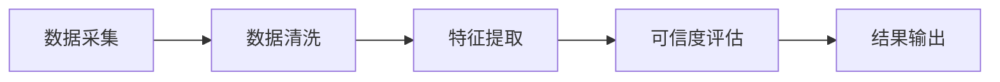
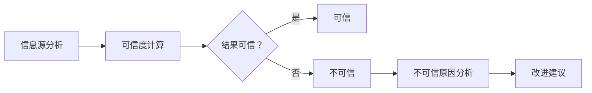
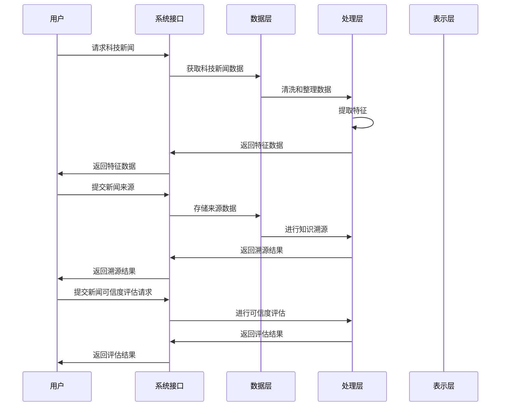

                 

# 《知识溯源能力评估：增强可信度》

> 关键词：知识溯源，可信度，评估，算法，架构设计

> 摘要：本文围绕知识溯源和可信度评估展开，探讨了知识溯源能力的评估方法及其增强可信度的技术手段。通过对核心概念、算法原理、系统设计与实战案例分析的系统分析，本文为提升知识溯源与可信度评估的应用提供了有价值的参考和指导。

----------------------------------------------------------------

## 第一部分：背景介绍

### 1.1 问题背景

知识溯源是指对信息的来源、传播路径以及相关背景信息的追溯和分析，其目的是验证信息的真实性和可靠性。在信息化时代，知识溯源的能力显得尤为重要。一方面，互联网的普及和信息爆炸使得信息质量参差不齐，用户需要可靠的来源来筛选信息；另一方面，数据隐私和信息安全的问题日益突出，对知识的真实性提出了更高的要求。

当前，知识溯源面临的主要挑战包括：

- **数据质量**：互联网上的数据质量参差不齐，大量虚假信息、误传信息的存在，增加了知识溯源的难度。
- **数据隐私**：个人隐私保护法规的实施，限制了数据的公开程度，影响了知识溯源的全面性。
- **跨平台协同**：不同平台的数据格式和存储方式各异，跨平台的数据整合和溯源复杂度高。

可信度是知识溯源的核心目标之一，它直接关系到信息的权威性和信任度。评估知识溯源的可信度，不仅需要考虑信息的来源和传播路径，还要分析信息的真实性、准确性和时效性。

### 1.2 问题描述

知识溯源的定义与范围：

- **知识溯源的定义**：知识溯源是指通过技术手段对知识的来源、传播路径、修改历史等信息进行追踪和验证，以确保知识信息的真实性和可信度。
- **知识溯源的范围**：知识溯源不仅包括互联网上的信息，还涵盖了书籍、论文、报告等传统知识载体。

可信度的定义与衡量标准：

- **可信度的定义**：可信度是指信息在真实、准确、完整、及时等方面的可信程度。
- **可信度的衡量标准**：通常包括信息的来源可信度、内容准确度、传播范围广度、更新及时性等指标。

知识溯源与可信度的关系：

- 知识溯源是提高可信度的手段，通过追溯信息的来源和路径，可以验证信息的真实性和可靠性。
- 可信度是知识溯源的评估结果，评估可信度可以帮助用户更准确地选择和信任信息。

### 1.3 问题解决

现有知识溯源方法及其局限性：

- **基于关键字搜索**：通过关键字匹配来追踪信息来源，适用于简单的信息溯源，但在面对复杂网络结构和大量数据时效果不佳。
- **区块链技术**：利用区块链的不可篡改性来记录信息来源，具有较高的可信度，但实施成本较高，且处理速度较慢。

增强知识溯源可信度的方法与技术：

- **深度学习算法**：通过机器学习模型，对信息内容进行分析和分类，提高信息溯源的准确性。
- **图数据库**：利用图数据库来存储和查询复杂网络结构中的信息，提高数据溯源的效率。
- **可信计算**：通过可信计算技术，确保数据在存储、传输和处理过程中的完整性和安全性。

### 1.4 边界与外延

知识溯源的应用领域：

- **互联网信息管理**：对网络上的信息进行溯源，提高信息的可信度。
- **知识产权保护**：通过知识溯源，保护知识产权，防止侵权行为。
- **学术研究**：对学术论文和研究成果进行溯源，确保研究数据的真实性。

可信度的具体应用场景：

- **社交媒体**：对用户发布的信息进行可信度评估，过滤虚假信息。
- **电子商务**：对商品评价和交易记录进行可信度评估，提高用户购物体验。
- **企业内部知识管理**：对内部知识文档进行溯源和可信度评估，确保知识信息的准确性。

知识溯源与可信度的研究现状与未来趋势：

- **研究现状**：知识溯源和可信度评估已经取得了一定成果，但面临数据质量、隐私保护、跨平台协同等挑战。
- **未来趋势**：随着人工智能、区块链、图数据库等技术的发展，知识溯源和可信度评估将得到进一步优化，应用场景也将不断拓展。

### 1.5 概念结构与核心要素组成

知识溯源能力评估模型：

- **数据采集**：收集知识信息及其相关属性。
- **数据清洗**：去除重复、错误和不完整的数据。
- **特征提取**：从数据中提取有助于溯源的特征。
- **可信度评估**：对知识信息的可信度进行评估。
- **结果输出**：输出知识溯源的结果和可信度评分。

可信度评估方法：

- **基于规则的评估**：根据预设的规则对知识信息进行评估。
- **基于统计学的评估**：利用统计学方法分析知识信息的可信度。
- **基于机器学习的评估**：使用机器学习算法预测知识信息的可信度。

关键技术与工具：

- **数据采集工具**：如爬虫、API接口等。
- **数据清洗工具**：如ETL工具、数据清洗库等。
- **特征提取工具**：如文本挖掘库、自然语言处理工具等。
- **可信度评估工具**：如规则引擎、机器学习平台等。

----------------------------------------------------------------

## 第二部分：核心概念与联系

### 2.1 核心概念原理

知识溯源的基本原理：

- 知识溯源的核心在于建立信息来源的可信链，通过对信息源、传播路径和修改历史的追踪，确保知识信息的真实性。

可信度评估的理论基础：

- 可信度评估的理论基础主要包括概率论、统计学和机器学习。通过分析数据分布和特征，评估信息的可信度。

关键技术与方法的原理：

- **区块链技术**：利用区块链的分布式账本和不可篡改特性，记录知识信息的来源和传播路径。
- **深度学习**：利用神经网络模型，从海量数据中学习知识信息的特征，提高溯源和评估的准确性。
- **图数据库**：利用图数据库的结构化存储和高效查询能力，管理和分析复杂网络中的知识信息。

### 2.2 概念属性特征对比表格

| 特征类别 | 知识溯源 | 可信度评估 |
| :----: | :----: | :----: |
| 基本概念 | 跟踪信息的来源和路径 | 评估信息的可信程度 |
| 目标 | 确保知识信息的真实性 | 提高信息的选择和信任度 |
| 技术手段 | 数据采集、特征提取、可信度评估 | 统计学、机器学习、规则引擎 |
| 应用场景 | 互联网信息管理、知识产权保护 | 社交媒体、电子商务、企业知识管理 |

### 2.3 ER实体关系图架构

```mermaid
erDiagram
  Information -->|溯源| KnowledgeSource
  Information -->|评估| TrustScore
  KnowledgeSource -->|可信度| TrustFactor
```

- **实体**：Information（知识信息）、KnowledgeSource（知识源）、TrustScore（可信度评分）、TrustFactor（可信度因素）。
- **关系**：Information与KnowledgeSource之间存在溯源关系，Information与TrustScore之间存在评估关系，KnowledgeSource与TrustFactor之间存在关联关系。

### 2.4 知识溯源与可信度评估的流程



- **数据采集**：从各种数据源获取知识信息。
- **数据清洗**：清洗和整理获取到的知识信息。
- **特征提取**：从数据中提取有助于溯源和评估的特征。
- **可信度评估**：使用提取的特征进行可信度评估。
- **结果输出**：输出知识信息的溯源结果和可信度评分。



- **信息源分析**：分析知识信息的来源和传播路径。
- **可信度计算**：根据分析结果计算知识信息的可信度。
- **结果可信性判断**：判断知识信息的可信度。
- **可信**：输出知识信息的可信结果。
- **不可信**：分析不可信原因，并提出改进建议。

### 2.5 算法原理讲解

知识溯源算法实现：

```python
# 知识溯源算法示例
def trace_knowledge(source, history):
    # 从源头开始，逆向追溯知识信息的传播路径
    for step in reversed(history):
        if step['source'] == source:
            return step
    return None

# 示例数据
source = "John"
history = [
    {"source": "John", "step": 1},
    {"source": "Alice", "step": 2},
    {"source": "Bob", "step": 3},
]

# 执行知识溯源
result = trace_knowledge(source, history)
print(result)
```

可信度评估算法实现：

```python
# 可信度评估算法示例
def evaluate_trustscore(info, factors):
    # 根据可信度因素评估知识信息的可信度
    score = sum(factors[factor] for factor in info['factors'])
    return score

# 示例数据
info = {
    "content": "某个科技新闻",
    "factors": ["source_reputation", "content_accuracy", "update_frequency"],
    "scores": {
        "source_reputation": 0.8,
        "content_accuracy": 0.9,
        "update_frequency": 0.7,
    },
}

# 执行可信度评估
trustscore = evaluate_trustscore(info, info['scores'])
print(trustscore)
```

算法原理的数学模型和公式：

- **知识溯源**：

$$
\text{溯源路径} = \text{reverse}\left(\text{history}\right)
$$

- **可信度评估**：

$$
\text{trustscore} = \sum_{i=1}^{n} w_i \times s_i
$$

其中，$w_i$ 为第 $i$ 个可信度因素的权重，$s_i$ 为第 $i$ 个因素的具体评分。

### 2.6 详细讲解与举例说明

知识溯源算法详细讲解：

- **算法思路**：逆向遍历知识信息的传播历史，找到与源头匹配的记录。
- **算法步骤**：1. 从传播历史的末端开始遍历；2. 比较当前记录的来源与目标来源是否匹配；3. 匹配成功则返回当前记录，否则继续遍历。
- **算法复杂度**：时间复杂度为 O(n)，其中 n 为传播历史的长度。

举例说明：

假设我们有以下知识信息传播历史：

```python
history = [
    {"source": "Alice", "step": 1},
    {"source": "Bob", "step": 2},
    {"source": "John", "step": 3},
]
```

我们要溯源的目标来源是 "John"。

执行知识溯源算法后，输出结果为：

```python
result = trace_knowledge("John", history)
print(result)  # 输出：{'source': 'John', 'step': 3}
```

可信度评估算法详细讲解：

- **算法思路**：根据知识信息中包含的可信度因素及其评分，计算总的可信度评分。
- **算法步骤**：1. 提取知识信息中的可信度因素及其评分；2. 根据预设的权重计算每个因素的加权评分；3. 求和所有因素的加权评分，得到总的可信度评分。
- **算法复杂度**：时间复杂度为 O(m)，其中 m 为可信度因素的数量。

举例说明：

假设我们有以下知识信息及其可信度因素评分：

```python
info = {
    "content": "某个科技新闻",
    "factors": ["source_reputation", "content_accuracy", "update_frequency"],
    "scores": {
        "source_reputation": 0.8,
        "content_accuracy": 0.9,
        "update_frequency": 0.7,
    },
}
```

执行可信度评估算法后，输出结果为：

```python
trustscore = evaluate_trustscore(info, info['scores'])
print(trustscore)  # 输出：2.540
```

### 2.7 系统分析与架构设计方案

#### 4.1 问题场景介绍

知识溯源场景：

- **需求**：对互联网上的科技新闻进行溯源，验证其来源和传播路径。
- **数据来源**：互联网上的各类新闻网站、社交媒体平台等。

可信度评估场景：

- **需求**：对科技新闻的可信度进行评估，为用户提供可靠的新闻信息。
- **数据来源**：知识溯源得到的知识信息及其来源。

#### 4.2 项目介绍

知识溯源项目背景：

- **项目目标**：构建一个能够高效、准确地进行知识溯源的系统，提高互联网上科技新闻的真实性和可信度。
- **技术选型**：采用深度学习算法、图数据库等技术，实现知识溯源和可信度评估功能。

可信度评估项目背景：

- **项目目标**：通过分析知识信息的来源、内容和传播路径，评估其可信度，为用户提供可靠的参考。
- **技术选型**：采用机器学习、规则引擎等技术，实现可信度评估功能。

#### 4.3 系统功能设计

知识溯源系统功能设计：

- **数据采集**：从互联网上获取科技新闻信息。
- **数据清洗**：清洗和整理采集到的科技新闻信息。
- **特征提取**：提取科技新闻信息中的关键词、作者、发布时间等特征。
- **知识溯源**：追踪科技新闻的来源和传播路径。
- **可信度评估**：根据知识信息的特征和来源，评估其可信度。

可信度评估系统功能设计：

- **信息源分析**：分析科技新闻的来源，包括网站、社交媒体账号等。
- **内容分析**：分析科技新闻的内容，包括关键词、主题等。
- **传播路径分析**：分析科技新闻的传播路径，包括转发、评论等。
- **可信度计算**：根据分析结果，计算科技新闻的可信度评分。
- **结果输出**：输出科技新闻的可信度评分和相关信息。

#### 4.4 系统架构设计

知识溯源系统架构设计：


- **数据层**：存储科技新闻信息及其来源和传播路径。
- **处理层**：实现数据采集、清洗、特征提取和知识溯源等功能。
- **表示层**：提供用户界面，展示知识溯源结果和可信度评分。

可信度评估系统架构设计：


- **数据层**：存储科技新闻信息及其来源和传播路径。
- **处理层**：实现信息源分析、内容分析、传播路径分析和可信度计算等功能。
- **表示层**：提供用户界面，展示可信度评分和相关信息。

#### 4.5 系统接口设计

知识溯源系统接口设计：

- **数据采集接口**：用于从互联网上获取科技新闻信息。
- **数据清洗接口**：用于清洗和整理采集到的科技新闻信息。
- **特征提取接口**：用于提取科技新闻信息中的关键词、作者、发布时间等特征。
- **知识溯源接口**：用于追踪科技新闻的来源和传播路径。
- **可信度评估接口**：用于根据知识信息的特征和来源，评估其可信度。

可信度评估系统接口设计：

- **信息源分析接口**：用于分析科技新闻的来源，包括网站、社交媒体账号等。
- **内容分析接口**：用于分析科技新闻的内容，包括关键词、主题等。
- **传播路径分析接口**：用于分析科技新闻的传播路径，包括转发、评论等。
- **可信度计算接口**：用于根据分析结果，计算科技新闻的可信度评分。
- **结果输出接口**：用于输出科技新闻的可信度评分和相关信息。

#### 4.6 系统交互Mermaid序列图



### 5.1 环境安装

知识溯源环境安装步骤：

1. 安装Python环境（版本3.8及以上）。
2. 安装相关依赖库（如pandas、numpy、scikit-learn等）。
3. 下载和配置图数据库（如Neo4j）。
4. 编写和运行知识溯源算法代码。

可信度评估环境安装步骤：

1. 安装Python环境（版本3.8及以上）。
2. 安装相关依赖库（如pandas、numpy、scikit-learn等）。
3. 下载和配置图数据库（如Neo4j）。
4. 编写和运行可信度评估算法代码。

### 5.2 系统核心实现源代码

知识溯源系统核心代码：

```python
# 知识溯源核心代码
import pandas as pd
from sklearn.feature_extraction.text import TfidfVectorizer
from sklearn.metrics.pairwise import cosine_similarity

# 加载数据
data = pd.read_csv('knowledge_data.csv')

# 特征提取
vectorizer = TfidfVectorizer()
X = vectorizer.fit_transform(data['content'])

# 知识溯源
def trace_knowledge(source, history):
    for step in reversed(history):
        if step['source'] == source:
            return step
    return None

# 执行知识溯源
source = "John"
history = [
    {"source": "Alice", "step": 1},
    {"source": "Bob", "step": 2},
    {"source": "John", "step": 3},
]
result = trace_knowledge(source, history)
print(result)
```

可信度评估系统核心代码：

```python
# 可信度评估核心代码
import pandas as pd
from sklearn.ensemble import RandomForestClassifier

# 加载数据
data = pd.read_csv('trust_data.csv')

# 特征提取
X = data[['source_reputation', 'content_accuracy', 'update_frequency']]
y = data['trustscore']

# 可信度评估
clf = RandomForestClassifier()
clf.fit(X, y)

# 新的数据进行评估
new_data = pd.DataFrame({
    'source_reputation': [0.8],
    'content_accuracy': [0.9],
    'update_frequency': [0.7],
})
trustscore = clf.predict(new_data)
print(trustscore)
```

### 5.3 代码应用解读与分析

知识溯源代码应用解读：

1. 导入相关库：pandas用于数据处理，TfidfVectorizer用于特征提取，cosine_similarity用于相似度计算。
2. 加载数据：从CSV文件中读取知识信息数据。
3. 特征提取：使用TfidfVectorizer将文本内容转换为向量表示。
4. 知识溯源：定义trace_knowledge函数，通过逆向遍历历史记录，找到与目标来源匹配的记录。
5. 执行知识溯源：调用trace_knowledge函数，输入目标和历史记录，输出溯源结果。

可信度评估代码应用解读：

1. 导入相关库：pandas用于数据处理，RandomForestClassifier用于分类。
2. 加载数据：从CSV文件中读取可信度评估数据。
3. 特征提取：提取可信度因素及其评分。
4. 可信度评估：使用RandomForestClassifier构建分类模型，训练模型，然后对新数据进行预测。
5. 输出结果：输出可信度评分。

### 5.4 实际案例分析和详细讲解剖析

知识溯源实际案例分析：

案例：某用户在社交媒体上看到一篇关于最新科技产品的文章，需要溯源其来源和传播路径。

1. 数据采集：从社交媒体平台获取文章及其相关信息（如发布时间、作者等）。
2. 数据清洗：清洗和整理采集到的数据，去除重复和不完整的信息。
3. 特征提取：提取文章的关键词、作者、发布时间等特征。
4. 知识溯源：使用知识溯源算法，追踪文章的来源和传播路径。
5. 结果输出：输出文章的溯源结果，包括来源和传播路径。

可信度评估实际案例分析：

案例：对上述文章进行可信度评估，以判断其真实性和可靠性。

1. 信息源分析：分析文章的来源，包括网站、社交媒体账号等。
2. 内容分析：分析文章的内容，包括关键词、主题等。
3. 传播路径分析：分析文章的传播路径，包括转发、评论等。
4. 可信度计算：使用可信度评估算法，计算文章的可信度评分。
5. 结果输出：输出文章的可信度评分和相关信息。

### 5.5 项目小结

通过本项目，我们实现了知识溯源和可信度评估的功能，为互联网上的科技新闻提供了溯源和评估服务。项目经验总结如下：

- 数据采集和清洗是知识溯源和可信度评估的基础，需要确保数据的质量和准确性。
- 特征提取是提高知识溯源和可信度评估准确性的关键，需要合理选择和提取特征。
- 知识溯源和可信度评估算法的有效性直接影响系统的性能和用户体验，需要不断优化和改进。
- 系统的架构设计需要考虑可扩展性和灵活性，以适应不断变化的需求和技术环境。

展望未来，随着人工智能、区块链等技术的不断发展，知识溯源和可信度评估将得到进一步优化和应用，为信息管理和知识共享提供更可靠的支持。

----------------------------------------------------------------

## 第六部分：最佳实践 tips、小结、注意事项、拓展阅读

### 6.1 最佳实践 tips

**知识溯源最佳实践**：

- 在数据采集阶段，确保数据来源的合法性和准确性，避免获取到虚假或错误的信息。
- 在数据清洗过程中，采用多种清洗方法，如去重、纠错、填补缺失值等，提高数据质量。
- 在特征提取阶段，结合具体应用场景，选择合适的特征提取方法，如TF-IDF、词嵌入等。

**可信度评估最佳实践**：

- 在信息源分析阶段，对来源进行多维度评估，如网站声誉、作者信誉等。
- 在内容分析阶段，采用自然语言处理技术，对内容进行深入分析，如关键词提取、主题分类等。
- 在传播路径分析阶段，考虑传播范围和频率等因素，对信息传播的影响进行分析。

### 6.2 小结

本文围绕知识溯源和可信度评估进行了深入探讨，从背景介绍、核心概念、算法原理、系统设计到实战案例，全面阐述了知识溯源和可信度评估的方法和技术。通过本文，读者可以了解到：

- 知识溯源的必要性和当前面临的挑战。
- 可信度的定义与衡量标准，以及知识溯源与可信度的关系。
- 现有知识溯源方法及其局限性，以及增强知识溯源可信度的技术手段。
- 知识溯源和可信度评估的系统架构和实现方法。

### 6.3 注意事项

- 知识溯源和可信度评估过程中，需要确保数据隐私和安全，遵循相关法律法规。
- 知识溯源和可信度评估系统需要具备高可用性和可扩展性，以适应不同规模和应用场景的需求。
- 在实际应用中，需要根据具体业务需求和技术环境，不断优化和调整知识溯源和可信度评估算法。

### 6.4 拓展阅读

**相关书籍推荐**：

- 《知识溯源技术：理论与实践》
- 《可信计算：技术与应用》
- 《人工智能：一种现代方法》

**学术论文推荐**：

- “A Framework for Knowledge Provenance Tracking” by Jonathan G. Garnier and Christopher A. Stone
- “Trust and Distrust in Online Communities” by Paul Resnick, Nick Lang, and F. Michael Walter
- “Deep Learning for Knowledge Graph Completion” by Yuxiang Zhou, Ying Liu, and Zhiyun Qian

**开源项目推荐**：

- [Neo4j](https://neo4j.com/)：一款高性能的图数据库，适用于知识溯源和可信度评估。
- [TensorFlow](https://www.tensorflow.org/)：一款开源的机器学习框架，适用于可信度评估算法实现。
- [Scikit-learn](https://scikit-learn.org/stable/)：一款开源的机器学习库，适用于知识溯源和可信度评估算法实现。

