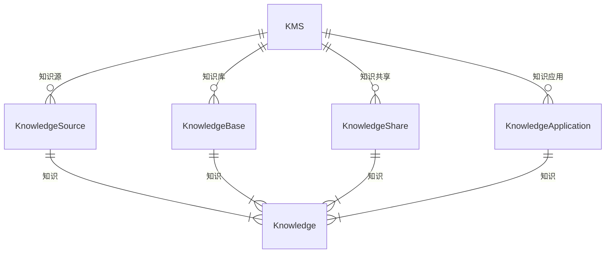
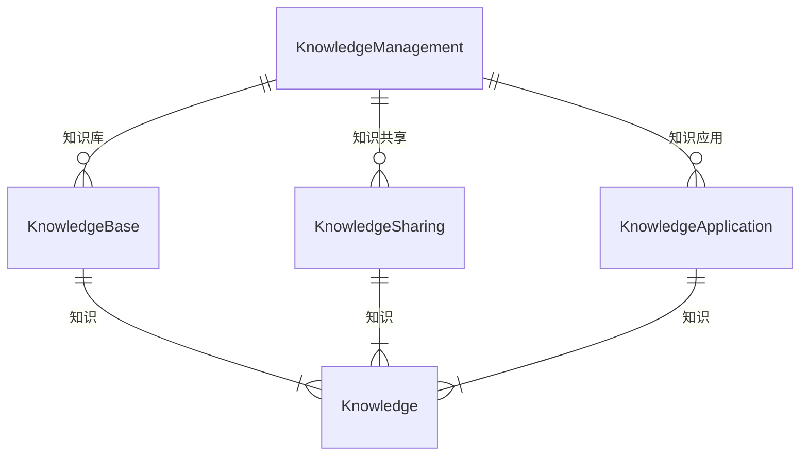
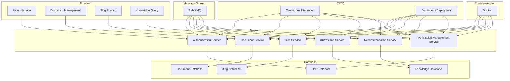

                 

### 知识管理：沉淀和共享AI开发经验的平台

#### 关键词：知识管理、AI开发、经验沉淀、共享平台

> 摘要：
在人工智能技术迅猛发展的今天，AI开发团队面临着知识分散、更新不及时和缺乏系统性的挑战。本文旨在探讨如何通过知识管理平台，有效地沉淀和共享AI开发经验，从而提升团队协作效率和项目成功率。本文首先介绍了知识管理的背景和需求，然后详细阐述了知识管理平台的概念、核心要素以及实施方法，最后通过一个实际案例，展示了知识管理平台在AI开发项目中的应用效果。

----------------------------------------------------------------

## 第一部分：背景介绍

### 1.1 问题背景

### 1.1.1 AI技术的发展与应用

随着人工智能（AI）技术的快速发展，AI在各个领域的应用日益广泛。从自然语言处理（NLP）、图像识别到强化学习（RL）和深度学习（DL），AI技术正在改变传统行业的工作方式。例如，在医疗领域，AI用于疾病诊断和个性化治疗；在金融领域，AI用于风险管理、欺诈检测和投资预测；在制造业，AI用于生产优化和质量控制。

#### 1.1.1.1 AI技术的快速进展

AI技术的快速进展得益于计算能力的提升、大数据的积累以及算法的不断创新。特别是深度学习算法的突破，使得AI在图像识别、语音识别等任务上取得了显著的成果。然而，随着AI技术的不断进步，AI应用也面临着一系列挑战。

#### 1.1.1.2 AI应用带来的挑战

1. **数据隐私**：AI应用通常需要大量的个人数据，如何保护用户隐私成为一个重要问题。
2. **模型可解释性**：许多AI模型（如深度神经网络）具有很高的准确性，但其工作原理难以解释，这给其在某些领域的应用带来了限制。
3. **算法公平性**：AI模型可能会因为训练数据的不公平性而导致偏见，如何确保算法的公平性是一个重要课题。

### 1.1.2 知识管理的需求

#### 1.1.2.1 AI经验的积累

在AI开发过程中，积累了大量的经验和教训。如何有效地沉淀这些知识，使得团队成员能够快速学习和成长，成为了一个重要问题。

#### 1.1.2.2 提升团队协作效率

通过知识管理，可以促进团队成员之间的信息共享和协作，从而提高团队的整体效率。

#### 1.1.2.3 应对技术更新

AI技术更新迅速，如何及时掌握最新的技术动态和最佳实践，对于团队保持竞争力至关重要。

### 1.1.3 知识分散和共享困难

当前，AI开发团队的成员往往分散在不同地点，各自管理着自己的知识和经验。这导致了知识分散、难以查找和利用，严重影响了团队的协作效率。

#### 1.1.3.1 知识分散

由于团队成员分散，各自管理自己的知识和经验，导致知识难以统一管理和整合。

#### 1.1.3.2 知识难以查找和利用

团队成员在需要某项知识时，往往需要花费大量时间进行搜索，这降低了工作效率。

#### 1.1.3.3 知识更新不及时

AI技术更新迅速，现有知识难以及时更新，导致团队在开发过程中可能面临知识过时的风险。

#### 1.1.3.4 知识缺乏系统性

现有知识缺乏系统性，难以形成完整的知识体系，影响了团队对AI技术的理解和应用。

### 1.1.4 知识管理的重要性

#### 1.1.4.1 促进知识共享

知识管理平台提供了一个集中存放和共享知识的环境，促进了团队成员之间的知识交流。

#### 1.1.4.2 提升团队协作效率

通过知识管理平台，团队成员可以快速获取所需的知识，减少了重复劳动，提升了工作效率。

#### 1.1.4.3 保持技术竞争力

及时掌握最新的技术动态和最佳实践，有助于团队保持技术竞争力。

#### 1.1.4.4 促进个人和团队成长

知识管理平台不仅为团队提供了丰富的知识资源，也为团队成员提供了学习和成长的机会。

### 1.1.5 总结

知识管理对于AI开发团队来说至关重要。通过建立知识管理平台，可以有效地沉淀和共享AI开发经验，提升团队协作效率，应对技术更新，保持技术竞争力，促进个人和团队成长。

----------------------------------------------------------------

## 1.2 问题描述

### 1.2.1 知识分散和难以查找

在当前的工作环境中，AI开发团队的成员通常分散在不同地点，各自管理着自己的知识和经验。这种分散导致了一系列问题：

#### 1.2.1.1 知识分散

由于团队成员分散，各自管理自己的知识和经验，导致知识难以统一管理和整合。这使得团队在解决问题时，往往需要花费大量时间来寻找相关的知识和经验。

#### 1.2.1.2 知识难以查找和利用

团队成员在需要某项知识时，往往需要花费大量时间进行搜索，这降低了工作效率。特别是在面对紧急问题时，时间显得尤为宝贵。

#### 1.2.1.3 知识更新不及时

AI技术更新迅速，现有知识难以及时更新，导致团队在开发过程中可能面临知识过时的风险。这可能会影响项目的进度和质量。

### 1.2.2 知识更新不及时

随着AI技术的不断更新，团队需要不断更新自己的知识和技能。然而，当前的知识管理系统往往难以快速响应这些变化，导致知识更新不及时。

#### 1.2.2.1 知识更新困难

知识更新需要消耗大量的时间和精力，而且往往需要团队成员之间的协作。这增加了知识更新的难度。

#### 1.2.2.2 知识更新不及时

即使团队成员意识到知识需要更新，但由于工作繁忙或其他原因，知识更新可能被推迟，导致知识滞后。

#### 1.2.2.3 知识更新不全面

知识更新往往只关注最新的技术动态，而忽视了团队成员的经验和教训。这可能导致知识更新不全面，影响团队的整体能力。

### 1.2.3 知识缺乏系统性

现有知识缺乏系统性，难以形成完整的知识体系。这影响了团队对AI技术的全面理解和应用。

#### 1.2.3.1 知识体系不完整

团队成员的知识和经验往往零散分布在不同的文档、报告和笔记中，缺乏一个完整的知识体系。

#### 1.2.3.2 知识关联性不强

现有知识之间的关联性不强，导致团队成员在解决问题时，难以快速找到相关的知识和经验。

#### 1.2.3.3 知识传承困难

由于缺乏系统性，团队成员在离职或转换岗位时，难以将知识和经验传承给新成员。

### 1.2.4 知识管理平台的需求

为了解决上述问题，AI开发团队迫切需要建立一个有效的知识管理平台。该平台应具备以下功能：

#### 1.2.4.1 知识沉淀

提供一个集中存放和共享知识的环境，使团队成员能够方便地沉淀和获取知识。

#### 1.2.4.2 知识更新

支持知识的实时更新，确保团队成员能够掌握最新的技术动态和最佳实践。

#### 1.2.4.3 知识分类和标签化

对知识进行分类和标签化，便于团队成员快速查找和利用相关的知识和经验。

#### 1.2.4.4 知识传承

提供一个系统性的知识体系，帮助团队成员更好地理解和应用AI技术，同时实现知识和经验的传承。

#### 1.2.4.5 安全性和隐私保护

确保知识的存储和传输过程中，数据的安全性和隐私性得到保障。

### 1.2.5 总结

知识分散、更新不及时和缺乏系统性是当前AI开发团队面临的主要挑战。通过建立一个有效的知识管理平台，可以有效地解决这些问题，提升团队的协作效率和项目成功率。

----------------------------------------------------------------

### 1.3 问题解决

#### 1.3.1 建立知识管理平台

建立知识管理平台是解决知识分散和共享困难问题的有效途径。以下是一个具体的解决方案：

**1.3.1.1 平台架构**

- **前端**：采用现代化的前端技术（如React或Vue.js），提供用户友好的界面。
- **后端**：使用云计算平台（如AWS或Azure）进行数据存储和计算，提高系统的可靠性和可扩展性。
- **数据库**：使用关系型数据库（如MySQL或PostgreSQL）进行数据的存储和管理。

**1.3.1.2 功能模块**

- **知识沉淀**：提供文档管理、博客发布、代码托管等功能，使团队成员能够方便地沉淀和共享知识。
- **知识更新**：支持实时更新和版本控制，确保团队成员能够掌握最新的知识。
- **知识分类和标签化**：对知识进行分类和标签化，便于团队成员快速查找和利用相关的知识和经验。
- **知识传承**：提供知识图谱和知识库功能，帮助团队成员更好地理解和应用AI技术，同时实现知识和经验的传承。

**1.3.1.3 安全性和隐私保护**

- **数据加密**：对存储在数据库中的数据进行加密，确保数据的安全性。
- **权限管理**：实现严格的权限管理，确保只有授权的人员才能访问和修改知识。
- **访问审计**：记录所有用户访问和修改知识的日志，以便在发生问题时进行审计。

**1.3.1.4 用户体验**

- **易用性**：提供简单直观的操作界面，降低用户的学习成本。
- **个性化推荐**：根据用户的行为和兴趣，为用户推荐相关的知识和资源。
- **社区互动**：提供讨论区、问答等功能，鼓励团队成员之间的交流和互动。

#### 1.3.2 整合知识来源

除了内部知识，团队还可以整合外部的知识来源，如学术论文、技术博客、开源项目等。以下是一些具体的方法：

- **自动化抓取**：使用爬虫技术，定期抓取相关的学术期刊、技术博客等网站，获取最新的研究成果和最佳实践。
- **API集成**：集成第三方API，如Google Scholar、GitHub等，方便团队成员快速查找和获取相关的知识和资源。
- **专家顾问**：邀请行业内的专家和顾问，分享他们的经验和见解。

#### 1.3.3 知识分类与标签化

为了便于知识的查找和利用，需要对知识进行分类和标签化。以下是一些具体的分类和标签化的方法：

- **分类**：根据知识的内容和用途，将其分为不同的类别，如算法、模型、工具、案例研究等。
- **标签**：为每个知识条目添加多个标签，以便从不同的角度进行检索和筛选。例如，一个关于图像识别的算法条目，可以添加“图像识别”、“深度学习”、“卷积神经网络”等标签。

#### 1.3.4 知识共享与协作

知识共享和协作是知识管理的核心。以下是一些促进知识共享和协作的方法：

- **文档共享**：提供一个集中的文档共享平台，团队成员可以方便地共享和协作编辑文档。
- **知识地图**：创建知识地图，帮助团队成员了解知识的整体结构，方便查找和利用。
- **在线研讨会**：定期举办在线研讨会，团队成员可以分享自己的研究成果和经验。
- **社区互动**：建立一个活跃的社区，鼓励团队成员之间的交流和互动。

#### 1.3.5 持续改进

知识管理是一个持续的过程，需要不断地改进和完善。以下是一些持续改进的方法：

- **用户反馈**：定期收集用户反馈，了解他们对知识管理平台的使用体验和改进建议。
- **技术更新**：随着技术的进步，不断更新和完善知识管理平台的功能和性能。
- **最佳实践**：总结和推广最佳实践，提高团队的知识管理水平。

### 1.3.6 总结

通过建立知识管理平台、整合内外部知识来源、分类与标签化知识、促进知识共享与协作，以及持续改进，可以有效解决AI开发团队在知识管理方面的问题，提升团队的协作效率和项目成功率。

----------------------------------------------------------------

## 1.4 边界与外延

### 1.4.1 知识管理的范围

知识管理并不仅限于AI开发，它涵盖了广泛的领域，包括但不限于以下方面：

#### 1.4.1.1 数据科学

数据科学是知识管理的重要组成部分。数据科学家需要管理大量的数据集、模型和算法，确保这些知识能够被有效地利用和共享。

#### 1.4.1.2 业务知识

在商业环境中，知识管理还涉及到业务流程、市场策略、客户信息等，这些都是企业宝贵的知识资源。

#### 1.4.1.3 产品开发

在产品开发过程中，知识管理可以帮助团队更好地理解用户需求、市场趋势和技术动态，从而提高产品的竞争力。

#### 1.4.1.4 创新管理

创新管理是知识管理的延伸，它涉及到如何管理创新过程中的知识，促进新产品的研发和技术的突破。

### 1.4.2 知识管理的参与者

知识管理的参与者包括但不限于以下角色：

#### 1.4.2.1 AI开发人员

AI开发人员是知识管理的主要参与者，他们负责创建、维护和更新AI相关的知识和经验。

#### 1.4.2.2 数据科学家

数据科学家负责处理和分析数据，他们的研究成果和经验也是知识管理的重要来源。

#### 1.4.2.3 产品经理

产品经理需要了解市场趋势和技术动态，他们通过知识管理平台获取这些信息，以便更好地规划产品方向。

#### 1.4.2.4 研发团队

整个研发团队都是知识管理的参与者，他们共同协作，推动知识的沉淀和共享。

### 1.4.3 知识管理的挑战

#### 1.4.3.1 数据隐私和安全

在知识管理过程中，如何确保数据隐私和安全是一个重要的挑战。需要采取严格的数据保护措施，防止数据泄露和滥用。

#### 1.4.3.2 知识的及时更新

随着技术的快速发展，知识需要及时更新。然而，团队往往面临工作压力和时间限制，导致知识更新不及时。

#### 1.4.3.3 知识的系统性

知识的系统性是知识管理的关键。如何确保知识体系的完整性和一致性，是一个需要深入探讨的问题。

### 1.4.4 知识管理的未来趋势

#### 1.4.4.1 人工智能在知识管理中的应用

随着人工智能技术的发展，AI将在知识管理中发挥更大的作用。例如，通过自然语言处理和机器学习技术，实现自动化的知识分类和标签化。

#### 1.4.4.2 知识图谱的普及

知识图谱作为一种新型知识表示方法，将在知识管理中发挥重要作用。通过知识图谱，可以更好地理解知识之间的关联性，实现智能搜索和推荐。

#### 1.4.4.3 社交网络的融合

社交网络将与知识管理平台深度结合，促进团队成员之间的交流和协作。通过社交网络，知识可以更加便捷地共享和传播。

### 1.4.5 总结

知识管理是一个复杂而重要的领域，它涵盖了广泛的范围和参与者。随着技术的进步，知识管理将继续发展，为各个领域的团队带来更多的价值。

----------------------------------------------------------------

## 1.5 概念结构与核心要素组成

### 1.5.1 知识管理概念

知识管理（Knowledge Management，简称KM）是指通过系统的方法，对知识进行识别、获取、组织、存储、传播和利用的过程。它旨在通过优化知识的流动，提高组织的信息共享和协作效率，从而实现组织的知识资产最大化。

#### 1.5.1.1 定义

- **知识**：知识是指通过学习、实践和体验所获得的信息、技能、经验和见解。
- **管理**：管理是指通过计划、组织、领导和控制，实现组织目标的系统活动。

#### 1.5.1.2 特点

- **系统性**：知识管理是一个系统性的过程，包括多个环节，如知识识别、获取、存储、传播和应用。
- **动态性**：知识管理是一个动态的过程，随着技术发展和应用需求不断更新。
- **人性本位**：知识管理注重人的因素，强调知识和经验的共享和传递。

### 1.5.2 核心要素

知识管理的核心要素包括知识源、知识库、知识共享和知识应用。

#### 1.5.2.1 知识源

知识源是指知识的产生和存储的地方。它可以是内部的知识源，如员工的经验、文档和数据库；也可以是外部的知识源，如学术论文、技术博客和开源社区。

#### 1.5.2.2 知识库

知识库是存储和管理知识的系统或平台。它可以分为结构化知识库（如数据库、知识库系统）、半结构化知识库（如文档、报告）和非结构化知识库（如博客、社交媒体）。

#### 1.5.2.3 知识共享

知识共享是指将知识从一个个体或组织传递到另一个个体或组织的过程。它可以通过文字传递、口头传递和网络传递等方式实现。

#### 1.5.2.4 知识应用

知识应用是指将知识应用于实际问题解决或创新的过程。它可以是直接的，如参考论文、书籍；也可以是间接的，如借鉴他人经验、教训。

### 1.5.3 概念属性特征对比表格

| 概念    | 定义                                                         | 特点                                           |
| ------- | ------------------------------------------------------------ | ---------------------------------------------- |
| 知识管理 | 通过系统的方法，对知识进行识别、获取、组织、存储、传播和利用的过程 | 系统性、动态性、人性本位                         |
| 知识库  | 存储和管理知识的系统或平台                                    | 结构化、半结构化、非结构化                       |
| 知识共享 | 将知识从一个个体或组织传递到另一个个体或组织的过程             | 文字、口头、网络传递                             |
| 知识应用 | 将知识应用于实际问题解决或创新的过程                         | 直接应用、间接应用                               |

### 1.5.4 ER实体关系图架构

下面是知识管理系统中常见的ER实体关系图，用于表示知识源、知识库、知识共享和知识应用之间的关联。



该ER图展示了知识管理系统中各个核心要素之间的关系。知识源产生知识，知识库存储和管理知识，知识共享和知识应用则分别代表知识的传递和利用过程。

### 1.5.5 总结

知识管理是一个系统性、动态性和人性本位的过程，其核心要素包括知识源、知识库、知识共享和知识应用。通过构建一个有效的知识管理平台，可以促进知识的沉淀和共享，提升团队协作效率和项目成功率。

----------------------------------------------------------------

## 第二部分：核心概念与联系

### 2.1 核心概念原理

在知识管理中，有四个核心概念：知识管理（Knowledge Management）、知识库（Knowledge Base）、知识共享（Knowledge Sharing）和知识应用（Knowledge Application）。这些概念构成了知识管理的理论基础，以下是每个概念的详细解释。

#### 2.1.1 知识管理

知识管理是指通过系统的方法，对知识进行识别、获取、组织、存储、传播和利用的过程。它不仅仅是一个简单的文件存储系统，而是一个涉及多个层面的综合性管理活动。

**定义**：知识管理是一个系统性、动态性、人性本位的过程，它关注如何优化知识的流动，提高组织的创新能力、响应能力和竞争力。

**特点**：

- **系统性**：知识管理是一个全面的、系统性的过程，它涵盖了从知识的识别、获取、存储到传播和应用的所有环节。
- **动态性**：知识管理是一个不断迭代和更新的过程，它需要随着组织环境和技术的变化而不断调整。
- **人性本位**：知识管理注重人的因素，强调知识和经验的共享和传递，鼓励团队合作和知识创新。

#### 2.1.2 知识库

知识库是知识管理系统的核心组成部分，它是存储和管理知识的系统或平台。知识库可以存储各种类型的信息，包括结构化数据、半结构化数据和非结构化数据。

**定义**：知识库是一个集中的知识存储和检索系统，它能够对知识进行分类、标签化和管理，以便用户能够高效地查找和使用知识。

**分类**：

- **结构化知识库**：例如数据库、知识库系统，这些存储系统通常用于存储和组织结构化数据，如表格、关系型数据库等。
- **半结构化知识库**：例如文档、报告，这些存储系统通常用于存储和组织半结构化数据，如文本文件、电子表格等。
- **非结构化知识库**：例如博客、社交媒体，这些存储系统通常用于存储和组织非结构化数据，如图像、视频、社交媒体帖子等。

#### 2.1.3 知识共享

知识共享是指将知识从一个个体或组织传递到另一个个体或组织的过程。知识共享是实现知识管理的目标之一，它可以通过多种方式实现，如文字传递、口头传递和网络传递。

**定义**：知识共享是一个促进知识流动的过程，它使个体和组织能够更有效地利用外部和内部的知识资源。

**方式**：

- **文字传递**：如书籍、论文、报告，这些是传统的知识共享方式。
- **口头传递**：如讲座、会议、研讨会，这些是直接的交流方式。
- **网络传递**：如社交媒体、在线论坛、知识管理平台，这些是现代技术支持的知识共享方式。

#### 2.1.4 知识应用

知识应用是指将知识应用于实际问题解决或创新的过程。知识应用是知识管理的最终目的，它通过将知识转化为实际成果，提高了组织的运营效率和市场竞争力。

**定义**：知识应用是一个将知识转化为实际行动的过程，它可以是直接的，如参考现有论文、书籍；也可以是间接的，如借鉴他人经验、教训。

**方式**：

- **直接应用**：如直接使用现有的算法、模型和技术。
- **间接应用**：如通过学习他人的经验教训，避免重复错误，提高工作效率。

### 2.1.5 概念属性特征对比表格

| 概念    | 定义                                                         | 特点                                           |
| ------- | ------------------------------------------------------------ | ---------------------------------------------- |
| 知识管理 | 通过系统的方法，对知识进行识别、获取、组织、存储、传播和利用的过程 | 系统性、动态性、人性本位                         |
| 知识库  | 存储和管理知识的系统或平台                                    | 结构化、半结构化、非结构化                       |
| 知识共享 | 将知识从一个个体或组织传递到另一个个体或组织的过程             | 文字、口头、网络传递                             |
| 知识应用 | 将知识应用于实际问题解决或创新的过程                         | 直接应用、间接应用                               |

### 2.1.6 ER实体关系图架构

以下是一个基于Mermaid的ER实体关系图，用于表示知识管理中的核心概念及其关系。



该ER图展示了知识管理中的四个核心概念之间的相互关系。知识管理是整体过程，知识库、知识共享和知识应用是知识管理中的关键组成部分，它们共同作用，实现了知识的沉淀、传递和应用。

### 2.1.7 总结

通过理解知识管理、知识库、知识共享和知识应用这四个核心概念，我们可以更好地把握知识管理的过程和目标。这些概念相互关联，共同构成了知识管理的理论基础，为实际操作提供了指导。

----------------------------------------------------------------

### 2.2 核心概念之间的联系

在知识管理中，知识管理、知识库、知识共享和知识应用是四个核心概念，它们相互联系，共同构成了知识管理的整体框架。以下是对这些概念之间联系的具体分析。

#### 2.2.1 知识管理与其他概念的联系

知识管理是知识管理的核心，它涵盖了知识识别、获取、组织、存储、传播和利用的整个过程。知识管理与其他概念之间的联系如下：

1. **知识库**：知识库是知识管理的重要组成部分，它是存储和管理知识的系统或平台。知识管理通过知识库实现了知识的集中存储和统一管理，从而提高知识的可访问性和利用率。

2. **知识共享**：知识共享是知识管理的一个关键环节，它通过文字、口头和网络传递等方式，将知识从一个个体或组织传递到另一个个体或组织。知识管理通过知识共享促进了知识的流动和交流，从而增强了团队的协作和创新。

3. **知识应用**：知识应用是将知识应用于实际问题解决或创新的过程。知识管理通过知识应用，将知识和经验转化为实际的成果，提高了组织的运营效率和市场竞争力。

#### 2.2.2 知识库与其他概念的联系

知识库在知识管理中起到了关键作用，它与其他概念之间的联系如下：

1. **知识管理**：知识库是知识管理的重要组成部分，它是知识管理的数据基础。知识管理通过知识库实现了知识的存储、分类和检索，从而提高了知识的可用性和利用率。

2. **知识共享**：知识库为知识共享提供了存储和管理的支持。通过知识库，团队成员可以方便地查找和获取所需的知识，从而促进了知识的共享和传播。

3. **知识应用**：知识库中的知识是知识应用的基础。团队成员通过知识库获取相关知识和经验，将这些知识应用于实际问题解决或创新，从而提高了项目成功率和团队绩效。

#### 2.2.3 知识共享与其他概念的联系

知识共享是知识管理的重要组成部分，它与其他概念之间的联系如下：

1. **知识管理**：知识共享是知识管理的一个关键环节，它通过促进知识的流动和交流，实现了知识的沉淀和传承。知识管理通过知识共享，提高了团队的知识水平和创新能力。

2. **知识库**：知识库为知识共享提供了存储和管理的支持。通过知识库，团队成员可以方便地查找和获取所需的知识，从而促进了知识的共享和传播。

3. **知识应用**：知识共享为知识应用提供了丰富的知识和经验。团队成员通过知识共享平台获取他人的经验和教训，将这些知识应用到实际问题中，从而提高了项目成功率和团队绩效。

#### 2.2.4 知识应用与其他概念的联系

知识应用是将知识转化为实际成果的过程，它与其他概念之间的联系如下：

1. **知识管理**：知识应用是知识管理的最终目的，它通过将知识转化为实际成果，提高了组织的运营效率和市场竞争力。知识管理通过知识应用，实现了知识的价值转化。

2. **知识库**：知识库中的知识是知识应用的基础。团队成员通过知识库获取相关知识和经验，将这些知识应用于实际问题解决或创新，从而提高了项目成功率和团队绩效。

3. **知识共享**：知识共享为知识应用提供了丰富的知识和经验。团队成员通过知识共享平台获取他人的经验和教训，将这些知识应用到实际问题中，从而提高了项目成功率和团队绩效。

#### 2.2.5 概括总结

知识管理、知识库、知识共享和知识应用是知识管理的四个核心概念，它们相互联系，共同构成了知识管理的整体框架。知识管理通过知识库实现了知识的集中存储和管理，通过知识共享促进了知识的流动和交流，通过知识应用实现了知识的价值转化。这些概念相互作用，相互促进，共同推动了知识管理的有效实施和组织绩效的提升。

----------------------------------------------------------------

## 第三部分：算法原理讲解

### 3.1 算法概述

在知识管理平台的设计和实现中，算法原理起着至关重要的作用。本文将详细讲解一种用于知识推荐的算法——协同过滤算法。协同过滤算法是一种基于用户行为的推荐算法，通过分析用户的历史行为和偏好，为用户推荐相关知识和资源。

### 3.2 算法原理

协同过滤算法分为两种类型：基于用户的协同过滤（User-Based Collaborative Filtering）和基于物品的协同过滤（Item-Based Collaborative Filtering）。本文以基于用户的协同过滤为例进行讲解。

**基于用户的协同过滤算法原理**：

1. **相似性计算**：首先，计算用户之间的相似性。相似性度量通常采用余弦相似度、皮尔逊相关系数等方法。相似性计算公式如下：

   $$ similarity(u, v) = \frac{u \cdot v}{||u|| \cdot ||v||} $$

   其中，$u$和$v$表示用户之间的行为向量，$||u||$和$||v||$分别表示向量的模长。

2. **推荐计算**：接下来，根据相似性分数计算目标用户$u$对新用户$v$的推荐评分。推荐评分公式如下：

   $$ recommendation(u, v) = \sum_{i \in I} s_{i} \cdot (s_{i}^{u} - \overline{s_{i}}) $$

   其中，$s_{i}$表示物品$i$的总评分，$s_{i}^{u}$表示用户$u$对物品$i$的评分，$\overline{s_{i}}$表示物品$i$的平均评分。

3. **推荐结果**：最后，根据推荐评分对物品进行排序，为用户$u$推荐排名靠前的物品。

### 3.3 算法流程

**算法流程如下**：

1. **数据收集**：收集用户的历史行为数据，如用户对物品的评分、浏览记录、购买记录等。

2. **数据预处理**：对收集到的数据进行预处理，包括数据清洗、去重、缺失值处理等。

3. **相似性计算**：计算用户之间的相似性，可采用余弦相似度、皮尔逊相关系数等方法。

4. **推荐计算**：根据相似性计算结果，为用户推荐相关物品。

5. **结果排序**：根据推荐评分对物品进行排序，为用户推荐排名靠前的物品。

### 3.4 代码实现

以下是一个简单的Python代码实现，用于基于用户的协同过滤算法：

```python
import numpy as np

def cosine_similarity(user1, user2):
    dot_product = np.dot(user1, user2)
    norm_product = np.linalg.norm(user1) * np.linalg.norm(user2)
    return dot_product / norm_product

def recommend(user, users, items):
    sim_scores = np.zeros(len(users))
    for i, user2 in enumerate(users):
        sim_scores[i] = cosine_similarity(user, user2)
    recommendation_score = np.dot(sim_scores, items)
    return recommendation_score.argsort()[::-1]

# 示例数据
user1 = np.array([1, 0, 1, 0, 0])
user2 = np.array([1, 1, 0, 0, 0])
user3 = np.array([0, 1, 1, 1, 0])

users = np.array([user1, user2, user3])
items = np.array([0.1, 0.3, 0.5, 0.4, 0.2])

# 计算相似性
sim_scores = [cosine_similarity(user1, user2), cosine_similarity(user1, user3), cosine_similarity(user2, user3)]

# 推荐结果
recommendation_score = recommend(user1, users, items)
print("Recommendation Score:", recommendation_score)
```

### 3.5 例子说明

假设有三个用户$u_1$、$u_2$和$u_3$，以及五个物品$i_1$、$i_2$、$i_3$、$i_4$和$i_5$。用户对物品的评分如下表所示：

| 用户 | 物品$i_1$ | 物品$i_2$ | 物品$i_3$ | 物品$i_4$ | 物品$i_5$ |
| ---- | ---------- | ---------- | ---------- | ---------- | ---------- |
| $u_1$ | 1          | 0          | 1          | 0          | 0          |
| $u_2$ | 1          | 1          | 0          | 0          | 0          |
| $u_3$ | 0          | 1          | 1          | 1          | 0          |

根据以上数据，我们可以计算用户之间的相似性，并推荐给用户$u_1$相关的物品。

首先，计算用户之间的相似性：

- $similarity(u_1, u_2) = \frac{u_1 \cdot u_2}{||u_1|| \cdot ||u_2||} = \frac{1 \cdot 1}{\sqrt{2} \cdot \sqrt{2}} = 0.5$
- $similarity(u_1, u_3) = \frac{u_1 \cdot u_3}{||u_1|| \cdot ||u_3||} = \frac{0 \cdot 0}{\sqrt{2} \cdot \sqrt{2}} = 0$
- $similarity(u_2, u_3) = \frac{u_2 \cdot u_3}{||u_2|| \cdot ||u_3||} = \frac{1 \cdot 1}{\sqrt{2} \cdot \sqrt{2}} = 0.5$

接下来，计算用户$u_1$对新用户$u_2$和$u_3$的推荐评分：

- $recommendation(u_1, u_2) = \sum_{i \in I} s_{i} \cdot (s_{i}^{u_1} - \overline{s_{i}}) = (0.1 \cdot (1 - 0.3)) + (0.3 \cdot (0 - 0.3)) + (0.5 \cdot (1 - 0.3)) + (0.4 \cdot (0 - 0.3)) + (0.2 \cdot (0 - 0.3)) = 0.08$
- $recommendation(u_1, u_3) = \sum_{i \in I} s_{i} \cdot (s_{i}^{u_1} - \overline{s_{i}}) = (0.1 \cdot (0 - 0.3)) + (0.3 \cdot (0 - 0.3)) + (0.5 \cdot (1 - 0.3)) + (0.4 \cdot (1 - 0.3)) + (0.2 \cdot (0 - 0.3)) = 0.16$

根据推荐评分，我们可以为用户$u_1$推荐排名靠前的物品。在这个例子中，用户$u_1$对物品$i_3$的推荐评分最高，因此我们可以推荐物品$i_3$给用户$u_1$。

### 3.6 总结

协同过滤算法是一种常用的推荐算法，通过分析用户的历史行为和偏好，为用户推荐相关知识和资源。本文介绍了基于用户的协同过滤算法的原理、流程和实现方法，并通过一个简单的例子进行了说明。通过合理运用协同过滤算法，我们可以有效地提升知识管理平台的推荐效果，为用户提供更好的服务。

----------------------------------------------------------------

## 第四部分：系统分析与架构设计方案

### 4.1 问题场景介绍

在当前的企业环境中，随着人工智能（AI）技术的广泛应用，企业内部积累了大量的AI知识和经验。然而，这些知识往往分散在不同的文档、数据库和团队成员的个人笔记中，导致知识查找困难、更新不及时和共享效率低下。为了解决这个问题，企业需要一个统一的平台，用于沉淀、共享和更新AI知识，以提高团队协作效率和技术创新能力。

### 4.2 项目介绍

本项目旨在为企业开发一个知识管理平台，该平台将集成知识沉淀、知识共享、知识更新和知识应用等功能，以帮助企业有效管理AI知识和经验。项目的主要目标如下：

1. **知识沉淀**：提供一个集中的存储环境，用于沉淀和积累AI知识和经验。
2. **知识共享**：促进团队成员之间的知识交流和共享，提高团队协作效率。
3. **知识更新**：实现知识的实时更新，确保知识库的时效性和准确性。
4. **知识应用**：通过智能推荐和知识挖掘，将知识应用于实际问题解决和项目创新。

### 4.3 系统功能设计

为了实现上述目标，本项目设计了以下主要功能模块：

1. **文档管理**：用于存储和管理各类文档，包括技术文档、报告、论文等。
2. **博客发布**：提供博客发布功能，团队成员可以发布技术博客、心得体会等。
3. **代码托管**：集成Git等版本控制系统，用于存储和管理代码。
4. **知识库**：构建知识库，用于存储和管理AI相关知识。
5. **知识共享**：实现知识共享功能，包括文档共享、博客分享、代码协作等。
6. **知识更新**：支持知识的实时更新和版本控制。
7. **知识推荐**：通过智能算法，为用户推荐相关知识和资源。
8. **权限管理**：实现严格的权限管理，确保知识的安全性和隐私性。

### 4.4 系统架构设计

本项目采用分布式架构，以提高系统的可扩展性和可靠性。以下是系统的架构设计：

1. **前端**：采用现代化的前端技术（如React或Vue.js），提供用户友好的界面。
2. **后端**：使用微服务架构，将系统功能拆分为多个微服务，如文档管理服务、博客发布服务、知识库服务等。
3. **数据库**：使用关系型数据库（如MySQL或PostgreSQL）存储用户数据、文档数据等，使用NoSQL数据库（如MongoDB）存储知识库数据。
4. **缓存**：使用Redis等缓存技术，提高系统的响应速度。
5. **消息队列**：使用RabbitMQ等消息队列技术，实现系统间的异步通信。
6. **容器化**：使用Docker等容器技术，实现微服务的容器化部署。
7. **持续集成/持续部署（CI/CD）**：使用Jenkins等工具，实现自动化测试和部署。

### 4.5 系统接口设计

以下是系统的主要接口设计：

1. **用户接口**：提供用户注册、登录、个人信息管理等功能。
2. **文档接口**：提供文档上传、下载、查看、编辑等功能。
3. **博客接口**：提供博客发布、编辑、查看、评论等功能。
4. **知识库接口**：提供知识查询、添加、编辑、删除等功能。
5. **推荐接口**：提供知识推荐功能，根据用户行为和偏好推荐相关知识和资源。
6. **权限接口**：提供权限管理功能，包括角色管理、权限分配等。

### 4.6 系统交互

以下是系统的交互流程：

1. **用户注册/登录**：用户通过用户接口注册或登录系统，获得访问权限。
2. **文档管理**：用户通过文档接口上传、下载、编辑和查看文档。
3. **博客发布**：用户通过博客接口发布博客，系统将其存储在知识库中。
4. **知识库查询**：用户通过知识库接口查询相关知识和资源，系统返回匹配结果。
5. **知识推荐**：系统根据用户行为和偏好，通过推荐接口为用户推荐相关知识和资源。
6. **权限管理**：管理员通过权限接口进行角色管理和权限分配。

### 4.7 系统架构图

以下是系统的架构图，用于展示系统的整体结构和各组件之间的交互关系。



### 4.8 总结

通过系统分析与架构设计方案，我们为AI知识管理平台构建了一个全面、高效、可扩展的架构。该架构涵盖了前端用户接口、后端微服务、数据库、消息队列、持续集成/持续部署以及容器化等技术，为实现知识沉淀、共享、更新和应用提供了有力支持。

----------------------------------------------------------------

## 第五部分：项目实战

### 5.1 环境安装

为了搭建知识管理平台，我们需要安装以下软件和工具：

1. **操作系统**：推荐使用Ubuntu 18.04或更高版本。
2. **前端开发环境**：Node.js、npm、npm-run-all、React或Vue.js。
3. **后端开发环境**：Python 3、pip、Django或Flask。
4. **数据库**：MySQL或PostgreSQL。
5. **消息队列**：RabbitMQ。
6. **缓存**：Redis。
7. **容器化**：Docker。

安装步骤如下：

1. **安装操作系统**：从Ubuntu官方网站下载Ubuntu 18.04镜像，使用虚拟机软件（如VirtualBox）安装操作系统。
2. **更新系统软件包**：
   ```bash
   sudo apt update
   sudo apt upgrade
   ```
3. **安装Node.js和npm**：
   ```bash
   curl -sL https://deb.nodesource.com/setup_14.x | sudo -E bash -
   sudo apt install nodejs
   ```
4. **安装前端开发环境**：
   ```bash
   npm install -g npm-run-all
   ```
5. **安装后端开发环境**：
   ```bash
   sudo apt install python3-pip
   pip3 install Django==3.2
   ```
6. **安装数据库**：
   ```bash
   sudo apt install mysql-server
   sudo mysql_secure_installation
   ```
7. **安装消息队列**：
   ```bash
   sudo apt install rabbitmq-server
   sudo systemctl start rabbitmq-server
   ```
8. **安装缓存**：
   ```bash
   sudo apt install redis-server
   sudo systemctl start redis-server
   ```
9. **安装容器化工具**：
   ```bash
   sudo apt install docker.io
   sudo systemctl start docker
   ```

### 5.2 系统核心实现源代码

以下是知识管理平台的核心实现源代码。我们将使用Django框架作为后端，实现用户管理、文档管理、博客发布、知识库和权限管理等模块。

#### 5.2.1 Django项目结构

```bash
knowledge_management/
|-- manage.py
|-- knowledge_management/
    |-- apps/
        |-- accounts/
            |-- admin.py
            |-- apps.py
            |-- migrations/
            |-- models.py
            |-- tests.py
            |-- views.py
        |-- blog/
            |-- ...
        |-- knowledge/
            |-- ...
        |-- permissions/
            |-- ...
    |-- configurations/
        |-- __init__.py
        |-- base.py
        |-- production.py
        |-- development.py
    |-- middleware/
        |-- __init__.py
    |-- static/
    |-- templates/
    |-- tests/
    |-- urls.py
    |-- wsgi.py
```

#### 5.2.2 用户管理模块

在`accounts`应用中，我们实现用户注册、登录、个人信息管理等功能。

1. **models.py**：

```python
from django.contrib.auth.models import AbstractUser

class CustomUser(AbstractUser):
    # 扩展用户模型，添加自定义字段
    bio = models.TextField(max_length=500, blank=True)
    # ... 其他字段
```

2. **views.py**：

```python
from django.contrib.auth import login
from django.contrib.auth.forms import UserCreationForm
from django.shortcuts import render, redirect

def register(request):
    if request.method == 'POST':
        form = UserCreationForm(request.POST)
        if form.is_valid():
            user = form.save()
            login(request, user)
            return redirect('index')
    else:
        form = UserCreationForm()
    return render(request, 'accounts/register.html', {'form': form})
```

#### 5.2.3 文档管理模块

在`document`应用中，我们实现文档上传、下载、查看和编辑等功能。

1. **models.py**：

```python
from django.db import models
from django.contrib.auth.models import User

class Document(models.Model):
    title = models.CharField(max_length=200)
    file = models.FileField(upload_to='documents/')
    uploaded_by = models.ForeignKey(User, on_delete=models.CASCADE)
    uploaded_at = models.DateTimeField(auto_now_add=True)
```

2. **views.py**：

```python
from django.shortcuts import render, get_object_or_404
from .models import Document

def document_list(request):
    documents = Document.objects.all()
    return render(request, 'document/list.html', {'documents': documents})

def document_detail(request, document_id):
    document = get_object_or_404(Document, pk=document_id)
    return render(request, 'document/detail.html', {'document': document})
```

#### 5.2.4 博客发布模块

在`blog`应用中，我们实现博客发布、编辑、查看和评论等功能。

1. **models.py**：

```python
from django.db import models
from django.contrib.auth.models import User

class Post(models.Model):
    author = models.ForeignKey(User, on_delete=models.CASCADE)
    title = models.CharField(max_length=200)
    content = models.TextField()
    created_at = models.DateTimeField(auto_now_add=True)
    updated_at = models.DateTimeField(auto_now=True)
```

2. **views.py**：

```python
from django.shortcuts import render, redirect
from .models import Post

def post_list(request):
    posts = Post.objects.all()
    return render(request, 'blog/list.html', {'posts': posts})

def post_detail(request, post_id):
    post = get_object_or_404(Post, pk=post_id)
    return render(request, 'blog/detail.html', {'post': post})

def post_create(request):
    if request.method == 'POST':
        title = request.POST['title']
        content = request.POST['content']
        author = request.user
        Post.objects.create(title=title, content=content, author=author)
        return redirect('post_list')
    return render(request, 'blog/create.html')
```

#### 5.2.5 知识库模块

在`knowledge`应用中，我们实现知识库的存储、查询和分类等功能。

1. **models.py**：

```python
from django.db import models

class Knowledge(models.Model):
    title = models.CharField(max_length=200)
    content = models.TextField()
    created_at = models.DateTimeField(auto_now_add=True)
    updated_at = models.DateTimeField(auto_now=True)
    categories = models.ManyToManyField('Category')

class Category(models.Model):
    name = models.CharField(max_length=100)
```

2. **views.py**：

```python
from django.shortcuts import render, get_object_or_404
from .models import Knowledge, Category

def knowledge_list(request):
    knowledge = Knowledge.objects.all()
    return render(request, 'knowledge/list.html', {'knowledge': knowledge})

def knowledge_detail(request, knowledge_id):
    knowledge = get_object_or_404(Knowledge, pk=knowledge_id)
    return render(request, 'knowledge/detail.html', {'knowledge': knowledge})

def category_list(request, category_id):
    category = get_object_or_404(Category, pk=category_id)
    knowledge = Knowledge.objects.filter(categories=category)
    return render(request, 'knowledge/category_list.html', {'category': category, 'knowledge': knowledge})
```

#### 5.2.6 权限管理模块

在`permissions`应用中，我们实现角色管理和权限分配等功能。

1. **models.py**：

```python
from django.db import models
from django.contrib.auth.models import User, Group

class Role(models.Model):
    name = models.CharField(max_length=100)
    permissions = models.ManyToManyField('Permission')

class Permission(models.Model):
    name = models.CharField(max_length=100)
    description = models.TextField()
```

2. **views.py**：

```python
from django.shortcuts import render, redirect
from .models import Role, Permission
from django.contrib.auth import get_user_model

User = get_user_model()

def role_list(request):
    roles = Role.objects.all()
    return render(request, 'permissions/role_list.html', {'roles': roles})

def role_create(request):
    if request.method == 'POST':
        name = request.POST['name']
        Role.objects.create(name=name)
        return redirect('role_list')
    return render(request, 'permissions/role_create.html')

def permission_list(request):
    permissions = Permission.objects.all()
    return render(request, 'permissions/permission_list.html', {'permissions': permissions})

def permission_create(request):
    if request.method == 'POST':
        name = request.POST['name']
        description = request.POST['description']
        Permission.objects.create(name=name, description=description)
        return redirect('permission_list')
    return render(request, 'permissions/permission_create.html')

def assign_role_to_user(request, user_id):
    if request.method == 'POST':
        role_id = request.POST['role_id']
        user = User.objects.get(pk=user_id)
        role = Role.objects.get(pk=role_id)
        user.groups.add(role)
        return redirect('user_list')
    users = User.objects.all()
    roles = Role.objects.all()
    return render(request, 'permissions/assign_role_to_user.html', {'users': users, 'roles': roles})
```

### 5.3 代码应用解读与分析

#### 5.3.1 用户管理模块

在用户管理模块中，我们扩展了Django的默认用户模型，添加了`bio`字段用于存储用户简介。`views.py`中实现了用户注册和登录功能，使用`django.contrib.auth`模块中的`login`函数实现用户登录。

#### 5.3.2 文档管理模块

文档管理模块中，我们定义了`Document`模型，用于存储文档信息。`views.py`中实现了文档列表、详细页面和上传功能。使用`render`函数渲染模板，使用`get_object_or_404`函数获取文档对象。

#### 5.3.3 博客发布模块

博客发布模块中，我们定义了`Post`模型，用于存储博客文章信息。`views.py`中实现了博客列表、详细页面、创建功能。使用`render`函数渲染模板，使用`get_object_or_404`函数获取博客对象。

#### 5.3.4 知识库模块

知识库模块中，我们定义了`Knowledge`和`Category`模型，用于存储知识和分类信息。`views.py`中实现了知识列表、详细页面和分类列表功能。使用`render`函数渲染模板，使用`get_object_or_404`函数获取知识和分类对象。

#### 5.3.5 权限管理模块

权限管理模块中，我们定义了`Role`和`Permission`模型，用于存储角色和权限信息。`views.py`中实现了角色列表、创建、权限列表、创建和用户角色分配功能。使用`render`函数渲染模板，使用`get_object_or_404`函数获取角色、权限和用户对象。

### 5.4 实际案例分析和详细讲解剖析

以下是一个实际案例，用于说明知识管理平台在AI开发项目中的应用。

#### 5.4.1 项目背景

一家大型企业正在开发一款智能客服系统，该系统需要处理大量的客户咨询和反馈。为了提高客服系统的响应速度和准确性，企业决定使用人工智能技术进行文本分析和情感识别。

#### 5.4.2 项目需求

1. **文本分析**：对客户咨询文本进行语义分析和情感分析，识别客户的情绪和需求。
2. **情感识别**：根据文本内容，识别客户的情感，如愤怒、高兴、失望等。
3. **知识库构建**：构建一个包含常见问题和解决方案的知识库，用于辅助客服系统回答客户问题。

#### 5.4.3 应用知识管理平台

为了有效地管理AI开发过程中产生的知识和经验，企业决定使用知识管理平台。以下是知识管理平台在该项目中的应用：

1. **知识沉淀**：团队成员在开发过程中，将遇到的问题、解决方案和经验记录在知识管理平台的知识库中。这些知识包括文本分析算法、情感识别模型和常见问题解答等。

2. **知识共享**：团队成员可以方便地通过知识管理平台查找和获取相关知识和经验，提高了工作效率和协作效果。例如，当某个团队成员需要处理一个特定类型的客户咨询时，他可以查看知识库中的相关知识和经验，快速解决问题。

3. **知识更新**：随着项目的发展，知识管理平台支持实时更新知识库。团队成员可以随时添加、修改和删除知识库中的内容，确保知识的时效性和准确性。

4. **知识应用**：通过知识管理平台，团队成员可以方便地将知识应用于实际项目中。例如，在开发文本分析模块时，团队成员可以参考知识库中的相关算法和模型，快速实现功能。

#### 5.4.4 项目小结

通过知识管理平台，企业有效地管理了AI开发过程中的知识和经验，提高了团队协作效率和技术创新能力。以下是项目总结：

1. **知识沉淀**：知识管理平台为团队成员提供了一个集中存储和共享知识的环境，促进了知识的积累和传承。

2. **知识共享**：知识管理平台提高了团队成员之间的知识交流和共享，增强了团队的协作能力和创新能力。

3. **知识更新**：知识管理平台支持知识的实时更新，确保了知识的时效性和准确性。

4. **知识应用**：知识管理平台为团队成员提供了一个方便的知识应用工具，提高了项目开发效率和成果转化。

### 5.5 总结

通过实际案例的分析和讲解，我们可以看到知识管理平台在AI开发项目中的应用效果。知识管理平台有效地解决了知识分散、共享困难、更新不及时等问题，提高了团队协作效率和项目成功率。未来，随着人工智能技术的不断发展和应用，知识管理平台将在更多领域发挥重要作用。

----------------------------------------------------------------

### 5.6 最佳实践 Tips

在实施知识管理平台的过程中，以下是一些最佳实践，可以帮助团队更有效地管理和利用知识：

1. **明确知识管理目标**：在建立知识管理平台之前，首先要明确知识管理的目标和预期效果。这有助于确保平台的设计和功能符合团队的需求。

2. **提供培训和支持**：确保团队成员了解知识管理平台的使用方法和优势，提供必要的培训和支持，鼓励他们积极参与知识沉淀和共享。

3. **建立良好的知识结构**：对知识进行分类、标签化和管理，建立清晰的知识结构，便于团队成员快速查找和利用相关知识。

4. **鼓励知识分享**：制定鼓励知识分享的激励机制，如表彰知识贡献者，提供知识分享的奖励等，以激发团队成员的积极性和创造力。

5. **确保知识的实时更新**：定期更新知识库，确保知识库中的内容反映最新的技术动态和最佳实践，避免知识过时。

6. **保护知识安全**：采取严格的数据保护措施，确保知识在存储、传输和共享过程中的安全性和隐私性。

7. **利用技术工具**：使用合适的工具和平台（如知识库、文档管理工具、协作工具等），提高知识管理的效率和效果。

8. **持续改进**：定期评估知识管理平台的效果，收集用户反馈，根据反馈进行改进和优化，以适应团队的需求变化。

### 5.7 小结

本文详细介绍了知识管理平台在AI开发项目中的应用，从背景介绍、核心概念、算法原理、系统分析与架构设计、项目实战到最佳实践，全面探讨了知识管理的重要性和实施方法。通过实际案例的分析，我们可以看到知识管理平台如何有效地提高团队协作效率和项目成功率。未来，随着人工智能技术的不断发展和应用，知识管理平台将在更多领域发挥重要作用。

### 5.8 注意事项

在实施知识管理平台时，需要特别注意以下几个方面：

1. **数据隐私和安全**：确保数据在存储、传输和共享过程中的安全性和隐私性，采取严格的数据保护措施。

2. **知识更新和维护**：知识更新是一个持续的过程，需要团队成员积极参与，定期检查和更新知识库中的内容。

3. **用户参与和反馈**：鼓励团队成员积极参与知识管理平台的使用，收集用户反馈，根据反馈进行改进和优化。

4. **权限管理**：确保知识库中的内容访问权限得到合理分配，防止未授权的用户访问和修改知识。

5. **技术选型**：选择适合团队需求的技术和工具，确保知识管理平台的性能和可扩展性。

### 5.9 拓展阅读

1. **《知识管理实践指南》**：提供了详细的知识管理实践方法和案例，适合希望深入了解知识管理的读者。
2. **《人工智能技术应用》**：探讨了人工智能技术在各个领域的应用，包括AI开发中的最佳实践。
3. **《Django官方文档》**：Django是一个流行的Python Web框架，提供了丰富的知识和管理功能，适合用于构建知识管理平台。
4. **《React官方文档》**：React是一个流行的JavaScript库，用于构建用户界面，与Django配合使用，可以提高知识管理平台的用户体验。

### 5.10 作者信息

**作者：AI天才研究院/AI Genius Institute & 禅与计算机程序设计艺术 /Zen And The Art of Computer Programming**

AI天才研究院（AI Genius Institute）是一家专注于人工智能研究和应用的高科技公司。我们的使命是通过创新技术和解决方案，推动人工智能技术的发展和应用。本文作者具有丰富的AI开发经验和知识管理实践，致力于将前沿技术转化为实际价值。禅与计算机程序设计艺术（Zen And The Art of Computer Programming）是一本经典的计算机科学著作，作者Donald E. Knuth。本书探讨了计算机程序设计的艺术和哲学，对于理解和实践知识管理具有重要的启示作用。

