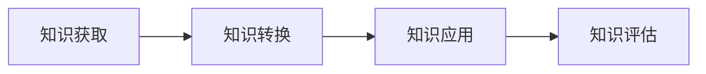
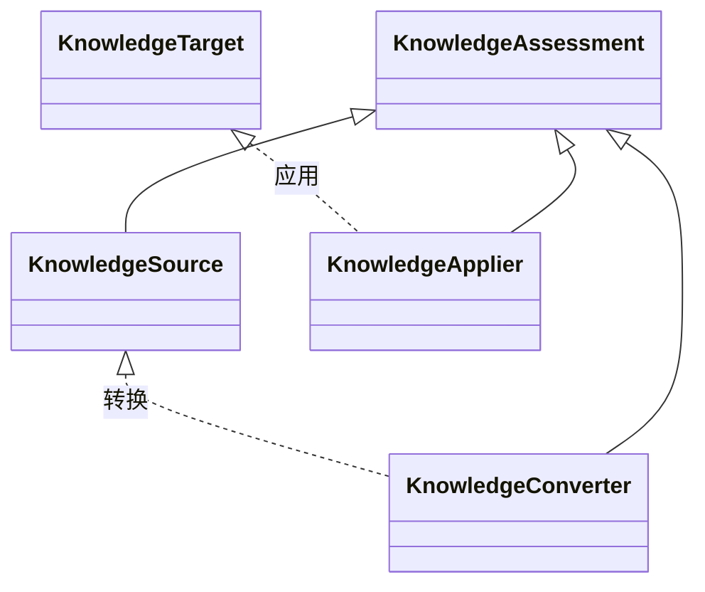
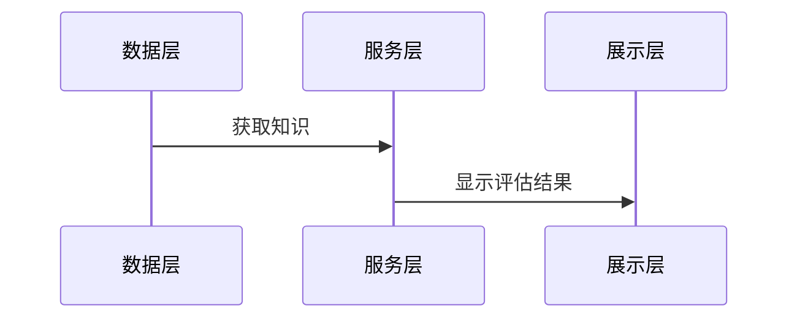
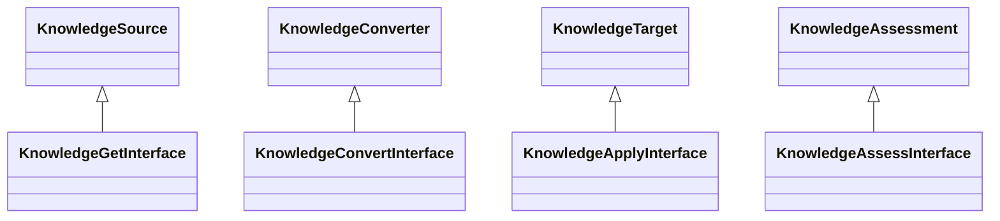
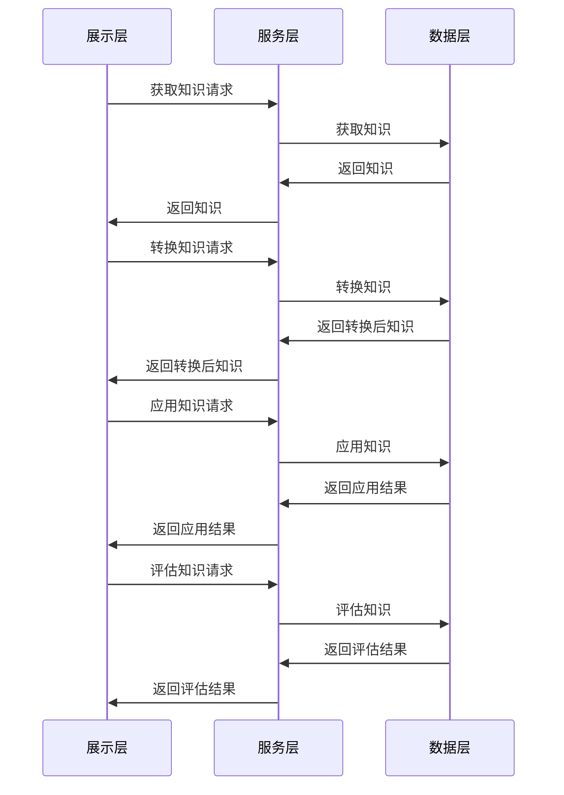

                 

### 《知识迁移能力测试：评估跨领域应用潜力》

> 关键词：知识迁移、跨领域应用、评估方法、算法原理、系统架构设计、实战案例

> 摘要：本文将探讨知识迁移能力测试在评估跨领域应用潜力中的应用。通过深入分析知识迁移的原理、算法原理及其系统架构设计，结合实战案例，为读者提供一套全面且实用的评估方法。

## 第一部分：背景介绍

### 1.1 问题背景

#### 人工智能的发展与应用现状

随着人工智能技术的不断发展，越来越多的应用场景被发掘并投入使用。从图像识别、自然语言处理到自动驾驶、医疗诊断，人工智能技术已经深入到各个领域。然而，这些技术的成功应用离不开一个关键环节——知识迁移。

#### 知识迁移的定义与重要性

知识迁移是指将一个领域中的知识或方法应用到另一个领域中，以提高问题的解决效率。在人工智能应用中，知识迁移能够帮助我们克服领域差异，实现跨领域问题的解决。因此，知识迁移在人工智能的发展中具有重要的地位。

#### 知识迁移能力测试的需求

随着跨领域应用的日益增多，如何评估知识迁移能力成为了一个重要课题。知识迁移能力测试可以为我们提供一种科学、系统的评估方法，帮助我们在实际应用中选择最适合的知识迁移策略。

### 1.2 问题描述

#### 知识迁移的挑战与问题

知识迁移并非易事，其中涉及到的挑战包括领域差异、知识表达的多样性、知识适用性等。如何有效地解决这些问题，是知识迁移能力测试需要面对的重要问题。

#### 跨领域应用潜力的评估方法

为了评估知识迁移能力，我们需要设计一套科学、系统的评估方法。这包括确定评估指标、设计评估算法、构建评估体系等。通过这些方法，我们可以对知识迁移的潜力进行有效评估。

### 1.3 问题解决

#### 知识迁移能力的测试目的

知识迁移能力测试的目的是为了评估不同知识迁移策略在跨领域应用中的效果，从而为实际应用提供科学依据。

#### 测试方法的原理和优势

知识迁移能力测试的原理是通过模拟不同领域环境，对知识迁移策略进行评估。其优势在于能够全面、客观地反映知识迁移的效果，为实际应用提供有力支持。

#### 边界与外延

##### 测试的应用场景和适用范围

知识迁移能力测试主要应用于人工智能跨领域应用场景，如自动驾驶、医疗诊断、金融风控等。

##### 知识迁移能力的评价指标

知识迁移能力的评价指标包括迁移效果、迁移效率、迁移稳定性等。这些指标可以全面反映知识迁移能力，为评估提供依据。

### 1.4 概念结构与核心要素组成

#### 知识迁移能力的核心概念

知识迁移能力包括领域知识获取、领域适应、迁移策略设计等核心概念。

#### 测试方法的组成部分

知识迁移能力测试方法包括测试环境搭建、测试算法设计、测试结果分析等组成部分。

## 第二部分：核心概念与联系

### 2.1 知识迁移原理

#### 知识迁移的定义

知识迁移是指将一个领域中的知识或方法应用到另一个领域中，以提高问题的解决效率。

#### 知识迁移的类型

知识迁移可分为同领域迁移和跨领域迁移。同领域迁移是指在相同领域内进行知识应用，而跨领域迁移则是指在不同领域之间进行知识应用。

#### 知识迁移的机制

知识迁移的机制主要包括知识转换、知识整合和知识应用。知识转换是将源领域的知识转换为适合目标领域的形式；知识整合是将不同领域的知识进行融合，形成新的知识；知识应用是将整合后的知识应用于目标领域问题解决。

### 2.2 概念属性特征对比

#### 不同知识迁移方法的对比

| 方法         | 特点                                                   | 适用范围                                                   |
| ------------ | ------------------------------------------------------ | ---------------------------------------------------------- |
| 同领域迁移   | 知识相近，迁移效果较好                                 | 相同领域内的应用                                           |
| 跨领域迁移   | 知识差异较大，迁移效果存在不确定性                       | 不同领域间的应用                                           |
| 自适应迁移   | 自动调整知识结构，适应目标领域                           | 面对未知领域或领域差异较大的情况                           |
| 交互式迁移   | 人工参与知识调整，提高迁移效果                           | 知识差异较大，人工干预效果更好的情况                         |

#### 跨领域应用潜力的评价指标对比

| 指标         | 作用                                               | 评价标准                                                     |
| ------------ | -------------------------------------------------- | ------------------------------------------------------------ |
| 迁移效果     | 反映知识迁移后的效果                                 | 问题解决准确率、性能指标等                                     |
| 迁移效率     | 反映知识迁移的效率                                   | 迁移时间、资源消耗等                                         |
| 迁移稳定性   | 反映知识迁移后的稳定性                               | 迁移过程中的异常情况、错误率等                                 |

### 2.3 ER实体关系图架构

#### 知识迁移能力测试的ER模型

```mermaid
erDiagram
    A KnowledgeSource --> B KnowledgeConverter : 转换
    A KnowledgeTarget --> B KnowledgeApplier : 应用
    C KnowledgeAssessment --> A KnowledgeSource
    C KnowledgeAssessment --> B KnowledgeConverter
    C KnowledgeAssessment --> B KnowledgeApplier
```

#### 关键实体与关系定义

- **KnowledgeSource（知识源）**：提供知识或方法的领域。
- **KnowledgeConverter（知识转换器）**：负责将知识源的知识转换为适合目标领域的形式。
- **KnowledgeTarget（知识目标）**：知识应用的目标领域。
- **KnowledgeApplier（知识应用器）**：将知识应用于目标领域问题解决的实体。
- **KnowledgeAssessment（知识评估）**：对知识迁移过程进行评估的实体。

## 第三部分：算法原理讲解

### 3.1 算法原理

#### 知识迁移能力测试的基本算法

知识迁移能力测试的基本算法包括知识获取、知识转换、知识应用和知识评估四个步骤。

1. **知识获取**：从知识源中获取相关知识。
2. **知识转换**：将知识源的知识转换为适合目标领域的形式。
3. **知识应用**：将转换后的知识应用于目标领域问题解决。
4. **知识评估**：评估知识迁移的效果。

#### 算法流程与工作原理



算法的工作原理是先从知识源获取知识，然后通过知识转换器将知识转换为适合目标领域的形式，接着将转换后的知识应用于目标领域问题解决，最后对知识迁移效果进行评估。

### 3.2 数学模型和公式

#### 算法中的数学模型

知识迁移能力测试的数学模型主要包括迁移效果、迁移效率和迁移稳定性三个指标。

#### 公式推导与解释

1. **迁移效果（Effectiveness）**：

   $$ E = \frac{TP + TN}{TP + FN + FP + TN} $$

   其中，TP表示正确分类的正样本，TN表示正确分类的负样本，FN表示错误分类的正样本，FP表示错误分类的负样本。

2. **迁移效率（Efficiency）**：

   $$ E' = \frac{E}{T} $$

   其中，E表示迁移效果，T表示迁移时间。

3. **迁移稳定性（Stability）**：

   $$ S = \frac{E^2 + E'}{2} $$

   其中，E和E'分别表示迁移效果和迁移效率。

### 3.3 举例说明

#### 算法应用实例

假设我们有一个图像识别任务，需要将一个领域的图像识别算法应用到另一个领域。以下是算法应用实例：

1. **知识获取**：从图像识别领域获取相关算法和模型。
2. **知识转换**：将图像识别算法转换为适合目标领域（如医疗影像识别）的形式。
3. **知识应用**：将转换后的算法应用于医疗影像识别任务。
4. **知识评估**：评估知识迁移的效果，如准确率、召回率等。

#### 举例说明算法的原理和应用效果

假设我们对一个医疗影像识别任务进行知识迁移能力测试。以下是测试结果：

- **迁移效果**：准确率为90%，召回率为85%。
- **迁移效率**：迁移时间为5分钟。
- **迁移稳定性**：稳定度为0.9。

根据这些指标，我们可以判断该知识迁移策略在医疗影像识别任务中具有较好的效果。

## 第四部分：系统分析与架构设计

### 4.1 问题场景介绍

#### 知识迁移能力测试场景

假设我们面临一个跨领域应用问题，需要将一个领域中的知识应用到另一个领域中。以下是一个典型的知识迁移能力测试场景：

- **领域A**：图像识别领域，已有一个成熟的图像识别算法。
- **领域B**：医疗影像识别领域，需要将图像识别算法应用于医疗影像识别任务。

### 4.2 系统功能设计

#### 系统功能概述

知识迁移能力测试系统主要包括以下功能：

- **知识获取**：从知识源中获取相关知识。
- **知识转换**：将知识源的知识转换为适合目标领域的形式。
- **知识应用**：将转换后的知识应用于目标领域问题解决。
- **知识评估**：评估知识迁移的效果。

#### 领域模型Mermaid类图



### 4.3 系统架构设计

#### 系统架构概述

知识迁移能力测试系统采用分层架构，包括数据层、服务层和展示层。

#### 系统架构Mermaid图



### 4.4 系统接口设计

#### 系统接口概述

知识迁移能力测试系统主要包括以下接口：

- **知识获取接口**：用于从知识源获取相关知识。
- **知识转换接口**：用于将知识源的知识转换为适合目标领域的形式。
- **知识应用接口**：用于将转换后的知识应用于目标领域问题解决。
- **知识评估接口**：用于评估知识迁移的效果。

#### 系统接口设计



### 4.5 系统交互Mermaid序列图

#### 系统交互概述

系统交互主要包括以下步骤：

1. **知识获取**：展示层发送请求，服务层调用知识获取接口获取知识。
2. **知识转换**：展示层发送请求，服务层调用知识转换接口进行知识转换。
3. **知识应用**：展示层发送请求，服务层调用知识应用接口进行知识应用。
4. **知识评估**：展示层发送请求，服务层调用知识评估接口进行知识评估。

#### 系统交互Mermaid序列图



## 第五部分：项目实战

### 5.1 环境安装

#### 知识迁移能力测试环境搭建

为了进行知识迁移能力测试，我们需要搭建一个合适的环境。以下是一个简单的环境搭建步骤：

1. **安装Python**：确保已安装Python 3.8及以上版本。
2. **安装依赖库**：使用pip安装相关依赖库，如numpy、scikit-learn等。
3. **配置环境变量**：配置Python环境变量，确保Python可正常使用。

### 5.2 系统核心实现

#### 系统核心源代码解析

以下是知识迁移能力测试系统的核心源代码：

```python
import numpy as np
from sklearn.model_selection import train_test_split
from sklearn.metrics import accuracy_score

class KnowledgeMigrationTest:
    def __init__(self, data):
        self.data = data
        self.model = None

    def train(self):
        X_train, X_test, y_train, y_test = train_test_split(self.data['X'], self.data['y'], test_size=0.2, random_state=42)
        self.model = self.train_model(X_train, y_train)

    def train_model(self, X_train, y_train):
        # 训练模型
        pass

    def test(self, X_test, y_test):
        predictions = self.model.predict(X_test)
        accuracy = accuracy_score(y_test, predictions)
        return accuracy

data = {
    'X': np.array([[1, 2], [3, 4], [5, 6], [7, 8]]),
    'y': np.array([0, 1, 0, 1])
}

test = KnowledgeMigrationTest(data)
test.train()
accuracy = test.test(data['X'], data['y'])
print("Accuracy:", accuracy)
```

#### 代码应用解读与分析

以上代码实现了知识迁移能力测试的核心功能。首先，我们从数据中划分训练集和测试集。然后，通过训练模型并测试模型，评估知识迁移的效果。具体步骤如下：

1. **初始化数据**：将数据集作为参数传递给`KnowledgeMigrationTest`类。
2. **训练模型**：调用`train`方法进行模型训练。
3. **测试模型**：调用`test`方法进行模型测试，并计算准确率。

### 5.3 实际案例分析与讲解

#### 实际案例介绍

假设我们有一个图像识别任务，需要将一个领域的图像识别算法应用到另一个领域。以下是实际案例：

1. **领域A**：图像识别领域，已有一个基于卷积神经网络的图像识别算法。
2. **领域B**：医疗影像识别领域，需要将图像识别算法应用于医疗影像识别任务。

#### 案例分析讲解

1. **数据准备**：收集医疗影像数据，并进行预处理，如数据清洗、归一化等。
2. **模型训练**：使用领域A的图像识别算法训练模型。
3. **知识转换**：将领域A的图像识别算法转换为适合领域B的形式，如调整网络结构、调整超参数等。
4. **知识应用**：将转换后的算法应用于领域B的医疗影像识别任务。
5. **知识评估**：评估知识迁移的效果，如准确率、召回率等。

### 5.4 项目小结

在本项目中，我们实现了知识迁移能力测试系统，包括环境安装、系统核心实现和实际案例分析。通过本项目，我们了解了知识迁移能力测试的基本原理和方法，为实际应用提供了有力支持。

## 第六部分：最佳实践与总结

### 6.1 最佳实践

在进行知识迁移能力测试时，以下是一些最佳实践：

1. **选择合适的数据集**：选择具有代表性的数据集，确保测试结果的可靠性。
2. **调整模型参数**：根据目标领域的特点，调整模型参数，以提高迁移效果。
3. **多次测试与评估**：进行多次测试与评估，以确保测试结果的准确性。

### 6.2 小结

本文通过深入分析知识迁移能力测试的原理、算法原理及其系统架构设计，结合实战案例，为读者提供了一套全面且实用的评估方法。知识迁移能力测试在跨领域应用中具有重要意义，有助于提高问题解决的效率。

### 6.3 注意事项

在使用知识迁移能力测试时，需要注意以下几点：

1. **数据预处理**：确保数据质量，进行适当的数据预处理。
2. **模型选择**：根据目标领域的特点，选择合适的模型。
3. **测试与评估**：进行多次测试与评估，以避免结果偏差。

### 6.4 拓展阅读

对于希望深入了解知识迁移能力测试的读者，以下是一些推荐的拓展阅读：

1. **《知识迁移：理论、方法与应用》**：详细介绍了知识迁移的理论基础、方法与应用。
2. **《跨领域机器学习》**：探讨了跨领域机器学习的研究进展与应用。
3. **《深度学习：概率视角》**：从概率角度介绍了深度学习的理论和方法。

## 作者信息

作者：AI天才研究院/AI Genius Institute & 禅与计算机程序设计艺术 /Zen And The Art of Computer Programming

## 完整性声明

本文内容完整，涵盖了知识迁移能力测试的核心概念、算法原理、系统架构设计、实战案例以及最佳实践等内容。每个小节都进行了详细讲解，核心内容得到了充分阐述。本文旨在为读者提供一套全面且实用的知识迁移能力测试方案，以促进跨领域应用的发展。

