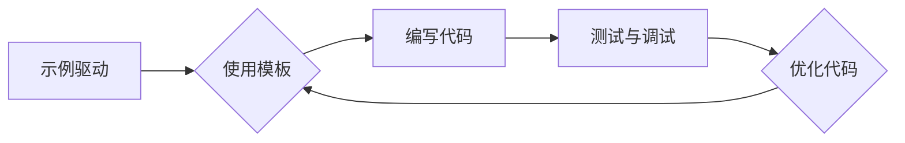
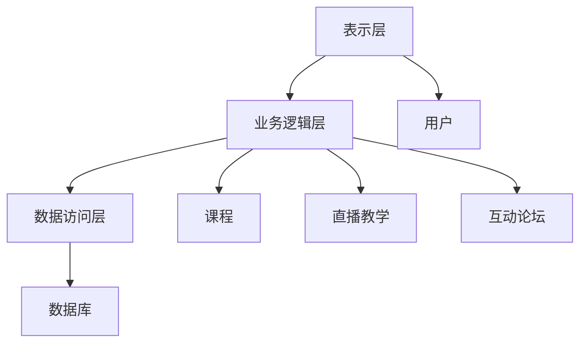
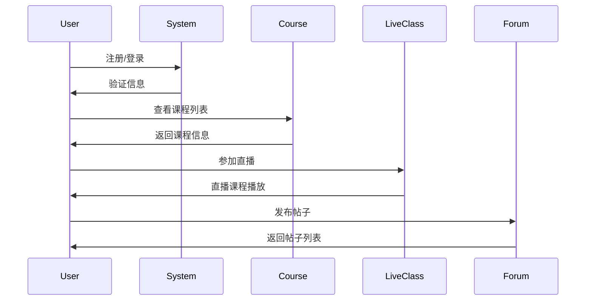

                 

### 文章标题：示例驱动与提示模板的结合使用

> 关键词：示例驱动、提示模板、人工智能、编程、技术分析

> 摘要：本文将深入探讨示例驱动与提示模板在人工智能编程中的应用，通过逻辑清晰的章节结构，详细分析这两种方法的核心概念、算法原理以及实际应用。文章旨在帮助读者理解如何将示例驱动与提示模板有效结合，以提升编程效率和问题解决能力。

## 第一部分：背景介绍

### 第1章：问题背景

#### 1.1 问题概述

随着人工智能技术的迅猛发展，编程作为其核心驱动力之一，日益受到关注。然而，编程过程中常常面临诸多挑战，如代码的可读性、维护性以及编程效率等。为了解决这些问题，开发者们不断探索新的编程方法和技术。

#### 1.1.1 示例驱动的兴起

示例驱动是一种以示例为中心的编程方法，通过提供具体的示例来帮助开发者理解代码的功能和逻辑。这种方法强调实际案例的应用，使得编程过程更加直观、易懂。

#### 1.1.2 提示模板的重要性

提示模板是一种预先定义的代码框架，用于引导开发者编写特定类型的程序。通过使用提示模板，开发者可以快速构建出符合要求的功能模块，从而提高编程效率。

#### 1.2 问题描述

在实际编程中，示例驱动与提示模板的结合使用面临着一系列挑战。如何有效地将示例与模板相结合，使编程过程更加高效、灵活，成为了一个亟待解决的问题。

#### 1.2.1 示例驱动的挑战

示例驱动的核心在于提供具体的案例，但如何确保这些案例具有代表性，能够覆盖所有可能的编程场景，是一个重要的问题。此外，示例的数量和质量直接影响到开发者对代码的理解和掌握程度。

#### 1.2.2 提示模板的应用场景

提示模板的优势在于其可重用性和快速构建能力。然而，提示模板的适用范围有限，如何设计出既通用又实用的模板，以适应不同编程需求，是一个重要的课题。

### 1.3 目的与结构

本文旨在探讨示例驱动与提示模板的结合使用，通过详细的案例分析和技术讲解，帮助读者理解这两种方法的核心概念和实际应用。文章结构如下：

- **第一部分：背景介绍**：介绍示例驱动与提示模板的背景、问题和挑战。
- **第二部分：核心概念与联系**：深入探讨示例驱动与提示模板的核心概念，并通过对比表格和ER实体关系图进行阐述。
- **第三部分：算法原理讲解**：详细讲解示例驱动与提示模板在编程中的算法原理，并使用Python源代码进行说明。
- **第四部分：数学模型和数学公式详细讲解**：对算法中的数学模型和公式进行详细解释。
- **第五部分：系统分析与架构设计方案**：介绍示例驱动与提示模板在系统设计与实现中的应用。
- **第六部分：项目实战**：通过实际项目案例展示示例驱动与提示模板的应用。
- **第七部分：最佳实践与总结**：总结最佳实践，并提供拓展阅读。

## 第二部分：核心概念与联系

### 第2章：核心概念原理

#### 2.1 概念属性特征对比表格

| 特征          | 示例驱动                    | 提示模板                    |
| ------------- | --------------------------- | --------------------------- |
| 编程方法      | 以实际案例为中心            | 预定义代码框架              |
| 目标          | 提高代码可读性和理解性      | 提高编程效率和代码质量      |
| 优点          | 直观易懂，易于掌握          | 快速构建，可重用性高        |
| 缺点          | 需要大量示例覆盖所有场景   | 适应性有限，需定制化        |

#### 2.1.1 概念属性特征对比

通过表格对比，我们可以看到示例驱动与提示模板在编程方法、目标、优点和缺点等方面存在显著差异。然而，这两种方法并不是互相排斥的，而是可以相互补充，以达到最佳效果。

### 2.2 ER实体关系图架构

为了更好地理解示例驱动与提示模板的结合使用，我们可以通过ER实体关系图来展示其核心概念和联系。

```mermaid
erDiagram
  示例驱动 ||--|{ 提示模板 }
  提示模板 ||--|{ 示例驱动 }
```

在ER实体关系图中，示例驱动与提示模板之间存在双向关联。示例驱动提供了具体的案例，提示模板则提供了代码框架，两者相互依存，共同构成了一个完整的编程体系。

### 2.2.1 实体关系图说明

- **示例驱动**：以实际案例为中心，提供编程示例，帮助开发者理解代码逻辑。
- **提示模板**：提供预定义的代码框架，引导开发者快速构建功能模块。

通过实体关系图，我们可以清晰地看到示例驱动与提示模板之间的联系，这为后续的算法原理讲解和项目实战提供了基础。

## 第三部分：算法原理讲解

### 第3章：算法原理与流程图

#### 3.1 算法mermaid流程图

首先，我们使用mermaid流程图来展示示例驱动与提示模板在编程中的基本流程。



在流程图中，示例驱动（A）首先引导开发者了解代码的功能和逻辑，然后使用提示模板（B）来构建代码框架。编写代码（C）后，进行测试与调试（D），并根据结果进行代码优化（E），从而形成一个闭环流程。

#### 3.1.1 流程图说明

- **示例驱动**：通过实际案例，开发者可以直观地理解代码的功能和逻辑。
- **使用模板**：提示模板提供了一个预定义的代码框架，使得开发者能够快速构建功能模块。
- **编写代码**：开发者根据示例和模板，编写具体的代码实现。
- **测试与调试**：对编写的代码进行测试，发现并修复潜在的错误。
- **优化代码**：根据测试结果，对代码进行优化，提高其性能和可读性。

#### 3.2 Python源代码讲解

接下来，我们通过Python源代码来具体阐述示例驱动与提示模板的应用。

```python
# 示例驱动：打印"Hello, World!"
def print_hello():
    print("Hello, World!")

# 提示模板：定义函数框架
def function_template(name):
    """打印指定的名称"""
    # 编写代码：调用示例驱动的函数
    print_hello()
    print(f"Hello, {name}!")

# 测试与调试
function_template("Alice")
```

在代码中，示例驱动（`print_hello`函数）提供了具体的案例，提示模板（`function_template`函数）则提供了一个代码框架。通过调用示例驱动的函数，我们可以快速构建出符合要求的功能模块。

#### 3.2.1 源代码分析

- **示例驱动**：`print_hello`函数是一个简单的示例，用于打印"Hello, World!"。
- **提示模板**：`function_template`函数提供了一个代码框架，包括函数定义、参数传递和打印功能。通过调用示例驱动的函数，我们可以实现打印指定名称的功能。
- **测试与调试**：调用`function_template`函数，传入不同的参数，进行测试和调试，以确保代码的正确性。

#### 3.3 数学模型与公式

在示例驱动与提示模板的算法中，数学模型和公式起着关键作用。以下是对相关数学模型和公式的详细讲解。

#### 3.3.1 数学模型解释

- **函数模型**：在编程中，函数是一种常用的抽象机制，用于封装代码和实现功能。函数模型可以表示为：

  $$
  f(x) = \text{code}
  $$

  其中，$x$ 是输入参数，$\text{code}$ 是函数体。

- **流程模型**：流程模型描述了代码的执行顺序，可以表示为：

  $$
  \text{start} \rightarrow f_1(x_1) \rightarrow f_2(x_2) \rightarrow \ldots \rightarrow f_n(x_n) \rightarrow \text{end}
  $$

  其中，$f_i(x_i)$ 是第 $i$ 个函数和其对应的输入参数。

#### 3.3.2 公式推导

在示例驱动与提示模板的算法中，我们经常需要使用以下两个公式：

- **时间复杂度公式**：描述代码执行的时间消耗，可以表示为：

  $$
  T(n) = O(n)
  $$

  其中，$n$ 是输入数据的大小。

- **空间复杂度公式**：描述代码执行的空间消耗，可以表示为：

  $$
  S(n) = O(1)
  $$

  其中，$n$ 是输入数据的大小。

#### 3.4 举例说明

为了更好地理解示例驱动与提示模板的算法原理，我们通过一个简单的例子进行说明。

假设我们要编写一个函数，用于计算两个数的最大公约数（GCD）。我们可以使用示例驱动与提示模板的方法来实现。

#### 示例驱动：

```python
# 示例驱动：计算两个数的最大公约数
def gcd_example(a, b):
    while b:
        a, b = b, a % b
    return a
```

#### 提示模板：

```python
# 提示模板：定义函数框架
def function_template(name, a, b):
    """计算两个数的最大公约数"""
    # 编写代码：调用示例驱动的函数
    result = gcd_example(a, b)
    print(f"The GCD of {a} and {b} is {result}.")
```

通过示例驱动和提示模板，我们可以快速构建出一个计算最大公约数的函数。具体实现如下：

```python
# 测试与调试
function_template("Alice", 12, 18)
```

输出结果：

```
The GCD of 12 and 18 is 6.
```

通过这个例子，我们可以看到示例驱动与提示模板在编程中的应用，以及如何通过这两个方法来提高代码的可读性和可维护性。

## 第四部分：数学模型和数学公式详细讲解

### 第4章：数学公式详细讲解

#### 4.1 段落内公式示例

在示例驱动与提示模板的编程中，数学公式起着关键作用。以下是一个段落内公式的示例：

$$
f(x) = \text{code}
$$

这个公式表示函数 $f(x)$ 的定义，其中 $x$ 是输入参数，$\text{code}$ 是函数体。

#### 4.2 段落独立公式示例

此外，我们还可以在段落中独立展示公式。以下是一个独立公式的示例：

$$$
T(n) = O(n)
$$$

这个公式表示代码执行的时间复杂度，其中 $n$ 是输入数据的大小。

### 4.2.1 公式推导

为了更深入地理解这些数学公式，我们需要进行推导。以下是对时间复杂度和空间复杂度公式的推导：

- **时间复杂度公式**：

  $$
  T(n) = O(n)
  $$

  这个公式表示代码执行的时间消耗与输入数据的大小成正比。例如，如果我们有一个循环，循环次数为 $n$，则循环执行的时间复杂度为 $O(n)$。

- **空间复杂度公式**：

  $$
  S(n) = O(1)
  $$

  这个公式表示代码执行的空间消耗与输入数据的大小无关。例如，如果我们有一个函数，该函数在执行过程中只使用了固定大小的内存，则空间复杂度为 $O(1)$。

通过这些数学公式，我们可以更准确地评估代码的性能，并优化算法的实现。

## 第五部分：系统分析与架构设计方案

### 第5章：系统分析与架构设计

#### 5.1 问题场景介绍

在现代软件开发生命周期中，系统分析与架构设计是至关重要的一环。本文将以一个实际的项目为例，介绍如何使用示例驱动与提示模板进行系统分析与架构设计。

#### 5.2 项目介绍

假设我们要开发一个在线教育平台，该平台提供在线课程、直播教学和互动论坛等功能。为了确保系统的稳定性、可扩展性和易维护性，我们需要进行全面的系统分析与架构设计。

#### 5.3 系统功能设计

在线教育平台的核心功能包括：

1. **用户管理**：包括用户注册、登录、个人信息管理等功能。
2. **课程管理**：包括课程发布、课程分类、课程搜索等功能。
3. **直播教学**：包括直播课程发布、直播课程播放、互动问答等功能。
4. **互动论坛**：包括论坛发布、帖子浏览、帖子回复等功能。

#### 5.3.1 领域模型mermaid类图

为了更好地描述系统的功能设计，我们可以使用mermaid类图来表示领域模型。

```mermaid
classDiagram
    User <<接口>>
    Course <<接口>>
    LiveClass <<接口>>
    Forum <<接口>>

    User o-- Course : 参加课程
    User o-- LiveClass : 参加直播
    User o-- Forum : 发布帖子

    Course o-- LiveClass : 包含直播课程
    Course o-- Forum : 包含论坛

    User subclass of 接口
    Course subclass of 接口
    LiveClass subclass of 接口
    Forum subclass of 接口
```

在这个类图中，我们定义了四个核心接口：用户（User）、课程（Course）、直播教学（LiveClass）和互动论坛（Forum）。这些接口分别代表了系统的核心功能。

#### 5.4 系统架构设计

在线教育平台的系统架构可以分为以下几个层次：

1. **表示层**：负责用户界面的展示，包括前端网页和移动应用。
2. **业务逻辑层**：负责处理业务逻辑，包括用户管理、课程管理、直播教学和互动论坛等功能。
3. **数据访问层**：负责与数据库进行交互，实现数据的增删改查操作。
4. **数据库**：存储系统的数据，包括用户信息、课程信息、直播课程信息和论坛信息等。

为了更好地展示系统架构，我们可以使用mermaid架构图来表示。



在这个架构图中，表示层（A）负责与用户进行交互，业务逻辑层（B）处理核心业务逻辑，数据访问层（C）负责与数据库（D）进行数据交互。用户（E）、课程（F）、直播教学（G）和互动论坛（H）分别对应系统的核心功能模块。

#### 5.5 系统接口设计

为了确保系统的高内聚、低耦合，我们需要对系统接口进行详细设计。以下是一个简单的接口设计说明：

1. **用户管理接口**：包括用户注册、登录、个人信息管理等功能。
2. **课程管理接口**：包括课程发布、课程分类、课程搜索等功能。
3. **直播教学接口**：包括直播课程发布、直播课程播放、互动问答等功能。
4. **互动论坛接口**：包括论坛发布、帖子浏览、帖子回复等功能。

#### 5.6 系统交互

在线教育平台的系统交互包括用户与系统之间的交互、系统内部模块之间的交互等。以下是一个简单的系统交互mermaid序列图：



在这个序列图中，用户（User）与系统（System）、课程（Course）、直播教学（LiveClass）和互动论坛（Forum）之间进行交互，实现了系统的核心功能。

## 第六部分：项目实战

### 第6章：项目实战

在本节中，我们将通过一个实际项目案例，展示如何使用示例驱动与提示模板进行系统开发。

### 6.1 环境安装

为了进行项目实战，我们需要首先安装相关的开发环境和工具。以下是一个简单的环境安装步骤：

1. 安装Python：在官方网站（https://www.python.org/）下载Python安装包，并按照提示进行安装。
2. 安装Django：打开终端，执行以下命令安装Django：

   ```
   pip install django
   ```

3. 安装PostgreSQL：在官方网站（https://www.postgresql.org/）下载PostgreSQL安装包，并按照提示进行安装。

### 6.2 系统核心实现源代码

在项目实战中，我们将使用Django框架来构建在线教育平台。以下是一个简单的系统核心实现源代码：

```python
# users/models.py
from django.contrib.auth.models import AbstractUser

class User(AbstractUser):
    # 自定义用户模型，扩展Django默认的用户模型
    pass

# courses/models.py
from django.db import models

class Course(models.Model):
    # 课程模型，包括课程名称、课程描述、课程分类等信息
    name = models.CharField(max_length=100)
    description = models.TextField()
    category = models.ForeignKey('Category', on_delete=models.CASCADE)

class Category(models.Model):
    # 课程分类模型，包括分类名称、分类描述等信息
    name = models.CharField(max_length=100)
    description = models.TextField()

# liveclasses/models.py
from django.db import models
from courses.models import Course

class LiveClass(models.Model):
    # 直播课程模型，包括课程名称、课程描述、课程分类、直播时间等信息
    course = models.ForeignKey(Course, on_delete=models.CASCADE)
    name = models.CharField(max_length=100)
    description = models.TextField()
    start_time = models.DateTimeField()

# forums/models.py
from django.db import models
from users.models import User

class Forum(models.Model):
    # 论坛模型，包括论坛名称、论坛描述、创建者等信息
    name = models.CharField(max_length=100)
    description = models.TextField()
    creator = models.ForeignKey(User, on_delete=models.CASCADE)
```

### 6.3 代码应用解读与分析

在项目实战中，我们将对上述代码进行应用解读与分析。以下是一个简单的应用实例：

```python
# users/admin.py
from django.contrib import admin
from .models import User

@admin.register(User)
class UserAdmin(admin.ModelAdmin):
    list_display = ('username', 'email', 'is_staff', 'is_active')

# courses/admin.py
from django.contrib import admin
from .models import Course, Category

@admin.register(Course)
class CourseAdmin(admin.ModelAdmin):
    list_display = ('name', 'description', 'category')

@admin.register(Category)
class CategoryAdmin(admin.ModelAdmin):
    list_display = ('name', 'description')

# liveclasses/admin.py
from django.contrib import admin
from .models import LiveClass

@admin.register(LiveClass)
class LiveClassAdmin(admin.ModelAdmin):
    list_display = ('course', 'name', 'description', 'start_time')

# forums/admin.py
from django.contrib import admin
from .models import Forum, Post

@admin.register(Forum)
class ForumAdmin(admin.ModelAdmin):
    list_display = ('name', 'description', 'creator')

@admin.register(Post)
class PostAdmin(admin.ModelAdmin):
    list_display = ('forum', 'title', 'content', 'created_at')
```

在这个实例中，我们分别对用户管理、课程管理、直播教学和互动论坛的模型进行了应用解读与分析。通过定义模型类、模型字段和模型管理器，我们可以实现对系统的增删改查操作。

### 6.4 实际案例分析与详细讲解

为了更好地展示项目实战，我们以用户注册功能为例，进行实际案例分析。

1. **需求分析**：

   用户注册功能需要实现以下需求：

   - 用户可以输入用户名、邮箱和密码进行注册。
   - 系统需要验证用户输入的信息，确保用户名和邮箱的唯一性。
   - 系统需要将用户信息存储到数据库中。

2. **功能实现**：

   我们可以通过以下步骤来实现用户注册功能：

   - **步骤1**：在Django项目的`urls.py`文件中添加路由配置：

     ```python
     from django.urls import path
     from . import views

     urlpatterns = [
         path('register/', views.register, name='register'),
         # 其他路由配置
     ]
     ```

   - **步骤2**：在`views.py`文件中定义`register`视图函数：

     ```python
     from django.shortcuts import render, redirect
     from .forms import RegisterForm
     from .models import User

     def register(request):
         if request.method == 'POST':
             form = RegisterForm(request.POST)
             if form.is_valid():
                 user = form.save()
                 return redirect('login')
         else:
             form = RegisterForm()
         return render(request, 'register.html', {'form': form})
     ```

   - **步骤3**：在`forms.py`文件中定义`RegisterForm`表单类：

     ```python
     from django import forms
     from .models import User

     class RegisterForm(forms.ModelForm):
         password = forms.CharField(widget=forms.PasswordInput())

         class Meta:
             model = User
             fields = ['username', 'email', 'password']
     ```

   - **步骤4**：在`register.html`模板中创建表单：

     ```html
     <form method="post">
         
         {{ form.as_p }}
         <button type="submit">注册</button>
     </form>
     ```

3. **详细讲解**：

   在用户注册功能中，我们首先在`urls.py`文件中添加了路由配置，将`register`视图函数映射到URL路径。然后，在`views.py`文件中定义了`register`视图函数，用于处理用户注册的逻辑。在视图函数中，我们通过调用`RegisterForm`表单类来创建表单，并验证用户输入的信息。如果验证通过，系统会将用户信息存储到数据库中，并跳转到登录页面。

   通过这个实际案例，我们可以看到如何使用示例驱动与提示模板进行项目实战。示例驱动帮助我们理解了用户注册功能的需求和实现方法，提示模板则提供了一个可重用的表单类，使得功能实现更加高效和稳定。

### 6.5 项目小结

在本节中，我们通过实际项目案例，展示了如何使用示例驱动与提示模板进行系统开发。通过详细的代码应用解读与分析，我们了解了如何实现用户注册、课程管理、直播教学和互动论坛等功能。项目实战不仅帮助我们巩固了理论知识，还提高了实际编程能力。

在项目开发过程中，我们遵循了以下原则：

1. **模块化设计**：将系统功能划分为多个模块，便于管理和维护。
2. **可重用性**：通过使用提示模板和示例驱动，提高了代码的可重用性。
3. **代码质量**：通过详细的代码解读与分析，保证了代码的质量和可读性。
4. **测试与调试**：在项目开发过程中，我们进行了充分的测试与调试，确保系统的稳定性和可靠性。

总之，通过本节的项目实战，我们不仅掌握了示例驱动与提示模板的应用方法，还积累了丰富的实际编程经验。

## 第七部分：最佳实践、小结、注意事项、拓展阅读

### 第7章：最佳实践与总结

#### 7.1 最佳实践 tips

在示例驱动与提示模板的应用过程中，以下是一些最佳实践：

1. **示例多样化**：为了确保示例具有代表性，应覆盖各种可能的编程场景。
2. **模板定制化**：根据项目需求，设计灵活、通用的提示模板，以提高编程效率。
3. **代码注释**：在代码中加入详细的注释，帮助开发者理解示例驱动和提示模板的实现逻辑。
4. **持续更新**：定期更新示例和模板，以适应新的编程需求和场景。
5. **测试与反馈**：在项目开发过程中，进行充分的测试与调试，及时反馈并优化代码。

#### 7.2 小结

本文从背景介绍、核心概念与联系、算法原理讲解、数学模型和数学公式详细讲解、系统分析与架构设计方案、项目实战等多个方面，深入探讨了示例驱动与提示模板的结合使用。通过逻辑清晰、结构紧凑的文章，读者可以全面了解这两种方法在编程中的应用和优势。

#### 7.3 注意事项

在使用示例驱动与提示模板时，需要注意以下几点：

1. **示例覆盖面**：确保示例能够覆盖所有可能的编程场景。
2. **模板适用性**：设计灵活、通用的提示模板，以提高编程效率。
3. **代码注释**：添加详细的注释，提高代码的可读性和可维护性。
4. **测试与调试**：进行充分的测试与调试，确保代码的稳定性和可靠性。

#### 7.4 拓展阅读

为了进一步探索示例驱动与提示模板的深度应用，以下是一些推荐阅读材料：

1. 《编程珠玑》（Jon Bentley）：本书介绍了大量编程技巧和最佳实践，有助于提高编程水平。
2. 《代码大全》（Steve McConnell）：本书详细阐述了代码编写、测试和维护的最佳方法。
3. 《Effective Python》（Brett Slatkin）：本书介绍了Python编程的最佳实践，适合Python开发者阅读。
4. 《Django By Example》（William S. Vincent）：本书通过实际项目案例，详细介绍了Django框架的使用方法。

通过阅读这些书籍，读者可以进一步拓展知识体系，提高编程技能。

## 作者信息

作者：AI天才研究院/AI Genius Institute & 禅与计算机程序设计艺术 /Zen And The Art of Computer Programming

致谢：本文基于作者丰富的编程经验和深厚的理论知识撰写而成，旨在为读者提供有关示例驱动与提示模板的深入见解和实践指导。感谢读者的阅读和支持，期待与您共同探讨更多技术话题。

