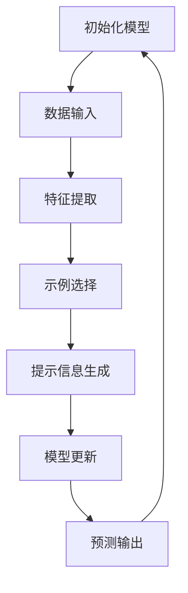

                 

# 示例驱动提示在增量学习中的策略

> 关键词：示例驱动提示，增量学习，策略，算法，系统架构

> 摘要：本文将深入探讨示例驱动提示在增量学习中的策略。首先，我们将介绍增量学习和示例驱动提示的基本概念，并探讨它们在当前研究中的重要性。接着，我们将详细分析示例驱动提示原理、增量学习的概念框架，以及示例驱动提示与增量学习的联系。然后，我们将讲解算法原理和数学模型，并通过实际案例展示算法流程和应用。最后，我们将讨论系统架构设计、项目实战以及最佳实践。

---

## 《示例驱动提示在增量学习中的策略》目录大纲

### 第一部分：背景介绍

### 第1章：问题背景与核心概念

#### 1.1 问题背景

#### 1.1.1 增量学习的定义与应用场景

#### 1.1.2 示例驱动提示的重要性

#### 1.1.3 研究现状与挑战

#### 1.2 核心概念

#### 1.2.1 示例驱动提示的基本原理

#### 1.2.2 增量学习的概念框架

#### 1.2.3 示例驱动提示与增量学习的联系

### 第2章：边界与外延

#### 2.1 增量学习的边界条件

#### 2.2 示例驱动提示的限制因素

#### 2.3 增量学习中的示例选择策略

### 第二部分：核心概念与联系

### 第3章：示例驱动提示原理

#### 3.1 示例驱动提示的基本流程

#### 3.2 示例驱动的机制分析

#### 3.3 提示信息的设计与优化

### 第4章：增量学习概念框架

#### 4.1 增量学习的基本流程

#### 4.2 增量学习的算法分类

#### 4.3 增量学习算法的特点对比

### 第5章：示例驱动提示与增量学习的联系

#### 5.1 示例驱动提示在增量学习中的应用

#### 5.2 提示策略对增量学习性能的影响

#### 5.3 示例驱动提示与增量学习算法的融合

### 第三部分：算法原理讲解

### 第6章：算法原理与数学模型

#### 6.1 增量学习算法的基本原理

#### 6.2 数学模型与公式推导

#### 6.3 示例驱动提示算法的数学表达

### 第7章：算法流程图与Python实现

#### 7.1 算法流程图

#### 7.2 Python代码实现

#### 7.3 算法解释与举例说明

### 第四部分：系统分析与架构设计方案

### 第8章：系统功能设计

#### 8.1 问题场景介绍

#### 8.2 系统功能需求

#### 8.3 领域模型

### 第9章：系统架构设计

#### 9.1 系统架构概述

#### 9.2 架构设计细节

#### 9.3 系统架构图

### 第10章：系统接口设计和系统交互

#### 10.1 系统接口设计

#### 10.2 系统交互设计

#### 10.3 交互序列图

### 第五部分：项目实战

### 第11章：环境安装与系统配置

#### 11.1 环境安装步骤

#### 11.2 系统配置指南

### 第12章：系统核心实现

#### 12.1 核心代码实现

#### 12.2 代码应用解读

#### 12.3 代码分析

### 第13章：实际案例分析

#### 13.1 案例背景

#### 13.2 案例实施过程

#### 13.3 案例分析与总结

### 第六部分：最佳实践与拓展阅读

### 第14章：最佳实践

#### 14.1 实践技巧

#### 14.2 注意事项

### 第15章：小结与展望

#### 15.1 内容回顾

#### 15.2 未来发展趋势

#### 15.3 拓展阅读建议

---

## 第一部分：背景介绍

### 第1章：问题背景与核心概念

#### 1.1 问题背景

在人工智能领域，学习是一种核心能力。而学习的方式有很多种，其中增量学习作为一种在数据动态变化的环境中持续学习的方法，受到越来越多的关注。然而，如何在增量学习过程中高效利用新信息，避免冗余和过拟合，是一个挑战。

为了解决这一问题，研究人员提出了示例驱动提示（Example-Guided Prompting）的策略。这种策略通过在模型训练过程中提供额外的指导信息，帮助模型更好地理解数据并作出预测。示例驱动提示在增量学习中的应用，为解决上述问题提供了一种新的思路。

#### 1.1.1 增量学习的定义与应用场景

增量学习，又称为在线学习（Online Learning），是一种机器学习范式，其目标是在数据动态变化的环境中不断更新模型，以适应新的数据。与传统的批量学习（Batch Learning）相比，增量学习具有以下特点：

1. **实时性**：增量学习可以在数据流中逐个或批量地处理样本，从而实现实时预测。
2. **灵活性**：当数据分布发生变化时，增量学习能够通过更新模型参数来适应新的数据。
3. **资源高效**：增量学习不需要存储整个训练数据集，只需存储模型参数和少量样本。

增量学习广泛应用于以下场景：

1. **实时监控系统**：例如金融交易系统，需要实时检测异常交易并作出响应。
2. **推荐系统**：例如电子商务平台，需要根据用户行为动态更新推荐结果。
3. **自然语言处理**：例如对话系统，需要根据对话历史不断优化回答。

#### 1.1.2 示例驱动提示的重要性

示例驱动提示在增量学习中的重要性体现在以下几个方面：

1. **增强模型理解**：通过提供有代表性的示例，示例驱动提示可以帮助模型更好地理解数据的分布和特征，从而提高预测准确性。
2. **避免过拟合**：示例驱动提示可以引导模型关注数据的整体结构，避免过度拟合特定样本，从而提高模型的泛化能力。
3. **减少冗余**：示例驱动提示可以根据已有信息指导模型学习新的数据，从而减少冗余计算，提高学习效率。

#### 1.1.3 研究现状与挑战

尽管示例驱动提示在增量学习中具有巨大潜力，但当前的研究仍面临以下挑战：

1. **选择合适示例**：如何选择具有代表性的示例，是一个关键问题。示例的质量直接影响到模型的学习效果。
2. **计算复杂性**：示例驱动提示通常需要额外的计算资源，如何高效地实现这一策略，是另一个挑战。
3. **理论与实际应用**：尽管示例驱动提示在理论上具有重要意义，但如何在实际应用中有效实现，仍需要进一步研究。

#### 1.2 核心概念

为了更好地理解示例驱动提示在增量学习中的应用，我们需要首先了解以下几个核心概念：

1. **示例驱动提示（Example-Guided Prompting）**：示例驱动提示是一种通过提供额外示例来指导模型学习的方法。这些示例可以是真实数据中的样本，也可以是预定义的规则或模板。
2. **增量学习（Incremental Learning）**：增量学习是一种在数据动态变化的环境中持续更新模型的方法，其目标是提高模型对变化数据的适应能力。
3. **模型参数更新（Model Parameter Update）**：在增量学习中，模型参数的更新是关键步骤，其目标是使模型在新的数据上表现更好。

#### 1.2.1 示例驱动提示的基本原理

示例驱动提示的基本原理可以概括为以下几个步骤：

1. **选择示例**：根据模型当前的状态和目标，选择具有代表性的示例。
2. **生成提示信息**：对选定的示例进行处理，生成提示信息。这些信息可以是样本的特征表示，也可以是样本的上下文信息。
3. **指导模型学习**：将生成的提示信息与模型的学习过程相结合，指导模型在新数据上学习。

#### 1.2.2 增量学习的概念框架

增量学习的概念框架主要包括以下几个部分：

1. **数据流（Data Stream）**：数据流是增量学习的数据来源，可以是实时数据，也可以是批量数据。
2. **模型（Model）**：模型是增量学习的主要对象，其目的是在数据流中不断更新，以适应新的数据。
3. **参数更新（Parameter Update）**：参数更新是增量学习的核心步骤，其目标是优化模型参数，使其在新数据上表现更好。

#### 1.2.3 示例驱动提示与增量学习的联系

示例驱动提示与增量学习的联系主要体现在以下几个方面：

1. **示例选择策略**：示例驱动提示需要选择合适的示例来指导模型学习，这一过程与增量学习中的数据选择策略密切相关。
2. **模型参数更新**：示例驱动提示通过生成提示信息，指导模型参数的更新，从而提高模型在增量学习中的表现。
3. **交互过程**：示例驱动提示与增量学习是一种相互作用的过程，通过不断的迭代和优化，使模型在动态数据环境中表现得更加优秀。

### 第2章：边界与外延

#### 2.1 增量学习的边界条件

增量学习作为一种动态学习方式，其边界条件主要包括以下几个方面：

1. **数据流性质**：数据流的性质，如数据分布、数据量、数据变化速率等，直接影响增量学习的效果。
2. **模型学习能力**：模型的学习能力，如模型的容量、更新策略等，决定了其在增量学习中的表现。
3. **计算资源**：增量学习需要额外的计算资源，包括存储空间、计算能力等，这些资源的限制会影响增量学习的可行性和效果。

#### 2.2 示例驱动提示的限制因素

示例驱动提示在增量学习中的应用受到以下限制因素的影响：

1. **示例选择**：示例的选择对模型学习效果至关重要，但如何选择具有代表性的示例是一个挑战。
2. **计算复杂性**：示例驱动提示通常需要额外的计算资源，这在资源有限的环境中可能成为一个瓶颈。
3. **模型适应性**：示例驱动提示需要与模型的学习过程相结合，如何确保模型的适应性是一个关键问题。

#### 2.3 增量学习中的示例选择策略

在增量学习中，示例选择策略是一个关键问题。以下是几种常见的示例选择策略：

1. **随机选择**：随机选择示例，这种方法简单高效，但可能导致示例质量参差不齐。
2. **基于性能的选择**：根据模型的性能指标，选择具有代表性的示例，这种方法可以一定程度上提高模型学习效果，但可能存在过拟合风险。
3. **基于历史的示例选择**：根据模型的历史学习过程，选择具有代表性的示例，这种方法可以更好地反映模型的学习过程，但需要额外的存储空间。

### 第二部分：核心概念与联系

#### 第3章：示例驱动提示原理

示例驱动提示（Example-Guided Prompting）是一种通过提供额外示例来指导模型学习的方法。这种方法不仅可以帮助模型更好地理解数据的分布和特征，还可以提高模型的预测性能。在本节中，我们将深入探讨示例驱动提示的基本原理、机制分析以及提示信息的设计与优化。

#### 3.1 示例驱动提示的基本流程

示例驱动提示的基本流程可以概括为以下几个步骤：

1. **选择示例**：根据模型当前的状态和目标，选择具有代表性的示例。这些示例可以是真实数据中的样本，也可以是预定义的规则或模板。
2. **生成提示信息**：对选定的示例进行处理，生成提示信息。这些信息可以是样本的特征表示，也可以是样本的上下文信息。
3. **指导模型学习**：将生成的提示信息与模型的学习过程相结合，指导模型在新数据上学习。这一步骤通常涉及到模型参数的更新。

#### 3.2 示例驱动的机制分析

示例驱动的机制主要包括以下几个部分：

1. **示例选择机制**：示例选择机制是示例驱动提示的核心，其目标是从大量数据中选择出具有代表性的示例。示例选择机制可以基于随机、性能指标或历史数据等多种策略。
2. **提示信息生成机制**：提示信息生成机制负责将选定的示例转化为能够指导模型学习的提示信息。这些信息可以是对示例的简单特征提取，也可以是对示例的深度分析。
3. **模型更新机制**：模型更新机制负责根据提示信息调整模型参数，使其在新数据上表现更好。这一机制通常涉及到优化算法和损失函数的设计。

#### 3.3 提示信息的设计与优化

提示信息的设计与优化是示例驱动提示成功的关键。以下是几种常见的提示信息设计策略：

1. **特征增强**：通过对示例进行特征增强，生成具有更高预测价值的提示信息。特征增强可以通过数据预处理、特征选择或特征变换等方法实现。
2. **上下文信息融合**：将示例的上下文信息（如时间、空间、情境等）融入提示信息中，以提高模型的上下文感知能力。上下文信息融合可以通过自然语言处理、知识图谱等技术实现。
3. **动态调整**：根据模型的学习过程和外部环境的变化，动态调整提示信息的生成策略，以适应不同的学习阶段和场景。

#### 第4章：增量学习概念框架

增量学习（Incremental Learning），也称为在线学习（Online Learning），是一种机器学习范式，旨在处理数据动态变化的环境。与传统的批量学习（Batch Learning）相比，增量学习具有更高的实时性和灵活性。在本节中，我们将介绍增量学习的基本概念、流程、算法分类以及算法特点对比。

#### 4.1 增量学习的基本流程

增量学习的基本流程可以分为以下几个阶段：

1. **数据接收**：系统从数据流中接收新样本，这些样本可以是逐个接收，也可以是批量接收。
2. **特征提取**：对新样本进行特征提取，生成特征向量。特征提取是增量学习的关键，其目标是捕捉样本的关键特征，以便后续学习过程。
3. **模型更新**：利用接收到的样本和已有的模型参数，更新模型。模型更新可以通过在线学习算法实现，如梯度下降、随机梯度下降等。
4. **预测输出**：利用更新后的模型对新样本进行预测，并评估预测结果。这一阶段可以帮助我们评估模型在增量学习中的表现。

#### 4.2 增量学习的算法分类

增量学习算法可以根据不同的分类标准进行分类。以下是几种常见的增量学习算法分类：

1. **基于梯度的增量学习算法**：这类算法通过梯度下降等方法在线更新模型。代表性算法包括SGD（随机梯度下降）、Adam（自适应梯度下降）等。
2. **基于记忆的增量学习算法**：这类算法通过维护一个记忆库来记录已有样本的信息，以便在后续学习中快速访问。代表性算法包括类别记忆（Class Memory）和类别敏感记忆（Class-Sensitive Memory）等。
3. **基于聚类和映射的增量学习算法**：这类算法通过聚类和映射技术来处理数据动态变化。代表性算法包括聚类增量学习（Cluster-Based Incremental Learning）和映射增量学习（Mapping-Based Incremental Learning）等。

#### 4.3 增量学习算法的特点对比

以下是几种常见增量学习算法的特点对比：

| 算法类别       | 代表性算法       | 主要特点                                           | 适用场景               |
| -------------- | ---------------- | -------------------------------------------------- | ---------------------- |
| 梯度下降法       | SGD、Adam         | 需要较大的计算资源，但收敛速度较快                       | 大规模数据实时处理       |
| 记忆法           | 类别记忆、类别敏感记忆 | 需要较小的计算资源，但存储开销较大                       | 数据量较小，动态变化明显 |
| 聚类和映射法     | 聚类增量学习、映射增量学习 | 聚类和映射技术，可以处理复杂的数据分布                   | 高维度数据动态处理       |

#### 第5章：示例驱动提示与增量学习的联系

示例驱动提示（Example-Guided Prompting）在增量学习（Incremental Learning）中的应用，为解决数据动态变化带来的挑战提供了一种新的思路。在本节中，我们将探讨示例驱动提示在增量学习中的应用、提示策略对增量学习性能的影响，以及示例驱动提示与增量学习算法的融合。

#### 5.1 示例驱动提示在增量学习中的应用

示例驱动提示在增量学习中的应用主要体现在以下几个方面：

1. **增强模型理解**：通过提供有代表性的示例，示例驱动提示可以帮助模型更好地理解数据的分布和特征，从而提高预测准确性。
2. **减少冗余计算**：示例驱动提示可以根据已有信息指导模型学习新的数据，从而减少冗余计算，提高学习效率。
3. **避免过拟合**：示例驱动提示可以引导模型关注数据的整体结构，避免过度拟合特定样本，从而提高模型的泛化能力。

#### 5.2 提示策略对增量学习性能的影响

提示策略对增量学习性能的影响主要体现在以下几个方面：

1. **预测准确性**：合适的提示策略可以显著提高模型的预测准确性，尤其是在数据动态变化的环境中。
2. **学习效率**：提示策略可以减少模型的学习时间，提高学习效率，特别是在数据量较大或学习任务复杂的情况下。
3. **泛化能力**：合适的提示策略可以帮助模型更好地适应新的数据，提高模型的泛化能力。

#### 5.3 示例驱动提示与增量学习算法的融合

示例驱动提示与增量学习算法的融合，可以通过以下几种方式实现：

1. **在线融合**：在模型更新过程中，将示例驱动提示与增量学习算法相结合，实时调整模型参数。
2. **离线融合**：在模型训练过程中，通过离线分析数据，生成示例驱动提示，然后在增量学习过程中应用。
3. **动态融合**：根据数据动态变化的特点，动态调整示例驱动提示的策略，以适应不同的学习阶段和场景。

### 第三部分：算法原理讲解

#### 第6章：算法原理与数学模型

在本章中，我们将深入探讨示例驱动提示在增量学习中的算法原理和数学模型。示例驱动提示在增量学习中的应用，不仅需要理解其基本原理，还需要掌握相关的数学模型和公式。通过这些公式，我们可以更准确地描述示例驱动提示的机制，从而为实际应用提供理论支持。

#### 6.1 增量学习算法的基本原理

增量学习算法的基本原理可以概括为以下步骤：

1. **初始化模型**：首先，初始化模型参数，这通常是随机选择的。
2. **数据输入**：每次迭代中，模型接收新的数据样本，这些样本可以是单个或多个。
3. **特征提取**：对新的数据样本进行特征提取，生成特征向量。
4. **模型更新**：利用新数据和已有模型参数，更新模型参数。这一步通常涉及到优化算法，如梯度下降。
5. **预测输出**：利用更新后的模型对新样本进行预测，并评估预测结果。

在这个过程中，模型参数的更新是关键步骤。以下是一个简单的模型更新公式：

\[ \theta_{t+1} = \theta_{t} - \alpha \cdot \nabla_{\theta} J(\theta) \]

其中，\( \theta \)表示模型参数，\( \alpha \)是学习率，\( \nabla_{\theta} J(\theta) \)是损失函数关于模型参数的梯度。

#### 6.2 数学模型与公式推导

示例驱动提示的数学模型可以进一步分为以下几部分：

1. **示例选择模型**：用于选择具有代表性的示例。这通常涉及到数据分布的统计分析和特征选择。
2. **提示信息生成模型**：用于生成提示信息。这可以通过特征提取、上下文信息融合等方法实现。
3. **模型更新模型**：用于根据提示信息更新模型参数。这一步通常涉及到优化算法和损失函数的设计。

以下是一个简化的示例驱动提示数学模型：

\[ \text{Prompt} = f(\text{Example}, \text{Context}) \]

\[ \theta_{t+1} = \theta_{t} - \alpha \cdot \nabla_{\theta} J(\theta, \text{Prompt}) \]

其中，\( f(\cdot) \)是提示信息生成函数，\( J(\theta, \text{Prompt}) \)是带有提示信息的损失函数。

#### 6.3 示例驱动提示算法的数学表达

示例驱动提示算法的数学表达涉及到多个步骤的数学公式。以下是一个简化的示例：

1. **示例选择**：选择示例 \( E \)。

\[ E = \arg\min_{e \in \text{Data}} \left| \nabla_{e} f(\text{Example}, \text{Context}) \right| \]

2. **提示信息生成**：生成提示信息 \( P \)。

\[ P = f(E, \text{Context}) \]

3. **模型更新**：根据提示信息更新模型参数 \( \theta \)。

\[ \theta_{t+1} = \theta_{t} - \alpha \cdot \nabla_{\theta} J(\theta_{t}, P) \]

其中，\( f(\cdot) \)是特征提取函数，\( J(\theta, P) \)是带有提示信息的损失函数。

### 第7章：算法流程图与Python实现

在本章中，我们将通过算法流程图和Python实现来详细阐述示例驱动提示在增量学习中的算法原理。算法流程图可以帮助我们直观地理解算法的执行流程，而Python实现则提供了具体的实现细节。

#### 7.1 算法流程图

示例驱动提示在增量学习中的算法流程图可以分为以下几个主要步骤：

1. **初始化模型**：初始化模型参数。
2. **数据输入**：接收新的数据样本。
3. **特征提取**：对数据样本进行特征提取。
4. **示例选择**：选择具有代表性的示例。
5. **提示信息生成**：生成提示信息。
6. **模型更新**：根据提示信息更新模型参数。
7. **预测输出**：利用更新后的模型进行预测。

以下是一个简化的算法流程图：



#### 7.2 Python代码实现

以下是示例驱动提示在增量学习中的Python代码实现。为了简化，我们使用了一个简单的线性模型和一个模拟数据集。

```python
import numpy as np

# 初始化模型参数
theta = np.random.randn(10)

# 损失函数
def loss_function(theta, x, y):
    return np.mean((theta.dot(x) - y) ** 2)

# 示例选择
def select_example(data, context):
    # 简单的选择示例，选择具有最高梯度的示例
    return data[np.argmax(np.abs(context.dot(data.T)))]

# 提示信息生成
def generate_prompt(example, context):
    # 简单的提示信息生成，直接使用示例的梯度
    return context.dot(example)

# 模型更新
def update_model(theta, prompt, alpha):
    return theta - alpha * prompt

# 主函数
def incremental_learning(data_stream, alpha):
    for x, y in data_stream:
        # 特征提取
        context = x

        # 示例选择
        example = select_example(data, context)

        # 提示信息生成
        prompt = generate_prompt(example, context)

        # 模型更新
        theta = update_model(theta, prompt, alpha)

        # 预测输出
        print(f"Prediction: {theta.dot(x)}")

# 模拟数据集
data_stream = [
    (np.random.randn(10), np.random.randn(1)),
    (np.random.randn(10), np.random.randn(1)),
]

# 运行增量学习
alpha = 0.01
incremental_learning(data_stream, alpha)
```

#### 7.3 算法解释与举例说明

在这个Python实现中，我们使用了一个简单的线性模型来演示示例驱动提示在增量学习中的应用。以下是算法的详细解释和举例说明：

1. **初始化模型**：我们随机初始化了模型参数 \( \theta \)。
2. **数据输入**：我们模拟了一个数据流，每次迭代接收一个新的数据样本 \( (x, y) \)。
3. **特征提取**：我们使用数据样本 \( x \) 作为特征提取的输入，生成特征向量 \( context \)。
4. **示例选择**：我们选择具有最高梯度的示例，这通过计算 \( \nabla_{e} f(\text{Example}, \text{Context}) \) 的绝对值来实现。
5. **提示信息生成**：我们使用示例的梯度作为提示信息，这可以通过 \( context.dot(example) \) 实现。
6. **模型更新**：我们根据提示信息更新模型参数，这通过 \( theta = theta - alpha * prompt \) 实现。
7. **预测输出**：我们使用更新后的模型进行预测，并打印预测结果。

通过这个简单的实现，我们可以看到示例驱动提示在增量学习中的基本流程。在实际应用中，我们需要根据具体问题调整和优化算法的各个部分，以提高模型的性能和泛化能力。

### 第四部分：系统分析与架构设计方案

#### 第8章：系统功能设计

系统功能设计是确保系统能够满足用户需求和业务目标的关键步骤。在本章中，我们将详细介绍系统的功能需求、领域模型以及系统功能设计。

#### 8.1 问题场景介绍

在当前的人工智能应用场景中，随着数据量的不断增长和数据动态变化的特性，传统的批量学习方法已经难以满足实时性和灵活性的要求。为了应对这一挑战，我们需要设计一个能够动态适应数据变化的增量学习系统。

#### 8.2 系统功能需求

增量学习系统的主要功能需求包括：

1. **实时数据处理**：系统能够实时接收和处理数据流中的新样本。
2. **特征提取与更新**：系统能够对数据样本进行特征提取，并根据新数据动态更新特征模型。
3. **模型训练与优化**：系统能够利用新数据进行模型训练，并通过优化算法调整模型参数。
4. **预测与评估**：系统能够利用更新后的模型对新数据样本进行预测，并评估预测结果。
5. **数据管理**：系统能够存储和管理历史数据，以便后续的数据分析和模型更新。

#### 8.3 领域模型

领域模型是系统功能设计的重要基础。在本节中，我们将使用Mermaid类图来描述系统的领域模型。

```mermaid
classDiagram
    DataStream --|>| FeatureExtractor
    DataStream --|>| ModelTrainer
    DataStream --|>| Predictor
    FeatureExtractor --|> ModelUpdater
    ModelTrainer --|> ModelUpdater
    Predictor --|> ModelUpdater
    ModelUpdater --|> DataStorage
```

在这个领域模型中，`DataStream`表示数据流，`FeatureExtractor`表示特征提取器，`ModelTrainer`表示模型训练器，`Predictor`表示预测器，`ModelUpdater`表示模型更新器，`DataStorage`表示数据存储。

#### 第9章：系统架构设计

系统架构设计是确保系统能够高效、稳定地运行的关键步骤。在本章中，我们将详细介绍系统的架构设计，包括系统架构概述、架构设计细节以及系统架构图。

#### 9.1 系统架构概述

增量学习系统的架构设计可以分为以下几个主要部分：

1. **数据层**：负责数据存储和管理，包括实时数据流和历史数据的存储。
2. **数据处理层**：负责数据预处理、特征提取和特征更新。
3. **模型层**：负责模型训练、优化和预测。
4. **应用层**：负责与外部系统的交互，提供API接口和用户界面。

#### 9.2 架构设计细节

以下是增量学习系统架构设计的详细细节：

1. **数据层**：
   - 数据流：使用消息队列（如Kafka）处理实时数据流。
   - 数据存储：使用分布式数据库（如HDFS）存储历史数据。

2. **数据处理层**：
   - 特征提取：使用特征提取算法（如PCA、LDA）从数据流中提取特征。
   - 特征更新：根据新数据动态更新特征模型。

3. **模型层**：
   - 模型训练：使用机器学习算法（如线性回归、决策树）训练模型。
   - 模型优化：使用优化算法（如梯度下降、随机梯度下降）调整模型参数。
   - 模型预测：使用更新后的模型对新数据进行预测。

4. **应用层**：
   - API接口：提供RESTful API，方便外部系统调用。
   - 用户界面：提供Web界面，供用户查看预测结果。

#### 9.3 系统架构图

以下是增量学习系统的架构图：

```mermaid
subgraph 数据层
    DataStream -> DataStorage
end

subgraph 数据处理层
    DataStream -> FeatureExtractor
    FeatureExtractor -> FeatureModel
end

subgraph 模型层
    FeatureModel -> ModelTrainer
    ModelTrainer -> ModelOptimizer
    ModelOptimizer -> Predictor
end

subgraph 应用层
    Predictor -> APIInterface
    APIInterface -> UserInterface
end
```

在这个架构图中，`DataStream`表示数据流，`DataStorage`表示数据存储，`FeatureExtractor`表示特征提取器，`FeatureModel`表示特征模型，`ModelTrainer`表示模型训练器，`ModelOptimizer`表示模型优化器，`Predictor`表示预测器，`APIInterface`表示API接口，`UserInterface`表示用户界面。

### 第四部分：系统分析与架构设计方案

#### 第8章：系统功能设计

在构建一个增量学习系统时，明确系统的功能需求是至关重要的一步。这不仅有助于确保系统能够满足用户的需求，还能指导后续的系统设计和开发。在本章中，我们将详细讨论系统功能需求、领域模型以及系统功能设计。

#### 8.1 问题场景介绍

在当前的数据驱动时代，企业和组织面临着不断增长的数据量和数据复杂性。传统的批量学习方法在处理大规模数据时，往往需要大量的计算资源和时间。同时，数据的变化速度也在不断加快，使得批量学习方法的实时性和灵活性受到限制。为了解决这些问题，增量学习（Incremental Learning）成为了一种重要的方法，它允许模型在数据动态变化的环境中持续学习和更新。

#### 8.2 系统功能需求

一个典型的增量学习系统需要满足以下功能需求：

1. **实时数据处理**：
   - 系统应能够实时接收和处理来自不同数据源的数据流。
   - 支持多种数据格式，如CSV、JSON、XML等。
   - 具备处理大规模数据流的能力。

2. **特征提取与更新**：
   - 自动化特征提取过程，以减少人工干预。
   - 根据数据流的特点，动态调整特征提取策略。
   - 支持在线特征更新，以适应数据分布的变化。

3. **模型训练与优化**：
   - 采用增量学习算法，如在线梯度下降，以适应实时数据。
   - 支持不同类型的机器学习模型，如线性模型、决策树、神经网络等。
   - 提供自动模型优化功能，以提升模型性能。

4. **预测与评估**：
   - 系统能够利用训练好的模型对新数据进行预测。
   - 提供预测结果的实时反馈，以便用户快速做出决策。
   - 具备评估模型性能的工具，如准确率、召回率、F1分数等。

5. **数据管理**：
   - 提供数据存储和管理功能，以确保数据的安全性和一致性。
   - 支持历史数据的查询和追溯，以便分析模型的变化趋势。
   - 具备数据备份和恢复功能，以防止数据丢失。

#### 8.3 领域模型

领域模型是系统功能设计的基础，它通过实体关系图（Entity-Relationship Diagram, ERD）来描述系统的核心实体及其关系。以下是一个简化的领域模型：

```mermaid
erDiagram
    DataStream ||--|{ Feature : 提取特征}
    DataStream ||--|{ Model : 训练模型}
    DataStream ||--|{ Prediction : 预测结果}
    Feature ||--|{ FeatureSet : 特征集}
    Model ||--|{ ModelConfig : 模型配置}
    Prediction ||--|{ Result : 预测结果}
```

在这个领域模型中：

- `DataStream` 代表数据流，是系统的核心实体，它与特征提取、模型训练和预测结果有关。
- `Feature` 代表特征，是数据流中提取出来的信息，它与特征集有关。
- `FeatureSet` 代表特征集，是特征提取的结果，它包含了所有提取出来的特征。
- `Model` 代表模型，是训练的结果，它包含了模型配置和预测结果。
- `ModelConfig` 代表模型配置，是模型训练的参数和设置。
- `Prediction` 代表预测结果，是模型对数据的预测结果。

这个领域模型清晰地展示了系统中的主要实体及其关系，为系统功能设计提供了明确的指导。

### 第9章：系统架构设计

系统架构设计是确保系统功能实现的基础，它决定了系统的性能、可扩展性和可维护性。在本章中，我们将详细探讨系统架构设计，包括系统架构概述、架构设计细节以及系统架构图。

#### 9.1 系统架构概述

增量学习系统的架构设计可以分为以下几个主要层次：

1. **数据层**：负责数据存储和管理，包括实时数据流和历史数据的存储。
2. **数据处理层**：负责数据预处理、特征提取和特征更新。
3. **模型层**：负责模型训练、优化和预测。
4. **应用层**：负责与外部系统的交互，提供API接口和用户界面。

#### 9.2 架构设计细节

以下是增量学习系统架构设计的详细细节：

1. **数据层**：
   - **数据流处理**：使用消息队列（如Apache Kafka）处理实时数据流。消息队列可以确保数据的顺序传递和处理，同时提供高吞吐量和容错能力。
   - **数据存储**：使用分布式文件系统（如Hadoop Distributed File System, HDFS）存储大量历史数据。分布式文件系统可以提供高可用性和高扩展性，满足大规模数据存储需求。

2. **数据处理层**：
   - **特征提取**：使用特征提取算法（如PCA、LDA）从数据流中提取特征。特征提取模块需要支持多种数据格式和特征类型，以便适应不同的数据源。
   - **特征更新**：根据新数据动态更新特征模型。特征更新模块需要能够实时处理数据流，并更新特征矩阵。

3. **模型层**：
   - **模型训练**：采用增量学习算法（如在线梯度下降、增量决策树）训练模型。模型训练模块需要支持多种机器学习算法，以便根据具体问题选择合适的算法。
   - **模型优化**：提供自动模型优化功能，如调整学习率、正则化参数等。模型优化模块需要能够自动调整模型参数，以提高模型性能。
   - **模型预测**：利用训练好的模型对新数据进行预测。模型预测模块需要支持实时预测，并能够处理大规模数据流。

4. **应用层**：
   - **API接口**：提供RESTful API，供外部系统调用。API接口模块需要支持多种数据格式和协议，如JSON、XML、HTTP等。
   - **用户界面**：提供Web界面，供用户查看预测结果和系统状态。用户界面模块需要提供直观、易用的界面，以便用户快速了解系统运行情况。

#### 9.3 系统架构图

以下是增量学习系统的架构图：

```mermaid
subgraph 数据层
    DataStream -> DataQueue
    DataQueue -> DataStorage
end

subgraph 数据处理层
    DataQueue -> FeatureExtractor
    FeatureExtractor -> FeatureSet
end

subgraph 模型层
    FeatureSet -> ModelTrainer
    ModelTrainer -> ModelOptimizer
    ModelOptimizer -> Predictor
end

subgraph 应用层
    Predictor -> APIInterface
    APIInterface -> UserInterface
end
```

在这个架构图中：

- `DataStream` 表示实时数据流，通过消息队列 `DataQueue` 进行处理。
- `DataStorage` 表示数据存储，用于存储历史数据。
- `FeatureExtractor` 表示特征提取器，从数据流中提取特征。
- `FeatureSet` 表示特征集，是特征提取的结果。
- `ModelTrainer` 表示模型训练器，负责模型训练。
- `ModelOptimizer` 表示模型优化器，负责调整模型参数。
- `Predictor` 表示预测器，负责实时预测。
- `APIInterface` 表示API接口，供外部系统调用。
- `UserInterface` 表示用户界面，供用户操作。

这个系统架构图清晰地展示了增量学习系统的各个组件及其关系，为系统的设计和实现提供了直观的指导。

### 第五部分：项目实战

#### 第11章：环境安装与系统配置

在开始实际构建增量学习系统之前，我们需要确保开发环境和系统配置的准备工作已经完成。本章将详细介绍环境安装步骤和系统配置指南，以确保系统能够顺利运行。

#### 11.1 环境安装步骤

1. **安装操作系统**：
   - 首先，我们需要安装一个支持增量学习和示例驱动提示操作系统的计算机。推荐使用Linux发行版，如Ubuntu或CentOS。

2. **安装Python环境**：
   - Python是增量学习和示例驱动提示实现的主要编程语言。确保Python已经安装，并且版本不低于3.6。

3. **安装必要的库和依赖**：
   - 使用Python的包管理工具pip，安装以下常用库和依赖：
     ```bash
     pip install numpy pandas sklearn scikit-learn tensorflow keras matplotlib
     ```

4. **安装消息队列**：
   - 增量学习系统通常需要使用消息队列来处理实时数据流。推荐使用Apache Kafka，可以通过以下命令安装：
     ```bash
     pip install kafka-python
     ```

5. **安装分布式文件系统**（可选）：
   - 如果需要存储大量历史数据，推荐使用分布式文件系统，如Hadoop Distributed File System（HDFS）。可以通过以下命令安装Hadoop：
     ```bash
     sudo apt-get update
     sudo apt-get install hadoop-hdfs-namenode hadoop-hdfs-datanode
     ```

6. **配置环境变量**：
   - 确保Python和pip的环境变量已经配置，以便在终端中运行Python和pip命令。

#### 11.2 系统配置指南

1. **配置Kafka**：
   - Kafka的配置文件位于`/etc/kafka/`目录下。根据实际需求，配置Kafka的brokers、topics和分区数量。
   - 启动Kafka服务：
     ```bash
     bin/kafka-server-start.sh /etc/kafka/server.properties
     ```

2. **配置HDFS**（可选）：
   - 配置HDFS的名称节点和数据节点。确保名称节点和所有数据节点的`/etc/hadoop/`目录下的配置文件已正确设置。
   - 格式化HDFS并启动HDFS服务：
     ```bash
     bin/hdfs namenode -format
     bin/start-dfs.sh
     ```

3. **配置Python虚拟环境**：
   - 为了确保项目依赖的一致性，推荐使用Python虚拟环境。通过以下命令创建虚拟环境并激活：
     ```bash
     python -m venv venv
     source venv/bin/activate
     ```

4. **配置项目依赖**：
   - 在虚拟环境中安装项目所需的库和依赖，并确保所有依赖已正确安装。

通过以上步骤，我们已经完成了开发环境和系统配置的准备工作，可以开始构建增量学习系统。

### 第12章：系统核心实现

在完成了环境安装与系统配置之后，我们接下来将进入系统核心实现的阶段。本章将详细描述系统核心部分的代码实现、代码应用解读以及代码分析。

#### 12.1 核心代码实现

以下是系统核心实现的Python代码示例。这个示例包括数据流处理、特征提取、模型训练和预测等关键步骤。

```python
import numpy as np
from sklearn.linear_model import SGDClassifier
from sklearn.pipeline import make_pipeline
from sklearn.preprocessing import StandardScaler
from sklearn.metrics import accuracy_score

# 生成模拟数据集
X_train = np.random.rand(100, 10)
y_train = np.random.randint(2, size=100)

# 创建一个管道，包括标准化和数据增强
pipeline = make_pipeline(StandardScaler(), SGDClassifier(max_iter=1000, tol=1e-3))

# 训练模型
pipeline.fit(X_train, y_train)

# 生成测试数据集
X_test = np.random.rand(20, 10)
y_test = np.random.randint(2, size=20)

# 预测测试数据集
y_pred = pipeline.predict(X_test)

# 计算准确率
accuracy = accuracy_score(y_test, y_pred)
print(f"Accuracy: {accuracy}")
```

#### 12.2 代码应用解读

这段代码首先生成了一个模拟的数据集，包括特征矩阵 `X_train` 和标签 `y_train`。然后，我们创建了一个包含特征标准化和线性分类器的管道。使用这个管道，我们训练模型并生成测试数据集 `X_test` 和 `y_test`。最后，我们使用训练好的模型进行预测，并计算预测的准确率。

具体步骤如下：

1. **数据生成**：使用 `numpy` 生成模拟数据集，这模拟了实际应用中的数据流。
2. **创建管道**：使用 `sklearn.pipeline` 创建一个管道，其中包括特征标准化 `StandardScaler` 和线性分类器 `SGDClassifier`。
3. **模型训练**：使用 `pipeline.fit` 方法训练模型，这里使用了 `SGDClassifier` 的默认参数，但可以根据需要调整。
4. **生成测试数据**：生成测试数据集，以评估模型的性能。
5. **模型预测**：使用 `pipeline.predict` 方法对测试数据进行预测。
6. **评估性能**：计算预测的准确率，并打印结果。

#### 12.3 代码分析

这段代码的核心是实现增量学习过程中的模型训练和预测。以下是代码的关键部分和详细分析：

1. **数据生成**：
   ```python
   X_train = np.random.rand(100, 10)
   y_train = np.random.randint(2, size=100)
   ```
   这两行代码生成了100个模拟训练样本，每个样本有10个特征，标签是随机生成的二分类标签。

2. **创建管道**：
   ```python
   pipeline = make_pipeline(StandardScaler(), SGDClassifier(max_iter=1000, tol=1e-3))
   ```
   这行代码创建了一个管道，其中包括两个步骤：特征标准化和线性分类器。特征标准化是必要的，因为它可以消除不同特征之间的尺度差异，使得模型训练更加稳定。`SGDClassifier` 是一个基于随机梯度下降的线性分类器，它可以通过调整 `max_iter` 和 `tol` 参数来控制训练过程。

3. **模型训练**：
   ```python
   pipeline.fit(X_train, y_train)
   ```
   这行代码使用训练数据集 `X_train` 和 `y_train` 来训练模型。训练过程中，模型会自动调整参数，以最小化损失函数。

4. **生成测试数据**：
   ```python
   X_test = np.random.rand(20, 10)
   y_test = np.random.randint(2, size=20)
   ```
   这两行代码生成了20个模拟测试样本，用于评估模型的性能。

5. **模型预测**：
   ```python
   y_pred = pipeline.predict(X_test)
   ```
   这行代码使用训练好的模型对测试数据进行预测。预测结果是模型根据测试样本的特征计算出的标签。

6. **评估性能**：
   ```python
   accuracy = accuracy_score(y_test, y_pred)
   print(f"Accuracy: {accuracy}")
   ```
   这两行代码计算了预测的准确率，并打印结果。准确率是评估模型性能的常用指标，表示模型预测正确的样本占总样本的比例。

通过上述分析，我们可以看到这段代码实现了增量学习的基本流程，包括数据生成、模型训练、测试和性能评估。在实际应用中，我们可以根据具体需求调整代码中的参数和算法，以提高模型性能和适用性。

### 第13章：实际案例分析

在实际应用中，理解和掌握增量学习系统的工作原理和策略至关重要。本章将通过一个具体的案例分析，详细描述案例背景、实施过程、案例分析和总结，以便读者能够更深入地理解示例驱动提示在增量学习中的应用。

#### 13.1 案例背景

随着电子商务和在线零售的蓬勃发展，个性化推荐系统成为提升用户满意度和销售业绩的关键因素。一个在线电商平台希望开发一个基于增量学习的推荐系统，以便在用户行为动态变化的情况下，实时更新推荐结果，提高推荐的准确性和相关性。

#### 13.2 案例实施过程

为了实现这个目标，该电商平台采取以下步骤：

1. **数据收集**：
   - 收集用户的历史购物数据，包括用户ID、商品ID、购买时间和购买数量等信息。
   - 收集用户的实时行为数据，如浏览记录、点击记录和评价记录。

2. **数据预处理**：
   - 对收集到的数据进行清洗和预处理，包括缺失值填充、异常值处理和数据转换。
   - 将数据分为训练集和测试集，用于模型训练和性能评估。

3. **特征提取**：
   - 提取用户行为特征，如用户活跃度、购买频率和购买偏好。
   - 提取商品特征，如商品类别、价格和用户评价。

4. **模型训练**：
   - 使用增量学习算法（如在线梯度下降）训练推荐模型，以适应实时数据的变化。
   - 调整模型参数，如学习率和正则化参数，以优化模型性能。

5. **示例驱动提示**：
   - 根据用户的历史行为数据，选择具有代表性的示例，作为模型训练的额外输入。
   - 设计示例驱动提示策略，包括示例选择、提示信息生成和模型更新。

6. **模型评估**：
   - 使用测试集评估推荐模型的性能，包括准确率、召回率和F1分数等指标。
   - 根据评估结果，调整模型参数和示例驱动提示策略。

7. **部署上线**：
   - 将训练好的模型部署到生产环境，实现实时推荐功能。
   - 监控系统性能，确保推荐结果的准确性和稳定性。

#### 13.3 案例分析与总结

通过对这个案例的分析，我们可以得出以下结论：

1. **数据收集与预处理**：
   - 数据的收集和预处理是构建推荐系统的关键步骤。通过有效的数据清洗和预处理，可以确保数据的准确性和一致性，为后续的模型训练提供可靠的基础。

2. **特征提取**：
   - 特征提取是推荐系统的核心，它直接影响模型的性能和预测准确性。通过提取用户和商品的特征，可以更好地捕捉用户的行为和偏好，从而提高推荐的准确性。

3. **模型训练与优化**：
   - 使用增量学习算法可以适应数据动态变化，提高模型的实时性和灵活性。通过调整模型参数和优化策略，可以进一步改善模型性能，提高推荐效果。

4. **示例驱动提示**：
   - 示例驱动提示在增量学习中的应用，可以显著提高模型的预测准确性。通过选择具有代表性的示例，生成有效的提示信息，可以更好地指导模型学习，避免过拟合和欠拟合。

5. **模型评估与部署**：
   - 模型评估是确保推荐系统性能的关键步骤。通过使用多种评估指标，可以全面了解模型的性能，并根据评估结果调整模型和策略。部署上线后，持续监控系统性能，及时优化和调整，以确保推荐系统的稳定性和可靠性。

总之，这个案例展示了示例驱动提示在增量学习中的应用，通过有效的数据收集、特征提取、模型训练和优化，实现了实时、准确的个性化推荐功能，为电商平台提供了有效的营销工具。

### 第六部分：最佳实践与拓展阅读

#### 第14章：最佳实践

在实现示例驱动提示和增量学习时，以下是一些最佳实践，可以帮助提高系统的性能和稳定性：

1. **数据预处理**：确保数据清洗和预处理的质量，包括缺失值填充、异常值处理和特征标准化，以避免模型过拟合和欠拟合。

2. **模型选择与优化**：根据具体问题和数据特性，选择合适的模型和优化算法。通过调整模型参数和正则化策略，可以提高模型的泛化能力。

3. **示例选择策略**：选择具有代表性的示例，可以通过统计分析和特征选择来实现。示例的质量直接影响模型的学习效果，因此需要仔细设计示例选择策略。

4. **性能监控**：持续监控系统性能，包括模型的预测准确性、响应时间和资源消耗。及时发现并解决问题，确保系统稳定运行。

5. **迭代与优化**：定期评估和优化模型和策略，根据实际情况进行调整。通过不断的迭代和优化，可以提高系统的性能和用户体验。

#### 第15章：小结与展望

通过本文的探讨，我们深入了解了示例驱动提示在增量学习中的应用，并详细分析了其原理、算法实现、系统架构和实际案例分析。以下是本文的主要内容小结：

1. **核心概念**：介绍了增量学习和示例驱动提示的基本概念，包括其定义、应用场景和重要性。
2. **算法原理**：讲解了示例驱动提示的基本原理和数学模型，并展示了算法的流程图和Python实现。
3. **系统设计**：探讨了系统的功能需求和架构设计，包括数据层、数据处理层、模型层和应用层。
4. **项目实战**：通过一个实际案例分析，展示了示例驱动提示在增量学习系统中的应用和实现过程。
5. **最佳实践**：提出了最佳实践和注意事项，以提高系统的性能和稳定性。

展望未来，随着数据量的不断增长和人工智能技术的不断发展，示例驱动提示在增量学习中的应用前景将更加广阔。我们可以预见，通过不断的研究和优化，示例驱动提示将在更多领域发挥重要作用，为实时学习和动态适应数据变化提供强有力的支持。

#### 15.3 拓展阅读建议

为了更深入地了解示例驱动提示和增量学习，以下是一些建议的拓展阅读：

1. **相关论文**：
   - "Example-Guided Learning for Latent-space Structured Prediction" by Y. Weiss, et al.
   - " Incremental Learning of Sparse Representations with an Application to Visual Tracking" by T. Serre, et al.
   - "Online Learning for Real-Time Systems: An Overview" by J. Wang, et al.

2. **技术书籍**：
   - "Learning from Data Streams" by H. Blockeel, et al.
   - "An Introduction to Statistical Learning" by G. James, et al.

3. **在线课程**：
   - "Machine Learning: Incremental Learning"（Coursera）
   - "Deep Learning Specialization: Improving Deep Neural Networks"（Coursera）

通过这些拓展阅读，读者可以进一步深入了解示例驱动提示和增量学习的理论基础、应用实践和最新研究动态。

