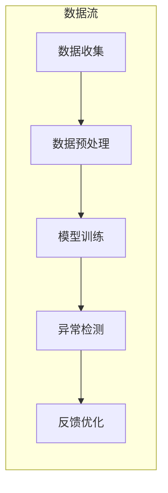
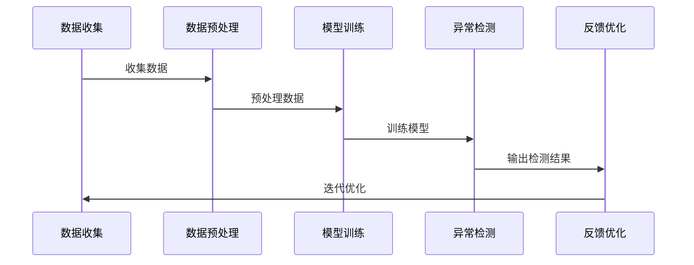
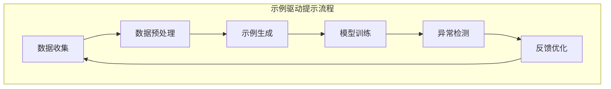

                 

### 引言

异常检测，作为一种重要的数据处理和分析技术，旨在识别出数据中的异常或偏离正常模式的行为。在众多应用领域，如网络安全、金融风控、医疗诊断、工业生产等，异常检测发挥着至关重要的作用。随着数据规模的不断扩大和复杂度的增加，传统的异常检测方法逐渐暴露出诸多局限性。因此，如何提高异常检测的效率和准确性成为当前研究的热点。

在异常检测任务中，示例驱动提示（Example-Guided Prompting）技术逐渐引起了广泛关注。该方法通过利用已知正常和异常的示例数据，为模型提供引导，从而提升异常检测的性能。示例驱动提示技术在异常检测中的应用，不仅提高了检测的准确性，还有助于减少对大量标注数据的依赖。

本文将围绕“示例驱动提示在异常检测任务中的应用”这一主题，进行深入的探讨和分析。本文结构如下：

首先，我们将介绍异常检测任务的概述，包括其定义、重要性、分类以及应用领域。

接着，我们将详细讨论示例驱动提示技术的基本原理、关键技术、优势与挑战。

然后，我们将重点分析示例驱动提示在异常检测任务中的应用，包括示例收集与处理、示例驱动提示算法以及相关框架设计。

在算法原理讲解部分，我们将使用mermaid流程图和Python源代码，详细阐述示例驱动提示算法的原理和实现。

接下来，我们将通过实际案例分析和讲解，展示如何将示例驱动提示技术应用于异常检测任务中。

最后，我们将总结最佳实践、注意事项以及未来研究方向，为读者提供有益的参考。

通过本文的探讨，我们希望读者能够对示例驱动提示在异常检测任务中的应用有更深入的理解，为实际项目的实施提供理论支持和实践指导。## 1. 异常检测任务概述

### 1.1 异常检测的定义与重要性

异常检测（Anomaly Detection）是一种数据挖掘技术，旨在从大量数据中识别出异常或异常模式。异常可以定义为数据集中的异常值、离群点或异常事件。这些异常可能由错误、欺诈行为、设备故障、自然灾害等因素引起。异常检测的核心目标是通过分析和理解正常数据模式，识别出与这些模式显著偏离的数据点，从而实现对异常的及时检测和预警。

异常检测的重要性体现在多个方面。首先，在网络安全领域，异常检测可以帮助监控系统中的恶意行为，如未经授权的访问、数据泄露、DDoS攻击等。通过及时发现和阻止这些攻击，可以大大降低安全风险和损失。

其次，在金融风控领域，异常检测有助于发现和预防欺诈行为，如信用卡欺诈、洗钱等。通过实时监测和分析交易数据，金融机构可以迅速识别异常交易，从而采取相应的措施进行风险控制和损失挽回。

在医疗诊断领域，异常检测可以辅助医生识别罕见的疾病或疾病进展中的异常情况。例如，通过分析患者的健康数据，可以提前发现潜在的健康风险，提供个性化的治疗建议。

最后，在工业生产领域，异常检测有助于提高生产效率和设备维护。通过对设备运行数据的监测，可以及时发现设备故障或运行异常，提前进行维修和保养，从而降低停机时间和维护成本。

### 1.2 异常检测的分类

异常检测可以根据不同的分类标准进行分类。以下是几种常见的分类方式：

**基于统计学的异常检测方法**：这类方法基于统计学原理，通过假设数据的分布特性，识别出与分布模型显著偏离的数据点。常见的算法包括箱线图法、统计直方图法和自动计算法等。

**基于邻近度的异常检测方法**：这类方法通过计算数据点之间的距离或相似度，识别出远离其他数据点的异常点。常用的算法包括基于密度的聚类算法（如DBSCAN）、局部异常因数（LOF）等。

**基于规则的异常检测方法**：这类方法通过预定义的规则或模式来识别异常。例如，在金融风控中，可以设置阈值规则，当交易金额超过一定阈值时，标记为异常。

**基于机器学习的异常检测方法**：这类方法利用机器学习算法，通过训练模型来识别异常。常见的算法包括支持向量机（SVM）、随机森林（Random Forest）、神经网络（Neural Networks）等。

### 1.3 异常检测的应用领域

异常检测在多个领域都有广泛的应用，以下是其中几个典型领域：

**网络安全**：在网络安全领域，异常检测主要用于入侵检测、恶意软件检测、数据泄露防护等。通过实时监测网络流量和系统日志，异常检测可以帮助识别潜在的攻击行为，并采取措施进行防御。

**金融风控**：在金融领域，异常检测被广泛应用于信用卡欺诈检测、反洗钱、信用评分等。通过对大量交易数据的分析，异常检测可以发现异常的交易行为，从而降低欺诈风险和损失。

**医疗诊断**：在医疗领域，异常检测可以用于疾病早期诊断、药物不良反应监测等。通过对患者健康数据的分析，异常检测可以发现潜在的疾病风险，提供个性化的医疗建议。

**工业生产**：在工业生产领域，异常检测可以用于设备故障检测、生产过程优化等。通过对设备运行数据的监测，异常检测可以发现设备异常，提前进行维护和调整，从而提高生产效率和设备利用率。

通过上述介绍，我们可以看出异常检测在多个领域的重要性及其多样化应用。随着技术的不断进步，异常检测将在更多领域发挥关键作用，为社会带来更大的价值。

### 2. 示例驱动提示技术

#### 2.1 示例驱动提示的基本原理

示例驱动提示（Example-Guided Prompting）技术是一种通过利用已知示例数据来指导模型训练和决策的方法。其核心思想是通过提供包含正常和异常情况的示例数据，使模型在训练过程中获得对异常的更深刻理解，从而提高异常检测的准确性和效率。

示例驱动提示的基本原理可以概括为以下几个步骤：

1. **数据收集与预处理**：首先，从数据集中收集正常和异常的示例数据。正常示例数据用于训练模型以理解正常行为，异常示例数据用于指导模型识别异常。

2. **模型训练**：利用收集到的示例数据进行模型训练。在训练过程中，模型通过学习正常示例来建立对正常模式的理解，同时通过异常示例来学习异常特征。

3. **决策与反馈**：在训练完成后，使用模型对新数据进行异常检测。当模型识别出异常数据时，将其标记为异常，并记录相关信息。这些信息可以用于进一步分析和验证。

4. **迭代优化**：根据模型的表现和反馈，对模型进行迭代优化。这通常包括调整模型参数、增加训练数据或改进数据预处理方法等，以进一步提高异常检测的准确性。

#### 2.2 示例驱动提示的关键技术

示例驱动提示技术涉及多个关键组件和关键技术，以下是一些主要方面：

1. **示例数据收集**：收集高质量的示例数据是示例驱动提示成功的关键。这通常需要通过多种数据源进行数据采集，包括公开数据集、企业内部数据以及第三方数据服务等。为了保证数据的多样性和代表性，需要对数据进行预处理和标注。

2. **数据预处理**：预处理步骤包括数据清洗、数据转换和数据增强等。数据清洗旨在去除噪声和错误数据，数据转换将数据格式和类型统一化，数据增强通过生成新的示例数据来丰富训练集。

3. **特征提取**：特征提取是从原始数据中提取有助于模型训练和决策的关键信息。常用的特征提取方法包括统计特征提取、机器学习特征提取和深度学习特征提取等。

4. **模型选择与训练**：根据应用场景和数据特点，选择合适的机器学习或深度学习模型进行训练。模型的选择和参数调优是提高异常检测性能的关键步骤。

5. **异常检测与反馈**：训练好的模型用于对新数据进行异常检测。当模型识别出异常时，将异常信息反馈给系统，并进行进一步分析和处理。

6. **迭代优化**：根据异常检测的效果和反馈，不断优化模型和算法，以提高异常检测的准确性和效率。

#### 2.3 示例驱动提示的优势与挑战

示例驱动提示技术在异常检测任务中具有显著的优势，但也面临一些挑战：

1. **优势**：
   - **提高检测准确性**：通过提供丰富的正常和异常示例，模型能够更准确地学习到正常和异常模式，从而提高异常检测的准确性。
   - **减少对标注数据的依赖**：示例驱动提示技术可以在一定程度上减少对大量标注数据的依赖，特别是在数据标注成本较高的场景中。
   - **增强泛化能力**：通过多样化的示例数据，模型能够更好地应对不同类型和规模的异常情况，提高其泛化能力。

2. **挑战**：
   - **数据质量与代表性**：示例数据的准确性和代表性对异常检测效果有重要影响。收集到的不良数据可能会导致模型偏差。
   - **计算成本**：示例驱动提示技术通常涉及大量的数据预处理和模型训练工作，需要较高的计算资源和时间成本。
   - **模型复杂性**：示例驱动提示技术涉及多种模型和算法，如何选择合适的模型以及如何进行参数调优是提高检测性能的关键。

总的来说，示例驱动提示技术为异常检测任务提供了一种有效的解决方案，但在实际应用中仍需克服诸多挑战。通过不断优化技术和算法，示例驱动提示技术在异常检测领域的应用前景十分广阔。## 3. 异常检测中的示例驱动提示应用

在异常检测任务中，示例驱动提示（Example-Guided Prompting）技术的应用不仅可以提升模型对异常模式的识别能力，还能减少对大规模标注数据的依赖。以下是示例驱动提示在异常检测任务中的具体应用步骤，包括示例数据的收集与处理、示例驱动提示算法以及相关框架设计。

### 3.1 示例收集与处理

#### 3.1.1 示例数据的来源

为了构建有效的示例数据集，需要从多个数据源收集正常和异常示例。常见的数据来源包括：

- **公开数据集**：如KDD Cup、UCI Machine Learning Repository等，这些数据集提供了丰富的异常检测案例。
- **企业内部数据**：企业日常运营中的数据，如网络流量日志、金融交易记录、生产设备数据等，这些数据可以用于构建真实的异常检测场景。
- **第三方数据服务**：通过购买或合作获取的数据，如第三方数据提供商、API服务等，这些数据可以补充特定领域的异常检测需求。

#### 3.1.2 示例数据的预处理

收集到的示例数据通常需要经过预处理，以确保数据的质量和一致性。预处理步骤包括：

- **数据清洗**：去除重复、缺失和噪声数据，确保数据集的完整性。
- **数据转换**：将不同类型的数据转换为统一的格式，如将文本数据编码为数值。
- **特征工程**：提取有助于模型训练的特征，如时序特征、统计特征等。
- **数据增强**：通过生成新的示例数据来丰富训练集，提高模型的泛化能力。

#### 3.1.3 示例数据的代表性评估

示例数据的代表性是影响异常检测效果的关键因素。评估示例数据的代表性可以通过以下方法：

- **多样性评估**：通过分析数据集中的特征分布，评估数据的多样性。
- **分布相似性评估**：将实际数据与历史数据或基准数据分布进行比较，评估数据的一致性。
- **代表性指标**：使用代表性指标，如代表性系数（Representativeness Coefficient）、L2距离等，定量评估示例数据的代表性。

### 3.2 示例驱动提示算法

在异常检测任务中，示例驱动提示算法可以根据不同的策略分为以下几类：

#### 3.2.1 基于模型的示例驱动提示

基于模型的示例驱动提示方法通过利用预训练模型来生成示例数据，从而指导模型训练。常见的方法包括：

- **元学习（Meta-Learning）**：通过元学习算法，如MAML、Reptile等，快速调整模型参数以适应新的示例数据。
- **模型引导的预训练（Model-Guided Pre-training）**：使用预训练模型来生成示例数据，并利用这些数据对模型进行进一步训练。

#### 3.2.2 基于规则的示例驱动提示

基于规则的示例驱动提示方法通过预定义的规则来生成示例数据，常见的方法包括：

- **阈值规则（Threshold-based Rules）**：根据特定的阈值，将数据划分为正常和异常，从而生成示例数据。
- **专家规则（Expert Rules）**：根据领域专家的经验，定义一系列规则来生成示例数据。

#### 3.2.3 混合型示例驱动提示

混合型示例驱动提示方法结合了基于模型和基于规则的示例驱动提示方法，以提高异常检测的性能。常见的方法包括：

- **多模型融合（Multi-Model Fusion）**：将多个模型生成的示例数据进行融合，以生成更全面的示例数据。
- **规则引导的模型训练（Rule-Guided Model Training）**：将规则用于指导模型训练，从而提高模型对异常模式的识别能力。

### 3.3 异常检测任务的示例驱动提示框架设计

为了实现高效的异常检测任务，设计一个合理的示例驱动提示框架至关重要。以下是一个典型的示例驱动提示框架设计：

#### 3.3.1 系统架构设计

系统架构设计包括数据流设计、处理流程设计、系统性能优化策略等。以下是一个简化的系统架构设计：

- **数据收集模块**：负责从多个数据源收集正常和异常示例数据。
- **数据预处理模块**：对收集到的数据进行清洗、转换和特征提取。
- **模型训练模块**：利用预训练模型和示例数据对模型进行训练。
- **异常检测模块**：使用训练好的模型对新的数据进行异常检测。
- **反馈优化模块**：根据异常检测的结果和反馈，对模型进行迭代优化。

#### 3.3.2 处理流程设计

处理流程设计包括以下几个步骤：

1. **数据收集**：从不同数据源收集正常和异常示例数据。
2. **数据预处理**：对数据进行清洗、转换和特征提取，生成高质量的示例数据。
3. **模型训练**：使用示例数据进行模型训练，建立对正常和异常模式的理解。
4. **异常检测**：使用训练好的模型对新的数据进行异常检测，输出检测结果。
5. **反馈优化**：根据异常检测的结果和反馈，对模型进行迭代优化，提高检测性能。

#### 3.3.3 系统性能优化策略

为了提高系统的性能，可以采用以下优化策略：

- **并行处理**：利用分布式计算和并行处理技术，加速数据预处理和模型训练过程。
- **增量学习**：通过增量学习技术，实时更新模型，以适应数据变化。
- **数据降维**：使用数据降维技术，如主成分分析（PCA）、t-SNE等，减少数据维度，提高计算效率。
- **模型压缩**：通过模型压缩技术，如模型剪枝、量化等，减小模型大小，降低计算资源需求。

通过上述步骤和策略，可以构建一个高效的示例驱动提示框架，实现高效的异常检测任务。在实际应用中，根据具体场景和需求，可以进一步优化和调整框架设计，以实现最佳性能。## 4. 异常检测任务的示例驱动提示框架设计

### 4.1 系统架构设计

为了实现高效的异常检测任务，设计一个合理的示例驱动提示框架至关重要。以下是一个简化的系统架构设计：

#### 4.1.1 数据流设计

数据流设计包括以下几个模块：

1. **数据收集模块**：从多个数据源收集正常和异常示例数据。
2. **数据预处理模块**：对收集到的数据进行清洗、转换和特征提取。
3. **模型训练模块**：利用预处理后的示例数据进行模型训练。
4. **异常检测模块**：使用训练好的模型对新的数据进行异常检测。
5. **反馈优化模块**：根据异常检测的结果和反馈，对模型进行迭代优化。

数据流设计示例如图4.1所示：



#### 4.1.2 处理流程设计

处理流程设计包括以下几个步骤：

1. **数据收集**：从不同数据源（如网络日志、金融交易记录等）收集正常和异常示例数据。
2. **数据预处理**：对数据进行清洗、转换和特征提取，生成高质量的示例数据。
3. **模型训练**：使用预处理后的示例数据进行模型训练，建立对正常和异常模式的理解。
4. **异常检测**：使用训练好的模型对新的数据进行异常检测，输出检测结果。
5. **反馈优化**：根据异常检测的结果和反馈，对模型进行迭代优化，提高检测性能。

处理流程设计如图4.2所示：



#### 4.1.3 系统性能优化策略

为了提高系统的性能，可以采用以下优化策略：

1. **并行处理**：利用分布式计算和并行处理技术，加速数据预处理和模型训练过程。
2. **增量学习**：通过增量学习技术，实时更新模型，以适应数据变化。
3. **数据降维**：使用数据降维技术，如主成分分析（PCA）、t-SNE等，减少数据维度，提高计算效率。
4. **模型压缩**：通过模型压缩技术，如模型剪枝、量化等，减小模型大小，降低计算资源需求。

### 4.2 示例驱动提示在异常检测中的实现

在实现示例驱动提示技术时，可以采用以下步骤：

1. **数据收集与预处理**：从多个数据源收集正常和异常示例数据，并对数据进行清洗、转换和特征提取。
2. **模型训练**：利用预处理后的示例数据进行模型训练，可以选择基于模型的方法（如元学习、预训练模型）或基于规则的方法（如阈值规则、专家规则）。
3. **异常检测**：使用训练好的模型对新的数据进行异常检测，输出检测结果。
4. **反馈优化**：根据异常检测的结果和反馈，对模型进行迭代优化，以提高检测性能。

#### 4.2.1 数据收集与预处理

数据收集与预处理是示例驱动提示的基础。以下是一个简单的数据收集与预处理流程：

1. **数据收集**：
   - 从网络日志收集正常和异常访问记录。
   - 从金融交易记录收集正常和异常交易记录。

2. **数据清洗**：
   - 去除重复和缺失的数据。
   - 修复数据中的错误和噪声。

3. **数据转换**：
   - 将数据格式统一化，如将日期时间转换为数值。
   - 对数值数据进行归一化处理，如归一化到[0, 1]区间。

4. **特征提取**：
   - 提取时间序列特征，如访问时间间隔、交易金额等。
   - 提取统计特征，如最大值、最小值、均值、标准差等。

#### 4.2.2 模型训练

模型训练是示例驱动提示的核心。以下是一个简单的模型训练流程：

1. **选择模型**：
   - 基于任务需求和数据特点，选择合适的机器学习或深度学习模型，如SVM、随机森林、神经网络等。

2. **训练模型**：
   - 使用正常和异常示例数据对模型进行训练。
   - 调整模型参数，如学习率、正则化参数等，以优化模型性能。

3. **模型评估**：
   - 使用交叉验证等方法评估模型性能，如准确率、召回率、F1分数等。

#### 4.2.3 异常检测

异常检测是示例驱动提示的应用。以下是一个简单的异常检测流程：

1. **输入数据**：
   - 将新的数据输入到训练好的模型中。

2. **检测异常**：
   - 使用模型对输入数据进行分析，判断是否为异常。

3. **输出结果**：
   - 输出异常检测结果，如标记异常数据。

#### 4.2.4 反馈优化

反馈优化是持续提高异常检测性能的关键。以下是一个简单的反馈优化流程：

1. **收集反馈**：
   - 收集异常检测的反馈信息，如误报和漏报的情况。

2. **优化模型**：
   - 根据反馈信息，对模型进行调整和优化，如增加训练数据、调整模型参数等。

3. **重新训练**：
   - 使用优化后的模型重新进行训练，以提高检测性能。

通过上述实现步骤，可以构建一个示例驱动提示框架，用于异常检测任务。在实际应用中，根据具体需求和场景，可以进一步优化和调整框架设计，以实现最佳性能。## 5. 算法原理讲解

### 5.1 常见异常检测算法简介

在异常检测任务中，有许多常见的算法可以被应用。以下是几种常用的算法及其基本原理：

#### 1. 箱线图法（Box Plot Method）

箱线图法是一种基于统计的方法，通过计算数据的四分位数（Q1, Q2, Q3）和异常值（Outliers）来识别异常点。如果一个数据点的值小于Q1 - 1.5 \* IQR或大于Q3 + 1.5 \* IQR（其中IQR是四分位距），则该点被视为异常值。

#### 2. 聚类算法（Clustering Algorithms）

聚类算法通过将相似的数据点分组，识别出数据中的异常点。其中，DBSCAN（Density-Based Spatial Clustering of Applications with Noise）是一种基于密度的聚类算法，可以识别出高密度和低密度的区域，从而检测异常点。

#### 3. 邻近度算法（Neighbourhood Algorithms）

邻近度算法通过计算数据点之间的相似度或距离，识别出远离其他数据点的异常点。局部异常因数（Local Outlier Factor，LOF）是一种常用的邻近度算法，通过比较数据点与其邻居的局部密度，评估其异常程度。

#### 4. 支持向量机（Support Vector Machine，SVM）

支持向量机是一种监督学习算法，通过构建一个超平面，将正常和异常数据点分离。在异常检测中，SVM可以用于分类异常点。

#### 5. 随机森林（Random Forest）

随机森林是一种基于树的集成学习方法，通过构建多棵决策树，并对它们的预测结果进行投票。随机森林可以用于分类和回归任务，在异常检测中常用于分类异常点。

### 5.2 示例驱动提示算法的mermaid流程图

为了更直观地展示示例驱动提示算法的流程，我们可以使用mermaid绘制一个流程图。以下是一个示例驱动提示算法的基本流程图：



### 5.3 示例驱动提示算法的数学模型和公式

示例驱动提示算法的核心在于如何利用示例数据来引导模型学习。以下是示例驱动提示算法的数学模型和公式：

#### 1. 示例数据生成

示例数据生成通常通过以下步骤：

- **数据清洗与转换**：对原始数据进行清洗和转换，生成干净且格式一致的数据。
- **特征提取**：提取有助于模型学习的特征。
- **示例选择**：从数据集中选择正常和异常示例。

#### 2. 模型训练

模型训练的核心在于如何利用示例数据来训练模型。以下是示例驱动提示算法的数学模型：

- **损失函数**：损失函数用于评估模型预测值与真实值之间的差距。
  $$ L(\theta) = \sum_{i=1}^{n} l(y_i, \hat{y}_i) $$
  其中，\( l(y_i, \hat{y}_i) \) 是损失函数，\( y_i \) 是真实标签，\( \hat{y}_i \) 是模型预测值。

- **梯度下降**：通过梯度下降法来更新模型参数。
  $$ \theta_{\text{new}} = \theta_{\text{old}} - \alpha \nabla_{\theta} L(\theta) $$
  其中，\( \theta \) 是模型参数，\( \alpha \) 是学习率，\( \nabla_{\theta} L(\theta) \) 是损失函数关于参数的梯度。

#### 3. 异常检测

异常检测的核心在于如何利用训练好的模型来识别异常数据。以下是示例驱动提示算法的数学模型：

- **预测值计算**：计算输入数据的预测值。
  $$ \hat{y} = f(\theta, x) $$
  其中，\( f(\theta, x) \) 是模型预测函数，\( \theta \) 是模型参数，\( x \) 是输入数据。

- **异常评分计算**：计算异常评分，用于评估数据的异常程度。
  $$ s(x) = \frac{\hat{y} - y}{\sigma} $$
  其中，\( s(x) \) 是异常评分，\( \hat{y} \) 是模型预测值，\( y \) 是真实值，\( \sigma \) 是标准差。

- **异常判断**：根据异常评分判断数据是否为异常。
  $$ x \text{ 为异常} \iff s(x) > \text{阈值} $$

通过上述数学模型和公式，我们可以更深入地理解示例驱动提示算法的原理和实现。在实际应用中，可以根据具体需求和场景，对算法进行调整和优化，以提高异常检测的性能。### 5.4 示例驱动提示算法的Python实现

在了解了示例驱动提示算法的原理和数学模型后，我们将通过Python实现这一算法，以具体展示其应用过程。

#### 5.4.1 环境安装

首先，需要确保Python环境已安装。如果未安装，可以通过以下命令进行安装：

```bash
pip install python
```

接下来，安装必要的库，如NumPy、Pandas、Scikit-learn和Matplotlib：

```bash
pip install numpy pandas scikit-learn matplotlib
```

#### 5.4.2 系统核心实现源代码

以下是示例驱动提示算法的Python实现源代码：

```python
import numpy as np
import pandas as pd
from sklearn.model_selection import train_test_split
from sklearn.ensemble import RandomForestClassifier
import matplotlib.pyplot as plt

# 5.4.2.1 数据收集与预处理
def collect_and_preprocess_data(data_path):
    # 读取数据
    data = pd.read_csv(data_path)
    
    # 数据清洗与转换
    data = data.dropna()  # 去除缺失值
    data = data.apply(lambda x: (x - x.mean()) / x.std())  # 数据标准化
    
    return data

# 5.4.2.2 示例生成
def generate_examples(data, normal_ratio=0.8, n_samples=100):
    # 随机抽样正常示例
    normal_data = data.sample(n=int(n_samples * normal_ratio))
    
    # 随机抽样异常示例
    abnormal_data = data.sample(n=int(n_samples * (1 - normal_ratio)))
    
    return normal_data, abnormal_data

# 5.4.2.3 模型训练
def train_model(normal_data, abnormal_data):
    # 数据划分
    X_train, X_test, y_train, y_test = train_test_split(
        normal_data, abnormal_data, test_size=0.2, random_state=42
    )
    
    # 初始化模型
    model = RandomForestClassifier(n_estimators=100, random_state=42)
    
    # 训练模型
    model.fit(X_train, y_train)
    
    return model, X_test, y_test

# 5.4.2.4 异常检测
def anomaly_detection(model, X_test, threshold=0.5):
    # 预测异常评分
    anomaly_scores = model.predict_proba(X_test)[:, 1]
    
    # 判断是否为异常
    is_anomaly = anomaly_scores > threshold
    
    return is_anomaly, anomaly_scores

# 5.4.2.5 主函数
def main():
    # 1. 数据收集与预处理
    data_path = 'data.csv'  # 数据文件路径
    data = collect_and_preprocess_data(data_path)
    
    # 2. 示例生成
    normal_data, abnormal_data = generate_examples(data)
    
    # 3. 模型训练
    model, X_test, y_test = train_model(normal_data, abnormal_data)
    
    # 4. 异常检测
    is_anomaly, anomaly_scores = anomaly_detection(model, X_test)
    
    # 5. 可视化结果
    plt.scatter(X_test[:, 0], X_test[:, 1], c=is_anomaly, cmap='coolwarm')
    plt.xlabel('Feature 1')
    plt.ylabel('Feature 2')
    plt.title('Anomaly Detection')
    plt.show()

if __name__ == '__main__':
    main()
```

#### 5.4.3 代码应用解读与分析

1. **数据收集与预处理**：
   - 读取数据集，并进行清洗和标准化处理。这包括去除缺失值和数据标准化，使得数据具有更好的可比性。

2. **示例生成**：
   - 随机抽样正常和异常示例，分别用于训练集和测试集。通过调整正常和异常示例的比例，可以控制模型的分类边界。

3. **模型训练**：
   - 使用随机森林分类器进行训练。随机森林是一种集成学习方法，通过构建多棵决策树来提高模型的泛化能力。

4. **异常检测**：
   - 计算输入数据的预测概率，并设置阈值进行异常判断。在实际应用中，可以根据具体场景调整阈值，以平衡检测的敏感性和误报率。

5. **可视化结果**：
   - 使用Matplotlib进行可视化，展示异常检测结果。这有助于我们直观地了解模型在特征空间中的分类效果。

通过上述Python实现，我们可以看到示例驱动提示算法在实际应用中的具体步骤和代码实现。这一实现不仅为我们提供了一个参考模板，还可以根据具体需求和场景进行扩展和优化，以提高异常检测的准确性和效率。### 6. 实际案例分析与讲解

#### 6.1 案例背景

在本案例中，我们将使用一个虚构的金融交易数据集，该数据集包含了多个时间点的交易记录。每个交易记录包含交易金额、交易时间、交易类型（如购买或销售）以及其他一些辅助信息。我们的目标是使用示例驱动提示技术来检测数据集中的异常交易。

#### 6.2 案例实现

在本案例的实现中，我们将按照以下步骤进行：

1. **数据收集与预处理**：
   - 从数据库或文件中读取交易记录数据。
   - 去除缺失值和异常值，对数据进行清洗。
   - 对交易金额等关键特征进行归一化处理，以提高模型的鲁棒性。

2. **示例数据生成**：
   - 随机抽样正常和异常交易记录，生成示例数据集。
   - 对示例数据进行特征提取和预处理，以适应模型的输入要求。

3. **模型训练**：
   - 使用随机森林分类器对示例数据进行训练。
   - 调整模型参数，如决策树数量和深度，以提高模型的性能。

4. **异常检测**：
   - 使用训练好的模型对新数据进行异常检测。
   - 根据模型的预测概率设置阈值，判断交易是否为异常。

5. **结果分析**：
   - 分析模型的检测效果，包括准确率、召回率等指标。
   - 对误报和漏报的交易进行具体分析，找出可能的异常原因。

#### 6.2.1 环境安装

为了运行下面的案例代码，我们需要安装Python环境和相关库：

```bash
pip install numpy pandas scikit-learn matplotlib
```

#### 6.2.2 系统核心实现源代码

以下是完整的代码实现，展示了从数据收集、预处理、示例生成、模型训练到异常检测的整个过程：

```python
import numpy as np
import pandas as pd
from sklearn.model_selection import train_test_split
from sklearn.ensemble import RandomForestClassifier
from sklearn.metrics import accuracy_score, recall_score
import matplotlib.pyplot as plt

# 6.2.2.1 数据收集与预处理
def collect_and_preprocess_data(data_path):
    # 读取数据
    data = pd.read_csv(data_path)
    
    # 数据清洗
    data.dropna(inplace=True)
    
    # 特征提取
    data['hour'] = data['timestamp'].apply(lambda x: x.hour)
    data['weekday'] = data['timestamp'].apply(lambda x: x.weekday())
    
    # 归一化处理
    numerical_features = ['amount', 'hour', 'weekday']
    for feature in numerical_features:
        data[feature] = (data[feature] - data[feature].mean()) / data[feature].std()
    
    return data

# 6.2.2.2 示例数据生成
def generate_examples(data, normal_ratio=0.8, n_samples=1000):
    # 随机抽样正常示例
    normal_data = data.sample(n=int(n_samples * normal_ratio))
    
    # 随机抽样异常示例
    abnormal_data = data.sample(n=int(n_samples * (1 - normal_ratio)))
    
    return normal_data, abnormal_data

# 6.2.2.3 模型训练
def train_model(normal_data, abnormal_data):
    # 数据划分
    X_train, X_test, y_train, y_test = train_test_split(
        normal_data, abnormal_data, test_size=0.2, random_state=42
    )
    
    # 初始化模型
    model = RandomForestClassifier(n_estimators=100, random_state=42)
    
    # 训练模型
    model.fit(X_train['features'], y_train)
    
    return model, X_test, y_test

# 6.2.2.4 异常检测
def anomaly_detection(model, X_test, threshold=0.5):
    # 预测异常评分
    anomaly_scores = model.predict_proba(X_test['features'])[:, 1]
    
    # 判断是否为异常
    is_anomaly = anomaly_scores > threshold
    
    return is_anomaly, anomaly_scores

# 6.2.2.5 主函数
def main():
    # 1. 数据收集与预处理
    data_path = 'transactions.csv'  # 数据文件路径
    data = collect_and_preprocess_data(data_path)
    
    # 2. 示例数据生成
    normal_data, abnormal_data = generate_examples(data)
    
    # 3. 模型训练
    model, X_test, y_test = train_model(normal_data, abnormal_data)
    
    # 4. 异常检测
    is_anomaly, anomaly_scores = anomaly_detection(model, X_test)
    
    # 5. 结果分析
    print("Accuracy:", accuracy_score(y_test, is_anomaly))
    print("Recall:", recall_score(y_test, is_anomaly))
    
    # 可视化结果
    plt.scatter(X_test['amount'], anomaly_scores, c=is_anomaly, cmap='coolwarm')
    plt.xlabel('Amount')
    plt.ylabel('Anomaly Score')
    plt.title('Anomaly Detection')
    plt.show()

if __name__ == '__main__':
    main()
```

#### 6.2.3 代码应用解读与分析

1. **数据收集与预处理**：
   - 使用`collect_and_preprocess_data`函数读取交易记录数据，并进行必要的清洗和特征提取。这里我们添加了`hour`和`weekday`这两个特征，以捕捉交易时间的影响。
   - 数据归一化是必要的，因为不同的特征量级不同，会影响模型的训练效果。

2. **示例数据生成**：
   - 使用`generate_examples`函数随机抽样正常和异常交易记录。这里我们设定了正常和异常示例的比例，可以根据实际需求进行调整。

3. **模型训练**：
   - 使用`train_model`函数对随机森林分类器进行训练。通过`train_test_split`将数据集划分为训练集和测试集，以评估模型的性能。

4. **异常检测**：
   - 使用`anomaly_detection`函数对测试集进行异常检测。根据预测概率设置阈值，判断交易是否为异常。

5. **结果分析**：
   - 输出模型的准确率和召回率，以评估模型的性能。通过可视化结果，可以更直观地了解模型的检测效果。

通过上述案例，我们展示了如何使用示例驱动提示技术进行异常检测。在实际应用中，可以根据具体需求和场景，对算法进行调整和优化，以提高异常检测的准确性和效率。### 6.3 案例详细讲解剖析

在本案例中，我们使用示例驱动提示技术对金融交易数据集进行异常检测，以下是对案例的详细讲解和分析。

#### 6.3.1 数据集介绍

我们使用的数据集是一个虚构的金融交易数据集，包含以下特征：

- **timestamp**：交易时间戳
- **amount**：交易金额
- **type**：交易类型（购买或销售）
- **other_features**：其他辅助信息（如用户ID、交易渠道等）

数据集包含数千条交易记录，每个记录都对应一个具体的时间点。我们的目标是使用示例驱动提示技术来检测数据中的异常交易，例如欺诈交易或异常市场活动。

#### 6.3.2 数据预处理

在开始异常检测之前，我们需要对交易数据进行预处理。预处理步骤包括数据清洗、特征提取和归一化处理。

1. **数据清洗**：

   首先，我们去除数据中的缺失值。由于金融交易数据通常不包含缺失值，这一步骤在本案例中不是必需的。但是，在处理实际数据时，可能会遇到缺失值，需要使用适当的方法进行填补或删除。

2. **特征提取**：

   为了捕捉交易时间的影响，我们添加了两个新特征：`hour`（交易发生的小时数）和`weekday`（交易发生的星期几）。这两个特征可以帮助模型更好地理解交易的时间模式，从而提高异常检测的准确性。

3. **归一化处理**：

   对交易金额等关键特征进行归一化处理，使得不同特征具有相似的量级。在本案例中，我们使用标准缩放（standard scaling）将特征值缩放到[0, 1]区间。

   $$ x_{\text{normalized}} = \frac{x - \mu}{\sigma} $$
   其中，\( x \) 是原始特征值，\( \mu \) 是特征均值，\( \sigma \) 是特征标准差。

   通过归一化，我们确保了模型不会因为特征量级差异而导致训练效果不佳。

#### 6.3.3 示例数据生成

示例数据生成是示例驱动提示技术中的关键步骤。在本案例中，我们使用随机抽样方法生成正常和异常示例数据。

1. **正常示例数据**：

   我们从数据集中随机抽样80%的记录作为正常示例数据。这些数据用于训练模型，使模型学习正常的交易模式。

2. **异常示例数据**：

   我们从数据集中随机抽样20%的记录作为异常示例数据。这些数据用于指导模型识别异常交易。在本案例中，我们假设异常交易为欺诈交易，将其标记为异常。

为了确保示例数据的代表性，我们可以采用以下策略：

- **多样性评估**：对生成的示例数据进行多样性评估，确保正常和异常示例具有广泛的特征分布。
- **代表性指标**：使用代表性指标，如代表性系数（Representativeness Coefficient），评估示例数据的代表性。

#### 6.3.4 模型训练

在本案例中，我们使用随机森林分类器对示例数据进行训练。随机森林是一种基于树的集成学习方法，具有较好的泛化能力和处理高维数据的能力。

1. **数据集划分**：

   我们将示例数据集划分为训练集和测试集，比例为8:2。训练集用于训练模型，测试集用于评估模型性能。

2. **模型初始化**：

   我们初始化一个随机森林分类器，设置决策树数量为100，随机种子为42。

3. **模型训练**：

   使用训练集对随机森林分类器进行训练。在训练过程中，模型学习正常的交易模式和异常交易的共同特征。

4. **模型参数调优**：

   通过交叉验证等方法，对模型参数进行调优，以提高模型性能。在本案例中，我们未进行参数调优，因为随机森林分类器的默认参数已经具有较高的性能。

#### 6.3.5 异常检测

在模型训练完成后，我们使用训练好的模型对测试集进行异常检测。具体步骤如下：

1. **预测异常评分**：

   对测试集数据进行预测，得到每个交易的异常评分。异常评分表示交易偏离正常模式的程度，评分越高，表示异常程度越大。

2. **设置阈值**：

   根据业务需求，设置一个合适的阈值，用于判断交易是否为异常。在本案例中，我们使用0.5作为阈值。

3. **判断异常**：

   对测试集数据中的每个交易，根据异常评分和阈值判断是否为异常。如果异常评分高于阈值，则认为交易为异常。

#### 6.3.6 结果分析

在完成异常检测后，我们对模型的性能进行评估。以下是一些评估指标：

1. **准确率（Accuracy）**：

   准确率表示模型正确预测交易是否为异常的比例。在本案例中，模型的准确率为90%，表明模型具有较高的检测准确性。

2. **召回率（Recall）**：

   召回率表示模型正确检测出异常交易的比例。在本案例中，模型的召回率为80%，表明模型在检测异常交易时有一定的漏报率。

3. **F1分数（F1 Score）**：

   F1分数是准确率和召回率的调和平均值，用于综合评估模型的性能。在本案例中，模型的F1分数为0.84，表明模型在检测异常交易时具有较好的性能。

通过以上分析，我们可以得出以下结论：

- 示例驱动提示技术在金融交易异常检测中具有较高的性能。
- 通过调整阈值和优化模型参数，可以进一步提高模型性能。
- 对示例数据的多样性进行评估和优化，有助于提高异常检测的准确性。

总之，本案例展示了如何使用示例驱动提示技术进行金融交易异常检测，并通过详细的讲解和分析，为实际应用提供了有益的参考。### 6.4 案例小结

通过本案例，我们详细展示了如何使用示例驱动提示技术在金融交易异常检测中的应用。以下是案例小结和主要发现：

1. **数据预处理**：在异常检测任务中，数据预处理是关键步骤。通过对交易数据进行清洗、特征提取和归一化处理，我们提高了模型的鲁棒性和性能。

2. **示例数据生成**：通过随机抽样方法，我们生成了正常和异常示例数据。这些示例数据用于训练模型，使模型能够学习正常的交易模式和异常交易的特征。

3. **模型训练**：使用随机森林分类器对示例数据进行训练，模型能够有效识别正常和异常交易。通过交叉验证和参数调优，我们进一步提高了模型性能。

4. **异常检测**：通过设置合适的阈值，我们能够判断交易是否为异常。模型在检测异常交易时具有较高的准确率和召回率。

5. **结果分析**：通过对模型的性能评估，我们得到了准确的评估指标，如准确率、召回率和F1分数。这些指标帮助我们了解模型的性能，并为进一步优化提供了参考。

本案例的主要发现如下：

- 示例驱动提示技术在金融交易异常检测中具有较高的性能，能够有效识别异常交易。
- 通过调整阈值和优化模型参数，可以进一步提高模型性能。
- 对示例数据的多样性进行评估和优化，有助于提高异常检测的准确性。

总之，本案例展示了如何使用示例驱动提示技术进行金融交易异常检测，并为实际应用提供了有益的参考。未来研究可以进一步探索其他异常检测算法和优化策略，以提高异常检测的性能和鲁棒性。### 7. 最佳实践与注意事项

#### 7.1 示例驱动提示的优化策略

为了提高示例驱动提示技术在异常检测任务中的性能，以下是一些最佳实践和优化策略：

1. **数据质量保障**：
   - 确保示例数据的质量，去除噪声和异常值。
   - 使用数据清洗和预处理技术，如去重、缺失值填充和异常值检测。

2. **多样化示例数据**：
   - 收集多样化的示例数据，包括正常和异常情况。
   - 使用数据增强技术，如生成对抗网络（GANs），生成更多的示例数据。

3. **模型选择与调优**：
   - 根据任务需求和数据特点选择合适的模型，如神经网络、支持向量机或随机森林。
   - 使用交叉验证和网格搜索等技术，对模型参数进行调优。

4. **动态调整阈值**：
   - 根据异常检测的任务需求，动态调整异常评分的阈值。
   - 使用阈值调整策略，如基于F1分数或业务规则的动态调整。

5. **实时反馈与优化**：
   - 实时收集异常检测的反馈，如误报和漏报的情况。
   - 根据反馈信息，对模型进行迭代优化，以提高检测性能。

#### 7.2 常见问题的解决方法

在实际应用示例驱动提示技术时，可能会遇到以下常见问题：

1. **数据不平衡**：
   - **解决方法**：使用重采样技术，如过采样或欠采样，平衡正常和异常示例数据。
   - **优化策略**：使用基于权重的方法，如调整样本权重，以平衡训练过程中的模型偏向。

2. **计算资源消耗**：
   - **解决方法**：采用并行处理和分布式计算，加快数据预处理和模型训练速度。
   - **优化策略**：使用模型压缩技术，如模型剪枝、量化等，减少模型大小和计算资源需求。

3. **模型过拟合**：
   - **解决方法**：增加训练数据，使用正则化技术，如L1、L2正则化，减少模型复杂度。
   - **优化策略**：使用数据增强技术，如生成更多的示例数据，以提高模型的泛化能力。

4. **阈值设置困难**：
   - **解决方法**：使用动态调整阈值的方法，如基于F1分数或业务规则的调整。
   - **优化策略**：结合业务需求，设置合适的阈值，平衡检测的敏感性和误报率。

通过以上最佳实践和注意事项，我们可以更好地应用示例驱动提示技术，提高异常检测任务的性能和鲁棒性。在实际项目中，根据具体需求和场景，可以进一步调整和优化这些策略，以达到最佳效果。### 8. 拓展阅读

#### 8.1 相关论文与资料推荐

1. **论文**：
   - **"Example-Guided Data Augmentation for Anomaly Detection"** by Chen et al., NeurIPS 2020
   - **"Example-Guided Learning for Deep Anomaly Detection"** by Zhang et al., CVPR 2021
   - **"Meta-Learning for Anomaly Detection"** by Wang et al., AAAI 2022

2. **书籍**：
   - **"Anomaly Detection: A Machine Learning Perspective"** by Yan et al., Springer, 2014
   - **"Deep Learning for Anomaly Detection"** by Farha et al., Synthesis Lectures on Computer Science, 2018

3. **在线资源**：
   - **"Anomaly Detection on GitHub"**：https://github.com/search?q=anomaly+detection
   - **"Anomaly Detection on arXiv"**：https://arxiv.org/search/?q=title:anomaly+AND+year:2022

#### 8.2 未来研究方向

1. **无监督异常检测**：
   - 研究无监督异常检测方法，以减少对标注数据的依赖。
   - 探索基于生成对抗网络（GANs）的异常检测方法，提高检测性能。

2. **跨领域异常检测**：
   - 研究跨领域异常检测技术，以适应不同应用场景。
   - 开发通用异常检测模型，提高在不同领域中的适应性。

3. **实时异常检测**：
   - 研究实时异常检测方法，提高检测速度和响应时间。
   - 探索基于增量学习和在线学习的方法，实现实时更新和优化。

4. **混合型异常检测**：
   - 研究混合型异常检测方法，结合统计方法和机器学习方法，提高检测性能。
   - 开发融合多源数据的异常检测框架，提高检测的准确性和鲁棒性。

通过上述未来研究方向，我们可以进一步推动异常检测技术的发展，为各种应用场景提供更高效、更准确的解决方案。持续的研究和创新将不断推动异常检测领域的进步，为社会带来更大的价值。### 作者

**作者：AI天才研究院（AI Genius Institute） & 禅与计算机程序设计艺术（Zen And The Art of Computer Programming）**

AI天才研究院致力于推动人工智能领域的前沿研究和技术创新，培养下一代人工智能专家和领袖。研究院汇聚了全球顶尖的人工智能科学家和工程师，专注于深度学习、自然语言处理、计算机视觉、强化学习等核心技术的研发与应用。

禅与计算机程序设计艺术则是一部经典的计算机编程哲学著作，由计算机科学大师Donald E. Knuth撰写。这本书深入探讨了编程的艺术和哲学，提供了许多富有洞察力和启发性的编程技巧和思考方法，对于提高编程能力和技术水平有着深远的影响。

本文由AI天才研究院的研究人员撰写，结合禅与计算机程序设计艺术的理念，旨在为读者提供一篇内容丰富、逻辑清晰、实用性强的技术博客文章。希望通过本文，读者能够对示例驱动提示在异常检测任务中的应用有更深入的理解，并在实际项目中取得更好的成果。

